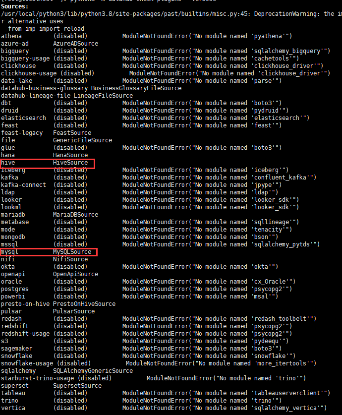
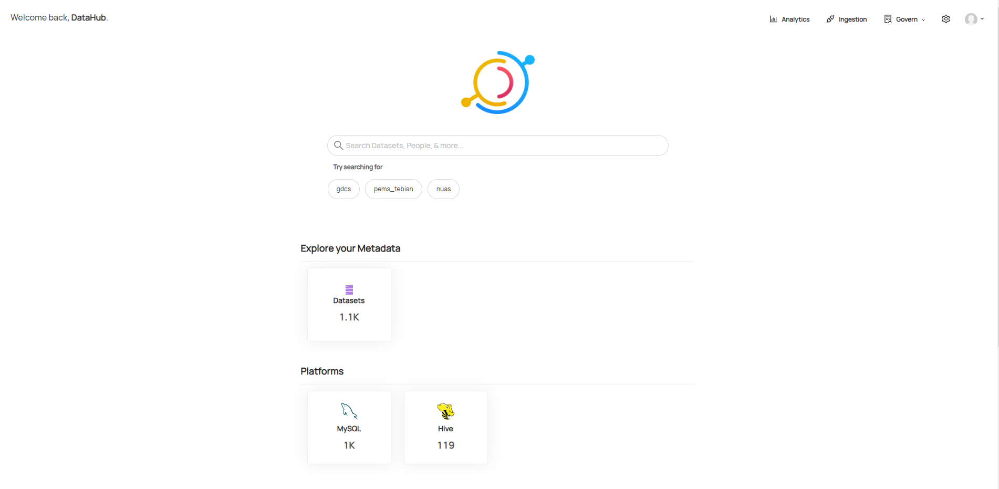

1、环境安装

要求：最小化安装的CentOS7 ，内存不小于3.8G

```shell
[root@localhost ~]# sudo yum -y install gcc
[root@localhost ~]# sudo yum install gcc-c++
[root@localhost ~]# sudo yum install libffi-devel -y
[root@localhost ~]# sudo yum install zlib* -
[root@localhost ~]# sudo yum install sqlite-devel
[root@localhost ~]# sudo yum install openssl-devel  
[root@localhost ~]# sudo yum install bzip2-devel
[root@localhost ~]# sudo yum install -y python-devel
[root@localhost ~]# sudo yum install cyrus-sasl-devel
[root@localhost ~]# more /etc/hosts
127.0.0.1   localhost localhost.localdomain localhost4 localhost4.localdomain4
::1         localhost localhost.localdomain localhost6 localhost6.localdomain6
185.199.110.133 raw.githubusercontent.com #添加地址映射，下载datahub的时候会用到，因为国内地址被封锁 
```

2、安装docker 和 dockerCompose

```shell
[root@localhost ~]# sudo yum -y install docker
[root@localhost ~]# sudo systemctl start docker
[root@localhost ~]# sudo docker run hello-world
[root@localhost ~]# curl -L "https://github.com/docker/compose/releases/download/1.27.4/docker-compose-$(uname -s)-$(uname -m)" -o /usr/local/bin/docker-compose
[root@localhost ~]# chmod +x /usr/local/bin/docker-compose
```

3、启动docker

```shell
守护进程重启
[root@localhost ~]# sudo systemctl daemon-reload
重启docker服务
[root@localhost ~]# sudo systemctl restart docker
// 然后检查启动
[root@localhost ~]# docker container ls
CONTAINER ID        IMAGE                                   COMMAND                  CREATED             STATUS                  PORTS  
```

4、安装python3

去如下地址下载python3

[https://www.python.org/ftp/python/3.8.0/](https://www.python.org/ftp/python/3.8.0/)

```shell
[root@localhost ~]# tar -zxvf Python-3.8.0.tgz
[root@localhost ~]# cd /opt/module/Python-3.8.0
[root@localhost Python-3.8.0]# vi /usr/local/python3/Python-3.6.8/Modules/Setup 、
#去掉如下四行注释
SSL=/usr/local/ssl
_ssl _ssl.c \
        -DUSE_SSL -I$(SSL)/include -I$(SSL)/include/openssl \
        -L$(SSL)/lib -lssl -lcrypto
#编译安装
[root@localhost Python-3.8.0]#  ./configure --prefix=/usr/local/python3
[root@localhost Python-3.8.0]# sudo make 
[root@localhost Python-3.8.0]# sudo make install
#创建软连接
[root@localhost Python-3.8.0]# ln -s /usr/local/python3/bin/python3 /usr/local/bin/python3
[root@localhost Python-3.8.0]# ln -s /usr/local/python3/bin/pip3 /usr/local/bin/pip3

然后可以检查是否成功，成功了可以看到以下内容
[root@localhost Python-3.8.0]# python3 -V
Python 3.8.0
[root@localhost Python-3.8.0]# pip3 -V
pip 19.2.3 from /usr/local/python3/lib/python3.8/site-packages/pip (python 3.8)
```

5、环境再次安装

```shell
[root@localhost ~]# pip3 install toml
[root@localhost ~]# pip3 install psycopg2
```

6、安装datahub

```shell
[root@localhost ~]# python3 -m pip install --upgrade pip wheel setuptools
[root@localhost ~]# python3 -m pip uninstall datahub acryl-datahub || true  # sanity check - ok if it fails
[root@localhost ~]# python3 -m pip install --upgrade acryl-datahub
[root@localhost ~]# python3 -m datahub version
```

7、启动datahub

```shell
python3 -m datahub docker quickstart
```

8、访问datahub

访问地址 http://loclhost:9002 账号：datahub 密码：datahub

8、检查插件

```shell
python3 -m datahub check plugins --verbose
```



如图，mysql和hive插件正常，如果需要安装其他模块，则根据缺少的模块，安装对应的python库即可。

9、摄入MYSQL数据

```shell
[root@localhost ~]#  pip install 'acryl-datahub[mysql]'
```

```shell
[root@localhost ~]# vi mysql.yml 
source:
  type: mysql
  config:
    host_port: 10.8.106.102:3306
    username: root
    password: Nucleus0755!
    database: domp
```

```shell
[root@localhost ~]# python3 -m datahub ingest -c mysql.yml 
```

10、摄入HIVE数据

```shell
[root@localhost ~]# pip install 'acryl-datahub[hive]'
```

```shell
[root@localhost ~]# vi hive.yml 
source:
  type: hive
  config:
    host_port: 10.8.106.103:10000
```

```shell
[root@localhost ~]# python3 -m datahub ingest -c hive.yml 
```

11、界面展示


