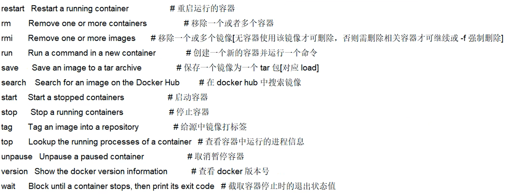
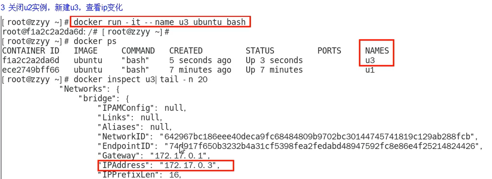

# Docker基础篇

## Docker基本介绍

Docker解决了运行环境和配置问题的软件容器，方便做持续集成并有助于整体发布的容器虚拟技术。

### docker容器化和传统虚拟化对比

1. 传统虚拟机技术是虚拟出一套硬件后，在其上运行一个完整操作系统，在该系统上再运行所需应用进程。
2. 容器内的应用进程直接运行于宿主的内核，容器内没有自己的内核且也没有进行硬件虚拟。因此容器要比传统虚拟机更为轻便。*每个容器之间互相隔离，每个容器有自己的文件系统，容器之间进程不会相互影响，能区分计算资源。

### **为什么docker比VM虚拟机快?**

1. docker有着比虚拟机更少的抽象层

   由于docker不需要Hypervisor(虚拟机)实现硬件资源虚拟化,运行在docker容器上的程序直接使用的都是实际物理机的硬件资源。因此在CPU、内存利用率上docker将会在效率上有明显优势。

2. docker利用的是宿主机的内核,而不需要加载操作系统OS内核

   当新建一个容器时 ,docker不需要和虚拟机一样重新加载一个操作系统内核。进而避免引寻、加载操作系统内核返回等比较费时费资源的过程,当新建一个虚拟机时,虚拟机软件需要加载OS,返回新建过程是分钟级别的。而docker由于直接利用宿主机的操作系统,则省略了返回过程,因此新建一个docker容器只需要几秒钟。


### 官网与仓库


**docker hub：**docker 安装镜像的仓库

### 安装所需环境


### 基本组成

镜像、容器、仓库 三要素 ，仓库存储镜像，容器是镜像的实例。

#### 镜像


#### 容器


#### 仓库


#### 总结


## Docker架构与工作原理

### 入门版


### 架构版


## 安装步骤

参考官网：https://docs.docker.com/engine/install/centos/

1. 确保Centos7以上版本

2. 卸载旧版本

   ```shell
   sudo yum remove docker \
                    docker-client \
                    docker-client-latest \
                    docker-common \
                    docker-latest \
                    docker-latest-logrotate \
                    docker-logrotate \
                    docker-engine
   ```

3. yum安装gcc相关依赖

   ```shell
   sudo yum -y install gcc
   sudo yum -y install gcc-c++
   ```

4. 安装需要的软件包

   ```shell
   sudo yum install -y yum-utils
    ## 不建议使用原生国外仓库
   sudo yum-config-manager \
      --add-repo \
      https://download.docker.com/linux/centos/docker-ce.repo 
    ## 建议使用阿里云仓库
   sudo yum-config-manager --add-repo http://mirrors.aliyun.com/docker-ce/linux/centos/docker-ce.repo
   ```

5. 更新yum 软件包索引

   ```shell
   sudo yum makecache fast
   ```

6. 安装docker引擎

   ```shell
   sudo yum install docker-ce docker-ce-cli containerd.io docker-compose-plugin
   ```

7. 启动docker

   ```shell
   sudo systemctl start docker
   sudo docker run hello-world
   docker version
   ```

8. 卸载

   ```shell
   systemctl stop docker
   sudo yum remove docker-ce docker-ce-cli containerd.io docker-compose-plugin
   sudo rm -rf /var/lib/docker
   sudo rm -rf /var/lib/containerd
   ```

## 阿里云镜像加速


```shell
sudo mkdir -p /etc/docker
sudo tee /etc/docker/daemon.json <<-'EOF'
{
  "registry-mirrors": ["https://g2mvwk3a.mirror.aliyuncs.com"]
}
EOF
sudo systemctl daemon-reload
sudo systemctl restart docker
```

## Docker run 流程图


## Docker常用命令

### 帮助启动类命令

```shell
启动docker: systemctl start docker
停止docker: systemctl stop docker
重启docker: systemctl restart docker
查看docker状态: systemctl status docker
开机启动: systemctl enable docker
查看docker概要信息: docker info
查看容器状态信息：docker stats
查看docker总体帮助文档: docker --help
查看docker命令帮助文档: docker 具体命令--help
```

### 镜像命令

#### docker images

列出本地主机上的镜像


**OPTIONS说明：**

​		-a：列出本地所有的镜像（含历史映像层）

​		-q:   只显示镜像ID

#### docker search [OPTIONS]  镜像名称

查找镜像：https://hub.docker.com


**OPTIONS说明：**

--limit：只列出N个镜像，默认25个

#### docker pull 镜像名称[:TAG]

下载镜像：没有TAG就是最新版等价于 docker pull 镜像名字:latest


#### docker system df

查询镜像/容器/数据卷所占的空间


#### docker rmi 镜像ID

删除镜像


删除单个：docker rmi -f 镜像ID

删除多个：docker rmi -f 镜像ID1 镜像ID2  或者  docker rmi -f 镜像名1:TAG 镜像名2:TAG

删除全部：docker rmi -f ${docker images -qa}

#### docker的虚悬镜像是什么？

 仓库名、标签都是<none>的镜像，俗称虚悬镜像dangling image


### 容器命令

#### docker run [OPTIONS]  镜像ID/容器名  [COMMAND] [ARG...]

新建+启动容器

##### OPTIONS说明

​		


##### 启动交互式容器（前台命令行）

* docker run -it ubuntu bash


运行进去容器，退出退出，容器停止

运行进去容器，ctrl+p+q退出，容器不停止

##### 启动守护式容器（后台服务器）

在大部分的场景下，我们希望docker的服务是在后台运行的,我们可以过-d指定容器的后台运行模式。

* docker run -d 容器名

​	

#### docker ps [OPTIONS]

列出当前所有正在运行的容器


**OPTIONS说明：**

​		-a：列出当前所有正在运行的容器+历史上运行过的

​		-l:   显示最近创建的容器

​		-n：显示最近n个创建的容器

​		-q：静默模式，只显示容器编号

#### docker start 容器ID/容器名 

启动已停止的容器

#### docker restart  容器ID/容器名 

重启容器

#### docker stop  容器ID/容器名

停止容器

#### docker kill  容器ID/容器名 

强制停止容器

#### docker rm 容器ID/容器名 

删除已经停止的容器

**OPTIONS说明：**

​		-f：强制删除正在运行的容器

**一次性删除多个容器实例**

```shell
docker rm -f $(docker ps -a -q)
docker ps -a -q / xargs docker rm
```

#### docker logs 容器ID/容器名 

查看容器运行日志


#### docker top 容器ID/容器名 

查看容器负载情况

#### docker inspect  容器ID/容器名 

查看容器内部细节

#### 进入正在运行的容器并以命令行交互

##### docker exec -it 容器ID bash


##### docker attach 容器ID


##### 区别

attach 直接进入容器启动命令的终端，不会启动新的进程，用exit退出，会导致容器的停止。

exec是在容器中打开新的终端，并且可以启动新的进程，用exit退出，不会导致容器的停止。

推荐使用docker exec 命令

#### docker cp 容器ID:容器内路径 目的主机路径


#### 导入和导出容器

##### docker export 容器ID > 文件名.tar.gz

export导出容器的内容作为一个tar归档文件[对应import命令]


##### cat 文件名.tzg.gz | docker impot - 镜像用户/镜像名:镜像版本号

import 从tar包中的内容创建一新的文件系统再导入为镜像[对应export]

### 小总结




## Docker镜像

是一种轻量级、可执行的独立软件包，它包含运行某个软件所需的所有内容，我们把应用程序和配置依赖打包好形成一个可交付的运行环境(包括代码、运行时需要的库、环境变量和配置文件等)，这个打包好的运行环境就是image镜像文件。只有通过这个镜像文件才能生成Docker容器实例(类似Java中new出来一个对象)。

### 分层的镜像

我们可以发现镜像的下载是分层的，好处是：


### 联合文件系统


### 镜像加载原理


### docker commit 

提交容器副本使之成为一个新的镜像

docker commit   -m="提交的描述信息"   -a="作者"  容器ID 要创建的目标镜像名:[标签名]


**总结**：


### 本地镜像发布阿里云

阿里云ECS Docker生态如下图所示：


阿里云创建镜像仓库


```shell
## 登录阿里云Docker Registry
$ docker login --username=zhangruiquan registry.cn-hangzhou.aliyuncs.com
## 从Registry中拉取镜像
$ docker pull registry.cn-hangzhou.aliyuncs.com/zruiquan/ubuntu_vim:[镜像版本号]
## 将镜像推送到Registry
$ docker login --username=zhangruiquan registry.cn-hangzhou.aliyuncs.com
$ docker tag [ImageId] registry.cn-hangzhou.aliyuncs.com/zruiquan/ubuntu_vim:[镜像版本号]
$ docker push registry.cn-hangzhou.aliyuncs.com/zruiquan/ubuntu_vim:[镜像版本号]
```

### 本地镜像发布本地仓库

1. 下载镜像Docker Registry

```shell
[root@localhost ~]# docker pull registry
```

2. 运行私有库Registry，相当于本地有个私有的Docker hub


```shell
[root@localhost ~]# docker run -d -p 5000:5000 -v /zrq/myregistry/:/tmp/registry --privileged=true registry
```

3. 演示创建一个新的镜像，ubuntu安装ifconfig命令

```shell
[root@localhost ~]# docker run -it ubuntu bash
root@ab2f45208eb6:/# apt-get update
root@ab2f45208eb6:/# apt-get install net-tools
root@ab2f45208eb6:/# ifconfig
```

4. 提交容器变成镜像

```shell
[root@localhost ~]# docker commit -m="提交的描述信息"   -a="作者"  容器ID 要创建的目标镜像名:[标签名]
```

5. curl验证私服有什么镜像

```shell
[root@localhost ~]# curl -XGET http://192.168.106.135:5000/v2/_catalog
{"repositories":[]}
```

6. 将新镜像修改符合私服规范的Tag

```shell
[root@localhost ~]# docker tag ubuntuifconfig:1.0 192.168.106.135:5000/ubuntuifconfig:1.0
```

7. 修改配置文件使之支持http

```shell
[root@localhost ~]# vim /etc/docker/daemon.json 
{
  "registry-mirrors": ["https://g2mvwk3a.mirror.aliyuncs.com"],
  "insecure-registries":["192.168.106.135:5000"]
}
```

8. push 推送到私服库

```shell
[root@localhost ~]# docker push 192.168.106.135:5000/ubuntuifconfig:1.0
The push refers to repository [192.168.106.135:5000/ubuntuifconfig]
bab10f758e94: Pushed 
9f54eef41275: Pushed 
1.0: digest: sha256:c0f22da7b437f07b11dda0191c1a20d6b92e4fe032e8ed15de8e5baade8d4c9b size: 741
```

9. curl再次验证私服库上有什么镜像

```shell
[root@localhost ~]# curl -XGET http://192.168.106.135:5000/v2/_catalog
{"repositories":["ubuntuifconfig"]}
```

10. pull到本地

```shell
[root@localhost ~]# docker pull 192.168.106.135:5000/ubuntuifconfig:1.0
1.0: Pulling from ubuntuifconfig
7b1a6ab2e44d: Already exists 
ebeb160700b8: Already exists 
Digest: sha256:c0f22da7b437f07b11dda0191c1a20d6b92e4fe032e8ed15de8e5baade8d4c9b
Status: Downloaded newer image for 192.168.106.135:5000/ubuntuifconfig:1.0
192.168.106.135:5000/ubuntuifconfig:1.0
```

## Docker 容器卷

### 简介


一句话:有点类似我们Redis里面的rdb和aof文件，将docker容器内的数据保存进宿主机的磁盘中，运行一个带有容器卷存储功能的容器实例。注意使用容器卷要加上--privileged=true提供访问权限。

```shell
docker run -it --privileged=true -v /宿主机绝对路径目录:/容器内目录 --name=自定义容器名 镜像名
```


### 作用


### 案例

```shell
docker run -it --privileged=true -v /宿主机绝对路径目录:/容器内目录 --name=自定义容器名 镜像名
docker run -it --privileged=true -v /tmp/host_data:/tmp/docker_data  --name=u2 ubuntu
## 因为支持读写，所以相当于
docker run -it --privileged=true -v /tmp/host_data:/tmp/docker_data:rw  --name=u2 ubuntu
## 如果容器实例内部被限制，只能读取不能写，注意：如果此时宿主机写入内容，可以同步给容器内，容器可以读取到
docker run -it --privileged=true -v /tmp/host_data:/tmp/docker_data:ro  --name=u2 ubuntu
```

还会发现在 宿主机绝对路径目录 和 容器内目录 文件数据同步，互通有无。

```shell
docker inspect 容器ID  ## 查看容器具体信息，包括容器卷路径信息等。
```

卷的集成和共享，卷中的数据也可以在父子卷和宿主之间同步与共享。

 ```shell
 docker run -it --privileged=true --volumes -from u1 --name=u2 ubuntu
 ```

## 软件安装

具体参考dockerhub官网说明  https://hub.docker.com/


### tomcat

步骤：


命令：


注意：

因为默认webapp为空，所以访问8080端口显示失败

```shell
[root@localhost ~]# docker run -d -p 8080:8080 --name t1 tomcat
[root@localhost ~]# docker exec -it f0d94067e4bc bash
root@f0d94067e4bc:/usr/local/tomcat# rm -rf webapps
root@f0d94067e4bc:/usr/local/tomcat# mv webapps.dist/ webapps
访问：8080端口
```

使用免修改版：

```shell
docker pull billygoo/tomcat8-jdk8
docker run -d -p 8080:8080 --name mytomcat8 billygoo/tomcat8-jdk8
```

### mysql

#### 简单版

```shell
[root@localhost ~]# docker pull mysql:5.7
[root@localhost ~]# docker run -p 3306:3306  --name mymysql -e MYSQL_ROOT_PASSWORD=123456 -d mysql:5.7
[root@localhost ~]# docker exec -it 9eda5dffc50a bash
root@9eda5dffc50a:/# mysql -uroot -p       
Enter password: 
```

**注意，简单版安装会出现以下问题：**

**1、插入中文会报错，docker上默认字符集编码隐患**

**2、删除容器后，里面的mysql数据怎么办**

#### 实战版

```shell
## 新建mysql容器实例，使用容器卷，保证删除容器后的数据持久化
docker run -d -p 3306:3306 --privileged=true 
-v /zrq/mysql/log:/var/log/mysql 
-v /zrq/mysql/data:/var/lib/mysql 
-v /zrq/mysql/conf:/etc/mysql/conf.d 
-e MYSQL_ROOT_PASSWORD=123456 
--name mysql mysql:5.7
## 解决中文乱码问题
[root@localhost conf]# cd /zrq/mysql/conf/
[root@localhost conf]# vim my.cnf
## 添加如下支持中文配置
[client]
default_character_set=utf8
[mysqld]
collation_server = utf8_general_ci
character_set_server = utf8
## 重启mysql
docker restart mysql

## 测试删除mysql，数据是否还在
[root@localhost conf]# docker rm -f 6736b227d029
[root@localhost conf]# docker run -d -p 3306:3306 --privileged=true -v /zrq/mysql/log:/var/log/mysql -v /zrq/mysql/data:/var/lib/mysql -v /zrq/mysql/conf:/etc/mysql/conf.d -e MYSQL_ROOT_PASSWORD=123456 --name mysql mysql:5.7
a92f7c6d2a3b9953df1785f7a1394c6408dfc83ee9d4556326842706d95dfa13
[root@localhost conf]# docker exec -it mysql bash
root@a92f7c6d2a3b:/# mysql -uroot -p
Enter password: 
mysql> show databases;
+--------------------+
| Database           |
+--------------------+
| information_schema |
| db01               |
| mysql              |
| performance_schema |
| sys                |
+--------------------+
5 rows in set (0.00 sec)
```

### redis

#### 简单版

```shell
[root@localhost conf]# docker run -d -p 6379:6379 redis:6.0.8
[root@localhost conf]# docker exec -it bdfe1f3ce105 bash
root@bdfe1f3ce105:/data# redis-cli 
127.0.0.1:6379> set k1 v1
127.0.0.1:6379> get k1
```

#### 实战版

```shell
## 在CentOS宿主机下新建目录 /zrq/redis
[root@localhost zrq]# mkdir -p /zrq/redis
## 将一个redis.conf 文件模板拷贝到/zrq/redis目录下，准备用自己的redis配置文件
## 修改redis.conf文件
1、开启redis验证  可选
requirepass 123456
2、允许redis外部连接 必须
注释掉 # bind 127.0.0.1
3、daemonize no 
将daemonize yes注释起来或者daemonize no设置，因为该配置和docker run中-d参数冲突，会导致容器一直启动失败
4、开启redis数据持久化： appendonly yes 可选
## 创建redis 容器
docker run -p 6379:6379 --name myredis --privileged=true 
-v /zrq/redis/redis.conf:/etc/redis/redis.conf 
-v /zrq/redis/data:/data 
-d redis:6.0.8 
redis-server /etc/redis/redis.conf
[root@localhost conf]# docker exec -it myredis bash
root@ef9896b7ff47:/data# redis-cli 
127.0.0.1:6379> set k1 v1
127.0.0.1:6379> get k1

## 测试是否用了自己的配置
## 修改/zrq/redis/redis.conf 文件
databases 10 ## 改成10
## 重启redis
docker restart myredis
[root@localhost redis]# docker exec -it myredis bash
root@ef9896b7ff47:/data# redis-cl
i 
127.0.0.1:6379> select 11
(error) ERR DB index is out of range
127.0.0.1:6379> select 9
OK
```

# 高级篇

## mysql 主从复制搭建步骤

 

1. 新建主服务器容器实例

   ```shell
   [root@localhost conf]# docker run  -p 3307:3306 --name mysql-master --privileged=true 
   -v /zrq/mysql-master/log:/var/log/mysql  
   -v /zrq/mysql-master/data:/var/lib/mysql  
   -v /zrq/mysql-master/conf:/etc/mysql  
   -e MYSQL_ROOT_PASSWORD=root  
   -d mysql:5.7
   ```

2. 进入/zrq/mysql-master/conf 目录下新建my.cnf

   

​	修改完之后重启实例

3. master容器实例内创建数据同步用户

   ```shell
   [root@localhost conf]# docker exec -it mysql-master bash
   root@8ec2d0979659:/# mysql -u root -p
   Enter password: 
   mysql> create user 'slave'@'%' identified by '123456';
   Query OK, 0 rows affected (0.00 sec)
   mysql> GRANT REPLICATION SLAVE, REPLICATION CLIENT ON *.* TO 'slave'@'%';
   Query OK, 0 rows affected (0.00 sec)
   ```

4. 新建从服务器容器实例

   ```shell
   [root@localhost conf]# docker run  -p 3308:3306 --name mysql-slave --privileged=true 
   -v /zrq/mysql-slave/log:/var/log/mysql  
   -v /zrq/mysql-slave/data:/var/lib/mysql  
   -v /zrq/mysql-slave/conf:/etc/mysql  
   -e MYSQL_ROOT_PASSWORD=root  
   -d mysql:5.7
   ```

5. 进入/zrq/mysql-slave/conf 目录下新建my.cnf

   

​		修改完之后重启mysql-slave实例

6. 在主数据库中查看主从同步状态

   ```sql
   mysql> show master status
       -> ;
   +-----------------------+----------+--------------+------------------+-------------------+
   | File                  | Position | Binlog_Do_DB | Binlog_Ignore_DB | Executed_Gtid_Set |
   +-----------------------+----------+--------------+------------------+-------------------+
   | mall-mysql-bin.000001 |      371 |              | mysql            |                   |
   +-----------------------+----------+--------------+------------------+-------------------+
   1 row in set (0.00 sec)
   ```

7. 在从数据库中配置主从复制

   

   ```sql
   mysql> change master to master_host='192.168.106.135', master_user='slave',master_password='123456',master_port=3307,master_log_file='mall-mysql-bin.000003',master_log_pos=154,master_connect_retry=30;
   Query OK, 0 rows affected, 2 warnings (0.03 sec)
   ```

8. 在从数据库中查看主从同步状态

   

9. 在从数据库中开启主从复制

   ```sql
   mysql> start slave;
   Query OK, 0 rows affected (0.02 sec)
   ```

10. 查看从数据库状态已经发现同步

    ```sql
    mysql> show slave status \G;
    *************************** 1. row ***************************
                   Slave_IO_State: Waiting for master to send event
                      Master_Host: 192.168.106.135
                      Master_User: slave
                      Master_Port: 3307
                    Connect_Retry: 30
                  Master_Log_File: mall-mysql-bin.000003
              Read_Master_Log_Pos: 154
                   Relay_Log_File: mall-mysql-relay-bin.000002
                    Relay_Log_Pos: 325
            Relay_Master_Log_File: mall-mysql-bin.000003
                 Slave_IO_Running: Yes ## 发现两个属性都变成了Yes
                Slave_SQL_Running: Yes
    ```

11. 主从测试

    在主库创建库表并插入数据，然后再从库查询，从而验证主从是否一致。

## redis-cluster集群搭建步骤


### 集群搭建

1. 启动6节点redis集群

   ```shell
   docker run -d --name redis-node-1 --net host --privileged=true -v /zrq/redis/share/redis-node-1:/data redis:6.0.8 --cluster-enabled yes --appendonly yes --port 6381;
   docker run -d --name redis-node-2 --net host --privileged=true -v /zrq/redis/share/redis-node-2:/data redis:6.0.8 --cluster-enabled yes --appendonly yes --port 6382;
   docker run -d --name redis-node-3 --net host --privileged=true -v /zrq/redis/share/redis-node-3:/data redis:6.0.8 --cluster-enabled yes --appendonly yes --port 6383;
   docker run -d --name redis-node-4 --net host --privileged=true -v /zrq/redis/share/redis-node-4:/data redis:6.0.8 --cluster-enabled yes --appendonly yes --port 6384;
   docker run -d --name redis-node-5 --net host --privileged=true -v /zrq/redis/share/redis-node-5:/data redis:6.0.8 --cluster-enabled yes --appendonly yes --port 6385;
   docker run -d --name redis-node-6 --net host --privileged=true -v /zrq/redis/share/redis-node-6:/data redis:6.0.8 --cluster-enabled yes --appendonly yes --port 6386;
   ```

   

2. 构建主从关系

   ```shell
   [root@localhost ~]# docker exec -it redis-node-1  bash
   root@localhost:/data# redis-cli --cluster create 192.168.106.135:6381 192.168.106.135:6382 192.168.106.135:6383 192.168.106.135:6384 192.168.106.135:6385 192.168.106.135:6386 --cluster-replicas 1 
   ## --cluster-replicas 表示为每个master创建一个slave节点
   >>> Performing hash slots allocation on 6 nodes...
   Master[0] -> Slots 0 - 5460
   Master[1] -> Slots 5461 - 10922
   Master[2] -> Slots 10923 - 16383
   Adding replica 192.168.106.135:6385 to 192.168.106.135:6381
   Adding replica 192.168.106.135:6386 to 192.168.106.135:6382
   Adding replica 192.168.106.135:6384 to 192.168.106.135:6383
   >>> Trying to optimize slaves allocation for anti-affinity
   [WARNING] Some slaves are in the same host as their master
   M: ef952349810dc76a04f3fe800b5945319b41ff15 192.168.106.135:6381
      slots:[0-5460] (5461 slots) master
   M: 6ee8d6d52eb307656ce5fc5e8fd538477fd109a9 192.168.106.135:6382
      slots:[5461-10922] (5462 slots) master
   M: 6727317ea63c1d6c4163bc32a3c46ddb44558485 192.168.106.135:6383
      slots:[10923-16383] (5461 slots) master
   S: d09193ed5d6f8a621dae3d4e99da01d145f8efd8 192.168.106.135:6384
      replicates 6727317ea63c1d6c4163bc32a3c46ddb44558485
   S: 8fa90ae66688e950a319052c17e10c2ef2f6aaa6 192.168.106.135:6385
      replicates ef952349810dc76a04f3fe800b5945319b41ff15
   S: 47cef94998f7d6a6d9878b5b37b3adfa47eacc5b 192.168.106.135:6386
      replicates 6ee8d6d52eb307656ce5fc5e8fd538477fd109a9
      Can I set the above configuration? (type 'yes' to accept): yes
   >>> Nodes configuration updated
   >>> Assign a different config epoch to each node
   >>> Sending CLUSTER MEET messages to join the cluster
   Waiting for the cluster to join
   .
   >>> Performing Cluster Check (using node 192.168.106.135:6381)
   M: ef952349810dc76a04f3fe800b5945319b41ff15 192.168.106.135:6381
      slots:[0-5460] (5461 slots) master
      1 additional replica(s)
   S: d09193ed5d6f8a621dae3d4e99da01d145f8efd8 192.168.106.135:6384
      slots: (0 slots) slave
      replicates 6727317ea63c1d6c4163bc32a3c46ddb44558485
   S: 8fa90ae66688e950a319052c17e10c2ef2f6aaa6 192.168.106.135:6385
      slots: (0 slots) slave
      replicates ef952349810dc76a04f3fe800b5945319b41ff15
   M: 6727317ea63c1d6c4163bc32a3c46ddb44558485 192.168.106.135:6383
      slots:[10923-16383] (5461 slots) master
      1 additional replica(s)
   M: 6ee8d6d52eb307656ce5fc5e8fd538477fd109a9 192.168.106.135:6382
      slots:[5461-10922] (5462 slots) master
      1 additional replica(s)
   S: 47cef94998f7d6a6d9878b5b37b3adfa47eacc5b 192.168.106.135:6386
      slots: (0 slots) slave
      replicates 6ee8d6d52eb307656ce5fc5e8fd538477fd109a9
   [OK] All nodes agree about slots configuration.
   >>> Check for open slots...
   >>> Check slots coverage...
   [OK] All 16384 slots covered.
   ```

3. 查看节点状态以及挂载关系

   ```shell
   ## 查看节点状态信息
   root@localhost:/data# redis-cli -p 6381
   127.0.0.1:6381> cluster info
   cluster_state:ok
   cluster_slots_assigned:16384
   cluster_slots_ok:16384
   cluster_slots_pfail:0
   cluster_slots_fail:0
   cluster_known_nodes:6
   cluster_size:3
   cluster_current_epoch:6
   cluster_my_epoch:1
   cluster_stats_messages_ping_sent:105
   cluster_stats_messages_pong_sent:105
   cluster_stats_messages_sent:210
   cluster_stats_messages_ping_received:100
   cluster_stats_messages_pong_received:105
   cluster_stats_messages_meet_received:5
   cluster_stats_messages_received:210
   
   ## 查看集群节点状态信息
   127.0.0.1:6381> cluster nodes
   d09193ed5d6f8a621dae3d4e99da01d145f8efd8 192.168.106.135:6384@16384 slave 6727317ea63c1d6c4163bc32a3c46ddb44558485 0 1656491461000 3 connected
   8fa90ae66688e950a319052c17e10c2ef2f6aaa6 192.168.106.135:6385@16385 slave ef952349810dc76a04f3fe800b5945319b41ff15 0 1656491459000 1 connected
   6727317ea63c1d6c4163bc32a3c46ddb44558485 192.168.106.135:6383@16383 master - 0 1656491462336 3 connected 10923-16383
   6ee8d6d52eb307656ce5fc5e8fd538477fd109a9 192.168.106.135:6382@16382 master - 0 1656491461000 2 connected 5461-10922
   ef952349810dc76a04f3fe800b5945319b41ff15 192.168.106.135:6381@16381 myself,master - 0 1656491460000 1 connected 0-5460
   47cef94998f7d6a6d9878b5b37b3adfa47eacc5b 192.168.106.135:6386@16386 slave 6ee8d6d52eb307656ce5fc5e8fd538477fd109a9 0 1656491461319 2 connected
   ```

4. 连接集群

   ```shell
   root@localhost:/data# redis-cli -p 6381 -c
   127.0.0.1:6381> set k1 v1
   -> Redirected to slot [12706] located at 192.168.106.135:6383
   OK
   192.168.106.135:6383> ## 注意，这里已经跳转到6383了
   ## 注意连接集群环境要加上参数 -c 优化路由，如果不加，则只能存储key落在当前master节点的哈希槽的数据，否则会出现如下错误
   127.0.0.1:6381> set k1 v1
   (error) MOVED 12706 192.168.106.135:6383
   ```

5. 查询集群状态信息

   ```shell
   root@localhost:/data# redis-cli --cluster check 192.168.106.135:6381
   192.168.106.135:6381 (ef952349...) -> 2 keys | 5461 slots | 1 slaves.
   192.168.106.135:6383 (6727317e...) -> 1 keys | 5461 slots | 1 slaves.
   192.168.106.135:6382 (6ee8d6d5...) -> 1 keys | 5462 slots | 1 slaves.
   [OK] 4 keys in 3 masters.
   0.00 keys per slot on average.
   >>> Performing Cluster Check (using node 192.168.106.135:6381)
   M: ef952349810dc76a04f3fe800b5945319b41ff15 192.168.106.135:6381
      slots:[0-5460] (5461 slots) master
      1 additional replica(s)
   S: d09193ed5d6f8a621dae3d4e99da01d145f8efd8 192.168.106.135:6384
      slots: (0 slots) slave
      replicates 6727317ea63c1d6c4163bc32a3c46ddb44558485
   S: 8fa90ae66688e950a319052c17e10c2ef2f6aaa6 192.168.106.135:6385
      slots: (0 slots) slave
      replicates ef952349810dc76a04f3fe800b5945319b41ff15
   M: 6727317ea63c1d6c4163bc32a3c46ddb44558485 192.168.106.135:6383
      slots:[10923-16383] (5461 slots) master
      1 additional replica(s)
   M: 6ee8d6d52eb307656ce5fc5e8fd538477fd109a9 192.168.106.135:6382
      slots:[5461-10922] (5462 slots) master
      1 additional replica(s)
   S: 47cef94998f7d6a6d9878b5b37b3adfa47eacc5b 192.168.106.135:6386
      slots: (0 slots) slave
      replicates 6ee8d6d52eb307656ce5fc5e8fd538477fd109a9
   [OK] All nodes agree about slots configuration.
   >>> Check for open slots...
   >>> Check slots coverage...
   [OK] All 16384 slots covered.
   ```

### 集群容错


```shell
root@localhost:/data# redis-cli -p 6381 -c
127.0.0.1:6381> cluster nodes
d09193ed5d6f8a621dae3d4e99da01d145f8efd8 192.168.106.135:6384@16384 slave 6727317ea63c1d6c4163bc32a3c46ddb44558485 0 1656494113048 3 connected
8fa90ae66688e950a319052c17e10c2ef2f6aaa6 192.168.106.135:6385@16385 slave ef952349810dc76a04f3fe800b5945319b41ff15 0 1656494111010 1 connected
6727317ea63c1d6c4163bc32a3c46ddb44558485 192.168.106.135:6383@16383 master - 0 1656494114065 3 connected 10923-16383
6ee8d6d52eb307656ce5fc5e8fd538477fd109a9 192.168.106.135:6382@16382 master - 0 1656494112030 2 connected 5461-10922
ef952349810dc76a04f3fe800b5945319b41ff15 192.168.106.135:6381@16381 myself,master - 0 1656494112000 1 connected 0-5460
47cef94998f7d6a6d9878b5b37b3adfa47eacc5b 192.168.106.135:6386@16386 slave 6ee8d6d52eb307656ce5fc5e8fd538477fd109a9 0 1656494111000 2 connected
127.0.0.1:6381> exit
root@localhost:/data# exit
exit
[root@localhost ~]# docker ps
CONTAINER ID   IMAGE         COMMAND                  CREATED          STATUS          PORTS     NAMES
06aae5b442a3   redis:6.0.8   "docker-entrypoint.s…"   57 minutes ago   Up 57 minutes             redis-node-6
c767aa122b17   redis:6.0.8   "docker-entrypoint.s…"   57 minutes ago   Up 57 minutes             redis-node-5
a7640bd15bf8   redis:6.0.8   "docker-entrypoint.s…"   57 minutes ago   Up 57 minutes             redis-node-4
6310cdca0aaa   redis:6.0.8   "docker-entrypoint.s…"   57 minutes ago   Up 57 minutes             redis-node-3
522717092d98   redis:6.0.8   "docker-entrypoint.s…"   57 minutes ago   Up 57 minutes             redis-node-2
59edadd86f45   redis:6.0.8   "docker-entrypoint.s…"   57 minutes ago   Up 57 minutes             redis-node-1
[root@localhost ~]# docker stop 59edadd86f45
59edadd86f45
[root@localhost ~]# docker exec -it redis-node-2  bash
root@localhost:/data# redis-cli -p 6382 -c
127.0.0.1:6382> cluster nodes
6ee8d6d52eb307656ce5fc5e8fd538477fd109a9 192.168.106.135:6382@16382 myself,master - 0 1656494197000 2 connected 5461-10922
6727317ea63c1d6c4163bc32a3c46ddb44558485 192.168.106.135:6383@16383 master - 0 1656494196426 3 connected 10923-16383
ef952349810dc76a04f3fe800b5945319b41ff15 192.168.106.135:6381@16381 master,fail - 1656494165925 1656494163898 1 disconnected
47cef94998f7d6a6d9878b5b37b3adfa47eacc5b 192.168.106.135:6386@16386 slave 6ee8d6d52eb307656ce5fc5e8fd538477fd109a9 0 1656494197445 2 connected
d09193ed5d6f8a621dae3d4e99da01d145f8efd8 192.168.106.135:6384@16384 slave 6727317ea63c1d6c4163bc32a3c46ddb44558485 0 1656494192000 3 connected
8fa90ae66688e950a319052c17e10c2ef2f6aaa6 192.168.106.135:6385@16385 master - 0 1656494195000 7 connected 0-5460
## 由上可知，哨兵节点将会被选举上位，作为了master节点
```

### 主从扩容


1. 新建两个节点并启动

   ```shell
   docker run -d --name redis-node-7 --net host --privileged=true -v /zrq/redis/share/redis-node-7:/data redis:6.0.8 --cluster-enabled yes --appendonly yes --port 6387;
   docker run -d --name redis-node-8 --net host --privileged=true -v /zrq/redis/share/redis-node-8:/data redis:6.0.8 --cluster-enabled yes --appendonly yes --port 6388;
   ```

2. 将87节点（node7）加入原集群

   

   ```shell
   ## 先将node7加入集群
   [root@localhost ~]# docker exec -it redis-node-7 bash
   root@localhost:/data# redis-cli --cluster add-node 192.168.106.135:6387 192.168.106.135:6381
   >>> Adding node 192.168.106.135:6387 to cluster 192.168.106.135:6381
   >>> Performing Cluster Check (using node 192.168.106.135:6381)
   M: ef952349810dc76a04f3fe800b5945319b41ff15 192.168.106.135:6381
      slots:[0-5460] (5461 slots) master
      1 additional replica(s)
   M: 6727317ea63c1d6c4163bc32a3c46ddb44558485 192.168.106.135:6383
      slots:[10923-16383] (5461 slots) master
      1 additional replica(s)
   S: 47cef94998f7d6a6d9878b5b37b3adfa47eacc5b 192.168.106.135:6386
      slots: (0 slots) slave
      replicates 6ee8d6d52eb307656ce5fc5e8fd538477fd109a9
   S: 8fa90ae66688e950a319052c17e10c2ef2f6aaa6 192.168.106.135:6385
      slots: (0 slots) slave
      replicates ef952349810dc76a04f3fe800b5945319b41ff15
   S: d09193ed5d6f8a621dae3d4e99da01d145f8efd8 192.168.106.135:6384
      slots: (0 slots) slave
      replicates 6727317ea63c1d6c4163bc32a3c46ddb44558485
   M: 6ee8d6d52eb307656ce5fc5e8fd538477fd109a9 192.168.106.135:6382
      slots:[5461-10922] (5462 slots) master
      1 additional replica(s)
   [OK] All nodes agree about slots configuration.
   >>> Check for open slots...
   >>> Check slots coverage...
   [OK] All 16384 slots covered.
   >>> Send CLUSTER MEET to node 192.168.106.135:6387 to make it join the cluster.
   [OK] New node added correctly.
   ## 加入集群后查看集群信息
   root@localhost:/data# redis-cli --cluster check 192.168.106.135:6381
   192.168.106.135:6381 (ef952349...) -> 2 keys | 5461 slots | 1 slaves.
   192.168.106.135:6387 (2e24b667...) -> 0 keys | 0 slots | 0 slaves.
   192.168.106.135:6383 (6727317e...) -> 1 keys | 5461 slots | 1 slaves.
   192.168.106.135:6382 (6ee8d6d5...) -> 1 keys | 5462 slots | 1 slaves.
   [OK] 4 keys in 4 masters.
   ```

3. 重新分配槽号

   ```shell
   [root@localhost ~]# docker exec -it redis-node-7 bash
   root@localhost:/data# redis-cli --cluster reshard 192.168.106.135:6381
   ```

   

   

   ```shell
   root@localhost:/data#  redis-cli --cluster check 192.168.106.135:6381
   192.168.106.135:6381 (ef952349...) -> 1 keys | 4096 slots | 1 slaves.
   192.168.106.135:6387 (2e24b667...) -> 1 keys | 4096 slots | 0 slaves.
   192.168.106.135:6383 (6727317e...) -> 1 keys | 4096 slots | 1 slaves.
   192.168.106.135:6382 (6ee8d6d5...) -> 1 keys | 4096 slots | 1 slaves.
   [OK] 4 keys in 4 masters.
   0.00 keys per slot on average.
   >>> Performing Cluster Check (using node 192.168.106.135:6381)
   M: ef952349810dc76a04f3fe800b5945319b41ff15 192.168.106.135:6381
      slots:[1365-5460] (4096 slots) master
      1 additional replica(s)
   M: 2e24b66700e6dd93b167225e0006c82210a05647 192.168.106.135:6387
      slots:[0-1364],[5461-6826],[10923-12287] (4096 slots) master
   M: 6727317ea63c1d6c4163bc32a3c46ddb44558485 192.168.106.135:6383
      slots:[12288-16383] (4096 slots) master
      1 additional replica(s)
   S: 47cef94998f7d6a6d9878b5b37b3adfa47eacc5b 192.168.106.135:6386
      slots: (0 slots) slave
      replicates 6ee8d6d52eb307656ce5fc5e8fd538477fd109a9
   S: 8fa90ae66688e950a319052c17e10c2ef2f6aaa6 192.168.106.135:6385
      slots: (0 slots) slave
      replicates ef952349810dc76a04f3fe800b5945319b41ff15
   S: d09193ed5d6f8a621dae3d4e99da01d145f8efd8 192.168.106.135:6384
      slots: (0 slots) slave
      replicates 6727317ea63c1d6c4163bc32a3c46ddb44558485
   M: 6ee8d6d52eb307656ce5fc5e8fd538477fd109a9 192.168.106.135:6382
      slots:[6827-10922] (4096 slots) master
      1 additional replica(s)
   [OK] All nodes agree about slots configuration.
   >>> Check for open slots...
   >>> Check slots coverage...
   [OK] All 16384 slots covered.
   ```

**槽位分派说明**

​	从其他节点，切割一部分槽位分配给master4节点。


4. 为主节点87分配从节点88

   ```shell
   root@localhost:/data# redis-cli --cluster add-node 192.168.106.135:6388  192.168.106.135:6387 --cluster-slave --cluster-master-id 2e24b66700e6dd93b167225e0006c82210a05647
   >>> Adding node 192.168.106.135:6388 to cluster 192.168.106.135:6387
   >>> Performing Cluster Check (using node 192.168.106.135:6387)
   M: 2e24b66700e6dd93b167225e0006c82210a05647 192.168.106.135:6387
      slots:[0-1364],[5461-6826],[10923-12287] (4096 slots) master
   M: 6727317ea63c1d6c4163bc32a3c46ddb44558485 192.168.106.135:6383
      slots:[12288-16383] (4096 slots) master
      1 additional replica(s)
   S: d09193ed5d6f8a621dae3d4e99da01d145f8efd8 192.168.106.135:6384
      slots: (0 slots) slave
      replicates 6727317ea63c1d6c4163bc32a3c46ddb44558485
   S: 8fa90ae66688e950a319052c17e10c2ef2f6aaa6 192.168.106.135:6385
      slots: (0 slots) slave
      replicates ef952349810dc76a04f3fe800b5945319b41ff15
   M: ef952349810dc76a04f3fe800b5945319b41ff15 192.168.106.135:6381
      slots:[1365-5460] (4096 slots) master
      1 additional replica(s)
   S: 47cef94998f7d6a6d9878b5b37b3adfa47eacc5b 192.168.106.135:6386
      slots: (0 slots) slave
      replicates 6ee8d6d52eb307656ce5fc5e8fd538477fd109a9
   M: 6ee8d6d52eb307656ce5fc5e8fd538477fd109a9 192.168.106.135:6382
      slots:[6827-10922] (4096 slots) master
      1 additional replica(s)
   [OK] All nodes agree about slots configuration.
   >>> Check for open slots...
   >>> Check slots coverage...
   [OK] All 16384 slots covered.
   >>> Send CLUSTER MEET to node 192.168.106.135:6388 to make it join the cluster.
   Waiting for the cluster to join
   
   >>> Configure node as replica of 192.168.106.135:6387.
   [OK] New node added correctly.
   ```

   再次查看集群节点信息

   ```shell
   root@localhost:/data# redis-cli --cluster check 192.168.106.135:6381
   192.168.106.135:6381 (ef952349...) -> 1 keys | 4096 slots | 1 slaves.
   192.168.106.135:6387 (2e24b667...) -> 1 keys | 4096 slots | 1 slaves.
   192.168.106.135:6383 (6727317e...) -> 1 keys | 4096 slots | 1 slaves.
   192.168.106.135:6382 (6ee8d6d5...) -> 1 keys | 4096 slots | 1 slaves.
   [OK] 4 keys in 4 masters.
   0.00 keys per slot on average.
   >>> Performing Cluster Check (using node 192.168.106.135:6381)
   M: ef952349810dc76a04f3fe800b5945319b41ff15 192.168.106.135:6381
      slots:[1365-5460] (4096 slots) master
      1 additional replica(s)
   M: 2e24b66700e6dd93b167225e0006c82210a05647 192.168.106.135:6387
      slots:[0-1364],[5461-6826],[10923-12287] (4096 slots) master
      1 additional replica(s)
   M: 6727317ea63c1d6c4163bc32a3c46ddb44558485 192.168.106.135:6383
      slots:[12288-16383] (4096 slots) master
      1 additional replica(s)
   S: 47cef94998f7d6a6d9878b5b37b3adfa47eacc5b 192.168.106.135:6386
      slots: (0 slots) slave
      replicates 6ee8d6d52eb307656ce5fc5e8fd538477fd109a9
   S: 8fa90ae66688e950a319052c17e10c2ef2f6aaa6 192.168.106.135:6385
      slots: (0 slots) slave
      replicates ef952349810dc76a04f3fe800b5945319b41ff15
   S: d09193ed5d6f8a621dae3d4e99da01d145f8efd8 192.168.106.135:6384
      slots: (0 slots) slave
      replicates 6727317ea63c1d6c4163bc32a3c46ddb44558485
   S: 5b1a097df7eaccb05251475f859538148e0f2145 192.168.106.135:6388
      slots: (0 slots) slave
      replicates 2e24b66700e6dd93b167225e0006c82210a05647
   M: 6ee8d6d52eb307656ce5fc5e8fd538477fd109a9 192.168.106.135:6382
      slots:[6827-10922] (4096 slots) master
      1 additional replica(s)
   [OK] All nodes agree about slots configuration.
   >>> Check for open slots...
   >>> Check slots coverage...
   [OK] All 16384 slots covered.
   ```

### 主从缩容

删除6387，6388，恢复3主3从

```shell
## 先删除从节点88
root@localhost:/data# redis-cli --cluster del-node 192.168.106.135:6388 5b1a097df7eaccb05251475f859538148e0f2145
>>> Removing node 5b1a097df7eaccb05251475f859538148e0f2145 from cluster 192.168.106.135:6388
>>> Sending CLUSTER FORGET messages to the cluster...
>>> Sending CLUSTER RESET SOFT to the deleted node.
root@localhost:/data# redis-cli --cluster check 192.168.106.135:6381
192.168.106.135:6381 (ef952349...) -> 1 keys | 4096 slots | 1 slaves.
192.168.106.135:6387 (2e24b667...) -> 1 keys | 4096 slots | 0 slaves.
192.168.106.135:6383 (6727317e...) -> 1 keys | 4096 slots | 1 slaves.
192.168.106.135:6382 (6ee8d6d5...) -> 1 keys | 4096 slots | 1 slaves.
[OK] 4 keys in 4 masters.
0.00 keys per slot on average.
>>> Performing Cluster Check (using node 192.168.106.135:6381)
M: ef952349810dc76a04f3fe800b5945319b41ff15 192.168.106.135:6381
   slots:[1365-5460] (4096 slots) master
   1 additional replica(s)
M: 2e24b66700e6dd93b167225e0006c82210a05647 192.168.106.135:6387
   slots:[0-1364],[5461-6826],[10923-12287] (4096 slots) master
M: 6727317ea63c1d6c4163bc32a3c46ddb44558485 192.168.106.135:6383
   slots:[12288-16383] (4096 slots) master
   1 additional replica(s)
S: 47cef94998f7d6a6d9878b5b37b3adfa47eacc5b 192.168.106.135:6386
   slots: (0 slots) slave
   replicates 6ee8d6d52eb307656ce5fc5e8fd538477fd109a9
S: 8fa90ae66688e950a319052c17e10c2ef2f6aaa6 192.168.106.135:6385
   slots: (0 slots) slave
   replicates ef952349810dc76a04f3fe800b5945319b41ff15
S: d09193ed5d6f8a621dae3d4e99da01d145f8efd8 192.168.106.135:6384
   slots: (0 slots) slave
   replicates 6727317ea63c1d6c4163bc32a3c46ddb44558485
M: 6ee8d6d52eb307656ce5fc5e8fd538477fd109a9 192.168.106.135:6382
   slots:[6827-10922] (4096 slots) master
   1 additional replica(s)
## 清出来的槽号从新分配
root@localhost:/data# redis-cli --cluster reshard 192.168.106.135:6381
How many slots do you want to move (from 1 to 16384)? 4096
What is the receiving node ID? ef952349810dc76a04f3fe800b5945319b41ff15 ## 用6381接收空余出来的槽号
Source node #1: 2e24b66700e6dd93b167225e0006c82210a05647 ## 删除的87节点ID
Source node #2: done
Do you want to proceed with the proposed reshard plan (yes/no)? yes

root@localhost:/data# redis-cli --cluster check 192.168.106.135:6381
192.168.106.135:6381 (ef952349...) -> 2 keys | 8192 slots | 1 slaves. ## 接收了6387的槽位
192.168.106.135:6387 (2e24b667...) -> 0 keys | 0 slots | 0 slaves. ## 槽位已经被分配出去了
192.168.106.135:6383 (6727317e...) -> 1 keys | 4096 slots | 1 slaves.
192.168.106.135:6382 (6ee8d6d5...) -> 1 keys | 4096 slots | 1 slaves.
[OK] 4 keys in 4 masters.
0.00 keys per slot on average.
>>> Performing Cluster Check (using node 192.168.106.135:6381)
M: ef952349810dc76a04f3fe800b5945319b41ff15 192.168.106.135:6381
   slots:[0-6826],[10923-12287] (8192 slots) master
   1 additional replica(s)
M: 2e24b66700e6dd93b167225e0006c82210a05647 192.168.106.135:6387
   slots: (0 slots) master
M: 6727317ea63c1d6c4163bc32a3c46ddb44558485 192.168.106.135:6383
   slots:[12288-16383] (4096 slots) master
   1 additional replica(s)
S: 47cef94998f7d6a6d9878b5b37b3adfa47eacc5b 192.168.106.135:6386
   slots: (0 slots) slave
   replicates 6ee8d6d52eb307656ce5fc5e8fd538477fd109a9
S: 8fa90ae66688e950a319052c17e10c2ef2f6aaa6 192.168.106.135:6385
   slots: (0 slots) slave
   replicates ef952349810dc76a04f3fe800b5945319b41ff15
S: d09193ed5d6f8a621dae3d4e99da01d145f8efd8 192.168.106.135:6384
   slots: (0 slots) slave
   replicates 6727317ea63c1d6c4163bc32a3c46ddb44558485
M: 6ee8d6d52eb307656ce5fc5e8fd538477fd109a9 192.168.106.135:6382
   slots:[6827-10922] (4096 slots) master
   1 additional replica(s)
[OK] All nodes agree about slots configuration.
>>> Check for open slots...
>>> Check slots coverage...
[OK] All 16384 slots covered.
## 再删除87
root@localhost:/data# redis-cli --cluster del-node 192.168.106.135:6387 2e24b66700e6dd93b167225e0006c82210a05647
>>> Removing node 2e24b66700e6dd93b167225e0006c82210a05647 from cluster 192.168.106.135:6387
>>> Sending CLUSTER FORGET messages to the cluster...
>>> Sending CLUSTER RESET SOFT to the deleted node.
## 恢复成3主3从
root@localhost:/data# redis-cli --cluster check 192.168.106.135:6381
192.168.106.135:6381 (ef952349...) -> 2 keys | 8192 slots | 1 slaves.
192.168.106.135:6383 (6727317e...) -> 1 keys | 4096 slots | 1 slaves.
192.168.106.135:6382 (6ee8d6d5...) -> 1 keys | 4096 slots | 1 slaves.
[OK] 4 keys in 3 masters.
0.00 keys per slot on average.
>>> Performing Cluster Check (using node 192.168.106.135:6381)
M: ef952349810dc76a04f3fe800b5945319b41ff15 192.168.106.135:6381
   slots:[0-6826],[10923-12287] (8192 slots) master
   1 additional replica(s)
M: 6727317ea63c1d6c4163bc32a3c46ddb44558485 192.168.106.135:6383
   slots:[12288-16383] (4096 slots) master
   1 additional replica(s)
S: 47cef94998f7d6a6d9878b5b37b3adfa47eacc5b 192.168.106.135:6386
   slots: (0 slots) slave
   replicates 6ee8d6d52eb307656ce5fc5e8fd538477fd109a9
S: 8fa90ae66688e950a319052c17e10c2ef2f6aaa6 192.168.106.135:6385
   slots: (0 slots) slave
   replicates ef952349810dc76a04f3fe800b5945319b41ff15
S: d09193ed5d6f8a621dae3d4e99da01d145f8efd8 192.168.106.135:6384
   slots: (0 slots) slave
   replicates 6727317ea63c1d6c4163bc32a3c46ddb44558485
M: 6ee8d6d52eb307656ce5fc5e8fd538477fd109a9 192.168.106.135:6382
   slots:[6827-10922] (4096 slots) master
   1 additional replica(s)
[OK] All nodes agree about slots configuration.
>>> Check for open slots...
>>> Check slots coverage...
[OK] All 16384 slots covered.
```

## Dockerfile

### 概述

Dockerfile是用来构建Docker镜像的文本文件，是由一条条构建镜像所需的指令和参数构成的脚本。


构建三步骤：编写DockerFile文件 ->  docker build 命令构建镜像 -> docker run依镜像运行实例

### Dockerfile构建过程解析

**Dockerfile内容基础知识**

1：每条保留字指令都必须为大写字母且后面要跟随至少一个参数
2：指令按照从上到下，顺序执行
3：#表示注释
4：每条指令都会创建一个新的镜像层并对镜像进行提交

**Docker执行Dockerfile的大致流程**

1：docker从基础镜像运行一个容器
2：执行一条指令并对容器作出修改
3：执行类似docker commit的操作提交一个新的镜像层
4：docker再基于刚提交的镜像运行一个新容器
5：执行dockerfile中的下一条指令直到所有指令都执行完成


### 小总结

1. Dockerfile，需要定义一个Dockerfle，Dockerfle定义了进程需要的一切东西。Dockerfle涉及的内容包括执行代码或者是文件、环境变量、依赖包、运行时环境、动态链接库、操作系统的发行版、服务进程和内核进程(当应用进程需要和系统服务和内核进程打交道，这时需要考虑如何设计namespace的权限控制)等等;

2. Docker镜像，在用Dockerfile定义一个文件之后，docker build时会产生一个Docker镜像，当越行Docker镜像时会真正开始提供服务;

3. Docker容器，容器是直接提供服务的。

### 保留字指令

#### FROM

基础镜像，当前新镜像是基于哪个镜像的，指定一个已经存在的镜像作为模板，第一条必须是from

#### MAINTAINER

镜像维护者的姓名和邮箱地址

#### RUN

容器构建时需要运行的命令

两种格式：

1. shell格式 

   

2. exec格式

   

> **RUN是在 docker build时运行。**

#### EXPOSE

当前容器对外暴露出的端口

#### WORKDIR

指定在创建容器后，终端默认登陆的进来工作目录，一个落脚点

#### USER

指定该镜像以什么样的用户去执行，如果都不指定，默认是root

#### ENV

用来在构建镜像过程中设置环境变量


#### ADD

将宿主机目录下的文件拷贝进镜像且会自动处理URL和解压tar压缩包

#### COPY

类似ADD，拷贝文件和目录到镜像中。

将从构建上下文目录中<源路径>的文件/目录复制到新的一层的镜像内的<目标路径>位置


#### VOLUME

容量数据卷，用户数据保存和持久化工作。相当于 -v

#### CMD

指定容器启动后要做的事情


Dockerfile中可以有多个CMD指令，**但只有最后一个生效，CMD会被docker run之后的参数替换**


**它与RUN命令的区别**

CMD是在docker run时运行。

RUN是在docker build时运行。

#### ENTRYPOINT

也是用来指定一个容器启动时要运行的命令，类似于CMD指令，但是ENTRYPOINT不会被docker run后面的命令覆盖，而且这些命令行参数会被当作参数送给ENTRYPOINT指令指定的程序。


#### 小总结


### 案例

#### 自定义镜像

要求centos7镜像具备vim+ifconfig+jdk8

```shell
## 上传、创建所需文件
[root@localhost myfile]# pwd
/myfile
[root@localhost myfile]# ll
总用量 141544
-rw-r--r--. 1 root root       735 7月   1 10:23 Dockerfile
-rw-r--r--. 1 root root 144935989 7月   1 10:05 jdk-8u291-linux-x64.tar.gz
## Dockerfile文件内容如下
FROM centos
MAINTAINER zrq<zrquan93@163.com>

ENV MYPATH /usr/local
WORKDIR $MYPATH

#安装vim编辑器
RUN yum -y install vim
#安装ifconfig命令查看网络IP
RUN yum -y install net-tools
#安装java8及lib库
RUN yum -y install glibc.i686
RUN mkdir /usr/local/java
#ADD是相对路径jar,把jdk-8u291-linux-x64.tar.gz添加到容器中,安装包必须要和Dockerfile文件在同一位置
ADD jdk-8u291-linux-x64.tar.gz /usr/local/java/
#配置java环境变量
ENV JAVA_HOME /usr/local/java/jdk1.8.0_291
ENV JRE_HOME $JAVA_HOME/jre
ENV CLASSPATH $JAVA_HONE/lib/dt.jar:$JAVA_HONE/lib/tools.jar:$JRE_HOME/lib:$CLASSPATH
ENV PATH $JAVA_HOME/bin:$PATH
EXPOSE 80
CMD echo $MYPATH
CMD echo "success------------------ok"
CMD /bin/bash
## 在当前路径下打包
[root@localhost myfile]# docker build -t centosjava8:1.5 .   ## 这里 . 代表当前目录/myfile
```

#### 虚悬镜像


**列出所有虚悬镜像：**

`docker image ls  -f dangling=true`

**删除所有虚悬镜像：**

`docker image prune`

#### docker build -t 新镜像名字:TAG .

通过Dockerfile构建镜像，这里的  .  代表与Dockerfile同目录。

## Docker 微服务实战

**编写Dockerfile内容**


```shell
## 基础镜像使用java
FROM java:8
## 作者
MAINTAINER zrq
#VOLUNE指定临时文件目录为/tmp，在主机/var/lib/docker目录下创建了一个临时文件并链接到容器的/tmp
VOLUME /tmp
#将jar包添加到容器中并更名为zrq_docker.jar
ADD docker_boot-0.0.1-SNAPSHOT.jar zrq_docker.jar
#运行jar包
ENTRYPOINT [ "java" ,"- jar", "/zrq_docker. jar"]#暴露6001端口作为微服务
EXPOSE 6001
```


将微服务jar包和Dockerfile文件上传到同一个目录下/mydocker

**打包成新的镜像**

```shell
docker build -t zrq_docker:1.6 .
```

**运行容器**

```shell
docker run -d -p 6001:6001 镜像ID
```

##  Docker network

### 概述

docker启动后，会产生一个名为docker0的虚拟网桥

```shell
[root@localhost ~]# ifconfig
docker0: flags=4099<UP,BROADCAST,MULTICAST>  mtu 1500
        inet 172.17.0.1  netmask 255.255.0.0  broadcast 172.17.255.255
        inet6 fe80::42:fcff:feb9:368b  prefixlen 64  scopeid 0x20<link>
        ether 02:42:fc:b9:36:8b  txqueuelen 0  (Ethernet)
        RX packets 70528  bytes 3491730 (3.3 MiB)
        RX errors 0  dropped 0  overruns 0  frame 0
        TX packets 95632  bytes 319988557 (305.1 MiB)
        TX errors 0  dropped 0 overruns 0  carrier 0  collisions 0

ens33: flags=4163<UP,BROADCAST,RUNNING,MULTICAST>  mtu 1500
        inet 192.168.106.135  netmask 255.255.255.0  broadcast 192.168.106.255
        inet6 fe80::577:7b7b:d1bf:51f4  prefixlen 64  scopeid 0x20<link>
        ether 00:0c:29:d8:02:cc  txqueuelen 1000  (Ethernet)
        RX packets 1810148  bytes 2130306912 (1.9 GiB)
        RX errors 0  dropped 0  overruns 0  frame 0
        TX packets 415780  bytes 163242613 (155.6 MiB)
        TX errors 0  dropped 0 overruns 0  carrier 0  collisions 0

lo: flags=73<UP,LOOPBACK,RUNNING>  mtu 65536
        inet 127.0.0.1  netmask 255.0.0.0
        inet6 ::1  prefixlen 128  scopeid 0x10<host>
        loop  txqueuelen 1  (Local Loopback)
        RX packets 4040839  bytes 5141946510 (4.7 GiB)
        RX errors 0  dropped 0  overruns 0  frame 0
        TX packets 4040839  bytes 5141946510 (4.7 GiB)
        TX errors 0  dropped 0 overruns 0  carrier 0  collisions 0
```

```shell
## 当我们安装Docker后，默认会自动创建三个网格
[root@localhost ~]# docker network ls
NETWORK ID     NAME      DRIVER    SCOPE
95e97de075c4   bridge    bridge    local
72805043ac72   host      host      local
6bd1030c092e   none      null      local
```

**常用命令**

```shell
[root@localhost ~]# docker network --help
Usage:  docker network COMMAND
Manage networks
Commands:
  connect     Connect a container to a network
  create      Create a network
  disconnect  Disconnect a container from a network
  inspect     Display detailed information on one or more networks
  ls          List networks
  prune       Remove all unused networks
  rm          Remove one or more networks
```

### 作用

容器间的互联和通信以及端口映射
容器IP变动时候可以通过服务名直接网络通信而不受到影响

### 网络模式

#### 总体介绍


#### 容器实例内默认网络IP生产规则




**结论：**

docker容器内部的ip是有可能会发生改变的。

#### 案例

##### bridge


**测试**

启动两个tomcat程序，查看网络

```shell
docker run - d - p 8081:8080 --name tomcat81 billygoo/tomcat8-jdk8
docker run - d - p 8082:8080 --name tomcat81 billygoo/tomcat8-jdk8
```


##### host


**测试**

```shell
docker run -d -p 8083:8080 --network host --name tomcat83 billygoo/tomcat8-jdk8
```


```shell
docker inspect tomcat83
```


```shell
docker exec -it tomcat83 bash
```


上图基本和宿主机网络配置一致。

##### node

禁用网络功能，只有lo标识(就是127.0.0.1表示本地回环)

**测试**

```shell
docker run -d -p  8084:8080  --network none  --name tomcat84 billygoo/tomcat8-jdk8
```


##### container


**测试**

```shell
docker run -d -p 8085:8080 --name tomcat85 billygoo/tomcat8-jdk8
docker run -d -p 8086:8080 --network container:tomcat85 --name tomcat86 billygoo/tomcat8-jdk8
docker: Error response from daemon: conflicting options: port publishing and the container type network mode.See ' docker run -- help' .
#相当于tomcat86和tomcat85公用同一个ip同一个端口，导致端口冲突本案例用tomcat演示不合适。换一个镜像给大家演示，
#Alpine操作系统是一个面向安全的轻型Linux发行版
#Alpine Linux是一款独立的、非商业的通用Linux发行版，专为追求安全性、简单性和资源效率的用户而设计。可能很多人没听说过这个Linux发行版本，但是经常用Docker的朋友可能都用过，因为他小，简单，安全而著称，所以作为基础镜像是非常好的一个选择，可谓是麻雀虽小但五脏俱全，镜像非常小巧，不到6M的大小，所以特别适合容器打包。
docker run -it --name alpine1 alpine /bin/s
docker run -it --network container:alpine1 --name alpine2 alpine /bin/sh
```


##### 自定义网络模式

###### befor

```shell
docker run - d - p 8081:8080 --name tomcat81 billygoo/tomcat8-jdk8
docker run - d - p 8082:8080 --name tomcat81 billygoo/tomcat8-jdk8
# 上述成功启动并用docker exec进入各自容器实例内部
```

按照网络


**问题**


###### after

自定义桥接网络,自定义网络默认使用的是桥接网络bridge

新建自定义网络


新建容器加入上一步新建的自定义网络

```shell
docker run -d -p8081:8080 --network zzyy_network --name tomcat81 billygoo/tomcat8-jdk8
docker run -d -p 8082:8080 --network zzyy_network --name tomcat82 billygoo/tomcat8-jdk8
```

互相ping测试


## Docker-compose容器编排

### 概念

Docker-Compose是Docker官方的开源项目,负责实现对Docker容器集群的快速编排。

Compose是Docker公司推出的一个工具软件，可以管理多个Docker容器组成一个应用。你需要定义一个YAML格式的配置文件docker-compose.yml，写好多个容器之间的调用关系。然后，只要一个命令，就能同时启动/关闭这些容器

### 作用


### 下载

官网：https://docs.docker.com/compose/compose-file/compose-file-v3/

安装：https://docs.docker.com/compose/install/

`docker-compose version`

### 核心概念

#### 一个文件

docker-compose.yml

#### 两个要素

服务：

一个个应用容器实例，比如订单微服务、库存微服务、mysql容器、nginx容器或者redis容器

工程：

由一组关联的应用容器组成的一个完整业务单元，在docker-compose.yml文件中定义。

#### 三个步骤

1. 编写Dockerfile定义各个微服务应用并构建出对应的镜像文件
2. 使用docker-compose.yml
   定义一个完整业务单元，安排好整体应用中的各个容器服务。
3. 最后，执行docker-compose up命令
   来启动并运行整个应用程序，完成一键部署上线

### 常用命令

```shell
## Compose常用命令
docker compose -h #查看帮助
docker compose up #启动所有docker-compose服务
docker compose up -d #启动所有docker-compose服务并后台运行
docker compose down #停止并删除容器、网络、卷、镜像。
docker compose exec yml 里面的服务id #进入容器实例内部 docker-compose exec docker-compose.yml文件中写的服务id /bin/bash
docker compose ps #展示当前docker-compose编排过的运行的所有容器
docker compose top #展示当前docker-compose编排过的容器进程
docker compose logs yml 里面的服务id #查看容器输出日志
dokcer compose config #检查配置
dokcer compose config -q #检查配置，有问题才有输出docker-compose restart#重启服务
docker compose start #启动服务
docker compose stop #停止服务
```

### Compose编排微服务实战


#### 编写docker-compose.yml文件

```shell
vim docker-compose.yml
```


```shell
# 以微服务（microService）为例，此服务就相当于与单独去写
docker run -d -p 6001:6001 -v /app/microService: /data--network atguigu_net --name ms01 zzyy_docker: 1.6
```

####   容器编排部署

1. 将ip换成服务名
   

2. 打jar包并上传

3. 编写Dockerfile

   `vim Dockerfile`

   

   **目录构成**

   /mydocker

   

4. 构建微服务新镜像

   `docker build -t zzyy_docker:1.6`

5. 开启容器编排实例,一键部署

   在/mydocker目录下直接执行 `docker compose up` 或者`docker compose up -d`

   

6. 验证

   查看网络，由于在/mydocker目录下进行的编排，因此生成的网络名称前面加上了目录名前缀，因此redis和mysql没有指定名称的服务也自动加上此前缀。

   

   查看容器

   

​		建表


​		接口测试


​		查看库中数据


7. 一键停止服务

   `docker compose stop`

   


## Docker 轻量级可视化工具Portainer

### 简介

Portainer是一款轻量级的应用，它提供了图形化界面，用于方便地管理Docker环境，包括单机环境和集群环境.

官网：

https://www.portainer.io/
https://docs.portainer.io/v/ce-2.9/start/install/server/docker/linux

### 安装

```shell
docker run -d -p 8000:8000 -p 9000:9000 --name portainer --restart=always -v /var/run/docker.sock:/var/run/docker.sock -v portainer_data:/data portainer/portainer
## -restart=always 如果docker重启，它也会跟着自动重启，保证随时在线
## 安装完成之后访问xxx.xxx.xxx.xxx:9000端口
```

1. 创建账号密码


2. 选择local选项卡，展示本地docker详细信息

   

   

## Docker 重量器容量监控之CAdvisor + influxDB + Granfana

通过docker stats命令可以很方便的看到当前宿主机上所有容器的CPU,内存以及网络流量等数据，一般小公司够用了。

但是，docker stats统计结果只能是当前宿主机的全部容器，数据资料是实时的，没有地方存储、没有健康指标过线预警等功能。

CAdvisor 监控收集，InfluxDB存储数据，Granfana展示图表。


### CAdvisor

CAdvisor是一个容器资源监控工具,包括容器的内存，CPU，网络IO，磁盘IO等监控，同时提供了一个WEB页面用于查看容器的实时运行状态。CAdvisor默认存储2分钟的数据,而且只是针对单物理机。不过，CAdvisor提供了很多数据集成接口，支持InfluxDB，Redis，Kafka，Elasticsearch等集成,可以加上对应配置将监控数据发往这些数据库存储起来。
CAdvisor功能主要有两点:

* 展示Host和容器两个层次的监控数据。
* 展示历史变化数据。

### InfluxDB

InfluxDB是用Go语言编写的一个开源分布式时序、事件和指标数据库,无需外部依赖。CAdvisor默认只在本机保存最近2分钟的数据，为了持久化存储数据和统一收集展示监控数据，需要将数据存储到InfluxDB中。InfluxDB是一个时序数据库，专门用于存储时序相关数据，很适合存储CAdvisor的数据。而且，CAdvisor本身已经提供了InfluxDB的集成方法，启动容器时指定配置即可。
lnfluxDB主要功能：

* 基于时间序列，支持与时间有关的相关函数(如最大、最小、求和等);
* 可度量性：你可以实时对大量数据进行计算;
* 基于事件：它支持任意的事件数据;

### Granfana

Grafana是一个开源的数据监控分析可视化平台，支持多种数据源配置(支持的数据源包括InfluxDB，MySQL，Elasticsearch，OpenTSDB，Graphite等)和丰富的插件及模板功能，支持图表权限控制和报警。
Grafan主要特性：

* 灵活丰富的图形化选项。
* 可以混合多种风格。
* 支持白天和夜间模式。
* 多个数据源

### compose容器编排一键部署

* 新建目录

 

* 新建三件套组合docker-compose.yml


检查语法是否有问题

`docker compose config -q`

* 启动docker-compose文件，开始编排

`docker compose up`


* 查看服务是否启动


* 测试启动

**CAdivisor 界面**


**InfluxDB 界面**


**Granfana 界面**


* 配置


**添加数据库**


