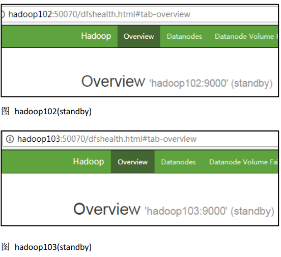
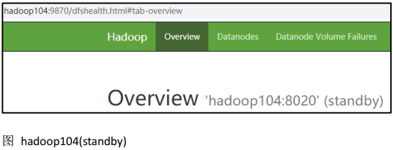
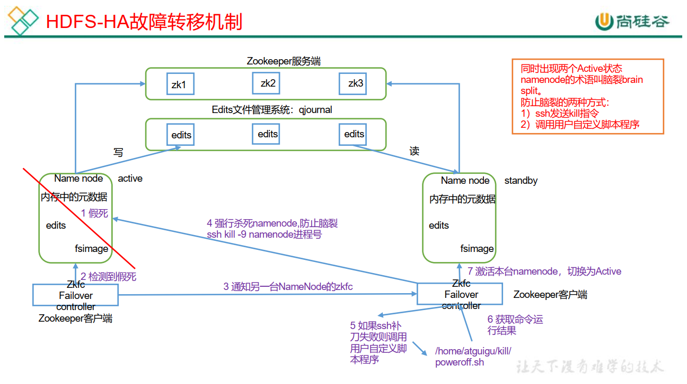
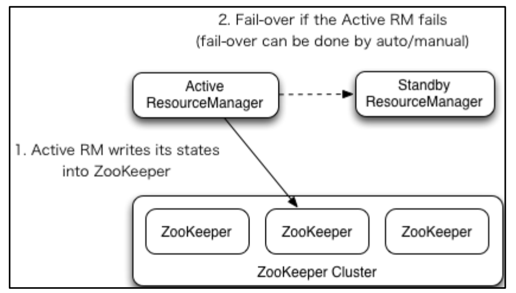
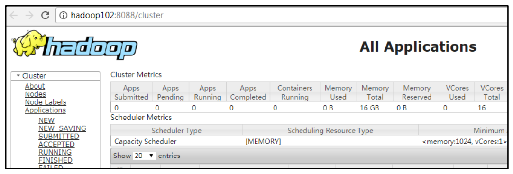
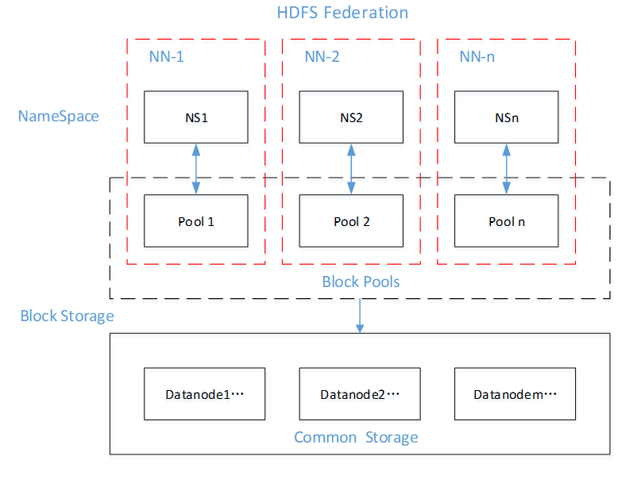

# HA概述

1）所谓HA（High Available），即高可用（7*24小时不中断服务）。

2）实现高可用最关键的策略是消除单点故障。HA严格来说应该分成各个组件的HA机制：HDFS的HA和YARN的HA。

3）Hadoop2.0之前，在HDFS集群中NameNode存在单点故障（SPOF）。

4）NameNode主要在以下两个方面影响HDFS集群

​	NameNode机器发生意外，如宕机，集群将无法使用，直到管理员重启

​	NameNode机器需要升级，包括软件、硬件升级，此时集群也将无法使用

HDFS HA功能通过配置Active/Standby两个NameNodes实现在集群中对NameNode的热备来解决上述问题。如果出现故障，如机器崩溃或机器需要升级维护，这时可通过此种方式将NameNode很快的切换到另外一台机器。

# HDFS-HA 集群搭建

当前 HDFS 集群的规划

| hadoop102 | hadoop103 | hadoop104         |
| --------- | --------- | ----------------- |
| NameNode  |           | Secondarynamenode |
| DataNode  | DataNode  | DataNode          |

HA 的主要目的是消除 namenode 的单点故障,需要将 hdfs 集群规划成以下模样

| hadoop102 | hadoop103 | hadoop104 |
| --------- | --------- | --------- |
| NameNode  | NameNode  | NameNode  |
| DataNode  | DataNode  | DataNode  |

## HDFS-HA 核心问题  

1. **怎么保证三台 namenode 的数据一致**
   a.Fsimage:让一台 nn 生成数据,让其他机器 nn 同步
   b.Edits:需要引进新的模块 JournalNode 来保证 edtis 的文件的数据一致性

2. **怎么让同时只有一台 nn 是 active，其他所有是 standby 的**
   a.手动分配
   b.自动分配

3. **2nn 在 ha 架构中并不存在，定期合并 fsimage 和 edtis 的活谁来干**
   由 standby 的 nn 来干

4. **如果 nn 真的发生了问题，怎么让其他的 nn 上位干活**
   a.手动故障转移
   b.自动故障转移  

# HDFS-HA 手动模式  

## 环境准备  

（1）修改 IP
（2）修改主机名及主机名和 IP 地址的映射
（3）关闭防火墙
（4） ssh 免密登录
（5）安装 JDK，配置环境变量等  

## 规划集群

| hadoop102   | hadoop103   | hadoop104   |
| ----------- | ----------- | ----------- |
| NameNode    | NameNode    | NameNode    |
| JournalNode | JournalNode | JournalNode |
| DataNode    | DataNode    | DataNode    |

## 配置 Zookeeper 集群

1. **集群规划**

   在hadoop102、hadoop103和hadoop104三个节点上部署Zookeeper。

2. **解压安装**

   （1）解压Zookeeper安装包到/opt/module/目录下

   ```shell
   [atguigu@hadoop102 software]$ tar -zxvf zookeeper-3.4.10.tar.gz -C /opt/module/
   ```

   （2）在/opt/module/zookeeper-3.4.10/这个目录下创建zkData

   ```shell
   mkdir -p zkData
   ```

   （3）重命名/opt/module/zookeeper-3.4.10/conf这个目录下的zoo_sample.cfg为zoo.cfg

   ```shell
   mv zoo_sample.cfg zoo.cfg
   ```

3. **配置zoo.cfg文件**

   （1）具体配置

   ```properties
   dataDir=/opt/module/zookeeper-3.4.10/zkData
   ```

   增加如下配置

   ```properties
   #######################cluster##########################
   server.2=hadoop102:2888:3888
   server.3=hadoop103:2888:3888
   server.4=hadoop104:2888:3888
   ```

   （2）配置参数解读

   Server.A=B:C:D。

   A  是一个数字，表示这个是第几号服务器；

   B  是这个服务器的IP地址；

   C  是这个服务器与集群中的Leader服务器交换信息的端口；

   D  是万一集群中的Leader服务器挂了，需要一个端口来重新进行选举，选出一个新的Leader，而这个端口就是用来执行选举时服务器相互通信的端口。

   集群模式下配置一个文件myid，这个文件在dataDir目录下，这个文件里面有一个数据就是A的值，Zookeeper启动时读取此文件，拿到里面的数据与zoo.cfg里面的配置信息比较从而判断到底是哪个server。

4. **集群操作**

   （1）在/opt/module/zookeeper-3.4.10/zkData目录下创建一个myid的文件

   ```shell
   touch myid
   ```

   ​	添加myid文件，注意一定要在linux里面创建，在notepad++里面很可能乱码

   （2）编辑myid文件

   ```shell
   vi myid
   ```

   ​	在文件中添加与server对应的编号：如2

   （3）拷贝配置好的zookeeper到其他机器上

   ```shell
   scp -r zookeeper-3.4.10/ [root@hadoop103.atguigu.com:/opt/app/](mailto:root@hadoop103.atguigu.com:/opt/app/)
   scp -r zookeeper-3.4.10/ [root@hadoop104.atguigu.com:/opt/app/](mailto:root@hadoop104.atguigu.com:/opt/app/)
   ```

   ​	并分别修改myid文件中内容为3、4

   （4）分别启动zookeeper

   ```shell
   [root@hadoop102 zookeeper-3.4.10]# bin/zkServer.sh start
   [root@hadoop103 zookeeper-3.4.10]# bin/zkServer.sh start
   [root@hadoop104 zookeeper-3.4.10]# bin/zkServer.sh start
   ```

   （5）查看状态

   ```shell
   [root@hadoop102 zookeeper-3.4.10]# bin/zkServer.sh status
   JMX enabled by default
   Using config: /opt/module/zookeeper-3.4.10/bin/../conf/zoo.cfg
   Mode: follower
   [root@hadoop103 zookeeper-3.4.10]# bin/zkServer.sh status
   JMX enabled by default
   Using config: /opt/module/zookeeper-3.4.10/bin/../conf/zoo.cfg
   Mode: leader
   [root@hadoop104 zookeeper-3.4.5]# bin/zkServer.sh status
   JMX enabled by default
   Using config: /opt/module/zookeeper-3.4.10/bin/../conf/zoo.cfg
   Mode: follower
   ```

## 配置 HDFS-HA 集群

1. **官方地址： http://hadoop.apache.org/**

2. **在 opt 目录下创建一个 ha 文件夹**

   ```shell
   [atguigu@hadoop102 ~]$ cd /opt
   [atguigu@hadoop102 opt]$ sudo mkdir ha
   [atguigu@hadoop102 opt]$ sudo chown atguigu:atguigu /opt/ha
   ```

3. **将/opt/module/下的 hadoop-3.1.3 拷贝到/opt/ha 目录下（记得删除 data 和 log 目录）** 

   ```shell
   [atguigu@hadoop102 opt]$ cp -r /opt/module/hadoop-3.1.3 /opt/ha/
   ```

4. **配置 core-site.xml**

   ```xml
   <configuration>
       <!-- 把多个 NameNode 的地址组装成一个集群 mycluster -->
       <property>
       	<name>fs.defaultFS</name>
       	<value>hdfs://mycluster</value>
       </property>
       <!-- 指定 hadoop 运行时产生文件的存储目录 -->
       <property>
       	<name>hadoop.tmp.dir</name>
       	<value>/opt/ha/hadoop-3.1.3/data</value>
       </property>
   </configuration>
   ```

5. **配置 hdfs-site.xml**

   ```xml
   <configuration>
       <!-- NameNode 数据存储目录 -->
       <property>
       	<name>dfs.namenode.name.dir</name>
       	<value>file://${hadoop.tmp.dir}/name</value>
       </property>
       <!-- DataNode 数据存储目录 -->
       <property>
       	<name>dfs.datanode.data.dir</name>
       	<value>file://${hadoop.tmp.dir}/data</value>
       </property>
       <!-- JournalNode 数据存储目录 -->
       <property>
       	<name>dfs.journalnode.edits.dir</name>
       	<value>${hadoop.tmp.dir}/jn</value>
       </property>
       <!-- 完全分布式集群名称 -->
       <property>
           <name>dfs.nameservices</name>
           <value>mycluster</value>
       </property>
       <!-- 集群中 NameNode 节点都有哪些 -->
       <property>
           <name>dfs.ha.namenodes.mycluster</name>
           <value>nn1,nn2,nn3</value>
       </property>
       <!-- NameNode 的 RPC 通信地址 -->
       <property>
           <name>dfs.namenode.rpc-address.mycluster.nn1</name>
           <value>hadoop102:8020</value>
       </property>
       <property>
           <name>dfs.namenode.rpc-address.mycluster.nn2</name>
           <value>hadoop103:8020</value>
       </property><property>
           <name>dfs.namenode.rpc-address.mycluster.nn3</name>
           <value>hadoop104:8020</value>
       </property>
       <!-- NameNode 的 http 通信地址 -->
       <property>
           <name>dfs.namenode.http-address.mycluster.nn1</name>
           <value>hadoop102:9870</value>
       </property>
       <property>
           <name>dfs.namenode.http-address.mycluster.nn2</name>
           <value>hadoop103:9870</value>
       </property>
       <property>
           <name>dfs.namenode.http-address.mycluster.nn3</name>
           <value>hadoop104:9870</value>
       </property>
       <!-- 指定 NameNode 元数据在 JournalNode 上的存放位置 -->
       <property>
           <name>dfs.namenode.shared.edits.dir</name>
           <value>qjournal://hadoop102:8485;hadoop103:8485;hadoop104:8485/myclus
       ter</value>
       </property>
       <!-- 访问代理类： client 用于确定哪个 NameNode 为 Active -->
       <property>
           <name>dfs.client.failover.proxy.provider.mycluster</name>
           <value>org.apache.hadoop.hdfs.server.namenode.ha.ConfiguredFailoverProxyP
       rovider</value>
       </property>
       <!-- 配置隔离机制，即同一时刻只能有一台服务器对外响应 -->
       <property>
           <name>dfs.ha.fencing.methods</name>
           <value>sshfence</value>
       </property>
       <!-- 使用隔离机制时需要 ssh 秘钥登录-->
       <property>
           <name>dfs.ha.fencing.ssh.private-key-files</name>
           <value>/home/atguigu/.ssh/id_rsa</value>
       </property>
   </configuration>
   ```

6. **分发配置好的 hadoop 环境到其他节点**

## 启动 HDFS-HA 集群  

1. **将 HADOOP_HOME 环境变量更改到 HA 目录(三台机器)**

   ```shell
   [atguigu@hadoop102 ~]$ sudo vim /etc/profile.d/my_env.sh
   ```

   将 HADOOP_HOME 部分改为如下  

   ```shell
   #HADOOP_HOME
   export HADOOP_HOME=/opt/ha/hadoop-3.1.3
   export PATH=$PATH:$HADOOP_HOME/bin
   export PATH=$PATH:$HADOOP_HOME/sbin
   ```

   去三台机器上 source 环境变量

   ```shell
   [atguigu@hadoop102 ~]$source /etc/profile
   ```

2. **在各个 JournalNode 节点上，输入以下命令启动 journalnode 服务**

   ```shell
   [atguigu@hadoop102 ~]$ hdfs --daemon start journalnode
   [atguigu@hadoop103 ~]$ hdfs --daemon start journalnode
   [atguigu@hadoop104 ~]$ hdfs --daemon start journalnode
   ```

3. **在[nn1]上，对其进行格式化， 并启动**

   ```shell
   [atguigu@hadoop102 ~]$ hdfs namenode -format
   [atguigu@hadoop102 ~]$ hdfs --daemon start namenode
   ```

4. **在[nn2]和[nn3]上，同步 nn1 的元数据信息** 

   ```shell
   [atguigu@hadoop103 ~]$ hdfs namenode -bootstrapStandby
   [atguigu@hadoop104 ~]$ hdfs namenode -bootstrapStandby
   ```

5. **启动[nn2]和[nn3]**

   ```shell
   [atguigu@hadoop103 ~]$ hdfs --daemon start namenode
   [atguigu@hadoop104 ~]$ hdfs --daemon start namenode
   ```

6. **查看 web 页面显示**

   

   

7. **在所有节点上，启动 datanode**

   ```shell
   [atguigu@hadoop102 ~]$ hdfs --daemon start datanode
   [atguigu@hadoop103 ~]$ hdfs --daemon start datanode
   [atguigu@hadoop104 ~]$ hdfs --daemon start datanode
   ```

8. **将[nn1]切换为 Active**

   ```shell
   [atguigu@hadoop102 ~]$ hdfs haadmin -transitionToActive nn1
   ```

9. **查看是否 Active**

   ```shell
   [atguigu@hadoop102 ~]$ hdfs haadmin -getServiceState nn1
   ```

# HDFS-HA 自动模式

## HDFS-HA 自动故障转移工作机制

自动故障转移为 HDFS 部署增加了两个新组件： ZooKeeper 和 ZKFailoverController（ZKFC）进程，如图所示。 ZooKeeper 是维护少量协调数据，通知客户端这些数据的改变和监视客户端故障的高可用服务。  



## HDFS-HA 自动故障转移的集群规划

| hadoop102   | hadoop103   | hadoop104   |
| ----------- | ----------- | ----------- |
| NameNode    | NameNode    | NameNode    |
| JournalNode | JournalNode | JournalNode |
| DataNode    | DataNode    | DataNode    |
| Zookeeper   | Zookeeper   | Zookeeper   |
| ZKFC        | ZKFC        | ZKFC        |

## 配置 HDFS-HA 自动故障转移  

1. **具体配置**

   （1）在 hdfs-site.xml 中增加

   ```xml
   <!-- 启用 nn 故障自动转移 -->
   <property>
       <name>dfs.ha.automatic-failover.enabled</name>
       <value>true</value>
   </property>
   ```

   （2）在 core-site.xml 文件中增加  

   ```xml
   <!-- 指定 zkfc 要连接的 zkServer 地址 -->
   <property>
       <name>ha.zookeeper.quorum</name>
       <value>hadoop102:2181,hadoop103:2181,hadoop104:2181</value>
   </property>
   ```

   （3）修改后分发配置文件

   ```shell
   [atguigu@hadoop102 etc]$ pwd
   /opt/ha/hadoop-3.1.3/etc
   [atguigu@hadoop102 etc]$ xsync hadoop/
   ```

2. **启动**

   （1）关闭所有 HDFS 服务：

   ```shell
   [atguigu@hadoop102 ~]$ stop-dfs.sh
   ```

   （2）启动 Zookeeper 集群：

   ```shell
   [atguigu@hadoop102 ~]$ zkServer.sh start
   [atguigu@hadoop103 ~]$ zkServer.sh start
   [atguigu@hadoop104 ~]$ zkServer.sh start
   ```

   （3） 启动 Zookeeper 以后， 然后再初始化 HA 在 Zookeeper 中状态：

   ```shell
   [atguigu@hadoop102 ~]$ hdfs zkfc -formatZK
   ```

   （4）启动 HDFS 服务：

   ```shell
   [atguigu@hadoop102 ~]$ start-dfs.sh
   ```

   （ 5）可以去 zkCli.sh 客户端查看 Namenode 选举锁节点内容：

   ```shell
   [zk: localhost:2181(CONNECTED) 7] get -s
   /hadoop-ha/mycluster/ActiveStandbyElectorLock
   myclusternn2 hadoop103 >
   cZxid = 0x10000000b
   ctime = Tue Jul 14 17:00:13 CST 2020
   mZxid = 0x10000000b
   mtime = Tue Jul 14 17:00:13 CST 2020
   pZxid = 0x10000000b
   cversion = 0
   dataVersion = 0
   aclVersion = 0
   ephemeralOwner = 0x40000da2eb70000
   dataLength = 33
   numChildren = 0
   ```

3. **验证**

   (1）将 Active NameNode 进程 kill，查看网页端三台 Namenode 的状态变化  

   ```shell
   [atguigu@hadoop102 ~]$ kill -9 namenode 的进程 id

## 解决 NN 连接不上 JN 的问题  

自动故障转移配置好以后，然后使用 start-dfs.sh 群起脚本启动 hdfs 集群，有可能会遇到 NameNode 起来一会后，进程自动关闭的问题。查看 NameNode 日志，报错信息如下：  

```properties
2020-08-17 10:11:40,658 INFO org.apache.hadoop.ipc.Client: Retrying connect
to server: hadoop104/192.168.6.104:8485. Already tried 0 time(s); retry
policy is RetryUpToMaximumCountWithFixedSleep(maxRetries=10,
sleepTime=1000 MILLISECONDS)
2020-08-17 10:11:40,659 INFO org.apache.hadoop.ipc.Client: Retrying connect
to server: hadoop102/192.168.6.102:8485. Already tried 0 time(s); retry
policy is RetryUpToMaximumCountWithFixedSleep(maxRetries=10,
sleepTime=1000 MILLISECONDS)
2020-08-17 10:11:40,659 INFO org.apache.hadoop.ipc.Client: Retrying connect
to server: hadoop103/192.168.6.103:8485. Already tried 0 time(s); retry
policy is RetryUpToMaximumCountWithFixedSleep(maxRetries=10,
sleepTime=1000 MILLISECONDS)
2020-08-17 10:11:41,660 INFO org.apache.hadoop.ipc.Client: Retrying connect
to server: hadoop104/192.168.6.104:8485. Already tried 1 time(s); retry
policy is RetryUpToMaximumCountWithFixedSleep(maxRetries=10,
sleepTime=1000 MILLISECONDS)
... ...
2020-08-17 10:11:49,676 INFO org.apache.hadoop.ipc.Client: Retrying connect
to server: hadoop103/192.168.6.103:8485. Already tried 9 time(s); retry
policy is RetryUpToMaximumCountWithFixedSleep(maxRetries=10,
sleepTime=1000 MILLISECONDS)
2020-08-17 10:11:49,678 WARN
org.apache.hadoop.hdfs.server.namenode.FSEditLog: Unable to determine input
streams from QJM to [192.168.6.102:8485, 192.168.6.103:8485,
192.168.6.104:8485]. Skipping.
org.apache.hadoop.hdfs.qjournal.client.QuorumException: Got too many
exceptions to achieve quorum size 2/3. 3 exceptions thrown:
192.168.6.103:8485: Call From hadoop102/192.168.6.102 to hadoop103:8485
failed on connection exception: java.net.ConnectException: 拒绝连接; For more
details see: http://wiki.apache.org/hadoop/ConnectionRefused
192.168.6.102:8485: Call From hadoop102/192.168.6.102 to hadoop102:8485
failed on connection exception: java.net.ConnectException: 拒绝连接; For more
details see: http://wiki.apache.org/hadoop/ConnectionRefused
192.168.6.104:8485: Call From hadoop102/192.168.6.102 to hadoop104:8485
failed on connection exception: java.net.ConnectException: 拒绝连接; For more
details see: http://wiki.apache.org/hadoop/ConnectionRefused
```

查看报错日志，可分析出报错原因是因为 NameNode 连接不上 JournalNode，而利用 jps 命令查看到三台 JN 都已经正常启动，为什么 NN 还是无法正常连接到 JN 呢？这是因为 start-dfs.sh 群起脚本默认的启动顺序是先启动 NN，再启动 DN，然后再启动 JN，并且默认的 rpc 连接参数是重试次数为 10，每次重试的间隔是 1s，也就是说启动完 NN以后的 10s 中内， JN 还启动不起来， NN 就会报错了。  

core-default.xml 里面有两个参数如下：

```xml
<!-- NN 连接 JN 重试次数，默认是 10 次 -->
<property>
    <name>ipc.client.connect.max.retries</name>
    <value>10</value>
</property>
<!-- 重试时间间隔，默认 1s -->
<property>
    <name>ipc.client.connect.retry.interval</name>
    <value>1000</value>
</property>
```

解决方案：遇到上述问题后，可以稍等片刻，等 JN 成功启动后，手动启动下三台NN：

```shell
[atguigu@hadoop102 ~]$ hdfs --daemon start namenode
[atguigu@hadoop103 ~]$ hdfs --daemon start namenode
[atguigu@hadoop104 ~]$ hdfs --daemon start namenode
```

也可以在 core-site.xml 里面适当调大上面的两个参数：

```xml
<!-- NN 连接 JN 重试次数，默认是 10 次 -->
<property>
    <name>ipc.client.connect.max.retries</name>
    <value>20</value>
</property>
<!-- 重试时间间隔，默认 1s -->
<property>
    <name>ipc.client.connect.retry.interval</name>
    <value>5000</value>
</property>
```

# YARN-HA 配置

## YARN-HA 工作机制

1. **官方文档：**

   http://hadoop.apache.org/docs/r3.1.3/hadoop-yarn/hadoop-yarn-site/ResourceManagerHA.html

2. **YARN-HA 工作机制**

   

## 配置 YARN-HA 集群

1. **环境准备**

   （ 1）修改 IP
   （ 2）修改主机名及主机名和 IP 地址的映射
   （ 3）关闭防火墙
   （ 4） ssh 免密登录
   （ 5）安装 JDK，配置环境变量等
   （ 6）配置 Zookeeper 集群

2. **规划集群**

   | hadoop102       | hadoop103       | hadoop104       |
   | --------------- | --------------- | --------------- |
   | ResourceManager | ResourceManager | ResourceManager |
   | NodeManager     | NodeManager     | NodeManager     |
   | Zookeeper       | Zookeeper       | Zookeeper       |

3. **核心问题**

   a .如果当前 active rm 挂了，其他 rm 怎么将其他 standby rm 上位核心原理跟 hdfs 一样，利用了 zk 的临时节点。
   b. 当前 rm 上有很多的计算程序在等待运行,其他的 rm 怎么将这些程序接手过来接着跑 rm，会将当前的所有计算程序的状态存储在 zk 中,其他 rm 上位后会去读取，然后接着跑。

4. **具体配置**

   （1） yarn-site.xml

   ```xml
   <configuration>
       <property>
           <name>yarn.nodemanager.aux-services</name>
           <value>mapreduce_shuffle</value>
       </property>
       <!-- 启用 resourcemanager ha -->
       <property>
           <name>yarn.resourcemanager.ha.enabled</name>
           <value>true</value>
       </property>
       <!-- 声明两台 resourcemanager 的地址 -->
       <property>
           <name>yarn.resourcemanager.cluster-id</name>
           <value>cluster-yarn1</value>
       </property>
       <!--指定 resourcemanager 的逻辑列表-->
       <property>
           <name>yarn.resourcemanager.ha.rm-ids</name>
           <value>rm1,rm2,rm3</value>
       </property>
       <!-- ========== rm1 的配置 ========== -->
       <!-- 指定 rm1 的主机名 -->
       <property>
           <name>yarn.resourcemanager.hostname.rm1</name>
           <value>hadoop102</value>
       </property>
       <!-- 指定 rm1 的 web 端地址 -->
       <property>
           <name>yarn.resourcemanager.webapp.address.rm1</name>
           <value>hadoop102:8088</value>
       </property>
       <!-- 指定 rm1 的内部通信地址 -->
       <property>
           <name>yarn.resourcemanager.address.rm1</name>
           <value>hadoop102:8032</value>
       </property>
       <!-- 指定 AM 向 rm1 申请资源的地址 -->
       <property><name>yarn.resourcemanager.scheduler.address.rm1</name>
       	<value>hadoop102:8030</value>
       </property>
       <!-- 指定供 NM 连接的地址 -->
       <property>
           <name>yarn.resourcemanager.resource-tracker.address.rm1</name>
           <value>hadoop102:8031</value>
       </property>
       <!-- ========== rm2 的配置 ========== -->
       <!-- 指定 rm2 的主机名 -->
       <property>
           <name>yarn.resourcemanager.hostname.rm2</name>
           <value>hadoop103</value>
       </property>
       <property>
           <name>yarn.resourcemanager.webapp.address.rm2</name>
           <value>hadoop103:8088</value>
       </property>
       <property>
           <name>yarn.resourcemanager.address.rm2</name>
           <value>hadoop103:8032</value>
       </property>
       <property>
           <name>yarn.resourcemanager.scheduler.address.rm2</name>
           <value>hadoop103:8030</value>
       </property>
       <property>
           <name>yarn.resourcemanager.resource-tracker.address.rm2</name>
           <value>hadoop103:8031</value>
       </property>
       <!-- ========== rm3 的配置 ========== -->
       <!-- 指定 rm1 的主机名 -->
       <property>
           <name>yarn.resourcemanager.hostname.rm3</name>
           <value>hadoop104</value>
       </property>
       <!-- 指定 rm1 的 web 端地址 -->
       <property>
           <name>yarn.resourcemanager.webapp.address.rm3</name>
           <value>hadoop104:8088</value>
       </property>
       <!-- 指定 rm1 的内部通信地址 -->
       <property>
       	<name>yarn.resourcemanager.address.rm3</name><value>hadoop104:8032</value>
       </property>
       <!-- 指定 AM 向 rm1 申请资源的地址 -->
       <property>
           <name>yarn.resourcemanager.scheduler.address.rm3</name>
           <value>hadoop104:8030</value>
       </property>
       <!-- 指定供 NM 连接的地址 -->
       <property>
           <name>yarn.resourcemanager.resource-tracker.address.rm3</name>
           <value>hadoop104:8031</value>
       </property>
       <!-- 指定 zookeeper 集群的地址 -->
       <property>
           <name>yarn.resourcemanager.zk-address</name>
           <value>hadoop102:2181,hadoop103:2181,hadoop104:2181</value>
       </property>
       <!-- 启用自动恢复 -->
       <property>
           <name>yarn.resourcemanager.recovery.enabled</name>
           <value>true</value>
       </property>
       <!-- 指定 resourcemanager 的状态信息存储在 zookeeper 集群 -->
       <property>
           <name>yarn.resourcemanager.store.class</name>
           <value>org.apache.hadoop.yarn.server.resourcemanager.recovery.ZKRMStateSt
       ore</value>
       </property>
       <!-- 环境变量的继承 -->
       <property>
           <name>yarn.nodemanager.env-whitelist</name>
           <value>JAVA_HOME,HADOOP_COMMON_HOME,HADOOP_HDFS_HOME,HADOOP_CONF_DIR,CLAS
           SPATH_PREPEND_DISTCACHE,HADOOP_YARN_HOME,HADOOP_MAPRED_HOME</value>
       </property>
   </configuration>
   ```

   （2）同步更新其他节点的配置信息，分发配置文件

   ```shell
   [atguigu@hadoop102 etc]$ xsync hadoop/
   ```

5. **启动 YARN**

   （1）在 hadoop102 或者 hadoop103 中执行：

   ```shell
   [atguigu@hadoop102 ~]$ start-yarn.sh
   ```

   （2）查看服务状态

   ```shell
   [atguigu@hadoop102 ~]$ yarn rmadmin -getServiceState rm1
   ```

   （3）可以去 zkCli.sh 客户端查看 ResourceManager 选举锁节点内容：

   ```shell
   [atguigu@hadoop102 ~]$ zkCli.sh
   [zk: localhost:2181(CONNECTED) 16] get -s
   /yarn-leader-election/cluster-yarn1/ActiveStandbyElectorLock
   cluster-yarn1rm1
   cZxid = 0x100000022
   ctime = Tue Jul 14 17:06:44 CST 2020
   mZxid = 0x100000022
   mtime = Tue Jul 14 17:06:44 CST 2020
   pZxid = 0x100000022
   cversion = 0
   dataVersion = 0
   aclVersion = 0
   ephemeralOwner = 0x30000da33080005
   dataLength = 20
   numChildren = 0
   ```

   （ 4） web 端查看 hadoop102:8088 和 hadoop103:8088 的 YARN 的状态

   

# HADOOP HA 的最终规划  

将整个 HA 搭建完成后,集群将形成以下模样

| hadoop102       | hadoop103       | hadoop104       |
| --------------- | --------------- | --------------- |
| NameNode        | NameNode        | NameNode        |
| JournalNode     | JournalNode     | JournalNode     |
| DataNode        | DataNode        | DataNode        |
| Zookeeper       | Zookeeper       | Zookeeper       |
| ZKFC            | ZKFC            | ZKFC            |
| ResourceManager | ResourceManager | ResourceManager |
| NodeManager     | NodeManager     | NodeManager     |

# **HDFS** Federation架构设计

1. **NameNode架构的局限性**

   （1）Namespace（命名空间）的限制

   由于NameNode在内存中存储所有的元数据（metadata），因此单个NameNode所能存储的对象（文件+块）数目受到NameNode所在JVM的heap size的限制。50G的heap能够存储20亿（200million）个对象，这20亿个对象支持4000个DataNode，12PB的存储（假设文件平均大小为40MB）。随着数据的飞速增长，存储的需求也随之增长。单个DataNode从4T增长到36T，集群的尺寸增长到8000个DataNode。存储的需求从12PB增长到大于100PB。

   （2）隔离问题

   由于HDFS仅有一个NameNode，无法隔离各个程序，因此HDFS上的一个实验程序就很有可能影响整个HDFS上运行的程序。

   （3）性能的瓶颈

   由于是单个NameNode的HDFS架构，因此整个HDFS文件系统的吞吐量受限于单个NameNode的吞吐量。

2. **HDFS Federation架构设计**

   | NameNode | NameNode | NameNode          |
   | -------- | -------- | ----------------- |
   | 元数据   | 元数据   | 元数据            |
   | Log      | machine  | 电商数据/话单数据 |

   

3. **HDFS Federation应用思考**

   不同应用可以使用不同NameNode进行数据管理，比如 图片业务、爬虫业务、日志审计业务。在Hadoop生态系统中，不同的框架使用不同的NameNode进行管理NameSpace。（隔离性）
