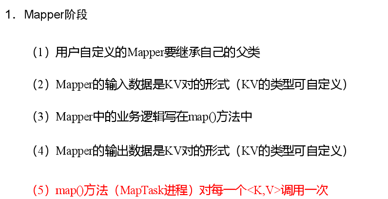
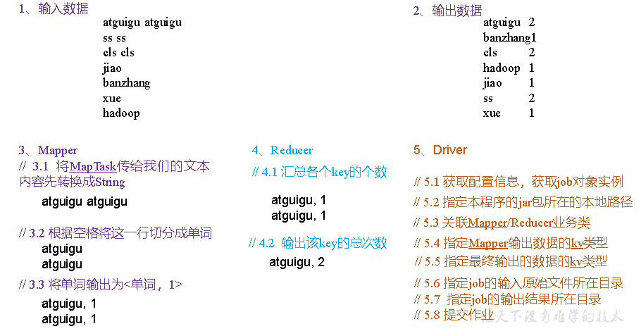
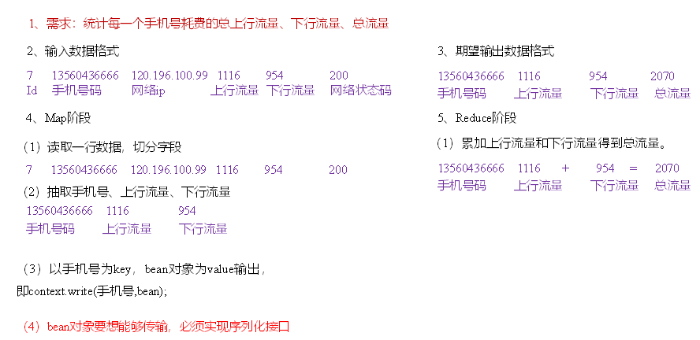

# 第1章 MapReduce概述

## 1.1 MapReduce定义

MapReduce是一个分布式运算程序的编程框架，是用户开发“基于Hadoop的数据分析应用”的核心框架。MapReduce核心功能是将用户编写的业务逻辑代码和自带默认组件整合成一个完整的分布式运算程序，并发运行在一个Hadoop集群上。

## 1.2 MapReduce优缺点

### 1.2.1 优点

1. MapReduce易于编程
   它简单的实现一些接口，就可以完成一个分布式程序，这个分布式程序可以分布到大量廉价的PC机器上运行。也就是说你写一个分布式程序，跟写一个简单的串行程序是一模一样的。就是因为这个特点使得MapReduce编程变得非常流行。

2. 良好的扩展性
   当你的计算资源不能得到满足的时候，你可以通过简单的增加机器来扩展它的计算能力。

3. 高容错性
   MapReduce设计的初衷就是使程序能够部署在廉价的PC机器上，这就要求它具有很高的容错性。比如其中一台机器挂了，它可以把上面的计算任务转移到另外一个节点上运行，不至于这个任务运行失败，而且这个过程不需要人工参与，而完全是由Hadoop内部完成的。

4. 适合PB级以上海量数据的离线处理

可以实现上千台服务器集群并发工作，提供数据处理能力。

### 1.2.2 缺点

1. 不擅长实时计算
   MapReduce无法像MySQL一样，在毫秒或者秒级内返回结果。

2. 不擅长流式计算
   流式计算的输入数据是动态的，而MapReduce的输入数据集是静态的，不能动态变化。这是因为MapReduce自身的设计特点决定了数据源必须是静态的。

3. 不擅长DAG（有向无环图）计算
   多个应用程序存在依赖关系，后一个应用程序的输入为前一个的输出。在这种情况下，MapReduce并不是不能做，而是使用后，每个MapReduce作业的输出结果都会写入到磁盘，会造成大量的磁盘IO，导致性能非常的低下。

## 1.3 MapReduce核心思想


（1）分布式的运算程序往往需要分成至少2个阶段。

（2）第一个阶段的MapTask并发实例，完全并行运行，互不相干。

（3）第二个阶段的ReduceTask并发实例互不相干，但是他们的数据依赖于上一个阶段的所有MapTask并发实例的输出。

（4）MapReduce编程模型只能包含一个Map阶段和一个Reduce阶段，如果用户的业务逻辑非常复杂，那就只能多个MapReduce程序，串行运行。

总结：分析WordCount数据流走向深入理解MapReduce核心思想。

## 1.4 MapReduce进程

一个完整的MapReduce程序在分布式运行时有三类实例进程：

（1）MrAppMaster：负责整个程序的过程调度及状态协调。

（2）MapTask：负责Map阶段的整个数据处理流程。

（3）ReduceTask：负责Reduce阶段的整个数据处理流程。

## 1.5 官方WordCount源码

采用反编译工具反编译源码，发现WordCount案例有Map类、Reduce类和驱动类。且数据的类型是Hadoop自身封装的序列化类型。

## 1.6 常用数据序列化类型

| Java类型 | Hadoop Writable类型 |
| -------- | ------------------- |
| Boolean  | BooleanWritable     |
| Byte     | ByteWritable        |
| Int      | IntWritable         |
| Float    | FloatWritable       |
| Long     | LongWritable        |
| Double   | DoubleWritable      |
| String   | Text                |
| Map      | MapWritable         |
| Array    | ArrayWritable       |
| Null     | NullWritable        |

## 1.7 MapReduce编程规范

用户编写的程序分成三个部分：Mapper、Reducer和Driver。




## 1.8 WordCount案例实操

### 1.8.1 本地测试

1）需求

在给定的文本文件中统计输出每一个单词出现的总次数

（1）输入数据

```java
atguigu atguigu
ss ss
cls cls
jiao
banzhang
xue
hadoop
```

（2）期望输出数据

```java
atguigu	2
banzhang	1
cls	2
hadoop	1
jiao	1
ss	2
xue	1
```

2）需求分析

按照MapReduce编程规范，分别编写Mapper，Reducer，Driver。



3）环境准备

（1）创建maven工程，MapReduceDemo

（2）在pom.xml文件中添加如下依赖

```xml
<dependencies>
    <dependency>
        <groupId>org.apache.hadoop</groupId>
        <artifactId>hadoop-client</artifactId>
        <version>3.1.3</version>
    </dependency>
    <dependency>
        <groupId>junit</groupId>
        <artifactId>junit</artifactId>
        <version>4.12</version>
    </dependency>
    <dependency>
        <groupId>org.slf4j</groupId>
        <artifactId>slf4j-log4j12</artifactId>
        <version>1.7.30</version>
    </dependency>
</dependencies>
```

（2）在项目的src/main/resources目录下，新建一个文件，命名为“log4j.properties”，在文件中填入。

```properties
log4j.rootLogger=INFO, stdout  
log4j.appender.stdout=org.apache.log4j.ConsoleAppender  
log4j.appender.stdout.layout=org.apache.log4j.PatternLayout  
log4j.appender.stdout.layout.ConversionPattern=%d %p [%c] - %m%n  
log4j.appender.logfile=org.apache.log4j.FileAppender  
log4j.appender.logfile.File=target/spring.log  
log4j.appender.logfile.layout=org.apache.log4j.PatternLayout  
log4j.appender.logfile.layout.ConversionPattern=%d %p [%c] - %m%n
```

（3）创建包名：com.atguigu.mapreduce.wordcount

4）编写程序

（1）编写Mapper类

```java
package com.atguigu.mapreduce.wordcount;
import java.io.IOException;
import org.apache.hadoop.io.IntWritable;
import org.apache.hadoop.io.LongWritable;
import org.apache.hadoop.io.Text;
import org.apache.hadoop.mapreduce.Mapper;
public class WordCountMapper extends Mapper<LongWritable, Text, Text, IntWritable>{
	
	Text k = new Text();
	IntWritable v = new IntWritable(1);
	
	@Override
	protected void map(LongWritable key, Text value, Context context)	throws IOException, InterruptedException {
		
		// 1 获取一行
		String line = value.toString();
		
		// 2 切割
		String[] words = line.split(" ");
		
		// 3 输出
		for (String word : words) {
			k.set(word);
			context.write(k, v);
		}
	}
}
```

（2）编写Reducer类

```java
package com.atguigu.mapreduce.wordcount;
import java.io.IOException;
import org.apache.hadoop.io.IntWritable;
import org.apache.hadoop.io.Text;
import org.apache.hadoop.mapreduce.Reducer;

public class WordCountReducer extends Reducer<Text, IntWritable, Text, IntWritable>{

int sum;
IntWritable v = new IntWritable();

	@Override
	protected void reduce(Text key, Iterable<IntWritable> values,Context context) throws IOException, InterruptedException {
		
		// 1 累加求和
		sum = 0;
		for (IntWritable count : values) {
			sum += count.get();
		}
		
		// 2 输出
         v.set(sum);
		context.write(key,v);
	}
}
```

（3）编写Driver驱动类

```java
package com.atguigu.mapreduce.wordcount;
import java.io.IOException;
import org.apache.hadoop.conf.Configuration;
import org.apache.hadoop.fs.Path;
import org.apache.hadoop.io.IntWritable;
import org.apache.hadoop.io.Text;
import org.apache.hadoop.mapreduce.Job;
import org.apache.hadoop.mapreduce.lib.input.FileInputFormat;
import org.apache.hadoop.mapreduce.lib.output.FileOutputFormat;

public class WordCountDriver {

	public static void main(String[] args) throws IOException, ClassNotFoundException, InterruptedException {

		// 1 获取配置信息以及获取job对象
		Configuration conf = new Configuration();
		Job job = Job.getInstance(conf);

		// 2 关联本Driver程序的jar
		job.setJarByClass(WordCountDriver.class);

		// 3 关联Mapper和Reducer的jar
		job.setMapperClass(WordCountMapper.class);
		job.setReducerClass(WordCountReducer.class);

		// 4 设置Mapper输出的kv类型
		job.setMapOutputKeyClass(Text.class);
		job.setMapOutputValueClass(IntWritable.class);

		// 5 设置最终输出kv类型
		job.setOutputKeyClass(Text.class);
		job.setOutputValueClass(IntWritable.class);
		
		// 6 设置输入和输出路径
		FileInputFormat.setInputPaths(job, new Path(args[0]));
		FileOutputFormat.setOutputPath(job, new Path(args[1]));

		// 7 提交job
		boolean result = job.waitForCompletion(true);
		System.exit(result ? 0 : 1);
	}
}
```

5）本地测试

（1）需要首先配置好HADOOP_HOME变量以及Windows运行依赖

（2）在IDEA/Eclipse上运行程序

### 1.8.2 提交到集群测试

集群上测试

（1）用maven打jar包，需要添加的打包插件依赖

```xml
<build>
    <plugins>
        <plugin>
            <artifactId>maven-compiler-plugin</artifactId>
            <version>3.6.1</version>
            <configuration>
                <source>1.8</source>
                <target>1.8</target>
            </configuration>
        </plugin>
        <plugin>
            <artifactId>maven-assembly-plugin</artifactId>
            <configuration>
                <descriptorRefs>
                    <descriptorRef>jar-with-dependencies</descriptorRef>
                </descriptorRefs>
            </configuration>
            <executions>
                <execution>
                    <id>make-assembly</id>
                    <phase>package</phase>
                    <goals>
                        <goal>single</goal>
                    </goals>
                </execution>
            </executions>
        </plugin>
    </plugins>
</build>
```

注意：如果工程上显示红叉。在项目上右键->maven->Reimport刷新即可。

（2）将程序打成jar包

 

（3）修改不带依赖的jar包名称为wc.jar，并拷贝该jar包到Hadoop集群的/opt/module/hadoop-3.1.3路径。

（4）启动Hadoop集群

`[atguigu@hadoop102 hadoop-3.1.3]$ sbin/start-dfs.sh`

`[atguigu@hadoop103 hadoop-3.1.3]$ sbin/start-yarn.sh`

（5）执行WordCount程序

```shell
[atguigu@hadoop102 hadoop-3.1.3]$ hadoop jar  wc.jar
com.atguigu.mapreduce.wordcount.WordCountDriver /user/atguigu/input /user/atguigu/output
```


# 第2章 Hadoop序列化

## 2.1 序列化概述

1）什么是序列化

序列化就是把内存中的对象，转换成字节序列（或其他数据传输协议）以便于存储到磁盘（持久化）和网络传输。 

反序列化就是将收到字节序列（或其他数据传输协议）或者是磁盘的持久化数据，转换成内存中的对象。

2）为什么要序列化

一般来说，“活的”对象只生存在内存里，关机断电就没有了。而且“活的”对象只能由本地的进程使用，不能被发送到网络上的另外一台计算机。 然而序列化可以存储“活的”对象，可以将“活的”对象发送到远程计算机。

3）为什么不用Java的序列化

Java的序列化是一个重量级序列化框架（Serializable），一个对象被序列化后，会附带很多额外的信息（各种校验信息，Header，继承体系等），不便于在网络中高效传输。所以，Hadoop自己开发了一套序列化机制（Writable）。

4）Hadoop序列化特点：

（1）紧凑 ：高效使用存储空间。

（2）快速：读写数据的额外开销小。

（3）互操作：支持多语言的交互

## 2.2 自定义bean对象实现序列化接口（Writable）

在企业开发中往往常用的基本序列化类型不能满足所有需求，比如在Hadoop框架内部传递一个bean对象，那么该对象就需要实现序列化接口。

具体实现bean对象序列化步骤如下7步。

**（1）必须实现Writable接口**

**（2）反序列化时，需要反射调用空参构造函数，所以必须有空参构造**

```java
public FlowBean() {
	super();
}
```

**（3）重写序列化方法**

```java
@Override
public void write(DataOutput out) throws IOException {
	out.writeLong(upFlow);
	out.writeLong(downFlow);
	out.writeLong(sumFlow);
}
```

**（4）重写反序列化方法**

```java
@Override
public void readFields(DataInput in) throws IOException {
	upFlow = in.readLong();
	downFlow = in.readLong();
	sumFlow = in.readLong();
}
```

**（5）注意反序列化的顺序和序列化的顺序完全一致**

**（6）要想把结果显示在文件中，需要重写toString()，可用"t"分开，方便后续用。**

**（7）如果需要将自定义的bean放在key中传输，则还需要实现Comparable接口**，因为MapReduce框中的Shuffle过程要求对key必须能排序。详见后面排序案例。

```java
@Override
public int compareTo(FlowBean o) {
	// 倒序排列，从大到小
	return this.sumFlow > o.getSumFlow() ? -1 : 1;
}
```

## 2.3 序列化案例实操	

**1）需求**

统计每一个手机号耗费的总上行流量、总下行流量、总流量

（1）输入数据

```java
1	13736230513	192.196.100.1	www.atguigu.com	2481	24681	200
2	13846544121	192.196.100.2			264	0	200
3 	13956435636	192.196.100.3			132	1512	200
4 	13966251146	192.168.100.1			240	0	404
5 	18271575951	192.168.100.2	www.atguigu.com	1527	2106	200
6 	84188413	192.168.100.3	www.atguigu.com	4116	1432	200
7 	13590439668	192.168.100.4			1116	954	200
8 	15910133277	192.168.100.5	www.hao123.com	3156	2936	200
9 	13729199489	192.168.100.6			240	0	200
10 	13630577991	192.168.100.7	www.shouhu.com	6960	690	200
11 	15043685818	192.168.100.8	www.baidu.com	3659	3538	200
12 	15959002129	192.168.100.9	www.atguigu.com	1938	180	500
13 	13560439638	192.168.100.10			918	4938	200
14 	13470253144	192.168.100.11			180	180	200
15 	13682846555	192.168.100.12	www.qq.com	1938	2910	200
16 	13992314666	192.168.100.13	www.gaga.com	3008	3720	200
17 	13509468723	192.168.100.14	www.qinghua.com	7335	110349	404
18 	18390173782	192.168.100.15	www.sogou.com	9531	2412	200
19 	13975057813	192.168.100.16	www.baidu.com	11058	48243	200
20 	13768778790	192.168.100.17			120	120	200
21 	13568436656	192.168.100.18	www.alibaba.com	2481	24681	200
22 	13568436656	192.168.100.19			1116	954	200
```

（2）输入数据格式：

7 	13560436666	120.196.100.99		1116		 954			200id	手机号码		网络ip			上行流量 下行流量   状态码

（3）期望输出数据格式

13560436666 		1116		   954 			2070手机号码		  上行流量    下行流量		总流量

**2）需求分析**



**3）编写MapReduce程序**

（1）编写流量统计的Bean对象

```java
package com.atguigu.mapreduce.writable;

import org.apache.hadoop.io.Writable;
import java.io.DataInput;
import java.io.DataOutput;
import java.io.IOException;

//1 继承Writable接口
public class FlowBean implements Writable {

    private long upFlow; //上行流量
    private long downFlow; //下行流量
    private long sumFlow; //总流量

    //2 提供无参构造
    public FlowBean() {
    }

    //3 提供三个参数的getter和setter方法
    public long getUpFlow() {
        return upFlow;
    }

    public void setUpFlow(long upFlow) {
        this.upFlow = upFlow;
    }

    public long getDownFlow() {
        return downFlow;
    }

    public void setDownFlow(long downFlow) {
        this.downFlow = downFlow;
    }

    public long getSumFlow() {
        return sumFlow;
    }

    public void setSumFlow(long sumFlow) {
        this.sumFlow = sumFlow;
    }

    public void setSumFlow() {
        this.sumFlow = this.upFlow + this.downFlow;
    }

    //4 实现序列化和反序列化方法,注意顺序一定要保持一致
    @Override
    public void write(DataOutput dataOutput) throws IOException {
        dataOutput.writeLong(upFlow);
        dataOutput.writeLong(downFlow);
        dataOutput.writeLong(sumFlow);
    }

    @Override
    public void readFields(DataInput dataInput) throws IOException {
        this.upFlow = dataInput.readLong();
        this.downFlow = dataInput.readLong();
        this.sumFlow = dataInput.readLong();
    }

    //5 重写ToString
    @Override
    public String toString() {
        return upFlow + "\t" + downFlow + "\t" + sumFlow;
    }
}
```

（2）编写Mapper类

```java
package com.atguigu.mapreduce.writable;

import org.apache.hadoop.io.LongWritable;
import org.apache.hadoop.io.Text;
import org.apache.hadoop.mapreduce.Mapper;
import java.io.IOException;

public class FlowMapper extends Mapper<LongWritable, Text, Text, FlowBean> {
    private Text outK = new Text();
    private FlowBean outV = new FlowBean();

    @Override
    protected void map(LongWritable key, Text value, Context context) throws IOException, InterruptedException {

        //1 获取一行数据,转成字符串
        String line = value.toString();

        //2 切割数据
        String[] split = line.split("\t");

        //3 抓取我们需要的数据:手机号,上行流量,下行流量
        String phone = split[1];
        String up = split[split.length - 3];
        String down = split[split.length - 2];

        //4 封装outK outV
        outK.set(phone);
        outV.setUpFlow(Long.parseLong(up));
        outV.setDownFlow(Long.parseLong(down));
        outV.setSumFlow();

        //5 写出outK outV
        context.write(outK, outV);
    }
}
```

（3）编写Reducer类

```java
package com.atguigu.mapreduce.writable;

import org.apache.hadoop.io.Text;
import org.apache.hadoop.mapreduce.Reducer;
import java.io.IOException;

public class FlowReducer extends Reducer<Text, FlowBean, Text, FlowBean> {
    private FlowBean outV = new FlowBean();
    @Override
    protected void reduce(Text key, Iterable<FlowBean> values, Context context) throws IOException, InterruptedException {

        long totalUp = 0;
        long totalDown = 0;

        //1 遍历values,将其中的上行流量,下行流量分别累加
        for (FlowBean flowBean : values) {
            totalUp += flowBean.getUpFlow();
            totalDown += flowBean.getDownFlow();
        }

        //2 封装outKV
        outV.setUpFlow(totalUp);
        outV.setDownFlow(totalDown);
        outV.setSumFlow();

        //3 写出outK outV
        context.write(key,outV);
    }
}
```

（4）编写Driver驱动类

```java
package com.atguigu.mapreduce.writable;

import org.apache.hadoop.conf.Configuration;
import org.apache.hadoop.fs.Path;
import org.apache.hadoop.io.Text;
import org.apache.hadoop.mapreduce.Job;
import org.apache.hadoop.mapreduce.lib.input.FileInputFormat;
import org.apache.hadoop.mapreduce.lib.output.FileOutputFormat;
import java.io.IOException;

public class FlowDriver {
    public static void main(String[] args) throws IOException, ClassNotFoundException, InterruptedException {

        //1 获取job对象
        Configuration conf = new Configuration();
        Job job = Job.getInstance(conf);

        //2 关联本Driver类
        job.setJarByClass(FlowDriver.class);

        //3 关联Mapper和Reducer
        job.setMapperClass(FlowMapper.class);
        job.setReducerClass(FlowReducer.class);
        
		//4 设置Map端输出KV类型
        job.setMapOutputKeyClass(Text.class);
        job.setMapOutputValueClass(FlowBean.class);
        
		//5 设置程序最终输出的KV类型
        job.setOutputKeyClass(Text.class);
        job.setOutputValueClass(FlowBean.class);
        
		//6 设置程序的输入输出路径
        FileInputFormat.setInputPaths(job, new Path("D:\\inputflow"));
        FileOutputFormat.setOutputPath(job, new Path("D:\\flowoutput"));
        
		//7 提交Job
        boolean b = job.waitForCompletion(true);
        System.exit(b ? 0 : 1);
    }
}
```
