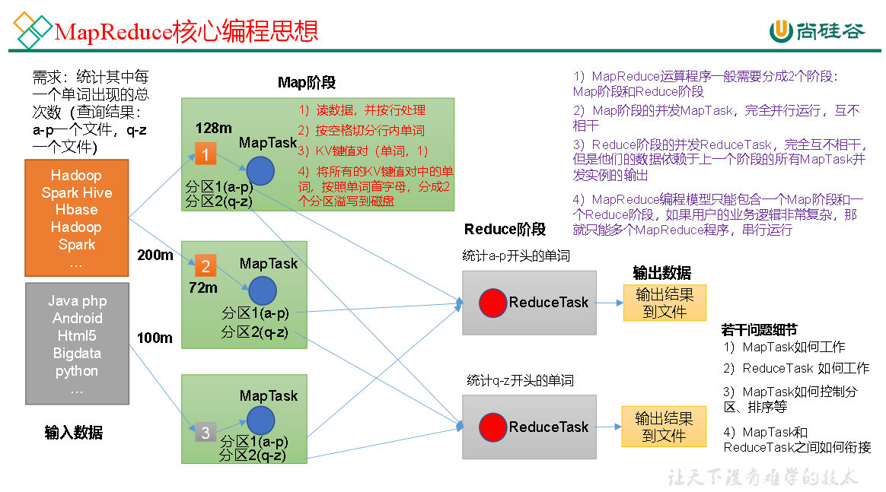
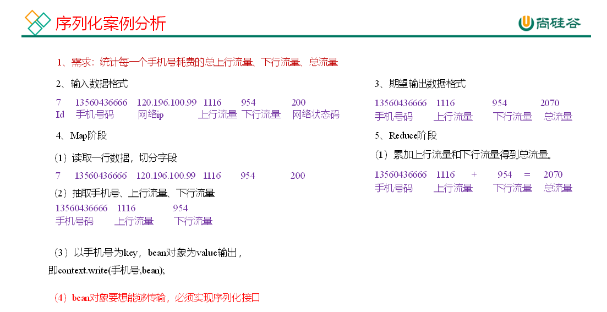

# 第1章 MapReduce概述

## 1.1 MapReduce定义

MapReduce是一个分布式运算程序的编程框架，是用户开发“基于Hadoop的数据分析应用”的核心框架。MapReduce核心功能是将用户编写的业务逻辑代码和自带默认组件整合成一个完整的分布式运算程序，并发运行在一个Hadoop集群上。

## 1.2 MapReduce优缺点

### 1.2.1 优点

1. MapReduce易于编程
   它简单的实现一些接口，就可以完成一个分布式程序，这个分布式程序可以分布到大量廉价的PC机器上运行。也就是说你写一个分布式程序，跟写一个简单的串行程序是一模一样的。就是因为这个特点使得MapReduce编程变得非常流行。

2. 良好的扩展性
   当你的计算资源不能得到满足的时候，你可以通过简单的增加机器来扩展它的计算能力。

3. 高容错性
   MapReduce设计的初衷就是使程序能够部署在廉价的PC机器上，这就要求它具有很高的容错性。比如其中一台机器挂了，它可以把上面的计算任务转移到另外一个节点上运行，不至于这个任务运行失败，而且这个过程不需要人工参与，而完全是由Hadoop内部完成的。

4. 适合PB级以上海量数据的离线处理

可以实现上千台服务器集群并发工作，提供数据处理能力。

### 1.2.2 缺点

1. 不擅长实时计算
   MapReduce无法像MySQL一样，在毫秒或者秒级内返回结果。

2. 不擅长流式计算
   流式计算的输入数据是动态的，而MapReduce的输入数据集是静态的，不能动态变化。这是因为MapReduce自身的设计特点决定了数据源必须是静态的。

3. 不擅长DAG（有向无环图）计算
   多个应用程序存在依赖关系，后一个应用程序的输入为前一个的输出。在这种情况下，MapReduce并不是不能做，而是使用后，每个MapReduce作业的输出结果都会写入到磁盘，会造成大量的磁盘IO，导致性能非常的低下。

## 1.3 MapReduce核心思想



（1）分布式的运算程序往往需要分成至少2个阶段。

（2）第一个阶段的MapTask并发实例，完全并行运行，互不相干。

（3）第二个阶段的ReduceTask并发实例互不相干，但是他们的数据依赖于上一个阶段的所有MapTask并发实例的输出。

（4）MapReduce编程模型只能包含一个Map阶段和一个Reduce阶段，如果用户的业务逻辑非常复杂，那就只能多个MapReduce程序，串行运行。

总结：分析WordCount数据流走向深入理解MapReduce核心思想。

## 1.4 MapReduce进程

一个完整的MapReduce程序在分布式运行时有三类实例进程：

（1）MrAppMaster：负责整个程序的过程调度及状态协调。

（2）MapTask：负责Map阶段的整个数据处理流程。

（3）ReduceTask：负责Reduce阶段的整个数据处理流程。

## 1.5 官方WordCount源码

采用反编译工具反编译源码，发现WordCount案例有Map类、Reduce类和驱动类。且数据的类型是Hadoop自身封装的序列化类型。

## 1.6 常用数据序列化类型

| Java类型 | Hadoop Writable类型 |
| -------- | ------------------- |
| Boolean  | BooleanWritable     |
| Byte     | ByteWritable        |
| Int      | IntWritable         |
| Float    | FloatWritable       |
| Long     | LongWritable        |
| Double   | DoubleWritable      |
| String   | Text                |
| Map      | MapWritable         |
| Array    | ArrayWritable       |
| Null     | NullWritable        |

## 1.7 MapReduce编程规范

用户编写的程序分成三个部分：Mapper、Reducer和Driver。


## 1.8 WordCount案例实操

### 1.8.1 本地测试

1）需求

在给定的文本文件中统计输出每一个单词出现的总次数

（1）输入数据

```java
atguigu atguigu
ss ss
cls cls
jiao
banzhang
xue
hadoop
```

（2）期望输出数据

```java
atguigu	2
banzhang	1
cls	2
hadoop	1
jiao	1
ss	2
xue	1
```

2）需求分析

按照MapReduce编程规范，分别编写Mapper，Reducer，Driver。


3）环境准备

（1）创建maven工程，MapReduceDemo

（2）在pom.xml文件中添加如下依赖

```xml
<dependencies>
    <dependency>
        <groupId>org.apache.hadoop</groupId>
        <artifactId>hadoop-client</artifactId>
        <version>3.1.3</version>
    </dependency>
    <dependency>
        <groupId>junit</groupId>
        <artifactId>junit</artifactId>
        <version>4.12</version>
    </dependency>
    <dependency>
        <groupId>org.slf4j</groupId>
        <artifactId>slf4j-log4j12</artifactId>
        <version>1.7.30</version>
    </dependency>
</dependencies>
```

（2）在项目的src/main/resources目录下，新建一个文件，命名为“log4j.properties”，在文件中填入。

```properties
log4j.rootLogger=INFO, stdout  
log4j.appender.stdout=org.apache.log4j.ConsoleAppender  
log4j.appender.stdout.layout=org.apache.log4j.PatternLayout  
log4j.appender.stdout.layout.ConversionPattern=%d %p [%c] - %m%n  
log4j.appender.logfile=org.apache.log4j.FileAppender  
log4j.appender.logfile.File=target/spring.log  
log4j.appender.logfile.layout=org.apache.log4j.PatternLayout  
log4j.appender.logfile.layout.ConversionPattern=%d %p [%c] - %m%n
```

（3）创建包名：com.atguigu.mapreduce.wordcount

4）编写程序

（1）编写Mapper类

```java
package com.atguigu.mapreduce.wordcount;
import java.io.IOException;
import org.apache.hadoop.io.IntWritable;
import org.apache.hadoop.io.LongWritable;
import org.apache.hadoop.io.Text;
import org.apache.hadoop.mapreduce.Mapper;
public class WordCountMapper extends Mapper<LongWritable, Text, Text, IntWritable>{
	
	Text k = new Text();
	IntWritable v = new IntWritable(1);
	
	@Override
	protected void map(LongWritable key, Text value, Context context)	throws IOException, InterruptedException {
		
		// 1 获取一行
		String line = value.toString();
		
		// 2 切割
		String[] words = line.split(" ");
		
		// 3 输出
		for (String word : words) {
			k.set(word);
			context.write(k, v);
		}
	}
}
```

（2）编写Reducer类

```java
package com.atguigu.mapreduce.wordcount;
import java.io.IOException;
import org.apache.hadoop.io.IntWritable;
import org.apache.hadoop.io.Text;
import org.apache.hadoop.mapreduce.Reducer;

public class WordCountReducer extends Reducer<Text, IntWritable, Text, IntWritable>{

int sum;
IntWritable v = new IntWritable();

	@Override
	protected void reduce(Text key, Iterable<IntWritable> values,Context context) throws IOException, InterruptedException {
		
		// 1 累加求和
		sum = 0;
		for (IntWritable count : values) {
			sum += count.get();
		}
		
		// 2 输出
         v.set(sum);
		context.write(key,v);
	}
}
```

（3）编写Driver驱动类

```java
package com.atguigu.mapreduce.wordcount;
import java.io.IOException;
import org.apache.hadoop.conf.Configuration;
import org.apache.hadoop.fs.Path;
import org.apache.hadoop.io.IntWritable;
import org.apache.hadoop.io.Text;
import org.apache.hadoop.mapreduce.Job;
import org.apache.hadoop.mapreduce.lib.input.FileInputFormat;
import org.apache.hadoop.mapreduce.lib.output.FileOutputFormat;

public class WordCountDriver {

	public static void main(String[] args) throws IOException, ClassNotFoundException, InterruptedException {

		// 1 获取配置信息以及获取job对象
		Configuration conf = new Configuration();
		Job job = Job.getInstance(conf);

		// 2 关联本Driver程序的jar
		job.setJarByClass(WordCountDriver.class);

		// 3 关联Mapper和Reducer的jar
		job.setMapperClass(WordCountMapper.class);
		job.setReducerClass(WordCountReducer.class);

		// 4 设置Mapper输出的kv类型
		job.setMapOutputKeyClass(Text.class);
		job.setMapOutputValueClass(IntWritable.class);

		// 5 设置最终输出kv类型
		job.setOutputKeyClass(Text.class);
		job.setOutputValueClass(IntWritable.class);
		
		// 6 设置输入和输出路径
		FileInputFormat.setInputPaths(job, new Path(args[0]));
		FileOutputFormat.setOutputPath(job, new Path(args[1]));

		// 7 提交job
		boolean result = job.waitForCompletion(true);
		System.exit(result ? 0 : 1);
	}
}
```

5）本地测试

（1）需要首先配置好HADOOP_HOME变量以及Windows运行依赖

（2）在IDEA/Eclipse上运行程序

### 1.8.2 提交到集群测试

集群上测试

（1）用maven打jar包，需要添加的打包插件依赖

```xml
<build>
    <plugins>
        <plugin>
            <artifactId>maven-compiler-plugin</artifactId>
            <version>3.6.1</version>
            <configuration>
                <source>1.8</source>
                <target>1.8</target>
            </configuration>
        </plugin>
        <plugin>
            <artifactId>maven-assembly-plugin</artifactId>
            <configuration>
                <descriptorRefs>
                    <descriptorRef>jar-with-dependencies</descriptorRef>
                </descriptorRefs>
            </configuration>
            <executions>
                <execution>
                    <id>make-assembly</id>
                    <phase>package</phase>
                    <goals>
                        <goal>single</goal>
                    </goals>
                </execution>
            </executions>
        </plugin>
    </plugins>
</build>
```

注意：如果工程上显示红叉。在项目上右键->maven->Reimport刷新即可。

（2）将程序打成jar包

 

（3）修改不带依赖的jar包名称为wc.jar，并拷贝该jar包到Hadoop集群的/opt/module/hadoop-3.1.3路径。

（4）启动Hadoop集群

`[atguigu@hadoop102 hadoop-3.1.3]$ sbin/start-dfs.sh`

`[atguigu@hadoop103 hadoop-3.1.3]$ sbin/start-yarn.sh`

（5）执行WordCount程序

```shell
[atguigu@hadoop102 hadoop-3.1.3]$ hadoop jar  wc.jar
com.atguigu.mapreduce.wordcount.WordCountDriver /user/atguigu/input /user/atguigu/output
```


# 第2章 Hadoop序列化

## 2.1 序列化概述

1）什么是序列化

序列化就是把内存中的对象，转换成字节序列（或其他数据传输协议）以便于存储到磁盘（持久化）和网络传输。 

反序列化就是将收到字节序列（或其他数据传输协议）或者是磁盘的持久化数据，转换成内存中的对象。

2）为什么要序列化

一般来说，“活的”对象只生存在内存里，关机断电就没有了。而且“活的”对象只能由本地的进程使用，不能被发送到网络上的另外一台计算机。 然而序列化可以存储“活的”对象，可以将“活的”对象发送到远程计算机。

3）为什么不用Java的序列化

Java的序列化是一个重量级序列化框架（Serializable），一个对象被序列化后，会附带很多额外的信息（各种校验信息，Header，继承体系等），不便于在网络中高效传输。所以，Hadoop自己开发了一套序列化机制（Writable）。

4）Hadoop序列化特点：

（1）紧凑 ：高效使用存储空间。

（2）快速：读写数据的额外开销小。

（3）互操作：支持多语言的交互

## 2.2 自定义bean对象实现序列化接口（Writable）

在企业开发中往往常用的基本序列化类型不能满足所有需求，比如在Hadoop框架内部传递一个bean对象，那么该对象就需要实现序列化接口。

具体实现bean对象序列化步骤如下7步。

（1）必须实现Writable接口

（2）反序列化时，需要反射调用空参构造函数，所以必须有空参构造

```java
public FlowBean() {
	super();
}
```

（3）重写序列化方法

```java
@Override
public void write(DataOutput out) throws IOException {
	out.writeLong(upFlow);
	out.writeLong(downFlow);
	out.writeLong(sumFlow);
}
```

（4）重写反序列化方法

```java
@Override
public void readFields(DataInput in) throws IOException {
	upFlow = in.readLong();
	downFlow = in.readLong();
	sumFlow = in.readLong();
}
```

（5）注意反序列化的顺序和序列化的顺序完全一致

（6）要想把结果显示在文件中，需要重写toString()，可用"t"分开，方便后续用。

（7）如果需要将自定义的bean放在key中传输，则还需要实现Comparable接口，因为MapReduce框中的Shuffle过程要求对key必须能排序。详见后面排序案例。

```java
@Override
public int compareTo(FlowBean o) {
	// 倒序排列，从大到小
	return this.sumFlow > o.getSumFlow() ? -1 : 1;
}
```

## 2.3 序列化案例实操	

1）需求

统计每一个手机号耗费的总上行流量、总下行流量、总流量

（1）输入数据

```java
1	13736230513	192.196.100.1	www.atguigu.com	2481	24681	200
2	13846544121	192.196.100.2			264	0	200
3 	13956435636	192.196.100.3			132	1512	200
4 	13966251146	192.168.100.1			240	0	404
5 	18271575951	192.168.100.2	www.atguigu.com	1527	2106	200
6 	84188413	192.168.100.3	www.atguigu.com	4116	1432	200
7 	13590439668	192.168.100.4			1116	954	200
8 	15910133277	192.168.100.5	www.hao123.com	3156	2936	200
9 	13729199489	192.168.100.6			240	0	200
10 	13630577991	192.168.100.7	www.shouhu.com	6960	690	200
11 	15043685818	192.168.100.8	www.baidu.com	3659	3538	200
12 	15959002129	192.168.100.9	www.atguigu.com	1938	180	500
13 	13560439638	192.168.100.10			918	4938	200
14 	13470253144	192.168.100.11			180	180	200
15 	13682846555	192.168.100.12	www.qq.com	1938	2910	200
16 	13992314666	192.168.100.13	www.gaga.com	3008	3720	200
17 	13509468723	192.168.100.14	www.qinghua.com	7335	110349	404
18 	18390173782	192.168.100.15	www.sogou.com	9531	2412	200
19 	13975057813	192.168.100.16	www.baidu.com	11058	48243	200
20 	13768778790	192.168.100.17			120	120	200
21 	13568436656	192.168.100.18	www.alibaba.com	2481	24681	200
22 	13568436656	192.168.100.19			1116	954	200
```

（2）输入数据格式：

7 	13560436666	120.196.100.99		1116		 954			200id	手机号码		网络ip			上行流量 下行流量   状态码

（3）期望输出数据格式

13560436666 		1116		   954 			2070手机号码		  上行流量    下行流量		总流量

2）需求分析



3）编写MapReduce程序

（1）编写流量统计的Bean对象

```java
package com.atguigu.mapreduce.writable;

import org.apache.hadoop.io.Writable;
import java.io.DataInput;
import java.io.DataOutput;
import java.io.IOException;

//1 继承Writable接口
public class FlowBean implements Writable {

    private long upFlow; //上行流量
    private long downFlow; //下行流量
    private long sumFlow; //总流量

    //2 提供无参构造
    public FlowBean() {
    }

    //3 提供三个参数的getter和setter方法
    public long getUpFlow() {
        return upFlow;
    }

    public void setUpFlow(long upFlow) {
        this.upFlow = upFlow;
    }

    public long getDownFlow() {
        return downFlow;
    }

    public void setDownFlow(long downFlow) {
        this.downFlow = downFlow;
    }

    public long getSumFlow() {
        return sumFlow;
    }

    public void setSumFlow(long sumFlow) {
        this.sumFlow = sumFlow;
    }

    public void setSumFlow() {
        this.sumFlow = this.upFlow + this.downFlow;
    }

    //4 实现序列化和反序列化方法,注意顺序一定要保持一致
    @Override
    public void write(DataOutput dataOutput) throws IOException {
        dataOutput.writeLong(upFlow);
        dataOutput.writeLong(downFlow);
        dataOutput.writeLong(sumFlow);
    }

    @Override
    public void readFields(DataInput dataInput) throws IOException {
        this.upFlow = dataInput.readLong();
        this.downFlow = dataInput.readLong();
        this.sumFlow = dataInput.readLong();
    }

    //5 重写ToString
    @Override
    public String toString() {
        return upFlow + "t" + downFlow + "t" + sumFlow;
    }
}
```

（2）编写Mapper类

```java
package com.atguigu.mapreduce.writable;

import org.apache.hadoop.io.LongWritable;
import org.apache.hadoop.io.Text;
import org.apache.hadoop.mapreduce.Mapper;
import java.io.IOException;

public class FlowMapper extends Mapper<LongWritable, Text, Text, FlowBean> {
    private Text outK = new Text();
    private FlowBean outV = new FlowBean();

    @Override
    protected void map(LongWritable key, Text value, Context context) throws IOException, InterruptedException {

        //1 获取一行数据,转成字符串
        String line = value.toString();

        //2 切割数据
        String[] split = line.split("t");

        //3 抓取我们需要的数据:手机号,上行流量,下行流量
        String phone = split[1];
        String up = split[split.length - 3];
        String down = split[split.length - 2];

        //4 封装outK outV
        outK.set(phone);
        outV.setUpFlow(Long.parseLong(up));
        outV.setDownFlow(Long.parseLong(down));
        outV.setSumFlow();

        //5 写出outK outV
        context.write(outK, outV);
    }
}
```

（3）编写Reducer类

```java
package com.atguigu.mapreduce.writable;

import org.apache.hadoop.io.Text;
import org.apache.hadoop.mapreduce.Reducer;
import java.io.IOException;

public class FlowReducer extends Reducer<Text, FlowBean, Text, FlowBean> {
    private FlowBean outV = new FlowBean();
    @Override
    protected void reduce(Text key, Iterable<FlowBean> values, Context context) throws IOException, InterruptedException {

        long totalUp = 0;
        long totalDown = 0;

        //1 遍历values,将其中的上行流量,下行流量分别累加
        for (FlowBean flowBean : values) {
            totalUp += flowBean.getUpFlow();
            totalDown += flowBean.getDownFlow();
        }

        //2 封装outKV
        outV.setUpFlow(totalUp);
        outV.setDownFlow(totalDown);
        outV.setSumFlow();

        //3 写出outK outV
        context.write(key,outV);
    }
}
```

（4）编写Driver驱动类

```java
package com.atguigu.mapreduce.writable;

import org.apache.hadoop.conf.Configuration;
import org.apache.hadoop.fs.Path;
import org.apache.hadoop.io.Text;
import org.apache.hadoop.mapreduce.Job;
import org.apache.hadoop.mapreduce.lib.input.FileInputFormat;
import org.apache.hadoop.mapreduce.lib.output.FileOutputFormat;
import java.io.IOException;

public class FlowDriver {
    public static void main(String[] args) throws IOException, ClassNotFoundException, InterruptedException {

        //1 获取job对象
        Configuration conf = new Configuration();
        Job job = Job.getInstance(conf);

        //2 关联本Driver类
        job.setJarByClass(FlowDriver.class);

        //3 关联Mapper和Reducer
        job.setMapperClass(FlowMapper.class);
        job.setReducerClass(FlowReducer.class);
        
		//4 设置Map端输出KV类型
        job.setMapOutputKeyClass(Text.class);
        job.setMapOutputValueClass(FlowBean.class);
        
		//5 设置程序最终输出的KV类型
        job.setOutputKeyClass(Text.class);
        job.setOutputValueClass(FlowBean.class);
        
		//6 设置程序的输入输出路径
        FileInputFormat.setInputPaths(job, new Path("D:inputflow"));
        FileOutputFormat.setOutputPath(job, new Path("D:flowoutput"));
        
		//7 提交Job
        boolean b = job.waitForCompletion(true);
        System.exit(b ? 0 : 1);
    }
}
```


# 第3章 MapReduce框架原理

## 3.1 InputFormat数据输入


### 3.1.1 切片与MapTask并行度决定机制

**1）问题引出**

MapTask的并行度决定Map阶段的任务处理并发度，进而影响到整个Job的处理速度。

思考：1G的数据，启动8个MapTask，可以提高集群的并发处理能力。那么1K的数据，也启动8个MapTask，会提高集群性能吗？MapTask并行任务是否越多越好呢？哪些因素影响了MapTask并行度？

**2）MapTask并行度决定机制**

数据块：Block是HDFS物理上把数据分成一块一块。数据块是HDFS存储数据单位。

数据切片：数据切片只是在逻辑上对输入进行分片，并不会在磁盘上将其切分成片进行存储。数据切片是MapReduce程序计算输入数据的单位，一个切片会对应启动一个MapTask。


### 3.1.2 Job提交流程源码和切片源码详解

**1）Job提交流程源码详解**

```java
waitForCompletion()

submit();

// 1建立连接
	connect();	
		// 1）创建提交Job的代理
		new Cluster(getConfiguration());
			// （1）判断是本地运行环境还是yarn集群运行环境
			initialize(jobTrackAddr, conf); 

// 2 提交job
submitter.submitJobInternal(Job.this, cluster)

	// 1）创建给集群提交数据的Stag路径
	Path jobStagingArea = JobSubmissionFiles.getStagingDir(cluster, conf);

	// 2）获取jobid ，并创建Job路径
	JobID jobId = submitClient.getNewJobID();

	// 3）拷贝jar包到集群
copyAndConfigureFiles(job, submitJobDir);	
	rUploader.uploadFiles(job, jobSubmitDir);

	// 4）计算切片，生成切片规划文件
writeSplits(job, submitJobDir);
		maps = writeNewSplits(job, jobSubmitDir);
		input.getSplits(job);

	// 5）向Stag路径写XML配置文件
writeConf(conf, submitJobFile);
	conf.writeXml(out);

	// 6）提交Job,返回提交状态
status = submitClient.submitJob(jobId, submitJobDir.toString(), job.getCredentials());
```


**2）FileInputFormat切片源码解析（input.getSplits(job)）**


### 3.1.3 FileInputFormat切片机制


### 3.1.4 TextInputFormat

**1）FileInputFormat实现类**

思考：在运行MapReduce程序时，输入的文件格式包括：基于行的日志文件、二进制格式文件、数据库表等。那么，针对不同的数据类型，MapReduce是如何读取这些数据的呢？

> FileInputFormat常见的接口实现类包括：TextInputFormat、KeyValueTextInputFormat、NLineInputFormat、CombineTextInputFormat和自定义InputFormat等。

**2）TextInputFormat**

> TextInputFormat是默认的FileInputFormat实现类。按行读取每条记录。键是存储该行在整个文件中的起始字节偏移量， LongWritable类型。值是这行的内容，不包括任何行终止符（换行符和回车符），Text类型。

以下是一个示例，比如，一个分片包含了如下4条文本记录。

```java
Rich learning form
Intelligent learning engine
Learning more convenient
From the real demand for more close to the enterprise
```

每条记录表示为以下键/值对：

```java
(0,Rich learning form)
(20,Intelligent learning engine)
(49,Learning more convenient)
(74,From the real demand for more close to the enterprise)
```

### 3.1.5 CombineTextInputFormat切片机制

框架默认的TextInputFormat切片机制是对任务按文件规划切片，不管文件多小，都会是一个单独的切片，都会交给一个MapTask，这样如果有大量小文件，就会产生大量的MapTask，处理效率极其低下。

**1）应用场景：**

CombineTextInputFormat用于小文件过多的场景，它可以将多个小文件从逻辑上规划到一个切片中，这样，多个小文件就可以交给一个MapTask处理。

**2）虚拟存储切片最大值设置**

`CombineTextInputFormat.setMaxInputSplitSize(job, 4194304);// 4m`

注意：虚拟存储切片最大值设置最好根据实际的小文件大小情况来设置具体的值。

**3）切片机制**

生成切片过程包括：虚拟存储过程和切片过程二部分。


（1）虚拟存储过程：

将输入目录下所有文件大小，依次和设置的setMaxInputSplitSize值比较，如果不大于设置的最大值，逻辑上划分一个块。如果输入文件大于设置的最大值且大于两倍，那么以最大值切割一块；当剩余数据大小超过设置的最大值且不大于最大值2倍，此时将文件均分成2个虚拟存储块（防止出现太小切片）。

例如setMaxInputSplitSize值为4M，输入文件大小为8.02M，则先逻辑上分成一个4M。剩余的大小为4.02M，如果按照4M逻辑划分，就会出现0.02M的小的虚拟存储文件，所以将剩余的4.02M文件切分成（2.01M和2.01M）两个文件。

（2）切片过程：

​		（a）判断虚拟存储的文件大小是否大于setMaxInputSplitSize值，大于等于则单独形成一个切片。

​		（b）如果不大于则跟下一个虚拟存储文件进行合并，共同形成一个切片。

​		（c）测试举例：有4个小文件大小分别为1.7M、5.1M、3.4M以及6.8M这四个小文件，则虚拟存储之后形成6个文件块，大小分别为：

1.7M，（2.55M、2.55M），3.4M以及（3.4M、3.4M）

最终会形成3个切片，大小分别为：

（1.7+2.55）M，（2.55+3.4）M，（3.4+3.4）M

### 3.1.6 CombineTextInputFormat案例实操

**1）需求**

将输入的大量小文件合并成一个切片统一处理。

（1）输入数据

准备4个小文件

   

（2）期望

期望一个切片处理4个文件

**2）实现过程**

（1）不做任何处理，运行1.8节的WordCount案例程序，观察切片个数为4。

`number of splits:4`

（2）在WordcountDriver中增加如下代码，运行程序，并观察运行的切片个数为3。

​		（a）驱动类中添加代码如下：

```java
// 如果不设置InputFormat，它默认用的是TextInputFormat.class
job.setInputFormatClass(CombineTextInputFormat.class);
//虚拟存储切片最大值设置4m
CombineTextInputFormat.setMaxInputSplitSize(job, 4194304);
```

​		（b）运行如果为3个切片。

`number of splits:3`

（3）在WordcountDriver中增加如下代码，运行程序，并观察运行的切片个数为1。

​		（a）驱动中添加代码如下：

```java
// 如果不设置InputFormat，它默认用的是TextInputFormat.class
job.setInputFormatClass(CombineTextInputFormat.class);
//虚拟存储切片最大值设置20m
CombineTextInputFormat.setMaxInputSplitSize(job, 20971520);
```

​		（b）运行如果为1个切片

`number of splits:1`

## 3.2 MapReduce工作流程


上面的流程是整个MapReduce最全工作流程，但是Shuffle过程只是从第7步开始到第16步结束，具体Shuffle过程详解，如下：

**（1）MapTask收集我们的map()方法输出的kv对，放到内存缓冲区中**

**（2）从内存缓冲区不断溢出本地磁盘文件，可能会溢出多个文件**

**（3）多个溢出文件会被合并成大的溢出文件**

**（4）在溢出过程及合并的过程中，都要调用Partitioner进行分区和针对key进行排序**

**（5）ReduceTask根据自己的分区号，去各个MapTask机器上取相应的结果分区数据**

**（6）ReduceTask会抓取到同一个分区的来自不同MapTask的结果文件，ReduceTask会将这些文件再进行合并（归并排序）**

**（7）合并成大文件后，Shuffle的过程也就结束了，后面进入ReduceTask的逻辑运算过程（从文件中取出一个一个的键值对Group，调用用户自定义的reduce()方法）**

> 注意：
>
> （1）Shuffle中的缓冲区大小会影响到MapReduce程序的执行效率，原则上说，缓冲区越大，磁盘io的次数越?少，执行速度就越快。
>
> （2）缓冲区的大小可以通过参数调整，参数：mapreduce.task.io.sort.mb默认100M。

## 3.3 Shuffle机制

### 3.3.1 Shuffle机制

Map方法之后，Reduce方法之前的数据处理过程称之为Shuffle。


### 3.3.2 Partition分区


### 3.3.3 Partition分区案例实操

**1）需求**

将统计结果按照手机归属地不同省份输出到不同文件中（分区）

（1）输入数据

```java
1	13736230513	192.196.100.1	www.atguigu.com	2481	24681	200
2	13846544121	192.196.100.2			264	0	200
3 	13956435636	192.196.100.3			132	1512	200
4 	13966251146	192.168.100.1			240	0	404
5 	18271575951	192.168.100.2	www.atguigu.com	1527	2106	200
6 	84188413	192.168.100.3	www.atguigu.com	4116	1432	200
7 	13590439668	192.168.100.4			1116	954	200
8 	15910133277	192.168.100.5	www.hao123.com	3156	2936	200
9 	13729199489	192.168.100.6			240	0	200
10 	13630577991	192.168.100.7	www.shouhu.com	6960	690	200
11 	15043685818	192.168.100.8	www.baidu.com	3659	3538	200
12 	15959002129	192.168.100.9	www.atguigu.com	1938	180	500
13 	13560439638	192.168.100.10			918	4938	200
14 	13470253144	192.168.100.11			180	180	200
15 	13682846555	192.168.100.12	www.qq.com	1938	2910	200
16 	13992314666	192.168.100.13	www.gaga.com	3008	3720	200
17 	13509468723	192.168.100.14	www.qinghua.com	7335	110349	404
18 	18390173782	192.168.100.15	www.sogou.com	9531	2412	200
19 	13975057813	192.168.100.16	www.baidu.com	11058	48243	200
20 	13768778790	192.168.100.17			120	120	200
21 	13568436656	192.168.100.18	www.alibaba.com	2481	24681	200
22 	13568436656	192.168.100.19			1116	954	200
```

（2）期望输出数据

​	手机号136、137、138、139开头都分别放到一个独立的4个文件中，其他开头的放到一个文件中。

**2）需求分析**


**3）在案例2.3的基础上，增加一个分区类**

```java
package com.atguigu.mapreduce.partitioner;
import org.apache.hadoop.io.Text;
import org.apache.hadoop.mapreduce.Partitioner;

public class ProvincePartitioner extends Partitioner<Text, FlowBean> {

    @Override
    public int getPartition(Text text, FlowBean flowBean, int numPartitions) {
        //获取手机号前三位prePhone
        String phone = text.toString();
        String prePhone = phone.substring(0, 3);

        //定义一个分区号变量partition,根据prePhone设置分区号
        int partition;

        if("136".equals(prePhone)){
            partition = 0;
        }else if("137".equals(prePhone)){
            partition = 1;
        }else if("138".equals(prePhone)){
            partition = 2;
        }else if("139".equals(prePhone)){
            partition = 3;
        }else {
            partition = 4;
        }

        //最后返回分区号partition
        return partition;
    }
}
```

**4）在驱动函数中增加自定义数据分区设置和ReduceTask设置**

```java
package com.atguigu.mapreduce.partitioner;
import org.apache.hadoop.conf.Configuration;
import org.apache.hadoop.fs.Path;
import org.apache.hadoop.io.Text;
import org.apache.hadoop.mapreduce.Job;
import org.apache.hadoop.mapreduce.lib.input.FileInputFormat;
import org.apache.hadoop.mapreduce.lib.output.FileOutputFormat;
import java.io.IOException;

public class FlowDriver {

    public static void main(String[] args) throws IOException, ClassNotFoundException, InterruptedException {

        //1 获取job对象
        Configuration conf = new Configuration();
        Job job = Job.getInstance(conf);

        //2 关联本Driver类
        job.setJarByClass(FlowDriver.class);

        //3 关联Mapper和Reducer
        job.setMapperClass(FlowMapper.class);
        job.setReducerClass(FlowReducer.class);

        //4 设置Map端输出数据的KV类型
        job.setMapOutputKeyClass(Text.class);
        job.setMapOutputValueClass(FlowBean.class);

        //5 设置程序最终输出的KV类型
        job.setOutputKeyClass(Text.class);
        job.setOutputValueClass(FlowBean.class);

        //8 指定自定义分区器
        job.setPartitionerClass(ProvincePartitioner.class);

        //9 同时指定相应数量的ReduceTask
        job.setNumReduceTasks(5);

        //6 设置输入输出路径
        FileInputFormat.setInputPaths(job, new Path("D:\\inputflow"));
        FileOutputFormat.setOutputPath(job, new Path("D\\partitionout"));

        //7 提交Job
        boolean b = job.waitForCompletion(true);
        System.exit(b ? 0 : 1);
    }
}
```

### 3.3.4 WritableComparable排序


**自定义排序WritableComparable原理分析**

bean对象做为key传输，需要实现WritableComparable接口重写compareTo方法，就可以实现排序。

```java
@Override
public int compareTo(FlowBean bean) {

	int result;
		
	// 按照总流量大小，倒序排列
	if (this.sumFlow > bean.getSumFlow()) {
		result = -1;
	}else if (this.sumFlow < bean.getSumFlow()) {
		result = 1;
	}else {
		result = 0;
	}

	return result;
}
```

### 3.3.5 WritableComparable排序案例实操（全排序）

**1）需求**

根据案例2.3序列化案例产生的结果再次对总流量进行倒序排序。

（1）输入数据phone_data.txt

```java
1	13736230513	192.196.100.1	www.atguigu.com	2481	24681	200
2	13846544121	192.196.100.2			264	0	200
3 	13956435636	192.196.100.3			132	1512	200
4 	13966251146	192.168.100.1			240	0	404
5 	18271575951	192.168.100.2	www.atguigu.com	1527	2106	200
6 	84188413	192.168.100.3	www.atguigu.com	4116	1432	200
7 	13590439668	192.168.100.4			1116	954	200
8 	15910133277	192.168.100.5	www.hao123.com	3156	2936	200
9 	13729199489	192.168.100.6			240	0	200
10 	13630577991	192.168.100.7	www.shouhu.com	6960	690	200
11 	15043685818	192.168.100.8	www.baidu.com	3659	3538	200
12 	15959002129	192.168.100.9	www.atguigu.com	1938	180	500
13 	13560439638	192.168.100.10			918	4938	200
14 	13470253144	192.168.100.11			180	180	200
15 	13682846555	192.168.100.12	www.qq.com	1938	2910	200
16 	13992314666	192.168.100.13	www.gaga.com	3008	3720	200
17 	13509468723	192.168.100.14	www.qinghua.com	7335	110349	404
18 	18390173782	192.168.100.15	www.sogou.com	9531	2412	200
19 	13975057813	192.168.100.16	www.baidu.com	11058	48243	200
20 	13768778790	192.168.100.17			120	120	200
21 	13568436656	192.168.100.18	www.alibaba.com	2481	24681	200
22 	13568436656	192.168.100.19			1116	954	200
```

   第一次处理后的数据  part-r-00000

（2）期望输出数据

```java
13509468723	7335	110349	117684
13736230513	2481	24681	27162
13956435636	132		1512	1644
13846544121	264		0		264
。。。 。。。
```

**2）需求分析**


**3）代码实现**

（1）FlowBean对象在在需求1基础上增加了比较功能

```java
package com.atguigu.mapreduce.writablecompable;

import org.apache.hadoop.io.WritableComparable;
import java.io.DataInput;
import java.io.DataOutput;
import java.io.IOException;

public class FlowBean implements WritableComparable<FlowBean> {

    private long upFlow; //上行流量
    private long downFlow; //下行流量
    private long sumFlow; //总流量

    //提供无参构造
    public FlowBean() {
    }

    //生成三个属性的getter和setter方法
    public long getUpFlow() {
        return upFlow;
    }

    public void setUpFlow(long upFlow) {
        this.upFlow = upFlow;
    }

    public long getDownFlow() {
        return downFlow;
    }

    public void setDownFlow(long downFlow) {
        this.downFlow = downFlow;
    }

    public long getSumFlow() {
        return sumFlow;
    }

    public void setSumFlow(long sumFlow) {
        this.sumFlow = sumFlow;
    }

    public void setSumFlow() {
        this.sumFlow = this.upFlow + this.downFlow;
    }

    //实现序列化和反序列化方法,注意顺序一定要一致
    @Override
    public void write(DataOutput out) throws IOException {
        out.writeLong(this.upFlow);
        out.writeLong(this.downFlow);
        out.writeLong(this.sumFlow);

    }

    @Override
    public void readFields(DataInput in) throws IOException {
        this.upFlow = in.readLong();
        this.downFlow = in.readLong();
        this.sumFlow = in.readLong();
    }

    //重写ToString,最后要输出FlowBean
    @Override
    public String toString() {
        return upFlow + "\t" + downFlow + "\t" + sumFlow;
    }

    @Override
    public int compareTo(FlowBean o) {

        //按照总流量比较,倒序排列
        if(this.sumFlow > o.sumFlow){
            return -1;
        }else if(this.sumFlow < o.sumFlow){
            return 1;
        }else {
            return 0;
        }
    }
}
```

（2）编写Mapper类

```java
package com.atguigu.mapreduce.writablecompable;

import org.apache.hadoop.io.LongWritable;
import org.apache.hadoop.io.Text;
import org.apache.hadoop.mapreduce.Mapper;
import java.io.IOException;

public class FlowMapper extends Mapper<LongWritable, Text, FlowBean, Text> {
    private FlowBean outK = new FlowBean();
    private Text outV = new Text();

    @Override
    protected void map(LongWritable key, Text value, Context context) throws IOException, InterruptedException {

        //1 获取一行数据
        String line = value.toString();

        //2 按照"\t",切割数据
        String[] split = line.split("\t");

        //3 封装outK outV
        outK.setUpFlow(Long.parseLong(split[1]));
        outK.setDownFlow(Long.parseLong(split[2]));
        outK.setSumFlow();
        outV.set(split[0]);

        //4 写出outK outV
        context.write(outK,outV);
    }
}
```

（3）编写Reducer类

```java
package com.atguigu.mapreduce.writablecompable;

import org.apache.hadoop.io.Text;
import org.apache.hadoop.mapreduce.Reducer;
import java.io.IOException;

public class FlowReducer extends Reducer<FlowBean, Text, Text, FlowBean> {
    @Override
    protected void reduce(FlowBean key, Iterable<Text> values, Context context) throws IOException, InterruptedException {

        //遍历values集合,循环写出,避免总流量相同的情况
        for (Text value : values) {
            //调换KV位置,反向写出
            context.write(value,key);
        }
    }
}
```

（4）编写Driver类

```java
package com.atguigu.mapreduce.writablecompable;

import org.apache.hadoop.conf.Configuration;
import org.apache.hadoop.fs.Path;
import org.apache.hadoop.io.Text;
import org.apache.hadoop.mapreduce.Job;
import org.apache.hadoop.mapreduce.lib.input.FileInputFormat;
import org.apache.hadoop.mapreduce.lib.output.FileOutputFormat;
import java.io.IOException;

public class FlowDriver {

    public static void main(String[] args) throws IOException, ClassNotFoundException, InterruptedException {

        //1 获取job对象
        Configuration conf = new Configuration();
        Job job = Job.getInstance(conf);

        //2 关联本Driver类
        job.setJarByClass(FlowDriver.class);

        //3 关联Mapper和Reducer
        job.setMapperClass(FlowMapper.class);
        job.setReducerClass(FlowReducer.class);

        //4 设置Map端输出数据的KV类型
        job.setMapOutputKeyClass(FlowBean.class);
        job.setMapOutputValueClass(Text.class);

        //5 设置程序最终输出的KV类型
        job.setOutputKeyClass(Text.class);
        job.setOutputValueClass(FlowBean.class);

        //6 设置输入输出路径
        FileInputFormat.setInputPaths(job, new Path("D:\\inputflow2"));
        FileOutputFormat.setOutputPath(job, new Path("D:\\comparout"));

        //7 提交Job
        boolean b = job.waitForCompletion(true);
        System.exit(b ? 0 : 1);
    }
}
```

### **3.3.6 WritableComparable排序案例实操（区内排序）

1）需求

要求每个省份手机号输出的文件中按照总流量内部排序。

2）需求分析

​	基于前一个需求，增加自定义分区类，分区按照省份手机号设置。


3）案例实操

（1）增加自定义分区类

package com.atguigu.mapreduce.partitionercompable;

 

import org.apache.hadoop.io.Text;

import org.apache.hadoop.mapreduce.Partitioner;

 

public class ProvincePartitioner2 extends Partitioner<FlowBean, Text> {

 

  @Override

  public int getPartition(FlowBean flowBean, Text text, int numPartitions) {

​    //获取手机号前三位

​    String phone = text.toString();

​    String prePhone = phone.substring(0, 3);

 

​    //定义一个分区号变量partition,根据prePhone设置分区号

​    int partition;

​    if("136".equals(prePhone)){

​      partition = 0;

​    }else if("137".equals(prePhone)){

​      partition = 1;

​    }else if("138".equals(prePhone)){

​      partition = 2;

​    }else if("139".equals(prePhone)){

​      partition = 3;

​    }else {

​      partition = 4;

​    }

 

​    //最后返回分区号partition

​    return partition;

  }

}

（2）在驱动类中添加分区类

// 设置自定义分区器

job.setPartitionerClass(ProvincePartitioner2.class);

 

// 设置对应的ReduceTask的个数

job.setNumReduceTasks(5);

### 3.3.7 Combiner合并


（6）自定义Combiner实现步骤

（a）自定义一个Combiner继承Reducer，重写Reduce方法

public class WordCountCombiner extends Reducer<Text, IntWritable, Text, IntWritable> {

 

  private IntWritable outV = new IntWritable();

 

  @Override

  protected void reduce(Text key, Iterable<IntWritable> values, Context context) throws IOException, InterruptedException {

 

​    int sum = 0;

​    for (IntWritable value : values) {

​      sum += value.get();

​    }

   

​    outV.set(sum);

   

​    context.write(key,outV);

  }

}

（b）在Job驱动类中设置：  

job.setCombinerClass(WordCountCombiner.class);

### 3.3.8 Combiner合并案例实操

1）需求

统计过程中对每一个MapTask的输出进行局部汇总，以减小网络传输量即采用Combiner功能。	

（1）数据输入


（2）期望输出数据

期望：Combine输入数据多，输出时经过合并，输出数据降低。

2）需求分析


3）案例实操-方案一

（1）增加一个WordCountCombiner类继承Reducer

package com.atguigu.mapreduce.combiner;

 

import org.apache.hadoop.io.IntWritable;

import org.apache.hadoop.io.Text;

import org.apache.hadoop.mapreduce.Reducer;

import java.io.IOException;

 

public class WordCountCombiner extends Reducer<Text, IntWritable, Text, IntWritable> {

 

private IntWritable outV = new IntWritable();

 

  @Override

  protected void reduce(Text key, Iterable<IntWritable> values, Context context) throws IOException, InterruptedException {

 

​    int sum = 0;

​    for (IntWritable value : values) {

​      sum += value.get();

​    }

 

​    //封装outKV

​    outV.set(sum);

 

​    //写出outKV

​    context.write(key,outV);

  }

}

（2）在WordcountDriver驱动类中指定Combiner

// 指定需要使用combiner，以及用哪个类作为combiner的逻辑

job.setCombinerClass(WordCountCombiner.class);

4）案例实操-方案二

（1）将WordcountReducer作为Combiner在WordcountDriver驱动类中指定

// 指定需要使用Combiner，以及用哪个类作为Combiner的逻辑

job.setCombinerClass(WordCountReducer.class);

运行程序，如下图所示

 

## 3.4 OutputFormat数据输出

### 3.4.1 OutputFormat接口实现类


### 3.4.2 自定义OutputFormat案例实操

1）需求

​	过滤输入的log日志，包含atguigu的网站输出到e:/atguigu.log，不包含atguigu的网站输出到e:/other.log。

（1）输入数据


（2）期望输出数据

 

2）需求分析


3）案例实操

（1）编写LogMapper类

package com.atguigu.mapreduce.outputformat;

 

import org.apache.hadoop.io.LongWritable;

import org.apache.hadoop.io.NullWritable;

import org.apache.hadoop.io.Text;

import org.apache.hadoop.mapreduce.Mapper;

 

import java.io.IOException;

 

public class LogMapper extends Mapper<LongWritable, Text,Text, NullWritable> {

  @Override

  protected void map(LongWritable key, Text value, Context context) throws IOException, InterruptedException {

​    //不做任何处理,直接写出一行log数据

​    context.write(value,NullWritable.get());

  }

}

（2）编写LogReducer类

package com.atguigu.mapreduce.outputformat;

 

import org.apache.hadoop.io.NullWritable;

import org.apache.hadoop.io.Text;

import org.apache.hadoop.mapreduce.Reducer;

 

import java.io.IOException;

 

public class LogReducer extends Reducer<Text, NullWritable,Text, NullWritable> {

  @Override

  protected void reduce(Text key, Iterable<NullWritable> values, Context context) throws IOException, InterruptedException {

​    // 防止有相同的数据,迭代写出

​    for (NullWritable value : values) {

​      context.write(key,NullWritable.get());

​    }

  }

}

（3）自定义一个LogOutputFormat类

package com.atguigu.mapreduce.outputformat;

 

import org.apache.hadoop.io.NullWritable;

import org.apache.hadoop.io.Text;

import org.apache.hadoop.mapreduce.RecordWriter;

import org.apache.hadoop.mapreduce.TaskAttemptContext;

import org.apache.hadoop.mapreduce.lib.output.FileOutputFormat;

 

import java.io.IOException;

 

public class LogOutputFormat extends FileOutputFormat<Text, NullWritable> {

  @Override

  public RecordWriter<Text, NullWritable> getRecordWriter(TaskAttemptContext job) throws IOException, InterruptedException {

​    //创建一个自定义的RecordWriter返回

​    LogRecordWriter logRecordWriter = new LogRecordWriter(job);

​    return logRecordWriter;

  }

}

（4）编写LogRecordWriter类

package com.atguigu.mapreduce.outputformat;

 

import org.apache.hadoop.fs.FSDataOutputStream;

import org.apache.hadoop.fs.FileSystem;

import org.apache.hadoop.fs.Path;

import org.apache.hadoop.io.IOUtils;

import org.apache.hadoop.io.NullWritable;

import org.apache.hadoop.io.Text;

import org.apache.hadoop.mapreduce.RecordWriter;

import org.apache.hadoop.mapreduce.TaskAttemptContext;

 

import java.io.IOException;

 

public class LogRecordWriter extends RecordWriter<Text, NullWritable> {

 

  private FSDataOutputStream atguiguOut;

  private FSDataOutputStream otherOut;

 

  public LogRecordWriter(TaskAttemptContext job) {

​    try {

​      //获取文件系统对象

​      FileSystem fs = FileSystem.get(job.getConfiguration());

​      //用文件系统对象创建两个输出流对应不同的目录

​      atguiguOut = fs.create(new Path("d:/hadoop/atguigu.log"));

​      otherOut = fs.create(new Path("d:/hadoop/other.log"));

​    } catch (IOException e) {

​      e.printStackTrace();

​    }

  }

 

  @Override

  public void write(Text key, NullWritable value) throws IOException, InterruptedException {

​    String log = key.toString();

​    //根据一行的log数据是否包含atguigu,判断两条输出流输出的内容

​    if (log.contains("atguigu")) {

​      atguiguOut.writeBytes(log + "n");

​    } else {

​      otherOut.writeBytes(log + "n");

​    }

  }

 

  @Override

  public void close(TaskAttemptContext context) throws IOException, InterruptedException {

​    //关流

​    IOUtils.closeStream(atguiguOut);

​    IOUtils.closeStream(otherOut);

  }

}

（5）编写LogDriver类

package com.atguigu.mapreduce.outputformat;

 

import org.apache.hadoop.conf.Configuration;

import org.apache.hadoop.fs.Path;

import org.apache.hadoop.io.NullWritable;

import org.apache.hadoop.io.Text;

import org.apache.hadoop.mapreduce.Job;

import org.apache.hadoop.mapreduce.lib.input.FileInputFormat;

import org.apache.hadoop.mapreduce.lib.output.FileOutputFormat;

 

import java.io.IOException;

 

public class LogDriver {

  public static void main(String[] args) throws IOException, ClassNotFoundException, InterruptedException {

 

​    Configuration conf = new Configuration();

​    Job job = Job.getInstance(conf);

 

​    job.setJarByClass(LogDriver.class);

​    job.setMapperClass(LogMapper.class);

​    job.setReducerClass(LogReducer.class);

 

​    job.setMapOutputKeyClass(Text.class);

​    job.setMapOutputValueClass(NullWritable.class);

 

​    job.setOutputKeyClass(Text.class);

​    job.setOutputValueClass(NullWritable.class);

 

​    //设置自定义的outputformat

​    job.setOutputFormatClass(LogOutputFormat.class);

 

​    FileInputFormat.setInputPaths(job, new Path("D:input"));

​    //虽然我们自定义了outputformat，但是因为我们的outputformat继承自fileoutputformat

​    //而fileoutputformat要输出一个_SUCCESS文件，所以在这还得指定一个输出目录

​    FileOutputFormat.setOutputPath(job, new Path("D:logoutput"));

 

​    boolean b = job.waitForCompletion(true);

​    System.exit(b ? 0 : 1);

  }

}

## 3.5 MapReduce内核源码解析

### 3.5.1 MapTask工作机制


​	（1）Read阶段：MapTask通过InputFormat获得的RecordReader，从输入InputSplit中解析出一个个key/value。

​	（2）Map阶段：该节点主要是将解析出的key/value交给用户编写map()函数处理，并产生一系列新的key/value。

​	（3）Collect收集阶段：在用户编写map()函数中，当数据处理完成后，一般会调用OutputCollector.collect()输出结果。在该函数内部，它会将生成的key/value分区（调用Partitioner），并写入一个环形内存缓冲区中。

​	（4）Spill阶段：即“溢写”，当环形缓冲区满后，MapReduce会将数据写到本地磁盘上，生成一个临时文件。需要注意的是，将数据写入本地磁盘之前，先要对数据进行一次本地排序，并在必要时对数据进行合并、压缩等操作。

​	溢写阶段详情：

​	步骤1：利用快速排序算法对缓存区内的数据进行排序，排序方式是，先按照分区编号Partition进行排序，然后按照key进行排序。这样，经过排序后，数据以分区为单位聚集在一起，且同一分区内所有数据按照key有序。

​	步骤2：按照分区编号由小到大依次将每个分区中的数据写入任务工作目录下的临时文件output/spillN.out（N表示当前溢写次数）中。如果用户设置了Combiner，则写入文件之前，对每个分区中的数据进行一次聚集操作。

​	步骤3：将分区数据的元信息写到内存索引数据结构SpillRecord中，其中每个分区的元信息包括在临时文件中的偏移量、压缩前数据大小和压缩后数据大小。如果当前内存索引大小超过1MB，则将内存索引写到文件output/spillN.out.index中。

​	（5）Merge阶段：当所有数据处理完成后，MapTask对所有临时文件进行一次合并，以确保最终只会生成一个数据文件。

​	当所有数据处理完后，MapTask会将所有临时文件合并成一个大文件，并保存到文件output/file.out中，同时生成相应的索引文件output/file.out.index。

​	在进行文件合并过程中，MapTask以分区为单位进行合并。对于某个分区，它将采用多轮递归合并的方式。每轮合并mapreduce.task.io.sort.factor（默认10）个文件，并将产生的文件重新加入待合并列表中，对文件排序后，重复以上过程，直到最终得到一个大文件。

​	让每个MapTask最终只生成一个数据文件，可避免同时打开大量文件和同时读取大量小文件产生的随机读取带来的开销。

### 3.5.2 ReduceTask工作机制


​	（1）Copy阶段：ReduceTask从各个MapTask上远程拷贝一片数据，并针对某一片数据，如果其大小超过一定阈值，则写到磁盘上，否则直接放到内存中。

​	（2）Sort阶段：在远程拷贝数据的同时，ReduceTask启动了两个后台线程对内存和磁盘上的文件进行合并，以防止内存使用过多或磁盘上文件过多。按照MapReduce语义，用户编写reduce()函数输入数据是按key进行聚集的一组数据。为了将key相同的数据聚在一起，Hadoop采用了基于排序的策略。由于各个MapTask已经实现对自己的处理结果进行了局部排序，因此，ReduceTask只需对所有数据进行一次归并排序即可。

​	（3）Reduce阶段：reduce()函数将计算结果写到HDFS上。

### 3.5.3 ReduceTask并行度决定机制

回顾：MapTask并行度由切片个数决定，切片个数由输入文件和切片规则决定。

思考：ReduceTask并行度由谁决定？

1）设置ReduceTask并行度（个数）

ReduceTask的并行度同样影响整个Job的执行并发度和执行效率，但与MapTask的并发数由切片数决定不同，ReduceTask数量的决定是可以直接手动设置：

// 默认值是1，手动设置为4

job.setNumReduceTasks(4);

2）实验：测试ReduceTask多少合适

（1）实验环境：1个Master节点，16个Slave节点：CPU:8GHZ，内存: 2G

（2）实验结论：

表 改变ReduceTask（数据量为1GB）

| MapTask =16 |      |      |      |      |      |      |      |      |      |      |
| ----------- | ---- | ---- | ---- | ---- | ---- | ---- | ---- | ---- | ---- | ---- |
| ReduceTask  | 1    | 5    | 10   | 15   | 16   | 20   | 25   | 30   | 45   | 60   |
| 总时间      | 892  | 146  | 110  | 92   | 88   | 100  | 128  | 101  | 145  | 104  |

3）注意事项


### 3.5.4 MapTask & ReduceTask源码解析

1）MapTask源码解析流程

=================== MapTask ===================

context.write(k, NullWritable.get());  //自定义的map方法的写出，进入

output.write(key, value);  

​	//MapTask727行，收集方法，进入两次 

collector.collect(key, value,partitioner.getPartition(key, value, partitions));

​	HashPartitioner(); //默认分区器

collect()  //MapTask1082行 map端所有的kv全部写出后会走下面的close方法

​	close() //MapTask732行

​	collector.flush() // 溢出刷写方法，MapTask735行，提前打个断点，进入

sortAndSpill() //溢写排序，MapTask1505行，进入

​	sorter.sort()  QuickSort //溢写排序方法，MapTask1625行，进入

mergeParts(); //合并文件，MapTask1527行，进入

​	

collector.close(); //MapTask739行,收集器关闭,即将进入ReduceTask

2）ReduceTask源码解析流程

=================== ReduceTask ===================

if (isMapOrReduce())  //reduceTask324行，提前打断点

initialize()  // reduceTask333行,进入

init(shuffleContext);  // reduceTask375行,走到这需要先给下面的打断点

​    totalMaps = job.getNumMapTasks(); // ShuffleSchedulerImpl第120行，提前打断点

​     merger = createMergeManager(context); //合并方法，Shuffle第80行

​			// MergeManagerImpl第232 235行，提前打断点

​			this.inMemoryMerger = createInMemoryMerger(); //内存合并

​			this.onDiskMerger = new OnDiskMerger(this); //磁盘合并

rIter = shuffleConsumerPlugin.run();

​		eventFetcher.start();  //开始抓取数据，Shuffle第107行，提前打断点

​		eventFetcher.shutDown();  //抓取结束，Shuffle第141行，提前打断点

​		copyPhase.complete();  //copy阶段完成，Shuffle第151行

​		taskStatus.setPhase(TaskStatus.Phase.SORT);  //开始排序阶段，Shuffle第152行

​	sortPhase.complete();  //排序阶段完成，即将进入reduce阶段 reduceTask382行

reduce();  //reduce阶段调用的就是我们自定义的reduce方法，会被调用多次

​	cleanup(context); //reduce完成之前，会最后调用一次Reducer里面的cleanup方法

## 3.6 Join应用

### 3.6.1 Reduce Join

Map端的主要工作：为来自不同表或文件的key/value对，打标签以区别不同来源的记录。然后用连接字段作为key，其余部分和新加的标志作为value，最后进行输出。

  Reduce端的主要工作：在Reduce端以连接字段作为key的分组已经完成，我们只需要在每一个分组当中将那些来源于不同文件的记录（在Map阶段已经打标志）分开，最后进行合并就ok了。

### 3.6.2 Reduce Join案例实操

1）需求

表4-4 订单数据表t_order

| id   | pid  | amount |
| ---- | ---- | ------ |
| 1001 | 01   | 1      |
| 1002 | 02   | 2      |
| 1003 | 03   | 3      |
| 1004 | 01   | 4      |
| 1005 | 02   | 5      |
| 1006 | 03   | 6      |

 

表4-5 商品信息表t_product

| pid  | pname |
| ---- | ----- |
| 01   | 小米  |
| 02   | 华为  |
| 03   | 格力  |

​	将商品信息表中数据根据商品pid合并到订单数据表中。

表4-6 最终数据形式

| id   | pname | amount |
| ---- | ----- | ------ |
| 1001 | 小米  | 1      |
| 1004 | 小米  | 4      |
| 1002 | 华为  | 2      |
| 1005 | 华为  | 5      |
| 1003 | 格力  | 3      |
| 1006 | 格力  | 6      |

2）需求分析

通过将关联条件作为Map输出的key，将两表满足Join条件的数据并携带数据所来源的文件信息，发往同一个ReduceTask，在Reduce中进行数据的串联。


3）代码实现

（1）创建商品和订单合并后的TableBean类

package com.atguigu.mapreduce.reducejoin;

 

import org.apache.hadoop.io.Writable;

 

import java.io.DataInput;

import java.io.DataOutput;

import java.io.IOException;

 

public class TableBean implements Writable {

 

  private String id; //订单id

  private String pid; //产品id

  private int amount; //产品数量

  private String pname; //产品名称

  private String flag; //判断是order表还是pd表的标志字段

 

  public TableBean() {

  }

 

  public String getId() {

​    return id;

  }

 

  public void setId(String id) {

​    this.id = id;

  }

 

  public String getPid() {

​    return pid;

  }

 

  public void setPid(String pid) {

​    this.pid = pid;

  }

 

  public int getAmount() {

​    return amount;

  }

 

  public void setAmount(int amount) {

​    this.amount = amount;

  }

 

  public String getPname() {

​    return pname;

  }

 

  public void setPname(String pname) {

​    this.pname = pname;

  }

 

  public String getFlag() {

​    return flag;

  }

 

  public void setFlag(String flag) {

​    this.flag = flag;

  }

 

  @Override

  public String toString() {

​    return id + "t" + pname + "t" + amount;

  }

 

  @Override

  public void write(DataOutput out) throws IOException {

​    out.writeUTF(id);

​    out.writeUTF(pid);

​    out.writeInt(amount);

​    out.writeUTF(pname);

​    out.writeUTF(flag);

  }

 

  @Override

  public void readFields(DataInput in) throws IOException {

​    this.id = in.readUTF();

​    this.pid = in.readUTF();

​    this.amount = in.readInt();

​    this.pname = in.readUTF();

​    this.flag = in.readUTF();

  }

}

（2）编写TableMapper类

package com.atguigu.mapreduce.reducejoin;

 

import org.apache.hadoop.io.LongWritable;

import org.apache.hadoop.io.Text;

import org.apache.hadoop.mapreduce.InputSplit;

import org.apache.hadoop.mapreduce.Mapper;

import org.apache.hadoop.mapreduce.lib.input.FileSplit;

 

import java.io.IOException;

 

public class TableMapper extends Mapper<LongWritable,Text,Text,TableBean> {

 

  private String filename;

  private Text outK = new Text();

  private TableBean outV = new TableBean();

 

  @Override

  protected void setup(Context context) throws IOException, InterruptedException {

​    //获取对应文件名称

​    InputSplit split = context.getInputSplit();

​    FileSplit fileSplit = (FileSplit) split;

​    filename = fileSplit.getPath().getName();

  }

 

  @Override

  protected void map(LongWritable key, Text value, Context context) throws IOException, InterruptedException {

 

​    //获取一行

​    String line = value.toString();

 

​    //判断是哪个文件,然后针对文件进行不同的操作

​    if(filename.contains("order")){  //订单表的处理

​      String[] split = line.split("t");

​      //封装outK

​      outK.set(split[1]);

​      //封装outV

​      outV.setId(split[0]);

​      outV.setPid(split[1]);

​      outV.setAmount(Integer.parseInt(split[2]));

​      outV.setPname("");

​      outV.setFlag("order");

​    }else {               //商品表的处理

​      String[] split = line.split("t");

​      //封装outK

​      outK.set(split[0]);

​      //封装outV

​      outV.setId("");

​      outV.setPid(split[0]);

​      outV.setAmount(0);

​      outV.setPname(split[1]);

​      outV.setFlag("pd");

​    }

 

​    //写出KV

​    context.write(outK,outV);

  }

}

（3）编写TableReducer类

package com.atguigu.mapreduce.reducejoin;

 

import org.apache.commons.beanutils.BeanUtils;

import org.apache.hadoop.io.NullWritable;

import org.apache.hadoop.io.Text;

import org.apache.hadoop.mapreduce.Reducer;

 

import java.io.IOException;

import java.lang.reflect.InvocationTargetException;

import java.util.ArrayList;

 

public class TableReducer extends Reducer<Text,TableBean,TableBean, NullWritable> {

 

  @Override

  protected void reduce(Text key, Iterable<TableBean> values, Context context) throws IOException, InterruptedException {

 

​    ArrayList<TableBean> orderBeans = new ArrayList<>();

​    TableBean pdBean = new TableBean();

 

​    for (TableBean value : values) {

 

​      //判断数据来自哪个表

​      if("order".equals(value.getFlag())){  //订单表

 

​			 //创建一个临时TableBean对象接收value

​        TableBean tmpOrderBean = new TableBean();

 

​        try {

​          BeanUtils.copyProperties(tmpOrderBean,value);

​        } catch (IllegalAccessException e) {

​          e.printStackTrace();

​        } catch (InvocationTargetException e) {

​          e.printStackTrace();

​        }

 

​			 //将临时TableBean对象添加到集合orderBeans

​        orderBeans.add(tmpOrderBean);

​      }else {                   //商品表

​        try {

​          BeanUtils.copyProperties(pdBean,value);

​        } catch (IllegalAccessException e) {

​          e.printStackTrace();

​        } catch (InvocationTargetException e) {

​          e.printStackTrace();

​        }

​      }

​    }

 

​    //遍历集合orderBeans,替换掉每个orderBean的pid为pname,然后写出

​    for (TableBean orderBean : orderBeans) {

 

​      orderBean.setPname(pdBean.getPname());

 

​		  //写出修改后的orderBean对象

​      context.write(orderBean,NullWritable.get());

​    }

  }

}

（4）编写TableDriver类

package com.atguigu.mapreduce.reducejoin;

 

import org.apache.hadoop.conf.Configuration;

import org.apache.hadoop.fs.Path;

import org.apache.hadoop.io.NullWritable;

import org.apache.hadoop.io.Text;

import org.apache.hadoop.mapreduce.Job;

import org.apache.hadoop.mapreduce.lib.input.FileInputFormat;

import org.apache.hadoop.mapreduce.lib.output.FileOutputFormat;

 

import java.io.IOException;

 

public class TableDriver {

  public static void main(String[] args) throws IOException, ClassNotFoundException, InterruptedException {

​    Job job = Job.getInstance(new Configuration());

 

​    job.setJarByClass(TableDriver.class);

​    job.setMapperClass(TableMapper.class);

​    job.setReducerClass(TableReducer.class);

 

​    job.setMapOutputKeyClass(Text.class);

​    job.setMapOutputValueClass(TableBean.class);

 

​    job.setOutputKeyClass(TableBean.class);

​    job.setOutputValueClass(NullWritable.class);

 

​    FileInputFormat.setInputPaths(job, new Path("D:input"));

​    FileOutputFormat.setOutputPath(job, new Path("D:output"));

 

​    boolean b = job.waitForCompletion(true);

​    System.exit(b ? 0 : 1);

  }

}

4）测试

运行程序查看结果

1004	小米	4

1001	小米	1

1005	华为	5

1002	华为	2

1006	格力	6

1003	格力	3

5）总结

缺点：这种方式中，合并的操作是在Reduce阶段完成，Reduce端的处理压力太大，Map节点的运算负载则很低，资源利用率不高，且在Reduce阶段极易产生数据倾斜。

解决方案：Map端实现数据合并。

### 3.6.3 Map Join

1）使用场景

Map Join适用于一张表十分小、一张表很大的场景。

2）优点

思考：在Reduce端处理过多的表，非常容易产生数据倾斜。怎么办？

在Map端缓存多张表，提前处理业务逻辑，这样增加Map端业务，减少Reduce端数据的压力，尽可能的减少数据倾斜。

3）具体办法：采用DistributedCache

​	（1）在Mapper的setup阶段，将文件读取到缓存集合中。

​	（2）在Driver驱动类中加载缓存。

//缓存普通文件到Task运行节点。

job.addCacheFile(new URI("file:///e:/cache/pd.txt"));

//如果是集群运行,需要设置HDFS路径

job.addCacheFile(new URI("hdfs://hadoop102:8020/cache/pd.txt"));

### 3.6.4 Map Join案例实操

1）需求

表 订单数据表t_order

| id   | pid  | amount |
| ---- | ---- | ------ |
| 1001 | 01   | 1      |
| 1002 | 02   | 2      |
| 1003 | 03   | 3      |
| 1004 | 01   | 4      |
| 1005 | 02   | 5      |
| 1006 | 03   | 6      |

表 商品信息表t_product

| pid  | pname |
| ---- | ----- |
| 01   | 小米  |
| 02   | 华为  |
| 03   | 格力  |

​	将商品信息表中数据根据商品pid合并到订单数据表中。

表 最终数据形式

| id   | pname | amount |
| ---- | ----- | ------ |
| 1001 | 小米  | 1      |
| 1004 | 小米  | 4      |
| 1002 | 华为  | 2      |
| 1005 | 华为  | 5      |
| 1003 | 格力  | 3      |
| 1006 | 格力  | 6      |

2）需求分析

MapJoin适用于关联表中有小表的情形。


3）实现代码

（1）先在MapJoinDriver驱动类中添加缓存文件

package com.atguigu.mapreduce.mapjoin;

 

import org.apache.hadoop.conf.Configuration;

import org.apache.hadoop.fs.Path;

import org.apache.hadoop.io.NullWritable;

import org.apache.hadoop.io.Text;

import org.apache.hadoop.mapreduce.Job;

import org.apache.hadoop.mapreduce.lib.input.FileInputFormat;

import org.apache.hadoop.mapreduce.lib.output.FileOutputFormat;

 

import java.io.IOException;

import java.net.URI;

import java.net.URISyntaxException;

 

public class MapJoinDriver {

 

  public static void main(String[] args) throws IOException, URISyntaxException, ClassNotFoundException, InterruptedException {

 

​    // 1 获取job信息

​    Configuration conf = new Configuration();

​    Job job = Job.getInstance(conf);

​    // 2 设置加载jar包路径

​    job.setJarByClass(MapJoinDriver.class);

​    // 3 关联mapper

​    job.setMapperClass(MapJoinMapper.class);

​    // 4 设置Map输出KV类型

​    job.setMapOutputKeyClass(Text.class);

​    job.setMapOutputValueClass(NullWritable.class);

​    // 5 设置最终输出KV类型

​    job.setOutputKeyClass(Text.class);

​    job.setOutputValueClass(NullWritable.class);

 

​    // 加载缓存数据

​    job.addCacheFile(new URI("file:///D:/input/tablecache/pd.txt"));

​    // Map端Join的逻辑不需要Reduce阶段，设置reduceTask数量为0

​    job.setNumReduceTasks(0);

 

​    // 6 设置输入输出路径

​    FileInputFormat.setInputPaths(job, new Path("D:input"));

​    FileOutputFormat.setOutputPath(job, new Path("D:output"));

​    // 7 提交

​    boolean b = job.waitForCompletion(true);

​    System.exit(b ? 0 : 1);

  }

}

（2）在MapJoinMapper类中的setup方法中读取缓存文件

package com.atguigu.mapreduce.mapjoin;

 

import org.apache.commons.lang.StringUtils;

import org.apache.hadoop.fs.FSDataInputStream;

import org.apache.hadoop.fs.FileSystem;

import org.apache.hadoop.fs.Path;

import org.apache.hadoop.io.IOUtils;

import org.apache.hadoop.io.LongWritable;

import org.apache.hadoop.io.NullWritable;

import org.apache.hadoop.io.Text;

import org.apache.hadoop.mapreduce.Mapper;

 

import java.io.BufferedReader;

import java.io.IOException;

import java.io.InputStreamReader;

import java.net.URI;

import java.util.HashMap;

import java.util.Map;

 

public class MapJoinMapper extends Mapper<LongWritable, Text, Text, NullWritable> {

 

  private Map<String, String> pdMap = new HashMap<>();

  private Text text = new Text();

 

  //任务开始前将pd数据缓存进pdMap

  @Override

  protected void setup(Context context) throws IOException, InterruptedException {

 

​    //通过缓存文件得到小表数据pd.txt

​    URI[] cacheFiles = context.getCacheFiles();

​    Path path = new Path(cacheFiles[0]);

 

​    //获取文件系统对象,并开流

​    FileSystem fs = FileSystem.get(context.getConfiguration());

​    FSDataInputStream fis = fs.open(path);

 

​    //通过包装流转换为reader,方便按行读取

​    BufferedReader reader = new BufferedReader(new InputStreamReader(fis, "UTF-8"));

 

​    //逐行读取，按行处理

​    String line;

​    while (StringUtils.isNotEmpty(line = reader.readLine())) {

​      //切割一行   

//01	小米

​      String[] split = line.split("t");

​      pdMap.put(split[0], split[1]);

​    }

 

​    //关流

​    IOUtils.closeStream(reader);

  }

 

  @Override

  protected void map(LongWritable key, Text value, Context context) throws IOException, InterruptedException {

 

​    //读取大表数据   

//1001	01	1

​    String[] fields = value.toString().split("t");

 

​    //通过大表每行数据的pid,去pdMap里面取出pname

​    String pname = pdMap.get(fields[1]);

 

​    //将大表每行数据的pid替换为pname

​    text.set(fields[0] + "t" + pname + "t" + fields[2]);

 

​    //写出

​    context.write(text,NullWritable.get());

  }

}

## 3.7 数据清洗（ETL）

“ETL，是英文Extract-Transform-Load的缩写，用来描述将数据从来源端经过抽取（Extract）、转换（Transform）、加载（Load）至目的端的过程。ETL一词较常用在数据仓库，但其对象并不限于数据仓库

在运行核心业务MapReduce程序之前，往往要先对数据进行清洗，清理掉不符合用户要求的数据。清理的过程往往只需要运行Mapper程序，不需要运行Reduce程序。

1）需求

去除日志中字段个数小于等于11的日志。

（1）输入数据


（2）期望输出数据

每行字段长度都大于11。

2）需求分析

需要在Map阶段对输入的数据根据规则进行过滤清洗。

3）实现代码

（1）编写WebLogMapper类

package com.atguigu.mapreduce.weblog;

import java.io.IOException;

import org.apache.hadoop.io.LongWritable;

import org.apache.hadoop.io.NullWritable;

import org.apache.hadoop.io.Text;

import org.apache.hadoop.mapreduce.Mapper;

 

public class WebLogMapper extends Mapper<LongWritable, Text, Text, NullWritable>{

​	

​	@Override

​	protected void map(LongWritable key, Text value, Context context) throws IOException, InterruptedException {

​		

​		// 1 获取1行数据

​		String line = value.toString();

​		

​		// 2 解析日志

​		boolean result = parseLog(line,context);

​		

​		// 3 日志不合法退出

​		if (!result) {

​			return;

​		}

​		

​		// 4 日志合法就直接写出

​		context.write(value, NullWritable.get());

​	}

 

​	// 2 封装解析日志的方法

​	private boolean parseLog(String line, Context context) {

 

​		// 1 截取

​		String[] fields = line.split(" ");

​		

​		// 2 日志长度大于11的为合法

​		if (fields.length > 11) {

​			return true;

​		}else {

​			return false;

​		}

​	}

}

（2）编写WebLogDriver类

package com.atguigu.mapreduce.weblog;

import org.apache.hadoop.conf.Configuration;

import org.apache.hadoop.fs.Path;

import org.apache.hadoop.io.NullWritable;

import org.apache.hadoop.io.Text;

import org.apache.hadoop.mapreduce.Job;

import org.apache.hadoop.mapreduce.lib.input.FileInputFormat;

import org.apache.hadoop.mapreduce.lib.output.FileOutputFormat;

 

public class WebLogDriver {

​	public static void main(String[] args) throws Exception {

 

// 输入输出路径需要根据自己电脑上实际的输入输出路径设置

​    args = new String[] { "D:/input/inputlog", "D:/output1" };

 

​		// 1 获取job信息

​		Configuration conf = new Configuration();

​		Job job = Job.getInstance(conf);

 

​		// 2 加载jar包

​		job.setJarByClass(LogDriver.class);

 

​		// 3 关联map

​		job.setMapperClass(WebLogMapper.class);

 

​		// 4 设置最终输出类型

​		job.setOutputKeyClass(Text.class);

​		job.setOutputValueClass(NullWritable.class);

 

​		// 设置reducetask个数为0

​		job.setNumReduceTasks(0);

 

​		// 5 设置输入和输出路径

​		FileInputFormat.setInputPaths(job, new Path(args[0]));

​		FileOutputFormat.setOutputPath(job, new Path(args[1]));

 

​		// 6 提交

​     boolean b = job.waitForCompletion(true);

​     System.exit(b ? 0 : 1);

​	}

}

## 3.8 MapReduce开发总结

1）输入数据接口：InputFormat

（1）默认使用的实现类是：TextInputFormat

（2）TextInputFormat的功能逻辑是：一次读一行文本，然后将该行的起始偏移量作为key，行内容作为value返回。

（3）CombineTextInputFormat可以把多个小文件合并成一个切片处理，提高处理效率。

2）逻辑处理接口：Mapper 

用户根据业务需求实现其中三个方法：map()  setup()  cleanup () 

3）Partitioner分区

（1）有默认实现 HashPartitioner，逻辑是根据key的哈希值和numReduces来返回一个分区号；key.hashCode()&Integer.MAXVALUE % numReduces

（2）如果业务上有特别的需求，可以自定义分区。

4）Comparable排序

（1）当我们用自定义的对象作为key来输出时，就必须要实现WritableComparable接口，重写其中的compareTo()方法。

（2）部分排序：对最终输出的每一个文件进行内部排序。

（3）全排序：对所有数据进行排序，通常只有一个Reduce。

（4）二次排序：排序的条件有两个。

5）Combiner合并

Combiner合并可以提高程序执行效率，减少IO传输。但是使用时必须不能影响原有的业务处理结果。

6）逻辑处理接口：Reducer

用户根据业务需求实现其中三个方法：reduce()  setup()  cleanup () 

7）输出数据接口：OutputFormat

（1）默认实现类是TextOutputFormat，功能逻辑是：将每一个KV对，向目标文本文件输出一行。

（2）用户还可以自定义OutputFormat。
