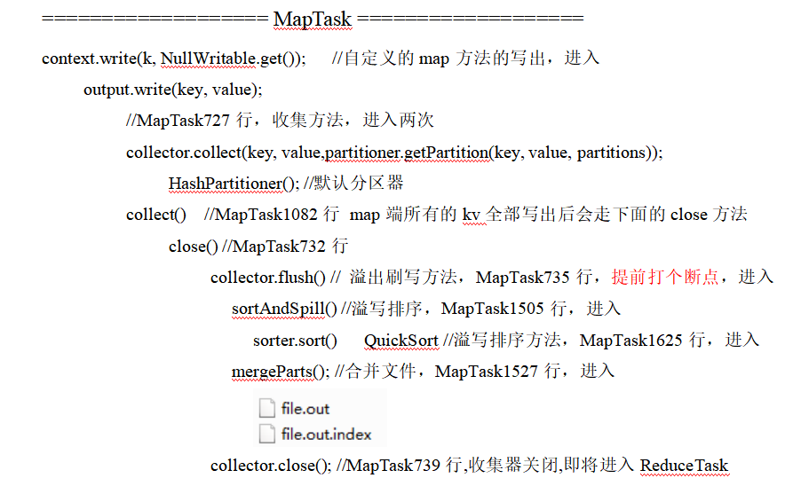

# 第0章 RPC通信原理解析

**0）回顾**


**1）需求：**

​	模拟RPC的客户端、服务端、通信协议三者如何工作的


**2）代码编写：**

（1）在HDFSClient项目基础上创建包名com.atguigu.rpc

（2）创建RPC协议

```java
package com.atguigu.rpc;

public interface RPCProtocol {

    long versionID = 666;

    void mkdirs(String path);
}
```

（3）创建RPC服务端

```java
package com.atguigu.rpc;

import org.apache.hadoop.conf.Configuration;
import org.apache.hadoop.ipc.RPC;
import org.apache.hadoop.ipc.Server;

import java.io.IOException;

public class NNServer implements RPCProtocol{

    @Override
    public void mkdirs(String path) {
        System.out.println("服务端，创建路径" + path);
    }

    public static void main(String[] args) throws IOException {

        Server server = new RPC.Builder(new Configuration())
                .setBindAddress("localhost")
                .setPort(8888)
                .setProtocol(RPCProtocol.class)
                .setInstance(new NNServer())
                .build();

        System.out.println("服务器开始工作");

        server.start();
    }
}
```

（4）创建RPC客户端

```java
package com.atguigu.rpc;

import org.apache.hadoop.conf.Configuration;
import org.apache.hadoop.ipc.RPC;

import java.io.IOException;
import java.net.InetSocketAddress;

public class HDFSClient {

    public static void main(String[] args) throws IOException {
        RPCProtocol client = RPC.getProxy(
                RPCProtocol.class,
                RPCProtocol.versionID,
                new InetSocketAddress("localhost", 8888),
                new Configuration());

        System.out.println("我是客户端");

        client.mkdirs("/input");
    }
}
```

**3）测试**

​	（1）启动服务端

观察控制台打印：服务器开始工作

在控制台Terminal窗口输入，jps，查看到NNServer服务

​	（2）启动客户端	

​		观察客户端控制台打印：我是客户端

​		观察服务端控制台打印：服务端，创建路径/input

**4）总结**

​	RPC的客户端调用通信协议方法，方法的执行在服务端；

​	通信协议就是接口规范。

# 第1章 NameNode启动源码解析


**0）在pom.xml中增加如下依赖**

```xml
<dependencies>
	<dependency>
		<groupId>org.apache.hadoop</groupId>
		<artifactId>hadoop-client</artifactId>
		<version>3.1.3</version>
	</dependency>

	<dependency>
		<groupId>org.apache.hadoop</groupId>
		<artifactId>hadoop-hdfs</artifactId>
		<version>3.1.3</version>
	</dependency>

	<dependency>
		<groupId>org.apache.hadoop</groupId>
		<artifactId>hadoop-hdfs-client</artifactId>
		<version>3.1.3</version>
		<scope>provided</scope>
	</dependency>
</dependencies>
```

**1）ctrl + n 全局查找namenode，进入NameNode.java**

NameNode官方说明

```java
NameNode serves as both directory namespace manager and "inode table" for the Hadoop DFS. There is a single NameNode running in any DFS deployment. (Well, except when there is a second backup/failover NameNode, or when using federated NameNodes.) The NameNode controls two critical tables: 1) filename->blocksequence (namespace) 2) block->machinelist ("inodes") The first table is stored on disk and is very precious. The second table is rebuilt every time the NameNode comes up. 'NameNode' refers to both this class as well as the 'NameNode server'. The 'FSNamesystem' class actually performs most of the filesystem management. The majority of the 'NameNode' class itself is concerned with exposing the IPC interface and the HTTP server to the outside world, plus some configuration management. NameNode implements the ClientProtocol interface, which allows clients to ask for DFS services. ClientProtocol is not designed for direct use by authors of DFS client code. End-users should instead use the FileSystem class. NameNode also implements the DatanodeProtocol interface, used by DataNodes that actually store DFS data blocks. These methods are invoked repeatedly and automatically by all the DataNodes in a DFS deployment. NameNode also implements the NamenodeProtocol interface, used by secondary namenodes or rebalancing processes to get partial NameNode state, for example partial blocksMap etc.
```

**2）ctrl + f，查找main方法**

NameNode.java

```java
public static void main(String argv[]) throws Exception {
	if (DFSUtil.parseHelpArgument(argv, NameNode.USAGE, System.out, true)) {
		System.exit(0);
	}

	try {
		StringUtils.startupShutdownMessage(NameNode.class, argv, LOG);
		// 创建NameNode
		NameNode namenode = createNameNode(argv, null);
		if (namenode != null) {
			namenode.join();
		}
	} catch (Throwable e) {
		LOG.error("Failed to start namenode.", e);
		terminate(1, e);
	}
}
```

点击createNameNode

```java
public static NameNode createNameNode(String argv[], Configuration conf)
    throws IOException {
  … …
  StartupOption startOpt = parseArguments(argv);
  if (startOpt == null) {
    printUsage(System.err);
    return null;
  }
  setStartupOption(conf, startOpt);

  boolean aborted = false;
  switch (startOpt) {
  case FORMAT:
    aborted = format(conf, startOpt.getForceFormat(),
        startOpt.getInteractiveFormat());
    terminate(aborted ? 1 : 0);
    return null; // avoid javac warning
  case GENCLUSTERID:
    … …
  default:
    DefaultMetricsSystem.initialize("NameNode");
	// 创建NameNode对象
    return new NameNode(conf);
  }
}
```

点击NameNode

```java
public NameNode(Configuration conf) throws IOException {
  this(conf, NamenodeRole.NAMENODE);
}

protected NameNode(Configuration conf, NamenodeRole role)
    throws IOException {
  ... ...

  try {
    initializeGenericKeys(conf, nsId, namenodeId);
    initialize(getConf());
    ... ...
  } catch (IOException e) {
    this.stopAtException(e);
    throw e;
  } catch (HadoopIllegalArgumentException e) {
    this.stopAtException(e);
    throw e;
  }
  this.started.set(true);
}
```

点击initialize

```java
protected void initialize(Configuration conf) throws IOException {
  ... ...

  if (NamenodeRole.NAMENODE == role) {
	// 启动HTTP服务端（9870）
    startHttpServer(conf);
  }

  // 加载镜像文件和编辑日志到内存
  loadNamesystem(conf);
  startAliasMapServerIfNecessary(conf);

  // 创建NN的RPC服务端
  rpcServer = createRpcServer(conf);

  initReconfigurableBackoffKey();

  if (clientNamenodeAddress == null) {
    // This is expected for MiniDFSCluster. Set it now using 
    // the RPC server's bind address.
    clientNamenodeAddress = 
        NetUtils.getHostPortString(getNameNodeAddress());
    LOG.info("Clients are to use " + clientNamenodeAddress + " to access"
        + " this namenode/service.");
  }
  if (NamenodeRole.NAMENODE == role) {
    httpServer.setNameNodeAddress(getNameNodeAddress());
    httpServer.setFSImage(getFSImage());
  }

  // NN启动资源检查
  startCommonServices(conf);
  startMetricsLogger(conf);
}
```

## 1.1 启动9870端口服务

**1）点击startHttpServer**

NameNode.java

```java
private void startHttpServer(final Configuration conf) throws IOException {
	httpServer = new NameNodeHttpServer(conf, this, getHttpServerBindAddress(conf));
	httpServer.start();
	httpServer.setStartupProgress(startupProgress);
}

protected InetSocketAddress getHttpServerBindAddress(Configuration conf) {
  InetSocketAddress bindAddress = getHttpServerAddress(conf);

  ... ...
  return bindAddress;
}

protected InetSocketAddress getHttpServerAddress(Configuration conf) {
  return getHttpAddress(conf);
}

public static InetSocketAddress getHttpAddress(Configuration conf) {
	return  NetUtils.createSocketAddr(
      conf.getTrimmed(DFS_NAMENODE_HTTP_ADDRESS_KEY, DFS_NAMENODE_HTTP_ADDRESS_DEFAULT));
}

public static final String  DFS_NAMENODE_HTTP_ADDRESS_DEFAULT = "0.0.0.0:" + DFS_NAMENODE_HTTP_PORT_DEFAULT;

public static final int     DFS_NAMENODE_HTTP_PORT_DEFAULT =
HdfsClientConfigKeys.DFS_NAMENODE_HTTP_PORT_DEFAULT;

int  DFS_NAMENODE_HTTP_PORT_DEFAULT = 9870;
```

**2）点击startHttpServer方法中的httpServer.start();**

NameNodeHttpServer.java

```java
void start() throws IOException {
  ... ...
  // Hadoop自己封装了HttpServer，形成自己的HttpServer2
  HttpServer2.Builder builder = DFSUtil.httpServerTemplateForNNAndJN(conf,
      httpAddr, httpsAddr, "hdfs",
      DFSConfigKeys.DFS_NAMENODE_KERBEROS_INTERNAL_SPNEGO_PRINCIPAL_KEY,
      DFSConfigKeys.DFS_NAMENODE_KEYTAB_FILE_KEY);
  ... ...

  httpServer = builder.build();

  ... ...

  httpServer.setAttribute(NAMENODE_ATTRIBUTE_KEY, nn);
  httpServer.setAttribute(JspHelper.CURRENT_CONF, conf);
  setupServlets(httpServer, conf);
  httpServer.start();

  ... ...
}
```

点击setupServlets

```java
private static void setupServlets(HttpServer2 httpServer, Configuration conf) {
	httpServer.addInternalServlet("startupProgress",
		StartupProgressServlet.PATH_SPEC, StartupProgressServlet.class);
	httpServer.addInternalServlet("fsck", "/fsck", FsckServlet.class,
		true);
	httpServer.addInternalServlet("imagetransfer", ImageServlet.PATH_SPEC,
      ImageServlet.class, true);
}
```

## 1.2 加载镜像文件和编辑日志

**1）点击loadNamesystem**

NameNode.java

```java
protected void loadNamesystem(Configuration conf) throws IOException {
	this.namesystem = FSNamesystem.loadFromDisk(conf);
}

static FSNamesystem loadFromDisk(Configuration conf) throws IOException {

  checkConfiguration(conf);

  FSImage fsImage = new FSImage(conf,
      FSNamesystem.getNamespaceDirs(conf),
      FSNamesystem.getNamespaceEditsDirs(conf));

  FSNamesystem namesystem = new FSNamesystem(conf, fsImage, false);
  StartupOption startOpt = NameNode.getStartupOption(conf);
  if (startOpt == StartupOption.RECOVER) {
    namesystem.setSafeMode(SafeModeAction.SAFEMODE_ENTER);
  }

  long loadStart = monotonicNow();
  try {
    namesystem.loadFSImage(startOpt);
  } catch (IOException ioe) {
    LOG.warn("Encountered exception loading fsimage", ioe);
    fsImage.close();
    throw ioe;
  }
  long timeTakenToLoadFSImage = monotonicNow() - loadStart;
  LOG.info("Finished loading FSImage in " + timeTakenToLoadFSImage + " msecs");
  NameNodeMetrics nnMetrics = NameNode.getNameNodeMetrics();
  if (nnMetrics != null) {
    nnMetrics.setFsImageLoadTime((int) timeTakenToLoadFSImage);
  }
  namesystem.getFSDirectory().createReservedStatuses(namesystem.getCTime());
  return namesystem;
}
```

## 1.3 初始化NN的RPC服务端

**1）点击createRpcServer**

NameNode.java

```java
protected NameNodeRpcServer createRpcServer(Configuration conf)
    throws IOException {
  return new NameNodeRpcServer(conf, this);
}
```

NameNodeRpcServer.java

```java
public NameNodeRpcServer(Configuration conf, NameNode nn)
      throws IOException {
	... ....	
    serviceRpcServer = new RPC.Builder(conf)
        .setProtocol(
            org.apache.hadoop.hdfs.protocolPB.ClientNamenodeProtocolPB.class)
        .setInstance(clientNNPbService)
        .setBindAddress(bindHost)
        .setPort(serviceRpcAddr.getPort())
        .setNumHandlers(serviceHandlerCount)
        .setVerbose(false)
        .setSecretManager(namesystem.getDelegationTokenSecretManager())
        .build();
	... ....	
}
```

## 1.4 NN启动资源检查

**1）点击startCommonServices**

NameNode.java

```java
private void startCommonServices(Configuration conf) throws IOException {

  namesystem.startCommonServices(conf, haContext);

  registerNNSMXBean();
  if (NamenodeRole.NAMENODE != role) {
    startHttpServer(conf);
    httpServer.setNameNodeAddress(getNameNodeAddress());
    httpServer.setFSImage(getFSImage());
  }
  rpcServer.start();
  try {
    plugins = conf.getInstances(DFS_NAMENODE_PLUGINS_KEY,
        ServicePlugin.class);
  } catch (RuntimeException e) {
    String pluginsValue = conf.get(DFS_NAMENODE_PLUGINS_KEY);
    LOG.error("Unable to load NameNode plugins. Specified list of plugins: " +
        pluginsValue, e);
    throw e;
  }
  … …
}
```

**2）点击startCommonServices**

FSNamesystem.java

```java
void startCommonServices(Configuration conf, HAContext haContext) throws IOException {
  this.registerMBean(); // register the MBean for the FSNamesystemState
  writeLock();
  this.haContext = haContext;
  try {
    nnResourceChecker = new NameNodeResourceChecker(conf);
    // 检查是否有足够的磁盘存储元数据（fsimage（默认100m） editLog（默认100m））
    checkAvailableResources();

    assert !blockManager.isPopulatingReplQueues();
    StartupProgress prog = NameNode.getStartupProgress();
    prog.beginPhase(Phase.SAFEMODE);
long completeBlocksTotal = getCompleteBlocksTotal();

    // 安全模式
    prog.setTotal(Phase.SAFEMODE, STEP_AWAITING_REPORTED_BLOCKS,
        completeBlocksTotal);

    // 启动块服务
    blockManager.activate(conf, completeBlocksTotal);
  } finally {
    writeUnlock("startCommonServices");
  }
  
  registerMXBean();
  DefaultMetricsSystem.instance().register(this);
  if (inodeAttributeProvider != null) {
    inodeAttributeProvider.start();
    dir.setINodeAttributeProvider(inodeAttributeProvider);
  }
  snapshotManager.registerMXBean();
  InetSocketAddress serviceAddress = NameNode.getServiceAddress(conf, true);
  this.nameNodeHostName = (serviceAddress != null) ?
      serviceAddress.getHostName() : "";
}
```

点击NameNodeResourceChecker

NameNodeResourceChecker.java

```java
public NameNodeResourceChecker(Configuration conf) throws IOException {
  this.conf = conf;
  volumes = new HashMap<String, CheckedVolume>();
  
  // dfs.namenode.resource.du.reserved默认值 1024 * 1024 * 100 =》100m
  duReserved = conf.getLong(DFSConfigKeys.DFS_NAMENODE_DU_RESERVED_KEY,
      DFSConfigKeys.DFS_NAMENODE_DU_RESERVED_DEFAULT);
  
  Collection<URI> extraCheckedVolumes = Util.stringCollectionAsURIs(conf
      .getTrimmedStringCollection(DFSConfigKeys.DFS_NAMENODE_CHECKED_VOLUMES_KEY));
  
  Collection<URI> localEditDirs = Collections2.filter(
      FSNamesystem.getNamespaceEditsDirs(conf),
      new Predicate<URI>() {
        @Override
        public boolean apply(URI input) {
          if (input.getScheme().equals(NNStorage.LOCAL_URI_SCHEME)) {
            return true;
          }
          return false;
        }
      });

  // 对所有路径进行资源检查
  for (URI editsDirToCheck : localEditDirs) {
    addDirToCheck(editsDirToCheck,
        FSNamesystem.getRequiredNamespaceEditsDirs(conf).contains(
            editsDirToCheck));
  }

  // All extra checked volumes are marked "required"
  for (URI extraDirToCheck : extraCheckedVolumes) {
    addDirToCheck(extraDirToCheck, true);
  }
  
  minimumRedundantVolumes = conf.getInt(
      DFSConfigKeys.DFS_NAMENODE_CHECKED_VOLUMES_MINIMUM_KEY,
      DFSConfigKeys.DFS_NAMENODE_CHECKED_VOLUMES_MINIMUM_DEFAULT);
}
```

点击checkAvailableResources

FNNamesystem.java

```java
void checkAvailableResources() {
	long resourceCheckTime = monotonicNow();
	Preconditions.checkState(nnResourceChecker != null,
		"nnResourceChecker not initialized");

	// 判断资源是否足够，不够返回false
	hasResourcesAvailable = nnResourceChecker.hasAvailableDiskSpace();

	resourceCheckTime = monotonicNow() - resourceCheckTime;
	NameNode.getNameNodeMetrics().addResourceCheckTime(resourceCheckTime);
}
```

NameNodeResourceChecker.java

```java
public boolean hasAvailableDiskSpace() {
	return NameNodeResourcePolicy.areResourcesAvailable(volumes.values(),
      minimumRedundantVolumes);
}
```

NameNodeResourcePolicy.java

```java
static boolean areResourcesAvailable(
    Collection<? extends CheckableNameNodeResource> resources,
    int minimumRedundantResources) {

  // TODO: workaround:
  // - during startup, if there are no edits dirs on disk, then there is
  // a call to areResourcesAvailable() with no dirs at all, which was
  // previously causing the NN to enter safemode
  if (resources.isEmpty()) {
    return true;
  }
  
  int requiredResourceCount = 0;
  int redundantResourceCount = 0;
  int disabledRedundantResourceCount = 0;

  // 判断资源是否充足
  for (CheckableNameNodeResource resource : resources) {
    if (!resource.isRequired()) {
      redundantResourceCount++;
      if (!resource.isResourceAvailable()) {
        disabledRedundantResourceCount++;
      }
    } else {
      requiredResourceCount++;
      if (!resource.isResourceAvailable()) {
        // Short circuit - a required resource is not available. 不充足返回false
        return false;
      }
    }
  }
  
  if (redundantResourceCount == 0) {
    // If there are no redundant resources, return true if there are any
    // required resources available.
    return requiredResourceCount > 0;
  } else {
    return redundantResourceCount - disabledRedundantResourceCount >=
        minimumRedundantResources;
  }
}

interface CheckableNameNodeResource {
  
  public boolean isResourceAvailable();
  
  public boolean isRequired();
}
```

ctrl + h，查找实现类CheckedVolume

NameNodeResourceChecker.java

```java
public boolean isResourceAvailable() {

  // 获取当前目录的空间大小
  long availableSpace = df.getAvailable();

  if (LOG.isDebugEnabled()) {
    LOG.debug("Space available on volume '" + volume + "' is "
        + availableSpace);
  }

  // 如果当前空间大小，小于100m，返回false
  if (availableSpace < duReserved) {
    LOG.warn("Space available on volume '" + volume + "' is "
        + availableSpace +
        ", which is below the configured reserved amount " + duReserved);
    return false;
  } else {
    return true;
  }
}
```

## 1.5 NN对心跳超时判断

Ctrl + n 搜索namenode，ctrl + f搜索startCommonServices

点击namesystem.startCommonServices(conf, haContext);

点击blockManager.activate(conf, completeBlocksTotal);

点击datanodeManager.activate(conf);

DatanodeManager.java

```java
void activate(final Configuration conf) {
  datanodeAdminManager.activate(conf);
  heartbeatManager.activate();
}
```

DatanodeManager.java

```java
void activate() {
  // 启动的线程，搜索run方法
  heartbeatThread.start();
}

public void run() {
  while(namesystem.isRunning()) {
    restartHeartbeatStopWatch();
    try {
      final long now = Time.monotonicNow();
      if (lastHeartbeatCheck + heartbeatRecheckInterval < now) {
		// 心跳检查
        heartbeatCheck();
        lastHeartbeatCheck = now;
      }
      if (blockManager.shouldUpdateBlockKey(now - lastBlockKeyUpdate)) {
        synchronized(HeartbeatManager.this) {
          for(DatanodeDescriptor d : datanodes) {
            d.setNeedKeyUpdate(true);
          }
        }
        lastBlockKeyUpdate = now;
      }
    } catch (Exception e) {
      LOG.error("Exception while checking heartbeat", e);
    }
    try {
      Thread.sleep(5000);  // 5 seconds
    } catch (InterruptedException ignored) {
    }
    // avoid declaring nodes dead for another cycle if a GC pause lasts
    // longer than the node recheck interval
    if (shouldAbortHeartbeatCheck(-5000)) {
      LOG.warn("Skipping next heartbeat scan due to excessive pause");
      lastHeartbeatCheck = Time.monotonicNow();
    }
  }
}

void heartbeatCheck() {
  final DatanodeManager dm = blockManager.getDatanodeManager();

  boolean allAlive = false;
  while (!allAlive) {
    // locate the first dead node.
    DatanodeDescriptor dead = null;

    // locate the first failed storage that isn't on a dead node.
    DatanodeStorageInfo failedStorage = null;

    // check the number of stale nodes
    int numOfStaleNodes = 0;
    int numOfStaleStorages = 0;
    synchronized(this) {
      for (DatanodeDescriptor d : datanodes) {
        // check if an excessive GC pause has occurred
        if (shouldAbortHeartbeatCheck(0)) {
          return;
        }
		// 判断DN节点是否挂断
        if (dead == null && dm.isDatanodeDead(d)) {
          stats.incrExpiredHeartbeats();
          dead = d;
        }
        if (d.isStale(dm.getStaleInterval())) {
          numOfStaleNodes++;
        }
        DatanodeStorageInfo[] storageInfos = d.getStorageInfos();
        for(DatanodeStorageInfo storageInfo : storageInfos) {
          if (storageInfo.areBlockContentsStale()) {
            numOfStaleStorages++;
          }

          if (failedStorage == null &&
              storageInfo.areBlocksOnFailedStorage() &&
              d != dead) {
            failedStorage = storageInfo;
          }
        }
      }
      
      // Set the number of stale nodes in the DatanodeManager
      dm.setNumStaleNodes(numOfStaleNodes);
      dm.setNumStaleStorages(numOfStaleStorages);
    }
    ... ...
  }
}

boolean isDatanodeDead(DatanodeDescriptor node) {
  return (node.getLastUpdateMonotonic() <
          (monotonicNow() - heartbeatExpireInterval));
}

private long heartbeatExpireInterval;
// 10分钟 + 30秒
this.heartbeatExpireInterval = 2 * heartbeatRecheckInterval + 10 * 1000 * heartbeatIntervalSeconds;

private volatile int heartbeatRecheckInterval;
heartbeatRecheckInterval = conf.getInt(
        DFSConfigKeys.DFS_NAMENODE_HEARTBEAT_RECHECK_INTERVAL_KEY, 
        DFSConfigKeys.DFS_NAMENODE_HEARTBEAT_RECHECK_INTERVAL_DEFAULT); // 5 minutes

private volatile long heartbeatIntervalSeconds;
heartbeatIntervalSeconds = conf.getTimeDuration(
        DFSConfigKeys.DFS_HEARTBEAT_INTERVAL_KEY,
        DFSConfigKeys.DFS_HEARTBEAT_INTERVAL_DEFAULT, TimeUnit.SECONDS);
public static final long    DFS_HEARTBEAT_INTERVAL_DEFAULT = 3;
```

## 1.6 安全模式

FSNamesystem.java

```java
void startCommonServices(Configuration conf, HAContext haContext) throws IOException {
  this.registerMBean(); // register the MBean for the FSNamesystemState
  writeLock();
  this.haContext = haContext;
  try {
    nnResourceChecker = new NameNodeResourceChecker(conf);
    // 检查是否有足够的磁盘存储元数据（fsimage（默认100m） editLog（默认100m））
    checkAvailableResources();

    assert !blockManager.isPopulatingReplQueues();
    StartupProgress prog = NameNode.getStartupProgress();

    // 开始进入安全模式
    prog.beginPhase(Phase.SAFEMODE);

    // 获取所有可以正常使用的block
long completeBlocksTotal = getCompleteBlocksTotal();

    prog.setTotal(Phase.SAFEMODE, STEP_AWAITING_REPORTED_BLOCKS,
        completeBlocksTotal);

    // 启动块服务
    blockManager.activate(conf, completeBlocksTotal);
  } finally {
    writeUnlock("startCommonServices");
  }
  
  registerMXBean();
  DefaultMetricsSystem.instance().register(this);
  if (inodeAttributeProvider != null) {
    inodeAttributeProvider.start();
    dir.setINodeAttributeProvider(inodeAttributeProvider);
  }
  snapshotManager.registerMXBean();
  InetSocketAddress serviceAddress = NameNode.getServiceAddress(conf, true);
  this.nameNodeHostName = (serviceAddress != null) ?
      serviceAddress.getHostName() : "";
}
```

点击getCompleteBlocksTotal

```java
public long getCompleteBlocksTotal() {
  // Calculate number of blocks under construction
  long numUCBlocks = 0;
  readLock();
  try {
    // 获取正在构建的block
    numUCBlocks = leaseManager.getNumUnderConstructionBlocks();
	// 获取所有的块 - 正在构建的block = 可以正常使用的block
    return getBlocksTotal() - numUCBlocks;
  } finally {
    readUnlock("getCompleteBlocksTotal");
  }
}
```

点击activate

```java
public void activate(Configuration conf, long blockTotal) {
	pendingReconstruction.start();
	datanodeManager.activate(conf);

	this.redundancyThread.setName("RedundancyMonitor");
	this.redundancyThread.start();

	storageInfoDefragmenterThread.setName("StorageInfoMonitor");
	storageInfoDefragmenterThread.start();
	this.blockReportThread.start();

	mxBeanName = MBeans.register("NameNode", "BlockStats", this);

	bmSafeMode.activate(blockTotal);
}
```

点击activate

```java
void activate(long total) {
  assert namesystem.hasWriteLock();
  assert status == BMSafeModeStatus.OFF;

  startTime = monotonicNow();

  // 计算是否满足块个数的阈值
  setBlockTotal(total);

  // 判断DataNode节点和块信息是否达到退出安全模式标准
  if (areThresholdsMet()) {
    boolean exitResult = leaveSafeMode(false);
    Preconditions.checkState(exitResult, "Failed to leave safe mode.");
  } else {
    // enter safe mode
status = BMSafeModeStatus.PENDING_THRESHOLD;

initializeReplQueuesIfNecessary();

    reportStatus("STATE* Safe mode ON.", true);
    lastStatusReport = monotonicNow();
  }
}
```

点击setBlockTotal

```java
void setBlockTotal(long total) {
  assert namesystem.hasWriteLock();
  synchronized (this) {
    this.blockTotal = total;
	// 计算阈值：例如：1000个正常的块 * 0.999 = 999
    this.blockThreshold = (long) (total * threshold);
  }
  
  this.blockReplQueueThreshold = (long) (total * replQueueThreshold);
}

this.threshold = conf.getFloat(DFS_NAMENODE_SAFEMODE_THRESHOLD_PCT_KEY,
        DFS_NAMENODE_SAFEMODE_THRESHOLD_PCT_DEFAULT);

public static final float   DFS_NAMENODE_SAFEMODE_THRESHOLD_PCT_DEFAULT = 0.999f;
```

点击areThresholdsMet

```java
private boolean areThresholdsMet() {
  assert namesystem.hasWriteLock();
  // Calculating the number of live datanodes is time-consuming
  // in large clusters. Skip it when datanodeThreshold is zero.
  int datanodeNum = 0;

  if (datanodeThreshold > 0) {
    datanodeNum = blockManager.getDatanodeManager().getNumLiveDataNodes();
  }
  synchronized (this) {
  // 已经正常注册的块数 》= 块的最小阈值 》=最小可用DataNode
    return blockSafe >= blockThreshold && datanodeNum >= datanodeThreshold;
  }
}
```

# 第2章 DataNode启动源码解析


**0）在pom.xml中增加如下依赖**

```xml
<dependencies>
	<dependency>
		<groupId>org.apache.hadoop</groupId>
		<artifactId>hadoop-client</artifactId>
		<version>3.1.3</version>
	</dependency>

	<dependency>
		<groupId>org.apache.hadoop</groupId>
		<artifactId>hadoop-hdfs</artifactId>
		<version>3.1.3</version>
	</dependency>

	<dependency>
		<groupId>org.apache.hadoop</groupId>
		<artifactId>hadoop-hdfs-client</artifactId>
		<version>3.1.3</version>
		<scope>provided</scope>
	</dependency>
</dependencies>
```

**1）ctrl + n 全局查找datanode，进入DataNode.java**

​	DataNode官方说明

```java
DataNode is a class (and program) that stores a set of blocks for a DFS deployment. A single deployment can have one or many DataNodes. Each DataNode communicates regularly with a single NameNode. It also communicates with client code and other DataNodes from time to time. DataNodes store a series of named blocks. The DataNode allows client code to read these blocks, or to write new block data. The DataNode may also, in response to instructions from its NameNode, delete blocks or copy blocks to/from other DataNodes. The DataNode maintains just one critical table: block-> stream of bytes (of BLOCK_SIZE or less) This info is stored on a local disk. The DataNode reports the table's contents to the NameNode upon startup and every so often afterwards. DataNodes spend their lives in an endless loop of asking the NameNode for something to do. A NameNode cannot connect to a DataNode directly; a NameNode simply returns values from functions invoked by a DataNode. DataNodes maintain an open server socket so that client code or other DataNodes can read/write data. The host/port for this server is reported to the NameNode, which then sends that information to clients or other DataNodes that might be interested.
```

**2）ctrl + f，查找main方法**

DataNode.java

```java
public static void main(String args[]) {
  if (DFSUtil.parseHelpArgument(args, DataNode.USAGE, System.out, true)) {
    System.exit(0);
  }

  secureMain(args, null);
}

public static void secureMain(String args[], SecureResources resources) {
  int errorCode = 0;
  try {
    StringUtils.startupShutdownMessage(DataNode.class, args, LOG);

    DataNode datanode = createDataNode(args, null, resources);

    … …
  } catch (Throwable e) {
    LOG.error("Exception in secureMain", e);
    terminate(1, e);
  } finally {
    LOG.warn("Exiting Datanode");
    terminate(errorCode);
  }
}

public static DataNode createDataNode(String args[], Configuration conf,
    SecureResources resources) throws IOException {
  // 初始化DN
  DataNode dn = instantiateDataNode(args, conf, resources);

  if (dn != null) {
    // 启动DN进程
    dn.runDatanodeDaemon();
  }
  return dn;
}

public static DataNode instantiateDataNode(String args [], Configuration conf,
    SecureResources resources) throws IOException {
  ... ...
  
  return makeInstance(dataLocations, conf, resources);
}

static DataNode makeInstance(Collection<StorageLocation> dataDirs,
    Configuration conf, SecureResources resources) throws IOException {
  ... ...
  return new DataNode(conf, locations, storageLocationChecker, resources);
}

DataNode(final Configuration conf,
         final List<StorageLocation> dataDirs,
         final StorageLocationChecker storageLocationChecker,
         final SecureResources resources) throws IOException {
  super(conf);
  ... ...

  try {
    hostName = getHostName(conf);
    LOG.info("Configured hostname is {}", hostName);
	// 启动DN
    startDataNode(dataDirs, resources);
  } catch (IOException ie) {
    shutdown();
    throw ie;
  }
  ... ...
}

void startDataNode(List<StorageLocation> dataDirectories,
                   SecureResources resources
                   ) throws IOException {
  ... ...
  // 创建数据存储对象
  storage = new DataStorage();
  
  // global DN settings
  registerMXBean();
  // 初始化DataXceiver
  initDataXceiver();
  
  // 启动HttpServer
  startInfoServer();

  pauseMonitor = new JvmPauseMonitor();
  pauseMonitor.init(getConf());
  pauseMonitor.start();

  // BlockPoolTokenSecretManager is required to create ipc server.
  this.blockPoolTokenSecretManager = new BlockPoolTokenSecretManager();

  // Login is done by now. Set the DN user name.
  dnUserName = UserGroupInformation.getCurrentUser().getUserName();
  LOG.info("dnUserName = {}", dnUserName);
  LOG.info("supergroup = {}", supergroup);
  
  // 初始化RPC服务
  initIpcServer();

  metrics = DataNodeMetrics.create(getConf(), getDisplayName());
  peerMetrics = dnConf.peerStatsEnabled ?
      DataNodePeerMetrics.create(getDisplayName(), getConf()) : null;
  metrics.getJvmMetrics().setPauseMonitor(pauseMonitor);

  ecWorker = new ErasureCodingWorker(getConf(), this);
  blockRecoveryWorker = new BlockRecoveryWorker(this);
  
  // 创建BlockPoolManager
  blockPoolManager = new BlockPoolManager(this);
  // 心跳管理
  blockPoolManager.refreshNamenodes(getConf());

  // Create the ReadaheadPool from the DataNode context so we can
  // exit without having to explicitly shutdown its thread pool.
  readaheadPool = ReadaheadPool.getInstance();
  saslClient = new SaslDataTransferClient(dnConf.getConf(),
      dnConf.saslPropsResolver, dnConf.trustedChannelResolver);
  saslServer = new SaslDataTransferServer(dnConf, blockPoolTokenSecretManager);
  startMetricsLogger();

  if (dnConf.diskStatsEnabled) {
    diskMetrics = new DataNodeDiskMetrics(this,
        dnConf.outliersReportIntervalMs);
  }
}
```


## 2.1 初始化DataXceiverServer

点击initDataXceiver

```java
private void initDataXceiver() throws IOException {
// dataXceiverServer是一个服务，DN用来接收客户端和其他DN发送过来的数据服务
  this.dataXceiverServer = new Daemon(threadGroup, xserver);
  this.threadGroup.setDaemon(true); // auto destroy when empty

  ... ...
}
```

## 2.2 初始化HTTP服务

点击startInfoServer();

DataNode.java

```java
private void startInfoServer()
  throws IOException {
  // SecureDataNodeStarter will bind the privileged port to the channel if
  // the DN is started by JSVC, pass it along.
  ServerSocketChannel httpServerChannel = secureResources != null ?
      secureResources.getHttpServerChannel() : null;

  httpServer = new DatanodeHttpServer(getConf(), this, httpServerChannel);
  httpServer.start();
  if (httpServer.getHttpAddress() != null) {
    infoPort = httpServer.getHttpAddress().getPort();
  }
  if (httpServer.getHttpsAddress() != null) {
    infoSecurePort = httpServer.getHttpsAddress().getPort();
  }
}
```

DatanodeHttpServer.java

```java
public DatanodeHttpServer(final Configuration conf,
    final DataNode datanode,
    final ServerSocketChannel externalHttpChannel)
  throws IOException {
  
  ... ...
  HttpServer2.Builder builder = new HttpServer2.Builder()
      .setName("datanode")
      .setConf(confForInfoServer)
      .setACL(new AccessControlList(conf.get(DFS_ADMIN, " ")))
      .hostName(getHostnameForSpnegoPrincipal(confForInfoServer))
      .addEndpoint(URI.create("http://localhost:" + proxyPort))
      .setFindPort(true);
  ... ...
}
```

## 2.3 初始化DN的RPC服务端

点击initIpcServer

DataNode.java

```java
private void initIpcServer() throws IOException {
  InetSocketAddress ipcAddr = NetUtils.createSocketAddr(
      getConf().getTrimmed(DFS_DATANODE_IPC_ADDRESS_KEY));
  
  ... ...
  ipcServer = new RPC.Builder(getConf())
      .setProtocol(ClientDatanodeProtocolPB.class)
      .setInstance(service)
      .setBindAddress(ipcAddr.getHostName())
      .setPort(ipcAddr.getPort())
      .setNumHandlers(
          getConf().getInt(DFS_DATANODE_HANDLER_COUNT_KEY,
              DFS_DATANODE_HANDLER_COUNT_DEFAULT)).setVerbose(false)
      .setSecretManager(blockPoolTokenSecretManager).build();
  ... ...
}
```


## 2.4 DN向NN注册

点击refreshNamenodes

BlockPoolManager.java

```java
void refreshNamenodes(Configuration conf)
    throws IOException {
  ... ...

  synchronized (refreshNamenodesLock) {
    doRefreshNamenodes(newAddressMap, newLifelineAddressMap);
  }
}

private void doRefreshNamenodes(
    Map<String, Map<String, InetSocketAddress>> addrMap,
    Map<String, Map<String, InetSocketAddress>> lifelineAddrMap)
    throws IOException {
  … ….
  
  synchronized (this) {
    … …

    // Step 3. Start new nameservices
    if (!toAdd.isEmpty()) {

      for (String nsToAdd : toAdd) {
        … …
        BPOfferService bpos = createBPOS(nsToAdd, addrs, lifelineAddrs);
        bpByNameserviceId.put(nsToAdd, bpos);
        offerServices.add(bpos);
      }
    }
    startAll();
  }

  … …
}

protected BPOfferService createBPOS(
    final String nameserviceId,
    List<InetSocketAddress> nnAddrs,
    List<InetSocketAddress> lifelineNnAddrs) {
  // 根据NameNode个数创建对应的服务
  return new BPOfferService(nameserviceId, nnAddrs, lifelineNnAddrs, dn);
}
```

点击startAll()

```java
synchronized void startAll() throws IOException {
  try {
    UserGroupInformation.getLoginUser().doAs(
        new PrivilegedExceptionAction<Object>() {
          @Override
          public Object run() throws Exception {
            for (BPOfferService bpos : offerServices) {
			  // 启动服务
              bpos.start();
            }
            return null;
          }
        });
  } catch (InterruptedException ex) {
    ... ...
  }
}
```

点击start ()

BPOfferService.java

```java
void start() {
  for (BPServiceActor actor : bpServices) {
    actor.start();
  }
}
```

点击start ()

BPServiceActor.java

```java
void start() {
  ... ...
  bpThread = new Thread(this);
  bpThread.setDaemon(true); // needed for JUnit testing
// 表示开启一个线程，所有查找该线程的run方法
  bpThread.start();

  if (lifelineSender != null) {
    lifelineSender.start();
  }
}
```

ctrl + f 搜索run方法

```java
public void run() {
  LOG.info(this + " starting to offer service");

  try {
    while (true) {
      // init stuff
      try {
        // setup storage
		// 向NN 注册
        connectToNNAndHandshake();
        break;
      } catch (IOException ioe) {
        // Initial handshake, storage recovery or registration failed
        runningState = RunningState.INIT_FAILED;
        if (shouldRetryInit()) {
          // Retry until all namenode's of BPOS failed initialization
          LOG.error("Initialization failed for " + this + " "
              + ioe.getLocalizedMessage());
		  // 注册失败，5s后重试
          sleepAndLogInterrupts(5000, "initializing");
        } else {
          runningState = RunningState.FAILED;
          LOG.error("Initialization failed for " + this + ". Exiting. ", ioe);
          return;
        }
      }
    }
    … …
    while (shouldRun()) {
      try {
        // 发送心跳
        offerService();
      } catch (Exception ex) {
        ... ...
      }
    }
}

private void connectToNNAndHandshake() throws IOException {
  // get NN proxy 获取NN的RPC客户端对象
  bpNamenode = dn.connectToNN(nnAddr);

  // First phase of the handshake with NN - get the namespace
  // info.
  NamespaceInfo nsInfo = retrieveNamespaceInfo();

  // Verify that this matches the other NN in this HA pair.
  // This also initializes our block pool in the DN if we are
  // the first NN connection for this BP.
  bpos.verifyAndSetNamespaceInfo(this, nsInfo);

  /* set thread name again to include NamespaceInfo when it's available. */
  this.bpThread.setName(formatThreadName("heartbeating", nnAddr));

  // 注册
  register(nsInfo);
}

DatanodeProtocolClientSideTranslatorPB connectToNN(
    InetSocketAddress nnAddr) throws IOException {
  return new DatanodeProtocolClientSideTranslatorPB(nnAddr, getConf());
}
```

DatanodeProtocolClientSideTranslatorPB.java

```java
public DatanodeProtocolClientSideTranslatorPB(InetSocketAddress nameNodeAddr,
    Configuration conf) throws IOException {
  RPC.setProtocolEngine(conf, DatanodeProtocolPB.class,
      ProtobufRpcEngine.class);
  UserGroupInformation ugi = UserGroupInformation.getCurrentUser();
  rpcProxy = createNamenode(nameNodeAddr, conf, ugi);
}

private static DatanodeProtocolPB createNamenode(
    InetSocketAddress nameNodeAddr, Configuration conf,
    UserGroupInformation ugi) throws IOException {
  return RPC.getProxy(DatanodeProtocolPB.class,
      RPC.getProtocolVersion(DatanodeProtocolPB.class), nameNodeAddr, ugi,
      conf, NetUtils.getSocketFactory(conf, DatanodeProtocolPB.class));
}
```

点击register

BPServiceActor.java

```java
void register(NamespaceInfo nsInfo) throws IOException {
  // 创建注册信息
  DatanodeRegistration newBpRegistration = bpos.createRegistration();

  LOG.info(this + " beginning handshake with NN");

  while (shouldRun()) {
    try {
      // Use returned registration from namenode with updated fields
	  // 把注册信息发送给NN（DN调用接口方法，执行在NN）
      newBpRegistration = bpNamenode.registerDatanode(newBpRegistration);
      newBpRegistration.setNamespaceInfo(nsInfo);
      bpRegistration = newBpRegistration;
      break;
    } catch(EOFException e) {  // namenode might have just restarted
      LOG.info("Problem connecting to server: " + nnAddr + " :"
          + e.getLocalizedMessage());
      sleepAndLogInterrupts(1000, "connecting to server");
    } catch(SocketTimeoutException e) {  // namenode is busy
      LOG.info("Problem connecting to server: " + nnAddr);
      sleepAndLogInterrupts(1000, "connecting to server");
    }
  }
  … …
}
```

ctrl + n 搜索NameNodeRpcServer

NameNodeRpcServer.java

ctrl + f 在NameNodeRpcServer.java中搜索registerDatanode

```java
public DatanodeRegistration registerDatanode(DatanodeRegistration nodeReg)
    throws IOException {
  checkNNStartup();
  verifySoftwareVersion(nodeReg);
  // 注册DN
  namesystem.registerDatanode(nodeReg);

  return nodeReg;
}
```

FSNamesystem.java

```java
void registerDatanode(DatanodeRegistration nodeReg) throws IOException {
  writeLock();
  try {
    blockManager.registerDatanode(nodeReg);
  } finally {
    writeUnlock("registerDatanode");
  }
}
```

BlockManager.java

```java
public void registerDatanode(DatanodeRegistration nodeReg)
    throws IOException {
  assert namesystem.hasWriteLock();
  datanodeManager.registerDatanode(nodeReg);
  bmSafeMode.checkSafeMode();
}

public void registerDatanode(DatanodeRegistration nodeReg)
    throws DisallowedDatanodeException, UnresolvedTopologyException {
	... ...
	// register new datanode 注册DN
    addDatanode(nodeDescr);
    blockManager.getBlockReportLeaseManager().register(nodeDescr);
    // also treat the registration message as a heartbeat
    // no need to update its timestamp
    // because its is done when the descriptor is created
	// 将DN添加到心跳管理
    heartbeatManager.addDatanode(nodeDescr);
    heartbeatManager.updateDnStat(nodeDescr);
    incrementVersionCount(nodeReg.getSoftwareVersion());
    startAdminOperationIfNecessary(nodeDescr);
    success = true;
	... ...
}

void addDatanode(final DatanodeDescriptor node) {
  // To keep host2DatanodeMap consistent with datanodeMap,
  // remove  from host2DatanodeMap the datanodeDescriptor removed
  // from datanodeMap before adding node to host2DatanodeMap.
  synchronized(this) {
    host2DatanodeMap.remove(datanodeMap.put(node.getDatanodeUuid(), node));
  }

  networktopology.add(node); // may throw InvalidTopologyException
  host2DatanodeMap.add(node);
  checkIfClusterIsNowMultiRack(node);
  resolveUpgradeDomain(node);

  … …
}
```

## 2.5 向NN发送心跳

点击BPServiceActor.java中的run方法中的offerService方法

BPServiceActor.java

```java
private void offerService() throws Exception {

	while (shouldRun()) {
        ... ...
        HeartbeatResponse resp = null;
        if (sendHeartbeat) {

          boolean requestBlockReportLease = (fullBlockReportLeaseId == 0) &&
                  scheduler.isBlockReportDue(startTime);
          if (!dn.areHeartbeatsDisabledForTests()) {
		    // 发送心跳信息
            resp = sendHeartBeat(requestBlockReportLease);
            assert resp != null;
            if (resp.getFullBlockReportLeaseId() != 0) {
              if (fullBlockReportLeaseId != 0) {
				... ...
              }
              fullBlockReportLeaseId = resp.getFullBlockReportLeaseId();
            }
            ... ...
          }
        }
		... ...
	}
}

HeartbeatResponse sendHeartBeat(boolean requestBlockReportLease)
    throws IOException {
	... ...
	// 通过NN的RPC客户端发送给NN
	HeartbeatResponse response = bpNamenode.sendHeartbeat(bpRegistration,
        reports,
        dn.getFSDataset().getCacheCapacity(),
        dn.getFSDataset().getCacheUsed(),
        dn.getXmitsInProgress(),
        dn.getXceiverCount(),
        numFailedVolumes,
        volumeFailureSummary,
        requestBlockReportLease,
        slowPeers,
        slowDisks);
	... ...
}
```

ctrl + n 搜索NameNodeRpcServer

NameNodeRpcServer.java

ctrl + f 在NameNodeRpcServer.java中搜索sendHeartbeat

```java
public HeartbeatResponse sendHeartbeat(DatanodeRegistration nodeReg,
    StorageReport[] report, long dnCacheCapacity, long dnCacheUsed,
    int xmitsInProgress, int xceiverCount,
    int failedVolumes, VolumeFailureSummary volumeFailureSummary,
    boolean requestFullBlockReportLease,
    @Nonnull SlowPeerReports slowPeers,
@Nonnull SlowDiskReports slowDisks) throws IOException {

  checkNNStartup();
  verifyRequest(nodeReg);

  // 处理DN发送的心跳
  return namesystem.handleHeartbeat(nodeReg, report,
      dnCacheCapacity, dnCacheUsed, xceiverCount, xmitsInProgress,
      failedVolumes, volumeFailureSummary, requestFullBlockReportLease,
      slowPeers, slowDisks);
}

HeartbeatResponse handleHeartbeat(DatanodeRegistration nodeReg,
    StorageReport[] reports, long cacheCapacity, long cacheUsed,
    int xceiverCount, int xmitsInProgress, int failedVolumes,
    VolumeFailureSummary volumeFailureSummary,
    boolean requestFullBlockReportLease,
    @Nonnull SlowPeerReports slowPeers,
    @Nonnull SlowDiskReports slowDisks) throws IOException {
  readLock();
  try {
    //get datanode commands
    final int maxTransfer = blockManager.getMaxReplicationStreams()
        - xmitsInProgress;
	// 处理DN发送过来的心跳
    DatanodeCommand[] cmds = blockManager.getDatanodeManager().handleHeartbeat(
        nodeReg, reports, getBlockPoolId(), cacheCapacity, cacheUsed,
        xceiverCount, maxTransfer, failedVolumes, volumeFailureSummary,
        slowPeers, slowDisks);

    long blockReportLeaseId = 0;
    if (requestFullBlockReportLease) {
      blockReportLeaseId =  blockManager.requestBlockReportLeaseId(nodeReg);
    }
    //create ha status
    final NNHAStatusHeartbeat haState = new NNHAStatusHeartbeat(
        haContext.getState().getServiceState(),
        getFSImage().getCorrectLastAppliedOrWrittenTxId());

	// 响应DN的心跳
    return new HeartbeatResponse(cmds, haState, rollingUpgradeInfo,
        blockReportLeaseId);
  } finally {
    readUnlock("handleHeartbeat");
  }
}
```

点击handleHeartbeat

DatanodeManager.java

```java
public DatanodeCommand[] handleHeartbeat(DatanodeRegistration nodeReg,
    StorageReport[] reports, final String blockPoolId,
    long cacheCapacity, long cacheUsed, int xceiverCount, 
    int maxTransfers, int failedVolumes,
    VolumeFailureSummary volumeFailureSummary,
    @Nonnull SlowPeerReports slowPeers,
    @Nonnull SlowDiskReports slowDisks) throws IOException {
  ... ...
  heartbeatManager.updateHeartbeat(nodeinfo, reports, cacheCapacity,
      cacheUsed, xceiverCount, failedVolumes, volumeFailureSummary);
  ... ...  
}
```

HeartbeatManager.java

```java
synchronized void updateHeartbeat(final DatanodeDescriptor node,
    StorageReport[] reports, long cacheCapacity, long cacheUsed,
    int xceiverCount, int failedVolumes,
    VolumeFailureSummary volumeFailureSummary) {
  stats.subtract(node);
  blockManager.updateHeartbeat(node, reports, cacheCapacity, cacheUsed,
      xceiverCount, failedVolumes, volumeFailureSummary);
  stats.add(node);
}
```

BlockManager.java

```java
void updateHeartbeat(DatanodeDescriptor node, StorageReport[] reports,
    long cacheCapacity, long cacheUsed, int xceiverCount, int failedVolumes,
    VolumeFailureSummary volumeFailureSummary) {

  for (StorageReport report: reports) {
    providedStorageMap.updateStorage(node, report.getStorage());
  }
  node.updateHeartbeat(reports, cacheCapacity, cacheUsed, xceiverCount,
      failedVolumes, volumeFailureSummary);
}
```

DatanodeDescriptor.java

```java
void updateHeartbeat(StorageReport[] reports, long cacheCapacity,
    long cacheUsed, int xceiverCount, int volFailures,
    VolumeFailureSummary volumeFailureSummary) {
  updateHeartbeatState(reports, cacheCapacity, cacheUsed, xceiverCount,
      volFailures, volumeFailureSummary);
  heartbeatedSinceRegistration = true;
}

void updateHeartbeatState(StorageReport[] reports, long cacheCapacity,
    long cacheUsed, int xceiverCount, int volFailures,
    VolumeFailureSummary volumeFailureSummary) {
  // 更新存储
  updateStorageStats(reports, cacheCapacity, cacheUsed, xceiverCount,
      volFailures, volumeFailureSummary);
  // 更新心跳时间
  setLastUpdate(Time.now());
  setLastUpdateMonotonic(Time.monotonicNow());
  rollBlocksScheduled(getLastUpdateMonotonic());
}

private void updateStorageStats(StorageReport[] reports, long cacheCapacity,
    long cacheUsed, int xceiverCount, int volFailures,
    VolumeFailureSummary volumeFailureSummary) {
  long totalCapacity = 0;
  long totalRemaining = 0;
  long totalBlockPoolUsed = 0;
  long totalDfsUsed = 0;
  long totalNonDfsUsed = 0;
  … …

  setCacheCapacity(cacheCapacity);
  setCacheUsed(cacheUsed);
  setXceiverCount(xceiverCount);
  this.volumeFailures = volFailures;
  this.volumeFailureSummary = volumeFailureSummary;
  for (StorageReport report : reports) {

    DatanodeStorageInfo storage =
        storageMap.get(report.getStorage().getStorageID());
    if (checkFailedStorages) {
      failedStorageInfos.remove(storage);
    }

    storage.receivedHeartbeat(report);
    // skip accounting for capacity of PROVIDED storages!
    if (StorageType.PROVIDED.equals(storage.getStorageType())) {
      continue;
    }

    totalCapacity += report.getCapacity();
    totalRemaining += report.getRemaining();
    totalBlockPoolUsed += report.getBlockPoolUsed();
    totalDfsUsed += report.getDfsUsed();
    totalNonDfsUsed += report.getNonDfsUsed();
  }

  // Update total metrics for the node.
  // 更新存储相关信息
  setCapacity(totalCapacity);
  setRemaining(totalRemaining);
  setBlockPoolUsed(totalBlockPoolUsed);
  setDfsUsed(totalDfsUsed);
  setNonDfsUsed(totalNonDfsUsed);
  if (checkFailedStorages) {
    updateFailedStorage(failedStorageInfos);
  }
  long storageMapSize;
  synchronized (storageMap) {
    storageMapSize = storageMap.size();
  }
  if (storageMapSize != reports.length) {
    pruneStorageMap(reports);
  }
}
```

# 第3章 HDFS上传源码解析


## 3.1 create创建过程

添加依赖

```xml
<dependencies>
	<dependency>
		<groupId>org.apache.hadoop</groupId>
		<artifactId>hadoop-client</artifactId>
		<version>3.1.3</version>
	</dependency>

	<dependency>
		<groupId>org.apache.hadoop</groupId>
		<artifactId>hadoop-hdfs</artifactId>
		<version>3.1.3</version>
	</dependency>

	<dependency>
		<groupId>org.apache.hadoop</groupId>
		<artifactId>hadoop-hdfs-client</artifactId>
		<version>3.1.3</version>
		<scope>provided</scope>
	</dependency>

	<dependency>
		<groupId>junit</groupId>
		<artifactId>junit</artifactId>
		<version>4.12</version>
	</dependency>
	<dependency>
		<groupId>org.slf4j</groupId>
		<artifactId>slf4j-log4j12</artifactId>
		<version>1.7.30</version>
	</dependency>
</dependencies>
```

### 3.1.1 DN向NN发起创建请求

用户自己写的代码

```java
@Test
public void testPut2() throws IOException {
	FSDataOutputStream fos = fs.create(new Path("/input"));

	fos.write("hello world".getBytes());
}
```

FileSystem.java

```java
public FSDataOutputStream create(Path f) throws IOException {
	return create(f, true);
}

public FSDataOutputStream create(Path f, boolean overwrite)
  throws IOException {
  
	return create(f, overwrite,
			  getConf().getInt(IO_FILE_BUFFER_SIZE_KEY,
				  IO_FILE_BUFFER_SIZE_DEFAULT),
			  getDefaultReplication(f),
			  getDefaultBlockSize(f));
}

public FSDataOutputStream create(Path f,
	boolean overwrite,
	int bufferSize,
	short replication,
	long blockSize) throws IOException {
	
	return create(f, overwrite, bufferSize, replication, blockSize, null);
}

public FSDataOutputStream create(Path f,
	boolean overwrite,
	int bufferSize,
	short replication,
	long blockSize,
	Progressable progress
	) throws IOException {
										
	return this.create(f, FsCreateModes.applyUMask(
	FsPermission.getFileDefault(), FsPermission.getUMask(getConf())),
	overwrite, bufferSize, replication, blockSize, progress);
}

public abstract FSDataOutputStream create(Path f,
	FsPermission permission,
	boolean overwrite,
	int bufferSize,
	short replication,
	long blockSize,
	Progressable progress) throws IOException;
```

选中create，点击ctrl+h，找到实现类DistributedFileSystem.java，查找create方法。

DistributedFileSystem.java

```java
@Override
public FSDataOutputStream create(Path f, FsPermission permission,
  boolean overwrite, int bufferSize, short replication, long blockSize,
  Progressable progress) throws IOException {
  
	return this.create(f, permission,
	overwrite ? EnumSet.of(CreateFlag.CREATE, CreateFlag.OVERWRITE)
		: EnumSet.of(CreateFlag.CREATE), bufferSize, replication,
	blockSize, progress, null);
}

@Override
public FSDataOutputStream create(final Path f, final FsPermission permission,
  final EnumSet<CreateFlag> cflags, final int bufferSize,
  final short replication, final long blockSize,
  final Progressable progress, final ChecksumOpt checksumOpt)
  throws IOException {
  
	statistics.incrementWriteOps(1);
	storageStatistics.incrementOpCounter(OpType.CREATE);
	Path absF = fixRelativePart(f);
	
	return new FileSystemLinkResolver<FSDataOutputStream>() {

	  @Override
	  public FSDataOutputStream doCall(final Path p) throws IOException {

		// 创建获取了一个输出流对象
		final DFSOutputStream dfsos = dfs.create(getPathName(p), permission,
			cflags, replication, blockSize, progress, bufferSize,
			checksumOpt);
		// 这里将上面创建的dfsos进行包装并返回
		return dfs.createWrappedOutputStream(dfsos, statistics);
	  }

	  @Override
	  public FSDataOutputStream next(final FileSystem fs, final Path p)
		  throws IOException {
		return fs.create(p, permission, cflags, bufferSize,
			replication, blockSize, progress, checksumOpt);
	  }
	}.resolve(this, absF);
}
```

点击create，进入DFSClient.java

```java
public DFSOutputStream create(String src, FsPermission permission,
  EnumSet<CreateFlag> flag, short replication, long blockSize,
  Progressable progress, int buffersize, ChecksumOpt checksumOpt)
  throws IOException {
  
	return create(src, permission, flag, true,
	replication, blockSize, progress, buffersize, checksumOpt, null);
}

public DFSOutputStream create(String src, FsPermission permission,
  EnumSet<CreateFlag> flag, boolean createParent, short replication,
  long blockSize, Progressable progress, int buffersize,
  ChecksumOpt checksumOpt, InetSocketAddress[] favoredNodes)
  throws IOException {
  
	return create(src, permission, flag, createParent, replication, blockSize,
	progress, buffersize, checksumOpt, favoredNodes, null);
}

public DFSOutputStream create(String src, FsPermission permission,
  EnumSet<CreateFlag> flag, boolean createParent, short replication,
  long blockSize, Progressable progress, int buffersize,
  ChecksumOpt checksumOpt, InetSocketAddress[] favoredNodes,
  String ecPolicyName) throws IOException {
  
	checkOpen();
	
	final FsPermission masked = applyUMask(permission);
	LOG.debug("{}: masked={}", src, masked);
	
	final DFSOutputStream result = DFSOutputStream.newStreamForCreate(this,
		src, masked, flag, createParent, replication, blockSize, progress,
		dfsClientConf.createChecksum(checksumOpt),
		getFavoredNodesStr(favoredNodes), ecPolicyName);
		
	beginFileLease(result.getFileId(), result);
	
	return result;
}
```

点击newStreamForCreate，进入DFSOutputStream.java

```java
static DFSOutputStream newStreamForCreate(DFSClient dfsClient, String src,
  FsPermission masked, EnumSet<CreateFlag> flag, boolean createParent,
  short replication, long blockSize, Progressable progress,
  DataChecksum checksum, String[] favoredNodes, String ecPolicyName)
  throws IOException {
  
	try (TraceScope ignored =
			 dfsClient.newPathTraceScope("newStreamForCreate", src)) {
	  HdfsFileStatus stat = null;

	  // Retry the create if we get a RetryStartFileException up to a maximum
	  // number of times
	  boolean shouldRetry = true;
	  int retryCount = CREATE_RETRY_COUNT;

	  while (shouldRetry) {
		shouldRetry = false;
		try {
		  // DN将创建请求发送给NN（RPC）
		  stat = dfsClient.namenode.create(src, masked, dfsClient.clientName,
			  new EnumSetWritable<>(flag), createParent, replication,
			  blockSize, SUPPORTED_CRYPTO_VERSIONS, ecPolicyName);
		  break;
		} catch (RemoteException re) {
		  … ….
		}
	  }
	  Preconditions.checkNotNull(stat, "HdfsFileStatus should not be null!");
	  final DFSOutputStream out;

	  if(stat.getErasureCodingPolicy() != null) {
		out = new DFSStripedOutputStream(dfsClient, src, stat,
			flag, progress, checksum, favoredNodes);
	  } else {
		out = new DFSOutputStream(dfsClient, src, stat,
			flag, progress, checksum, favoredNodes, true);
	  }

	  // 开启线程run，DataStreamer extends Daemon extends Thread
	  out.start();

	  return out;
	}
}
```

### 3.1.2 NN处理DN的创建请求

**1）点击create**

ClientProtocol.java

```java
HdfsFileStatus create(String src, FsPermission masked,
    String clientName, EnumSetWritable<CreateFlag> flag,
    boolean createParent, short replication, long blockSize,
    CryptoProtocolVersion[] supportedVersions, String ecPolicyName)
    throws IOException;
```

**2）Ctrl + h查找create实现类，点击NameNodeRpcServer，在NameNodeRpcServer.java中搜索create**

NameNodeRpcServer.java

```java
public HdfsFileStatus create(String src, FsPermission masked,
    String clientName, EnumSetWritable<CreateFlag> flag,
    boolean createParent, short replication, long blockSize,
    CryptoProtocolVersion[] supportedVersions, String ecPolicyName)
    throws IOException {
  // 检查NN启动
  checkNNStartup();
  ... ...

  HdfsFileStatus status = null;
  try {
    PermissionStatus perm = new PermissionStatus(getRemoteUser()
        .getShortUserName(), null, masked);
	// 重要
    status = namesystem.startFile(src, perm, clientName, clientMachine,
        flag.get(), createParent, replication, blockSize, supportedVersions,
        ecPolicyName, cacheEntry != null);
  } finally {
    RetryCache.setState(cacheEntry, status != null, status);
  }

  metrics.incrFilesCreated();
  metrics.incrCreateFileOps();
  return status;
}
```

FSNamesystem.java

```java
HdfsFileStatus startFile(String src, PermissionStatus permissions,
    String holder, String clientMachine, EnumSet<CreateFlag> flag,
    boolean createParent, short replication, long blockSize,
    CryptoProtocolVersion[] supportedVersions, String ecPolicyName,
    boolean logRetryCache) throws IOException {

  HdfsFileStatus status;
  try {
    status = startFileInt(src, permissions, holder, clientMachine, flag,
        createParent, replication, blockSize, supportedVersions, ecPolicyName,
        logRetryCache);
  } catch (AccessControlException e) {
    logAuditEvent(false, "create", src);
    throw e;
  }
  logAuditEvent(true, "create", src, status);
  return status;
}

private HdfsFileStatus startFileInt(String src,
    PermissionStatus permissions, String holder, String clientMachine,
    EnumSet<CreateFlag> flag, boolean createParent, short replication,
    long blockSize, CryptoProtocolVersion[] supportedVersions,
    String ecPolicyName, boolean logRetryCache) throws IOException {       
	... ...
	stat = FSDirWriteFileOp.startFile(this, iip, permissions, holder,
        clientMachine, flag, createParent, replication, blockSize, feInfo,
        toRemoveBlocks, shouldReplicate, ecPolicyName, logRetryCache);
	... ...
}

static HdfsFileStatus startFile(
    ... ...)
    throws IOException {
	
  ... ...
  FSDirectory fsd = fsn.getFSDirectory();

  // 文件路径是否存在校验
  if (iip.getLastINode() != null) {
    if (overwrite) {
      List<INode> toRemoveINodes = new ChunkedArrayList<>();
      List<Long> toRemoveUCFiles = new ChunkedArrayList<>();
      long ret = FSDirDeleteOp.delete(fsd, iip, toRemoveBlocks,
                                      toRemoveINodes, toRemoveUCFiles, now());
      if (ret >= 0) {
        iip = INodesInPath.replace(iip, iip.length() - 1, null);
        FSDirDeleteOp.incrDeletedFileCount(ret);
        fsn.removeLeasesAndINodes(toRemoveUCFiles, toRemoveINodes, true);
      }
    } else {
      // If lease soft limit time is expired, recover the lease
      fsn.recoverLeaseInternal(FSNamesystem.RecoverLeaseOp.CREATE_FILE, iip,
                               src, holder, clientMachine, false);
      throw new FileAlreadyExistsException(src + " for client " +
          clientMachine + " already exists");
    }
  }
  fsn.checkFsObjectLimit();
  INodeFile newNode = null;
  INodesInPath parent = FSDirMkdirOp.createAncestorDirectories(fsd, iip, permissions);
  if (parent != null) {
    // 添加文件元数据信息
    iip = addFile(fsd, parent, iip.getLastLocalName(), permissions,
        replication, blockSize, holder, clientMachine, shouldReplicate,
        ecPolicyName);
    newNode = iip != null ? iip.getLastINode().asFile() : null;
  }
  ... ...
  setNewINodeStoragePolicy(fsd.getBlockManager(), iip, isLazyPersist);
  fsd.getEditLog().logOpenFile(src, newNode, overwrite, logRetryEntry);
  if (NameNode.stateChangeLog.isDebugEnabled()) {
    NameNode.stateChangeLog.debug("DIR* NameSystem.startFile: added " +
        src + " inode " + newNode.getId() + " " + holder);
  }
  return FSDirStatAndListingOp.getFileInfo(fsd, iip, false, false);
}

private static INodesInPath addFile(
    FSDirectory fsd, INodesInPath existing, byte[] localName,
    PermissionStatus permissions, short replication, long preferredBlockSize,
    String clientName, String clientMachine, boolean shouldReplicate,
    String ecPolicyName) throws IOException {

  Preconditions.checkNotNull(existing);
  long modTime = now();
  INodesInPath newiip;
  fsd.writeLock();
  try {
    … …

    newiip = fsd.addINode(existing, newNode, permissions.getPermission());
  } finally {
    fsd.writeUnlock();
  }
  ... ...
  return newiip;
}

INodesInPath addINode(INodesInPath existing, INode child,
                      FsPermission modes)
    throws QuotaExceededException, UnresolvedLinkException {
  cacheName(child);
  writeLock();
  try {
    // 将数据写入到INode的目录树中
    return addLastINode(existing, child, modes, true);
  } finally {
    writeUnlock();
  }
}
```

### 3.1.3 DataStreamer启动流程

NN处理完DN请求后，再次回到DN端，启动对应的线程

DFSOutputStream.java

```java
static DFSOutputStream newStreamForCreate(DFSClient dfsClient, String src,
  FsPermission masked, EnumSet<CreateFlag> flag, boolean createParent,
  short replication, long blockSize, Progressable progress,
  DataChecksum checksum, String[] favoredNodes, String ecPolicyName)
  throws IOException {
	... ...
	// DN将创建请求发送给NN（RPC）
	stat = dfsClient.namenode.create(src, masked, dfsClient.clientName,
	  new EnumSetWritable<>(flag), createParent, replication,
	  blockSize, SUPPORTED_CRYPTO_VERSIONS, ecPolicyName);
	... ...
	
	// 创建输出流
	out = new DFSOutputStream(dfsClient, src, stat,
            flag, progress, checksum, favoredNodes, true);
	// 开启线程run，DataStreamer extends Daemon extends Thread
	out.start();

	return out;
}
```

点击DFSOutputStream

```java
protected DFSOutputStream(DFSClient dfsClient, String src,
    HdfsFileStatus stat, EnumSet<CreateFlag> flag, Progressable progress,
    DataChecksum checksum, String[] favoredNodes, boolean createStreamer) {
  this(dfsClient, src, flag, progress, stat, checksum);
  this.shouldSyncBlock = flag.contains(CreateFlag.SYNC_BLOCK);

  // Directory => File => Block(128M) => packet(64K) => chunk（chunk 512byte + chunksum 4byte）
  computePacketChunkSize(dfsClient.getConf().getWritePacketSize(),
      bytesPerChecksum);

  if (createStreamer) {
    streamer = new DataStreamer(stat, null, dfsClient, src, progress,
        checksum, cachingStrategy, byteArrayManager, favoredNodes,
        addBlockFlags);
  }
}
```


1）点击newStreamForCreate方法中的out.start()，进入DFSOutputStream.java

```java
protected synchronized void start() {
	getStreamer().start();
}

protected DataStreamer getStreamer() {
	return streamer;
}
```

点击DataStreamer，进入DataStreamer.java

```java
class DataStreamer extends Daemon {
    。。。 。。。
}
```

点击Daemon，进入Daemon.java

```java
public class Daemon extends Thread {
    。。。 。。。
}
```

说明：out.start();实际是开启线程，点击DataStreamer，搜索run方法

DataStreamer.java

```java
@Override
public void run() {

	long lastPacket = Time.monotonicNow();
	TraceScope scope = null;
	while (!streamerClosed && dfsClient.clientRunning) {
	  // if the Responder encountered an error, shutdown Responder
	  if (errorState.hasError()) {
		closeResponder();
	  }

	  DFSPacket one;
	  try {
		// process datanode IO errors if any
		boolean doSleep = processDatanodeOrExternalError();

		final int halfSocketTimeout = dfsClient.getConf().getSocketTimeout()/2;
		synchronized (dataQueue) {
		  // wait for a packet to be sent.
		  … …
			try {
			  // 如果dataQueue里面没有数据，代码会阻塞在这儿
			  dataQueue.wait(timeout);
			} catch (InterruptedException  e) {
			  LOG.warn("Caught exception", e);
			}
			doSleep = false;
			now = Time.monotonicNow();
		  }
		  … …
			//  队列不为空，从队列中取出packet
			one = dataQueue.getFirst(); // regular data packet
			SpanId[] parents = one.getTraceParents();
			if (parents.length > 0) {
			  scope = dfsClient.getTracer().
				  newScope("dataStreamer", parents[0]);
			  scope.getSpan().setParents(parents);
			}
		  }
		}
		… …
}
```

## 3.2 write上传过程

### 3.1.1 向DataStreamer的队列里面写数据

**1）用户写的代码**

```java
@Test
public void testPut2() throws IOException {
    FSDataOutputStream fos = fs.create(new Path("/input"));

    fos.write("hello world".getBytes());
}
```

**2）点击write**

FilterOutputStream.java

```java
public void write(byte b[]) throws IOException {
    write(b, 0, b.length);
}

public void write(byte b[], int off, int len) throws IOException {
    if ((off | len | (b.length - (len + off)) | (off + len)) < 0)
        throw new IndexOutOfBoundsException();

    for (int i = 0 ; i < len ; i++) {
        write(b[off + i]);
    }
}

public void write(int b) throws IOException {
    out.write(b);
}
```

**3）点击write**

OutputStream.java

```java
public abstract void write(int b) throws IOException;
```

ctrl + h 查找write实现类，选择FSOutputSummer.java，在该类中查找write

FSOutputSummer.java

```java
public synchronized void write(int b) throws IOException {
  buf[count++] = (byte)b;
  if(count == buf.length) {
    flushBuffer();
  }
}

protected synchronized void flushBuffer() throws IOException {
  flushBuffer(false, true);
}

protected synchronized int flushBuffer(boolean keep,
    boolean flushPartial) throws IOException {
  int bufLen = count;
  int partialLen = bufLen % sum.getBytesPerChecksum();
  int lenToFlush = flushPartial ? bufLen : bufLen - partialLen;

  if (lenToFlush != 0) {
// 向队列中写数据   
// Directory => File => Block(128M) => package(64K) => chunk（chunk 512byte + chunksum 4byte）
writeChecksumChunks(buf, 0, lenToFlush);

    if (!flushPartial || keep) {
      count = partialLen;
      System.arraycopy(buf, bufLen - count, buf, 0, count);
    } else {
      count = 0;
    }
  }

  // total bytes left minus unflushed bytes left
  return count - (bufLen - lenToFlush);
}

private void writeChecksumChunks(byte b[], int off, int len)
throws IOException {

  // 计算chunk的校验和
  sum.calculateChunkedSums(b, off, len, checksum, 0);
  TraceScope scope = createWriteTraceScope();

  // 按照chunk的大小遍历数据
  try {
    for (int i = 0; i < len; i += sum.getBytesPerChecksum()) {
      int chunkLen = Math.min(sum.getBytesPerChecksum(), len - i);
      int ckOffset = i / sum.getBytesPerChecksum() * getChecksumSize();

	  // 一个chunk一个chunk的将数据写入队列
      writeChunk(b, off + i, chunkLen, checksum, ckOffset,
          getChecksumSize());
    }
  } finally {
    if (scope != null) {
      scope.close();
    }
  }
}

protected abstract void writeChunk(byte[] b, int bOffset, int bLen,
   byte[] checksum, int checksumOffset, int checksumLen) throws IOException;
```

ctrl + h 查找writeChunk实现类DFSOutputStream.java

```java
protected synchronized void writeChunk(byte[] b, int offset, int len,
    byte[] checksum, int ckoff, int cklen) throws IOException {
  
  writeChunkPrepare(len, ckoff, cklen);

  // 往packet里面写chunk的校验和 4byte
  currentPacket.writeChecksum(checksum, ckoff, cklen);

  // 往packet里面写一个chunk 512 byte
  currentPacket.writeData(b, offset, len);

  // 记录写入packet中的chunk个数，累计到127个chuck，这个packet就满了
  currentPacket.incNumChunks();
  getStreamer().incBytesCurBlock(len);

  // If packet is full, enqueue it for transmission
  if (currentPacket.getNumChunks() == currentPacket.getMaxChunks() ||
      getStreamer().getBytesCurBlock() == blockSize) {
    enqueueCurrentPacketFull();
  }
}
```

```java
synchronized void enqueueCurrentPacketFull() throws IOException {
  LOG.debug("enqueue full {}, src={}, bytesCurBlock={}, blockSize={},"
          + " appendChunk={}, {}", currentPacket, src, getStreamer()
          .getBytesCurBlock(), blockSize, getStreamer().getAppendChunk(),
      getStreamer());

  enqueueCurrentPacket();

  adjustChunkBoundary();

  endBlock();
}

void enqueueCurrentPacket() throws IOException {
  getStreamer().waitAndQueuePacket(currentPacket);
  currentPacket = null;
}

void waitAndQueuePacket(DFSPacket packet) throws IOException {
  synchronized (dataQueue) {
    try {
	  // 如果队列满了，等待
      // If queue is full, then wait till we have enough space
      boolean firstWait = true;
      try {
        while (!streamerClosed && dataQueue.size() + ackQueue.size() >
            dfsClient.getConf().getWriteMaxPackets()) {
          if (firstWait) {
            Span span = Tracer.getCurrentSpan();
            if (span != null) {
              span.addTimelineAnnotation("dataQueue.wait");
            }
            firstWait = false;
          }
          try {
            dataQueue.wait();
          } catch (InterruptedException e) {
            ... ...
          }
        }
      } finally {
        Span span = Tracer.getCurrentSpan();
        if ((span != null) && (!firstWait)) {
          span.addTimelineAnnotation("end.wait");
        }
      }
      checkClosed();
	  // 如果队列没满，向队列中添加数据
      queuePacket(packet);
    } catch (ClosedChannelException ignored) {
    }
  }
}
```

DataStreamer.java

```java
void queuePacket(DFSPacket packet) {
  synchronized (dataQueue) {
    if (packet == null) return;
    packet.addTraceParent(Tracer.getCurrentSpanId());

	// 向队列中添加数据
    dataQueue.addLast(packet);

    lastQueuedSeqno = packet.getSeqno();
    LOG.debug("Queued {}, {}", packet, this);

	// 通知队列添加数据完成
    dataQueue.notifyAll();
  }
}
```

### 3.1.2 建立管道之机架感知（块存储位置）

Ctrl + n全局查找DataStreamer，搜索run方法

DataStreamer.java

```java
@Override
public void run() {

	long lastPacket = Time.monotonicNow();
	TraceScope scope = null;
	while (!streamerClosed && dfsClient.clientRunning) {
	  // if the Responder encountered an error, shutdown Responder
	  if (errorState.hasError()) {
		closeResponder();
	  }

	  DFSPacket one;
	  try {
		// process datanode IO errors if any
		boolean doSleep = processDatanodeOrExternalError();

		final int halfSocketTimeout = dfsClient.getConf().getSocketTimeout()/2;
		synchronized (dataQueue) {
		  // wait for a packet to be sent.
		  long now = Time.monotonicNow();
		  while ((!shouldStop() && dataQueue.size() == 0 &&
			  (stage != BlockConstructionStage.DATA_STREAMING ||
				  now - lastPacket < halfSocketTimeout)) || doSleep) {
			long timeout = halfSocketTimeout - (now-lastPacket);
			timeout = timeout <= 0 ? 1000 : timeout;
			timeout = (stage == BlockConstructionStage.DATA_STREAMING)?
				timeout : 1000;
			try {
			  // 如果dataQueue里面没有数据，代码会阻塞在这儿
			  dataQueue.wait(timeout); // 接收到notify消息
			} catch (InterruptedException  e) {
			  LOG.warn("Caught exception", e);
			}
			doSleep = false;
			now = Time.monotonicNow();
		  }
		  if (shouldStop()) {
			continue;
		  }
		  // get packet to be sent.
		  if (dataQueue.isEmpty()) {
			one = createHeartbeatPacket();
		  } else {
			try {
			  backOffIfNecessary();
			} catch (InterruptedException e) {
			  LOG.warn("Caught exception", e);
			}
			//  队列不为空，从队列中取出packet
			one = dataQueue.getFirst(); // regular data packet
			SpanId[] parents = one.getTraceParents();
			if (parents.length > 0) {
			  scope = dfsClient.getTracer().
				  newScope("dataStreamer", parents[0]);
			  scope.getSpan().setParents(parents);
			}
		  }
		}

		// get new block from namenode.
		if (LOG.isDebugEnabled()) {
		  LOG.debug("stage=" + stage + ", " + this);
		}
		if (stage == BlockConstructionStage.PIPELINE_SETUP_CREATE) {
		  LOG.debug("Allocating new block: {}", this);
		  // 步骤一：向NameNode 申请block 并建立数据管道
		  setPipeline(nextBlockOutputStream());
		  // 步骤二：启动ResponseProcessor用来监听packet发送是否成功
		  initDataStreaming();
		} else if (stage == BlockConstructionStage.PIPELINE_SETUP_APPEND) {
		  setupPipelineForAppendOrRecovery();
		  if (streamerClosed) {
			continue;
		  }
		  initDataStreaming();
		}

		long lastByteOffsetInBlock = one.getLastByteOffsetBlock();
		if (lastByteOffsetInBlock > stat.getBlockSize()) {
		  throw new IOException("BlockSize " + stat.getBlockSize() +
			  " < lastByteOffsetInBlock, " + this + ", " + one);
		}
		… …
		// send the packet
		SpanId spanId = SpanId.INVALID;
		synchronized (dataQueue) {

		  // move packet from dataQueue to ackQueue
		  if (!one.isHeartbeatPacket()) {
			if (scope != null) {
			  spanId = scope.getSpanId();
			  scope.detach();

			  one.setTraceScope(scope);
			}
			scope = null;
			// 步骤三：从dataQueue 把要发送的这个packet 移除出去
			dataQueue.removeFirst();
			// 步骤四：然后往ackQueue 里面添加这个packet
			ackQueue.addLast(one);
			packetSendTime.put(one.getSeqno(), Time.monotonicNow());
			dataQueue.notifyAll();
		  }
		}

		LOG.debug("{} sending {}", this, one);

		// write out data to remote datanode
		try (TraceScope ignored = dfsClient.getTracer().
			newScope("DataStreamer#writeTo", spanId)) {
		  //  将数据写出去
		  one.writeTo(blockStream);
		  blockStream.flush();
		} catch (IOException e) {
		  errorState.markFirstNodeIfNotMarked();
		  throw e;
		}
		… …
}
```

点击nextBlockOutputStream

```java
protected LocatedBlock nextBlockOutputStream() throws IOException {
  LocatedBlock lb;
  DatanodeInfo[] nodes;
  StorageType[] nextStorageTypes;
  String[] nextStorageIDs;
  int count = dfsClient.getConf().getNumBlockWriteRetry();
  boolean success;
  final ExtendedBlock oldBlock = block.getCurrentBlock();
  do {
    errorState.resetInternalError();
    lastException.clear();

    DatanodeInfo[] excluded = getExcludedNodes();
	// 向NN获取向哪个DN写数据
    lb = locateFollowingBlock(
        excluded.length > 0 ? excluded : null, oldBlock);

    // 创建管道
    success = createBlockOutputStream(nodes, nextStorageTypes, nextStorageIDs,
          0L, false);
    … …
  } while (!success && --count >= 0);

  if (!success) {
    throw new IOException("Unable to create new block.");
  }
  return lb;
}

private LocatedBlock locateFollowingBlock(DatanodeInfo[] excluded,
    ExtendedBlock oldBlock) throws IOException {
  return DFSOutputStream.addBlock(excluded, dfsClient, src, oldBlock,
      stat.getFileId(), favoredNodes, addBlockFlags);
}

static LocatedBlock addBlock(DatanodeInfo[] excludedNodes,
      DFSClient dfsClient, String src, ExtendedBlock prevBlock, long fileId,
      String[] favoredNodes, EnumSet<AddBlockFlag> allocFlags)
      throws IOException {
	  ... ...
	  // 向NN获取向哪个DN写数据
	  return dfsClient.namenode.addBlock(src, dfsClient.clientName, prevBlock,
            excludedNodes, fileId, favoredNodes, allocFlags);
	  ... ...
}

LocatedBlock addBlock(String src, String clientName,
      ExtendedBlock previous, DatanodeInfo[] excludeNodes, long fileId,
      String[] favoredNodes, EnumSet<AddBlockFlag> addBlockFlags)
      throws IOException;
```

ctrl + h 点击NameNodeRpcServer，在该类中搜索addBlock

NameNodeRpcServer.java

```java
public LocatedBlock addBlock(String src, String clientName,
    ExtendedBlock previous, DatanodeInfo[] excludedNodes, long fileId,
    String[] favoredNodes, EnumSet<AddBlockFlag> addBlockFlags)
    throws IOException {
  checkNNStartup();
  LocatedBlock locatedBlock = namesystem.getAdditionalBlock(src, fileId,
      clientName, previous, excludedNodes, favoredNodes, addBlockFlags);
  if (locatedBlock != null) {
    metrics.incrAddBlockOps();
  }
  return locatedBlock;
}
```

FSNamesystrm.java

```java
LocatedBlock getAdditionalBlock(
    String src, long fileId, String clientName, ExtendedBlock previous,
    DatanodeInfo[] excludedNodes, String[] favoredNodes,
    EnumSet<AddBlockFlag> flags) throws IOException {
  final String operationName = "getAdditionalBlock";
  NameNode.stateChangeLog.debug("BLOCK* getAdditionalBlock: {}  inodeId {}" +
      " for {}", src, fileId, clientName);

  ... ...
  // 选择块存储位置
  DatanodeStorageInfo[] targets = FSDirWriteFileOp.chooseTargetForNewBlock(
      blockManager, src, excludedNodes, favoredNodes, flags, r);

  ... ...
  return lb;
}

static DatanodeStorageInfo[] chooseTargetForNewBlock(
    BlockManager bm, String src, DatanodeInfo[] excludedNodes,
    String[] favoredNodes, EnumSet<AddBlockFlag> flags,
    ValidateAddBlockResult r) throws IOException {
  ... ...
  return bm.chooseTarget4NewBlock(src, r.numTargets, clientNode,
                                  excludedNodesSet, r.blockSize,
                                  favoredNodesList, r.storagePolicyID,
                                  r.blockType, r.ecPolicy, flags);
}

public DatanodeStorageInfo[] chooseTarget4NewBlock(... ...
  ) throws IOException {
  ... ...
	  
  final DatanodeStorageInfo[] targets = blockplacement.chooseTarget(src,
      numOfReplicas, client, excludedNodes, blocksize, 
      favoredDatanodeDescriptors, storagePolicy, flags);

  ... ...
  return targets;
}

DatanodeStorageInfo[] chooseTarget(String src,
    int numOfReplicas, Node writer,
    Set<Node> excludedNodes,
    long blocksize,
    List<DatanodeDescriptor> favoredNodes,
    BlockStoragePolicy storagePolicy,
    EnumSet<AddBlockFlag> flags) {
  
  return chooseTarget(src, numOfReplicas, writer, 
      new ArrayList<DatanodeStorageInfo>(numOfReplicas), false,
      excludedNodes, blocksize, storagePolicy, flags);
}

public abstract DatanodeStorageInfo[] chooseTarget(String srcPath,
    int numOfReplicas,
    Node writer,
    List<DatanodeStorageInfo> chosen,
    boolean returnChosenNodes,
    Set<Node> excludedNodes,
    long blocksize,
    BlockStoragePolicy storagePolicy,
EnumSet<AddBlockFlag> flags);
```

Crtl + h 查找chooseTarget实现类BlockPlacementPolicyDefault.java

```java
public DatanodeStorageInfo[] chooseTarget(String srcPath,
    int numOfReplicas,
    Node writer,
    List<DatanodeStorageInfo> chosenNodes,
    boolean returnChosenNodes,
    Set<Node> excludedNodes,
    long blocksize,
    final BlockStoragePolicy storagePolicy,
    EnumSet<AddBlockFlag> flags) {
	
  return chooseTarget(numOfReplicas, writer, chosenNodes, returnChosenNodes,
      excludedNodes, blocksize, storagePolicy, flags, null);
}

private DatanodeStorageInfo[] chooseTarget(int numOfReplicas,
  Node writer,
  List<DatanodeStorageInfo> chosenStorage,
  boolean returnChosenNodes,
  Set<Node> excludedNodes,
  long blocksize,
  final BlockStoragePolicy storagePolicy,
  EnumSet<AddBlockFlag> addBlockFlags,
  EnumMap<StorageType, Integer> sTypes) {
  … …
   
  int[] result = getMaxNodesPerRack(chosenStorage.size(), numOfReplicas);
  numOfReplicas = result[0];
  int maxNodesPerRack = result[1];
    
  for (DatanodeStorageInfo storage : chosenStorage) {
    // add localMachine and related nodes to excludedNodes
	// 获取不可用的DN
    addToExcludedNodes(storage.getDatanodeDescriptor(), excludedNodes);
  }

  List<DatanodeStorageInfo> results = null;
  Node localNode = null;
  boolean avoidStaleNodes = (stats != null
      && stats.isAvoidingStaleDataNodesForWrite());
  //   
  boolean avoidLocalNode = (addBlockFlags != null
      && addBlockFlags.contains(AddBlockFlag.NO_LOCAL_WRITE)
      && writer != null
      && !excludedNodes.contains(writer));
  // Attempt to exclude local node if the client suggests so. If no enough
  // nodes can be obtained, it falls back to the default block placement
  // policy.

  // 有数据正在写，避免都写入本地
  if (avoidLocalNode) {
    results = new ArrayList<>(chosenStorage);
    Set<Node> excludedNodeCopy = new HashSet<>(excludedNodes);
    if (writer != null) {
      excludedNodeCopy.add(writer);
    }
    localNode = chooseTarget(numOfReplicas, writer,
        excludedNodeCopy, blocksize, maxNodesPerRack, results,
        avoidStaleNodes, storagePolicy,
        EnumSet.noneOf(StorageType.class), results.isEmpty(), sTypes);
    if (results.size() < numOfReplicas) {
      // not enough nodes; discard results and fall back
      results = null;
    }
  }
  if (results == null) {
    results = new ArrayList<>(chosenStorage);
	// 真正的选择DN节点
    localNode = chooseTarget(numOfReplicas, writer, excludedNodes,
        blocksize, maxNodesPerRack, results, avoidStaleNodes,
        storagePolicy, EnumSet.noneOf(StorageType.class), results.isEmpty(),
        sTypes);
  }

  if (!returnChosenNodes) {  
    results.removeAll(chosenStorage);
  }
    
  // sorting nodes to form a pipeline
  return getPipeline(
      (writer != null && writer instanceof DatanodeDescriptor) ? writer
          : localNode,
      results.toArray(new DatanodeStorageInfo[results.size()]));
}

private Node chooseTarget(int numOfReplicas,
   ... ...) {
	
   writer = chooseTargetInOrder(numOfReplicas, writer, excludedNodes, blocksize,
          maxNodesPerRack, results, avoidStaleNodes, newBlock, storageTypes);
   ... ...
}

protected Node chooseTargetInOrder(int numOfReplicas, 
                               Node writer,
                               final Set<Node> excludedNodes,
                               final long blocksize,
                               final int maxNodesPerRack,
                               final List<DatanodeStorageInfo> results,
                               final boolean avoidStaleNodes,
                               final boolean newBlock,
                               EnumMap<StorageType, Integer> storageTypes)
                               throws NotEnoughReplicasException {
  final int numOfResults = results.size();
  if (numOfResults == 0) {
	// 第一个块存储在当前节点
    DatanodeStorageInfo storageInfo = chooseLocalStorage(writer,
        excludedNodes, blocksize, maxNodesPerRack, results, avoidStaleNodes,
        storageTypes, true);

    writer = (storageInfo != null) ? storageInfo.getDatanodeDescriptor()
                                   : null;

    if (--numOfReplicas == 0) {
      return writer;
    }
  }
  final DatanodeDescriptor dn0 = results.get(0).getDatanodeDescriptor();
  // 第二个块存储在另外一个机架
  if (numOfResults <= 1) {
    chooseRemoteRack(1, dn0, excludedNodes, blocksize, maxNodesPerRack,
        results, avoidStaleNodes, storageTypes);
    if (--numOfReplicas == 0) {
      return writer;
    }
  }
  if (numOfResults <= 2) {
    final DatanodeDescriptor dn1 = results.get(1).getDatanodeDescriptor();
	// 如果第一个和第二个在同一个机架，那么第三个放在其他机架
    if (clusterMap.isOnSameRack(dn0, dn1)) {
      chooseRemoteRack(1, dn0, excludedNodes, blocksize, maxNodesPerRack,
          results, avoidStaleNodes, storageTypes);
    } else if (newBlock){
	  // 如果是新块，和第二个块存储在同一个机架
      chooseLocalRack(dn1, excludedNodes, blocksize, maxNodesPerRack,
          results, avoidStaleNodes, storageTypes);
    } else {
	  // 如果不是新块，放在当前机架
      chooseLocalRack(writer, excludedNodes, blocksize, maxNodesPerRack,
          results, avoidStaleNodes, storageTypes);
    }
    if (--numOfReplicas == 0) {
      return writer;
    }
  }
  chooseRandom(numOfReplicas, NodeBase.ROOT, excludedNodes, blocksize,
      maxNodesPerRack, results, avoidStaleNodes, storageTypes);
  return writer;
}
```

### 3.1.3 建立管道之Socket发送

点击nextBlockOutputStream

```java
protected LocatedBlock nextBlockOutputStream() throws IOException {
  LocatedBlock lb;
  DatanodeInfo[] nodes;
  StorageType[] nextStorageTypes;
  String[] nextStorageIDs;
  int count = dfsClient.getConf().getNumBlockWriteRetry();
  boolean success;
  final ExtendedBlock oldBlock = block.getCurrentBlock();
  do {
    errorState.resetInternalError();
    lastException.clear();

    DatanodeInfo[] excluded = getExcludedNodes();
	// 向NN获取向哪个DN写数据
    lb = locateFollowingBlock(
        excluded.length > 0 ? excluded : null, oldBlock);

    // 创建管道
    success = createBlockOutputStream(nodes, nextStorageTypes, nextStorageIDs,
          0L, false);
    … …
  } while (!success && --count >= 0);

  if (!success) {
    throw new IOException("Unable to create new block.");
  }
  return lb;
}

boolean createBlockOutputStream(DatanodeInfo[] nodes,
      StorageType[] nodeStorageTypes, String[] nodeStorageIDs,
      long newGS, boolean recoveryFlag) {
    ... ...
	// 和DN创建socket
	s = createSocketForPipeline(nodes[0], nodes.length, dfsClient);
	
	// 获取输出流，用于写数据到DN
	OutputStream unbufOut = NetUtils.getOutputStream(s, writeTimeout);
	// 获取输入流，用于读取写数据到DN的结果
    InputStream unbufIn = NetUtils.getInputStream(s, readTimeout);
	
    IOStreamPair saslStreams = dfsClient.saslClient.socketSend(s,
        unbufOut, unbufIn, dfsClient, accessToken, nodes[0]);
    unbufOut = saslStreams.out;
    unbufIn = saslStreams.in;
    out = new DataOutputStream(new BufferedOutputStream(unbufOut,
        DFSUtilClient.getSmallBufferSize(dfsClient.getConfiguration())));
    blockReplyStream = new DataInputStream(unbufIn);
	
	// 发送数据
	new Sender(out).writeBlock(blockCopy, nodeStorageTypes[0], accessToken,
            dfsClient.clientName, nodes, nodeStorageTypes, null, bcs,
            nodes.length, block.getNumBytes(), bytesSent, newGS,
            checksum4WriteBlock, cachingStrategy.get(), isLazyPersistFile,
            (targetPinnings != null && targetPinnings[0]), targetPinnings,
            nodeStorageIDs[0], nodeStorageIDs);
	... ...
}

public void writeBlock(... ...) throws IOException {
  ... ...

  send(out, Op.WRITE_BLOCK, proto.build());
}
```

### 3.1.4 建立管道之Socket接收

Ctrl +n 全局查找DataXceiverServer.java，在该类中查找run方法

```java
public void run() {
  Peer peer = null;
  while (datanode.shouldRun && !datanode.shutdownForUpgrade) {
    try {
	  // 接收socket的请求
      peer = peerServer.accept();

      // Make sure the xceiver count is not exceeded
      int curXceiverCount = datanode.getXceiverCount();
      if (curXceiverCount > maxXceiverCount) {
        throw new IOException("Xceiver count " + curXceiverCount
            + " exceeds the limit of concurrent xcievers: "
            + maxXceiverCount);
      }
	  // 客户端每发送一个block，都启动一个DataXceiver去处理block
      new Daemon(datanode.threadGroup,
          DataXceiver.create(peer, datanode, this))
          .start();
    } catch (SocketTimeoutException ignored) {
      ... ...
    }
  }

  ... ...
}
```

点击DataXceiver（线程），查找run方法

```java
public void run() {
  int opsProcessed = 0;
  Op op = null;

  try {
    synchronized(this) {
      xceiver = Thread.currentThread();
    }
    dataXceiverServer.addPeer(peer, Thread.currentThread(), this);
    peer.setWriteTimeout(datanode.getDnConf().socketWriteTimeout);
    InputStream input = socketIn;
    try {
      IOStreamPair saslStreams = datanode.saslServer.receive(peer, socketOut,
        socketIn, datanode.getXferAddress().getPort(),

      return;
    }
    
    super.initialize(new DataInputStream(input));
    
    do {
      updateCurrentThreadName("Waiting for operation #" + (opsProcessed + 1));

      try {
        if (opsProcessed != 0) {
          assert dnConf.socketKeepaliveTimeout > 0;
          peer.setReadTimeout(dnConf.socketKeepaliveTimeout);
        } else {
          peer.setReadTimeout(dnConf.socketTimeout);
        }
		// 读取这次数据的请求类型
        op = readOp();
      } catch (InterruptedIOException ignored) {
        // Time out while we wait for client rpc
        break;
      } catch (EOFException | ClosedChannelException e) {
        // Since we optimistically expect the next op, it's quite normal to
        // get EOF here.
        LOG.debug("Cached {} closing after {} ops.  " +
            "This message is usually benign.", peer, opsProcessed);
        break;
      } catch (IOException err) {
        incrDatanodeNetworkErrors();
        throw err;
      }

      // restore normal timeout
      if (opsProcessed != 0) {
        peer.setReadTimeout(dnConf.socketTimeout);
      }

      opStartTime = monotonicNow();
	  // 根据操作类型处理我们的数据
      processOp(op);
      ++opsProcessed;
    } while ((peer != null) &&
        (!peer.isClosed() && dnConf.socketKeepaliveTimeout > 0));
  } catch (Throwable t) {
    ... ... 
  } 
}

protected final void processOp(Op op) throws IOException {
  switch(op) {
  ... ...
  case WRITE_BLOCK:
    opWriteBlock(in);
    break;
  ... ...
  default:
    throw new IOException("Unknown op " + op + " in data stream");
  }
}

private void opWriteBlock(DataInputStream in) throws IOException {
  final OpWriteBlockProto proto = OpWriteBlockProto.parseFrom(vintPrefixed(in));
  final DatanodeInfo[] targets = PBHelperClient.convert(proto.getTargetsList());
  TraceScope traceScope = continueTraceSpan(proto.getHeader(),
      proto.getClass().getSimpleName());
  try {
    writeBlock(PBHelperClient.convert(proto.getHeader().getBaseHeader().getBlock()),
        PBHelperClient.convertStorageType(proto.getStorageType()),
        PBHelperClient.convert(proto.getHeader().getBaseHeader().getToken()),
        proto.getHeader().getClientName(),
        targets,
        PBHelperClient.convertStorageTypes(proto.getTargetStorageTypesList(), targets.length),
        PBHelperClient.convert(proto.getSource()),
        fromProto(proto.getStage()),
        proto.getPipelineSize(),
        proto.getMinBytesRcvd(), proto.getMaxBytesRcvd(),
        proto.getLatestGenerationStamp(),
        fromProto(proto.getRequestedChecksum()),
        (proto.hasCachingStrategy() ?
            getCachingStrategy(proto.getCachingStrategy()) :
          CachingStrategy.newDefaultStrategy()),
        (proto.hasAllowLazyPersist() ? proto.getAllowLazyPersist() : false),
        (proto.hasPinning() ? proto.getPinning(): false),
        (PBHelperClient.convertBooleanList(proto.getTargetPinningsList())),
        proto.getStorageId(),
        proto.getTargetStorageIdsList().toArray(new String[0]));
  } finally {
   if (traceScope != null) traceScope.close();
  }
}
```

Ctrl +alt +b 查找writeBlock的实现类DataXceiver.java

```java
public void writeBlock(... ...) throws IOException {
  ... ...
  try {
    final Replica replica;
    if (isDatanode || 
        stage != BlockConstructionStage.PIPELINE_CLOSE_RECOVERY) {
      // open a block receiver
	  // 创建一个BlockReceiver
      setCurrentBlockReceiver(getBlockReceiver(block, storageType, in,
          peer.getRemoteAddressString(),
          peer.getLocalAddressString(),
          stage, latestGenerationStamp, minBytesRcvd, maxBytesRcvd,
          clientname, srcDataNode, datanode, requestedChecksum,
          cachingStrategy, allowLazyPersist, pinning, storageId));
      replica = blockReceiver.getReplica();
    } else {
      replica = datanode.data.recoverClose(
          block, latestGenerationStamp, minBytesRcvd);
    }
    storageUuid = replica.getStorageUuid();
    isOnTransientStorage = replica.isOnTransientStorage();

    //
    // Connect to downstream machine, if appropriate
    // 继续连接下游的机器
    if (targets.length > 0) {
      InetSocketAddress mirrorTarget = null;
      // Connect to backup machine
      mirrorNode = targets[0].getXferAddr(connectToDnViaHostname);
      LOG.debug("Connecting to datanode {}", mirrorNode);
      mirrorTarget = NetUtils.createSocketAddr(mirrorNode);

	  // 向新的副本发送socket
      mirrorSock = datanode.newSocket();
      try {

        ... ...
        if (targetPinnings != null && targetPinnings.length > 0) {
		  // 往下游socket发送数据
          new Sender(mirrorOut).writeBlock(originalBlock, targetStorageTypes[0],
              blockToken, clientname, targets, targetStorageTypes,
              srcDataNode, stage, pipelineSize, minBytesRcvd, maxBytesRcvd,
              latestGenerationStamp, requestedChecksum, cachingStrategy,
              allowLazyPersist, targetPinnings[0], targetPinnings,
              targetStorageId, targetStorageIds);
        } else {
          new Sender(mirrorOut).writeBlock(originalBlock, targetStorageTypes[0],
              blockToken, clientname, targets, targetStorageTypes,
              srcDataNode, stage, pipelineSize, minBytesRcvd, maxBytesRcvd,
              latestGenerationStamp, requestedChecksum, cachingStrategy,
              allowLazyPersist, false, targetPinnings,
              targetStorageId, targetStorageIds);
        }

        mirrorOut.flush();

        DataNodeFaultInjector.get().writeBlockAfterFlush();

        // read connect ack (only for clients, not for replication req)
        if (isClient) {
          BlockOpResponseProto connectAck =
            BlockOpResponseProto.parseFrom(PBHelperClient.vintPrefixed(mirrorIn));
          mirrorInStatus = connectAck.getStatus();
          firstBadLink = connectAck.getFirstBadLink();
          if (mirrorInStatus != SUCCESS) {
            LOG.debug("Datanode {} got response for connect" +
                "ack  from downstream datanode with firstbadlink as {}",
                targets.length, firstBadLink);
          }
        }

      … …

  //update metrics
  datanode.getMetrics().addWriteBlockOp(elapsed());
  datanode.getMetrics().incrWritesFromClient(peer.isLocal(), size);
}

BlockReceiver getBlockReceiver(
    final ExtendedBlock block, final StorageType storageType,
    final DataInputStream in,
    final String inAddr, final String myAddr,
    final BlockConstructionStage stage,
    final long newGs, final long minBytesRcvd, final long maxBytesRcvd,
    final String clientname, final DatanodeInfo srcDataNode,
    final DataNode dn, DataChecksum requestedChecksum,
    CachingStrategy cachingStrategy,
    final boolean allowLazyPersist,
    final boolean pinning,
    final String storageId) throws IOException {
  return new BlockReceiver(block, storageType, in,
      inAddr, myAddr, stage, newGs, minBytesRcvd, maxBytesRcvd,
      clientname, srcDataNode, dn, requestedChecksum,
      cachingStrategy, allowLazyPersist, pinning, storageId);
}

BlockReceiver(final ExtendedBlock block, final StorageType storageType,
  final DataInputStream in,
  final String inAddr, final String myAddr,
  final BlockConstructionStage stage, 
  final long newGs, final long minBytesRcvd, final long maxBytesRcvd, 
  final String clientname, final DatanodeInfo srcDataNode,
  final DataNode datanode, DataChecksum requestedChecksum,
  CachingStrategy cachingStrategy,
  final boolean allowLazyPersist,
  final boolean pinning,
  final String storageId) throws IOException {
  ... ...
  if (isDatanode) { //replication or move
    replicaHandler =
        datanode.data.createTemporary(storageType, storageId, block, false);
  } else {
    switch (stage) {
    case PIPELINE_SETUP_CREATE:
	  // 创建管道
      replicaHandler = datanode.data.createRbw(storageType, storageId,
          block, allowLazyPersist);
      datanode.notifyNamenodeReceivingBlock(
          block, replicaHandler.getReplica().getStorageUuid());
      break;
    ... ...
    default: throw new IOException("Unsupported stage " + stage + 
          " while receiving block " + block + " from " + inAddr);
    }
  }
  ... ...
}

public ReplicaHandler createRbw(
    StorageType storageType, String storageId, ExtendedBlock b,
    boolean allowLazyPersist) throws IOException {
  try (AutoCloseableLock lock = datasetLock.acquire()) {
    ... ...

    if (ref == null) {
      ref = volumes.getNextVolume(storageType, storageId, b.getNumBytes());
    }

    FsVolumeImpl v = (FsVolumeImpl) ref.getVolume();
    // create an rbw file to hold block in the designated volume

    if (allowLazyPersist && !v.isTransientStorage()) {
      datanode.getMetrics().incrRamDiskBlocksWriteFallback();
    }

    ReplicaInPipeline newReplicaInfo;
    try {
	  // 创建输出流的临时写文件 
      newReplicaInfo = v.createRbw(b);
      if (newReplicaInfo.getReplicaInfo().getState() != ReplicaState.RBW) {
        throw new IOException("CreateRBW returned a replica of state "
            + newReplicaInfo.getReplicaInfo().getState()
            + " for block " + b.getBlockId());
      }
    } catch (IOException e) {
      IOUtils.cleanup(null, ref);
      throw e;
    }

    volumeMap.add(b.getBlockPoolId(), newReplicaInfo.getReplicaInfo());
    return new ReplicaHandler(newReplicaInfo, ref);
  }
}

public ReplicaHandler createRbw(
    StorageType storageType, String storageId, ExtendedBlock b,
    boolean allowLazyPersist) throws IOException {
  try (AutoCloseableLock lock = datasetLock.acquire()) {
    ... ...

    if (ref == null) {
	  // 有可能有多个临时写文件
      ref = volumes.getNextVolume(storageType, storageId, b.getNumBytes());
    }

    FsVolumeImpl v = (FsVolumeImpl) ref.getVolume();
    // create an rbw file to hold block in the designated volume

    if (allowLazyPersist && !v.isTransientStorage()) {
      datanode.getMetrics().incrRamDiskBlocksWriteFallback();
    }

    ReplicaInPipeline newReplicaInfo;
    try {
	  // 创建输出流的临时写文件 
      newReplicaInfo = v.createRbw(b);
      if (newReplicaInfo.getReplicaInfo().getState() != ReplicaState.RBW) {
        throw new IOException("CreateRBW returned a replica of state "
            + newReplicaInfo.getReplicaInfo().getState()
            + " for block " + b.getBlockId());
      }
    } catch (IOException e) {
      IOUtils.cleanup(null, ref);
      throw e;
    }

    volumeMap.add(b.getBlockPoolId(), newReplicaInfo.getReplicaInfo());
    return new ReplicaHandler(newReplicaInfo, ref);
  }
}

public ReplicaInPipeline createRbw(ExtendedBlock b) throws IOException {

  File f = createRbwFile(b.getBlockPoolId(), b.getLocalBlock());
  LocalReplicaInPipeline newReplicaInfo = new ReplicaBuilder(ReplicaState.RBW)
      .setBlockId(b.getBlockId())
      .setGenerationStamp(b.getGenerationStamp())
      .setFsVolume(this)
      .setDirectoryToUse(f.getParentFile())
      .setBytesToReserve(b.getNumBytes())
      .buildLocalReplicaInPipeline();
  return newReplicaInfo;
}
```

### 3.1.5 客户端接收DN写数据应答Response

Ctrl + n全局查找DataStreamer，搜索run方法

DataStreamer.java

```java
@Override
public void run() {

	long lastPacket = Time.monotonicNow();
	TraceScope scope = null;
	while (!streamerClosed && dfsClient.clientRunning) {
	  // if the Responder encountered an error, shutdown Responder
	  if (errorState.hasError()) {
		closeResponder();
	  }

	  DFSPacket one;
	  try {
		// process datanode IO errors if any
		boolean doSleep = processDatanodeOrExternalError();

		final int halfSocketTimeout = dfsClient.getConf().getSocketTimeout()/2;
		synchronized (dataQueue) {
		  // wait for a packet to be sent.
		  long now = Time.monotonicNow();
		  while ((!shouldStop() && dataQueue.size() == 0 &&
			  (stage != BlockConstructionStage.DATA_STREAMING ||
				  now - lastPacket < halfSocketTimeout)) || doSleep) {
			long timeout = halfSocketTimeout - (now-lastPacket);
			timeout = timeout <= 0 ? 1000 : timeout;
			timeout = (stage == BlockConstructionStage.DATA_STREAMING)?
				timeout : 1000;
			try {
			  // 如果dataQueue里面没有数据，代码会阻塞在这儿
			  dataQueue.wait(timeout); // 接收到notify消息
			} catch (InterruptedException  e) {
			  LOG.warn("Caught exception", e);
			}
			doSleep = false;
			now = Time.monotonicNow();
		  }
		  if (shouldStop()) {
			continue;
		  }
		  // get packet to be sent.
		  if (dataQueue.isEmpty()) {
			one = createHeartbeatPacket();
		  } else {
			try {
			  backOffIfNecessary();
			} catch (InterruptedException e) {
			  LOG.warn("Caught exception", e);
			}
			//  队列不为空，从队列中取出packet
			one = dataQueue.getFirst(); // regular data packet
			SpanId[] parents = one.getTraceParents();
			if (parents.length > 0) {
			  scope = dfsClient.getTracer().
				  newScope("dataStreamer", parents[0]);
			  scope.getSpan().setParents(parents);
			}
		  }
		}

		// get new block from namenode.
		if (LOG.isDebugEnabled()) {
		  LOG.debug("stage=" + stage + ", " + this);
		}
		if (stage == BlockConstructionStage.PIPELINE_SETUP_CREATE) {
		  LOG.debug("Allocating new block: {}", this);
		  // 步骤一：向NameNode 申请block 并建立数据管道
		  setPipeline(nextBlockOutputStream());
		  // 步骤二：启动ResponseProcessor用来监听packet发送是否成功
		  initDataStreaming();
		} else if (stage == BlockConstructionStage.PIPELINE_SETUP_APPEND) {
		  LOG.debug("Append to block {}", block);
		  setupPipelineForAppendOrRecovery();
		  if (streamerClosed) {
			continue;
		  }
		  initDataStreaming();
		}

		long lastByteOffsetInBlock = one.getLastByteOffsetBlock();
		if (lastByteOffsetInBlock > stat.getBlockSize()) {
		  throw new IOException("BlockSize " + stat.getBlockSize() +
			  " < lastByteOffsetInBlock, " + this + ", " + one);
		}

		if (one.isLastPacketInBlock()) {
		  // wait for all data packets have been successfully acked
		  synchronized (dataQueue) {
			while (!shouldStop() && ackQueue.size() != 0) {
			  try {
				// wait for acks to arrive from datanodes
				dataQueue.wait(1000);
			  } catch (InterruptedException  e) {
				LOG.warn("Caught exception", e);
			  }
			}
		  }
		  if (shouldStop()) {
			continue;
		  }
		  stage = BlockConstructionStage.PIPELINE_CLOSE;
		}

		// send the packet
		SpanId spanId = SpanId.INVALID;
		synchronized (dataQueue) {

		  // move packet from dataQueue to ackQueue
		  if (!one.isHeartbeatPacket()) {
			if (scope != null) {
			  spanId = scope.getSpanId();
			  scope.detach();

			  one.setTraceScope(scope);
			}
			scope = null;
			// 步骤三：从dataQueue 把要发送的这个packet 移除出去
			dataQueue.removeFirst();
			// 步骤四：然后往ackQueue 里面添加这个packet
			ackQueue.addLast(one);
			packetSendTime.put(one.getSeqno(), Time.monotonicNow());
			dataQueue.notifyAll();
		  }
		}

		LOG.debug("{} sending {}", this, one);

		// write out data to remote datanode
		try (TraceScope ignored = dfsClient.getTracer().
			newScope("DataStreamer#writeTo", spanId)) {
		  //  将数据写出去
		  one.writeTo(blockStream);
		  blockStream.flush();
		} catch (IOException e) {
		  errorState.markFirstNodeIfNotMarked();
		  throw e;
		}
		lastPacket = Time.monotonicNow();

		// update bytesSent
		long tmpBytesSent = one.getLastByteOffsetBlock();
		if (bytesSent < tmpBytesSent) {
		  bytesSent = tmpBytesSent;
		}

		if (shouldStop()) {
		  continue;
		}

		// Is this block full?
		if (one.isLastPacketInBlock()) {
		  // wait for the close packet has been acked
		  synchronized (dataQueue) {
			while (!shouldStop() && ackQueue.size() != 0) {
			  dataQueue.wait(1000);// wait for acks to arrive from datanodes
			}
		  }
		  if (shouldStop()) {
			continue;
		  }

		  endBlock();
		}
		if (progress != null) { progress.progress(); }

		// This is used by unit test to trigger race conditions.
		if (artificialSlowdown != 0 && dfsClient.clientRunning) {
		  Thread.sleep(artificialSlowdown);
		}
	  } catch (Throwable e) {
		... ...
	  } finally {
		if (scope != null) {
		  scope.close();
		  scope = null;
		}
	  }
	}
	closeInternal();
}

private void initDataStreaming() {
  this.setName("DataStreamer for file " + src +
      " block " + block);
  ... ...
  response = new ResponseProcessor(nodes);
  response.start();
  stage = BlockConstructionStage.DATA_STREAMING;
}
```

点击response再点击ResponseProcessor，ctrl + f 查找run方法

```java
public void run() {
    ... ...
	ackQueue.removeFirst();
	packetSendTime.remove(seqno);
	dataQueue.notifyAll();
	... ...
}
```

# 第4章 Yarn源码解析


## 4.1 Yarn客户端向RM提交作业

**1）在wordcount程序的驱动类中点击**

Job.java

```java
boolean result = job.waitForCompletion(true);

public boolean waitForCompletion(boolean verbose
                                 ) throws IOException, InterruptedException,
                                          ClassNotFoundException {
  if (state == JobState.DEFINE) {
    submit();
  }
  if (verbose) {
    monitorAndPrintJob();
  } else {
    // get the completion poll interval from the client.
    int completionPollIntervalMillis = 
      Job.getCompletionPollInterval(cluster.getConf());
    while (!isComplete()) {
      try {
        Thread.sleep(completionPollIntervalMillis);
      } catch (InterruptedException ie) {
      }
    }
  }
  return isSuccessful();
}

public void submit() 
       throws IOException, InterruptedException, ClassNotFoundException {
  ensureState(JobState.DEFINE);
  setUseNewAPI();
  connect();
  final JobSubmitter submitter = 
      getJobSubmitter(cluster.getFileSystem(), cluster.getClient());
  status = ugi.doAs(new PrivilegedExceptionAction<JobStatus>() {
    public JobStatus run() throws IOException, InterruptedException, 
    ClassNotFoundException {
      return submitter.submitJobInternal(Job.this, cluster);
    }
  });
  state = JobState.RUNNING;
  LOG.info("The url to track the job: " + getTrackingURL());
 }
```

点击submitJobInternal()

JobSubmitter.java

```java
JobStatus submitJobInternal(Job job, Cluster cluster) 
  throws ClassNotFoundException, InterruptedException, IOException {
  ... ...
  status = submitClient.submitJob(
          jobId, submitJobDir.toString(), job.getCredentials()); 
  ... ...
}

public JobStatus submitJob(JobID jobId, String jobSubmitDir, Credentials ts) throws IOException, InterruptedException;
```

**2）创建提交环境**

ctrl + alt +B 查找submitJob实现类，YARNRunner.java

```java
public JobStatus submitJob(JobID jobId, String jobSubmitDir, Credentials ts)
throws IOException, InterruptedException {
  
  addHistoryToken(ts);
  // 创建提交环境：
  ApplicationSubmissionContext appContext =
    createApplicationSubmissionContext(conf, jobSubmitDir, ts);

  // Submit to ResourceManager
  try {
    // 向RM提交一个应用程序，appContext里面封装了启动mrappMaster和运行container的命令
    ApplicationId applicationId =
        resMgrDelegate.submitApplication(appContext);
		
    // 获取提交响应
    ApplicationReport appMaster = resMgrDelegate
        .getApplicationReport(applicationId);
		
    String diagnostics =
        (appMaster == null ?
            "application report is null" : appMaster.getDiagnostics());
    if (appMaster == null
        || appMaster.getYarnApplicationState() == YarnApplicationState.FAILED
        || appMaster.getYarnApplicationState() == YarnApplicationState.KILLED) {
      throw new IOException("Failed to run job : " +
          diagnostics);
    }
    return clientCache.getClient(jobId).getJobStatus(jobId);
  } catch (YarnException e) {
    throw new IOException(e);
  }
}

public ApplicationSubmissionContext createApplicationSubmissionContext(
    Configuration jobConf, String jobSubmitDir, Credentials ts)
    throws IOException {
  ApplicationId applicationId = resMgrDelegate.getApplicationId();

  // Setup LocalResources
  // 封装了本地资源相关路径
  Map<String, LocalResource> localResources =
      setupLocalResources(jobConf, jobSubmitDir);

  // Setup security tokens
  DataOutputBuffer dob = new DataOutputBuffer();
  ts.writeTokenStorageToStream(dob);
  ByteBuffer securityTokens =
      ByteBuffer.wrap(dob.getData(), 0, dob.getLength());

  // Setup ContainerLaunchContext for AM container
  // 封装了启动mrappMaster和运行container的命令
  List<String> vargs = setupAMCommand(jobConf);
  ContainerLaunchContext amContainer = setupContainerLaunchContextForAM(
      jobConf, localResources, securityTokens, vargs);

  ... ...

  return appContext;
}

private List<String> setupAMCommand(Configuration jobConf) {
  List<String> vargs = new ArrayList<>(8);
  // Java进程启动命令开始
  vargs.add(MRApps.crossPlatformifyMREnv(jobConf, Environment.JAVA_HOME)
      + "/bin/java");

  Path amTmpDir =
      new Path(MRApps.crossPlatformifyMREnv(conf, Environment.PWD),
          YarnConfiguration.DEFAULT_CONTAINER_TEMP_DIR);
  vargs.add("-Djava.io.tmpdir=" + amTmpDir);
  MRApps.addLog4jSystemProperties(null, vargs, conf);

  // Check for Java Lib Path usage in MAP and REDUCE configs
  warnForJavaLibPath(conf.get(MRJobConfig.MAP_JAVA_OPTS, ""),
      "map",
      MRJobConfig.MAP_JAVA_OPTS,
      MRJobConfig.MAP_ENV);
  warnForJavaLibPath(conf.get(MRJobConfig.MAPRED_MAP_ADMIN_JAVA_OPTS, ""),
      "map",
      MRJobConfig.MAPRED_MAP_ADMIN_JAVA_OPTS,
      MRJobConfig.MAPRED_ADMIN_USER_ENV);
  warnForJavaLibPath(conf.get(MRJobConfig.REDUCE_JAVA_OPTS, ""),
      "reduce",
      MRJobConfig.REDUCE_JAVA_OPTS,
      MRJobConfig.REDUCE_ENV);
  warnForJavaLibPath(conf.get(MRJobConfig.MAPRED_REDUCE_ADMIN_JAVA_OPTS, ""),
      "reduce",
      MRJobConfig.MAPRED_REDUCE_ADMIN_JAVA_OPTS,
      MRJobConfig.MAPRED_ADMIN_USER_ENV);

  // Add AM admin command opts before user command opts
  // so that it can be overridden by user
  String mrAppMasterAdminOptions = conf.get(MRJobConfig.MR_AM_ADMIN_COMMAND_OPTS,
      MRJobConfig.DEFAULT_MR_AM_ADMIN_COMMAND_OPTS);
  warnForJavaLibPath(mrAppMasterAdminOptions, "app master",
      MRJobConfig.MR_AM_ADMIN_COMMAND_OPTS, MRJobConfig.MR_AM_ADMIN_USER_ENV);
  vargs.add(mrAppMasterAdminOptions);

  // Add AM user command opts 用户命令参数
  String mrAppMasterUserOptions = conf.get(MRJobConfig.MR_AM_COMMAND_OPTS,
      MRJobConfig.DEFAULT_MR_AM_COMMAND_OPTS);
  warnForJavaLibPath(mrAppMasterUserOptions, "app master",
      MRJobConfig.MR_AM_COMMAND_OPTS, MRJobConfig.MR_AM_ENV);
  vargs.add(mrAppMasterUserOptions);

  if (jobConf.getBoolean(MRJobConfig.MR_AM_PROFILE,
      MRJobConfig.DEFAULT_MR_AM_PROFILE)) {
    final String profileParams = jobConf.get(MRJobConfig.MR_AM_PROFILE_PARAMS,
        MRJobConfig.DEFAULT_TASK_PROFILE_PARAMS);
    if (profileParams != null) {
      vargs.add(String.format(profileParams,
          ApplicationConstants.LOG_DIR_EXPANSION_VAR + Path.SEPARATOR
              + TaskLog.LogName.PROFILE));
    }
  }

  // 封装了要启动的mrappmaster全类名 
  // org.apache.hadoop.mapreduce.v2.app.MRAppMaster
  vargs.add(MRJobConfig.APPLICATION_MASTER_CLASS);
  vargs.add("1>" + ApplicationConstants.LOG_DIR_EXPANSION_VAR +
      Path.SEPARATOR + ApplicationConstants.STDOUT);
  vargs.add("2>" + ApplicationConstants.LOG_DIR_EXPANSION_VAR +
      Path.SEPARATOR + ApplicationConstants.STDERR);
  return vargs;
}
```

**3）向Yarn提交**

点击submitJob方法中的submitApplication()

YARNRunner.java

```java
ApplicationId applicationId = 
resMgrDelegate.submitApplication(appContext);

public ApplicationId
    submitApplication(ApplicationSubmissionContext appContext)
        throws YarnException, IOException {
  return client.submitApplication(appContext);
}
```

ctrl + alt +B 查找submitApplication实现类，YarnClientImpl.java

```java
public ApplicationId
    submitApplication(ApplicationSubmissionContext appContext)
        throws YarnException, IOException {
  ApplicationId applicationId = appContext.getApplicationId();
  if (applicationId == null) {
    throw new ApplicationIdNotProvidedException(
        "ApplicationId is not provided in ApplicationSubmissionContext");
  }
  // 创建一个提交请求
  SubmitApplicationRequest request =
      Records.newRecord(SubmitApplicationRequest.class);
  request.setApplicationSubmissionContext(appContext);
  ... ...

  //TODO: YARN-1763:Handle RM failovers during the submitApplication call.
  // 继续提交，实现类是ApplicationClientProtocolPBClientImpl
  rmClient.submitApplication(request);

  int pollCount = 0;
  long startTime = System.currentTimeMillis();
  EnumSet<YarnApplicationState> waitingStates = 
                               EnumSet.of(YarnApplicationState.NEW,
                               YarnApplicationState.NEW_SAVING,
                               YarnApplicationState.SUBMITTED);
  EnumSet<YarnApplicationState> failToSubmitStates = 
                                EnumSet.of(YarnApplicationState.FAILED,
                                YarnApplicationState.KILLED);		
  while (true) {
    try {
	  // 获取提交给Yarn的反馈
      ApplicationReport appReport = getApplicationReport(applicationId);
      YarnApplicationState state = appReport.getYarnApplicationState();
      ... ...
    } catch (ApplicationNotFoundException ex) {
      // FailOver or RM restart happens before RMStateStore saves
      // ApplicationState
      LOG.info("Re-submit application " + applicationId + "with the " +
          "same ApplicationSubmissionContext");
	  // 如果提交失败，则再次提交
      rmClient.submitApplication(request);
    }
  }

  return applicationId;
}
```

ctrl + alt +B 查找submitApplication实现类，ClientRMService.java

```java
public SubmitApplicationResponse submitApplication(
    SubmitApplicationRequest request) throws YarnException, IOException {
  ApplicationSubmissionContext submissionContext = request
      .getApplicationSubmissionContext();
  ApplicationId applicationId = submissionContext.getApplicationId();
  CallerContext callerContext = CallerContext.getCurrent();

  ... ...

  try {
    // call RMAppManager to submit application directly
    rmAppManager.submitApplication(submissionContext,
        System.currentTimeMillis(), user);

    LOG.info("Application with id " + applicationId.getId() + 
        " submitted by user " + user);
    RMAuditLogger.logSuccess(user, AuditConstants.SUBMIT_APP_REQUEST,
        "ClientRMService", applicationId, callerContext,
        submissionContext.getQueue());
  } catch (YarnException e) {
    LOG.info("Exception in submitting " + applicationId, e);
    RMAuditLogger.logFailure(user, AuditConstants.SUBMIT_APP_REQUEST,
        e.getMessage(), "ClientRMService",
        "Exception in submitting application", applicationId, callerContext,
        submissionContext.getQueue());
    throw e;
  }

  return recordFactory
      .newRecordInstance(SubmitApplicationResponse.class);
}
```

## 4.2 RM启动MRAppMaster

**0）在pom.xml中增加如下依赖**

```xml
<dependency>
    <groupId>org.apache.hadoop</groupId>
    <artifactId>hadoop-mapreduce-client-app</artifactId>
    <version>3.1.3</version>
</dependency>
```

ctrl +n 查找MRAppMaster，搜索main方法

```java
public static void main(String[] args) {
  try {
    ... ...

	// 初始化一个container
    ContainerId containerId = ContainerId.fromString(containerIdStr);
    ApplicationAttemptId applicationAttemptId =
        containerId.getApplicationAttemptId();
    if (applicationAttemptId != null) {
      CallerContext.setCurrent(new CallerContext.Builder(
          "mr_appmaster_" + applicationAttemptId.toString()).build());
    }
    long appSubmitTime = Long.parseLong(appSubmitTimeStr);
    
    // 创建appMaster对象
    MRAppMaster appMaster =
        new MRAppMaster(applicationAttemptId, containerId, nodeHostString,
            Integer.parseInt(nodePortString),
            Integer.parseInt(nodeHttpPortString), appSubmitTime);
    ... ...
	
	// 初始化并启动AppMaster
    initAndStartAppMaster(appMaster, conf, jobUserName);
  } catch (Throwable t) {
    LOG.error("Error starting MRAppMaster", t);
    ExitUtil.terminate(1, t);
  }
}

protected static void initAndStartAppMaster(final MRAppMaster appMaster,
    final JobConf conf, String jobUserName) throws IOException,
    InterruptedException {
  ... ...
  conf.getCredentials().addAll(credentials);
  appMasterUgi.doAs(new PrivilegedExceptionAction<Object>() {
    @Override
    public Object run() throws Exception {
	  // 初始化
      appMaster.init(conf);
	  // 启动
      appMaster.start();
      if(appMaster.errorHappenedShutDown) {
        throw new IOException("Was asked to shut down.");
      }
      return null;
    }
  });
}

public void init(Configuration conf) {
  ... ...
  synchronized (stateChangeLock) {
    if (enterState(STATE.INITED) != STATE.INITED) {
      setConfig(conf);
      try {
	    // 调用MRAppMaster中的serviceInit()方法
        serviceInit(config);
        if (isInState(STATE.INITED)) {
          //if the service ended up here during init,
          //notify the listeners
		  // 如果初始化完成，通知监听器
          notifyListeners();
        }
      } catch (Exception e) {
        noteFailure(e);
        ServiceOperations.stopQuietly(LOG, this);
        throw ServiceStateException.convert(e);
      }
    }
  }
}
```

ctrl + alt +B 查找serviceInit实现类，MRAppMaster.java

```java
protected void serviceInit(final Configuration conf) throws Exception {
  ... ...
  // 创建提交路径
  clientService = createClientService(context);
  
  // 创建调度器
  clientService.init(conf);
  
  // 创建job提交RPC客户端
  containerAllocator = createContainerAllocator(clientService, context);
  ... ...
}
```

点击MRAppMaster.java 中的initAndStartAppMaster 方法中的appMaster.start();

```java
public void start() {
  if (isInState(STATE.STARTED)) {
    return;
  }
  //enter the started state
  synchronized (stateChangeLock) {
    if (stateModel.enterState(STATE.STARTED) != STATE.STARTED) {
      try {
        startTime = System.currentTimeMillis();
		// 调用MRAppMaster中的serviceStart()方法
        serviceStart();
        if (isInState(STATE.STARTED)) {
          //if the service started (and isn't now in a later state), notify
          LOG.debug("Service {} is started", getName());
          notifyListeners();
        }
      } catch (Exception e) {
        noteFailure(e);
        ServiceOperations.stopQuietly(LOG, this);
        throw ServiceStateException.convert(e);
      }
    }
  }
}

protected void serviceStart() throws Exception {
  ... ...
  if (initFailed) {
    JobEvent initFailedEvent = new JobEvent(job.getID(), JobEventType.JOB_INIT_FAILED);
    jobEventDispatcher.handle(initFailedEvent);
  } else {
    // All components have started, start the job.
	// 初始化成功后，提交Job到队列中
    startJobs();
  }
}

protected void startJobs() {
  / create a job-start event to get this ball rolling */
  JobEvent startJobEvent = new JobStartEvent(job.getID(),
      recoveredJobStartTime);
  / send the job-start event. this triggers the job execution. */
  // 这里将job存放到yarn队列
  // dispatcher = AsyncDispatcher
  // getEventHandler()返回的是GenericEventHandler
  dispatcher.getEventHandler().handle(startJobEvent);
}
```

ctrl + alt +B 查找handle实现类，GenericEventHandler.java

```java
class GenericEventHandler implements EventHandler<Event> {
  public void handle(Event event) {
    ... ...
    try {
	  // 将job存储到yarn队列中
      eventQueue.put(event);
    } catch (InterruptedException e) {
      ... ...
    }
  };
}
```

## 4.3 调度器任务执行（YarnChild）

**1）启动MapTask**

ctrl +n 查找YarnChild，搜索main方法

```java
public static void main(String[] args) throws Throwable {
  Thread.setDefaultUncaughtExceptionHandler(new YarnUncaughtExceptionHandler());
  LOG.debug("Child starting");

  ... ...

  task = myTask.getTask();
  YarnChild.taskid = task.getTaskID();
  ... ...

  // Create a final reference to the task for the doAs block
  final Task taskFinal = task;
  childUGI.doAs(new PrivilegedExceptionAction<Object>() {
      @Override
      public Object run() throws Exception {
        // use job-specified working directory
        setEncryptedSpillKeyIfRequired(taskFinal);
        FileSystem.get(job).setWorkingDirectory(job.getWorkingDirectory());
		// 调用task执行（maptask或者reducetask）
        taskFinal.run(job, umbilical); // run the task
        return null;
      }
    });
  } 
  ... ...
}
```

ctrl + alt +B 查找run实现类，maptask.java

```java
public void run(final JobConf job, final TaskUmbilicalProtocol umbilical)
  throws IOException, ClassNotFoundException, InterruptedException {
  this.umbilical = umbilical;

  // 判断是否是MapTask
  if (isMapTask()) {
    // If there are no reducers then there won't be any sort. Hence the map 
    // phase will govern the entire attempt's progress.
	// 如果reducetask个数为零，maptask占用整个任务的100%
    if (conf.getNumReduceTasks() == 0) {
      mapPhase = getProgress().addPhase("map", 1.0f);
    } else {
      // If there are reducers then the entire attempt's progress will be 
      // split between the map phase (67%) and the sort phase (33%).
	  // 如果reduceTask个数不为零，MapTask占用整个任务的66.7% sort阶段占比
      mapPhase = getProgress().addPhase("map", 0.667f);
      sortPhase  = getProgress().addPhase("sort", 0.333f);
    }
  }
  ... ...
  if (useNewApi) {
    // 调用新的API执行maptask
    runNewMapper(job, splitMetaInfo, umbilical, reporter);
  } else {
    runOldMapper(job, splitMetaInfo, umbilical, reporter);
  }
  done(umbilical, reporter);
}

void runNewMapper(final JobConf job,
                  final TaskSplitIndex splitIndex,
                  final TaskUmbilicalProtocol umbilical,
                  TaskReporter reporter
                  ) throws IOException, ClassNotFoundException,
                           InterruptedException {
  ... ...

  try {
    input.initialize(split, mapperContext);
	// 运行maptask
    mapper.run(mapperContext);
	
    mapPhase.complete();
    setPhase(TaskStatus.Phase.SORT);
    statusUpdate(umbilical);
    input.close();
    input = null;
    output.close(mapperContext);
    output = null;
  } finally {
    closeQuietly(input);
    closeQuietly(output, mapperContext);
  }
}
```

Mapper.java（和Map联系在一起）

```java
public void run(Context context) throws IOException, InterruptedException {
  setup(context);
  try {
    while (context.nextKeyValue()) {
      map(context.getCurrentKey(), context.getCurrentValue(), context);
    }
  } finally {
    cleanup(context);
  }
}
```

**2）启动ReduceTask**

在YarnChild.java类中的main方法中ctrl + alt +B 查找run实现类，reducetask.java

```java
public void run(JobConf job, final TaskUmbilicalProtocol umbilical)
  throws IOException, InterruptedException, ClassNotFoundException {
  job.setBoolean(JobContext.SKIP_RECORDS, isSkipping());

  ... ...

  if (useNewApi) {
	// 调用新API执行reduce
    runNewReducer(job, umbilical, reporter, rIter, comparator, 
                  keyClass, valueClass);
  } else {
    runOldReducer(job, umbilical, reporter, rIter, comparator, 
                  keyClass, valueClass);
  }

  shuffleConsumerPlugin.close();
  done(umbilical, reporter);
}

void runNewReducer(JobConf job,
                   final TaskUmbilicalProtocol umbilical,
                   final TaskReporter reporter,
                   RawKeyValueIterator rIter,
                   RawComparator<INKEY> comparator,
                   Class<INKEY> keyClass,
                   Class<INVALUE> valueClass
                   ) throws IOException,InterruptedException, 
                            ClassNotFoundException {
  ... ...
  try {
    // 调用reducetask的run方法
    reducer.run(reducerContext);
  } finally {
    trackedRW.close(reducerContext);
  }
}
```

Reduce.java

```java
public void run(Context context) throws IOException, InterruptedException {
  setup(context);
  try {
    while (context.nextKey()) {
      reduce(context.getCurrentKey(), context.getValues(), context);
      // If a back up store is used, reset it
      Iterator<VALUEIN> iter = context.getValues().iterator();
      if(iter instanceof ReduceContext.ValueIterator) {
        ((ReduceContext.ValueIterator<VALUEIN>)iter).resetBackupStore();        
      }
    }
  } finally {
    cleanup(context);
  }
}
```

# 第5章 MapReduce源码解析

说明：在MapReduce笔记中，已经记录过源码，在这就不再赘述。

## 5.1 Job提交流程源码和切片源码详解

**1）Job提交流程源码详解**

```java
waitForCompletion()

submit();

// 1建立连接
	connect();	
		// 1）创建提交Job的代理
		new Cluster(getConfiguration());
			// （1）判断是本地运行环境还是yarn集群运行环境
			initialize(jobTrackAddr, conf); 

// 2 提交job
submitter.submitJobInternal(Job.this, cluster)

	// 1）创建给集群提交数据的Stag路径
	Path jobStagingArea = JobSubmissionFiles.getStagingDir(cluster, conf);

	// 2）获取jobid ，并创建Job路径
	JobID jobId = submitClient.getNewJobID();

	// 3）拷贝jar包到集群
copyAndConfigureFiles(job, submitJobDir);	
	rUploader.uploadFiles(job, jobSubmitDir);

	// 4）计算切片，生成切片规划文件
writeSplits(job, submitJobDir);
		maps = writeNewSplits(job, jobSubmitDir);
		input.getSplits(job);

	// 5）向Stag路径写XML配置文件
writeConf(conf, submitJobFile);
	conf.writeXml(out);

	// 6）提交Job,返回提交状态
status = submitClient.submitJob(jobId, submitJobDir.toString(), job.getCredentials());
```


2）FileInputFormat切片源码解析（input.getSplits(job)）


## 5.2 MapTask & ReduceTask源码解析

1）MapTask源码解析流程



2）ReduceTask源码解析流程


# 第6章 Hadoop源码编译

## 6.1 前期准备工作

**1）官网下载源码**

https://hadoop.apache.org/release/3.1.3.html

**2）修改源码中的HDFS副本数的设置**


**3）CentOS虚拟机准备**

（1）CentOS联网 

配置CentOS能连接外网。Linux虚拟机ping [www.baidu.com](http://www.baidu.com) 是畅通的

注意：采用root角色编译，减少文件夹权限出现问题

（2）Jar包准备（Hadoop源码、JDK8、Maven、Ant 、Protobuf）

​	 1. hadoop-3.1.3-src.tar.gz

​	 2. jdk-8u212-linux-x64.tar.gz

​	 3. apache-maven-3.6.3-bin.tar.gz

​	 4. protobuf-2.5.0.tar.gz（序列化的框架）

​	 5. cmake-3.17.0.tar.gz

## 6.2 工具包安装

注意：所有操作必须在root用户下完成

**0）分别创建/opt/software/hadoop_source和/opt/module/hadoop_source路径**

**1）上传软件包到指定的目录，例如 /opt/software/hadoop_source**

```shell
[root@hadoop101 hadoop_source]$ pwd
/opt/software/hadoop_source
[root@hadoop101 hadoop_source]$ ll
总用量 55868
-rw-rw-r--. 1 atguigu atguigu  9506321 3月  28 13:23 apache-maven-3.6.3-bin.tar.gz
-rw-rw-r--. 1 atguigu atguigu  8614663 3月  28 13:23 cmake-3.17.0.tar.gz
-rw-rw-r--. 1 atguigu atguigu 29800905 3月  28 13:23 hadoop-3.1.3-src.tar.gz
-rw-rw-r--. 1 atguigu atguigu  2401901 3月  28 13:23 protobuf-2.5.0.tar.gz
```

**2）解压软件包指定的目录，例如： /opt/module/hadoop_source**

```shell
[root@hadoop101 hadoop_source]$ tar -zxvf apache-maven-3.6.3-bin.tar.gz -C  /opt/module/hadoop_source/

[root@hadoop101 hadoop_source]$ tar -zxvf cmake-3.17.0.tar.gz -C  /opt/module/hadoop_source/

[root@hadoop101 hadoop_source]$ tar -zxvf hadoop-3.1.3-src.tar.gz -C  /opt/module/hadoop_source/

[root@hadoop101 hadoop_source]$ tar -zxvf protobuf-2.5.0.tar.gz -C  /opt/module/hadoop_source/

[root@hadoop101 hadoop_source]$ pwd
/opt/module/hadoop_source

[root@hadoop101 hadoop_source]$ ll
总用量 20
drwxrwxr-x.  6 atguigu atguigu 4096 3月  28 13:25 apache-maven-3.6.3
drwxr-xr-x. 15 root    root    4096 3月  28 13:43 cmake-3.17.0
drwxr-xr-x. 18 atguigu atguigu 4096 9月  12 2019 hadoop-3.1.3-src
drwxr-xr-x. 10 atguigu atguigu 4096 3月  28 13:44 protobuf-2.5.0
```

**3）安装JDK**

（1）解压JDK

```shell
[root@hadoop101 hadoop_source]# tar -zxvf jdk-8u212-linux-x64.tar.gz -C /opt/module/hadoop_source/
```

（2）配置环境变量

```shell
[root@hadoop101 jdk1.8.0_212]# vim /etc/profile.d/my_env.sh
输入如下内容：
#JAVA_HOME
export JAVA_HOME=/opt/module/hadoop_source/jdk1.8.0_212
export PATH=$PATH:$JAVA_HOME/bin
```

（3）刷新JDK环境变量

```shell
[root@hadoop101 jdk1.8.0_212]# source /etc/profile
```

（4）验证JDK是否安装成功

```shell
[root@hadoop101 hadoop_source]$ java -version
java version "1.8.0_212"
Java(TM) SE Runtime Environment (build 1.8.0_212-b10)
Java HotSpot(TM) 64-Bit Server VM (build 25.212-b10, mixed mode)
```

**4）配置maven环境变量，maven镜像，并验证**

（1）配置maven的环境变量

```shell
[root@hadoop101 hadoop_source]#  vim /etc/profile.d/my_env.sh
#MAVEN_HOME
MAVEN_HOME=/opt/module/hadoop_source/apache-maven-3.6.3
PATH=$PATH:$JAVA_HOME/bin:$MAVEN_HOME/bin

[root@hadoop101 hadoop_source]#  source /etc/profile
```

（2）修改maven的镜像

```shell
[root@hadoop101 apache-maven-3.6.3]# vi conf/settings.xml

# 在 mirrors节点中添加阿里云镜像
<mirrors>
    <mirror>
         <id>nexus-aliyun</id>
         <mirrorOf>central</mirrorOf>
         <name>Nexus aliyun</name>
                <url>http://maven.aliyun.com/nexus/content/groups/public</url>
    </mirror>
</mirrors>
```

（3）验证maven安装是否成功

```shell
[root@hadoop101 hadoop_source]# mvn -version 
Apache Maven 3.6.3 (cecedd343002696d0abb50b32b541b8a6ba2883f)
Maven home: /opt/module/hadoop_source/apache-maven-3.6.3
Java version: 1.8.0_212, vendor: Oracle Corporation, runtime: /opt/module/hadoop_source/jdk1.8.0_212/jre
Default locale: zh_CN, platform encoding: UTF-8
OS name: "linux", version: "3.10.0-862.el7.x86_64", arch: "amd64", family: "unix"
```

**5）安装相关的依赖(注意安装顺序不可乱，可能会出现依赖找不到问题)**

（1）安装gcc make 

`[root@hadoop101 hadoop_source]# yum install -y gcc* make`

（2）安装压缩工具

`[root@hadoop101 hadoop_source]# yum -y install snappy*  bzip2* lzo* zlib*  lz4* gzip*`

（3）安装一些基本工具

`[root@hadoop101 hadoop_source]# yum -y install openssl* svn ncurses* autoconf automake libtool`

（4）安装扩展源，才可安装zstd

`[root@hadoop101 hadoop_source]# yum -y install epel-release`

（5）安装zstd

`[root@hadoop101 hadoop_source]# yum -y install *zstd*`

**6）手动安装cmake**

（1）在解压好的cmake目录下，执行./bootstrap进行编译，此过程需一小时请耐心等待

```shell
[root@hadoop101 cmake-3.17.0]$ pwd
/opt/module/hadoop_source/cmake-3.17.0
[atguigu@hadoop101 cmake-3.17.0]$ ./bootstrap
```

（2）执行安装

```shell
[root@hadoop101 cmake-3.17.0]$ make && make install 
```

（3）验证安装是否成功

```shell
[root@hadoop101 cmake-3.17.0]$ cmake -version
cmake version 3.17.0
CMake suite maintained and supported by Kitware (kitware.com/cmake).
```

**7）安装protobuf，进入到解压后的protobuf目录** 

```shell
[root@hadoop101 protobuf-2.5.0]$ pwd
/opt/module/hadoop_source/protobuf-2.5.0
```

（1）依次执行下列命令 --prefix 指定安装到当前目录

```shell
[root@hadoop101 protobuf-2.5.0]$ ./configure --prefix=/opt/module/hadoop_source/protobuf-2.5.0 
[root@hadoop101 protobuf-2.5.0]$ make && make install
```

（2）配置环境变量

```shell
[root@hadoop101 protobuf-2.5.0]$ vim /etc/profile.d/my_env.sh
输入如下内容
PROTOC_HOME=/opt/module/hadoop_source/protobuf-2.5.0
PATH=$PATH:$JAVA_HOME/bin:$MAVEN_HOME/bin:$PROTOC_HOME/bin
```

（3）验证

```shell
[root@hadoop101 protobuf-2.5.0]$ source /etc/profile
[root@hadoop101 protobuf-2.5.0]$ protoc --version
libprotoc 2.5.0
```

**8）到此，软件包安装配置工作完成。**

## 6.3 编译源码

1）进入解压后的Hadoop源码目录下

```shell
[root@hadoop101 hadoop-3.1.3-src]$ pwd
/opt/module/hadoop_source/hadoop-3.1.3-src
#开始编译
[root@hadoop101 hadoop-3.1.3-src]$ mvn clean package -DskipTests -Pdist,native -Dtar
```

注意：第一次编译需要下载很多依赖jar包，编译时间会很久，预计1小时左右，最终成功是全部SUCCESS，爽!!! 


2）成功的64位hadoop包在/opt/module/hadoop_source/hadoop-3.1.3-src/hadoop-dist/target下

```shell
[root@hadoop101 target]# pwd
/opt/module/hadoop_source/hadoop-3.1.3-src/hadoop-dist/target
```
