# 第1章 HDFS—核心参数

## 1.1 NameNode内存生产配置

**1）NameNode内存计算**

​	每个文件块大概占用150byte，一台服务器128G内存为例，能存储多少文件块呢？

​	128 * 1024 * 1024 * 1024  / 150Byte ≈ 9.1亿

​	G	     MB	  KB	     Byte

**2）Hadoop2.x系列，配置NameNode内存**

​	NameNode内存默认2000m，如果服务器内存4G，NameNode内存可以配置3g。在hadoop-env.sh文件中配置如下。

`HADOOP_NAMENODE_OPTS=-Xmx3072m`

**3）Hadoop3.x系列，配置NameNode内存**

​	（1）hadoop-env.sh中描述Hadoop的内存是动态分配的

```properties
# The maximum amount of heap to use (Java -Xmx).  If no unit
# is provided, it will be converted to MB.  Daemons will
# prefer any Xmx setting in their respective _OPT variable.
# There is no default; the JVM will autoscale based upon machine
# memory size.
# export HADOOP_HEAPSIZE_MAX=

# The minimum amount of heap to use (Java -Xms).  If no unit
# is provided, it will be converted to MB.  Daemons will
# prefer any Xms setting in their respective _OPT variable.
# There is no default; the JVM will autoscale based upon machine
# memory size.
# export HADOOP_HEAPSIZE_MIN=
HADOOP_NAMENODE_OPTS=-Xmx102400m
```

​	（2）查看NameNode占用内存

```shell
[atguigu@hadoop102 ~]$ jps
3088 NodeManager
2611 NameNode
3271 JobHistoryServer
2744 DataNode
3579 Jps
[atguigu@hadoop102 ~]$ jmap -heap 2611
Heap Configuration:
   MaxHeapSize              = 1031798784 (984.0MB)
```

​	（3）查看DataNode占用内存

```shell
[atguigu@hadoop102 ~]$ jmap -heap 2744
Heap Configuration:
   MaxHeapSize              = 1031798784 (984.0MB)
```

​	查看发现hadoop102上的NameNode和DataNode占用内存都是自动分配的，且相等。不是很合理。

​	经验参考：

[https://docs.cloudera.com/documentation/enterprise/6/release-notes/topics/rg_hardware_requirements.html#concept_fzz_dq4_gbb](#concept_fzz_dq4_gbb)

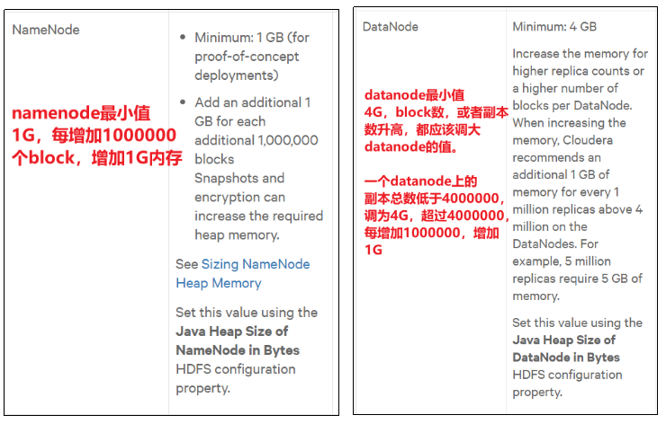

具体修改：hadoop-env.sh

```properties
export HDFS_NAMENODE_OPTS="-Dhadoop.security.logger=INFO,RFAS -Xmx1024m"
export HDFS_DATANODE_OPTS="-Dhadoop.security.logger=ERROR,RFAS -Xmx1024m"
```

## 1.2 NameNode心跳并发配置

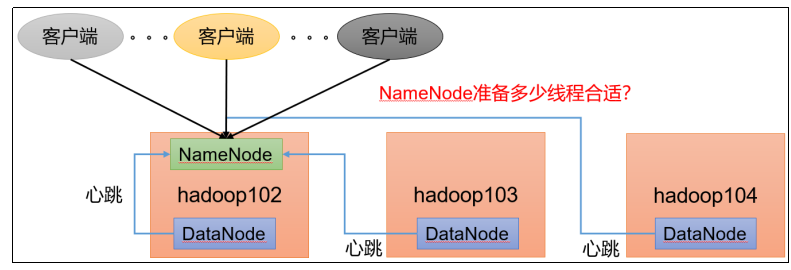

**1）hdfs-site.xml**

```xml
The number of Namenode RPC server threads that listen to requests from clients. If dfs.namenode.servicerpc-address is not configured then Namenode RPC server threads listen to requests from all nodes.
NameNode有一个工作线程池，用来处理不同DataNode的并发心跳以及客户端并发的元数据操作。
对于大集群或者有大量客户端的集群来说，通常需要增大该参数。默认值是10。
<property>
    <name>dfs.namenode.handler.count</name>
    <value>21</value>
</property>
```


```shell
[atguigu@hadoop102 ~]$ sudo yum install -y python
[atguigu@hadoop102 ~]$ python
Python 2.7.5 (default, Apr 11 2018, 07:36:10) 
[GCC 4.8.5 20150623 (Red Hat 4.8.5-28)] on linux2
Type "help", "copyright", "credits" or "license" for more information.
>>> import math
>>> print int(20*math.log(3))
21
>>> quit()
```

## 1.3 开启回收站配置

开启回收站功能，可以将删除的文件在不超时的情况下，恢复原数据，起到防止误删除、备份等作用。

**1）回收站工作机制**

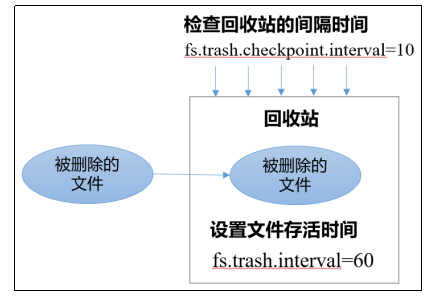

**2）开启回收站功能参数说明**

（1）默认值fs.trash.interval = 0，0表示禁用回收站；其他值表示设置文件的存活时间。

（2）默认值fs.trash.checkpoint.interval = 0，检查回收站的间隔时间。如果该值为0，则该值设置和fs.trash.interval的参数值相等。

（3）要求fs.trash.checkpoint.interval <= fs.trash.interval。

**3）启用回收站**

修改core-site.xml，配置垃圾回收时间为1分钟。

```xml
<property>
    <name>fs.trash.interval</name>
    <value>1</value>
</property>
```

**4）查看回收站**

回收站目录在HDFS集群中的路径：/user/atguigu/.Trash/….

**5）注意：通过网页上直接删除的文件也不会走回收站。**

**6）通过程序删除的文件不会经过回收站，需要调用moveToTrash()才进入回收站**

```shell
Trash trash = New Trash(conf);
trash.moveToTrash(path);
```

**7）只有在命令行利用hadoop fs -rm命令删除的文件才会走回收站。**

```shell
[atguigu@hadoop102 hadoop-3.1.3]$ hadoop fs -rm -r /user/atguigu/input
2021-07-14 16:13:42,643 INFO fs.TrashPolicyDefault: Moved: 'hdfs://hadoop102:9820/user/atguigu/input' to trash at: hdfs://hadoop102:9820/user/atguigu/.Trash/Current/user/atguigu/input
```

**8）恢复回收站数据**

```shell
[atguigu@hadoop102 hadoop-3.1.3]$ hadoop fs -mv
/user/atguigu/.Trash/Current/user/atguigu/input    /user/atguigu/input
```

# 第2章 HDFS—集群压测

在企业中非常关心每天从Java后台拉取过来的数据，需要多久能上传到集群？消费者关心多久能从HDFS上拉取需要的数据？

为了搞清楚HDFS的读写性能，生产环境上非常需要对集群进行压测。

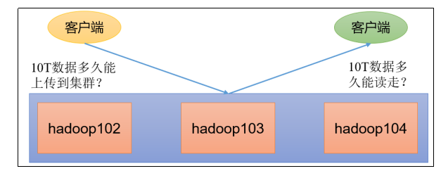

HDFS的读写性能主要受网络和磁盘影响比较大。为了方便测试，将hadoop102、hadoop103、hadoop104虚拟机网络都设置为100mbps。

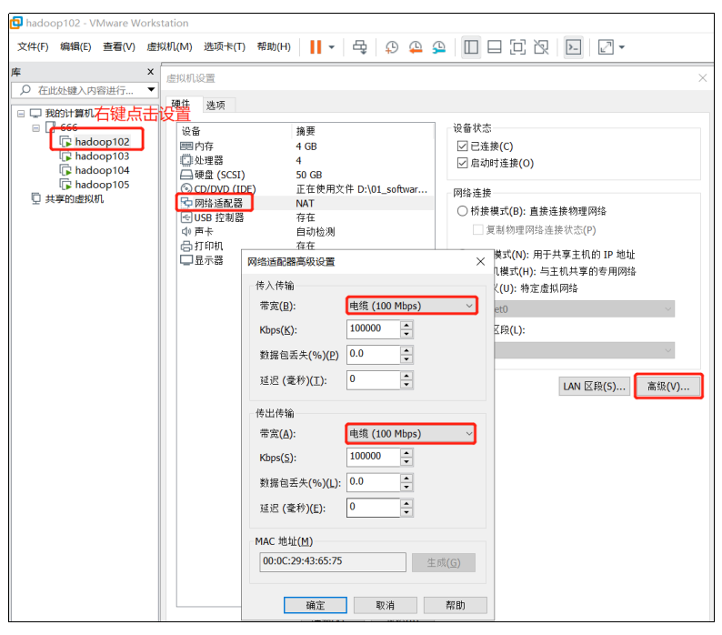

100Mbps单位是bit；10M/s单位是byte ; 1byte=8bit，100Mbps/8=12.5M/s。

测试网速：来到hadoop102的/opt/module目录，创建一个

```shell
[atguigu@hadoop102 software]$ python -m SimpleHTTPServer
```

## 2.1 测试HDFS写性能

**0）写测试底层原理**

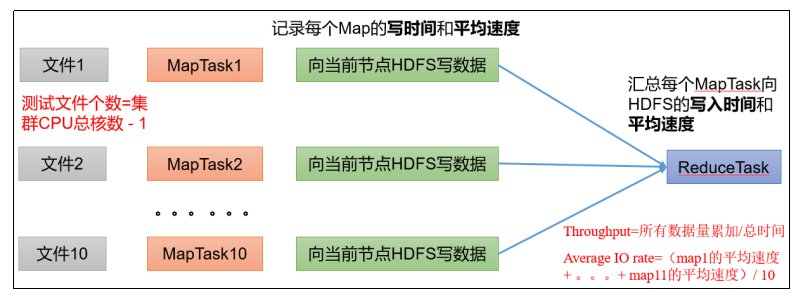

**1）测试内容：向HDFS集群写10个128M的文件**

```shell
[atguigu@hadoop102 mapreduce]$ hadoop jar /opt/module/hadoop-3.1.3/share/hadoop/mapreduce/hadoop-mapreduce-client-jobclient-3.1.3-tests.jar TestDFSIO -write -nrFiles 10 -fileSize 128MB

2021-02-09 10:43:16,853 INFO fs.TestDFSIO: ----- TestDFSIO ----- : write
2021-02-09 10:43:16,854 INFO fs.TestDFSIO:             Date & time: Tue Feb 09 10:43:16 CST 2021
2021-02-09 10:43:16,854 INFO fs.TestDFSIO:         Number of files: 10
2021-02-09 10:43:16,854 INFO fs.TestDFSIO:  Total MBytes processed: 1280
2021-02-09 10:43:16,854 INFO fs.TestDFSIO:       Throughput mb/sec: 1.61
2021-02-09 10:43:16,854 INFO fs.TestDFSIO:  Average IO rate mb/sec: 1.9
2021-02-09 10:43:16,854 INFO fs.TestDFSIO:   IO rate std deviation: 0.76
2021-02-09 10:43:16,854 INFO fs.TestDFSIO:      Test exec time sec: 133.05
2021-02-09 10:43:16,854 INFO fs.TestDFSIO:
```

注意：nrFiles n为生成mapTask的数量，生产环境一般可通过hadoop103:8088查看CPU核数，设置为（CPU核数 - 1）

1.  Number of files：生成mapTask数量，一般是集群中（CPU核数-1），我们测试虚拟机就按照实际的物理内存-1分配即可

2. Total MBytes processed：单个map处理的文件大小

3. Throughput mb/sec:单个mapTak的吞吐量 

   计算方式：处理的总文件大小/每一个mapTask写数据的时间累加

   集群整体吞吐量：生成mapTask数量*单个mapTak的吞吐量

4. Average IO rate mb/sec::平均mapTak的吞吐量

   计算方式：每个mapTask处理文件大小/每一个mapTask写数据的时间全部相加除以task数量

5. IO rate std deviation:方差、反映各个mapTask处理的差值，越小越均衡

**2）注意：如果测试过程中，出现异常**

（1）可以在yarn-site.xml中设置虚拟内存检测为false

```xml
<!--是否启动一个线程检查每个任务正使用的虚拟内存量，如果任务超出分配值，则直接将其杀掉，默认是true -->
<property>
     <name>yarn.nodemanager.vmem-check-enabled</name>
     <value>false</value>
</property>
```

（2）分发配置并重启Yarn集群

**3）测试结果分析**

​	（1）由于副本1就在本地，所以该副本不参与测试


一共参与测试的文件：10个文件 * 2个副本 = 20个

压测后的速度：1.61

实测速度：1.61M/s * 20个文件 ≈ 32M/s

三台服务器的带宽：12.5 + 12.5 + 12.5 ≈ 30m/s

所有网络资源都已经用满。

如果实测速度远远小于网络，并且实测速度不能满足工作需求，可以考虑采用固态硬盘或者增加磁盘个数。

​	（2）如果客户端不在集群节点，那就三个副本都参与计算

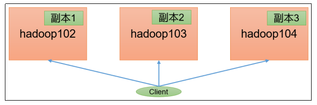

## 2.2 测试HDFS读性能

**1）测试内容：读取HDFS集群10个128M的文件**

```shell
[atguigu@hadoop102 mapreduce]$ hadoop jar /opt/module/hadoop-3.1.3/share/hadoop/mapreduce/hadoop-mapreduce-client-jobclient-3.1.3-tests.jar TestDFSIO -read -nrFiles 10 -fileSize 128MB

2021-02-09 11:34:15,847 INFO fs.TestDFSIO: ----- TestDFSIO ----- : read
2021-02-09 11:34:15,847 INFO fs.TestDFSIO:             Date & time: Tue Feb 09 11:34:15 CST 2021
2021-02-09 11:34:15,847 INFO fs.TestDFSIO:         Number of files: 10
2021-02-09 11:34:15,847 INFO fs.TestDFSIO:  Total MBytes processed: 1280
2021-02-09 11:34:15,848 INFO fs.TestDFSIO:       Throughput mb/sec: 200.28
2021-02-09 11:34:15,848 INFO fs.TestDFSIO:  Average IO rate mb/sec: 266.74
2021-02-09 11:34:15,848 INFO fs.TestDFSIO:   IO rate std deviation: 143.12
2021-02-09 11:34:15,848 INFO fs.TestDFSIO:      Test exec time sec: 20.83
```

**2）删除测试生成数据**

```shell
[atguigu@hadoop102 mapreduce]$ hadoop jar /opt/module/hadoop-3.1.3/share/hadoop/mapreduce/hadoop-mapreduce-client-jobclient-3.1.3-tests.jar TestDFSIO -clean
```

**3）测试结果分析：为什么读取文件速度大于网络带宽？由于目前只有三台服务器，且有三个副本，数据读取就近原则，相当于都是读取的本地磁盘数据，没有走网络。**

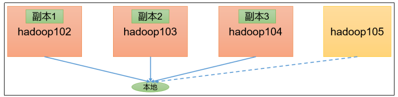

# 第3章 HDFS—多目录

## 3.1 NameNode多目录配置

**1）NameNode的本地目录可以配置成多个，且每个目录存放内容相同，增加了可靠性**

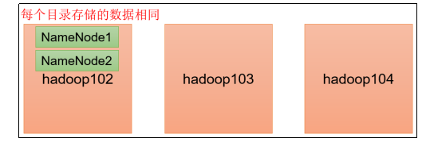

**2）具体配置如下**

​	（1）在hdfs-site.xml文件中添加如下内容

```xml
<property>
     <name>dfs.namenode.name.dir</name>
     <value>file://${hadoop.tmp.dir}/dfs/name1,file://${hadoop.tmp.dir}/dfs/name2</value>
</property>
```

注意：因为每台服务器节点的磁盘情况不同，所以这个配置配完之后，可以选择不分发

（2）停止集群，删除三台节点的data和logs中所有数据。

```shell
[atguigu@hadoop102 hadoop-3.1.3]$ rm -rf data/ logs/
[atguigu@hadoop103 hadoop-3.1.3]$ rm -rf data/ logs/
[atguigu@hadoop104 hadoop-3.1.3]$ rm -rf data/ logs/
```

（3）格式化集群并启动。

```shell
[atguigu@hadoop102 hadoop-3.1.3]$ bin/hdfs namenode -format
[atguigu@hadoop102 hadoop-3.1.3]$ sbin/start-dfs.sh
```

**3）查看结果**

```shell
[atguigu@hadoop102 dfs]$ ll
总用量 12
drwx------. 3 atguigu atguigu 4096 12月 11 08:03 data
drwxrwxr-x. 3 atguigu atguigu 4096 12月 11 08:03 name1
drwxrwxr-x. 3 atguigu atguigu 4096 12月 11 08:03 name2
```

检查name1和name2里面的内容，发现一模一样。

## 3.2 DataNode多目录配置

**1）DataNode可以配置成多个目录，每个目录存储的数据不一样（数据不是副本）**

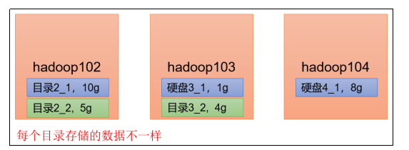

**2）具体配置如下**

在hdfs-site.xml文件中添加如下内容

```xml
<property>
     <name>dfs.datanode.data.dir</name>
     <value>file://${hadoop.tmp.dir}/dfs/data1,file://${hadoop.tmp.dir}/dfs/data2</value>
</property>
```

**3）查看结果**

```shell
[atguigu@hadoop102 dfs]$ ll
总用量 12
drwx------. 3 atguigu atguigu 4096 4月   4 14:22 data1
drwx------. 3 atguigu atguigu 4096 4月   4 14:22 data2
drwxrwxr-x. 3 atguigu atguigu 4096 12月 11 08:03 name1
drwxrwxr-x. 3 atguigu atguigu 4096 12月 11 08:03 name2
```

**4）向集群上传一个文件，再次观察两个文件夹里面的内容发现不一致（一个有数一个没有）**

````shell
[atguigu@hadoop102 hadoop-3.1.3]$ hadoop fs -put wcinput/word.txt /
````

## 3.3 集群数据均衡之磁盘间数据均衡

生产环境，由于硬盘空间不足，往往需要增加一块硬盘。刚加载的硬盘没有数据时，可以执行磁盘数据均衡命令。（Hadoop3.x新特性）

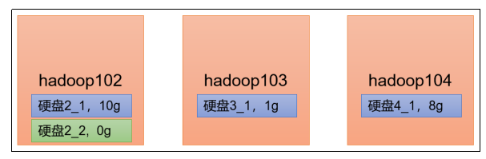

**（1）生成均衡计划（我们只有一块磁盘，不会生成计划）**

```shell
hdfs diskbalancer -plan hadoop103
```

**（2）执行均衡计划**

```shell
hdfs diskbalancer -execute hadoop103.plan.json
```

（3）查看当前均衡任务的执行情况

```shell
hdfs diskbalancer -query hadoop103
```

**（4）取消均衡任务**

```shell
hdfs diskbalancer -cancel hadoop103.plan.json
```

# 第4章 HDFS—集群扩容及缩容

## 4.1 添加白名单

白名单：表示在白名单的主机IP地址可以，用来存储数据。

企业中：配置白名单，可以尽量防止黑客恶意访问攻击。

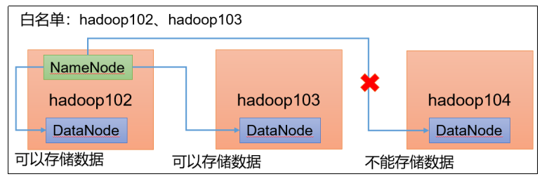

配置白名单步骤如下：

**1）在NameNode节点的/opt/module/hadoop-3.1.3/etc/hadoop目录下分别创建whitelist 和blacklist文件**

（1）创建白名单

```shell
[atguigu@hadoop102 hadoop]$ vim whitelist
```

在whitelist中添加如下主机名称，假如集群正常工作的节点为102 103 

```properties
hadoop102
hadoop103
```

（2）创建黑名单

```shell
[atguigu@hadoop102 hadoop]$ touch blacklist
```

​	保持空的就可以

**2）在hdfs-site.xml配置文件中增加dfs.hosts配置参数**

```xml
<!-- 白名单 -->
<property>
     <name>dfs.hosts</name>
     <value>/opt/module/hadoop-3.1.3/etc/hadoop/whitelist</value>
</property>

<!-- 黑名单 -->
<property>
     <name>dfs.hosts.exclude</name>
     <value>/opt/module/hadoop-3.1.3/etc/hadoop/blacklist</value>
</property>
```

**3）分发配置文件whitelist，hdfs-site.xml**

```shell
[atguigu@hadoop104 hadoop]$ xsync hdfs-site.xml whitelist
```

**4）第一次添加白名单必须重启集群，不是第一次，只需要刷新NameNode节点即可**

```shell
[atguigu@hadoop102 hadoop-3.1.3]$ myhadoop.sh stop
[atguigu@hadoop102 hadoop-3.1.3]$ myhadoop.sh start
```

**5）在web浏览器上查看DN，http://hadoop102:9870/dfshealth.html#tab-datanode**

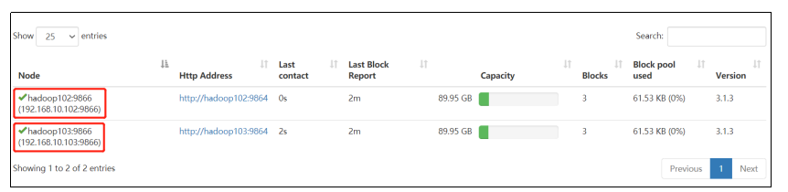

**6）在hadoop104上执行上传数据数据失败**

```shell
[atguigu@hadoop104 hadoop-3.1.3]$ hadoop fs -put NOTICE.txt /
```

**7）二次修改白名单，增加hadoop104**

```shell
[atguigu@hadoop102 hadoop]$ vim whitelist
修改为如下内容
hadoop102
hadoop103
hadoop104
```

**8）刷新NameNode**

```shell
[atguigu@hadoop102 hadoop-3.1.3]$ hdfs dfsadmin -refreshNodes
Refresh nodes successful
```

**9）在web浏览器上查看DN，http://hadoop102:9870/dfshealth.html#tab-datanode**

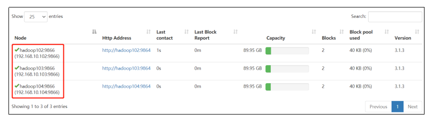

## 4.2 服役新服务器

**1）需求**

随着公司业务的增长，数据量越来越大，原有的数据节点的容量已经不能满足存储数据的需求，需要在原有集群基础上动态添加新的数据节点。

**2）环境准备**

（1）在hadoop100主机上再克隆一台hadoop105主机

（2）修改IP地址和主机名称

```shell
[root@hadoop105 ~]# vim /etc/sysconfig/network-scripts/ifcfg-ens33
[root@hadoop105 ~]# vim /etc/hostname
```

（3）拷贝hadoop102的/opt/module目录和/etc/profile.d/my_env.sh到hadoop105

```shell
[atguigu@hadoop102 opt]$ scp -r module/* atguigu@hadoop105:/opt/module/
[atguigu@hadoop102 opt]$ sudo scp /etc/profile.d/my_env.sh root@hadoop105:/etc/profile.d/my_env.sh
[atguigu@hadoop105 hadoop-3.1.3]$ source /etc/profile
```

（4）删除hadoop105上Hadoop的历史数据，data和log数据

```shell
[atguigu@hadoop105 hadoop-3.1.3]$ rm -rf data/ logs/
```

（5）配置hadoop102和hadoop103到hadoop105的ssh无密登录

```shell
[atguigu@hadoop102 .ssh]$ ssh-copy-id hadoop105
[atguigu@hadoop103 .ssh]$ ssh-copy-id hadoop105
```

**3）服役新节点具体步骤**

（1）直接启动DataNode，即可关联到集群

```shell
[atguigu@hadoop105 hadoop-3.1.3]$ hdfs --daemon start datanode
[atguigu@hadoop105 hadoop-3.1.3]$ yarn --daemon start nodemanager
```

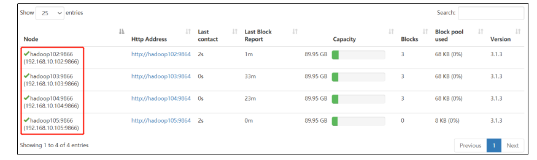

**4）在白名单中增加新服役的服务器**

（1）在白名单whitelist中增加hadoop104、hadoop105，并重启集群

```shell
[atguigu@hadoop102 hadoop]$ vim whitelist
修改为如下内容
hadoop102
hadoop103
hadoop104
hadoop105
```

（2）分发

```shell
[atguigu@hadoop102 hadoop]$ xsync whitelist
```

（3）刷新NameNode

```shell
[atguigu@hadoop102 hadoop-3.1.3]$ hdfs dfsadmin -refreshNodes
Refresh nodes successful
```

**5）在hadoop105上上传文件**

```shell
[atguigu@hadoop105 hadoop-3.1.3]$ hadoop fs -put /opt/module/hadoop-3.1.3/LICENSE.txt /
```

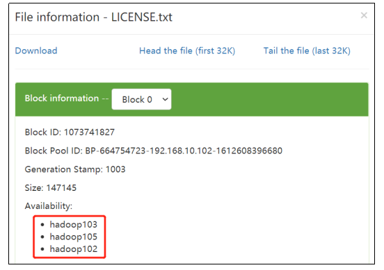

思考：如果数据不均衡（hadoop105数据少，其他节点数据多），怎么处理？

## 4.3 服务器间数据均衡

**1）企业经验：**

在企业开发中，如果经常在hadoop102和hadoop104上提交任务，且副本数为2，由于数据本地性原则，就会导致hadoop102和hadoop104数据过多，hadoop103存储的数据量小。

另一种情况，就是新服役的服务器数据量比较少，需要执行集群均衡命令。


**2）开启数据均衡命令：**

`[atguigu@hadoop105 hadoop-3.1.3]$ sbin/start-balancer.sh -threshold 10`

对于参数10，代表的是集群中各个节点的磁盘空间利用率相差不超过10%，可根据实际情况进行调整。

**3）停止数据均衡命令：**

`[atguigu@hadoop105 hadoop-3.1.3]$ sbin/stop-balancer.sh`

注意：由于HDFS需要启动单独的Rebalance Server来执行Rebalance操作，[所以尽量不要在NameNode上执行start-balancer.sh](http://xn--NameNodestart-balancer-sy68a2bx05ag98dux2afg9ay6af924fm2hzl3e.sh)，而是找一台比较空闲的机器。

## 4.4 黑名单退役服务器

黑名单：表示在黑名单的主机IP地址不可以，用来存储数据。

企业中：配置黑名单，用来退役服务器。

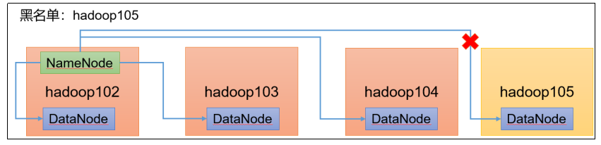

黑名单配置步骤如下：

**1）编辑/opt/module/hadoop-3.1.3/etc/hadoop目录下的blacklist文件**

```shell
[atguigu@hadoop102 hadoop] vim blacklist
```

添加如下主机名称（要退役的节点）

```shell
hadoop105
```

注意：如果白名单中没有配置，需要在hdfs-site.xml配置文件中增加dfs.hosts配置参数

```xml
<!-- 黑名单 -->
<property>
     <name>dfs.hosts.exclude</name>
     <value>/opt/module/hadoop-3.1.3/etc/hadoop/blacklist</value>
</property>
```

**2）分发配置文件blacklist，hdfs-site.xml**

```shell
[atguigu@hadoop104 hadoop]$ xsync hdfs-site.xml blacklist
```

**3）第一次添加黑名单必须重启集群，不是第一次，只需要刷新NameNode节点即可**

```shell
[atguigu@hadoop102 hadoop-3.1.3]$ hdfs dfsadmin -refreshNodes
Refresh nodes successful
```

**4）检查Web浏览器，退役节点的状态为decommission in progress（退役中），说明数据节点正在复制块到其他节点**

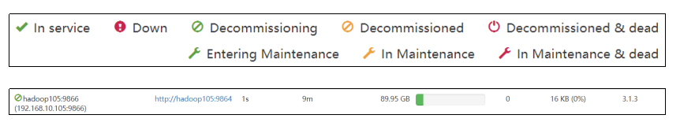

**5）等待退役节点状态为decommissioned（所有块已经复制完成），停止该节点及节点资源管理器。注意：如果副本数是3，服役的节点小于等于3，是不能退役成功的，需要修改副本数后才能退役**


```shell
[atguigu@hadoop105 hadoop-3.1.3]$ hdfs --daemon stop datanode
```

stopping datanode

```shell
[atguigu@hadoop105 hadoop-3.1.3]$ yarn --daemon stop nodemanager
```

stopping nodemanager

**6）如果数据不均衡，可以用命令实现集群的再平衡**

```shell
[atguigu@hadoop102 hadoop-3.1.3]$ sbin/start-balancer.sh -threshold 10
```

# 第5章 HDFS—存储优化

注：演示纠删码和异构存储需要一共5台虚拟机。尽量拿另外一套集群。提前准备5台服务器的集群。

## 5.1 纠删码

### 5.1.1 纠删码原理

HDFS默认情况下，一个文件有3个副本，这样提高了数据的可靠性，但也带来了2倍的冗余开销。Hadoop3.x引入了纠删码，采用计算的方式，可以节省约50％左右的存储空间。

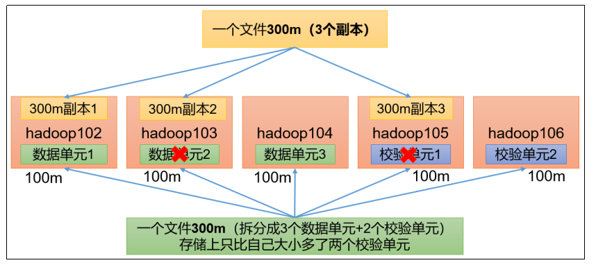

**1）纠删码操作相关的命令**

```shell
[atguigu@hadoop102 hadoop-3.1.3]$ hdfs ec
Usage: bin/hdfs ec [COMMAND]
          [-listPolicies]
          [-addPolicies -policyFile <file>]
          [-getPolicy -path <path>]
          [-removePolicy -policy <policy>]
          [-setPolicy -path <path> [-policy <policy>] [-replicate]]
          [-unsetPolicy -path <path>]
          [-listCodecs]
          [-enablePolicy -policy <policy>]
          [-disablePolicy -policy <policy>]
          [-help <command-name>].
```

**2）查看当前支持的纠删码策略**

```shell
[atguigu@hadoop102 hadoop-3.1.3] hdfs ec -listPolicies
Erasure Coding Policies:
ErasureCodingPolicy=[Name=RS-10-4-1024k, Schema=[ECSchema=[Codec=rs, numDataUnits=10, numParityUnits=4]], CellSize=1048576, Id=5], State=DISABLED
ErasureCodingPolicy=[Name=RS-3-2-1024k, Schema=[ECSchema=[Codec=rs, numDataUnits=3, numParityUnits=2]], CellSize=1048576, Id=2], State=DISABLED
ErasureCodingPolicy=[Name=RS-6-3-1024k, Schema=[ECSchema=[Codec=rs, numDataUnits=6, numParityUnits=3]], CellSize=1048576, Id=1], State=ENABLED
ErasureCodingPolicy=[Name=RS-LEGACY-6-3-1024k, Schema=[ECSchema=[Codec=rs-legacy, numDataUnits=6, numParityUnits=3]], CellSize=1048576, Id=3], State=DISABLED
ErasureCodingPolicy=[Name=XOR-2-1-1024k, Schema=[ECSchema=[Codec=xor, numDataUnits=2, numParityUnits=1]], CellSize=1048576, Id=4], State=DISABLED
```

**3）纠删码策略解释:**

RS-3-2-1024k：使用RS编码，每3个数据单元，生成2个校验单元，共5个单元，也就是说：这5个单元中，只要有任意的3个单元存在（不管是数据单元还是校验单元，只要总数=3），就可以得到原始数据。每个单元的大小是1024k=1024*1024=1048576。

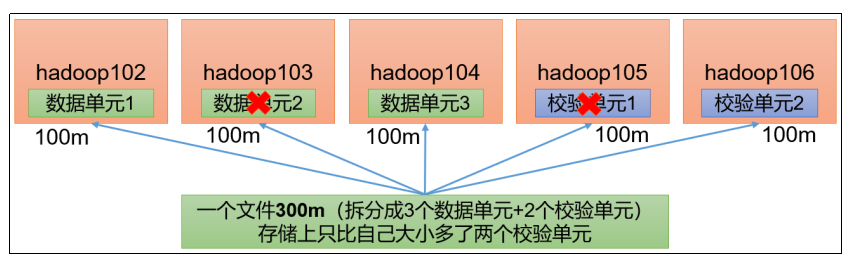

RS-10-4-1024k：使用RS编码，每10个数据单元（cell），生成4个校验单元，共14个单元，也就是说：这14个单元中，只要有任意的10个单元存在（不管是数据单元还是校验单元，只要总数=10），就可以得到原始数据。每个单元的大小是1024k=1024*1024=1048576。

RS-6-3-1024k：使用RS编码，每6个数据单元，生成3个校验单元，共9个单元，也就是说：这9个单元中，只要有任意的6个单元存在（不管是数据单元还是校验单元，只要总数=6），就可以得到原始数据。每个单元的大小是1024k=1024*1024=1048576。

RS-LEGACY-6-3-1024k：策略和上面的RS-6-3-1024k一样，只是编码的算法用的是rs-legacy。 

XOR-2-1-1024k：使用XOR编码（速度比RS编码快），每2个数据单元，生成1个校验单元，共3个单元，也就是说：这3个单元中，只要有任意的2个单元存在（不管是数据单元还是校验单元，只要总数= 2），就可以得到原始数据。每个单元的大小是1024k=1024*1024=1048576。

### 5.1.2 纠删码案例实操

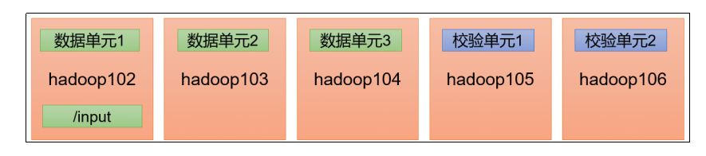

纠删码策略是给具体一个路径设置。所有往此路径下存储的文件，都会执行此策略。

默认只开启对RS-6-3-1024k策略的支持，如要使用别的策略需要提前启用。

**1）需求：将/input目录设置为RS-3-2-1024k策略**

**2）具体步骤**

（1）开启对RS-3-2-1024k策略的支持

```shell
[atguigu@hadoop102 hadoop-3.1.3]$  hdfs ec -enablePolicy  -policy RS-3-2-1024k
Erasure coding policy RS-3-2-1024k is enabled
```

（2）在HDFS创建目录，并设置RS-3-2-1024k策略

```shell
[atguigu@hadoop102  hadoop-3.1.3]$  hdfs dfs -mkdir /input
[atguigu@hadoop202 hadoop-3.1.3]$ hdfs ec -setPolicy -path /input -policy RS-3-2-1024k
```

（3）上传文件，并查看文件编码后的存储情况

```shell
[atguigu@hadoop102 hadoop-3.1.3]$ hdfs dfs -put web.log /input
```

注：你所上传的文件需要大于2M才能看出效果。（低于2M，只有一个数据单元和两个校验单元）

（4）查看存储路径的数据单元和校验单元，并作破坏实验

## 5.2 异构存储（冷热数据分离）

异构存储主要解决，不同的数据，存储在不同类型的硬盘中，达到最佳性能的问题。

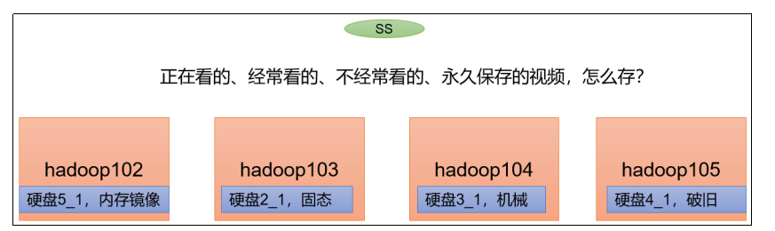

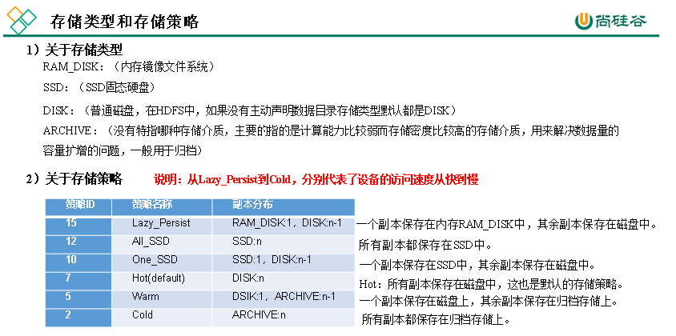

### 5.2.1 异构存储Shell操作

**（1）查看当前有哪些存储策略可以用**

`[atguigu@hadoop102 hadoop-3.1.3]$ hdfs storagepolicies -listPolicies`

**（2）为指定路径（数据存储目录）设置指定的存储策略**

`hdfs storagepolicies -setStoragePolicy -path xxx -policy xxx`

**（3）获取指定路径（数据存储目录或文件）的存储策略**

`hdfs storagepolicies -getStoragePolicy -path xxx`

**（4）取消存储策略；执行改命令之后该目录或者文件，以其上级的目录为准，如果是根目录，那么就是HOT**

`hdfs storagepolicies -unsetStoragePolicy -path xxx`

**（5）查看文件块的分布**

`bin/hdfs fsck xxx -files -blocks -locations`

**（6）查看集群节点**

`hadoop dfsadmin -report`

### 5.2.2 测试环境准备

**1）测试环境描述**

服务器规模：5台

集群配置：副本数为2，创建好带有存储类型的目录（提前创建）

集群规划：

| 节点      | 存储类型分配   |
| --------- | -------------- |
| hadoop102 | RAM_DISK，SSD  |
| hadoop103 | SSD，DISK      |
| hadoop104 | DISK，RAM_DISK |
| hadoop105 | ARCHIVE        |
| hadoop106 | ARCHIVE        |

**2）配置文件信息**

（1）为hadoop102节点的hdfs-site.xml添加如下信息

```xml
<property>
	<name>dfs.replication</name>
	<value>2</value>
</property>
<property>
	<name>dfs.storage.policy.enabled</name>
	<value>true</value>
</property>
<property>
	<name>dfs.datanode.data.dir</name> 
	<value>[SSD]file:///opt/module/hadoop-3.1.3/hdfsdata/ssd,[RAM_DISK]file:///opt/module/hadoop-3.1.3/hdfsdata/ram_disk</value>
</property>
```

（2）为hadoop103节点的hdfs-site.xml添加如下信息

```xml
<property>
	<name>dfs.replication</name>
	<value>2</value>
</property>
<property>
	<name>dfs.storage.policy.enabled</name>
	<value>true</value>
</property>
<property>
	<name>dfs.datanode.data.dir</name>
	<value>[SSD]file:///opt/module/hadoop-3.1.3/hdfsdata/ssd,[DISK]file:///opt/module/hadoop-3.1.3/hdfsdata/disk</value>
</property>
```

（3）为hadoop104节点的hdfs-site.xml添加如下信息

```xml
<property>
	<name>dfs.replication</name>
	<value>2</value>
</property>
<property>
	<name>dfs.storage.policy.enabled</name>
	<value>true</value>
</property>
<property>
	<name>dfs.datanode.data.dir</name>
	<value>[RAM_DISK]file:///opt/module/hdfsdata/ram_disk,[DISK]file:///opt/module/hadoop-3.1.3/hdfsdata/disk</value>
</property>
```

（4）为hadoop105节点的hdfs-site.xml添加如下信息

```xml
<property>
	<name>dfs.replication</name>
	<value>2</value>
</property>
<property>
	<name>dfs.storage.policy.enabled</name>
	<value>true</value>
</property>
<property>
	<name>dfs.datanode.data.dir</name>
	<value>[ARCHIVE]file:///opt/module/hadoop-3.1.3/hdfsdata/archive</value>
</property>
```

（5）为hadoop106节点的hdfs-site.xml添加如下信息

```xml
<property>
	<name>dfs.replication</name>
	<value>2</value>
</property>
<property>
	<name>dfs.storage.policy.enabled</name>
	<value>true</value>
</property>
<property>
	<name>dfs.datanode.data.dir</name>
	<value>[ARCHIVE]file:///opt/module/hadoop-3.1.3/hdfsdata/archive</value>
</property>
```

**3）数据准备**

（1）启动集群

```shell
[atguigu@hadoop102 hadoop-3.1.3]$ hdfs namenode -format
[atguigu@hadoop102 hadoop-3.1.3]$ myhadoop.sh start
```

（1）并在HDFS上创建文件目录

```shell
[atguigu@hadoop102 hadoop-3.1.3]$ hadoop fs -mkdir /hdfsdata
```

（2）并将文件资料上传

```shell
[atguigu@hadoop102 hadoop-3.1.3]$ hadoop fs -put /opt/module/hadoop-3.1.3/NOTICE.txt /hdfsdata
```

### 5.2.3 HOT存储策略案例

**（1）最开始我们未设置存储策略的情况下，我们获取该目录的存储策略**

```shell
[atguigu@hadoop102 hadoop-3.1.3]$ hdfs storagepolicies -getStoragePolicy -path /hdfsdata
```

**（2）我们查看上传的文件块分布**

```shell
[atguigu@hadoop102 hadoop-3.1.3]$ hdfs fsck /hdfsdata -files -blocks -locations
[DatanodeInfoWithStorage[192.168.10.104:9866,DS-0b133854-7f9e-48df-939b-5ca6482c5afb,DISK], DatanodeInfoWithStorage[192.168.10.103:9866,DS-ca1bd3b9-d9a5-4101-9f92-3da5f1baa28b,DISK]]
```

未设置存储策略，所有文件块都存储在DISK下。所以，默认存储策略为HOT。

### 5.2.4 WARM存储策略测试

**（1）接下来我们为数据降温**

```shell
[atguigu@hadoop102 hadoop-3.1.3]$ hdfs storagepolicies -setStoragePolicy -path /hdfsdata -policy WARM
```

**（2）再次查看文件块分布，我们可以看到文件块依然放在原处。**

```shell
[atguigu@hadoop102 hadoop-3.1.3]$ hdfs fsck /hdfsdata -files -blocks -locations
```

**（3）我们需要让他HDFS按照存储策略自行移动文件块**

```shell
[atguigu@hadoop102 hadoop-3.1.3]$ hdfs mover /hdfsdata
```

**（4）再次查看文件块分布**

```shell
[atguigu@hadoop102 hadoop-3.1.3]$ hdfs fsck /hdfsdata -files -blocks -locations
[DatanodeInfoWithStorage[192.168.10.105:9866,DS-d46d08e1-80c6-4fca-b0a2-4a3dd7ec7459,ARCHIVE], DatanodeInfoWithStorage[192.168.10.103:9866,DS-ca1bd3b9-d9a5-4101-9f92-3da5f1baa28b,DISK]]
```

文件块一半在DISK，一半在ARCHIVE，符合我们设置的WARM策略

### 5.2.5 COLD策略测试

**（1）我们继续将数据降温为cold**

```shell
[atguigu@hadoop102 hadoop-3.1.3]$ hdfs storagepolicies -setStoragePolicy -path /hdfsdata -policy COLD
```

注意：当我们将目录设置为COLD并且我们未配置ARCHIVE存储目录的情况下，不可以向该目录直接上传文件，会报出异常。

**（2）手动转移**

```shell
[atguigu@hadoop102 hadoop-3.1.3]$ hdfs mover /hdfsdata
```

**（3）检查文件块的分布**

```shell
[atguigu@hadoop102 hadoop-3.1.3]$ bin/hdfs fsck /hdfsdata -files -blocks -locations
[DatanodeInfoWithStorage[192.168.10.105:9866,DS-d46d08e1-80c6-4fca-b0a2-4a3dd7ec7459,ARCHIVE], DatanodeInfoWithStorage[192.168.10.106:9866,DS-827b3f8b-84d7-47c6-8a14-0166096f919d,ARCHIVE]]
```

所有文件块都在ARCHIVE，符合COLD存储策略。

### 5.2.6 ONE_SSD策略测试

**（1）接下来我们将存储策略从默认的HOT更改为One_SSD**

```shell
[atguigu@hadoop102 hadoop-3.1.3]$ hdfs storagepolicies -setStoragePolicy -path /hdfsdata -policy One_SSD
```

**（2）手动转移文件块**

```shell
[atguigu@hadoop102 hadoop-3.1.3]$ hdfs mover /hdfsdata
```

**（3）转移完成后，我们查看文件块分布**

```shell
[atguigu@hadoop102 hadoop-3.1.3]$ bin/hdfs fsck /hdfsdata -files -blocks -locations
[DatanodeInfoWithStorage[192.168.10.104:9866,DS-0b133854-7f9e-48df-939b-5ca6482c5afb,DISK], DatanodeInfoWithStorage[192.168.10.103:9866,DS-2481a204-59dd-46c0-9f87-ec4647ad429a,SSD]]
```

文件块分布为一半在SSD，一半在DISK，符合One_SSD存储策略。

### 5.2.7 ALL_SSD策略测试

**（1）接下来，我们再将存储策略更改为All_SSD**

```shell
[atguigu@hadoop102 hadoop-3.1.3]$ hdfs storagepolicies -setStoragePolicy -path /hdfsdata -policy All_SSD
```

**（2）手动转移文件块**

```shell
[atguigu@hadoop102 hadoop-3.1.3]$ hdfs mover /hdfsdata
```

**（3）查看文件块分布，我们可以看到**

```shell
[atguigu@hadoop102 hadoop-3.1.3]$ bin/hdfs fsck /hdfsdata -files -blocks -locations

[DatanodeInfoWithStorage[192.168.10.102:9866,DS-c997cfb4-16dc-4e69-a0c4-9411a1b0c1eb,SSD], DatanodeInfoWithStorage[192.168.10.103:9866,DS-2481a204-59dd-46c0-9f87-ec4647ad429a,SSD]]
```

所有的文件块都存储在SSD，符合All_SSD存储策略。

### 5.2.8 LAZY_PERSIST策略测试

**（1）继续改变策略，将存储策略改为lazy_persist**

```shell
[atguigu@hadoop102 hadoop-3.1.3]$ hdfs storagepolicies -setStoragePolicy -path /hdfsdata -policy lazy_persist
```

**（2）手动转移文件块**

```shell
[atguigu@hadoop102 hadoop-3.1.3]$ hdfs mover /hdfsdata
```

**（3）查看文件块分布**

```shell
[atguigu@hadoop102 hadoop-3.1.3]$ hdfs fsck /hdfsdata -files -blocks -locations

[DatanodeInfoWithStorage[192.168.10.104:9866,DS-0b133854-7f9e-48df-939b-5ca6482c5afb,DISK], DatanodeInfoWithStorage[192.168.10.103:9866,DS-ca1bd3b9-d9a5-4101-9f92-3da5f1baa28b,DISK]]
```

这里我们发现所有的文件块都是存储在DISK，按照理论一个副本存储在RAM_DISK，其他副本存储在DISK中，这是因为，我们还需要配置“dfs.datanode.max.locked.memory”，“dfs.block.size”参数。

那么出现存储策略为LAZY_PERSIST时，文件块副本都存储在DISK上的原因有如下两点：

（1）当客户端所在的DataNode节点没有RAM_DISK时，则会写入客户端所在的DataNode节点的DISK磁盘，其余副本会写入其他节点的DISK磁盘。

（2）当客户端所在的DataNode有RAM_DISK，但“dfs.datanode.max.locked.memory”参数值未设置或者设置过小（小于“dfs.block.size”参数值）时，则会写入客户端所在的DataNode节点的DISK磁盘，其余副本会写入其他节点的DISK磁盘。

但是由于虚拟机的“max locked memory”为64KB，所以，如果参数配置过大，还会报出错误：

```shell
ERROR org.apache.hadoop.hdfs.server.datanode.DataNode: Exception in secureMain
java.lang.RuntimeException: Cannot start datanode because the configured max locked memory size (dfs.datanode.max.locked.memory) of 209715200 bytes is more than the datanode's available RLIMIT_MEMLOCK ulimit of 65536 bytes.
```

我们可以通过该命令查询此参数的内存

```shell
[atguigu@hadoop102 hadoop-3.1.3]$ ulimit -a
max locked memory       (kbytes, -l) 64
```

# 第6章 HDFS—故障排除

注意：采用三台服务器即可，恢复到Yarn开始的服务器快照。

## 6.1 NameNode故障处理

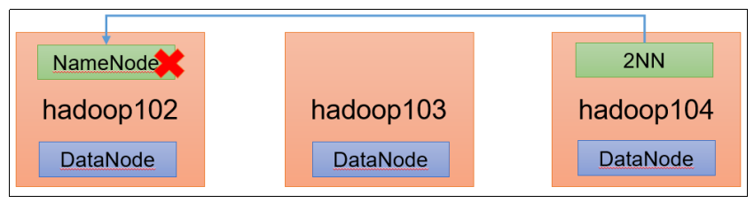

**1）需求：**

NameNode进程挂了并且存储的数据也丢失了，如何恢复NameNode

**2）故障模拟**

（1）kill -9 NameNode进程

```shell
[atguigu@hadoop102 current]$ kill -9 19886
```

（2）删除NameNode存储的数据（/opt/module/hadoop-3.1.3/data/tmp/dfs/name）

```shell
[atguigu@hadoop102 hadoop-3.1.3]$ rm -rf /opt/module/hadoop-3.1.3/data/dfs/name/*
```

**3）问题解决**

（1）拷贝SecondaryNameNode中数据到原NameNode存储数据目录

```shell
[atguigu@hadoop102 dfs]$ scp -r atguigu@hadoop104:/opt/module/hadoop-3.1.3/data/dfs/namesecondary/* ./name/
```

（2）重新启动NameNode

```shell
[atguigu@hadoop102 hadoop-3.1.3]$ hdfs --daemon start namenode
```

（3）向集群上传一个文件

## 6.2 集群安全模式&磁盘修复

**1）安全模式：文件系统只接受读数据请求，而不接受删除、修改等变更请求**

**2）进入安全模式场景**

1.  NameNode在加载镜像文件和编辑日志期间处于安全模式；

2.  NameNode再接收DataNode注册时，处于安全模式 

   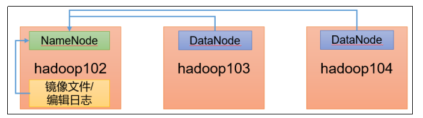

**3）退出安全模式条件**

dfs.namenode.safemode.min.datanodes:最小可用datanode数量，默认0

dfs.namenode.safemode.threshold-pct:副本数达到最小要求的block占系统总block数的百分比，默认0.999f。（只允许丢一个块）

dfs.namenode.safemode.extension:稳定时间，默认值30000毫秒，即30秒

**4）基本语法**

集群处于安全模式，不能执行重要操作（写操作）。集群启动完成后，自动退出安全模式。

```shell
（1）bin/hdfs dfsadmin -safemode get	（功能描述：查看安全模式状态）
（2）bin/hdfs dfsadmin -safemode enter （功能描述：进入安全模式状态）
（3）bin/hdfs dfsadmin -safemode leave	（功能描述：离开安全模式状态）
（4）bin/hdfs dfsadmin -safemode wait	（功能描述：等待安全模式状态）
```

**5）案例1：启动集群进入安全模式**

​		（1）重新启动集群

```shell
[atguigu@hadoop102 subdir0]$ myhadoop.sh stop
[atguigu@hadoop102 subdir0]$ myhadoop.sh start
```

​	（2）集群启动后，立即来到集群上删除数据，提示集群处于安全模式

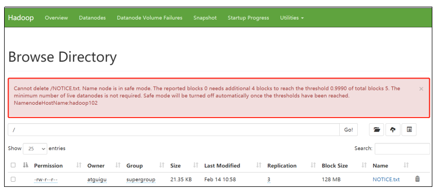

**6）案例2：磁盘修复**

​	需求：数据块损坏，进入安全模式，如何处理

​	（1）分别进入hadoop102、hadoop103、hadoop104的/opt/module/hadoop-3.1.3/data/dfs/data/current/BP-1015489500-192.168.10.102-1611909480872/current/finalized/subdir0/subdir0目录，统一删除某2个块信息

```shell
[atguigu@hadoop102 subdir0]$ pwd
/opt/module/hadoop-3.1.3/data/dfs/data/current/BP-1015489500-192.168.10.102-1611909480872/current/finalized/subdir0/subdir0
[atguigu@hadoop102 subdir0]$ rm -rf blk_1073741847 blk_1073741847_1023.meta
[atguigu@hadoop102 subdir0]$ rm -rf blk_1073741865 blk_1073741865_1042.meta
```

说明：hadoop103/hadoop104重复执行以上命令

​	（2）重新启动集群

```shell
[atguigu@hadoop102 subdir0]$ myhadoop.sh stop
[atguigu@hadoop102 subdir0]$ myhadoop.sh start
```

​	（3）观察http://hadoop102:9870/dfshealth.html#tab-overview

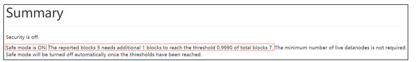

​	说明：安全模式已经打开，块的数量没有达到要求。

​	（4）离开安全模式

```shell
[atguigu@hadoop102 subdir0]$ hdfs dfsadmin -safemode get
Safe mode is ON
[atguigu@hadoop102 subdir0]$ hdfs dfsadmin -safemode leave
Safe mode is OFF
```

​	（5）观察http://hadoop102:9870/dfshealth.html#tab-overview

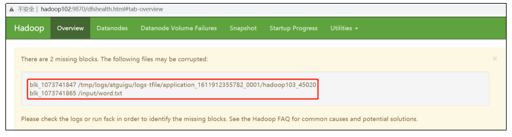

​	（6）将元数据删除

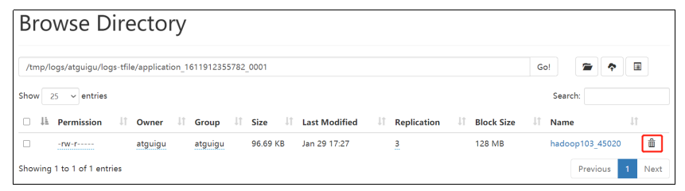

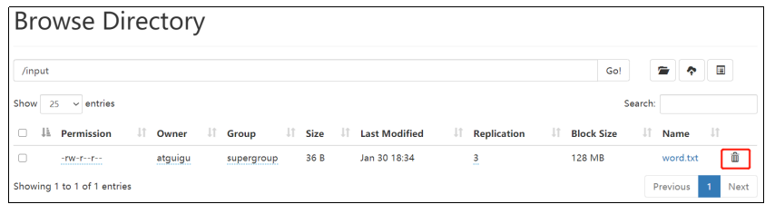

（7）观察[http://hadoop102:9870/dfshealth.html#tab-overview](#tab-overview)，集群已经正常

**7）案例3：**

​	需求：模拟等待安全模式

（1）查看当前模式

```shell
[atguigu@hadoop102 hadoop-3.1.3]$ hdfs dfsadmin -safemode get
Safe mode is OFF
```

（2）先进入安全模式

```shell
[atguigu@hadoop102 hadoop-3.1.3]$ bin/hdfs dfsadmin -safemode enter
```

（3）创建并执行下面的脚本

在/opt/module/hadoop-3.1.3路径上，编辑一个脚本safemode.sh

```shell
[atguigu@hadoop102 hadoop-3.1.3]$ vim safemode.sh
#!/bin/bash
hdfs dfsadmin -safemode wait
hdfs dfs -put /opt/module/hadoop-3.1.3/README.txt /
[atguigu@hadoop102 hadoop-3.1.3]$ chmod 777 safemode.sh
[atguigu@hadoop102 hadoop-3.1.3]$ ./safemode.sh 
```

（4）再打开一个窗口，执行

```shell
[atguigu@hadoop102 hadoop-3.1.3]$ bin/hdfs dfsadmin -safemode leave
```

（5）再观察上一个窗口

```shell
Safe mode is OFF
```

（6）HDFS集群上已经有上传的数据了


## 6.3 慢磁盘监控

“慢磁盘”指的时写入数据非常慢的一类磁盘。其实慢性磁盘并不少见，当机器运行时间长了，上面跑的任务多了，磁盘的读写性能自然会退化，严重时就会出现写入数据延时的问题。

如何发现慢磁盘？

正常在HDFS上创建一个目录，只需要不到1s的时间。如果你发现创建目录超过1分钟及以上，而且这个现象并不是每次都有。只是偶尔慢了一下，就很有可能存在慢磁盘。

可以采用如下方法找出是哪块磁盘慢：

**1）通过心跳未联系时间。**

一般出现慢磁盘现象，会影响到DataNode与NameNode之间的心跳。正常情况心跳时间间隔是3s。超过3s说明有异常。

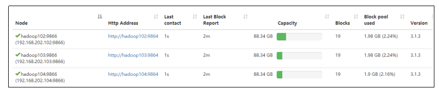

**2）fio命令，测试磁盘的读写性能**

（1）顺序读测试

```shell
[atguigu@hadoop102 ~]# sudo yum install -y fio
[atguigu@hadoop102 ~]# sudo fio -filename=/home/atguigu/test.log -direct=1 -iodepth 1 -thread -rw=read -ioengine=psync -bs=16k -size=2G -numjobs=10 -runtime=60 -group_reporting -name=test_r
Run status group 0 (all jobs):
   READ: bw=360MiB/s (378MB/s), 360MiB/s-360MiB/s (378MB/s-378MB/s), io=20.0GiB (21.5GB), run=56885-56885msec
```

结果显示，磁盘的总体顺序读速度为360MiB/s。

（2）顺序写测试

```shell
[atguigu@hadoop102 ~]# sudo fio -filename=/home/atguigu/test.log -direct=1 -iodepth 1 -thread -rw=write -ioengine=psync -bs=16k -size=2G -numjobs=10 -runtime=60 -group_reporting -name=test_w
Run status group 0 (all jobs):
  WRITE: bw=341MiB/s (357MB/s), 341MiB/s-341MiB/s (357MB/s-357MB/s), io=19.0GiB (21.4GB), run=60001-60001msec
```

结果显示，磁盘的总体顺序写速度为341MiB/s。

（3）随机写测试

```shell
[atguigu@hadoop102 ~]# sudo fio -filename=/home/atguigu/test.log -direct=1 -iodepth 1 -thread -rw=randwrite -ioengine=psync -bs=16k -size=2G -numjobs=10 -runtime=60 -group_reporting -name=test_randw
Run status group 0 (all jobs):
  WRITE: bw=309MiB/s (324MB/s), 309MiB/s-309MiB/s (324MB/s-324MB/s), io=18.1GiB (19.4GB), run=60001-60001msec
```

结果显示，磁盘的总体随机写速度为309MiB/s。

（4）混合随机读写：

```shell
[atguigu@hadoop102 ~]# sudo fio -filename=/home/atguigu/test.log -direct=1 -iodepth 1 -thread -rw=randrw -rwmixread=70 -ioengine=psync -bs=16k -size=2G -numjobs=10 -runtime=60 -group_reporting -name=test_r_w -ioscheduler=noop
Run status group 0 (all jobs):
   READ: bw=220MiB/s (231MB/s), 220MiB/s-220MiB/s (231MB/s-231MB/s), io=12.9GiB (13.9GB), run=60001-60001msec
  WRITE: bw=94.6MiB/s (99.2MB/s), 94.6MiB/s-94.6MiB/s (99.2MB/s-99.2MB/s), io=5674MiB (5950MB), run=60001-60001msec
```

结果显示，磁盘的总体混合随机读写，读速度为220MiB/s，写速度94.6MiB/s。

## 6.4 小文件归档

**1）HDFS存储小文件弊端**


每个文件均按块存储，每个块的元数据存储在NameNode的内存中，因此HDFS存储小文件会非常低效。因为大量的小文件会耗尽NameNode中的大部分内存。但注意，存储小文件所需要的磁盘容量和数据块的大小无关。例如，一个1MB的文件设置为128MB的块存储，实际使用的是1MB的磁盘空间，而不是128MB。

**2）解决存储小文件办法之一**

HDFS存档文件或HAR文件，是一个更高效的文件存档工具，它将文件存入HDFS块，在减少NameNode内存使用的同时，允许对文件进行透明的访问。具体说来，HDFS存档文件对内还是一个一个独立文件，对NameNode而言却是一个整体，减少了NameNode的内存。


**3）案例实操**

（1）需要启动YARN进程

```shell
[atguigu@hadoop102 hadoop-3.1.3]$ start-yarn.sh
```

（2）归档文件

​	把/input目录里面的所有文件归档成一个叫input.har的归档文件，并把归档后文件存储到/output路径下。

```shell
[atguigu@hadoop102 hadoop-3.1.3]$ hadoop archive -archiveName input.har -p /input  /output
```

（3）查看归档

```shell
[atguigu@hadoop102 hadoop-3.1.3]$ hadoop fs -ls /output/input.har
[atguigu@hadoop102 hadoop-3.1.3]$ hadoop fs -ls har:///output/input.har
```

（4）解归档文件

```shell
[atguigu@hadoop102 hadoop-3.1.3]$ hadoop fs -cp har:///output/input.har/*    /
```

# 第7章 HDFS—集群迁移

## 7.1 Apache和Apache集群间数据拷贝

**1）scp实现两个远程主机之间的文件复制**

​	scp -r hello.txt [root@hadoop103:/user/atguigu/hello.txt](mailto:root@hadoop103:/user/atguigu/hello.txt)		// 推 push

​	scp -r [root@hadoop103:/user/atguigu/hello.txt  hello.txt](mailto:root@hadoop103:/user/atguigu/hello.txt  hello.txt)		// 拉 pull

​	scp -r [root@hadoop103:/user/atguigu/hello.txt](mailto:root@hadoop103:/user/atguigu/hello.txt) root@hadoop104:/user/atguigu  //是通过本地主机中转实现两个远程主机的文件复制；如果在两个远程主机之间ssh没有配置的情况下可以使用该方式。

**2）采用distcp命令实现两个Hadoop集群之间的递归数据复制**

```shell
[atguigu@hadoop102 hadoop-3.1.3]$  bin/hadoop distcp
hdfs://hadoop102:8020/user/atguigu/hello.txt 
hdfs://hadoop105:8020/user/atguigu/hello.txt
```

## 7.2 Apache和CDH集群间数据拷贝

具体看详细文档

# 第8章 MapReduce生产经验

## 8.1 MapReduce跑的慢的原因

MapReduce程序效率的瓶颈在于两点：

**1）计算机性能**

CPU、内存、磁盘、网络

**2）I/O操作优化**

（1）数据倾斜

（2）Map运行时间太长，导致Reduce等待过久

（3）小文件过多

## 8.2 MapReduce常用调优参数

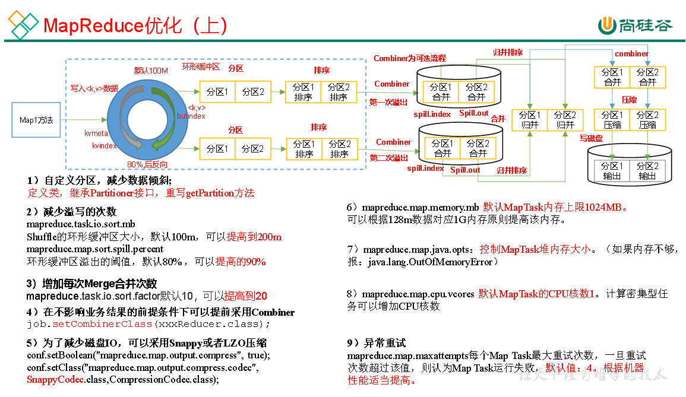

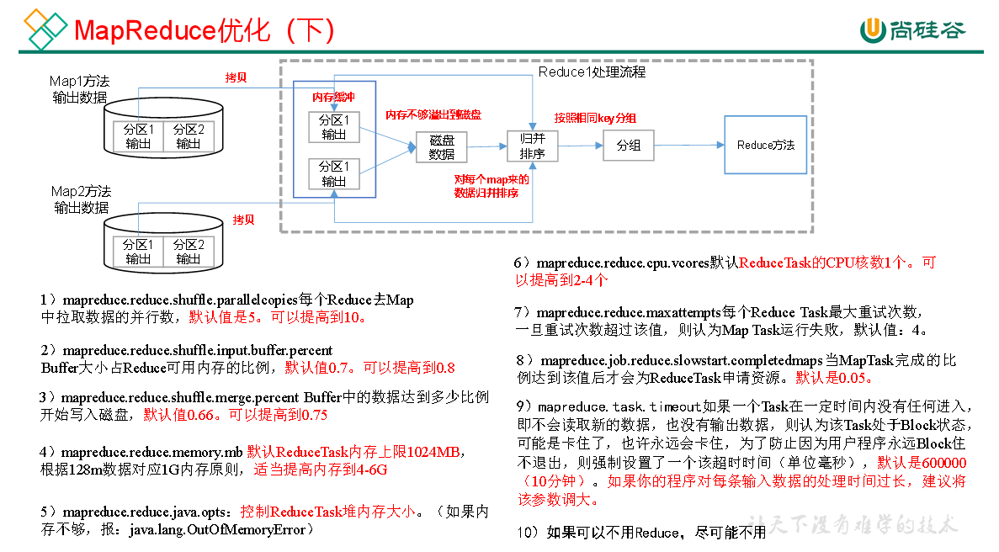

## 8.3 MapReduce数据倾斜问题

**1）数据倾斜现象**

数据频率倾斜——某一个区域的数据量要远远大于其他区域。

数据大小倾斜——部分记录的大小远远大于平均值。

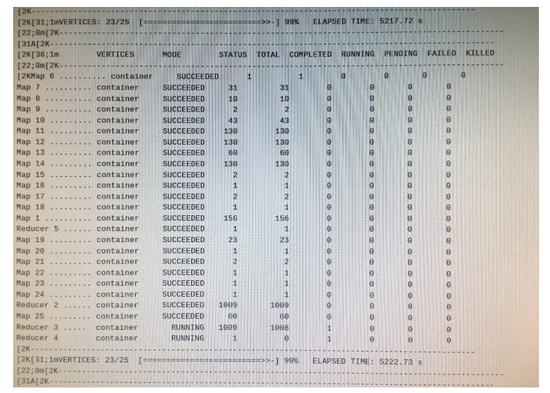

**2）减少数据倾斜的方法**

​	（1）首先检查是否空值过多造成的数据倾斜

​	生产环境，可以直接过滤掉空值；如果想保留空值，就自定义分区，将空值加随机数打散。最后再二次聚合。

​	（2）能在map阶段提前处理，最好先在Map阶段处理。如：Combiner、MapJoin

​	（3）设置多个reduce个数

# 第9章 Hadoop-Yarn生产经验

## 9.1 常用的调优参数

**1）调优参数列表**

（1）Resourcemanager相关

```properties
yarn.resourcemanager.scheduler.client.thread-count	ResourceManager处理调度器请求的线程数量
yarn.resourcemanager.scheduler.class	配置调度器
```

（2）Nodemanager相关

```properties
yarn.nodemanager.resource.memory-mb	              NodeManager使用内存数
yarn.nodemanager.resource.system-reserved-memory-mb  NodeManager为系统保留多少内存，和上一个参数二者取一即可

yarn.nodemanager.resource.cpu-vcores	NodeManager使用CPU核数
yarn.nodemanager.resource.count-logical-processors-as-cores	是否将虚拟核数当作CPU核数
yarn.nodemanager.resource.pcores-vcores-multiplier	虚拟核数和物理核数乘数，例如：4核8线程，该参数就应设为2
yarn.nodemanager.resource.detect-hardware-capabilities	是否让yarn自己检测硬件进行配置

yarn.nodemanager.pmem-check-enabled	是否开启物理内存检查限制container
yarn.nodemanager.vmem-check-enabled	是否开启虚拟内存检查限制container
yarn.nodemanager.vmem-pmem-ratio        虚拟内存物理内存比例
```

（3）Container容器相关

```properties
yarn.scheduler.minimum-allocation-mb	     容器最小内存
yarn.scheduler.maximum-allocation-mb	     容器最大内存
yarn.scheduler.minimum-allocation-vcores	 容器最小核数
yarn.scheduler.maximum-allocation-vcores	 容器最大核数
```

**2）参数具体使用案例**

详见《尚硅谷大数据技术之Hadoop（Yarn）》，第2.1节。

## 9.2 容量调度器使用

详见《尚硅谷大数据技术之Hadoop（Yarn）》，第2.2节。

## 9.3 公平调度器使用

详见《尚硅谷大数据技术之Hadoop（Yarn）》，第2.3节。

# 第10章 Hadoop综合调优

## 10.1 Hadoop小文件优化方法

### 10.1.1 Hadoop小文件弊端

HDFS上每个文件都要在NameNode上创建对应的元数据，这个元数据的大小约为150byte，这样当小文件比较多的时候，就会产生很多的元数据文件，一方面会大量占用NameNode的内存空间，另一方面就是元数据文件过多，使得寻址索引速度变慢。

小文件过多，在进行MR计算时，会生成过多切片，需要启动过多的MapTask。每个MapTask处理的数据量小，导致MapTask的处理时间比启动时间还小，白白消耗资源。

### 10.1.2 Hadoop小文件解决方案

**1）在数据采集的时候，就将小文件或小批数据合成大文件再上传HDFS（数据源头）**

**2）Hadoop Archive（存储方向）**

是一个高效的将小文件放入HDFS块中的文件存档工具，能够将多个小文件打包成一个HAR文件，从而达到减少NameNode的内存使用

**3）CombineTextInputFormat（计算方向）**

CombineTextInputFormat用于将多个小文件在切片过程中生成一个单独的切片或者少量的切片。 

**4）开启uber模式，实现JVM重用（计算方向）**

默认情况下，每个Task任务都需要启动一个JVM来运行，如果Task任务计算的数据量很小，我们可以让同一个Job的多个Task运行在一个JVM中，不必为每个Task都开启一个JVM。

​	（1）未开启uber模式，在/input路径上上传多个小文件并执行wordcount程序

```shell
[atguigu@hadoop102 hadoop-3.1.3]$ hadoop jar share/hadoop/mapreduce/hadoop-mapreduce-examples-3.1.3.jar wordcount /input /output2
```

​	（2）观察控制台

```shell
2021-02-14 16:13:50,607 INFO mapreduce.Job: Job job_1613281510851_0002 running in uber mode : false
```

（3）观察http://hadoop103:8088/cluster

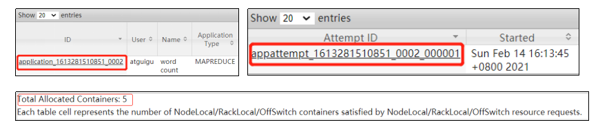

（4）开启uber模式，在mapred-site.xml中添加如下配置

```xml
<!--  开启uber模式，默认关闭 -->
<property>
  	<name>mapreduce.job.ubertask.enable</name>
  	<value>true</value>
</property>

<!-- uber模式中最大的mapTask数量，可向下修改  --> 
<property>
  	<name>mapreduce.job.ubertask.maxmaps</name>
  	<value>9</value>
</property>
<!-- uber模式中最大的reduce数量，可向下修改 -->
<property>
  	<name>mapreduce.job.ubertask.maxreduces</name>
  	<value>1</value>
</property>
<!-- uber模式中最大的输入数据量，默认使用dfs.blocksize 的值，可向下修改 -->
<property>
  	<name>mapreduce.job.ubertask.maxbytes</name>
  	<value></value>
</property>
```

**（5）分发配置**

```shell
[atguigu@hadoop102 hadoop]$ xsync mapred-site.xml
```

**（6）再次执行wordcount程序**

```shell
[atguigu@hadoop102 hadoop-3.1.3]$ hadoop jar share/hadoop/mapreduce/hadoop-mapreduce-examples-3.1.3.jar wordcount /input /output2
```

**（7）观察控制台**

```shell
2021-02-14 16:28:36,198 INFO mapreduce.Job: Job job_1613281510851_0003 running in uber mode : true
```

**（8）观察http://hadoop103:8088/cluster**


## 10.2 测试MapReduce计算性能

使用Sort程序评测MapReduce

注：一个虚拟机不超过150G磁盘尽量不要执行这段代码

**（1）使用RandomWriter来产生随机数，每个节点运行10个Map任务，每个Map产生大约1G大小的二进制随机数**

```shell
[atguigu@hadoop102 mapreduce]$ hadoop jar /opt/module/hadoop-3.1.3/share/hadoop/mapreduce/hadoop-mapreduce-examples-3.1.3.jar randomwriter random-data
```

**（2）执行Sort程序**

```shell
[atguigu@hadoop102 mapreduce]$ hadoop jar /opt/module/hadoop-3.1.3/share/hadoop/mapreduce/hadoop-mapreduce-examples-3.1.3.jar sort random-data sorted-data
```

**（3）验证数据是否真正排好序了**

```shell
[atguigu@hadoop102 mapreduce]$ 
hadoop jar /opt/module/hadoop-3.1.3/share/hadoop/mapreduce/hadoop-mapreduce-client-jobclient-3.1.3-tests.jar testmapredsort -sortInput random-data -sortOutput sorted-data
```

## 10.3 企业开发场景案例

### 10.3.1 需求

**（1）需求：从1G数据中，统计每个单词出现次数。服务器3台，每台配置4G内存，4核CPU，4线程。**

**（2）需求分析：**

1G / 128m = 8个MapTask；1个ReduceTask；1个mrAppMaster

平均每个节点运行10个 / 3台 ≈ 3个任务（4	3	3）

### 10.3.2 HDFS参数调优

**（1）修改：hadoop-env.sh**

```shell
export HDFS_NAMENODE_OPTS="-Dhadoop.security.logger=INFO,RFAS -Xmx1024m"
export HDFS_DATANODE_OPTS="-Dhadoop.security.logger=ERROR,RFAS -Xmx1024m"
```

**（2）修改hdfs-site.xml**

```xml
<!-- NameNode有一个工作线程池，默认值是10 -->
<property>
    <name>dfs.namenode.handler.count</name>
    <value>21</value>
</property>
```

**（3）修改core-site.xml**

```xml
<!-- 配置垃圾回收时间为60分钟 -->
<property>
    <name>fs.trash.interval</name>
    <value>60</value>
</property>
```

**（4）分发配置**

```shell
[atguigu@hadoop102 hadoop]$ xsync hadoop-env.sh hdfs-site.xml core-site.xml
```

### 10.3.3 MapReduce参数调优

**（1）修改mapred-site.xml**

```xml
<!-- 环形缓冲区大小，默认100m -->
<property>
  <name>mapreduce.task.io.sort.mb</name>
  <value>100</value>
</property>

<!-- 环形缓冲区溢写阈值，默认0.8 -->
<property>
  <name>mapreduce.map.sort.spill.percent</name>
  <value>0.80</value>
</property>

<!-- merge合并次数，默认10个 -->
<property>
  <name>mapreduce.task.io.sort.factor</name>
  <value>10</value>
</property>

<!-- maptask内存，默认1g； maptask堆内存大小默认和该值大小一致mapreduce.map.java.opts -->
<property>
  <name>mapreduce.map.memory.mb</name>
  <value>-1</value>
  <description>The amount of memory to request from the scheduler for each    map task. If this is not specified or is non-positive, it is inferred from mapreduce.map.java.opts and mapreduce.job.heap.memory-mb.ratio. If java-opts are also not specified, we set it to 1024.
  </description>
</property>

<!-- matask的CPU核数，默认1个 -->
<property>
  <name>mapreduce.map.cpu.vcores</name>
  <value>1</value>
</property>

<!-- matask异常重试次数，默认4次 -->
<property>
  <name>mapreduce.map.maxattempts</name>
  <value>4</value>
</property>

<!-- 每个Reduce去Map中拉取数据的并行数。默认值是5 -->
<property>
  <name>mapreduce.reduce.shuffle.parallelcopies</name>
  <value>5</value>
</property>

<!-- Buffer大小占Reduce可用内存的比例，默认值0.7 -->
<property>
  <name>mapreduce.reduce.shuffle.input.buffer.percent</name>
  <value>0.70</value>
</property>

<!-- Buffer中的数据达到多少比例开始写入磁盘，默认值0.66。 -->
<property>
  <name>mapreduce.reduce.shuffle.merge.percent</name>
  <value>0.66</value>
</property>

<!-- reducetask内存，默认1g；reducetask堆内存大小默认和该值大小一致mapreduce.reduce.java.opts -->
<property>
  <name>mapreduce.reduce.memory.mb</name>
  <value>-1</value>
  <description>The amount of memory to request from the scheduler for each    reduce task. If this is not specified or is non-positive, it is inferred
    from mapreduce.reduce.java.opts and mapreduce.job.heap.memory-mb.ratio.
    If java-opts are also not specified, we set it to 1024.
  </description>
</property>

<!-- reducetask的CPU核数，默认1个 -->
<property>
  <name>mapreduce.reduce.cpu.vcores</name>
  <value>2</value>
</property>

<!-- reducetask失败重试次数，默认4次 -->
<property>
  <name>mapreduce.reduce.maxattempts</name>
  <value>4</value>
</property>

<!-- 当MapTask完成的比例达到该值后才会为ReduceTask申请资源。默认是0.05 -->
<property>
  <name>mapreduce.job.reduce.slowstart.completedmaps</name>
  <value>0.05</value>
</property>

<!-- 如果程序在规定的默认10分钟内没有读到数据，将强制超时退出 -->
<property>
  <name>mapreduce.task.timeout</name>
  <value>600000</value>
</property>
```

**（2）分发配置**

```shell
[atguigu@hadoop102 hadoop]$ xsync mapred-site.xml
```

### 10.3.4 Yarn参数调优

**（1）修改yarn-site.xml配置参数如下：**

```xml
<!-- 选择调度器，默认容量 -->
<property>
	<description>The class to use as the resource scheduler.</description>
	<name>yarn.resourcemanager.scheduler.class</name>
	<value>org.apache.hadoop.yarn.server.resourcemanager.scheduler.capacity.CapacityScheduler</value>
</property>

<!-- ResourceManager处理调度器请求的线程数量,默认50；如果提交的任务数大于50，可以增加该值，但是不能超过3台 * 4线程 = 12线程（去除其他应用程序实际不能超过8） -->
<property>
	<description>Number of threads to handle scheduler interface.</description>
	<name>yarn.resourcemanager.scheduler.client.thread-count</name>
	<value>8</value>
</property>

<!-- 是否让yarn自动检测硬件进行配置，默认是false，如果该节点有很多其他应用程序，建议手动配置。如果该节点没有其他应用程序，可以采用自动 -->
<property>
	<description>Enable auto-detection of node capabilities such as
	memory and CPU.
	</description>
	<name>yarn.nodemanager.resource.detect-hardware-capabilities</name>
	<value>false</value>
</property>

<!-- 是否将虚拟核数当作CPU核数，默认是false，采用物理CPU核数 -->
<property>
	<description>Flag to determine if logical processors(such as
	hyperthreads) should be counted as cores. Only applicable on Linux
	when yarn.nodemanager.resource.cpu-vcores is set to -1 and
	yarn.nodemanager.resource.detect-hardware-capabilities is true.
	</description>
	<name>yarn.nodemanager.resource.count-logical-processors-as-cores</name>
	<value>false</value>
</property>

<!-- 虚拟核数和物理核数乘数，默认是1.0 -->
<property>
	<description>Multiplier to determine how to convert phyiscal cores to
	vcores. This value is used if yarn.nodemanager.resource.cpu-vcores
	is set to -1(which implies auto-calculate vcores) and
	yarn.nodemanager.resource.detect-hardware-capabilities is set to true. The	number of vcores will be calculated as	number of CPUs * multiplier.
	</description>
	<name>yarn.nodemanager.resource.pcores-vcores-multiplier</name>
	<value>1.0</value>
</property>

<!-- NodeManager使用内存数，默认8G，修改为4G内存 -->
<property>
	<description>Amount of physical memory, in MB, that can be allocated 
	for containers. If set to -1 and
	yarn.nodemanager.resource.detect-hardware-capabilities is true, it is
	automatically calculated(in case of Windows and Linux).
	In other cases, the default is 8192MB.
	</description>
	<name>yarn.nodemanager.resource.memory-mb</name>
	<value>4096</value>
</property>

<!-- nodemanager的CPU核数，不按照硬件环境自动设定时默认是8个，修改为4个 -->
<property>
	<description>Number of vcores that can be allocated
	for containers. This is used by the RM scheduler when allocating
	resources for containers. This is not used to limit the number of
	CPUs used by YARN containers. If it is set to -1 and
	yarn.nodemanager.resource.detect-hardware-capabilities is true, it is
	automatically determined from the hardware in case of Windows and Linux.
	In other cases, number of vcores is 8 by default.</description>
	<name>yarn.nodemanager.resource.cpu-vcores</name>
	<value>4</value>
</property>

<!-- 容器最小内存，默认1G -->
<property>
	<description>The minimum allocation for every container request at the RM	in MBs. Memory requests lower than this will be set to the value of this	property. Additionally, a node manager that is configured to have less memory	than this value will be shut down by the resource manager.
	</description>
	<name>yarn.scheduler.minimum-allocation-mb</name>
	<value>1024</value>
</property>

<!-- 容器最大内存，默认8G，修改为2G -->
<property>
	<description>The maximum allocation for every container request at the RM	in MBs. Memory requests higher than this will throw an	InvalidResourceRequestException.
	</description>
	<name>yarn.scheduler.maximum-allocation-mb</name>
	<value>2048</value>
</property>

<!-- 容器最小CPU核数，默认1个 -->
<property>
	<description>The minimum allocation for every container request at the RM	in terms of virtual CPU cores. Requests lower than this will be set to the	value of this property. Additionally, a node manager that is configured to	have fewer virtual cores than this value will be shut down by the resource	manager.
	</description>
	<name>yarn.scheduler.minimum-allocation-vcores</name>
	<value>1</value>
</property>

<!-- 容器最大CPU核数，默认4个，修改为2个 -->
<property>
	<description>The maximum allocation for every container request at the RM	in terms of virtual CPU cores. Requests higher than this will throw an
	InvalidResourceRequestException.</description>
	<name>yarn.scheduler.maximum-allocation-vcores</name>
	<value>2</value>
</property>

<!-- 虚拟内存检查，默认打开，修改为关闭 -->
<property>
	<description>Whether virtual memory limits will be enforced for
	containers.</description>
	<name>yarn.nodemanager.vmem-check-enabled</name>
	<value>false</value>
</property>

<!-- 虚拟内存和物理内存设置比例,默认2.1 -->
<property>
	<description>Ratio between virtual memory to physical memory when	setting memory limits for containers. Container allocations are	expressed in terms of physical memory, and virtual memory usage	is allowed to exceed this allocation by this ratio.
	</description>
	<name>yarn.nodemanager.vmem-pmem-ratio</name>
	<value>2.1</value>
</property>
```

**（2）分发配置**

```shell
[atguigu@hadoop102 hadoop]$ xsync yarn-site.xml
```

### 10.3.5 执行程序

**（1）重启集群**

```shell
[atguigu@hadoop102 hadoop-3.1.3]$ sbin/stop-yarn.sh
[atguigu@hadoop103 hadoop-3.1.3]$ sbin/start-yarn.sh
```

**（2）执行WordCount程序**

```shell
[atguigu@hadoop102 hadoop-3.1.3]$ hadoop jar share/hadoop/mapreduce/hadoop-mapreduce-examples-3.1.3.jar wordcount /input /output
```

**（3）观察Yarn任务执行页面**

http://hadoop103:8088/cluster/apps
