# 第1章 Hadoop概述

## 1.1 Hadoop是什么


## 1.2 Hadoop发展历史（了解）


## 1.3 Hadoop三大发行版本（了解）

Hadoop三大发行版本：Apache、Cloudera、Hortonworks。

​		Apache版本最原始（最基础）的版本，对于入门学习最好。2006

​		Cloudera内部集成了很多大数据框架，对应产品CDH。2008

​		Hortonworks文档较好，对应产品HDP。2011

​		Hortonworks现在已经被Cloudera公司收购，推出新的品牌CDP。

​	

### 1）Apache Hadoop

官网地址：http://hadoop.apache.org

下载地址：https://hadoop.apache.org/releases.html

### 2）Cloudera Hadoop

官网地址：https://www.cloudera.com/downloads/cdh

下载地址：https://docs.cloudera.com/documentation/enterprise/6/release-notes/topics/rg_cdh_6_download.html

（1）2008年成立的Cloudera是最早将Hadoop商用的公司，为合作伙伴提供Hadoop的商用解决方案，主要是包括支持、咨询服务、培训。

（2）2009年Hadoop的创始人Doug Cutting也加盟Cloudera公司。Cloudera产品主要为CDH，Cloudera Manager，Cloudera Support

（3）CDH是Cloudera的Hadoop发行版，完全开源，比Apache Hadoop在兼容性，安全性，稳定性上有所增强。Cloudera的标价为每年每个节点10000美元。

（4）Cloudera Manager是集群的软件分发及管理监控平台，可以在几个小时内部署好一个Hadoop集群，并对集群的节点及服务进行实时监控。

### 3）Hortonworks Hadoop

官网地址：https://hortonworks.com/products/data-center/hdp/

下载地址：https://hortonworks.com/downloads/#data-platform

（1）2011年成立的Hortonworks是雅虎与硅谷风投公司Benchmark Capital合资组建。

（2）公司成立之初就吸纳了大约25名至30名专门研究Hadoop的雅虎工程师，上述工程师均在2005年开始协助雅虎开发Hadoop，贡献了Hadoop80%的代码。

（3）Hortonworks的主打产品是Hortonworks Data Platform（HDP），也同样是100%开源的产品，HDP除常见的项目外还包括了Ambari，一款开源的安装和管理系统。

（4）2018年Hortonworks目前已经被Cloudera公司收购。

## 1.4 Hadoop优势（4高）

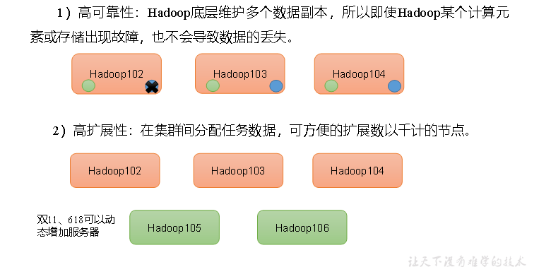

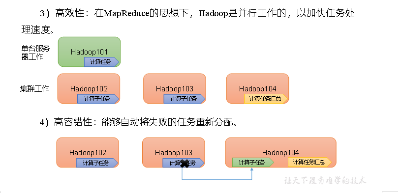

## 1.5 Hadoop组成（面试重点）


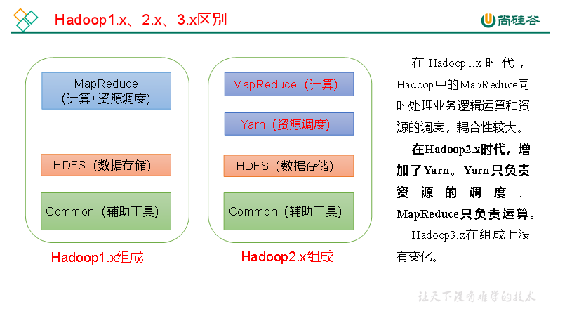

### 1.5.1 HDFS架构概述

Hadoop Distributed File System，简称HDFS，是一个分布式文件系统。


### 1.5.2 YARN架构概述

Yet Another Resource Negotiator简称YARN ，另一种资源协调者，是Hadoop的资源管理器。

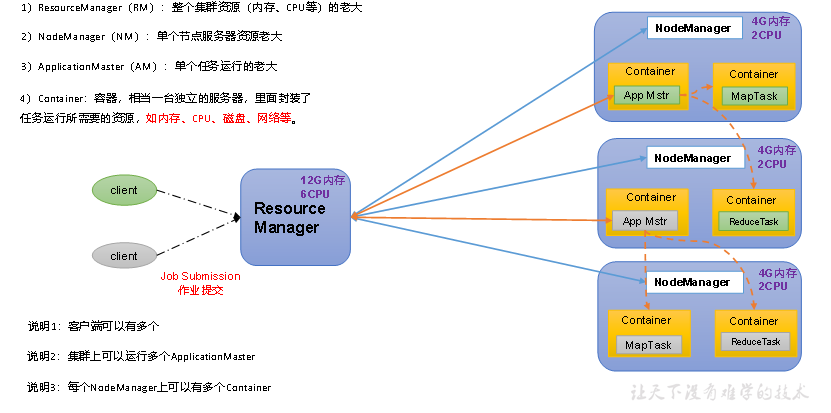

### 1.5.3 MapReduce架构概述

MapReduce将计算过程分为两个阶段：Map和Reduce

1）Map阶段并行处理输入数据

2）Reduce阶段对Map结果进行汇总

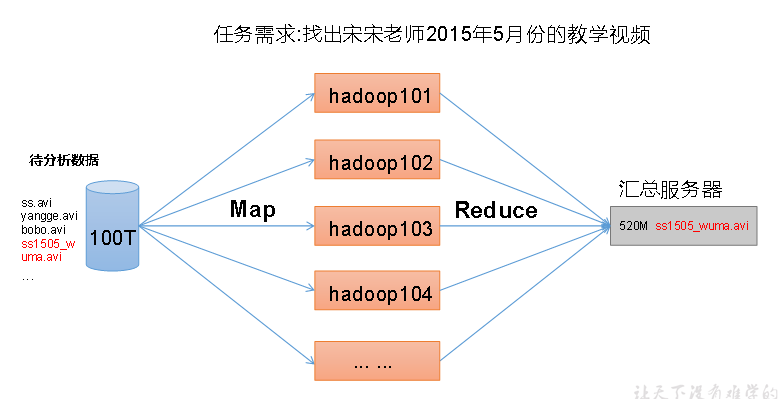

### 1.5.4 HDFS、YARN、MapReduce三者关系

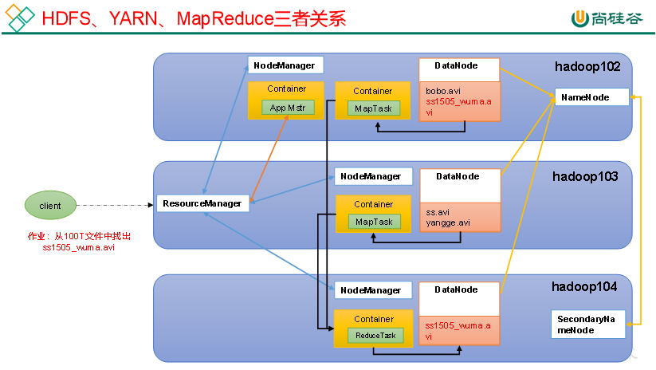

## 1.6 大数据技术生态体系

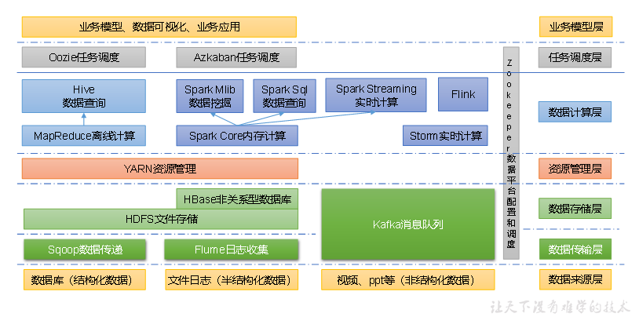

图中涉及的技术名词解释如下：

1）**Sqoop**：Sqoop是一款开源的工具，主要用于在Hadoop、Hive与传统的数据库（MySQL）间进行数据的传递，可以将一个关系型数据库（例如 ：MySQL，Oracle 等）中的数据导进到Hadoop的HDFS中，也可以将HDFS的数据导进到关系型数据库中。

2）**Flume**：Flume是一个高可用的，高可靠的，分布式的海量日志采集、聚合和传输的系统，Flume支持在日志系统中定制各类数据发送方，用于收集数据； 

3）**Kafka**：Kafka是一种高吞吐量的分布式发布订阅消息系统； 

4）**Spark**：Spark是当前最流行的开源大数据内存计算框架。可以基于Hadoop上存储的大数据进行计算。

5）**Flink**：Flink是当前最流行的开源大数据内存计算框架。用于实时计算的场景较多。

6）**Oozie**：Oozie是一个管理Hadoop作业（job）的工作流程调度管理系统。

7）**Hbase**：HBase是一个分布式的、面向列的开源数据库。HBase不同于一般的关系数据库，它是一个适合于非结构化数据存储的数据库。

8）**Hive**：Hive是基于Hadoop的一个数据仓库工具，可以将结构化的数据文件映射为一张数据库表，并提供简单的SQL查询功能，可以将SQL语句转换为MapReduce任务进行运行。其优点是学习成本低，可以通过类SQL语句快速实现简单的MapReduce统计，不必开发专门的MapReduce应用，十分适合数据仓库的统计分析。

9）**ZooKeeper**：它是一个针对大型分布式系统的可靠协调系统，提供的功能包括：配置维护、名字服务、分布式同步、组服务等。

## 1.7 推荐系统框架图

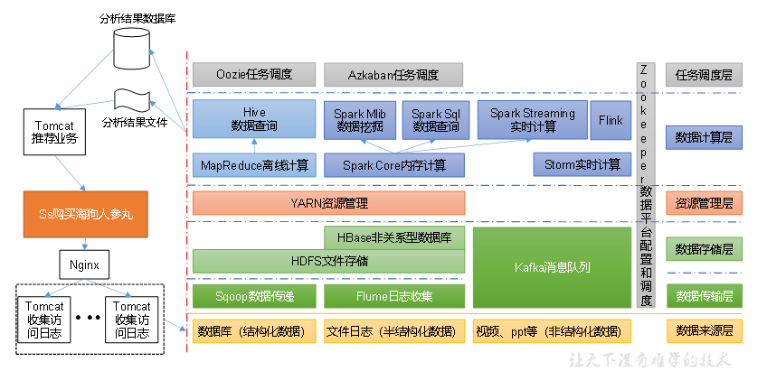

# 第2章 Hadoop运行环境搭建（开发重点）

## 2.1 模板虚拟机环境准备

**0）安装模板虚拟机**

​	IP地址192.168.10.100、主机名称hadoop100、内存4G、硬盘50G

**1）hadoop100虚拟机配置要求如下（本文Linux系统全部以CentOS-7.5-x86-1804为例）**

（1）使用yum安装需要虚拟机可以正常上网，yum安装前可以先测试下虚拟机联网情况

```shell
[root@hadoop100 ~]# ping www.baidu.com
PING www.baidu.com (14.215.177.39) 56(84) bytes of data.
64 bytes from 14.215.177.39 (14.215.177.39): icmp_seq=1 ttl=128 time=8.60 ms
64 bytes from 14.215.177.39 (14.215.177.39): icmp_seq=2 ttl=128 time=7.72 ms
```

（2）安装epel-release

注：Extra Packages for Enterprise Linux是为“红帽系”的操作系统提供额外的软件包，适用于RHEL、CentOS和Scientific Linux。相当于是一个软件仓库，大多数rpm包在官方 repository 中是找不到的）

```shell
[root@hadoop100 ~]# yum install -y epel-release
```

（3）注意：如果Linux安装的是最小系统版，还需要安装如下工具；如果安装的是Linux桌面标准版，不需要执行如下操作

> net-tool：工具包集合，包含ifconfig等命令

```shell
[root@hadoop100 ~]# yum install -y net-tools 
```

> vim：编辑器

```shell
[root@hadoop100 ~]# yum install -y vim
```

**2）关闭防火墙，关闭防火墙开机自启**

```shell
[root@hadoop100 ~]# systemctl stop firewalld
[root@hadoop100 ~]# systemctl disable firewalld.service
```

​	注意：在企业开发时，通常单个服务器的防火墙时关闭的。公司整体对外会设置非常安全的防火墙

**3）创建atguigu用户，并修改atguigu用户的密码**

```shell
[root@hadoop100 ~]# useradd atguigu
[root@hadoop100 ~]# passwd atguigu
```

**4）配置atguigu用户具有root权限，方便后期加sudo执行root权限的命令**

```
[root@hadoop100 ~]# vim /etc/sudoers
```

修改/etc/sudoers文件，在%wheel这行下面添加一行，如下所示：

```shell
Allow root to run any commands anywhere
root   ALL=(ALL)   ALL

## Allows people in group wheel to run all commands
%wheel  ALL=(ALL)    ALL
atguigu  ALL=(ALL)   NOPASSWD:ALL
```

注意：atguigu这一行不要直接放到root行下面，因为所有用户都属于wheel组，你先配置了atguigu具有免密功能，但是程序执行到%wheel行时，该功能又被覆盖回需要密码。所以atguigu要放到%wheel这行下面。

**5）在/opt目录下创建文件夹，并修改所属主和所属组**

（1）在/opt目录下创建module、software文件夹

```shell
[root@hadoop100 ~]# mkdir /opt/module
[root@hadoop100 ~]# mkdir /opt/software
```

（2）修改module、software文件夹的所有者和所属组均为atguigu用户 

```shell
[root@hadoop100 ~]# chown atguigu:atguigu /opt/module 
[root@hadoop100 ~]# chown atguigu:atguigu /opt/software
```

（3）查看module、software文件夹的所有者和所属组

```shell
[root@hadoop100 ~]# cd /opt/
[root@hadoop100 opt]# ll
总用量 12
drwxr-xr-x. 2 atguigu atguigu 4096 5月  28 17:18 module
drwxr-xr-x. 2 root   root   4096 9月  7 2017 rh
drwxr-xr-x. 2 atguigu atguigu 4096 5月  28 17:18 software
```

**6）卸载虚拟机自带的JDK**

​	注意：如果你的虚拟机是最小化安装不需要执行这一步。

```shell
[root@hadoop100 ~]# rpm -qa | grep -i java | xargs -n1 rpm -e --nodeps 
```

rpm -qa：查询所安装的所有rpm软件包

grep -i：忽略大小写

xargs -n1：表示每次只传递一个参数

rpm -e –nodeps：强制卸载软件

**7）重启虚拟机**

```shell
[root@hadoop100 ~]# reboot
```

## 2.2 克隆虚拟机

**1）利用模板机hadoop100，克隆三台虚拟机：hadoop102 hadoop103 hadoop104**

​	注意：克隆时，要先关闭hadoop100

**2）修改克隆机IP，以下以hadoop102举例说明**

（1）修改克隆虚拟机的静态IP

```shell
[root@hadoop100 ~]# vim /etc/sysconfig/network-scripts/ifcfg-ens33
```

改成

```shell
DEVICE=ens33
TYPE=Ethernet
ONBOOT=yes
BOOTPROTO=static
NAME="ens33"
IPADDR=192.168.10.102
PREFIX=24
GATEWAY=192.168.10.2
DNS1=192.168.10.2
```

（2）查看Linux虚拟机的虚拟网络编辑器，编辑->虚拟网络编辑器->VMnet8

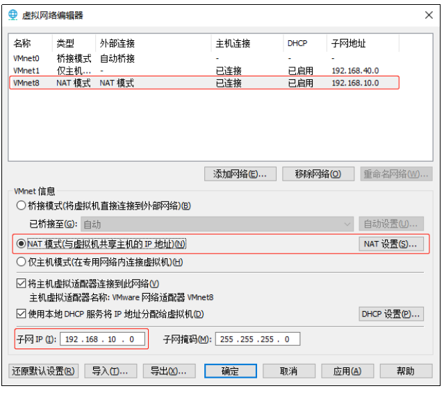

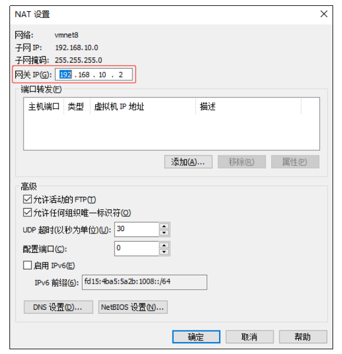

（3）查看Windows系统适配器VMware Network Adapter VMnet8的IP地址

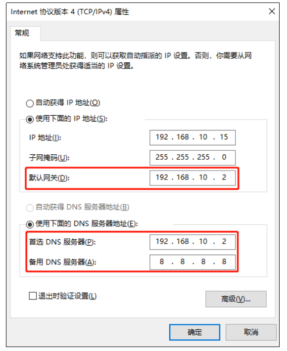

（4）保证Linux系统ifcfg-ens33文件中IP地址、虚拟网络编辑器地址和Windows系统VM8网络IP地址相同。

3）修改克隆机主机名，以下以hadoop102举例说明

​	（1）修改主机名称

```shell
[root@hadoop100 ~]# vim /etc/hostname  hadoop102
```

（2）配置Linux克隆机主机名称映射hosts文件，打开/etc/hosts

```shell
[root@hadoop100 ~]# vim /etc/hosts
```

添加如下内容

```shell
192.168.10.100 hadoop100
192.168.10.101 hadoop101
192.168.10.102 hadoop102
192.168.10.103 hadoop103
192.168.10.104 hadoop104
192.168.10.105 hadoop105
192.168.10.106 hadoop106
192.168.10.107 hadoop107
192.168.10.108 hadoop108
```

4）重启克隆机hadoop102 

```shell
[root@hadoop100 ~]# reboot
```

5）修改windows的主机映射文件（hosts文件）

（1）如果操作系统是window7，可以直接修改 

​		（a）进入C:WindowsSystem32driversetc路径

​		（b）打开hosts文件并添加如下内容，然后保存

```shell
192.168.10.100 hadoop100
192.168.10.101 hadoop101
192.168.10.102 hadoop102
192.168.10.103 hadoop103
192.168.10.104 hadoop104
192.168.10.105 hadoop105
192.168.10.106 hadoop106
192.168.10.107 hadoop107
192.168.10.108 hadoop108
```

（2）如果操作系统是window10，先拷贝出来，修改保存以后，再覆盖即可

​		（a）进入C:WindowsSystem32driversetc路径

​		（b）拷贝hosts文件到桌面

​		（c）打开桌面hosts文件并添加如下内容

```shell
192.168.10.100 hadoop100
192.168.10.101 hadoop101
192.168.10.102 hadoop102
192.168.10.103 hadoop103
192.168.10.104 hadoop104
192.168.10.105 hadoop105
192.168.10.106 hadoop106
192.168.10.107 hadoop107
192.168.10.108 hadoop108
```

（d）将桌面hosts文件覆盖C:WindowsSystem32driversetc路径hosts文件

## 2.3 在hadoop102安装JDK

**1）卸载现有JDK**

注意：安装JDK前，一定确保提前删除了虚拟机自带的JDK。详细步骤见问文档3.1节中卸载JDK步骤。

**2）用XShell传输工具将JDK导入到opt目录下面的software文件夹下面**

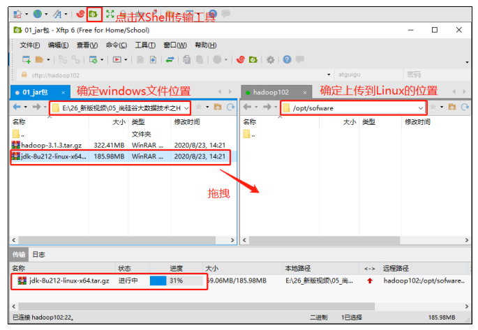


**3）在Linux系统下的opt目录中查看软件包是否导入成功**

```shell
[atguigu@hadoop102 ~]$ ls /opt/software/
```

看到如下结果：

```shell
jdk-8u212-linux-x64.tar.gz
```

**4）解压JDK到/opt/module目录下**

```shell
[atguigu@hadoop102 software]$ tar -zxvf jdk-8u212-linux-x64.tar.gz -C /opt/module/
```

**5）配置JDK环境变量**

​	（1）新建/etc/profile.d/my_env.sh文件

```shell
[atguigu@hadoop102 ~]$ sudo vim /etc/profile.d/my_env.sh
```

添加如下内容

```shell
#JAVA_HOME

export JAVA_HOME=/opt/module/jdk1.8.0_212

export PATH=$PATH:$JAVA_HOME/bin
```

​	（2）保存后退出 :wq

​	（3）source一下/etc/profile文件，让新的环境变量PATH生效

```shell
[atguigu@hadoop102 ~]$ source /etc/profile
```

**6）测试JDK是否安装成功**

```shell
[atguigu@hadoop102 ~]$ java -version
```

如果能看到以下结果，则代表Java安装成功。

```shell
java version "1.8.0_212"
```

注意：重启（如果java -version可以用就不用重启）

```shell
[atguigu@hadoop102 ~]$ sudo reboot
```

## 2.4 在hadoop102安装Hadoop

Hadoop下载地址：[https://archive.apache.org/dist/hadoop/common/hadoop-3.1.3/](https://archive.apache.org/dist/hadoop/common/hadoop-2.7.2/)

**1）用XShell文件传输工具将hadoop-3.1.3.tar.gz导入到opt目录下面的software文件夹下面**

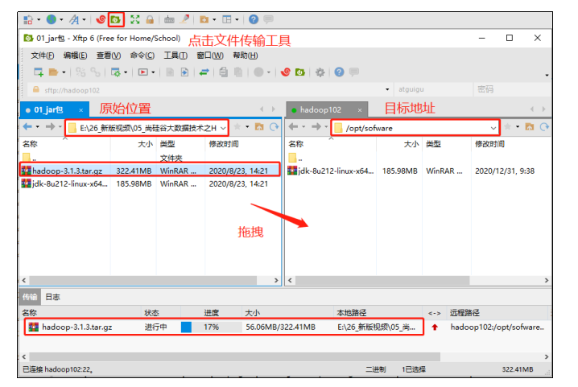

**2）进入到Hadoop安装包路径下**

```shell
[atguigu@hadoop102 ~]$ cd /opt/software/
```

**3）解压安装文件到/opt/module下面**

```shell
[atguigu@hadoop102 software]$ tar -zxvf hadoop-3.1.3.tar.gz -C /opt/module/
```

**4）查看是否解压成功**

```shell
[atguigu@hadoop102 software]$ ls /opt/module/

hadoop-3.1.3 
```

**5）将Hadoop添加到环境变量**

​	（1）获取Hadoop安装路径

```shell
[atguigu@hadoop102 hadoop-3.1.3]$ pwd
/opt/module/hadoop-3.1.3
```

​	（2）打开/etc/profile.d/my_env.sh文件

```
[atguigu@hadoop102 hadoop-3.1.3]$ sudo vim /etc/profile.d/my_env.sh
```

在my_env.sh文件末尾添加如下内容：（shift+g）

```shell
#HADOOP_HOME
export HADOOP_HOME=/opt/module/hadoop-3.1.3
export PATH=$PATH:$HADOOP_HOME/bin
export PATH=$PATH:$HADOOP_HOME/sbin
```

保存并退出： :wq

​	（3）让修改后的文件生效

```shell
[atguigu@hadoop102 hadoop-3.1.3]$ source /etc/profile
```

**6）测试是否安装成功**

```shell
[atguigu@hadoop102 hadoop-3.1.3]$ hadoop version
Hadoop 3.1.3
```

**7）重启（如果Hadoop命令不能用再重启虚拟机）**

```shell
[atguigu@hadoop102 hadoop-3.1.3]$ sudo reboot
```

## 2.5 Hadoop目录结构

**1）查看Hadoop目录结构**

```shell
[atguigu@hadoop102 hadoop-3.1.3]$ ll
总用量 52
drwxr-xr-x. 2 atguigu atguigu  4096 5月  22 2017 bin
drwxr-xr-x. 3 atguigu atguigu  4096 5月  22 2017 etc
drwxr-xr-x. 2 atguigu atguigu  4096 5月  22 2017 include
drwxr-xr-x. 3 atguigu atguigu  4096 5月  22 2017 lib
drwxr-xr-x. 2 atguigu atguigu  4096 5月  22 2017 libexec
-rw-r--r--. 1 atguigu atguigu 15429 5月  22 2017 LICENSE.txt
-rw-r--r--. 1 atguigu atguigu  101 5月  22 2017 NOTICE.txt
-rw-r--r--. 1 atguigu atguigu  1366 5月  22 2017 README.txt
drwxr-xr-x. 2 atguigu atguigu  4096 5月  22 2017 sbin
drwxr-xr-x. 4 atguigu atguigu  4096 5月  22 2017 share
```

**2）重要目录**

（1）bin目录：存放对Hadoop相关服务（hdfs，yarn，mapred）进行操作的脚本

（2）etc目录：Hadoop的配置文件目录，存放Hadoop的配置文件

（3）lib目录：存放Hadoop的本地库（对数据进行压缩解压缩功能）

（4）sbin目录：存放启动或停止Hadoop相关服务的脚本

（5）share目录：存放Hadoop的依赖jar包、文档、和官方案例

# 第3章 Hadoop运行模式

1）Hadoop官方网站：http://hadoop.apache.org/

2）Hadoop运行模式包括：本地模式、伪分布式模式以及完全分布式模式。

- 本地模式：单机运行，只是用来演示一下官方案例。生产环境不用。

- 伪分布式模式：也是单机运行，但是具备Hadoop集群的所有功能，一台服务器模拟一个分布式的环境。个别缺钱的公司用来测试，生产环境不用。

- 完全分布式模式：多台服务器组成分布式环境。生产环境使用。

## 3.1 本地运行模式（官方WordCount）

**1）创建在hadoop-3.1.3文件下面创建一个wcinput文件夹**

```shell
[atguigu@hadoop102 hadoop-3.1.3]$ mkdir wcinput
```

**2）在wcinput文件下创建一个word.txt文件**

```shell
[atguigu@hadoop102 hadoop-3.1.3]$ cd wcinput
```

**3）编辑word.txt文件**

```shell
[atguigu@hadoop102 wcinput]$ vim word.txt
```

在文件中输入如下内容

```shell
hadoop yarn
hadoop mapreduce
atguigu
atguigu
```

保存退出：:wq

**4）回到Hadoop目录/opt/module/hadoop-3.1.3**

**5）执行程序**

```shell
[atguigu@hadoop102 hadoop-3.1.3]$ hadoop jar share/hadoop/mapreduce/hadoop-mapreduce-examples-3.1.3.jar wordcount wcinput wcoutput
```

**6）查看结果**

```shell
[atguigu@hadoop102 hadoop-3.1.3]$ cat wcoutput/part-r-00000
```

看到如下结果：

```shell
atguigu 2
hadoop  2
mapreduce    1
yarn   1
```

## 3.2 完全分布式运行模式（开发重点）

分析：

​	1）准备3台客户机（关闭防火墙、静态IP、主机名称）

​	2）安装JDK

​	3）配置环境变量

​	4）安装Hadoop

​	5）配置环境变量

6）配置集群

7）单点启动

​	8）配置ssh

​	9）群起并测试集群

### 3.2.1 虚拟机准备

详见2.1、2.2两节。

### 3.2.2 编写集群分发脚本xsync

**1）scp（secure copy）安全拷贝**

（1）scp定义

scp可以实现服务器与服务器之间的数据拷贝。（from server1 to server2）

（2）基本语法

```shell
scp  -r   $pdir/$fname    $user@$host:$pdir/$fname
```

命令  递归   要拷贝的文件路径/名称  目的地用户@主机:目的地路径/名称

（3）案例实操

前提：在hadoop102、hadoop103、hadoop104都已经创建好的/opt/module、      /opt/software两个目录，并且已经把这两个目录修改为atguigu:atguigu

```shell
[atguigu@hadoop102 ~]$ sudo chown atguigu:atguigu -R /opt/module
```

​		（a）在hadoop102上，将hadoop102中/opt/module/jdk1.8.0_212目录拷贝到hadoop103上。

```shell
[atguigu@hadoop102 ~]$ scp -r /opt/module/jdk1.8.0_212 atguigu@hadoop103:/opt/module
```

​		（b）在hadoop103上，将hadoop102中/opt/module/hadoop-3.1.3目录拷贝到hadoop103上。

```shell
[atguigu@hadoop103 ~]$ scp -r atguigu@hadoop102:/opt/module/hadoop-3.1.3 /opt/module/
```

​		（c）在hadoop103上操作，将hadoop102中/opt/module目录下所有目录拷贝到hadoop104上。

```shell
[atguigu@hadoop103 opt]$ scp -r atguigu@hadoop102:/opt/module/ atguigu@hadoop104:/opt/module
```

**2）rsync远程同步工具**

rsync主要用于备份和镜像。具有速度快、避免复制相同内容和支持符号链接的优点。

rsync和scp区别：用rsync做文件的复制要比scp的速度快，rsync只对差异文件做更新。scp是把所有文件都复制过去。

​	（1）基本语法

```shell
rsync   -av   $pdir/$fname   $user@$host:$pdir/$fname
```

命令  选项参数  要拷贝的文件路径/名称  目的地用户@主机:目的地路径/名称

​	 选项参数说明

| 选项 | 功能         |
| ---- | ------------ |
| -a   | 归档拷贝     |
| -v   | 显示复制过程 |

（2）案例实操

​		（a）删除hadoop103中/opt/module/hadoop-3.1.3/wcinput

```shell
[atguigu@hadoop103 hadoop-3.1.3]$ rm -rf wcinput/
```

​		（b）同步hadoop102中的/opt/module/hadoop-3.1.3到hadoop103

```shell
[atguigu@hadoop102 module]$ rsync -av hadoop-3.1.3/ atguigu@hadoop103:/opt/module/hadoop-3.1.3/
```

**3）xsync集群分发脚本**

（1）需求：循环复制文件到所有节点的相同目录下

（2）需求分析：

​		（a）rsync命令原始拷贝：

```shell
rsync  -av   /opt/module  	 atguigu@hadoop103:/opt/
```

​		（b）期望脚本：

xsync要同步的文件名称

​		（c）期望脚本在任何路径都能使用（脚本放在声明了全局环境变量的路径）

```shell
[atguigu@hadoop102 ~]$ echo $PATH

/usr/local/bin:/usr/bin:/usr/local/sbin:/usr/sbin:/home/atguigu/.local/bin:/home/atguigu/bin:/opt/module/jdk1.8.0_212/bin
```

（3）脚本实现

​		（a）在/home/atguigu/bin目录下创建xsync文件

```shell
[atguigu@hadoop102 opt]$ cd /home/atguigu
[atguigu@hadoop102 ~]$ mkdir bin
[atguigu@hadoop102 ~]$ cd bin
[atguigu@hadoop102 bin]$ vim xsync
```

在该文件中编写如下代码

```shell
#!/bin/bash

#1. 判断参数个数
if [ $# -lt 1 ]
then
    echo Not Enough Arguement!
    exit;
fi

#2. 遍历集群所有机器
for host in hadoop102 hadoop103 hadoop104
do
    echo ====================  $host  ====================
    #3. 遍历所有目录，挨个发送

    for file in $@
    do
        #4. 判断文件是否存在
        if [ -e $file ]
            then
                #5. 获取父目录
                pdir=$(cd -P $(dirname $file); pwd)

                #6. 获取当前文件的名称
                fname=$(basename $file)
                ssh $host "mkdir -p $pdir"
                rsync -av $pdir/$fname $host:$pdir
            else
                echo $file does not exists!
        fi
    done
done
```

​		（b）修改脚本 xsync 具有执行权限

```shell
[atguigu@hadoop102 bin]$ chmod +x xsync
```

​		（c）测试脚本

```shell
[atguigu@hadoop102 ~]$ xsync /home/atguigu/bin
```

​		（d）将脚本复制到/bin中，以便全局调用

```shell
[atguigu@hadoop102 bin]$ sudo cp xsync /bin/
```

​		（e）同步环境变量配置（root所有者）

```shell
[atguigu@hadoop102 ~]$ sudo ./bin/xsync /etc/profile.d/my_env.sh
```

注意：如果用了sudo，那么xsync一定要给它的路径补全。

让环境变量生效

```shell
[atguigu@hadoop103 bin]$ source /etc/profile
[atguigu@hadoop104 opt]$ source /etc/profile
```


### 3.2.3 SSH无密登录配置

**1）配置ssh**

（1）基本语法

ssh另一台电脑的IP地址

（2）ssh连接时出现Host key verification failed的解决方法

```shell
[atguigu@hadoop102 ~]$ ssh hadoop103
```

如果出现如下内容

Are you sure you want to continue connecting (yes/no)? 

输入yes，并回车

（3）退回到hadoop102

```shell
[atguigu@hadoop103 ~]$ exit
```

**2）无密钥配置**

（1）免密登录原理 

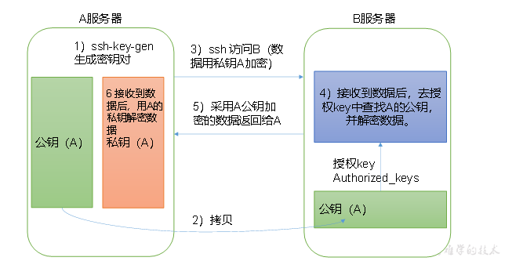

（2）生成公钥和私钥

```shell
[atguigu@hadoop102 .ssh]$ pwd
/home/atguigu/.ssh
[atguigu@hadoop102 .ssh]$ ssh-keygen -t rsa
```

然后敲（三个回车），就会生成两个文件id_rsa（私钥）、id_rsa.pub（公钥）

（3）将公钥拷贝到要免密登录的目标机器上

```shell
[atguigu@hadoop102 .ssh]$ ssh-copy-id hadoop102
[atguigu@hadoop102 .ssh]$ ssh-copy-id hadoop103
[atguigu@hadoop102 .ssh]$ ssh-copy-id hadoop104
```

注意：

还需要在hadoop103上采用atguigu账号配置一下无密登录到hadoop102、hadoop103、hadoop104服务器上。

还需要在hadoop104上采用atguigu账号配置一下无密登录到hadoop102、hadoop103、hadoop104服务器上。

还需要在hadoop102上采用root账号，配置一下无密登录到hadoop102、hadoop103、hadoop104；

**3）.ssh文件夹下（~/.ssh）的文件功能解释**

| known_hosts     | 记录ssh访问过计算机的公钥（public key） |
| --------------- | --------------------------------------- |
| id_rsa          | 生成的私钥                              |
| id_rsa.pub      | 生成的公钥                              |
| authorized_keys | 存放授权过的无密登录服务器公钥          |

### 3.2.4 集群配置

**1）集群部署规划**

​	注意：

NameNode和SecondaryNameNode不要安装在同一台服务器

ResourceManager也很消耗内存，不要和NameNode、SecondaryNameNode配置在同一台机器上。

|      | hadoop102        | hadoop103                  | hadoop104                 |
| ---- | ---------------- | -------------------------- | ------------------------- |
| HDFS | NameNodeDataNode | DataNode                   | SecondaryNameNodeDataNode |
| YARN | NodeManager      | ResourceManagerNodeManager | NodeManager               |

**2）配置文件说明**

Hadoop配置文件分两类：默认配置文件和自定义配置文件，只有用户想修改某一默认配置值时，才需要修改自定义配置文件，更改相应属性值。

（1）默认配置文件：

| 要获取的默认文件     | 文件存放在Hadoop的jar包中的位置                           |
| -------------------- | --------------------------------------------------------- |
| [core-default.xml]   | hadoop-common-3.1.3.jar/core-default.xml                  |
| [hdfs-default.xml]   | hadoop-hdfs-3.1.3.jar/hdfs-default.xml                    |
| [yarn-default.xml]   | hadoop-yarn-common-3.1.3.jar/yarn-default.xml             |
| [mapred-default.xml] | hadoop-mapreduce-client-core-3.1.3.jar/mapred-default.xml |

（2）自定义配置文件：

​	core-site.xml、hdfs-site.xml、yarn-site.xml、mapred-site.xml四个配置文件存放在$HADOOP_HOME/etc/hadoop这个路径上，用户可以根据项目需求重新进行修改配置。

**3）配置集群**

（1）核心配置文件

配置core-site.xml

```shell
[atguigu@hadoop102 ~]$ cd $HADOOP_HOME/etc/hadoop
[atguigu@hadoop102 hadoop]$ vim core-site.xml
```

文件内容如下：

```xml
<?xml version="1.0" encoding="UTF-8"?>
<?xml-stylesheet type="text/xsl" href="configuration.xsl"?>

<configuration>
    <!-- 指定NameNode的地址 -->
    <property>
        <name>fs.defaultFS</name>
        <value>hdfs://hadoop102:8020</value>
    </property>

    <!-- 指定hadoop数据的存储目录 -->
    <property>
        <name>hadoop.tmp.dir</name>
        <value>/opt/module/hadoop-3.1.3/data</value>
    </property>

    <!-- 配置HDFS网页登录使用的静态用户为atguigu -->
    <property>
        <name>hadoop.http.staticuser.user</name>
        <value>atguigu</value>
    </property>
</configuration>
```


（2）HDFS配置文件

配置hdfs-site.xml

```shell
[atguigu@hadoop102 hadoop]$ vim hdfs-site.xml
```

文件内容如下：

```xml
<?xml version="1.0" encoding="UTF-8"?>
<?xml-stylesheet type="text/xsl" href="configuration.xsl"?>

<configuration>
	<!-- nn web端访问地址-->
	<property>
        <name>dfs.namenode.http-address</name>
        <value>hadoop102:9870</value>
    </property>
	<!-- 2nn web端访问地址-->
    <property>
        <name>dfs.namenode.secondary.http-address</name>
        <value>hadoop104:9868</value>
    </property>
</configuration>
```

（3）YARN配置文件

配置yarn-site.xml

```shell
[atguigu@hadoop102 hadoop]$ vim yarn-site.xml
```

文件内容如下：

```xml
<?xml version="1.0" encoding="UTF-8"?>
<?xml-stylesheet type="text/xsl" href="configuration.xsl"?>

<configuration>
    <!-- 指定MR走shuffle -->
    <property>
        <name>yarn.nodemanager.aux-services</name>
        <value>mapreduce_shuffle</value>
    </property>

    <!-- 指定ResourceManager的地址-->
    <property>
        <name>yarn.resourcemanager.hostname</name>
        <value>hadoop103</value>
    </property>

    <!-- 环境变量的继承 -->
    <property>
        <name>yarn.nodemanager.env-whitelist</name>
<value>JAVA_HOME,HADOOP_COMMON_HOME,HADOOP_HDFS_HOME,HADOOP_CONF_DIR,CLASSPATH_PREPEND_DISTCACHE,HADOOP_YARN_HOME,HADOOP_MAPRED_HOME</value>
    </property>
</configuration>
```

（4）MapReduce配置文件

配置mapred-site.xml

```shell
[atguigu@hadoop102 hadoop]$ vim mapred-site.xml
```

文件内容如下：

```xml
<?xml version="1.0" encoding="UTF-8"?>
<?xml-stylesheet type="text/xsl" href="configuration.xsl"?>

<configuration>
	<!-- 指定MapReduce程序运行在Yarn上 -->
    <property>
        <name>mapreduce.framework.name</name>
        <value>yarn</value>
    </property>
</configuration>
```


**4）在集群上分发配置好的Hadoop配置文件**

```shell
[atguigu@hadoop102 hadoop]$ xsync /opt/module/hadoop-3.1.3/etc/hadoop/
```

**5）去103和104上查看文件分发情况**

```shell
[atguigu@hadoop103 ~]$ cat /opt/module/hadoop-3.1.3/etc/hadoop/core-site.xml
[atguigu@hadoop104 ~]$ cat /opt/module/hadoop-3.1.3/etc/hadoop/core-site.xml
```

### 3.2.5 群起集群

**1）配置workers**

```shell
[atguigu@hadoop102 hadoop]$ vim /opt/module/hadoop-3.1.3/etc/hadoop/workers
```

在该文件中增加如下内容：

```shell
hadoop102
hadoop103
hadoop104
```

注意：该文件中添加的内容结尾不允许有空格，文件中不允许有空行。

同步所有节点配置文件

```shell
[atguigu@hadoop102 hadoop]$ xsync /opt/module/hadoop-3.1.3/etc
```

**2）启动集群**

​	（1）如果集群是第一次启动，需要在hadoop102节点格式化NameNode（注意：格式化NameNode，会产生新的集群id，导致NameNode和DataNode的集群id不一致，集群找不到已往数据。如果集群在运行过程中报错，需要重新格式化NameNode的话，一定要先停止namenode和datanode进程，并且要删除所有机器的data和logs目录，然后再进行格式化。）

```shell
[atguigu@hadoop102 hadoop-3.1.3]$ hdfs namenode -format
```

（2）启动HDFS

```shell
[atguigu@hadoop102 hadoop-3.1.3]$ sbin/start-dfs.sh
```

（3）在配置了ResourceManager的节点（hadoop103）启动YARN

```shell
[atguigu@hadoop103 hadoop-3.1.3]$ sbin/start-yarn.sh
```

（4）Web端查看HDFS的NameNode

​		（a）浏览器中输入：http://hadoop102:9870

​		（b）查看HDFS上存储的数据信息

（5）Web端查看YARN的ResourceManager

​		（a）浏览器中输入：http://hadoop103:8088

​		（b）查看YARN上运行的Job信息

**3）集群基本测试**

（1）上传文件到集群

上传小文件

```shell
[atguigu@hadoop102 ~]$ hadoop fs -mkdir /input
[atguigu@hadoop102 ~]$ hadoop fs -put $HADOOP_HOME/wcinput/word.txt /input
```

上传大文件

```shell
[atguigu@hadoop102 ~]$ hadoop fs -put  /opt/software/jdk-8u212-linux-x64.tar.gz  /
```

（2）上传文件后查看文件存放在什么位置

查看HDFS文件存储路径

```shell
[atguigu@hadoop102 subdir0]$ pwd
/opt/module/hadoop-3.1.3/data/dfs/data/current/BP-1436128598-192.168.10.102-1610603650062/current/finalized/subdir0/subdir0
```

查看HDFS在磁盘存储文件内容

```shell
[atguigu@hadoop102 subdir0]$ cat blk_1073741825
hadoop yarn
hadoop mapreduce 
atguigu
atguigu
```

（3）拼接

```shell
-rw-rw-r--. 1 atguigu atguigu 134217728 5月 23 16:01 blk_1073741836
-rw-rw-r--. 1 atguigu atguigu  1048583 5月 23 16:01 blk_1073741836_1012.meta
-rw-rw-r--. 1 atguigu atguigu  63439959 5月 23 16:01 blk_1073741837
-rw-rw-r--. 1 atguigu atguigu   495635 5月 23 16:01 blk_1073741837_1013.meta
[atguigu@hadoop102 subdir0]$ cat blk_1073741836>>tmp.tar.gz
[atguigu@hadoop102 subdir0]$ cat blk_1073741837>>tmp.tar.gz
[atguigu@hadoop102 subdir0]$ tar -zxvf tmp.tar.gz
```

**（4）下载**

```shell
[atguigu@hadoop104 software]$ hadoop fs -get /jdk-8u212-linux-x64.tar.gz ./
```

**（5）执行wordcount程序**

```shell
[atguigu@hadoop102 hadoop-3.1.3]$ hadoop jar share/hadoop/mapreduce/hadoop-mapreduce-examples-3.1.3.jar wordcount /input /output
```

### 3.2.6 配置历史服务器

为了查看程序的历史运行情况，需要配置一下历史服务器。具体配置步骤如下：

**1）配置mapred-site.xml**

```shell
[atguigu@hadoop102 hadoop]$ vim mapred-site.xml
```

在该文件里面增加如下配置。

```xml
<!-- 历史服务器端地址 -->
<property>
    <name>mapreduce.jobhistory.address</name>
    <value>hadoop102:10020</value>
</property>

<!-- 历史服务器web端地址 -->
<property>
    <name>mapreduce.jobhistory.webapp.address</name>
    <value>hadoop102:19888</value>
</property>
```

**2）分发配置**

```shell
[atguigu@hadoop102 hadoop]$ xsync $HADOOP_HOME/etc/hadoop/mapred-site.xml
```

**3）在hadoop102启动历史服务器**

```shell
[atguigu@hadoop102 hadoop]$ mapred --daemon start historyserver
```

**4）查看历史服务器是否启动**

```shell
[atguigu@hadoop102 hadoop]$ jps
```

**5）查看JobHistory**

http://hadoop102:19888/jobhistory

### 3.2.7 配置日志的聚集

日志聚集概念：应用运行完成以后，将程序运行日志信息上传到HDFS系统上。

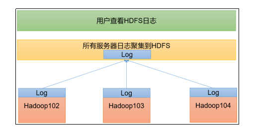

日志聚集功能好处：可以方便的查看到程序运行详情，方便开发调试。

注意：开启日志聚集功能，需要重新启动NodeManager 、ResourceManager和HistoryServer。

开启日志聚集功能具体步骤如下：

**1）配置yarn-site.xml**

```shell
[atguigu@hadoop102 hadoop]$ vim yarn-site.xml
```

在该文件里面增加如下配置。

```xml
<!-- 开启日志聚集功能 -->
<property>
    <name>yarn.log-aggregation-enable</name>
    <value>true</value>
</property>
<!-- 设置日志聚集服务器地址 -->
<property>  
    <name>yarn.log.server.url</name>  
    <value>http://hadoop102:19888/jobhistory/logs</value>
</property>
<!-- 设置日志保留时间为7天 -->
<property>
    <name>yarn.log-aggregation.retain-seconds</name>
    <value>604800</value>
</property>
```

**2）分发配置**

```shell
[atguigu@hadoop102 hadoop]$ xsync $HADOOP_HOME/etc/hadoop/yarn-site.xml
```

**3）关闭NodeManager 、ResourceManager和HistoryServer**

```shell
[atguigu@hadoop103 hadoop-3.1.3]$ sbin/stop-yarn.sh
[atguigu@hadoop103 hadoop-3.1.3]$ mapred --daemon stop historyserver
```

**4）启动NodeManager 、ResourceManage和HistoryServer**

```shell
[atguigu@hadoop103 ~]$ start-yarn.sh
[atguigu@hadoop102 ~]$ mapred --daemon start historyserver
```

**5）删除HDFS上已经存在的输出文件**

```shell
[atguigu@hadoop102 ~]$ hadoop fs -rm -r /output
```

**6）执行WordCount程序**

```shell
[atguigu@hadoop102 hadoop-3.1.3]$ hadoop jar share/hadoop/mapreduce/hadoop-mapreduce-examples-3.1.3.jar wordcount /input /output
```

**7）查看日志**

​	（1）历史服务器地址

http://hadoop102:19888/jobhistory

​	（2）历史任务列表

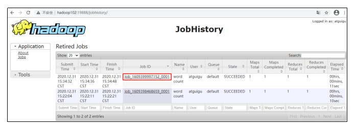 

​	（3）查看任务运行日志

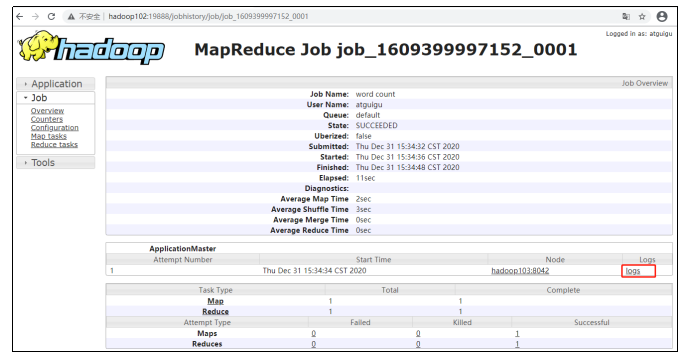 

​	（4）运行日志详情

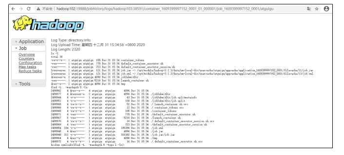 

### 3.2.8 集群启动/停止方式总结

**1）各个模块分开启动/停止（配置ssh是前提）常用**

​	（1）整体启动/停止HDFS

```shell
start-dfs.sh/stop-dfs.sh
```

​	（2）整体启动/停止YARN

```shell
start-yarn.sh/stop-yarn.sh
```

**2）各个服务组件逐一启动/停止**

​	（1）分别启动/停止HDFS组件

```shell
hdfs --daemon start/stop namenode/datanode/secondarynamenode
```

​	（2）启动/停止YARN

```shell
yarn --daemon start/stop  resourcemanager/nodemanager
```

### 3.2.9 编写Hadoop集群常用脚本

**1）Hadoop集群启停脚本（包含HDFS，Yarn，Historyserver）：myhadoop.sh**

```shell
[atguigu@hadoop102 ~]$ cd /home/atguigu/bin
[atguigu@hadoop102 bin]$ vim myhadoop.sh
```

输入如下内容

```shell
#!/bin/bash

if [ $# -lt 1 ]
then
    echo "No Args Input..."
    exit ;
fi

case $1 in
"start")
        echo " =================== 启动 hadoop集群 ==================="

        echo " --------------- 启动 hdfs ---------------"
        ssh hadoop102 "/opt/module/hadoop-3.1.3/sbin/start-dfs.sh"
        echo " --------------- 启动 yarn ---------------"
        ssh hadoop103 "/opt/module/hadoop-3.1.3/sbin/start-yarn.sh"
        echo " --------------- 启动 historyserver ---------------"
        ssh hadoop102 "/opt/module/hadoop-3.1.3/bin/mapred --daemon start historyserver"
;;
"stop")
        echo " =================== 关闭 hadoop集群 ==================="

        echo " --------------- 关闭 historyserver ---------------"
        ssh hadoop102 "/opt/module/hadoop-3.1.3/bin/mapred --daemon stop historyserver"
        echo " --------------- 关闭 yarn ---------------"
        ssh hadoop103 "/opt/module/hadoop-3.1.3/sbin/stop-yarn.sh"
        echo " --------------- 关闭 hdfs ---------------"
        ssh hadoop102 "/opt/module/hadoop-3.1.3/sbin/stop-dfs.sh"
;;
*)
    echo "Input Args Error..."
;;
esac
```

保存后退出，然后赋予脚本执行权限

```shell
[atguigu@hadoop102 bin]$ chmod +x myhadoop.sh
```

**2）查看三台服务器Java进程脚本：jpsall**

```shell
[atguigu@hadoop102 ~]$ cd /home/atguigu/bin
[atguigu@hadoop102 bin]$ vim jpsall
```

输入如下内容

```shell
#!/bin/bash

for host in hadoop102 hadoop103 hadoop104
do
        echo =============== $host ===============
        ssh $host jps 
done
```

保存后退出，然后赋予脚本执行权限

```shell
[atguigu@hadoop102 bin]$ chmod +x jpsall
```

**3）分发/home/atguigu/bin目录，保证自定义脚本在三台机器上都可以使用**

```shell
[atguigu@hadoop102 ~]$ xsync /home/atguigu/bin/
```

### 3.2.10 常用端口号说明

| 端口名称                  | Hadoop2.x   | Hadoop3.x        |
| ------------------------- | ----------- | ---------------- |
| NameNode内部通信端口      | 8020 / 9000 | 8020 / 9000/9820 |
| NameNode HTTP UI          | 50070       | 9870             |
| MapReduce查看执行任务端口 | 8088        | 8088             |
| 历史服务器通信端口        | 19888       | 19888            |

### 3.2.11 集群时间同步

如果服务器在公网环境（能连接外网），可以不采用集群时间同步，因为服务器会定期和公网时间进行校准；

如果服务器在内网环境，必须要配置集群时间同步，否则时间久了，会产生时间偏差，导致集群执行任务时间不同步。

**1）需求**

找一个机器，作为时间服务器，所有的机器与这台集群时间进行定时的同步，生产环境根据任务对时间的准确程度要求周期同步。测试环境为了尽快看到效果，采用1分钟同步一次。

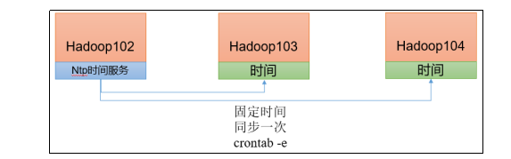

**2）时间服务器配置（必须root用户）**

（1）查看所有节点ntpd服务状态和开机自启动状态

```shell
[atguigu@hadoop102 ~]$ sudo systemctl status ntpd
[atguigu@hadoop102 ~]$ sudo systemctl start ntpd
[atguigu@hadoop102 ~]$ sudo systemctl is-enabled ntpd
```

（2）修改hadoop102的ntp.conf配置文件

```shell
[atguigu@hadoop102 ~]$ sudo vim /etc/ntp.conf
```

修改内容如下

​		（a）修改1（授权192.168.10.0-192.168.10.255网段上的所有机器可以从这台机器上查询和同步时间）

#restrict 192.168.10.0 mask 255.255.255.0 nomodify notrap

为restrict 192.168.10.0 mask 255.255.255.0 nomodify notrap

​		（b）修改2（集群在局域网中，不使用其他互联网上的时间）

```shell
server 0.centos.pool.ntp.org iburst
server 1.centos.pool.ntp.org iburst
server 2.centos.pool.ntp.org iburst
server 3.centos.pool.ntp.org iburst
```

为

```shell
#server 0.centos.pool.ntp.org iburst
#server 1.centos.pool.ntp.org iburst
#server 2.centos.pool.ntp.org iburst
#server 3.centos.pool.ntp.org iburst
```

​		（c）添加3（当该节点丢失网络连接，依然可以采用本地时间作为时间服务器为集群中的其他节点提供时间同步）

```shell
server 127.127.1.0
fudge 127.127.1.0 stratum 10
```

​		（d）修改hadoop102的/etc/sysconfig/ntpd 文件

```shell
[atguigu@hadoop102 ~]$ sudo vim /etc/sysconfig/ntpd
```

增加内容如下（让硬件时间与系统时间一起同步）

```shell
SYNC_HWCLOCK=yes
```

​		（e）重新启动ntpd服务

```shell
[atguigu@hadoop102 ~]$ sudo systemctl start ntpd
```

​		（f）设置ntpd服务开机启动

```shell
[atguigu@hadoop102 ~]$ sudo systemctl enable ntpd
```

**3）其他机器配置（必须root用户）**

（1）关闭所有节点上ntp服务和自启动

```shell
[atguigu@hadoop103 ~]$ sudo systemctl stop ntpd
[atguigu@hadoop103 ~]$ sudo systemctl disable ntpd
[atguigu@hadoop104 ~]$ sudo systemctl stop ntpd
[atguigu@hadoop104 ~]$ sudo systemctl disable ntpd
```

（2）在其他机器配置1分钟与时间服务器同步一次

```shell
[atguigu@hadoop103 ~]$ sudo crontab -e
```

编写定时任务如下：

```shell
*/1 * * * * /usr/sbin/ntpdate hadoop102
```

（3）修改任意机器时间

```shell
[atguigu@hadoop103 ~]$ sudo date -s "2021-9-11 11:11:11"
```

（4）1分钟后查看机器是否与时间服务器同步

```shell
[atguigu@hadoop103 ~]$ sudo date
```

# 第4章 常见错误及解决方案

**1）防火墙没关闭、或者没有启动YARN**

INFO client.RMProxy: Connecting to ResourceManager at hadoop108/192.168.10.108:8032

**2）主机名称配置错误**

**3）IP地址配置错误**

**4）ssh没有配置好**

**5）root用户和atguigu两个用户启动集群不统一**

**6）配置文件修改不细心**

**7）不识别主机名称**

```java
java.net.UnknownHostException: hadoop102: hadoop102
        at java.net.InetAddress.getLocalHost(InetAddress.java:1475)
        at org.apache.hadoop.mapreduce.JobSubmitter.submitJobInternal(JobSubmitter.java:146)
        at org.apache.hadoop.mapreduce.Job$10.run(Job.java:1290)
        at org.apache.hadoop.mapreduce.Job$10.run(Job.java:1287)
        at java.security.AccessController.doPrivileged(Native Method)
at javax.security.auth.Subject.doAs(Subject.java:415)
```

解决办法：

​    （1）在/etc/hosts文件中添加192.168.10.102 hadoop102

​	（2）主机名称不要起hadoop  hadoop000等特殊名称

**8）DataNode和NameNode进程同时只能工作一个。**

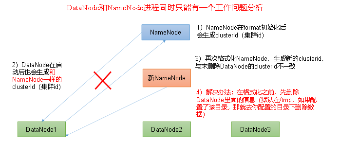

**9）执行命令不生效，粘贴Word中命令时，遇到-和长–没区分开。导致命令失效**

解决办法：尽量不要粘贴Word中代码。

**10）jps发现进程已经没有，但是重新启动集群，提示进程已经开启。**

原因是在Linux的根目录下/tmp目录中存在启动的进程临时文件，将集群相关进程删除掉，再重新启动集群。

**11）jps不生效**

原因：全局变量hadoop java没有生效。解决办法：需要source /etc/profile文件。

**12）8088端口连接不上**

```shell
[atguigu@hadoop102 桌面]$ cat /etc/hosts
```

注释掉如下代码

```shell
#127.0.0.1  localhost localhost.localdomain localhost4 localhost4.localdomain4
#::1     hadoop102
```

# 面试重点

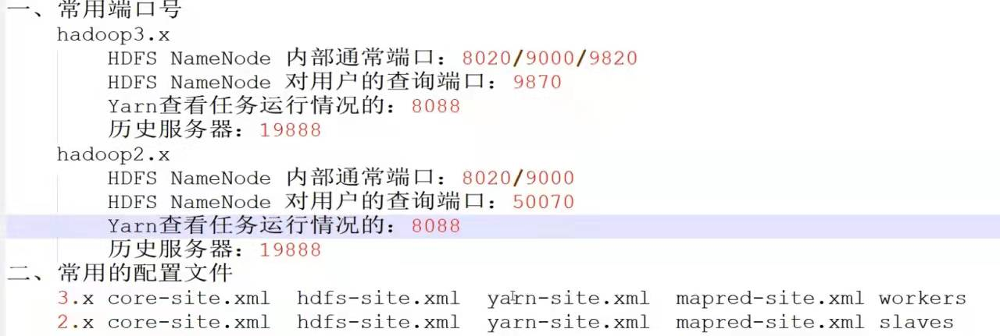
