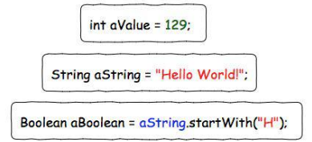
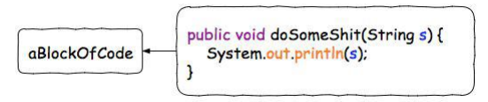
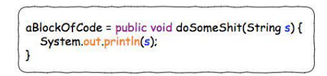
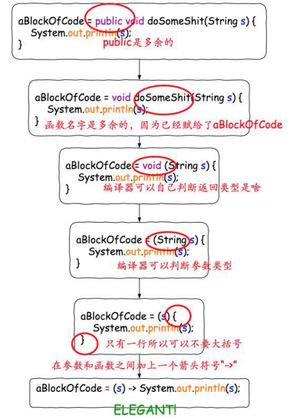
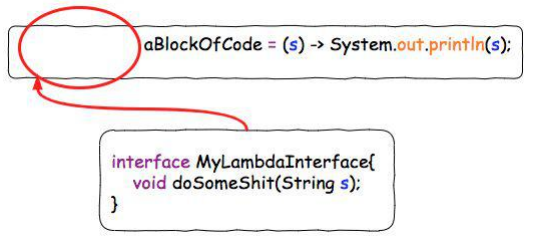
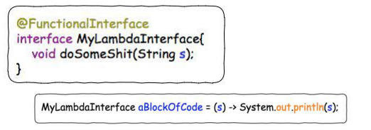
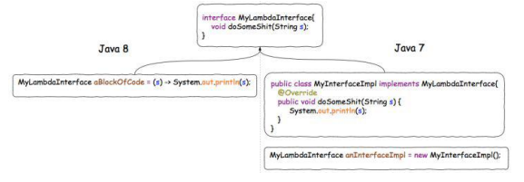
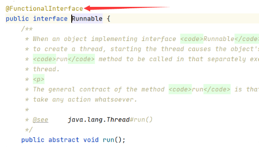
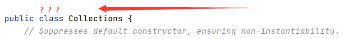

# 一、概述

Lambda表达式 --> 函数式编程（函数编程思想）

**面向对象编程思想：**

强调的是【对象】，必须通过对象的形式来做一些事情，一般情况下会比较复杂。

**函数编程思想：**

函数需要得有输入量、输出量，使用输入量计算得到输出量，【拿什么东西做什么事】

就是为了尽量忽略对象的复杂用法---强调做什么，而不是以什么实行做，

同样执行线程任务，使用函数编程思想，可以直接通过传递一段代码给线程对象执行，不需要创建任务对象。

**总之就一句话，函数编程思想可以通过一段代码完成面向对象想要做的代码量**

# 二、Lambda表达式介绍

Lambda 表达式是 JDK8 的一个新特性，可以取代大部分的匿名内部类，写出更优雅的Java 代码，尤其在集合的遍历和其他集合操作中，可以极大地优化代码结构。

在 Java 语言中，可以为变量赋予一个值。



能否把一个代码块赋给一变量吗？



在 Java 8 之前，这个是做不到的。但是 Java 8 问世之后，利用 Lambda 特性，就可以做到了。



甚至我们可以让语法变得更简洁。



这样，我们就成功的非常优雅的把“一块代码”赋给了一个变量。而“这块代码”，或者说“这个被赋给一个变量的函数”，就是一个 Lambda 表达式。但是这里仍然有一个问题，就是变量 aBlockOfCode 的类型应该是什么？

在 Java 8 里面，所有的 Lambda 的类型都是一个接口，而 Lambda 表达式本身，也就是"那段代码"，需要是这个接口的实现。这是我认为理解 Lambda 的一个关键所在，简而言之就是，Lambda 表达式本身就是一个接口的实现。直接这样说可能还是有点让人困扰，我们继续看看例子。我们给上面的 aBlockOfCode 加上一个类型：



这种只有一个接口函数需要被实现的接口类型，我们叫它”函数式接口“。为了避免后来的人在这个接口中增加接口函数导致其有多个接口函数需要被实现，变成"非函数接口”，我们可以在这个上面加上一个声明@FunctionalInterface, 这样别人就无法在里面添加新的接口函数了。



Lambda最直观的作用就是使得代码变得异常简洁了



# 三、Lambda表达式的格式

**1.标准格式**

（参数列表） -> {代码}

**2.格式说明**

- 小括内的语法与传统方法参数列表一致，没有参数就留空，有多个参数就用逗号分隔

- 【->】 是新引入的语法格式，代表指向动作

- 大括号内的语法与传统方法体要求一致

**3.案例说明**

第一个线程案例

```java
Thread thread1 = new Thread(new Runnable() {
    @Override
    public void run () {
        System.out.println("线程需要执行的任务代码1");
    }
});
thread1.start();

// Lambda表达式
Thread t2 = new Thread(()->{
    System.out.println("线程需要执行的任务代码2");
});
t2.start();
```

第二个比较器案例

```java
List<Integer> list = new ArrayList<>();
Collections.addAll(list,11,22,33,44,55);
System.out.println("排序之前的集合：" + list);

// 比较器的正常书写格式
Collections.sort(list, new Comparator<Integer>() {
    @Override
    public int compare (Integer o1, Integer o2) {
        return o2-o1;
    }
});

// Lambda表达式
Collections.sort(list,(Integer o1, Integer o2)->{return o2-o1;});
System.out.println("排序之后的集合：" + list);
```

# 四、表达式格式解析

 Lambda表达式格式：（）->{}

1.小括号中书写的内容和接口中的抽象方法的参数列表一致

2.大括号中书写的内容和实现接口中的抽象方法体一致

3.箭头是固定的

# 五、Lambda表达式的使用条件

首先，都是接口；  其次，接口中有且只有一个接口，才可以使用lambda表达式

1.接口中只有一个抽象方法的接口，叫做函数式接口

2.如果是函数式接口，那么就可以用@FunctionalInterface注解标识



上面这个是Thread线程的底层，下面的是Collections的底层



**思考（扩展）：**

Collections接口中有且只有一个抽象方法compareTo（），为什么Java底层没有给它@FunctionalInterface注解标识？（底层代码较多，截图不便，放心，我替你们看过了）
因为：lambda表达式属于  锦上添花  的功能，每个类都有各自的功能或作用，而Comparable接口目前学习到的主要是为了给自定义类实现比较器方法的，@FunctionalInterface注解标识的作用主要是为了给编译器看，给编译器提供信息的，不管有没有这个注解，只要满足函数式的要求，那么它就是一个函数式接口

# 六、Lambda表达式的省略格式

**Lambda表达式的省略格式：**

1.小括号中的形参类型可以省略

2.如果小括号中只有一个参数的话，那么小括号可以省略

3.如果大括号中只有一条语句，那么大括号、分号、return可以一起省略

**代码案例：**

**1.第一个还是线程案例**

```java
new Thread(()-> System.out.println("省略")).start();
```

**2.第二个比较器的案例**

```java
public static void main (String[] args) {
    // 比较器案例
    ArrayList<Integer> list = new ArrayList<>();
    list.add(11);
    list.add(22);
    list.add(33);
    list.add(44);
    System.out.println("排序前：" + list);

    // 比较器常规写法
    Collections.sort(list, new Comparator<Integer>() {
        @Override
        public int compare (Integer o1, Integer o2) {
            return o2 - o1;
        }
    });

    // Lambda表达式
    Collections.sort(list,(o1,o2)->o2-o1);
    System.out.println("排序后：" + list);
}
```

# 七、表达式的表现形式

**1. 变量的形式**

变量的类型为函数式接口，就么可以复制一个Lambda表达式【不常用】

```java
// 变量的形式
Runnable r = ()->{
    System.out.println("任务代码");
};
// 函数式接口类型的变量
Thread t = new Thread(r);
```

**2. 参数的形式**

方法的形参类型为函数式接口，就可以传入一个Lambda表达式【常用】

```java
// 变量的形式-比较器
Comparator<Integer> comparable = (o1, o2)->{return o2 - o1;};
// 创建集合
ArrayList<Integer> list = new ArrayList<>();
// 存入数据
Collections.addAll(list,11,22,33,44,55);

// 将函数式接口类型  的 形参类型，传给Collections
Collections.sort(list,comparable);
```

**3. 返回值的形式**

方法的返回值类型为函数式接口，就可以返回一个Lambda表达式【常用】

```java
// 定义一个方法
public static Comparator<Integer> getComparator(){
    return (Integer o1,Integer o2)->{return  o2-o1;};
}

public static void main (String[] args) {
    // 返回值形式
    Collections.sort(list,getComparator());
}
```

# 八、函数引用

lambda表达式是为了简化接口的实现的。在lambda表达式中，不应该出现比较复杂的逻辑。如果在lambda表达式中出现了过于复杂的逻辑，会对程序的可读性造成非常大的影响。如果在lambda表达式中需要处理的逻辑比较复杂，⼀般情况会单独的写⼀个方法。在lambda表达式中直接引用这个方法即可。

**函数引用**：引用⼀个已经存在的方法，使其替代lambda表达式完成接口的实现

**1. 静态方法的引用**

**语法**：类::静态方法

**注意事项：**

- 在引用的方法后面，不要添加小括号。
- 引用的这个方法，参数（数量、类型）和返回值，必须要跟接口中定义的⼀致

```java
package test;

public class Test05 {
    public static void main(String[] args) {
        //实现多个参数，一个返回值的接口
        //对一个静态方法的引用，语法：类::静态方法
        Test1 test1 = Calculator::calculate;
        System.out.println(test1.test(4,5));
    }
}

class Calculator{
    public static int calculate(int a,int b ){
        // 稍微复杂的逻辑：计算a和b的差值的绝对值
        if (a > b) {
            return a - b;
        }
        return b - a;
    }
}

interface Test1{
    int test(int a,int b);
}
```

**2. 非静态方法的引用**

**语法**：对象::非静态方法

**注意事项**:

- 在引用的方法后⾯，不要添加小括号。
- 引用的这个方法， 参数（数量、类型） 和 返回值， 必须要跟接口中定义的⼀致。

```java
package test;

public class Test06 {
    public static void main(String[] args) {
        //对非静态方法的引用，需要使用对象来完成
        Test2 test2 = new Calculator()::calculate;
        System.out.println(test2.calculate(2, 3));
    }
    private static class Calculator{
        public int calculate(int a, int b) {
            return a > b ? a - b : b - a;
         }
    }
}
interface Test2{
    int calculate(int a,int b);
}
```

**3. 构造方法的引用**

**使用场景**

如果某⼀个函数式接口中定义的方法，仅仅是为了得到⼀个类的对象。此时我们就可以使用构造方法的引用，简化这个方法的实现。

**语法**：类名::new

**注意事项**：可以通过接口中的方法的参数， 区分引用不同的构造方法。

```java
package com.cq.test;

public class Test {
    private static class Dog{
        String name;
        int age;
        //无参构造
        public Dog(){
            System.out.println("一个Dog对象通过无参构造被实例化了");
        }
        //有参构造
        public Dog(String name,int age){
            System.out.println("一个Dog对象通过有参构造被实例化了");
            this.name = name;
            this.age = age;
        }
    }
    //定义一个函数式接口,用以获取无参的对象
    @FunctionalInterface
    private interface GetDog{
        //若此方法仅仅是为了获得一个Dog对象，而且通过无参构造去获取一个Dog对象作为返回值
        Dog test();
    }

    //定义一个函数式接口,用以获取有参的对象
    @FunctionalInterface
    private interface GetDogWithParameter{
        //若此方法仅仅是为了获得一个Dog对象，而且通过有参构造去获取一个Dog对象作为返回值
        Dog test(String name,int age);
    }

    // 测试
    public static void main(String[] args) {
        //lambda表达式实现接口
        GetDog lm = Dog::new; //引用到Dog类中的无参构造方法，获取到一个Dog对象
        Dog dog = lm.test();
        System.out.println("修狗的名字："+dog.name+" 修狗的年龄："+dog.age); //修狗的名字：null 修狗的年龄：0
        GetDogWithParameter lm2 = Dog::new;//引用到Dog类中的有参构造，来获取一个Dog对象
        Dog dog1 = lm2.test("萨摩耶",2);
        System.out.println("修狗的名字："+dog1.name+" 修狗的年龄："+dog1.age);//修狗的名字：萨摩耶 修狗的年龄：2
    }
}
```

# 九、Lambda表达式需要注意的问题

这⾥类似于局部内部类、匿名内部类，依然存在闭包的问题。

什么是闭包？
闭包的本质就是代码片断。所以闭包可以理解成一个代码片断的引用。在 Java 中匿名内部类也是闭包的一种实现方式。
在闭包中访问外部的变量时，外部变量必须是 final 类型，虚拟机会帮我们加上 final 修饰关键字。

```java
//Lambda表达式的使用_闭包问题
public class Test7 {
    public static void main(String[] args) {
        /*
         * 如果我们想要去实现一个接口，我们可以使用匿名内部类*/
        int num = 10;
        NoReturnNoParam noReturnNoParam = new NoReturnNoParam() {
            @Override
            public void method() {
                System.out.println(num);
            }
        };
        noReturnNoParam.method();
    }
}
```

简化版:

```java
//Lambda表达式的使用_闭包问题
public class Test7 {
    public static void main(String[] args) {
        /*
         * 如果我们想要去实现一个接口，我们可以使用匿名内部类*/
        int num = 10;
        NoReturnNoParam noReturnNoParam = ()->System.out.println(num);
        noReturnNoParam.method();
    }
}
```

**如果在lambda表达式中，使用到了局部变量，那么这个局部变量会被隐式的声明为 final。是⼀个常量，不能修改值。**
