# 大数据OLAP查询引擎分析总结

## 前言

### OLAP的历史与基本概念

OLAP全称为在线联机分析应用，是一种对于多维数据分析查询的解决方案。典型的OLAP应用场景包括销售、市场、管理等商务报表，预算决算，经济报表等等。

最早的OLAP查询工具是发布于1970年的Express，然而完整的OLAP概念是在1993年由关系数据库之父EdgarF.Codd 提出，伴随而来的是著名的“twelvelaws of online analytical processing”. 1998年微软发布MicrosoftAnalysis Services，并且在早一年通过OLE DB for OLAP API引入MDX查询语言，2001年微软和Hyperion发布的XML forAnalysis 成为了事实上的OLAP查询标准。如今，MDX已成为与SQL旗鼓相当的OLAP 查询语言，被各家OLAP厂商先后支持。

OLAPCube是一种典型的多维数据分析技术，Cube本身可以认为是不同维度数据组成的dataset，一个OLAP Cube 可以拥有多个维度（Dimension），以及多个事实（Factor Measure）。用户通过OLAP工具从多个角度来进行数据的多维分析。通常认为OLAP包括三种基本的分析操作：上卷（rollup）、下钻（drilldown）、切片切块（slicingand dicing），原始数据经过聚合以及整理后变成一个或多个维度的视图。

### ROLAP和MOLAP

传统OLAP根据数据存储方式的不同分为ROLAP（Relational OLAP）以及MOLAP（Multi-dimensionOLAP）

ROLAP 以关系模型的方式存储用作多维分析用的数据，优点在于存储体积小，查询方式灵活，然而缺点也显而易见，每次查询都需要对数据进行聚合计算，为了改善短板，ROLAP使用了列存、并行查询、查询优化、位图索引等技术

MOLAP 将分析用的数据物理上存储为多维数组的形式，形成CUBE结构。维度的属性值映射成多维数组的下标或者下标范围，事实以多维数组的值存储在数组单元中，优势是查询快速，缺点是数据量不容易控制，可能会出现维度爆炸的问题。 

### 大数据时代OLAP的挑战

近二十年内，ROLAP技术随着MPP并行数据库技术的发展，尤其是列存技术的支持下，实现了分析能力大幅度的跨越提升，同时伴随着内存成本的进一步降低，单节点内存扩展性增强，集群单节点的查询性能实现了飞跃，内存数据库的实用性跨上了一个新台阶，这些技术进步共同作用的结果是类似的技术基本覆盖了TB级别的数据分析需求。 Hadoop以及相关大数据技术的出现提供了一个几近无限扩展的数据平台，在相关技术的支持下，各个应用的数据已突破了传统OLAP所能支持的容量上界。每天千万、数亿条的数据，提供若干维度的分析模型，大数据OLAP最迫切所要解决的问题就是大量实时运算导致的响应时间迟滞。

### 按照技术分类

1、**基于hbase预聚合的**

​		比如Opentsdb,Kylin,Druid等,需要指定预聚合的指标，在数据接入的时候根据指定的指标进行聚合运算，适合相对固定的业务报表类需求，只需要统计少量维度即可满足业务报表需求

2、**基于Parquet列式存储的**

​		比如Presto, Drill，Impala等，基本是完全基于内存的并行计算，Parquet系能降低存储空间，提高IO效率，以离线处理为主，很难提高数据写的实时性，超大表的join支持可能不够好。spark sql也算类似，但它在内存不足时可以spill disk来支持超大数据查询和join

3、**基于lucene外部索引的**

​		比如ElasticSearch和Solr,能够满足的的查询场景远多于传统的数据库存储，但对于日志、行为类时序数据，所有的搜索请求都也必须搜索所有的分片，另外，对于聚合分析场景的支持也是软肋。

### 按照系统架构分类

1、**MPP架构的系统**（Presto/Impala/SparkSQL/Drill等）

​		有很好的数据量和灵活性支持，但是对响应时间是没有保证的。当数据量和计算复杂度增加后，响应时间会变慢，从秒级到分钟级，甚至小时级都有可能。

2、**搜索引擎架构的系统**（Elasticsearch等)

​		相对比MPP系统，在入库时将数据转换为倒排索引，采用Scatter-Gather计算模型，牺牲了灵活性换取很好的性能，在搜索类查询上能做到亚秒级响应。但是对于扫描聚合为主的查询，随着处理数据量的增加，响应时间也会退化到分钟级。

3、**预计算系统**（Druid/Kylin等）

​		在入库时对数据进行预聚合，进一步牺牲灵活性换取性能，以实现对超大数据集的秒级响应。没有一个引擎能同时在数据量，灵活性和性能这三个方面做到完美，用户需要基于自己的需求进行取舍和选型。

## Impala

​		Impala是Cloudera公司推出，提供对HDFS、Hbase数据的高性能、低延迟的交互式SQL查询功能。基于Hive使用内存计算，兼顾数据仓库、具有实时、批处理、多并发等优点，是CDH平台首选的PB级大数据实时查询分析引擎。

​		Impala是Cloudera在受到Google的Dremel启发下开发的实时交互SQL大数据查询工具，它可以看成是Google Dremel 架构和MPP (Massively Parallel Processing ) 结构的结合体。Impala没有再使用缓慢的Hive&Map-Reduce批处理，而是通过使用与商用并行关系数据库中 类似的分布式查询引擎（由Query Planner、Query Coordinator和Query Exec Engine三部分组成），可以直接从HDFS或HBase中用SELECT、JOIN和统计函数查询数据，从而大大降低了延迟。

​		Impala主要由Impalad，State Store和CLI组成。Impalad与DataNode运行在同一节点上，由Impalad进程表示，它接收客户端的查询请求（接收查询请求的 Impalad为Coordinator，Coordinator通过JNI调用java前端解释SQL查询语句，生成查询计划树，再通过调度器把执行计 划分发给具有相应数据的其它Impalad进行执行），读写数据，并行执行查询，并把结果通过网络流式的传送回给Coordinator，由 Coordinator返回给客户端。同时Impalad也与State Store保持连接，用于确定哪个Impalad是健康和可以接受新的工作。Impala State Store跟踪集群中的Impalad的健康状态及位置信息，由state-stored进程表示，它通过创建多个线程来处理Impalad的注册订阅和 与各Impalad保持心跳连接，各Impalad都会缓存一份State Store中的信息，当State Store离线后，因为Impalad有State Store的缓存仍然可以工作，但会因为有些Impalad失效了，而已缓存数据无法更新，导致把执行计划分配给了失效的Impalad，导致查询失败。 CLI提供给用户查询使用的命令行工具，同时Impala还提供了Hue，JDBC，ODBC，Thrift使用接口。

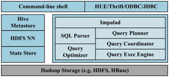

​																															Impala架构

###  **优点**

1）基于内存运算，不需要把中间结果写入磁盘，省掉了大量的I/O开销。

2）无需转换为Mapreduce，直接访问存储在HDFS，HBase中的数据进行作业调度，速度快。

3）使用了支持Data locality的I/O调度机制，尽可能地将数据和计算分配在同一台机器上进行，减少了网络开销。

4）支持各种文件格式，如TEXTFILE 、SEQUENCEFILE 、RCFile、Parquet。

5）可以访问hive的metastore，对hive数据直接做数据分析。

###  **缺点**

1）对内存的依赖大，且完全依赖于hive。

2）实践中，分区超过1万，性能严重下降。

3）只能读取文本文件，而不能直接读取自定义二进制文件。

4）每当新的记录/文件被添加到HDFS中的数据目录时，该表需要被刷新。


> ==目前Cloudera软件都需要有效的订阅，也就是下载所有Cloudera软件开始进行收费，因此很遗憾不能使用。==

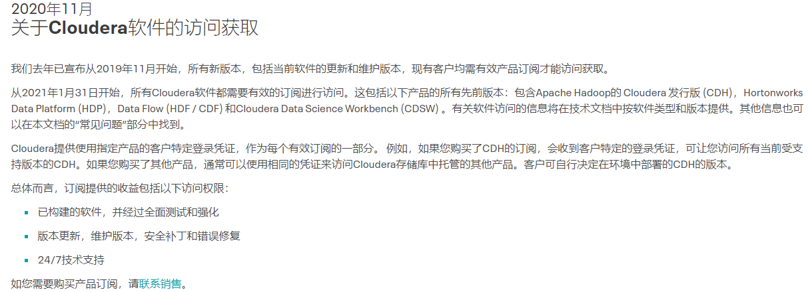

## Dremio

​		Dremio是新一代的数据湖引擎，它通过直接在云数据湖存储中进行实时的、交互式的查询来释放数据价值。也是一款DaaS（Data-as-a-Service）数据即服务平台，可对接多类数据源来进行BI分析；数据可视化依托于Tableau、Power BI和Qlik sense三类产品。

### 特点

- 快速的数据查询

  在Dremio中，查询数据是直达数据湖存储的，无论数据是存储在S3、ADLS、Hadoop、MySQL、Mongodb等载体上。Dremio使用了包括不限于以下技术来加速每次的查询

  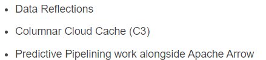

- 自助式服务语义层

  Dremio提供了一个应用安全和商业意义的抽象层，以支持用户能够探索数据，以及派生出新的虚拟数据集。

  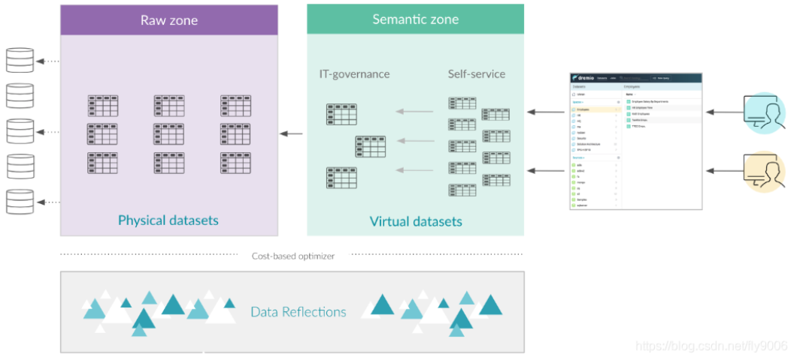

- 使用Predictive Pipelining和Columnar Cloud Cache（C3）技术加速数据读取

  Dremio的Predictive Pipelining技术使得来自数据源的数据只有在执行引擎真正需要到时才会去拉取，这个做法能显著降低引擎等待数据的时间成本。同样地，C3技术则是会自动地在数据存取时将数据缓存到本地的NVMe存储载体，使得查询访问数据湖中的数据能有NVMe存取速度级别的表现。

- 为云而建造的现代化执行引擎

  Dremio的执行引擎是建立在Apache Arrow及其生态技术上的，一个Dremio集群能够根据存储数据的体量规模弹性伸缩。

- Data Reflections - 能够更高效查询速度的开关

  通过在Dremio提供的客户端页面的几下点击，就能够创建反射，反射是一种物理层面上对数据结构的优化，能够加速各种查询模式，根据你的需要可以创建任意数量的反射，Dremio会隐形并自动地在查询计划中合并反射，并保证查询到最新数据。

- Arrow Flight - 以1000x的倍速移动数据

  AF被设计出来是用于取代处理小规模数据的ODBC和JDBC协议，AF在高速、分布式传输协议的基础上，为Dremio和应用的数据传输提供了1000x倍速度提升的吞吐。

- 可自定义化的语义抽象层

  Dremio的语义层是一个能够索引出所有用户元数据的集成化、可搜索的目录。在此语义层上，虚拟数据集以及空间构成了语义层，并且都是能够倍索引和搜索的。

- 高效的数据上下文管理

  通过虚拟上下文的管理，Dremio让可以使得筛选、转换、联表、聚合一个或多个数据源的数据变得快速，容易并且成本低。另外，Dremio的虚拟数据集是通过标准SQL定义的，如此我们使用起来旧不需要再另外学习一套查询语法了。

- 应用在BI或数据科学工具上

  Dremio其实就如同关系型数据库一样，并且Dremio可以暴露ODBC、JDBC、REST以及Arrow Flight协议的接口，这样我们就可以在一些BI应用上连接Dremio获取数据

- 细粒度的访问权限控制

  Dremio提供行级和列级的权限控制，可以让我们基于敏感数据、基于角色来控制对数据的访问权限。

- 数据血缘

  Dremio的data graph管理着数据源、虚拟数据集以及查询语句之间的关系，我们可以通过data graph获知到当前查询的数据集的来源。


> ==目前Dremio 由社区版本和商业版，社区版本功能具备大部分功能，当前代码开源，可编译。==


## Presto

Presto是Facebook开源的MPP SQL引擎，旨在填补Hive在速度和灵活性（对接多种数据源）上的不足。相似的SQL on Hadoop竞品还有Impala和Spark SQL等。这里我们介绍下Presto的基本概念。

Presto是一个分布式的查询引擎，本身并不存储数据，但是可以接入多种数据源，并且支持跨数据源的级联查询。Presto是一个OLAP的工具，擅长对海量数据进行复杂的分析；但是对于OLTP场景，并不是Presto所擅长，所以不要把Presto当做数据库来使用

 和大家熟悉的Mysql相比：首先Mysql是一个数据库，具有存储和计算分析能力，而Presto只有计算分析能力；其次数据量方面，Mysql作为传统单点关系型数据库不能满足当前大数据量的需求，于是有各种大数据的存储和分析工具产生，Presto就是这样一个可以满足大数据量分析计算需求的一个工具。

适合：PB级海量数据复杂分析，交互式SQL查询，⽀持跨数据源查询

不适合：多个大表的join操作，因为presto是基于内存的，多张大表在内存里可能放不下

Presto VS Hive：

* hive是一个数据仓库，是一个交互式比较弱一点的查询引擎，交互式没有presto那么强，而且只能访问hdfs的数据

* presto是一个交互式查询引擎，可以在很短的时间内返回查询结果，秒级，分钟级，能访问很多数据源

* hive在查询100Gb级别的数据时，消耗时间已经是分钟级了

* 但是presto是取代不了hive的，因为p全部的数据都是在内存中，限制了在内存中的数据集大小，比如多个大表的join，这些大表是不能完全放进内存的，实际应用中，对于在presto的查询是有一定规定条件的，比比如说一个查询在presto查询超过30分钟，那就kill掉吧，说明不适合在presto上使用，主要原因是，查询过大的话，会占用整个集群的资源，这会导致你后续的查询是没有资源进行查询的，这跟presto的设计理念是冲突的，就像是你进行一个查询，但是要等个5分钟才有资源继续查询，这是很不合理的，交互式就变得弱了很多

### 架构

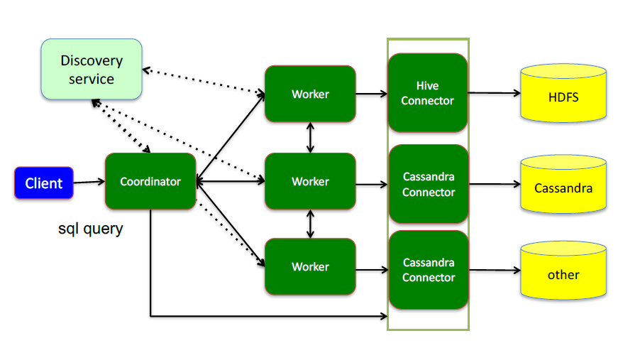

这里面三个服务：

Coordinator（考第内ter），是一个中心的查询角色，它主要的一个作用是接受查询请求，将他们转换成各种各样的任务，将任务拆解后分发到多个worker去执行各种任务的节点

1、解析SQL语句

2、⽣成执⾏计划

3、分发执⾏任务给Worker节点执⾏

Worker，是一个真正的计算的节点，执行任务的节点，它接收到task后，就会到对应的数据源里面，去把数据提取出来，提取方式是通过各种各样的connector：

1、负责实际执⾏查询任务

Discovery service，是将coordinator和woker结合到一起的服务：

1、Worker节点启动后向Discovery Server服务注册

2、Coordinator从Discovery Server获得Worker节点

coordinator和woker之间的关系是怎么维护的呢？是通过Discovery Server，所有的worker都把自己注册到Discovery Server上，Discovery Server是一个发现服务的service，Discovery Server发现服务之后，coordinator便知道在我的集群中有多少个worker能够给我工作，然后我分配工作到worker时便有了根据

最后，presto是通过connector plugin获取数据和元信息的，它不是⼀个数据存储引擎，不需要有数据，presto为其他数据存储系统提供了SQL能⼒，客户端协议是HTTP+JSON

### 支持的数据源和存储格式

 Presto需要从其他数据源获取数据来进行运算分析，它可以连接多种数据源，包括Hive、RDBMS（Mysql、Oracle、Tidb等）、Kafka、MongoDB、Redis等

一条Presto查询可以将多个数据源的数据进行合并分析。

 比如：select * from a join b where a.id=b.id;，其中表a可以来自Hive，表b可以来自Mysql。

* Hadoop/Hive connector与存储格式：

​		HDFS，ORC，RCFILE，Parquet，SequenceFile，Text

* 开源数据存储系统：

​		MySQL & PostgreSQL，Cassandra，Kafka，Redis

* 其他：

​		MongoDB，ElasticSearch，HBase

### SQL运行过程：整体流程

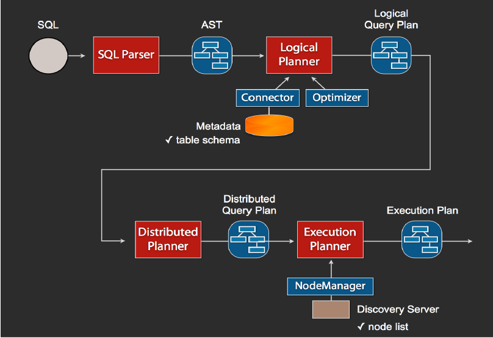

1、当我们执行一条sql查询，coordinator接收到这条sql语句以后，它会有一个sql的语法解析器去把sql语法解析变成一个抽象的语法树AST，这抽象的语法书它里面只是进行一些语法解析，如果你的sql语句里面，比如说关键字你用的是int而不是Integer，就会在语法解析这里给暴露出来

2、如果语法是符合sql语法规范，之后会经过一个逻辑查询计划器的组件，他的主要作用是，比如说你sql里面出现的表，他会通过connector的方式去meta里面把表的schema，列名，列的类型等，全部给找出来，将这些信息，跟语法树给对应起来，之后会生成一个物理的语法树节点，这个语法树节点里面，不仅拥有了它的查询关系，还拥有类型的关系，如果在这一步，数据库表里某一列的类型，跟你sql的类型不一致，就会在这里报错

3、如果通过，就会得到一个逻辑的查询计划，然后这个逻辑查询计划，会被送到一个分布式的逻辑查询计划器里面，进行一个分布式的解析，分布式解析里面，他就会去把对应的每一个查询计划转化为task

4、在每一个task里面，他会把对应的位置信息全部给提取出来，交给执行的plan，由plan把对应的task发给对应的worker去执行，这就是整个的一个过程

这是一个通用的sql解析流程，像hive也是遵循类似这样的流程，不一样的地方是distribution planner和executor pan，这里是各个引擎不一样的地方，前面基本上都一致的

### MapReduce vs Presto

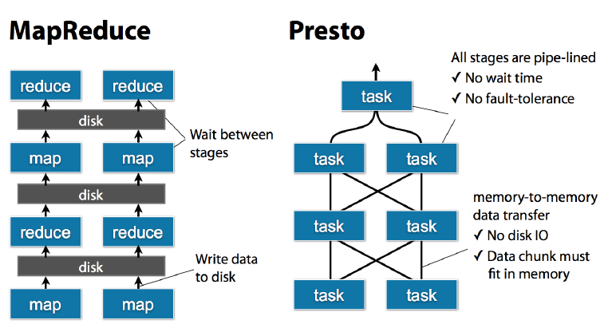

task是放在每个worker上该执行的，每个task执行完之后，数据是存放在内存里了，而不像mr要写磁盘，然后当多个task之间要进行数据交换，比如shuffle的时候，直接从内存里处理

### 总结

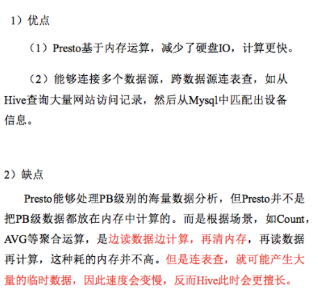

> Impala性能稍领先于Presto，但是Presto在数据源支持上非常丰富，包括Hive、图数据库、传统关系型数据库、Redis等。

## Kylin

## 简介

今天，随着移动互联网、物联网、AI等技术的快速兴起，数据成为了所有这些技术背后最重要，也是最有价值的“资产”。如何从数据中获得有价值的信息？这个问题驱动了相关技术的发展，从最初的基于文件的检索、分析程序，到数据仓库理念的诞生，再到基于数据库的商业智能分析。而现在，这一问题已经变成了如何从海量的超大规模数据中快速获 取有价值的信息，新的时代、新的挑战、新的技术必然应运而生。

在大数据处理技术领域，用户最普遍的诉求就是希望以很简易的方式从大数据平台上快速获取查询结果，同时也希望传统的商务智能工具能够直接和大数据平台连接起来，以便使用这些工具做数据分析。目前已经出现了很多优秀的SQL on Hadoop引擎，包括Hive、Impala及 SparkSQL等，这些技术的出现和应用极大地降低了用户使用Hadoop平台的难度。
为了进一步满足“在高并发、大数据量的情况下，使用标准SQL查询聚合结果集能够达到毫秒级”这一应用场景，Apache Kylin应运而生，在 eBay孵化并最终贡献给开源社区。Apache Kylin是2013年由eBay 在上海的一个中国工程师团队发起的、基于Hadoop大数据平台的开源 OLAP引擎，它采用多维立方体预计算技术，利用空间换时间的方法，把很多分钟级别乃至小时级别的大数据查询速度一下子提升到了亚秒级别，极大地提高了数据分析的效率，填补了业界在这方面的空白。该引擎为超大规模数据集上的交互式大数据分析打开了大门。

## 为什么要用Kylin

自从10年前Hadoop诞生以来，大数据的存储和批处理问题均得到了 妥善解决，而如何高速地分析数据也就成为了下一个挑战。于是各式各 样的“SQLon Hadoop”技术应运而生，其中以Hive为代表，Impala、Presto、 Phoenix、Drill、SparkSQL等紧随其后。它们的主要技术是“大规模并行处理”（Massive Parallel Processing，MPP）和“列式存储”（Columnar Storage）。 大规模并行处理可以调动多台机器一起进行并行计算，用线性增加的资源来换取计算时间的线性下降。列式存储则将记录按列存放，这样做不仅可以在访问时只读取需要的列，还可以利用存储设备擅长连续读取的特点，大大提高读取的速率。这两项关键技术使得Hadoop上的SQL查询 速度从小时提高到了分钟。

然而分钟级别的查询响应仍然离交互式分析的现实需求还很远。分析师敲入查询指令，按下回车，还需要去倒杯咖啡，静静地等待查询结 果。得到结果之后才能根据情况调整查询，再做下一轮分析。如此反复， 一个具体的场景分析常常需要几小时甚至几天才能完成，效率低下。 这是因为大规模并行处理和列式存储虽然提高了计算和存储的速 度，但并没有改变查询问题本身的时间复杂度，也没有改变查询时间与 数据量成线性增长的关系这一事实。假设查询1亿条记录耗时1分钟，那么查询10亿条记录就需10分钟，100亿条记录就至少需要1小时40分钟。 当然，可以用很多的优化技术缩短查询的时间，比如更快的存储、更高效 的压缩算法，等等，但总体来说，查询性能与数据量呈线性相关这一点是 无法改变的。虽然大规模并行处理允许十倍或百倍地扩张计算集群，以 期望保持分钟级别的查询速度，但购买和部署十倍或百倍的计算集群又 怎能轻易做到，更何况还有高昂的硬件运维成本。

另外，对于分析师来说，完备的、经过验证的数据模型比分析性能更 加重要，直接访问纷繁复杂的原始数据并进行相关分析其实并不是很友 好的体验，特别是在超大规模的数据集上，分析师将更多的精力花在了 等待查询结果上，而不是在更加重要的建立领域模型上。

## Kylin怎样解决关键问题

Apache Kylin的初衷就是要解决千亿条、万亿条记录的秒级查询问 题，其中的关键就是要打破查询时间随着数据量成线性增长的这个规 律。仔细思考大数据OLAP，可以注意到两个事实。

- 大数据查询要的一般是统计结果，是多条记录经过聚合函数计算后 的统计值。原始的记录则不是必需的，或者访问频率和概率都极低。
- 聚合是按维度进行的，由于业务范围和分析需求是有限的，有意义 的维度聚合组合也是相对有限的，一般不会随着数据的膨胀而增长。
  基于以上两点，我们可以得到一个新的思路——“预计算”。应尽量多 地预先计算聚合结果，在查询时刻应尽量使用预算的结果得出查询结果，从而避免直接扫描可能无限增长的原始记录。

举例来说，使用如下的SQL来查询10月1日那天销量最高的商品：

```shell
select item,sum(sell_amount) 
from sell_details
where sell_data=’2016-10-1’
group by item
order by sum(sell_amount) desc; 
```

用传统的方法时需要扫描所有的记录，再找到10月1日的销售记录，然后按商品聚合销售额，最后排序返回。假如10月1日有1亿条交易，那么 查询必须读取并累计至少1亿条记录，且这个查询速度会随将来销量的增 加而逐步下降。如果日交易量提高一倍到2亿，那么查询执行的时间可能 也会增加一倍。

而使用预计算的方法则会事先按维度[sell_date，item]计算 sum（sell_amount）并存储下来，在查询时找到10月1日的销售商品就可以 直接排序返回了。读取的记录数最大不会超过维度[sell_date，item]的组 合数。显然这个数字将远远小于实际的销售记录，比如10月1日的1亿条 交易包含了100万条商品，那么预计算后就只有100万条记录了，是原来 的百分之一。并且这些记录已经是按商品聚合的结果，因此又省去了运 行时的聚合运算。从未来的发展来看，查询速度只会随日期和商品数目 的增长而变化，与销售记录的总数不再有直接联系。假如日交易量提高 一倍到2亿，但只要商品的总数不变，那么预计算的结果记录总数就不会 变，查询的速度也不会变。

“预计算”就是Kylin在“大规模并行处理”和“列式存储”之外，提供给大数据分析的第三个关键技术。

## Kylin的工作原理

Apache Kylin的工作原理本质上是MOLAP（Multidimensional Online Analytical Processing）Cube，也就是多维立方体分析。这是数据分析中相当经典的理论，在关系数据库年代就已经有了广泛的应用，下面将对其做简要介绍。

### 维度和度量简介

在说明MOLAP Cube之前需要先介绍一下维度（Dimension）和度量 （Measure）这两个概念。 简单来讲，维度就是观察数据的角度。比如电商的销售数据，可以从 时间的维度来观察（如图1-2的左侧所示），也可以进一步细化，从时间和 地区的维度来观察（如图1-2的右侧所示）。维度一般是一组离散的值，比 如时间维度上的每一个独立的日期，或者商品维度上的每一件独立的商 品。因此统计时可以把维度值相同的记录聚合在一起，然后应用聚合函 数做累加、平均、去重复计数等聚合计算。
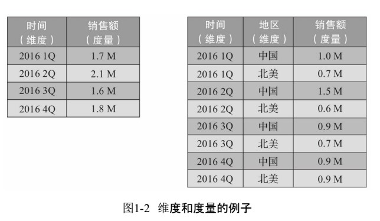
度量就是被聚合的统计值，也是聚合运算的结果，它一般是连续的 值，如图1-2中的销售额，抑或是销售商品的总件数。通过比较和测算度 量，分析师可以对数据进行评估，比如今年的销售额相比去年有多大的 增长，增长的速度是否达到预期，不同商品类别的增长比例是否合理等。

### Cube和Cuboid

有了维度和度量，一个数据表或数据模型上的所有字段就可以分类 了，它们要么是维度，要么是度量（可以被聚合）。于是就有了根据维度和 度量做预计算的Cube理论。

给定一个数据模型，我们可以对其上的所有维度进行组合。对于N个 维度来说，组合的所有可能性共有2N 种。对于每一种维度的组合，将度 量做聚合运算，然后将运算的结果保存为一个物化视图，称为Cuboid。所 有维度组合的Cuboid作为一个整体，被称为Cube。所以简单来说，一个 Cube就是许多按维度聚合的物化视图的集合。

下面来列举一个具体的例子。假定有一个电商的销售数据集，其中 维度包括时间（Time）、商品（Item）、地点（Location）和供应商（Supplier）， 度量为销售额（GMV）。那么所有维度的组合就有2 4 =16种（如图1-3所 示），比如一维度（1D）的组合有[Time]、[Item]、[Location]、[Supplier]4种； 二维度（2D）的组合有[Time，Item]、[Time，Location]、[Time、Supplier]、 [Item，Location]、[Item，Supplier]、[Location，Supplier]6种；三维度（3D）的 组合也有4种；最后零维度（0D）和四维度（4D）的组合各有1种，总共就有 16种组合。
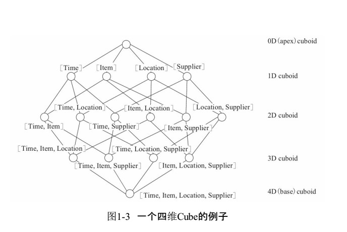
计算Cuboid，即按维度来聚合销售额。如果用SQL语句来表达计算 Cuboid[Time，Loca-tion]，那么SQL语句如下：

Select Time,Location,Sum(GMV) as GMV from Sales group by Time,Location

将计算的结果保存为物化视图，所有Cuboid物化视图的总称就是 Cube。

### 工作原理

Apache Kylin的工作原理就是对数据模型做Cube预计算，并利用计算 的结果加速查询，具体工作过程如下。

1）指定数据模型，定义维度和度量。
2）预计算Cube，计算所有Cuboid并保存为物化视图。
3）执行查询时，读取Cuboid，运算，产生查询结果。
由于Kylin的查询过程不会扫描原始记录，而是通过预计算预先完成 表的关联、聚合等复杂运算，并利用预计算的结果来执行查询，因此相比 非预计算的查询技术，其速度一般要快一到两个数量级，并且这点在超 大的数据集上优势更明显。当数据集达到千亿乃至万亿级别时，Kylin的 速度甚至可以超越其他非预计算技术1000倍以上。

## 5 Kylin的技术架构

Apache Kylin系统可以分为在线查询和离线构建两部分，技术架构如 图1-4所示，在线查询的模块主要处于上半区，而离线构建则处于下半区。
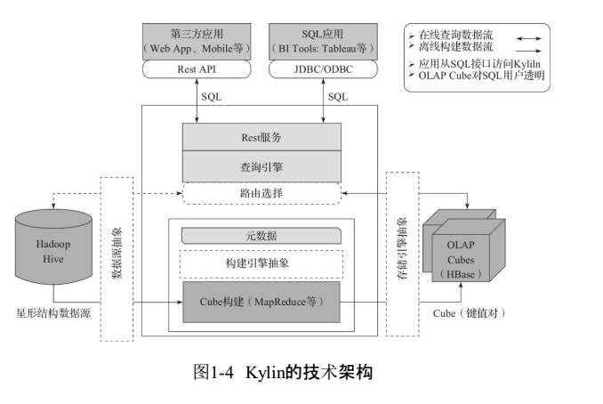
我们首先来看看离线构建的部分。从图1-4可以看出，数据源在左侧，目前主要是Hadoop Hive，保存着待分析的用户数据。根据元数据的 定义，下方构建引擎从数据源抽取数据，并构建Cube。数据以关系表的形 式输入，且必须符合星形模型（Star Schema）（更复杂的雪花模型在成文时块做任意的扩展和替换。

Kylin的三大依赖模块分别是数据源、构建引擎 和存储引擎。在设计之初，作为Hadoop家族的一员，这三者分别是Hive、 MapReduce和HBase。但随着推广和使用的深入，渐渐有用户发现它们均 存在不足之处。比如，实时分析可能会希望从Kafka导入数据而不是从 Hive；而Spark的迅速崛起，又使我们不得不考虑将MapReduce替换为 Spark，以期大幅提高Cube的构建速度；至于HBase，它的读性能可能还不 如Cassandra或Kudu等。可见，是否可以将一种技术替换为另一种技术已成为一个常见的问题。于是我们对Kylin1.5版本的系统架构进行了重构，将数据源、构建引擎、存储引擎三大依赖抽象为接口，而Hive、 MapReduce、HBase只是默认实现。深度用户可以根据自己的需要做二次开发，将其中的一个或多个替换为更适合的技术。

这也为Kylin技术的与时俱进埋下了伏笔。如果有一天更先进的分布 式计算技术取代了MapReduce，或者更高效的存储系统全面超越了 HBase，Kylin可以用较小的代价将一个子系统替换掉，从而保证Kylin能 够紧跟技术发展的最新潮流，从而保持最高的技术水平。 可扩展架构也带来了额外的灵活性，比如，它可以允许多个引擎同 时并存。例如Kylin可以同时对接Hive、Kafka和其他第三方数据源；抑或 用户可以为不同的Cube指定不同的构建引擎或存储引擎，以期达到最极 致的性能和功能定制。

## Kylin的主要特点

Apache Kylin的主要特点包括支持SQL接口、支持超大数据集、秒级 响应、可伸缩性、高吞吐率、BI工具集成等。

### 标准SQL接口

Apache Kylin以标准SQL作为对外服务的主要接口。因为SQL是绝大 多数分析人员最熟悉的工具，同时也是大多数应用程序使用的编程接 口。尽管Kylin内部以Cube技术为核心，对外却没有选用 MDX（MultiDimensional eXpressions）作为接口。虽然MDX作为OLAP查询 语言，从学术上来说，它是更加适合Kylin的选择，然而实践表明，SQL简 单易用，代表了绝大多数用户的第一需求，这也是Kylin能够快速推广的 一个关键。

SQL需要以关系模型作为支撑。Kylin使用的查询模型是数据源中的 关系模型表，一般而言，也就是指Hive表。终端用户只需要像原来查询 Hive表一样编写SQL，就可以无缝地切换到Kylin，几乎不需要额外的学 习，甚至原本的Hive查询也因为与SQL同源，大多都无须修改就能直接在 Kylin上运行。 Apache Kylin在将来也可能会推出MDX接口。事实上已经有方法可 以通过MDX转SQL的工具，让Kylin也能支持MDX。

### 支持超大数据集

Apache Kylin对大数据的支撑能力可能是目前所有技术中最为领先 的。早在2015年eBay的生产环境中Kylin就能支持百亿记录的秒级查询， 之后在移动的应用场景下又有了千亿记录秒级查询的案例。这些都是实 际场景的应用，而非实验室中的理论数据。

因为使用了Cube预计算技术，在理论上，Kylin可以支撑的数据集大 小没有上限，仅受限于存储系统和分布式计算系统的承载能力，并且查 询速度不会随数据集的增大而减慢。Kylin在数据集规模上的局限性主要 在于维度的个数和基数。它们一般由数据模型来决定，不会随着数据规 模的增长而线性增长，这也意味着Kylin对未来数据的增长有着更强的适 应能力。

对于Apache Kylin，除了eBay将其作为孵化公司有广泛应用之外，国内外一线的互联网公司对此几乎都有大规模的 使用，包括百度、网易、京东、美团、唯品会、Expedia等。此外，其在传统 行业中也有非常多的实际应用，包括中国移动、银联、国美等。据不完全 统计，真实上线的Apache Kylin用户已经超过了一百多家，在开源后一年 多一点的时间内能有如此大的全球用户基础，足见Kylin在处理超大规模 数据集上的能力和优势。

### 亚秒级响应

Apache Kylin拥有优异的查询响应速度，这点得益于预计算，很多复 杂的计算，比如连接、聚合，在离线的预计算过程中就已经完成，这大大 降低了查询时刻所需要的计算量，提高了响应速度。

根据可查询到的公开资料可以得知，Apache Kylin在某生产环境中 90%的查询可以在3s内返回结果。这并不是说一小部分SQL相当快，而是 在数万种不同SQL的真实生产系统中，绝大部分的查询都非常迅速；在另 外一个真实的案例中，对1000多亿条数据构建了立方体，90%的查询性能 都在1.18s以内，可见Kylin在超大规模数据集上表现优异。这与一些只在 实验室中，只在特定查询情况下采集的性能数据不可同日而语。当然并 不是使用Kylin就一定能获得最好的性能。针对特定的数据及查询模式， 往往需要做进一步的性能调优、配置优化等，性能调优对于充分利用好 Apache Kylin至关重要。

### 可伸缩性和高吞吐率

在保持高速响应的同时，Kylin有着良好的可伸缩性和很高的吞吐 率。图1-5是来自网易的性能分享。图1-5中左侧是Kylin查询速度与 Mondrian/Oracle的对比，可以看到在3个测试查询中，Kylin分别比 Mondrian/Oracle快147倍、314倍和59倍。
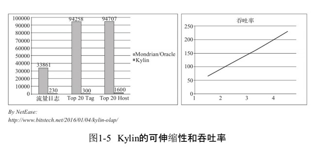
同时，图1-5中右侧展现了Kylin的吞吐率及其可伸缩性。在只有1个 Kylin实例的情况下，Kylin每秒可以处理近70个查询，已经远远高于每秒 20个查询的一般水平。更为理想的是，随着服务器的增加，吞吐率也呈线 性增加，存在4个实例时可达到每秒230个查询左右，而这4个实例仅部署 在一台机器上，理论上添加更多的应用服务器后可以支持更大的并发 率。

这主要还是归功于预计算降低了查询时所需的计算总量，令Kylin可 以在相同的硬件配置下承载更多的并发查询。

### BI及可视化工具集成

Apache Kylin提供了丰富的API，以与现有的BI工具集成，具体包括 如下内容。

- ODBC接口，与Tableau、Excel、Power BI等工具集成。
- JDBC接口，与Saiku、BIRT等Java工具集成。
- Rest API，与JavaScript、Web网页集成。

分析师可以沿用他们最熟悉的BI工具与Kylin一同工作，或者在开放 的API上做二次开发和深度定制。

另外，Kylin核心开发团队也贡献了Apache Zeppelin的插件，现在已 经可以用Zeppelin来访问Kylin服务。

### 与其他开源产品比较

与Apache Kylin一样致力于解决大数据查询问题的其他开源产品也 有不少，比如Apache Drill、Apache Impala、Druid、Hive、 Presto（Facebook）、SparkSQL等。本节试图将Kylin与它们做一个简单的比 较。 从底层技术的角度来看，这些开源产品有很大的共性，一些底层技 术几乎被所有的产品一致采用，Kylin也不例外。

- 大规模并行处理：可以通过增加机器的方式来扩容处理速度，在相 同的时间里处理更多的数据。
- 列式存储：通过按列存储提高单位时间里数据的I/O吞吐率，还能跳 过不需要访问的列。
- 索引：利用索引配合查询条件，可以迅速跳过不符合条件的数据块， 仅扫描需要扫描的数据内容。
- 压缩：压缩数据然后存储，使得存储的密度更高，在有限的I/O速率 下，在单位时间里读取更多的记录。
  综上所述，我们可以注意到，所有这些方法都只是提高了单位时间 内处理数据的能力，当大家都一致采用这些技术时，它们之间的区别将只停留在实现层面的代码细节上。最重要的是，这些技术都不会改变一 个事实，那就是处理时间与数据量之间的正比例关系。当数据量翻倍时， MPP（在不扩容的前提下）需要翻倍的时间来完成计算；列式存储需要翻 倍的存储空间；索引下符合条件的记录数也会翻倍；压缩后的数据大小也 还是之前的两倍。因此查询速度也会随之变成之前的两倍。当数据量成 十倍百倍地增长时，这些技术的查询速度就会成十倍百倍地下降，最终 变得不能接受。

Apache Kylin的特色在于，在上述的底层技术之外，另辟蹊径地使用 了独特的Cube预计算技术。预计算事先将数据按维度组合进行了聚合， 将结果保存为物化视图。经过聚合，物化视图的规模就只由维度的基数 来决定，而不再随着数据量的增长呈线性增长。以电商为例，如果业务扩 张，交易量增长了10倍，只要交易数据的维度不变（供应商/商品数量不 变），聚合后的物化视图将依旧是原先的大小，查询的速度也将保持不变。

与那些类似产品相比，这一底层技术的区别使得Kylin从外在功能上 呈现出了不同的特性，具体如下。

- SQL接口：除了Druid以外，所有的产品都支持SQL或类SQL接口。巧 合的是，Druid也是除了Kylin以外，查询性能相对更好的一个。这点除了 Druid有自己的存储引擎之外，可能还得益于其较为受限的查询能力。
- 大数据支持：大多数产品的能力在亿级到十亿级数据量之间，再大 的数据量将显著降低查询的性能。而Kylin因为采用预计算技术，因此查 询速度不受数据量限制。有实际案例证明数据量在千亿级别时，Kylin系 统仍然能够保有秒级别的查询性能。
- 查询速度：如前文所述，一般产品的查询速度都会不可避免地随着 数据量的增长而下降，而Kylin则能够在数据量成倍增长的同时，查询速 度保持不变，而且这个差距也将随着数据量的成倍增长而变得愈加明显。
- 吞吐率：根据之前的实验数据，Kylin的单例吞吐量一般在每秒70个 查询左右，并且可以线性扩展，而普通的产品因为所有计算都在查询时 完成，所以需要调动集群的更多资源才能完成查询，通常极限在每秒20 个查询左右，而且扩容成本较高，需要扩展整个集群。相对的，Kylin系统 因为瓶颈不在整个集群，而在于Kylin服务器，因此只需要增加Kylin服务 器就能成倍地提高吞吐率，扩容成本低廉。

## 小结

Kylin通过预计算，把计算结果集保存在HBase中，原有的基于行的关系模型被转换成基于键值对的列式存储；通过维度组合作为HBase的Rowkey，在查询访问时不再需要昂贵的表扫描，这为高速高并发分析带来了可能；Kylin提供了标准SQL查询接口，支持大多数的SQL函数，同时也支持ODBC/JDBC的方式和主流的BI产品无缝集成。

本文介绍了Apache Kylin的历史背景和技术特点。尤其是它基于预计算的大数据查询原理，
理论上可以在任意大的数据规模上达到O（1）常数级别的查询速度，这一点也是Apache Kylin与传统查询技术的关键区别，如图1-6所示。
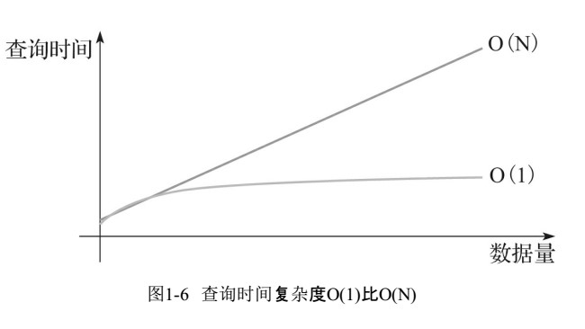
传统技术，如大规模并行计算和列式存储的查询速度都在 O（N）级别，与数据规模增线性关系。如果数据规模增长10倍，那么O（N) 的查询速度就会下降到十分之一，无法满足日益增长的数据需求。依靠 Apache Kylin，我们不用再担心查询速度会随着数据量的增长而减慢，面对未来的数据挑战时也能更有信心。
