# OAuth2.0

### **OAuth2.0介绍**

OAuth（Open Authorization）是一个关于授权（authorization）的开放网络标准，允许用户授权第三方 应用访问他们存储在另外的服务提供者上的信息，而不需要将用户名和密码提供给第三方移动应用或分享他 们数据的所有内容。OAuth在全世界得到广泛应用，目前的版本是2.0版。

OAuth协议：[https://tools.ietf.org/html/rfc6749](https://link.zhihu.com/?target=https%3A//tools.ietf.org/html/rfc6749)

协议特点：

- 简单：不管是OAuth服务提供者还是应用开发者，都很易于理解与使用；
- 安全：没有涉及到用户密钥等信息，更安全更灵活；
- 开放：任何服务提供商都可以实现OAuth，任何软件开发商都可以使用OAuth；

### **应用场景**

- 原生app授权：app登录请求后台接口，为了安全认证，所有请求都带token信息，如果登录验证、 请求后台数据。
- 前后端分离单页面应用：前后端分离框架，前端请求后台数据，需要进行oauth2安全认证
- 第三方应用授权登录，比如QQ，微博，微信的授权登录。


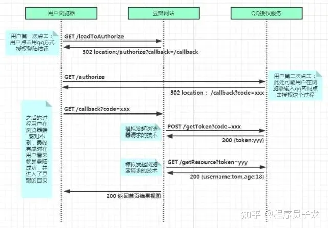


### 基本概念

- **Third-party application**：第三方应用程序，又称"客户端"（client），即例子中的"豆瓣"。
- **HTTP service**：HTTP服务提供商，简称"服务提供商"，即例子中的qq。
- **Resource Owner**：资源所有者，又称"用户"（user）。
- **User Agent**：用户代理，比如浏览器。
- **Authorization server**：授权服务器，即服务提供商专门用来处理认证授权的服务器。
- **Resource server**：资源服务器，即服务提供商存放用户生成的资源的服务器。它与授权服务器，可以是同一台服务器，也可以是不同的服务器。

OAuth的作用就是让"客户端"安全可控地获取"用户"的授权，与"服务提供商"进行交互。

### **优缺点**

优点：

- 更安全，客户端不接触用户密码，服务器端更易集中保护
- 广泛传播并被持续采用
- 短寿命和封装的token
- 资源服务器和授权服务器解耦
- 集中式授权，简化客户端
- HTTP/JSON友好，易于请求和传递token
- 考虑多种客户端架构场景
- 客户可以具有不同的信任级别

缺点：

- 协议框架太宽泛，造成各种实现的兼容性和互操作性差
- 不是一个认证协议，本身并不能告诉你任何用户信息。

### Spring Security

Spring Security是一个能够为基于Spring的企业应用系统提供声明式的安全访问控制解决方案的**安全框架**。Spring Security 主要实现了**Authentication**（认证，解决who are you? ） 和 **Access Control**（访问控制，也就是what are you allowed to do？，也称为**Authorization**）。Spring Security在架构上将认证与授权分离，并提供了扩展点。

**认证（Authentication）** ：用户认证就是判断一个用户的身份是否合法的过程，用户去访问系统资源时系统要求验证用户的身份信息，身份合法方可继续访问，不合法则拒绝访问。常见的用户身份认证方式有：用户名密码登录，二维码登录，手机短信登录，指纹认证等方式。

**授权（Authorization）**： 授权是用户认证通过根据用户的权限来控制用户访问资源的过程，拥有资源的访问权限则正常访问，没有权限则拒绝访问。

将OAuth2和Spring Security集成，就可以得到一套完整的安全解决方案。我们可以通过Spring Security OAuth2构建一个授权服务器来验证用户身份以提供access_token，并使用这个access_token来从资源服务器请求数据。

### Spring Security + Oauth2.0**整体架构**


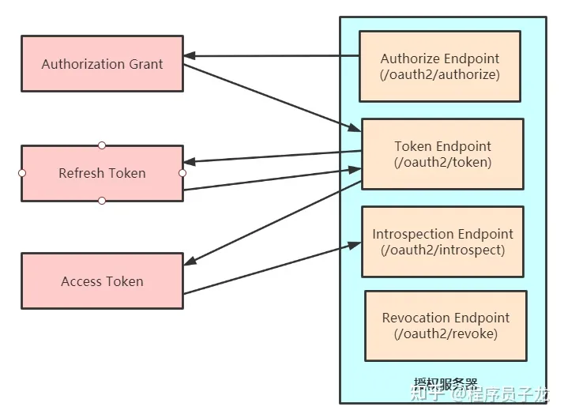


- Authorize Endpoint ：授权端点，进行授权
- Token Endpoint ：令牌端点，经过授权拿到对应的Token
- Introspection Endpoint ：校验端点，校验Token的合法性
- Revocation Endpoint ：撤销端点，撤销授权


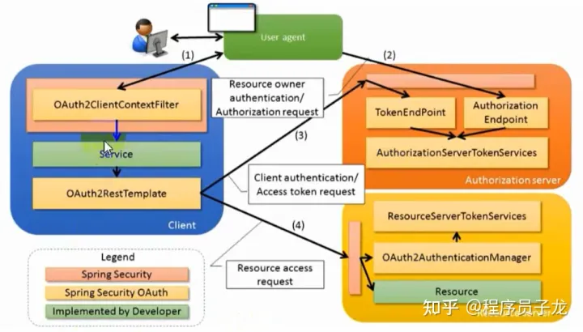


1. 用户访问,此时没有Token。Oauth2RestTemplate会报错，这个报错信息会被Oauth2ClientContextFilter捕获并重定向到授权服务器。
2. 授权服务器通过Authorization Endpoint进行授权，并通过AuthorizationServerTokenServices生成授权码并返回给客户端。
3. 客户端拿到授权码去授权服务器通过Token Endpoint调用AuthorizationServerTokenServices生成Token并返回给客户端
4. 客户端拿到Token去资源服务器访问资源，一般会通过Oauth2AuthenticationManager调用ResourceServerTokenServices进行校验。校验通过可以获取资源。

### OAuth2.0模式

### 运行流程

OAuth 2.0的运行流程如下图，摘自RFC 6749。


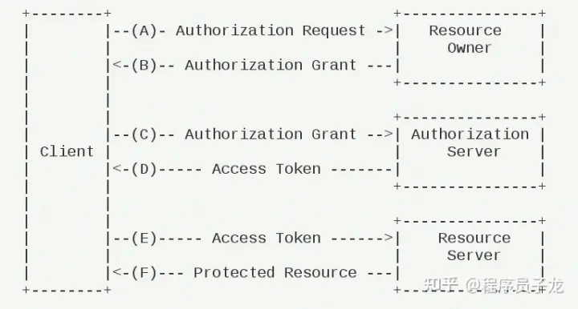


（A）用户打开客户端以后，客户端要求用户给予授权。

（B）用户同意给予客户端授权。

（C）客户端使用上一步获得的授权，向认证服务器申请令牌。

（D）认证服务器对客户端进行认证以后，确认无误，同意发放令牌。 

（E）客户端使用令牌，向资源服务器申请获取资源。

（F）资源服务器确认令牌无误，同意向客户端开放资源。

引入依赖

```text
<dependency>
    <groupId>org.springframework.cloud</groupId>
    <artifactId>spring-cloud-starter-oauth2</artifactId>
</dependency>    
```

### 授权模式

客户端必须得到用户的授权（authorization grant），才能获得令牌（access token）。OAuth 2.0一共分成四种授权类型（authorization grant）

- 授权码模式（authorization code）
- 简化模式（implicit）
- 密码模式（resource owner password credentials）
- 客户端模式（client credentials）

授权码模式和密码模式比较常用。

第三方应用申请令牌之前，都必须先到系统备案，说明自己的身份，然后会拿到两个身份识别码：客户端 ID（client ID）和客户端密钥（client secret）。这是为了防止令牌被滥用，没有备案过的第三方应用，是不会拿到令牌的。

### **授权码模式**

**授权码（authorization code）方式，指的是第三方应用先申请一个授权码，然后再用该码获取令牌。**

这种方式是最常用的流程，安全性也最高，它适用于那些有后端的 Web 应用。授权码通过前端传送，令牌则是储存在后端，而且所有与资源服务器的通信都在后端完成。这样的前后端分离，可以避免令牌泄漏。

适用场景：目前主流的第三方验证都是采用这种模式


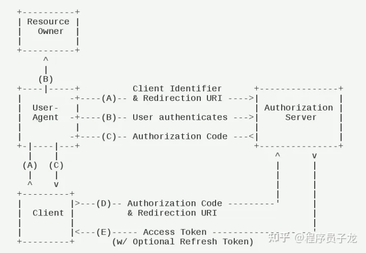


主要流程：

（A）用户访问客户端，后者将前者导向授权服务器。

（B）用户选择是否给予客户端授权。

（C）用户给予授权，授权服务器将用户导向客户端事先指定的"重定向URI"（redirection URI），同时附上一个授权码。

（D）客户端收到授权码，附上早先的"重定向URI"，向授权服务器申请令牌。这一步是在客户端的后台的服务器上完成的，对用户不可见。

（E）授权服务器核对了授权码和重定向URI，确认无误后，向客户端发送访问令牌（access token）和更新令牌（refresh token）。


### **配置授权服务器**

注意：实际项目中clinet_id 和client_secret 是配置在数据库中，省略spring security相关配置，可以参考

```text
@Configuration
@EnableAuthorizationServer
public class AuthorizationServerConfig extends AuthorizationServerConfigurerAdapter {

    @Autowired
    private PasswordEncoder passwordEncoder;

    @Autowired
    private TokenStore tokenStore;

    @Override
    public void configure(AuthorizationServerEndpointsConfigurer endpoints) throws Exception {
        endpoints
                .tokenStore(tokenStore)  //指定token存储到redis
                .allowedTokenEndpointRequestMethods(HttpMethod.GET,HttpMethod.POST); //支持GET,POST请求

    @Override
    public void configure(ClientDetailsServiceConfigurer clients) throws Exception {

        // 基于内存模式，这里只是演示，实际生产中应该基于数据库
        clients.inMemory()
                //配置client_id
                .withClient("client")
                //配置client_secret
                .secret(passwordEncoder.encode("123123"))
                //配置访问token的有效期
                .accessTokenValiditySeconds(3600)
                //配置刷新token的有效期
                .refreshTokenValiditySeconds(864000)
                //配置redirect_uri，用于授权成功后跳转
                .redirectUris("http://www.baidu.com")
                //配置申请的权限范围
                .scopes("all")
                //配置grant_type，表示授权类型  authorization_code: 授权码
                .authorizedGrantTypes("authorization_code");


    }
}
```

客户端信息，和授权码都是存储在了内存中，一旦认证服务宕机，那客户端的认证信息也随之消失，而且客户端信息是在程序中写死的，维护起来及不方便，每次修改都需要重启服务，如果向上述信息都存于数据库中便可以解决上面的问题，其中数据我们可以自定义存到 noSql 或其他数据库中。


**数据库存储模式**

首先在数据库中新建存储客户端信息，及授权码的表：

```text
#客户端信息
CREATE TABLE `oauth_client_details`  (
  `client_id` varchar(128) CHARACTER SET utf8 COLLATE utf8_general_ci NOT NULL,
  `resource_ids` varchar(256) CHARACTER SET utf8 COLLATE utf8_general_ci NULL DEFAULT NULL,
  `client_secret` varchar(256) CHARACTER SET utf8 COLLATE utf8_general_ci NULL DEFAULT NULL,
  `scope` varchar(256) CHARACTER SET utf8 COLLATE utf8_general_ci NULL DEFAULT NULL,
  `authorized_grant_types` varchar(256) CHARACTER SET utf8 COLLATE utf8_general_ci NULL DEFAULT NULL,
  `web_server_redirect_uri` varchar(256) CHARACTER SET utf8 COLLATE utf8_general_ci NULL DEFAULT NULL,
  `authorities` varchar(256) CHARACTER SET utf8 COLLATE utf8_general_ci NULL DEFAULT NULL,
  `access_token_validity` int(11) NULL DEFAULT NULL,
  `refresh_token_validity` int(11) NULL DEFAULT NULL,
  `additional_information` varchar(4096) CHARACTER SET utf8 COLLATE utf8_general_ci NULL DEFAULT NULL,
  `autoapprove` varchar(256) CHARACTER SET utf8 COLLATE utf8_general_ci NULL DEFAULT NULL,
  PRIMARY KEY (`client_id`) USING BTREE
) ENGINE = InnoDB CHARACTER SET = utf8 COLLATE = utf8_general_ci ROW_FORMAT = Dynamic;

-- ----------------------------
-- Records of oauth_client_details
-- ----------------------------
INSERT INTO `oauth_client_details` VALUES ('client', NULL, '$2a$10$CE1GKj9eBZsNNMCZV2hpo.QBOz93ojy9mTd9YQaOy8H4JAyYKVlm6', 'all', 'authorization_code,password,refresh_token,client_credentials,implicit', 'http://www.baidu.com', NULL, 3600, 864000, NULL, NULL);

#授权码
CREATE TABLE `oauth_code`  (
  `code` varchar(256) CHARACTER SET utf8 COLLATE utf8_general_ci NULL DEFAULT NULL,
  `authentication` blob NULL
) ENGINE = InnoDB CHARACTER SET = utf8 COLLATE = utf8_general_ci ROW_FORMAT = Dynamic;
```

引入依赖

```text
<dependency>
    <groupId>com.baomidou</groupId>
    <artifactId>mybatis-plus-boot-starter</artifactId>
    <version>3.3.2</version>
</dependency>

<dependency>
    <groupId>mysql</groupId>
    <artifactId>mysql-connector-java</artifactId>
</dependency>

<dependency>
    <groupId>com.alibaba</groupId>
    <artifactId>druid</artifactId>
    <version>1.1.6</version>
</dependency>

/**
 * 授权服务器
 *
 * 授权码模式基于数据库
 */
@Configuration
@EnableAuthorizationServer
public class AuthorizationServerConfig1 extends AuthorizationServerConfigurerAdapter {

    @Autowired
    private PasswordEncoder passwordEncoder;

    @Autowired
    private TokenStore tokenStore;

    @Autowired
    private DataSource dataSource;

    @Autowired
    private AuthorizationCodeServices authorizationCodeServices;

    @Autowired
    @Qualifier("jdbcClientDetailsService")
    private ClientDetailsService clientDetailsService;

    @Bean("jdbcClientDetailsService")
    public ClientDetailsService clientDetailsService() {
        JdbcClientDetailsService clientDetailsService = new JdbcClientDetailsService(dataSource);
        clientDetailsService.setPasswordEncoder(passwordEncoder);
        return clientDetailsService;
    }

    //设置授权码模式的授权码如何存取
    @Bean
    public AuthorizationCodeServices authorizationCodeServices() {
        return new JdbcAuthorizationCodeServices(dataSource);
    }


    @Override
    public void configure(AuthorizationServerEndpointsConfigurer endpoints) throws Exception {
        endpoints
                .tokenStore(tokenStore)  //指定token存储到redis
                .authorizationCodeServices(authorizationCodeServices)//授权码服务
                .allowedTokenEndpointRequestMethods(HttpMethod.GET,HttpMethod.POST); //支持GET,POST请求


    }
    @Override
    public void configure(AuthorizationServerSecurityConfigurer security) throws Exception {
        //允许表单认证
        security
                .tokenKeyAccess("permitAll()")                    //oauth/token_key是公开
                .checkTokenAccess("permitAll()")                  //oauth/check_token公开
                .allowFormAuthenticationForClients();
    }

    @Override
    public void configure(ClientDetailsServiceConfigurer clients) throws Exception {
        //授权码模式
        //http://localhost:8080/oauth/authorize?response_type=code&client_id=client&redirect_uri=http://www.baidu.com&scope=all
        // 简化模式
//        http://localhost:8080/oauth/authorize?response_type=token&client_id=client&redirect_uri=http://www.baidu.com&scope=all

        clients.withClientDetails(clientDetailsService);


    }
}
```

### **配置资源服务器**

```text
@Configuration
@EnableResourceServer
public class ResourceServiceConfig extends ResourceServerConfigurerAdapter {

    @Override
    public void configure(HttpSecurity http) throws Exception {

        http.authorizeRequests()
                .anyRequest().authenticated()
                .and().requestMatchers().antMatchers("/user/**");

    }

}
```

### 配置 spring security

```text
@Configuration
public class WebSecurityConfig extends WebSecurityConfigurerAdapter {

    @Bean
    public PasswordEncoder passwordEncoder(){
        return new BCryptPasswordEncoder();
    }


    @Override
    protected void configure(HttpSecurity http) throws Exception {
        http.formLogin().permitAll()
                .and().authorizeRequests()
                .antMatchers("/oauth/**").permitAll()
                .anyRequest().authenticated()
                .and().logout().permitAll()
                .and().csrf().disable();
    }
}

@Service
public class UserService implements UserDetailsService {

    @Autowired
    private PasswordEncoder passwordEncoder;

    @Override
    public UserDetails loadUserByUsername(String username) throws UsernameNotFoundException {
        String password = passwordEncoder.encode("123456");
        return new User("test",password, AuthorityUtils.commaSeparatedStringToAuthorityList("admin"));
    }
}
```

1、A网站（客户端）提供一个链接，用户点击后就会跳转到 B （授权服务器）网站，授权用户数据给 A 网站使用。

```text
 127.0.0.1:9999/oauth/authorize?   
 response_type=code&            # 表示授权类型，必选项，此处的值固定为"code"
 client_id=CLIENT_ID&           # 表示客户端的ID，必选项
 redirect_uri=CALLBACK_URL&     # redirect_uri：表示重定向URI，可选项
 scope=read                     # 表示申请的权限范围，可选项 read只读  
```

http://localhost:8080/oauth/authorize?response_type=code&client_id=client&redirect_uri=http://www.baidu.com&scope=all

2、用户跳转后，B 网站会要求用户登录，然后询问是否同意给予 A 网站授权。用户表示同意，这时 B 网站就会跳回redirect_uri参数指定的网址。跳转时，会传回一个授权码

登录：


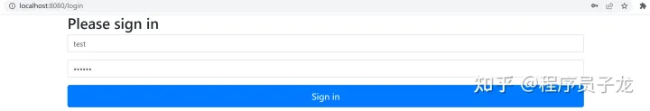


授权：


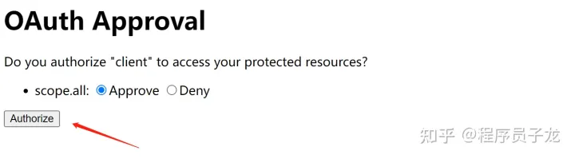


选择 authorize ，获取授权码，浏览器返回：[https://www.baidu.com/?code=PVpEEw](https://link.zhihu.com/?target=https%3A//www.baidu.com/%3Fcode%3DPVpEEw)

```text
https://a.com/callback?code=AUTHORIZATION_CODE    #code参数就是授权码                   
```

如果使用数据库模式：


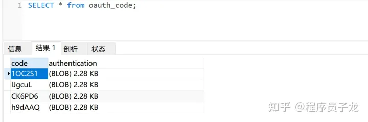


3、A 网站拿到授权码以后，就可以在后端，向 B 网站请求令牌。 用户不可见，服务端行为

```text
127.0.0.1:8080/oauth/token? 
client_id=CLIENT_ID& 
client_secret=CLIENT_SECRET&     # client_id和client_secret用来让 B 确认 A 的身份,client_secret参数是保密的，因此只能在后端发请求 
grant_type=authorization_code&   # 采用的授权方式是授权码
code=AUTHORIZATION_CODE&         # 上一步拿到的授权码 
redirect_uri=CALLBACK_URL        # 令牌颁发后的回调网址         
```

4、B 网站收到请求以后，就会颁发令牌。具体做法是向redirect_uri指定的网址，返回数据。

```text
 {    
   "access_token":"ACCESS_TOKEN",     # 令牌
   "token_type":"bearer",
   "expires_in":2592000,
   "refresh_token":"REFRESH_TOKEN",
   "scope":"read",
   "uid":100101,
   "info":{...}
 }
```


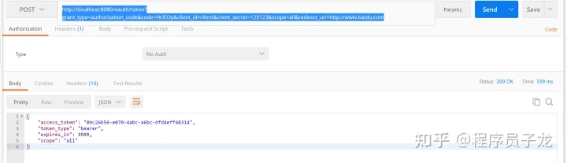


此时redis中会存储token


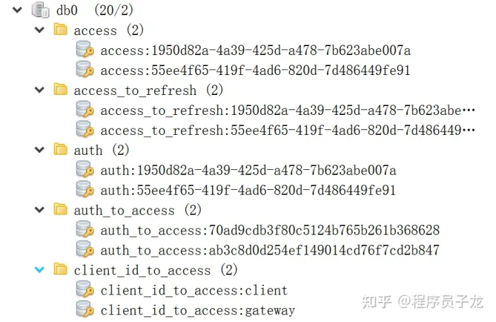


### **密码模式**

如果你高度信任某个应用，RFC 6749 也允许用户把用户名和密码，直接告诉该应用。该应用就使用你的密码，申请令牌，这种方式称为"密码式"（password）。

在这种模式中，用户必须把自己的密码给客户端，但是客户端不得储存密码。这通常用在用户对客户端高度信任的情况下，比如客户端是操作系统的一部分，或者由一个著名公司出品。而授权服务器只有在其他授权模式无法执行的情况下，才能考虑使用这种模式。

适用场景：公司搭建的授权服务器


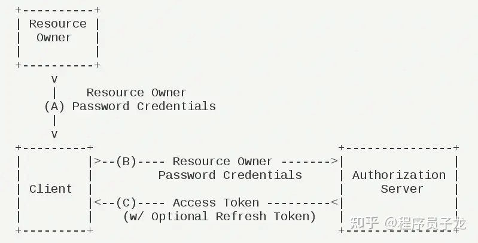


（A）用户向客户端提供用户名和密码。

（B）客户端将用户名和密码发给授权服务器，向后者请求令牌。

（C）授权服务器确认无误后，向客户端提供访问令牌。

### 配置 spring security

增加AuthenticationManager

```text
@Configuration
public class WebSecurityConfig extends WebSecurityConfigurerAdapter {

    @Bean
    public PasswordEncoder passwordEncoder(){
        return new BCryptPasswordEncoder();
    }

    @Autowired
    private UserService userService;

    @Override
    protected void configure(AuthenticationManagerBuilder auth) throws Exception {
        // 获取用户信息
        auth.userDetailsService(userService);
    }


    @Override
    protected void configure(HttpSecurity http) throws Exception {
        http.formLogin().permitAll()
                .and().authorizeRequests()
                .antMatchers("/oauth/**").permitAll()
                .anyRequest()
                .authenticated()
                .and().logout().permitAll()
                .and().csrf().disable();
    }


    @Bean
    @Override
    public AuthenticationManager authenticationManagerBean() throws Exception {
        // oauth2 密码模式需要拿到这个bean
        return super.authenticationManagerBean();
    }
}


@Service
public class UserService implements UserDetailsService {

    @Autowired
    @Lazy
    private PasswordEncoder passwordEncoder;

    @Override
    public UserDetails loadUserByUsername(String username) throws UsernameNotFoundException {
        String password = passwordEncoder.encode("123456");
        return new User("jack",password, AuthorityUtils.commaSeparatedStringToAuthorityList("admin"));
    }
}

@Configuration
public class RedisConfig {
    @Autowired
    private RedisConnectionFactory redisConnectionFactory;
    @Bean
    public TokenStore tokenStore(){
        return new RedisTokenStore(redisConnectionFactory);
    }
}
```

### 配置授权服务器

```text
@Configuration
@EnableAuthorizationServer
public class AuthorizationServerConfig2 extends AuthorizationServerConfigurerAdapter {

    @Autowired
    private PasswordEncoder passwordEncoder;

    @Autowired
    private AuthenticationManager authenticationManagerBean;

    @Autowired
    private UserService userService;

    @Autowired
    private TokenStore tokenStore;


    @Override
    public void configure(AuthorizationServerEndpointsConfigurer endpoints) throws Exception {
        endpoints.authenticationManager(authenticationManagerBean) //使用密码模式需要配置
                .tokenStore(tokenStore)  //指定token存储到redis
                .reuseRefreshTokens(false)  //refresh_token是否重复使用
                .userDetailsService(userService) //刷新令牌授权包含对用户信息的检查
                .allowedTokenEndpointRequestMethods(HttpMethod.GET,HttpMethod.POST); //支持GET,POST请求
    }

    @Override
    public void configure(AuthorizationServerSecurityConfigurer security) throws Exception {
        //允许表单认证
        security.allowFormAuthenticationForClients();
    }

    @Override
    public void configure(ClientDetailsServiceConfigurer clients) throws Exception {

        clients.inMemory()
                //配置client_id
                .withClient("client")
                //配置client-secret
                .secret(passwordEncoder.encode("123123"))
                //配置访问token的有效期
                .accessTokenValiditySeconds(3600)
                //配置刷新token的有效期
                .refreshTokenValiditySeconds(864000)
                //配置redirect_uri，用于授权成功后跳转
                .redirectUris("http://www.baidu.com")
                //配置申请的权限范围
                .scopes("all")
                /**
                 * 配置grant_type，表示授权类型
                 * authorization_code: 授权码模式
                 * implicit: 简化模式
                 * password： 密码模式
                 * client_credentials: 客户端模式
                 * refresh_token: 更新令牌
                 */
                .authorizedGrantTypes("authorization_code","implicit","password","client_credentials","refresh_token");
    }


}
```

如需支持数据库模式，只需要把授权服务器在授权码模式的基础上增加AuthenticationManager，关键代码如下：

```text
//AuthorizationServerConfig1
@Autowired
private AuthenticationManager authenticationManagerBean;

@Override
public void configure(AuthorizationServerEndpointsConfigurer endpoints) throws Exception {
    endpoints.authenticationManager(authenticationManagerBean) //使用密码模式需要配置
    .tokenStore(tokenStore)  //指定token存储到redis
    .authorizationCodeServices(authorizationCodeServices)//授权码服务
    .allowedTokenEndpointRequestMethods(HttpMethod.GET,HttpMethod.POST); //支持GET,POST请求


}
```

获取token：

```text
https://oauth.b.com/oauth/token?
  grant_type=password&       # 授权方式是"密码式"
  username=USERNAME&
  password=PASSWORD&
  client_id=CLIENT_ID&
  client_secret=123123&
  scope=all
```


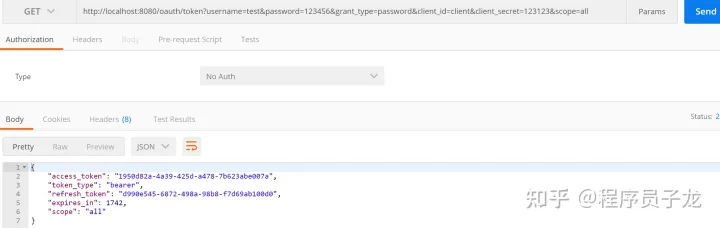


### **客户端模式**

客户端模式（Client Credentials Grant）指客户端以自己的名义，而不是以用户的名义，向"服务提供商"进行 授权。

**适用于没有前端的命令行应用，即在命令行下请求令牌。**一般用来提供给我们完全信任的服务器端服务。


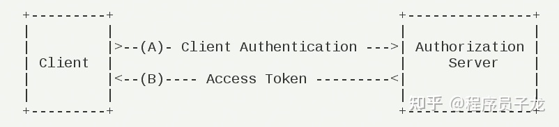


它的步骤如下：

（A）客户端向授权服务器进行身份认证，并要求一个访问令牌。

（B）授权服务器确认无误后，向客户端提供访问令牌。

A 应用在命令行向 B 发出请求。

```text
https://oauth.b.com/token? 
grant_type=client_credentials& 
client_id=CLIENT_ID& 
client_secret=CLIENT_SECRET              
```

### 配置授权服务器

在grant_type增加client_credentials来支持客户端模式。

```text
clients.inMemory()
        //配置client_id
        .withClient("client")
        //配置client-secret
        .secret(passwordEncoder.encode("123123"))
        //配置访问token的有效期
        .accessTokenValiditySeconds(3600)
        //配置刷新token的有效期
        .refreshTokenValiditySeconds(864000)
        //配置redirect_uri，用于授权成功后跳转
        .redirectUris("http://www.baidu.com")
        //配置申请的权限范围
        .scopes("all")
        /**
         * 配置grant_type，表示授权类型
         * authorization_code: 授权码模式
         * implicit: 简化模式
         * password： 密码模式
         * client_credentials: 客户端模式
         * refresh_token: 更新令牌
         */
        .authorizedGrantTypes("authorization_code","implicit","password","client_credentials","refresh_token");
```

获取令牌：


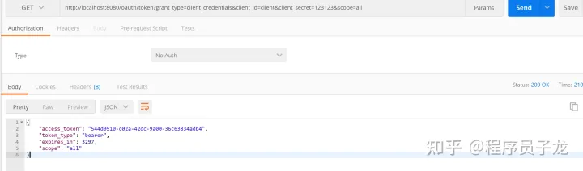


### **简化(隐式)模式**

有些 Web 应用是纯前端应用，没有后端。这时就不能用上面的方式了，必须将令牌储存在前端。**RFC 6749 就规定了第二种方式，允许直接向前端颁发令牌，这种方式没有授权码这个中间步骤，所以称为（授权码）"隐藏式"（implicit）**

简化模式不通过第三方应用程序的服务器，直接在浏览器中向授权服务器申请令牌，跳过了"授权码"这个步骤，所有步骤在浏览器中完成，令牌对访问者是可见的，且客户端不需要认证。

这种方式把令牌直接传给前端，是很不安全的。因此，只能用于一些安全要求不高的场景，并且令牌的有效期必须非常短，通常就是会话期间（session）有效，浏览器关掉，令牌就失效了。


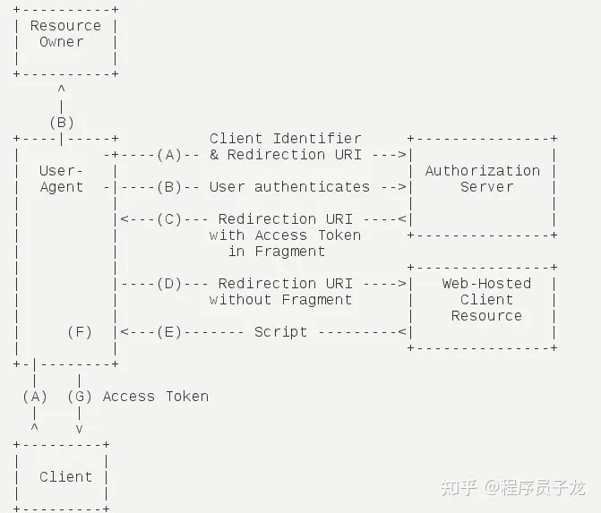


它的步骤如下：

（A）客户端将用户导向授权服务器。

（B）用户决定是否给于客户端授权。

（C）假设用户给予授权，授权服务器将用户导向客户端指定的"重定向URI"，并在URI的Hash部分包含了访问令牌。

（D）浏览器向资源服务器发出请求，其中不包括上一步收到的Hash值。

（E）资源服务器返回一个网页，其中包含的代码可以获取Hash值中的令牌。

（F）浏览器执行上一步获得的脚本，提取出令牌。

（G）浏览器将令牌发给客户端。

A 网站提供一个链接，要求用户跳转到 B 网站，授权用户数据给 A 网站使用。

```text
https://b.com/oauth/authorize?
>   response_type=token&          # response_type参数为token，表示要求直接返回令牌
>   client_id=CLIENT_ID&
>   redirect_uri=CALLBACK_URL&
>   scope=read
```

用户跳转到 B 网站，登录后同意给予 A 网站授权。这时，B 网站就会跳回redirect_uri参数指定的跳转网址，并且把令牌作为 URL 参数，传给 A 网站。

```text
https://a.com/callback#token=ACCESS_TOKEN     #token参数就是令牌，A 网站直接在前端拿到令牌。 
```

### 配置授权服务器

只需要在配置grant_type增加implicit

```text
clients.inMemory()
        //配置client_id
        .withClient("client")
        //配置client-secret
        .secret(passwordEncoder.encode("123123"))
        //配置访问token的有效期
        .accessTokenValiditySeconds(3600)
        //配置刷新token的有效期
        .refreshTokenValiditySeconds(864000)
        //配置redirect_uri，用于授权成功后跳转
        .redirectUris("http://www.baidu.com")
        //配置申请的权限范围
        .scopes("all")
        //配置grant_type，表示授权类型 授权码：authorization_code implicit: 简化模式
        .authorizedGrantTypes("authorization_code","implicit");
```

http://localhost:8080/oauth/authorize?client_id=client&response_type=token&scope=all&redirect_uri=http://www.baidu.com

登录之后进入授权页面，确定授权后浏览器会重定向到指定路径，并以Hash的形式存放在重定向uri的fargment中：


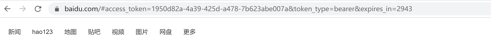


如果想要支持数据库模式，配置同授权码模式一样，只需要在oauth_client_details表的authorized_grant_types配置上implicit即可。

```text
INSERT INTO `oauth`.`oauth_client_details`(`client_id`, `resource_ids`, `client_secret`, `scope`, `authorized_grant_types`, `web_server_redirect_uri`, `authorities`, `access_token_validity`, `refresh_token_validity`, `additional_information`, `autoapprove`) VALUES ('gateway', NULL, '$2a$10$CE1GKj9eBZsNNMCZV2hpo.QBOz93ojy9mTd9YQaOy8H4JAyYKVlm6', 'all', 'authorization_code,password,refresh_token,implicit', 'http://www.baidu.com', NULL, 3600, 864000, NULL, NULL);
```

### **令牌的使用**

A 网站拿到令牌以后，就可以向 B 网站的 API 请求数据了。

此时，每个发到 API 的请求，都必须带有令牌。具体做法是在请求的头信息，加上一个Authorization字段，令牌就放在这个字段里面。


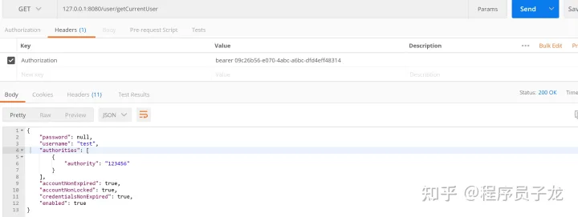


也可以添加请求参数access_token请求数据

```text
localhost/user/getCurrentUser?access_token=xxxxxxxxxxxxxxxxxxxxxxxxxxx
```


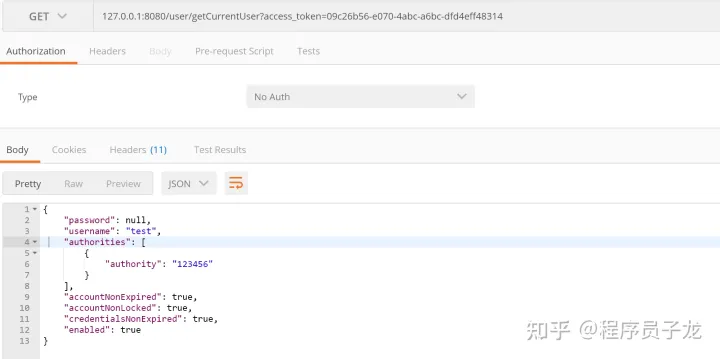


### **更新令牌**

令牌的有效期到了，如果让用户重新走一遍上面的流程，再申请一个新的令牌，很可能体验不好，而且也没有必要。OAuth 2.0 允许用户自动更新令牌。


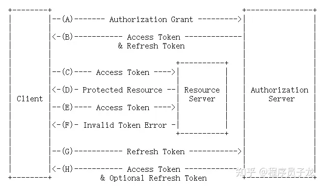


具体方法是，B 网站颁发令牌的时候，一次性颁发两个令牌，一个用于获取数据，另一个用于获取新的令牌（refresh token 字段）。令牌到期前，用户使用 refresh token 发一个请求，去更新令牌。

```text
https://b.com/oauth/token?
>   grant_type=refresh_token&    # grant_type参数为refresh_token表示要求更新令牌
>   client_id=CLIENT_ID&
>   client_secret=CLIENT_SECRET&
>   refresh_token=REFRESH_TOKEN    # 用于更新令牌的令牌
```


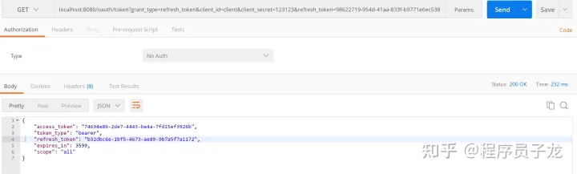


### **基于redis存储Token**

```text
<dependency>
    <groupId>org.springframework.boot</groupId>
    <artifactId>spring-boot-starter-data-redis</artifactId>
</dependency>
<dependency>
    <groupId>org.apache.commons</groupId>
    <artifactId>commons-pool2</artifactId>
</dependency>
```

### redis配置类

```text
@Configuration
public class RedisConfig {
    @Autowired
    private RedisConnectionFactory redisConnectionFactory;
    @Bean
    public TokenStore tokenStore(){
        return new RedisTokenStore(redisConnectionFactory);
    }
}
```

在授权服务器配置中指定令牌的存储策略为Redis

```text
@Autowired
private TokenStore tokenStore;

@Override
public void configure(AuthorizationServerEndpointsConfigurer endpoints) throws Exception {
    endpoints.authenticationManager(authenticationManagerBean) //使用密码模式需要配置
        .tokenStore(tokenStore)  //指定token存储到redis
        .reuseRefreshTokens(false)  //refresh_token是否重复使用
        .userDetailsService(userService) //刷新令牌授权包含对用户信息的检查
        .allowedTokenEndpointRequestMethods(HttpMethod.GET,HttpMethod.POST); //支持GET,POST请求
}
```

### 总结

OAuth2.0 的授权简单理解其实就是获取令牌（token）的过程，OAuth 协议定义了四种获得令牌的授权方式（authorization grant ）：授权码（authorization-code）、简单式（implicit）、密码式（password）、客户端凭证（client credentials），一般常用的是授权码和密码模式。
