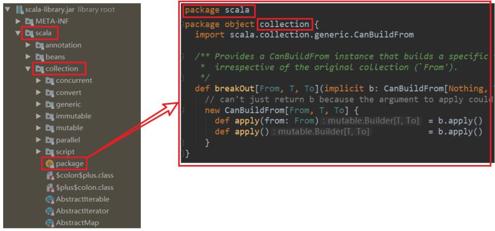
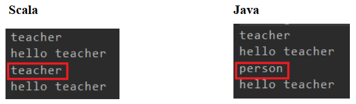
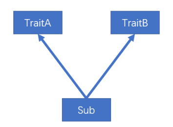
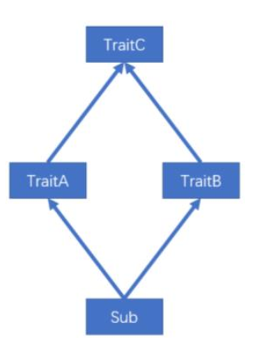
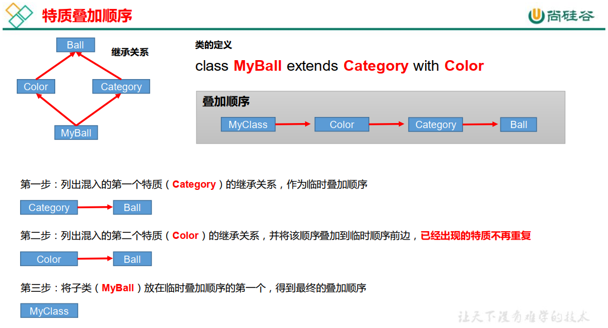
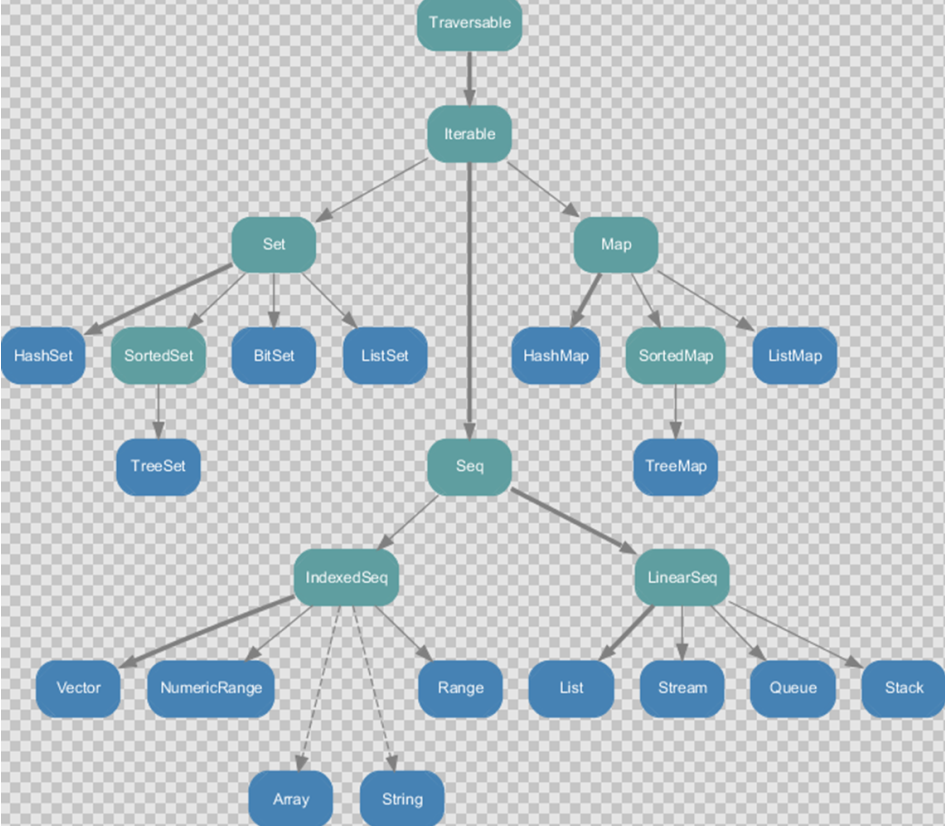
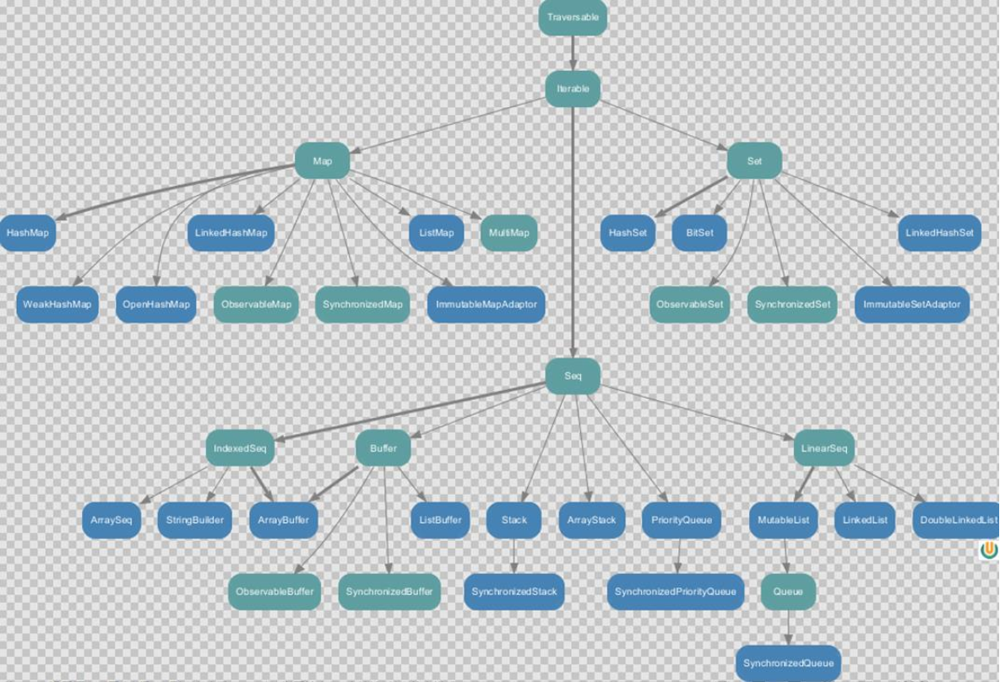
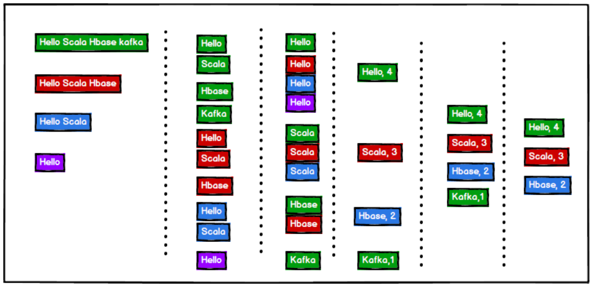

# 第 1 章 概述

## 1.1 为什么学习Scala

* Spark—新一代内存级大数据计算框架， 是大数据的重要内容。
* Spark就是使用Scala编写的。 因此为了更好的学习Spark, 需要掌握Scala这门语言。
* Spark的兴起， 带动Scala语言的发展！

## 1.2 Scala发展历史


## 1.3 Scala和Java关系

一般来说，学 Scala 的人，都会 Java，而 Scala 是基于 Java 的，因此我们需要将 Scala和 Java 以及 JVM 之间的关系搞清楚，否则学习 Scala 你会蒙圈 。


## 1.4 Scala语言特点


## 1.5 环境搭建


idea 插件安装


## 1.6 HelloWord案例


默认下， Maven 不支持 Scala 的开发，需要引入 Scala 框架。  在项目上， 点击右键-> Add Framework Support... ->选择 Scala->点击 OK  


创建项目的源文件目录 

右键点击 main 目录->New->点击 Diretory -> 写个名字（比如 scala）。
右键点击 scala 目录->Mark Directory as->选择 Sources root， 观察文件夹颜色发生变化。  


右键点击 scala 目录->New->Package->输入 com.atguigu.chapter01->点击 OK。
右键点击 com.atguigu.chapter01->New->Scala Class->Kind 项选择 Object->Name 项输入Hello。  


> 说明： Java 中部分代码也是可以在 Scala 中运行。  

## 1.7 class和object说明


**概念**

1. 用class修饰的为伴生类，与java中的类相似，用object的修饰的为伴生对象，为的是解决scala中没有static关键字的问题。
2. scala中的类不能定义静态成员，而代之以定义单例对象来替代
3. 单例对象通过object关键字来声明
4. 单例对象中的属性可以直接使用类名进行调用；伴生类中的属性，需要先实例化对象，才能够进行调用。
5. 
   一个单例对象可以绑定在一个类，当单例对象和某个类写在同一个源文件且共享一个名字，它们就产生了绑定关系。此时单例对象称之为该类的伴生对象，类称之为该对象的伴生类。
6. 伴生类与伴生对象可相互访问各自私有成员
7. 伴生对象可为伴生类增加静态成员

```scala
object Student{
  val school: String = "atguigu"
    
  def main(args: Array[String]): Unit = {
    val zs = new Student("zs", 20);
    zs.printInfo()
  }
}

class Student(name: String, age: Int) {
  def printInfo(): Unit = {
    println(name + " " + age + " " + Student.school)
  }
}
```


如上，scala的设计者认为java中有`static`关键字，所修饰的是面向类的，而不是面向对象的，认为这不是真正的面向对象，所以在scala中将`static`关键字删掉了，但为了实现类似scala中的功能，引入了伴生对象的概念。

**注意：**

* 由于 `static`定义的类和对象破坏了 面向对象编程的规范完整性，因此scala 在设计之初就没有**static**关键字概念，类相关的**静态属性**都放在伴生对象`object`中。简单理解：`object`就是java中的static部分，定义的是类中静态属性。
* **当同一个文件内**同时存在`object x`和`class x`的声明时：我们称`class x`称作`object x`的**伴生类**。其`object x`称作`class x`的**伴生对象**。
* 在scala里，类和伴生对象之间没有界限——它们可以互相访问彼此的`private`字段和`private`方法。
* 
  伴生对象不能`new`，所以也没有构造参数，可以把伴生对象当做java中可能会用到的静态方法工具类。作为程序入口的方法必须是静态的，所以main方法必须处在一个伴生对象中，而不能写在伴生类中。
* 在编译时，伴生类`class x`被编译成了`x.class`，而伴生对象`object x`被编译成了`x$.class`。
* 单例对象在第一次被访问时才会被初始化，来自于`scala`自带的predef包。

# 第 2 章 变量和数据类型

## 2.1 注释

Scala 注释使用和 Java 完全一样。  


## 2.2 变量和常量（重点）

常量：在程序执行的过程中，其值不会被改变的变量  

0）回顾： Java 变量和常量语法
	变量类型 变量名称 = 初始值 int a = 10
	final 常量类型 常量名称 = 初始值 final int b = 20  

1）基本语法
	var 变量名 [: 变量类型] = 初始值 var i:Int = 10
	val 常量名 [: 常量类型] = 初始值 val j:Int = 20

> **注意： 能用常量的地方不用变量**

2）案例实操
（1）声明变量时，类型可以省略，编译器自动推导，即类型推导。
（2）类型确定后，就不能修改，说明 Scala 是强数据类型语言。
（3）变量声明时，必须要有初始值。
（4）在声明/定义一个变量时，可以使用 var 或者 val 来修饰， var 修饰的变量可改变，val 修饰的变量不可改。  

```scala
package com.atguigu.chapter02
object TestVar {
	def main(args: Array[String]): Unit = {
        //（1）声明变量时，类型可以省略，编译器自动推导，即类型推导
        var age = 18
        age = 30
        //（2）类型确定后，就不能修改，说明 Scala 是强数据类型语言。
        // age = "tom" // 错误
        //（3）变量声明时，必须要有初始值
        // var name //错误
        //（4）在声明/定义一个变量时，可以使用 var 或者 val 来修饰， var 修饰的变量可改变， val 修饰的变量不可改。
        var num1 = 10 // 可变
        val num2 = 20 // 不可变
        num1 = 30 // 正确
        //num2 = 100 //错误，因为 num2 是 val 修饰的
    }
}
```

（5） var 修饰的对象引用可以改变， val 修饰的对象则不可改变，但对象的状态（值）却是可以改变的。（比如：自定义对象、数组、集合等等）  

```scala
object TestVar {
	def main(args: Array[String]): Unit = {
        // p1 是 var 修饰的， p1 的属性可以变，而且 p1 本身也可以变
        var p1 = new Person()
        p1.name = "dalang"
        p1 = null
        // p2 是 val 修饰的，那么 p2 本身就不可变（即 p2 的内存地址不能变），但是， p2 的属性是可以变，因为属性并没有用 val 修饰。
        val p2 = new Person()
        p2.name="jinlian"
        // p2 = null // 错误的，因为 p2 是 val 修饰的
    }
}
class Person{
    var name : String = "jinlian"
}
```

## 2.3 标识符的命名规范

Scala 对各种变量、 方法、 函数等命名时使用的字符序列称为标识符。即： 凡是自己可以起名字的地方都叫标识符。  

1）命名规则
Scala 中的标识符声明， 基本和 Java 是一致的，但是细节上会有所变化，有以下三种规则：  

（1）以字母或者下划线开头，后接字母、数字、下划线  

（2）以操作符开头，且只包含操作符（ + - * / # !等）

（3）用反引号`....`包括的任意字符串，即使是 Scala 关键字（ 39 个）也可以  


2）案例实操  

需求： 判断 hello、 Hello12、 1hello、 h-b、 x h、 h_4、 _ab、 Int、 _、 +*-/#!、 +*-/#!1、 if、`if`，这些名字是否合法。  

```scala
object TestName {
	def main(args: Array[String]): Unit = {
        //（1）以字母或者下划线开头，后接字母、数字、下划线
        var hello: String = "" // ok
        var Hello12: String = "" // ok
        var 1hello: String = "" // error 数字不能开头
        var h-b: String = "" // error 不能用-
        var x h: String = "" // error 不能有空格
        var h_4: String = "" // ok
        var _ab: String = "" // ok
        var Int: String = "" // ok 因为在 Scala 中 Int 是预定义的字符,不是关键字，但不推荐
        var _: String = "hello" // ok 单独一个下划线不可以作为标识符，因为_被认为是一个方法
        println(_)
        //（2）以操作符开头，且只包含操作符（ + - * / # !等）
        var +*-/#! : String = "" // ok
        var +*-/#!1 : String = "" // error 以操作符开头，必须都是操作符
        //（3）用反引号`....`包括的任意字符串，即使是 Scala 关键字（ 39 个）也可以
        var if : String = "" // error 不能用关键字
        var `if` : String = "" // ok 用反引号`....`包括的任意字符串,包括关键字
    }
}
```

## 2.4 字符串输出

1）基本语法
（1）字符串，通过+号连接
（2）printf 用法：字符串，通过%传值。

- %d 数值类型
- %s 字符串类型
- %f 浮点型

（3）字符串模板（插值字符串） ： 通过$获取变量值  

2） 案例实操  

```scala
package com.atguigu.chapter02
object TestCharType {
    def main(args: Array[String]): Unit = {
        var name: String = "jinlian"
        var age: Int = 18
        //（1） 字符串，通过 + 号连接
        println(name + " " + age)
        println(name * 3)
        //（2） printf 用法字符串，通过%传值。
        printf("name=%s age=%d\n", name, age)
        //（3） 字符串模版，通过$引用
        // 文字 's'  插值器允许在处理字符串时使用变量，println语句中将String变量（$name）附加到普通字符串中,并且可以嵌入表达式
        println(s"${age}岁的${name}")
        println(s"${age}岁的$name")
	    val num = 2.3443252
        // 文字 'f' 插值器允许创建一个格式化的字符串模板, 类似c语言中的printf
        println(f"The num is ${num}%2.2f")
        // 文字 'raw' 能让字符串原原本本的输出来，而不是产生控制效果
    	println(raw"The num is ${num}%2.2f")
        // 多行字符串，在 Scala中，利用三个双引号包围多行字符串就可以实现。
        // 输入的内容，带有空格、 \t 之类，导致每一行的开始位置不能整洁对齐。
        // 应用 scala 的 stripMargin 方法，在 scala 中 stripMargin 默认是“|”作为连接符， //在多行换行的行头前面加一个“|”符号即可。
        val s =
        """
        |select
        | name,
        | age
        |from user
        |where name="zhangsan"
        """.stripMargin
        println(s)
        // 如果需要对变量进行运算，那么可以加${}
        val s1 =
        s"""
        |select
        | name,
        | age
        |from user
        |where name="$name" and age=${age+2}
        """.stripMargin
        println(s1)
        val s2 = s"name=$name"
        println(s2)
    }
}
```

## 2.5 键盘输入

在编程中，需要接收用户输入的数据，就可以使用键盘输入语句来获取。  

1）基本语法
	StdIn.readLine()、 StdIn.readShort()、 StdIn.readDouble()  

2）案例实操  

需求：可以从控制台接收用户信息，【姓名，年龄，薪水】  

```scala
import scala.io.StdIn

object TestInput {
    def main(args: Array[String]): Unit = {
        // 1 输入姓名
        println("input name:")
        var name = StdIn.readLine()
        // 2 输入年龄
        println("input age:")
        var age = StdIn.readShort()
        // 3 输入薪水
        println("input sal:")
        var sal = StdIn.readDouble()
        // 4 打印
        println("name=" + name)
        println("age=" + age)
        println("sal=" + sal)
    }
}
```

## 2.6 读写文件

```scala
import java.io.{File, PrintWriter}
import scala.io.Source

object Test_FileIO {
  def main(args: Array[String]): Unit = {
    // 1.从文件中读取数据
    Source.fromFile("src\\main\\resources\\test.txt").foreach(print)

    // 2.将数据写入文件
    val writer = new PrintWriter(new File("src\\main\\resources\\output.txt"))
    writer.write("hello scala from java writer")
    writer.close()
  }
}
```

## 2.7 数据类型（重点）


## 2.8 整数类型（Byte、 Short、 Int、 Long）  

Scala 的整数类型就是用于存放整数值的，比如 12， 30， 3456 等等。  

1）整型分类  

| 数据类型  | 描述                                                         |
| --------- | ------------------------------------------------------------ |
| Byte [1]  | 8 位有符号补码整数。数值区间为 -128 到 127                   |
| Short [2] | 16 位有符号补码整数。数值区间为 -32768 到 32767              |
| Int [4]   | 32 位有符号补码整数。数值区间为 -2147483648 到 2147483647    |
| Long [8]  | 64 位有符号补码整数。数值区间为 -9223372036854775808 到 9223372036854775807 = 2 的(64-1)次方-1 |

2）案例实操  

（1） Scala 各整数类型有固定的表示范围和字段长度，不受具体操作的影响，以保证Scala 程序的可移植性。  

```scala
object TestDataType {
    def main(args: Array[String]): Unit = {
        // 正确
        var n1:Byte = 127
        var n2:Byte = -128
        // 错误
        // var n3:Byte = 128
        // var n4:Byte = -129
    }
}
```

（2） Scala 的整型，默认为 Int 型，声明 Long 型，须后加`l`或`L`

```scala
object TestDataType {
    def main(args: Array[String]): Unit = {
        var n5 = 10
        println(n5)
        var n6 = 9223372036854775807L
        println(n6)
        // val a5: Long = 123131321323123 因为默认为Int ，Int和规定的Long不匹配还是会报错
        
        val b1: Byte = 10
        val b2: Byte = 10 + 20 // 涉及到自动类型提升，编译器可以自定判断是否超出范围
        println(b2)
        // val b3: Byte = (b1 +20) //报错，编译器识别出了b1为Byte类型,要进行自动类型提升
        val b3: Byte = (b1 + 20).toByte // 解决类型不匹配的问题，进行强转就可以了
        println(b3)
    }
}
```

（3） Scala 程序中变量常声明为 Int 型，除非不足以表示大数，才使用 Long  

## 2.9 浮点类型（Float、 Double）  

Scala 的浮点类型可以表示一个小数，比如 123.4f， 7.8， 0.12 等等。  

1）浮点型分类  

| 数据类型   | 描述                               |
| ---------- | ---------------------------------- |
| Float [4]  | 32 位, IEEE 754 标准的单精度浮点数 |
| Double [8] | 64 位 IEEE 754 标准的双精度浮点数  |

2）案例实操  

Scala 的浮点型常量默认为 Double 型，声明 Float 型常量，须后加`f`或`F`。  

```scala
object TestDataType {
    def main(args: Array[String]): Unit = {
        // 建议，在开发中需要高精度小数时，请选择 Double
        var n7 = 2.2345678912f
        var n8 = 2.2345678912
        println("n7=" + n7)
        println("n8=" + n8)
    }
}
```

运行的结果 :

```properties
n7=2.2345679
n8=2.2345678912
```

## 2.10 字符类型（Char）  

1）基本说明  

字符类型可以表示单个字符，字符类型是 Char。  

2）案例实操  

（1）字符常量是用单引号 ' ' 括起来的单个字符。
（2） \t ：一个制表位，实现对齐的功能
（3） \n ：换行符
（4） \\ ：表示\
（5） \" ：表示"  

```scala
object TestCharType {
    def main(args: Array[String]): Unit = {
        // 字符常量是用单引号 ' ' 括起来的单个字符。
        var c1: Char = 'a'
        println("c1=" + c1)
        // 注意：这里涉及自动类型提升，其实编译器可以自定判断是否超出范围，
        // 不过 idea 提示报错
        var c2:Char = 'a' + 1
        println(c2)
        // 控制字符
        val c3: Char = '\t' //制表符
        val c4: Char = '\n' //换行符
        println("abc" + c3 + "def")
        println("abc" + c4 + "def")
        // 转义字符
        val c5 = '\\'
        println(c5)
        val c6 = '\"'
        println(c6)

        // 字符变量底层保存ASCII码
        val i1: Int = c1 //自动类型提升 Char -> Int
        println(i1)

        val c8: Char =(i1 +1).toChar
        println(c8)
    }
}
```

## 2.11 Unit类型、Null类型和Nothing类型（重点）

1）基本说明

| 数据类型 | 描述                                                         |
| -------- | ------------------------------------------------------------ |
| Unit     | 表示无值，和其他语言中 void 等同。用作不返回任何结果的方法的结果类型。 Unit 只有一个实例值，写成()。 |
| Null     | null , Null 类型只有一个实例值 null，是所有引用类型的子类    |
| Nothing  | Nothing 类型在 Scala 的类层级最低端；它是任何其他类型的子类型。 当一个函数，我们确定没有正常的返回值，可以用 Nothing 来指定返回类 型，这样有一个好处，就是我们可以把返回的值（异常）赋给其它的函数 或者变量（兼容性） |

2）案例实操

（1） Unit 类型用来标识过程，也就是没有明确返回值的函数。  

由此可见， Unit 类似于 Java 里的 void。 Unit 只有一个实例( )，这个实例也没有实质意义  

```scala
object TestSpecialType {
    def main(args: Array[String]): Unit = {
        def sayOk : Unit = {// unit 表示没有返回值，即 void
        }
        println(sayOk)
    }
}
```

（2） Null 类只有一个实例对象， Null 类似于 Java 中的 null 引用。 Null 可以赋值给任意引用类型（ AnyRef），但是不能赋值给值类型（ AnyVal）  

```scala
object TestDataType {
	def main(args: Array[String]): Unit = {
        //null 可以赋值给任意引用类型（ AnyRef），但是不能赋值给值类型(AnyVal)
        var cat = new Cat();
        cat = null // 正确
        var n1: Int = null // 错误
        println("n1:" + n1)
    }
}
class Cat {
}
```

（3） Nothing，可以作为没有正常返回值的方法的返回类型，非常直观的告诉你这个方法不会正常返回，而且由于 Nothing 是其他任意类型的子类，他还能跟要求返回值的方法兼容。  

```scala
object TestSpecialType {
    def main(args: Array[String]): Unit = {
        def test(): Nothing = {
            throw new Exception()
        }
        test
	}
}
```

## 2.12 类型转换（重点）

### 2.12.1 数值类型自动转换  

当 Scala 程序在进行赋值或者运算时，精度小的类型自动转换为精度大的数值类型，这个就是自动类型转换（隐式转换）。数据类型按精度（容量）大小排序为：  


1） 基本说明  

（1）自动提升原则：有多种类型的数据混合运算时，系统首先自动将所有数据转换成精度大的那种数据类型，然后再进行计算。
（2）把精度大的数值类型赋值给精度小的数值类型时，就会报错，反之就会进行自动类型转换。
（3）(byte， short)和 char 之间不会相互自动转换。
（4）byte，short，char 他们三者可以计算， 在计算时首先转换为 int 类型。  

2） 案例实操  

```scala
object TestValueTransfer {
    def main(args: Array[String]): Unit = {
        //（1）自动提升原则：有多种类型的数据混合运算时，系统首先自动将所有数据转换成精度大的那种数值类型，然后再进行计算。
        var n = 1 + 2.0
        println(n) // n 就是 Double
        //（2）把精度大的数值类型赋值给精度小的数值类型时，就会报错，反之就会进行自动类型转换。
        var n2 : Double= 1.0
        //var n3: Int = n2 //错误，原因不能把高精度的数据直接赋值和低精度。
        //（3）（byte，short）和 char 之间不会相互自动转换。
        var n4 : Byte = 1
        //var c1: Char = n4 //错误
        var n5:Int = n4
        //（4） byte，short， char 他们三者可以计算，在计算时首先转换为 int类型。
        var n6 : Byte = 1
        var c2 : Char = 1
        // var n: Short = n6 + c2 //当 n6 + c2 结果类型就是 int
        // var n7: Short = 10 + 90 //错误
    }
}
```

### 2.12.2 强制类型转换

1） 基本说明  

自动类型转换的逆过程，将精度大的数值类型转换为精度小的数值类型。使用时要加上强制转函数，但可能造成精度降低或溢出，格外要注意。  

```scala
Java : int num = (int)2.5
Scala : var num : Int = 2.7.toInt
```

2） 案例实操  

（1）将数据由高精度转换为低精度，就需要使用到强制转换
（2）强转符号只针对于最近的操作数有效，往往会使用小括号提升优先级  

```scala
object TestForceTransfer {
    def main(args: Array[String]): Unit = {
        //（1）将数据由高精度转换为低精度，就需要使用到强制转换
        var n1: Int = 2.5.toInt // 这个存在精度损失
        //（2）强转符号只针对于最近的操作数有效，往往会使用小括号提升优先级
        var r1: Int = 10 * 3.5.toInt + 6 * 1.5.toInt // 10 *3 + 6*1 = 36
        var r2: Int = (10 * 3.5 + 6 * 1.5).toInt // 44.0.toInt =44
        println("r1=" + r1 + " r2=" + r2)
    }
}
```

### 2.12.3 数值类型和 String 类型间转换  

1） 基本说明
在程序开发中，我们经常需要将基本数值类型转成 String 类型。或者将 String 类型转成基本数值类型。  

2）案例实操  

（1）基本类型转 String 类型（语法： 将基本类型的值+"" 即可）
（2） String 类型转基本数值类型（语法： s1.toInt、 s1.toFloat、 s1.toDouble、 s1.toByte、  s1.toLong、 s1.toShort）  

```scala
object TestStringTransfer {
    def main(args: Array[String]): Unit = {
        //（1）基本类型转 String 类型（语法：将基本类型的值+"" 即可）
        var str1 : String = true + ""
        var str2 : String = 4.5 + ""
        var str3 : String = 100 +""
        //（2）String 类型转基本数值类型（语法：调用相关 API）
        var s1 : String = "12"
        var n1 : Byte = s1.toByte
        var n2 : Short = s1.toShort
        var n3 : Int = s1.toInt
        var n4 : Long = s1.toLong
    }
}
```

（3）注意事项  

在将 String 类型转成基本数值类型时，要确保 String 类型能够转成有效的数据，比如我们可以把"123"，转成一个整数，但是不能把"hello"转成一个整数。  

var n5:Int = "12.6".toInt 会出现 NumberFormatException 异常。  

拓展：


# 第 3 章 运算符

Scala 运算符的使用和 Java 运算符的使用基本相同， 只有个别细节上不同。  

## 3.1 算术运算符

1）基本语法  

| 运算符 | 运算       | 范例       | 结果    |
| ------ | ---------- | ---------- | ------- |
| +      | 正号       | +3         | 3       |
| -      | 负号       | b=4; -b    | -4      |
| +      | 加         | 5+5        | 10      |
| -      | 减         | 6-4        | 2       |
| *      | 乘         | 3*4        | 12      |
| /      | 除         | 5/5        | 1       |
| %      | 取模(取余) | 7%5        | 2       |
| +      | 字符串相加 | “He”+”llo” | “Hello” |

（1）对于除号“/”，它的整数除和小数除是有区别的：整数之间做除法时，只保留整数部分而舍弃小数部分。
（2）对一个数取模 a%b，和 Java 的取模规则一样。  

2）案例实操  

```scala
object TestArithmetic {
    def main(args: Array[String]): Unit = {
        //（1）对于除号“/”，它的整数除和小数除是有区别的：整数之间做除法
        时，只保留整数部分而舍弃小数部分。
        var r1: Int = 10 / 3 // 3
        println("r1=" + r1)
        var r2: Double = 10 / 3 // 3.0
        println("r2=" + r2)
        var r3: Double = 10.0 / 3 // 3.3333
        println("r3=" + r3)
        println("r3=" + r3.formatted("%.2f")) // 含义：保留小数点 2位，使用四舍五入
        //（2）对一个数取模 a%b，和 Java 的取模规则一样。
        var r4 = 10 % 3 // 1
        println("r4=" + r4)
    }
}
```

## 3.2 关系运算符（比较运算符）  

1）基本语法  

| 运算符 | 运算     | 范例   | 结果  |
| ------ | -------- | ------ | ----- |
| ==     | 相等于   | 4==3   | false |
| !=     | 不等于   | 4！ =3 | true  |
| <      | 小于     | 4<3    | false |
| >      | 大于     | 4>3    | true  |
| <=     | 小于等于 | 4<=3   | false |
| >=     | 大于等于 | 4>=3   | true  |

2）案例实操  

（1）需求 1：  

```scala
object TestRelation {
    def main(args: Array[String]): Unit = {
        // 测试： >、 >=、 <=、 <、 ==、 !=
        var a: Int = 2
        var b: Int = 1
        println(a > b) // true
        println(a >= b) // true
        println(a <= b) // false
        println(a < b) // false
        println("a==b" + (a == b)) // false
        println(a != b) // true
    }
}
```

（2）需求 2： Java 和 Scala 中关于==的区别  

Java：==比较两个变量本身的值，即两个对象在内存中的首地址；equals 比较字符串中所包含的内容是否相同。  

```java
public static void main(String[] args) {
    String s1 = "abc";
    String s2 = new String("abc");
    System.out.println(s1 == s2);
    System.out.println(s1.equals(s2));
}
// 输出结果：
// false
// true
```

Scala： ==更加类似于 Java 中的 equals， 参照 jd 工具  

```scala
def main(args: Array[String]): Unit = {
    val s1 = "abc"
    val s2 = new String("abc")
    println(s1 == s2)
    println(s1.eq(s2))
}
// 输出结果：
// true
// false
```

## 3.3 逻辑运算符  

1）基本语法
用于连接多个条件（一般来讲就是关系表达式），最终的结果也是一个 Boolean 值。
假定：变量 A 为 true， B 为 false  

| 运算符 | 描述   | 实例                       |
| ------ | ------ | -------------------------- |
| &&     | 逻辑与 | (A && B) 运算结果为 false  |
| \|\|   | 逻辑或 | (A \|\| B) 运算结果为 true |
| !      | 逻辑非 | !(A && B) 运算结果为 true  |

2）案例实操  

```scala
object TestLogic {
    def main(args: Array[String]): Unit = {
        // 测试： &&、 ||、 !
        var a = true
        var b = false
        println("a&&b=" + (a && b)) // a&&b=false
        println("a||b=" + (a || b)) // a||b=true
        println("!(a&&b)=" + (!(a && b))) // !(a&&b)=true
    }
}
// 扩展避免逻辑与空指针异常
isNotEmpty(String s){
    // 如果按位与，s 为空，会发生空指针
    return s!=null && !"".equals(s.trim());
}
```

## 3.4 赋值运算符  

1）基本语法  

赋值运算符就是将某个运算后的值，赋给指定的变量  

| 运算符 | 描述                                            | 实例                                   |
| ------ | ----------------------------------------------- | -------------------------------------- |
| =      | 简单的赋值运算符，将一个表 达式的值赋给一个左值 | C = A + B 将 A + B 表达式结果赋 值给 C |
| +=     | 相加后再赋值                                    | C += A 等于 C = C + A                  |
| -=     | 相减后再赋值                                    | C -= A 等于 C = C - A                  |
| *=     | 相乘后再赋值                                    | C *= A 等于 C = C * A                  |
| /=     | 相除后再赋值                                    | C /= A 等于 C = C / A                  |
| %=     | 求余后再赋值                                    | C %= A 等于 C = C % A                  |
| <<=    | 左移后赋值                                      | C <<= 2 等于 C = C << 2                |
| >>=    | 右移后赋值                                      | C >>= 2 等于 C = C >> 2                |
| &=     | 按位与后赋值                                    | C &= 2 等于 C = C & 2                  |
| ^=     | 按位异或后赋值                                  | C ^= 2 等于 C = C ^ 2                  |
| \|=    | 按位或后赋值                                    | C \|= 2 等于 C = C \| 2                |

2）案例实操  

```scala
object TestAssignment {
    def main(args: Array[String]): Unit = {
        var r1 = 10
        r1 += 1 // 没有++
        r1 -= 2 // 没有--
    }
}
```

## 3.5 位运算符  

1）基本语法  

下表中变量 a 为 60， b 为 13。  

| 运算符 | 描述           | 实例                                                         |
| ------ | -------------- | ------------------------------------------------------------ |
| &      | 按位与运算符   | (a & b) 输出结果 12 ，二进制解释： 0000 1100                 |
| \|     | 按位或运算符   | (a \| b) 输出结果 61 ，二进制解释： 0011 1101                |
| ^      | 按位异或运算符 | (a ^ b) 输出结果 49 ，二进制解释： 0011 0001                 |
| ~      | 按位取反运算符 | (~a ) 输出结果 -61 ，二进制解释： 1100 0011， 在 一个有符号二进制数的补码形式。 |
| <<     | 左移动运算符   | a << 2 输出结果 240 ，二进制解释： 0011 0000                 |
| >>     | 右移动运算符   | a >> 2 输出结果 15 ，二进制解释： 0000 1111                  |
| >>>    | 无符号右移     | a >>>2 输出结果 15, 二进制解释: 0000 1111                    |

2）案例实操  

```scala
object TestPosition {
    def main(args: Array[String]): Unit = {
        // 测试： 1000 << 1 =>10000
        var n1 :Int =8
        n1 = n1 << 1
        println(n1)
    }
}
```

## 3.6 Scala 运算符本质  

在 Scala 中其实是没有运算符的， 所有运算符都是方法。
1） 当调用对象的方法时， 点.可以省略
2） 如果函数参数只有一个，或者没有参数， ()可以省略  

```scala
object TestOpt {
    def main(args: Array[String]): Unit = {
        // 标准的加法运算
        val i:Int = 1.+(1) // 将运算法当做成方法进行计算 ,合成方法，编译器自动生成，绕开JVM的限制
        //（1）当调用对象的方法时， .可以省略
        val j:Int = 1 + (1)
        //（2）如果函数参数只有一个，或者没有参数， ()可以省略
        val k:Int = 1 + 1
        println(1.toString())
        println(1 toString())
        println(1 toString)
        println(1 toint)
    }
}
```

# 第 4 章 流程控制  

## 4.1 分支控制 if-else  

让程序有选择的的执行，分支控制有三种：单分支、双分支、多分支  

### 4.1.1 单分支  

1）基本语法  

```scala
if (条件表达式) {
	执行代码块
}
```

说明：当条件表达式为 ture 时，就会执行{ }的代码  

2）案例实操  

需求：输入人的年龄，如果该同志的年龄小于 18 岁，则输出“童年  

```scala
object TestIfElse {
    def main(args: Array[String]): Unit = {
        println("input age:")
        var age = StdIn.readShort()
        if (age < 18){
        	println("童年")
        }
    }
}
```

### 4.1.2 双分支  

1）基本语法  

```scala
if (条件表达式) {
	执行代码块 1
} else {
	执行代码块 2
}
```

2）案例实操  

需求：输入年龄，如果年龄小于 18 岁，则输出“童年”。否则，输出“成年”  。

```scala
object TestIfElse {
    def main(args: Array[String]): Unit = {
        println("input age:")
        var age = StdIn.readShort()
        if (age < 18){
        	println("童年")
        }else{
       	 	println("成年")
        }
    }
}
```

### 4.1.3 多分支  

1）基本语法  

```scala
if (条件表达式 1) {
	执行代码块 1
}
else if (条件表达式 2) {
	执行代码块 2
}
……
else {
	执行代码块 n
}
```

2）案例实操  

（1）需求 1： 需求：输入年龄，如果年龄小于 18 岁，则输出“童年”。如果年龄大于等于 18 且小于等于 30， 则输出“中年”，否则，输出“老年”。  

```scala
object TestIfElse {
    def main(args: Array[String]): Unit = {
        println("input age")
        var age = StdIn.readInt()
        if (age < 18){
        	println("童年")
        }else if(age>=18 && age<30){
        	println("中年")
        }else{
        	println("老年")
        }
    }
}
```

（2）需求 2： Scala 中 if else 表达式其实是有返回值的，**具体返回值取决于满足条件的代码体的最后一行内容**。  

```scala
object TestIfElse {
    def main(args: Array[String]): Unit = {
        println("input age")
        var age = StdIn.readInt()
        val res :String = if (age < 18){
        	"童年"
        }else if(age>=18 && age<30){
        	"中年"
        }else{
        	"老年"
        }
        println(res)
    }
}
```

（3）需求 3： Scala 中返回值类型不一致，取它们共同的祖先类型。  

```scala
object TestIfElse {
    def main(args: Array[String]): Unit = {
        println("input age")
        var age = StdIn.readInt()
        val res:Any = if (age < 18){
        	"童年"
        }else if(age>=18 && age<30){
        	"中年"
        }else{
        	100
        }
        println(res)
    }
}
```

（4）需求 4： Java 中的三元运算符可以用 if else 实现  

如果大括号{}内的逻辑代码只有一行，大括号可以省略。 如果省略大括号， if 只对最近的一行逻辑代码起作用。  

```scala
object TestIfElse {
    def main(args: Array[String]): Unit = {
        // Java
        // int result = flag?1:0
        // Scala
        println("input age")
        var age = StdIn.readInt()
        val res:Any = if (age < 18) "童年" else "成年"
        "不起作用"
        println(res)
    }
}
```

## 4.2 嵌套分支  

在一个分支结构中又完整的嵌套了另一个完整的分支结构，里面的分支的结构称为内层。分支外面的分支结构称为外层分支。嵌套分支不要超过 3 层。  

1）基本语法  

```scala
if()
{
    if()
    {}
    else
    {}
}
```

2）案例实操  

需求： 如果输入的年龄小于 18， 返回“童年”。 如果输入的年龄大于等于 18， 需要再判断： 如果年龄大于等于 18 且小于 30， 返回“中年”； 如果其他，返回“老年”。  

```scala
object TestIfElse {
    def main(args: Array[String]): Unit = {
        println("input age")
        var age = StdIn.readInt()
        val res :String = if (age < 18){
        	"童年"
        }else {
            if(age>=18 && age<30){
                "中年"
            }else{
                "老年"
            }
        }
        println(res)
    }
}
```

## 4.3 Switch 分支结构  

在 Scala 中没有 Switch，而是使用模式匹配来处理。模式匹配涉及到的知识点较为综合，因此我们放在后面讲解。  

## 4.4 For 循环控制  

Scala 也为 for 循环这一常见的控制结构提供了非常多的特性，这些 for 循环的特性被称为 for 推导式或 for 表达式。  

### 4.4.1 范围数据循环（ To）  

1）基本语法  

```scala
for(i <- 1 to 3){
	print(i + " ")
}
println()
```

（1）i 表示循环的变量， <-  初始 to  终止

（2）i 将会从 1-3 循环， 前后闭合  

2）案例实操  

需求： 输出 5 句 "宋宋，告别海狗人参丸吧"  

```scala
object TestFor {
    def main(args: Array[String]): Unit = {
        for(i <- 1 to 5){
        	println("宋宋，告别海狗人参丸吧"+i)
        }
    }
}
```

### 4.4.2 范围数据循环（ Until）  

1）基本语法  

```scala
for(i <- 1 until 3) {
	print(i + " ")
}
println()
```

（1）这种方式和前面的区别在于 i 是从 1 到 3-1
（2）前闭后开 

2）案例实操  

需求： 输出 5 句 "宋宋，告别海狗人参丸吧"  

```scala
object TestFor {
    def main(args: Array[String]): Unit = {
        for(i <- 1 until 5 + 1){
        	println("宋宋，告别海狗人参丸吧" + i)
        }
    }
}
```

### 4.4.3 循环守卫  

1）基本语法  

```scala
for(i <- 1 to 3 if i != 2) {
	print(i + " ")
}
println()
```

说明：  

（1）循环守卫，即循环保护式（也称条件判断式，守卫）。保护式为 true 则进入循环体内部，为 false 则跳过，类似于 continue。
（2）上面的代码等价：

```scala
for (i <- 1 to 3){
    if (i != 2) {
    	print(i + " ")
    }
}
```

2）案例实操  

需求： 输出 1 到 5 中，不等于 3 的值  

```scala
object TestFor {
    def main(args: Array[String]): Unit = {
        for (i <- 1 to 5 if i != 3) {
        	println(i + "宋宋")
        }
    }
}
```

### 4.4.4 循环步长  

1）基本语法  

```scala
for (i <- 1 to 10 by 2) {
	println("i=" + i)
}
```

说明： by 表示步长  

2）案例实操  

需求：输出 1 到 10 以内的所有奇数  

```scala
for (i <- 1 to 10 by 2) {
	println("i=" + i)
}
```

输出结果  

```properties
i=1
i=3
i=5
i=7
i=9
```

### 4.4.5 嵌套循环  

1）基本语法  

```scala
for(i <- 1 to 3; j <- 1 to 3) {
	println(" i =" + i + " j = " + j)
}
```

说明： 没有关键字，所以范围后一定要加； 来隔断逻辑  

2）基本语法  

上面的代码等价：

```scala
for (i <- 1 to 3) {
    for (j <- 1 to 3) {
    	println("i =" + i + " j=" + j)
    }
}
```

### 4.4.6 引入变量  

1）基本语法  

```scala
for(i <- 1 to 3; j = 4 - i) {
	println("i=" + i + " j=" + j)
}
```

说明：  

（1） for 推导式一行中有多个表达式时，所以要加 ; 来隔断逻辑
（2） for 推导式有一个不成文的约定：当 for 推导式仅包含单一表达式时使用圆括号，当包含多个表达式时，一般每行一个表达式，并用花括号代替圆括号，如下  

```scala
for {
	i <- 1 to 3
	j = 4 - i
} {
	println("i=" + i + " j=" + j)
}
```

2）案例实操  

上面的代码等价于  

```scala
for (i <- 1 to 3) {
	var j = 4 - i
	println("i=" + i + " j=" + j)
}
```

### 4.4.7 循环返回值  

1）基本语法  

```scala
val res = for(i <- 1 to 10) yield i
println(res)
```

说明：将遍历过程中处理的结果返回到一个新 Vector 集合中，使用 yield 关键字。
**注意：开发中很少使用。**  

2）案例实操  

需求：将原数据中所有值乘以 2， 并把数据返回到一个新的集合中  

```scala
object TestFor {
    def main(args: Array[String]): Unit = {
        var res = for(i <-1 to 10) yield {
        	i * 2
        }
        println(res)
    }
}
```

输出结果：
Vector(2, 4, 6, 8, 10, 12, 14, 16, 18, 20)  

### 4.4.8 倒序打印  

1） 说明：如果想倒序打印一组数据，可以用 reverse。  

2） 案例实操：  

需求：倒序打印 10 到 1  

```scala
for(i <- 1 to 10 reverse){
	println(i)
}
```

## 4.5 While 和 do..While 循环控制  

While 和 do..While 的使用和 Java 语言中用法相同。  

### 4.5.1 While 循环控制  

1）基本语法

循环变量初始化
while (循环条件) {
	循环体(语句)
	循环变量迭代
}

说明：
（1）循环条件是返回一个布尔值的表达式
（2）while 循环是先判断再执行语句
（3）与 for 语句不同， while 语句没有返回值，即整个 while 语句的结果是 Unit 类型()
（4）因为 while 中没有返回值，所以当要用该语句来计算并返回结果时，就不可避免的使用变量，而变量需要声明在 while 循环的外部，那么就等同于循环的内部对外部的变量造成了影响，所以不推荐使用，而是推荐使用 for 循环。  

2）案例实操  

需求： 输出 10 句 "宋宋，喜欢海狗人参丸"  

```scala
object TestWhile {
    def main(args: Array[String]): Unit = {
        var i = 0
        while (i < 10) {
            println("宋宋，喜欢海狗人参丸" + i)
            i += 1
        }
    }
}
```

### 4.5.2 do..while 循环控制  

1）基本语法

循环变量初始化:
do{
	循环体(语句)
	循环变量迭代
} while(循环条件)

说明
（1）循环条件是返回一个布尔值的表达式
（2） do..while 循环是先执行，再判断  

2）案例实操
需求： 输出 10 句 "宋宋，喜欢海狗人参丸"  

```scala
object TestWhile {
    def main(args: Array[String]): Unit = {
        var i = 0
        do {
            println("宋宋，喜欢海狗人参丸" + i)
            i += 1
        } while (i < 10)
    }
}
```

## 4.6 循环中断  

1）基本说明

Scala 内置控制结构特地去掉了 break 和 continue， 是为了更好的适应函数式编程， 推荐使用函数式的风格解决break和continue的功能，而不是一个关键字。 Scala中使用breakable控制结构来实现 break 和 continue 功能。  

2）案例实操  

需求 1： 采用异常的方式退出循环  

```scala
def main(args: Array[String]): Unit = {
    try {
        for (elem <- 1 to 10) {
            println(elem)
            if (elem == 5) throw new RuntimeException
    	}
    }catch {
    	case e =>
    }
    println("正常结束循环")
}
```

需求 2： 采用 Scala 自带的函数，退出循环  

```scala
import scala.util.control.Breaks

def main(args: Array[String]): Unit = {
    Breaks.breakable(
        for (elem <- 1 to 10) {
            println(elem)
            if (elem == 5) Breaks.break()
        }
    )
    println("正常结束循环")
}
```

需求 3： 对 break 进行省略  

```scala
import scala.util.control.Breaks._

object TestBreak {
    def main(args: Array[String]): Unit = {
        breakable {
            for (elem <- 1 to 10) {
                println(elem)
                if (elem == 5) break
            }
        }
        println("正常结束循环")
    }
}
```

需求 4：循环遍历 10 以内的所有数据，奇数打印，偶数跳过（continue）  

```scala
object TestBreak {
    def main(args: Array[String]): Unit = {
        for (elem <- 1 to 10) {
            if (elem % 2 == 1) {
            	println(elem)
        	} else {
        		println("continue")
        	}
        }
    }
}
```

## 4.7 多重循环  

1）基本说明  

（1）将一个循环放在另一个循环体内，就形成了嵌套循环。其中， for， while， do…while均可以作为外层循环和内层循环。【建议一般使用两层，最多不要超过 3 层】
（2）设外层循环次数为 m 次，内层为 n 次，则内层循环体实际上需要执行 m*n 次。  

2）案例实操  

需求：打印出九九乘法表  

```scala
object TestWhile {
    def main(args: Array[String]): Unit = {
        for (i <- 1 to 9) {
            for (j <- 1 to i) {
                print(j + "*" + i + "=" + (i * j) + "\t")
            }
            println()
        }
    }
}
```

输出结果：  


# 第 5 章 函数式编程  

1） 面向对象编程  

解决问题，分解对象，行为，属性，然后通过对象的关系以及行为的调用来解决问题。
对象： 用户
行为：登录、连接 JDBC、读取数据库
属性：用户名、密码 
Scala 语言是一个完全面向对象编程语言。万物皆对象
对象的本质：对数据和行为的一个封装  

2）函数式编程  

解决问题时，将问题分解成一个一个的步骤，将每个步骤进行封装（函数），通过调用这些封装好的步骤，解决问题。
例如： 请求->用户名、密码->连接 JDBC->读取数据库
Scala 语言是一个完全函数式编程语言。 万物皆函数。
函数的本质：函数可以当做一个值进行传递  

3）在 Scala 中函数式编程和面向对象编程完美融合在一起了  

## 5.1 函数基础  

### 5.1.1 函数基本语法  

1）基本语法  


2） 案例实操  

需求：定义一个函数，实现将传入的名称打印出来。  

```scala
object TestFunction {
    def main(args: Array[String]): Unit = {
        // （1）函数定义
        def f(arg: String): Unit = {
        	println(arg)
        }
        // （2）函数调用
        // 函数名（参数）
        f("hello world")
    }
}
```

### 5.1.2 函数和方法的区别  

1） 核心概念  

（1）为完成某一功能的程序语句的集合，称为函数。
（2）类中的函数称之方法。  

2） 案例实操  

（1）Scala 语言可以在任何的语法结构中声明任何的语法
（2）函数没有重载和重写的概念；方法可以进行重载和重写
（3）Scala 中函数可以嵌套定义  

```scala
object TestFunction {
    // (2)方法可以进行重载和重写，程序可以执行
    def main(): Unit = {
    }
    def main(args: Array[String]): Unit = {
        // (1) Scala 语言可以在任何的语法结构中声明任何的语法
        import java.util.Date
        new Date()
        // (2) 函数没有重载和重写的概念，程序报错
        def test(): Unit ={
        	println("无参，无返回值")
        }
        test()
        def test(name:String):Unit={
        	println()
        }
        // (3) Scala 中函数可以嵌套定义
        def test2(): Unit ={
            def test3(name:String):Unit={
                println("函数可以嵌套定义")
            }
        }
    }
}
```

练习与测试

```scala
object Test01_FunctionAndMethod {
  def main(args: Array[String]): Unit = {
    // 定义函数
    def sayHello(name: String): Unit = {
      println("hi: " + name)
    }
    // 调用函数
    sayHello("ruirui") //优先调用临近的,也可以调用此对象中的方法，原因是具备可见性，如果调用其他对象中的方法，则就必须用 "对象." 进行调用

    // 调用对象方法
    Test01_FunctionAndMethod.sayHello("ruirui")

    val ret = Test01_FunctionAndMethod.sayHello("ruirui", 18);
    println(ret)
  }

  // 定义类或者对象object中，叫做方法，广义上都可以叫做函数
  def sayHello(name: String): Unit = {
    println("Hi: " + name)
  }

  def sayHello(name: String, age: Int): String = { //方法重载，并且带返回值
     println("Hi: " + name+", age: " + age)
    "Hi: " + name + ", age: " + age
  }
}
```

### 5.1.3 函数定义  

1） 函数定义  

（1）函数 1：无参，无返回值
（2）函数 2：无参，有返回值
（3）函数 3：有参，无返回值
（4）函数 4：有参，有返回值
（5）函数 5：多参，无返回值
（6）函数 6：多参，有返回值  

2） 案例实操  

```scala
object TestFunctionDeclare {
    def main(args: Array[String]): Unit = {
        // 函数 1：无参，无返回值
        def test1(): Unit ={
        	println("无参，无返回值")
        }
        test1()
        // 函数 2：无参，有返回值
        def test2():String={
        	return "无参，有返回值"
        }
        println(test2())
        // 函数 3：有参，无返回值
        def test3(s:String):Unit={
        	println(s)
        }
        test3("jinlian")
        // 函数 4：有参，有返回值
        def test4(s:String):String={
        	return s+"有参，有返回值"
        }
        println(test4("hello "))
        // 函数 5：多参，无返回值
        def test5(name:String, age:Int):Unit={
        	println(s"$name, $age")
        }
        test5("dalang",40)
    }
}
```

### 5.1.4 函数参数  

1） 案例实操  

（1）可变参数
（2）如果参数列表中存在多个参数，那么可变参数一般放置在最后
（3）参数默认值，一般将有默认值的参数放置在参数列表的后面
（4）带名参数  

```scala
object TestFunction {
    def main(args: Array[String]): Unit = {
        // (1)可变参数
        def test( s : String* ): Unit = {
        	println(s)
        }
        // 有输入参数：输出 Array
        test("Hello", "Scala")
        // 无输入参数：输出 List()
        test()
        // (2)如果参数列表中存在多个参数，那么可变参数一般放置在最后
        def test2( name : String, s: String* ): Unit = {
        	println(name + "," + s)
        }
        test2("jinlian", "dalang")
        // (3)参数默认值
        def test3( name : String, age : Int = 30 ): Unit = {
        	println(s"$name, $age")
        }
        // 如果参数传递了值，那么会覆盖默认值
        test3("jinlian", 20)
        // 如果参数有默认值，在调用的时候，可以省略这个参数
        test3("dalang")
        // 一般情况下， 将有默认值的参数放置在参数列表的后面
        def test4( sex : String = "男", name : String ): Unit = {
        	println(s"$name, $sex")
        }
        // Scala 函数中参数传递是，从左到右
        //test4("wusong")
        //(4)带名参数
        test4(name="ximenqing")
    }
}
```

### 5.1.5 函数至简原则（重点）  

函数至简原则：能省则省  

1） 至简原则细节  

（1） return 可以省略， Scala 会使用函数体的最后一行代码作为返回值
（2）如果函数体只有一行代码，可以省略花括号
（3）返回值类型如果能够推断出来，那么可以省略（ :和返回值类型一起省略）
（4）如果有 return，则不能省略返回值类型，必须指定
（5）如果函数明确声明 unit，那么即使函数体中使用 return 关键字也不起作用
（6） Scala 如果期望是无返回值类型，可以省略等号
（7）如果函数无参，但是声明了参数列表，那么调用时，小括号，可加可不加
（8）如果函数没有参数列表，那么小括号可以省略，调用时小括号必须省略
（9）如果不关心名称，只关心逻辑处理，那么函数名（ def）可以省略  

2） 案例实操  

```scala
object TestFunction {
    def main(args: Array[String]): Unit = {
        // （ 0）函数标准写法
        def f( s : String ): String = {
        	return s + " jinlian"
        }
        println(f("Hello"))
        // 至简原则:能省则省
        //（1） return 可以省略,Scala 会使用函数体的最后一行代码作为返回值
        def f1( s : String ): String = {
        	s + " jinlian"
        }
        println(f1("Hello"))
        //（2）如果函数体只有一行代码，可以省略花括号
        def f2(s:String):String = s + " jinlian"
        //（3）返回值类型如果能够推断出来，那么可以省略（ :和返回值类型一起省略）
        def f3( s : String ) = s + " jinlian"
        println(f3("Hello3"))
        //（4）如果有 return，则不能省略返回值类型，必须指定。
        def f4() :String = {
        	return "ximenqing4"
        }
        println(f4())
        //（5）如果函数明确声明 unit，那么即使函数体中使用 return 关键字也不起作用
        def f5(): Unit = {
        	return "dalang5"
        }
        println(f5())
        //（6） Scala 如果期望是无返回值类型,可以省略等号
        // 将无返回值的函数称之为过程
        def f6() {
        	"dalang6"
        }
        println(f6())
        //（7）如果函数无参，但是声明了参数列表，那么调用时，小括号，可加可不加
        def f7() = "dalang7"
        println(f7())
        println(f7)
        //（8）如果函数没有参数列表，那么小括号可以省略,调用时小括号必须省略
        def f8 = "dalang"
        //println(f8())
        println(f8)
        //（9）如果不关心名称，只关心逻辑处理，那么函数名（ def）可以省略
        def f9 = (x:String)=>{println("wusong")}
        def f10(f:String=>Unit) = {
        	f("")
        }
        f10(f9)
        println(f10((x:String)=>{println("wusong")}))
        // 或者
        () => println("test")
    	(name: String) => println("test") //匿名函数，lambda表达式
        
    }
}
```

## 5.2 函数高级  

### 5.2.1 高阶函数  

在 Scala 中，函数是一等公民。 怎么体现的呢？
对于一个函数我们可以： **定义函数、调用函数**  

```scala
object TestFunction {
    def main(args: Array[String]): Unit = {
        // 调用函数
        foo()
    }
    // 定义函数
    def foo():Unit = {
        println("foo...")
    }
}
```

但是其实函数还有更高阶的用法  

1）函数可以作为值进行传递  

```scala
object TestFunction {
    def main(args: Array[String]): Unit = {
        //（1）调用 foo 函数，把返回值给变量 f
        //val f = foo()
        val f = foo
        println(f)
        //（2）在被调用函数 foo 后面加上 _， 相当于把函数 foo 当成一个整体，传递给变量 f1
        val f1 = foo _
        foo()
        f1()
        //（3）如果明确变量类型，那么不使用下划线也可以将函数作为整体传递给变量
        var f2:()=>Int = foo
    }
    def foo():Int = {
        println("foo...")
        1
    }
}
```

2）函数可以作为参数进行传递  

```scala
def main(args: Array[String]): Unit = {
    //（1）定义一个函数，函数参数还是一个函数签名；f 表示函数名称;(Int,Int) 表示输入两个 Int 参数； Int 表示函数返回值
    def f1(f: (Int, Int) => Int): Int = {
    	f(2, 4)
    }
    //（2）定义一个函数，参数和返回值类型和 f1 的输入参数一致
    def add(a: Int, b: Int): Int = a + b
    //（3）将 add 函数作为参数传递给 f1 函数， 如果能够推断出来不是调用， _ 可以省略
    println(f1(add))
    println(f1(add _))
    //可以传递匿名函数
}
```

3）函数可以作为函数返回值返回  

```scala
def main(args: Array[String]): Unit = {
    def f1() = {
        def f2() = {
        }
        f2 _
    }
    val f = f1()
    // 因为 f1 函数的返回值依然为函数，所以可以变量 f 可以作为函数继续调用
    f()
    // 上面的代码可以简化为
    f1()()
}
```

练习与测试

```scala
object Test06_HighOrderFunction {
  def main(args: Array[String]): Unit = {
    def f(n: Int): Int = {
      //println("f调用")
      n + 1
    }

    def fun(): Int = {
      //println("fun调用")
      1
    }

    val result: Int = f(1)
    println(result)

    // 1. 函数作为值(一个整体)进行传递
    val f1: Int => Int = f _
    // 简化
    val f2 = f _
    // 或者(如果不写_，则必须给出类型)
    val f3: Int => Int = f
    // 输出对象
    println(f1)
    println(f2)
    println(f3)
    //调用函数，输出值
    println(f1(1))
    println(f2(1))
    println(f3(1))

    // 输出对象
    val f4: () => Int = fun _
    // 简化
    val f5 = fun _
    // 或者(如果不写_，则必须给出类型)
    val f6: () => Int = fun
    println(f4)
    println(f5)
    println(f6)
    // 调用函数，输出值
    val f7 = fun
    println(f4())
    println(f5())
    println(f6())
    println(fun())
    println(fun)
    println(f7)

    // 2. 函数作为参数进行传递
    // 定义二元计算函数
    def dualEval(op: (Int, Int) => Int, a: Int, b: Int): Int = {
      op(a, b)
    }

    def add(a: Int, b: Int): Int = {
      a + b
    }

    println(dualEval(add, 10, 12)) // 这里add 不加下划线也可以，原因是dualEval函数的参数里面已经对add参数进行了类型定义
    println(dualEval(add _, 10, 12))
    println(dualEval((a, b) => a + b, 10, 12))
    println(dualEval(_ + _, 10, 12))

    //3. 函数作为函数的返回值返回

    //    def f8() = {
    //      def f9(a: Int): Unit = {
    //        println("f9调用：" + a)
    //      }
    //      f9 _
    //    }

    // 或者
    def f8(): Int => Unit = {
      def f9(a: Int): Unit = {
        println("f9调用：" + a)
      }
      f9 // 将函数直接返回
    }
      
    val f10 = f8()
    f10(25)
    // 简化为
    f8()(25)
  }
}
```

### 5.2.2 匿名函数  

1） 说明  

没有名字的函数就是匿名函数。
(x:Int)=>{函数体}
x： 表示输入参数类型； Int：表示输入参数类型； 函数体： 表示具体代码逻辑  

2） 案例实操  

需求 1：传递的函数有一个参数
传递匿名函数至简原则：
（1）参数的类型可以省略，会根据形参进行自动的推导
（2）类型省略之后，发现只有一个参数，则圆括号可以省略； 其他情况：没有参数和参数超过 1 的永远不能省略圆括号。
（3）匿名函数如果只有一行， 则大括号也可以省略
（4）如果参数只出现一次，则参数省略且后面参数可以用_代替

```scala
def main(args: Array[String]): Unit = {
    //（1）定义一个函数：参数包含数据和逻辑函数
    def operation(arr: Array[Int], op: Int => Int) = {
        for (elem <- arr) yield op(elem)
    }
        //（2）定义逻辑函数
    def op(ele: Int): Int = {
        ele + 1
    }
    //（3）标准函数调用
    val arr = operation(Array(1, 2, 3, 4), op)
    println(arr.mkString(","))
    //（4）采用匿名函数
    val arr1 = operation(Array(1, 2, 3, 4), (ele: Int) => {
    	ele + 1
    })
    println(arr1.mkString(","))
    //（4.1）参数的类型可以省略，会根据形参进行自动的推导;
    val arr2 = operation(Array(1, 2, 3, 4), (ele) => {
    	ele + 1
    })
    println(arr2.mkString(","))
    //（4.2）类型省略之后，发现只有一个参数，则圆括号可以省略；其他情况：没有参数和参数超过 1 的永远不能省略圆括号。
    val arr3 = operation(Array(1, 2, 3, 4), ele => {
    	ele + 1
    })
    println(arr3.mkString(","))
    //（4.3） 匿名函数如果只有一行，则大括号也可以省略
    val arr4 = operation(Array(1, 2, 3, 4), ele => ele + 1)
    println(arr4.mkString(","))
    //（4.4）如果参数只出现一次，则参数省略且后面参数可以用_代替
    val arr5 = operation(Array(1, 2, 3, 4), _ + 1)
    println(arr5.mkString(","))
}
```

需求 2：传递的函数有两个参数  

```scala
object TestFunction {
    def main(args: Array[String]): Unit = {
        def calculator(a: Int, b: Int, op: (Int, Int) => Int): Int= {
        	op(a, b)
        }
        // （1）标准版
        println(calculator(2, 3, (x: Int, y: Int) => {x + y}))
        // （2）如果只有一行，则大括号也可以省略
        println(calculator(2, 3, (x: Int, y: Int) => x + y))
        // （3）参数的类型可以省略，会根据形参进行自动的推导;
        println(calculator(2, 3, (x , y) => x + y))
        // （4）如果参数只出现一次，则参数省略且后面参数可以用_代替
        println(calculator(2, 3, _ + _))
    }
}
```

练习与测试

```scala
object Test05_Lambda {
  def main(args: Array[String]): Unit = {
    val fun = (name: String) => println(name) // 返回函数类型
    fun("atguigu")

    //定义一个函数，以函数作为参数输入
    def f(func: String => Unit): Unit = {
      func("atguigu")
    }

    f(fun)
    f((name: String) => {
      println(name)
    })

    // 匿名函数的简化原则
    //（1）参数的类型可以省略，会根据形参进行自动的推导
    f((name) => {
      println(name)
    })
    //（2）类型省略之后，发现只有一个参数，则圆括号可以省略； 其他情况：没有参数和参
    //    数超过 1 的永远不能省略圆括号。
    f(name => {
      println(name)
    })
    //（3）匿名函数如果只有一行， 则大括号也可以省略
    f(name => println(name))
    //（4）如果参数只出现一次，则参数省略且后面参数可以用_代替
    f(println(_))
    //（5）如果可以推断出，当前传入的println是一个函数体，而不是一个调用语句，可以直接省略下划线,直接写要执行的函数名称
    f(println)

    // 实际示例，定义一个“二元运算”函数，只操作1和2两个数，但是具体运算通过参数传入
    def dualFunctionOneAndTwo(fun: (Int, Int) => Int): Int = {
      fun(1, 2)
    }

    val add = (a: Int, b: Int) => a + b
    val minus = (a: Int, b: Int) => a - b
    println(dualFunctionOneAndTwo(add))
    println(dualFunctionOneAndTwo(minus))
    // 匿名函数简化
    println(dualFunctionOneAndTwo((a: Int, b: Int) => a + b))
    println(dualFunctionOneAndTwo((a: Int, b: Int) => a - b))

    println(dualFunctionOneAndTwo((a, b) => a + b))
    println(dualFunctionOneAndTwo((a, b) => a - b))

    println(dualFunctionOneAndTwo(_ + _))
    println(dualFunctionOneAndTwo(_ - _))

    // 如果是顺序颠倒，就不能用下划线了，但是可以颠倒下划线来简化
    println(dualFunctionOneAndTwo((a, b) => b - a))
    println(dualFunctionOneAndTwo(-_ + _))
  }
}
```

扩展练习

练习 1：定义一个匿名函数，并将它作为值赋给变量 fun。函数有三个参数，类型分别为 Int， String， Char，返回值类型为 Boolean。

要求调用函数 fun(0, “”, ‘0’)得到返回值为 false，其它情况均返回 true。  

练习 2： 定义一个函数 func，它接收一个 Int 类型的参数，返回一个函数（记作 f1）。它返回的函数 f1，接收一个 String 类型的参数，同样返回一个函数（记作 f2）。函数 f2 接收一个 Char 类型的参数，返回一个 Boolean 的值。  

要求调用函数 func(0) (“”) (‘0’)得到返回值为 false，其它情况均返回 true。  

```scala
object Test08_Practicec {
  def main(args: Array[String]): Unit = {
    // 练习1
    val fun = (a: Int, b: String, c: Char) => {
      if (0 == a && "" == b && '0' == c) false else true
    }
    println(fun(0, "", '0'))
    println(fun(0, "", '1'))
    println(fun(1, "", '0'))
    println(fun(0, "hello", '0'))

    // 练习2
    def func(a: Int) = {
      def f1(b: String) = {
        def f2(c: Char) = {
          if (0 == a && "" == b && '0' == c) false else true
        }

        f2 _ // 将函数直接返回
      }

      f1 _
    }

    println(func(0)("")('0'))
    println(func(0)("")('1'))
    println(func(1)("")('0'))
    println(func(0)("hello")('0'))

    // 匿名函数简写 （闭包）
    def func1(a: Int): String => (Char => Boolean) = {
      b => c => if (0 == a && "" == b && '0' == c) false else true
    }

    println(func1(0)("")('0'))
    println(func1(0)("")('1'))
    println(func1(1)("")('0'))
    println(func1(0)("hello")('0'))

    // 柯里化，闭包的另外一种形式
    def func2(a: Int)(b: String)(c: Char): Boolean = {
      if (0 == a && "" == b && '0' == c) false else true
    }

    println(func2(0)("")('0'))
    println(func2(0)("")('1'))
    println(func2(1)("")('0'))
    println(func2(0)("hello")('0'))
  }
}
```

### 5.2.3 高阶函数案例  

需求：模拟 Map 映射、 Filter 过滤、 Reduce 聚合  

```scala
object TestFunction {
    def main(args: Array[String]): Unit = {
        // （1） map 映射
        def map(arr: Array[Int], op: Int => Int) = {
        	for (elem <- arr) yield op(elem)
        }
        val arr = map(Array(1, 2, 3, 4),(x: Int) => x * x)
        println(arr.mkString(","))
        // （2） filter 过滤。有参数，且参数再后面只使用一次，则参数省略且后面参数用_表示
        def filter(arr:Array[Int],op:Int =>Boolean) ={
            var arr1:ArrayBuffer[Int] = ArrayBuffer[Int]()
            for(elem <- arr if op(elem)){
            	arr1.append(elem)
            }
            arr1.toArray
        }
        var arr1 = filter(Array(1, 2, 3, 4), _ % 2 == 1)
        println(arr1.mkString(","))
        // （3） reduce 聚合。有多个参数，且每个参数在后面只使用一次，则参数省略且后面参数用_表示，第 n 个_代表第 n 个参数
        def reduce(arr: Array[Int], op: (Int, Int) => Int) = {
            var init: Int = arr(0)
            for (elem <- 1 until arr.length) {
            	init = op(init, elem)
            }
            init
        }
        //val arr2 = reduce(Array(1, 2, 3, 4), (x, y) => x * y)
        val arr2 = reduce(Array(1, 2, 3, 4), _ * _)
        println(arr2)
    }
}
```

练习与测试

```scala
object Test07_Practice_CollectionOperation {
  def main(args: Array[String]): Unit = {

    val arr: Array[Int] = Array(10, 11, 12, 13, 14, 15)

    // 对数组进行处理，将操作抽象出来，处理完毕之后的结果返回一个新的数组
    def arrayOperation(array: Array[Int], op: Int => Int): Array[Int] = {
      for (elem <- array) yield op(elem)
    }

    def addOne(elem: Int): Int = {
      elem + 1
    }

    val array = arrayOperation(arr, addOne);
    println(array.mkString(","))

    //传入匿名函数，实现元素翻倍
    val array1 = arrayOperation(arr, _ * 2);
    println(array1.mkString(","))
  }
}
```

### 5.2.4 函数柯里化&闭包  

闭包：函数式编程的标配  

1） 说明  

闭包：如果一个函数，访问到了它的外部（ 局部） 变量的值，那么这个函数和他所处的环境，称为闭包。

函数柯里化：把一个参数列表的多个参数，变成多个参数列表。  

2） 案例实操  

（ 1）闭包  

```scala
object TestFunction {
    def main(args: Array[String]): Unit = {
        def f1()={
            var a:Int = 10
            def f2(b:Int)={
            	a + b
        	}
        	f2 _
        }
        // 在调用时， f1 函数执行完毕后，局部变量 a 应该随着栈空间释放掉
        val f = f1()
        // 但是在此处，变量 a 其实并没有释放，而是包含在了 f2 函数的内部，形成了闭合的效果
        println(f(3))
        println(f1()(3))
        // 函数柯里化，其实就是将复杂的参数逻辑变得简单化,函数柯里化一定存在闭包
        def f3()(b:Int)={
        	a + b
        }
        println(f3()(3))
    }
}
```

练习与测试

```scala
package chapter05
object Test09_ClosureAndCurrying {
  def main(args: Array[String]): Unit = {
    def add(a: Int, b: Int): Int = {
      a + b
    }

    // 1. 考虑固定一个加数的场景
    def addByFour(b: Int): Int = {
      4 + b
    }

    // 2. 扩展固定加数改变的情况
    def addByFive(b: Int): Int = {
      5 + b
    }

    // 3. 将固定加数作为另一个参数传入，但是是作为“第一层参数”传入
    def addByFour1(): Int => Int = {
      val a = 4

      def addB(b: Int): Int = {
        a + b
      }

      addB
    }

    def addByA(a: Int): Int => Int = {
      def addB(b: Int): Int = {
        a + b
      }

      addB
    }

    println(addByA(35)(24))

    val addByFour2 = addByA(4)
    val addByFive2 = addByA(5)
    println(addByFour2(13))
    println(addByFive2(25))

    // 4. lambda表达式的简写（闭包）
    def addByA1(a: Int): Int => Int = {
      (b: Int) => {
        a + b
      }
    }

    def addByA2(a: Int): Int => Int = {
      b => a + b
    }

    def addByA3(a: Int): Int => Int = a + _

    val addByFour3 = addByA3(4)
    val addByFive3 = addByA3(5)
    println(addByFour3(13))
    println(addByFive3(25))

    // 5. 柯里化
    def addCurrying(a: Int)(b: Int): Int = {
      a + b
    }
    println(addCurrying(35)(24))
  }
}
```


### 5.2.5 递归  

1） 说明  

一个函数/方法在函数/方法体内又调用了本身，我们称之为递归调用  

2） 案例实操  

```scala
object TestFunction {
    def main(args: Array[String]): Unit = {
        // 阶乘
        // 递归算法
        // 1) 方法调用自身
        // 2) 方法必须要有跳出的逻辑
        // 3) 方法调用自身时，传递的参数应该有规律
        // 4) scala 中的递归必须声明函数返回值类型
        println(test(5))	
    }
    
    def test(i : Int) : Int = {
        if (i == 1) {
            1
        } else {
            i * test(I - 1)
        }
    }
}
```

练习与测试

```scala
package chapter05
import scala.annotation.tailrec

object Test10_Recursion {
  def main(args: Array[String]): Unit = {
    println(fact(5))
    println(tailFact(5))
  }

  // 递归实现计算阶乘
  def fact(n: Int): Int = {
    if (n == 0) return 1
    fact(n - 1) * n
  }

  // 尾递归实现，栈帧覆盖，节省空间，对于Java无效
  def tailFact(n: Int): Int = {
    @tailrec // 此注解保证写的尾递归符合标准
    def loop(n: Int, currRes: Int): Int = {
      if (n == 0) return currRes
      loop(n - 1, currRes * n)
    }

    loop(n, 1)
  }
}
```


### 5.2.6 控制抽象  

1）值调用： 把计算后的值传递过去  

```scala
object TestControl {
    def main(args: Array[String]): Unit = {
        def f = ()=>{
            println("f...")
            10
        }
        foo(f())
    }
    def foo(a: Int):Unit = {
    	println(a)
    	println(a)
    }
}
```

2）名调用： 把代码传递过去  

```scala
object TestControl {
    def main(args: Array[String]): Unit = {
        def f = ()=>{
        	println("f...")
        	10
        }
        foo(f())
    }
        //def foo(a: Int):Unit = {
    def foo(a: =>Int):Unit = {//注意这里变量 a 没有小括号了
        println(a)
        println(a)	
	}
}
输出结果：
f...
10
f...
10
```

注意： Java 只有值调用； Scala 既有值调用，又有名调用。  

练习与测试

```scala
package chapter05
object Test11_ControlAbstraction {
  def main(args: Array[String]): Unit = {
    // 传值参数
    def f0(a: Int): Unit = {
      println("a: " + a)
      println("a: " + a)
    }

    f0(23)

    def f1(): Int = {
      println("f1调用")
      12
    }

    f0(f1)

    // 传名参数,传递的不再是具体的值，而是代码块 。 =>Int 代表代码块，Int表示代码块返回类型
    def f2(a: => Int): Unit = {
      println("a: " + a)
      println("a: " + a)
    }

    f2(23) //相当于f2({23})
    f2(f1())
    f2({
      println("this is a my code")
      29
    })
      
  }
}
```

3）案例实操  

```scala
object TestFunction {
    def main(args: Array[String]): Unit = {
        // （1）传递代码块
        foo({
        	println("aaa")
        })
        // （2） 小括号可以省略
        foo{
        	println("aaa")
        }
    }
    def foo(a: =>Unit):Unit = {
        println(a)
        println(a)
    }
}
```

自定义一个 While 循环  

```scala
object TestFunction {
    def main(args: Array[String]): Unit = {
        var i:Int = 1
        myWhile(i <= 10){
        	println(i)
        	i +=1
        }
    }
    def myWhile(condition: =>Boolean)(op: =>Unit):Unit={
        if (condition){
            op
            myWhile(condition)(op)
        }
    }
}
```

练习与测试

```scala
package chapter05
object Test12_MyWhile {
  def main(args: Array[String]): Unit = {
    // 1. 常规的while循环
    var n = 10
    while (n >= 1) {
      println(n)
      n -= 1
    }

    // 2. 用闭包实现一个函数，将代码块作为参数传入，递归调用
    def myWhile(condition: => Boolean): (=> Unit) => Unit = {
      // 内层函数需要递归调用，参数就是循环体
      def doLoop(op: => Unit): Unit = {
        if (condition) {
          op
          myWhile(condition)(op)
        }
      }

      doLoop _
    }

    n = 10
//    myWhile({n >= 1})({}) // 如果是代码块，外面的小括号也是可以省略的
//    myWhile(n >=1)({
//      println(n)
//      n -= 1
//    })
    myWhile(n >=1){
      println(n)
      n -= 1
    }

    // 3. 用匿名函数实现简化
    def myWhile2(condition: => Boolean): (=> Unit) => Unit = {
       op => {
        if (condition) {
          op
          myWhile2(condition)(op)
        }
      }
    }

    n = 10
    //myWhile2(n >= 1) ({})
    myWhile2(n >=1){
      println(n)
      n -= 1
    }

    // 4. 用柯里化实现简化
    def myWhile3(condition: =>Boolean)(op: => Unit): Unit ={
      if (condition) {
        op
        myWhile(condition)(op)
      }
    }

    n = 10
    //myWhile2(n >= 1) ({})
    myWhile3(n >=1){
      println(n)
      n -= 1
    }
  }
}
```


### 5.2.7 惰性加载  

1） 说明  

当函数返回值被声明为 lazy 时，函数的执行将被推迟，直到我们首次对此取值，该函数才会执行。这种函数我们称之为惰性函数。  

2） 案例实操  

```scala
def main(args: Array[String]): Unit = {
    lazy val res = sum(10, 30)
    println("----------------")
    println("res=" + res)
}	
def sum(n1: Int, n2: Int): Int = {
    println("sum 被执行。。。 ")
    return n1 + n2
}
```

输出结果：  

```
------------------
sum 被执行。。。
res=40
```

注意： lazy 不能修饰 var 类型的变量。

练习与测试

```scala
package chapter05
object Test13_Lazy {
  def main(args: Array[String]): Unit = {
    lazy val result: Int = sum(13, 47)
    println("1. 函数调用")
    println("2. result = " + result) // 第一次使用调用函数
    println("4. result = " + result) // 只会调用一次函数，不会再次调用
  }

  def sum(a: Int, b: Int): Int = {
    println("3. sum调用")
    a + b
  }
}
```

# 第 6 章 面向对象

Scala 的面向对象思想和 Java 的面向对象思想和概念是一致的  

Scala 中语法和 Java 不同，补充了更多的功能。  

## 6.1 Scala 包  

**1）基本语法**  

package 包名  

**2） Scala 包的三大作用（和 Java 一样）**  

（1）区分相同名字的类
（2）当类很多时，可以很好的管理类
（3）控制访问范围  

### 6.1.1 包的命名

**1）命名规则**  

只能包含数字、字母、下划线、小圆点.，但不能用数字开头，也不要使用关键字。  

**2） 案例实操**  

```scala
demo.class.exec1 //错误，因为 class 关键字
demo.12a //错误， 数字开头
```

**3）命名规范**  

一般是小写字母+小圆点
com.公司名.项目名.业务模块名  

**4） 案例实操**  

```scala
com.test.oa.model
com.test.oa.controller
com.sohu.bank.order
```

### 6.1.2 包说明（包语句）

**1）说明**  

Scala 有两种包的管理风格，一种方式和 Java 的包管理风格相同，每个源文件一个包（ 包名和源文件所在路径不要求必须一致），包名用“.”进行分隔以表示包的层级关系，如com.atguigu.scala。另一种风格，通过嵌套的风格表示层级关系，如下  

```scala
package com{
    package test{
        package scala{
        }	
    }
}
```

第二种风格有以下特点：  

（1）一个源文件中可以声明多个 package
（2）子包中的类可以直接访问父包中的内容，而无需导包  

**2） 案例实操**  

```scala
package com {
    import com.test.Inner //父包访问子包需要导包
    object Outer {
        val out: String = "out"
        def main(args: Array[String]): Unit = {
        	println(Inner.in)
        }
    }
    package test {
    object Inner {
        val in: String = "in"
        def main(args: Array[String]): Unit = {
            	println(Outer.out) //子包访问父包无需导包
            }
        }
    }
}
package other {
    
}
```

练习与测试

```scala
// 用嵌套风格定义包
package com {
  import com.atguigu.scala.Inner
  // 在外层包中定义单例对象
  object Outer {
    var out: String = "out"
    def main(args: Array[String]): Unit = {
      // 外层访问内层对象，必须导包
      println(Inner.in)
    }
  }
  package atguigu {
    package scala {
      // 内层包中定义单例对象
      object Inner {
        val in: String = "in"
        def main(args: Array[String]): Unit = {
          println(Outer.out)
          Outer.out = "outer"
          println(Outer.out)
        }
      }
    }
  }
}
// 在同一文件中定义多个包
package aaa {
  package bbb {
    import com.atguigu.scala.Inner
    object Test01_Package {
      def main(args: Array[String]): Unit = {
        // 不同包下，必须导包
        println(Inner.in)
      }
    }
  }
}
```


### 6.1.3 包对象  

在 Scala 中可以为每个包定义一个同名的包对象， 定义在包对象中的成员， 作为其对应包下所有 class 和 object 的共享变量， 可以被直接访问。  

**1）定义**  

```scala
package object com{
    val shareValue="share"
    def shareMethod()={}
}
```

**2） 说明**  

（1）若使用 Java 的包管理风格，则包对象一般定义在其对应包下的 package.scala文件中，包对象名与包名保持一致。  



（2）如采用嵌套方式管理包，则包对象可与包定义在同一文件中，但是要保证包对象与包声明在同一作用域中。  

```scala
package com {
    object Outer {
        val out: String = "out"
        def main(args: Array[String]): Unit = {
        	println(name)
        }
    }
}
package object com {
	val name: String = "com"
}
```

练习与测试

```scala
package chapter06

object Test02_PackageObject {
  def main(args: Array[String]): Unit = {
    commonMethod()
    println(commonValue)
  }
}
package ccc {
  package ddd{
    object Test02_PackageObject{
      def main(args: Array[String]): Unit = {
        println(school)
      }
    }
  }
  // 包对象必须放在当前包的同一层级下
  package object ddd {
    val school: String = "atguigu1"
  }
}
// 定义一个包对象
//package object ddd {
//  val school: String = "atguigu"
//}
package object ccc {
  val school: String = "atguigu2"
}
```

```scala
package object chapter06 {
  // 定义当前包共享的属性和方法
  val commonValue = "大数据"
  def commonMethod() = {
    println(s"我们都喜欢${commonValue}开发")
  }
}
```


### 6.1.4 导包说明  

1） 和 Java 一样，可以在顶部使用 import 导入， 在这个文件中的所有类都可以使用。
2） 局部导入：什么时候使用，什么时候导入。 在其作用范围内都可以使用
3） 通配符导入： import java.util._
4） 给类起名： import java.util.{ArrayList=>JL}
5） 导入相同包的多个类： import java.util.{HashSet, ArrayList}
6）屏蔽类： import java.util.{ArrayList =>_,_}
7） 导入包的绝对路径： new _root_.java.util.HashMap  

```scala
package java {
    package util {
        class HashMap {
        }
    }
}
```

说明  

| 路径                               | 解释                                                    |
| ---------------------------------- | ------------------------------------------------------- |
| import com.test.Fruit              | 引入 com.test包下 Fruit（ class 和 object）             |
| import com.test._                  | 引入 com.test下的所有成员                               |
| import com.test.Fruit._            | 引入 Fruit(object)的所有成员                            |
| import com.test.{Fruit,Vegetable}  | 引入 com.test下的 Fruit 和 Vegetable                    |
| import com.test.{Fruit=>Shuiguo}   | 引入 com.test包下的 Fruit 并更名为 Shuiguo              |
| import com.test.{Fruit=>Shuiguo,_} | 引入 com.test包下的所有成员，并将 Fruit 更名 为 Shuiguo |
| import com.test.{Fruit=>_,_}       | 引入 com.test包下屏蔽 Fruit 类                          |
| new _root_.java.util.HashMap       | 引入的 Java 的绝对路径                                  |

8）注意
Scala 中的三个默认导入分别是
import java.lang._
import scala._
import scala.Predef._  

### 6.1.5 封装  

封装就是把抽象出的数据和对数据的操作封装在一起，数据被保护在内部，程序的其它部分只有通过被授权的操作（成员方法），才能对数据进行操作。 Java 封装操作如下，  

（1）将属性进行私有化
（2）提供一个公共的 set 方法，用于对属性赋值
（3）提供一个公共的 get 方法，用于获取属性的值  

Scala 中的 public 属性，底层实际为 private，并通过 get 方法（ obj.field()）和 set 方法（obj.field_=(value)）对其进行操作。所以 Scala 并不推荐将属性设为 private，再为其设置public 的 get 和 set 方法的做法。但由于很多 Java 框架都利用反射调用 getXXX 和 setXXX 方法，有时候为了和这些框架兼容，也会为 Scala 的属性设置 getXXX 和 setXXX 方法（通过@BeanProperty 注解实现）。  

练习与测试

```scala
package chapter06
import scala.beans.BeanProperty

object Test03_Class {
  def main(args: Array[String]): Unit = {
    val student = new Student();
    // student.name // 不能访问paivate属性
    println(student.age)
    println(student.sex)
    student.sex = "female"
    println(student.sex)
    println(student.age)
    student.setAge(20)
    println(student.getAge)
  }
}
// 定义一个类
class Student {
  // 定义属性
  private var name: String = "alice"
  // 相当于设置了get set 方法
  @BeanProperty
  var age: Int = 18
  // 下划线 "_" 表示初始值字符串是空值null,注意不能用val定义
  var sex: String = _
}
```


### 6.1.6 访问权限  

**1） 说明**  

在 Java 中，访问权限分为： public， private， protected 和默认。在 Scala 中，你可以通过类似的修饰符达到同样的效果。但是使用上有区别。  

（1） Scala 中属性和方法的默认访问权限为 public，但 Scala 中无 public 关键字。
（2） private 为私有权限，只在类的内部和伴生对象中可用。
（3） protected 为受保护权限， Scala 中受保护权限比 Java 中更严格，同类、子类可以访问，同包无法访问。
（4） private[包名]增加包访问权限，包名下的其他类也可以使用  

**2） 案例实操**  

```scala
package com.test.scala.test

class Person {
        private var name: String = "bobo"
        protected var age: Int = 18
        private[test] var sex: String = "男"
        def say(): Unit = {
        println(name)
    }
}	
object Person {
    def main(args: Array[String]): Unit = {
        val person = new Person
        person.say()
        println(person.name)
        println(person.age)
    }
}
class Teacher extends Person {
   def test(): Unit = {
        this.age
        this.sex
    }	
}
class Animal {
   def test: Unit = {
        new Person().sex
    }
}
```

练习与测试

```scala
package chapter06

object Test04_Access {
  def main(args: Array[String]): Unit = {
    // 创建对象
    val person = new Person()
    // person.idCard // error, 私有属性
    // person.name // error, 保护属性只能在本类或子类中访问到
    person.sex = "male"
    person.age =20
    person.printInfo()

    val worker = new Worker()
    worker.printInfo()
  }
}
// 定义一个子类
class Worker extends Person {
  override def printInfo(): Unit = {
    // println(idCard) 私有只能在自身类内部，或者伴生对象中可以访问
    name = "bob"
    age = 25
    sex = "male"
    println(s"Worker:${name},${sex},${age}")
  }
}
```

```scala
package chapter06

object Test04_ClassForAccess {
}
// 定义一个父类
class Person {
  private var idCard: String = "8565456456"
  protected var name: String = "alice"
  var sex: String = "female"
  private[chapter06] var age: Int = 18

  def printInfo() = {
    println(s"Person:${idCard},${name},${sex},${age}")
  }
}
```


## 6.2 类和对象  

类： 可以看成一个模板
对象： 表示具体的事物  

### 6.2.1 定义类  

**1） 回顾： Java 中的类**  

如果类是 public 的，则必须和文件名一致。
一般，一个.java 有一个 public 类
注意： Scala 中没有 public，一个.scala 中可以写多个类。  

**2）基本语法**  

[修饰符] class 类名 {
		类体
}  

说明  

（1）Scala 语法中，类并不声明为 public，所有这些类都具有公有可见性（即默认就是public）  

（2）一个 Scala 源文件可以包含多个类

**3）案例实操**  

```scala
package com.test.chapter06

//（1） Scala 语法中，类并不声明为 public，所有这些类都具有公有可见性（即默认就是 public）
class Person {
}
//（2）一个 Scala 源文件可以包含多个类
class Teacher{
}
```

### 6.2.2 属性  

属性是类的一个组成部分  

**1）基本语法**  

[修饰符] var|val 属性名称 [：类型] = 属性值
注： Bean 属性（ @BeanPropetry），可以自动生成规范的 setXxx/getXxx 方法  

**2）案例实操**  

```scala
package com.test.scala.test
import scala.beans.BeanProperty

class Person {
    var name: String = "bobo" //定义属性
    var age: Int = _ // _表示给属性一个默认值
    
    //Bean 属性（ @BeanProperty）
    @BeanProperty var sex: String = "男"
    //val 修饰的属性不能赋默认值，必须显示指定
}
object Person {
    def main(args: Array[String]): Unit = {
    	var person = new Person()
    	println(person.name)

    	person.setSex("女")
    	println(person.getSex)
    }
}
```

### 6.2.3 方法  

**1）基本语法**  

def 方法名(参数列表) [：返回值类型] = {
		方法体
}  

**2）案例实操**  

```scala
class Person {
	def sum(n1:Int, n2:Int) : Int = {
    	n1 + n2
    }
}
object Person {
    def main(args: Array[String]): Unit = {
        val person = new Person()
        println(person.sum(10, 20))
    }
}
```

### 6.2.4 创建对象  

**1）基本语法**  

val | var 对象名 [：类型] = new 类型()  

**2）案例实操**  

（1） val 修饰对象，不能改变对象的引用（ 即：内存地址） ， 可以改变对象属性的值。
（2） var 修饰对象， 可以修改对象的引用和修改对象的属性值
（3）自动推导变量类型不能多态，所以多态需要显示声明  

```scala
class Person {
	var name: String = "canglaoshi"
}
object Person {
    def main(args: Array[String]): Unit = {
        //val 修饰对象，不能改变对象的引用（即：内存地址），可以改变对象属性的值。
        val person = new Person()
        person.name = "bobo"
        // person = new Person()// 错误的
        println(person.name)
    }
}
```

### 6.2.5 构造器  

和 Java 一样， Scala 构造对象也需要调用构造方法，并且可以有任意多个构造方法。Scala 类的构造器包括： 主构造器和辅助构造器  

**1）基本语法**  

```scala
class 类名(形参列表) { // 主构造器
    // 类体
    def this(形参列表) { // 辅助构造器
    
    }
    def this(形参列表) { //辅助构造器可以有多个...
    
    }
}
```

说明：  

（1）辅助构造器， 函数的名称 this，可以有多个，编译器通过参数的个数及类型
来区分。
（2）辅助构造方法不能直接构建对象，必须直接或者间接调用主构造方法。
（3）构造器调用其他另外的构造器， 要求被调用构造器必须提前声明。  

**2）案例实操**  

（1）如果主构造器无参数，小括号可省略，构建对象时调用的构造方法的小括号也可以省略。  

```scala
//（1）如果主构造器无参数，小括号可省略
//class Person (){
class Person {
    var name: String = _
    var age: Int = _
    def this(age: Int) {
        this()
        this.age = age	
        println("辅助构造器")
	}
    def this(age: Int, name: String) {
    	this(age)
    	this.name = name
    }	
    println("主构造器")
} 
object Person {
	def main(args: Array[String]): Unit = {
    	val person2 = new Person(18)
    }
}
```

练习与测试

```scala
package chapter06

object Test05_Constructor {
  def main(args: Array[String]): Unit = {
    val student = new Student1 // 如果主构造无参数可以省略小括号
    student.Student1() // 调用一般方法
    val student1 = new Student1(name="alice")
    val student2 = new Student1(name="bob",age = 25)
  }
}

// 定义一个类
class Student1() {// 如果无参数可以省略小括号
  // 定义属性
  var name: String = _
  var age: Int = _
  println("1. 主构造方法被调用")

  // 声明辅助构造方法一
  def this(name: String) {
    this() //调用主构造器
    println("2. 辅助构造方法一被调用")
    //this.name = name
    println(s"name:${name} age: ${age}")
  }

  // 声明辅助构造方法二
  def this(name: String, age: Int) {
    this(name)
    println("3. 辅助构造方法二被调用")
    this.age = age
    println(s"name:${name} age: ${age}")
  }

  def Student1(): Unit = {
    println("这里虽然与类名相同，但和Java不同，这里不是构造方法，只是一般方法被调用")
  }
}
```

### 6.2.6 构造器参数  

**1） 说明**  

Scala 类的主构造器函数的形参包括三种类型：未用任何修饰、 var 修饰、 val 修饰  

（1）未用任何修饰符修饰，这个参数就是一个局部变量
（2） var 修饰参数，作为类的成员属性使用，可以修改
（3） val 修饰参数，作为类只读属性使用，不能修改  

**2） 案例实操** 

```scala
class Person(name: String, var age: Int, val sex: String) {
}

object Test {
    def main(args: Array[String]): Unit = {
        var person = new Person("bobo", 18, "男")
        // （ 1）未用任何修饰符修饰，这个参数就是一个局部变量
        // printf(person.name)
        // （ 2） var 修饰参数，作为类的成员属性使用，可以修改
        person.age = 19
        println(person.age)
        // （ 3） val 修饰参数，作为类的只读属性使用，不能修改
        // person.sex = "女"
        println(person.sex)
    }
}
```

练习与测试

```scala
package chapter06

object Test06_ConstructorParams {
  def main(args: Array[String]): Unit = {
    val student2 = new Student2
    student2.name = "alice"
    student2.age = 25
    println(s"student2: name = ${student2.name},age = ${student2.age}")

    val student3 = new Student3("bob", 18)
    println(s"student3: name = ${student3.name},age = ${student3.age}")

    val student4 = new Student4("cary", 18)
    // println(s"student4: name = ${student4.name},age = ${student3.age}") 局部变量,不是Student4对象中的属性，只是局部变量的形参，不能获取到
    student4.printInfo()

    val student5 = new Student5("rui", 18)
    println(s"student5: name = ${student5.name},age = ${student5.age}")
    // student5.age = 21

    val student6 = new Student6("ruirui", 18, "henu")
    println(s"student6: name = ${student6.name},age = ${student6.age}")
    student6.printInfo()
  }
}

// 定义类
// 无参构造器
class Student2 {
  // 单独定义属性
  var name: String = _
  var age: Int = _
}

// (推荐写法)上面定义等价于
class Student3(var name: String, var age: Int) // 甚至花括号都可以省略

// 主构造器参数无修饰
class Student4(name: String, age: Int) {
  def printInfo(): Unit = {
    println(s"student4: name = ${name},age = ${age}")
  }
}

//class Student44(_name: String, _age: Int) {// 不推荐，这种类似Java
//  var name: String = _name;
//  var age: Int = _age
//}

class Student5(val name: String, val age: Int)

class Student6(var name: String, var age: Int) {
  var school: String = _
  def this(name: String, age: Int, school: String) {
    this(name, age)
    this.school = school
  }
    
  def printInfo(): Unit = {
    println(s"student4: name = ${name},age = ${age},school = ${school}")
  }
}
```

## 6.4 继承和多态  

**1）基本语法**  

class 子类名 extends 父类名 { 类体 }
（1）子类继承父类的属性和方法
（2）scala 是单继承  

**2）案例实操**  

（1）子类继承父类的属性和方法
（2）继承的调用顺序： 父类构造器->子类构造器

```scala
class Person(nameParam: String) {
    var name = nameParam
    var age: Int = _
    def this(nameParam: String, ageParam: Int) {
        this(nameParam)
        this.age = ageParam
        println("父类辅助构造器")
    }
    println("父类主构造器")
}
class Emp(nameParam: String, ageParam: Int) extends
    Person(nameParam, ageParam) {
    var empNo: Int = _
    def this(nameParam: String, ageParam: Int, empNoParam: Int) {
        this(nameParam, ageParam)
        this.empNo = empNoParam
        println("子类的辅助构造器")
    }
    println("子类主构造器")
}
object Test {
    def main(args: Array[String]): Unit = {
    	new Emp("z3", 11,1001)
    }
}
```

练习与测试

```scala
package chapter06

object Test07_Inherit {
  def main(args: Array[String]): Unit = {
    val student1: Student7 = new Student7("alice", 18)
    val student2 = new Student7("bob", 20, "std001")
    student1.printInfo()
    student2.printInfo()

    val teacher = new Teacher
    teacher.printInfo()

    def personInfo(person: Person7): Unit = {
      person.printInfo()
    }

    println("==============")
    val person = new Person7
    personInfo(student1)
    personInfo(teacher)
    personInfo(person)
  }
}

// 定义一个父类
class Person7() {
  var name: String = _
  var age: Int = _

  println("1. 父类的主构造器调用")

  def this(name: String, age: Int) {
    this()
    println("2. 父类的辅助构造器调用")
    this.name = name
    this.age = age
  }

  def printInfo(): Unit = {
    println(s"Person: $name $age")
  }
}

// 定义子类
//class Student7(name: String, age: Int) extends Person7 { // 这里就相当于调用父类的构造器。继承的时候这里调用父类的主构造器
class Student7(name: String, age: Int) extends Person7(name: String, age: Int) { //继承的时候这里调用父类的辅助构造器
  var stdNo: String = _
  println("3. 子类的主构造器调用")

  def this(name: String, age: Int, stdNo: String) {
    this(name, age)
    println("4. 子类的辅助构造器调用")
    this.stdNo = stdNo
  }

  override def printInfo(): Unit = {
    println(s"Student: $name $age $stdNo")
  }
}

class Teacher extends Person7 {
  override def printInfo(): Unit = {
    println(s"Teacher")
  }
}
```

**3）动态绑定**  

Scala 中属性和方法都是动态绑定，而 Java 中只有方法为动态绑定。  

案例实操(对比 Java 与 Scala 的重写)  

Scala  

```scala
class Person {
    val name: String = "person"
    def hello(): Unit = {
    	println("hello person")
    }
}
class Teacher extends Person {
    override val name: String = "teacher"
    override def hello(): Unit = {
    	println("hello teacher")
    }
}
object Test {
    def main(args: Array[String]): Unit = {
        val teacher: Teacher = new Teacher()
        println(teacher.name)
        teacher.hello()
        val teacher1:Person = new Teacher
        println(teacher1.name)
        teacher1.hello()
    }
}
```

Java  

```java
class Person {
    public String name = "person";
    public void hello() {
    	System.out.println("hello person");
    }
}
class Teacher extends Person {
    public String name = "teacher";
    @Override
    public void hello() {
    	System.out.println("hello teacher");
    }
}
public class TestDynamic {
    public static void main(String[] args) {
        Teacher teacher = new Teacher();
        Person teacher1 = new Teacher();
        System.out.println(teacher.name);
        teacher.hello();
        System.out.println(teacher1.name);
        teacher1.hello();
    }
}
```

结果对比  



练习与测试

```scala
package chapter06

object Test08_DynamicBind {
  def main(args: Array[String]): Unit = {
    val student: Person8 = new Student8
    println(student.name) // 属性和方法全部动态绑定
    student.hello()
  }
}

class Person8 {
  val name: String = "person"

  def hello(): Unit = {
    println("hello person")
  }
}

class Student8 extends Person8 {
  override val name: String = "student"

  override def hello(): Unit = {
    println("hello student")
  }
}
```


## 6.5 抽象类  

### 6.5.1 抽象属性和抽象方法  

1）基本语法  

（1）定义抽象类： abstract class Person{} //通过 abstract 关键字标记抽象类
（2）定义抽象属性： val|var name:String //一个属性没有初始化，就是抽象属性
（3）定义抽象方法： def hello():String //只声明而没有实现的方法，就是抽象方法  

案例实操  

```scala
abstract class Person {
	val name: String
	def hello(): Unit
}
class Teacher extends Person {
	val name: String = "teacher"
	def hello(): Unit = {
		println("hello teacher")
	}
}
```

2）继承&重写  

（1）如果父类为抽象类，那么子类需要将抽象的属性和方法实现，否则子类也需声明为抽象类
（2）重写非抽象方法需要用 override 修饰，重写抽象方法则可以不加 override。
（3）子类中调用父类的方法使用 super 关键字
（4）子类对抽象属性进行实现，父类抽象属性可以用 var 修饰；子类对非抽象属性重写，父类非抽象属性只支持 val 类型，而不支持 var。因为 var 修饰的为可变变量，子类继承之后就可以直接使用，没有必要重写  

练习与测试

```scala
package chapter06

object Test09_AbstractClass {
  def main(args: Array[String]): Unit = {
    val student = new Student9
    student.eat()
    student.sleep()
  }
}

abstract class Person9 {
  // 非抽象属性
  // var name: String = "person" // error
  val name: String = "person"
  // 抽象属性
  var age: Int

  // 非抽象方法
  def eat(): Unit = {
    println("person eat")
  }

  // 抽象方法
  def sleep(): Unit
}

// 定义具体的实现子类
class Student9 extends Person9 {
  // 实现抽象属性和方法
  var age: Int = 18

  def sleep(): Unit = {
    println("student sleep")
  }

  // 重写非抽象属性和方法
  // override var name: String = "student" // error
  // name = "student" // success 可以直接修改，没必要重写
  override val name: String = "student"

  override def eat(): Unit = {
    super.eat()
    println("student eat")
  }
}
```

### 6.5.2 匿名子类  

1） 说明  

和 Java 一样，可以通过包含带有定义或重写的代码块的方式创建一个匿名的子类。  

2）案例实操  

```scala
abstract class Person {
	val name: String
	def hello(): Unit
}
object Test {
    def main(args: Array[String]): Unit = {
        val person = new Person {
        	override val name: String = "teacher"
        	override def hello(): Unit = println("hello teacher")
        }
    }
}
```

练习与测试

```scala
package chapter06

object Test10_AnnoymousClass {
  def main(args: Array[String]): Unit = {
    val person: Person10 = new Person10 {
      override var name: String = "alicae"

      override def eat(): Unit = println("person eat")
    }
    println(person.name)
    person.eat()
  }
}

// 定义抽象类
abstract class Person10 {
  var name: String

  def eat(): Unit
}
```

## 6.6 单例对象（伴生对象）  

Scala语言是完全面向对象的语言， 所以并没有静态的操作（ 即在Scala中没有静态的概念） 。但是为了能够和Java语言交互（因为Java中有静态概念），就产生了一种特殊的对象来模拟类对象， 该对象为单例对象。若单例对象名与类名一致，则称该单例对象这个类的伴生对象，这个类的所有“静态” 内容都可以放置在它的伴生对象中声明。  

### 6.6.1 单例对象语法  

1）基本语法  

```scala
object Person{
	val country:String="China"
}
```

2） 说明  

（1）单例对象采用 object 关键字声明。
（2）单例对象对应的类称之为伴生类，伴生对象的名称应该和伴生类名一致。
（3）单例对象中的属性和方法都可以通过伴生对象名（类名）直接调用访问。  

3）案例实操  

```scala
//（1）伴生对象采用 object 关键字声明
object Person {
	var country: String = "China"
}
//（2）伴生对象对应的类称之为伴生类，伴生对象的名称应该和伴生类名一致。
class Person {
	var name: String = "bobo"
}
object Test {
    def main(args: Array[String]): Unit = {
    	//（3）伴生对象中的属性和方法都可以通过伴生对象名（类名）直接调用访问。
    	println(Person.country)
    }
}
```

### 6.6.2 apply 方法  

1） 说明  

（1）通过伴生对象的 apply 方法， 实现不使用 new 方法创建对象。
（2）如果想让主构造器变成私有的，可以在()之前加上 private。
（3） apply 方法可以重载。
（4） Scala 中 obj(arg)的语句实际是在调用该对象的 apply 方法，即 obj.apply(arg)。用以统一面向对象编程和函数式编程的风格。
（5）当使用 new 关键字构建对象时，调用的其实是类的构造方法，当直接使用类名构建对象时，调用的其实时伴生对象的 apply 方法。  

2） 案例实操  

```scala
object Test {
    def main(args: Array[String]): Unit = {
        //（1）通过伴生对象的 apply 方法，实现不使用 new 关键字创建对象。
        val p1 = Person()
        println("p1.name=" + p1.name)
        val p2 = Person("bobo")
        println("p2.name=" + p2.name)
    }
}
//（2）如果想让主构造器变成私有的，可以在()之前加上 private
class Person private(cName: String) {
	var name: String = cName
}
object Person {
    def apply(): Person = {
    	println("apply 空参被调用")
    	new Person("xx")
    }
    def apply(name: String): Person = {
    	println("apply 有参被调用")
    	new Person(name)
    }
}
//注意：也可以创建其它类型对象，并不一定是伴生类对象
```

练习与测试

```scala
package chapter06

object Test11_Object {
  def main(args: Array[String]): Unit = {
    // val student = new Student11("alice", 18) 构造方法私有化之后就不能显式创建类了
    // student.printInfo()
    val student1 = Student11.newStudent("alice", 18)
    student1.printInfo()

    val student2 = Student11.apply("alice", 18)
    student2.printInfo()

    val student3 = Student11("alice", 18) // 等效于Student11.apply("alice", 18)，这种简写会自动调用伴生对象的apply方法
    student3.printInfo()
  }
}

// 定义类
// class Student11(val name: String, val age: Int) {
class Student11 private(val name: String, val age: Int) { // 构造方法私有化
  def printInfo(): Unit = {
    println(s"student4: name = ${name},age = ${age},school = ${Student11.school}")
  }
}

// 伴生对象
object Student11 {
  val school: String = "atguigu" // 相当于静态属性

  // 定义一个类的对象实例的创建方法
  def newStudent(name: String, age: Int): Student11 = new Student11(name, age) // 相当于静态方法

  // 特殊的方法，可以更简便的书写调用
  def apply(name: String, age: Int): Student11 = new Student11(name, age) // 相当于静态方法
}
```

```scala
package chapter06

object Test12_Singleton {
  def main(args: Array[String]): Unit = {
    val student1 = Student12.getInstance()
    val student2 = Student12.getInstance()
    println(student1 == student2) // true
  }
}

class Student12 private(val name: String, val age: Int) { // 构造方法私有化
  def printInfo(): Unit = {
    println(s"student4: name = ${name},age = ${age},school = ${Student11.school}")
  }
}

// 饿汉式
//object Student12 {
//  private val student: Student12 = new Student12("alice", 18)
//
//  def getInstance(): Student12 = student
//}

// 懒汉式
object Student12 {
  private var student: Student12 = _

  def getInstance(): Student12 = {
    if (student == null) {
      student = new Student12("alice", 18)
    }
    student
  }
}

```

## 6.7 特质（Trait）  

Scala 语言中，采用特质 trait（特征）来代替接口的概念，也就是说，多个类具有相同的特质（特征）时，就可以将这个特质（特征）独立出来，采用关键字 trait 声明。 

Scala 中的 trait 中即可以有抽象属性和方法，也可以有具体的属性和方法， 一个类可以混入（ mixin）多个特质。这种感觉类似于 Java 中的抽象类。  

Scala 引入 trait 特征，第一可以替代 Java 的接口，第二个也是对单继承机制的一种补充。  

### 6.7.1 特质声明  

1）基本语法  

```scala
trait 特质名 {
	trait 主体
}
```

2） 案例实操  

```scala
trait PersonTrait {
    // 声明属性
    var name:String = _
    // 声明方法
    def eat():Unit={}
    // 抽象属性
    var age:Int
    // 抽象方法
    def say():Unit
}
```

### 6.7.2 特质基本语法  

一个类具有某种特质（特征），就意味着这个类满足了这个特质（特征）的所有要素，所以在使用时，也采用了 extends 关键字，如果有多个特质或存在父类，那么需要采用 with

关键字连接。  

1） 基本语法：  

没有父类： class 类名 extends 特质 1 with 特质 2 with 特质 3 …
有父类：class 类名 extends 父类 with 特质 1 with 特质 2 with 特质 3…  

2）说明  

（1）类和特质的关系：使用继承的关系。
（2）当一个类去继承特质时，第一个连接词是 extends，后面是 with。
（3）如果一个类在同时继承特质和父类时，应当把父类写在 extends 后。  

3） 案例实操  

（1）特质可以同时拥有抽象方法和具体方法
（2）一个类可以混入（ mixin）多个特质
（3）所有的 Java 接口都可以当做 Scala 特质使用
（4） 动态混入：可灵活的扩展类的功能  
		（4.1）动态混入：创建对象时混入 trait，而无需使类混入该 trait
		（4.2）如果混入的 trait 中有未实现的方法，则需要实现  

```scala
trait PersonTrait {
    //（1）特质可以同时拥有抽象方法和具体方法
    // 声明属性
    var name: String = _
    // 抽象属性
    var age: Int
    // 声明方法
    def eat(): Unit = {
    	println("eat")
	}
    // 抽象方法
    def say(): Unit
}
trait SexTrait {
	var sex: String
}
//（2）一个类可以实现/继承多个特质
//（3）所有的 Java 接口都可以当做 Scala 特质使用
class Teacher extends PersonTrait with java.io.Serializable {
    override def say(): Unit = {
    	println("say")
    }
	override var age: Int = _
}
object TestTrait {
    def main(args: Array[String]): Unit = {
        val teacher = new Teacher
        teacher.say()
        teacher.eat()
        //（4）动态混入：可灵活的扩展类的功能
        val t2 = new Teacher with SexTrait {
        	override var sex: String = "男"
        }
        //调用混入 trait 的属性
        println(t2.sex)
    }
}
```

练习与测试

```scala
package chapter06

object Test13_Trait {
  def main(args: Array[String]): Unit = {
    val student: Student13 = new Student13
    student.sayHello()
    student.study()
    student.dating()
    student.play()
  }
}

// 定义父类
class Person13 {
  val name: String = "person"
  var age: Int = 50

  def sayHello(): Unit = {
    println(s"hello from: $name")
  }
}

// 定义一个特质

trait Young {
  // 声明抽象和非抽象属性
  var age: Int
  val name: String = "young"

  // 声明抽象和非抽象方法
  def play() = println(s"young people $name is playing")

  def dating(): Unit
}


class Student13 extends Person13 with Young {
  // 重写冲突的属性
  override val name: String = "student"

  // 实现抽象方法
  def dating(): Unit = {
    println(s"student $name is dating")
  }

  def study(): Unit = println(s"student $name is studying")

  //重写父类方法
  override def sayHello(): Unit = {
    super.sayHello()
    println(s"hello from: student $name")
  }
}
```

```scala
package chapter06

object Test14_TraitMixin {
  def main(args: Array[String]): Unit = {
    val student = new Student14
    student.study()
    student.increase()

    student.play()
    student.increase()

    student.dating()
    student.increase()

    println("====================")
    // 动态混入
    val studentTithTalent = new Student14 with Talent {
      override def singing(): Unit = println("student is good at singing")

      override def dancing(): Unit = println("student is good at dancing")
    }
    studentTithTalent.sayHello()
    studentTithTalent.play()
    studentTithTalent.study()
    studentTithTalent.dating()
    studentTithTalent.dancing()
    studentTithTalent.singing()
  }
}

// 再定义一个特质
trait Knowledge {
  var amount: Int = 0

  def increase(): Unit
}

trait Talent {
  def singing(): Unit

  def dancing(): Unit
}

class Student14 extends Person13 with Young with Knowledge {
  // 重写冲突的属性
  override val name: String = "student"

  // 实现抽象方法
  def dating(): Unit = {
    println(s"student $name is dating")
  }

  def study(): Unit = println(s"student $name is studying")

  // 重写父类方法
  override def sayHello(): Unit = {
    super.sayHello()
    println(s"hello from: student $name")
  }

  // 实现特质中的抽象方法
  def increase(): Unit = {
    amount += 1
    println(s"student $name knowledge increased: $amount")
  }
}

```


### 6.7.3 特质叠加  

由于一个类可以混入（ mixin）多个 trait，且 trait 中可以有具体的属性和方法，若混入的特质中具有相同的方法（方法名，参数列表，返回值均相同），必然会出现继承冲突问题。
冲突分为以下两种：  

第一种，一个类（ Sub）混入的两个 trait（ TraitA， TraitB）中具有相同的具体方法，且两个 trait 之间没有任何关系，解决这类冲突问题，直接在类（ Sub）中重写冲突方法。  



第二种，一个类（ Sub）混入的两个 trait（ TraitA， TraitB）中具有相同的具体方法，且两个 trait 继承自相同的 trait（ TraitC），及所谓的“钻石问题”，解决这类冲突问题， Scala采用了特质叠加的策略。  



所谓的特质叠加，就是将混入的多个 trait 中的冲突方法叠加起来，案例如下，  

```scala
trait Ball {
    def describe(): String = {
    	"ball"
    }
}	
trait Color extends Ball {
    override def describe(): String = {
    	"blue-" + super.describe()
    }	
}
trait Category extends Ball {
    override def describe(): String = {
    	"foot-" + super.describe()
    }
}
class MyBall extends Category with Color {
    override def describe(): String = {
    	"my ball is a " + super.describe()
    }
}
object TestTrait {
    def main(args: Array[String]): Unit = {
    	println(new MyBall().describe())
    }
}
```

结果如下：  

```
my ball is a blue-foot-ball
```

练习与测试

```scala
package chapter06

object Test15_TraitOverlying {
  def main(args: Array[String]): Unit = {
    val student = new Student15
    student.increase()

    // 钻石问题特质叠加
    val ball = new MyFootBall
    println(ball.describe())
  }
}

trait Knowledge15 {
  var amount: Int = 0

  def increase(): Unit = println("knowledge increased")
}

trait Talent15 {
  def singing(): Unit

  def dancing(): Unit

  def increase(): Unit = println("talent increased")
}

class Student15 extends Person13 with Talent15 with Knowledge15 {
  def dancing(): Unit = println("dancing")

  def singing(): Unit = println("singing")

  override def increase(): Unit = { // 当多个特质内部含有相同方法叠加的时候如果用super方法调用，则会默认调用最后一个混入的特质（无论是父类还是特质）
    super.increase()
  }
}

// 定义球类特质
trait Ball {
  def describe(): String = "ball"
}

// 定义颜色特质
trait ColorBall extends Ball {
  var color: String = "red"

  override def describe(): String = color + "-" + super.describe()
}

//定义种类特质
trait CategoryBall extends Ball {
  var category: String = "foot"

  override def describe(): String = category + "-" + super.describe()
}

//定义一个自定义球的类
class MyFootBall extends CategoryBall with ColorBall {
    override def describe(): String = "my ball is a " + super.describe()
  //override def describe(): String = "my ball is a " + super[CategoryBall].describe() // 也可以调用指定特征方法
}
```

### 6.7.4 特质叠加执行顺序  

思考： 上述案例中的 super.describe()调用的是父 trait 中的方法吗？  

当一个类混入多个特质的时候， scala 会对所有的特质及其父特质按照一定的顺序进行排序，而此案例中的 super.describe()调用的实际上是排好序后的下一个特质中的 describe()方法。，排序规则如下：  



结论：  

（1）案例中的 super，不是表示其父特质对象，而是表示上述叠加顺序中的下一个特质，即， MyClass 中的 super 指代 Color， Color 中的 super 指代 Category， Category 中的 super指代 Ball。
（2）如果想要调用某个指定的混入特质中的方法，可以增加约束： super[]，例如  super[Category].describe()。  

### 6.7.5 特质自身类型  

1） 说明  

自身类型可实现依赖注入的功能。  

2） 案例实操  

```scala
class User(val name: String, val age: Int)
trait Dao {
    def insert(user: User) = {
    	println("insert into database :" + user.name)
    }
}
trait APP {
    _: Dao =>
    def login(user: User): Unit = {
        println("login :" + user.name)
        insert(user)
    }
}
object MyApp extends APP with Dao {
    def main(args: Array[String]): Unit = {
    	login(new User("bobo", 11))
    }
}
```

练习与测试

```scala
package chapter06

object Test16_TraitSelfType {
  def main(args: Array[String]): Unit = {
    val user = new RegisterUser("alice", "123456")
    user.insert()
  }
}

// 用户类
class User(val name: String, val Password: String)

//
trait UserDao {
  _: User => // 自身类型的定义
  // 向数据库插入数据
  def insert(): Unit = println(s"insert into db: $name")
}

// 定义注册用户类
class RegisterUser(name: String, password: String) extends User(name, password) with UserDao
```


### 6.7.6 特质和抽象类的区别  

1.优先使用特质。一个类扩展多个特质是很方便的，但却只能扩展一个抽象类。
2.如果你需要构造函数参数，使用抽象类。因为抽象类可以定义带参数的构造函数，而特质不行（ 有无参构造）。  

## 6.8 扩展  

### 6.8.1 类型检查和转换  

1） 说明  

（1） obj.isInstanceOf[T]：判断 obj 是不是 T 类型。
（2） obj.asInstanceOf[T]：将 obj 强转成 T 类型。
（3） classOf 获取对象的类名。  

2）案例实操  

```scala
class Person{
}
object Person {
    def main(args: Array[String]): Unit = {
        val person = new Person
        //（1）判断对象是否为某个类型的实例
        val bool: Boolean = person.isInstanceOf[Person]
        if ( bool ) {
            //（2）将对象转换为某个类型的实例
            val p1: Person = person.asInstanceOf[Person]
            println(p1)
        }
        //（3）获取类的信息
        val pClass: Class[Person] = classOf[Person]
        println(pClass)
    }
}
```

### 6.8.2 枚举类和应用类  

1） 说明  

枚举类： 需要继承 Enumeration
应用类：需要继承 App  

2） 案例实操  

```scala
object Test {
    def main(args: Array[String]): Unit = {
    	println(Color.RED)
    }
}
// 枚举类
object Color extends Enumeration {
    val RED = Value(1, "red")
    val YELLOW = Value(2, "yellow")
    val BLUE = Value(3, "blue")
}
// 应用类
object Test20 extends App {
	println("xxxxxxxxxxx");
}
```

### 6.8.3 Type 定义新类型  

1） 说明  

使用 type 关键字可以定义新的数据数据类型名称，本质上就是类型的一个别名  

2） 案例实操  

```scala
object Test {
    def main(args: Array[String]): Unit = {
        type S=String
        var v:S="abc"	
        def test():S="xyz"
    }
}
```

练习与测试

```scala
package chapter06

object Test17_Extends {
  def main(args: Array[String]): Unit = {
    // 1. 类型的检测和转换
    val student: Student17 = new Student17("alice", 18)
    student.sayHi()
    student.study()
    val person: Person17 = new Student17("alice", 18)
    person.sayHi()

    // 类型的判断
    println("student is Student17: " + student.isInstanceOf[Student17])
    println("student is Person17: " + student.isInstanceOf[Person17])
    println("person is Person17: " + person.isInstanceOf[Person17])
    println("person is Student17: " + person.isInstanceOf[Student17])

    val person2: Person17 = new Person17("cary", 35)
    println("person2 is Student17: " + person2.isInstanceOf[Student17])
    // 类型的转换
    if (person.isInstanceOf[Student17]) {
      val newStudent = person.asInstanceOf[Student17]
      newStudent.study()
    }

    println(classOf[Student17])

    // 2. 测试枚举类
    println(WorkDay.MONDAY)
    println(WorkDay.TUESDAY)
  }
}

class Person17(val name: String, val age: Int) {
  def sayHi(): Unit = println("hi from person " + name)
}

class Student17(name: String, age: Int) extends Person17(name, age) {
  override def sayHi(): Unit = println("hi from student " + name)

  def study(): Unit = println("student study")
}


// 定义枚举类对象
object WorkDay extends Enumeration {
  val MONDAY = Value(1, "星期一")
  val TUESDAY = Value(2, "星期二")
}

// 定义应用类对象
object TestApp extends App {
  println("app start")

  // 设置类型别名
  type MyString = String
  val a: MyString = "abc"
  println(a)
}
```

# 第 7 章 集合  

## 7.1 集合简介  

1）Scala 的集合有三大类：序列 Seq、集 Set、 映射 Map， 所有的集合都扩展自 Iterable特质。
2）对于几乎所有的集合类， Scala 都同时提供了可变和不可变的版本，分别位于以下两个包：不可变集合： scala.collection.immutable，可变集合： scala.collection.mutable
3）Scala 不可变集合，就是指该集合对象不可修改，每次修改就会返回一个新对象，而不会对原对象进行修改。类似于 java 中的 String 对象
4）可变集合，就是这个集合可以直接对原对象进行修改，而不会返回新的对象。类似于 java 中 StringBuilder 对象  

**建议：在操作集合的时候，不可变用符号，可变用方法**  

### 7.1.1 不可变集合继承图  



1）Set、Map 是 Java 中也有的集合
2）Seq 是 Java 没有的，我们发现 List 归属到 Seq 了，因此这里的 List 就和 Java 不是同一个概念了
3）我们前面的 for 循环有一个 1 to 3，就是 IndexedSeq 下的 Range
4）String 也是属于 IndexedSeq
5）我们发现经典的数据结构比如 Queue 和 Stack 被归属到 LinearSeq(线性序列)
6）大家注意 Scala 中的 Map 体系有一个 SortedMap，说明 Scala 的 Map 可以支持排序
7）IndexedSeq 和 LinearSeq 的区别：
	（1）IndexedSeq 是通过索引来查找和定位，因此速度快，比如 String 就是一个索引集合，通过索引即可定位 
	（2）LinearSeq 是线型的，即有头尾的概念，这种数据结构一般是通过遍历来查找

### 7.1.2 可变集合继承图  



## 7.2 数组  

### 7.2.1 不可变数组

1）第一种方式定义数组  

```scala
val arr1 = new Array[Int](10)
```

（1）new 是关键字
（2）[Int]是指定可以存放的数据类型，如果希望存放任意数据类型，则指定 Any
（3）(10)，表示数组的大小，确定后就不可以变化  

2）案例实操  

```scala
object TestArray{
    def main(args: Array[String]): Unit = {
        //（1）数组定义
        val arr01 = new Array[Int](4)
        println(arr01.length) // 4
        //（2）数组赋值
        //（2.1）修改某个元素的值
        arr01(3) = 10
        //（2.2）采用方法的形式给数组赋值
        arr01.update(0,1)
        //（3）遍历数组
        //（3.1）查看数组
        println(arr01.mkString(","))
        //（3.2）普通遍历
        for (i <- arr01) {
        	println(i)
        }
        //（3.3）简化遍历
        def printx(elem:Int): Unit = {
        	println(elem)
        }
        arr01.foreach(printx)
        // arr01.foreach((x)=>{println(x)})
        // arr01.foreach(println(_))
        arr01.foreach(println)
        //（4）增加元素（由于创建的是不可变数组，增加元素，其实是产生新的数组）
        println(arr01)
        val ints: Array[Int] = arr01 :+ 5
        println(ints)
    }
}
```

3）第二种方式定义数组  

```scala
val arr1 = Array(1, 2)
```

（1）在定义数组时，直接赋初始值
（2）使用 apply 方法创建数组对象  

4）案例实操  

```scala
object TestArray{
    def main(args: Array[String]): Unit = {
        var arr02 = Array(1, 3, "bobo")
        println(arr02.length)
        for (i <- arr02) {
        	println(i)	
        }
    }
}
```

练习与测试

```scala
package chapter07

object Test01_ImmutableArray {
  def main(args: Array[String]): Unit = {
    // 1. 创建数组
    val arr: Array[Int] = new Array[Int](5) // 初始值是0
    // 另一种创建数组的方式(调用apply方法)
    val arr2 = Array(1, 2, 3, 4)
    // 2. 访问元素
    println(arr(0)) // 相当于arr.apply(0) 当一个实例化的类对象后边跟小括号()，并在小括号中传递了参数，那么Scala会自动去该类中找apply方法执行
    arr(0) = 13 // 注意这里不可变数组指的是数组地址、大小、长度的不可变，而不是内容的不可变。
    println(arr(0))
    // arr.apply(0)=15 error 编译器的原因，因为伴生类中的apply方法运行时才会填充内容(存根方法)，所以这里这样书写赋值会出现错误，但是其实应该这样写。
    println(arr.apply(0))
    arr.update(0, 100) // 另一种赋值方式，更新
    println(arr(0))
    println("============================")
    // 3. 数组遍历
    // 1) 普通for循环
    for (i <- 0 until arr.length) println(arr(i))
    for (i <- arr.indices) println(arr(i))
    println("============================")
    // 2) 直接遍历所有元素，增强for循环
    for (elem <- arr2) println(elem)
    println("============================")
    // 3) 迭代器遍历
    val iter = arr2.iterator
    while (iter.hasNext) println(iter.next())
    // 或者
    for(elem <- arr2.iterator) println(elem)
    println("============================")
    // 4) 调用foreach方法
    arr2.foreach(println) // 传入简化后的lambda
    // 打印数组数据
    println(arr2.mkString("--"))
    println("============================")
    // 4. 添加元素（改变之后返回新数组，通常操作数组的时候，推荐使用不可变数组，然后针对这个数组做一些操作，返回新数组，尽量不去改变原始数组）
    val newArray = arr2.:+(5) // 向后添加
    println(newArray.mkString("--"))
    val newArray2 = newArray.+:(0) // 向前添加
    println(newArray2.mkString("--"))
    println("============================")
    // 简化写法
    val newArray3 = newArray2 :+ 6 // 向后添加
    println(newArray3.mkString("--"))
    // val newArray4 = newArray3 +: -1 // error 规定：当省略"."的时候后面的方法名称如果以":"结尾，则右面是对象，左边是参数（可以理解为靠近冒号的是对象）
    val newArray4 = -1 +: newArray3 // 向前添加
    println(newArray4.mkString("--"))
    val newArray5 = -3 +: -2 +: newArray4 :+ 7 :+ 8
    println(newArray5.mkString("--")) // 组合添加
  }
}
```

### 7.2.2 可变数组  

1）定义变长数组  

```scala
val arr01 = ArrayBuffer[Any](3, 2, 5)
```

（1）[Any]存放任意数据类型
（2）(3, 2, 5)初始化好的三个元素
（3）ArrayBuffer 需要引入 scala.collection.mutable.ArrayBuffer  

2）案例实操  

（1）ArrayBuffer 是有序的集合
（2）增加元素使用的是 append 方法()，支持可变参数  

```scala
import scala.collection.mutable.ArrayBuffer

object TestArrayBuffer {
    def main(args: Array[String]): Unit = {
        //（1）创建并初始赋值可变数组
        val arr01 = ArrayBuffer[Any](1, 2, 3)
        //（2）遍历数组
        for (i <- arr01) {
        	println(i)
        }
        println(arr01.length) // 3
        println("arr01.hash=" + arr01.hashCode())
        //（3）增加元素
        //（3.1）追加数据
        arr01.+=(4)
        //（3.2）向数组最后追加数据
        arr01.append(5,6)
        //（3.3）向指定的位置插入数据
        arr01.insert(0,7,8)
        println("arr01.hash=" + arr01.hashCode())
        //（4）修改元素
        arr01(1) = 9 //修改第 2 个元素的值
        println("--------------------------")
        for (i <- arr01) {
        	println(i)
        }
        println(arr01.length) // 5
    }
}
```

练习与测试

```scala
package chapter07
import scala.collection.mutable
import scala.collection.mutable.ArrayBuffer

object Test02_ArrayBuffer {
  def main(args: Array[String]): Unit = {
    // 1. 创建可变数组
    val arr1: ArrayBuffer[Int] = new ArrayBuffer[Int]() // 创建的时候也可以加上泛型
    val arr2 = ArrayBuffer(1, 2, 3, 4)
    println(arr1)
    println(arr1.mkString(","))
    println(arr2) // 区别于不可变数组，这里相当于调用 arr.toString，可以不用进行遍历，直接进行输出
    println("========================")
    // 2. 访问元素
    println(arr2(0))
    arr2(0) = 10
    println(arr2(0))
    println(arr2.apply(0))
    arr2.update(0, 100)
    println(arr2(0))
    println("========================")
    // 3. 数组遍历
    // 1) 普通for循环
    for (i <- 0 until arr2.length) println(arr2(i))
    for (i <- arr2.indices) println(arr2(i))
    println("========================")
    // 2) 直接遍历所有元素，增强for循环
    for (elem <- arr2) println(elem)
    println("========================")
    // 3) 迭代器遍历
    val it = arr2.iterator
    while (it.hasNext) println(it.next())
    // 或者
    for(elem <- arr2.iterator) println(elem)
    println("========================")
    // 4) 调用foreach方法
    arr2.foreach(println)
    println("========================")
    // 4. 添加元素
    // 1) 用之前的符号形式进行添加，
    val newArray1 = arr1 :+ 5 // 这里还是返回新数组
    println(arr1) // 这里直接这样使用没任何效果，因为主要是针对不可变数组使用的，如果想用这种形式添加元素则
    println(newArray1)
    println(arr1 == newArray1) // false 引用不一致，这种方式返回新数组
    val newArray11 = 100 +: newArray1
    println(newArray11)
    println("========================")
    // 2) 用特有符号进行添加操作
    val newArray2 = arr1 += 19 // 可变数组也可以用这种方法进行数据的添加
    println(arr1)
    println(newArray2)
    println(arr1 == newArray2) // true 引用一致
    newArray2 += 13
    println(arr1) // 地址依然一致，操作的都是一个对象
    77 +=: arr1 // 向前追加
    println(arr1)
    println(newArray2)
    println("========================")
    // 3) 使用方法进行添加操作（可变数组强力推荐使用）
    arr1.append(36) // 推荐可变参数使用方法的形式进行添加，不可变参数使用符号的形式进行添加，避免混乱
    arr1.prepend(70)
    arr1.insert(1, 2, 2)
    println(arr1)
    arr1.insertAll(1, newArray11)
    println(arr1)
    arr1.appendAll(newArray11)
    arr1.prependAll(newArray11)
    println(arr1)
    println("========================")
    // 5. 删除元素
    arr1.remove(1) // 按照索引删除
    println(arr1)
    arr1.remove(0, 3) // 按照索引位置开始删除3位
    println(arr1)
    arr1 -= 5 // 如果想删除具体数值，则只能用这种符号的方式了,但是这种不好用，只能一次删除一个，因此还是推荐用上面所述的方法的形式进行删除。
    println(arr1)
    println("========================")
    // 6. 可变数组转换为不可变数据
    val arr: ArrayBuffer[Int] = ArrayBuffer(23, 56, 98)
    val newArr: Array[Int] = arr.toArray
    println(newArr.mkString(", "))
    println(arr)
    println("========================")
    // 7. 不可变数组转换为可变数组
    val buffer: mutable.Buffer[Int] = newArr.toBuffer
    println(buffer)
    println(newArr.mkString(", "))
  }
}
```

### 7.2.3 不可变数组与可变数组的转换  

1）说明  

arr1.toBuffer //不可变数组转可变数组
arr2.toArray //可变数组转不可变数组
（1）arr2.toArray 返回结果才是一个不可变数组， arr2 本身没有变化
（2）arr1.toBuffer 返回结果才是一个可变数组， arr1 本身没有变化  

2）案例实操  

```scala
object TestArrayBuffer {
    def main(args: Array[String]): Unit = {
        //（1）创建一个空的可变数组
        val arr2 = ArrayBuffer[Int]()
        //（2）追加值
        arr2.append(1, 2, 3)
        println(arr2) // 1,2,3
        //（3） ArrayBuffer ==> Array
        //（3.1） arr2.toArray 返回的结果是一个新的定长数组集合
        //（3.2） arr2 它没有变化
        val newArr = arr2.toArray
        println(newArr)
        //（4） Array ===> ArrayBuffer
        //（4.1） newArr.toBuffer 返回一个变长数组 newArr2
        //（4.2） newArr 没有任何变化，依然是定长数组
        val newArr2 = newArr.toBuffer
        newArr2.append(123)
        println(newArr2)
    }
}
```

### 7.2.4 多维数组  

1）多维数组定义  

```scala
val arr = Array.ofDim[Double](3,4)
```

说明：二维数组中有三个一维数组，每个一维数组中有四个元素  

2）案例实操  

```scala
object DimArray {
    def main(args: Array[String]): Unit = {
        //（1）创建了一个二维数组, 有三个元素，每个元素是，含有 4 个元素一维数组()
        val arr = Array.ofDim[Int](3, 4)
        arr(1)(2) = 88
        //（2）遍历二维数组
        for (i <- arr) { //i 就是一维数组
            for (j <- i) {
            	print(j + " ")
            }
            println()
        }
    }
}
```

练习与测试

```scala
package chapter07

object Test03_MulArray {
  def main(args: Array[String]): Unit = {
    // 1. 创建二维数组
    val array: Array[Array[Int]] = Array.ofDim[Int](2, 3)
    // 2. 访问元素
    array(0)(0) = 1
    array(0)(1) = 2
    array(1)(0) = 4
    println(array(0)(0))
    println("=========================")
    // 3. 数组遍历
    // 1) 普通for循环
    for (i <- 0 until array.length; j <- 0 until array(i).length) {
      println(array(i)(j))
    }
    println("=========================")
    for (i <- array.indices; j <- array(i).indices) {
      println(array(i)(j) + "\t")
      if (j == array(i).length - 1) println()
    }
    println("=========================")
    // 2) 调用foreach方法
    array.foreach(line => line.foreach(println))
    println("=========================")
    array.foreach(_.foreach(println))
  }
}
```


## 7.3 列表 List  

### 7.3.1 不可变 List  

1）说明  

（1）List 默认为不可变集合
（2）创建一个 List（数据有顺序，可重复）
（3）遍历 List
（4）List 增加数据
（5）集合间合并：将一个整体拆成一个一个的个体，称为扁平化  
（6）取指定数据
（7）空集合 Nil  

2）案例实操  

```scala
object TestList {
    def main(args: Array[String]): Unit = {
        //（1） List 默认为不可变集合
        //（2）创建一个 List（数据有顺序，可重复）
        val list: List[Int] = List(1,2,3,4,3)
        //（3）空集合 Nil
        val list5 = 1::2::3::4::Nil
        //（4） List 增加数据
        //（4.1） ::的运算规则从右向左
        //val list1 = 5::list
        val list1 = 7::6::5::list
        //（4.2）添加到第一个元素位置
        val list2 = list.+:(5)
        //（5）集合间合并：将一个整体拆成一个一个的个体，称为扁平化
        val list3 = List(8,9)
        //val list4 = list3::list1
        val list4 = list3:::list1
        //（6）取指定数据
        println(list(0))
        //（7）遍历 List
        //list.foreach(println)
        //list1.foreach(println)
        //list3.foreach(println)
        //list4.foreach(println)
        list5.foreach(println)
    }
}
```

练习与测试

```scala
package chapter07

object Test04_List {
  def main(args: Array[String]): Unit = {
    // 1. 创建List列表
    val list1 = List(1, 2, 3)
    println(list1)
    // 2. 访问元素
    println(list1(1))
    println("========================")
    // list1(1) = 12 error 不可以像数组那样做赋值操作
    // 3. 列表遍历
    // 1) 普通for循环
    for (i <- 0 until list1.length) println(list1(i))
    for (i <- list1.indices) println(list1(i))
    println("========================")
    // 2) 直接遍历所有元素，增强for循环
    for (elem <- list1) println(elem)
    println("========================")
    // 3) 迭代器遍历
    val it = list1.iterator
    while (it.hasNext) println(it.next())
    // 或者
    for(elem <- list1.iterator) println(elem)
    println("========================")
    // 4) 调用foreach方法
    list1.foreach(println)
    println("========================")
    // 4. 添加元素
    val list2 = list1.+:(0) //向前添加
    val list3 = list2.:+(4) //向后添加
    println(list3)
    // 简写省略"."的情况
    val list4 = -1 +: list3 //向前添加
    val list5 = list4 :+ 5 //向后添加
    println(list5)
    println("========================")
    val list6 = list5.::(6)
    println(list6)
    // 很少用"::"进行添加元素，一般用"::"创建新的列表
    val list7 = Nil.::(13)
    val list8 = 32 :: Nil // 简写,省略"."
    val list9 = 17 :: 28 :: 59 :: 16 :: Nil // 创建列表通常形式（常用）
    println(list9)
    println("========================")
    // 5. 合并列表
    // val list10 = list8 :: list9
    // println(list10) // List(List(32), 17, 28, 59, 16) 这样不对
    val list10 = list8 ::: list9
    println(list10)
    val list11 = list8 ++ list9
    println(list11) // 等价于":::"
  }
}
```

### 7.3.2 可变 ListBuffer  

1）说明  

（1）创建一个可变集合 ListBuffer
（2）向集合中添加数据
（3）打印集合数据

2）案例实操

```scala
import scala.collection.mutable.ListBuffer

object TestList {
    def main(args: Array[String]): Unit = {
        //（1）创建一个可变集合
        val buffer = ListBuffer(1,2,3,4)
        //（2）向集合中添加数据
        buffer.+=(5)
        buffer.append(6)
        buffer.insert(1,2)
        //（3）打印集合数据
        buffer.foreach(println)
        //（4）修改数据
        buffer(1) = 6
        buffer.update(1,7)
        //（5）删除数据
        buffer.-(5)
        buffer.-=(5)
        buffer.remove(5)
    }
}
```

练习与测试

```scala
package chapter07
import scala.collection.mutable.ListBuffer

object Test05_ListBuffer {
  def main(args: Array[String]): Unit = {
    // 1. 创建可变列表
    val list1: ListBuffer[Int] = new ListBuffer[Int]()
    val list2 = ListBuffer(1, 2, 3)
    println(list1)
    println(list2)
    // 2. 添加元素
    list1.append(1)
    list1.append(2, 3)
    list2.prepend(-1, 0)
    list1.insert(3, 4, 5)
    println(list1)
    println(list2)
    31 +=: 96 +=: list1 += 25 += 11
    println(list1) // 不推荐这种，可变列表建议还是用方法调用的方式
    println("=====================")
    // 3. 合并list
    val list3 = list1 ++ list2
    println(list1)
    println(list2)
    println(list3)
    println("=====================")
    list1 ++= list2 // list1 改变,向后追加
    println(list1)
    println(list2)
    println("=====================")
    list1 ++=: list2 // list2 改变，向前追加
    println(list1)
    println(list2)
    println("=====================")
    list1.appendAll(list2) // 推荐
    list1.prependAll(list2)
    println(list1)
    println("=====================")
    // 4. 修改元素
    list1(0) = 100
    println(list1)
    list1.update(0, 1000) // 强力推荐使用
    println(list1)
    // 5. 删除元素
    list1.remove(0) // 按照索引删除
    println(list1)
    list1.remove(0, 3) // 按照索引位置开始删除3位
    println(list1)
    list1 -= 3 // 如果想删除具体数值，则只能用这种符号的方式了,但是这种不好用，只能一次删除一个，因此还是推荐用上面所述的方法的形式进行删除。
    println(list1)
  }
}
```

## 7.4 Set 集合  

默认情况下， Scala 使用的是不可变集合，如果你想使用可变集合，需要引用scala.collection.mutable.Set 包  

### 7.4.1 不可变 Set  

1）说明  

（1）Set 默认是不可变集合，数据无序
（2）数据不可重复
（3）遍历集合  

2）案例实操  

```scala
object TestSet {
    def main(args: Array[String]): Unit = {
        //（1） Set 默认是不可变集合，数据无序
        val set = Set(1,2,3,4,5,6)
        //（2）数据不可重复
        val set1 = Set(1,2,3,4,5,6,3)
        //（3）遍历集合
        for(x<-set1){	
        	println(x)
        }
    }
}
```

练习与测试

```scala
package chapter07

object Test06_ImmutableSet {
  def main(args: Array[String]): Unit = {
    // 1. 创建Set
    val set1 = Set(13, 12, 78, 23, 53, 13, 12, 78, 23, 53)
    println(set1) // Set(78, 53, 13, 12, 23) 去重，无序
    println("===========================")
    // 2. 添加元素
    // var set2 = set1.+(128)
    var set2 = set1 + 128
    println(set1)
    println(set2)
    println("===========================")
    // 3. 合并Set
    val set3 = Set(19, 13, 23, 53, 67, 99)
    // val set4 = set2 + set3 error 这里合并元素不能用"+", "+"只能用来添加元素
    val set4 = set2 ++ set3
    println(set2)
    println(set3)
    println(set4) // 相同数据去重
    println("===========================")
    // 4. 删除元素
    val set5 = set3 - 13
    println(set3)
    println(set5)
  }
}
```

### 7.4.2 可变 mutable.Set  

1）说明  

（1）创建可变集合 mutable.Set
（2）打印集合
（3）集合添加元素
（4）向集合中添加元素，返回一个新的 Set
（5）删除数据  

2）案例实操  

```scala
object TestSet {
    def main(args: Array[String]): Unit = {
        //（1）创建可变集合
        val set = mutable.Set(1,2,3,4,5,6)
        //（2）集合添加元素
        set += 8
        //（3）向集合中添加元素，返回一个新的 Set
        val ints = set.+(9)
        println(ints)
        println("set2=" + set)
        //（4）删除数据
        set-=(5)	
        //（5）打印集合
        set.foreach(println)
        println(set.mkString(","))
    }
}
```

练习与测试

```scala
package chapter07
import scala.collection.mutable

object Test07_MutableSet {
  def main(args: Array[String]): Unit = {
    // 1. 创建Set
    val set1 = mutable.Set(13, 12, 78, 23, 53, 13, 12, 78, 23, 53)
    println(set1) // Set(78, 53, 13, 12, 23) 去重，无序
    println("===========================")
    // 2. 添加元素
    // 1) 用之前的符号形式进行添加
    val set2 = set1 + 11
    println(set1)
    println(set2)
    println("===========================")
    // 2) 用特有符号进行添加操作
    set1 += 99 // 这里也可以使用返回值，返回集合和set1地址一致
    println(set1)
    println("===========================")
    // 3) 使用方法进行添加操作（可变集合强力推荐使用）
    val flag1 = set1.add(10)
    println(set1)
    println(flag1)
    val flag2 = set1.add(10)
    println(set1)
    println(flag2)
    println("===========================")
    // 3. 删除元素
    // 1) 用特有符号进行添加操作
    set1 -= 99 // 这里也可以使用返回值，返回集合和set1地址一致
    println(set1)
    println("===========================")
    // 2) 使用方法进行添加操作（可变集合强力推荐使用）
    val flag3 = set1.remove(10)
    println(set1)
    println(flag3)
    val flag4 = set1.remove(10)
    println(set1)
    println(flag4)
    println("===========================")
    // 4. 合并两个Set
    val set3 = mutable.Set(13, 12, 13, 27, 98, 29)
    val set4 = set1 ++ set3
    println(set1)
    println(set3)
    println(set4)
    set1 ++= set3 // set1 地址不变，集合扩充
    println(set1)
    println(set3)
  }
}
```

## 7.5 Map 集合  

Scala 中的 Map 和 Java 类似， 也是一个散列表，它存储的内容也是键值对（ key-value）映射  

### 7.5.1 不可变 Map  

1）说明  

（1）创建不可变集合 Map
（2）循环打印
（3）访问数据
（4）如果 key 不存在，返回 0  

2）案例实操  

```scala
object TestMap {
    def main(args: Array[String]): Unit = {
        // Map
        //（1）创建不可变集合 Map
        val map = Map( "a"->1, "b"->2, "c"->3 )
        //（2）访问数据
        for (elem <- map.keys) {
        // 使用 get 访问 map 集合的数据，会返回特殊类型 Option(选项):有值（ Some），无值(None)
        println(elem + "=" + map.get(elem).get)
        }
        //（3）如果 key 不存在，返回 0
        println(map.get("d").getOrElse(0))
        println(map.getOrElse("d", 0))
        //（4）循环打印
        map.foreach((kv)=>{println(kv)})
    }
}
```

练习与测试

```scala
package chapter07

object Test08_ImmutableMap {
  def main(args: Array[String]): Unit = {
    // 1. 创建map
    val map1: Map[String, Int] = Map("a" -> 13, "b" -> 25, "hello" -> 3) // 注意符号
    println(map1)
    println(map1.getClass)
    println("=====================")
    // 2. 遍历元素
    map1.foreach(println)
    map1.foreach(kv => println(kv))
    println("=====================")
    // 3. 取map中所有的key或者value
    for (key <- map1.keys) println(s"$key ---> ${map1.get(key)}")
    println("=====================")
    // 4. 访问某一个key的value
    println("a: " + map1.get("a").get) // 可以简写为 println(map1("a"))
    println("c: " + map1.get("c"))
    // println("c: " + map1.get("c").get) // 调用get如果没有key就会报错，不建议这种写法
    println("c: " + map1.getOrElse("c", 0)) // 推荐使用此写法
    println(map1("a"))
    println(map1("c"))
    // 不可变map不可以进行添加元素等操作
  }
}
```

### 7.5.2 可变 Map  

1）说明  

（1）创建可变集合
（2）打印集合
（3）向集合增加数据
（4）删除数据
（5）修改数据  

2）案例实操  

```scala
object TestSet {
    def main(args: Array[String]): Unit = {
        //（1）创建可变集合
        val map = mutable.Map( "a"->1, "b"->2, "c"->3 )
        //（2）向集合增加数据
        map.+=("d"->4)
        // 将数值 4 添加到集合，并把集合中原值 1 返回
        val maybeInt: Option[Int] = map.put("a", 4)
        println(maybeInt.getOrElse(0))
        //（3）删除数据
        map.-=("b", "c")
        //（4）修改数据
        map.update("d",5)
        map("d") = 5
        //（5）打印集合
        map.foreach((kv)=>{println(kv)})
    }
}
```

练习与测试

```scala
package chapter07
import scala.collection.mutable

object Test09_MutableMap {
  def main(args: Array[String]): Unit = {
    // 1. 创建map
    val map1: mutable.Map[String, Int] = mutable.Map("a" -> 13, "b" -> 25, "hello" -> 3) // 注意符号
    println(map1)
    println(map1.getClass)
    println("=====================")
    // 2. 访问元素
    println("a: " + map1.get("a").get) // 可以简写为 println(map1("a"))
    println("c: " + map1.get("c"))
    // println("c: " + map1.get("c").get) // 调用get如果没有key就会报错，不建议这种写法
    println("c: " + map1.getOrElse("c", 0)) // 推荐使用此写法
    println(map1("a"))
    // println(map1("c"))
    println("=====================")
    // 3. 添加元素
    // 1) 调用方法方式
    map1.put("c", 5)
    map1.put("d", 9)
    println(map1)
    println("=====================")
    // 2) 符号方式
    map1 += (("e", 7))
    println(map1)
    println("=====================")
    // 4. 删除元素
    map1.remove("c")
    map1.remove("d")
    println(map1)
    map1 -= "hello"
    println(map1)
    println("=====================")
    // 5. 更新操作
    map1.update("a", 1) // 存在则更新
    map1.update("c", 2) // 不存在则插入
    println(map1)
    println("=====================")
    // 6. 合并两个map
    val map2: Map[String, Int] = Map("aaa" -> 13, "b" -> 29, "hello" -> 5)
    map1 ++= map2 // 将map2添加到map1中，有则覆盖，没有则添加
    println(map1)
    println(map2)
    // map2 ++= map1 // error 不能使用++=,因为map2是不可变map，但是可以用 "++"
    var map3 = map2 ++ map1
    println(map1)
    println(map2)
    println(map3)
  }
}
```

## 7.6 元组  

1）说明  

元组也是可以理解为一个容器，可以存放各种相同或不同类型的数据。说的简单点，就是将多个无关的数据封装为一个整体，称为元组。注意：元组中最大只能有 22 个元素。  

2）案例实操  

（1）声明元组的方式： (元素 1，元素 2，元素 3)
（2）访问元组
（3）Map 中的键值对其实就是元组,只不过元组的元素个数为 2，称之为对偶  

```scala
object TestTuple {
    def main(args: Array[String]): Unit = {
        //（1）声明元组的方式： (元素 1，元素 2，元素 3)
        val tuple: (Int, String, Boolean) = (40,"bobo",true)
        //（2）访问元组
        //（2.1）通过元素的顺序进行访问，调用方式： _顺序号
        println(tuple._1)
        println(tuple._2)
        println(tuple._3)
        //（2.2）通过索引访问数据
        println(tuple.productElement(0))
        //（2.3）通过迭代器访问数据
        for (elem <- tuple.productIterator) {
        println(elem)
        }
        //（3） Map 中的键值对其实就是元组,只不过元组的元素个数为 2，称之为对偶
        val map = Map("a"->1, "b"->2, "c"->3)
        val map1 = Map(("a",1), ("b",2), ("c",3))
        map.foreach(tuple=>{println(tuple._1 + "=" + tuple._2)})
    }
}
```

练习与测试

```scala
package chapter07

object Test10_Tuple {
  def main(args: Array[String]): Unit = {
    // 1. 创建元组(有几个元素一般称为几元组)
    val tuple = ("hello", 100, 'a', true)
    println(tuple)
    println("====================")
    // 2. 访问元素
    println(tuple._1)
    println(tuple._2)
    println(tuple._3)
    println(tuple._4)
    println(tuple.productElement(0)) // 不常用
    println(tuple.productElement(3))
    println("====================")
    // 3. 遍历元素
    for (elem <- tuple.productIterator) println(elem)
    println("====================")
    // 4. 嵌套元组
    val mulTuple = (12, 0.3, "hello", (23, "scala"), true, 29)
    println(mulTuple._4._2)
  }
}
```

## 7.7 集合常用函数  

### 7.7.1 基本属性和常用操作  

1）说明  

（1）获取集合长度
（2）获取集合大小
（3）循环遍历
（4）迭代器
（5）生成字符串
（6）是否包含  

2）案例实操  

```scala
object TestList {
    def main(args: Array[String]): Unit = {
        val list: List[Int] = List(1, 2, 3, 4, 5, 6, 7)
        //（1）获取集合长度
        println(list.length)
        //（2）获取集合大小,等同于 length
        println(list.size)
        //（3）循环遍历
        list.foreach(println)
        //（4）迭代器
        for (elem <- list.itera tor) {
        	println(elem)
        }
        //（5）生成字符串
        println(list.mkString(","))
        //（6）是否包含
        println(list.contains(3))
    }
}
```

练习与测试

```scala
package chapter07

object Test11_CommonOp {
  def main(args: Array[String]): Unit = {
    val list = List(1, 3, 5, 7, 2, 89)
    val set = Set(23, 34, 423, 75)
    //（1）获取集合长度
    println(list.length)
    println("==================")
    //（2）获取集合大小
    println(list.size)
    println(set.size)
    println("==================")
    //（3）循环遍历
    for (elem <- list) println(elem)
    set.foreach(println)
    println("==================")
    //（4）迭代器
    for (elem <- list.iterator) println(elem)
    println("==================")
    //（5）生成字符串
    println(list)
    println(set)
    println(list.mkString(","))
    println(set.mkString(","))
    println("==================")
    //（6）是否包含
    println(list.contains(1))
    println(set.contains(23))
  }
}
```

### 7.7.2 衍生集合  

1）说明  

（1）获取集合的头
（2）获取集合的尾（不是头的就是尾）
（3）集合最后一个数据
（4）集合初始数据（不包含最后一个）
（5）反转
（6）取前（后） n 个元素
（7）去掉前（后） n 个元素
（8）并集
（9）交集
（10）差集
（11）拉链
（12）滑窗  

2）案例实操  

```scala
object TestList {
    def main(args: Array[String]): Unit = {
        val list1: List[Int] = List(1, 2, 3, 4, 5, 6, 7)
        val list2: List[Int] = List(4, 5, 6, 7, 8, 9, 10)
        //（1）获取集合的头
        println(list1.head)
        //（2）获取集合的尾（不是头的就是尾）
        println(list1.tail)
        //（3）集合最后一个数据
        println(list1.last)
        //（4）集合初始数据（不包含最后一个）
        println(list1.init)
        //（5）反转
        println(list1.reverse)
        //（6）取前（后） n 个元素
        println(list1.take(3))
        println(list1.takeRight(3))
        //（7）去掉前（后） n 个元素
        println(list1.drop(3))
        println(list1.dropRight(3))
        //（8）并集
        println(list1.union(list2))
        //（9）交集
        println(list1.intersect(list2))
        //（10）差集
        println(list1.diff(list2))
        //（11）拉链 注:如果两个集合的元素个数不相等，那么会将同等数量的数据进行拉链，多余的数据省略不用
        println(list1.zip(list2))
        //（12）滑窗
        list1.sliding(2, 5).foreach(println)
    }
}
```

练习与测试

```scala
package chapter07

object Test12_DerivedCollection {
  def main(args: Array[String]): Unit = {
    val list1 = List(1, 3, 5, 7, 2, 89)
    val list2 = List(3, 7, 2, 45, 4, 8, 19)
    //（1）获取集合的头
    println(list1.head)
    println("==================")
    //（2）获取集合的尾（不是头的就是尾）
    println(list1.tail)
    println("==================")
    //（3）集合最后一个数据
    println(list1.last)
    println("==================")
    //（4）集合初始数据（不包含最后一个）
    println(list1.init)
    println("==================")
    //（5）反转
    println(list1.reverse)
    println("==================")
    //（6）取前（后） n 个元素
    println(list1.take(3))
    println(list1.takeRight(4))
    println("==================")
    //（7）去掉前（后） n 个元素
    println(list1.drop(3))
    println(list1.dropRight(4))
    println("==================")
    //（8）并集
    val union = list1.union(list2)
    println("union: " + union)
    println(list1 ::: list2)
    // 如果是set做并集，会去重
    val set1 = Set(1, 3, 5, 7, 2, 89)
    val set2 = Set(3, 7, 2, 45, 4, 8, 19)
    val union2 = set1.union(set2)
    println("union2: " + union2)
    println(set1 ++ set2)
    println("==================")
    //（9）交集
    val intersection = list1.intersect(list2)
    println(intersection)
    println("==================")
    //（10）差集
    val diff1 = list1.diff(list2)
    val diff2 = list2.diff(list1)
    println(diff1)
    println(diff2)
    println("==================")
    //（11）拉链
    println("zip: " + list1.zip(list2))
    println("zip: " + list2.zip(list1))
    println("==================")
    //（12）滑窗
    for (elem <- list1.sliding(3)) println(elem) // 滑动窗口，默认步长1
    for (elem <- list1.sliding(3, 2)) println(elem) // 滑动窗口，步长2
    for (elem <- list1.sliding(3, 3)) println(elem) // 滚动窗口
  }
}
```

### 7.7.3 集合计算简单函数  

1）说明  

（1）求和
（2）求乘积
（3）最大值
（4）最小值
（5）排序  

2）实操  

```scala
object TestList {
    def main(args: Array[String]): Unit = {
        val list: List[Int] = List(1, 5, -3, 4, 2, -7, 6)
        //（1）求和
        println(list.sum)
        //（2）求乘积
        println(list.product)
        //（3）最大值
        println(list.max)
        //（4）最小值
        println(list.min)
        //（5）排序
        // （5.1）按照元素大小排序
        println(list.sortBy(x => x))
        // （5.2）按照元素的绝对值大小排序
        println(list.sortBy(x => x.abs))
        // （5.3）按元素大小升序排序
        println(list.sortWith((x, y) => x < y))
        // （5.4）按元素大小降序排序
        println(list.sortWith((x, y) => x > y))
    }
}
```

（1）sorted：对一个集合进行自然排序，通过传递隐式的 Ordering。
（2）sortBy：对一个属性或多个属性进行排序，通过它的类型。
（3）sortWith：基于函数的排序，通过一个 comparator 函数，实现自定义排序的逻辑。  

练习与测试

```scala
package chapter07

object Test13_SimpleFunction {
  def main(args: Array[String]): Unit = {
    val list = List(5, 1, 8, 2, -3, 4)
    val list2 = List(("a", 5), ("b", 1), ("c", 8), ("d", 2), ("e", -3), ("f", 4))
    //（1）求和
    var sum = 0
    for (elem <- list) sum += elem
    println(sum)
    println(list.sum)
    println("=====================")
    //（2）求乘积
    println(list.product)
    println("=====================")
    //（3）最大值
    println(list.max)
    println(list2.max)
    println(list2.maxBy(_._2)) // 指定排序准则
    println("=====================")
    //（4）最小值
    println(list.min)
    println(list2.minBy(_._2))
    println("=====================")
    //（5）排序
    // 5.1 sorted
    val sortedList = list.sorted
    println(sortedList)
    // 从大到小逆序排练
    println(list.sorted.reverse) // 不推荐
    // 传入隐氏参数
    println(list.sorted(Ordering[Int]).reverse)
    println(list2.sorted)
    println("=====================")
    // 5.2 sortBy
    println(list2.sortBy(_._2))
    println(list2.sortBy(_._2)(Ordering[Int].reverse))
    println("=====================")
    // 5.3 sortWith
    println(list.sortWith((a, b) => {
      a < b
    }))
    println(list.sortWith(_ < _)) // 简化，从小到大
    println(list.sortWith(_ > _)) // 从大到小
    println(list2.sortWith(_._2 > _._2)) // 从大到小
    println(list2.sortWith(_._2 < _._2)) // 从小到小
  }
}
```

### 7.7.4 集合计算高级函数  

1）说明  

（1）过滤 ：遍历一个集合并从中获取满足指定条件的元素组成一个新的集合
（2）转化/映射（ map）：将集合中的每一个元素映射到某一个函数  
（3）扁平化
（4）扁平化+映射 注： flatMap 相当于先进行 map 操作，在进行 flatten 操作集合中的每个元素的子元素映射到某个函数并返回新集合
（5）分组(group)：按照指定的规则对集合的元素进行分组
（6）简化（ 归约）
（7）折叠  

2）实操  

```scala
object TestList {
    def main(args: Array[String]): Unit = {
        val list: List[Int] = List(1, 2, 3, 4, 5, 6, 7, 8, 9)
        val nestedList: List[List[Int]] = List(List(1, 2, 3), List(4,
        5, 6), List(7, 8, 9))
        val wordList: List[String] = List("hello world", "hello atguigu", "hello scala")
        //（ 1）过滤
        println(list.filter(x => x % 2 == 0))
        //（ 2）转化/映射
        println(list.map(x => x + 1))
        //（ 3）扁平化
        println(nestedList.flatten)
        //（ 4）扁平化+映射 注： flatMap 相当于先进行 map 操作，在进行 flatten
        操作
        println(wordList.flatMap(x => x.split(" ")))
        //（ 5）分组
        println(list.groupBy(x => x % 2))
    }
}
```

练习与测试

```scala
package chapter07

object Test14_HighLevelFunction_Map {
  def main(args: Array[String]): Unit = {
    val list = List(1, 2, 3, 4, 5, 6, 7, 8, 9)
    // 1. 过滤
    // 选取偶数
    val evenList = list.filter(elem => elem % 2 == 0)
    println(evenList)
    println(list.filter(_ % 2 == 0)) // 简化
    println("=====================")
    // 2. map
    // 把集合中每个数乘2
    println(list.map(_ * 2))
    println(list.map(x => x * x))
    println("=====================")
    // 3. 扁平化
    val nestedList: List[List[Int]] = List(List(1, 2, 3), List(4, 5), List(6, 7, 8, 9))
    val flatList = nestedList(0) ::: nestedList(1) ::: nestedList(2) // 不推荐，不通用
    println(flatList)
    val flatList2 = nestedList.flatten // 推荐
    println(flatList2)
    println("=====================")
    // 4. 扁平映射
    // 将一组字符串进行分词，并保存成单词的列表
    val strings: List[String] = List("hello word", "hello scala", "hello java", "we study")
    // val splitList: List[Array[String]] = strings.map(string => string.split(" "))
    val splitList: List[Array[String]] = strings.map(_.split(" "))
    val flattenList = splitList.flatten
    println(flattenList)
    val flatmapList = strings.flatMap(_.split(" ")) // 上述比较麻烦，推荐flatMap方式，一步搞定
    println(flatmapList)
    println("=====================")
    // 5. 分组groupBy
    // 分成奇数偶数两组
    // val groupMap = list.groupBy(elem => elem % 2)
    val groupMap = list.groupBy(_ % 2)
    println(groupMap)
    val groupMap2 = list.groupBy(data => if (data % 2 == 0) "偶数" else "奇数")
    println(groupMap2)
    // 给定一组词汇，按照单词的首字母进行分组
    val wordList = List("china", "america", "alice", "canada", "cary", "bob", "japan")
    println(wordList.groupBy(_.charAt(0)))
  }
}
```

3）Reduce 方法  

Reduce 简化（归约）：通过指定的逻辑将集合中的数据进行聚合，从而减少数据，最终获取结果。  

案例实操  

```scala
object TestReduce {
    def main(args: Array[String]): Unit = {
        val list = List(1,2,3,4)
        // 将数据两两结合，实现运算规则
        val i: Int = list.reduce( (x,y) => x-y )
        println("i = " + i)
        // 从源码的角度， reduce 底层调用的其实就是 reduceLeft	
        //val i1 = list.reduceLeft((x,y) => x-y)
        // ((4-3)-2-1) = -2
        val i2 = list.reduceRight((x,y) => x-y)
        println(i2)
    }
}
```

4）Fold 方法  

Fold 折叠：化简的一种特殊情况  

（1）案例实操： fold 基本使用  

```scala
object TestFold {
    def main(args: Array[String]): Unit = {
        val list = List(1,2,3,4)
        // fold 方法使用了函数柯里化，存在两个参数列表
        // 第一个参数列表为 ： 零值（初始值）
        // 第二个参数列表为： 简化规则
        // fold 底层其实为 foldLeft
        val i = list.foldLeft(1)((x,y)=>x-y)
        val i1 = list.foldRight(10)((x,y)=>x-y)
        println(i)
        println(i1)
    }
}
```

（2）案例实操： 两个集合合并  

```scala
object TestFold {
    def main(args: Array[String]): Unit = {
        // 两个 Map 的数据合并
        val map1 = mutable.Map("a"->1, "b"->2, "c"->3)
        val map2 = mutable.Map("a"->4, "b"->5, "d"->6)
        val map3: mutable.Map[String, Int] = map2.foldLeft(map1) {
            (map, kv) => {
                val k = kv._1
                val v = kv._2
                map(k) = map.getOrElse(k, 0) + v
                map
            }
        }
        println(map3)
    }
}
```

练习与测试

```scala
package chapter07

object Test15_HighLevelFunction_Reduce {
  def main(args: Array[String]): Unit = {
    val list = List(1, 2, 3, 4)
    // 1. reduce
    // list.reduce((a, b) => a + b)
    println(list.reduce(_ + _)) // 等同于sum,这里底层用的是reduceLeft, 10
    println(list.reduceLeft(_ + _)) // 从左往右一个一个的加
    println(list.reduceRight(_ + _)) // 从右往左一个一个的加
    println("=======================")
    val list2 = List(3, 4, 5, 8, 10)
    println(list2.reduce(_ - _)) // -24
    println(list2.reduceLeft(_ - _)) // -24
    println(list2.reduceRight(_ - _)) // 6 ,这里特殊，底层不是从右往左一个一个的减，而是 3-(4-(5-(8-10)))
    println("=======================")
    // 2. fold
    println(list.fold(10)(_ + _)) // 10 + 1 + 2 + 3 + 4 = 20
    println(list.foldLeft(10)(_ + _)) // 20
    println(list.foldRight(10)(_ + _)) // 20
    println(list.foldLeft(10)(_ - _)) // 10 -1 -2 -3 -4 = 0
    println(list2.foldRight(11)(_ - _)) // 特殊， 3 - (4 - (5 - (8 -(10 -11)))), -5
  }
}
```

```scala
package chapter07
import scala.collection.mutable

object Test16_MergeMap {
  def main(args: Array[String]): Unit = {
    val map1 = Map("a" -> 1, "b" -> 3, "c" -> 6)
    val map2 = mutable.Map("a" -> 6, "b" -> 2, "c" -> 9, "d" -> 3)
    // println(map1 ++ map2)
    val map3 = map1.foldLeft(map2)(
      (mergedMap, kv) => {
        val key = kv._1
        val value = kv._2
        mergedMap(key) = mergedMap.getOrElse(key, 0) + value
        mergedMap
      })
    println(map3)
  }
}
```

### 7.7.5 普通 WordCount 案例  

1）需求  

单词计数： 将集合中出现的相同的单词，进行计数，取计数排名前三的结果  

2）需求分析  



3）案例实操  

```scala
object TestWordCount {
    def main(args: Array[String]): Unit = {
        // 单词计数：将集合中出现的相同的单词，进行计数，取计数排名前三的结果
        val stringList = List("Hello Scala Hbase kafka", "Hello Scala Hbase", "Hello Scala", "Hello")
        // 1) 将每一个字符串转换成一个一个单词
        val wordList: List[String] = stringList.flatMap(str=>str.split(" "))
        // println(wordList)
        // 2) 将相同的单词放置在一起
        val wordToWordsMap: Map[String, List[String]] = wordList.groupBy(word=>word)
        //println(wordToWordsMap)
        // 3) 对相同的单词进行计数
        // (word, list) => (word, count)
        val wordToCountMap: Map[String, Int] = wordToWordsMap.map(tuple=>(tuple._1, tuple._2.size))
        // 4) 对计数完成后的结果进行排序（降序）
        val sortList: List[(String, Int)] = wordToCountMap.toList.sortWith {
            (left, right) => {
            	left._2 > right._2
            }
        }
        // 5) 对排序后的结果取前 3 名
        val resultList: List[(String, Int)] = sortList.take(3)
        println(resultList)
    }
}
```

练习与测试

```scala
package chapter07

object Test17_CommonWordCount {
  def main(args: Array[String]): Unit = {
    val stringList: List[String] = List(
      "hello",
      "hello word",
      "hello scala",
      "hello spark from scala",
      "hello flink from scala"
    )
    // 1. 对字符串进行切分，得到一个打散所有单词的列表
    // val wordList1 = stringList.map(_.split(" "))
    // val wordList2 = wordList1.flatten
    // println(wordList2)
    val wordList = stringList.flatMap(_.split(" "))
    println(wordList)
    // 2. 相同的单词进行分组
    val groupMap: Map[String, List[String]] = wordList.groupBy(word => word)
    println(groupMap)
    // 3. 对分组之后的list取长度，得到每个单词的个数
    val countMap: Map[String, Int] = groupMap.map(kv => (kv._1, kv._2.length))
    println(countMap)
    // 4. 将map装换为list,并排序取前3
    val sortList: List[(String, Int)] = countMap.toList.sortWith(_._2 > _._2).take(3)
    println(sortList)
  }
}
```

### 7.7.6 复杂 WordCount 案例  

1）方式一  

```scala
object TestWordCount {
def main(args: Array[String]): Unit = {
        // 第一种方式（不通用）
        val tupleList = List(("Hello Scala Spark World ", 4), ("Hello Scala Spark", 3), ("Hello Scala", 2), ("Hello", 1))
        val stringList: List[String] = tupleList.map(t=>(t._1 + "") * t._2)
        // val words: List[String] = stringList.flatMap(s=>s.split(" "))
        val words: List[String] = stringList.flatMap(_.split(" "))
        // 在 map 中，如果传进来什么就返回什么，不要用_省略
        val groupMap: Map[String, List[String]] = words.groupBy(word=>word)
        // val groupMap: Map[String, List[String]] =  words.groupBy(_)
        // (word, list) => (word, count)
        val wordToCount: Map[String, Int] = groupMap.map(t=>(t._1, t._2.size))
        val wordCountList: List[(String, Int)] = wordToCount.toList.sortWith {
            (left, right) => {
                left._2 > right._2
            }
        }.take(3)
        //tupleList.map(t=>(t._1 + " ") * t._2).flatMap(_.split(" ")).groupBy(word=>word).map(t=>(t._1, t._2.size))
        println(wordCountList)
    }
}
```

2）方式二  

```scala
object TestWordCount {
    def main(args: Array[String]): Unit = {
        val tuples = List(("Hello Scala Spark World", 4), ("Hello Scala Spark", 3), ("Hello Scala", 2), ("Hello", 1))
        // (Hello,4),(Scala,4),(Spark,4),(World,4)
        // (Hello,3),(Scala,3),(Spark,3)
        // (Hello,2),(Scala,2)
        // (Hello,1)
        val wordToCountList: List[(String, Int)] = tuples.flatMap {
            t => {
                val strings: Array[String] = t._1.split(" ")
                strings.map(word => (word, t._2))
            }
        }
        // Hello, List((Hello,4), (Hello,3), (Hello,2), (Hello,1))
        // Scala, List((Scala,4), (Scala,3), (Scala,2)
        // Spark, List((Spark,4), (Spark,3)
        // Word, List((Word,4))
        val wordToTupleMap: Map[String, List[(String, Int)]] =  wordToCountList.groupBy(t=>t._1)
        val stringToInts: Map[String, List[Int]] = wordToTupleMap.mapValues {
            datas => datas.map(t => t._2)
        }
        stringToInts
        /*
        val wordToCountMap: Map[String, List[Int]] =  wordToTupleMap.map {
            t => {
           	 (t._1, t._2.map(t1 => t1._2))
            }
        }
        val wordToTotalCountMap: Map[String, Int] = wordToCountMap.map(t=>(t._1, t._2.sum))
        println(wordToTotalCountMap)
        */
    }
}
```

练习与测试

```scala
package chapter07

object Test18_ComplexWordCount {
  def main(args: Array[String]): Unit = {
    val tupleList: List[(String, Int)] = List(
      ("hello", 1),
      ("hello word", 2),
      ("hello scala", 3),
      ("hello spark from scala", 1),
      ("hello flink from scala", 2)
    )
    // 思路一：直接展开为普通版本
    val newStringList = tupleList.map(kv => {
      (kv._1.trim + " ") * kv._2
    })
    val sortList = newStringList
      .flatMap(_.split(" "))
      .groupBy(word => word)
      .map(kv => (kv._1, kv._2.length))
      .toList
      .sortBy(_._2)(Ordering[Int].reverse)
      .take(3)
    println(sortList)
    println("=======================================")
    // 思路二：直接基于预统计的结果进行转换
    // 先将字符串打散为单词，并结合对应的个数包装成二元组
    val preCountList: List[(String, Int)] = tupleList.flatMap(tuple => {
      val strings: Array[String] = tuple._1.split(" ")
      strings.map(word => (word, tuple._2))
    })
    println(preCountList)
    val sortList2 = preCountList
      .groupBy(_._1)
      //.map(kv => (kv._1, kv._2.map(_._2).sum)) // 推荐下面这种写法
      .mapValues(_.map(_._2).sum)
      .toList
      .sortBy(_._2)(Ordering[Int].reverse)
      .take(3)
    println(sortList2)
  }
}
```

## 7.8 队列  

1）说明  

Scala 也提供了队列（ Queue）的数据结构，队列的特点就是先进先出。进队和出队的方法分别为 enqueue 和 dequeue。  

2）案例实操  

```scala
object TestQueue {
    def main(args: Array[String]): Unit = {
        val que = new mutable.Queue[String]()
        que.enqueue("a", "b", "c")
        println(que.dequeue())
        println(que.dequeue())
        println(que.dequeue())
    }
}
```

练习与测试

```scala
package chapter07
import scala.collection.immutable.Queue
import scala.collection.mutable

object Test19_Queue {
  def main(args: Array[String]): Unit = {
    // 创建一个可变队列（常用）
    val queue = new mutable.Queue[String]()
    queue.enqueue("a", "b", "c")
    println(queue)
    println(queue.dequeue())
    println(queue)
    queue.enqueue("d")
    println(queue)
    println(queue.dequeue())
    println(queue)
    println("=================")
    // 不可变队列
    val queue2 = Queue("a", "b", "c")
    val queue3 = queue2.enqueue("d")
    println(queue3)
  }
}
```

## 7.9 并行集合  

1）说明  

Scala 为了充分使用多核 CPU，提供了并行集合（有别于前面的串行集合），用于多核环境的并行计算。  

2）案例实操  

```scala
object TestPar {
    def main(args: Array[String]): Unit = {
        val result1 = (0 to 100).map{case _ => Thread.currentThread.getName}
        val result2 = (0 to 100).par.map{case _ => Thread.currentThread.getName}
        println(result1)
        println(result2)
    }
}
```

练习与测试

```scala
package chapter07

object Test20_Parallel {
  def main(args: Array[String]): Unit = {
    val result = (1 to 100).map(
      x => Thread.currentThread().getId
    )
    println(result)
    val result2 = ((1 to 100)).par.map(
      x => Thread.currentThread().getId
    )
    println(result2)
  }
}
```

