# 第 1 章 概述

## 1.1 为什么学习Scala

* Spark—新一代内存级大数据计算框架， 是大数据的重要内容。
* Spark就是使用Scala编写的。 因此为了更好的学习Spark, 需要掌握Scala这门语言。
* Spark的兴起， 带动Scala语言的发展！

## 1.2 Scala发展历史

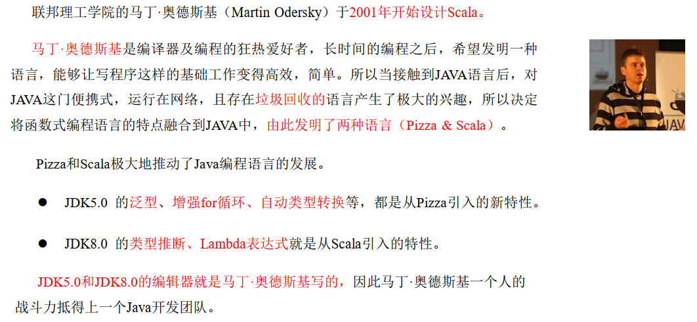

## 1.3 Scala和Java关系

一般来说，学 Scala 的人，都会 Java，而 Scala 是基于 Java 的，因此我们需要将 Scala和 Java 以及 JVM 之间的关系搞清楚，否则学习 Scala 你会蒙圈 。

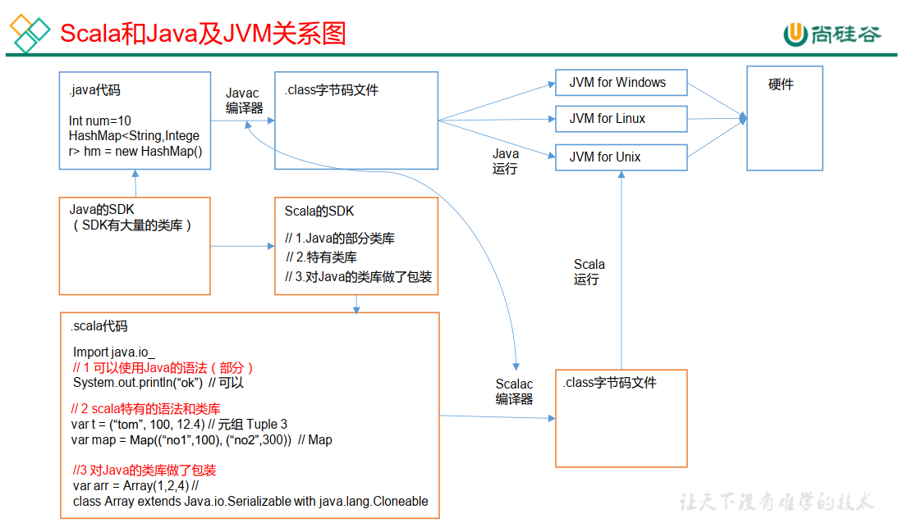

## 1.4 Scala语言特点

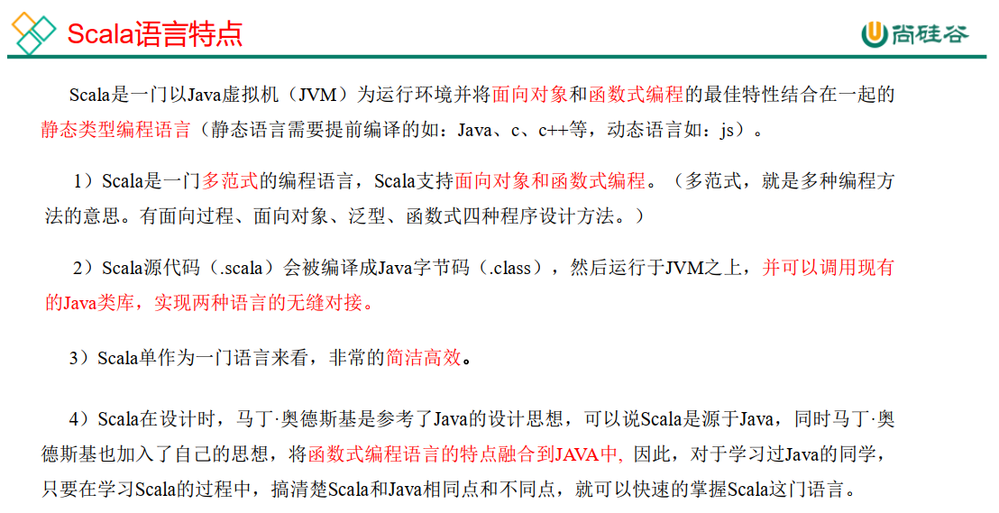

## 1.5 环境搭建

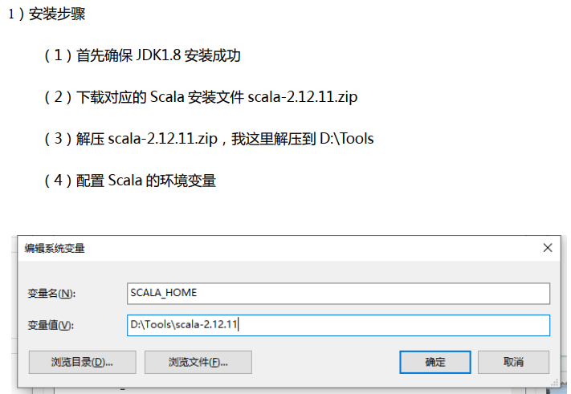

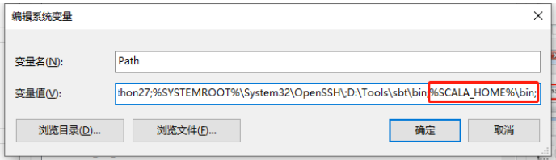

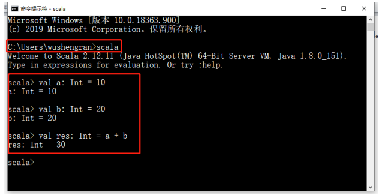

idea 插件安装

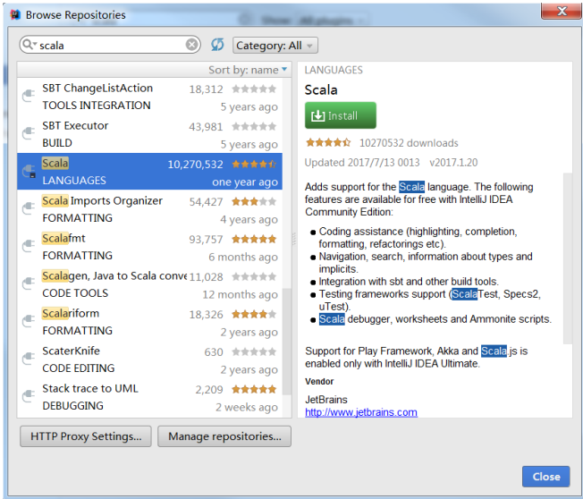

## 1.6 HelloWord案例

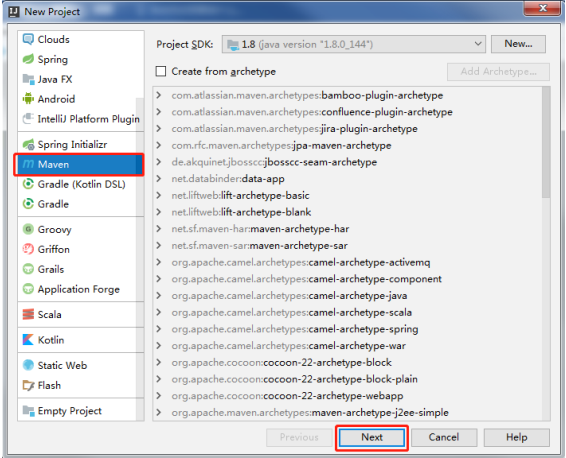

默认下， Maven 不支持 Scala 的开发，需要引入 Scala 框架。  在项目上， 点击右键-> Add Framework Support... ->选择 Scala->点击 OK  

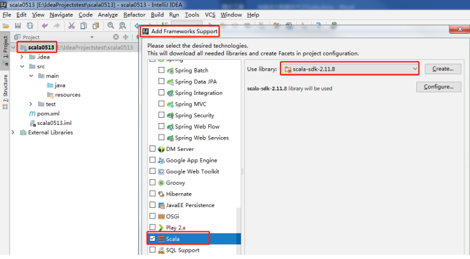

创建项目的源文件目录 

右键点击 main 目录->New->点击 Diretory -> 写个名字（比如 scala）。
右键点击 scala 目录->Mark Directory as->选择 Sources root， 观察文件夹颜色发生变化。  

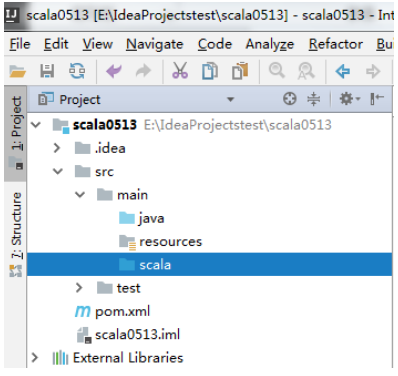

右键点击 scala 目录->New->Package->输入 com.atguigu.chapter01->点击 OK。
右键点击 com.atguigu.chapter01->New->Scala Class->Kind 项选择 Object->Name 项输入Hello。  

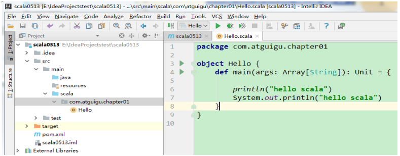

> 说明： Java 中部分代码也是可以在 Scala 中运行。  

## 1.7 class和object说明

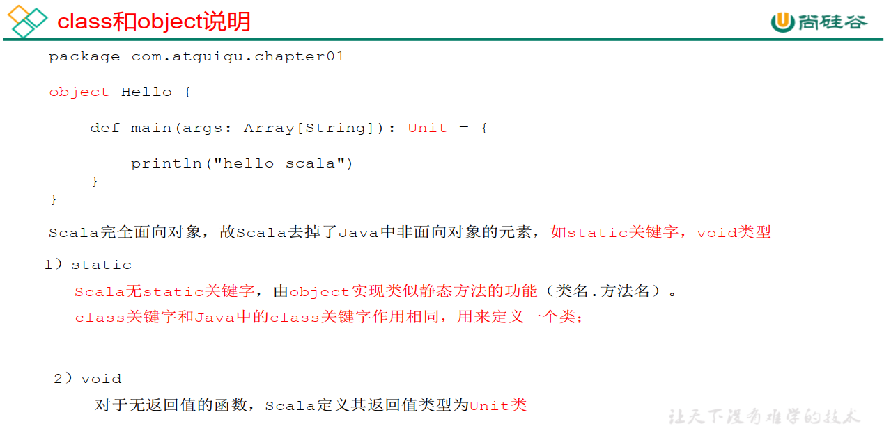

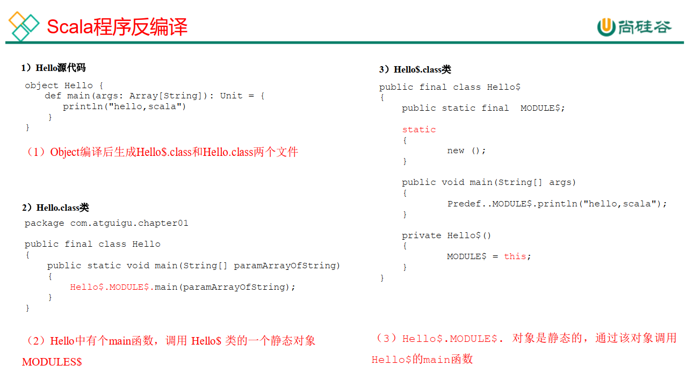

**概念**

1. 用class修饰的为伴生类，与java中的类相似，用object的修饰的为伴生对象，为的是解决scala中没有static关键字的问题。
2. scala中的类不能定义静态成员，而代之以定义单例对象来替代
3. 单例对象通过object关键字来声明
4. 单例对象中的属性可以直接使用类名进行调用；伴生类中的属性，需要先实例化对象，才能够进行调用。
5. 
   一个单例对象可以绑定在一个类，当单例对象和某个类写在同一个源文件且共享一个名字，它们就产生了绑定关系。此时单例对象称之为该类的伴生对象，类称之为该对象的伴生类。
6. 伴生类与伴生对象可相互访问各自私有成员
7. 伴生对象可为伴生类增加静态成员

```scala
object Student{
  val school: String = "atguigu"
    
  def main(args: Array[String]): Unit = {
    val zs = new Student("zs", 20);
    zs.printInfo()
  }
}

class Student(name: String, age: Int) {
  def printInfo(): Unit = {
    println(name + " " + age + " " + Student.school)
  }
}
```

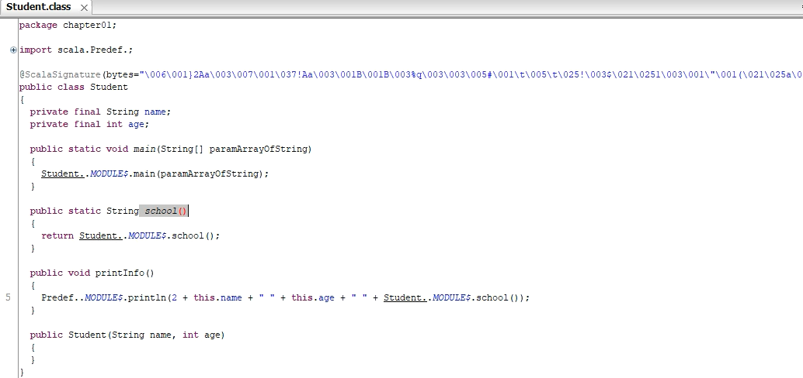

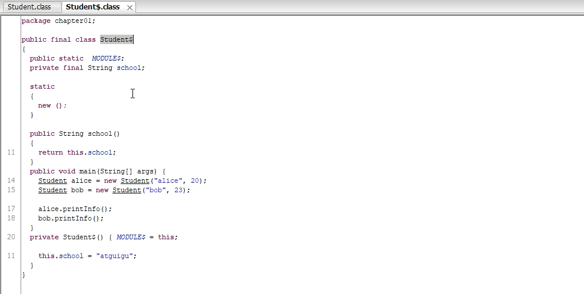

如上，scala的设计者认为java中有`static`关键字，所修饰的是面向类的，而不是面向对象的，认为这不是真正的面向对象，所以在scala中将`static`关键字删掉了，但为了实现类似scala中的功能，引入了伴生对象的概念。

**注意：**

* 由于 `static`定义的类和对象破坏了 面向对象编程的规范完整性，因此scala 在设计之初就没有**static**关键字概念，类相关的**静态属性**都放在伴生对象`object`中。简单理解：`object`就是java中的static部分，定义的是类中静态属性。
* **当同一个文件内**同时存在`object x`和`class x`的声明时：我们称`class x`称作`object x`的**伴生类**。其`object x`称作`class x`的**伴生对象**。
* 在scala里，类和伴生对象之间没有界限——它们可以互相访问彼此的`private`字段和`private`方法。
* 
  伴生对象不能`new`，所以也没有构造参数，可以把伴生对象当做java中可能会用到的静态方法工具类。作为程序入口的方法必须是静态的，所以main方法必须处在一个伴生对象中，而不能写在伴生类中。
* 在编译时，伴生类`class x`被编译成了`x.class`，而伴生对象`object x`被编译成了`x$.class`。
* 单例对象在第一次被访问时才会被初始化，来自于`scala`自带的predef包。

# 第 2 章 变量和数据类型

## 2.1 注释

Scala 注释使用和 Java 完全一样。  

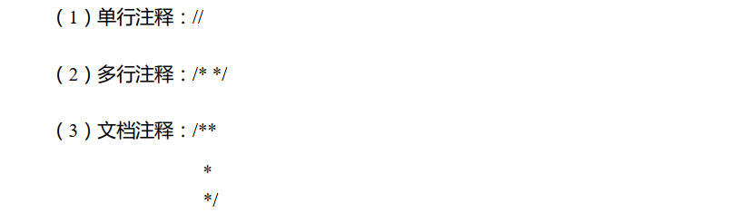

## 2.2 变量和常量（重点）

常量：在程序执行的过程中，其值不会被改变的变量  

0）回顾： Java 变量和常量语法
	变量类型 变量名称 = 初始值 int a = 10
	final 常量类型 常量名称 = 初始值 final int b = 20  

1）基本语法
	var 变量名 [: 变量类型] = 初始值 var i:Int = 10
	val 常量名 [: 常量类型] = 初始值 val j:Int = 20

> **注意： 能用常量的地方不用变量**

2）案例实操
（1）声明变量时，类型可以省略，编译器自动推导，即类型推导。
（2）类型确定后，就不能修改，说明 Scala 是强数据类型语言。
（3）变量声明时，必须要有初始值。
（4）在声明/定义一个变量时，可以使用 var 或者 val 来修饰， var 修饰的变量可改变，val 修饰的变量不可改。  

```scala
package com.atguigu.chapter02
object TestVar {
	def main(args: Array[String]): Unit = {
        //（1）声明变量时，类型可以省略，编译器自动推导，即类型推导
        var age = 18
        age = 30
        //（2）类型确定后，就不能修改，说明 Scala 是强数据类型语言。
        // age = "tom" // 错误
        //（3）变量声明时，必须要有初始值
        // var name //错误
        //（4）在声明/定义一个变量时，可以使用 var 或者 val 来修饰， var 修饰的变量可改变， val 修饰的变量不可改。
        var num1 = 10 // 可变
        val num2 = 20 // 不可变
        num1 = 30 // 正确
        //num2 = 100 //错误，因为 num2 是 val 修饰的
    }
}
```

（5） var 修饰的对象引用可以改变， val 修饰的对象则不可改变，但对象的状态（值）却是可以改变的。（比如：自定义对象、数组、集合等等）  

```scala
object TestVar {
	def main(args: Array[String]): Unit = {
        // p1 是 var 修饰的， p1 的属性可以变，而且 p1 本身也可以变
        var p1 = new Person()
        p1.name = "dalang"
        p1 = null
        // p2 是 val 修饰的，那么 p2 本身就不可变（即 p2 的内存地址不能变），但是， p2 的属性是可以变，因为属性并没有用 val 修饰。
        val p2 = new Person()
        p2.name="jinlian"
        // p2 = null // 错误的，因为 p2 是 val 修饰的
    }
}
class Person{
    var name : String = "jinlian"
}
```

## 2.3 标识符的命名规范

Scala 对各种变量、 方法、 函数等命名时使用的字符序列称为标识符。即： 凡是自己可以起名字的地方都叫标识符。  

1）命名规则
Scala 中的标识符声明， 基本和 Java 是一致的，但是细节上会有所变化，有以下三种规则：  

（1）以字母或者下划线开头，后接字母、数字、下划线  

（2）以操作符开头，且只包含操作符（ + - * / # !等）

（3）用反引号`....`包括的任意字符串，即使是 Scala 关键字（ 39 个）也可以  

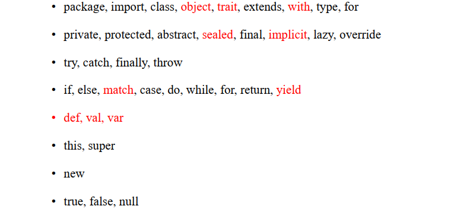

2）案例实操  

需求： 判断 hello、 Hello12、 1hello、 h-b、 x h、 h_4、 _ab、 Int、 _、 +*-/#!、 +*-/#!1、 if、`if`，这些名字是否合法。  

```scala
object TestName {
	def main(args: Array[String]): Unit = {
        //（1）以字母或者下划线开头，后接字母、数字、下划线
        var hello: String = "" // ok
        var Hello12: String = "" // ok
        var 1hello: String = "" // error 数字不能开头
        var h-b: String = "" // error 不能用-
        var x h: String = "" // error 不能有空格
        var h_4: String = "" // ok
        var _ab: String = "" // ok
        var Int: String = "" // ok 因为在 Scala 中 Int 是预定义的字符,不是关键字，但不推荐
        var _: String = "hello" // ok 单独一个下划线不可以作为标识符，因为_被认为是一个方法
        println(_)
        //（2）以操作符开头，且只包含操作符（ + - * / # !等）
        var +*-/#! : String = "" // ok
        var +*-/#!1 : String = "" // error 以操作符开头，必须都是操作符
        //（3）用反引号`....`包括的任意字符串，即使是 Scala 关键字（ 39 个）也可以
        var if : String = "" // error 不能用关键字
        var `if` : String = "" // ok 用反引号`....`包括的任意字符串,包括关键字
    }
}
```

## 2.4 字符串输出

1）基本语法
（1）字符串，通过+号连接
（2）printf 用法：字符串，通过%传值。

- %d 数值类型
- %s 字符串类型
- %f 浮点型

（3）字符串模板（插值字符串） ： 通过$获取变量值  

2） 案例实操  

```scala
package com.atguigu.chapter02
object TestCharType {
    def main(args: Array[String]): Unit = {
        var name: String = "jinlian"
        var age: Int = 18
        //（1） 字符串，通过 + 号连接
        println(name + " " + age)
        println(name * 3)
        //（2） printf 用法字符串，通过%传值。
        printf("name=%s age=%d\n", name, age)
        //（3） 字符串模版，通过$引用
        // 文字 's'  插值器允许在处理字符串时使用变量，println语句中将String变量（$name）附加到普通字符串中,并且可以嵌入表达式
        println(s"${age}岁的${name}")
        println(s"${age}岁的$name")
	    val num = 2.3443252
        // 文字 'f' 插值器允许创建一个格式化的字符串模板, 类似c语言中的printf
        println(f"The num is ${num}%2.2f")
        // 文字 'raw' 能让字符串原原本本的输出来，而不是产生控制效果
    	println(raw"The num is ${num}%2.2f")
        // 多行字符串，在 Scala中，利用三个双引号包围多行字符串就可以实现。
        // 输入的内容，带有空格、 \t 之类，导致每一行的开始位置不能整洁对齐。
        // 应用 scala 的 stripMargin 方法，在 scala 中 stripMargin 默认是“|”作为连接符， //在多行换行的行头前面加一个“|”符号即可。
        val s =
        """
        |select
        | name,
        | age
        |from user
        |where name="zhangsan"
        """.stripMargin
        println(s)
        // 如果需要对变量进行运算，那么可以加${}
        val s1 =
        s"""
        |select
        | name,
        | age
        |from user
        |where name="$name" and age=${age+2}
        """.stripMargin
        println(s1)
        val s2 = s"name=$name"
        println(s2)
    }
}
```

## 2.5 键盘输入

在编程中，需要接收用户输入的数据，就可以使用键盘输入语句来获取。  

1）基本语法
	StdIn.readLine()、 StdIn.readShort()、 StdIn.readDouble()  

2）案例实操  

需求：可以从控制台接收用户信息，【姓名，年龄，薪水】  

```scala
import scala.io.StdIn
object TestInput {
    def main(args: Array[String]): Unit = {
        // 1 输入姓名
        println("input name:")
        var name = StdIn.readLine()
        // 2 输入年龄
        println("input age:")
        var age = StdIn.readShort()
        // 3 输入薪水
        println("input sal:")
        var sal = StdIn.readDouble()
        // 4 打印
        println("name=" + name)
        println("age=" + age)
        println("sal=" + sal)
    }
}
```

## 2.6 读写文件

```scala
import java.io.{File, PrintWriter}

import scala.io.Source

object Test_FileIO {
  def main(args: Array[String]): Unit = {
    // 1.从文件中读取数据
    Source.fromFile("src\\main\\resources\\test.txt").foreach(print)

    // 2.将数据写入文件
    val writer = new PrintWriter(new File("src\\main\\resources\\output.txt"))
    writer.write("hello scala from java writer")
    writer.close()
  }
}
```

## 2.7 数据类型（重点）

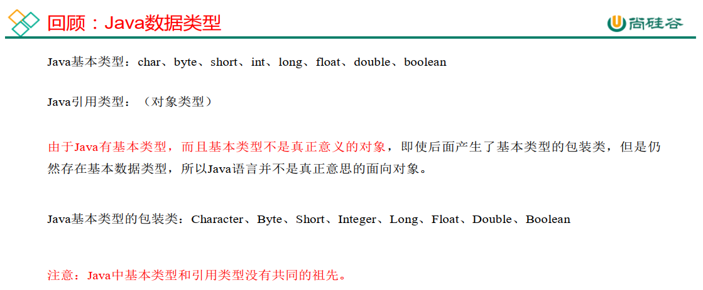

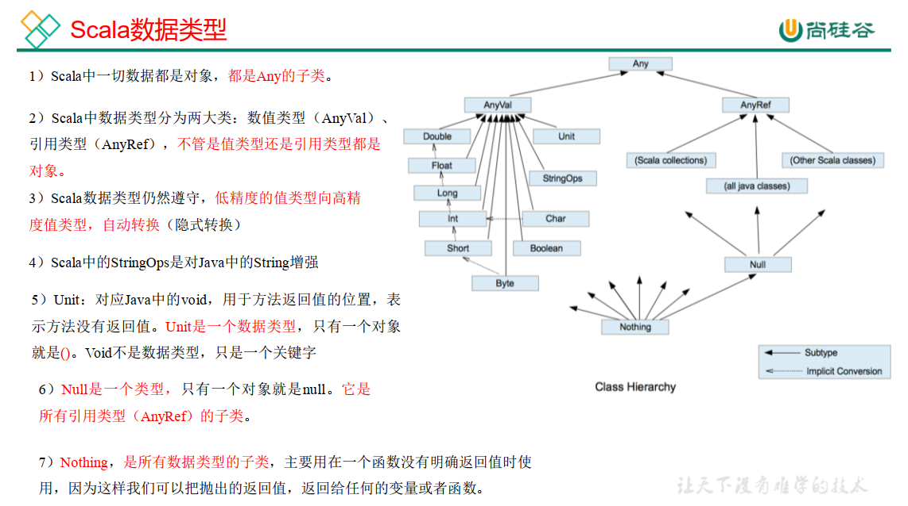

## 2.8 整数类型（Byte、 Short、 Int、 Long）  

Scala 的整数类型就是用于存放整数值的，比如 12， 30， 3456 等等。  

1）整型分类  

| 数据类型  | 描述                                                         |
| --------- | ------------------------------------------------------------ |
| Byte [1]  | 8 位有符号补码整数。数值区间为 -128 到 127                   |
| Short [2] | 16 位有符号补码整数。数值区间为 -32768 到 32767              |
| Int [4]   | 32 位有符号补码整数。数值区间为 -2147483648 到 2147483647    |
| Long [8]  | 64 位有符号补码整数。数值区间为 -9223372036854775808 到 9223372036854775807 = 2 的(64-1)次方-1 |

2）案例实操  

（1） Scala 各整数类型有固定的表示范围和字段长度，不受具体操作的影响，以保证Scala 程序的可移植性。  

```scala
object TestDataType {
    def main(args: Array[String]): Unit = {
        // 正确
        var n1:Byte = 127
        var n2:Byte = -128
        // 错误
        // var n3:Byte = 128
        // var n4:Byte = -129
    }
}
```

（2） Scala 的整型，默认为 Int 型，声明 Long 型，须后加`l`或`L`

```scala
object TestDataType {
    def main(args: Array[String]): Unit = {
        var n5 = 10
        println(n5)
        var n6 = 9223372036854775807L
        println(n6)
        // val a5: Long = 123131321323123 因为默认为Int ，Int和规定的Long不匹配还是会报错
        
        val b1: Byte = 10
        val b2: Byte = 10 + 20 // 涉及到自动类型提升，编译器可以自定判断是否超出范围
        println(b2)
        // val b3: Byte = (b1 +20) //报错，编译器识别出了b1为Byte类型,要进行自动类型提升
        val b3: Byte = (b1 + 20).toByte // 解决类型不匹配的问题，进行强转就可以了
        println(b3)
    }
}
```

（3） Scala 程序中变量常声明为 Int 型，除非不足以表示大数，才使用 Long  

## 2.9 浮点类型（Float、 Double）  

Scala 的浮点类型可以表示一个小数，比如 123.4f， 7.8， 0.12 等等。  

1）浮点型分类  

| 数据类型   | 描述                               |
| ---------- | ---------------------------------- |
| Float [4]  | 32 位, IEEE 754 标准的单精度浮点数 |
| Double [8] | 64 位 IEEE 754 标准的双精度浮点数  |

2）案例实操  

Scala 的浮点型常量默认为 Double 型，声明 Float 型常量，须后加`f`或`F`。  

```scala
object TestDataType {
    def main(args: Array[String]): Unit = {
        // 建议，在开发中需要高精度小数时，请选择 Double
        var n7 = 2.2345678912f
        var n8 = 2.2345678912
        println("n7=" + n7)
        println("n8=" + n8)
    }
}
```

运行的结果 :

```properties
n7=2.2345679
n8=2.2345678912
```

## 2.10 字符类型（Char）  

1）基本说明  

字符类型可以表示单个字符，字符类型是 Char。  

2）案例实操  

（1）字符常量是用单引号 ' ' 括起来的单个字符。
（2） \t ：一个制表位，实现对齐的功能
（3） \n ：换行符
（4） \\ ：表示\
（5） \" ：表示"  

```scala
object TestCharType {
    def main(args: Array[String]): Unit = {
        // 字符常量是用单引号 ' ' 括起来的单个字符。
        var c1: Char = 'a'
        println("c1=" + c1)
        // 注意：这里涉及自动类型提升，其实编译器可以自定判断是否超出范围，
        // 不过 idea 提示报错
        var c2:Char = 'a' + 1
        println(c2)
        // 控制字符
        val c3: Char = '\t' //制表符
        val c4: Char = '\n' //换行符
        println("abc" + c3 + "def")
        println("abc" + c4 + "def")
        // 转义字符
        val c5 = '\\'
        println(c5)
        val c6 = '\"'
        println(c6)

        // 字符变量底层保存ASCII码
        val i1: Int = c1 //自动类型提升 Char -> Int
        println(i1)

        val c8: Char =(i1 +1).toChar
        println(c8)
    }
}
```

## 2.11 Unit类型、Null类型和Nothing类型（重点）

1）基本说明

| 数据类型 | 描述                                                         |
| -------- | ------------------------------------------------------------ |
| Unit     | 表示无值，和其他语言中 void 等同。用作不返回任何结果的方法的结果类型。 Unit 只有一个实例值，写成()。 |
| Null     | null , Null 类型只有一个实例值 null，是所有引用类型的子类    |
| Nothing  | Nothing 类型在 Scala 的类层级最低端；它是任何其他类型的子类型。 当一个函数，我们确定没有正常的返回值，可以用 Nothing 来指定返回类 型，这样有一个好处，就是我们可以把返回的值（异常）赋给其它的函数 或者变量（兼容性） |

2）案例实操

（1） Unit 类型用来标识过程，也就是没有明确返回值的函数。  

由此可见， Unit 类似于 Java 里的 void。 Unit 只有一个实例——( )，这个实例也没有实质意义  

```scala
object TestSpecialType {
    def main(args: Array[String]): Unit = {
        def sayOk : Unit = {// unit 表示没有返回值，即 void
        }
        println(sayOk)
    }
}
```

（2） Null 类只有一个实例对象， Null 类似于 Java 中的 null 引用。 Null 可以赋值给任意引用类型（ AnyRef），但是不能赋值给值类型（ AnyVal）  

```scala
object TestDataType {
	def main(args: Array[String]): Unit = {
        //null 可以赋值给任意引用类型（ AnyRef），但是不能赋值给值类型(AnyVal)
        var cat = new Cat();
        cat = null // 正确
        var n1: Int = null // 错误
        println("n1:" + n1)
    }
}
class Cat {
}
```

（3） Nothing，可以作为没有正常返回值的方法的返回类型，非常直观的告诉你这个方法不会正常返回，而且由于 Nothing 是其他任意类型的子类，他还能跟要求返回值的方法兼容。  

```scala
object TestSpecialType {
    def main(args: Array[String]): Unit = {
        def test(): Nothing = {
            throw new Exception()
        }
        test
	}
}
```

## 2.12 类型转换（重点）

### 2.12.1 数值类型自动转换  

当 Scala 程序在进行赋值或者运算时，精度小的类型自动转换为精度大的数值类型，这个就是自动类型转换（隐式转换）。数据类型按精度（容量）大小排序为：  

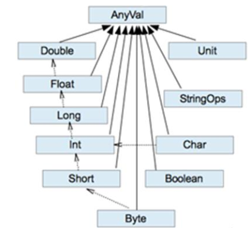

1） 基本说明  

（1）自动提升原则：有多种类型的数据混合运算时，系统首先自动将所有数据转换成精度大的那种数据类型，然后再进行计算。
（2）把精度大的数值类型赋值给精度小的数值类型时，就会报错，反之就会进行自动类型转换。
（3）(byte， short)和 char 之间不会相互自动转换。
（4）byte，short，char 他们三者可以计算， 在计算时首先转换为 int 类型。  

2） 案例实操  

```scala
object TestValueTransfer {
    def main(args: Array[String]): Unit = {
        //（1）自动提升原则：有多种类型的数据混合运算时，系统首先自动将所有数据转换成精度大的那种数值类型，然后再进行计算。
        var n = 1 + 2.0
        println(n) // n 就是 Double
        //（2）把精度大的数值类型赋值给精度小的数值类型时，就会报错，反之就会进行自动类型转换。
        var n2 : Double= 1.0
        //var n3: Int = n2 //错误，原因不能把高精度的数据直接赋值和低精度。
        //（3）（byte，short）和 char 之间不会相互自动转换。
        var n4 : Byte = 1
        //var c1: Char = n4 //错误
        var n5:Int = n4
        //（4） byte，short， char 他们三者可以计算，在计算时首先转换为 int类型。
        var n6 : Byte = 1
        var c2 : Char = 1
        // var n: Short = n6 + c2 //当 n6 + c2 结果类型就是 int
        // var n7: Short = 10 + 90 //错误
    }
}
```

### 2.12.2 强制类型转换

1） 基本说明  

自动类型转换的逆过程，将精度大的数值类型转换为精度小的数值类型。使用时要加上强制转函数，但可能造成精度降低或溢出，格外要注意。  

```scala
Java : int num = (int)2.5
Scala : var num : Int = 2.7.toInt
```

2） 案例实操  

（1）将数据由高精度转换为低精度，就需要使用到强制转换
（2）强转符号只针对于最近的操作数有效，往往会使用小括号提升优先级  

```scala
object TestForceTransfer {
    def main(args: Array[String]): Unit = {
        //（1）将数据由高精度转换为低精度，就需要使用到强制转换
        var n1: Int = 2.5.toInt // 这个存在精度损失
        //（2）强转符号只针对于最近的操作数有效，往往会使用小括号提升优先级
        var r1: Int = 10 * 3.5.toInt + 6 * 1.5.toInt // 10 *3 + 6*1 = 36
        var r2: Int = (10 * 3.5 + 6 * 1.5).toInt // 44.0.toInt =44
        println("r1=" + r1 + " r2=" + r2)
    }
}
```

### 2.12.3 数值类型和 String 类型间转换  

1） 基本说明
在程序开发中，我们经常需要将基本数值类型转成 String 类型。或者将 String 类型转成基本数值类型。  

2）案例实操  

（1）基本类型转 String 类型（语法： 将基本类型的值+"" 即可）
（2） String 类型转基本数值类型（语法： s1.toInt、 s1.toFloat、 s1.toDouble、 s1.toByte、  s1.toLong、 s1.toShort）  

```scala
object TestStringTransfer {
    def main(args: Array[String]): Unit = {
        //（1）基本类型转 String 类型（语法：将基本类型的值+"" 即可）
        var str1 : String = true + ""
        var str2 : String = 4.5 + ""
        var str3 : String = 100 +""
        //（2）String 类型转基本数值类型（语法：调用相关 API）
        var s1 : String = "12"
        var n1 : Byte = s1.toByte
        var n2 : Short = s1.toShort
        var n3 : Int = s1.toInt
        var n4 : Long = s1.toLong
    }
}
```

（3）注意事项  

在将 String 类型转成基本数值类型时，要确保 String 类型能够转成有效的数据，比如我们可以把"123"，转成一个整数，但是不能把"hello"转成一个整数。  

var n5:Int = "12.6".toInt 会出现 NumberFormatException 异常。  

拓展：

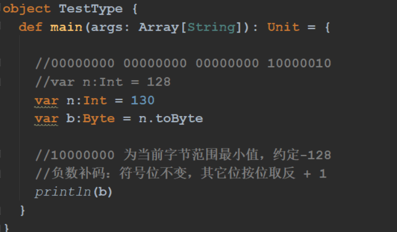

# 第 3 章 运算符

Scala 运算符的使用和 Java 运算符的使用基本相同， 只有个别细节上不同。  

## 3.1 算术运算符

1）基本语法  

| 运算符 | 运算       | 范例       | 结果    |
| ------ | ---------- | ---------- | ------- |
| +      | 正号       | +3         | 3       |
| -      | 负号       | b=4; -b    | -4      |
| +      | 加         | 5+5        | 10      |
| -      | 减         | 6-4        | 2       |
| *      | 乘         | 3*4        | 12      |
| /      | 除         | 5/5        | 1       |
| %      | 取模(取余) | 7%5        | 2       |
| +      | 字符串相加 | “He”+”llo” | “Hello” |

（1）对于除号“/”，它的整数除和小数除是有区别的：整数之间做除法时，只保留整数部分而舍弃小数部分。
（2）对一个数取模 a%b，和 Java 的取模规则一样。  

2）案例实操  

```scala
object TestArithmetic {
    def main(args: Array[String]): Unit = {
        //（1）对于除号“/”，它的整数除和小数除是有区别的：整数之间做除法
        时，只保留整数部分而舍弃小数部分。
        var r1: Int = 10 / 3 // 3
        println("r1=" + r1)
        var r2: Double = 10 / 3 // 3.0
        println("r2=" + r2)
        var r3: Double = 10.0 / 3 // 3.3333
        println("r3=" + r3)
        println("r3=" + r3.formatted("%.2f")) // 含义：保留小数点 2位，使用四舍五入
        //（2）对一个数取模 a%b，和 Java 的取模规则一样。
        var r4 = 10 % 3 // 1
        println("r4=" + r4)
    }
}
```

## 3.2 关系运算符（比较运算符）  

1）基本语法  

| 运算符 | 运算     | 范例   | 结果  |
| ------ | -------- | ------ | ----- |
| ==     | 相等于   | 4==3   | false |
| !=     | 不等于   | 4！ =3 | true  |
| <      | 小于     | 4<3    | false |
| >      | 大于     | 4>3    | true  |
| <=     | 小于等于 | 4<=3   | false |
| >=     | 大于等于 | 4>=3   | true  |

2）案例实操  

（1）需求 1：  

```scala
object TestRelation {
    def main(args: Array[String]): Unit = {
        // 测试： >、 >=、 <=、 <、 ==、 !=
        var a: Int = 2
        var b: Int = 1
        println(a > b) // true
        println(a >= b) // true
        println(a <= b) // false
        println(a < b) // false
        println("a==b" + (a == b)) // false
        println(a != b) // true
    }
}
```

（2）需求 2： Java 和 Scala 中关于==的区别  

Java：==比较两个变量本身的值，即两个对象在内存中的首地址；equals 比较字符串中所包含的内容是否相同。  

```java
public static void main(String[] args) {
    String s1 = "abc";
    String s2 = new String("abc");
    System.out.println(s1 == s2);
    System.out.println(s1.equals(s2));
}
// 输出结果：
// false
// true
```

Scala： ==更加类似于 Java 中的 equals， 参照 jd 工具  

```scala
def main(args: Array[String]): Unit = {
    val s1 = "abc"
    val s2 = new String("abc")
    println(s1 == s2)
    println(s1.eq(s2))
}
// 输出结果：
// true
// false
```

## 3.3 逻辑运算符  

1）基本语法
用于连接多个条件（一般来讲就是关系表达式），最终的结果也是一个 Boolean 值。
假定：变量 A 为 true， B 为 false  

| 运算符 | 描述   | 实例                       |
| ------ | ------ | -------------------------- |
| &&     | 逻辑与 | (A && B) 运算结果为 false  |
| \|\|   | 逻辑或 | (A \|\| B) 运算结果为 true |
| !      | 逻辑非 | !(A && B) 运算结果为 true  |

2）案例实操  

```scala
object TestLogic {
    def main(args: Array[String]): Unit = {
        // 测试： &&、 ||、 !
        var a = true
        var b = false
        println("a&&b=" + (a && b)) // a&&b=false
        println("a||b=" + (a || b)) // a||b=true
        println("!(a&&b)=" + (!(a && b))) // !(a&&b)=true
    }
}
// 扩展避免逻辑与空指针异常
isNotEmpty(String s){
    // 如果按位与，s 为空，会发生空指针
    return s!=null && !"".equals(s.trim());
}
```

## 3.4 赋值运算符  

1）基本语法  

赋值运算符就是将某个运算后的值，赋给指定的变量  

| 运算符 | 描述                                            | 实例                                   |
| ------ | ----------------------------------------------- | -------------------------------------- |
| =      | 简单的赋值运算符，将一个表 达式的值赋给一个左值 | C = A + B 将 A + B 表达式结果赋 值给 C |
| +=     | 相加后再赋值                                    | C += A 等于 C = C + A                  |
| -=     | 相减后再赋值                                    | C -= A 等于 C = C - A                  |
| *=     | 相乘后再赋值                                    | C *= A 等于 C = C * A                  |
| /=     | 相除后再赋值                                    | C /= A 等于 C = C / A                  |
| %=     | 求余后再赋值                                    | C %= A 等于 C = C % A                  |
| <<=    | 左移后赋值                                      | C <<= 2 等于 C = C << 2                |
| >>=    | 右移后赋值                                      | C >>= 2 等于 C = C >> 2                |
| &=     | 按位与后赋值                                    | C &= 2 等于 C = C & 2                  |
| ^=     | 按位异或后赋值                                  | C ^= 2 等于 C = C ^ 2                  |
| \|=    | 按位或后赋值                                    | C \|= 2 等于 C = C \| 2                |

2）案例实操  

```scala
object TestAssignment {
    def main(args: Array[String]): Unit = {
        var r1 = 10
        r1 += 1 // 没有++
        r1 -= 2 // 没有--
    }
}
```

## 3.5 位运算符  

1）基本语法  

下表中变量 a 为 60， b 为 13。  

| 运算符 | 描述           | 实例                                                         |
| ------ | -------------- | ------------------------------------------------------------ |
| &      | 按位与运算符   | (a & b) 输出结果 12 ，二进制解释： 0000 1100                 |
| \|     | 按位或运算符   | (a \| b) 输出结果 61 ，二进制解释： 0011 1101                |
| ^      | 按位异或运算符 | (a ^ b) 输出结果 49 ，二进制解释： 0011 0001                 |
| ~      | 按位取反运算符 | (~a ) 输出结果 -61 ，二进制解释： 1100 0011， 在 一个有符号二进制数的补码形式。 |
| <<     | 左移动运算符   | a << 2 输出结果 240 ，二进制解释： 0011 0000                 |
| >>     | 右移动运算符   | a >> 2 输出结果 15 ，二进制解释： 0000 1111                  |
| >>>    | 无符号右移     | a >>>2 输出结果 15, 二进制解释: 0000 1111                    |

2）案例实操  

```scala
object TestPosition {
    def main(args: Array[String]): Unit = {
        // 测试： 1000 << 1 =>10000
        var n1 :Int =8
        n1 = n1 << 1
        println(n1)
    }
}
```

## 3.6 Scala 运算符本质  

在 Scala 中其实是没有运算符的， 所有运算符都是方法。
1） 当调用对象的方法时， 点.可以省略
2） 如果函数参数只有一个，或者没有参数， ()可以省略  

```scala
object TestOpt {
    def main(args: Array[String]): Unit = {
        // 标准的加法运算
        val i:Int = 1.+(1) // 将运算法当做成方法进行计算 ,合成方法，编译器自动生成，绕开JVM的限制
        //（1）当调用对象的方法时， .可以省略
        val j:Int = 1 + (1)
        //（2）如果函数参数只有一个，或者没有参数， ()可以省略
        val k:Int = 1 + 1
        println(1.toString())
        println(1 toString())
        println(1 toString)
        println(1 toint)
    }
}
```

# 第 4 章 流程控制  

## 4.1 分支控制 if-else  

让程序有选择的的执行，分支控制有三种：单分支、双分支、多分支  

### 4.1.1 单分支  

1）基本语法  

```scala
if (条件表达式) {
	执行代码块
}
```

说明：当条件表达式为 ture 时，就会执行{ }的代码  

2）案例实操  

需求：输入人的年龄，如果该同志的年龄小于 18 岁，则输出“童年  

```scala
object TestIfElse {
    def main(args: Array[String]): Unit = {
        println("input age:")
        var age = StdIn.readShort()
        if (age < 18){
        	println("童年")
        }
    }
}
```

### 4.1.2 双分支  

1）基本语法  

```scala
if (条件表达式) {
	执行代码块 1
} else {
	执行代码块 2
}
```

2）案例实操  

需求：输入年龄，如果年龄小于 18 岁，则输出“童年”。否则，输出“成年”  。

```scala
object TestIfElse {
    def main(args: Array[String]): Unit = {
        println("input age:")
        var age = StdIn.readShort()
        if (age < 18){
        	println("童年")
        }else{
       	 	println("成年")
        }
    }
}
```

### 4.1.3 多分支  

1）基本语法  

```scala
if (条件表达式 1) {
	执行代码块 1
}
else if (条件表达式 2) {
	执行代码块 2
}
……
else {
	执行代码块 n
}
```

2）案例实操  

（1）需求 1： 需求：输入年龄，如果年龄小于 18 岁，则输出“童年”。如果年龄大于等于 18 且小于等于 30， 则输出“中年”，否则，输出“老年”。  

```scala
object TestIfElse {
    def main(args: Array[String]): Unit = {
        println("input age")
        var age = StdIn.readInt()
        if (age < 18){
        	println("童年")
        }else if(age>=18 && age<30){
        	println("中年")
        }else{
        	println("老年")
        }
    }
}
```

（2）需求 2： Scala 中 if else 表达式其实是有返回值的，**具体返回值取决于满足条件的代码体的最后一行内容**。  

```scala
object TestIfElse {
    def main(args: Array[String]): Unit = {
        println("input age")
        var age = StdIn.readInt()
        val res :String = if (age < 18){
        	"童年"
        }else if(age>=18 && age<30){
        	"中年"
        }else{
        	"老年"
        }
        println(res)
    }
}
```

（3）需求 3： Scala 中返回值类型不一致，取它们共同的祖先类型。  

```scala
object TestIfElse {
    def main(args: Array[String]): Unit = {
        println("input age")
        var age = StdIn.readInt()
        val res:Any = if (age < 18){
        	"童年"
        }else if(age>=18 && age<30){
        	"中年"
        }else{
        	100
        }
        println(res)
    }
}
```

（4）需求 4： Java 中的三元运算符可以用 if else 实现  

如果大括号{}内的逻辑代码只有一行，大括号可以省略。 如果省略大括号， if 只对最近的一行逻辑代码起作用。  

```scala
object TestIfElse {
    def main(args: Array[String]): Unit = {
        // Java
        // int result = flag?1:0
        // Scala
        println("input age")
        var age = StdIn.readInt()
        val res:Any = if (age < 18) "童年" else "成年"
        "不起作用"
        println(res)
    }
}
```

## 4.2 嵌套分支  

在一个分支结构中又完整的嵌套了另一个完整的分支结构，里面的分支的结构称为内层。分支外面的分支结构称为外层分支。嵌套分支不要超过 3 层。  

1）基本语法  

```scala
if()
{
    if()
    {}
    else
    {}
}
```

2）案例实操  

需求： 如果输入的年龄小于 18， 返回“童年”。 如果输入的年龄大于等于 18， 需要再判断： 如果年龄大于等于 18 且小于 30， 返回“中年”； 如果其他，返回“老年”。  

```scala
object TestIfElse {
    def main(args: Array[String]): Unit = {
        println("input age")
        var age = StdIn.readInt()
        val res :String = if (age < 18){
        	"童年"
        }else {
            if(age>=18 && age<30){
                "中年"
            }else{
                "老年"
            }
        }
        println(res)
    }
}
```

## 4.3 Switch 分支结构  

在 Scala 中没有 Switch，而是使用模式匹配来处理。模式匹配涉及到的知识点较为综合，因此我们放在后面讲解。  

## 4.4 For 循环控制  

Scala 也为 for 循环这一常见的控制结构提供了非常多的特性，这些 for 循环的特性被称为 for 推导式或 for 表达式。  

### 4.4.1 范围数据循环（ To）  

1）基本语法  

```scala
for(i <- 1 to 3){
	print(i + " ")
}
println()
```

（1）i 表示循环的变量， <-  初始 to  终止

（2）i 将会从 1-3 循环， 前后闭合  

2）案例实操  

需求： 输出 5 句 "宋宋，告别海狗人参丸吧"  

```scala
object TestFor {
    def main(args: Array[String]): Unit = {
        for(i <- 1 to 5){
        	println("宋宋，告别海狗人参丸吧"+i)
        }
    }
}
```

### 4.4.2 范围数据循环（ Until）  

1）基本语法  

```scala
for(i <- 1 until 3) {
	print(i + " ")
}
println()
```

（1）这种方式和前面的区别在于 i 是从 1 到 3-1
（2）即使前闭合后开的范围  

2）案例实操  

需求： 输出 5 句 "宋宋，告别海狗人参丸吧"  

```scala
object TestFor {
    def main(args: Array[String]): Unit = {
        for(i <- 1 until 5 + 1){
        	println("宋宋，告别海狗人参丸吧" + i)
        }
    }
}
```

### 4.4.3 循环守卫  

1）基本语法  

```scala
for(i <- 1 to 3 if i != 2) {
	print(i + " ")
}
println()
```

说明：  

（1）循环守卫，即循环保护式（也称条件判断式，守卫）。保护式为 true 则进入循环体内部，为 false 则跳过，类似于 continue。
（2）上面的代码等价：

```scala
for (i <- 1 to 3){
    if (i != 2) {
    	print(i + " ")
    }
}
```

2）案例实操  

需求： 输出 1 到 5 中，不等于 3 的值  

```scala
object TestFor {
    def main(args: Array[String]): Unit = {
        for (i <- 1 to 5 if i != 3) {
        	println(i + "宋宋")
        }
    }
}
```

### 4.4.4 循环步长  

1）基本语法  

```scala
for (i <- 1 to 10 by 2) {
	println("i=" + i)
}
```

说明： by 表示步长  

2）案例实操  

需求：输出 1 到 10 以内的所有奇数  

```scala
for (i <- 1 to 10 by 2) {
	println("i=" + i)
}
```

输出结果  

```properties
i=1
i=3
i=5
i=7
i=9
```

### 4.4.5 嵌套循环  

1）基本语法  

```scala
for(i <- 1 to 3; j <- 1 to 3) {
	println(" i =" + i + " j = " + j)
}
```

说明： 没有关键字，所以范围后一定要加； 来隔断逻辑  

2）基本语法  

上面的代码等价：

```scala
for (i <- 1 to 3) {
    for (j <- 1 to 3) {
    	println("i =" + i + " j=" + j)
    }
}
```

### 4.4.6 引入变量  

1）基本语法  

```scala
for(i <- 1 to 3; j = 4 - i) {
	println("i=" + i + " j=" + j)
}
```

说明：  

（1） for 推导式一行中有多个表达式时，所以要加 ; 来隔断逻辑
（2） for 推导式有一个不成文的约定：当 for 推导式仅包含单一表达式时使用圆括号，当包含多个表达式时，一般每行一个表达式，并用花括号代替圆括号，如下  

```scala
for {
	i <- 1 to 3
	j = 4 - i
} {
	println("i=" + i + " j=" + j)
}
```

2）案例实操  

上面的代码等价于  

```scala
for (i <- 1 to 3) {
	var j = 4 - i
	println("i=" + i + " j=" + j)
}
```

### 4.4.7 循环返回值  

1）基本语法  

```scala
val res = for(i <- 1 to 10) yield i
println(res)
```

说明：将遍历过程中处理的结果返回到一个新 Vector 集合中，使用 yield 关键字。
**注意：开发中很少使用。**  

2）案例实操  

需求：将原数据中所有值乘以 2， 并把数据返回到一个新的集合中  

```scala
object TestFor {
    def main(args: Array[String]): Unit = {
        var res = for(i <-1 to 10) yield {
        	i * 2
        }
        println(res)
    }
}
```

输出结果：
Vector(2, 4, 6, 8, 10, 12, 14, 16, 18, 20)  

### 4.4.8 倒序打印  

1） 说明：如果想倒序打印一组数据，可以用 reverse。  

2） 案例实操：  

需求：倒序打印 10 到 1  

```scala
for(i <- 1 to 10 reverse){
	println(i)
}
```

## 4.5 While 和 do..While 循环控制  

While 和 do..While 的使用和 Java 语言中用法相同。  

### 4.5.1 While 循环控制  

1）基本语法

循环变量初始化
while (循环条件) {
	循环体(语句)
	循环变量迭代
}

说明：
（1）循环条件是返回一个布尔值的表达式
（2） while 循环是先判断再执行语句
（3）与 for 语句不同， while 语句没有返回值，即整个 while 语句的结果是 Unit 类型()
（4） 因为 while 中没有返回值，所以当要用该语句来计算并返回结果时，就不可避免的使用变量，而变量需要声明在 while 循环的外部，那么就等同于循环的内部对外部的变量造成了影响，所以不推荐使用，而是推荐使用 for 循环。  

2）案例实操  

需求： 输出 10 句 "宋宋，喜欢海狗人参丸"  

```scala
object TestWhile {
    def main(args: Array[String]): Unit = {
        var i = 0
        while (i < 10) {
            println("宋宋，喜欢海狗人参丸" + i)
            i += 1
        }
    }
}
```

### 4.5.2 do..while 循环控制  

1）基本语法

循环变量初始化:
do{
	循环体(语句)
	循环变量迭代
} while(循环条件)

说明
（1）循环条件是返回一个布尔值的表达式
（2） do..while 循环是先执行，再判断  

2）案例实操
需求： 输出 10 句 "宋宋，喜欢海狗人参丸"  

```scala
object TestWhile {
    def main(args: Array[String]): Unit = {
        var i = 0
        do {
            println("宋宋，喜欢海狗人参丸" + i)
            i += 1
        } while (i < 10)
    }
}
```

## 4.6 循环中断  

1）基本说明

Scala 内置控制结构特地去掉了 break 和 continue， 是为了更好的适应函数式编程， 推荐使用函数式的风格解决break和continue的功能，而不是一个关键字。 Scala中使用breakable控制结构来实现 break 和 continue 功能。  

2）案例实操  

需求 1： 采用异常的方式退出循环  

```scala
def main(args: Array[String]): Unit = {
    try {
        for (elem <- 1 to 10) {
            println(elem)
            if (elem == 5) throw new RuntimeException
    	}
    }catch {
    	case e =>
    }
    println("正常结束循环")
}
```

需求 2： 采用 Scala 自带的函数，退出循环  

```scala
import scala.util.control.Breaks

def main(args: Array[String]): Unit = {
    Breaks.breakable(
        for (elem <- 1 to 10) {
            println(elem)
            if (elem == 5) Breaks.break()
        }
    )
    println("正常结束循环")
}
```

需求 3： 对 break 进行省略  

```scala
import scala.util.control.Breaks._

object TestBreak {
    def main(args: Array[String]): Unit = {
        breakable {
            for (elem <- 1 to 10) {
                println(elem)
                if (elem == 5) break
            }
        }
        println("正常结束循环")
    }
}
```

需求 4：循环遍历 10 以内的所有数据，奇数打印，偶数跳过（ continue）  

```scala
object TestBreak {
    def main(args: Array[String]): Unit = {
        for (elem <- 1 to 10) {
            if (elem % 2 == 1) {
            	println(elem)
        	} else {
        		println("continue")
        	}
        }
    }
}
```

## 4.7 多重循环  

1）基本说明  

（1）将一个循环放在另一个循环体内，就形成了嵌套循环。其中， for， while， do…while均可以作为外层循环和内层循环。【建议一般使用两层，最多不要超过 3 层】
（2）设外层循环次数为 m 次，内层为 n 次，则内层循环体实际上需要执行 m*n 次。  

2）案例实操  

需求：打印出九九乘法表  

```scala
object TestWhile {
    def main(args: Array[String]): Unit = {
        for (i <- 1 to 9) {
            for (j <- 1 to i) {
                print(j + "*" + i + "=" + (i * j) + "\t")
            }
            println()
        }
    }
}
```

输出结果：  

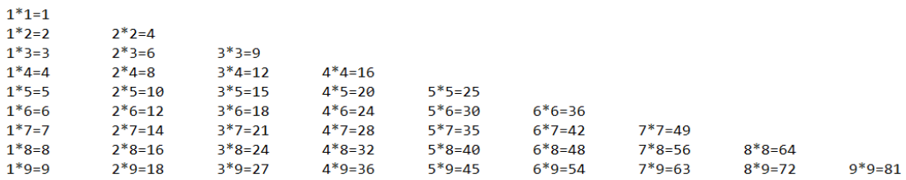

# 第 5 章 函数式编程  

1） 面向对象编程  

解决问题，分解对象，行为，属性，然后通过对象的关系以及行为的调用来解决问题。
对象： 用户
行为：登录、连接 JDBC、读取数据库
属性：用户名、密码 
Scala 语言是一个完全面向对象编程语言。万物皆对象
对象的本质：对数据和行为的一个封装  

2）函数式编程  

解决问题时，将问题分解成一个一个的步骤，将每个步骤进行封装（函数），通过调用这些封装好的步骤，解决问题。
例如： 请求->用户名、密码->连接 JDBC->读取数据库
Scala 语言是一个完全函数式编程语言。 万物皆函数。
函数的本质：函数可以当做一个值进行传递  

3）在 Scala 中函数式编程和面向对象编程完美融合在一起了  

## 5.1 函数基础  

### 5.1.1 函数基本语法  

1）基本语法  

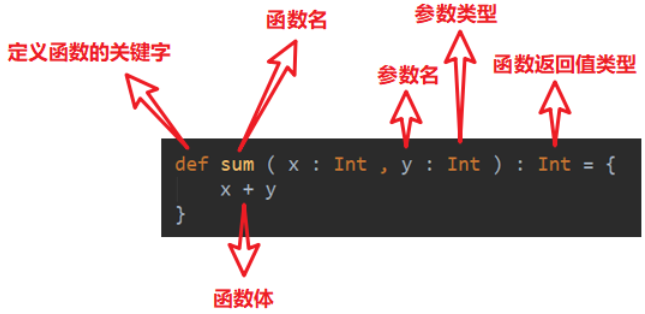

2） 案例实操  

需求：定义一个函数，实现将传入的名称打印出来。  

```scala
object TestFunction {
    def main(args: Array[String]): Unit = {
        // （1）函数定义
        def f(arg: String): Unit = {
        	println(arg)
        }
        // （2）函数调用
        // 函数名（参数）
        f("hello world")
    }
}
```

### 5.1.2 函数和方法的区别  

1） 核心概念  

（1）为完成某一功能的程序语句的集合，称为函数。
（2）类中的函数称之方法。  

2） 案例实操  

（1）Scala 语言可以在任何的语法结构中声明任何的语法
（2）函数没有重载和重写的概念；方法可以进行重载和重写
（3）Scala 中函数可以嵌套定义  

```scala
object TestFunction {
    // (2)方法可以进行重载和重写，程序可以执行
    def main(): Unit = {
    }
    def main(args: Array[String]): Unit = {
        // (1) Scala 语言可以在任何的语法结构中声明任何的语法
        import java.util.Date
        new Date()
        // (2) 函数没有重载和重写的概念，程序报错
        def test(): Unit ={
        	println("无参，无返回值")
        }
        test()
        def test(name:String):Unit={
        	println()
        }
        // (3) Scala 中函数可以嵌套定义
        def test2(): Unit ={
            def test3(name:String):Unit={
                println("函数可以嵌套定义")
            }
        }
    }
}
```

```scala
object Test01_FunctionAndMethod {
  def main(args: Array[String]): Unit = {
    // 定义函数
    def sayHello(name: String): Unit = {
      println("hi: " + name)
    }
    // 调用函数
    sayHello("ruirui") //优先调用临近的,也可以调用此对象中的方法，原因是具备可见性，如果调用其他对象中的方法，则就必须用 "对象." 进行调用

    // 调用对象方法
    Test01_FunctionAndMethod.sayHello("ruirui")

    val ret = Test01_FunctionAndMethod.sayHello("ruirui", 18);
    println(ret)
  }

  // 定义类或者对象object中，叫做方法，广义上都可以叫做函数
  def sayHello(name: String): Unit = {
    println("Hi: " + name)
  }

  def sayHello(name: String, age: Int): String = { //方法重载，并且带返回值
     println("Hi: " + name+", age: " + age)
    "Hi: " + name + ", age: " + age
  }
}
```

### 5.1.3 函数定义  

1） 函数定义  

（1）函数 1：无参，无返回值
（2）函数 2：无参，有返回值
（3）函数 3：有参，无返回值
（4）函数 4：有参，有返回值
（5）函数 5：多参，无返回值
（6）函数 6：多参，有返回值  

2） 案例实操  

```scala
object TestFunctionDeclare {
    def main(args: Array[String]): Unit = {
        // 函数 1：无参，无返回值
        def test1(): Unit ={
        	println("无参，无返回值")
        }
        test1()
        // 函数 2：无参，有返回值
        def test2():String={
        	return "无参，有返回值"
        }
        println(test2())
        // 函数 3：有参，无返回值
        def test3(s:String):Unit={
        	println(s)
        }
        test3("jinlian")
        // 函数 4：有参，有返回值
        def test4(s:String):String={
        	return s+"有参，有返回值"
        }
        println(test4("hello "))
        // 函数 5：多参，无返回值
        def test5(name:String, age:Int):Unit={
        	println(s"$name, $age")
        }
        test5("dalang",40)
    }
}
```

### 5.1.4 函数参数  

1） 案例实操  

（1）可变参数
（2）如果参数列表中存在多个参数，那么可变参数一般放置在最后
（3）参数默认值，一般将有默认值的参数放置在参数列表的后面
（4）带名参数  

```scala
object TestFunction {
    def main(args: Array[String]): Unit = {
        // (1)可变参数
        def test( s : String* ): Unit = {
        	println(s)
        }
        // 有输入参数：输出 Array
        test("Hello", "Scala")
        // 无输入参数：输出 List()
        test()
        // (2)如果参数列表中存在多个参数，那么可变参数一般放置在最后
        def test2( name : String, s: String* ): Unit = {
        	println(name + "," + s)
        }
        test2("jinlian", "dalang")
        // (3)参数默认值
        def test3( name : String, age : Int = 30 ): Unit = {
        	println(s"$name, $age")
        }
        // 如果参数传递了值，那么会覆盖默认值
        test3("jinlian", 20)
        // 如果参数有默认值，在调用的时候，可以省略这个参数
        test3("dalang")
        // 一般情况下， 将有默认值的参数放置在参数列表的后面
        def test4( sex : String = "男", name : String ): Unit = {
        	println(s"$name, $sex")
        }
        // Scala 函数中参数传递是，从左到右
        //test4("wusong")
        //(4)带名参数
        test4(name="ximenqing")
    }
}
```

### 5.1.5 函数至简原则（重点）  

函数至简原则：能省则省  

1） 至简原则细节  

（1） return 可以省略， Scala 会使用函数体的最后一行代码作为返回值
（2）如果函数体只有一行代码，可以省略花括号
（3）返回值类型如果能够推断出来，那么可以省略（ :和返回值类型一起省略）
（4）如果有 return，则不能省略返回值类型，必须指定
（5）如果函数明确声明 unit，那么即使函数体中使用 return 关键字也不起作用
（6） Scala 如果期望是无返回值类型，可以省略等号
（7）如果函数无参，但是声明了参数列表，那么调用时，小括号，可加可不加
（8）如果函数没有参数列表，那么小括号可以省略，调用时小括号必须省略
（9）如果不关心名称，只关心逻辑处理，那么函数名（ def）可以省略  

2） 案例实操  

```scala
object TestFunction {
    def main(args: Array[String]): Unit = {
        // （ 0）函数标准写法
        def f( s : String ): String = {
        	return s + " jinlian"
        }
        println(f("Hello"))
        // 至简原则:能省则省
        //（1） return 可以省略,Scala 会使用函数体的最后一行代码作为返回值
        def f1( s : String ): String = {
        	s + " jinlian"
        }
        println(f1("Hello"))
        //（2）如果函数体只有一行代码，可以省略花括号
        def f2(s:String):String = s + " jinlian"
        //（3）返回值类型如果能够推断出来，那么可以省略（ :和返回值类型一起省略）
        def f3( s : String ) = s + " jinlian"
        println(f3("Hello3"))
        //（4）如果有 return，则不能省略返回值类型，必须指定。
        def f4() :String = {
        	return "ximenqing4"
        }
        println(f4())
        //（5）如果函数明确声明 unit，那么即使函数体中使用 return 关键字也不起作用
        def f5(): Unit = {
        	return "dalang5"
        }
        println(f5())
        //（6） Scala 如果期望是无返回值类型,可以省略等号
        // 将无返回值的函数称之为过程
        def f6() {
        	"dalang6"
        }
        println(f6())
        //（7）如果函数无参，但是声明了参数列表，那么调用时，小括号，可加可不加
        def f7() = "dalang7"
        println(f7())
        println(f7)
        //（8）如果函数没有参数列表，那么小括号可以省略,调用时小括号必须省略
        def f8 = "dalang"
        //println(f8())
        println(f8)
        //（9）如果不关心名称，只关心逻辑处理，那么函数名（ def）可以省略
        def f9 = (x:String)=>{println("wusong")}
        def f10(f:String=>Unit) = {
        	f("")
        }
        f10(f9)
        println(f10((x:String)=>{println("wusong")}))
        // 或者
        () => println("test")
    	(name: String) => println("test") //匿名函数，lambda表达式
        
    }
}
```

## 5.2 函数高级  

### 5.2.1 高阶函数  

在 Scala 中，函数是一等公民。 怎么体现的呢？
对于一个函数我们可以： **定义函数、调用函数**  

```scala
object TestFunction {
    def main(args: Array[String]): Unit = {
        // 调用函数
        foo()
    }
    // 定义函数
    def foo():Unit = {
        println("foo...")
    }
}
```

但是其实函数还有更高阶的用法  

1）函数可以作为值进行传递  

```scala
object TestFunction {
    def main(args: Array[String]): Unit = {
        //（1）调用 foo 函数，把返回值给变量 f
        //val f = foo()
        val f = foo
        println(f)
        //（2）在被调用函数 foo 后面加上 _， 相当于把函数 foo 当成一个整体，传递给变量 f1
        val f1 = foo _
        foo()
        f1()
        //（3）如果明确变量类型，那么不使用下划线也可以将函数作为整体传递给变量
        var f2:()=>Int = foo
    }
    def foo():Int = {
        println("foo...")
        1
    }
}
```

2）函数可以作为参数进行传递  

```scala
def main(args: Array[String]): Unit = {
    //（1）定义一个函数，函数参数还是一个函数签名；f 表示函数名称;(Int,Int) 表示输入两个 Int 参数； Int 表示函数返回值
    def f1(f: (Int, Int) => Int): Int = {
    	f(2, 4)
    }
    //（2）定义一个函数，参数和返回值类型和 f1 的输入参数一致
    def add(a: Int, b: Int): Int = a + b
    //（3）将 add 函数作为参数传递给 f1 函数， 如果能够推断出来不是调用， _ 可以省略
    println(f1(add))
    println(f1(add _))
    //可以传递匿名函数
}
```

3）函数可以作为函数返回值返回  

```scala
def main(args: Array[String]): Unit = {
    def f1() = {
        def f2() = {
        }
        f2 _
    }
    val f = f1()
    // 因为 f1 函数的返回值依然为函数，所以可以变量 f 可以作为函数继续调用
    f()
    // 上面的代码可以简化为
    f1()()
}
```

练习与测试

```scala
object Test06_HighOrderFunction {
  def main(args: Array[String]): Unit = {
    def f(n: Int): Int = {
      //println("f调用")
      n + 1
    }

    def fun(): Int = {
      //println("fun调用")
      1
    }

    val result: Int = f(1)
    println(result)

    // 1. 函数作为值(一个整体)进行传递
    val f1: Int => Int = f _
    // 简化
    val f2 = f _
    // 或者(如果不写_，则必须给出类型)
    val f3: Int => Int = f
    // 输出对象
    println(f1)
    println(f2)
    println(f3)
    //调用函数，输出值
    println(f1(1))
    println(f2(1))
    println(f3(1))

    // 输出对象
    val f4: () => Int = fun _
    // 简化
    val f5 = fun _
    // 或者(如果不写_，则必须给出类型)
    val f6: () => Int = fun
    println(f4)
    println(f5)
    println(f6)
    // 调用函数，输出值
    val f7 = fun
    println(f4())
    println(f5())
    println(f6())
    println(fun())
    println(fun)
    println(f7)

    // 2. 函数作为参数进行传递
    // 定义二元计算函数
    def dualEval(op: (Int, Int) => Int, a: Int, b: Int): Int = {
      op(a, b)
    }

    def add(a: Int, b: Int): Int = {
      a + b
    }

    println(dualEval(add, 10, 12))
    println(dualEval(add _, 10, 12))
    println(dualEval((a, b) => a + b, 10, 12))
    println(dualEval(_ + _, 10, 12))

    //3. 函数作为函数的返回值返回

    //    def f8() = {
    //      def f9(a: Int): Unit = {
    //        println("f9调用：" + a)
    //      }
    //      f9 _
    //    }

    // 或者
    def f8(): Int => Unit = {
      def f9(a: Int): Unit = {
        println("f9调用：" + a)
      }
      f9 // 将函数直接返回
    }
      
    val f10 = f8()
    f10(25)
    // 简化为
    f8()(25)
  }
}
```


### 5.2.2 匿名函数  

1） 说明  

没有名字的函数就是匿名函数。
(x:Int)=>{函数体}
x： 表示输入参数类型； Int：表示输入参数类型； 函数体： 表示具体代码逻辑  

2） 案例实操  

需求 1：传递的函数有一个参数
传递匿名函数至简原则：
（1）参数的类型可以省略，会根据形参进行自动的推导
（2）类型省略之后，发现只有一个参数，则圆括号可以省略； 其他情况：没有参数和参数超过 1 的永远不能省略圆括号。
（3）匿名函数如果只有一行， 则大括号也可以省略
（4）如果参数只出现一次，则参数省略且后面参数可以用_代替

```scala
def main(args: Array[String]): Unit = {
    //（1）定义一个函数：参数包含数据和逻辑函数
    def operation(arr: Array[Int], op: Int => Int) = {
        for (elem <- arr) yield op(elem)
    }
        //（2）定义逻辑函数
    def op(ele: Int): Int = {
        ele + 1
    }
    //（3）标准函数调用
    val arr = operation(Array(1, 2, 3, 4), op)
    println(arr.mkString(","))
    //（4）采用匿名函数
    val arr1 = operation(Array(1, 2, 3, 4), (ele: Int) => {
    	ele + 1
    })
    println(arr1.mkString(","))
    //（4.1）参数的类型可以省略，会根据形参进行自动的推导;
    val arr2 = operation(Array(1, 2, 3, 4), (ele) => {
    	ele + 1
    })
    println(arr2.mkString(","))
    //（4.2）类型省略之后，发现只有一个参数，则圆括号可以省略；其他情况：没有参数和参数超过 1 的永远不能省略圆括号。
    val arr3 = operation(Array(1, 2, 3, 4), ele => {
    	ele + 1
    })
    println(arr3.mkString(","))
    //（4.3） 匿名函数如果只有一行，则大括号也可以省略
    val arr4 = operation(Array(1, 2, 3, 4), ele => ele + 1)
    println(arr4.mkString(","))
    //（4.4）如果参数只出现一次，则参数省略且后面参数可以用_代替
    val arr5 = operation(Array(1, 2, 3, 4), _ + 1)
    println(arr5.mkString(","))
}
```

需求 2：传递的函数有两个参数  

```scala
object TestFunction {
    def main(args: Array[String]): Unit = {
        def calculator(a: Int, b: Int, op: (Int, Int) => Int): Int= {
        	op(a, b)
        }
        // （1）标准版
        println(calculator(2, 3, (x: Int, y: Int) => {x + y}))
        // （2）如果只有一行，则大括号也可以省略
        println(calculator(2, 3, (x: Int, y: Int) => x + y))
        // （3）参数的类型可以省略，会根据形参进行自动的推导;
        println(calculator(2, 3, (x , y) => x + y))
        // （4）如果参数只出现一次，则参数省略且后面参数可以用_代替
        println(calculator(2, 3, _ + _))
    }
}
```

练习与测试

```scala
object Test05_Lambda {
  def main(args: Array[String]): Unit = {
    val fun = (name: String) => println(name) // 返回函数类型
    fun("atguigu")

    //定义一个函数，以函数作为参数输入
    def f(func: String => Unit): Unit = {
      func("atguigu")
    }

    f(fun)
    f((name: String) => {
      println(name)
    })

    // 匿名函数的简化原则
    //（1）参数的类型可以省略，会根据形参进行自动的推导
    f((name) => {
      println(name)
    })
    //（2）类型省略之后，发现只有一个参数，则圆括号可以省略； 其他情况：没有参数和参
    //    数超过 1 的永远不能省略圆括号。
    f(name => {
      println(name)
    })
    //（3）匿名函数如果只有一行， 则大括号也可以省略
    f(name => println(name))
    //（4）如果参数只出现一次，则参数省略且后面参数可以用_代替
    f(println(_))
    //（5）如何可以推断出，当前传入的println是一个函数体，而不是一个调用语句，可以直接省略下划线,直接写要执行的函数名称
    f(println)

    // 实际示例，定义一个“二元运算”函数，只操作1和2两个数，但是具体运算通过参数传入
    def dualFunctionOneAndTwo(fun: (Int, Int) => Int): Int = {
      fun(1, 2)
    }

    val add = (a: Int, b: Int) => a + b
    val minus = (a: Int, b: Int) => a - b
    println(dualFunctionOneAndTwo(add))
    println(dualFunctionOneAndTwo(minus))
    // 匿名函数简化
    println(dualFunctionOneAndTwo((a: Int, b: Int) => a + b))
    println(dualFunctionOneAndTwo((a: Int, b: Int) => a - b))

    println(dualFunctionOneAndTwo((a, b) => a + b))
    println(dualFunctionOneAndTwo((a, b) => a - b))

    println(dualFunctionOneAndTwo(_ + _))
    println(dualFunctionOneAndTwo(_ - _))

    // 如果是顺序颠倒，就不能用下划线了，但是可以颠倒下划线来简化
    println(dualFunctionOneAndTwo((a, b) => b - a))
    println(dualFunctionOneAndTwo(-_ + _))
  }
}
```

扩展练习

练习 1：定义一个匿名函数，并将它作为值赋给变量 fun。函数有三个参数，类型分别为 Int， String， Char，返回值类型为 Boolean。

要求调用函数 fun(0, “”, ‘0’)得到返回值为 false，其它情况均返回 true。  

练习 2： 定义一个函数 func，它接收一个 Int 类型的参数，返回一个函数（记作 f1）。它返回的函数 f1，接收一个 String 类型的参数，同样返回一个函数（记作 f2）。函数 f2 接收一个 Char 类型的参数，返回一个 Boolean 的值。  

要求调用函数 func(0) (“”) (‘0’)得到返回值为 false，其它情况均返回 true。  
