# 第1章 Spark 概述

## 1.1 Spark 是什么  


Spark 是一种基于内存的快速、通用、可扩展的大数据分析计算引擎。  

## 1.2 Spark and Hadoop  

在之前的学习中， Hadoop 的 MapReduce 是大家广为熟知的计算框架，那为什么咱们还要学习新的计算框架 Spark 呢，这里就不得不提到 Spark 和 Hadoop 的关系。

首先从时间节点上来看:  

➢ Hadoop

* 2006 年 1 月， Doug Cutting 加入 Yahoo，领导 Hadoop 的开发
* 2008 年 1 月， Hadoop 成为 Apache 顶级项目
* 2011 年 1.0 正式发布
* 2012 年 3 月稳定版发布
* 2013 年 10 月发布 2.X (Yarn)版本

➢ Spark

* 2009 年， Spark 诞生于伯克利大学的 AMPLab 实验室
* 2010 年，伯克利大学正式开源了 Spark 项目
* 2013 年 6 月， Spark 成为了 Apache 基金会下的项目
* 2014 年 2 月， Spark 以飞快的速度成为了 Apache 的顶级项目
* 2015 年至今， Spark 变得愈发火爆，大量的国内公司开始重点部署或者使用 Spark  

然后我们再从功能上来看:  

➢ Hadoop  

* Hadoop 是由 java 语言编写的，在分布式服务器集群上存储海量数据并运行分布式分析应用的开源框架
* 作为 Hadoop 分布式文件系统， HDFS 处于 Hadoop 生态圈的最下层，存储着所有的 数 据 ， 支 持 着 Hadoop 的 所 有 服 务 。 它 的 理 论 基 础 源 于 Google 的TheGoogleFileSystem 这篇论文，它是 GFS 的开源实现。
* MapReduce 是一种编程模型， Hadoop 根据 Google 的 MapReduce 论文将其实现，作为 Hadoop 的分布式计算模型，是 Hadoop 的核心。基于这个框架，分布式并行程序的编写变得异常简单。综合了 HDFS 的分布式存储和 MapReduce 的分布式计算， Hadoop 在处理海量数据时， 性能横向扩展变得非常容易。
* HBase 是对 Google 的 Bigtable 的开源实现，但又和 Bigtable 存在许多不同之处。HBase 是一个基于 HDFS 的分布式数据库，擅长实时地随机读/写超大规模数据集。它也是 Hadoop 非常重要的组件。  

➢ Spark

* Spark 是一种由 Scala 语言开发的快速、通用、可扩展的大数据分析引擎
* Spark Core 中提供了 Spark 最基础与最核心的功能
* Spark SQL 是 Spark 用来操作结构化数据的组件。通过 Spark SQL，用户可以使用SQL 或者 Apache Hive 版本的 SQL 方言（HQL）来查询数据。
* Spark Streaming 是 Spark 平台上针对实时数据进行流式计算的组件，提供了丰富的处理数据流的 API。  

由上面的信息可以获知， Spark 出现的时间相对较晚，并且主要功能主要是用于数据计算，所以其实 Spark 一直被认为是 Hadoop 框架的升级版。  

## 1.3 Spark or Hadoop  

Hadoop 的 MR 框架和 Spark 框架都是数据处理框架，那么我们在使用时如何选择呢？  

* Hadoop MapReduce 由于其设计初衷并不是为了满足循环迭代式数据流处理，因此在多并行运行的数据可复用场景（如：机器学习、图挖掘算法、交互式数据挖掘算法）中存在诸多计算效率等问题。所以 Spark 应运而生， Spark 就是在传统的 MapReduce 计算框架的基础上，利用其计算过程的优化，从而大大加快了数据分析、挖掘的运行和读写速度，并将计算单元缩小到更适合并行计算和重复使用的 RDD 计算模型。  
* 机器学习中 ALS、凸优化梯度下降等。这些都需要基于数据集或者数据集的衍生数据反复查询反复操作。 MR 这种模式不太合适，即使多 MR 串行处理，性能和时间也是一个问题。数据的共享依赖于磁盘。另外一种是交互式数据挖掘， MR 显然不擅长。而Spark 所基于的 scala 语言恰恰擅长函数的处理。
* Spark 是一个分布式数据快速分析项目。它的核心技术是弹性分布式数据集（Resilient Distributed Datasets），提供了比 MapReduce 丰富的模型，可以快速在内存中对数据集进行多次迭代，来支持复杂的数据挖掘算法和图形计算算法。
* Spark 和Hadoop 的根本差异是多个作业之间的数据通信问题 : Spark 多个作业之间数据通信是基于内存，而 Hadoop 是基于磁盘。
* Spark Task 的启动时间快。 Spark 采用 fork 线程的方式，而 Hadoop 采用创建新的进程的方式。
* Spark 只有在 shuffle 的时候将数据写入磁盘，而 Hadoop 中多个 MR 作业之间的数据交互都要依赖于磁盘交互。
* Spark 的缓存机制比 HDFS 的缓存机制高效。  

经过上面的比较，我们可以看出在绝大多数的数据计算场景中， Spark 确实会比 MapReduce更有优势。但是 Spark 是基于内存的，所以在实际的生产环境中，由于内存的限制，可能会由于内存资源不够导致 Job 执行失败，此时， MapReduce 其实是一个更好的选择，所以 Spark并不能完全替代 MR。  

## 1.4 Spark 核心模块  


➢ Spark Core
Spark Core 中提供了 Spark 最基础与最核心的功能， Spark 其他的功能如： Spark SQL，Spark Streaming， GraphX, MLlib 都是在 Spark Core 的基础上进行扩展的。
➢ Spark SQL
Spark SQL 是 Spark 用来操作结构化数据的组件。通过 Spark SQL，用户可以使用 SQL或者 Apache Hive 版本的 SQL 方言（HQL）来查询数据。
➢ Spark Streaming
Spark Streaming 是 Spark 平台上针对实时数据进行流式计算的组件，提供了丰富的处理数据流的 API。
➢ Spark MLlib
MLlib 是 Spark 提供的一个机器学习算法库。 MLlib 不仅提供了模型评估、数据导入等额外的功能，还提供了一些更底层的机器学习原语。
➢ Spark GraphX
GraphX 是 Spark 面向图计算提供的框架与算法库。  

# 第2章 Spark 快速上手  

在大数据早期的课程中我们已经学习了 MapReduce 框架的原理及基本使用，并了解了其底层数据处理的实现方式。接下来，就让咱们走进 Spark 的世界，了解一下它是如何带领我们完成数据处理的。  

## 2.1 创建 Maven 项目  

### 2.1.1 增加 Scala 插件  

Spark 由 Scala 语言开发的，所以本课件接下来的开发所使用的语言也为 Scala， 咱们当前使用的 Spark 版本为 3.0.0，默认采用的 Scala 编译版本为 2.12，所以后续开发时。我们依然采用这个版本。 开发前请保证 IDEA 开发工具中含有 Scala 开发插件  


### 2.1.2 增加依赖关系  

修改 Maven 项目中的 POM 文件，增加 Spark 框架的依赖关系。 本课件基于 Spark3.0 版本，使用时请注意对应版本。  

```
<dependencies>
    <dependency>
        <groupId>org.apache.spark</groupId>
        <artifactId>spark-core_2.12</artifactId>
        <version>3.0.0</version>
    </dependency>
</dependencies>

<build>
    <plugins>
        <!-- 该插件用于将 Scala 代码编译成 class 文件 -->
        <plugin>
            <groupId>net.alchim31.maven</groupId>
            <artifactId>scala-maven-plugin</artifactId>
            <version>3.2.2</version>
            <executions>
                <execution>
                    <!-- 声明绑定到 maven 的 compile 阶段 -->
                    <goals>
                    	<goal>testCompile</goal>
                    </goals>
                </execution>
            </executions>
         </plugin>
         <plugin>
            <groupId>org.apache.maven.plugins</groupId>
            <artifactId>maven-assembly-plugin</artifactId>
            <version>3.1.0</version>
            <configuration>
                <descriptorRefs>
                    <descriptorRef>jar-with-dependencies</descriptorRef>
                </descriptorRefs>
            </configuration>
            <executions>
                <execution>
                    <id>make-assembly</id>
                    <phase>package</phase>
                    <goals>
                        <goal>single</goal>
                    </goals>
                </execution>
            </executions>
        </plugin>
    </plugins>
</build>
```

### 2.1.3 WordCount  

为了能直观地感受 Spark 框架的效果，接下来我们实现一个大数据学科中最常见的教学案例 WordCount  

```scala
// 创建 Spark 运行配置对象
val sparkConf = new SparkConf().setMaster("local[*]").setAppName("WordCount")
// 创建 Spark 上下文环境对象（连接对象）
val sc : SparkContext = new SparkContext(sparkConf)
// 读取文件数据
val fileRDD: RDD[String] = sc.textFile("input/word.txt")
// 将文件中的数据进行分词
val wordRDD: RDD[String] = fileRDD.flatMap( _.split(" ") )
// 转换数据结构 word => (word, 1)
val word2OneRDD: RDD[(String, Int)] = wordRDD.map((_,1))
// 将转换结构后的数据按照相同的单词进行分组聚合
val word2CountRDD: RDD[(String, Int)] = word2OneRDD.reduceByKey(_+_)
// 将数据聚合结果采集到内存中
val word2Count: Array[(String, Int)] = word2CountRDD.collect()
// 打印结果
word2Count.foreach(println)
//关闭 Spark 连接
sc.stop()
```

练习与测试

```scala
package com.atguigu.spark.core.wc

import org.apache.spark.rdd.RDD
import org.apache.spark.{SparkConf, SparkContext}

object Spark01_WordCount {
  def main(args: Array[String]): Unit = {
    // TODO 建立和Spark框架的连接
    val sparkConf = new SparkConf().setMaster("local").setAppName("WordCount")
    val sc = new SparkContext(sparkConf)

    // TODO 执行业务操作
    // 1. 读取文件，获取一行一行的数据
    // hello world
    val lines = sc.textFile("datas")
    // 2. 将一行数据切割，进行分词
    // "hello world" => hello, world,hello,world
    // 扁平化：将整体拆分成个体的操作
    val words: RDD[String] = lines.flatMap(_.split(" "))
    // 3. 将数据根据单词进行分组，便于分组
    // (hello,hello),(world,world)
    val wordGroup: RDD[(String, Iterable[String])] = words.groupBy(word => word)
    // 4. 对分组后的数据进行转换
    // (hello,2),(world,2)
    val wordToCount = wordGroup.map {
      case (word, list) => (word, list.size)
    }
    // 5. 将转换结果采集到控制台打印出来
    val array = wordToCount.collect()
    array.foreach(println)

    // TODO 关闭连接
    sc.stop()
  }
}
```

```scala
package com.atguigu.spark.core.wc

import org.apache.spark.rdd.RDD
import org.apache.spark.{SparkConf, SparkContext}

object Spark02_WordCount {
  def main(args: Array[String]): Unit = {
    // TODO 建立和Spark框架的连接
    val sparkConf = new SparkConf().setMaster("local").setAppName("WordCount")
    val sc = new SparkContext(sparkConf)

    // TODO 执行业务操作
    val lines: RDD[String] = sc.textFile("datas")

    val words: RDD[String] = lines.flatMap(_.split(" "))

    val wordToOne = words.map(word => (word, 1))

    val wordGroup: RDD[(String, Iterable[(String, Int)])] = wordToOne.groupBy(t => t._1)

    val wordToCount: RDD[(String, Int)] = wordGroup.map {
      case (word, list) => {
        list.reduce(
          (t1, t2) => {
            (t1._1, t1._2 + t2._2)
          })
      }
    }
    // val wordToCount = wordGroup.mapValues(_.map(_._2).sum)

    val array: Array[(String, Int)] = wordToCount.collect()
    array.foreach(println)

    // TODO 关闭连接
    sc.stop()
  }
}
```

```scala
package com.atguigu.spark.core.wc

import org.apache.spark.rdd.RDD
import org.apache.spark.{SparkConf, SparkContext}

object Spark03_WordCount {
  def main(args: Array[String]): Unit = {
    // TODO 建立和Spark框架的连接
    val sparkConf = new SparkConf().setMaster("local").setAppName("WordCount")
    val sc = new SparkContext(sparkConf)

    // TODO 执行业务操作
    val lines: RDD[String] = sc.textFile("datas")

    val words: RDD[String] = lines.flatMap(_.split(" "))

    val wordToOne: RDD[(String, Int)] = words.map(word => (word, 1))

    // Spark框架提供了更多功能，可以将分组和聚合使用一个方法实现
    // reduceByKey：Spar k框架提供的功能，相同的key的数据，可以对value进行reduce聚合
    val wordToCount: RDD[(String, Int)] = wordToOne.reduceByKey(_ + _)

    val array: Array[(String, Int)] = wordToCount.collect()
    array.foreach(println)

    // TODO 关闭连接
    sc.stop()
  }
}
```

执行过程中，会产生大量的执行日志，如果为了能够更好的查看程序的执行结果，可以在项目的 resources 目录中创建 log4j.properties 文件，并添加日志配置信息：  

```properties
log4j.rootCategory=ERROR, console
log4j.appender.console=org.apache.log4j.ConsoleAppender
log4j.appender.console.target=System.err
log4j.appender.console.layout=org.apache.log4j.PatternLayout
log4j.appender.console.layout.ConversionPattern=%d{yy/MM/dd
HH:mm:ss} %p %c{1}: %m%n
# Set the default spark-shell log level to ERROR. When running the spark-shell,
the
# log level for this class is used to overwrite the root logger's log level, so
that
# the user can have different defaults for the shell and regular Spark apps.
log4j.logger.org.apache.spark.repl.Main=ERROR
# Settings to quiet third party logs that are too verbose
log4j.logger.org.spark_project.jetty=ERROR
log4j.logger.org.spark_project.jetty.util.component.AbstractLifeCycle=ERROR
log4j.logger.org.apache.spark.repl.SparkIMain$exprTyper=ERROR
log4j.logger.org.apache.spark.repl.SparkILoop$SparkILoopInterpreter=ERROR
log4j.logger.org.apache.parquet=ERROR
log4j.logger.parquet=ERROR
# SPARK-9183: Settings to avoid annoying messages when looking up nonexistent
UDFs in SparkSQL with Hive support
log4j.logger.org.apache.hadoop.hive.metastore.RetryingHMSHandler=FATAL
log4j.logger.org.apache.hadoop.hive.ql.exec.FunctionRegistry=ERROR
```

### 2.1.4 异常处理  

如果本机操作系统是 Windows，在程序中使用了 Hadoop 相关的东西，比如写入文件到HDFS，则会遇到如下异常：  


出现这个问题的原因，并不是程序的错误，而是 windows 系统用到了 hadoop 相关的服务，解决办法是通过配置关联到 windows 的系统依赖就可以了  


# 第3章 Spark 运行环境  

Spark 作为一个数据处理框架和计算引擎，被设计在所有常见的集群环境中运行, 在国内工作中主流的环境为 Yarn，不过逐渐容器式环境也慢慢流行起来。接下来，我们就分别看看不同环境下 Spark 的运行  


## 3.1 Local 模式  

之前一直在使用的模式可不是 Local 模式哟。所谓的 Local 模式，就是不需要其他任何节点资源就可以在本地执行 Spark 代码的环境，一般用于教学，调试，演示等，之前在 IDEA 中运行代码的环境我们称之为开发环境，不太一样。  

### 3.1.1 解压缩文件  

将 spark-3.0.0-bin-hadoop3.2.tgz 文件上传到 Linux 并解压缩，放置在指定位置，路径中不要包含中文或空格，后续如果涉及到解压缩操作，不再强调。  

```shell
tar -zxvf spark-3.0.0-bin-hadoop3.2.tgz -C /opt/module
cd /opt/module
mv spark-3.0.0-bin-hadoop3.2 spark-local
```

### 3.1.2 启动 Local 环境  

1) 进入解压缩后的路径，执行如下指令  

```shell
bin/spark-shell
```


2) 启动成功后，可以输入网址进行 Web UI 监控页面访问  


### 3.1.3 命令行工具  

在解压缩文件夹下的 data 目录中，添加 word.txt 文件。在命令行工具中执行如下代码指令（和 IDEA 中代码简化版一致）  

```scala
sc.textFile("data/word.txt").flatMap(_.split("")).map((_,1)).reduceByKey(_+_).collect
```


### 3.1.4 退出本地模式  

按键 Ctrl+C 或输入 Scala 指令  `:quit  `

### 3.1.5 提交应用  

```shell
bin/spark-submit \
--class org.apache.spark.examples.SparkPi \
--master local[2] \
./examples/jars/spark-examples_2.12-3.0.0.jar \
10
```

1. --class 表示要执行程序的主类，此处可以更换为咱们自己写的应用程序

2. -master local[2] 部署模式，默认为本地模式，数字表示分配的虚拟 CPU 核数量

3. spark-examples_2.12-3.0.0.jar 运行的应用类所在的 jar 包，实际使用时，可以设定为咱们自己打的 jar 包

4. 数字 10 表示程序的入口参数，用于设定当前应用的任务数量  


## 3.2 Standalone 模式  

local 本地模式毕竟只是用来进行练习演示的，真实工作中还是要将应用提交到对应的集群中去执行，这里我们来看看只使用 Spark 自身节点运行的集群模式，也就是我们所谓的独立部署（Standalone）模式。 Spark 的 Standalone 模式体现了经典的 master-slave 模式。集群规划：


### 3.2.1 解压缩文件  

将 spark-3.0.0-bin-hadoop3.2.tgz 文件上传到 Linux 并解压缩在指定位置  

```shell
tar -zxvf spark-3.0.0-bin-hadoop3.2.tgz -C /opt/module
cd /opt/module
mv spark-3.0.0-bin-hadoop3.2 spark-standalone
```

### 3.2.2 修改配置文件  

1) 进入解压缩后路径的 conf 目录，修改 slaves.template 文件名为 slaves  

```shell
mv slaves.template slaves
```

2) 修改 slaves 文件，添加 work 节点  

```properties
linux1
linux2
linux3
```

3) 修改 spark-env.sh.template 文件名为 spark-env.sh  

```shell
mv spark-env.sh.template spark-env.sh
```

4) 修改 spark-env.sh 文件，添加 JAVA_HOME 环境变量和集群对应的 master 节点  

```shell
export JAVA_HOME=/opt/module/jdk1.8.0_144
SPARK_MASTER_HOST=linux1
SPARK_MASTER_PORT=7077
```

注意： 7077 端口，相当于 hadoop3 内部通信的 8020 端口，此处的端口需要确认自己的 Hadoop配置  

5) 分发 spark-standalone 目录  

```shell
xsync spark-standalone
```

### 3.2.3 启动集群  

1) 执行脚本命令：  

```shell
sbin/start-all.sh
```


2) 查看三台服务器运行进程  

```shell
================linux1================
3330 Jps
3238 Worker
3163 Master
================linux2================
2966 Jps
2908 Worker
================linux3================
2978 Worker
3036 Jps  
```

3) 查看 Master 资源监控 Web UI 界面: http://linux1:8080  


### 3.2.4 提交应用  

```shell
bin/spark-submit \
--class org.apache.spark.examples.SparkPi \
--master spark://linux1:7077 \
./examples/jars/spark-examples_2.12-3.0.0.jar \
10
```

1) --class 表示要执行程序的主类
2) --master spark://linux1:7077 独立部署模式，连接到 Spark 集群
3) spark-examples_2.12-3.0.0.jar 运行类所在的 jar 包
4) 数字 10 表示程序的入口参数，用于设定当前应用的任务数量  


执行任务时，会产生多个 Java 进程  


执行任务时，默认采用服务器集群节点的总核数，每个节点内存 1024M。  


### 3.2.5 提交参数说明  

在提交应用中，一般会同时一些提交参数  

```shell
bin/spark-submit \
--class <main-class>
--master <master-url> \
... # other options
<application-jar> \
[application-arguments]
```

| 参数                     | 解释                                                         | 可选值举例                                  |
| :----------------------- | :----------------------------------------------------------- | :------------------------------------------ |
| --class                  | Spark 程序中包含主函数的类                                   |                                             |
| --master                 | Spark 程序运行的模式(环境)                                   | 模式： local[*]、spark://linux1:7077、 Yarn |
| --executor-memory 1G     | 指定每个 executor 可用内存为 1G                              | 符合集群内存配置即可，具体情况具体分 析。   |
| --total-executor-cores 2 | 指定所有executor使用的cpu核数  为 2 个                       |                                             |
| --executor-cores         | 指定每个executor使用的cpu核数                                |                                             |
| --num-executors          | 配置 Executor 的数量                                         |                                             |
| application-jar          | 打包好的应用 jar，包含依赖。这 个 URL 在集群中全局可见。 比 如 hdfs:// 共享存储系统，如果是file:// path，那么所有的节点的 path 都包含同样的 jar |                                             |
| application-arguments    | 传给 main()方法的参数                                        |                                             |

### 3.2.6 配置历史服务  

由于 spark-shell 停止掉后， 集群监控 linux1:4040 页面就看不到历史任务的运行情况，所以开发时都配置历史服务器记录任务运行情况。  

1) 修改 spark-defaults.conf.template 文件名为 spark-defaults.conf

   ```shell
   mv spark-defaults.conf.template spark-defaults.conf
   ```

2) 修改 spark-default.conf 文件，配置日志存储路径  

   ```properties
   spark.eventLog.enabled true
   spark.eventLog.dir hdfs://linux1:8020/directory
   ```

   注意：需要启动 hadoop 集群， HDFS 上的 directory 目录需要提前存在。  

   ```shell
   sbin/start-dfs.sh
   hadoop fs -mkdir /directory
   ```

3) 修改 spark-env.sh 文件, 添加日志配置  

   ```shell
   export SPARK_HISTORY_OPTS="
   -Dspark.history.ui.port=18080
   -Dspark.history.fs.logDirectory=hdfs://linux1:8020/directory
   -Dspark.history.retainedApplications=30"
   
   # 参数 1 含义： WEB UI 访问的端口号为 18080
   # 参数 2 含义：指定历史服务器日志存储路径
   # 参数 3 含义：指定保存 Application 历史记录的个数，如果超过这个值，旧的应用程序信息将被删除，这个是内存中的应用数，而不是页面上显示的应用数。
   ```

4. 分发配置文件

   ```shell
   xsync conf
   ```

5. 重新启动集群和历史服务  

   ```shell
   sbin/start-all.sh
   sbin/start-history-server.sh
   ```

6. 重新执行任务  

   ```shell
   bin/spark-submit \
   --class org.apache.spark.examples.SparkPi \
   --master spark://linux1:7077 \
   ./examples/jars/spark-examples_2.12-3.0.0.jar \
   10
   ```

   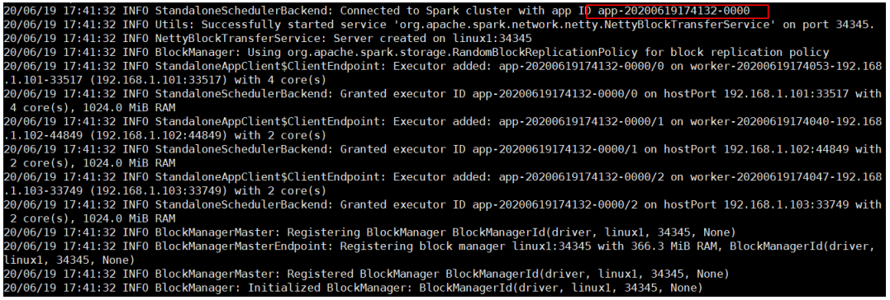

7. 查看历史服务： http://linux1:18080  

   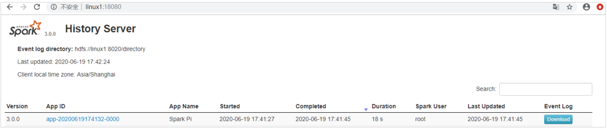

### 3.2.7 配置高可用（ HA）  

所谓的高可用是因为当前集群中的 Master 节点只有一个，所以会存在单点故障问题。 所以为了解决单点故障问题，需要在集群中配置多个 Master 节点，一旦处于活动状态的 Master发生故障时，由备用 Master 提供服务，保证作业可以继续执行。 这里的高可用一般采用Zookeeper 设置  

集群规划:  

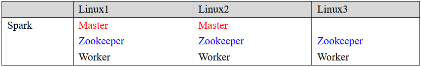

1) 停止集群  

   ```shell
   sbin/stop-all.sh
   ```

2) 启动 Zookeeper  

   ```shell
   xstart zk
   ```

3) 修改 spark-env.sh 文件添加如下配置  

   ```shell
   # 注释如下内容：
   # SPARK_MASTER_HOST=linux1
   # SPARK_MASTER_PORT=7077
   
   # 添加如下内容:
   # Master 监控页面默认访问端口为 8080，但是可能会和 Zookeeper 冲突，所以改成 8989，也可以自定义，访问 UI 监控页面时请注意
   SPARK_MASTER_WEBUI_PORT=8989
   
   export SPARK_DAEMON_JAVA_OPTS="
   -Dspark.deploy.recoveryMode=ZOOKEEPER
   -Dspark.deploy.zookeeper.url=linux1,linux2,linux3
   -Dspark.deploy.zookeeper.dir=/spark"
   ```

4) 分发配置文件  

   ```shell
   xsync conf/
   ```

5) 启动集群  

   ```shell
   sbin/start-all.sh
   ```

   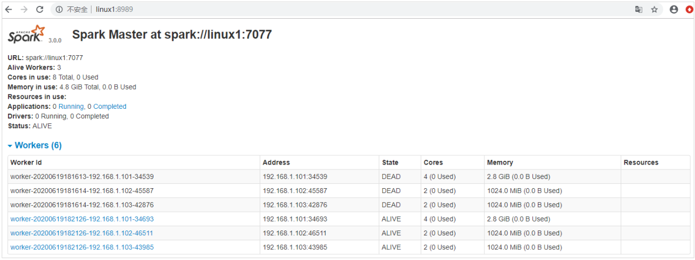

6) 启动 linux2 的单独 Master 节点，此时 linux2 节点 Master 状态处于备用状态  

   ```shell
   [root@linux2 spark-standalone]# sbin/start-master.sh
   ```

   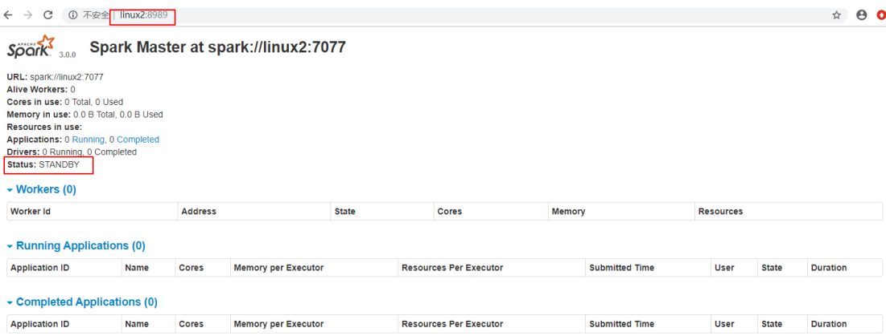

7) 提交应用到高可用集群  

   ```shell
   bin/spark-submit \
   --class org.apache.spark.examples.SparkPi \
   --master spark://linux1:7077,linux2:7077 \
   ./examples/jars/spark-examples_2.12-3.0.0.jar \
   10
   ```

8) 停止 linux1 的 Master 资源监控进程  

   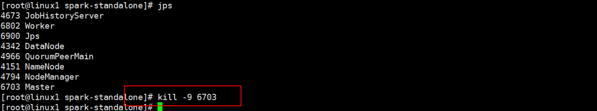

9) 查看 linux2 的 Master 资源监控 Web UI，稍等一段时间后， linux2 节点的 Master 状态提升为活动状态  

   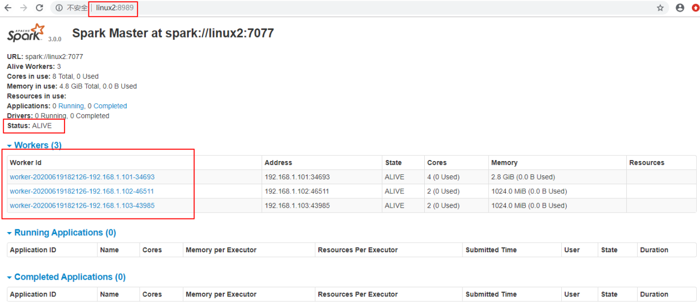

## 3.3 Yarn 模式  

独立部署（Standalone）模式由 Spark 自身提供计算资源，无需其他框架提供资源。 这种方式降低了和其他第三方资源框架的耦合性，独立性非常强。但是你也要记住， Spark 主要是计算框架，而不是资源调度框架，所以本身提供的资源调度并不是它的强项，所以还是和其他专业的资源调度框架集成会更靠谱一些。 所以接下来我们来学习在强大的 Yarn 环境下 Spark 是如何工作的（其实是因为在国内工作中， Yarn 使用的非常多）。  

### 3.3.1 解压缩文件  

将 spark-3.0.0-bin-hadoop3.2.tgz 文件上传到 linux 并解压缩，放置在指定位置。 
```shell
tar -zxvf spark-3.0.0-bin-hadoop3.2.tgz -C /opt/module
cd /opt/module
mv spark-3.0.0-bin-hadoop3.2 spark-yarn
```

### 3.3.2 修改配置文件  

1) 修改 hadoop 配置文件/opt/module/hadoop/etc/hadoop/yarn-site.xml, 并分发 

   ```xml
   <!--是否启动一个线程检查每个任务正使用的物理内存量，如果任务超出分配值，则直接将其杀掉，默认是 true -->
   <property>
       <name>yarn.nodemanager.pmem-check-enabled</name>
       <value>false</value>
   </property>
   <!--是否启动一个线程检查每个任务正使用的虚拟内存量，如果任务超出分配值，则直接将其杀掉，默认是 true -->
   <property>
       <name>yarn.nodemanager.vmem-check-enabled</name>
       <value>false</value>
   </property>
   ```

2) 修改 conf/spark-env.sh，添加 JAVA_HOME 和 YARN_CONF_DIR 配置  

   ```shell
   mv spark-env.sh.template spark-env.sh
   ... ...
   export JAVA_HOME=/opt/module/jdk1.8.0_144
   YARN_CONF_DIR=/opt/module/hadoop/etc/hadoop
   ```

### 3.3.3 启动 HDFS 以及 YARN 集群  

请自己配置并启动

### 3.3.4 提交应用  

```shell
bin/spark-submit \
--class org.apache.spark.examples.SparkPi \
--master yarn \
--deploy-mode cluster \
./examples/jars/spark-examples_2.12-3.0.0.jar \
10
```

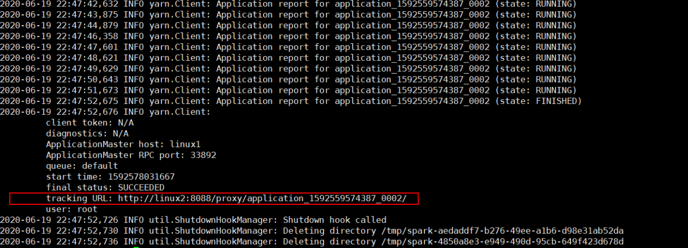

查看 http://linux2:8088 页面，点击 History，查看历史页面

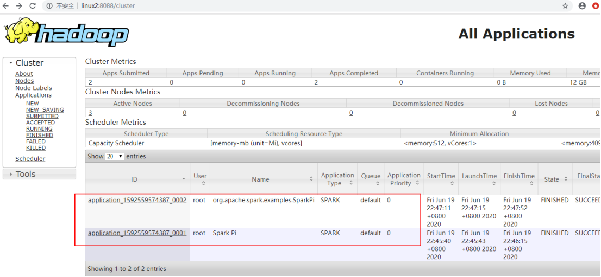

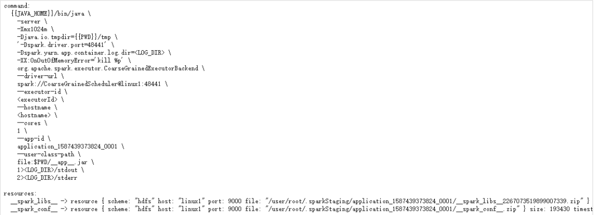

### 3.3.5 配置历史服务器  

1) 修改 spark-defaults.conf.template 文件名为 spark-defaults.conf  

   ```
   mv spark-defaults.conf.template spark-defaults.conf
   ```

2) 修改 spark-default.conf 文件，配置日志存储路径  

   ```
   spark.eventLog.enabled true
   spark.eventLog.dir hdfs://linux1:8020/directory
   ```

   注意：需要启动 hadoop 集群， HDFS 上的目录需要提前存在。  

   ```
   [root@linux1 hadoop]# sbin/start-dfs.sh
   [root@linux1 hadoop]# hadoop fs -mkdir /directory
   ```

3) 修改 spark-env.sh 文件, 添加日志配置  

   ```
   export SPARK_HISTORY_OPTS="
   -Dspark.history.ui.port=18080
   -Dspark.history.fs.logDirectory=hdfs://linux1:8020/directory
   -Dspark.history.retainedApplications=30"
   
   # 参数 1 含义： WEB UI 访问的端口号为 18080
   # 参数 2 含义：指定历史服务器日志存储路径
   # 参数 3 含义：指定保存 Application 历史记录的个数，如果超过这个值，旧的应用程序信息将被删除，这个是内存中的应用数，而不是页面上显示的应用数。
   ```

4) 修改 spark-defaults.conf  

   ```
   spark.yarn.historyServer.address=linux1:18080
   spark.history.ui.port=18080
   ```

5) 启动历史服务  

   ```
   sbin/start-history-server.sh
   ```

6) 重新提交应用  

   ```
   bin/spark-submit \
   --class org.apache.spark.examples.SparkPi \
   --master yarn \
   --deploy-mode client \
   ./examples/jars/spark-examples_2.12-3.0.0.jar \
   10
   ```

   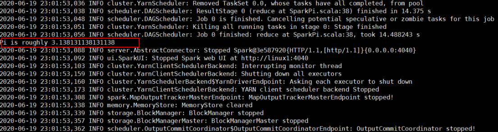

7) Web 页面查看日志： http://linux2:8088  

   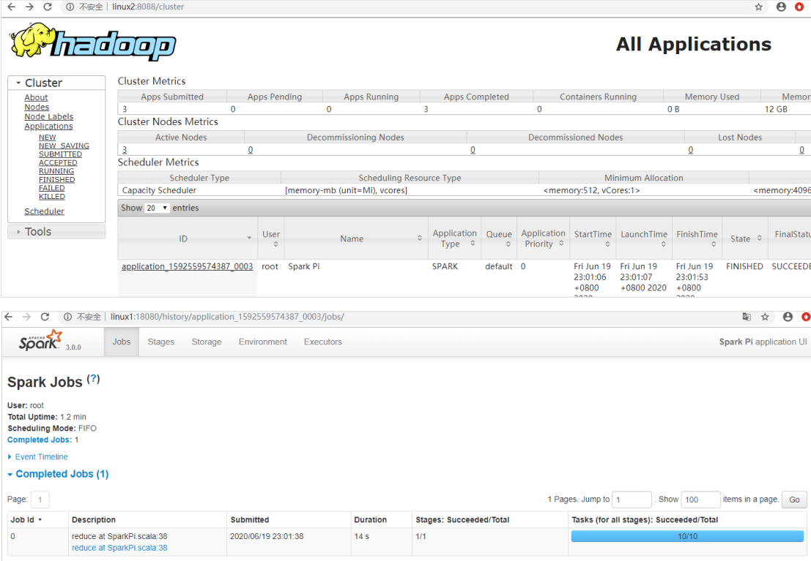

## 3.4 K8S & Mesos 模式  

Mesos 是 Apache 下的开源分布式资源管理框架，它被称为是分布式系统的内核,在Twitter 得到广泛使用,管理着 Twitter 超过 30,0000 台服务器上的应用部署，但是在国内，依然使用着传统的 Hadoop 大数据框架，所以国内使用 Mesos 框架的并不多， 但是原理其实都差不多， 这里我们就不做过多讲解了。  

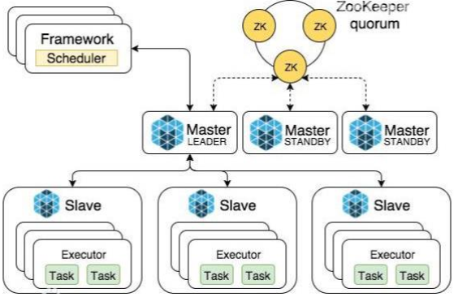

容器化部署是目前业界很流行的一项技术，基于 Docker 镜像运行能够让用户更加方便地对应用进行管理和运维。容器管理工具中最为流行的就是 Kubernetes（k8s），而 Spark也在最近的版本中支持了 k8s 部署模式。这里我们也不做过多的讲解。给个链接大家自己感受一下： https://spark.apache.org/docs/latest/running-on-kubernetes.html  

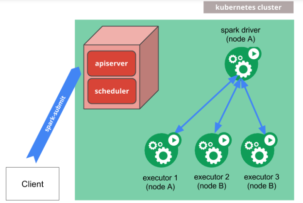

## 3.5 Windows 模式  

在同学们自己学习时，每次都需要启动虚拟机，启动集群，这是一个比较繁琐的过程，并且会占大量的系统资源，导致系统执行变慢，不仅仅影响学习效果，也影响学习进度，Spark 非常暖心地提供了可以在 windows 系统下启动本地集群的方式，这样，在不使用虚拟机的情况下，也能学习 Spark 的基本使用。

### 3.5.1 解压缩文件  

将文件 spark-3.0.0-bin-hadoop3.2.tgz 解压缩到无中文无空格的路径中  

### 3.5.2 启动本地环境  

1) 执行解压缩文件路径下 bin 目录中的 spark-shell.cmd 文件，启动 Spark 本地环境

   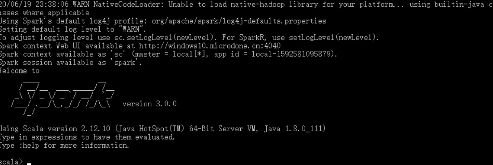

2) 在 bin 目录中创建 input 目录，并添加 word.txt 文件, 在命令行中输入脚本代码

   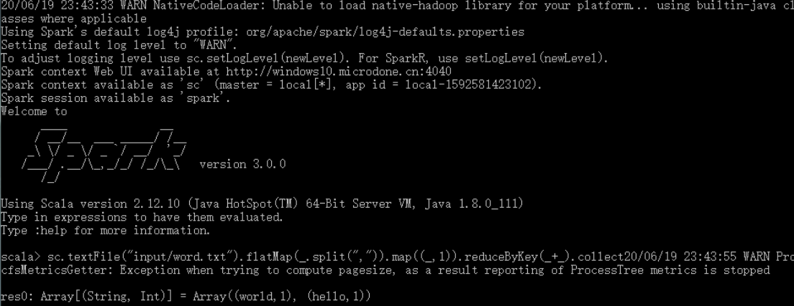

### 3.5.3 命令行提交应用  

在 DOS 命令行窗口中执行提交指令

```shell
spark-submit --class org.apache.spark.examples.SparkPi --master
local[2] ../examples/jars/spark-examples_2.12-3.0.0.jar 10
```

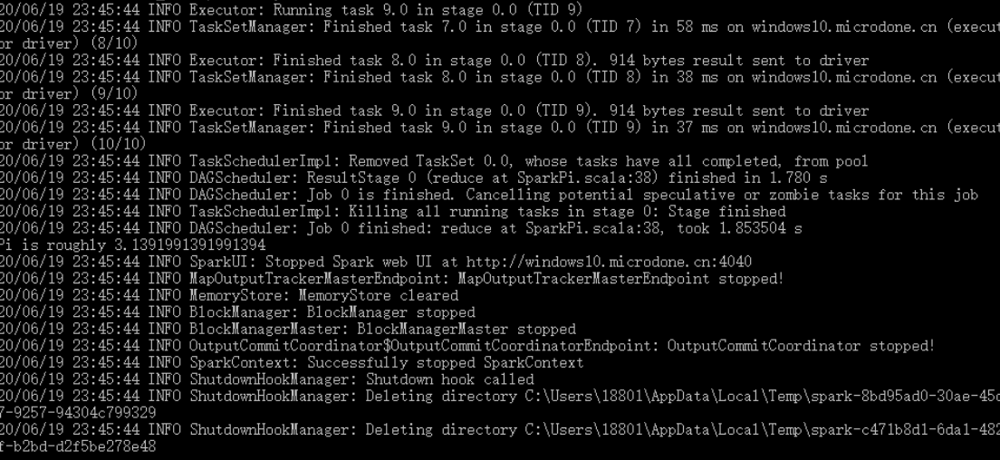

## 3.6 部署模式对比  

| 模式       | Spark 安装机器数 | 需启动的进程     | 所属者 | 应用场景 |
| ---------- | ---------------- | ---------------- | ------ | -------- |
| Local      | 1                | 无               | Spark  | 测试     |
| Standalone | 3                | Master 及 Worker | Spark  | 单独部署 |
| Yarn       | 1                | Yarn 及 HDFS     | Hadoop | 混合部署 |

## 3.7 端口号  

* Spark 查看当前 Spark-shell 运行任务情况端口号： 4040（计算）
* Spark Master 内部通信服务端口号： 7077
* Standalone 模式下， Spark Master Web 端口号： 8080（资源）
* Spark 历史服务器端口号： 18080
* Hadoop YARN 任务运行情况查看端口号： 8088  

# 第4章 Spark 运行架构  

## 4.1 运行架构  

Spark 框架的核心是一个计算引擎，整体来说，它采用了标准 master-slave 的结构。
如下图所示，它展示了一个 Spark 执行时的基本结构。 图形中的 Driver 表示 master，负责管理整个集群中的作业任务调度。图形中的 Executor 则是 slave，负责实际执行任务。  

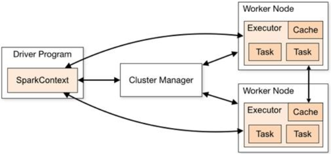

## 4.2 核心组件  

由上图可以看出，对于 Spark 框架有两个核心组件：  

### 4.2.1 Driver  

Spark 驱动器节点，用于执行 Spark 任务中的 main 方法，负责实际代码的执行工作。Driver 在 Spark 作业执行时主要负责：  

* 将用户程序转化为作业（job）
* Executor 之间调度任务(task)
* 跟踪 Executor 的执行情况
* 通过 UI 展示查询运行情况  

实际上，我们无法准确地描述 Driver 的定义，因为在整个的编程过程中没有看到任何有关Driver 的字眼。所以简单理解，所谓的 Driver 就是驱使整个应用运行起来的程序，也称之为Driver 类。  

### 4.2.2 Executor  

Spark Executor 是集群中工作节点（Worker）中的一个 JVM 进程，负责在 Spark 作业中运行具体任务（Task） ，任务彼此之间相互独立。 Spark 应用启动时， Executor 节点被同时启动，并且始终伴随着整个 Spark 应用的生命周期而存在。如果有 Executor 节点发生了故障或崩溃， Spark 应用也可以继续执行，会将出错节点上的任务调度到其他 Executor 节点上继续运行。  

Executor 有两个核心功能：  

* 负责运行组成 Spark 应用的任务，并将结果返回给驱动器进程
* 它们通过自身的块管理器（Block Manager）为用户程序中要求缓存的 RDD 提供内存
  式存储。 RDD 是直接缓存在 Executor 进程内的，因此任务可以在运行时充分利用缓存
  数据加速运算。  

### 4.2.3 Master & Worker  

Spark 集群的独立部署环境中，不需要依赖其他的资源调度框架，自身就实现了资源调度的功能，所以环境中还有其他两个核心组件： Master 和 Worker，这里的 Master 是一个进程，主要负责资源的调度和分配，并进行集群的监控等职责，类似于 Yarn 环境中的 RM, 而Worker 呢，也是进程，一个 Worker 运行在集群中的一台服务器上，由 Master 分配资源对数据进行并行的处理和计算，类似于 Yarn 环境中 NM。  

### 4.2.4 ApplicationMaster  

Hadoop 用户向 YARN 集群提交应用程序时,提交程序中应该包含 ApplicationMaster，用于向资源调度器申请执行任务的资源容器 Container，运行用户自己的程序任务 job，监控整个任务的执行，跟踪整个任务的状态，处理任务失败等异常情况。

说的简单点就是， ResourceManager（资源）和 Driver（计算）之间的解耦合靠的就是ApplicationMaster。  

## 4.3 核心概念  

### 4.3.1 Executor 与 Core  

Spark Executor 是集群中运行在工作节点（Worker）中的一个 JVM 进程，是整个集群中的专门用于计算的节点。在提交应用中，可以提供参数指定计算节点的个数，以及对应的资源。这里的资源一般指的是工作节点 Executor 的内存大小和使用的虚拟 CPU 核（Core）数量。  

应用程序相关启动参数如下：  

| 名称              | 说明                                   |
| ----------------- | -------------------------------------- |
| --num-executors   | 配置 Executor 的数量                   |
| --executor-memory | 配置每个 Executor 的内存大小           |
| --executor-cores  | 配置每个 Executor 的虚拟 CPU core 数量 |

### 4.3.2 并行度（ Parallelism）  

在分布式计算框架中一般都是多个任务同时执行，由于任务分布在不同的计算节点进行计算，所以能够真正地实现多任务并行执行，记住，这里是并行，而不是并发。这里我们将整个集群并行执行任务的数量称之为并行度。那么一个作业到底并行度是多少呢？这个取决于框架的默认配置。应用程序也可以在运行过程中动态修改。  

### 4.3.3 有向无环图（ DAG）  

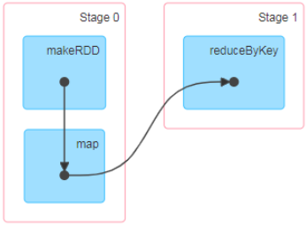

大数据计算引擎框架我们根据使用方式的不同一般会分为四类，其中第一类就是Hadoop 所承载的 MapReduce,它将计算分为两个阶段，分别为 Map 阶段 和 Reduce 阶段。对于上层应用来说，就不得不想方设法去拆分算法，甚至于不得不在上层应用实现多个 Job的串联，以完成一个完整的算法，例如迭代计算。 由于这样的弊端，催生了支持 DAG 框架的产生。 因此，支持 DAG 的框架被划分为第二代计算引擎。如 Tez 以及更上层的Oozie。这里我们不去细究各种 DAG 实现之间的区别，不过对于当时的 Tez 和 Oozie 来说，大多还是批处理的任务。接下来就是以 Spark 为代表的第三代的计算引擎。第三代计算引擎的特点主要是 Job 内部的 DAG 支持（不跨越 Job），以及实时计算。

这里所谓的有向无环图，并不是真正意义的图形，而是由 Spark 程序直接映射成的数据流的高级抽象模型。简单理解就是将整个程序计算的执行过程用图形表示出来,这样更直观，更便于理解，可以用于表示程序的拓扑结构。  

DAG（Directed Acyclic Graph）有向无环图是由点和线组成的拓扑图形，该图形具有方
向，不会闭环。  

## 4.4 提交流程  

所谓的提交流程，其实就是我们开发人员根据需求写的应用程序通过 Spark 客户端提交给 Spark 运行环境执行计算的流程。在不同的部署环境中，这个提交过程基本相同，但是又有细微的区别，我们这里不进行详细的比较，但是因为国内工作中，将 Spark 引用部署到Yarn 环境中会更多一些，所以本课程中的提交流程是基于 Yarn 环境的。  

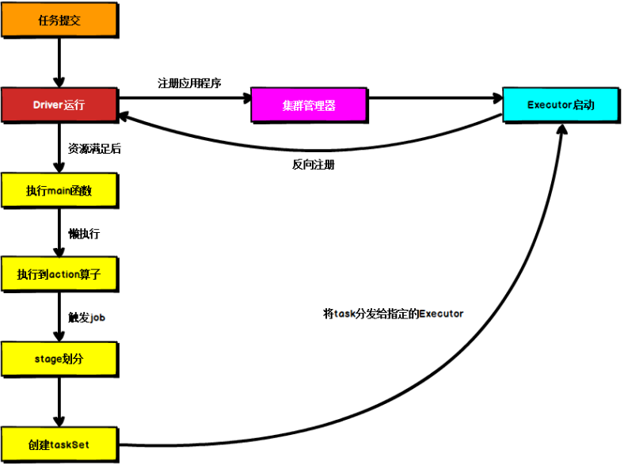

Spark 应用程序提交到 Yarn 环境中执行的时候，一般会有两种部署执行的方式： Client和 Cluster。 两种模式主要区别在于： Driver 程序的运行节点位置。  

### 4.4.1 Yarn Client 模式  

Client 模式将用于监控和调度的 Driver 模块在客户端执行，而不是在 Yarn 中，所以一般用于测试。  

Driver 在任务提交的本地机器上运行

* Driver 启动后会和 ResourceManager 通讯申请启动 ApplicationMaster
* ResourceManager 分配 container，在合适的 NodeManager 上启动 ApplicationMaster， 负责向 ResourceManager 申请 Executor 内存
* ResourceManager 接到 ApplicationMaster 的资源申请后会分配 container，然后ApplicationMaster 在资源分配指定的 NodeManager 上启动 Executor 进程 
* Executor 进程启动后会向 Driver 反向注册， Executor 全部注册完成后 Driver 开始执行main 函数
* 之后执行到 Action 算子时，触发一个 Job，并根据宽依赖开始划分 stage，每个 stage 生
  成对应的 TaskSet，之后将 task 分发到各个 Executor 上执行。  

### 4.4.2 Yarn Cluster 模式  

Cluster 模式将用于监控和调度的 Driver 模块启动在 Yarn 集群资源中执行。一般应用于实际生产环境。  

在 YARN Cluster 模式下，任务提交后会和 ResourceManager 通讯申请启动ApplicationMaster，

* 随后 ResourceManager 分配 container，在合适的 NodeManager 上启动 ApplicationMaster，此时的 ApplicationMaster 就是 Driver。
* Driver 启动后向 ResourceManager 申请 Executor 内存， ResourceManager 接到ApplicationMaster 的资源申请后会分配 container，然后在合适的 NodeManager 上启动Executor 进程
* Executor 进程启动后会向 Driver 反向注册， Executor 全部注册完成后 Driver 开始执行main 函数，
* 之后执行到 Action 算子时，触发一个 Job，并根据宽依赖开始划分 stage，每个 stage 生
  成对应的 TaskSet，之后将 task 分发到各个 Executor 上执行。  

# 第5章 Spark 核心编程  

Spark 计算框架为了能够进行高并发和高吞吐的数据处理，封装了三大数据结构，用于处理不同的应用场景。三大数据结构分别是：  

* RDD : 弹性分布式数据集
* 累加器：分布式共享只写变量
* 广播变量：分布式共享只读变量
  接下来我们一起看看这三大数据结构是如何在数据处理中使用的。  

## 5.1 RDD  

### 5.1.1 什么是 RDD  

RDD（Resilient Distributed Dataset）叫做弹性分布式数据集，是 Spark 中最基本的数据处理模型。代码中是一个抽象类，它代表一个弹性的、不可变、可分区、里面的元素可并行计算的集合。  

* 弹性
  * 存储的弹性：内存与磁盘的自动切换；
  * 容错的弹性：数据丢失可以自动恢复；
  * 计算的弹性：计算出错重试机制；
  * 分片的弹性：可根据需要重新分片。  
* 分布式：数据存储在大数据集群不同节点上
* 数据集： RDD 封装了计算逻辑，并不保存数据
* 数据抽象： RDD 是一个抽象类，需要子类具体实现
* 不可变： RDD 封装了计算逻辑，是不可以改变的，想要改变，只能产生新的 RDD，在新的 RDD 里面封装计算逻辑
* 可分区、并行计算  

概念分析与总结

RDD 的简单基本原理

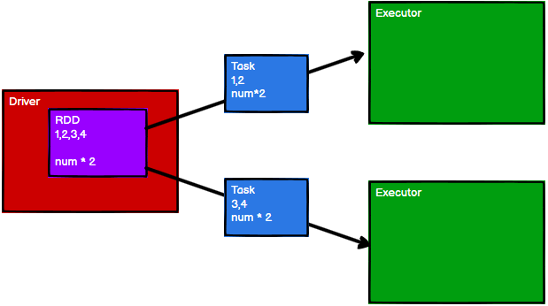

RDD与IO的关系图

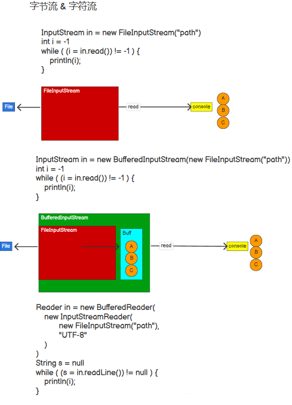

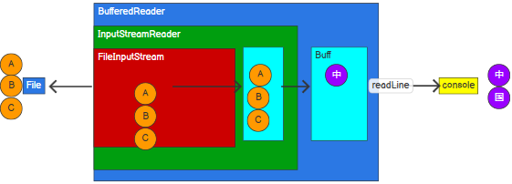

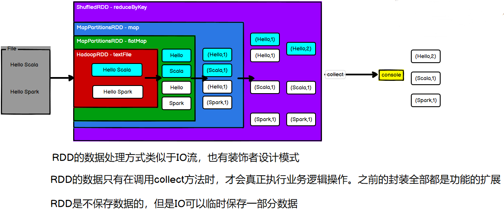

RDD的数据处理方式类似于IO流，也有装饰者设计模式
RDD的数据只有在调用collect方法时，才会真正执行业务逻辑操作
之前的封装全部都是功能的扩展RDD是不保存数据的，但是IO可以临时保存一部分数据

### 5.1.2 核心属性  

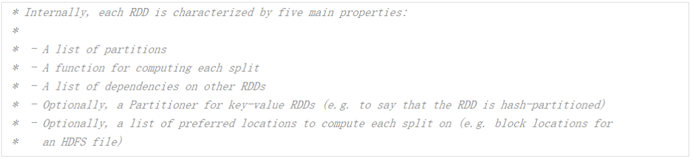

* 分区列表

  RDD 数据结构中存在分区列表，用于执行任务时并行计算，是实现分布式计算的重要属性。  

  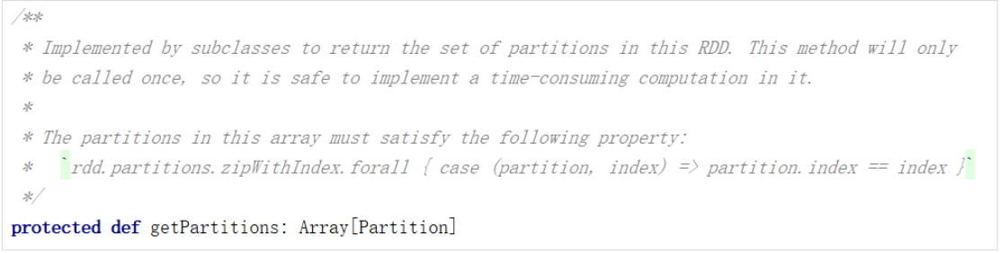

* 分区计算函数  

  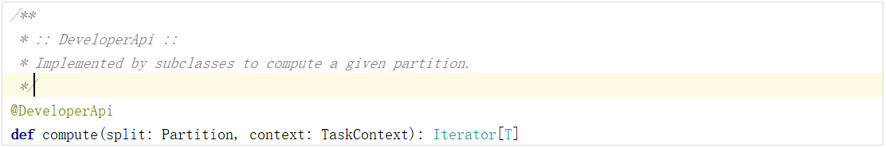

* RDD 之间的依赖关系  

  RDD 是计算模型的封装，当需求中需要将多个计算模型进行组合时，就需要将多个 RDD 建立依赖关系  

  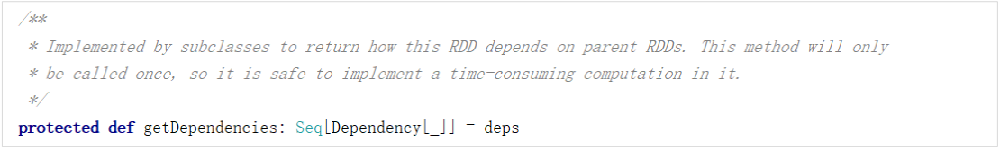

* 分区器（可选）

  当数据为 KV 类型数据时，可以通过设定分区器自定义数据的分区  

  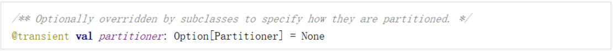

* 首选位置（可选）

  计算数据时，可以根据计算节点的状态选择不同的节点位置进行计算  

  
