# 第1章 Spark 概述

## 1.1 Spark 是什么  

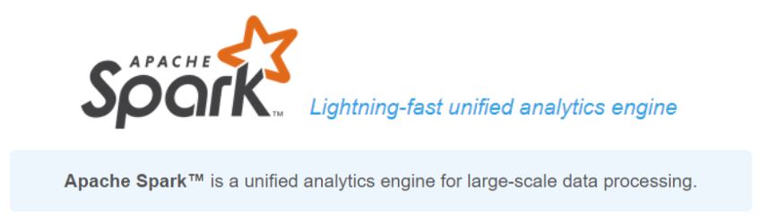

Spark 是一种基于内存的快速、通用、可扩展的大数据分析计算引擎。  

## 1.2 Spark and Hadoop  

在之前的学习中， Hadoop 的 MapReduce 是大家广为熟知的计算框架，那为什么咱们还要学习新的计算框架 Spark 呢，这里就不得不提到 Spark 和 Hadoop 的关系。

首先从时间节点上来看:  

➢ Hadoop

* 2006 年 1 月， Doug Cutting 加入 Yahoo，领导 Hadoop 的开发
* 2008 年 1 月， Hadoop 成为 Apache 顶级项目
* 2011 年 1.0 正式发布
* 2012 年 3 月稳定版发布
* 2013 年 10 月发布 2.X (Yarn)版本

➢ Spark

* 2009 年， Spark 诞生于伯克利大学的 AMPLab 实验室
* 2010 年，伯克利大学正式开源了 Spark 项目
* 2013 年 6 月， Spark 成为了 Apache 基金会下的项目
* 2014 年 2 月， Spark 以飞快的速度成为了 Apache 的顶级项目
* 2015 年至今， Spark 变得愈发火爆，大量的国内公司开始重点部署或者使用 Spark  

然后我们再从功能上来看:  

➢ Hadoop  

* Hadoop 是由 java 语言编写的，在分布式服务器集群上存储海量数据并运行分布式分析应用的开源框架
* 作为 Hadoop 分布式文件系统， HDFS 处于 Hadoop 生态圈的最下层，存储着所有的 数 据 ， 支 持 着 Hadoop 的 所 有 服 务 。 它 的 理 论 基 础 源 于 Google 的TheGoogleFileSystem 这篇论文，它是 GFS 的开源实现。
* MapReduce 是一种编程模型， Hadoop 根据 Google 的 MapReduce 论文将其实现，作为 Hadoop 的分布式计算模型，是 Hadoop 的核心。基于这个框架，分布式并行程序的编写变得异常简单。综合了 HDFS 的分布式存储和 MapReduce 的分布式计算， Hadoop 在处理海量数据时， 性能横向扩展变得非常容易。
* HBase 是对 Google 的 Bigtable 的开源实现，但又和 Bigtable 存在许多不同之处。HBase 是一个基于 HDFS 的分布式数据库，擅长实时地随机读/写超大规模数据集。它也是 Hadoop 非常重要的组件。  

➢ Spark

* Spark 是一种由 Scala 语言开发的快速、通用、可扩展的大数据分析引擎
* Spark Core 中提供了 Spark 最基础与最核心的功能
* Spark SQL 是 Spark 用来操作结构化数据的组件。通过 Spark SQL，用户可以使用SQL 或者 Apache Hive 版本的 SQL 方言（HQL）来查询数据。
* Spark Streaming 是 Spark 平台上针对实时数据进行流式计算的组件，提供了丰富的处理数据流的 API。  

由上面的信息可以获知， Spark 出现的时间相对较晚，并且主要功能主要是用于数据计算，所以其实 Spark 一直被认为是 Hadoop 框架的升级版。  

## 1.3 Spark or Hadoop  

Hadoop 的 MR 框架和 Spark 框架都是数据处理框架，那么我们在使用时如何选择呢？  

* Hadoop MapReduce 由于其设计初衷并不是为了满足循环迭代式数据流处理，因此在多并行运行的数据可复用场景（如：机器学习、图挖掘算法、交互式数据挖掘算法）中存在诸多计算效率等问题。所以 Spark 应运而生， Spark 就是在传统的 MapReduce 计算框架的基础上，利用其计算过程的优化，从而大大加快了数据分析、挖掘的运行和读写速度，并将计算单元缩小到更适合并行计算和重复使用的 RDD 计算模型。  
* 机器学习中 ALS、凸优化梯度下降等。这些都需要基于数据集或者数据集的衍生数据反复查询反复操作。 MR 这种模式不太合适，即使多 MR 串行处理，性能和时间也是一个问题。数据的共享依赖于磁盘。另外一种是交互式数据挖掘， MR 显然不擅长。而Spark 所基于的 scala 语言恰恰擅长函数的处理。
* Spark 是一个分布式数据快速分析项目。它的核心技术是弹性分布式数据集（Resilient Distributed Datasets），提供了比 MapReduce 丰富的模型，可以快速在内存中对数据集进行多次迭代，来支持复杂的数据挖掘算法和图形计算算法。
* Spark 和Hadoop 的根本差异是多个作业之间的数据通信问题 : Spark 多个作业之间数据通信是基于内存，而 Hadoop 是基于磁盘。
* Spark Task 的启动时间快。 Spark 采用 fork 线程的方式，而 Hadoop 采用创建新的进程的方式。
* Spark 只有在 shuffle 的时候将数据写入磁盘，而 Hadoop 中多个 MR 作业之间的数据交互都要依赖于磁盘交互。
* Spark 的缓存机制比 HDFS 的缓存机制高效。  

经过上面的比较，我们可以看出在绝大多数的数据计算场景中， Spark 确实会比 MapReduce更有优势。但是 Spark 是基于内存的，所以在实际的生产环境中，由于内存的限制，可能会由于内存资源不够导致 Job 执行失败，此时， MapReduce 其实是一个更好的选择，所以 Spark并不能完全替代 MR。  

## 1.4 Spark 核心模块  

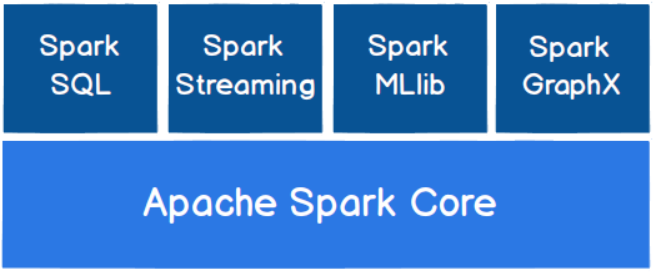

➢ Spark Core
Spark Core 中提供了 Spark 最基础与最核心的功能， Spark 其他的功能如： Spark SQL，Spark Streaming， GraphX, MLlib 都是在 Spark Core 的基础上进行扩展的。
➢ Spark SQL
Spark SQL 是 Spark 用来操作结构化数据的组件。通过 Spark SQL，用户可以使用 SQL或者 Apache Hive 版本的 SQL 方言（HQL）来查询数据。
➢ Spark Streaming
Spark Streaming 是 Spark 平台上针对实时数据进行流式计算的组件，提供了丰富的处理数据流的 API。
➢ Spark MLlib
MLlib 是 Spark 提供的一个机器学习算法库。 MLlib 不仅提供了模型评估、数据导入等额外的功能，还提供了一些更底层的机器学习原语。
➢ Spark GraphX
GraphX 是 Spark 面向图计算提供的框架与算法库。  

# 第2章 Spark 快速上手  

在大数据早期的课程中我们已经学习了 MapReduce 框架的原理及基本使用，并了解了其底层数据处理的实现方式。接下来，就让咱们走进 Spark 的世界，了解一下它是如何带领我们完成数据处理的。  

## 2.1 创建 Maven 项目  

### 2.1.1 增加 Scala 插件  

Spark 由 Scala 语言开发的，所以本课件接下来的开发所使用的语言也为 Scala， 咱们当前使用的 Spark 版本为 3.0.0，默认采用的 Scala 编译版本为 2.12，所以后续开发时。我们依然采用这个版本。 开发前请保证 IDEA 开发工具中含有 Scala 开发插件  

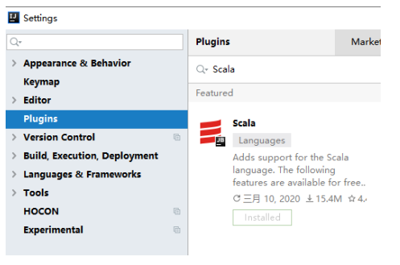

### 2.1.2 增加依赖关系  

修改 Maven 项目中的 POM 文件，增加 Spark 框架的依赖关系。 本课件基于 Spark3.0 版本，使用时请注意对应版本。  

```
<dependencies>
    <dependency>
        <groupId>org.apache.spark</groupId>
        <artifactId>spark-core_2.12</artifactId>
        <version>3.0.0</version>
    </dependency>
</dependencies>

<build>
    <plugins>
        <!-- 该插件用于将 Scala 代码编译成 class 文件 -->
        <plugin>
            <groupId>net.alchim31.maven</groupId>
            <artifactId>scala-maven-plugin</artifactId>
            <version>3.2.2</version>
            <executions>
                <execution>
                    <!-- 声明绑定到 maven 的 compile 阶段 -->
                    <goals>
                    	<goal>testCompile</goal>
                    </goals>
                </execution>
            </executions>
         </plugin>
         <plugin>
            <groupId>org.apache.maven.plugins</groupId>
            <artifactId>maven-assembly-plugin</artifactId>
            <version>3.1.0</version>
            <configuration>
                <descriptorRefs>
                    <descriptorRef>jar-with-dependencies</descriptorRef>
                </descriptorRefs>
            </configuration>
            <executions>
                <execution>
                    <id>make-assembly</id>
                    <phase>package</phase>
                    <goals>
                        <goal>single</goal>
                    </goals>
                </execution>
            </executions>
        </plugin>
    </plugins>
</build>
```

### 2.1.3 WordCount  

为了能直观地感受 Spark 框架的效果，接下来我们实现一个大数据学科中最常见的教学案例 WordCount  

```scala
// 创建 Spark 运行配置对象
val sparkConf = new SparkConf().setMaster("local[*]").setAppName("WordCount")
// 创建 Spark 上下文环境对象（连接对象）
val sc : SparkContext = new SparkContext(sparkConf)
// 读取文件数据
val fileRDD: RDD[String] = sc.textFile("input/word.txt")
// 将文件中的数据进行分词
val wordRDD: RDD[String] = fileRDD.flatMap( _.split(" ") )
// 转换数据结构 word => (word, 1)
val word2OneRDD: RDD[(String, Int)] = wordRDD.map((_,1))
// 将转换结构后的数据按照相同的单词进行分组聚合
val word2CountRDD: RDD[(String, Int)] = word2OneRDD.reduceByKey(_+_)
// 将数据聚合结果采集到内存中
val word2Count: Array[(String, Int)] = word2CountRDD.collect()
// 打印结果
word2Count.foreach(println)
//关闭 Spark 连接
sc.stop()
```

执行过程中，会产生大量的执行日志，如果为了能够更好的查看程序的执行结果，可以在项目的 resources 目录中创建 log4j.properties 文件，并添加日志配置信息：  

```properties
log4j.rootCategory=ERROR, console
log4j.appender.console=org.apache.log4j.ConsoleAppender
log4j.appender.console.target=System.err
log4j.appender.console.layout=org.apache.log4j.PatternLayout
log4j.appender.console.layout.ConversionPattern=%d{yy/MM/dd
HH:mm:ss} %p %c{1}: %m%n
# Set the default spark-shell log level to ERROR. When running the spark-shell,
the
# log level for this class is used to overwrite the root logger's log level, so
that
# the user can have different defaults for the shell and regular Spark apps.
log4j.logger.org.apache.spark.repl.Main=ERROR
# Settings to quiet third party logs that are too verbose
log4j.logger.org.spark_project.jetty=ERROR
log4j.logger.org.spark_project.jetty.util.component.AbstractLifeCycle=ERROR
log4j.logger.org.apache.spark.repl.SparkIMain$exprTyper=ERROR
log4j.logger.org.apache.spark.repl.SparkILoop$SparkILoopInterpreter=ERROR
log4j.logger.org.apache.parquet=ERROR
log4j.logger.parquet=ERROR
# SPARK-9183: Settings to avoid annoying messages when looking up nonexistent
UDFs in SparkSQL with Hive support
log4j.logger.org.apache.hadoop.hive.metastore.RetryingHMSHandler=FATAL
log4j.logger.org.apache.hadoop.hive.ql.exec.FunctionRegistry=ERROR
```

### 2.1.4 异常处理  

如果本机操作系统是 Windows，在程序中使用了 Hadoop 相关的东西，比如写入文件到HDFS，则会遇到如下异常：  

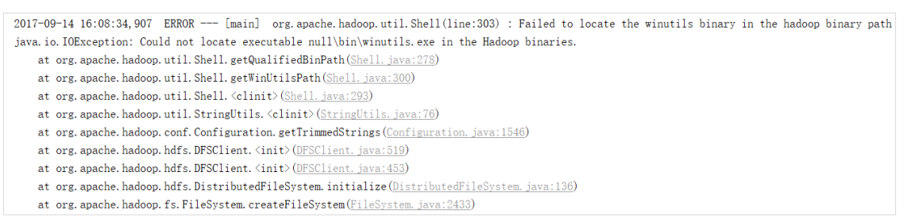

出现这个问题的原因，并不是程序的错误，而是 windows 系统用到了 hadoop 相关的服务，解决办法是通过配置关联到 windows 的系统依赖就可以了  

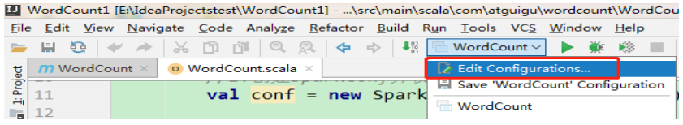

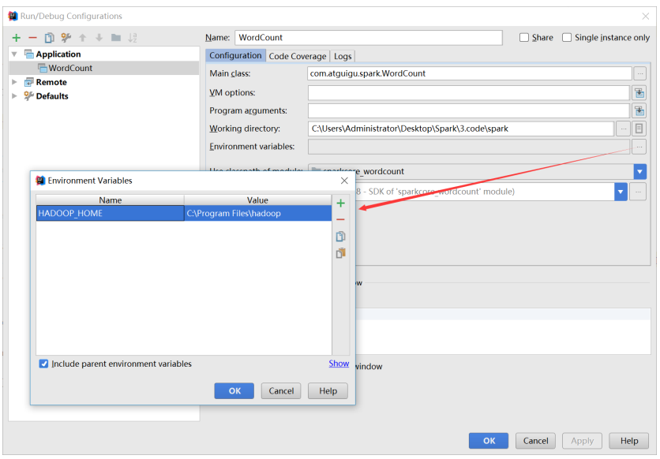

# 第3章 Spark 运行环境  

Spark 作为一个数据处理框架和计算引擎，被设计在所有常见的集群环境中运行, 在国内工作中主流的环境为 Yarn，不过逐渐容器式环境也慢慢流行起来。接下来，我们就分别看看不同环境下 Spark 的运行  

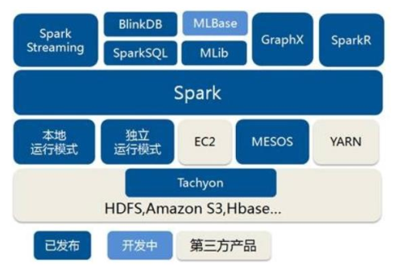

## 3.1 Local 模式  

之前一直在使用的模式可不是 Local 模式哟。所谓的 Local 模式，就是不需要其他任何节点资源就可以在本地执行 Spark 代码的环境，一般用于教学，调试，演示等，之前在 IDEA 中运行代码的环境我们称之为开发环境，不太一样。  

### 3.1.1 解压缩文件  

将 spark-3.0.0-bin-hadoop3.2.tgz 文件上传到 Linux 并解压缩，放置在指定位置，路径中不要包含中文或空格，后续如果涉及到解压缩操作，不再强调。  

```shell
tar -zxvf spark-3.0.0-bin-hadoop3.2.tgz -C /opt/module
cd /opt/module
mv spark-3.0.0-bin-hadoop3.2 spark-local
```

### 3.1.2 启动 Local 环境  

1) 进入解压缩后的路径，执行如下指令  

```shell
bin/spark-shell
```

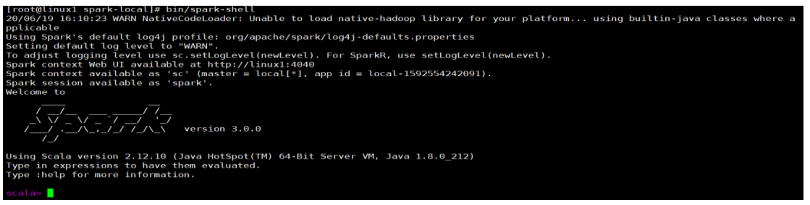

2) 启动成功后，可以输入网址进行 Web UI 监控页面访问  

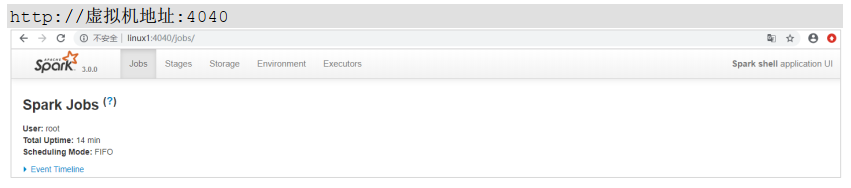

### 3.1.3 命令行工具  

在解压缩文件夹下的 data 目录中，添加 word.txt 文件。在命令行工具中执行如下代码指令（和 IDEA 中代码简化版一致）  

```scala
sc.textFile("data/word.txt").flatMap(_.split("")).map((_,1)).reduceByKey(_+_).collect
```

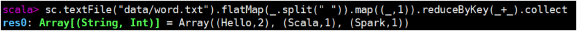

### 3.1.4 退出本地模式  

按键 Ctrl+C 或输入 Scala 指令  `:quit  `

### 3.1.5 提交应用  

```shell
bin/spark-submit \
--class org.apache.spark.examples.SparkPi \
--master local[2] \
./examples/jars/spark-examples_2.12-3.0.0.jar \
10
```

1. --class 表示要执行程序的主类， 此处可以更换为咱们自己写的应用程序

2. -master local[2] 部署模式，默认为本地模式，数字表示分配的虚拟 CPU 核数量

3. spark-examples_2.12-3.0.0.jar 运行的应用类所在的 jar 包， 实际使用时，可以设定为咱们自己打的 jar 包

4. 数字 10 表示程序的入口参数，用于设定当前应用的任务数量  

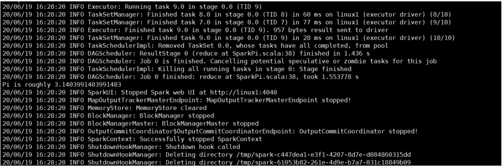

## 3.2 Standalone 模式  

local 本地模式毕竟只是用来进行练习演示的，真实工作中还是要将应用提交到对应的集群中去执行，这里我们来看看只使用 Spark 自身节点运行的集群模式，也就是我们所谓的独立部署（Standalone）模式。 Spark 的 Standalone 模式体现了经典的 master-slave 模式。集群规划:  


### 3.2.1 解压缩文件  

将 spark-3.0.0-bin-hadoop3.2.tgz 文件上传到 Linux 并解压缩在指定位置  

```shell
tar -zxvf spark-3.0.0-bin-hadoop3.2.tgz -C /opt/module
cd /opt/module
mv spark-3.0.0-bin-hadoop3.2 spark-standalone
```

### 3.2.2 修改配置文件  

1) 进入解压缩后路径的 conf 目录，修改 slaves.template 文件名为 slaves  

```shell
mv slaves.template slaves
```

2) 修改 slaves 文件，添加 work 节点  

```properties
linux1
linux2
linux3
```

3) 修改 spark-env.sh.template 文件名为 spark-env.sh  

```shell
mv spark-env.sh.template spark-env.sh
```

4) 修改 spark-env.sh 文件，添加 JAVA_HOME 环境变量和集群对应的 master 节点  

```shell
export JAVA_HOME=/opt/module/jdk1.8.0_144
SPARK_MASTER_HOST=linux1
SPARK_MASTER_PORT=7077
```

注意： 7077 端口，相当于 hadoop3 内部通信的 8020 端口，此处的端口需要确认自己的 Hadoop配置  

5) 分发 spark-standalone 目录  

```shell
xsync spark-standalone
```

### 3.2.3 启动集群  

1) 执行脚本命令：  

```shell
sbin/start-all.sh
```

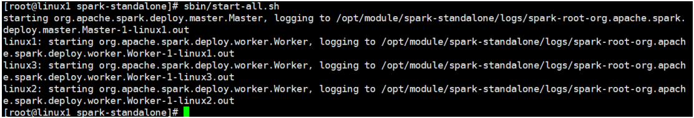

2) 查看三台服务器运行进程  

```shell
================linux1================
3330 Jps
3238 Worker
3163 Master
================linux2================
2966 Jps
2908 Worker
================linux3================
2978 Worker
3036 Jps  
```

3) 查看 Master 资源监控 Web UI 界面: http://linux1:8080  

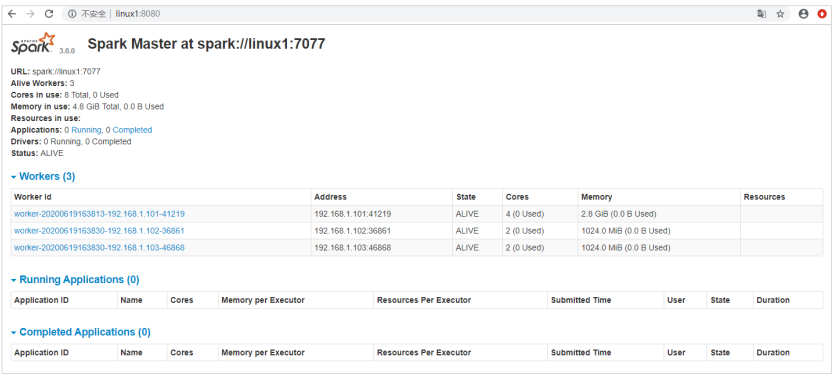

### 3.2.4 提交应用  

```shell
bin/spark-submit \
--class org.apache.spark.examples.SparkPi \
--master spark://linux1:7077 \
./examples/jars/spark-examples_2.12-3.0.0.jar \
10
```

1) --class 表示要执行程序的主类
2) --master spark://linux1:7077 独立部署模式，连接到 Spark 集群
3) spark-examples_2.12-3.0.0.jar 运行类所在的 jar 包
4) 数字 10 表示程序的入口参数，用于设定当前应用的任务数量  

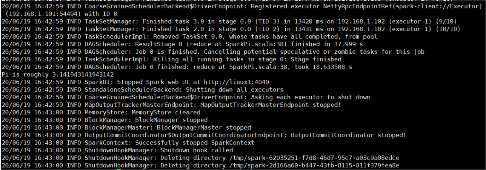

执行任务时，会产生多个 Java 进程  

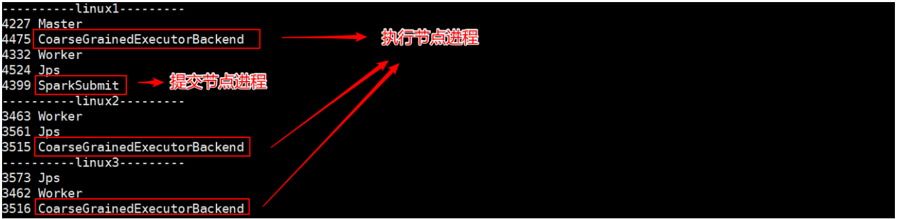

执行任务时，默认采用服务器集群节点的总核数，每个节点内存 1024M。  

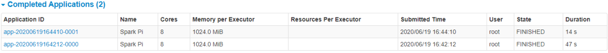

### 3.2.5 提交参数说明  

在提交应用中，一般会同时一些提交参数  

```shell
bin/spark-submit \
--class <main-class>
--master <master-url> \
... # other options
<application-jar> \
[application-arguments]
```

| 参数                     | 解释                                                         | 可选值举例                                   |
| :----------------------- | :----------------------------------------------------------- | :------------------------------------------- |
| --class                  | Spark 程序中包含主函数的类                                   |                                              |
| --master                 | Spark 程序运行的模式(环境)                                   | 模式： local[*]、 spark://linux1:7077、 Yarn |
| --executor-memory 1G     | 指定每个 executor 可用内存为 1G                              | 符合集群内存配置即可，具体情况具体分 析。    |
| --total-executor-cores 2 | 指定所有executor使用的cpu核数  为 2 个                       |                                              |
| --executor-cores         | 指定每个executor使用的cpu核数                                |                                              |
| application-jar          | 打包好的应用 jar，包含依赖。这 个 URL 在集群中全局可见。 比 如 hdfs:// 共享存储系统，如果是file:// path，那么所有的节点的 path 都包含同样的 jar |                                              |
| application-arguments    | 传给 main()方法的参数                                        |                                              |
