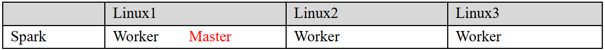
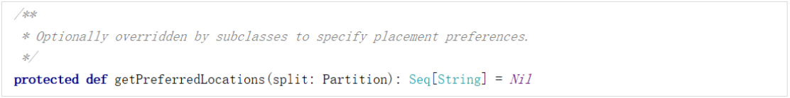
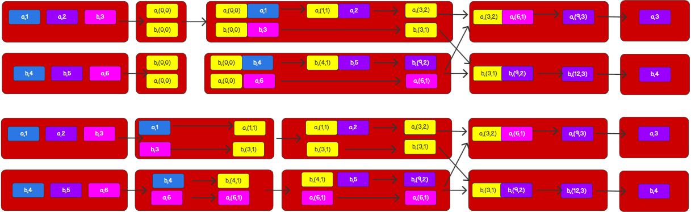

# 第1章 Spark 概述

## 1.1 Spark 是什么  


Spark 是一种基于内存的快速、通用、可扩展的大数据分析计算引擎。  

## 1.2 Spark and Hadoop  

在之前的学习中， Hadoop 的 MapReduce 是大家广为熟知的计算框架，那为什么咱们还要学习新的计算框架 Spark 呢，这里就不得不提到 Spark 和 Hadoop 的关系。

首先从时间节点上来看:  

➢ Hadoop

* 2006 年 1 月，Doug Cutting 加入 Yahoo，领导 Hadoop 的开发
* 2008 年 1 月，Hadoop 成为 Apache 顶级项目
* 2011 年 1.0 正式发布
* 2012 年 3 月稳定版发布
* 2013 年 10 月发布 2.X (Yarn)版本

➢ Spark

* 2009 年，Spark 诞生于伯克利大学的 AMPLab 实验室
* 2010 年，伯克利大学正式开源了 Spark 项目
* 2013 年 6 月，Spark 成为了 Apache 基金会下的项目
* 2014 年 2 月，Spark 以飞快的速度成为了 Apache 的顶级项目
* 2015 年至今，Spark 变得愈发火爆，大量的国内公司开始重点部署或者使用 Spark  

然后我们再从功能上来看:  

➢ Hadoop  

* Hadoop 是由 java 语言编写的，在分布式服务器集群上存储海量数据并运行分布式分析应用的开源框架
* 作为 Hadoop 分布式文件系统， HDFS 处于 Hadoop 生态圈的最下层，存储着所有的数据 ， 支持着 Hadoop 的所有服务 。 它的理论基础源于 Google 的TheGoogleFileSystem 这篇论文，它是 GFS 的开源实现。
* MapReduce 是一种编程模型，Hadoop 根据 Google 的 MapReduce 论文将其实现，作为 Hadoop 的分布式计算模型，是 Hadoop 的核心。基于这个框架，分布式并行程序的编写变得异常简单。综合了 HDFS 的分布式存储和 MapReduce 的分布式计算， Hadoop 在处理海量数据时， 性能横向扩展变得非常容易。
* HBase 是对 Google 的 Bigtable 的开源实现，但又和 Bigtable 存在许多不同之处。HBase 是一个基于 HDFS 的分布式数据库，擅长实时地随机读/写超大规模数据集。它也是 Hadoop 非常重要的组件。

➢ Spark

* Spark 是一种由 Scala 语言开发的快速、通用、可扩展的大数据分析引擎
* Spark Core 中提供了 Spark 最基础与最核心的功能
* Spark SQL 是 Spark 用来操作结构化数据的组件。通过 Spark SQL，用户可以使用SQL 或者 Apache Hive 版本的 SQL 方言（HQL）来查询数据。
* Spark Streaming 是 Spark 平台上针对实时数据进行流式计算的组件，提供了丰富的处理数据流的 API。  

由上面的信息可以获知，Spark 出现的时间相对较晚，并且主要功能主要是用于数据计算，所以其实 Spark 一直被认为是 Hadoop 框架的升级版。

## 1.3 Spark or Hadoop

Hadoop 的 MR 框架和 Spark 框架都是数据处理框架，那么我们在使用时如何选择呢？  

* Hadoop MapReduce 由于其设计初衷并不是为了满足循环迭代式数据流处理，因此在多并行运行的数据可复用场景（如：机器学习、图挖掘算法、交互式数据挖掘算法）中存在诸多计算效率等问题。所以 Spark 应运而生， Spark 就是在传统的 MapReduce 计算框架的基础上，利用其计算过程的优化，从而大大加快了数据分析、挖掘的运行和读写速度，并将计算单元缩小到更适合并行计算和重复使用的 RDD 计算模型。  
* 机器学习中 ALS、凸优化梯度下降等。这些都需要基于数据集或者数据集的衍生数据反复查询反复操作。 MR 这种模式不太合适，即使多 MR 串行处理，性能和时间也是一个问题。数据的共享依赖于磁盘。另外一种是交互式数据挖掘， MR 显然不擅长。而Spark 所基于的 scala 语言恰恰擅长函数的处理。
* Spark 是一个分布式数据快速分析项目。它的核心技术是弹性分布式数据集（Resilient Distributed Datasets），提供了比 MapReduce 丰富的模型，可以快速在内存中对数据集进行多次迭代，来支持复杂的数据挖掘算法和图形计算算法。
* Spark 和Hadoop 的根本差异是多个作业之间的数据通信问题 : Spark 多个作业之间数据通信是基于内存，而 Hadoop 是基于磁盘。
* Spark Task 的启动时间快。 Spark 采用 fork 线程的方式，而 Hadoop 采用创建新的进程的方式。
* Spark 只有在 shuffle 的时候将数据写入磁盘，而 Hadoop 中多个 MR 作业之间的数据交互都要依赖于磁盘交互。
* Spark 的缓存机制比 HDFS 的缓存机制高效。  

经过上面的比较，我们可以看出在绝大多数的数据计算场景中，Spark 确实会比 MapReduce更有优势。但是 Spark 是基于内存的，所以在实际的生产环境中，由于内存的限制，可能会由于内存资源不够导致 Job 执行失败，此时，MapReduce 其实是一个更好的选择，所以 Spark 并不能完全替代 MR。


## 1.4 Spark 核心模块  


➢ Spark Core
Spark Core 中提供了 Spark 最基础与最核心的功能， Spark 其他的功能如： Spark SQL，Spark Streaming， GraphX, MLlib 都是在 Spark Core 的基础上进行扩展的。
➢ Spark SQL
Spark SQL 是 Spark 用来操作结构化数据的组件。通过 Spark SQL，用户可以使用 SQL或者 Apache Hive 版本的 SQL 方言（HQL）来查询数据。
➢ Spark Streaming
Spark Streaming 是 Spark 平台上针对实时数据进行流式计算的组件，提供了丰富的处理数据流的 API。
➢ Spark MLlib
MLlib 是 Spark 提供的一个机器学习算法库。 MLlib 不仅提供了模型评估、数据导入等额外的功能，还提供了一些更底层的机器学习原语。
➢ Spark GraphX
GraphX 是 Spark 面向图计算提供的框架与算法库。  

# 第2章 Spark 快速上手

在大数据早期的课程中我们已经学习了 MapReduce 框架的原理及基本使用，并了解了其底层数据处理的实现方式。接下来，就让咱们走进 Spark 的世界，了解一下它是如何带领我们完成数据处理的。  

## 2.1 创建 Maven 项目  

### 2.1.1 增加 Scala 插件  

Spark 由 Scala 语言开发的，所以本课件接下来的开发所使用的语言也为 Scala， 咱们当前使用的 Spark 版本为 3.0.0，默认采用的 Scala 编译版本为 2.12，所以后续开发时。我们依然采用这个版本。 开发前请保证 IDEA 开发工具中含有 Scala 开发插件  


### 2.1.2 增加依赖关系  

修改 Maven 项目中的 POM 文件，增加 Spark 框架的依赖关系。 本课件基于 Spark3.0 版本，使用时请注意对应版本。  

```
<dependencies>
    <dependency>
        <groupId>org.apache.spark</groupId>
        <artifactId>spark-core_2.12</artifactId>
        <version>3.0.0</version>
    </dependency>
</dependencies>

<build>
    <plugins>
        <!-- 该插件用于将 Scala 代码编译成 class 文件 -->
        <plugin>
            <groupId>net.alchim31.maven</groupId>
            <artifactId>scala-maven-plugin</artifactId>
            <version>3.2.2</version>
            <executions>
                <execution>
                    <!-- 声明绑定到 maven 的 compile 阶段 -->
                    <goals>
                    	<goal>testCompile</goal>
                    </goals>
                </execution>
            </executions>
         </plugin>
         <plugin>
            <groupId>org.apache.maven.plugins</groupId>
            <artifactId>maven-assembly-plugin</artifactId>
            <version>3.1.0</version>
            <configuration>
                <descriptorRefs>
                    <descriptorRef>jar-with-dependencies</descriptorRef>
                </descriptorRefs>
            </configuration>
            <executions>
                <execution>
                    <id>make-assembly</id>
                    <phase>package</phase>
                    <goals>
                        <goal>single</goal>
                    </goals>
                </execution>
            </executions>
        </plugin>
    </plugins>
</build>
```

### 2.1.3 WordCount  


为了能直观地感受 Spark 框架的效果，接下来我们实现一个大数据学科中最常见的教学案例 WordCount  

```scala
// 创建 Spark 运行配置对象
val sparkConf = new SparkConf().setMaster("local[*]").setAppName("WordCount")
// 创建 Spark 上下文环境对象（连接对象）
val sc : SparkContext = new SparkContext(sparkConf)
// 读取文件数据
val fileRDD: RDD[String] = sc.textFile("input/word.txt")
// 将文件中的数据进行分词
val wordRDD: RDD[String] = fileRDD.flatMap(_.split(" "))
// 转换数据结构 word => (word, 1)
val word2OneRDD: RDD[(String, Int)] = wordRDD.map((_,1))
// 将转换结构后的数据按照相同的单词进行分组聚合
val word2CountRDD: RDD[(String, Int)] = word2OneRDD.reduceByKey(_+_)
// 将数据聚合结果采集到内存中
val word2Count: Array[(String, Int)] = word2CountRDD.collect()
// 打印结果
word2Count.foreach(println)
//关闭 Spark 连接
sc.stop()
```

练习与测试

```scala
package com.atguigu.spark.core.wc

import org.apache.spark.rdd.RDD
import org.apache.spark.{SparkConf, SparkContext}

object Spark01_WordCount {
  def main(args: Array[String]): Unit = {
    // TODO 建立和Spark框架的连接
    val sparkConf = new SparkConf().setMaster("local").setAppName("WordCount")
    val sc = new SparkContext(sparkConf)

    // TODO 执行业务操作
    // 1. 读取文件，获取一行一行的数据
    // hello world
    val lines = sc.textFile("datas")
    // 2. 将一行数据切割，进行分词
    // "hello world" => hello, world,hello,world
    // 扁平化：将整体拆分成个体的操作
    val words: RDD[String] = lines.flatMap(_.split(" "))
    // 3. 将数据根据单词进行分组，便于分组
    // (hello,hello),(world,world)
    val wordGroup: RDD[(String, Iterable[String])] = words.groupBy(word => word)
    // 4. 对分组后的数据进行转换
    // (hello,2),(world,2)
    val wordToCount = wordGroup.map {
      case (word, list) => (word, list.size)
    }
    // 5. 将转换结果采集到控制台打印出来
    val array = wordToCount.collect()
    array.foreach(println)

    // TODO 关闭连接
    sc.stop()
  }
}
```

```scala
package com.atguigu.spark.core.wc

import org.apache.spark.rdd.RDD
import org.apache.spark.{SparkConf, SparkContext}

object Spark02_WordCount {
  def main(args: Array[String]): Unit = {
    // TODO 建立和Spark框架的连接
    val sparkConf = new SparkConf().setMaster("local").setAppName("WordCount")
    val sc = new SparkContext(sparkConf)

    // TODO 执行业务操作
    val lines: RDD[String] = sc.textFile("datas")

    val words: RDD[String] = lines.flatMap(_.split(" "))

    val wordToOne = words.map(word => (word, 1))

    val wordGroup: RDD[(String, Iterable[(String, Int)])] = wordToOne.groupBy(t => t._1)

    val wordToCount: RDD[(String, Int)] = wordGroup.map {
      case (word, list) => {
        list.reduce(
          (t1, t2) => {
            (t1._1, t1._2 + t2._2)
          })
      }
    }
    // val wordToCount = wordGroup.mapValues(_.map(_._2).sum)

    val array: Array[(String, Int)] = wordToCount.collect()
    array.foreach(println)

    // TODO 关闭连接
    sc.stop()
  }
}
```

```scala
package com.atguigu.spark.core.wc

import org.apache.spark.rdd.RDD
import org.apache.spark.{SparkConf, SparkContext}

object Spark03_WordCount {
  def main(args: Array[String]): Unit = {
    // TODO 建立和Spark框架的连接
    val sparkConf = new SparkConf().setMaster("local").setAppName("WordCount")
    val sc = new SparkContext(sparkConf)

    // TODO 执行业务操作
    val lines: RDD[String] = sc.textFile("datas")

    val words: RDD[String] = lines.flatMap(_.split(" "))

    val wordToOne: RDD[(String, Int)] = words.map(word => (word, 1))

    // Spark框架提供了更多功能，可以将分组和聚合使用一个方法实现
    // reduceByKey：Spar k框架提供的功能，相同的key的数据，可以对value进行reduce聚合
    val wordToCount: RDD[(String, Int)] = wordToOne.reduceByKey(_ + _)

    val array: Array[(String, Int)] = wordToCount.collect()
    array.foreach(println)

    // TODO 关闭连接
    sc.stop()
  }
}
```

执行过程中，会产生大量的执行日志，如果为了能够更好的查看程序的执行结果，可以在项目的 resources 目录中创建 log4j.properties 文件，并添加日志配置信息：  

```properties
log4j.rootCategory=ERROR, console
log4j.appender.console=org.apache.log4j.ConsoleAppender
log4j.appender.console.target=System.err
log4j.appender.console.layout=org.apache.log4j.PatternLayout
log4j.appender.console.layout.ConversionPattern=%d{yy/MM/dd
HH:mm:ss} %p %c{1}: %m%n
# Set the default spark-shell log level to ERROR. When running the spark-shell,
the
# log level for this class is used to overwrite the root logger's log level, so
that
# the user can have different defaults for the shell and regular Spark apps.
log4j.logger.org.apache.spark.repl.Main=ERROR
# Settings to quiet third party logs that are too verbose
log4j.logger.org.spark_project.jetty=ERROR
log4j.logger.org.spark_project.jetty.util.component.AbstractLifeCycle=ERROR
log4j.logger.org.apache.spark.repl.SparkIMain$exprTyper=ERROR
log4j.logger.org.apache.spark.repl.SparkILoop$SparkILoopInterpreter=ERROR
log4j.logger.org.apache.parquet=ERROR
log4j.logger.parquet=ERROR
# SPARK-9183: Settings to avoid annoying messages when looking up nonexistent
UDFs in SparkSQL with Hive support
log4j.logger.org.apache.hadoop.hive.metastore.RetryingHMSHandler=FATAL
log4j.logger.org.apache.hadoop.hive.ql.exec.FunctionRegistry=ERROR
```

### 2.1.4 异常处理  

如果本机操作系统是 Windows，在程序中使用了 Hadoop 相关的东西，比如写入文件到HDFS，则会遇到如下异常：  


出现这个问题的原因，并不是程序的错误，而是 windows 系统用到了 hadoop 相关的服务，解决办法是通过配置关联到 windows 的系统依赖就可以了  


# 第3章 Spark 运行环境  

Spark 作为一个数据处理框架和计算引擎，被设计在所有常见的集群环境中运行, 在国内工作中主流的环境为 Yarn，不过逐渐容器式环境也慢慢流行起来。接下来，我们就分别看看不同环境下 Spark 的运行


## 3.1 Local 模式  

之前一直在使用的模式可不是 Local 模式哟。所谓的 Local 模式，就是不需要其他任何节点资源就可以在本地执行 Spark 代码的环境，一般用于教学，调试，演示等，之前在 IDEA 中运行代码的环境我们称之为开发环境，不太一样。  

### 3.1.1 解压缩文件  

将 spark-3.0.0-bin-hadoop3.2.tgz 文件上传到 Linux 并解压缩，放置在指定位置，路径中不要包含中文或空格，后续如果涉及到解压缩操作，不再强调。  

```shell
tar -zxvf spark-3.0.0-bin-hadoop3.2.tgz -C /opt/module
cd /opt/module
mv spark-3.0.0-bin-hadoop3.2 spark-local
```

### 3.1.2 启动 Local 环境  

1) 进入解压缩后的路径，执行如下指令

```shell
bin/spark-shell
```


2) 启动成功后，可以输入网址进行 Web UI 监控页面访问  


### 3.1.3 命令行工具  

在解压缩文件夹下的 data 目录中，添加 word.txt 文件。在命令行工具中执行如下代码指令（和 IDEA 中代码简化版一致）  

```scala
sc.textFile("data/word.txt").flatMap(_.split(" ")).map((_,1)).reduceByKey(_+_).collect
```


### 3.1.4 退出本地模式  

按键 Ctrl+C 或 输入 Scala 指令  `:quit  `

### 3.1.5 提交应用  

```shell
bin/spark-submit \
--class org.apache.spark.examples.SparkPi \
--master local[2] \
./examples/jars/spark-examples_2.12-3.0.0.jar \
10
```

1. --class 表示要执行程序的主类，此处可以更换为咱们自己写的应用程序

2. -master local[2] 部署模式，默认为本地模式，数字表示分配的虚拟 CPU 核数量

3. spark-examples_2.12-3.0.0.jar 运行的应用类所在的 jar 包，实际使用时，可以设定为咱们自己打的 jar 包

4. 数字 10 表示程序的入口参数，用于设定当前应用的任务数量


## 3.2 Standalone 模式  

local 本地模式毕竟只是用来进行练习演示的，真实工作中还是要将应用提交到对应的集群中去执行，这里我们来看看只使用 Spark 自身节点运行的集群模式，也就是我们所谓的独立部署（Standalone）模式。 Spark 的 Standalone 模式体现了经典的 master-slave 模式。集群规划：



### 3.2.1 解压缩文件  

将 spark-3.0.0-bin-hadoop3.2.tgz 文件上传到 Linux 并解压缩在指定位置  

```shell
tar -zxvf spark-3.0.0-bin-hadoop3.2.tgz -C /opt/module
cd /opt/module
mv spark-3.0.0-bin-hadoop3.2 spark-standalone
```

### 3.2.2 修改配置文件  

1) 进入解压缩后路径的 conf 目录，修改 slaves.template 文件名为 slaves  

```shell
mv slaves.template slaves
```

2) 修改 slaves 文件，添加 work 节点  

```properties
linux1
linux2
linux3
```

3) 修改 spark-env.sh.template 文件名为 spark-env.sh  

```shell
mv spark-env.sh.template spark-env.sh
```

4) 修改 spark-env.sh 文件，添加 JAVA_HOME 环境变量和集群对应的 master 节点  

```shell
export JAVA_HOME=/opt/module/jdk1.8.0_144
SPARK_MASTER_HOST=linux1
SPARK_MASTER_PORT=7077
```

注意： 7077 端口，相当于 hadoop3 内部通信的 8020 端口，此处的端口需要确认自己的 Hadoop配置  

5) 分发 spark-standalone 目录  

```shell
xsync spark-standalone
```

### 3.2.3 启动集群  

1) 执行脚本命令：  

```shell
sbin/start-all.sh
```


2) 查看三台服务器运行进程  

```shell
================linux1================
3330 Jps
3238 Worker
3163 Master
================linux2================
2966 Jps
2908 Worker
================linux3================
2978 Worker
3036 Jps  
```

3) 查看 Master 资源监控 Web UI 界面: http://linux1:8080  


### 3.2.4 提交应用  

```shell
bin/spark-submit \
--class org.apache.spark.examples.SparkPi \
--master spark://linux1:7077 \
./examples/jars/spark-examples_2.12-3.0.0.jar \
10
```

1) --class 表示要执行程序的主类
2) --master spark://linux1:7077 独立部署模式，连接到 Spark 集群
3) spark-examples_2.12-3.0.0.jar 运行类所在的 jar 包
4) 数字 10 表示程序的入口参数，用于设定当前应用的任务数量  


执行任务时，会产生多个 Java 进程  


执行任务时，默认采用服务器集群节点的总核数，每个节点内存 1024M。  


### 3.2.5 提交参数说明  

在提交应用中，一般会同时一些提交参数  

```shell
bin/spark-submit \
--class <main-class>
--master <master-url> \
... # other options
<application-jar> \
[application-arguments]
```

| 参数                     | 解释                                                         | 可选值举例                                |
| :----------------------- | :----------------------------------------------------------- | :---------------------------------------- |
| --class                  | Spark 程序中包含主函数的类                                   |                                           |
| --master                 | Spark 程序运行的模式(环境)                                   | 模式：local[*]、spark://linux1:7077、Yarn |
| --executor-memory 1G     | 指定每个 executor 可用内存为 1G                              | 符合集群内存配置即可，具体情况具体分析。  |
| --total-executor-cores 2 | 指定所有executor使用的cpu核数  为 2 个                       |                                           |
| --executor-cores         | 指定每个executor使用的cpu核数                                |                                           |
| --num-executors          | 配置 Executor 的数量                                         |                                           |
| application-jar          | 打包好的应用 jar，包含依赖。这 个 URL 在集群中全局可见。 比 如 hdfs:// 共享存储系统，如果是file:// path，那么所有的节点的 path 都包含同样的 jar |                                           |
| application-arguments    | 传给 main()方法的参数                                        |                                           |

### 3.2.6 配置历史服务  

由于 spark-shell 停止掉后， 集群监控 linux1:4040 页面就看不到历史任务的运行情况，所以开发时都配置历史服务器记录任务运行情况。  

1) 修改 spark-defaults.conf.template 文件名为 spark-defaults.conf

   ```shell
   mv spark-defaults.conf.template spark-defaults.conf
   ```

2) 修改 spark-default.conf 文件，配置日志存储路径  

   ```properties
   spark.eventLog.enabled true
   spark.eventLog.dir hdfs://linux1:8020/directory
   ```

   注意：需要启动 hadoop 集群， HDFS 上的 directory 目录需要提前存在。  

   ```shell
   sbin/start-dfs.sh
   hadoop fs -mkdir /directory
   ```

3) 修改 spark-env.sh 文件, 添加日志配置  

   ```shell
   export SPARK_HISTORY_OPTS="
   -Dspark.history.ui.port=18080
   -Dspark.history.fs.logDirectory=hdfs://linux1:8020/directory
   -Dspark.history.retainedApplications=30"
   
   # 参数 1 含义： WEB UI 访问的端口号为 18080
   # 参数 2 含义：指定历史服务器日志存储路径
   # 参数 3 含义：指定保存 Application 历史记录的个数，如果超过这个值，旧的应用程序信息将被删除，这个是内存中的应用数，而不是页面上显示的应用数。
   ```

4. 分发配置文件

   ```shell
   xsync conf
   ```

5. 重新启动集群和历史服务  

   ```shell
   sbin/start-all.sh
   sbin/start-history-server.sh
   ```

6. 重新执行任务  

   ```shell
   bin/spark-submit \
   --class org.apache.spark.examples.SparkPi \
   --master spark://linux1:7077 \
   ./examples/jars/spark-examples_2.12-3.0.0.jar \
   10
   ```

   

7. 查看历史服务： http://linux1:18080

   

### 3.2.7 配置高可用（ HA）

所谓的高可用是因为当前集群中的 Master 节点只有一个，所以会存在单点故障问题。 所以为了解决单点故障问题，需要在集群中配置多个 Master 节点，一旦处于活动状态的 Master发生故障时，由备用 Master 提供服务，保证作业可以继续执行。 这里的高可用一般采用Zookeeper 设置。

集群规划:  


1) 停止集群  

   ```shell
   sbin/stop-all.sh
   ```

2) 启动 Zookeeper  

   ```shell
   xstart zk
   ```

3) 修改 spark-env.sh 文件添加如下配置  

   ```shell
   # 注释如下内容：
   # SPARK_MASTER_HOST=linux1
   # SPARK_MASTER_PORT=7077
   
   # 添加如下内容:
   # Master 监控页面默认访问端口为 8080，但是可能会和 Zookeeper 冲突，所以改成 8989，也可以自定义，访问 UI 监控页面时请注意
   SPARK_MASTER_WEBUI_PORT=8989
   
   export SPARK_DAEMON_JAVA_OPTS="
   -Dspark.deploy.recoveryMode=ZOOKEEPER
   -Dspark.deploy.zookeeper.url=linux1,linux2,linux3
   -Dspark.deploy.zookeeper.dir=/spark"
   ```

4) 分发配置文件  

   ```shell
   xsync conf/
   ```

5) 启动集群  

   ```shell
   sbin/start-all.sh
   ```

   

6) 启动 linux2 的单独 Master 节点，此时 linux2 节点 Master 状态处于备用状态  

   ```shell
   [root@linux2 spark-standalone]# sbin/start-master.sh
   ```

   

7) 提交应用到高可用集群  

   ```shell
   bin/spark-submit \
   --class org.apache.spark.examples.SparkPi \
   --master spark://linux1:7077,linux2:7077 \
   ./examples/jars/spark-examples_2.12-3.0.0.jar \
   10
   ```

8) 停止 linux1 的 Master 资源监控进程  

   

9) 查看 linux2 的 Master 资源监控 Web UI，稍等一段时间后， linux2 节点的 Master 状态提升为活动状态  

   

## 3.3 Yarn 模式  

独立部署（Standalone）模式由 Spark 自身提供计算资源，无需其他框架提供资源。 这种方式降低了和其他第三方资源框架的耦合性，独立性非常强。但是你也要记住， Spark 主要是计算框架，而不是资源调度框架，所以本身提供的资源调度并不是它的强项，所以还是和其他专业的资源调度框架集成会更靠谱一些。 所以接下来我们来学习在强大的 Yarn 环境下 Spark 是如何工作的（其实是因为在国内工作中，Yarn 使用的非常多）。  

### 3.3.1 解压缩文件  

将 spark-3.0.0-bin-hadoop3.2.tgz 文件上传到 linux 并解压缩，放置在指定位置。
```shell
tar -zxvf spark-3.0.0-bin-hadoop3.2.tgz -C /opt/module
cd /opt/module
mv spark-3.0.0-bin-hadoop3.2 spark-yarn
```

### 3.3.2 修改配置文件  

1) 修改 hadoop 配置文件/opt/module/hadoop/etc/hadoop/yarn-site.xml, 并分发 

   ```xml
   <!--是否启动一个线程检查每个任务正使用的物理内存量，如果任务超出分配值，则直接将其杀掉，默认是 true -->
   <property>
       <name>yarn.nodemanager.pmem-check-enabled</name>
       <value>false</value>
   </property>
   <!--是否启动一个线程检查每个任务正使用的虚拟内存量，如果任务超出分配值，则直接将其杀掉，默认是 true -->
   <property>
       <name>yarn.nodemanager.vmem-check-enabled</name>
       <value>false</value>
   </property>
   ```

2) 修改 conf/spark-env.sh，添加 JAVA_HOME 和 YARN_CONF_DIR 配置  

   ```shell
   mv spark-env.sh.template spark-env.sh
   ... ...
   export JAVA_HOME=/opt/module/jdk1.8.0_144
   YARN_CONF_DIR=/opt/module/hadoop/etc/hadoop
   ```

### 3.3.3 启动 HDFS 以及 YARN 集群  

请自己配置并启动

### 3.3.4 提交应用  

```shell
bin/spark-submit \
--class org.apache.spark.examples.SparkPi \
--master yarn \
--deploy-mode cluster \
./examples/jars/spark-examples_2.12-3.0.0.jar \
10
```


查看 http://linux2:8088 页面，点击 History，查看历史页面


### 3.3.5 配置历史服务器  

1) 修改 spark-defaults.conf.template 文件名为 spark-defaults.conf  

   ```shell
   mv spark-defaults.conf.template spark-defaults.conf
   ```

2) 修改 spark-default.conf 文件，配置日志存储路径  

   ```shell
   spark.eventLog.enabled true
   spark.eventLog.dir hdfs://linux1:8020/directory
   ```

   注意：需要启动 hadoop 集群， HDFS 上的目录需要提前存在。  

   ```shell
   [root@linux1 hadoop]# sbin/start-dfs.sh
   [root@linux1 hadoop]# hadoop fs -mkdir /directory
   ```

3) 修改 spark-env.sh 文件, 添加日志配置  

   ```shell
   export SPARK_HISTORY_OPTS="
   -Dspark.history.ui.port=18080
   -Dspark.history.fs.logDirectory=hdfs://linux1:8020/directory
   -Dspark.history.retainedApplications=30"
   
   # 参数 1 含义： WEB UI 访问的端口号为 18080
   # 参数 2 含义：指定历史服务器日志存储路径
   # 参数 3 含义：指定保存 Application 历史记录的个数，如果超过这个值，旧的应用程序信息将被删除，这个是内存中的应用数，而不是页面上显示的应用数。
   ```

4) 修改 spark-defaults.conf  

   ```shell
   spark.yarn.historyServer.address=linux1:18080
   spark.history.ui.port=18080
   ```

5) 启动历史服务  

   ```shell
   sbin/start-history-server.sh
   ```

6) 重新提交应用  

   ```shell
   bin/spark-submit \
   --class org.apache.spark.examples.SparkPi \
   --master yarn \
   --deploy-mode client \
   ./examples/jars/spark-examples_2.12-3.0.0.jar \
   10
   ```

   

7) Web 页面查看日志： http://linux2:8088  

   

## 3.4 K8S & Mesos 模式  

Mesos 是 Apache 下的开源分布式资源管理框架，它被称为是分布式系统的内核,在Twitter 得到广泛使用,管理着 Twitter 超过 30,0000 台服务器上的应用部署，但是在国内，依然使用着传统的 Hadoop 大数据框架，所以国内使用 Mesos 框架的并不多， 但是原理其实都差不多， 这里我们就不做过多讲解了。


容器化部署是目前业界很流行的一项技术，基于 Docker 镜像运行能够让用户更加方便地对应用进行管理和运维。容器管理工具中最为流行的就是 Kubernetes（k8s），而 Spark也在最近的版本中支持了 k8s 部署模式。这里我们也不做过多的讲解。给个链接大家自己感受一下： https://spark.apache.org/docs/latest/running-on-kubernetes.html


## 3.5 Windows 模式  

在同学们自己学习时，每次都需要启动虚拟机，启动集群，这是一个比较繁琐的过程，并且会占大量的系统资源，导致系统执行变慢，不仅仅影响学习效果，也影响学习进度，Spark 非常暖心地提供了可以在 windows 系统下启动本地集群的方式，这样，在不使用虚拟机的情况下，也能学习 Spark 的基本使用。

### 3.5.1 解压缩文件  

将文件 spark-3.0.0-bin-hadoop3.2.tgz 解压缩到无中文无空格的路径中  

### 3.5.2 启动本地环境  

1) 执行解压缩文件路径下 bin 目录中的 spark-shell.cmd 文件，启动 Spark 本地环境

   

2) 在 bin 目录中创建 input 目录，并添加 word.txt 文件, 在命令行中输入脚本代码

   

### 3.5.3 命令行提交应用  

在 DOS 命令行窗口中执行提交指令

```shell
spark-submit --class org.apache.spark.examples.SparkPi --master local[2] ../examples/jars/spark-examples_2.12-3.0.0.jar 10
```


## 3.6 部署模式对比  

| 模式       | Spark 安装机器数 | 需启动的进程     | 所属者 | 应用场景 |
| ---------- | ---------------- | ---------------- | ------ | -------- |
| Local      | 1                | 无               | Spark  | 测试     |
| Standalone | 3                | Master 及 Worker | Spark  | 单独部署 |
| Yarn       | 1                | Yarn 及 HDFS     | Hadoop | 混合部署 |

## 3.7 端口号  

* Spark 查看当前 Spark-shell 运行任务情况端口号： 4040（计算）
* Spark Master 内部通信服务端口号： 7077
* Standalone 模式下， Spark Master Web 端口号： 8080（资源）
* Spark 历史服务器端口号： 18080
* Hadoop YARN 任务运行情况查看端口号： 8088

# 第4章 Spark 运行架构

## 4.1 运行架构  

Spark 框架的核心是一个计算引擎，整体来说，它采用了标准 master-slave 的结构。
如下图所示，它展示了一个 Spark 执行时的基本结构。 图形中的 Driver 表示 master，负责管理整个集群中的作业任务调度。图形中的 Executor 则是 slave，负责实际执行任务。  


## 4.2 核心组件  

由上图可以看出，对于 Spark 框架有两个核心组件：

### 4.2.1 Driver  

Spark 驱动器节点，用于执行 Spark 任务中的 main 方法，负责实际代码的执行工作。Driver 在 Spark 作业执行时主要负责：  

* 将用户程序转化为作业（job）
* Executor 之间调度任务(task)
* 跟踪 Executor 的执行情况
* 通过 UI 展示查询运行情况  

实际上，我们无法准确地描述 Driver 的定义，因为在整个的编程过程中没有看到任何有关Driver 的字眼。所以简单理解，所谓的 Driver 就是驱使整个应用运行起来的程序，也称之为 Driver 类。

### 4.2.2 Executor  

Spark Executor 是集群中工作节点（Worker）中的一个 JVM 进程，负责在 Spark 作业中运行具体任务（Task），任务彼此之间相互独立。Spark 应用启动时，Executor 节点被同时启动，并且始终伴随着整个 Spark 应用的生命周期而存在。如果有 Executor 节点发生了故障或崩溃， Spark 应用也可以继续执行，会将出错节点上的任务调度到其他 Executor 节点上继续运行。

Executor 有两个核心功能：  

* 负责运行组成 Spark 应用的任务，并将结果返回给驱动器进程
* 它们通过自身的块管理器（Block Manager）为用户程序中要求缓存的 RDD 提供内存式存储。 RDD 是直接缓存在 Executor 进程内的，因此任务可以在运行时充分利用缓存数据加速运算。  

### 4.2.3 Master & Worker  

Spark 集群的独立部署环境中，不需要依赖其他的资源调度框架，自身就实现了资源调度的功能，所以环境中还有其他两个核心组件： Master 和 Worker，这里的 Master 是一个进程，主要负责资源的调度和分配，并进行集群的监控等职责，类似于 Yarn 环境中的 RM, 而 Worker 呢，也是进程，一个 Worker 运行在集群中的一台服务器上，由 Master 分配资源对数据进行并行的处理和计算，类似于 Yarn 环境中 NM。

### 4.2.4 ApplicationMaster  

Hadoop 用户向 YARN 集群提交应用程序时,提交程序中应该包含 ApplicationMaster，用于向资源调度器申请执行任务的资源容器 Container，运行用户自己的程序任务 job，监控整个任务的执行，跟踪整个任务的状态，处理任务失败等异常情况。

说的简单点就是， ResourceManager（资源）和 Driver（计算）之间的解耦合靠的就是ApplicationMaster。

## 4.3 核心概念  

### 4.3.1 Executor 与 Core  

Spark Executor 是集群中运行在工作节点（Worker）中的一个 JVM 进程，是整个集群中的专门用于计算的节点。在提交应用中，可以提供参数指定计算节点的个数，以及对应的资源。这里的资源一般指的是工作节点 Executor 的内存大小和使用的虚拟 CPU 核（Core）数量。  

应用程序相关启动参数如下：  

| 名称              | 说明                                   |
| ----------------- | -------------------------------------- |
| --num-executors   | 配置 Executor 的数量                   |
| --executor-memory | 配置每个 Executor 的内存大小           |
| --executor-cores  | 配置每个 Executor 的虚拟 CPU core 数量 |

### 4.3.2 并行度（ Parallelism）  

在分布式计算框架中一般都是多个任务同时执行，由于任务分布在不同的计算节点进行计算，所以能够真正地实现多任务并行执行，记住，这里是并行，而不是并发。这里我们将整个集群并行执行任务的数量称之为并行度。那么一个作业到底并行度是多少呢？这个取决于框架的默认配置。应用程序也可以在运行过程中动态修改。

### 4.3.3 有向无环图（ DAG）  


大数据计算引擎框架我们根据使用方式的不同一般会分为四类，其中第一类就是Hadoop 所承载的 MapReduce,它将计算分为两个阶段，分别为 Map 阶段 和Reduce 阶段。对于上层应用来说，就不得不想方设法去拆分算法，甚至于不得不在上层应用实现多个 Job的串联，以完成一个完整的算法，例如迭代计算。 由于这样的弊端，催生了支持 DAG 框架的产生。 因此，支持 DAG 的框架被划分为第二代计算引擎。如 Tez 以及更上层的Oozie。这里我们不去细究各种 DAG 实现之间的区别，不过对于当时的 Tez 和 Oozie 来说，大多还是批处理的任务。接下来就是以 Spark 为代表的第三代的计算引擎。第三代计算引擎的特点主要是 Job 内部的 DAG 支持（不跨越 Job），以及实时计算。

这里所谓的有向无环图，并不是真正意义的图形，而是由 Spark 程序直接映射成的数据流的高级抽象模型。简单理解就是将整个程序计算的执行过程用图形表示出来,这样更直观，更便于理解，可以用于表示程序的拓扑结构。  

DAG（Directed Acyclic Graph）有向无环图是由点和线组成的拓扑图形，该图形具有方向，不会闭环。  

## 4.4 提交流程

所谓的提交流程，其实就是我们开发人员根据需求写的应用程序通过 Spark 客户端提交给 Spark 运行环境执行计算的流程。在不同的部署环境中，这个提交过程基本相同，但是又有细微的区别，我们这里不进行详细的比较，但是因为国内工作中，将 Spark 引用部署到Yarn 环境中会更多一些，所以本课程中的提交流程是基于 Yarn 环境的。  


Spark 应用程序提交到 Yarn 环境中执行的时候，一般会有两种部署执行的方式： Client和 Cluster。 两种模式主要区别在于： Driver 程序的运行节点位置。  

### 4.4.1 Yarn Client 模式  

Client 模式将用于监控和调度的 Driver 模块在客户端执行，而不是在 Yarn 中，所以一般用于测试。  

Driver 在任务提交的本地机器上运行

* Driver 启动后会和 ResourceManager 通讯申请启动 ApplicationMaster
* ResourceManager 分配 container，在合适的 NodeManager 上启动 ApplicationMaster， 负责向 ResourceManager 申请 Executor 内存
* ResourceManager 接到 ApplicationMaster 的资源申请后会分配 container，然后ApplicationMaster 在资源分配指定的 NodeManager 上启动 Executor 进程 
* Executor 进程启动后会向 Driver 反向注册， Executor 全部注册完成后 Driver 开始执行main 函数
* 之后执行到 Action 算子时，触发一个 Job，并根据宽依赖开始划分 stage，每个 stage 生成对应的 TaskSet，之后将 task 分发到各个 Executor 上执行。

### 4.4.2 Yarn Cluster 模式 

Cluster 模式将用于监控和调度的 Driver 模块启动在 Yarn 集群资源中执行。一般应用于实际生产环境。  

* 在 YARN Cluster 模式下，任务提交后会和 ResourceManager 通讯申请启动 ApplicationMaster
* 随后 ResourceManager 分配 container，在合适的 NodeManager 上启动 ApplicationMaster，此时的 ApplicationMaster 就是 Driver
* Driver 启动后向 ResourceManager 申请 Executor 内存，ResourceManager 接到 ApplicationMaster 的资源申请后会分配 container，然后在合适的 NodeManager 上启动Executor 进程
* Executor 进程启动后会向 Driver 反向注册， Executor 全部注册完成后 Driver 开始执行main 函数
* 之后执行到 Action 算子时，触发一个 Job，并根据宽依赖开始划分 stage，每个 stage 生成对应的 TaskSet，之后将 task 分发到各个 Executor 上执行。

# 第5章 Spark 核心编程

Spark 计算框架为了能够进行高并发和高吞吐的数据处理，封装了三大数据结构，用于处理不同的应用场景。三大数据结构分别是：  

* RDD : 弹性分布式数据集
* 累加器：分布式共享只写变量
* 广播变量：分布式共享只读变量

接下来我们一起看看这三大数据结构是如何在数据处理中使用的。

## 5.1 RDD  

### 5.1.1 什么是 RDD  

**RDD**（Resilient Distributed Dataset）叫做**弹性分布式数据集**，是 Spark 中最基本的数据处理模型。代码中是一个抽象类，它代表一个弹性的、不可变、可分区、里面的元素可并行计算的集合。

* 弹性
  * 存储的弹性：内存与磁盘的自动切换；
  * 容错的弹性：数据丢失可以自动恢复；
  * 计算的弹性：计算出错重试机制；
  * 分片的弹性：可根据需要重新分片。
* 分布式：数据存储在大数据集群不同节点上
* 数据集：RDD 封装了计算逻辑，并不保存数据
* 数据抽象：RDD 是一个抽象类，需要子类具体实现
* 不可变：RDD 封装了计算逻辑，是不可以改变的，想要改变，只能产生新的 RDD，在新的 RDD 里面封装计算逻辑
* 可分区、并行计算  

概念分析与总结

RDD 的简单基本原理


RDD与IO的关系图


RDD的数据处理方式类似于IO流，也有装饰者设计模式
RDD的数据只有在调用collect方法时，才会真正执行业务逻辑操作，之前的封装全部都是功能的扩展
RDD是不保存数据的，但是IO流可以临时保存一部分数据

### 5.1.2 核心属性 


* 分区列表

  RDD 数据结构中存在分区列表，用于执行任务时并行计算，是实现分布式计算的重要属性。

  

* 分区计算函数

  

* RDD 之间的依赖关系

  RDD 是计算模型的封装，当需求中需要将多个计算模型进行组合时，就需要将多个 RDD 建立依赖关系

  

* 分区器（可选）

  当数据为 KV 类型数据时，可以通过设定分区器自定义数据的分区

  

* 首选位置（可选）

  计算数据时，可以根据计算节点的状态选择不同的节点位置进行计算

  
  
  

### 5.1.3 执行原理  

从计算的角度来讲，数据处理过程中需要计算资源（内存 & CPU）和计算模型（逻辑）。执行时，需要将计算资源和计算模型进行协调和整合。  

Spark 框架在执行时，先申请资源，然后将应用程序的数据处理逻辑分解成一个一个的计算任务。然后将任务发到已经分配资源的计算节点上, 按照指定的计算模型进行数据计算。最后得到计算结果。  

RDD 是 Spark 框架中用于数据处理的核心模型，接下来我们看看，在 Yarn 环境中， RDD的工作原理:  

1) 启动 Yarn 集群环境  

   

2) Spark 通过申请资源创建调度节点和计算节点

   

3) Spark 框架根据需求将计算逻辑根据分区划分成不同的任务

   

4) 调度节点将任务根据计算节点状态或者根据首选位置的判断发送到对应的计算节点进行计算

   

从以上流程可以看出 RDD 在整个流程中主要用于将逻辑进行封装，并生成 Task 发送给Executor 节点执行计算，接下来我们就一起看看 Spark 框架中 RDD 是具体是如何进行数据处理的。

### 5.1.4 基础编程  

#### 5.1.4.1 RDD 创建  

在 Spark 中创建 RDD 的创建方式可以分为四种：  

1) 从集合（内存）中创建 RDD  

   从集合中创建 RDD， Spark 主要提供了两个方法： parallelize 和 makeRDD  

   ```scala
   val sparkConf = new SparkConf().setMaster("local[*]").setAppName("spark")
   val sparkContext = new SparkContext(sparkConf)
   val rdd1 = sparkContext.parallelize(List(1,2,3,4))
   val rdd2 = sparkContext.makeRDD(List(1,2,3,4))
   rdd1.collect().foreach(println)
   rdd2.collect().foreach(println)
   sparkContext.stop()
   ```

   从底层代码实现来讲， makeRDD 方法其实就是 parallelize 方法  

   ```scala
   def makeRDD[T: ClassTag](
       seq: Seq[T],
       numSlices: Int = defaultParallelism): RDD[T] = withScope {
       	parallelize(seq, numSlices)
   }
   ```

   练习与测试

   ```scala
   package com.atguigu.spark.core.rdd.builder
   
   import org.apache.spark.rdd.RDD
   import org.apache.spark.{SparkConf, SparkContext}
   
   object Spark01_RDD_Memory {
     def main(args: Array[String]): Unit = {
       // 准备环境 ,[*] 表示当前系统最大可用核数，使用和核数一样的线程数量进行模拟，local 表示使用单线程进行模拟
       val sparkConf = new SparkConf().setMaster("local[*]").setAppName("RDD")
       val sc = new SparkContext(sparkConf)
   
       // TODO 内存中创建RDD
       // 创建RDD
       // 从内存中创建RDD,将内存中集合的数据作为处理的数据源
       val seq = Seq[Int](1, 2, 3, 4)
   
       // parallelize: 表示并行,不好理解，语境不合适
       // val rdd: RDD[Int] = sc.parallelize(seq)
       val rdd: RDD[Int] = sc.makeRDD(seq) // 简化版本，makeRDD方法在底层实现其实就是调用了rdd对象的parallelize方法，更容易理解，这个用的多一些。
   
       rdd.collect().foreach(println)
   
       // 关闭环境
       sc.stop()
     }
   }
   ```

2) 从外部存储（文件）创建 RDD  

   由外部存储系统的数据集创建 RDD 包括：本地的文件系统，所有 Hadoop 支持的数据集，比如 HDFS、 HBase 等。  

   ```scala
   val sparkConf = new SparkConf().setMaster("local[*]").setAppName("spark")
   val sparkContext = new SparkContext(sparkConf)
   val fileRDD: RDD[String] = sparkContext.textFile("input")
   fileRDD.collect().foreach(println)
   sparkContext.stop()
   ```

   练习与测试

   ```scala
   package com.atguigu.spark.core.rdd.builder
   
   import org.apache.spark.rdd.RDD
   import org.apache.spark.{SparkConf, SparkContext}
   
   object Spark02_RDD_File {
     def main(args: Array[String]): Unit = {
       // 准备环境，[*] 表示当前系统最大可用核数，使用和核数一样的线程数量进行模拟， local 表示使用单线程进行模拟
       val sparkConf = new SparkConf().setMaster("local[*]").setAppName("RDD")
       val sc = new SparkContext(sparkConf)
   
       // TODO 文件中创建RDD
       // 创建RDD
       // 从文件中创建RDD,将文件中的数据作为处理的数据源
       // path 路径以当前环境的根路径为基准，可以写绝对路径，也可以写相对路径(当前项目的根)
       // val rdd: RDD[String] = sc.textFile("D:\\learn\\spark_test\\datas\\1.txt")
       // path 路径可以使文件的具体路径，也可以是目录名称,统计目录下所有的文件
       // val rdd: RDD[String] = sc.textFile("datas/1.txt")
       // val rdd = sc.textFile("datas")
       // path路径还可以使用通配符
       // val rdd = sc.textFile("datas/1*.txt")
       // path还可以使分布式存储系统路径：HDFS
       val rdd = sc.textFile("hdfs://bigdata1:8020/test.txt")
       rdd.collect().foreach(println)
   
       // 关闭环境
       sc.stop()
     }
   }
   ```

   ```scala
   package com.atguigu.spark.core.rdd.builder
   import org.apache.spark.{SparkConf, SparkContext}
   
   object Spark02_RDD_File1 {
     def main(args: Array[String]): Unit = {
       // 准备环境，[*] 表示当前系统最大可用核数，使用和核数一样的线程数量进行模拟，local 表示使用单线程进行模拟
       val sparkConf = new SparkConf().setMaster("local[*]").setAppName("RDD")
       val sc = new SparkContext(sparkConf)
   
       // TODO 文件中创建RDD（文件夹）
       // 创建RDD
       // 从文件中创建RDD,将文件中的数据作为处理的数据源
       // textFile: 以行为单位读取数据，读取的数据都是字符串
       // wholeTextFiles：以文件为单位读取数据
       // 读取的结果表明为元组，第一个元素表示文件路径，第二个元素表示文件内容
       val rdd = sc.wholeTextFiles("datas")
       rdd.collect().foreach(println)
   
       // 关闭环境
       sc.stop()
     }
   }
   ```

3) 从其他 RDD 创建  

   主要是通过一个 RDD 运算完后，再产生新的 RDD。 详情请参考后续章节  

4) 直接创建 RDD（new）  

   使用 new 的方式直接构造 RDD，一般由 Spark 框架自身使用。  

#### 5.1.4.2 RDD 并行度与分区  

默认情况下， Spark 可以将一个作业切分多个任务后，发送给 Executor 节点并行计算，而能够并行计算的任务数量我们称之为并行度。这个数量可以在构建 RDD 时指定。 记住，这里的并行执行的任务数量，并不是指的切分任务的数量，不要混淆了。  

```scala
val sparkConf = new SparkConf().setMaster("local[*]").setAppName("spark")
val sparkContext = new SparkContext(sparkConf)
val dataRDD: RDD[Int] = sparkContext.makeRDD(List(1,2,3,4),4)
val fileRDD: RDD[String] =sparkContext.textFile("input",2)
fileRDD.collect().foreach(println)
sparkContext.stop()
```

读取内存数据时，数据可以按照并行度的设定进行数据的分区操作，数据分区规则的Spark 核心源码如下：  

```scala
def positions(length: Long, numSlices: Int): Iterator[(Int, Int)] = {
    (0 until numSlices).iterator.map { i =>
        val start = ((i * length) / numSlices).toInt
        val end = (((i + 1) * length) / numSlices).toInt
        (start, end)
    }
}
```

练习与测试

```scala
package com.atguigu.spark.core.rdd.builder
import org.apache.spark.{SparkConf, SparkContext}

object Spark01_RDD_Memory_Par {
  def main(args: Array[String]): Unit = {
    // 准备环境 ,local[*] 表示当前系统最大可用核数，使用和核数一样的线程数量进行模拟，local 表示使用单线程进行模拟
    val sparkConf = new SparkConf().setMaster("local[*]").setAppName("RDD")
    sparkConf.set("spark.default.parallelism", "5")
    val sc = new SparkContext(sparkConf)

    // TODO 分区数量的设定
    // 创建RDD
    // RDD的并行度 & 分区
    // makeRDD可以传递第二个参数，表示分区的数量
    // 第二个参数可以不传递，那么makeRDD将使用默认值：defaultParallelism（默认并行度）
    // scheduler.conf.getInt("spark.default.parallelism", totalCores)
    // 分区数量的计算方式：spark在默认情况下，优先使用自己定义的，否则从配置对象中获取配置参数spark.default.parallelism，如果还取不到，则使用totalCores，这个属性取值为当前运行环境最大可用核数，代替做为分区数
    // val rdd = sc.makeRDD(List(1, 2, 3, 4), 2)
    val rdd = sc.makeRDD(List(1, 2, 3, 4))
    // 将树立的数据以分区为单位保存成分区文件
    rdd.saveAsTextFile("output")

    // 关闭环境
    sc.stop()
  }
}
```

```scala
package com.atguigu.spark.core.rdd.builder
import org.apache.spark.{SparkConf, SparkContext}

object Spark01_RDD_Memory_Par1 {
  def main(args: Array[String]): Unit = {
    // 准备环境 ,[*] 表示当前系统最大可用核数，使用和核数一样的线程数量进行模拟，local 表示使用单线程进行模拟
    val sparkConf = new SparkConf().setMaster("local[*]").setAppName("RDD")
    val sc = new SparkContext(sparkConf)

    // TODO 分区数据的分配
    // 创建RDD
    // [1,2],[3,4]
    // val rdd = sc.makeRDD(List(1, 2, 3, 4), 2)
    // [1],[2],[3,4]
    // val rdd = sc.makeRDD(List(1, 2, 3, 4), 3)
    // [1],[2,3],[4,5]
    // 数据分配细节请看源码
    val rdd = sc.makeRDD(List(1, 2, 3, 4, 5), 3)
    // 将树立的数据以分区为单位保存成分区文件
    rdd.saveAsTextFile("output")

    // 关闭环境
    sc.stop()
  }
}
```

读取文件数据时，数据是按照 Hadoop 文件读取的规则进行切片分区，而切片规则和数据读取的规则有些差异，具体 Spark 核心源码如下  

```java
public InputSplit[] getSplits(JobConf job, int numSplits) throws IOException {
    long totalSize = 0; // compute total size
    for (FileStatus file: files) { // check we have valid files
        if (file.isDirectory()) {
            throw new IOException("Not a file: "+ file.getPath());
        }
        totalSize += file.getLen();
    }
    long goalSize = totalSize / (numSplits == 0 ? 1 : numSplits);
    long minSize = Math.max(job.getLong(org.apache.hadoop.mapreduce.lib.input.
    FileInputFormat.SPLIT_MINSIZE, 1), minSplitSize);
    ...
    for (FileStatus file: files) {
        ...
        if (isSplitable(fs, path)) {
        long blockSize = file.getBlockSize();
        long splitSize = computeSplitSize(goalSize, minSize, blockSize);
        ...
    }
    protected long computeSplitSize(long goalSize, long minSize, long blockSize) {
    return Math.max(minSize, Math.min(goalSize, blockSize));
}
```

练习与测试

```scala
package com.atguigu.spark.core.rdd.builder
import org.apache.spark.{SparkConf, SparkContext}

object Spark02_RDD_File_Par {
  def main(args: Array[String]): Unit = {
    // 准备环境，[*] 表示当前系统最大可用核数，使用和核数一样的线程数量进行模拟，local 表示使用单线程进行模拟
    val sparkConf = new SparkConf().setMaster("local[*]").setAppName("RDD")
    val sc = new SparkContext(sparkConf)

    // TODO 分区数量的设定（无参数）
    // 创建RDD
    // textFile可以将文件作为数据处理的数据源，默认也可以设定分区
    // minPartitions：最小分区数量
    // math.min(defaultParallelism, 2) // 未设定参数，此时会获取配置的默认spark.default.parallelism参数值与2比较得到最小值，如果参数值为空则获取最大核数作为默认分区数与2比较获得最小值
    // val rdd = sc.textFile("datas/1.txt")
    // TODO 分区数量的设定（有参数）
    // 如果不想使用默认的分区数量，可以通过第二个参数：最小分区数 来指定分区数
    // 数据文件为：
    /*
      1
      2
      3
     */
    // Spark读取文件，底层和读取hadoop文件的方式是一样的
    // 分区数量的计算方式：
    // totalSize =  7 文件总字节数
    // goalSize = 7 / 2 = 3(byte) 文件总字节数除以传递的参数分区数，表示每个分区应该存多少字节
    // 所以分数数量 = 7 / 3 = 2余1, 又因为剩余的字节数大于每个分区的字节数的10%，所以判定增加分区，一共为3个分区。
    val rdd = sc.textFile("datas/1.txt", 2)
    rdd.saveAsTextFile("output")
    // 关闭环境
    sc.stop()
  }
}
```

```scala
package com.atguigu.spark.core.rdd.builder
import org.apache.spark.{SparkConf, SparkContext}

object Spark02_RDD_File_Par1 {
  def main(args: Array[String]): Unit = {
    // 准备环境，[*] 表示当前系统最大可用核数，使用和核数一样的线程数量进行模拟，local 表示使用单线程进行模拟
    val sparkConf = new SparkConf().setMaster("local[*]").setAppName("RDD")
    val sc = new SparkContext(sparkConf)

    // TODO 分区数据的分配
    // 创建RDD
    // 1、数据以行为单位进行读取，spark读取文件，采用的是hadoop的方式读取，所以一行一行读取，和字节数没有关系
    // 2、数据读取时以偏移量为单位,偏移量不会被重新读取
    /* 偏移量
      1@@ => 0 1 2
      2@@ => 3 4 5
      3   => 6
     */
     // 3、数据分区的偏移量范围计算
     // 0 => [0,3] => 1 2 // 中括号里面的代表每个分区截取的文件偏移量起始和终点位置，闭区间。
     // 1 => [3,6] => 3
     // 2 => [6,9]
    val rdd = sc.textFile("datas/1.txt", 2)
    rdd.saveAsTextFile("output")
    // 关闭环境
    sc.stop()
  }
}
```

```scala
package com.atguigu.spark.core.rdd.builder
import org.apache.spark.{SparkConf, SparkContext}

object Spark02_RDD_File_Par2 {
  def main(args: Array[String]): Unit = {
    // 准备环境，[*] 表示当前系统最大可用核数，使用和核数一样的线程数量进行模拟，local 表示使用单线程进行模拟
    val sparkConf = new SparkConf().setMaster("local[*]").setAppName("RDD")
    val sc = new SparkContext(sparkConf)

    // TODO 分区数量的设定（有参数）
    // 总共14字节
    // 14byte / 2 = 7byte 每个分区7字节
    // 所以：14 / 7 = 2(分区)

    // TODO 分区数据的分配
    /* 偏移量
      1234567@@ => 0 1 2 3 4 5 6 7 8
      89@@      => 9 10 11 12
      0         => 13
    */
    // 0 => [0,7]  => 1 2 3 4 5 6 7
    // 1 => [7,14] => 8 9 0

    // 如果数据源为多个文件，那么计算分区时以文件为单位进行分区
    val rdd = sc.textFile("datas/word.txt", 2)
    rdd.saveAsTextFile("output")
    // 关闭环境
    sc.stop()
  }
}
```

#### 5.1.4.3 RDD 转换算子  

RDD方法

* 转换 ： 功能的补充和封装，将旧的RDD包装成新的RDD，如：flatMap, map
* 行动 ： 触发任务的调度和作业的执行，如：collect

认知心理学认为解决问题其实将问题的状态进行改变：问题（初始） => 操作（算子） => 问题（审核中） => 操作（算子） => 问题（完成）

操作 => Operator

所以我们也可以说：RDD算子包括转换算子和行动算子

RDD 根据数据处理方式的不同将算子整体上分为 Value 类型、双 Value 类型和 Key-Value类型  

##### Value类型

###### map  

* 函数签名

```scala
def map[U: ClassTag](f: T => U): RDD[U]
```

* 函数说明  

  将处理的数据逐条进行映射转换，这里的转换可以是类型的转换，也可以是值的转换。  

  ```scala
  val dataRDD: RDD[Int] = sparkContext.makeRDD(List(1,2,3,4))
  val dataRDD1: RDD[Int] = dataRDD.map(
  num => {
  		num * 2
  	}
  )
  val dataRDD2: RDD[String] = dataRDD1.map(
      num => {
      	"" + num
      }
  )
  ```

* 小功能：从服务器日志数据 apache.log 中获取用户请求 URL 资源路径  

* 练习与测试

  ```scala
  package com.atguigu.spark.core.rdd.operator.transform
  import org.apache.spark.rdd.RDD
  import org.apache.spark.{SparkConf, SparkContext}
  
  object Spark01_RDD_Operator_Transform {
    def main(args: Array[String]): Unit = {
      val sparkConf = new SparkConf().setMaster("local[*]").setAppName("Operator")
      val sc = new SparkContext(sparkConf)
      // TODO 转换算子
      // TODO 算子-双Value类型
      // TODO 算子-map
      // TODO 将处理的数据逐条进行映射转换，这里的转换可以是类型的转换，也可以是值的转换
      // TODO 将集合内的数值翻倍
      val rdd: RDD[Int] = sc.makeRDD(List(1, 2, 3, 4))
  
      // 转换函数
      // def mapFunction(num: Int): Int = {
      //  num * 2
      // }
  
      // val mapRDD: RDD[Int] = rdd.map(mapFunction)
  
      val mapRDD: RDD[Int] = rdd.map(_ * 2)
      mapRDD.collect().foreach(println)
  
      sc.stop()
    }
  }
  ```

  ```scala
  package com.atguigu.spark.core.rdd.operator.transform
  import org.apache.spark.{SparkConf, SparkContext}
  
  object Spark01_RDD_Operator_Transform_Par {
    def main(args: Array[String]): Unit = {
      val sparkConf = new SparkConf().setMaster("local[*]").setAppName("Operator")
      val sc = new SparkContext(sparkConf)
      // TODO 算子-并行计算
      // TODO 探究分区内数据的执行顺序
      // 1、rdd的计算一个分区内的数据是一个一个的顺序执行的逻辑，只有前面一个数据全部逻辑执行完毕后，才会执行下一个数据，分区内数据的执行是有序的
      // val rdd = sc.makeRDD(List(1, 2, 3, 4),1)
      // 2、不同分区数据计算是无序的，但是每个分区内部是有序的
      // [1,2] [3,4]
      val rdd = sc.makeRDD(List(1, 2, 3, 4),2)
      val mapRDD = rdd.map(num => {
        println(">>>>> " + num)
        num
      })
      val mapRDD1 = mapRDD.map(num => {
        println("##### " + num)
        num
      })
      mapRDD1.collect()
      sc.stop()
    }
  }
  ```

  ```scala
  package com.atguigu.spark.core.rdd.operator.transform
  import org.apache.spark.{SparkConf, SparkContext}
  
  object Spark01_RDD_Operator_Transform_Part {
    def main(args: Array[String]): Unit = {
      val sparkConf = new SparkConf().setMaster("local[*]").setAppName("Operator")
      val sc = new SparkContext(sparkConf)
      // TODO 算子-map
      // TODO 验证分区内容在多个RDD中保持不变
      val rdd = sc.makeRDD(List(1, 2, 3, 4), 2)
      // [1,2], [3,4]
      rdd.saveAsTextFile("output")
      val mapRDD = rdd.map(_ * 2)
      // [2,4], [6,8]
      mapRDD.saveAsTextFile("output1")
  
      sc.stop()
    }
  }
  ```

  ```scala
  package com.atguigu.spark.core.rdd.operator.transform
  import org.apache.spark.rdd.RDD
  import org.apache.spark.{SparkConf, SparkContext}
  
  object Spark01_RDD_Operator_Transform_Test {
    def main(args: Array[String]): Unit = {
      val sparkConf = new SparkConf().setMaster("local[*]").setAppName("Operator")
      val sc = new SparkContext(sparkConf)
      // TODO 算子-map
      // TODO 从服务器日志数据 apache.log 中获取用户请求 URL 资源路径
      val rdd = sc.textFile("datas/apache.log")
      val mapRDD: RDD[String] = rdd.map(_.split(" ")(6))
  
      mapRDD.collect().foreach(println)
      sc.stop()
    }
  }
  ```

###### mapPartitions

* 函数签名

```scala
def mapPartitions[U: ClassTag](f: Iterator[T] => Iterator[U],preservesPartitioning: Boolean = false): RDD[U]
```

* 函数说明

  将待处理的数据以分区为单位发送到计算节点进行处理，这里的处理是指可以进行任意的处理，哪怕是过滤数据。  

  ```scala
  val dataRDD1: RDD[Int] = dataRDD.mapPartitions(
      datas => {
      	datas.filter(_==2)
      }
  )
  ```

* 小功能：获取每个数据分区的最大值

* 思考一个问题： map 和 mapPartitions 的区别？

  * 数据处理角度
    Map 算子是分区内一个数据一个数据的执行，类似于串行操作。而 mapPartitions 算子是以分区为单位进行批处理操作。
  * 功能的角度
    Map 算子主要目的将数据源中的数据进行转换和改变。但是不会减少或增多数据。MapPartitions 算子需要传递一个迭代器，返回一个迭代器，没有要求的元素的个数保持不变，所以可以增加或减少数据。
  * 性能的角度
    Map 算子因为类似于串行操作，所以性能比较低，而是 mapPartitions 算子类似于批处理，所以性能较高。但是 mapPartitions 算子会长时间占用内存，那么这样会导致内存可能不够用，出现内存溢出的错误。所以在内存有限的情况下，不推荐使用。使用 map 操作。

* 练习与测试

  ```scala
  package com.atguigu.spark.core.rdd.operator.transform
  import org.apache.spark.rdd.RDD
  import org.apache.spark.{SparkConf, SparkContext}
  
  object Spark02_RDD_Operator_Transform {
    def main(args: Array[String]): Unit = {
      val sparkConf = new SparkConf().setMaster("local[*]").setAppName("Operator")
      val sc = new SparkContext(sparkConf)
      // TODO 算子-mapPartitions
      // TODO 将待处理的数据以分区为单位发送到计算节点进行处理，这里的处理是指可以进行任意的处理，哪怕是过滤数据
      // TODO 将每个分区内的数值翻倍
      // [1,2] [3,4]
      val rdd = sc.makeRDD(List(1, 2, 3, 4), 2)
      /*
          mapPartitions：执行效率高，可以批量的以分区为单位进行数据转换操作，但是会将整个分区的数据加载到内存进行引用，处理完的数据是不会被释放掉的，因为存在对象的引用。
          在内存较小，数据量比较大的场合下，容易出现内存溢出，反而用map效果较好。
       */
      val mappRDD: RDD[Int] = rdd.mapPartitions(iter => {
        println(">>>>>")
        iter.map(_ * 2)
      })
      // val mappRDD: RDD[Int] = rdd.mapPartitions(_.map(_ * 2))
      mappRDD.collect().foreach(println)
      sc.stop()
    }
  }
  ```

  ```scala
  package com.atguigu.spark.core.rdd.operator.transform
  import org.apache.spark.{SparkConf, SparkContext}
  
  object Spark02_RDD_Operator_Transform_Test {
    def main(args: Array[String]): Unit = {
      val sparkConf = new SparkConf().setMaster("local[*]").setAppName("Operator")
      val sc = new SparkContext(sparkConf)
      // TODO 算子-mapPartitions
      // TODO 获取每个数据分区的最大值
      // [1,2] [3,4]
      val rdd = sc.makeRDD(List(1, 2, 3, 4), 2)
      val mappRDD = rdd.mapPartitions(iter => List(iter.max).iterator)
      mappRDD.collect().foreach(println)
      sc.stop()
    }
  }
  ```

###### mapPartitionsWithIndex  

* 函数签名  

  ```scala
  def mapPartitionsWithIndex[U: ClassTag](f: (Int, Iterator[T]) => Iterator[U],preservesPartitioning: Boolean = false): RDD[U]
  ```

* 函数说明  

  将待处理的数据以分区为单位发送到计算节点进行处理，这里的处理是指可以进行任意的处理，哪怕是过滤数据，在处理时同时可以获取当前分区索引。  

  ```scala
  val dataRDD1 = dataRDD.mapPartitionsWithIndex(
      (index, datas) => {
      	datas.map(index, _)
      }
  )
  ```

* 小功能：获取第二个数据分区的数据

* 练习与测试

  ```scala
  package com.atguigu.spark.core.rdd.operator.transform
  import org.apache.spark.{SparkConf, SparkContext}
  
  object Spark03_RDD_Operator_Transform {
    def main(args: Array[String]): Unit = {
      val sparkConf = new SparkConf().setMaster("local[*]").setAppName("Operator")
      val sc = new SparkContext(sparkConf)
      // TODO 算子-mapPartitionsWithIndex
      // TODO 将待处理的数据以分区为单位发送到计算节点进行处理，这里的处理是指可以进行任意的处理，哪怕是过滤数据，在处理时同时可以获取当前分区索引
      // TODO 获取第二个数据分区的数据
      // [1,2] [3,4]
      val rdd = sc.makeRDD(List(1, 2, 3, 4), 2)
      val mpiRDD = rdd.mapPartitionsWithIndex((index, iter) => {
        if (1 == index) { // 保留第二个分区
          iter
        } else {
          Nil.iterator
        }
      })
      mpiRDD.collect().foreach(println)
      sc.stop()
    }
  }
  ```

  ```scala
  package com.atguigu.spark.core.rdd.operator.transform
  import org.apache.spark.{SparkConf, SparkContext}
  
  object Spark03_RDD_Operator_Transform_Test {
  
    def main(args: Array[String]): Unit = {
      val sparkConf = new SparkConf().setMaster("local[*]").setAppName("Operator")
      val sc = new SparkContext(sparkConf)
      // TODO 算子-mapPartitionsWithIndex
      // TODO 求每个数据以及所在的分区
      val rdd = sc.makeRDD(List(1, 2, 3, 4)) //共用所有核
      val mpiRDD = rdd.mapPartitionsWithIndex((index, iter) => iter.map(num => (index, num)))
      mpiRDD.collect().foreach(println)
      sc.stop()
    }
  }
  ```

###### flatMap  

* 函数签名  

  ```scala
  def flatMap[U: ClassTag](f: T => TraversableOnce[U]): RDD[U]
  ```

* 函数说明  

  将处理的数据进行扁平化后再进行映射处理，所以算子也称之为扁平映射  

  ```scala
  val dataRDD = sparkContext.makeRDD(List(
  	List(1,2),List(3,4)
  ),1)
  val dataRDD1 = dataRDD.flatMap(
  	list => list
  )
  ```

* 小功能：将 List(List(1,2),3,List(4,5))进行扁平化操作

* 练习与测试

  ```scala
  package com.atguigu.spark.core.rdd.operator.transform
  import org.apache.spark.rdd.RDD
  import org.apache.spark.{SparkConf, SparkContext}
  
  object Spark04_RDD_Operator_Transform {
    def main(args: Array[String]): Unit = {
      val sparkConf = new SparkConf().setMaster("local[*]").setAppName("Operator")
      val sc = new SparkContext(sparkConf)
      // TODO 算子-flatMap 扁平化
      // TODO 将处理的数据进行扁平化后再进行映射处理，所以算子也称之为扁平映射
      // TODO 集合数据扁平化
      val rdd: RDD[List[Int]] = sc.makeRDD(List(List(1, 2), List(3, 4)))
      val flatRDD = rdd.flatMap(list => {
        list // 这里要返回集合
      })
      flatRDD.collect().foreach(println)
      sc.stop()
    }
  }
  ```

  ```scala
  package com.atguigu.spark.core.rdd.operator.transform
  import org.apache.spark.rdd.RDD
  import org.apache.spark.{SparkConf, SparkContext}
  
  object Spark04_RDD_Operator_Transform_Test {
    def main(args: Array[String]): Unit = {
      val sparkConf = new SparkConf().setMaster("local[*]").setAppName("Operator")
      val sc = new SparkContext(sparkConf)
      // TODO 算子-flatMap 扁平化
      // TODO 切割字符串转换成数组然后进行扁平化
      val rdd: RDD[String] = sc.makeRDD(List("Hello Scala", "Hello Spark"))
      val fmRDD: RDD[String] = rdd.flatMap(_.split(" "))
      fmRDD.collect().foreach(println)
      sc.stop()
    }
  }
  ```

  ```scala
  package com.atguigu.spark.core.rdd.operator.transform
  import org.apache.spark.{SparkConf, SparkContext}
  
  object Spark04_RDD_Operator_Transform_Test1 {
    def main(args: Array[String]): Unit = {
      val sparkConf = new SparkConf().setMaster("local[*]").setAppName("Operator")
      val sc = new SparkContext(sparkConf)
      // TODO 算子-flatMap 扁平化
      // TODO 将 List(List(1,2),3,List(4,5))进行扁平化操作
      val rdd = sc.makeRDD(List(List(1, 2), 3, List(4, 5)))
      // 使用模式匹配
      // val fmRDD = rdd.flatMap(
      //   item => {
      //      item match {
      //       case list: List[Int] => list
      //       case i: Int => List(i)
      //      }
      //   })
      // 使用偏函数
      val fmRDD = rdd.flatMap {
        case list: List[Int] => list
        case i: Int => List(i)
      }
      fmRDD.collect().foreach(println)
      sc.stop()
    }
  }
  ```

###### glom  

* 函数签名  

  ```scala
  def glom(): RDD[Array[T]]
  ```

* 函数说明  

  将同一个分区的数据直接转换为相同类型的内存数组进行处理，分区不变  

  ```scala
  val dataRDD = sparkContext.makeRDD(List(
  	1,2,3,4
  ),1)
  val dataRDD1:RDD[Array[Int]] = dataRDD.glom()
  ```

* 小功能：计算所有分区最大值求和（分区内取最大值，分区间最大值求和）

* 练习与测试

  ```scala
  package com.atguigu.spark.core.rdd.operator.transform
  import org.apache.spark.rdd.RDD
  import org.apache.spark.{SparkConf, SparkContext}
  
  object Spark05_RDD_Operator_Transform {
    def main(args: Array[String]): Unit = {
      val sparkConf = new SparkConf().setMaster("local[*]").setAppName("Operator")
      val sc = new SparkContext(sparkConf)
      // TODO 算子-glom
      // TODO 将同一个分区的数据直接转换为相同类型的内存数组进行处理，分区不变
      // TODO 分区内数据变集合
      val rdd: RDD[Int] = sc.makeRDD(List(1, 2, 3, 4), 2)
      val glomRDD: RDD[Array[Int]] = rdd.glom()
      println(glomRDD.collect().mkString(","))
      glomRDD.collect().foreach(data => println(data.mkString(",")))
      sc.stop()
    }
  }
  ```

  ```scala
  package com.atguigu.spark.core.rdd.operator.transform
  import org.apache.spark.rdd.RDD
  import org.apache.spark.{SparkConf, SparkContext}
  
  object Spark05_RDD_Operator_Transform_Test {
    def main(args: Array[String]): Unit = {
      val sparkConf = new SparkConf().setMaster("local[*]").setAppName("Operator")
      val sc = new SparkContext(sparkConf)
      // TODO 算子-glom
      // TODO 计算所有分区最大值求和（分区内取最大值，分区间最大值求和）
      val rdd: RDD[Int] = sc.makeRDD(List(1, 2, 3, 4), 2)
      // 【1，2】，【3，4】
      // 【2】，【4】
      // 【6】
      val glomRDD: RDD[Array[Int]] = rdd.glom()
      val maxRDD: RDD[Int] = glomRDD.map(_.max)
      println(maxRDD.collect().sum)
        
      sc.stop()
    }
  }
  ```

###### groupBy  

* 函数签名  

  ```scala
  def groupBy[K](f: T => K)(implicit kt: ClassTag[K]): RDD[(K, Iterable[T])]
  ```

* 函数说明  

  将数据根据指定的规则进行分组, 分区默认不变，但是数据会被打乱重新组合，我们将这样的操作称之为 shuffle。极限情况下，数据可能被分在同一个分区中  

  一个组的数据在一个分区中，但是并不是说一个分区中只有一个组  

  ```scala
  val dataRDD = sparkContext.makeRDD(List(1,2,3,4),1)
  val dataRDD1 = dataRDD.groupBy(
  	_%2
  )
  ```

  groupBy会将数据打乱（打散），重新组合，这个操作我们称之为shuffle，下面是与map的对比图

  * map

  

  * groupBy

  

* 小功能： 将 List("Hello", "hive", "hbase", "Hadoop")根据单词首写字母进行分组。

* 小功能： 从服务器日志数据 apache.log 中获取每个时间段访问量。

* 小功能： WordCount

* 练习与测试

  ```scala
  package com.atguigu.spark.core.rdd.operator.transform
  import org.apache.spark.rdd.RDD
  import org.apache.spark.{SparkConf, SparkContext}
  
  object Spark06_RDD_Operator_Transform {
    def main(args: Array[String]): Unit = {
      val sparkConf = new SparkConf().setMaster("local[*]").setAppName("Operator")
      val sc = new SparkContext(sparkConf)
      // TODO 算子-groupBy
      // TODO 将数据根据指定的规则进行分组，分区默认不变，但是数据会被打乱重新组合，我们将这样的操作称之为 shuffle。极限情况下，数据可能被分在同一个分区中，一个组的数据在一个分区中，但是并不是说一个分区中只有一个组。
      // TODO 根据奇数偶数进行分组
      val rdd: RDD[Int] = sc.makeRDD(List(1, 2, 3, 4), 2)
      // groupBy会将数据源中的每一个数据进行分组判断，根据返回的分组key进行分组，相同的key值的数据会放置在一个组中
      val gbRDD: RDD[(Int, Iterable[Int])] = rdd.groupBy(_ % 2)
      gbRDD.collect().foreach(println)
  
      sc.stop()
    }
  }  
  ```

  ```scala
  package com.atguigu.spark.core.rdd.operator.transform
  import org.apache.spark.rdd.RDD
  import org.apache.spark.{SparkConf, SparkContext}
  
  object Spark06_RDD_Operator_Transform_Test {
    def main(args: Array[String]): Unit = {
      val sparkConf = new SparkConf().setMaster("local[*]").setAppName("Operator")
      val sc = new SparkContext(sparkConf)
      // TODO 算子-groupBy
      // TODO 将 List("Hello", "Spark", "Scala", "Hadoop")根据单词首写字母进行分组
      val rdd: RDD[String] = sc.makeRDD(List("Hello", "Spark", "Scala", "Hadoop"), 2)
      // groupBy会将数据源中的每一个数据进行分组判断，根据返回的分组key进行分组，相同的key值的数据会放置在一个组中
      // 分组和分区没有必然的关系！！！
      val gbRDD: RDD[(Char, Iterable[String])] = rdd.groupBy(_.charAt(0))
      gbRDD.collect().foreach(println)
  
      sc.stop()
    }
  }  
  ```

  ```scala
  package com.atguigu.spark.core.rdd.operator.transform
  import org.apache.spark.rdd.RDD
  import org.apache.spark.{SparkConf, SparkContext}
  
  object Spark06_RDD_Operator_Transform_Test1 {
    def main(args: Array[String]): Unit = {
      val sparkConf = new SparkConf().setMaster("local[*]").setAppName("Operator")
      val sc = new SparkContext(sparkConf)
      // TODO 算子-groupBy
      // TODO 从服务器日志数据 apache.log 中获取每个时间段访问量
      val rdd = sc.textFile("datas/apache.log")
      val gbRDDIte: RDD[(String, Iterable[String])] = rdd.groupBy(_.split(" ")(3).split(":")(1))
      // val gbRDD: RDD[(String, Int)] = gbRDDIte.map(tup => (tup._1, tup._2.size))
      val gbRDD: RDD[(String, Int)] = gbRDDIte.map {
        case (k, v) => (k, v.size)
      }
      gbRDD.collect().foreach(println)
      sc.stop()
    }
  }  
  ```

###### filter  

* 函数签名  

  ```scala
  def filter(f: T => Boolean): RDD[T]
  ```

* 函数说明  

  将数据根据指定的规则进行筛选过滤，符合规则的数据保留，不符合规则的数据丢弃。当数据进行筛选过滤后，分区不变，但是分区内的数据可能不均衡，生产环境下，可能会出现数据倾斜。  

  ```scala
  val dataRDD = sparkContext.makeRDD(List(
  	1,2,3,4
  ),1)
  val dataRDD1 = dataRDD.filter(_%2 == 0)
  ```

* 小功能：从服务器日志数据 apache.log 中获取 2015 年 5 月 17 日的请求路径

* 练习与测试

  ```scala
  package com.atguigu.spark.core.rdd.operator.transform
  import org.apache.spark.{SparkConf, SparkContext}
  
  object Spark07_RDD_Operator_Transform {
    def main(args: Array[String]): Unit = {
      val sparkConf = new SparkConf().setMaster("local[*]").setAppName("Operator")
      val sc = new SparkContext(sparkConf)
  
      // TODO 算子-filter
      // TODO 将数据根据指定的规则进行筛选过滤，符合规则的数据保留，不符合规则的数据丢弃。当数据进行筛选过滤后，分区不变，但是分区内的数据可能不均衡，生产环境下，可能会出现数据倾斜。
      // TODO 过滤数据，只留下奇数
      val rdd = sc.makeRDD(List(1, 2, 3, 4))
      val mRDD = rdd.filter(_ % 2 != 0)
      mRDD.collect().foreach(println)
      sc.stop()
    }
  }  
  ```

  ```scala
  package com.atguigu.spark.core.rdd.operator.transform
  import org.apache.spark.{SparkConf, SparkContext}
  
  object Spark07_RDD_Operator_Transform_Test {
  
    def main(args: Array[String]): Unit = {
      val sparkConf = new SparkConf().setMaster("local[*]").setAppName("Operator")
      val sc = new SparkContext(sparkConf)
      // TODO 算子-filter
      // TODO 从服务器日志数据 apache.log 中获取 2015 年 5 月 17 日的请求路径
      val rdd = sc.textFile("datas/apache.log")
      val fRDD = rdd.filter(_.split(" ")(3).startsWith("17/05/2015"))
      fRDD.collect().foreach(println)
      sc.stop()
    }
  }  
  ```

###### sample  

* 函数签名  

  ```scala
  def sample(withReplacement: Boolean, fraction: Double, seed: Long = Utils.random.nextLong): RDD[T]
  ```

* 函数说明  

  根据指定的规则从数据集中抽取数据  

  ```scala
  val dataRDD = sparkContext.makeRDD(List(
  	1,2,3,4
  ),1)
  // 抽取数据不放回（伯努利算法）
  // 伯努利算法：又叫 0、 1 分布。例如扔硬币，要么正面，要么反面。
  // 具体实现：根据种子和随机算法算出一个数和第二个参数设置几率比较，小于第二个参数要，大于不要
  // 第一个参数：抽取的数据是否放回， false：不放回
  // 第二个参数：抽取的几率，范围在[0,1]之间,0：全不取； 1：全取；
  // 第三个参数：随机数种子
  val dataRDD1 = dataRDD.sample(false, 0.5)
  // 抽取数据放回（泊松算法）
  // 第一个参数：抽取的数据是否放回， true：放回； false：不放回
  // 第二个参数：重复数据的几率，范围大于等于 0.表示每一个元素被期望抽取到的次数
  // 第三个参数：随机数种子
  val dataRDD2 = dataRDD.sample(true, 2)
  ```

* 思考一个问题：有啥用，抽奖吗？  

* 练习与测试

  ```scala
  package com.atguigu.spark.core.rdd.operator.transform
  import org.apache.spark.{SparkConf, SparkContext}
  
  object Spark08_RDD_Operator_Transform {
    def main(args: Array[String]): Unit = {
      val sparkConf = new SparkConf().setMaster("local[*]").setAppName("Operator")
      val sc = new SparkContext(sparkConf)
  
      // TODO 算子-sample
      // TODO 根据指定的规则从数据集中抽取数据
      // TODO 数据抽取
      val rdd = sc.makeRDD(List(1, 2, 3, 4, 5, 6, 7, 8, 9, 10))
      // sample算子需要传递三个参数
      // 1. 第一个参数表示：抽取数据后是否将数据放回。true(放回)，false(丢弃)
      // 2. 第二个参数表示：
      //    1）如果是抽取不放回的场合：数据源中每条数据被抽取的概率，基准值的概念
      //    2）如果抽取放回的场合：表示数据源中的每条数据被抽取的可能次数
      // 3. 第三个参数表示：抽取数据时随机算法的种子。如果不传递第三个参数，那么使用的当前系统时间作为种子，如果传递，则种子固定，每次抽取的内容也是固定。
      // rdd.sample(false,0.4,1).collect().foreach(println) // 内容 固定
      // rdd.sample(false,0.4).collect().foreach(println)
      rdd.sample(true, 2).collect().foreach(println)
      sc.stop()
    }
  }  
  ```

###### distinct  

* 函数签名  

  ```scala
  def distinct()(implicit ord: Ordering[T] = null): RDD[T]
  def distinct(numPartitions: Int)(implicit ord: Ordering[T] = null): RDD[T]
  ```

* 函数说明  

  将数据集中重复的数据去重  

  ```scala
  val dataRDD = sparkContext.makeRDD(List(
  	1,2,3,4,1,2
  ),1)
  val dataRDD1 = dataRDD.distinct()
  val dataRDD2 = dataRDD.distinct(2)
  ```

* 思考一个问题： 如果不用该算子，你有什么办法实现数据去重？

* 练习与测试

  ```scala
  package com.atguigu.spark.core.rdd.operator.transform
  import org.apache.spark.rdd.RDD
  import org.apache.spark.{SparkConf, SparkContext}
  
  object Spark09_RDD_Operator_Transform {
    def main(args: Array[String]): Unit = {
      val sparkConf = new SparkConf().setMaster("local[*]").setAppName("Operator")
      val sc = new SparkContext(sparkConf)
      // TODO 算子-distinct
      // TODO 将数据集中重复的数据去重
      // TODO 数据去重
      val rdd = sc.makeRDD(List(1, 2, 3, 4, 1, 2, 3, 4))
      val rdd1 = rdd.distinct() // map(x => (x, null)).reduceByKey((x, _) => x, numPartitions).map(_._1)
      rdd1.collect().foreach(println)
      sc.stop()
    }
  }  
  ```

###### coalesce  

* 函数签名  

  ```scala
  def coalesce(numPartitions: Int, shuffle: Boolean = false,partitionCoalescer: Option[PartitionCoalescer] = Option.empty)
  (implicit ord: Ordering[T] = null): RDD[T]
  ```

* 函数说明  

  根据数据量缩减分区，用于大数据集过滤后，提高小数据集的执行效率当 spark 程序中，存在过多的小任务的时候，可以通过 coalesce 方法，收缩合并分区，减少分区的个数，减小任务调度成本

  ```scala
  val dataRDD = sparkContext.makeRDD(List(
  	1,2,3,4,1,2
  ),6)
  val dataRDD1 = dataRDD.coalesce(2)
  ```

* 思考一个问题： 我想要扩大分区，怎么办？

* 练习与测试

  ```scala
  package com.atguigu.spark.core.rdd.operator.transform
  import org.apache.spark.{SparkConf, SparkContext}
  
  object Spark10_RDD_Operator_Transform {
    def main(args: Array[String]): Unit = {
      val sparkConf = new SparkConf().setMaster("local[*]").setAppName("Operator")
      val sc = new SparkContext(sparkConf)
  
      // TODO 算子-coalesce
      // TODO 根据数据量缩减分区，用于大数据集过滤后，提高小数据集的执行效率，当spark程序中，存在过多的小任务的时候，可以通过 coalesce 方法，收缩合并分区，减少分区的个数，减小任务调度成本。
      // TODO 合并分区
      // 1)
      //    val rdd = sc.makeRDD(List(1, 2, 3, 4),4)
      //    val newRDD = rdd.coalesce(2)
      //    newRDD.saveAsTextFile("output")
      // 2)
      val rdd = sc.makeRDD(List(1, 2, 3, 4, 5, 6), 3)
      // clalesce 缩减分区方法默认情况下不会拆散原有分区内的数据组合，不会将分区的数据打乱重新组合
      // 但是这种情况下的缩减分区可能会导致数据不均衡，出现数据倾斜，比如原来有三个分区，现在缩减成两个，缩减的时候原来的一个少的单独成为一个分区，另外两个多的合并成为一个大的分区。
      // 如果想让数据均衡，可进行shuffle处理，第二个参数设置为true
      // val newRDD = rdd.coalesce(2)
      val newRDD = rdd.coalesce(2, true)
      newRDD.saveAsTextFile("output")
      sc.stop()
    }
  }
  ```

###### repartition  

* 函数签名  

  ```scala
  def repartition(numPartitions: Int)(implicit ord: Ordering[T] = null): RDD[T]
  ```

* 函数说明  

  该操作内部其实执行的是 coalesce 操作，参数 shuffle 的默认值为 true。无论是将分区数多的RDD 转换为分区数少的 RDD，还是将分区数少的 RDD 转换为分区数多的 RDD， repartition操作都可以完成，因为无论如何都会经 shuffle 过程。

  ```scala
  val dataRDD = sparkContext.makeRDD(List(
  	1,2,3,4,1,2
  ),2)
  val dataRDD1 = dataRDD.repartition(4)
  ```

* 思考一个问题： coalesce 和 repartition 区别？  

* 练习与测试

  ```scala
  package com.atguigu.spark.core.rdd.operator.transform
  import org.apache.spark.{SparkConf, SparkContext}
  
  object Spark11_RDD_Operator_Transform {
    def main(args: Array[String]): Unit = {
      val sparkConf = new SparkConf().setMaster("local[*]").setAppName("Operator")
      val sc = new SparkContext(sparkConf)
      // TODO 算子-repartition
      // TODO 该操作内部其实执行的是 coalesce 操作，参数 shuffle 的默认值为 true。无论是将分区数多的RDD 转换为分区数少的 RDD，还是将分区数少的 RDD 转换为分区数多的RDD， repartition操作都可以完成，因为无论如何都会经 shuffle 过程。
      // TODO 增加分区
      val rdd = sc.makeRDD(List(1, 2, 3, 4, 5, 6), 2)
      // 同理，coalesce是可以增加分区的，如果想要进行shuffle处理保持数据均衡，让数据分配到各个分区中，则第二个参数也要设置为true，才能实现扩大分区的效果，不然数据不会分配到新增加的分区中，没有意义也不起作用。
      // val newRDD = rdd.coalesce(3)
      // val newRDD = rdd.coalesce(3, true)
      // spark提供了一个简化的操作
      // 缩减分区：coalesce，如果想要数据均衡，可以采用sheffle
      // 扩大分区：repartition，底层使用的也是coalesce，且第二个参数为true，采用shuffle
      val newRDD = rdd.repartition(3)
      newRDD.saveAsTextFile("output")
      sc.stop()
    }
  }
  ```

###### sortBy  

* 函数签名  

  ```scala
  def sortBy[K](f: (T) => K,ascending: Boolean = true,numPartitions: Int = this.partitions.length)
  (implicit ord: Ordering[K], ctag: ClassTag[K]): RDD[T]
  ```

* 函数说明  

  该操作用于排序数据。在排序之前，可以将数据通过 f 函数进行处理，之后按照 f 函数处理的结果进行排序，默认为升序排列。排序后新产生的 RDD 的分区数与原 RDD 的分区数一致。 中间存在 shuffle 的过程。

  ```scala
  val dataRDD = sparkContext.makeRDD(List(
  	1,2,3,4,1,2
  ),2)
  val dataRDD1 = dataRDD.sortBy(num=>num, false, 4)
  ```

* 练习与测试

  ```scala
  package com.atguigu.spark.core.rdd.operator.transform
  import org.apache.spark.{SparkConf, SparkContext}
  
  object Spark12_RDD_Operator_Transform {
    def main(args: Array[String]): Unit = {
      val sparkConf = new SparkConf().setMaster("local[*]").setAppName("Operator")
      val sc = new SparkContext(sparkConf)
      // TODO 算子-sortBy
      // TODO 该操作用于排序数据。在排序之前，可以将数据通过 f 函数进行处理，之后按照 f 函数处理的结果进行排序，默认为升序排列。排序后新产生的 RDD 的分区数与原 RDD 的分区数一致。 中间存在 shuffle 的过程
      // TODO 排序
      val rdd = sc.makeRDD(List(6, 2, 4, 5, 3, 1), 2)
      val newRDD = rdd.sortBy(num => num)
      newRDD.saveAsTextFile("output")
      sc.stop()
    }
  }
  ```

  ```scala
  package com.atguigu.spark.core.rdd.operator.transform
  import org.apache.spark.{SparkConf, SparkContext}
  
  object Spark12_RDD_Operator_Transform_Test {
    def main(args: Array[String]): Unit = {
      val sparkConf = new SparkConf().setMaster("local[*]").setAppName("Operator")
      val sc = new SparkContext(sparkConf)
      // TODO 算子-sortBy
      // TODO 自定义排序
      val rdd = sc.makeRDD(List(("1", 1), ("11", 2), ("2", 3)), 2)
      // val newRDD = rdd.sortBy(t => t._1.toInt)
      // sortBy方法可以根据指定的规则对数据源中的数据进行排序，默认为升序，第二个参数可以改变排序的方式
      // sortBy默认情况下，不会改变分区，但是中间存在shuffle操作
      val newRDD = rdd.sortBy(t => t._1.toInt, false)
  
      newRDD.saveAsTextFile("output")
      newRDD.collect().foreach(println)
      sc.stop()
    }
  }
  ```

##### 双 Value 类型  

###### intersection  

* 函数签名  

  ```scala
  def intersection(other: RDD[T]): RDD[T]
  ```

* 函数说明  

  对源 RDD 和参数 RDD 求交集后返回一个新的 RDD  

  ```scala
  val dataRDD1 = sparkContext.makeRDD(List(1,2,3,4))
  val dataRDD2 = sparkContext.makeRDD(List(3,4,5,6))
  val dataRDD = dataRDD1.intersection(dataRDD2)
  ```

* 思考一个问题： 如果两个 RDD 数据类型不一致怎么办？

###### union  

* 函数签名  

  ```scala
  def union(other: RDD[T]): RDD[T]
  ```

* 函数说明  

  对源 RDD 和参数 RDD 求并集后返回一个新的 RDD  

  ```scala
  val dataRDD1 = sparkContext.makeRDD(List(1,2,3,4))
  val dataRDD2 = sparkContext.makeRDD(List(3,4,5,6))
  val dataRDD = dataRDD1.union(dataRDD2)
  ```

* 思考一个问题： 如果两个 RDD 数据类型不一致怎么办？  

###### subtract  

* 函数签名  

  ```scala
  def subtract(other: RDD[T]): RDD[T]
  ```

* 函数说明  

  以一个 RDD 元素为主， 去除两个 RDD 中重复元素，将其他元素保留下来。求差集  

  ```scala
  val dataRDD1 = sparkContext.makeRDD(List(1,2,3,4))
  val dataRDD2 = sparkContext.makeRDD(List(3,4,5,6))
  val dataRDD = dataRDD1.subtract(dataRDD2)
  ```

  思考一个问题： 如果两个 RDD 数据类型不一致怎么办？  

###### zip  

* 函数签名  

  ```scala
  def zip[U: ClassTag](other: RDD[U]): RDD[(T, U)]
  ```

* 函数说明  

  将两个 RDD 中的元素，以键值对的形式进行合并。其中，键值对中的 Key 为第 1 个 RDD中的元素， Value 为第 2 个 RDD 中的相同位置的元素。  

  ```scala
  val dataRDD1 = sparkContext.makeRDD(List(1,2,3,4))
  val dataRDD2 = sparkContext.makeRDD(List(3,4,5,6))
  val dataRDD = dataRDD1.zip(dataRDD2)
  ```

* 思考一个问题： 如果两个 RDD 数据类型不一致怎么办？

* 思考一个问题： 如果两个 RDD 数据分区不一致怎么办？

* 思考一个问题： 如果两个 RDD 分区数据数量不一致怎么办？  

* 练习与测试

  ```scala
  package com.atguigu.spark.core.rdd.operator.transform
  import org.apache.spark.{SparkConf, SparkContext}
  
  object Spark13_RDD_Operator_Transform {
    def main(args: Array[String]): Unit = {
      val sparkConf = new SparkConf().setMaster("local[*]").setAppName("Operator")
      val sc = new SparkContext(sparkConf)
      // TODO 算子-双Value类型
      // TODO 对交集、并集、差集以及拉链算子进行测试。交集、并集、差集要求两个数据源数据类型保持一致，拉链操作两个数据源的类型可以不一致
      val rdd1 = sc.makeRDD(List(1,2,3,4))
      val rdd2 = sc.makeRDD(List(3,4,5,6))
      val rdd7 = sc.makeRDD(List("33","44","55","66"))
  
      // TODO 算子-intersection 交集 3,4
      // TODO 对源 RDD 和参数 RDD 求交集后返回一个新的 RDD
      // TODO 求交集
      val rdd3 = rdd1.intersection(rdd2)
      println(rdd3.collect().mkString(","))
      println("========================")
  
      // TODO 算子-union 并集 1,2,3,4,3,4,5,6
      // TODO 对源 RDD 和参数 RDD 求并集后返回一个新的 RDD
      // TODO 求并集
      val rdd4 = rdd1.union(rdd2)
      println(rdd4.collect().mkString(","))
      println("========================")
  
      // TODO 算子-subtract 差集 1,2
      // TODO 以一个 RDD 元素为主， 去除两个 RDD 中重复元素，将其他元素保留下来，求差集
      val rdd5 = rdd1.subtract(rdd2)
      println(rdd5.collect().mkString(","))
      // TODO 求差集
      println("========================")
  
      // TODO 算子-zip 拉链 (1,3),(2,4),(3,5),(4,6)
      // TODO 将两个 RDD 中的元素，以键值对的形式进行合并。其中，键值对中的 Key 为第 1 个 RDD中的元素， Value 为第 2 个 RDD 中的相同位置的元素。
      // TODO 求拉链
      val rdd6 = rdd1.zip(rdd2)
      // 拉链两个数据类型可以不一致
      val rdd8 = rdd1.zip(rdd7)
      println(rdd6.collect().mkString(","))
      println(rdd8.collect().mkString(","))
      sc.stop()
    }
  }
  ```

  ```scala
  package com.atguigu.spark.core.rdd.operator.transform
  import org.apache.spark.{SparkConf, SparkContext}
  
  object Spark13_RDD_Operator_Transform_Test {
    def main(args: Array[String]): Unit = {
      val sparkConf = new SparkConf().setMaster("local[*]").setAppName("Operator")
      val sc = new SparkContext(sparkConf)
      // TODO 算子-zip 拉链
      // TODO 分区数量和元素数量的不同对拉链算子的影响
  
      // Error Can't zip RDDs with unequal numbers of partitions: List(2, 4)
      // 两个数据源要求分区数量保持一致
      // val rdd1 = sc.makeRDD(List(1,2,3,4),2)
      // val rdd2 = sc.makeRDD(List(3,4,5,6),4)
  
      // Error Can only zip RDDs with same number of elements in each partition
      // 两个数据源要求分区中数据数量保持一致
      val rdd1 = sc.makeRDD(List(1, 2, 3, 4, 5, 6), 2)
      val rdd2 = sc.makeRDD(List(3, 4, 5, 6), 2)
  
      val rdd3 = rdd1.zip(rdd2)
      println(rdd3.collect().mkString(","))
  
      sc.stop()
    }
  }
  ```

##### Key - Value 类型  

###### partitionBy  

* 函数签名  

  ```scala
  def partitionBy(partitioner: Partitioner): RDD[(K, V)]
  ```

* 函数说明  

  将数据按照指定 Partitioner 重新进行分区。 Spark 默认的分区器是 HashPartitioner  

  ```scala
  val rdd: RDD[(Int, String)] =sc.makeRDD(Array((1,"aaa"),(2,"bbb"),(3,"ccc")),3)
  import org.apache.spark.HashPartitioner
  val rdd2: RDD[(Int, String)] =rdd.partitionBy(new HashPartitioner(2))
  ```

* 思考一个问题：如果重分区的分区器和当前 RDD 的分区器一样怎么办？

* 思考一个问题：Spark 还有其他分区器吗？

* 思考一个问题：如果想按照自己的方法进行数据分区怎么办？

* 思考一个问题：哪那么多问题？  

* 练习与测试

  ```scala
  package com.atguigu.spark.core.rdd.operator.transform
  import org.apache.spark.rdd.RDD
  import org.apache.spark.{HashPartitioner, SparkConf, SparkContext}
  
  object Spark14_RDD_Operator_Transform {
    def main(args: Array[String]): Unit = {
      val sparkConf = new SparkConf().setMaster("local[*]").setAppName("Operator")
      val sc = new SparkContext(sparkConf)
      // TODO 算子-Key-Value类型
      // TODO 算子-partitionBy
      // TODO 将数据按照指定 Partitioner 重新进行分区。Spark 默认的分区器是 HashPartitioner
      // TODO 自定义分区
      val rdd = sc.makeRDD(List(1, 2, 3, 4), 2)
      val mapRDD: RDD[(Int, Int)] = rdd.map((_, 1))
      // mapRDD.saveAsTextFile("output")
  
      // 隐氏转换（二次编译），去执行了PairRDDFunctions隐氏方法
      // partitionBy方法根据指定的分区规则对数据进重分区(默认1,2在一个分区，3,4在一个分区)
      val newRDD = mapRDD.partitionBy(new HashPartitioner(2))
      newRDD.saveAsTextFile("output")
  
      sc.stop()
    }
  }
  ```

###### reduceByKey  

* 函数签名  

  ```scala
  def reduceByKey(func: (V, V) => V): RDD[(K, V)]
  def reduceByKey(func: (V, V) => V, numPartitions: Int): RDD[(K, V)]
  ```

* 函数说明  

  可以将数据按照相同的 Key 对 Value 进行聚合  

  ```scala
  val dataRDD1 = sparkContext.makeRDD(List(("a",1),("b",2),("c",3)))
  val dataRDD2 = dataRDD1.reduceByKey(_+_)
  val dataRDD3 = dataRDD1.reduceByKey(_+_, 2)
  ```

* 小功能： WordCount  

* 练习与测试

  ```scala
  package com.atguigu.spark.core.rdd.operator.transform
  import org.apache.spark.{HashPartitioner, SparkConf, SparkContext}
  
  object Spark15_RDD_Operator_Transform {
    def main(args: Array[String]): Unit = {
      val sparkConf = new SparkConf().setMaster("local[*]").setAppName("Operator")
      val sc = new SparkContext(sparkConf)
      // TODO 算子-reduceByKey
      // TODO 可以将数据按照相同的 Key 对 Value 进行聚合
      // TODO 相同的key的数据进行value数据的聚合操作
      // scala语言中一般的聚合操作都是两两聚合，spark基于scala开发的，所以它的聚合也是两两聚合
      // reduceByKey中如果某个key的数据只有一个，是不会参加运算的
      // reduceByKey分区内和分区间的聚合计算规则是相同的
      // reduceByKey支持分区内预聚合功能，可以有效减少shuffle时落盘的数据量，提升shuffle的性能。
      val rdd = sc.makeRDD(List(("a", 1), ("a", 2), ("a", 3), ("b", 4)))
      val rbRDD = rdd.reduceByKey(_ + _)
      rbRDD.collect().foreach(println)
      sc.stop()
    }
  }
  ```

###### groupByKey  

* 函数签名  

  ```scala
  def groupByKey(): RDD[(K, Iterable[V])]
  def groupByKey(numPartitions: Int): RDD[(K, Iterable[V])]
  def groupByKey(partitioner: Partitioner): RDD[(K, Iterable[V])]
  ```

* 函数说明  

  将数据源的数据根据 key 对 value 进行分组  

  ```scala
  val dataRDD1 =sparkContext.makeRDD(List(("a",1),("b",2),("c",3)))
  val dataRDD2 = dataRDD1.groupByKey()
  val dataRDD3 = dataRDD1.groupByKey(2)
  val dataRDD4 = dataRDD1.groupByKey(new HashPartitioner(2))
  ```

* 思考一个问题： reduceByKey 和 groupByKey 的区别？  

  1. 从 shuffle 的角度： reduceByKey 和 groupByKey 都存在 shuffle 的操作，但是 reduceByKey可以在 shuffle 前对分区内相同 key 的数据进行预聚合（combine）功能，这样会减少落盘的数据量，而 groupByKey 只是进行分组，不存在数据量减少的问题， reduceByKey 性能比较高。

  2. 从功能的角度： reduceByKey 其实包含分组和聚合的功能。 GroupByKey 只能分组，不能聚合，所以在分组聚合的场合下，推荐使用 reduceByKey，如果仅仅是分组而不需要聚合。那么还是只能使用 groupByKey  

  3. 分析图

     

     * groupByKey会导致数据打乱重组，存在shuffle操作
     * spark中，shuffle操作必须落盘处理，不能在内存中数据等待，会导致内存溢出。shuffle操作的性能非常低

     

     * reduceByKey支持分区内预聚合功能，可以有效减少shuffle时落盘的数据量，提升shuffle的性能。
     * reduceByKey分区内和分区间的聚合计算规则是相同的。

* 小功能： WordCount

* 练习与测试

  ```scala
  package com.atguigu.spark.core.rdd.operator.transform
  import org.apache.spark.rdd.RDD
  import org.apache.spark.{SparkConf, SparkContext}
  
  object Spark16_RDD_Operator_Transform {
    def main(args: Array[String]): Unit = {
      val sparkConf = new SparkConf().setMaster("local[*]").setAppName("Operator")
      val sc = new SparkContext(sparkConf)
  
      // TODO 算子-groupByKey
      // TODO 将数据源的数据根据 key 对 value 进行分组
      // TODO 数据分组
      val rdd = sc.makeRDD(List(("a", 1), ("a", 2), ("a", 3), ("b", 4)))
      // groupByKey：将数据源中的数据，相同key的数据分在一个组中，形成一个对偶元组
      // 元组中的第一个元素就是key,元素中的第二个元素就是相同key的value的集合
      // groupByKey会导致数据打乱重组，存在shuffle操作
      // spark中，shuffle操作必须落盘处理，不能在内存中数据等待，会导致内存溢出。因此shuffle操作的性能非常低，因为和磁盘进行IO交互
      val groupRDD: RDD[(String, Iterable[Int])] = rdd.groupByKey()
      groupRDD.collect().foreach(println)
  
      // groupBy：与上面不同的是将元素整体进行分组，不将value单独拿出来分组
      val groupRDD1: RDD[(String, Iterable[(String, Int)])] = rdd.groupBy(_._1)
      groupRDD1.collect().foreach(println)
  
      sc.stop()
    }
  }
  ```

###### aggregateByKey  

* 函数签名  

  ```scala
  def aggregateByKey[U: ClassTag](zeroValue: U)(seqOp: (U, V) => U, combOp: (U, U) => U): RDD[(K, U)]
  ```

* 函数说明

  将数据根据不同的规则进行分区内计算和分区间计算  

  ```scala
  val dataRDD1 = sparkContext.makeRDD(List(("a",1),("b",2),("c",3)))
  val dataRDD2 = dataRDD1.aggregateByKey(0)(_+_,_+_)
  ```

  取出每个分区内相同 key 的最大值然后分区间相加  

  ```scala
  // TODO : 取出每个分区内相同 key 的最大值然后分区间相加
  // aggregateByKey 算子是函数柯里化，存在两个参数列表
  // 1. 第一个参数列表中的参数表示初始值
  // 2. 第二个参数列表中含有两个参数
  // 2.1 第一个参数表示分区内的计算规则
  // 2.2 第二个参数表示分区间的计算规则
  val rdd =
      sc.makeRDD(List(
      	("a",1),("a",2),("c",3),
      	("b",4),("c",5),("c",6)
      ),2)
  
  val resultRDD =
      rdd.aggregateByKey(10)(
          (x, y) => math.max(x,y),
          (x, y) => x + y
      )
  resultRDD.collect().foreach(println)
  ```

* 图示分析

  

* 思考一个问题：分区内计算规则和分区间计算规则相同怎么办？（WordCount）

* 练习与测试

  ```scala
  package com.atguigu.spark.core.rdd.operator.transform
  import org.apache.spark.{SparkConf, SparkContext}
  
  object Spark17_RDD_Operator_Transform {
    def main(args: Array[String]): Unit = {
      val sparkConf = new SparkConf().setMaster("local[*]").setAppName("Operator")
      val sc = new SparkContext(sparkConf)
      // TODO 算子-aggregateByKey
      // TODO 将数据根据不同的规则进行分区内计算和分区间计算
      // TODO 计算不同分区的最大值之和
      val rdd = sc.makeRDD(List(("a", 1), ("a", 2), ("a", 3), ("a", 4)), 2)
      // (a, [1,2]),(a, [3,4])
      // (a, 2),(a, 4)
      // (a, 6)
  
      // aggregateByKey存在函数的柯里化，有两个参数列表
      // 第一个参数列表：需要传递一个参数，表示为初始值，作用是：当碰见第一个key的时候和value进行分区内计算
      // 第二个参数列表需要传递两个参数：1. 分区内计算规则 2. 分区间计算规则
  
      val abRDD = rdd.aggregateByKey(0)(
        (x, y) => math.max(x, y), // 分区间计算规则
        (x, y) => x + y // 分区内计算规则
      )
      abRDD.collect().foreach(println)
      sc.stop()
    }
  }
  ```

  ```scala
  package com.atguigu.spark.core.rdd.operator.transform
  import org.apache.spark.{SparkConf, SparkContext}
  
  object Spark17_RDD_Operator_Transform_Test {
    def main(args: Array[String]): Unit = {
      val sparkConf = new SparkConf().setMaster("local[*]").setAppName("Operator")
      val sc = new SparkContext(sparkConf)
      // TODO 算子-aggregateByKey
      // TODO 计算不同分区的最大值之和
      val rdd = sc.makeRDD(List(
        ("a", 1), ("a", 2), ("b", 3),
        ("b", 4), ("b", 5), ("a", 6)
      ), 2)
  
      // val abRDD = rdd.aggregateByKey(5)(
      //   (x, y) => math.max(x, y), // 分区间计算规则
      //   (x, y) => x + y // 分区内计算规则
      // )
  
      // 简化
      val abRDD = rdd.aggregateByKey(5)(math.max, _ + _)
      abRDD.collect().foreach(println)
      sc.stop()
    }
  }
  ```

  ```scala
  package com.atguigu.spark.core.rdd.operator.transform
  import org.apache.spark.rdd.RDD
  import org.apache.spark.{SparkConf, SparkContext}
  
  object Spark18_RDD_Operator_Transform {
    def main(args: Array[String]): Unit = {
      val sparkConf = new SparkConf().setMaster("local[*]").setAppName("Operator")
      val sc = new SparkContext(sparkConf)
      // TODO 算子-aggregateByKey
      // TODO 获取相同key的数据的平均值
      val rdd = sc.makeRDD(List(
        ("a", 1), ("a", 2), ("b", 3),
        ("b", 4), ("b", 5), ("a", 6)
      ), 2)
  
      // aggregateByKey最终的返回数据结果应该和初始值的类型保持一致
      // def aggregateByKey[U: ClassTag](zeroValue: U, partitioner: Partitioner)(seqOp: (U, V) => U, combOp: (U, U) => U): RDD[(K, U)] = self.withScope { ... }
      // val abRDD: RDD[(String, String)] = rdd.aggregateByKey("")(_ + _, _ + _)
  
      val newRDD: RDD[(String, (Int, Int))] = rdd.aggregateByKey((0, 0))(
        (t, v) => {
          (t._1 + v, t._2 + 1)
        },
        (t1, t2) => {
          (t1._1 + t2._1, t1._2 + t2._2)
        }
      )
  
      newRDD.mapValues {
        case (num, count) => num / count
      }.collect().foreach(println)
  
      sc.stop()
    }
  }
  ```

###### foldByKey  

* 函数签名  

  ```scala
  def foldByKey(zeroValue: V)(func: (V, V) => V): RDD[(K, V)]
  ```

* 函数说明  

  当分区内计算规则和分区间计算规则相同时， aggregateByKey 就可以简化为 foldByKey  

  ```scala
  val dataRDD1 = sparkContext.makeRDD(List(("a",1),("b",2),("c",3)))
  val dataRDD2 = dataRDD1.foldByKey(0)(_+_)
  ```

* 练习与测试

  ```scala
  package com.atguigu.spark.core.rdd.operator.transform
  import org.apache.spark.{SparkConf, SparkContext}
  
  object Spark17_RDD_Operator_Transform_Test1 {
    def main(args: Array[String]): Unit = {
      val sparkConf = new SparkConf().setMaster("local[*]").setAppName("Operator")
      val sc = new SparkContext(sparkConf)
      // TODO 算子-foldByKey
      // TODO 当分区内计算规则和分区间计算规则相同时，aggregateByKey 就可以简化为 foldByKey
      // TODO 计算不同分区的最大值之和
      val rdd = sc.makeRDD(List(
        ("a", 1), ("a", 2), ("b", 3),
        ("b", 4), ("b", 5), ("a", 6)
      ), 2)
  
      // 简化
      rdd.aggregateByKey(5)(math.max, _ + _).collect().foreach(println)
  
      // 如果聚合计算时，分区内核分区间计算规则相同，spark提供了简化的方法
      rdd.foldByKey(0)(_+_).collect().foreach(println)
  
      sc.stop()
    }
  }
  ```

###### combineByKey  

* 函数签名  

  ```scala
  def combineByKey[C](
  createCombiner: V => C,
  mergeValue: (C, V) => C,
  mergeCombiners: (C, C) => C): RDD[(K, C)]
  ```

* 函数说明  

  最通用的对 key-value 型 rdd 进行聚集操作的聚集函数（aggregation function）。类似于 aggregate()， combineByKey()允许用户返回值的类型与输入不一致。

* 图示分析

  

* 小练习：将数据 List(("a", 88), ("b", 95), ("a", 91), ("b", 93), ("a", 95), ("b", 98))求每个 key 的平均值  

  ```scala
  val list: List[(String, Int)] = List(("a", 88), ("b", 95), ("a", 91), ("b", 93), ("a", 95), ("b", 98))
  val input: RDD[(String, Int)] = sc.makeRDD(list, 2)
  val combineRdd: RDD[(String, (Int, Int))] = input.combineByKey(
      (_, 1),
      (acc: (Int, Int), v) => (acc._1 + v, acc._2 + 1),
      (acc1: (Int, Int), acc2: (Int, Int)) => (acc1._1 + acc2._1, acc1._2 + acc2._2)
  )
  ```

* 思考一个问题： reduceByKey、 foldByKey、 aggregateByKey、 combineByKey 的区别？

  1. reduceByKey: 相同 key 的第一个数据不进行任何计算，分区内和分区间计算规则相同

  2. FoldByKey: 相同 key 的第一个数据和初始值进行分区内计算，分区内和分区间计算规则相同  

  3. AggregateByKey：相同 key 的第一个数据和初始值进行分区内计算，分区内和分区间计算规则可以不相同

  4. CombineByKey:当计算时，发现数据结构不满足要求时，可以让第一个数据转换结构。分区内和分区间计算规则不相同

* 练习与测试

  ```scala
  package com.atguigu.spark.core.rdd.operator.transform
  import org.apache.spark.rdd.RDD
  import org.apache.spark.{SparkConf, SparkContext}
  
  object Spark19_RDD_Operator_Transform {
    def main(args: Array[String]): Unit = {
      val sparkConf = new SparkConf().setMaster("local[*]").setAppName("Operator")
      val sc = new SparkContext(sparkConf)
      // TODO 算子-combineByKey
      // TODO 最通用的对 key-value 型 rdd 进行聚集操作的聚集函数（aggregation function）。类似于aggregate()，combineByKey()允许用户返回值的类型与输入不一致。
      // TODO 获取相同key的数据的平均值
      val rdd = sc.makeRDD(List(
        ("a", 1), ("a", 2), ("b", 3),
        ("b", 4), ("b", 5), ("a", 6)
      ), 2)
  
      // combineByKey：方法需要三个参数
      // 第一个参数表示：将相同key的第一个value值进行结构的转换，实现操作
      // 第二个参数表示：分区内的计算规则
      // 第三个参数表示：分区间的计算规则
      val newRDD: RDD[(String, (Int, Int))] = rdd.combineByKey(
        v => (v, 1),
        (t: (Int, Int), v) => {
          (t._1 + v, t._2 + 1)
        },
        (t1: (Int, Int), t2: (Int, Int)) => {
          (t1._1 + t2._1, t1._2 + t2._2)
        }
      )
  
      val avgRDD = newRDD.mapValues {
        case (num, count) => num / count
      }
  
      avgRDD.collect().foreach(println)
      sc.stop()
    }
  }
  ```

  ```scala
  package com.atguigu.spark.core.rdd.operator.transform
  import org.apache.spark.{SparkConf, SparkContext}
  
  object Spark20_RDD_Operator_Transform {
    def main(args: Array[String]): Unit = {
      val sparkConf = new SparkConf().setMaster("local[*]").setAppName("Operator")
      val sc = new SparkContext(sparkConf)
      // TODO 算子-reduceByKey、aggregateByKey、foldByKey、combineByKey 底层源码和实现原理比较分析
      val rdd = sc.makeRDD(List(
        ("a", 1), ("a", 2), ("b", 3),
        ("b", 4), ("b", 5), ("a", 6)
      ), 2)
      /*
          reduceByKey:
               combineByKeyWithClassTag[V](
                   (v: V) => v, // 第一个值不会参与计算
                   func, // 分区内计算规则
                   func, // 分区间计算规则
               )
  
          aggregateByKey :
              combineByKeyWithClassTag[U](
                  (v: V) => cleanedSeqOp(createZero(), v), // 初始值和第一个key的value值进行的分区内数据操作
                  cleanedSeqOp, // 分区内计算规则
                  combOp,       // 分区间计算规则
              )
  
          foldByKey:
              combineByKeyWithClassTag[V](
                  (v: V) => cleanedFunc(createZero(), v), // 初始值和第一个key的value值进行的分区内数据操作
                  cleanedFunc,  // 分区内计算规则
                  cleanedFunc,  // 分区间计算规则
              )
  
          combineByKey :
              combineByKeyWithClassTag(
                  createCombiner,  // 相同key的第一条数据进行的处理函数
                  mergeValue,      // 表示分区内数据的处理函数
                  mergeCombiners,  // 表示分区间数据的处理函数
              )
      */
      rdd.reduceByKey(_ + _) // wordcount
      rdd.aggregateByKey(0)(_ + _, _ + _) // wordcount
      rdd.foldByKey(0)(_ + _) // wordcount
      rdd.combineByKey(v => v, (x: Int, y) => x + y, (x: Int, y: Int) => x + y) // wordcount
  
      sc.stop()
    }
  }
  ```

###### sortByKey  

* 函数签名  

  ```scala
  def sortByKey(ascending: Boolean = true, numPartitions: Int = self.partitions.length): RDD[(K, V)]
  ```

* 函数说明  

  在一个(K,V)的 RDD 上调用， K 必须实现 Ordered 接口(特质)，返回一个按照 key 进行排序的

  ```scala
  val dataRDD1 = sparkContext.makeRDD(List(("a",1),("b",2),("c",3)))
  val sortRDD1: RDD[(String, Int)] = dataRDD1.sortByKey(true)
  val sortRDD1: RDD[(String, Int)] = dataRDD1.sortByKey(false)
  ```

* 小功能：设置 key 为自定义类 User

* 练习与测试

  ```scala
  package com.atguigu.spark.core.rdd.operator.transform
  import org.apache.spark.rdd.RDD
  import org.apache.spark.{SparkConf, SparkContext}
  
  object Spark20_RDD_Operator_Transform_After {
    def main(args: Array[String]): Unit = {
      val sparkConf = new SparkConf().setMaster("local[*]").setAppName("Operator")
      val sc = new SparkContext(sparkConf)
      // TODO 算子-sortByKey
      // TODO 在一个(K,V)的 RDD 上调用， K 必须实现 Ordered 接口(特质)，返回一个按照 key 进行排序的
      // TODO 根据key排序
      val rdd = sc.makeRDD(List(
        ("a", 3), ("b", 1), ("c", 2)
      ))
  
      val sortRDD1: RDD[(String, Int)] = rdd.sortByKey(true)
      val sortRDD2: RDD[(String, Int)] = rdd.sortByKey(false)
  
      sortRDD1.collect().foreach(println)
      println("==================")
  
      sortRDD2.collect().foreach(println)
  
      sc.stop()
    }
  }
  ```

###### join

* 函数签名  

  ```scala
  def join[W](other: RDD[(K, W)]): RDD[(K, (V, W))]
  ```

* 函数说明  

  在类型为(K,V)和(K,W)的 RDD 上调用，返回一个相同 key 对应的所有元素连接在一起的(K,(V,W))的 RDD

  ```scala
  val rdd: RDD[(Int, String)] = sc.makeRDD(Array((1, "a"), (2, "b"), (3, "c")))
  val rdd1: RDD[(Int, Int)] = sc.makeRDD(Array((1, 4), (2, 5), (3, 6)))
  rdd.join(rdd1).collect().foreach(println)
  ```

* 思考一个问题：如果 key 存在不相等呢？

* 练习与测试

  ```scala
  package com.atguigu.spark.core.rdd.operator.transform
  import org.apache.spark.rdd.RDD
  import org.apache.spark.{SparkConf, SparkContext}
  
  object Spark21_RDD_Operator_Transform {
    def main(args: Array[String]): Unit = {
      val sparkConf = new SparkConf().setMaster("local[*]").setAppName("Operator")
      val sc = new SparkContext(sparkConf)
      // TODO 算子-join
      // TODO 在类型为(K,V)和(K,W)的 RDD 上调用，返回一个相同 key 对应的所有元素连接在一起的(K,(V,W))的 RDD
      // TODO RDD之间的join连接（相当于内连接）
      val rdd1 = sc.makeRDD(List(
        ("a", 1), ("b", 2), ("c", 3)
      ))
      val rdd2 = sc.makeRDD(List(
        ("a", 4), ("b", 5), ("c", 6)
      ))
  
      val rdd3 = sc.makeRDD(List(
        ("b", 5), ("c", 6), ("a", 4)
      ))
  
      val rdd4 = sc.makeRDD(List(
        ("d", 5), ("c", 6), ("a", 4)
      ))
  
      val rdd5 = sc.makeRDD(List(
        ("a", 5), ("c", 6), ("a", 4)
      ))
  
      val joinRDD: RDD[(String, (Int, Int))] = rdd1.join(rdd2)
      joinRDD.collect().foreach(println)
      println("================")
  
      // 不同与拉链表，这里是根据相同的key两个数据源进行join组合在一起形成元组
      val joinRDD1: RDD[(String, (Int, Int))] = rdd1.join(rdd3)
      joinRDD1.collect().foreach(println)
      println("================")
  
      // 如果两个数据源中key没有匹配上，那么数据不会出现在结果中
      val joinRDD2: RDD[(String, (Int, Int))] = rdd1.join(rdd4)
      joinRDD2.collect().foreach(println)
      println("================")
  
      // 如果两个数据源中key有多个相同的，会依次匹配，可能会出现笛卡尔乘积，数据量会几何性增长，导致性能降低
      val joinRDD3: RDD[(String, (Int, Int))] = rdd1.join(rdd5)
      joinRDD3.collect().foreach(println)
  
      sc.stop()
    }
  }
  ```

###### leftOuterJoin

* 函数签名  

  ```scala
  def leftOuterJoin[W](other: RDD[(K, W)]): RDD[(K, (V, Option[W]))]
  ```

* 函数说明  

  类似于 SQL 语句的左外连接  

  ```scala
  val dataRDD1 = sparkContext.makeRDD(List(("a",1),("b",2),("c",3)))
  val dataRDD2 = sparkContext.makeRDD(List(("a",1),("b",2),("c",3)))
  val rdd: RDD[(String, (Int, Option[Int]))] = dataRDD1.leftOuterJoin(dataRDD2)
  ```

* 练习与测试

  ```scala
  package com.atguigu.spark.core.rdd.operator.transform
  import org.apache.spark.rdd.RDD
  import org.apache.spark.{SparkConf, SparkContext}
  
  object Spark22_RDD_Operator_Transform {
    def main(args: Array[String]): Unit = {
      val sparkConf = new SparkConf().setMaster("local[*]").setAppName("Operator")
      val sc = new SparkContext(sparkConf)
      // TODO 算子-leftOuterJoin-rightOuterJoin
      // TODO 类似于 SQL 语句的左外连接
      // TODO RDD之间的join连接（左连接）
      val rdd1 = sc.makeRDD(List(
        ("a", 1), ("b", 2), ("c", 3)
      ))
      val rdd2 = sc.makeRDD(List(
        ("a", 4),("a", 5), ("b", 6)
      ))
  
      val leftJoinRDD: RDD[(String, (Int, Option[Int]))] = rdd1.leftOuterJoin(rdd2)
      leftJoinRDD.collect().foreach(println)
      println("=========================")
  
      val rightJoinRDD: RDD[(String, (Option[Int], Int))] = rdd2.rightOuterJoin(rdd1)
      rightJoinRDD.collect().foreach(println)
      sc.stop()
    }
  }
  ```

###### cogroup

* 函数签名  

  ```scala
  def cogroup[W](other: RDD[(K, W)]): RDD[(K, (Iterable[V], Iterable[W]))]
  ```

* 函数说明

  在类型为(K,V)和(K,W)的 RDD 上调用，返回一个(K,(Iterable<V>,Iterable<W>))类型的 RDD  

  ```scala
  val dataRDD1 = sparkContext.makeRDD(List(("a",1),("a",2),("c",3)))
  val dataRDD2 = sparkContext.makeRDD(List(("a",1),("c",2),("c",3)))
  val value: RDD[(String, (Iterable[Int], Iterable[Int]))] =
  dataRDD1.cogroup(dataRDD2)
  ```

* 练习与测试

  ```scala
  package com.atguigu.spark.core.rdd.operator.transform
  import org.apache.spark.rdd.RDD
  import org.apache.spark.{SparkConf, SparkContext}
  
  object Spark23_RDD_Operator_Transform {
    def main(args: Array[String]): Unit = {
      val sparkConf = new SparkConf().setMaster("local[*]").setAppName("Operator")
      val sc = new SparkContext(sparkConf)
      // TODO 算子-cogroup
      // TODO 在类型为(K,V)和(K,W)的 RDD 上调用，返回一个(K,(Iterable<V>,Iterable<W>))类型的 RDD
      // TODO 连接分组算子数据展示
      val rdd1 = sc.makeRDD(List(
        ("a", 1), ("b", 2)
      ))
      val rdd2 = sc.makeRDD(List(
        ("a", 4), ("b", 5), ("c", 6)
      ))
  
      val rdd3 = sc.makeRDD(List(
        ("a", 4), ("a", 5), ("c", 6)
      ))
  
      val cgRDD: RDD[(String, (Iterable[Int], Iterable[Int]))] = rdd1.cogroup(rdd2)
      cgRDD.collect().foreach(println)
      println("======================")
  
      val cgRDD1: RDD[(String, (Iterable[Int], Iterable[Int]))] = rdd1.cogroup(rdd3)
      cgRDD1.collect().foreach(println)
      println("======================")
  
      val cgRDD2: RDD[(String, (Iterable[Int], Iterable[Int], Iterable[Int]))] = rdd1.cogroup(rdd2, rdd3)
      cgRDD2.collect().foreach(println)
      sc.stop()
    }
  ```

#### 5.1.4.4 案例实操

1) 数据准备

   agent.log：时间戳，省份，城市，用户，广告，中间字段使用空格分隔。

2) 需求描述

   统计出每一个省份每个广告被点击数量排行的 Top3

3) 需求分析

   

4) 功能实现

5) 练习与测试

   ```scala
   package com.atguigu.spark.core.rdd.operator.transform
   import org.apache.spark.rdd.RDD
   import org.apache.spark.{SparkConf, SparkContext}
   
   object Spark24_RDD_Req {
     def main(args: Array[String]): Unit = {
       val sparkConf = new SparkConf().setMaster("local[*]").setAppName("Operator")
       val sc = new SparkContext(sparkConf)
   
       // TODO 案例实操-agent.log：时间戳，省份，城市，用户，广告，中间字段使用空格分隔。
       // TODO 统计出每一个省份每个广告被点击数量排行的 Top3
       // 1. 获取原始数据
       // 时间戳 省份 城市 用户 广告
       val dataRDD = sc.textFile("datas/agent.log")
   
       // 2. 将原始数据进行结构的转换，方便统计
       // 时间戳 省份 城市 用户 广告 => ((省份, 广告), 1)
       val mapRDD = dataRDD.map(data => ((data.split(" ")(1), data.split(" ")(4)), 1))
   
       // 3. 将转换结构后的数据进行分组聚合
       // ((省份, 广告),1) => ((省份, 广告), sum)
       val reduceRDD = mapRDD.reduceByKey(_ + _)
   
       // 4. 将聚合的结果进行结构的转换
       // ((省份, 广告), sum) => (省份, (广告, sum))
       val newMapRDD = reduceRDD.map {
         case ((prv, ad), sum) => (prv, (ad, sum))
       }
   
       // 5. 将转换结构后的数据根据省份进行分组
       // (省份, (广告, sum)) => (省份, [(广告A, sumA),(广告B, sumB)])
       val groupRDD: RDD[(String, Iterable[(String, Int)])] = newMapRDD.groupByKey()
   
       // 6. 将分组后的数据组内排序(降序)，取前三名
       val resultRDD = groupRDD.mapValues(_.toList.sortBy(_._2)(Ordering.Int.reverse).take(3))
   
       // 7. 采集数据打印控制台
       resultRDD.collect().foreach(println)
   
       sc.stop()
     }
   }
   ```


#### 5.1.4.5 RDD 行动算子

##### reduce

* 函数签名

  ```scala
  def reduce(f: (T, T) => T): T
  ```

* 函数说明  

  聚集 RDD 中的所有元素，先聚合分区内数据，再聚合分区间数据  

  ```scala
  val rdd: RDD[Int] = sc.makeRDD(List(1,2,3,4))
  // 聚合数据
  val reduceResult: Int = rdd.reduce(_+_)
  ```

* 练习与测试

  ```scala
  package com.atguigu.spark.core.rdd.operator.action
  import org.apache.spark.{SparkConf, SparkContext}
  
  object Spark01_RDD_Operator_Action {
    def main(args: Array[String]): Unit = {
      val sparkConf = new SparkConf().setMaster("local[*]").setAppName("Operator")
      val sc = new SparkContext(sparkConf)
      // TODO 行动算子
      // TODO 行动算子-底层原理
      val rdd = sc.makeRDD(List(1, 2, 3, 4))
  
      // 所谓的行动段子，其实就是触发作业（Job）执行的方法
      // 底层代码调用的是环境对象的runJob方法
      // 底层代码会创建ActiveJob，并提交执行
      rdd.collect()
  
      sc.stop()
    }
  }
  ```

  ```scala
  package com.atguigu.spark.core.rdd.operator.action
  import org.apache.spark.{SparkConf, SparkContext}
  
  object Spark02_RDD_Operator_Action {
    def main(args: Array[String]): Unit = {
      val sparkConf = new SparkConf().setMaster("local[*]").setAppName("Operator")
      val sc = new SparkContext(sparkConf)
      // TODO 行动算子-reduce
      // TODO 聚集 RDD 中的所有元素，先聚合分区内数据，再聚合分区间数据
      // TODO 数据聚合
      val rdd = sc.makeRDD(List(1, 2, 3, 4))
  
      val i = rdd.reduce(_ + _)
  
      println(i)
      sc.stop()
    }
  }
  ```

##### collect  

* 函数签名

  ```scala
  def collect(): Array[T]
  ```

* 函数说明  

  在驱动程序中，以数组 Array 的形式返回数据集的所有元素  

  ```scala
  val rdd: RDD[Int] = sc.makeRDD(List(1,2,3,4))
  // 收集数据到 Driver
  rdd.collect().foreach(println)
  ```

* 练习与测试

  ```scala
  package com.atguigu.spark.core.rdd.operator.action
  import org.apache.spark.{SparkConf, SparkContext}
  
  object Spark03_RDD_Operator_Action {
    def main(args: Array[String]): Unit = {
      val sparkConf = new SparkConf().setMaster("local[*]").setAppName("Operator")
      val sc = new SparkContext(sparkConf)
      // TODO 行动算子-collect
      // TODO 在驱动程序中，以数组 Array 的形式返回数据集的所有元素
      // TODO 把不同节点的计算的结果按照一定的分区采集顺序采集到Driver端内存中，形成数组
      val rdd = sc.makeRDD(List(1, 2, 3, 4))
  
      // collect：方法会将不同分区的数据按照分区数据采集到Driver端内存中，形成数组
      val cRDD: Array[Int] = rdd.collect()
  
      println(cRDD)
      sc.stop()
    }
  }
  ```

##### count  

* 函数签名

  ```scala
  def count(): Long
  ```

* 函数说明  

  返回 RDD 中元素的个数  

  ```scala
  val rdd: RDD[Int] = sc.makeRDD(List(1,2,3,4))
  // 返回 RDD 中元素的个数
  val countResult: Long = rdd.count()
  ```

##### first  

* 函数签名

  ```scala
  def first(): T
  ```

* 函数说明  

  返回 RDD 中的第一个元素  

  ```scala
  val rdd: RDD[Int] = sc.makeRDD(List(1,2,3,4))
  // 返回 RDD 中元素的个数
  val firstResult: Int = rdd.first()
  println(firstResult)
  ```

##### take  

* 函数签名

  ```scala
  def take(num: Int): Array[T]
  ```

* 函数说明  

  返回一个由 RDD 的前 n 个元素组成的数组  

  ```scala
  val rdd: RDD[Int] = sc.makeRDD(List(1,2,3,4))
  // 返回 RDD 中元素的个数
  val takeResult: Array[Int] = rdd.take(2)
  println(takeResult.mkString(","))
  ```

##### takeOrdered  

* 函数签名

  ```scala
  def takeOrdered(num: Int)(implicit ord: Ordering[T]): Array[T]
  ```

* 函数说明  

  返回该 RDD 排序后的前 n 个元素组成的数组  

  ```scala
  val rdd: RDD[Int] = sc.makeRDD(List(1,3,2,4))
  // 返回 RDD 中元素的个数
  val result: Array[Int] = rdd.takeOrdered(2)
  ```

* 练习与测试

  ```scala
  package com.atguigu.spark.core.rdd.operator.action
  import org.apache.spark.{SparkConf, SparkContext}
  
  object Spark04_RDD_Operator_Action {
    def main(args: Array[String]): Unit = {
      val sparkConf = new SparkConf().setMaster("local[*]").setAppName("Operator")
      val sc = new SparkContext(sparkConf)
      // TODO 行动算子-count-first-take-takeOrdered
      // TODO 测试count、first、take、takeOrdered 算子
      val rdd = sc.makeRDD(List(1, 2, 3, 4))
  
      // TODO 行动算子-count
      // TODO 返回 RDD 中元素的个数
      // TODO 返回元素的个数
      val rRDD = rdd.count()
      println(rRDD)
      println("=================")
  
      // TODO 行动算子-first
      // TODO 返回 RDD 中的第一个元素
      // TODO 返回第一个元素
      val first = rdd.first()
      println(first)
      println("=================")
  
      // TODO 行动算子-take
      // TODO 返回一个由 RDD 的前 n 个元素组成的数组
      // TODO 返回前 n 个元素数组
      val takeRDD = rdd.take(3)
      takeRDD.foreach(println)
      println("=================")
  
      // TODO 行动算子-takeOrdered
      // TODO 返回该 RDD 排序后的前 n 个元素组成的数组
      // TODO 返回排序后的前 n 个元素数组
      val rdd1 = sc.makeRDD(List(4, 2, 3, 1))
      val toRDD = rdd1.takeOrdered(3)(Ordering.Int.reverse)
      toRDD.foreach(println)
  
      sc.stop()
    }
  }
  ```

##### aggregate  

* 函数签名

  ```scala
  def aggregate[U: ClassTag](zeroValue: U)(seqOp: (U, T) => U, combOp: (U, U) => U): U
  ```

* 函数说明  

  分区的数据通过初始值和分区内的数据进行聚合，然后再和初始值进行分区间的数据聚合  

  ```scala
  val rdd: RDD[Int] = sc.makeRDD(List(1, 2, 3, 4), 8)
  // 将该 RDD 所有元素相加得到结果
  //val result: Int = rdd.aggregate(0)(_ + _, _ + _)
  val result: Int = rdd.aggregate(10)(_ + _, _ + _)
  ```

* 练习与测试

  ```scala
  package com.atguigu.spark.core.rdd.operator.action
  import org.apache.spark.{SparkConf, SparkContext}
  
  object Spark05_RDD_Operator_Action {
    def main(args: Array[String]): Unit = {
      val sparkConf = new SparkConf().setMaster("local[*]").setAppName("Operator")
      val sc = new SparkContext(sparkConf)
      // TODO 行动算子-aggregate
      // TODO 分区的数据通过初始值和分区内的数据进行聚合，然后再和初始值进行分区间的数据聚合
      // TODO 计算不同分区数据之和
      val rdd = sc.makeRDD(List(1, 2, 3, 4), 2)
      val result = rdd.aggregate(0)(_ + _, _ + _)
      println(result)
      println("=====================")
  
      // aggregateByKey：初始值只会参与分区内计算
      // aggregate：初始值会参与分区内计算，而且还参与分区间的计算
      val result1 = rdd.aggregate(10)(_ + _, _ + _)
      println(result1)
      sc.stop()
    }
  }  
  ```

##### fold  

* 函数签名

  ```scala
  def fold(zeroValue: T)(op: (T, T) => T): T
  ```

* 函数说明  

  折叠操作， aggregate 的简化版操作  

  ```scala
  val rdd: RDD[Int] = sc.makeRDD(List(1, 2, 3, 4))
  val foldResult: Int = rdd.fold(0)(_+_)
  ```

* 练习与测试

  ```scala
  package com.atguigu.spark.core.rdd.operator.action
  import org.apache.spark.{SparkConf, SparkContext}
  
  object Spark06_RDD_Operator_Action {
    def main(args: Array[String]): Unit = {
      val sparkConf = new SparkConf().setMaster("local[*]").setAppName("Operator")
      val sc = new SparkContext(sparkConf)
      // TODO 行动算子-fold
      // TODO 当分区内计算规则和分区间计算规则相同时，aggregate 就可以简化为 fold
      // TODO 计算不同分区数据之和
      val rdd = sc.makeRDD(List(1, 2, 3, 4), 2)
      val result1 = rdd.fold(10)(_ + _)
      println(result1)
      sc.stop()
    }
  }
  ```

##### countByKey  

* 函数签名

  ```scala
  def countByKey(): Map[K, Long]
  ```

* 函数说明  

  统计每种 key 的个数  

  ```scala
  val rdd: RDD[(Int, String)] = sc.makeRDD(List((1, "a"), (1, "a"), (1, "a"), (2,"b"), (3, "c"), (3, "c")))
  // 统计每种 key 的个数
  val result: collection.Map[Int, Long] = rdd.countByKey()
  ```

* 练习与测试

  ```scala
  package com.atguigu.spark.core.rdd.operator.action
  import org.apache.spark.{SparkConf, SparkContext}
  
  object Spark07_RDD_Operator_Action {
    def main(args: Array[String]): Unit = {
      val sparkConf = new SparkConf().setMaster("local[*]").setAppName("Operator")
      val sc = new SparkContext(sparkConf)
      // TODO 行动算子-countByValue-countByKey
      // TODO 统计每种 key(元组)/单值类型 的个数
      // TODO 返回 key(元组)/单值类型 的个数
      val rdd = sc.makeRDD(List(1, 1, 1, 4), 2)
      val cRDD: collection.Map[Int, Long] = rdd.countByValue()
      println(cRDD) // Map(4 -> 1, 1 -> 3)
      println("====================")
  
      val rdd1 = sc.makeRDD(List(("a", 1), ("a", 1), ("a", 3)))
      val cRDD1: collection.Map[String, Long] = rdd1.countByKey()
      println(cRDD1)
  
      sc.stop()
    }
  }
  ```

##### save 相关算子  

* 函数签名

  ```scala
  def saveAsTextFile(path: String): Unit
  def saveAsObjectFile(path: String): Unit
  def saveAsSequenceFile(path: String, codec: Option[Class[_ <: CompressionCodec]] = None): Unit
  ```

* 函数说明  

  将数据保存到不同格式的文件中  

  ```scala
  // 保存成 Text 文件
  rdd.saveAsTextFile("output")
  // 序列化成对象保存到文件
  rdd.saveAsObjectFile("output1")
  // 保存成 Sequencefile 文件
  rdd.map((_,1)).saveAsSequenceFile("output2")
  ```

* 练习与测试

  ```scala
  package com.atguigu.spark.core.rdd.operator.action
  import org.apache.spark.{SparkConf, SparkContext}
  
  object Spark08_RDD_Operator_Action {
    def main(args: Array[String]): Unit = {
      val sparkConf = new SparkConf().setMaster("local[*]").setAppName("Operator")
      val sc = new SparkContext(sparkConf)
      // TODO 行动算子-save相关算子
      // TODO 将数据保存到不同格式的文件中
      // TODO 数据持久化
      val rdd = sc.makeRDD(List(("a", 1), ("a", 2), ("a", 3), ("a", 4)), 2)
      rdd.saveAsTextFile("output")
      rdd.saveAsObjectFile("output1")
      // saveAsSequenceFile方法要求数据的格式必须为K-V类型
      rdd.saveAsSequenceFile("output2")
      sc.stop()
    }
  }
  ```

##### foreach  

* 函数签名

  ```scala
  def foreach(f: T => Unit): Unit = withScope {val cleanF = sc.clean(f)sc.runJob(this, (iter: Iterator[T]) => iter.foreach(cleanF))}
  ```

* 函数说明  

  分布式遍历 RDD 中的每一个元素，调用指定函数  

  ```scala
  val rdd: RDD[Int] = sc.makeRDD(List(1,2,3,4))
  // 收集后打印
  rdd.map(num=>num).collect().foreach(println)
  println("****************")
  // 分布式打印
  rdd.foreach(println)
  ```

* 图示分析

  

  

* 练习与测试

  ```scala
  package com.atguigu.spark.core.rdd.operator.action
  import org.apache.spark.{SparkConf, SparkContext}
  
  object Spark09_RDD_Operator_Action {
    def main(args: Array[String]): Unit = {
      val sparkConf = new SparkConf().setMaster("local[*]").setAppName("Operator")
      val sc = new SparkContext(sparkConf)
      // TODO 行动算子-foreach
      // TODO 分布式遍历 RDD 中的每一个元素，调用指定函数
      // TODO 遍历 RDD 中的每一个元素
      val rdd = sc.makeRDD(List(1, 2, 3, 4))
      // rdd.collect().foreach(println)：这里其实是Driver将不同节点的计算的结果以分区为单位先采集回到Driver端内存，然后再按照分区采集顺序进行集合的循环遍历打印的方法
      rdd.collect().foreach(println)
      println("=================")
      // rdd.foreach(println)：这里其实是分布式打印，没有顺序的概念，与因为会把每个数据发送给不同的Executor端，然后直接在Executor端内存中将数据进行打印输出
      rdd.foreach(println)
  
      // 算子：Operator(操作)
      // RDD的方法和Scala集合对象的方法不一样
      // 集合对象的方法都是在同一个节点的内存中完成的
      // RDD的方法可以将计算逻辑发送到Executor端（分布式节点）执行
      // 为了区分不同的处理效果，所以将RDD的方法称之为算子。
      // RDD的方法外部的操作都是在Dreiver端执行的，而方法内部的逻辑代码是在Executor端执行的。
  
      sc.stop()
    }
  }
  ```

  

  ```scala
  package com.atguigu.spark.core.rdd.operator.action
  import org.apache.spark.{SparkConf, SparkContext}
  
  object Spark10_RDD_Operator_Action {
    def main(args: Array[String]): Unit = {
      val sparkConf = new SparkConf().setMaster("local[*]").setAppName("Operator")
      val sc = new SparkContext(sparkConf)
  
      // TODO RDD的方法的内外部操作
      val rdd = sc.makeRDD(List(1, 2, 3, 4))
  
      val user = new User()
  
      // RDD算子中传递的函数是会包含闭包操作，那么就会进行检测功能，称之为：闭包检测
      rdd.foreach(num => {
        println("age=" + (user.age + num))
      })
  
      sc.stop()
    }
  
    // SparkException: Task not serializable
    // java.io.NotSerializableException: com.atguigu.spark.core.rdd.operator.action.Spark10_RDD_Operator_Action$User
    // 因为println是在executor执行，而new User()在Driver执行，所以需要序列化对象传递数据
    // class User extends Serializable {
  
    // 样例类在编译时，会自动混入序列化特质（实现可序列化接口）
    case class User(){
      var age: Int = 30
    }
  }
  ```

* 算子总结与练习

  ```scala
  package com.atguigu.spark.core.wc
  import org.apache.spark.rdd.RDD
  import org.apache.spark.{SparkConf, SparkContext}
  import scala.collection.mutable
  
  object Spark04_WordCount {
    // TODO wordCount的多种算子实现方式
    def main(args: Array[String]): Unit = {
      val sparkConf = new SparkConf().setMaster("local").setAppName("WordCount")
      val sc = new SparkContext(sparkConf)
  
      wordCount91011(sc)
  
      sc.stop()
    }
  
    // groupBy
    def wordCount1(sc: SparkContext): Unit = {
      val rdd = sc.makeRDD(List("Hello Scala", "Hello Spark"))
      val words = rdd.flatMap(_.split(" "))
      val group: RDD[(String, Iterable[String])] = words.groupBy(word => word)
      val workCount = group.mapValues(iter => iter.size)
    }
  
    // groupByKey
    def wordCount2(sc: SparkContext): Unit = {
      val rdd = sc.makeRDD(List("Hello Scala", "Hello Spark"))
      val words = rdd.flatMap(_.split(" "))
      val wordOne = words.map((_, 1))
      val group: RDD[(String, Iterable[Int])] = wordOne.groupByKey()
      val workCount = group.mapValues(iter => iter.size)
    }
  
    // reduceByKey
    def wordCount3(sc: SparkContext): Unit = {
      val rdd = sc.makeRDD(List("Hello Scala", "Hello Spark"))
      val words = rdd.flatMap(_.split(" "))
      val wordOne = words.map((_, 1))
      val wordCount: RDD[(String, Int)] = wordOne.reduceByKey(_ + _)
    }
  
    // aggregateByKey
    def wordCount4(sc: SparkContext): Unit = {
      val rdd = sc.makeRDD(List("Hello Scala", "Hello Spark"))
      val words = rdd.flatMap(_.split(" "))
      val wordOne = words.map((_, 1))
      val wordCount: RDD[(String, Int)] = wordOne.aggregateByKey(0)(_ + _, _ + _)
    }
  
    // foldByKey
    def wordCount5(sc: SparkContext): Unit = {
      val rdd = sc.makeRDD(List("Hello Scala", "Hello Spark"))
      val words = rdd.flatMap(_.split(" "))
      val wordOne = words.map((_, 1))
      val wordCount: RDD[(String, Int)] = wordOne.foldByKey(0)(_ + _)
    }
  
    // combineByKey
    def wordCount6(sc: SparkContext): Unit = {
      val rdd = sc.makeRDD(List("Hello Scala", "Hello Spark"))
      val words = rdd.flatMap(_.split(" "))
      val wordOne = words.map((_, 1))
      val wordCount = wordOne.combineByKey(v => v, (x: Int, y) => x + y, (x: Int, y: Int) => x + y)
      wordCount.collect().foreach(println)
    }
  
    // countByKey
    def wordCount7(sc: SparkContext): Unit = {
      val rdd = sc.makeRDD(List("Hello Scala", "Hello Spark"))
      val words = rdd.flatMap(_.split(" "))
      val wordOne = words.map((_, 1))
      val wordCount: collection.Map[String, Long] = wordOne.countByKey()
    }
  
    // countByValue
    def wordCount8(sc: SparkContext): Unit = {
      val rdd = sc.makeRDD(List("Hello Scala", "Hello Spark"))
      val words = rdd.flatMap(_.split(" "))
      val wordCount: collection.Map[String, Long] = words.countByValue()
      println(wordCount)
    }
  
    // reduce, aggregate, fold
    def wordCount91011(sc: SparkContext): Unit = {
      val rdd = sc.makeRDD(List("Hello Scala", "Hello Spark"))
      val words: RDD[String] = rdd.flatMap(_.split(" "))
      val mapWord: RDD[mutable.Map[String, Long]] = words.map(
        word => {
          mutable.Map[String, Long]((word, 1))
        }
      )
      val wordCount: mutable.Map[String, Long] = mapWord.reduce(
        (map1, map2) => {
          map2.foreach {
            case (word, count) => {
              val newCount = map1.getOrElse(word, 0L) + count
              map1.update(word, newCount)
            }
          }
          map1
        }
      )
      println(wordCount)
    }
  }
  ```

#### 5.1.4.6 RDD 序列化

1) 闭包检查

   从计算的角度, 算子以外的代码都是在 Driver 端执行, 算子里面的代码都是在 Executor端执行。 那么在 scala 的函数式编程中，就会导致算子内经常会用到算子外的数据，这样就形成了闭包的效果，如果使用的算子外的数据无法序列化，就意味着无法传值给 Executor端执行，就会发生错误，所以需要在执行任务计算前，检测闭包内的对象是否可以进行序列化，这个操作我们称之为闭包检测。 Scala2.12 版本后闭包编译方式发生了改变。

2) 序列化方法和属性

   从计算的角度, 算子以外的代码都是在 Driver 端执行, 算子里面的代码都是在 Executor端执行，看如下代码：  

   ```scala
   object serializable02_function {
       def main(args: Array[String]): Unit = {
           //1.创建 SparkConf 并设置 App 名称
           val conf: SparkConf = new SparkConf().setAppName("SparkCoreTest").setMaster("local[*]")
           //2.创建 SparkContext，该对象是提交 Spark App 的入口
           val sc: SparkContext = new SparkContext(conf)
           //3.创建一个 RDD
           val rdd: RDD[String] = sc.makeRDD(Array("hello world", "hello spark", "hive", "atguigu"))
           //3.1 创建一个 Search 对象
           val search = new Search("hello")
           //3.2 函数传递，打印： ERROR Task not serializable
           search.getMatch1(rdd).collect().foreach(println)
           //3.3 属性传递，打印： ERROR Task not serializable
           search.getMatch2(rdd).collect().foreach(println)
           //4.关闭连接
           sc.stop()
       }
   }
   class Search(query:String) extends Serializable {
   	def isMatch(s: String): Boolean = {
   		s.contains(query)
   	}
       // 函数序列化案例
       def getMatch1 (rdd: RDD[String]): RDD[String] = {
           //rdd.filter(this.isMatch)
           rdd.filter(isMatch)
       }
       // 属性序列化案例
       def getMatch2(rdd: RDD[String]): RDD[String] = {
           //rdd.filter(x => x.contains(this.query))
           rdd.filter(x => x.contains(query))
           //val q = query
           //rdd.filter(x => x.contains(q))
       }
   }
   ```

3) Kryo 序列化框架  

   参考地址: https://github.com/EsotericSoftware/kryo
   Java 的序列化能够序列化任何的类。但是比较重（字节多） ，序列化后，对象的提交也比较大。 Spark 出于性能的考虑， Spark2.0 开始支持另外一种 Kryo 序列化机制。 Kryo 速度是 Serializable 的 10 倍。当 RDD 在 Shuffle 数据的时候，简单数据类型、数组和字符串类型已经在 Spark 内部使用 Kryo 来序列化。
   注意：即使使用 Kryo 序列化，也要继承 Serializable 接口。  

   ```scala
   object serializable_Kryo {
       def main(args: Array[String]): Unit = {
           val conf: SparkConf = new SparkConf().setAppName("SerDemo").setMaster("local[*]")
           // 替换默认的序列化机制
           .set("spark.serializer","org.apache.spark.serializer.KryoSerializer")
           // 注册需要使用 kryo 序列化的自定义类
           .registerKryoClasses(Array(classOf[Searcher]))
           val sc = new SparkContext(conf)
           val rdd: RDD[String] = sc.makeRDD(Array("hello world", "hello atguigu", "atguigu", "hahah"), 2)
           val searcher = new Searcher("hello")
           val result: RDD[String] = searcher.getMatchedRDD1(rdd)
           result.collect.foreach(println)
       }
   }
   case class Searcher(val query: String) {
       def isMatch(s: String) = {
       	s.contains(query)
       }
       def getMatchedRDD1(rdd: RDD[String]) = {
       	rdd.filter(isMatch)
       }
       def getMatchedRDD2(rdd: RDD[String]) = {
       	val q = query
       	rdd.filter(_.contains(q))
       }
   }
   ```

4) 练习与测试

   ```scala
   package com.atguigu.spark.core.rdd.serial
   import org.apache.spark.rdd.RDD
   import org.apache.spark.{SparkConf, SparkContext}
   
   object Spark01_RDD_Serial {
     def main(args: Array[String]): Unit = {
       // 1. 创建 SparkConf 并设置 App 名称
       val conf: SparkConf = new SparkConf().setAppName("SparkCoreTest").setMaster("local[*]")
       // 2. 创建 SparkContext，该对象是提交 Spark App 的入口
       val sc: SparkContext = new SparkContext(conf)
       // 3. 创建一个 RDD
       val rdd: RDD[String] = sc.makeRDD(Array("hello world", "hello spark", "hive", "atguigu"))
       // 3.1 创建一个 Search 对象
       val search = new Search("hello")
       // 3.2 函数传递，打印： ERROR Task not serializable
       // search.getMatch1(rdd).collect().foreach(println)
       // 3.3 属性传递，打印： ERROR Task not serializable
       search.getMatch2(rdd).collect().foreach(println)
       //4. 关闭连接
       sc.stop()
     }
   }
   
   // 查询对象
   // 类的构造参数其实是类的属性,构造参数需要进行闭包检测，其实就等同于类型进行闭包检测。
   // class Search(query: String) {
   class Search(query: String) extends Serializable {
     def isMatch(s: String): Boolean = {
       s.contains(query) // 底层其实就是s.contains(this.query)
     }
   
     // 函数序列化案例
     def getMatch1(rdd: RDD[String]): RDD[String] = {
       rdd.filter(isMatch)
     }
   
     // 属性序列化案例
     def getMatch2(rdd: RDD[String]): RDD[String] = {
       rdd.filter(x => x.contains(query))
     }
   }
   ```

#### 5.1.4.7 RDD 依赖关系

回顾在maven中的依赖和间接依赖


在RDD中


* 相邻的两个RDD的关系称之为依赖关系
* 新的RDD依赖于旧的RDD
* 多个连续的RDD的依赖关系，称之为血缘关系
* 每个RDD会保存血缘关系


* RDD不会保存数据的
* RDD为了提供容错性，需要将RDD间的关系保存下来
* 一旦出现错误，可以根据血缘关系将数据源重新读取进行计算


##### RDD 血缘关系  

RDD 只支持粗粒度转换，即在大量记录上执行的单个操作。将创建 RDD 的一系列 Lineage（血统）记录下来，以便恢复丢失的分区。RDD 的 Lineage 会记录 RDD 的元数据信息和转换行为，当该 RDD 的部分分区数据丢失时，它可以根据这些信息来重新运算和恢复丢失的数据分区。

```scala
val fileRDD: RDD[String] = sc.textFile("input/1.txt")
println(fileRDD.toDebugString)
println("----------------------")
val wordRDD: RDD[String] = fileRDD.flatMap(_.split(" "))
println(wordRDD.toDebugString)
println("----------------------")
val mapRDD: RDD[(String, Int)] = wordRDD.map((_,1))
println(mapRDD.toDebugString)
println("----------------------")
val resultRDD: RDD[(String, Int)] = mapRDD.reduceByKey(_+_)
println(resultRDD.toDebugString)
resultRDD.collect()
```

练习与测试

```scala
package com.atguigu.spark.core.rdd.dep
import org.apache.spark.rdd.RDD
import org.apache.spark.{SparkConf, SparkContext}

object Spark01_RDD_Dep {
  def main(args: Array[String]): Unit = {
    val sparkConf = new SparkConf().setMaster("local[*]").setAppName("WordCount")
    val sc = new SparkContext(sparkConf)

    val lines: RDD[String] = sc.textFile("datas/dep.txt")
    // TODO 展示血缘关系
    println(lines.toDebugString)
    println("*********************")

    val words: RDD[String] = lines.flatMap(_.split(" "))
    println(words.toDebugString)
    println("*********************")

    val wordToOne: RDD[(String, Int)] = words.map(word => (word, 1))
    println(wordToOne.toDebugString)
    println("*********************")

    val wordToCount: RDD[(String, Int)] = wordToOne.reduceByKey(_ + _)
    println(wordToCount.toDebugString)
    println("*********************")

    val array: Array[(String, Int)] = wordToCount.collect()
    array.foreach(println)

    sc.stop()
  }
}
```

##### RDD 依赖关系  

这里所谓的依赖关系，其实就是两个相邻 RDD 之间的关系
```scala
val sc: SparkContext = new SparkContext(conf)
val fileRDD: RDD[String] = sc.textFile("input/1.txt")
println(fileRDD.dependencies)
println("----------------------")
val wordRDD: RDD[String] = fileRDD.flatMap(_.split(" "))
println(wordRDD.dependencies)
println("----------------------")
val mapRDD: RDD[(String, Int)] = wordRDD.map((_,1))
println(mapRDD.dependencies)
println("----------------------")
val resultRDD: RDD[(String, Int)] = mapRDD.reduceByKey(_+_)
println(resultRDD.dependencies)
resultRDD.collect()
```

练习与测试

```scala
package com.atguigu.spark.core.rdd.dep
import org.apache.spark.rdd.RDD
import org.apache.spark.{SparkConf, SparkContext}

object Spark02_RDD_Dep {
  def main(args: Array[String]): Unit = {
    val sparkConf = new SparkConf().setMaster("local[*]").setAppName("WordCount")
    val sc = new SparkContext(sparkConf)

    val lines: RDD[String] = sc.textFile("datas/dep.txt")
    // TODO 展示相邻的RDD之间的依赖关系
    println(lines.dependencies)
    println("*********************")

    val words: RDD[String] = lines.flatMap(_.split(" "))
    println(words.dependencies)
    println("*********************")

    val wordToOne: RDD[(String, Int)] = words.map(word => (word, 1))
    println(wordToOne.dependencies)
    println("*********************")

    val wordToCount: RDD[(String, Int)] = wordToOne.reduceByKey(_ + _)
    println(wordToCount.dependencies)
    println("*********************")

    val array: Array[(String, Int)] = wordToCount.collect()
    array.foreach(println)

    sc.stop()
  }
}
```

##### RDD 窄依赖

窄依赖表示每一个父(上游)RDD 的 Partition 最多被子（下游） RDD 的一个 Partition 使用，窄依赖我们形象的比喻为独生子女。  

```scala
class OneToOneDependency[T](rdd: RDD[T]) extends NarrowDependency[T](rdd)
```


* 新的RDD的一个分区的数据依赖于旧的RDD一个分区的数据
* 这个依赖称之为OneToOne依赖

##### RDD 宽依赖

宽依赖表示同一个父（上游） RDD 的 Partition 被多个子（下游） RDD 的 Partition 依赖，会引起 Shuffle，总结：宽依赖我们形象的比喻为多生。  

```scala
class ShuffleDependency[K: ClassTag, V: ClassTag, C: ClassTag](
    @transient private val _rdd: RDD[_ <: Product2[K, V]],
    val partitioner: Partitioner,
    val serializer: Serializer = SparkEnv.get.serializer,
    val keyOrdering: Option[Ordering[K]] = None,
    val aggregator: Option[Aggregator[K, V, C]] = None,
    val mapSideCombine: Boolean = false) extends Dependency[Product2[K, V]]
```


* 新的RDD的一个分区的数据依赖于旧的RDD多个分区的数据
* 这个依赖称之为Shuffle依赖

##### RDD 阶段划分

DAG（Directed Acyclic Graph）有向无环图是由点和线组成的拓扑图形，该图形具有方向，不会闭环。例如，DAG 记录了 RDD 的转换过程和任务的阶段。


* 当RDD中存在shuffle依赖时，阶段会自动增加一个
* 阶段的数量 = shuffle依赖的数量 + 1
* ResultStage只有一个，最后需要执行的阶段

##### RDD 阶段划分源码

```scala
try {
	// New stage creation may throw an exception if, for example, jobs are run on
	// HadoopRDD whose underlying HDFS files have been deleted.
	finalStage = createResultStage(finalRDD, func, partitions, jobId, callSite)
} catch {
	case e: Exception =>
		logWarning("Creating new stage failed due to exception - job: " + jobId, e)
		listener.jobFailed(e)
	return
}
... ...

private def createResultStage(
    rdd: RDD[_],
    func: (TaskContext, Iterator[_]) => _,
    partitions: Array[Int],
    jobId: Int,
    callSite: CallSite): ResultStage = {
    val parents = getOrCreateParentStages(rdd, jobId)
    val id = nextStageId.getAndIncrement()
    val stage = new ResultStage(id, rdd, func, partitions, parents, jobId, callSite)
    stageIdToStage(id) = stage
    updateJobIdStageIdMaps(jobId, stage)
    stage
}
... ...	

private def getOrCreateParentStages(rdd: RDD[_], firstJobId: Int): List[Stage]= {
		getShuffleDependencies(rdd).map { shuffleDep =>getOrCreateShuffleMapStage(shuffleDep, firstJobId)
	}.toList
}
... ...
private[scheduler] def getShuffleDependencies(rdd: RDD[_]): HashSet[ShuffleDependency[_, _, _]] = {
    val parents = new HashSet[ShuffleDependency[_, _, _]]
    val visited = new HashSet[RDD[_]]
    val waitingForVisit = new Stack[RDD[_]]
    waitingForVisit.push(rdd)
    while (waitingForVisit.nonEmpty) {
        val toVisit = waitingForVisit.pop()
        if (!visited(toVisit)) {
            visited += toVisit
            toVisit.dependencies.foreach {
                case shuffleDep: ShuffleDependency[_, _, _] => 
                    parents += shuffleDep
                case dependency => 
                    waitingForVisit.push(dependency.rdd)
            }
        }
    }
    parents
}
```

##### RDD 任务划分

RDD 任务切分中间分为： Application、 Job、 Stage 和 Task  

* Application：初始化一个 SparkContext 即生成一个 Application
* Job：一个 Action 算子就会生成一个 Job
* Stage： Stage 等于宽依赖(ShuffleDependency)的个数加 1
* Task：一个 Stage 阶段中，最后一个 RDD 的分区个数就是 Task 的个数（看源码）

> **注意： Application->Job->Stage->Task 每一层都是 1 对 n 的关系。**  


* 任务的数量 = 当前阶段中最后一个RDD的分区数量
* ShuffleMapStage => ShuffleMapTask  例：ShuffleMapStage阶段中任务称之为ShuffleMapTask
* ResultStage => ResultTask 例：ResultStage 阶段中任务称之为ResultTask

##### RDD 任务划分源码

```scala
val tasks: Seq[Task[_]] = try {
	stage match {
		case stage: ShuffleMapStage =>
			partitionsToCompute.map { id =>
				val locs = taskIdToLocations(id)
				val part = stage.rdd.partitions(id)
				new ShuffleMapTask(stage.id, stage.latestInfo.attemptId,taskBinary, part, locs, stage.latestInfo.taskMetrics, properties,Option(jobId),Option(sc.applicationId), sc.applicationAttemptId)
		}
		case stage: ResultStage =>
			partitionsToCompute.map { id =>
				val p: Int = stage.partitions(id)
				val part = stage.rdd.partitions(p)
				val locs = taskIdToLocations(id)
				new ResultTask(stage.id, stage.latestInfo.attemptId,taskBinary, part, locs, id, properties, stage.latestInfo.taskMetrics,Option(jobId), Option(sc.applicationId), sc.applicationAttemptId)
		}
	}
... ...
    
val partitionsToCompute: Seq[Int] = stage.findMissingPartitions()
... ...
override def findMissingPartitions(): Seq[Int] = {
mapOutputTrackerMaster
.findMissingPartitions(shuffleDep.shuffleId)
.getOrElse(0 until numPartitions)
}
```

##### RDD 窄依赖与宽依赖的阶段任务区别

窄依赖


宽依赖


#### 5.1.4.8 RDD 持久化

RDD对象复用


* RDD中不存储数据
* 如果一个RDD需要重复使用，那么需要从头再次执行来获取数据
* RDD对象可以重用的，但是数据无法重用

RDD数据持久化


* RDD对象的持久化操作不一定是为了重用
* 在数据执行较长，或数据比较重要的场合也可以采用持久化操作

##### RDD Cache 缓存

RDD 通过 Cache 或者 Persist 方法将前面的计算结果缓存，默认情况下会把数据以缓存在 JVM 的堆内存中。但是并不是这两个方法被调用时立即缓存，而是触发后面的 action 算子时，该 RDD 将会被缓存在计算节点的内存中，并供后面重用。

```scala
// cache 操作会增加血缘关系，不改变原有的血缘关系
println(wordToOneRdd.toDebugString)
// 数据缓存。
wordToOneRdd.cache()
// 可以更改存储级别
//mapRdd.persist(StorageLevel.MEMORY_AND_DISK_2)
```

存储级别  

```scala
object StorageLevel {
val NONE = new StorageLevel(false, false, false, false)
val DISK_ONLY = new StorageLevel(true, false, false, false)
val DISK_ONLY_2 = new StorageLevel(true, false, false, false, 2)
val MEMORY_ONLY = new StorageLevel(false, true, false, true)
val MEMORY_ONLY_2 = new StorageLevel(false, true, false, true, 2)
val MEMORY_ONLY_SER = new StorageLevel(false, true, false, false)
val MEMORY_ONLY_SER_2 = new StorageLevel(false, true, false, false, 2)
val MEMORY_AND_DISK = new StorageLevel(true, true, false, true)
val MEMORY_AND_DISK_2 = new StorageLevel(true, true, false, true, 2)
val MEMORY_AND_DISK_SER = new StorageLevel(true, true, false, false)
val MEMORY_AND_DISK_SER_2 = new StorageLevel(true, true, false, false, 2)
val OFF_HEAP = new StorageLevel(true, true, true, false, 1)
```


缓存有可能丢失，或者存储于内存的数据由于内存不足而被删除， RDD 的缓存容错机制保证了即使缓存丢失也能保证计算的正确执行。通过基于 RDD 的一系列转换，丢失的数据会被重算，由于 RDD 的各个 Partition 是相对独立的，因此只需要计算丢失的部分即可，并不需要重算全部 Partition。
Spark 会自动对一些 Shuffle 操作的中间数据做持久化操作(比如： reduceByKey)。这样做的目的是为了当一个节点 Shuffle 失败了避免重新计算整个输入。但是，在实际使用的时候，如果想重用数据，仍然建议调用 persist 或 cache。

练习与测试

```scala
package com.atguigu.spark.core.rdd.persist
import org.apache.spark.storage.StorageLevel
import org.apache.spark.{SparkConf, SparkContext}

object Spark01_RDD_Persist {
  def main(args: Array[String]): Unit = {
    val sparkConf = new SparkConf().setMaster("local").setAppName("WordCount")
    val sc = new SparkContext(sparkConf)

    // TODO RDD的数据持久化操作-cache-persist
    val rdd = sc.makeRDD(List("Hello Scala", "Hello Spark"))
    val flatRDD = rdd.flatMap(_.split(" "))
    val mapRDD = flatRDD.map(word => {
      println("======")
      (word, 1)
    })
    // 数据持久化
    // 默认持久化只能将数据保存到内存中，如果想要保存到磁盘文件，需要更改存储级别
    // mapRDD.cache() // 默认保存到内存，与下面persist()方法不带参数一样的效果
    // mapRDD.persist()
    // 持久化操作必须在行动算子执行时完成的
    // RDD对象的持久化操作不一定是为了重用，在数据执行较长，或数据比较重要的场合也可以采用持久化操作
    // 避免流程较长和或者流程非常复杂的情况，因为一旦出现了问题，从头走流程的时候需要耗时的时间较长，所以把耗时较长，或者比较重要的数据进行持久化，性能和安全都能得到保障
    mapRDD.persist(StorageLevel.DISK_ONLY)

    val reduceRDD = mapRDD.reduceByKey(_ + _)
    reduceRDD.collect().foreach(println)
    println("*********************")
    // 如果上面不设置持久化操作，则重复执行并打印"======"
    // RDD不存储数据。如果一个RDD需要重复使用，那么需要从头再次执行来获取数据
    // RDD对象可以重用，但是数据无法重用
    val reduceRDD1 = mapRDD.groupByKey()
    reduceRDD1.collect().foreach(println)

    sc.stop()
  }
}
```

##### RDD CheckPoint 检查点  

所谓的检查点其实就是通过将 RDD 中间结果写入磁盘，由于血缘依赖过长会造成容错成本过高，这样就不如在中间阶段做检查点容错，如果检查点之后有节点出现问题， 可以从检查点开始重做血缘，减少了开销。对 RDD 进行 checkpoint 操作并不会马上被执行，必须执行 Action 操作才能触发。  

```scala
// 设置检查点路径
sc.setCheckpointDir("./checkpoint1")
// 创建一个 RDD，读取指定位置文件:hello atguigu atguigu
val lineRdd: RDD[String] = sc.textFile("input/1.txt")
// 业务逻辑
val wordRdd: RDD[String] = lineRdd.flatMap(line => line.split(" "))
val wordToOneRdd: RDD[(String, Long)] = wordRdd.map {
	word => {
    	(word, System.currentTimeMillis())
    }
}
// 增加缓存,避免再重新跑一个 job 做 checkpoint
wordToOneRdd.cache()
// 数据检查点：针对 wordToOneRdd 做检查点计算
wordToOneRdd.checkpoint()
// 触发执行逻辑
wordToOneRdd.collect().foreach(println)
```

##### 缓存和检查点区别  

1）Cache 缓存只是将数据保存起来，不切断血缘依赖。 Checkpoint 检查点切断血缘依赖。
2）Cache 缓存的数据通常存储在磁盘、内存等地方，可靠性低。 Checkpoint 的数据通常存储在 HDFS 等容错、高可用的文件系统，可靠性高。
3）建议对 checkpoint()的 RDD 使用 Cache 缓存，这样 checkpoint 的 job 只需从 Cache 缓存中读取数据即可，否则需要再从头计算一次 RDD。

练习与测试

```scala
package com.atguigu.spark.core.rdd.persist
import org.apache.spark.{SparkConf, SparkContext}

object Spark02_RDD_Persist {
  def main(args: Array[String]): Unit = {
    val sparkConf = new SparkConf().setMaster("local").setAppName("WordCount")
    val sc = new SparkContext(sparkConf)

    // TODO RDD的数据持久化操作-checkpoint
    // 设置检查点保存路径
    sc.setCheckpointDir("cp")
    val rdd = sc.makeRDD(List("Hello Scala", "Hello Spark"))
    val flatRDD = rdd.flatMap(_.split(" "))
    val mapRDD = flatRDD.map(word => {
      println("======")
      (word, 1)
    })
    // checkpoint：需要落盘，需要指定检查点保存路径
    // 检查点路径保存的文件，当作业执行完毕后，不会被删除，而persist如果设置数据落盘，则只是保存临时文件，任务执行完毕会自动删除临时文件
    // 一般保存路径都是在分布式存储系统中，比如：HDFS
    mapRDD.checkpoint()

    val reduceRDD = mapRDD.reduceByKey(_ + _)
    reduceRDD.collect().foreach(println)
    println("*********************")

    val reduceRDD1 = mapRDD.groupByKey()
    reduceRDD1.collect().foreach(println)

    sc.stop()
  }
}
```

```scala
package com.atguigu.spark.core.rdd.persist
import org.apache.spark.{SparkConf, SparkContext}

object Spark03_RDD_Persist {
  def main(args: Array[String]): Unit = {
    val sparkConf = new SparkConf().setMaster("local").setAppName("WordCount")
    val sc = new SparkContext(sparkConf)

    // TODO RDD的数据持久化操作-cache/persist 和 checkpoint 的区别
    // cache：
    //    将数据临时存储在内存中进行数据重用
    //    数据不安全。如：内存溢出，数据移除，内存重启等
    // persist：
    //    将数据临时存储在磁盘文件中进行数据重用
    //    涉及到磁盘IO，性能较低，但是数据安全，如果作业执行完毕，临时保存的数据文件就会丢失
    // checkpoint：
    //    将数据长久地保存在磁盘文件汇总进行数据重用
    //    涉及到磁盘IO，性能较低，但是数据安全，为了保证数据安全
    //    所以一般情况下，会独立执行作业(从头开始再执行一次)，为了能够提高效率，一般情况下，是需要和cache联合使用

    // 设置检查点保存路径
    sc.setCheckpointDir("cp")
    val rdd = sc.makeRDD(List("Hello Scala", "Hello Spark"))
    val flatRDD = rdd.flatMap(_.split(" "))
    val mapRDD = flatRDD.map(word => {
      println("======")
      (word, 1)
    })
    // 联合使用，避免任务独立执行从头开始再执行一次，直接用内存中取数据，提高效率
    mapRDD.cache()
    mapRDD.checkpoint()

    val reduceRDD = mapRDD.reduceByKey(_ + _)
    reduceRDD.collect().foreach(println)
    println("*********************")

    val reduceRDD1 = mapRDD.groupByKey()
    reduceRDD1.collect().foreach(println)

    sc.stop()
  }
}
```

```scala
package com.atguigu.spark.core.rdd.persist
import org.apache.spark.{SparkConf, SparkContext}

object Spark04_RDD_Persist {
  def main(args: Array[String]): Unit = {
    val sparkConf = new SparkConf().setMaster("local").setAppName("WordCount")
    val sc = new SparkContext(sparkConf)

    // TODO RDD的数据持久化操作-cache/persist 和 checkpoint 的区别2
    // cache：
    //    将数据临时存储在内存中进行数据重用
    //    数据不安全。如：内存溢出，数据移除，内存重启等
    //    会在血缘关系中添加新的依赖,一旦出现问题（比如内存失效），可以重头读取数据
    // persist：
    //    将数据临时存储在磁盘文件中进行数据重用
    //    涉及到磁盘IO，性能较低，但是数据安全，如果作业执行完毕，临时保存的数据文件就会丢失
    //    会在血缘关系中添加新的依赖,一旦出现问题（比如内存失效），可以重头读取数据
    // checkpoint：
    //    将数据长久地保存在磁盘文件汇总进行数据重用
    //    涉及到磁盘IO，性能较低，但是数据安全，为了保证数据安全
    //    所以一般情况下，会独立执行作业(会重复打印)，为了能够提高效率，一般情况下，是需要和cache联合使用
    val rdd = sc.makeRDD(List("Hello Scala", "Hello Spark"))
    val flatRDD = rdd.flatMap(_.split(" "))
    val mapRDD = flatRDD.map(word => {
      (word, 1)
    })
    mapRDD.cache()
    println(mapRDD.toDebugString)

    val reduceRDD = mapRDD.reduceByKey(_ + _)
    reduceRDD.collect().foreach(println)
    println("*********************")
    println(mapRDD.toDebugString)

    sc.stop()
  }
}
```

```scala
package com.atguigu.spark.core.rdd.persist
import org.apache.spark.{SparkConf, SparkContext}

object Spark05_RDD_Persist {
  def main(args: Array[String]): Unit = {
    val sparkConf = new SparkConf().setMaster("local").setAppName("WordCount")
    val sc = new SparkContext(sparkConf)

    // TODO RDD的数据持久化操作-cache/persist 和 checkpoint 的区别3
    // cache：
    //    将数据临时存储在内存中进行数据重用
    //    数据不安全。如：内存溢出，数据移除，内存重启等
    //    会在血缘关系中添加新的依赖,一旦出现问题（比如内存失效），可以重头读取数据
    // persist：
    //    将数据临时存储在磁盘文件中进行数据重用
    //    涉及到磁盘IO，性能较低，但是数据安全，如果作业执行完毕，临时保存的数据文件就会丢失
    //    会在血缘关系中添加新的依赖,一旦出现问题（比如内存失效），可以重头读取数据
    // checkpoint：
    //    将数据长久地保存在磁盘文件汇总进行数据重用
    //    涉及到磁盘IO，性能较低，但是数据安全，为了保证数据安全
    //    所以一般情况下，会独立执行作业(会重复打印)，为了能够提高效率，一般情况下，是需要和cache联合使用
    //    执行过程中，会切断血缘关系，会重新建立新的血缘关系
    //    checkpoint等同于改变了数据源(相当于从检查点开始执行，因此可以看做数据源发生了改变，因此血缘关系也发生改变)

    // 设置检查点保存路径
    sc.setCheckpointDir("cp")
    val rdd = sc.makeRDD(List("Hello Scala", "Hello Spark"))
    val flatRDD = rdd.flatMap(_.split(" "))
    val mapRDD = flatRDD.map(word => {
      (word, 1)
    })
    mapRDD.checkpoint()
    println(mapRDD.toDebugString)

    val reduceRDD = mapRDD.reduceByKey(_ + _)
    reduceRDD.collect().foreach(println)
    println("*********************")
    println(mapRDD.toDebugString)

    sc.stop()
  }
}
```

#### 5.1.4.9 RDD 分区器  

Spark 目前支持 Hash 分区和 Range 分区，和用户自定义分区。Hash 分区为当前的默认分区。分区器直接决定了 RDD 中分区的个数、 RDD 中每条数据经过 Shuffle 后进入哪个分区，进而决定了 Reduce 的个数。

* 只有 Key-Value 类型的 RDD 才有分区器，非 Key-Value 类型的 RDD 分区的值是 None
* 每个 RDD 的分区 ID 范围： 0 ~ (numPartitions - 1)，决定这个值是属于那个分区的

1) Hash 分区：对于给定的 key，计算其 hashCode,并除以分区个数取余

   ```scala
   class HashPartitioner(partitions: Int) extends Partitioner {
   	require(partitions >= 0, s"Number of partitions ($partitions) cannot be negative.")
   	def numPartitions: Int = partitions
       def getPartition(key: Any): Int = key match {
           case null => 0
           case _ => Utils.nonNegativeMod(key.hashCode, numPartitions)
       }
       override def equals(other: Any): Boolean = other match {
           case h: HashPartitioner =>
               h.numPartitions == numPartitions
           case _ =>
               false
       }
   	override def hashCode: Int = numPartitions
   }
   ```

2) Range 分区：将一定范围内的数据映射到一个分区中，尽量保证每个分区数据均匀，而且分区间有序

   ```scala
   class RangePartitioner[K: Ordering : ClassTag, V](partitions: Int,rdd: RDD[_ <: Product2[K, V]],private var ascending: Boolean = true) extends Partitioner 
   {
       // We allow partitions = 0, which happens when sorting an empty RDD under the
       default settings
       .
       require(partitions >= 0, s"Number of partitions cannot be negative but found
       $partitions
       .")
       private var ordering = implicitly[Ordering[K]]
       // An array of upper bounds for the first (partitions - 1) partitions
       private var rangeBounds: Array[K] = {
       ...
       }
   
       def numPartitions: Int = rangeBounds.length + 1
   
       private var binarySearch: ((Array[K], K) => Int) =
       CollectionsUtils.makeBinarySearch[K]
   
       def getPartition(key: Any): Int = {
       val k = key.asInstanceOf[K]
       var partition = 0
       if (rangeBounds.length <= 128) {
         // If we have less than 128 partitions naive search
         while (partition < rangeBounds.length && ordering.gt(k,
           rangeBounds(partition))) {
           partition += 1
         }
       } else {
         // Determine which binary search method to use only once.
         partition = binarySearch(rangeBounds, k)
         // binarySearch either returns the match location or -[insertion point]-1
         if (partition < 0) {
           partition = -partition - 1
         }
         if (partition > rangeBounds.length) {
           partition = rangeBounds.length
         }
       }
       if (ascending) {
         partition
       } else {
         rangeBounds.length - partition
       }
       }
   
       override def equals(other: Any): Boolean = other match {
       ...
       }
   
       override def hashCode(): Int = {
       ...
       }
   
       @throws(classOf[IOException])
       private def writeObject(out: ObjectOutputStream): Unit =
       Utils.tryOrIOException {
         ...
       }
   
       @throws(classOf[IOException])
       private def readObject(in: ObjectInputStream): Unit = Utils.tryOrIOException {
       ...
       }
   }
   ```

练习与测试

```scala
package com.atguigu.spark.core.rdd.part
import org.apache.spark.{Partitioner, SparkConf, SparkContext}

object Spark01_RDD_Part {
  def main(args: Array[String]): Unit = {
    val sparkConf = new SparkConf().setMaster("local[*]").setAppName("WordCount")
    val sc = new SparkContext(sparkConf)
    val rdd = sc.makeRDD(List(
      ("nba", "科比"),
      ("cba", "姚明"),
      ("wnba", "无"),
      ("nba", "詹姆斯")
    ))
    val partRDD = rdd.partitionBy(new MyPartitioner)
    partRDD.saveAsTextFile("output")
    sc.stop()
  }

  // 自定义分区器
  // 1. 集成Partitioner
  // 2. 重写方法
  class MyPartitioner extends Partitioner {
    // 分区数量
    override def numPartitions: Int = 3

    // 返回数据的分区索引（从0开始）
    override def getPartition(key: Any): Int = {
      key match {
        case "nba" => 0
        case "cba" => 1
        case _ => 2
      }
    }
  }
}
```

#### 5.1.4.10 RDD 文件读取与保存  

Spark 的数据读取及数据保存可以从两个维度来作区分：文件格式以及文件系统。文件格式分为： text 文件、 csv 文件、 sequence 文件以及 Object 文件；文件系统分为：本地文件系统、 HDFS、 HBASE 以及数据库。  

* text 文件  

  ```scala
  // 读取输入文件
  val inputRDD: RDD[String] = sc.textFile("input/1.txt")
  // 保存数据
  inputRDD.saveAsTextFile("output")
  ```

* sequence 文件  

  SequenceFile 文件是 Hadoop 用来存储二进制形式的 key-value 对而设计的一种平面文件(FlatFile)。 在 SparkContext 中，可以调用 `sequenceFile[keyClass, valueClass](path)`

  ```scala
  // 保存数据为 SequenceFile
  dataRDD.saveAsSequenceFile("output")
  // 读取 SequenceFile 文件
  sc.sequenceFile[Int,Int]("output").collect().foreach(println)
  ```

* object 对象文件

  对象文件是将对象序列化后保存的文件，采用 Java 的序列化机制。 可以通过 `objectFile[T:ClassTag](path)`函数接收一个路径， 读取对象文件， 返回对应的 RDD， 也可以通过调用`saveAsObjectFile()`实现对对象文件的输出。因为是序列化所以要指定类型。

  ```scala
  // 保存数据
  dataRDD.saveAsObjectFile("output")
  // 读取数据
  sc.objectFile[Int]("output").collect().foreach(println)
  ```

练习与测试

```scala
package com.atguigu.spark.core.rdd.io
import org.apache.spark.{SparkConf, SparkContext}

object Spark01_RDD_IO_Save {
  def main(args: Array[String]): Unit = {
    val sparkConf = new SparkConf().setMaster("local").setAppName("WordCount")
    val sc = new SparkContext(sparkConf)

    // TODO 文件数据保存
    val rdd = sc.makeRDD(List(
      ("a", 1),
      ("b", 2),
      ("c", 3)
    ))

    rdd.saveAsTextFile("output1")
    rdd.saveAsObjectFile("output2")
    rdd.saveAsSequenceFile("output3")
    sc.stop()
  }
}
```

```scala
package com.atguigu.spark.core.rdd.io
import org.apache.spark.{SparkConf, SparkContext}

object Spark01_RDD_IO_Load {
  def main(args: Array[String]): Unit = {
    val sparkConf = new SparkConf().setMaster("local").setAppName("WordCount")
    val sc = new SparkContext(sparkConf)

    // TODO 文件数据加载
    val rdd1 = sc.textFile("output1")
    println(rdd1.collect().mkString(","))

    val rdd2 = sc.objectFile[(String, Int)]("output2")
    println(rdd2.collect().mkString(","))

    // 注意泛型是键值类型
    val rdd3 = sc.sequenceFile[String, Int]("output3")
    println(rdd3.collect().mkString(","))

    sc.stop()
  }
}
```

## 5.2 累加器

### 5.2.1 实现原理

累加器用来把 Executor 端变量信息聚合到 Driver 端。在 Driver 程序中定义的变量，在Executor 端的每个 Task 都会得到这个变量的一份新的副本，每个 task 更新这些副本的值后，传回 Driver 端进行 merge。


### 5.2.2 基础编程

#### 5.2.2.1 系统累加器

```scala
val rdd = sc.makeRDD(List(1,2,3,4,5))
// 声明累加器
var sum = sc.longAccumulator("sum");
rdd.foreach(
    num => {
        // 使用累加器
        sum.add(num)
    }
)
// 获取累加器的值
println("sum = " + sum.value)
```

#### 5.2.2.2 自定义累加器

```scala
// 自定义累加器
// 1. 继承 AccumulatorV2，并设定泛型
// 2. 重写累加器的抽象方法
class WordCountAccumulator extends AccumulatorV2[String, mutable.Map[String,
Long]]{
var map : mutable.Map[String, Long] = mutable.Map()
// 累加器是否为初始状态
override def isZero: Boolean = {
	map.isEmpty
}
// 复制累加器
override def copy(): AccumulatorV2[String, mutable.Map[String, Long]] = {
	new WordCountAccumulator
}
// 重置累加器
override def reset(): Unit = {
	map.clear()
}
// 向累加器中增加数据 (In)
override def add(word: String): Unit = {
    // 查询 map 中是否存在相同的单词
    // 如果有相同的单词，那么单词的数量加 1
    // 如果没有相同的单词，那么在 map 中增加这个单词
    map(word) = map.getOrElse(word, 0L) + 1L
}

// 合并累加器
override def merge(other: AccumulatorV2[String, mutable.Map[String, Long]]):
Unit = {
    val map1 = map
    val map2 = other.value
    // 两个 Map 的合并
    map = map1.foldLeft(map2)(
        ( innerMap, kv ) => {
            innerMap(kv._1) = innerMap.getOrElse(kv._1, 0L) + kv._2
            innerMap
        }
    )
}
// 返回累加器的结果 （Out）
override def value: mutable.Map[String, Long] = map
}
```

练习与测试

```scala
package com.atguigu.spark.core.acc
import org.apache.spark.{SparkConf, SparkContext}

object Spark01_Acc {
  def main(args: Array[String]): Unit = {
    val sparkConf = new SparkConf().setMaster("local").setAppName("WordCount")
    val sc = new SparkContext(sparkConf)
    // TODO 探究为什么不能累加
    val rdd = sc.makeRDD(List(1, 2, 3, 4))

    // val i = rdd.reduce(_ + _)
    var sum = 0
    rdd.foreach(num => {
      sum += num
    })
    println("sum: " + sum)

    sc.stop()
  }
}
```

```scala
package com.atguigu.spark.core.acc
import org.apache.spark.{SparkConf, SparkContext}

object Spark02_Acc {
  def main(args: Array[String]): Unit = {
    val sparkConf = new SparkConf().setMaster("local").setAppName("WordCount")
    val sc = new SparkContext(sparkConf)
    // TODO 使用系统累加器
    val rdd = sc.makeRDD(List(1, 2, 3, 4))
    // 获取系统累加器
    // Spark默认就提供简单数据聚合的累加器
    val sumAcc = sc.longAccumulator("sum")
    // 此外还有其他不同类型的累加器
    // sc.doubleAccumulator("")
    // sc.collectionAccumulator("")
    rdd.foreach(num => {
      // 使用累加器
      sumAcc.add(num)
    })

    // 获取累加器的值
    println(sumAcc.value)
    sc.stop()
  }
}
```

```scala
package com.atguigu.spark.core.acc
import org.apache.spark.{SparkConf, SparkContext}

object Spark03_Acc {
  def main(args: Array[String]): Unit = {
    val sparkConf = new SparkConf().setMaster("local").setAppName("WordCount")
    val sc = new SparkContext(sparkConf)
    // TODO 累加器的少加和多加的情况分析
    val rdd = sc.makeRDD(List(1, 2, 3, 4))
    // 获取系统累加器
    // Spark默认就提供简单数据聚合的累加器
    val sumAcc = sc.longAccumulator("sum")

    val mapRDD = rdd.map(num => {
      // 使用累加器
      sumAcc.add(num)
      num
    })

    // mapRDD.cache()
    // 获取累加器的值，会出现两种特殊情况
    // 少加：转换算子中调用累加器，如果没有行动算子的话，那么不会执行
    println(sumAcc.value)
    // 多加：多次调用行动算子，相应的累加操作也会重复执行,如果不想出现多加的情况，可以使用持久化操作
    // 一般情况下，累加器放在行动算子中进行操作
    mapRDD.collect()
    mapRDD.collect()
    println(sumAcc.value)
    sc.stop()
  }
}
```

```scala
package com.atguigu.spark.core.acc
import org.apache.spark.util.AccumulatorV2
import org.apache.spark.{SparkConf, SparkContext}
import scala.collection.mutable

object Spark04_Acc {
  def main(args: Array[String]): Unit = {
    val sparkConf = new SparkConf().setMaster("local").setAppName("WordCount")
    val sc = new SparkContext(sparkConf)
    // TODO 使用自定义累加器完成WordCount
    val rdd = sc.makeRDD(List("Hello", "Spark", "Scala", "Hello"))
    rdd.map((_, 1)).reduceByKey(_ + _)

    // 自定义累加器
    // 1、创建累加器对象
    // 2、向Spark进行注册
    val wcAcc = new MyAccumulator
    sc.register(wcAcc, "wordCountAcc")

    rdd.foreach(
      word => {
        // 数据累加（使用累加器）
        wcAcc.add(word)
      }
    )

    // 获取累加器累加的结果
    println(wcAcc.value)
    sc.stop()
  }

  /*
  * 自定义数据累加器：WordCount
  * 1、继承AccumulatorV2，定义泛型
  *   IN：累加器输入的数据类型
  *   OUT：累加器返回的数据类型
  * 2、重写方法（6个）
  * */
  class MyAccumulator extends AccumulatorV2[String, mutable.Map[String, Long]] {
    private val wcMap = mutable.Map[String, Long]()

    // 判断是否是初始状态
    override def isZero: Boolean = {
      wcMap.isEmpty
    }

    // 复制一个新的累加器
    override def copy(): AccumulatorV2[String, mutable.Map[String, Long]] = {
      new MyAccumulator()
    }

    // 重置累加器
    override def reset(): Unit = {
      wcMap.clear()
    }

    // 获取累加器需要计算的值
    override def add(word: String): Unit = {
      val newCnt = wcMap.getOrElse(word, 0L) + 1
      wcMap.update(word, newCnt)
    }

    // Driver合并多个累加器
    override def merge(other: AccumulatorV2[String, mutable.Map[String, Long]]): Unit = {
      val map1 = this.wcMap
      val map2 = other.value
      map2.foreach {
        case (word, count) => {
          val newCount = map1.getOrElse(word, 0L) + count
          map1.update(word, newCount)
        }
      }
    }

    // 返回累加后的值
    override def value: mutable.Map[String, Long] = {
      wcMap
    }
  }
}
```

## 5.3 广播变量

### 5.3.1 实现原理

广播变量用来高效分发较大的对象。向所有工作节点发送一个较大的只读值，以供一个或多个 Spark 操作使用。比如，如果你的应用需要向所有节点发送一个较大的只读查询表，广播变量用起来都很顺手。在多个并行操作中使用同一个变量，但是 Spark 默认会为每个任务分别发送闭包数据


* 闭包数据，都是以Task为单位发送的，每个任务中包含闭包数据
* 这样可能会导致，一个Executor中含有大量重复的数据，并且占用大量的内存
* Executor其实就一个JVM，所以在启动时，会自动分配内存
* 完全可以将任务中的闭包数据放置在Executor的内存中，达到共享的目的
* Spark中的广播变量就可以将闭包的数据保存到Executor的内存中
* Spark中的广播变量不能够更改 ： 分布式共享只读变量

### 5.3.2 基础编程

```scala
val rdd1 = sc.makeRDD(List( ("a",1), ("b", 2), ("c", 3), ("d", 4) ),4)
val list = List( ("a",4), ("b", 5), ("c", 6), ("d", 7) )
// 声明广播变量
val broadcast: Broadcast[List[(String, Int)]] = sc.broadcast(list)
val resultRDD: RDD[(String, (Int, Int))] = rdd1.map {
    case (key, num) => {
    var num2 = 0
    // 使用广播变量
    for ((k, v) <- broadcast.value) {
        if (k == key) {
        	num2 = v
        } 
    }
    (key, (num, num2))
    }
}
```

练习与测试

```scala
package com.atguigu.spark.core.acc
import org.apache.spark.{SparkConf, SparkContext}
import scala.collection.mutable

object Spark05_Bc {
  def main(args: Array[String]): Unit =  {
    val sparkConf = new SparkConf().setMaster("local").setAppName("WordCount")
    val sc = new SparkContext(sparkConf)
    // TODO 出现内存数据过多问题
    val rdd1 = sc.makeRDD(List(("a", 1), ("b", 2), ("c", 3)))
    // val rdd2 = sc.makeRDD(List(("a", 4), ("b", 5), ("c", 6)))
    // join会导致数据量集合增长，并且会影响shuffle的性能，不推荐使用
    // val joinRDD = rdd1.join(rdd2)

    // ("a", 1), ("b", 2), ("c", 3)
    // (a, (1, 4)), (b, (2, 5)), (c,(3,5))
    val map = mutable.Map(("a", 4), ("b", 5), ("c", 6))
    rdd1.map {
      case (w, c) => {
        val l = map.getOrElse(w, 0)
        (w, (c, l))
      }
    }.collect().foreach(println)

    // joinRDD.collect().foreach(println)
    sc.stop()
  }
}
```

```scala
package com.atguigu.spark.core.acc
import org.apache.spark.{SparkConf, SparkContext}
import scala.collection.mutable

object Spark06_Bc {
  def main(args: Array[String]): Unit = {
    val sparkConf = new SparkConf().setMaster("local").setAppName("WordCount")
    val sc = new SparkContext(sparkConf)
    // TODO 广播变量
    val rdd1 = sc.makeRDD(List(("a", 1), ("b", 2), ("c", 3)))
    // val rdd2 = sc.makeRDD(List(("a", 4), ("b", 5), ("c", 6)))
    // join会导致数据量集合增长，并且会影响shuffle的性能，不推荐使用
    // val joinRDD = rdd1.join(rdd2)

    val map = mutable.Map(("a", 4), ("b", 5), ("c", 6))
    // 封装广播变量
    val bc = sc.broadcast(map)
    rdd1.map {
      case (w, c) => {
        // 访问广播变量
        val l = bc.value.getOrElse(w, 0)
        (w, (c, l))
      }
    }.collect().foreach(println)

    // joinRDD.collect().foreach(println)
    sc.stop()
  }
}
```

# 第6章 Spark 案例实操

在之前的学习中，我们已经学习了 Spark 的基础编程方式，接下来，我们看看在实际的工作中如何使用这些 API 实现具体的需求。这些需求是电商网站的真实需求，所以在实现功能前，咱们必须先将数据准备好。


上面的数据图是从数据文件中截取的一部分内容，表示为电商网站的用户行为数据，主要包含用户的 4 种行为： 搜索，点击，下单，支付。 数据规则如下：  

数据文件中每行数据采用下划线分隔数据

* 每一行数据表示用户的一次行为，这个行为只能是 4 种行为的一种
* 如果搜索关键字为 null,表示数据不是搜索数据
* 如果点击的品类 ID 和产品 ID 为-1，表示数据不是点击数据
* 针对于下单行为，一次可以下单多个商品，所以品类 ID 和产品 ID 可以是多个， id 之间采用逗号分隔，如果本次不是下单行为，则数据采用 null 表示
* 支付行为和下单行为类似

详细字段说明：

| 编号 | 字段名称           | 字段类型 | 字段含义                     |
| ---- | ------------------ | -------- | ---------------------------- |
| 1    | date               | String   | 用户点击行为的日期           |
| 2    | user_id            | Long     | 用户的 ID                    |
| 3    | session_id         | String   | Session 的 ID                |
| 4    | page_id            | Long     | 某个页面的 ID                |
| 5    | action_time        | String   | 动作的时间点                 |
| 6    | search_keyword     | String   | 用户搜索的关键词             |
| 7    | click_category_id  | Long     | 某一个商品品类的 ID          |
| 8    | click_product_id   | Long     | 某一个商品的 ID              |
| 9    | order_category_ids | String   | 一次订单中所有品类的 ID 集合 |
| 10   | order_product_ids  | String   | 一次订单中所有商品的 ID 集合 |
| 11   | pay_category_ids   | String   | 一次支付中所有品类的 ID 集合 |
| 12   | pay_product_ids    | String   | 一次支付中所有商品的 ID 集合 |
| 13   | city_id            | Long     | 城市 id                      |

样例类：

```scala
//用户访问动作表
case class UserVisitAction(
    date: String,//用户点击行为的日期
    user_id: Long,//用户的 ID
    session_id: String,//Session 的 ID
    page_id: Long,//某个页面的 ID
    action_time: String,//动作的时间点
    search_keyword: String,//用户搜索的关键词
    click_category_id: Long,//某一个商品品类的 ID
    click_product_id: Long,//某一个商品的 ID
    order_category_ids: String,//一次订单中所有品类的 ID 集合
    order_product_ids: String,//一次订单中所有商品的 ID 集合
    pay_category_ids: String,//一次支付中所有品类的 ID 集合
    pay_product_ids: String,//一次支付中所有商品的 ID 集合
    city_id: Long //城市 id
)
```

## 6.1 需求 1：Top10 热门品类


### 6.1.1 需求说明

品类是指产品的分类，大型电商网站品类分多级，咱们的项目中品类只有一级，不同的公司可能对热门的定义不一样。我们按照每个品类的点击、下单、支付的量来统计热门品类。

鞋 点击数 下单数 支付数
衣服 点击数 下单数 支付数
电脑 点击数 下单数 支付数

例如，综合排名 = 点击数*20%+下单数*30%+支付数*50%  

本项目需求优化为： **先按照点击数排名，靠前的就排名高；如果点击数相同，再比较下单数；下单数再相同，就比较支付数。**  

思路图解：


### 6.1.2 实现方案一  

#### 6.1.2.1 需求分析  

分别统计每个品类点击的次数，下单的次数和支付的次数：
（品类，点击总数）（品类，下单总数）（品类，支付总数）

#### 6.1.2.2 需求实现

```scala
package com.atguigu.spark.core.req
import org.apache.spark.rdd.RDD
import org.apache.spark.{SparkConf, SparkContext}

object Spark01_Req01_HotCategoryTop10Analysis {
  def main(args: Array[String]): Unit = {
    // TODO 案例实操-电商网站的真实需求-user_visit_action.txt
    // TODO Top10热门品类
    val sparkConf = new SparkConf().setMaster("local[*]").setAppName("WordCount")
    val sc = new SparkContext(sparkConf)
    // 1. 读取原始日志数据
    val actionRDD = sc.textFile("datas/user_visit_action.txt")

    // 2. 读取品类的点击数量：(品类ID, 点击数量)
    val clickActionRDD = actionRDD.filter(
      action => {
        val datas = action.split("_")
        datas(6) != "-1"
      })
    val clickCountRDD = clickActionRDD.map(action => {
      val datas = action.split("_")
      (datas(6), 1)
    }).reduceByKey(_ + _)

    // 3. 读取品类的下单数量：(品类ID, 下单数量)
    val orderActionRDD = actionRDD.filter(
      action => {
        val datas = action.split("_")
        datas(8) != "null"
      })
    val orderCountRDD = orderActionRDD.flatMap(action => {
      val datas = action.split("_")
      val cid = datas(8)
      val cids = cid.split(",")
      cids.map(id => (id, 1))
    }).reduceByKey(_ + _)

    // 4. 读取品类的支付数量：(品类ID, 支付数量)
    val payActionRDD = actionRDD.filter(
      action => {
        val datas = action.split("_")
        datas(10) != "null"
      })
    val payCountRDD = payActionRDD.flatMap(action => {
      val datas = action.split("_")
      val cid = datas(10)
      val cids = cid.split(",")
      cids.map(id => (id, 1))
    }).reduceByKey(_ + _)

    // 5. 将品类进行排序，并且取前10名
    //    1) 点击数量排序 2) 下单数量排序 3) 支付数量排序
    //    元组排序：先比较第一个，在比较第二个，再比较第三个，以此类推
    //    先形成：(品类ID, (点击数量, 下单数量, 支付数量))
    //    join, zip, leftOuterJoin, cogroup 经过对比，使用cogroup = connect + group
    val cogroupRDD: RDD[(String, (Iterable[Int], Iterable[Int], Iterable[Int]))] = clickCountRDD.cogroup(orderCountRDD, payCountRDD)

    val analysisRDD = cogroupRDD.mapValues {
      case (clickIter, orderIter, payIter) => {
        var clickCnt = 0
        val iter1 = clickIter.iterator
        if (iter1.hasNext) {
          clickCnt = iter1.next()
        }

        var orderCnt = 0
        val iter2 = orderIter.iterator
        if (iter2.hasNext) {
          orderCnt = iter2.next()
        }

        var payCnt = 0
        val iter3 = payIter.iterator
        if (iter3.hasNext) {
          payCnt = iter3.next()
        }
        (clickCnt, orderCnt, payCnt)
      }
    }

    val resultRDD = analysisRDD.sortBy(_._2, false).take(10)
    // 6. 将结果采集到控制台打印
    resultRDD.foreach(println)

    sc.stop()
  }
}
```

### 6.1.3 实现方案二

#### 6.1.3.1 需求分析  

一次性统计每个品类点击的次数，下单的次数和支付的次数：
（品类，（点击总数，下单总数，支付总数））  

#### 6.1.3.2 需求实现

```scala
package com.atguigu.spark.core.req
import org.apache.spark.{SparkConf, SparkContext}

object Spark02_Req01_HotCategoryTop10Analysis {
  def main(args: Array[String]): Unit = {
    // TODO 案例实操-电商网站的真实需求-user_visit_action.txt
    // TODO Top10热门品类-第二种方案
    val sparkConf = new SparkConf().setMaster("local[*]").setAppName("WordCount")
    val sc = new SparkContext(sparkConf)
    // Q1：actionRDD重复使用
    // Q2：cogroup性能可能较低，因为cogroup 有可能存在shuffle

    // 1. 读取原始日志数据
    val actionRDD = sc.textFile("datas/user_visit_action.txt")
    // 解决Q1的问题
    actionRDD.cache()

    // 2. 读取品类的点击数量：(品类ID, 点击数量)
    val clickActionRDD = actionRDD.filter(
      action => {
        val datas = action.split("_")
        datas(6) != "-1"
      })
    val clickCountRDD = clickActionRDD.map(action => {
      val datas = action.split("_")
      (datas(6), 1)
    }).reduceByKey(_ + _)

    // 3. 读取品类的下单数量：(品类ID, 下单数量)
    val orderActionRDD = actionRDD.filter(
      action => {
        val datas = action.split("_")
        datas(8) != "null"
      })
    val orderCountRDD = orderActionRDD.flatMap(action => {
      val datas = action.split("_")
      val cid = datas(8)
      val cids = cid.split(",")
      cids.map(id => (id, 1))
    }).reduceByKey(_ + _)

    // 4. 读取品类的支付数量：(品类ID, 支付数量)
    val payActionRDD = actionRDD.filter(
      action => {
        val datas = action.split("_")
        datas(10) != "null"
      })
    val payCountRDD = payActionRDD.flatMap(action => {
      val datas = action.split("_")
      val cid = datas(10)
      val cids = cid.split(",")
      cids.map(id => (id, 1))
    }).reduceByKey(_ + _)

    // 5. 将品类进行排序，并且取前10名
    //    1) 点击数量排序 2) 下单数量排序 3) 支付数量排序

    //    (品类ID, 点击数量) => (品类ID, (点击数量, 0, 0))
    //    (品类ID, 下单数量) => (品类ID, (0, 下单数量, 0))
    //                合并 => (品类ID, (点击数量, 下单数量, 0))
    //    (品类ID, 支付数量) => (品类ID, (0, 0, 支付数量))
    //                合并 => (品类ID, (点击数量, 下单数量, 支付数量))
    //    最终得到：(品类ID, (点击数量, 下单数量, 支付数量))

    val rdd1 = clickCountRDD.map {
      case (cid, cnt) => {
        (cid, (cnt, 0, 0))
      }
    }

    val rdd2 = orderCountRDD.map {
      case (cid, cnt) => {
        (cid, (0, cnt, 0))
      }
    }

    val rdd3 = payCountRDD.map {
      case (cid, cnt) => {
        (cid, (0, 0, cnt))
      }
    }

    // 将三个数据源合并在一起，统一进行聚合计算
    // 解决Q2的问题
    val sourceRDD = rdd1.union(rdd2).union(rdd3)

    val analysisRDD = sourceRDD.reduceByKey(
      (t1, t2) => {
        (t1._1 + t2._1, t1._2 + t2._2, t1._3 + t2._3)
      }
    )

    val resultRDD = analysisRDD.sortBy(_._2, false).take(10)
    // 6. 将结果采集到控制台打印
    resultRDD.foreach(println)

    sc.stop()
  }
}
```

```scala
package com.atguigu.spark.core.req
import org.apache.spark.rdd.RDD
import org.apache.spark.{SparkConf, SparkContext}

object Spark03_Req01_HotCategoryTop10Analysis {
  def main(args: Array[String]): Unit = {
    // TODO 案例实操-电商网站的真实需求-user_visit_action.txt
    // TODO Top10热门品类-第三种方案
    val sparkConf = new SparkConf().setMaster("local[*]").setAppName("WordCount")
    val sc = new SparkContext(sparkConf)
    // Q1：还是存在大量的shuffle操作（reduceByKey）
    // reduceByKey 聚合算子，spark底层本身会提供优化（预聚合、缓存）

    // 1. 读取原始日志数据
    val actionRDD = sc.textFile("datas/user_visit_action.txt")

    // 2. 将数据转换结构
    // 点击的场合：(品类ID, (1, 0, 0))
    // 下单的场合：(品类ID, (0, 1, 0))
    // 支付的场合：(品类ID, (0, 0, 1))

    // 解决Q1的问题
    val flatRDD: RDD[(String, (Int, Int, Int))] = actionRDD.flatMap(action => {
      val datas = action.split("_")
      if (datas(6) != "-1") {
        // 点击场合
        List((datas(6), (1, 0, 0)))
      }
      else if (datas(8) != "null") {
        // 下单场合
        val ids = datas(8).split(",")
        ids.map(id => (id, (0, 1, 0)))
      }
      else if (datas(10) != "null") {
        // 支付场合
        val ids = datas(10).split(",")
        ids.map(id => (id, (0, 0, 1)))
      }
      else {
        Nil
      }
    })

    // 3. 将相同的品类ID的数据进行分组聚合
    // 得到：(品类ID, (点击数量, 下单数量, 支付数量))
    val analysisRDD = flatRDD.reduceByKey(
      (t1, t2) => {
        (t1._1 + t2._1, t1._2 + t2._2, t1._3 + t2._3)
      }
    )
    // 4. 将统计结果根据数量进行降序排列，取前10名
    val resultRDD = analysisRDD.sortBy(_._2, false).take(10)
    // 5. 将结果采集到控制台打印
    resultRDD.foreach(println)

    sc.stop()
  }
}
```

### 6.1.4 实现方案三  

#### 6.1.4.1 需求分析  

使用累加器的方式聚合数据

#### 6.1.4.2 需求实现

```scala
package com.atguigu.spark.core.req

import org.apache.spark.util.AccumulatorV2
import org.apache.spark.{SparkConf, SparkContext}
import scala.collection.mutable

object Spark04_Req01_HotCategoryTop10Analysis {
  def main(args: Array[String]): Unit = {
    // TODO 案例实操-电商网站的真实需求-user_visit_action.txt
    // TODO Top10热门品类-第四种方案
    val sparkConf = new SparkConf().setMaster("local[*]").setAppName("WordCount")
    val sc = new SparkContext(sparkConf)
    // Q1：能不能彻底去掉shuffle

    // 1. 读取原始日志数据
    val actionRDD = sc.textFile("datas/user_visit_action.txt")

    // 2. 注册累加器
    val acc = new HotCategoryAccumulator()
    sc.register(acc, "hotCategory")

    actionRDD.foreach(action => {
      val datas = action.split("_")
      if (datas(6) != "-1") {
        // 点击场合
        acc.add((datas(6), "click"))
      }
      else if (datas(8) != "null") {
        // 下单场合
        val ids = datas(8).split(",")
        ids.foreach(id => acc.add(id, "order"))
      }
      else if (datas(10) != "null") {
        // 支付场合
        val ids = datas(10).split(",")
        ids.foreach(id => acc.add(id, "pay"))
      }
    })

    // 3. 将结果采集到控制台打印
    val accVal: mutable.Map[String, HostCategory] = acc.value
    val categories: mutable.Iterable[HostCategory] = accVal.map(_._2)

    val sort: List[HostCategory] = categories.toList.sortWith(
      (left, right) => {
        if (left.clickCnt > right.clickCnt) {
          true
        }
        else if (left.clickCnt == right.clickCnt) {
          if (left.orderCnt > right.orderCnt) {
            true
          }
          else if (left.orderCnt == right.orderCnt) {
            left.payCnt > right.payCnt
          }
          else {
            false
          }
        }
        else {
          false
        }
      }
    )
    sort.take(10).foreach(println)
    sc.stop()
  }

  /*
  * 自定义累加器
  * 1、继承AccumulatorV2，定义泛型
  *   IN：累加器输入的数据类型：(品类ID, 行为类型)
  *   OUT：累加器返回的数据类型：mutable.Map[String,HostCategory]
  * 2、重写方法（6个）
  * */
  // 解决Q1的问题
  class HotCategoryAccumulator extends AccumulatorV2[(String, String), mutable.Map[String, HostCategory]] {

    private val hcMap = mutable.Map[String, HostCategory]()

    override def isZero: Boolean = {
      hcMap.isEmpty
    }

    override def copy(): AccumulatorV2[(String, String), mutable.Map[String, HostCategory]] = {
      new HotCategoryAccumulator()
    }

    override def reset(): Unit = {
      hcMap.clear()
    }

    override def add(v: (String, String)): Unit = {
      val cid = v._1
      val actionType = v._2
      val category: HostCategory = hcMap.getOrElse(cid, HostCategory(cid, 0, 0, 0))
      if (actionType == "click") {
        category.clickCnt += 1
      }
      else if (actionType == "order") {
        category.orderCnt += 1
      }
      else if (actionType == "pay") {
        category.payCnt += 1
      }
      hcMap.update(cid, category)
    }

    override def merge(other: AccumulatorV2[(String, String), mutable.Map[String, HostCategory]]): Unit = {
      val map1 = this.hcMap
      val map2 = other.value
      map2.foreach {
        case (cid, hc) => {
          val category = map1.getOrElse(cid, HostCategory(cid, 0, 0, 0))
          category.clickCnt += hc.clickCnt
          category.orderCnt += hc.orderCnt
          category.payCnt += hc.payCnt
          map1.update(cid, category)
        }
      }
    }

    override def value: mutable.Map[String, HostCategory] = {
      hcMap
    }
  }

  case class HostCategory(var cid: String, var clickCnt: Int, var orderCnt: Int, var payCnt: Int)
}
```

## 6.2 需求 2：Top10 热门品类中每个品类的 Top10 活跃 Session 统计

### 6.2.1 需求说明  

在需求一的基础上，增加每个品类用户 session 的点击统计

### 6.2.2 需求分析  

### 6.2.3 功能实现  

```scala
package com.atguigu.spark.core.req
import org.apache.spark.rdd.RDD
import org.apache.spark.{SparkConf, SparkContext}

object Spark05_Req02_HotCategoryTop10SessionAnalysis {
  def main(args: Array[String]): Unit = {
    // TODO 案例实操-电商网站的真实需求-user_visit_action.txt
    // TODO Top10 热门品类中每个品类的 Top10 活跃 Session 统计 - 在需求一的基础上，增加每个品类用户 session 的点击统计
    val sparkConf = new SparkConf().setMaster("local[*]").setAppName("WordCount")
    val sc = new SparkContext(sparkConf)

    val actionRDD = sc.textFile("datas/user_visit_action.txt")

    actionRDD.cache()

    val top10Ids: Array[String] = top10Category(actionRDD)

    // 1. 过滤原始数据,保留点击和前10品类ID
    val filterActionRDD = actionRDD.filter(
      action => {
        val datas = action.split("_")
        if (datas(6) != "-1") {
          top10Ids.contains(datas(6))
        } else {
          false
        }
      }
    )

    // 2. 根据品类ID和sessionid进行点击量的统计
    val reduceRDD: RDD[((String, String), Int)] = filterActionRDD.map(action => {
      val datas = action.split("_")
      ((datas(6), datas(2)), 1)
    }).reduceByKey(_ + _)

    // 3. 将统计的结果进行结构的转换
    // ((品类ID, sessionId), sum) => (品类ID, (sessionId, sum))
    val mapRDD = reduceRDD.map{
      case ((cid, sid),sum) => {
        (cid, (sid,sum))
      }
    }

    // 4. 相同的品类进行分组
    val groupRDD: RDD[(String, Iterable[(String, Int)])] = mapRDD.groupByKey()

    // 5. 将分组后的数据进行点击量的排序，取前10名
    val resultRDD = groupRDD.mapValues(_.toList.sortBy(_._2)(Ordering.Int.reverse).take(10))

    resultRDD.collect().foreach(println)

    sc.stop()
  }

  def top10Category(actionRDD: RDD[String]) = {
    val flatRDD: RDD[(String, (Int, Int, Int))] = actionRDD.flatMap(action => {
      val datas = action.split("_")
      if (datas(6) != "-1") {
        // 点击场合
        List((datas(6), (1, 0, 0)))
      }
      else if (datas(8) != "null") {
        // 下单场合
        val ids = datas(8).split(",")
        ids.map(id => (id, (0, 1, 0)))
      }
      else if (datas(10) != "null") {
        // 支付场合
        val ids = datas(10).split(",")
        ids.map(id => (id, (0, 0, 1)))
      }
      else {
        Nil
      }
    })
    val analysisRDD = flatRDD.reduceByKey(
      (t1, t2) => {
        (t1._1 + t2._1, t1._2 + t2._2, t1._3 + t2._3)
      }
    )
    analysisRDD.sortBy(_._2, false).take(10).map(_._1)
  }
}
```

## 6.3 需求 3：页面单跳转换率统计  

### 6.3.1 需求说明  

1）页面单跳转化率  

计算页面单跳转化率，什么是页面单跳转换率，比如一个用户在一次 Session 过程中访问的页面路径 3,5,7,9,10,21，那么页面 3 跳到页面 5 叫一次单跳， 7-9 也叫一次单跳，那么单跳转化率就是要统计页面点击的概率。

比如：计算 3-5 的单跳转化率，先获取符合条件的 Session 对于页面 3 的访问次数（PV）为 A，然后获取符合条件的 Session 中访问了页面 3 又紧接着访问了页面 5 的次数为 B，那么 B/A 就是 3-5 的页面单跳转化率。  


2）统计页面单跳转化率意义

产品经理和运营总监，可以根据这个指标，去尝试分析，整个网站，产品，各个页面的表现怎么样，是不是需要去优化产品的布局；吸引用户最终可以进入最后的支付页面。  
数据分析师，可以此数据做更深一步的计算和分析。
企业管理层，可以看到整个公司的网站，各个页面的之间的跳转的表现如何，可以适当调整公司的经营战略或策略。

### 6.3.2 需求分析

### 6.3.3 功能实现

```scala
package com.atguigu.spark.core.req
import org.apache.spark.rdd.RDD
import org.apache.spark.{SparkConf, SparkContext}

object Spark06_Req03_PageflowAnalysis {
  def main(args: Array[String]): Unit = {
    // TODO 案例实操-电商网站的真实需求-user_visit_action.txt
    // TODO 页面单跳转换率统计
    val sparkConf = new SparkConf().setMaster("local[*]").setAppName("WordCount")
    val sc = new SparkContext(sparkConf)

    val actionRDD = sc.textFile("datas/user_visit_action.txt")

    val actionDataRDD = actionRDD.map(
      action => {
        val datas = action.split("_")
        UserVisitAction(
          datas(0),
          datas(1).toLong,
          datas(2),
          datas(3).toLong,
          datas(4),
          datas(5),
          datas(6).toLong,
          datas(7).toLong,
          datas(8),
          datas(9),
          datas(10),
          datas(11),
          datas(12).toLong
        )
      }
    )
    actionDataRDD.cache()

    // TODO 对指定的页面连续跳转进行统计单挑转换率
    // 1-2 2-3 3-4 4-5 5-6 6-7
    val ids = List[Long](1,2,3,4,5,6,7)
    val okflowIds: List[(Long, Long)] = ids.zip(ids.tail)


    // TODO  计算分母
    val pageIdToCountMap: Map[Long, Long] = actionDataRDD
    .filter(
      action => {
        // init: 去除7页面，7页面没有作为分母的机会
        ids.init.contains(action.page_id)
      })
    .map(
      action => {
        (action.page_id, 1L)
      }
    ).reduceByKey(_ + _).collect().toMap

    // TODO 计算分子
    // 根据session进行分组
    val sessionRDD: RDD[(String, Iterable[UserVisitAction])] = actionDataRDD.groupBy(_.session_id)
    // 分组后，根据访问时间进行排序（升序）
    val mvRDD: RDD[(String, List[((Long, Long), Int)])] = sessionRDD.mapValues(
      iter => {
        val sortList = iter.toList.sortBy(_.action_time)
        val flowIds: List[Long] = sortList.map(_.page_id)
        // 使用滑动窗口或者zip拉链
        // Sliding: 滑窗
        // [1,2,3,4]
        // [1,2], [2,3], [3,4]
        // zip: 拉链
        // [1,2,3,4]
        // [2,3,4]

        // val iterator: Iterator[List[Long]] = flowIds.sliding(2)
        val pageflowIds: List[(Long, Long)] = flowIds.zip(flowIds.tail)
        // 将不合法的页面跳转进行过滤
        pageflowIds.filter(
          t => okflowIds.contains(t)
        )
        .map(
          t => (t, 1)
        )
      }
    )
    // ((1,2),1)
    val flatRDD: RDD[((Long, Long), Int)] = mvRDD.map(_._2).flatMap(list => list)
    // ((1,2),1) => ((1,2),sum)
    val dataRDD: RDD[((Long, Long), Int)] = flatRDD.reduceByKey(_ + _)

    // TODO 计算单挑转换率
    // 分子除以分母
    dataRDD.foreach {
      case ((pageId1, pageId2),sum) => {
        val lon = pageIdToCountMap.getOrElse(pageId1, 0L)
        println(s"页面${pageId1}跳转到页面${pageId2}单挑转换率为：" + (sum.toDouble / lon))
      }
    }

    sc.stop()
  }

  //用户访问动作表
  case class UserVisitAction(
    date: String, //用户点击行为的日期
    user_id: Long, //用户的 ID
    session_id: String, //Session 的 ID
    page_id: Long, //某个页面的 ID
    action_time: String, //动作的时间点
    search_keyword: String, //用户搜索的关键词
    click_category_id: Long, //某一个商品品类的 ID
    click_product_id: Long, //某一个商品的 ID
    order_category_ids: String, //一次订单中所有品类的 ID 集合
    order_product_ids: String, //一次订单中所有商品的 ID 集合
    pay_category_ids: String, //一次支付中所有品类的 ID 集合
    pay_product_ids: String, //一次支付中所有商品的 ID 集合
    city_id: Long //城市 id
  )
}
```

# 第七章 三层架构

三层架构（不涉及前端，且不同于MVC的开发过程中的普遍架构）


分层案例，查阅个人练习项目


