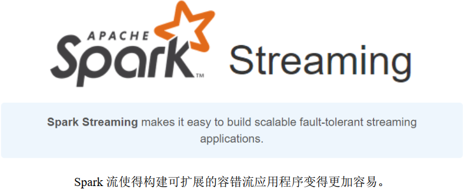
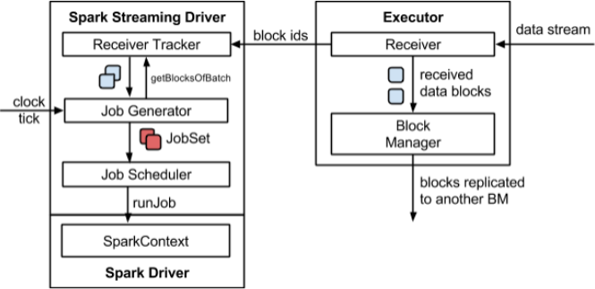
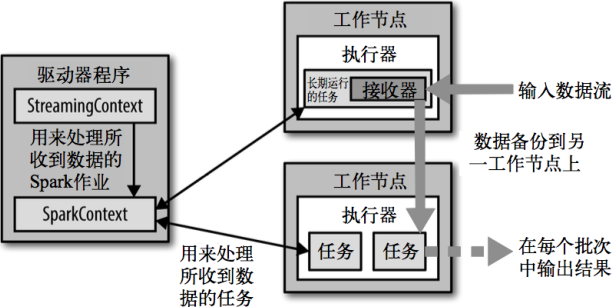
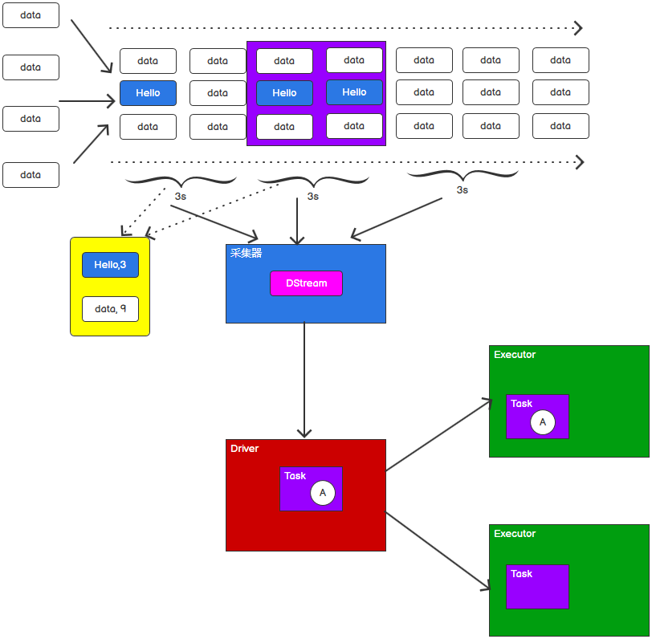
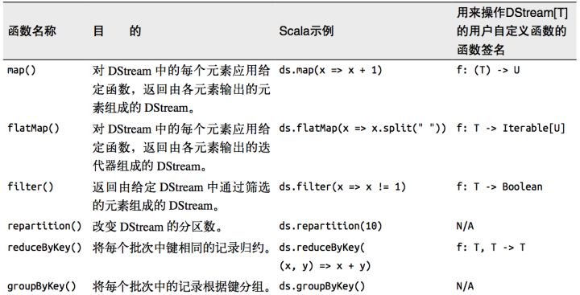
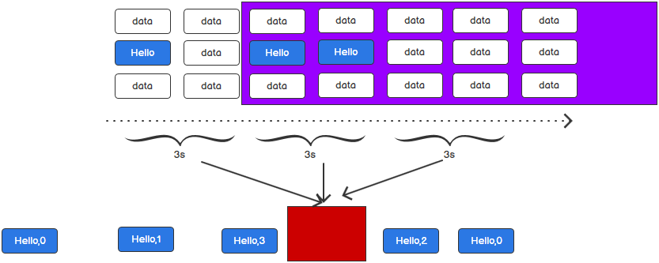
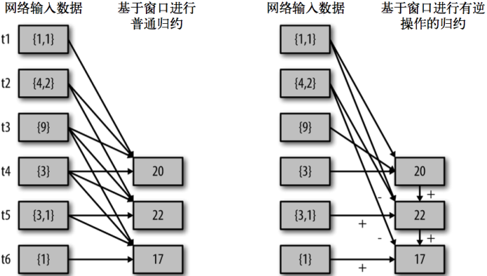
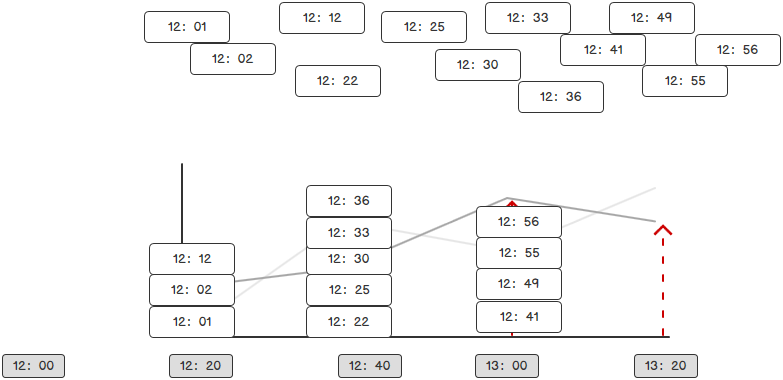

# 第1章 SparkStreaming 概述

## 1.1 Spark Streaming 是什么



Spark Streaming 用于流式数据的处理。 Spark Streaming 支持的数据输入源很多，例如： Kafka、Flume、 Twitter、 ZeroMQ 和简单的 TCP 套接字等等。数据输入后可以用 Spark 的高度抽象原语如： map、 reduce、 join、 window 等进行运算。而结果也能保存在很多地方，如 HDFS，数据库等。  


和 Spark 基于 RDD 的概念很相似， Spark Streaming 使用**离散化流**(discretized stream)作为抽象表示，叫作 DStream。 DStream 是随时间推移而收到的数据的序列。在内部，每个时间区间收到的数据都作为 RDD 存在，而 DStream 是由这些 RDD 所组成的序列(因此得名“离散化”)。 所以简单来将， DStream 就是对 RDD 在实时数据处理场景的一种封装。

## 1.2 Spark Streaming 的特点  

* 易用

  

* 容错

  

* 易整合到Spark体系

  

## 1.3 Spark Streaming 架构  

### 1.3.1 架构图  

* 整体架构图

  

* SparkStreaming架构图

  

  

### 1.3.2 背压机制  

Spark 1.5 以前版本，用户如果要限制 Receiver 的数据接收速率，可以通过设置静态配制参数“spark.streaming.receiver.maxRate”的值来实现，此举虽然可以通过限制接收速率，来适配当前的处理能力，防止内存溢出，但也会引入其它问题。比如： producer 数据生产高于 maxRate，当前集群处理能力也高于 maxRate，这就会造成资源利用率下降等问题。

为了更好的协调数据接收速率与资源处理能力， 1.5 版本开始 Spark Streaming 可以动态控制数据接收速率来适配集群数据处理能力。 背压机制（即 Spark Streaming Backpressure） : 根据JobScheduler 反馈作业的执行信息来动态调整 Receiver 数据接收率。

通过属性“spark.streaming.backpressure.enabled”来控制是否启用 backpressure 机制，默认值false，即不启用。  

# 第 2 章 Dstream 入门

## 2.1 WordCount 案例实操  

需求：使用 netcat 工具向 9999 端口不断的发送数据，通过 SparkStreaming 读取端口数据并
统计不同单词出现的次数  

1) 添加依赖  

   ```xml
   <dependency>
       <groupId>org.apache.spark</groupId>
       <artifactId>spark-streaming_2.12</artifactId>
       <version>3.0.0</version>
   </dependency>
   ```

2) 编写代码  

   ```scala
   object StreamWordCount {
       def main(args: Array[String]): Unit = {
           //1.初始化 Spark 配置信息
           val sparkConf = new
           SparkConf().setMaster("local[*]").setAppName("StreamWordCount")
           //2.初始化 SparkStreamingContext
           val ssc = new StreamingContext(sparkConf, Seconds(3))
           //3.通过监控端口创建 DStream，读进来的数据为一行行
           val lineStreams = ssc.socketTextStream("linux1", 9999)
           //将每一行数据做切分，形成一个个单词
           val wordStreams = lineStreams.flatMap(_.split(" "))
           //将单词映射成元组（word,1）
           val wordAndOneStreams = wordStreams.map((_, 1))
           //将相同的单词次数做统计
           val wordAndCountStreams = wordAndOneStreams.reduceByKey(_+_)
           //打印
           wordAndCountStreams.print()
           //启动 SparkStreamingContext
           ssc.start()
           ssc.awaitTermination()
       }
   }
   ```

3) 启动程序并通过 netcat 发送数据

   ```cmd
   nc -lk 9999
   hello spark
   ```

练习与测试

```scala
package com.test.spark.streaming
import org.apache.spark.SparkConf
import org.apache.spark.streaming.{Seconds, StreamingContext}

object SparkStreaming01_WordCount {
  def main(args: Array[String]): Unit = {
    // TODO 创建环境对象
    // StreamingContext创建时，需要传递两个参数
    // 第一个参数表示环境配置
    val sparkConf = new SparkConf().setMaster("local[*]").setAppName("SparkStreaming")
    // 第二个参数表示批量处理的周期（采集周期）
    val ssc = new StreamingContext(sparkConf,Seconds(3))

    // TODO 逻辑处理
    // 获取端口数据
    val lines = ssc.socketTextStream("localhost", 8888)
    val wordToCount = lines.flatMap(_.split(" ")).map((_, 1)).reduceByKey(_ + _)
    wordToCount.print()

    // TODO 关闭环境
    // 由于SparkStreaming采集器是长期执行的任务，所以不能直接关闭
    // 如果main方法执行关闭，应用程序也会自动结束，所以不能让main方法执行完毕
    // ssc.stop()

    // 问题解决：
    // 1. 启动采集器
    ssc.start()
    // 2. 等待采集器的关闭,采集器不关，主线程不能停
    ssc.awaitTermination()
  }
}
```

## 2.2 WordCount 解析  

Discretized Stream 是 Spark Streaming 的基础抽象，代表持续性的数据流和经过各种 Spark 原语操作后的结果数据流。在内部实现上， DStream 是一系列连续的 RDD 来表示。每个 RDD 含有一段时间间隔内的数据。


对数据的操作也是按照 RDD 为单位来进行的


计算过程由 Spark Engine 来完成


# 第 3 章 DStream 创建  

## 3.1 RDD 队列  

### 3.1.1 用法及说明  

测试过程中，可以通过使用 ssc.queueStream(queueOfRDDs)来创建 DStream，每一个推送到这个队列中的 RDD，都会作为一个 DStream 处理。

### 3.1.2 案例实操  

需求：循环创建几个 RDD，将 RDD 放入队列。通过 SparkStream 创建 Dstream，计算WordCount

1) 编写代码  

   ```scala
   object RDDStream {
       def main(args: Array[String]) {
           //1.初始化 Spark 配置信息
           val conf = new SparkConf().setMaster("local[*]").setAppName("RDDStream")
           //2.初始化 SparkStreamingContext
           val ssc = new StreamingContext(conf, Seconds(4))
           //3.创建 RDD 队列
           val rddQueue = new mutable.Queue[RDD[Int]]()
           //4.创建 QueueInputDStream
           val inputStream = ssc.queueStream(rddQueue,oneAtATime = false)
           //5.处理队列中的 RDD 数据
           val mappedStream = inputStream.map((_,1))
           val reducedStream = mappedStream.reduceByKey(_ + _)
           //6.打印结果
           reducedStream.print()
           //7.启动任务
           ssc.start()
           //8.循环创建并向 RDD 队列中放入 RDD
           for (i <- 1 to 5) {
               rddQueue += ssc.sparkContext.makeRDD(1 to 300, 10)
               Thread.sleep(2000)
           }
           ssc.awaitTermination()
       }
   }
   ```

2) 结果展示  

   ```properties
   -------------------------------------------
   Time: 1539075280000 ms
   -------------------------------------------
   (4,60)
   (0,60)
   (6,60)
   (8,60)
   (2,60)
   (1,60)
   (3,60)
   (7,60)
   (9,60)
   (5,60)
   -------------------------------------------
   Time: 1539075284000 ms
   -------------------------------------------
   (4,60)
   (0,60)
   (6,60)
   (8,60)
   (2,60)
   (1,60)
   (3,60)
   (7,60)
   (9,60)
   (5,60)
   -------------------------------------------
   Time: 1539075288000 ms
   -------------------------------------------
   (4,30)
   (0,30)
   (6,30)
   (8,30)
   (2,30)
   (1,30)
   (3,30)
   (7,30)
   (9,30)
   (5,30)
   -------------------------------------------
   Time: 1539075292000 ms
   -------------------------------------------
   ```

   练习与测试

   ```scala
   package com.test.spark.streaming
   
   import org.apache.spark.SparkConf
   import org.apache.spark.rdd.RDD
   import org.apache.spark.streaming.{Seconds, StreamingContext}
   import scala.collection.mutable
   
   object SparkStreaming02_Queue {
     def main(args: Array[String]): Unit = {
       // TODO Queue
       // StreamingContext创建时，需要传递两个参数
       // 第一个参数表示环境配置
       val sparkConf = new SparkConf().setMaster("local[*]").setAppName("SparkStreaming")
       // 第二个参数表示批量处理的周期（采集周期）
       val ssc = new StreamingContext(sparkConf,Seconds(3))
   
       // 创建 RDD 队列
       val rddQueue = new mutable.Queue[RDD[Int]]()
       // 创建 QueueInputDStream
       val inputStream = ssc.queueStream(rddQueue,oneAtATime = false)
   
       // 处理队列中的 RDD 数据
       val mappedStream = inputStream.map((_,1))
       val reducedStream = mappedStream.reduceByKey(_ + _)
   
       // 打印结果
       reducedStream.print()
       ssc.start()
   
       // 循环创建并向 RDD 队列中放入 RDD
       for (i <- 1 to 5) {
         rddQueue += ssc.sparkContext.makeRDD(1 to 300, 10)
         Thread.sleep(2000)
       }
   
       ssc.awaitTermination()
     }
   }
   ```

## 3.2 自定义数据源

### 3.2.1 用法及说明  

需要继承 Receiver，并实现 onStart、 onStop 方法来自定义数据源采集。

### 3.2.2 案例实操  

需求：自定义数据源，实现监控某个端口号，获取该端口号内容。

1) 自定义数据源  

   ```scala
   class CustomerReceiver(host: String, port: Int) extends Receiver[String](StorageLevel.MEMORY_ONLY) {
       //最初启动的时候，调用该方法，作用为：读数据并将数据发送给 Spark
       override def onStart(): Unit = {
           new Thread("Socket Receiver") {
               override def run() {
               	receive()
               }
       	}.start()	
   	}	
       
   	//读数据并将数据发送给 Spark
   	def receive(): Unit = {
           //创建一个 Socket
           var socket: Socket = new Socket(host, port)
           //定义一个变量，用来接收端口传过来的数据
           var input: String = null
           //创建一个 BufferedReader 用于读取端口传来的数据
           val reader = new BufferedReader(new InputStreamReader(socket.getInputStream, StandardCharsets.UTF_8))
           //读取数据
           input = reader.readLine()
           //当 receiver 没有关闭并且输入数据不为空，则循环发送数据给 Spark
           while (!isStopped() && input != null) {
               store(input)
               input = reader.readLine()
           }
           //跳出循环则关闭资源
           reader.close()
           socket.close()
           //重启任务
           restart("restart")
       }
   	override def onStop(): Unit = {}
   }
   ```

   2) 使用自定义的数据源采集数据  

      ```scala
      object FileStream {
          def main(args: Array[String]): Unit = {
              //1.初始化 Spark 配置信息
              val sparkConf = new SparkConf().setMaster("local[*]")
              .setAppName("StreamWordCount")
              //2.初始化 SparkStreamingContext
              val ssc = new StreamingContext(sparkConf, Seconds(5))
              //3.创建自定义 receiver 的 Streaming
              val lineStream = ssc.receiverStream(new CustomerReceiver("hadoop102", 9999))
              //4.将每一行数据做切分，形成一个个单词
              val wordStream = lineStream.flatMap(_.split("\t"))
              //5.将单词映射成元组（word,1）
              val wordAndOneStream = wordStream.map((_, 1))
              //6.将相同的单词次数做统计
              val wordAndCountStream = wordAndOneStream.reduceByKey(_ + _)
              //7.打印
              wordAndCountStream.print()
              //8.启动 SparkStreamingContext
              ssc.start()
              ssc.awaitTermination()
          }
      }
      ```

      练习与测试

      ```scala
      package com.test.spark.streaming
      import org.apache.spark.SparkConf
      import org.apache.spark.storage.StorageLevel
      import org.apache.spark.streaming.dstream.ReceiverInputDStream
      import org.apache.spark.streaming.receiver.Receiver
      import org.apache.spark.streaming.{Seconds, StreamingContext}
      import scala.util.Random
      
      object SparkStreaming03_DIY {
        def main(args: Array[String]): Unit = {
          // TODO 自定义数据采集器
          // StreamingContext创建时，需要传递两个参数
          // 第一个参数表示环境配置
          val sparkConf = new SparkConf().setMaster("local[*]").setAppName("SparkStreaming")
          // 第二个参数表示批量处理的周期（采集周期）
          val ssc = new StreamingContext(sparkConf,Seconds(3))
          val messageDS: ReceiverInputDStream[String] = ssc.receiverStream(new MyReceiver())
          messageDS.print()
          ssc.start()
          ssc.awaitTermination()
        }
      
        /**
         * 自定义数据采集器
         * 1. 集成Receiver, 定义泛型，传递参数
         * 2. 重写方法
         */
        class MyReceiver extends Receiver[String](StorageLevel.MEMORY_ONLY){
          private var flg = true
          override def onStart(): Unit = {
            new Thread(new Runnable() {
              override def run(): Unit = {
                while (flg) {
                  val message = "采集的数据为：" + new Random().nextInt(10).toString
                  store(message)
                  Thread.sleep(500)
                }
              }
            }).start()
          }
      
          override def onStop(): Unit = {
            this.flg = false
          }
        }
      }
      ```

## 3.3 Kafka 数据源（面试、开发重点）  

### 3.3.1 版本选型  

ReceiverAPI：需要一个专门的 Executor 去接收数据，然后发送给其他的 Executor 做计算。存在的问题，接收数据的 Executor 和计算的 Executor 速度会有所不同，特别在接收数据的 Executor速度大于计算的 Executor 速度，会导致计算数据的节点内存溢出。 早期版本中提供此方式，当前版本不适用

DirectAPI：是由计算的 Executor 来主动消费 Kafka 的数据，速度由自身控制。

### 3.3.2 Kafka 0-8 Receiver 模式（当前版本不适用）  

1） 需求：通过 SparkStreaming 从 Kafka 读取数据，并将读取过来的数据做简单计算，最终打印到控制台。  

2）导入依赖  

```xml
<dependency>
    <groupId>org.apache.spark</groupId>
    <artifactId>spark-streaming-kafka-0-8_2.11</artifactId>
    <version>2.4.5</version>
</dependency>
```

3）编写代码  

```scala
package com.test.kafka
import org.apache.spark.SparkConf
import org.apache.spark.streaming.dstream.ReceiverInputDStream
import org.apache.spark.streaming.kafka.KafkaUtils
import org.apache.spark.streaming.{Seconds, StreamingContext}
object ReceiverAPI {
    def main(args: Array[String]): Unit = {
        //1.创建 SparkConf
        val sparkConf: SparkConf = new SparkConf().setAppName("ReceiverWordCount").setMaster("local[*]")
        //2.创建 StreamingContext
        val ssc = new StreamingContext(sparkConf, Seconds(3))
        //3.读取 Kafka 数据创建 DStream(基于 Receive 方式)
        val kafkaDStream: ReceiverInputDStream[(String, String)] =
            KafkaUtils.createStream(ssc,
            "linux1:2181,linux2:2181,linux3:2181",
            "atguigu",
        	Map[String, Int]("atguigu" -> 1))
        //4.计算 WordCount
        kafkaDStream.map { 
            case (_, value) => (value, 1)
        }.reduceByKey(_ + _).print()
        //5.开启任务
        ssc.start()
        ssc.awaitTermination()
    }
}
```

### 3.3.3 Kafka 0-8 Direct 模式（当前版本不适用）  

1）需求：通过 SparkStreaming 从 Kafka 读取数据，并将读取过来的数据做简单计算，最终打印到控制台。  

2）导入依赖  

```xml
<dependency>
    <groupId>org.apache.spark</groupId>
    <artifactId	>spark-streaming-kafka-0-8_2.11</artifactId>
    <version>2.4.5</version>
</dependency>
```

3）编写代码（自动维护 offset）  

```scala
import kafka.serializer.StringDecoder
import org.apache.kafka.clients.consumer.ConsumerConfig
import org.apache.spark.SparkConf
import org.apache.spark.streaming.dstream.InputDStream
import org.apache.spark.streaming.kafka.KafkaUtils
import org.apache.spark.streaming.{Seconds, StreamingContext}
object DirectAPIAuto02 {
    val getSSC1: () => StreamingContext = () => {
        val sparkConf: SparkConf = new SparkConf().setAppName("ReceiverWordCount").setMaster("local[*]")
        val ssc = new StreamingContext(sparkConf, Seconds(3))
        ssc
    }
    def getSSC: StreamingContext = {
        //1.创建 SparkConf
        val sparkConf: SparkConf = new
        SparkConf().setAppName("ReceiverWordCount").setMaster("local[*]")
        //2.创建 StreamingContext
        val ssc = new StreamingContext(sparkConf, Seconds(3))
        //设置 CK
        ssc.checkpoint("./ck2")
        //3.定义 Kafka 参数
        val kafkaPara: Map[String, String] = Map[String, String](
            ConsumerConfig.BOOTSTRAP_SERVERS_CONFIG ->
            "linux1:9092,linux2:9092,linux3:9092",
            ConsumerConfig.GROUP_ID_CONFIG -> "atguigu"
        )
        //4.读取 Kafka 数据
        val kafkaDStream: InputDStream[(String, String)] =
        KafkaUtils.createDirectStream[String, String, StringDecoder, StringDecoder](ssc, kafkaPara, Set("atguigu"))
        //5.计算 WordCount
        kafkaDStream.map(_._2)
            .flatMap(_.split(" "))
            .map((_, 1))
            .reduceByKey(_ + _)
            .print()
        //6.返回数据
        ssc
    }
    def main(args: Array[String]): Unit = {
        //获取 SSC
        val ssc: StreamingContext = StreamingContext.getActiveOrCreate("./ck2", () => getSSC)
        //开启任务
        ssc.start()
        ssc.awaitTermination()
    }
}
```

4）编写代码（手动维护 offset）

```scala
import kafka.common.TopicAndPartition
import kafka.message.MessageAndMetadata
import kafka.serializer.StringDecoder
import org.apache.kafka.clients.consumer.ConsumerConfig
import org.apache.spark.SparkConf
import org.apache.spark.streaming.dstream.{DStream, InputDStream}
import org.apache.spark.streaming.kafka.{HasOffsetRanges, KafkaUtils, OffsetRange}
import org.apache.spark.streaming.{Seconds, StreamingContext}
object DirectAPIHandler {
    def main(args: Array[String]): Unit = {
        //1.创建 SparkConf
        val sparkConf: SparkConf = new
        SparkConf().setAppName("ReceiverWordCount").setMaster("local[*]")
        //2.创建 StreamingContext
        val ssc = new StreamingContext(sparkConf, Seconds(3))
        //3.Kafka 参数
        val kafkaPara: Map[String, String] = Map[String, String](
            ConsumerConfig.BOOTSTRAP_SERVERS_CONFIG ->
            "hadoop102:9092,hadoop103:9092,hadoop104:9092",
            ConsumerConfig.GROUP_ID_CONFIG -> "atguigu"
        )
        //4.获取上一次启动最后保留的 Offset=>getOffset(MySQL)
        val fromOffsets: Map[TopicAndPartition, Long] = Map[TopicAndPartition,
        Long](TopicAndPartition("atguigu", 0) -> 20)
        //5.读取 Kafka 数据创建 DStream
        val kafkaDStream: InputDStream[String] = KafkaUtils.createDirectStream[String,
        String, StringDecoder, StringDecoder, String](ssc, kafkaPara, fromOffsets, (m: MessageAndMetadata[String, String]) => 					m.message())
        //6.创建一个数组用于存放当前消费数据的 offset 信息
        var offsetRanges = Array.empty[OffsetRange]
        //7.获取当前消费数据的 offset 信息
        val wordToCountDStream: DStream[(String, Int)] = kafkaDStream.transform { rdd =>
            offsetRanges = rdd.asInstanceOf[HasOffsetRanges].offsetRanges
            rdd
        }.flatMap(_.split(" "))
        .map((_, 1))
        .reduceByKey(_ + _)
        //8.打印 Offset 信息
        wordToCountDStream.foreachRDD(rdd => {
            for (o <- offsetRanges) {
                println(s"${o.topic}:${o.partition}:${o.fromOffset}:${o.untilOffset}")
            }
            rdd.foreach(println)
        })
        //9.开启任务
        ssc.start()
        ssc.awaitTermination()
    }
}
```

### 3.3.4 Kafka 0-10 Direct 模式  

1）需求：通过 SparkStreaming 从 Kafka 读取数据，并将读取过来的数据做简单计算，最终打印到控制台。  

2）导入依赖  

```xml
<dependency>
    <groupId>org.apache.spark</groupId>
    <artifactId>spark-streaming-kafka-0-10_2.12</artifactId>
    <version>3.0.0</version>
</dependency>
<dependency>
    <groupId>com.fasterxml.jackson.core</groupId>
    <artifactId>jackson-core</artifactId>
    <version>2.10.1</version>
</dependency>
```

3）编写代码  

```scala
import org.apache.kafka.clients.consumer.{ConsumerConfig, ConsumerRecord}
import org.apache.spark.SparkConf
import org.apache.spark.streaming.dstream.{DStream, InputDStream}
import org.apache.spark.streaming.kafka010.{ConsumerStrategies, KafkaUtils, LocationStrategies}
import org.apache.spark.streaming.{Seconds, StreamingContext}
object DirectAPI {
    def main(args: Array[String]): Unit = {
        //1.创建 SparkConf
        val sparkConf: SparkConf = new
        SparkConf().setAppName("ReceiverWordCount").setMaster("local[*]")
        //2.创建 StreamingContext
        val ssc = new StreamingContext(sparkConf, Seconds(3))
        //3.定义 Kafka 参数
        val kafkaPara: Map[String, Object] = Map[String, Object](
            ConsumerConfig.BOOTSTRAP_SERVERS_CONFIG -> "linux1:9092,linux2:9092,linux3:9092",
            ConsumerConfig.GROUP_ID_CONFIG -> "topicGroup",
                "key.deserializer" ->
                "org.apache.kafka.common.serialization.StringDeserializer",
                "value.deserializer" ->
                "org.apache.kafka.common.serialization.StringDeserializer"
        )
        //4.读取 Kafka 数据创建 DStream
        val kafkaDStream: InputDStream[ConsumerRecord[String, String]] = 
            KafkaUtils.createDirectStream[String, String](ssc,
            LocationStrategies.PreferConsistent, 
            ConsumerStrategies.Subscribe[String, String](Set("topicName"), kafkaPara))
        //5.将每条消息的 KV 取出
        val valueDStream: DStream[String] = kafkaDStream.map(record => record.value())
        //6.计算 WordCount
        valueDStream.flatMap(_.split(" "))
        .map((_, 1))
        .reduceByKey(_ + _)
        .print()
        //7.开启任务
        ssc.start()
        ssc.awaitTermination()
    }
}
```

查看 Kafka 消费进度  

```shell
bin/kafka-consumer-groups.sh --describe --bootstrap-server linux1:9092 --group topicGroup
```

练习与测试

```scala
package com.test.spark.streaming
import org.apache.kafka.clients.consumer.{ConsumerConfig, ConsumerRecord}
import org.apache.spark.SparkConf
import org.apache.spark.storage.StorageLevel
import org.apache.spark.streaming.dstream.{InputDStream, ReceiverInputDStream}
import org.apache.spark.streaming.kafka010.{ConsumerStrategies, KafkaUtils, LocationStrategies}
import org.apache.spark.streaming.receiver.Receiver
import org.apache.spark.streaming.{Seconds, StreamingContext}
import scala.util.Random

object SparkStreaming04_Kafka {
  def main(args: Array[String]): Unit = {
    // TODO Kafka数据源
    // StreamingContext创建时，需要传递两个参数
    // 第一个参数表示环境配置
    val sparkConf = new SparkConf().setMaster("local[*]").setAppName("SparkStreaming")
    // 第二个参数表示批量处理的周期（采集周期）
    val ssc = new StreamingContext(sparkConf, Seconds(3))
    // 定义 Kafka 参数
    val kafkaPara: Map[String, Object] = Map[String, Object](
      ConsumerConfig.BOOTSTRAP_SERVERS_CONFIG -> "bigdata1:6667,bigdata2:6667,bigdata3:6667",
      ConsumerConfig.GROUP_ID_CONFIG -> "test12",
      "key.deserializer" -> "org.apache.kafka.common.serialization.StringDeserializer",
      "value.deserializer" -> "org.apache.kafka.common.serialization.StringDeserializer"
    )
    val kafkaDataDS: InputDStream[ConsumerRecord[String, String]] = KafkaUtils.createDirectStream[String, String](ssc,
      // 配置自动选择采集节点和执行节点的最优选择机制
      LocationStrategies.PreferConsistent,
      ConsumerStrategies.Subscribe[String, String](Set("test12"), kafkaPara)
    )

    kafkaDataDS.map(_.value()).print()

    ssc.start()
    ssc.awaitTermination()
  }
}
```


# 第 4 章 DStream 转换

DStream 上的操作与 RDD 的类似，分为 Transformations（转换）和 Output Operations（输出）两种，此外转换操作中还有一些比较特殊的原语，如： updateStateByKey()、 transform()以及各种 Window 相关的原语。

## 4.1 无状态转化操作  

无状态转化操作就是把简单的 RDD 转化操作应用到每个批次上，也就是转化 DStream 中的每一个 RDD。部分无状态转化操作列在了下表中。注意，针对键值对的 DStream 转化操作(比如reduceByKey())要添加 import StreamingContext._才能在 Scala 中使用。



需要记住的是，尽管这些函数看起来像作用在整个流上一样，但事实上每个 DStream 在内部是由许多 RDD（批次） 组成，且无状态转化操作是分别应用到每个 RDD 上的。
例如： reduceByKey()会归约每个时间区间中的数据，但不会归约不同区间之间的数据。  

### 4.1.1 Transform  

Transform 允许 DStream 上执行任意的 RDD-to-RDD 函数。即使这些函数并没有在 DStream的 API 中暴露出来，通过该函数可以方便的扩展 Spark API。该函数每一批次调度一次。其实也就是对 DStream 中的 RDD 应用转换。  

```scala
object Transform {
    def main(args: Array[String]): Unit = {
        //创建 SparkConf
        val sparkConf: SparkConf = new
        SparkConf().setMaster("local[*]").setAppName("WordCount")
        //创建 StreamingContext
        val ssc = new StreamingContext(sparkConf, Seconds(3))
        //创建 DStream
        val lineDStream: ReceiverInputDStream[String] = ssc.socketTextStream("linux1", 9999)
        //转换为 RDD 操作
        val wordAndCountDStream: DStream[(String, Int)] = lineDStream.transform(rdd =>
        {
            val words: RDD[String] = rdd.flatMap(_.split(" "))
            val wordAndOne: RDD[(String, Int)] = words.map((_, 1))
            val value: RDD[(String, Int)] = wordAndOne.reduceByKey(_ + _)
            value
        })
        //打印
        wordAndCountDStream.print
        //启动
        ssc.start()
        ssc.awaitTermination()
    }
}
```

练习与测试

```scala
package com.atguigu.spark.streaming
import org.apache.spark.SparkConf
import org.apache.spark.streaming.dstream.DStream
import org.apache.spark.streaming.{Seconds, StreamingContext}

object SparkStreaming06_State_Transform {
  def main(args: Array[String]): Unit = {
    // TODO 无状态操作 transform
    // StreamingContext创建时，需要传递两个参数
    // 第一个参数表示环境配置
    val sparkConf = new SparkConf().setMaster("local[*]").setAppName("SparkStreaming")
    // 第二个参数表示批量处理的周期（采集周期）
    val ssc = new StreamingContext(sparkConf, Seconds(3))

    val lines = ssc.socketTextStream("localhost", 9999)
    // transform 方法可以将底层RDD获取到后进行操作，用来解决DStream无法实现的功能
    // val newDS: DStream[String] = lines.transform(rdd => rdd.map(str => str))
    // val newDS1 = lines.map(str => str)

    // transform 方法可以将底层RDD获取到后进行操作，有以下两种情形可以使用此方法
    // 1. DStream功能不完善
    // 2. 需要代码进行周期性的执行，周期性执行原因如下：
    // Code: Driver端
    val newDS: DStream[String] = lines.transform(
      rdd => {
        // Code: Driver端, (此处进行周期性执行，一个采集周期，一个rdd,然后此处对应就执行一遍相应的代码逻辑)
        rdd.map(
          str => {
            // Code: Executor端
            str
          }
        )
      }
    )
    // Code: Driver端
    val newDS1 = lines.map(
      str => {
        // Code: Executor端
        str
      }
    )

    ssc.start()
    ssc.awaitTermination()
  }
}
```

### 4.1.2 join  

两个流之间的 join 需要两个流的批次大小一致，这样才能做到同时触发计算。计算过程就是对当前批次的两个流中各自的 RDD 进行 join，与两个 RDD 的 join 效果相同。  

```scala
import org.apache.spark.SparkConf
import org.apache.spark.streaming.{Seconds, StreamingContext}
import org.apache.spark.streaming.dstream.{DStream, ReceiverInputDStream}
object JoinTest {
    def main(args: Array[String]): Unit = {
        //1.创建 SparkConf
        val sparkConf: SparkConf = new SparkConf().setMaster("local[*]").setAppName("JoinTest")
        //2.创建 StreamingContext
        val ssc = new StreamingContext(sparkConf, Seconds(5))
        //3.从端口获取数据创建流
        val lineDStream1: ReceiverInputDStream[String] = ssc.socketTextStream("linux1", 9999)
        val lineDStream2: ReceiverInputDStream[String] = ssc.socketTextStream("linux2", 8888)
        //4.将两个流转换为 KV 类型
        val wordToOneDStream: DStream[(String, Int)] = lineDStream1.flatMap(_.split("")).map((_, 1))
        val wordToADStream: DStream[(String, String)] = lineDStream2.flatMap(_.split("")).map((_, "a"))
        //5.流的 JOIN
        val joinDStream: DStream[(String, (Int, String))] = wordToOneDStream.join(wordToADStream)
        //6.打印
        joinDStream.print()
        //7.启动任务
        ssc.start()
        ssc.awaitTermination()
    }
}
```

练习与测试

```scala
package com.test.spark.streaming
import org.apache.spark.SparkConf
import org.apache.spark.streaming.dstream.DStream
import org.apache.spark.streaming.{Seconds, StreamingContext}

object SparkStreaming06_State_Join {
  def main(args: Array[String]): Unit = {
    // TODO 无状态操作 join
    // StreamingContext创建时，需要传递两个参数
    // 第一个参数表示环境配置
    val sparkConf = new SparkConf().setMaster("local[*]").setAppName("SparkStreaming")
    // 第二个参数表示批量处理的周期（采集周期）
    val ssc = new StreamingContext(sparkConf, Seconds(5))

    val data9999 = ssc.socketTextStream("localhost", 9999)
    val data8888 = ssc.socketTextStream("localhost", 8888)

    val map9999: DStream[(String, Int)] = data9999.map((_, 9))
    val map8888: DStream[(String, Int)] = data8888.map((_, 8))

    // 所谓的DStream的Join操作，其实就是两个RDD的join
    val joinDS: DStream[(String, (Int, Int))] = map9999.join(map8888)
    joinDS.print()


    ssc.start()
    ssc.awaitTermination()
  }
}
```


## 4.2 有状态转化操作

### 4.2.1 UpdateStateByKey  

UpdateStateByKey 原语用于记录历史记录，有时，我们需要在 DStream 中跨批次维护状态(例如流计算中累加 wordcount)。针对这种情况， updateStateByKey()为我们提供了对一个状态变量的访问，用于键值对形式的 DStream。给定一个由(键，事件)对构成的 DStream，并传递一个指定如何根据新的事件更新每个键对应状态的函数，它可以构建出一个新的 DStream，其内部数据为(键，状态) 对。
updateStateByKey() 的结果会是一个新的 DStream，其内部的 RDD 序列是由每个时间区间对应的(键，状态)对组成的。

 updateStateByKey 操作使得我们可以在用新信息进行更新时保持任意的状态。为使用这个功能，需要做下面两步：

1. 定义状态，状态可以是一个任意的数据类型。
2. 定义状态更新函数，用此函数阐明如何使用之前的状态和来自输入流的新值对状态进行更新。

使用 updateStateByKey 需要对检查点目录进行配置，会使用检查点来保存状态。
更新版的 wordcount

1) 编写代码  

   ```scala
   object WorldCount {
       def main(args: Array[String]) {
           // 定义更新状态方法，参数 values 为当前批次单词频度， state 为以往批次单词频度
           val updateFunc = (values: Seq[Int], state: Option[Int]) => {
               val currentCount = values.foldLeft(0)(_ + _)
               val previousCount = state.getOrElse(0)
               Some(currentCount + previousCount)
           }
           val conf = new SparkConf().setMaster("local[*]").setAppName("NetworkWordCount")
           val ssc = new StreamingContext(conf, Seconds(3))
           ssc.checkpoint("./ck")
           // Create a DStream that will connect to hostname:port, like hadoop102:9999
           val lines = ssc.socketTextStream("linux1", 9999)
           // Split each line into words
           val words = lines.flatMap(_.split(" "))
           // import org.apache.spark.streaming.StreamingContext._ // not necessary since Spark 1.3
           // Count each word in each batch
           val pairs = words.map(word => (word, 1))
           // 使用 updateStateByKey 来更新状态，统计从运行开始以来单词总的次数
           val stateDstream = pairs.updateStateByKey[Int](updateFunc)
           stateDstream.print()
           ssc.start() // Start the computation
           ssc.awaitTermination() // Wait for the computation to terminate
           //ssc.stop()
       }
   }
   ```

2) 启动程序并向 9999 端口发送数据  

   ```shell
   nc -lk 9999
   Hello World
   Hello Scala
   ```

3) 结果展示  

   ```properties
   Time: 1504685175000 ms
   -------------------------------------------
   -------------------------------------------
   Time: 1504685181000 ms
   -------------------------------------------
   (shi,1)
   (shui,1)
   (ni,1)
   -------------------------------------------
   Time: 1504685187000 ms
   -------------------------------------------
   (shi,1)
   (ma,1)
   (hao,1)
   (shui,1)
   ```

   练习与测试

   ```scala
   package com.atguigu.spark.streaming
   import org.apache.spark.SparkConf
   import org.apache.spark.streaming.{Seconds, StreamingContext}
   
   object SparkStreaming05_State {
     def main(args: Array[String]): Unit = {
       // TODO 有状态操作 updateStateByKey
       // StreamingContext创建时，需要传递两个参数
       // 第一个参数表示环境配置
       val sparkConf = new SparkConf().setMaster("local[*]").setAppName("SparkStreaming")
       // 第二个参数表示批量处理的周期（采集周期）
       val ssc = new StreamingContext(sparkConf, Seconds(3))
       // 使用有状态操作时，需要设定检查点路径。状态数据是在缓冲区中，这里进行设置缓冲区存放目录，也就是检查点目录
       ssc.checkpoint("cp")
       // 无状态数据操作，只对当前的采集收齐内的数据进行处理
       // 在某些场合下，需要进行有状态操作，如需要保留数据统计结果（状态），实现数据的汇总
       val datas = ssc.socketTextStream("localhost", 9999)
   
       val wordToOne = datas.map((_, 1))
       // 这里只能进行每个微批中的聚合，不能进行所有批次中的单词计数统计，所以需要保存状态数据进行单词计数统计
       // val wordToCount = wordToOne.reduceByKey(_ + _)
       // updateStateByKey: 根据key对数据的状态进行更新
       // 传递参数中含有两个值
       // 第一个值表示相同的key的value数据
       // 第二个值表示缓冲区相同key的value数据
       val state = wordToOne.updateStateByKey(
         (seq: Seq[Int], buffer: Option[Int]) => {
           val newCount = buffer.getOrElse(0) + seq.sum
           Option(newCount)
         }
       )
       state.print()
   
       ssc.start()
       ssc.awaitTermination()
     }
   }
   ```

### 4.2.2 WindowOperations  

Window Operations 可以设置窗口的大小和滑动窗口的间隔来动态的获取当前 Steaming 的允许状态。 所有基于窗口的操作都需要两个参数，分别为窗口时长以及滑动步长。

* 窗口时长：计算内容的时间范围。
* 滑动步长：隔多久触发一次计算。  

注意：这两者都必须为采集周期大小的整数倍。



WordCount 第三版： 3 秒一个批次，窗口 12 秒，滑步 6 秒。

```scala
object WorldCount {
    def main(args: Array[String]) {
        val conf = new SparkConf().setMaster("local[2]").setAppName("NetworkWordCount")
        val ssc = new StreamingContext(conf, Seconds(3))
        ssc.checkpoint("./ck")
        // Create a DStream that will connect to hostname:port, like localhost:9999
        val lines = ssc.socketTextStream("linux1", 9999)
        // Split each line into words
        val words = lines.flatMap(_.split(" "))
        // Count each word in each batch
        val pairs = words.map(word => (word, 1))
        val wordCounts = pairs.reduceByKeyAndWindow((a:Int,b:Int) => (a + b),Seconds(12), Seconds(6))
        // Print the first ten elements of each RDD generated in this DStream to the console
        wordCounts.print()
        ssc.start() // Start the computation
        ssc.awaitTermination() // Wait for the computation to terminate
    }
}
```

关于 Window 的操作还有如下方法：  

（1） window(windowLength, slideInterval): 基于对源 DStream 窗化的批次进行计算返回一个新的 DStream
（2） countByWindow(windowLength, slideInterval): 返回一个滑动窗口计数流中的元素个数
（3） reduceByWindow(func, windowLength, slideInterval): 通过使用自定义函数整合滑动区间流元素来创建一个新的单元素流
（4） reduceByKeyAndWindow(func, windowLength, slideInterval, [numTasks]): 当在一个(K,V)对的 DStream 上调用此函数，会返回一个新(K,V)对的 DStream，此处通过对滑动窗口中批次数据使用 reduce 函数来整合每个 key 的 value 值
（5） reduceByKeyAndWindow(func, invFunc, windowLength, slideInterval, [numTasks]): 这个函数是上述函数的变化版本，每个窗口的 reduce 值都是通过用前一个窗的 reduce 值来递增计算。通过 reduce 进入到滑动窗口数据并”反向 reduce”离开窗口的旧数据来实现这个操作。一个例子是随着窗口滑动对 keys的“加”“减”计数。通过前边介绍可以想到，这个函数只适用于” 可逆的 reduce 函数”，也就是这些 reduce 函数有相应的”反 reduce”函数(以参数 invFunc 形式传入)。如前述函数， reduce 任务的数量通过可选参数来配置



```scala
val ipDStream = accessLogsDStream.map(logEntry => (logEntry.getIpAddress(), 1))
val ipCountDStream = ipDStream.reduceByKeyAndWindow(
    {(x, y) => x + y},
    {(x, y) => x - y},
    Seconds(30),
    Seconds(10)
)
//加上新进入窗口的批次中的元素 //移除离开窗口的老批次中的元素 //窗口时长// 滑动步长
```

countByWindow()和 countByValueAndWindow()作为对数据进行计数操作的简写。
countByWindow()返回一个表示每个窗口中元素个数的 DStream，而 countByValueAndWindow() 返回的 DStream 则包含窗口中每个值的个数。

```scala
val ipDStream = accessLogsDStream.map{entry => entry.getIpAddress()}
val ipAddressRequestCount = ipDStream.countByValueAndWindow(Seconds(30), Seconds(10))
val requestCount = accessLogsDStream.countByWindow(Seconds(30), Seconds(10))
```

练习与测试

```scala
package com.test.spark.streaming

import org.apache.spark.SparkConf
import org.apache.spark.streaming.dstream.DStream
import org.apache.spark.streaming.{Seconds, StreamingContext}

object SparkStreaming06_State_Window {
  def main(args: Array[String]): Unit = {
    // TODO 有状态操作 Window
    // StreamingContext创建时，需要传递两个参数
    // 第一个参数表示环境配置
    val sparkConf = new SparkConf().setMaster("local[*]").setAppName("SparkStreaming")
    // 第二个参数表示批量处理的周期（采集周期）
    val ssc = new StreamingContext(sparkConf, Seconds(3))

    val lines = ssc.socketTextStream("localhost", 9999)
    val wordToOne = lines.map((_, 1))
    // 窗口的范围应该是采集周期的整数倍
    // 窗口是可以滑动的，默认情况下，是以一个采集周期的进行滑动
    // val windowDS: DStream[(String, Int)] = wordToOne.window(Seconds(6))
    // 以一个采集周期的进行滑动，可能会出现重复数据的计算，为了避免这种情况，可以改变滑动的幅度，也就是步长,步长如果和窗口范围一致，则变成了滚动，如果步长大于或等于窗口周期，此时窗口统计不会有重复数据
    // 步长也必须为采集周期大小的整数倍
    val windowDS: DStream[(String, Int)] = wordToOne.window(Seconds(6),Seconds(6))

    val wordToCount = windowDS.reduceByKey(_ + _)

    wordToCount.print()

    ssc.start()
    ssc.awaitTermination()
  }
}
```

```scala
package com.test.spark.streaming
import org.apache.spark.SparkConf
import org.apache.spark.streaming.dstream.DStream
import org.apache.spark.streaming.{Seconds, StreamingContext}

object SparkStreaming06_State_Window1 {
  def main(args: Array[String]): Unit = {
    // TODO 有状态操作 特殊的reduceByKeyAndWindow
    // StreamingContext创建时，需要传递两个参数
    // 第一个参数表示环境配置
    val sparkConf = new SparkConf().setMaster("local[*]").setAppName("SparkStreaming")
    // 第二个参数表示批量处理的周期（采集周期）
    val ssc = new StreamingContext(sparkConf, Seconds(3))
    // 这里要进行保存状态，因为某些数据不能重复计算，要进行减掉，所以要先存在缓冲区中，也就是状态中。
    ssc.checkpoint("cp")

    val lines = ssc.socketTextStream("localhost", 9999)
    val wordToOne = lines.map((_, 1))

    /**
     * 当窗口范围比较大，但是滑动幅度比较小，那么可以采用增加数据和减少数据的方式，无需重复计算，目的是提升性能
     * reduceByKeyAndWindow:
     * 参数1：新增的数据加进来
     * 参数2：过去的数据减掉
     * 参数3：窗口范围
     * 参数4：步长
     */

    val windowDS: DStream[(String, Int)] = wordToOne.reduceByKeyAndWindow(
      _ + _,
      _ - _,
      Seconds(9),
      Seconds(3)
    )

    windowDS.print()

    ssc.start()
    ssc.awaitTermination()
  }
}
```

# 第 5 章 DStream 输出  

输出操作指定了对流数据经转化操作得到的数据所要执行的操作(例如把结果推入外部数据库或输出到屏幕上)。与 RDD 中的惰性求值类似，如果一个 DStream 及其派生出的 DStream 都没有被执行输出操作，那么这些 DStream 就都不会被求值。如果 StreamingContext 中没有设定输出操作，整个 context 就都不会启动。  

输出操作如下：  

* print()：在运行流程序的驱动结点上打印 DStream 中每一批次数据的最开始 10 个元素。这用于开发和调试。在 Python API 中，同样的操作叫 print()。
* saveAsTextFiles(prefix, [suffix])：以 text 文件形式存储这个 DStream 的内容。每一批次的存储文件名基于参数中的 prefix 和 suffix。” prefix-Time_IN_MS[.suffix]”。
* saveAsObjectFiles(prefix, [suffix])：以 Java 对象序列化的方式将 Stream 中的数据保存为SequenceFiles . 每一批次的存储文件名基于参数中的为"prefix-TIME_IN_MS[.suffix]". Python 中目前不可用。
* saveAsHadoopFiles(prefix, [suffix])：将 Stream 中的数据保存为 Hadoop files. 每一批次的存储文件名基于参数中的为"prefix-TIME_IN_MS[.suffix]"。 Python API 中目前不可用。
* foreachRDD(func)：这是最通用的输出操作，即将函数 func 用于产生于 stream 的每一个RDD。其中参数传入的函数 func 应该实现将每一个 RDD 中数据推送到外部系统，如将RDD 存入文件或者通过网络将其写入数据库。  

通用的输出操作 foreachRDD()，它用来对 DStream 中的 RDD 运行任意计算。这和 transform()有些类似，都可以让我们访问任意 RDD。在 foreachRDD()中，可以重用我们在 Spark 中实现的所有行动操作。比如，常见的用例之一是把数据写到诸如 MySQL 的外部数据库中。

**注意：**  

1) 连接不能写在 driver 层面（序列化）
2) 如果写在 foreach 则每个 RDD 中的每一条数据都创建，得不偿失
3) 增加 foreachPartition，在分区创建（获取）

练习与测试

```scala
package com.test.spark.streaming
import org.apache.spark.SparkConf
import org.apache.spark.streaming.dstream.DStream
import org.apache.spark.streaming.{Seconds, StreamingContext}

object SparkStreaming07_Output {
  def main(args: Array[String]): Unit = {
    // TODO
    // StreamingContext创建时，需要传递两个参数
    // 第一个参数表示环境配置
    val sparkConf = new SparkConf().setMaster("local[*]").setAppName("SparkStreaming")
    // 第二个参数表示批量处理的周期（采集周期）
    val ssc = new StreamingContext(sparkConf, Seconds(3))
    // 这里要进行保存状态，因为某些数据不能重复计算，要进行减掉，所以要先存在缓冲区中，也就是状态中。
    ssc.checkpoint("cp")

    val lines = ssc.socketTextStream("localhost", 9999)
    val wordToOne = lines.map((_, 1))

    /**
     * 当窗口范围比较大，但是滑动幅度比较小，那么可以采用增加数据和减少数据的方式，无需重复计算，目的是提升性能
     * reduceByKeyAndWindow:
     * 参数1：新增的数据加进来
     * 参数2：过去的数据减掉
     * 参数3：窗口范围
     * 参数4：步长
     */
    val windowDS: DStream[(String, Int)] = wordToOne.reduceByKeyAndWindow(
      _ + _,
      _ - _,
      Seconds(9),
      Seconds(3)
    )
    // SparkStreaming如果没有输出操作，那么会提示错误
    // windowDS.print()

    ssc.start()
    ssc.awaitTermination()
  }
}
```

```scala
package com.test.spark.streaming

import org.apache.spark.SparkConf
import org.apache.spark.streaming.dstream.DStream
import org.apache.spark.streaming.{Seconds, StreamingContext}

object SparkStreaming07_Output1 {
  def main(args: Array[String]): Unit = {
    // TODO
    // StreamingContext创建时，需要传递两个参数
    // 第一个参数表示环境配置
    val sparkConf = new SparkConf().setMaster("local[*]").setAppName("SparkStreaming")
    // 第二个参数表示批量处理的周期（采集周期）
    val ssc = new StreamingContext(sparkConf, Seconds(3))
    // 这里要进行保存状态，因为某些数据不能重复计算，要进行减掉，所以要先存在缓冲区中，也就是状态中。
    ssc.checkpoint("cp")

    val lines = ssc.socketTextStream("localhost", 9999)
    val wordToOne = lines.map((_, 1))

    val windowDS: DStream[(String, Int)] = wordToOne.reduceByKeyAndWindow(
      _ + _,
      _ - _,
      Seconds(9),
      Seconds(3)
    )

    // foreachRDD不会出现时间戳
    windowDS.foreachRDD(rdd => {

    })

    ssc.start()
    ssc.awaitTermination()
  }
}
```

# 第 6 章 优雅关闭

流式任务需要 7*24 小时执行，但是有时涉及到升级代码需要主动停止程序，但是分布式程序，没办法做到一个个进程去杀死，所有配置优雅的关闭就显得至关重要了。使用外部文件系统来控制内部程序关闭。

* MonitorStop  

  ```scala
  import java.net.URI
  import org.apache.hadoop.conf.Configuration
  import org.apache.hadoop.fs.{FileSystem, Path}
  import org.apache.spark.streaming.{StreamingContext, StreamingContextState}
  class MonitorStop(ssc: StreamingContext) extends Runnable {
      override def run(): Unit = {
          val fs: FileSystem = FileSystem.get(new URI("hdfs://linux1:9000"), new Configuration(), "atguigu")
          while (true) {
              try
              	Thread.sleep(5000)
              catch {
              	case e: InterruptedException => e.printStackTrace()
          	}
              val state: StreamingContextState = ssc.getState
              val bool: Boolean = fs.exists(new Path("hdfs://linux1:9000/stopSpark"))
              if (bool) {
                  if (state == StreamingContextState.ACTIVE) {
                  	ssc.stop(stopSparkContext = true, stopGracefully = true)
                 		System.exit(0)
              	}
          	}
          }
      }
  }
  ```

* SparkTest

  ```scala
  import org.apache.spark.SparkConf
  import org.apache.spark.streaming.dstream.{DStream, ReceiverInputDStream}
  import org.apache.spark.streaming.{Seconds, StreamingContext}
  object SparkTest {
      def createSSC(): _root_.org.apache.spark.streaming.StreamingContext = {
          val update: (Seq[Int], Option[Int]) => Some[Int] = (values: Seq[Int], status: Option[Int]) => {
              //当前批次内容的计算
              val sum: Int = values.sum
              //取出状态信息中上一次状态
              val lastStatu: Int = status.getOrElse(0)
              Some(sum + lastStatu)
      	}
          val sparkConf: SparkConf = new SparkConf().setMaster("local[4]").setAppName("SparkTest")
          //设置优雅的关闭
          sparkConf.set("spark.streaming.stopGracefullyOnShutdown", "true")
          val ssc = new StreamingContext(sparkConf, Seconds(5))
          ssc.checkpoint("./ck")
          val line: ReceiverInputDStream[String] = ssc.socketTextStream("linux1", 9999)
          val word: DStream[String] = line.flatMap(_.split(" "))
          val wordAndOne: DStream[(String, Int)] = word.map((_, 1))
          val wordAndCount: DStream[(String, Int)] = wordAndOne.updateStateByKey(update)
          wordAndCount.print()
          ssc
      }
      def main(args: Array[String]): Unit = {
          val ssc: StreamingContext = StreamingContext.getActiveOrCreate("./ck", () => createSSC())
          new Thread(new MonitorStop(ssc)).start()
          ssc.start()
          ssc.awaitTermination()
      }
  }
  ```

  练习与测试

  ```scala
  package com.test.spark.streaming
  
  import org.apache.spark.SparkConf
  import org.apache.spark.streaming.dstream.DStream
  import org.apache.spark.streaming.{Seconds, StreamingContext, StreamingContextState}
  
  object SparkStreaming08_Close {
    def main(args: Array[String]): Unit = {
      // TODO 优雅关闭
      /**
       * 线程的关闭：
       * val thread = new Thread()
       * thread.start()
       * thread.stop() // 强制关闭
       */
      val sparkConf = new SparkConf().setMaster("local[*]").setAppName("SparkStreaming")
      val ssc = new StreamingContext(sparkConf, Seconds(3))
  
      val lines = ssc.socketTextStream("localhost", 9999)
      val wordToOne = lines.map((_, 1))
      wordToOne.print()
  
      ssc.start()
  
      // 如果想要关闭采集器，那么需要创建新线程
      // 而且需要在第三方程序中增加关闭状态
      new Thread(new Runnable {
        override def run(): Unit = {
          // 优雅的关闭
          // 第二个参数，使采集器不再接收数据
          // 计算节点不再接收新的数据，而是将现有的数据处理完毕，然后关闭,主要是第二个参数起作用
          // Mysql: Table(stopSpark) => Row => data
          // Redis: Data(K-V)
          // ZK: /stopSpark
          // HDFS: /stopSpark
  
          // 最佳实践
          // while (true) {
          //   if (true) {
          //     获取SparkStreaming状态
          //     val state: StreamingContextState = ssc.getState()
          //     if (state == StreamingContextState.ACTIVE) {
          //       ssc.stop(true, true)
          //     }
          //   }
          //   Thread.sleep(5000)
          // }
  
          // 简单测试
          Thread.sleep(5000)
          // 获取SparkStreaming状态
          val state: StreamingContextState = ssc.getState()
          if (state == StreamingContextState.ACTIVE) {
            // 优雅的关闭，不直接强制关闭，而是让计算节点不再接收新的数据，而是把当前的数据处理完毕之后再关闭
            ssc.stop(true, true)
          }
        }
      }).start()
  
      ssc.awaitTermination()
    }
  }
  ```

  ```scala
  package com.test.spark.streaming
  import org.apache.spark.SparkConf
  import org.apache.spark.streaming.{Seconds, StreamingContext, StreamingContextState}
  
  object SparkStreaming09_Resume {
    def main(args: Array[String]): Unit = {
      // TODO 恢复数据
      val ssc = StreamingContext.getActiveOrCreate("cp", ()=> {
        val sparkConf = new SparkConf().setMaster("local[*]").setAppName("SparkStreaming")
        val ssc = new StreamingContext(sparkConf, Seconds(3))
  
        val lines = ssc.socketTextStream("localhost", 9999)
        val wordToOne = lines.map((_, 1))
        wordToOne.print()
        ssc
      })
  
      ssc.checkpoint("cp")
      ssc.start()
      ssc.awaitTermination()
    }
  }
  ```

# 第 7 章 SparkStreaming 案例实操  

## 7.1 环境准备  

### 7.1.1 pom 文件  

```xml
<dependencies>
    <dependency>
        <groupId>org.apache.spark</groupId>
        <artifactId>spark-core_2.12</artifactId>
        <version>3.0.0</version>
    </dependency>
    <dependency>
        <groupId>org.apache.spark</groupId>
        <artifactId>spark-streaming_2.12</artifactId>
        <version>3.0.0</version>
    </dependency>
    <dependency>
        <groupId>org.apache.spark</groupId>
        <artifactId>spark-streaming-kafka-0-10_2.12</artifactId>
        <version>3.0.0</version>
    </dependency>
    <!-- https://mvnrepository.com/artifact/com.alibaba/druid -->
    <dependency>
        <groupId>com.alibaba</groupId>
        <artifactId>druid</artifactId>
        <version>1.1.10</version>
    </dependency>
    <dependency>
        <groupId>mysql</groupId>
        <artifactId>mysql-connector-java</artifactId>
        <version>5.1.27</version>
    </dependency>
    <dependency>
        <groupId>com.fasterxml.jackson.core</groupId>
        <artifactId>jackson-core</artifactId>
        <version>2.10.1</version>
    </dependency>
</dependencies>
```

### 7.1.2 工具类  

* PropertiesUtil

  ```scala
  import java.io.InputStreamReader
  import java.util.Properties
  object PropertiesUtil {
      def load(propertiesName:String): Properties ={
          val prop=new Properties()
          prop.load(new InputStreamReader(Thread.currentThread().getContextClassLoader.getResourceAsStream(propertiesName) , "UTF-8"))
          prop
      }
  }
  ```

## 7.2 实时数据生成模块

* config.properties  

  ```properties
  #jdbc 配置
  jdbc.datasource.size=10
  jdbc.url=jdbc:mysql://linux1:3306/spark2020?useUnicode=true&characterEncoding=utf
  8&rewriteBatchedStatements=true
  jdbc.user=root
  jdbc.password=000000
  # Kafka 配置
  kafka.broker.list=linux1:9092,linux2:9092,linux3:9092
  ```

* CityInfo

  ```scala
  /**
  *
  * 城市信息表
  *
  * @param city_id 城市 id
  * @param city_name 城市名称
  * @param area 城市所在大区
  */
  case class CityInfo (city_id:Long, city_name:String, area:String)
  ```

* RandomOptions

  ```scala
  import scala.collection.mutable.ListBuffer
  import scala.util.Random
  case class RanOpt[T](value: T, weight: Int)
  object RandomOptions {
      def apply[T](opts: RanOpt[T]*): RandomOptions[T] = {
          val randomOptions = new RandomOptions[T]()
          for (opt <- opts) {
              randomOptions.totalWeight += opt.weight
              for (i <- 1 to opt.weight) {
              	randomOptions.optsBuffer += opt.value
              }
          }
          randomOptions
      }
  }
      class RandomOptions[T](opts: RanOpt[T]*) {
          var totalWeight = 0
          var optsBuffer = new ListBuffer[T]
          def getRandomOpt: T = {
          val randomNum: Int = new Random().nextInt(totalWeight)
          optsBuffer(randomNum)
      }
  }
  ```

* MockerRealTime  

  ```scala
  import java.util.{Properties, Random}
  import com.test.bean.CityInfo
  import com.atguigu.utils.{PropertiesUtil, RanOpt, RandomOptions}
  import org.apache.kafka.clients.producer.{KafkaProducer, ProducerConfig,ProducerRecord}
  import scala.collection.mutable.ArrayBuffer
  object MockerRealTime {
      /**
      * 模拟的数据
      *
      * 格式 ： timestamp area city userid adid
      * 某个时间点 某个地区 某个城市 某个用户 某个广告
      */
      def generateMockData(): Array[String] = {
          val array: ArrayBuffer[String] = ArrayBuffer[String]()
          val CityRandomOpt = RandomOptions(RanOpt(CityInfo(1, "北京", "华北"), 30),
          RanOpt(CityInfo(2, "上海", "华东"), 30),
          RanOpt(CityInfo(3, "广州", "华南"), 10),
          RanOpt(CityInfo(4, "深圳", "华南"), 20),
          RanOpt(CityInfo(5, "天津", "华北"), 10))
          val random = new Random()
          // 模拟实时数据：
          // timestamp province city userid adid
          for (i <- 0 to 50) {
              val timestamp: Long = System.currentTimeMillis()
              val cityInfo: CityInfo = CityRandomOpt.getRandomOpt
              val city: String = cityInfo.city_name
              val area: String = cityInfo.area
              val adid: Int = 1 + random.nextInt(6)
              val userid: Int = 1 + random.nextInt(6)
              // 拼接实时数据
              array += timestamp + " " + area + " " + city + " " + userid + " " + adid
          }
          array.toArray
      }
      def createKafkaProducer(broker: String): KafkaProducer[String, String] = {
          // 创建配置对象
          val prop = new Properties()
          // 添加配置
          prop.put(ProducerConfig.BOOTSTRAP_SERVERS_CONFIG, broker)
          prop.put(ProducerConfig.KEY_SERIALIZER_CLASS_CONFIG, "org.apache.kafka.common.serialization.StringSerializer")
          prop.put(ProducerConfig.VALUE_SERIALIZER_CLASS_CONFIG, "org.apache.kafka.common.serialization.StringSerializer")
          // 根据配置创建 Kafka 生产者
          new KafkaProducer[String, String](prop)
      }
      def main(args: Array[String]): Unit = {
          // 获取配置文件 config.properties 中的 Kafka 配置参数
          val config: Properties = PropertiesUtil.load("config.properties")
          val broker: String = config.getProperty("kafka.broker.list")
          val topic = "test"
          // 创建 Kafka 消费者
          val kafkaProducer: KafkaProducer[String, String] = createKafkaProducer(broker)
          while (true) {
              // 随机产生实时数据并通过 Kafka 生产者发送到 Kafka 集群中
              for (line <- generateMockData()) {
                  kafkaProducer.send(new ProducerRecord[String, String](topic, line))
                  println(line)
              }
              Thread.sleep(2000)
          }
      }
  }
  ```

练习与测试

```scala
package com.atguigu.spark.streaming

import org.apache.kafka.clients.producer.{KafkaProducer, ProducerConfig, ProducerRecord}

import java.util.Properties
import scala.collection.mutable.ListBuffer
import scala.util.Random

/**
 * @Author zrquan
 * @Date 2024/7/5 9:56
 * @Email zhangruiquan@genew.com
 * @Package com.atguigu.spark.streaming
 * @ClassName SparkStreaming10_MockData
 * @Description
 */
object SparkStreaming10_MockData {
  def main(args: Array[String]): Unit = {
    //TODO 案例实操-生成模拟数据
    //格式：timestamp area city userid adid
    //含义： 时间戳    区域  城市  用户    广告

    // Application => Kafka => SparkStreaming => Analysis

    // 创建Kafka配置对象
    val prop = new Properties()
    // 添加配置
    prop.put(ProducerConfig.BOOTSTRAP_SERVERS_CONFIG, "bigdata1:6667")
    prop.put(ProducerConfig.KEY_SERIALIZER_CLASS_CONFIG,
      "org.apache.kafka.common.serialization.StringSerializer")
    prop.put(ProducerConfig.VALUE_SERIALIZER_CLASS_CONFIG,
      "org.apache.kafka.common.serialization.StringSerializer")
    // 根据配置创建 Kafka 生产者
    val kakfaProducer = new KafkaProducer[String, String](prop)

    while (true) {
      mockdata().foreach(
        data => {
          println(data)
          // 向Kafka中生成数据
          val record = new ProducerRecord[String,String]("test1212",data)
          kakfaProducer.send(record)
        }
      )
      Thread.sleep(2000)
    }

    def mockdata(): ListBuffer[String] = {
      val list = ListBuffer[String]()
      val areaList = ListBuffer[String]("华北","华东","华南")
      val cityList = ListBuffer[String]("北京","上海","深圳")
      for(i <- 1 to 30) {
        val area = areaList(new Random().nextInt(3))
        val city = cityList(new Random().nextInt(3))
        val userid = new Random().nextInt(6) + 1
        val adid = new Random().nextInt(6) + 1
        list.append(s"${System.currentTimeMillis()} ${area} ${city} ${userid} ${adid}")
      }
      list
    }

  }
}
```

## 7.3 需求一：广告黑名单  

实现实时的动态黑名单机制：将每天对某个广告点击超过 100 次的用户拉黑。
注：黑名单保存到 MySQL 中。  

### 7.3.1 思路分析  

1）读取 Kafka 数据之后，并对 MySQL 中存储的黑名单数据做校验；
2）校验通过则对给用户点击广告次数累加一并存入 MySQL；
3）在存入 MySQL 之后对数据做校验，如果单日超过 100 次则将该用户加入黑名单。  


### 7.3.2 MySQL 建表  

创建库 spark2020  

1）存放黑名单用户的表  

```sql
CREATE TABLE black_list (userid CHAR(1) PRIMARY KEY);
```

2）存放单日各用户点击每个广告的次数  

```sql
CREATE TABLE user_ad_count (
    dt varchar(255),
    userid CHAR (1),
    adid CHAR (1),
    count BIGINT,
    PRIMARY KEY (dt, userid, adid)
);
```

### 7.3.3 环境准备  

绝大部分时候都是对接的 Kafka 数据源，创建一个 SparkStreaming 读取 Kafka 数据的工具类。  接下来开始实时需求的分析，需要用到 SparkStreaming 来做实时数据的处理，在生产环境中，

* MyKafkaUtil  

  ```scala
  import java.util.Properties
  import org.apache.kafka.clients.consumer.ConsumerRecord
  import org.apache.kafka.common.serialization.StringDeserializer
  import org.apache.spark.streaming.StreamingContext
  import org.apache.spark.streaming.dstream.InputDStream
  import org.apache.spark.streaming.kafka010.{ConsumerStrategies, KafkaUtils, LocationStrategies}
  object MyKafkaUtil {
      //1.创建配置信息对象
      private val properties: Properties = PropertiesUtil.load("config.properties")
      //2.用于初始化链接到集群的地址
      val broker_list: String = properties.getProperty("kafka.broker.list")
      //3.kafka 消费者配置
      val kafkaParam = Map(
          "bootstrap.servers" -> broker_list,
          "key.deserializer" -> classOf[StringDeserializer],
          "value.deserializer" -> classOf[StringDeserializer],
          //消费者组
          "group.id" -> "commerce-consumer-group",
          //如果没有初始化偏移量或者当前的偏移量不存在任何服务器上，可以使用这个配置属性
          //可以使用这个配置， latest 自动重置偏移量为最新的偏移量
          "auto.offset.reset" -> "latest",
          //如果是 true，则这个消费者的偏移量会在后台自动提交,但是 kafka 宕机容易丢失数据
          //如果是 false，会需要手动维护 kafka 偏移量
          "enable.auto.commit" -> (true: java.lang.Boolean)
      )
      // 创建 DStream，返回接收到的输入数据
      // LocationStrategies：根据给定的主题和集群地址创建 consumer
      // LocationStrategies.PreferConsistent：持续的在所有 Executor 之间分配分区
      // ConsumerStrategies：选择如何在 Driver 和 Executor 上创建和配置 Kafka Consumer
      // ConsumerStrategies.Subscribe：订阅一系列主题
      def getKafkaStream(topic: String, ssc: StreamingContext): InputDStream[ConsumerRecord[String, String]] = {
          val dStream: InputDStream[ConsumerRecord[String, String]] = KafkaUtils.createDirectStream[String, String](ssc,
          LocationStrategies.PreferConsistent, ConsumerStrategies.Subscribe[String, String](Array(topic), kafkaParam))
          dStream
      }
  }
  ```

* JdbcUtil

  ```scala
  import java.sql.{Connection, PreparedStatement, ResultSet}
  import java.util.Properties
  import javax.sql.DataSource
  import com.alibaba.druid.pool.DruidDataSourceFactory
  object JdbcUtil {
      //初始化连接池
      var dataSource: DataSource = init()
      //初始化连接池方法
      def init(): DataSource = {
          val properties = new Properties()
          val config: Properties = PropertiesUtil.load("config.properties")
          properties.setProperty("driverClassName", "com.mysql.jdbc.Driver")
          properties.setProperty("url", config.getProperty("jdbc.url"))
          properties.setProperty("username", config.getProperty("jdbc.user"))
          properties.setProperty("password", config.getProperty("jdbc.password"))
          properties.setProperty("maxActive",
          config.getProperty("jdbc.datasource.size"))
          DruidDataSourceFactory.createDataSource(properties)
      }
      //获取 MySQL 连接
      def getConnection: Connection = {
      	dataSource.getConnection
      }
      //执行 SQL 语句,单条数据插入
      def executeUpdate(connection: Connection, sql: String, params: Array[Any]): Int = {
          var rtn = 0
          var pstmt: PreparedStatement = null
          try {
              connection.setAutoCommit(false)
              pstmt = connection.prepareStatement(sql)
              if (params != null && params.length > 0) {
                  for (i <- params.indices) {
                  	pstmt.setObject(i + 1, params(i))
                  }
              }
              rtn = pstmt.executeUpdate()
              connection.commit()
              pstmt.close()
          } catch {
          	case e: Exception => e.printStackTrace()
          }
          rtn
      }
      //执行 SQL 语句,批量数据插入
      def executeBatchUpdate(connection: Connection, sql: String, paramsList: Iterable[Array[Any]]): Array[Int] = {
          var rtn: Array[Int] = null
          var pstmt: PreparedStatement = null
          try {
              connection.setAutoCommit(false)
              pstmt = connection.prepareStatement(sql)
              for (params <- paramsList) {
                  if (params != null && params.length > 0) {
                      for (i <- params.indices) {
                      	pstmt.setObject(i + 1, params(i))
                      }
                      pstmt.addBatch()
                  }
              }
              rtn = pstmt.executeBatch()
              connection.commit()
              pstmt.close()
          } catch {
          	case e: Exception => e.printStackTrace()
          }
          rtn
      }
      //判断一条数据是否存在
      def isExist(connection: Connection, sql: String, params: Array[Any]): Boolean = {
          var flag: Boolean = false
          var pstmt: PreparedStatement = null
          try {
              pstmt = connection.prepareStatement(sql)
              for (i <- params.indices) {
              	pstmt.setObject(i + 1, params(i))
              }
              flag = pstmt.executeQuery().next()
              pstmt.close()
          } catch {
          	case e: Exception => e.printStackTrace()
          }
          flag
      }
      //获取 MySQL 的一条数据
      def getDataFromMysql(connection: Connection, sql: String, params: Array[Any]): Long = {
          var result: Long = 0L
          var pstmt: PreparedStatement = null
          try {
              pstmt = connection.prepareStatement(sql)
              for (i <- params.indices) {
              	pstmt.setObject(i + 1, params(i))
              }
              val resultSet: ResultSet = pstmt.executeQuery()
              while (resultSet.next()) {
              	result = resultSet.getLong(1)
              }
              resultSet.close()
              pstmt.close()
          } catch {
          	case e: Exception => e.printStackTrace()
          }
          result
      }
      //主方法,用于测试上述方法
      def main(args: Array[String]): Unit = {
      }
  }
  ```

### 7.3.4 代码实现

* Ads_log  

  ```scala
  case class Ads_log(
      timestamp: Long,
      area: String,
      city: String,
  	userid: String,
  	adid: String
  )
  ```

* BlackListHandler  

  ```scala
  import java.sql.Connection
  import java.text.SimpleDateFormat
  import java.util.Date
  import com.atguigu.bean.Ads_log
  import com.atguigu.utils.JdbcUtil
  import org.apache.spark.streaming.dstream.DStream
  object BlackListHandler {
      //时间格式化对象
      private val sdf = new SimpleDateFormat("yyyy-MM-dd")
      def addBlackList(filterAdsLogDSteam: DStream[Ads_log]): Unit = {
          //统计当前批次中单日每个用户点击每个广告的总次数
          //1.将数据接转换结构 ads_log=>((date,user,adid),1)
          val dateUserAdToOne: DStream[((String, String, String), Long)] =
          filterAdsLogDSteam.map(adsLog => {
              //a.将时间戳转换为日期字符串
              val date: String = sdf.format(new Date(adsLog.timestamp))
              //b.返回值
              ((date, adsLog.userid, adsLog.adid), 1L)})
          //2.统计单日每个用户点击每个广告的总次数 ((date,user,adid),1)=>((date,user,adid),count)
          val dateUserAdToCount: DStream[((String, String, String), Long)] = dateUserAdToOne.reduceByKey(_ + _)
          dateUserAdToCount.foreachRDD(rdd => {
              rdd.foreachPartition(iter => {
              val connection: Connection = JdbcUtil.getConnection
              iter.foreach { case ((dt, user, ad), count) =>
                  JdbcUtil.executeUpdate(connection,
                  """
                  |INSERT INTO user_ad_count (dt,userid,adid,count)
                  |VALUES (?,?,?,?)
                  |ON DUPLICATE KEY
                  |UPDATE count=count+?
                  """.stripMargin, Array(dt, user, ad, count, count))
                  val ct: Long = JdbcUtil.getDataFromMysql(connection, "select count from user_ad_count where dt=? and userid=? and adid =?", Array(dt, user, ad))
                  if (ct >= 30) {
                      JdbcUtil.executeUpdate(connection, "INSERT INTO black_list (userid) VALUES (?) ON DUPLICATE KEY update userid=?", Array(user, user))
                  }
               }
              connection.close()
              })
          })
      }
      def filterByBlackList(adsLogDStream: DStream[Ads_log]): DStream[Ads_log] = {
          adsLogDStream.transform(rdd => {
              rdd.filter(adsLog => {
                  val connection: Connection = JdbcUtil.getConnection
                  val bool: Boolean = JdbcUtil.isExist(connection, "select * from black_list where userid=?", Array(adsLog.userid))
                  connection.close()
                  !bool
              })
          })
      }
  }
  ```

* RealtimeApp

  ```scala
  import com.atguigu.bean.Ads_log
  import com.atguigu.handler.BlackListHandler
  import com.atguigu.utils.MyKafkaUtil
  import org.apache.kafka.clients.consumer.ConsumerRecord
  import org.apache.spark.SparkConf
  import org.apache.spark.streaming.{Seconds, StreamingContext}
  import org.apache.spark.streaming.dstream.{DStream, InputDStream}
  object RealTimeApp {
      def main(args: Array[String]): Unit = {
          //1.创建 SparkConf
          val sparkConf: SparkConf = new SparkConf().setAppName("RealTimeApp").setMaster("local[*]")
          //2.创建 StreamingContext
          val ssc = new StreamingContext(sparkConf, Seconds(3))
          //3.读取数据
          val kafkaDStream: InputDStream[ConsumerRecord[String, String]] = MyKafkaUtil.getKafkaStream("ads_log", ssc)
          //4.将从 Kafka 读出的数据转换为样例类对象
          val adsLogDStream: DStream[Ads_log] = kafkaDStream.map(record => {
              val value: String = record.value()
              val arr: Array[String] = value.split(" ")
              Ads_log(arr(0).toLong, arr(1), arr(2), arr(3), arr(4))})
          //5.需求一：根据 MySQL 中的黑名单过滤当前数据集
          val filterAdsLogDStream: DStream[Ads_log] = BlackListHandler2.filterByBlackList(adsLogDStream)
          //6.需求一：将满足要求的用户写入黑名单
          BlackListHandler2.addBlackList(filterAdsLogDStream)
          //测试打印
          filterAdsLogDStream.cache()
          filterAdsLogDStream.count().print()
          //启动任务
          ssc.start()
          ssc.awaitTermination()
      }
  }
  ```

练习与测试

```scala
package com.test.spark.streaming
import org.apache.kafka.clients.consumer.{ConsumerConfig, ConsumerRecord}
import org.apache.spark.SparkConf
import org.apache.spark.streaming.dstream.InputDStream
import org.apache.spark.streaming.kafka010.{ConsumerStrategies, KafkaUtils, LocationStrategies}
import org.apache.spark.streaming.{Seconds, StreamingContext}

object SparkStreaming11_Req1 {
  def main(args: Array[String]): Unit = {
    // TODO 案例实操-需求一
    // StreamingContext创建时，需要传递两个参数
    // 第一个参数表示环境配置
    val sparkConf = new SparkConf().setMaster("local[*]").setAppName("SparkStreaming")
    // 第二个参数表示批量处理的周期（采集周期）
    val ssc = new StreamingContext(sparkConf, Seconds(3))
    // 定义 Kafka 参数
    val kafkaPara: Map[String, Object] = Map[String, Object](
      ConsumerConfig.BOOTSTRAP_SERVERS_CONFIG -> "bigdata1:6667,bigdata2:6667,bigdata3:6667",
      ConsumerConfig.GROUP_ID_CONFIG -> "test1212",
      "key.deserializer" -> "org.apache.kafka.common.serialization.StringDeserializer",
      "value.deserializer" -> "org.apache.kafka.common.serialization.StringDeserializer"
    )
    val kafkaDataDS: InputDStream[ConsumerRecord[String, String]] = KafkaUtils.createDirectStream[String, String](ssc,
      // 配置自动选择采集节点和执行节点的最优选择机制
      LocationStrategies.PreferConsistent,
      ConsumerStrategies.Subscribe[String, String](Set("test1212"), kafkaPara)
    )

    kafkaDataDS.map(_.value()).print()

    ssc.start()
    ssc.awaitTermination()
  }
}
```

```scala
package com.test.spark.streaming
import com.atguigu.spark.util.JdbcUtil
import org.apache.kafka.clients.consumer.{ConsumerConfig, ConsumerRecord}
import org.apache.spark.SparkConf
import org.apache.spark.rdd.RDD
import org.apache.spark.streaming.dstream.{DStream, InputDStream}
import org.apache.spark.streaming.kafka010.{ConsumerStrategies, KafkaUtils, LocationStrategies}
import org.apache.spark.streaming.{Seconds, StreamingContext}
import java.sql.ResultSet
import java.text.SimpleDateFormat
import java.util.Date
import scala.collection.mutable.ListBuffer

object SparkStreaming11_Req1_BlackList {
  def main(args: Array[String]): Unit = {
    // TODO 案例实操-需求一
    // StreamingContext创建时，需要传递两个参数
    // 第一个参数表示环境配置
    val sparkConf = new SparkConf().setMaster("local[*]").setAppName("SparkStreaming")
    // 第二个参数表示批量处理的周期（采集周期）
    val ssc = new StreamingContext(sparkConf, Seconds(3))
    // 定义 Kafka 参数
    val kafkaPara: Map[String, Object] = Map[String, Object](
      ConsumerConfig.BOOTSTRAP_SERVERS_CONFIG -> "bigdata1:6667,bigdata2:6667,bigdata3:6667",
      ConsumerConfig.GROUP_ID_CONFIG -> "test1212",
      "key.deserializer" -> "org.apache.kafka.common.serialization.StringDeserializer",
      "value.deserializer" -> "org.apache.kafka.common.serialization.StringDeserializer"
    )
    val kafkaDataDS: InputDStream[ConsumerRecord[String, String]] = KafkaUtils.createDirectStream[String, String](ssc,
      // 配置自动选择采集节点和执行节点的最优选择机制
      LocationStrategies.PreferConsistent,
      ConsumerStrategies.Subscribe[String, String](Set("test1212"), kafkaPara)
    )

    val adClickData: DStream[AdClickData] = kafkaDataDS.map(
      kafkaData => {
        val data = kafkaData.value()
        val datas = data.split(" ")
        AdClickData(datas(0), datas(1), datas(2), datas(3), datas(4))
      }
    )
    val ds: DStream[((String, String, String), Int)] = adClickData.transform(
      rdd => {
        // TODO 通过JDBC周期性获取黑名单数据
        val blackList = ListBuffer[String]()
        val conn = JdbcUtil.getConnection
        val pstat = conn.prepareStatement("select userid from black_list")
        val rs: ResultSet = pstat.executeQuery()
        while (rs.next()) {
          blackList.append(rs.getString(1))
        }
        rs.close()
        pstat.close()
        conn.close()

        // TODO 判断点击用户是否在黑名单中
        val filterRDD: RDD[AdClickData] = rdd.filter(
          data => {
            !blackList.contains(data.user)
          }
        )

        // TODO 如果用户不在黑名单中，那么进行统计数量（每个采集周期）
        filterRDD.map(
          data => {
            val sdf = new SimpleDateFormat("yyyy-MM-dd")
            val day = sdf.format(new Date(data.ts.toLong))
            val user = data.user
            val ad = data.ad
            ((day, user, ad), 1)
          }
        ).reduceByKey(_ + _)
      }
    )

    ds.foreachRDD(
      rdd =>{
        rdd.foreach{
          case ((day,user,ad),count) => {
            println(s"${day} ${user} ${ad} ${count}")
            if(count >= 30){
              // TODO 如果统计数量超过点击阈值(30)，那么将用户拉入黑名单
              val conn = JdbcUtil.getConnection
              val pstat = conn.prepareStatement(
                """
                  |insert into black_list (userid) values (?)
                  |on DUPLICATE KEY
                  |UPDATE userid = ?
                  |""".stripMargin)
              pstat.setString(1, user)
              pstat.setString(2, user)
              pstat.executeUpdate()
              pstat.close()
              conn.close()
            } else {
              // TODO 如果没有超过阈值，那么需要将当天的广告数量进行更新
              val conn = JdbcUtil.getConnection
              val pstat = conn.prepareStatement(
                """
                  |select *
                  |from user_ad_count
                  |where dt =? and userid =? and adid =?
                  |""".stripMargin)
              pstat.setString(1,day)
              pstat.setString(2,user)
              pstat.setString(3,ad)
              val rs = pstat.executeQuery()
              // 查询统计表数据
              if(rs.next()){
                // 如果存在数据，则更新
                val pstat1 = conn.prepareStatement(
                  """
                    |update user_ad_count
                    |set count = count + ?
                    |where dt =? and userid =? and adid =?
                    |""".stripMargin)
                pstat1.setInt(1,count)
                pstat1.setString(2,day)
                pstat1.setString(3,user)
                pstat1.setString(4,ad)
                pstat1.executeUpdate()
                pstat1.close()
                // TODO 判断更新后的点击数据是否超过阈值，如果超过，那么将用户拉入黑名单
                val pstat2 = conn.prepareStatement(
                  """
                    |select * from user_ad_count
                    |where dt =? and userid =? and adid =? and count >= 30
                    |""".stripMargin)
                pstat2.setString(1, day)
                pstat2.setString(2, user)
                pstat2.setString(3, ad)
                val rs2 = pstat2.executeQuery()
                if(rs2.next()) {
                  val pstat3 = conn.prepareStatement(
                    """
                      |insert into black_list (userid) values (?)
                      |on DUPLICATE KEY
                      |UPDATE userid = ?
                      |""".stripMargin)
                  pstat3.setString(1, user)
                  pstat3.setString(2, user)
                  pstat3.executeUpdate()
                  pstat3.close()
                }
                rs2.close()
                pstat2.close()
              } else {
                // 如果不存在数据，则新增
                val pstat1 = conn.prepareStatement(
                  """
                    |insert into user_ad_count (dt, userid,adid,count) values (?,?,?,?)
                    |""".stripMargin)
                pstat1.setString(1,day)
                pstat1.setString(2,user)
                pstat1.setString(3,ad)
                pstat1.setInt(4,count)
                pstat1.executeUpdate()
                pstat1.close()
              }
              rs.close()
              pstat.close()
              conn.close()
            }
          }
        }
      }
    )

    ssc.start()
    ssc.awaitTermination()
  }

  case class AdClickData(ts: String, area: String, city: String, user: String, ad: String)
}
```

```scala
package com.test.spark.streaming
import com.atguigu.spark.util.JdbcUtil
import org.apache.kafka.clients.consumer.{ConsumerConfig, ConsumerRecord}
import org.apache.spark.SparkConf
import org.apache.spark.rdd.RDD
import org.apache.spark.streaming.dstream.{DStream, InputDStream}
import org.apache.spark.streaming.kafka010.{ConsumerStrategies, KafkaUtils, LocationStrategies}
import org.apache.spark.streaming.{Seconds, StreamingContext}
import java.sql.ResultSet
import java.text.SimpleDateFormat
import java.util.Date
import scala.collection.mutable.ListBuffer

object SparkStreaming11_Req1_BlackList1 {
  def main(args: Array[String]): Unit = {
    // TODO 案例实操-需求一简化
    // StreamingContext创建时，需要传递两个参数
    // 第一个参数表示环境配置
    val sparkConf = new SparkConf().setMaster("local[*]").setAppName("SparkStreaming")
    // 第二个参数表示批量处理的周期（采集周期）
    val ssc = new StreamingContext(sparkConf, Seconds(3))
    // 定义 Kafka 参数
    val kafkaPara: Map[String, Object] = Map[String, Object](
      ConsumerConfig.BOOTSTRAP_SERVERS_CONFIG -> "bigdata1:6667,bigdata2:6667,bigdata3:6667",
      ConsumerConfig.GROUP_ID_CONFIG -> "test1212",
      "key.deserializer" -> "org.apache.kafka.common.serialization.StringDeserializer",
      "value.deserializer" -> "org.apache.kafka.common.serialization.StringDeserializer"
    )
    val kafkaDataDS: InputDStream[ConsumerRecord[String, String]] = KafkaUtils.createDirectStream[String, String](ssc,
      // 配置自动选择采集节点和执行节点的最优选择机制
      LocationStrategies.PreferConsistent,
      ConsumerStrategies.Subscribe[String, String](Set("test1212"), kafkaPara)
    )

    val adClickData: DStream[AdClickData] = kafkaDataDS.map(
      kafkaData => {
        val data = kafkaData.value()
        val datas = data.split(" ")
        AdClickData(datas(0), datas(1), datas(2), datas(3), datas(4))
      }
    )
    val ds: DStream[((String, String, String), Int)] = adClickData.transform(
      rdd => {
        // TODO 通过JDBC周期性获取黑名单数据
        val blackList = ListBuffer[String]()
        val conn = JdbcUtil.getConnection
        val pstat = conn.prepareStatement("select userid from black_list")
        val rs: ResultSet = pstat.executeQuery()
        while (rs.next()) {
          blackList.append(rs.getString(1))
        }
        rs.close()
        pstat.close()
        conn.close()

        // TODO 判断点击用户是否在黑名单中
        val filterRDD: RDD[AdClickData] = rdd.filter(
          data => {
            !blackList.contains(data.user)
          }
        )

        // TODO 如果用户不在黑名单中，那么进行统计数量（每个采集周期）
        filterRDD.map(
          data => {
            val sdf = new SimpleDateFormat("yyyy-MM-dd")
            val day = sdf.format(new java.util.Date(data.ts.toLong))
            val user = data.user
            val ad = data.ad
            ((day, user, ad), 1)
          }
        ).reduceByKey(_ + _)
      }
    )

    ds.foreachRDD(
      rdd =>{
        // rdd.foreach方法会灭一条数据创建连接
        // foreach方法是RDD的算子，算子之外的代码是在Driver端执行，算子内的代码是在Executor端执行
        // 这样就会涉及闭包操作，Driver端的数据就需要传递到Executor端，需要将数据进行序列化
        // 数据库的连接对象是不能序列化的传递的，因此连接对象不能提出来放到外面，只能放到里面
        // RDD 提供了一个算子可以有效提升效率 rdd.foreachPartition(),以一个分区为单位进行数据处理
        rdd.foreachPartition(
          iter => {
            // 此处就是一个分区创建一个连接，而不是一条数据创建一个连接，可以大幅度减少连接对象的数量，提升效率
            val conn = JdbcUtil.getConnection
            // 此处的foreach只是一个集合中的方法，不是算子了，这里也不涉及数据的传递和序列化
            iter.foreach{
              case ((day, user, ad), count) => {
                println(s"${day} ${user} ${ad} ${count}")
                if (count >= 30) {
                  // TODO 如果统计数量超过点击阈值(30)，那么将用户拉入黑名单
                  val sql =
                    """
                      |insert into black_list (userid) values (?)
                      |on DUPLICATE KEY
                      |UPDATE userid = ?
                      |""".stripMargin
                  JdbcUtil.executeUpdate(conn, sql, Array(user, user))
                } else {
                  // TODO 如果没有超过阈值，那么需要将当天的广告数量进行更新
                  val sql =
                    """
                      |select *
                      |from user_ad_count
                      |where dt =? and userid =? and adid =?
                      |""".stripMargin
                  val flag = JdbcUtil.isExist(conn, sql, Array(day, user, ad))
                  // 查询统计表数据
                  if (flag) {
                    // 如果存在数据，则更新
                    val sql =
                      """
                        |update user_ad_count
                        |set count = count + ?
                        |where dt =? and userid =? and adid =?
                        |""".stripMargin
                    JdbcUtil.executeUpdate(conn, sql, Array(count, day, user, ad))
                    // TODO 判断更新后的点击数据是否超过阈值，如果超过，那么将用户拉入黑名单
                    val sql1 =
                      """
                        |select * from user_ad_count
                        |where dt =? and userid =? and adid =? and count >= 30
                        |""".stripMargin
                    val flag = JdbcUtil.isExist(conn, sql1, Array(day, user, ad))
                    if (flag) {
                      val sql2 =
                        """
                          |insert into black_list (userid) values (?)
                          |on DUPLICATE KEY
                          |UPDATE userid = ?
                          |""".stripMargin
                      JdbcUtil.executeUpdate(conn, sql2, Array(user, user))
                    }
                  } else {
                    // 如果不存在数据，则新增
                    val sql =
                      """
                        |insert into user_ad_count (dt, userid, adid, count) values (?,?,?,?)
                        |""".stripMargin
                    JdbcUtil.executeUpdate(conn, sql, Array(day, user, ad, count))
                  }
                }
              }
            }
            conn.close()
          }
        )
//        rdd.foreach{
//          case ((day,user,ad),count) => {
//            println(s"${day} ${user} ${ad} ${count}")
//            if(count >= 30){
//              // TODO 如果统计数量超过点击阈值(30)，那么将用户拉入黑名单
//              val conn = JdbcUtil.getConnection
//              val sql =
//                """
//                  |insert into black_list (userid) values (?)
//                  |on DUPLICATE KEY
//                  |UPDATE userid = ?
//                  |""".stripMargin
//              JdbcUtil.executeUpdate(conn,sql,Array(user, user))
//              conn.close()
//            } else {
//              // TODO 如果没有超过阈值，那么需要将当天的广告数量进行更新
//              val conn = JdbcUtil.getConnection
//              val sql =
//                """
//                  |select *
//                  |from user_ad_count
//                  |where dt =? and userid =? and adid =?
//                  |""".stripMargin
//              val flag = JdbcUtil.isExist(conn,sql, Array(day,user,ad))
//              // 查询统计表数据
//              if(flag){
//                // 如果存在数据，则更新
//                val sql =
//                  """
//                    |update user_ad_count
//                    |set count = count + ?
//                    |where dt =? and userid =? and adid =?
//                    |""".stripMargin
//                JdbcUtil.executeUpdate(conn, sql, Array(count,day,user,ad))
//                // TODO 判断更新后的点击数据是否超过阈值，如果超过，那么将用户拉入黑名单
//                val sql1 =
//                  """
//                    |select * from user_ad_count
//                    |where dt =? and userid =? and adid =? and count >= 30
//                    |""".stripMargin
//                val flag = JdbcUtil.isExist(conn, sql1, Array(day, user, ad))
//                if(flag) {
//                  val sql2 =
//                    """
//                      |insert into black_list (userid) values (?)
//                      |on DUPLICATE KEY
//                      |UPDATE userid = ?
//                      |""".stripMargin
//                  JdbcUtil.executeUpdate(conn,sql2,Array(user, user))
//                }
//              } else {
//                // 如果不存在数据，则新增
//                val sql =
//                  """
//                    |insert into user_ad_count (dt, userid, adid, count) values (?,?,?,?)
//                    |""".stripMargin
//                JdbcUtil.executeUpdate(conn, sql ,Array(day,user,ad,count))
//              }
//              conn.close()
//            }
//          }
//        }

      }
    )

    ssc.start()
    ssc.awaitTermination()
  }

  case class AdClickData(ts: String, area: String, city: String, user: String, ad: String)
}
```

## 7.4 需求二：广告点击量实时统计

描述： 实时统计每天各地区各城市各广告的点击总流量，并将其存入 MySQL。  

### 7.4.1 思路分析  

1）单个批次内对数据进行按照天维度的聚合统计;
2）结合 MySQL 数据跟当前批次数据更新原有的数据。  

### 7.4.2 MySQL 建表  

```sql
CREATE TABLE area_city_ad_count (
    dt VARCHAR(255),
    area VARCHAR(255),
    city VARCHAR(255),
    adid VARCHAR(255),
    count BIGINT,
    PRIMARY KEY (dt,area,city,adid)
);	
```

### 7.4.3 代码实现

* DateAreaCityAdCountHandler  

  ```scala
  import java.sql.Connection
  import java.text.SimpleDateFormat
  import java.util.Date
  import com.atguigu.bean.Ads_log
  import com.atguigu.utils.JdbcUtil
  import org.apache.spark.streaming.dstream.DStream
  object DateAreaCityAdCountHandler {
      //时间格式化对象
      private val sdf: SimpleDateFormat = new SimpleDateFormat("yyyy-MM-dd")
      /**
      * 统计每天各大区各个城市广告点击总数并保存至 MySQL 中
      *
      * @param filterAdsLogDStream 根据黑名单过滤后的数据集
      */
      def saveDateAreaCityAdCountToMysql(filterAdsLogDStream: DStream[Ads_log]): Unit = {
          //1.统计每天各大区各个城市广告点击总数
          val dateAreaCityAdToCount: DStream[((String, String, String, String), Long)] =
          filterAdsLogDStream.map(ads_log => {
              //a.取出时间戳
              val timestamp: Long = ads_log.timestamp
              //b.格式化为日期字符串
              val dt: String = sdf.format(new Date(timestamp))
              //c.组合,返回
              ((dt, ads_log.area, ads_log.city, ads_log.adid), 1L)
              }).reduceByKey(_ + _)
          //2.将单个批次统计之后的数据集合 MySQL 数据对原有的数据更新
          dateAreaCityAdToCount.foreachRDD(rdd => {
              //对每个分区单独处理
              rdd.foreachPartition(iter => {
                  //a.获取连接
                  val connection: Connection = JdbcUtil.getConnection
                  //b.写库
                  iter.foreach { case ((dt, area, city, adid), count) =>
                      JdbcUtil.executeUpdate(connection,
                      """
                      |INSERT INTO area_city_ad_count (dt,area,city,adid,count)
                      |VALUES(?,?,?,?,?)
                      |ON DUPLICATE KEY
                      |UPDATE count=count+?;
                      """.stripMargin,
                      Array(dt, area, city, adid, count, count))
                  }
                  //c.释放连接
                  connection.close()
              })
          })
      }
  }
  ```

* RealTimeApp

  ```scala
  import java.sql.Connection
  import com.atguigu.bean.Ads_log
  import com.atguigu.handler.{BlackListHandler, DateAreaCityAdCountHandler,
  LastHourAdCountHandler}
  import com.atguigu.utils.{JdbcUtil, MyKafkaUtil, PropertiesUtil}
  import org.apache.kafka.clients.consumer.ConsumerRecord
  import org.apache.spark.SparkConf
  import org.apache.spark.streaming.dstream.{DStream, InputDStream}
  import org.apache.spark.streaming.{Seconds, StreamingContext}
  object RealTimeApp {
      def main(args: Array[String]): Unit = {
          //1.创建 SparkConf
          val sparkConf: SparkConf = new SparkConf().setMaster("local[*]").setAppName("RealTimeApp")
          //2.创建 StreamingContext
          val ssc = new StreamingContext(sparkConf, Seconds(3))
          //3.读取 Kafka 数据 1583288137305 华南 深圳 4 3
          val topic: String = PropertiesUtil.load("config.properties").getProperty("kafka.topic")
          val kafkaDStream: InputDStream[ConsumerRecord[String, String]] = MyKafkaUtil.getKafkaStream(topic, ssc)
          //4.将每一行数据转换为样例类对象
          val adsLogDStream: DStream[Ads_log] = kafkaDStream.map(record => {
              //a.取出 value 并按照" "切分
              val arr: Array[String] = record.value().split(" ")
              //b.封装为样例类对象
              Ads_log(arr(0).toLong, arr(1), arr(2), arr(3), arr(4))
          })
          //5.根据 MySQL 中的黑名单表进行数据过滤
          val filterAdsLogDStream: DStream[Ads_log] = adsLogDStream.filter(adsLog => {
              //查询 MySQL,查看当前用户是否存在。
              val connection: Connection = JdbcUtil.getConnection
              val bool: Boolean = JdbcUtil.isExist(connection, "select * from black_list where userid=?", Array(adsLog.userid))
              connection.close()
              !bool
          })
          filterAdsLogDStream.cache()
          //6.对没有被加入黑名单的用户统计当前批次单日各个用户对各个广告点击的总次数,
          // 并更新至 MySQL
          // 之后查询更新之后的数据,判断是否超过 100 次。
          // 如果超过则将给用户加入黑名单
          BlackListHandler.saveBlackListToMysql(filterAdsLogDStream)
          //7.统计每天各大区各个城市广告点击总数并保存至 MySQL 中
          dateAreaCityAdCountHandler.saveDateAreaCityAdCountToMysql(filterAdsLogDStream)
          //10.开启任务
          ssc.start()
          ssc.awaitTermination()
      }
  }
  ```

练习与测试

```scala
package com.atguigu.spark.streaming
import com.atguigu.spark.util.JdbcUtil
import org.apache.kafka.clients.consumer.{ConsumerConfig, ConsumerRecord}
import org.apache.spark.SparkConf
import org.apache.spark.streaming.dstream.{DStream, InputDStream}
import org.apache.spark.streaming.kafka010.{ConsumerStrategies, KafkaUtils, LocationStrategies}
import org.apache.spark.streaming.{Seconds, StreamingContext}
import java.text.SimpleDateFormat
import java.util.Date

object SparkStreaming12_Req2 {
  def main(args: Array[String]): Unit = {
    // TODO 案例实操-需求二
    // StreamingContext创建时，需要传递两个参数
    // 第一个参数表示环境配置
    val sparkConf = new SparkConf().setMaster("local[*]").setAppName("SparkStreaming")
    // 第二个参数表示批量处理的周期（采集周期）
    val ssc = new StreamingContext(sparkConf, Seconds(3))
    // 定义 Kafka 参数
    val kafkaPara: Map[String, Object] = Map[String, Object](
      ConsumerConfig.BOOTSTRAP_SERVERS_CONFIG -> "bigdata1:6667,bigdata2:6667,bigdata3:6667",
      ConsumerConfig.GROUP_ID_CONFIG -> "test1212",
      "key.deserializer" -> "org.apache.kafka.common.serialization.StringDeserializer",
      "value.deserializer" -> "org.apache.kafka.common.serialization.StringDeserializer"
    )
    val kafkaDataDS: InputDStream[ConsumerRecord[String, String]] = KafkaUtils.createDirectStream[String, String](ssc,
      // 配置自动选择采集节点和执行节点的最优选择机制
      LocationStrategies.PreferConsistent,
      ConsumerStrategies.Subscribe[String, String](Set("test1212"), kafkaPara)
    )

    val adClickData: DStream[AdClickData] = kafkaDataDS.map(
      kafkaData => {
        val data = kafkaData.value()
        val datas = data.split(" ")
        AdClickData(datas(0), datas(1), datas(2), datas(3), datas(4))
      }
    )

    val reduceDS = adClickData.map(
      data => {
        val sdf = new SimpleDateFormat("yyyy-MM-dd")
        val day = sdf.format(new Date(data.ts.toLong))
        val area = data.area
        val city = data.city
        val ad = data.ad
        ((day, area, city, ad), 1)
      }
    ).reduceByKey(_ + _)

    reduceDS.foreachRDD(
      rdd => {
        rdd.foreachPartition(
          iter => {
            val conn = JdbcUtil.getConnection
            val sql =
              """
                |insert into area_city_ad_count(dt, area,city,adid,count)
                |values(?,?,?,?,?)
                |on DUPLICATE KEY
                |UPDATE count = count + ?
                |""".stripMargin
            iter.foreach{
              case ((day, area, city, ad), sum) => {
                JdbcUtil.executeUpdate(conn,sql,Array(day,area,city,ad,sum,sum))
              }
            }
            conn.close()
          }
        )
      }
    )

    ssc.start()
    ssc.awaitTermination()
  }
  case class AdClickData(ts: String, area: String, city: String, user: String, ad: String)
}
```

## 7.5 需求三： 最近一小时广告点击量

结果展示：  

```
1： List [15:50->10,15:51->25,15:52->30]
2： List [15:50->10,15:51->25,15:52->30]
3： List [15:50->10,15:51->25,15:52->30]
```

### 7.5.1 思路分析  

1）开窗确定时间范围；
2）在窗口内将数据转换数据结构为((adid,hm),count);
3）按照广告 id 进行分组处理，组内按照时分排序



### 7.5.2 代码实现  

* LastHourAdCountHandler

  ```scala
  import java.text.SimpleDateFormat
  import java.util.Date
  import com.atguigu.bean.Ads_log
  import org.apache.spark.streaming.Minutes
  import org.apache.spark.streaming.dstream.DStream
  object LastHourAdCountHandler {
      //时间格式化对象
      private val sdf: SimpleDateFormat = new SimpleDateFormat("HH:mm")
      /**
      * 统计最近一小时(2 分钟)广告分时点击总数
      *
      * @param filterAdsLogDStream 过滤后的数据集
      * @return
      */
      def getAdHourMintToCount(filterAdsLogDStream: DStream[Ads_log]): DStream[(String, List[(String, Long)])] = {
          //1.开窗 => 时间间隔为 1 个小时 window()
          val windowAdsLogDStream: DStream[Ads_log] = filterAdsLogDStream.window(Minutes(2))
          //2.转换数据结构 ads_log =>((adid,hm),1L) map()
          val adHmToOneDStream: DStream[((String, String), Long)] = windowAdsLogDStream.map(adsLog => {
              val timestamp: Long = adsLog.timestamp
              val hm: String = sdf.format(new Date(timestamp))
              ((adsLog.adid, hm), 1L)
          })
          //3.统计总数 ((adid,hm),1L)=>((adid,hm),sum) reduceBykey(_+_)
          val adHmToCountDStream: DStream[((String, String), Long)] = adHmToOneDStream.reduceByKey(_ + _)
          //4.转换数据结构 ((adid,hm),sum)=>(adid,(hm,sum)) map()
          val adToHmCountDStream: DStream[(String, (String, Long))] = adHmToCountDStream.map { case ((adid, hm), count) =>
          	(adid, (hm, count))
          }
          //5.按照 adid 分组 (adid,(hm,sum))=>(adid,Iter[(hm,sum),...]) groupByKey
          adToHmCountDStream.groupByKey().mapValues(iter =>
          	iter.toList.sortWith(_._1 < _._1)
          )
      }
  }
  ```

* RealTimeApp

  ```scala
  import java.sql.Connection
  import com.atguigu.bean.Ads_log
  import com.atguigu.handler.{BlackListHandler, DateAreaCityAdCountHandler,
  LastHourAdCountHandler}
  import com.atguigu.utils.{JdbcUtil, MyKafkaUtil, PropertiesUtil}
  import org.apache.kafka.clients.consumer.ConsumerRecord
  import org.apache.spark.SparkConf
  import org.apache.spark.streaming.dstream.{DStream, InputDStream}
  import org.apache.spark.streaming.{Seconds, StreamingContext}
  object RealTimeApp {
      def main(args: Array[String]): Unit = {
          //1.创建 SparkConf
          val sparkConf: SparkConf = new SparkConf().setMaster("local[*]").setAppName("RealTimeApp")
          //2.创建 StreamingContext
          val ssc = new StreamingContext(sparkConf, Seconds(3))
          //3.读取 Kafka 数据 1583288137305 华南 深圳 4 3
          val topic: String = PropertiesUtil.load("config.properties").getProperty("kafka.topic")
          val kafkaDStream: InputDStream[ConsumerRecord[String, String]] = MyKafkaUtil.getKafkaStream(topic, ssc)
          //4.将每一行数据转换为样例类对象
          val adsLogDStream: DStream[Ads_log] = kafkaDStream.map(record => {
              //a.取出 value 并按照" "切分
              val arr: Array[String] = record.value().split(" ")
              //b.封装为样例类对象
              Ads_log(arr(0).toLong, arr(1), arr(2), arr(3), arr(4))
          })
          //5.根据 MySQL 中的黑名单表进行数据过滤
          val filterAdsLogDStream: DStream[Ads_log] = adsLogDStream.filter(adsLog => {
              //查询 MySQL,查看当前用户是否存在。
              val connection: Connection = JdbcUtil.getConnection
              val bool: Boolean = JdbcUtil.isExist(connection, "select * from black_list
              where userid=?", Array(adsLog.userid))
              connection.close()
              !bool
          })
          filterAdsLogDStream.cache()
          //6.对没有被加入黑名单的用户统计当前批次单日各个用户对各个广告点击的总次数,
          // 并更新至 MySQL
          // 之后查询更新之后的数据,判断是否超过 100 次。
          // 如果超过则将给用户加入黑名单
          BlackListHandler.saveBlackListToMysql(filterAdsLogDStream)
          //7.统计每天各大区各个城市广告点击总数并保存至 MySQL 中
          DateAreaCityAdCountHandler.saveDateAreaCityAdCountToMysql(filterAdsLogDStream)
          //8.统计最近一小时(2 分钟)广告分时点击总数
          val adToHmCountListDStream: DStream[(String, List[(String, Long)])] =
          LastHourAdCountHandler.getAdHourMintToCount(filterAdsLogDStream)
          //9.打印
          adToHmCountListDStream.print()
          //10.开启任务
          ssc.start()
          ssc.awaitTermination()
      }
  }
  ```

练习与测试

```scala
package com.atguigu.spark.streaming
import org.apache.kafka.clients.consumer.{ConsumerConfig, ConsumerRecord}
import org.apache.spark.SparkConf
import org.apache.spark.streaming.dstream.{DStream, InputDStream}
import org.apache.spark.streaming.kafka010.{ConsumerStrategies, KafkaUtils, LocationStrategies}
import org.apache.spark.streaming.{Seconds, StreamingContext}

object SparkStreaming13_Req3 {
  def main(args: Array[String]): Unit = {
    // TODO 案例实操-需求三
    // StreamingContext创建时，需要传递两个参数
    // 第一个参数表示环境配置
    val sparkConf = new SparkConf().setMaster("local[*]").setAppName("SparkStreaming")
    // 第二个参数表示批量处理的周期（采集周期）
    val ssc = new StreamingContext(sparkConf, Seconds(5))
    // 定义 Kafka 参数
    val kafkaPara: Map[String, Object] = Map[String, Object](
      ConsumerConfig.BOOTSTRAP_SERVERS_CONFIG -> "bigdata1:6667,bigdata2:6667,bigdata3:6667",
      ConsumerConfig.GROUP_ID_CONFIG -> "test1212",
      "key.deserializer" -> "org.apache.kafka.common.serialization.StringDeserializer",
      "value.deserializer" -> "org.apache.kafka.common.serialization.StringDeserializer"
    )
    val kafkaDataDS: InputDStream[ConsumerRecord[String, String]] = KafkaUtils.createDirectStream[String, String](ssc,
      // 配置自动选择采集节点和执行节点的最优选择机制
      LocationStrategies.PreferConsistent,
      ConsumerStrategies.Subscribe[String, String](Set("test1212"), kafkaPara)
    )

    val adClickData: DStream[AdClickData] = kafkaDataDS.map(
      kafkaData => {
        val data = kafkaData.value()
        val datas = data.split(" ")
        AdClickData(datas(0), datas(1), datas(2), datas(3), datas(4))
      }
    )

    // 最新一分钟，每10秒计算一次
    // 00:01 => 00:00
    // 00:11 => 00:10
    // 00:19 => 00:10
    // 00:25 => 00:20
    // 00:59 => 00:50
    // 55 /10 * 10 => 50
    // 这里涉及窗口的计算
    val reduceDS = adClickData.map(
      data => {
        val ts = data.ts.toLong
        val newTS = ts / 10000 * 10000
        (newTS, 1)
      }
    ).reduceByKeyAndWindow((x:Int,y:Int) => {x + y}, Seconds(60), Seconds(10))

    reduceDS.print()


    ssc.start()
    ssc.awaitTermination()
  }
  case class AdClickData(ts: String, area: String, city: String, user: String, ad: String)
}
```

```scala
package com.atguigu.spark.streaming
import org.apache.kafka.clients.consumer.{ConsumerConfig, ConsumerRecord}
import org.apache.spark.SparkConf
import org.apache.spark.streaming.dstream.{DStream, InputDStream}
import org.apache.spark.streaming.kafka010.{ConsumerStrategies, KafkaUtils, LocationStrategies}
import org.apache.spark.streaming.{Seconds, StreamingContext}
import java.io.{File, FileWriter, PrintWriter}
import java.text.SimpleDateFormat
import scala.collection.mutable.ListBuffer

object SparkStreaming13_Req31 {
  def main(args: Array[String]): Unit = {
    // TODO 案例实操-需求三可视化
    // StreamingContext创建时，需要传递两个参数
    // 第一个参数表示环境配置
    val sparkConf = new SparkConf().setMaster("local[*]").setAppName("SparkStreaming")
    // 第二个参数表示批量处理的周期（采集周期）
    val ssc = new StreamingContext(sparkConf, Seconds(5))
    // 定义 Kafka 参数
    val kafkaPara: Map[String, Object] = Map[String, Object](
      ConsumerConfig.BOOTSTRAP_SERVERS_CONFIG -> "bigdata1:6667,bigdata2:6667,bigdata3:6667",
      ConsumerConfig.GROUP_ID_CONFIG -> "test1212",
      "key.deserializer" -> "org.apache.kafka.common.serialization.StringDeserializer",
      "value.deserializer" -> "org.apache.kafka.common.serialization.StringDeserializer"
    )
    val kafkaDataDS: InputDStream[ConsumerRecord[String, String]] = KafkaUtils.createDirectStream[String, String](ssc,
      // 配置自动选择采集节点和执行节点的最优选择机制
      LocationStrategies.PreferConsistent,
      ConsumerStrategies.Subscribe[String, String](Set("test1212"), kafkaPara)
    )

    val adClickData: DStream[AdClickData] = kafkaDataDS.map(
      kafkaData => {
        val data = kafkaData.value()
        val datas = data.split(" ")
        AdClickData(datas(0), datas(1), datas(2), datas(3), datas(4))
      }
    )

    // 最新一分钟，每10秒计算一次
    // 00:01 => 00:00
    // 00:11 => 00:10
    // 00:19 => 00:10
    // 00:25 => 00:20
    // 00:59 => 00:50
    // 55 /10 * 10 => 50
    // 这里涉及窗口的计算
    val reduceDS = adClickData.map(
      data => {
        val ts = data.ts.toLong
        val newTS = ts / 10000 * 10000
        (newTS, 1)
      }
    ).reduceByKeyAndWindow((x:Int,y:Int) => {x + y}, Seconds(60), Seconds(10))

    reduceDS.foreachRDD(rdd => {
      val list = ListBuffer[String]()
      val datas: Array[(Long, Int)] = rdd.sortByKey(true).collect()
      datas.foreach{
        case (time, count) => {
          val timeString = new SimpleDateFormat("mm:ss").format(new java.util.Date(time.toLong))
          list.append(
            s"""
              |{ "xtime":"${timeString}", "yval":"${count}" }
              |""".stripMargin)
        }
      }
      // 输出文件
      val out = new PrintWriter(new FileWriter(new File("D:\\learn\\spark_test\\datas\\adclick\\adclick.json")))
      out.println("["+list.mkString(",")+"]")
      out.flush()
      out.close()
    })

    ssc.start()
    ssc.awaitTermination()
  }
  case class AdClickData(ts: String, area: String, city: String, user: String, ad: String)
}
```

