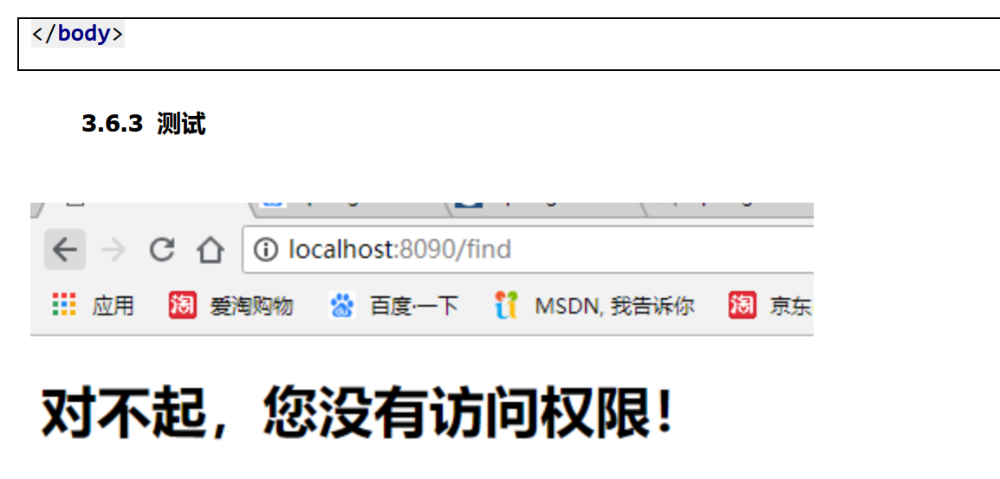
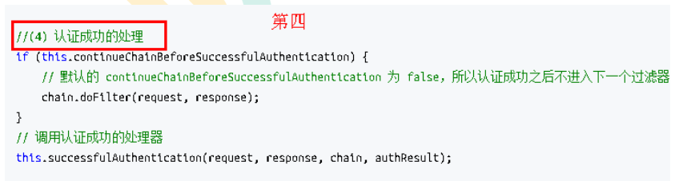

# 1. SpringSecurity 框架简介

 

## 1.1 概要

Spring 是非常流行和成功的 Java 应用开发框架，Spring Security 正是 Spring 家族中的成员。Spring Security 基于 Spring 框架，提供了一套 Web 应用安全性的完整解决方案。

正如你可能知道的关于安全方面的两个主要区域是“认证”和“授权”（或者访问控制），一般来说，Web 应用的安全性包括用户认证（Authentication）和用户授权

（Authorization）两个部分，这两点也是 Spring Security 重要核心功能。

（1） 用户认证指的是：验证某个用户是否为系统中的合法主体，也就是说用户能否访问该系统。用户认证一般要求用户提供用户名和密码。系统通过校验用户名和密码来完成认证过程。通俗点说就是系统认为用户是否能登录

（2） 用户授权指的是验证某个用户是否有权限执行某个操作。在一个系统中，不同用户所具有的权限是不同的。比如对一个文件来说，有的用户只能进行读取，而有的用户可以进行修改。一般来说，系统会为不同的用户分配不同的角色，而每个角色则对应一系列的权限。通俗点讲就是系统判断用户是否有权限去做某些事情。

## 1.2 历史

Spring Security 开始于 2003 年年底,““spring 的 acegi 安全系统”。 起因是 Spring

开发者邮件列表中的一个问题,有人提问是否考虑提供一个基于 spring 的安全实现。

Spring Security 以“The Acegi Secutity System for Spring” 的名字始于 2013 年晚些时候。一个问题提交到 Spring 开发者的邮件列表，询问是否已经有考虑一个机遇 Spring 的安全性社区实现。那时候 Spring 的社区相对较小（相对现在）。实际上 Spring 自己在2013 年只是一个存在于 ScourseForge 的项目，这个问题的回答是一个值得研究的领

域，虽然目前时间的缺乏组织了我们对它的探索。

考虑到这一点，一个简单的安全实现建成但是并没有发布。几周后，Spring 社区的其他成员询问了安全性，这次这个代码被发送给他们。其他几个请求也跟随而来。到 2014 年一月大约有 20 万人使用了这个代码。这些创业者的人提出一个 SourceForge 项目加入是为了，这是在 2004 三月正式成立。

在早些时候，这个项目没有任何自己的验证模块，身份验证过程依赖于容器管理的安全性和 Acegi 安全性。而不是专注于授权。开始的时候这很适合，但是越来越多的用户请求额外的容器支持。容器特定的认证领域接口的基本限制变得清晰。还有一个相关的问题增加新的容器的路径，这是最终用户的困惑和错误配置的常见问题。

Acegi 安全特定的认证服务介绍。大约一年后，Acegi 安全正式成为了 Spring 框架的子项目。1.0.0 最终版本是出版于 2006 -在超过两年半的大量生产的软件项目和数以百计的改进和积极利用社区的贡献。

Acegi 安全 2007 年底正式成为了 Spring 组合项目，更名为"Spring Security"。

## 1.3 同款产品对比

### 1.3.1 Spring Security

Spring 技术栈的组成部分。


### 1.3.2 Shiro

Apache 旗下的轻量级权限控制框架。

 

特点：

⚫ 轻量级。Shiro 主张的理念是把复杂的事情变简单。针对对性能有更高要求的互联网应用有更好表现。

⚫ 通用性。

◼好处：不局限于Web 环境，可以脱离Web 环境使用。

◼缺陷：在Web 环境下一些特定的需求需要手动编写代码定制。

Spring Security 是 Spring 家族中的一个安全管理框架，实际上，在 Spring Boot 出现之前，Spring Security 就已经发展了多年了，但是使用的并不多，安全管理这个领域，一直是 Shiro 的天下。

相对于 Shiro，在 SSM 中整合 Spring Security 都是比较麻烦的操作，所以，Spring Security 虽然功能比 Shiro 强大，但是使用反而没有 Shiro 多（Shiro 虽然功能没有Spring Security 多，但是对于大部分项目而言，Shiro 也够用了）。

自从有了 Spring Boot 之后，Spring Boot 对于 Spring Security 提供了自动化配置方案，可以使用更少的配置来使用 Spring Security。

因此，一般来说，常见的安全管理技术栈的组合是这样的:

* SSM + Shiro

* Spring Boot/Spring Cloud + Spring Security

**以上只是一个推荐的组合而已，如果单纯从技术上来说，无论怎么组合，都是可以运行**

**的。** 

## 1.4 模块划分


# 2. SpringSecurity 入门案例

## 2.1 创建一个项目

 


 


添加一个配置类：  

```java
@Configuration
public class SecurityConfigextends WebSecurityConfigurerAdapter {
@Override
protected void configure(HttpSecurity http) throws Exception {
	http.formLogin() // 表单登录
	.and()
	.authorizeRequests() // 认证配置
	.anyRequest() // 任何请求
	.authenticated(); // 都需要身份验证
} }
```

## 2.2 运行这个项目

访问 localhost:8080


默认的用户名： user
密码在项目启动的时候在控制台会打印， 注意每次启动的时候密码都回发生变化！  


输入用户名，密码，这样表示可以访问了， 404 表示我们没有这个控制器，但是我们可以访问了。  


## 2.3 权限管理中的相关概念

### 2.3.1 主体

英文单词：principal

使用系统的用户或设备或从其他系统远程登录的用户等等。简单说就是谁使用系统谁就是主体。

### 2.3.2 认证

英文单词：authentication

权限管理系统确认一个主体的身份，允许主体进入系统。简单说就是“主体”证明自己是谁。

笼统的认为就是以前所做的登录操作。

### 2.3.3 授权

英文单词：authorization

将操作系统的“权力”“授予”“主体”，这样主体就具备了操作系统中特定功能的能力。

所以简单来说，授权就是给用户分配权限。

## 2.4 添加一个控制器进行访问

 ```java
 package com.atguigu.controller;
 @Controller
 public class IndexController {
 	@GetMapping("index")
 	@ResponseBody
 	public String index(){
 	return "success";
 	}
 }
 ```


## 2.5 SpringSecurity 基本原理

 SpringSecurity 本质是一个过滤器链： 从启动是可以获取到过滤器链：

 ```java
 org.springframework.security.web.context.request.async.WebAsyncManagerIntegrationFil
 ter
 org.springframework.security.web.context.SecurityContextPersistenceFilter
 org.springframework.security.web.header.HeaderWriterFilter
 org.springframework.security.web.csrf.CsrfFilter
 org.springframework.security.web.authentication.logout.LogoutFilter
 org.springframework.security.web.authentication.UsernamePasswordAuthenticationFilter
 org.springframework.security.web.authentication.ui.DefaultLoginPageGeneratingFilter
 org.springframework.security.web.authentication.ui.DefaultLogoutPageGeneratingFilter
 org.springframework.security.web.savedrequest.RequestCacheAwareFilter
 org.springframework.security.web.servletapi.SecurityContextHolderAwareRequestFilter
 org.springframework.security.web.authentication.AnonymousAuthenticationFilter
 org.springframework.security.web.session.SessionManagementFilter
 org.springframework.security.web.access.ExceptionTranslationFilter
 org.springframework.security.web.access.intercept.FilterSecurityInterceptor
 ```

代码底层流程：重点看三个过滤器：

FilterSecurityInterceptor：是一个方法级的权限过滤器, 基本位于过滤链的最底部。


 

super.beforeInvocation(fi) 表示查看之前的 filter 是否通过。
fi.getChain().doFilter(fi.getRequest(), fi.getResponse());表示真正的调用后台的服务。

ExceptionTranslationFilter：是个异常过滤器，用来处理在认证授权过程中抛出的异常  


UsernamePasswordAuthenticationFilter ：对/login 的 POST 请求做拦截，校验表单中用户名，密码。


##  2.6 UserDetailsService 接口讲解  

当什么也没有配置的时候，账号和密码是由 Spring Security 定义生成的。而在实际项目中账号和密码都是从数据库中查询出来的。 所以我们要通过自定义逻辑控制认证逻辑。
如果需要自定义逻辑时，只需要实现 UserDetailsService 接口即可。接口定义如下：  

 

### 返回值 UserDetails

这个类是系统默认的用户“主体”

```java
// 表示获取登录用户所有权限
Collection<? extends GrantedAuthority> getAuthorities();
// 表示获取密码
String getPassword();
// 表示获取用户名
String getUsername();
// 表示判断账户是否过期
boolean isAccountNonExpired();
// 表示判断账户是否被锁定
boolean isAccountNonLocked();
// 表示凭证{密码}是否过期
boolean isCredentialsNonExpired();
// 表示当前用户是否可用
boolean isEnabled();
```

以下是 UserDetails 实现类  

 

以后我们只需要使用 User 这个实体类即可！


### 方法参数 username  

 表示用户名。此值是客户端表单传递过来的数据。默认情况下必须叫 username，否则无法接收。  

## 2.7 PasswordEncoder 接口讲解  

```java
// 表示把参数按照特定的解析规则进行解析
String encode(CharSequence rawPassword);
// 表示验证从存储中获取的编码密码与编码后提交的原始密码是否匹配。如果密码匹配，则返回 true；如果不匹配，则返回 false。第一个参数表示需要被解析的密码。第二个
// 参数表示存储的密码。
boolean matches(CharSequence rawPassword, String encodedPassword);
// 表示如果解析的密码能够再次进行解析且达到更安全的结果则返回 true，否则返回false。默认返回 false。
default boolean upgradeEncoding(String encodedPassword) {
	return false;
}
```

接口实现类


 BCryptPasswordEncoder 是 Spring Security 官方推荐的密码解析器，平时多使用这个解析
器。
BCryptPasswordEncoder 是对 bcrypt 强散列方法的具体实现。是基于 Hash 算法实现的单
向加密。可以通过 strength 控制加密强度，默认 10.  

###  查用方法演示  

```java
@Test
public void test01(){
	// 创建密码解析器
	BCryptPasswordEncoder bCryptPasswordEncoder = new
	BCryptPasswordEncoder();
	// 对密码进行加密
	String atguigu = bCryptPasswordEncoder.encode("atguigu");
	// 打印加密之后的数据
	System.out.println("加密之后数据： \t"+atguigu);
	//判断原字符加密后和加密之前是否匹配
	boolean result = bCryptPasswordEncoder.matches("atguigu", atguigu);
	// 打印比较结果
	System.out.println("比较结果： \t"+result);
}
```

## 2.8 SpringBoot 对 Security 的自动配置

[https://docs.spring.io/spring-](https://docs.spring.io/spring-security/site/docs/5.3.4.RELEASE/reference/html5/#servlet-hello) [security/site/docs/5.3.4.RELEASE/reference/html5/#servlet-hello](https://docs.spring.io/spring-security/site/docs/5.3.4.RELEASE/reference/html5/#servlet-hello)

# 3. SpringSecurity Web 权限方案

## 3.1 设置登录系统的账号、密码

方式一：在 application.properties  

 ```properties
 spring.security.user.name=atguigu
 spring.security.user.password=atguigu
 ```

方式二：编写类实现接口  

```java
package com.atguigu.config;
@Configuration
public class SecurityConfig {
	// 注入 PasswordEncoder 类到 spring 容器中
	@Bean
	public PasswordEncoder passwordEncoder(){
	return new BCryptPasswordEncoder();
	}
}

```

```java
package com.atguigu.service;
@Service
public class LoginService implements UserDetailsService {
@Override
public UserDetails loadUserByUsername(String username) throws
UsernameNotFoundException {
	// 判断用户名是否存在
	if (!"admin".equals(username)){
	throw new UsernameNotFoundException("用户名不存在！ ");}
	// 从数据库中获取的密码 atguigu 的密文
	String pwd ="$2a$10$2R/M6iU3mCZt3ByG7kwYTeeW0w7/UqdeXrb27zkBIizBvAven0/na";
	// 第三个参数表示权限
	return new User(username,pwd,AuthorityUtils.commaSeparatedStringToAuthorityList("admin,"));
	}
}
```

## 3.2 实现数据库认证来完成用户登录  

完成自定义登录  

### 3.2.1 准备 sql

 ```sql
 create table users(
     id bigint primary key auto_increment,
     username varchar(20) unique not null,
     password varchar(100)
 );
 -- 密码 atguigu
 insert into users values(1,'张san','$2a$10$2R/M6iU3mCZt3ByG7kwYTeeW0w7/UqdeXrb27zkBIizBvAven0/na');
 -- 密码 atguigu
 insert into users values(2,'李si','$2a$10$2R/M6iU3mCZt3ByG7kwYTeeW0w7/UqdeXrb27zkBIizBvAven0/na');
 create table role(
     id bigint primary key auto_increment,
     name varchar(20)
 );
 insert into role values(1,'管理员');
 insert into role values(2,'普通用户');
 create table role_user(
     uid bigint,
     rid bigint
 );
 insert into role_user values(1,1);
 insert into role_user values(2,2);
 create table menu(
     id bigint primary key auto_increment,
     name varchar(20),
     url varchar(100),
     parentid bigint,
     permission varchar(20)
 );
 insert into menu values(1,'系统管理','',0,'menu:system');
 insert into menu values(2,'用户管理','',0,'menu:user');
 create table role_menu(
     mid bigint,
     rid bigint
 );
 insert into role_menu values(1,1);
 insert into role_menu values(2,1);
 insert into role_menu values(2,2);                      
 ```

### 3.2.2 添加依赖

```xml
<dependencies>
<dependency>
<groupId>org.springframework.boot</groupId>
<artifactId>spring-boot-starter-web</artifactId>
</dependency>
<dependency>
<groupId>org.springframework.boot</groupId>
<artifactId>spring-boot-starter-security</artifactId>
</dependency>
<dependency>
<groupId>org.springframework.boot</groupId>
<artifactId>spring-boot-starter-test</artifactId>
<scope>test</scope>
</dependency>
<!--mybatis-plus-->
<dependency>
<groupId>com.baomidou</groupId>
<artifactId>mybatis-plus-boot-starter</artifactId>
<version>3.0.5</version>
</dependency>
<!--mysql-->
<dependency>
<groupId>mysql</groupId>
<artifactId>mysql-connector-java</artifactId>
</dependency>
<!--lombok 用来简化实体类-->
<dependency>
<groupId>org.projectlombok</groupId>
<artifactId>lombok</artifactId>
</dependency>
</dependencies>
```

### 3.2.3 制作实体类

```java
@Data
public class Users {
    private Integer id;
	private String username;
	private String password;
}
```

### 3.2.4 整合MybatisPlus 制作mapper

```java
@Repository
public interface UsersMapper extends BaseMapper<Users> {
}
配置文件添加数据库配置
#mysql 数据库连接
spring.datasource.driver-class-name=com.mysql.cj.jdbc.Driver
spring.datasource.url=jdbc:mysql://localhost:3306/demo?serverTimezone=GMT%2B8
spring.datasource.username=root
spring.datasource.password=root
```

###  3.2.5 制作登录实现类  

 ```java
 @Service("userDetailsService")
 public class MyUserDetailsService implements UserDetailsService {
 	@Autowired
 	private UsersMapper usersMapper;
 	@Override
 	public UserDetails loadUserByUsername(String s) throws
 		UsernameNotFoundException {
 		QueryWrapper<Users> wrapper = new QueryWrapper();
 		wrapper.eq("username",s);
 		Users users = usersMapper.selectOne(wrapper);
 		if(users == null) {
 			throw new UsernameNotFoundException("用户名不存在！ ");
 		}
 		System.out.println(users);
 		List<GrantedAuthority> auths =
 		AuthorityUtils.commaSeparatedStringToAuthorityList("role");
 		return new User(users.getUsername(),
 		new BCryptPasswordEncoder().encode(users.getPassword()),auths);
 	}
 }
 ```

### 3.2.6 测试访问


输入用户名，密码

## 3.3 未认证请求跳转到登录页

### 3.3.1 引入前端模板依赖

```xml
<dependency>
	<groupId>org.springframework.boot</groupId>
	<artifactId>spring-boot-starter-thymeleaf</artifactId>
</dependency>
```

### 3.3.2 引入登录页面

将准备好的登录页面导入项目中

### 3.3.3 编写控制器

```java
@Controller
public class IndexController {
	@GetMapping("index")
	public String index(){
		return "login";
	}
	@GetMapping("findAll")
	@ResponseBody
	public String findAll(){
		return "findAll";
}}
```

### 3.3.4 编写配置类放行登录页面以及静态资源


###  3.3.5 测试  

访问 localhost:8090/index  


访问 localhost:8090/findAll 会提示 403 错误 表示没有这个权限。


### 3.3.6 设置未授权的请求跳转到登录页


## 3.4 基于角色或权限进行访问控制

### 3.4.1 hasAuthority 方法

如果当前的主体具有指定的权限，则返回 true,否则返回 false

#### 修改配置类


#### 添加一个控制器

 

#### 给用户登录主体赋予权限  


#### 测试  


### 3.4.2 hasAnyAuthority 方法

如果当前的主体有任何提供的角色（给定的作为一个逗号分隔的字符串列表）的话，返回

true.

访问 http://localhost:8090/find


###  3.4.3 hasRole 方法  


 


### 3.4.4 hasAnyRole  


## 3.5 基于数据库实现权限认证

### 3.5.1 添加实体类


###  3.5.2 编写接口与实现类  


 


UsersServiceImpl  


### 3.5.3 在配置文件中添加映射


### 3.5.4 修改访问配置类


### 3.5.5 使用管理员与非管理员进行测试  


##  3.6 自定义 403 页面  

 



## 3.7 注解使用  

###  3.7.1 @Secured  


### 3.7.2 @PreAuthorize  


### 3.7.3 @PostAuthorize  


使用李四登录测试：  

### 3.7.4 @PostFilter  


### 3.7.5 @PreFilter  


测试的 Json 数据：  

```json
[ {
"id": "1",
"username": "admin",
"password": "666"
},
{
"id": "2",
"username": "admins",
"password": "888"
},
{
"id": "3",
"username": "admins11",
"password": "11888"
},
{
"id": "4",
"username": "admins22",
"password": "22888"
}]
```

### 3.7.6 权限表达式

https://docs.spring.io/springsecurity/site/docs/5.3.4.RELEASE/reference/html5/#el-access  

## 3.8 基于数据库的记住我

### 3.8.1 创建表


### 3.8.2 添加数据库的配置文件


### 3.8.3 编写配置类


### 3.8.4 修改安全配置类


### 3.8.5 页面添加记住我复选框  


### 3.8.6 使用张三进行登录测试

登录成功之后，关闭浏览器再次访问 http://localhost:8090/find，发现依然可以使用！


### 3.8.7 设置有效期

默认 2 周时间。但是可以通过设置状态有效时间，即使项目重新启动下次也可以正常登录。


## 3.9 用户注销  

### 3.9.1 在登录页面添加一个退出连接


### 3.9.2 在配置类中添加退出映射地址


### 3.9.3 测试

退出之后，是无法访问需要登录时才能访问的控制器！

## 3.10 CSRF

### 3.10.1 CSRF 理解

 

###  3.10.2 案例  


### 3.10.3 Spring Security 实现 CSRF 的原理：

1. 生成 csrfToken 保存到HttpSession 或者 Cookie 中。


2. 请求到来时，从请求中提取 csrfToken，和保存的 csrfToken 做比较，进而判断当前请求是否合法。主要通过 CsrfFilter 过滤器来完成。


# 4. SpringSecurity 微服务权限方案

## 4.1 什么是微服务

1、微服务由来


## 4.2 微服务认证与授权实现思路

### 1、认证授权过程分析

（1） 如果是基于Session，那么 Spring-security 会对 cookie 里的 sessionid 进行解析，找到服务器存储的 session 信息，然后判断当前用户是否符合请求的要求。

（2） 如果是token，则是解析出 token，然后将当前请求加入到 Spring-security 管理的权限信息中去


如果系统的模块众多，每个模块都需要进行授权与认证，所以我们选择基于 token 的形式进行授权与认证，用户根据用户名密码认证成功，然后获取当前用户角色的一系列权限  值，并以用户名为key，权限列表为value 的形式存入 redis 缓存中，根据用户名相关信息生成token 返回，浏览器将 token 记录到 cookie 中，每次调用 api 接口都默认将token 携带到 header 请求头中，Spring-security 解析 header 头获取 token 信息，解析 token 获取当前用户名，根据用户名就可以从redis 中获取权限列表，这样 Spring-security 就能够判断当前请求是否有权限访问

### 2、权限管理数据模型


## 4.3 jwt 介绍

 

### 1、访问令牌的类型

 

### 2、JWT 的组成

典型的，一个JWT 看起来如下图：

 

 该对象为一个很长的字符串，字符之间通过"."分隔符分为三个子串。每一个子串表示了一个功能块，总共有以下三个部分： JWT 头、有效载荷和签名  

#### JWT 头

 

#### 有效载荷

 

#### 签名哈希

 


## 4.4 具体代码实现   


### 4.4.1 编写核心配置类

 Spring Security 的核心配置就是继承 WebSecurityConfigurerAdapter 并注解@EnableWebSecurity 的配置。这个配置指明了用户名密码的处理方式、请求路径、登录、登出控制等和安全相关的配置  


### 4.4.2 创建认证授权相关的工具类

  

#### （1）DefaultPasswordEncoder：密码处理的方法


#### （2） TokenManager：token 操作的工具类


#### （3） TokenLogoutHandler：退出实现  


 

#### （4）UnauthorizedEntryPoint：未授权统一处理


### 4.4.3 创建认证授权实体类  

 

#### (1) SecutityUser  


#### (2) User  


### 4.4.4 创建认证和授权的filter


#### （1)TokenLoginFilter：认证的 filter


####  （2） TokenAuthenticationFilter： 授权 filter  


# 5. SpringSecurity 原理总结

## 5.1 SpringSecurity 的过滤器介绍  


## 5.2 SpringSecurity 基本流程  


## 5.3 SpringSecurity 认证流程  


### 5.3.1 UsernamePasswordAuthenticationFilter 源码

当前端提交的是一个 POST 方式的登录表单请求，就会被该过滤器拦截，并进行身份认证。该过滤器的 doFilter() 方法实现在其抽象父类
AbstractAuthenticationProcessingFilter 中，查看相关源码：  




上述的 第二 过程调用了 UsernamePasswordAuthenticationFilter 的attemptAuthentication() 方法，源码如下：


  

上述的（ 3）过程创建的 UsernamePasswordAuthenticationToken 是Authentication 接口的实现类，该类有两个构造器，一个用于封装前端请求传入的未认
证的用户信息，一个用于封装认证成功后的用户信息：  


Authentication 接口的实现类用于存储用户认证信息，查看该接口具体定义：  


### 5.3.2 ProviderManager 源码  


### 5.3.3 认证成功/失败处理  


## 5.4 SpringSecurity 权限访问流程  

上一个部分通过源码的方式介绍了认证流程，下面介绍权限访问流程，主要是对ExceptionTranslationFilter 过滤器和 FilterSecurityInterceptor 过滤器进行介绍。  

### 5.4.1 ExceptionTranslationFilter 过滤器  


### 5.4.2 FilterSecurityInterceptor 过滤器  


## 5.5 SpringSecurity 请求间共享认证信息  


### 5.5.1 SecurityContextPersistenceFilter 过滤器  


