# 前端设计模式

## 传统前端MVP设计模式

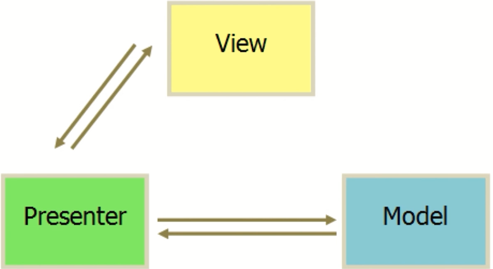

* View：视图层，显示页面DOM与数据
* Presenter：控制层，呈现层，存放业务逻辑，是V层和M层的中转站（核心层）
* Model：模型层（数据层），操作与存储数据，Model层比较边缘

示例

```html
<head>
    <meta charset="UTF-8">
    <title>TodoList Jquery</title>
    <script src='./jquery.js'></script>
</head>
<body>
    <div>
        <input id="input" type="text"/>
        <button id="btn">提交</ button>
        <ul id="list"></ul>
    </div> 
    <script>
        function Page() {
        }
        $.extend(Page.prototype, {
            init: function() {
                this.bindEvents ()
            },
            bindEvents: functi	on() {
                var btn = $('#btn');
                btn.on('click' , $.proxy (this.handleBtnClick, this))
            },
            handleBtnClick: function() {
                var inputElem = $("#input");
                var inputValue = inputElem.val);
                var ulElem = $("#list");
                ulElem.append ('<li>' + inputValue + '</li>');
                inputElem. val('');
            }
        })
        var page = new Page();
        page.init();
    </script>
</body>
```

视图层发出事件交给控制层，控制层调用模型层AJAX去获取数据，进行处理逻辑后，最后操作DOM改变视图层，或者要么直接去进行处理逻辑，最后操作DOM改变视图层。这里最核心的层是Presenter层，Model层比较边缘，大量的代码都写在Presenter层中，其中大量的操作也都是在操作DOM。

## MVVM设计模式

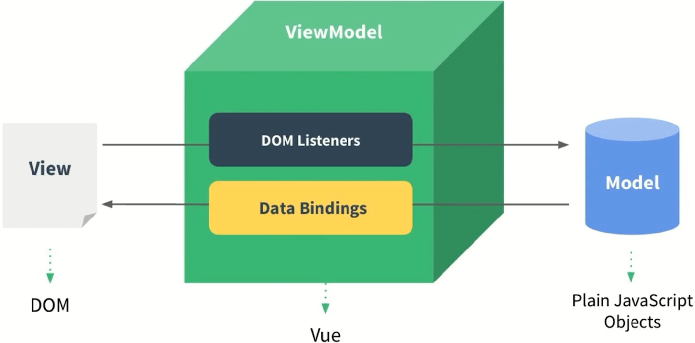

* View层：视图层，显示页面DOM与数据
* ViewModel层：Vue的内置层，不需要关注，只需要关注Model层和View层
* Model层：模型层（数据层），操作与存储数据（核心层）

示例

```html
<!DOCTYPE html>
<html lang="en">
<head>
    <title>Vue初探-todoList</title>
    <script src ="vue.js"></script>
</head>
<body> 
    <div id="app">
        <input v-model="content"/>
        <button v-on:click="handleBtn">按钮</button>
        <ul>
            <!-- 插值表达式 -->
            <li v-for="elem in list">{{ elem }}</li>
        </ul>
    </div>
    
    <script>
        // 创建Vue实例
        var app = new Vue({
            // 绑定挂载点
            el: "#app",
            data: {
                // 可以在浏览器Console通过vm.$data.xxx访问，或者vm.xxx访问
                content: "",
                list: []
            },
            methods: {
                handleBtn: function(){
                    this.list.push(this.content)
                    this.content = ""
                }
            }
        });
    </script>
</body>
</html>
```

当数据变化，页面对应的视图层自动跟着变，这个实现是VM层做的，VM不是自己实现的，Vue就是一个VM层，它帮助我们监听数据变化改变视图层，也会监听视图层的事件触发，帮助我们通过VM层，去调用一些逻辑代码，从而改变M层的数据，当M层发生数据变化时，VM层又会自动把数据的变化映射到视图层上面来，好处是我们开发的时候只需要关注M层的开发就可以了，我们将数据进行修改，页面会自动变，同时页面上的变化，Vue实例也能感知到页面变化，从而方便我们进行操作数据。所以MVVM框架作为开发的时候，最重的一层是M层。

对比：

* MVP 面向DOM进行开发，代码存在大量关于DOM的操作
* MVVM 面向数据进行开发，极大的减少DOM操作

Vue的ViewModel层实现原理：Vue用到了es5里面比较核心的API：Object.difinePreperties，同时也引用了虚拟DOM的机制，通过这两种机制Vue实现了VM层的架构体系。

# Vue 初探

```html
<!DOCTYPE html>
<html lang="en">
<head>
    <title>Vue初探-todoList</title>
    <script src ="vue.js"></script>
</head>
<body> 
    <div id="app">
        <input v-model="content"/>
        <button v-on:click="handleBtn">按钮</button>
        <ul>
            <!-- 插值表达式 -->
            <li v-for="elem in list">{{ elem }}</li>
        </ul>
    </div>
    
    <script>
        // 创建Vue实例
        var app = new Vue({
            // 绑定挂载点
            // 如果没有显式设置template属性，Vue会自动使用挂载点内的内容作为模板，这是Vue.js的一种方便的默认行为。但如果你想使用自定义模板，你仍然可以设置template属性来覆盖挂载点内的内容。
            el: "#app",
            data: {
                // 可以在浏览器Console通过vm.$data.xxx访问，或者vm.xxx访问
                content: "",
                list: []
            },
            methods: {
                handleBtn: function(){
                    this.list.push(this.content)
                    this.content = ""
                }
            }
        });
    
    </script>
</body>
</html>
```

# Vue 组件

## 父组件向子组件传值

```html
<!DOCTYPE html>
<html lang="en">
<head>
    <title>Vue组件-父组件向子组件传值</title>
    <script src ="vue.js"></script>
</head>
<body>
    <div id="root">
        <div>
            <input v-model="content"/>
            <button v-on:click="handleBtn">按钮</button>
        </div>
        <ul>
            <!-- 
                 通过v-for 循环多个子组件，并且将每个循环项的内容，通过 v-bind 借助变量content-value传给子组件
                 注意：
                    1、使用子组件的时候，如果子组件命名是首字母大写的驼峰，则引用子组件的时候名称要用小写的形式，且用-分割
                    2、如果此处的子属性绑定属性名用-分割，则子组件props定义的接收属性名称则用驼峰形式或者，首字母大写的驼峰形式也是可以的
            -->
            <!-- vue指令后面代表的不是字符串，都是指js表达式,表达式里面当然可以写变量而且还可以拼接字符串等操作 -->
            <todo-item v-bind:content-value="item"
                       v-for="item in list">
            </todo-item>
        </ul>
    </div>
   
    <script>

        // 全局组件
        // Vue.component("TodoItem",{
        //     // 使用 props 定义 contentValue 属性来接收父组件传递过来的数值
        //     props: ['contentValue'],
        //     template: "<li>{{ contentValue }}<li/>"
        // })
        
        // 局部组件
        var TodoItem = {
            props: ['contentValue'],
            template: "<li>{{ contentValue }}<li/>"
        }

        var app = new Vue({
            el: "#root",
            // 使用局部组件的时候，这里将局部组件注册到Vue实例中,这里可以更换名称
            components: {
                TodoItem: TodoItem
            },
            data: {
                content: "",
                list: []
            },
            methods: {
                handleBtn: function(){
                    this.list.push(this.content)
                    this.content = ''
                }
            }
        });
    </script>
</body>
</html>
```

## 子组件向父组件传值

```html
<!DOCTYPE html>
<html lang="en">
<head>
    <title>Vue组件-子组件向父组件传值</title>
    <script src ="vue.js"></script>
</head>
<body>
    <div id="root">
        <div>
            <input v-model="content"/>
            <button v-on:click="handleBtn">按钮</button>
        </div>
        <ul>
            <!-- 
                 v-band:xxx  可以简写 :xxx
                 v-on:监听的事件函数 可以简写 @监听的事件函数
            -->
            <todo-item :content-value="item" 
                       :index="index" 
                       v-for="(item, index) in list"
                       @delete='handleItemDelete'> <!-- 这里监听delete事件 -->
            </todo-item>
        </ul>
    </div>
   
    <script>

        // 局部组件
        var TodoItem = {
            props: ['contentValue','index'],
            template: "<li @click = 'handleItemClick'>{{ contentValue }}<li/>",
            methods: {
                handleItemClick: function(){
                    // 向外部父组件触发一个delete事件
                    this.$emit("delete", this.index)
                }
            }
        }

        var app = new Vue({
            el: "#root",
            // 使用局部组件的时候，这里将局部组件注册到Vue实例中,这里可以更换名称
            components: {
                TodoItem: TodoItem
            },
            data: {
                content: "",
                list: []
            },
            methods: {
                handleBtn: function(){
                    this.list.push(this.content)
                    this.content = ''
                },
                handleItemDelete: function(index){
                    this.list.splice(index, 1)
                }
            }
        });
    </script>
</body>
</html>
```

# Vue 实例

```html
<!DOCTYPE html>
<html lang="en">
<head>
    <title>Vue实例</title>
    <script src ="vue.js"></script>
</head>
<body>
    <div id="root">
        <div @click="handleClick">{{message}}</div>
        <!-- 在根实例里面使用注册的组件 -->
        <item></item>
    </div>
   
    <script>
        // Vue中的每一个组件也是Vue实例，比如下面这个创建的组件（当创建组件的时候，Vue的底层会将这个组件编译成Vue的实例）
        // 所以一个Vue项目由很多小的Vue组件组成的，也可以说由很多Vue实例拼装组成
        Vue.component("item",{
            template: "<div>Bye World</div>"
        })

        // 根实例是一个Vue实例（加载的入口点）
        var vm = new Vue({
            el: "#root",
            data: {
                message: 'Hello World'
            },
            methods:{
                handleClick: function() {
                    alert('hello')
                }
            }
        })
    </script>
</body>
</html>
```

# Vue 实例的生命周期

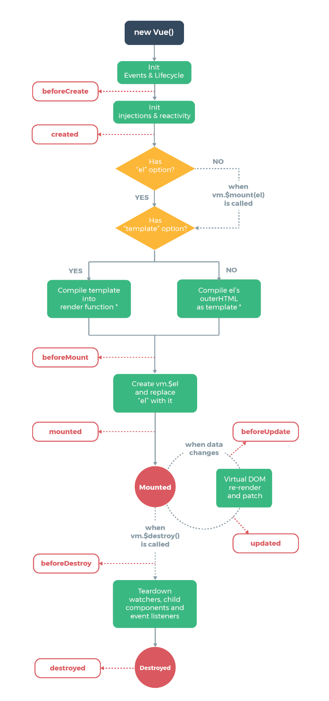

```html
<!DOCTYPE html>
<html lang="en">
<head>
    <title>Vue实例的生命周期</title>
    <script src ="vue.js"></script>
</head>
<body> 
    <div id="app"></div>
    
    <script>
        // 生命周期函数就是Vue实例在某一个时间点会自动执行的函数
        var vm = new Vue({
            el: '#app',
            // 这里可以将模板定义这在这里，否则采用el对应的挂载点区域作为默认模板
            template: "<div>{{test}}</div>",
            data: {
                test: "hello word"
            },
            // 初始化事件和生命周期之后，初始化外部注入和双向绑定等内容之前
            beforeCreate: function() {
                console.log('beforCreate')
            },
            // 初始化外部注入和双向绑定等内容之后，至此初始化结束
            created: function() {
                console.log('created')
            },
            // 模板结合数据生成vue实例中的dom元素挂载页面上之前，页面还没有被渲染
            beforeMount: function() {
                console.log(this.$el)
                console.log('beforeMount')
            },
            // 页面挂载之后执行，页面渲染完毕
            mounted: function() {
                console.log(this.$el)
                console.log('mounted')
            },
            // 当组件被销毁的时候执行，比如方法 vm.$destroy() 被调用的时候执行
            beforeDestroy: function() {
                console.log('beforeDestroy')
            },
            // 当组件完全被销毁之后执行
            destroyed: function() {
                console.log('destroyed')
            },
            // 数据发生改变，还没有重新渲染之前
            beforeUpdate: function() {
                console.log('beforeUpdate')
            },
            // 数据已经发生改变，重新渲染之后
            updated: function() {
                console.log('updated')
            }
        });
    </script>
</body>
</html>
```

# Vue 模板语法

```html
<!DOCTYPE html>
<html lang="en">
<head>
    <title>Vue模板语法</title>
    <script src ="vue.js"></script>
</head>
<body>
    
    <div id="app">
        <!-- 插值表达式 -->
        <div>{{name}}</div>
        <!-- 显示数据变量，innerText的内容变成name属性数值-->
        <div v-text="name"></div>
        <!-- 显示数据变量，innerHtml的内容变成name属性数值-->
        <div v-html="name"></div>
        <!-- v-on:click='' v-bind:title='' ... ...-->
        <!-- 注意，vue指令后面代表的不是字符串，都是指js表达式,表达式里面当然可以写变量而且还可以拼接字符串等操作 -->
        <div v-text="cn + ' Lee'"></div>
        <div v-html="cn + ' Lee'"></div>
        <!-- 插值表达式也可以写js表达式 -->
        <div>{{cn + ' Lee'}}</div>
    </div>
    
    <script>
        var vm = new Vue({
            el: "#app",
            data: {
                name: "<h1>Dell</h1>",
                cn: "Dell"
            }
        });
    </script>
</body>
</html>
```

# Vue 计算属性、方法、侦听器

```html
<!DOCTYPE html>
<html lang="en">
<head>
    <title>Vue计算属性,方法,侦听器</title>
    <script src ="vue.js"></script>
</head>
<body>
    
    <div id="app">
        {{firstName + ' ' + lastName}}
        <br>
        {{age}}
        <br>
        <!-- 使用计算属性 -->
        <!-- {{fullName}} -->
        <!-- 使用方法调用的形式 -->
        <!-- {{fullName()}} -->
        <!-- 使用侦听器 -->
        {{fullName}}
        

    </div>
    
    <script>
        var vm = new Vue({
            el: "#app",
            data: {
                firstName: "Dell",
                lastName: "Lee",
                fullName: "Dell Lee",
                age: 28
            },
            // 计算属性
            // computed: {
            //     // 计算属性具有缓存的概念，如果firstName和lastName值没有发生变化，计算属性就不会重新计算
            //     // 如果此时修改vm.age=20,则计算属性不会重新计算,如果修改firstName或者lastName则会重新计算
            //     // 也就是说当依赖的值发生了变化才会重新计算
            //     fullName: function() {
            //         console.log("计算了一次")
            //         return this.firstName + ' ' + this.lastName
            //     }
            // }

            // 方法
            // 除了用计算属性，也可以用方法的形式，方法的形式没有缓存的概念
            // 如果此时修改vm.age=20,则方法会重新计算,如果修改firstName或者lastName则会重新计算
            // 无论是计算属性还是方法的形式，如果对数值进行了覆盖操作，则都不会触发计算
            // methods: {
            //     fullName: function() {
            //         console.log("计算了一次")
            //         return this.firstName + ' ' + this.lastName
            //     }
            // }

            // 侦听器
            // 侦听器的效果和computed计算属性类似，也具备缓存，但是写法比较复杂，三种方式优先推荐使用computed
            // 侦听器具有缓存的概念，如果firstName和lastName值没有发生变化，侦听器就不会重新计算
            // 如果此时修改vm.age=20,则侦听器不会重新计算,如果修改firstName或者lastName则会重新计算
            watch: {
                firstName: function() {
                    console.log("计算了一次")
                    this.fullName = this.firstName + ' ' + this.lastName 
                },
                lastName: function() {
                    console.log("计算了一次")
                    this.fullName = this.firstName + ' ' + this.lastName 
                }
            }
        });
    </script>
</body>
</html>
```

# Vue 计算属性的setter和getter

```html
<!DOCTYPE html>
<html lang="en">
<head>
    <title>Vue计算属性的setter和getter</title>
    <script src ="vue.js"></script>
</head>
<body>
    
    <div id="app">
       {{fullName}}
    </div>
    
    <script>
        var vm = new Vue({
            el: "#app",
            data: {
                firstName: "Dell",
                lastName: "Lee"
            },
            computed: {
                // fullName: function() {
                //     return this.fullName = this.firstName + ' ' + this.lastName
                // }

                // 可以用另外一种形式
                // 可以在浏览器通过vm.fullName访问
                // 当依赖的值发生了变化才会重新计算
                fullName: {
                    get: function() {
                        return this.fullName = this.firstName + ' ' + this.lastName
                    },
                    set: function(val) {
                        console.log(val)
                        var arr = val.split(" ")
                        this.firstName = arr[0]
                        this.lastName = arr[1]                  
                    }
                }
            }
        });
    </script>
</body>
</html>
```

# Vue 样式绑定

```html
<!DOCTYPE html>
<html lang="en">
<head>
    <title>Vue样式绑定-1</title>
    <script src ="vue.js"></script>
    <style>
        .activated {
            color: red;
        }
    </style>
</head>
<body>
    
    <div id="app">
        <!-- class对象绑定-对象书写形式 -->
        <!-- 样式绑定也用v-band:xxx 简写:xxx,后面的js对象意义是：绑定使用的元素名称是activated，显不显示取决于数据中的isActivated变量 -->
       <div @click="handleDivClick"
            :class="{activated: isActivated}" 
       >
            Hello World
        </div>
    </div>
    
    <script>
        var vm = new Vue({
            el: "#app",
            data: {
                isActivated: false
            },
            methods: {
                handleDivClick: function() {
                    this.isActivated = !this.isActivated
                }
            }   
        });
    </script>
</body>
</html>
```

```html
<!DOCTYPE html>
<html lang="en">
<head>
    <title>Vue样式绑定-2</title>
    <script src ="vue.js"></script>
    <style>
        .activated {
            color: red;
        }
    </style>
</head>
<body>
    
    <div id="app">
        <!-- class对象绑定-数组书写形式 -->
       <div @click="handleDivClick"
            :class="[activated, activatedOne]"
       >
            Hello World
        </div>
    </div>
    
    <script>
        var vm = new Vue({
            el: "#app",
            data: {
                activated: "",
                activatedOne: "activated-one"
            },
            methods: {
                handleDivClick: function() {
                    this.activated = this.activated === "activated" ? "" : "activated"
                }
            }   
        });
    </script>
</body>
</html>
```

```html
<!DOCTYPE html>
<html lang="en">
<head>
    <title>Vue样式绑定-3</title>
    <script src ="vue.js"></script>
</head>
<body>
    
    <div id="app">
        <!-- class内联方式绑定-对象书写形式 -->
       <div :style="styleObj" @click="handleDivClick">
            Hello World
        </div>
    </div>
    
    <script>
        var vm = new Vue({
            el: "#app",
            data: {
                styleObj: {
                    color: "black"
                }
            },
            methods: {
                handleDivClick: function() {
                    this.styleObj.color = this.styleObj.color === "black" ? "red" : "black"
                }
            }   
        });
    </script>
</body>
</html>
```

```html
<!DOCTYPE html>
<html lang="en">
<head>
    <title>Vue样式绑定-4</title>
    <script src ="vue.js"></script>
</head>
<body>
    
    <div id="app">
        <!-- class内联方式绑定-数组书写形式 -->
       <div :style="[styleObj, {fontSize: '20px'}]" @click="handleDivClick">
            Hello World
        </div>
    </div>
    
    <script>
        var vm = new Vue({
            el: "#app",
            data: {
                styleObj: {
                    color: "black"
                }
            },
            methods: {
                handleDivClick: function() {
                    this.styleObj.color = this.styleObj.color === "black" ? "red" : "black"
                }
            }   
        });
    </script>
</body>
</html>
```

# Vue 条件渲染

```html
<!DOCTYPE html>
<html lang="en">
<head>
    <title>Vue条件渲染</title>
    <script src ="vue.js"></script>
</head>
<body>

    <div id="app">
       <!-- 如果表达式返回结果为false，则标签不存在DOM之上 -->
       <!-- 性能低一些，每次都是删除DOM或者删除DOM -->
       <!--  v-if 和 v-else 如果要同时用,则要连在一起写-->
       <div v-if="show">{{message}}</div>
       <div v-else>Bye Word</div>
       <!-- 如果表达式返回结果为false,标签存在,形式是style="display: none;" -->
       <!-- 性能高一些，不会频繁将DOM从页面上删除或添加 -->
       <div v-show="show">{{message}}</div>
        
       <!-- 多条件判断 -->
       <!--  v-if, v-else-if 和 v-else 如果要同时用,则要连在一起写-->
       <div v-if="char ==='a'"> This is A</div>
       <div v-else-if="char ==='b'"> This is B</div>
       <div v-else> This is others</div>

       <!-- Vue默认复用输入框的内容，所以当input值发生改变的时候，输入框的值复用 -->
       <!-- 解决上述这个问题使用key值,让元素唯一，这样就找不到重复的元素了，就会重新生成DOM -->
       <div v-if="input">
            用户名：<input key="username"/>
       </div>
       <div v-else>
            邮箱名：<input key="password"/>
       </div>

    </div>
    
    <script>
        var vm = new Vue({
            el: "#app",
            data: {
                message: "Hello Word",
                show: false,
                char: "c",
                input: true
            },
            methods: {
               
            }   
        });
    </script>
</body>
</html>
```

# Vue 列表渲染

```html
<!DOCTYPE html>
<html lang="en">
<head>
    <title>Vue列表渲染-1</title>
    <script src ="vue.js"></script>
</head>
<body>

    <div id="app">
        <!-- 可以用in，但是更推荐用of -->
        <!-- <div v-for="item of list">{{item}}</div> -->

        <!-- 为了提升循环显示性能，需要添加唯一key值,不推荐用index,推荐用数据中的ID -->
        <div v-for="(item, index) of list" :key="item.id">
            {{item.text}}----{{index}}
        </div>
    </div>
    
    <!-- 改变数组内容，让页面发生变化，实现数据绑定的两种方式(后面还有通过set方法的形式，一共三种形式) -->
    <!-- 1、通过Vue变异方法操作集合 -->
    <!-- 不能通过下标的形式修改数组内对象数据实现数据绑定，如：vm.list[3]={id:"",text:""}
         只能通过Vue提供的数据变异方法操作数据才能实现数据绑定，如：vm.list.splice(1, 1, {id:"333", text: "Dell1"}) -->
    <!-- push pop shift unshift splice sort reverse 一共七个-->

    <!-- 2、通过修改数据对象引用地址的方式操作集合，如：
    vm.list = [{
                    id:"11",
                    text: "hello1"    
                },{
                    id:"22",
                    text: "Dell1"    
                },{
                    id:"33",
                    text: "Look1"    
                },{
                    id:"44",
                    text: "For1"    
                }]
    -->
    <script>
        var vm = new Vue({
            el: "#app",
            data: {
                list: [{
                    id:"1",
                    text: "hello"    
                },{
                    id:"2",
                    text: "Dell"    
                },{
                    id:"3",
                    text: "Look"    
                },{
                    id:"4",
                    text: "For"    
                }]
            }
        });
    </script>
</body>
</html>
```

```html
<!DOCTYPE html>
<html lang="en">
<head>
    <title>Vue列表渲染-2</title>
    <script src ="vue.js"></script>
</head>
<body>

    <div id="app">
        <!-- <div v-for="(item, index) of list" :key="item.id">
            <div>
                {{item.text}}----{{index}}
            </div>
            <span>
                {{item.text}}
            </span>
        </div> -->

        <!-- 如果不想显示外层div,则可以使用template: 模板占位符，用来包裹一些元素，但是自身不会被渲染到页面上 -->
        <template v-for="(item, index) of list" :key="item.id">
            <div>
                {{item.text}}----{{index}}
            </div>
            <span>
                {{item.text}}
            </span>
        </template>
    </div>
    
    <script>
        var vm = new Vue({
            el: "#app",
            data: {
                list: [{
                    id:"1",
                    text: "hello"    
                },{
                    id:"2",
                    text: "Dell"    
                },{
                    id:"3",
                    text: "Look"    
                },{
                    id:"4",
                    text: "For"    
                }]
            }
        });
    </script>
</body>
</html>
```

```html
<!DOCTYPE html>
<html lang="en">
<head>
    <title>Vue列表渲染-3</title>
    <script src ="vue.js"></script>
</head>
<body>

    <!-- 对象的循环渲染展示 -->
    <div id="app">
        <!-- 这里同样可以采用列表渲染的语法v-for -->
        <!-- <div v-for="item of userInfo">
            {{item}}
        </div> -->

        <div v-for="(item, key, index) of userInfo">
            {{item}}---{{key}}---{{index}}
        </div>
    </div>
    
    <!-- 注意：如果想修改值，使页面发生改变，使用 vm.userInfo.name="Dell Lee" 是可以的
         但是如果想增加属性，使页面发生改变，使用 vm.userInfo.address="ShenZhen" 是不可以的
         可以通过之前说的修改数据对象引用的方式使页面发生改变，如下：
         vm.userInfo = {
                    name: "Dell Lee",
                    age: 18,
                    gender: "male",
                    salary: "secret",
                    address: "ShenZhen"
                }
        -->
    <script>
        var vm = new Vue({
            el: "#app",
            data: {
                userInfo: {
                    name: "Dell",
                    age: 18,
                    gender: "male",
                    salary: "secret"
                }
            }
        });
    </script>
</body>
</html>
```

# Vue 的set方法

## 对象

```html
<!DOCTYPE html>
<html lang="en">
<head>
    <title>Vue的set方法-对象</title>
    <script src ="vue.js"></script>
</head>
<body>
    <!-- 除了使用修改数据对象引用的方式使页面同步发生变化，也可以使用set方法进行操作
         Vue.set(vm.userInfo,"address","beijing")
    -->
    <!-- set方法不但是Vue的全局方法Vue.set(vm.userInfo,"address","beijing")，也是Vue实例方法vm.$set(vm.userInfo,"address","beijing") 
         上述两种都可以实现修改数据，页面同步渲染的效果
    -->
    <div id="app">
        <div v-for="(item, key, index) of userInfo">
            {{item}}---{{key}}---{{index}}
        </div>
    </div>
    
    <script>
        var vm = new Vue({
            el: "#app",
            data: {
                userInfo: {
                    name: "Dell",
                    age: 18,
                    gender: "male",
                    salary: "secret"
                }
            }
        });
    </script>
</body>
</html>
```

## 数组

```html
<!DOCTYPE html>
<html lang="en">
<head>
    <title>Vue的set方法-数组</title>
    <script src ="vue.js"></script>
</head>
<body>
    <!-- 通过set方法也可以实现数组变化，页面也跟着变化
         1、Vue.set(vm.userInfo, 1, 5) Vue的全局方法
         2、vm.$set(vm.userInfo, 2, 6) Vue的实例方法
    -->
    <div id="app">
        <div v-for="(item, index) of userInfo">
            {{item}}
        </div>
    </div>
    
    <script>
        var vm = new Vue({
            el: "#app",
            data: {
                userInfo: [1, 2, 3, 4]
            }
        })
    </script>
</body>
</html>
```

# Vue 组件使用细节

```html
<!DOCTYPE html>
<html lang="en">
<head>
    <title>Vue组件使用细节-1</title>
    <script src ="vue.js"></script>
</head>
<body>
    <div id="root">
        <!-- 在H5规范里面，要求table里面有tbody.tbody里面必须放tr,但是我们使用子组件写成了row，所以浏览器解析row会出层级混乱问题(具体请看调试DOM),
             解决：使用is命令.(其他比如ul, ol ,select 等，最好也用这种方式进行操作)
        -->
        <!--
            <table>
                <tbody>
                    <row></row>
                    <row></row>
                    <row></row>
                </tbody>
            </table>
        -->
        
        <table>
            <tbody>
                <tr is="row"></tr>
                <tr is="row"></tr>
                <tr is="row"></tr>
            </tbody>
        </table>
    </div>
    
    <script>
        Vue.component('row',{
            template: '<tr><td>this is a row</td></tr>' 
        })

        var vm = new Vue({
            el: "#root",
            data: {
                
            }
        })
    </script>
</body>
</html>
```

```html
<!DOCTYPE html>
<html lang="en">
<head>
    <title>Vue组件使用细节-2</title>
    <script src ="vue.js"></script>
</head>
<body>
    <div id="root">  
        <table>
            <tbody>
                <tr is="row"></tr>
                <tr is="row"></tr>
                <tr is="row"></tr>
            </tbody>
        </table>
    </div>
    
    <script>
        Vue.component('row',{
            // 在子组件定义data并使用的时候，data必须是个函数，目的是让每一个子组件都拥有一个独立的存储，子组件彼此之间数据互不影响
            data: function () {
                return {
                    content: 'this is content'
                }
            },
            template: '<tr><td>{{content}}</td></tr>' 
        })

        var vm = new Vue({
            el: "#root",
            data: {
                
            }
        })
    </script>
</body>
</html>
```

```html
<!DOCTYPE html>
<html lang="en">
<head>
    <title>Vue组件使用细节-3</title>
    <script src ="vue.js"></script>
</head>
<body>
    <div id="root">  
        <!-- 定义引用 -->
        <div ref="hello" @click="handleClick">hello world</div>
    </div>
    
    <script>
    
        var vm = new Vue({
            el: "#root",
            methods: {
                handleClick: function() {
                    // 整个Vue实例中所有的引用里面找到引用名为hello的DOM元素
                    console.log(this.$refs.hello.innerHTML)
                }
            }
        })
    </script>
</body>
</html>
```

```html
<!DOCTYPE html>
<html lang="en">
<head>
    <title>Vue组件使用细节-4</title>
    <script src ="vue.js"></script>
</head>
<body>
    <div id="root">  
        <counter ref="one" @change="handleChange"></counter>
        <counter ref="two" @change="handleChange"></counter>
        <div>{{total}}</div>
    </div>
    
    <script>
        Vue.component('counter',{
            template: '<div @click="handleClick">{{number}}</div>',
            data: function() {
                return {
                    number: 0
                }
            },
            methods: {
                handleClick: function() {
                    this.number ++
                    this.$emit('change')
                }
            }
        })

        // 实现子组件number累加操作
        var vm = new Vue({
            el: "#root",
            data: {
                total: 0
            },
            methods: {
                handleChange: function() {
                    // 如果是组件使用ref引用的话，这里获取到的就不是DOM了，而是子组件引用对象了
                    // 计算两个子组件number属性的和
                    console.log(this.$refs.one)
                    console.log(this.$refs.two)
                    this.total = this.$refs.one.number + this.$refs.two.number
                }
            }
        })
    </script>
</body>
</html>
```

# Vue 父子组件传值

```html
<!DOCTYPE html>
<html lang="en">
<head>
    <title>Vue父子组件传值</title>
    <script src ="vue.js"></script>
</head>
<body>
    <div id="root">  
        <!-- 父组件通过属性的形式，通过count向子组件传值。
             这里可以用 :count="0", 因为“:”是Vue指令，所以后面跟的是js表达式，所以向子组件传递的是数字，而不用“:”则是向子组件传递是的字符串 -->
        <counter @change="handleIncrease" :count="2"></counter>
        <counter @change="handleIncrease" :count="2"></counter>
        <div>{{total}}</div>
    </div>
    
    <script>
        // var counter = {
        //     props: ['count'],
        //     template: '<div @click="handleClick">{{count}}</div>',
        //     methods: {
        //         handleClick: function() {
        //             // 子组件不能修改父组件传递过来的内容，这叫做Vue的“单项数据流”，所以这里不能用this.count ++
        //             this.count ++  // error
        //         }
        //     }
        // }

        var counter = {
            props: ['count'],
            data: function() {
                return {
                    number: this.count
                }
            },
            template: '<div @click="handleClick">{{number}}</div>',
            methods: {
                handleClick: function() {
                    // 如果想完成修改的操作，可以通过自身的data函数中的number复制一份父组件传递过来的count，然后操作此number就可以完成累加操作
                    this.number ++
                    this.$emit('change', 1)
                }
            }
        }

        // 实现子组件number累加操作
        var vm = new Vue({
            el: "#root",
            components: {
                counter: counter
            },
            data: {
                total: 4
            },
            methods: {
                handleIncrease: function(step) {
                    this.total += step
                }
            }
        })
    </script>
</body>
</html>
```

# Vue 组件参数校验与非Props特性

```html
<!DOCTYPE html>
<html lang="en">
<head>
    <title>Vue组件参数校验与非Props特性</title>
    <script src ="vue.js"></script>
</head>
<body>
    <div id="root">
        <!-- 这里父组件向子组件进行传递参数，因为没有用“:”，所以content默认就是字符串类型，而传递number时候用到了“:”，使用的是Vue指令，所以使用的是js表达式，因此是数值类型 -->
        <child 
            content="123" 
            :number="123"
            :num="'123'"
            :cnt="'123456'"> 
        </child>
    </div>
    
    <script>
        Vue.component('child',{
            // Props特性: 子组件接收父组件传递过来的值，并子组件可以直接显示该值
            // 非Props特性: 非Props特性有2个特点, 1、子组件没有定义对应的接收的属性(把props对象注释掉，不进行接收) 2、如果父组件向子组件传递数值，则传递的属性键值对则会展示在子组件最外层的DOM标签的HTML属性里面
            
            // 这里改用对象的形式，不用数组的形式了
            props: {
                content: String, // 子组件接收到的content属性必须是String类型
                number: Number, // 子组件接收到的content属性必须是数字类型
                num: [String, Number], // 数组形式，子组件接收到的content属性必须是数字类型或者String类型
                cnt: { // 对象形式，子组件接收cnt的属性，它的类型必须为String，且必须传递，不传递则是用默认值
                    type: String,
                    required: true,
                    default: 'default value',
                    validator: function(value) { // 校验器校验，字符串长度大于5
                        return value.length > 5
                    }
                }
            },
            template: '<div>{{content}}----{{number}}----{{num}}----{{cnt}}</div>'
        })

        var vm = new Vue({
            el: "#root"          
        })
    </script>
</body>
</html>
```

# Vue 给组件绑定原生事件

```html
<!DOCTYPE html>
<html lang="en">
<head>
    <title>Vue给组件绑定原生事件-1</title>
    <script src ="vue.js"></script>
</head>
<body>
    <div id="root">
        <!-- 在组件上的@click事件不是原生事件，是监听的自定义事件，自定义事件如果想被触发，则让子组件调用 this.$emit('') 去触发父组件的监听的自定义事件 -->
        <child @click="handleClick"></child>
    </div>
    
    <script>
        Vue.component('child', {
            template: '<div @click="handleChildClick">Child</div>',
            methods: {
                handleChildClick: function() {
                    // 向外触发自定义事件
                    this.$emit('click')
                }
            }
        })

        var vm = new Vue({
            el: "#root",
            methods: {
                handleClick: function() {
                    alert('click')
                }
            }          
        })
    </script>
</body>
</html>
```

```html
<!DOCTYPE html>
<html lang="en">
<head>
    <title>Vue给组件绑定原生事件-2</title>
    <script src ="vue.js"></script>
</head>
<body>
    <div id="root">
        <!-- 此时组件监听的是原生的点击事件(在后面追加.native)，不是自定义事件 -->
        <child @click.native="handleClick"></child>
    </div>
    
    <script>
        Vue.component('child', {
            template: '<div>Child</div>',
        })

        var vm = new Vue({
            el: "#root",
            methods: {
                handleClick: function() {
                    alert('click')
                }
            }          
        })
    </script>
</body>
</html>
```

# Vue 给非父子组件传值

```html
<!DOCTYPE html>
<html lang="en">
<head>
    <title>Vue给非父子组件传值(Bus/总线/发布订阅模式/观察者模式)</title>
    <script src ="vue.js"></script>
</head>
<body>
    <div id="root">  
       <child content="Dell"></child>
       <child content="Lee"></child>
    </div>
    
    <script>

        // 向Vue.prototype上挂载一个名为bus的属性，这个属性指向一个Vue实例
        // 后面我们只要new Vue()或者Vue.component()创建组件的时候，每一个组件上都会有bus这个属性
        // 因为每一个组件或者说每一个实例都是通过Vue这个类创建了，而我们在Vue这个类上的prototype进行挂载bus属性，所以后面创建的每一个组件/实例上都会有bus这个属性
        // 每一个通过Vue这个类创建的对象，也就是Vue实例，上面都会有bus属性，都会指向同一个Vue的实例
        Vue.prototype.bus = new Vue()

        Vue.component('child', {
            props: {
                content: String
            },
            data: function () {
                return {
                    selfContent: this.content
                }
            },
            template: '<div @click = "handleClick">{{selfContent}}</div>',
            methods: {
                handleClick: function() {
                    //  使用bus实例向外触发事件
                    this.bus.$emit('change', this.selfContent)
                }
            },
            mounted: function() {
                var this_ = this
                // 监听bus实例触发出来的事件
                this.bus.$on('change', function(msg) {
                    this_.selfContent = msg
                })
            }           
        })

        var vm = new Vue({
            el: "#root"
        })
    </script>
</body>
</html>
```

# Vue 中使用插槽

## 旧方式

```html
<!DOCTYPE html>
<html lang="en">
<head>
    <title>Vue中使用插槽-1-旧方式</title>
    <script src ="vue.js"></script>
</head>
<body>
    <div id="root">  
       <child content="<p>Dell</p>"></child>
    </div>
    
    <script>
        // 缺点：传递的DOM外层有<div>标签
        Vue.component('child', {
            props:['content'],
            template: '<div v-html="this.content"></div>'        
        })

        var vm = new Vue({
            el: "#root"
        })
    </script>
</body>
</html>
```

## slot方式

```html
<!DOCTYPE html>
<html lang="en">
<head>
    <title>Vue中使用插槽-2-slot方式</title>
    <script src ="vue.js"></script>
</head>
<body>
    <div id="root">  
       <child>
            <p>Dell</p> 
       </child>
    </div>
    
    <script>
        Vue.component('child', {
            // 这里<slot></slot>显示的就是父组件向子组件插入的“<p>Dell</p>” 这段代码
            // 通过插槽可以方便的向子组件传递DOM元素
            // template: `<div>
            //                 <slot></slot>
            //           </div>`

            // slot也可以定义默认值，定义在slot标签内部，当不传递内容的时候，会出现默认值
            template: `<div>
                            <slot>默认内容</slot>
                       </div>`        
        })

        var vm = new Vue({
            el: "#root"
        })
    </script>
</body>
</html>
```

## 具名插槽

```html
<!DOCTYPE html>
<html lang="en">
<head>
    <title>Vue中使用插槽-3-具名插槽</title>
    <script src ="vue.js"></script>
</head>
<body>
    <div id="root">  
       <body-content>
            <div class = "header" slot="header">header</div>
            <div class = "footer" slot="footer">footer</div>
       </body-content>
    </div>
    
    <script>
        Vue.component('body-content', {
            // 子组件中分别使用父插槽的内容,必须使用“具名插槽”：slot="header"，然后子组件<slot>标签使用name="header"，与具名插槽命名的内容对应。
            // 如果没有对应，则<body-content>中的所有父组件的内容都会被子组件<slot>标签所识别，造成DOM内容重复
            // 具名插槽也可以有默认值
            template: `<div>
                            <slot name="header">
                                <h1>DefaultHeader</h1>
                            </slot>
                            <div class='content'>content</div>
                            <slot name="footer">FooterDefault</slot>
                       </div>`       
        })

        var vm = new Vue({
            el: "#root"
        })
    </script>
</body>
</html>
```

# Vue 中的作用域插槽

```html
<!DOCTYPE html>
<html lang="en">
<head>
    <title>Vue中的作用域插槽</title>
    <script src ="vue.js"></script>
</head>
<body>
    <div id="root">  
       <child>
           <!-- 作用域插槽(以template开头和结尾的内容，同时声明从子组件接收的数据放在props中，以及如何内容展示)，这是固定写法 -->
           <template slot-scope="props">
                <li>{{props.item}}</li>
           </template>
       </child>
    </div>
    
    <script>
        Vue.component('child', {
            data: function() {
                return {
                    list: [1, 2, 3, 4]
                }
            },
            // 向slot中传递item值
            template: `<div>
                            <ui>
                                <slot v-for="item of list" :item=item></slot>
                            </ui>
                       </div>`       
        })

        var vm = new Vue({
            el: "#root"
        })
    </script>
</body>
</html>
```

# Vue 动态组件与v-once指令

```html
<!DOCTYPE html>
<html lang="en">
<head>
    <title>Vue动态组件与v-once指令-1</title>
    <script src ="vue.js"></script>
</head>
<body>
    <div id="root">
        <!-- 点击按钮，实现内容往复更改 -->

        <!-- 老方式实现 -->
      <!-- <child-one v-if="type==='child-one'"></child-one>
      <child-two v-if="type==='child-two'"></child-two> -->

        <!-- Vue自带标签，代表动态组件 -->
        <!-- 根据is里面type属性值的变化，自动加载不同的组件 -->
      <conponent :is="type"></conponent>
      <button @click="handleBtnClick">change</button>
    </div>
    
    <script>
        Vue.component('child-one', {
            template: '<div>child-one</div>'
        })

        Vue.component('child-two', {
            template: '<div>child-two</div>'       
        })

        var vm = new Vue({
            el: "#root",
            data: {
                type: 'child-one'
            },
            methods: {
                handleBtnClick : function() {
                    this.type = this.type ==='child-one' ? 'child-two' : 'child-one'
                }
            }
        })
    </script>
</body>
</html>
```

```html
<!DOCTYPE html>
<html lang="en">
<head>
    <title>Vue动态组件与v-once指令-2</title>
    <script src ="vue.js"></script>
</head>
<body>
    <div id="root">
      <!-- 点击按钮，实现内容往复更改 -->
      <!-- v-if 比较耗费性能，每次都要创建和销毁组件 -->
      <child-one v-if="type==='child-one'"></child-one>
      <child-two v-if="type==='child-two'"></child-two>

      <button @click="handleBtnClick">change</button>
    </div>
    
    <script>
        Vue.component('child-one', {
            // 使用v-once，当组件是静态页面，每次页面展示都是一样的时候，则第一次被加载展示之后就被放入内存，下次再展示直接从内存中获取，不需要重新创建组件，提高页面展示效率
            template: `<div v-once>child-one</div>`       
        })

        Vue.component('child-two', {
            template: `<div v-once>child-two</div>`       
        })

        var vm = new Vue({
            el: "#root",
            data: {
                type: 'child-one'
            },
            methods: {
                handleBtnClick : function() {
                    this.type = this.type ==='child-one' ? 'child-two' : 'child-one'
                }
            }
        })
    </script>
</body>
</html>
```

# Vue 中的CSS动画原理

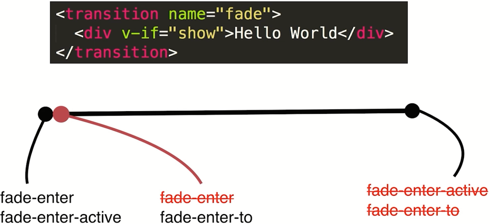

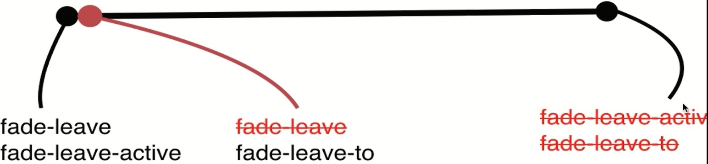

```html
<!DOCTYPE html>
<html lang="en">
<head>
    <title>Vue中的CSS动画原理</title>
    <script src ="vue.js"></script>
    <style>
        .fade-enter {
            opacity: 0;
        }
        /*  监听opacity的变化 */
        .fade-enter-active {
            transition: opacity 3s;
        }

        .fade-leave-to {
            opacity: 0;
        }
        /*  监听opacity的变化 */
        .fade-leave-active {
            transition: opacity 3s;
        }
    </style>
</head>
<body>
    <!-- 过渡动画效果 -->
    <div id="root">
        <!-- <transition> 包裹的内容具有过渡的动画效果 -->
        <!-- 默认前缀是v-,对应的样式前缀也要修改成v- -->
        <transition name="fade">
            <div v-if="show">hello world</div>
        </transition>
      <button @click="handleClick">切换</button>
    </div>
    
    <script>
        var vm = new Vue({
            el: "#root",
            data: {
                show: true
            },
            methods: {
                handleClick: function() {
                    this.show = !this.show
                }
            }
        })
    </script>
</body>
</html>
```

# Vue 中使用animate.css库

官网地址：[Animate.css 官网](https://animate.style/)

```html
<!DOCTYPE html>
<html lang="en">
<head>
    <title>Vue中使用animate.css库-1</title>
    <script src ="vue.js"></script>
    <style>
        /* 自定义的css3的@keyframes动画效果 */
        @keyframes bounce-in {
            0% {
                transform: scale(0);
            }
            50% {
                transform: scale(1.5);
            }
            100% {
                transform: scale(1);
            }
        }

        /* 这两个样式全程存在，所以用这两个类引用css3动画效果 */
        /* .fade-enter-active{
            transform-origin: left center;
            animation: bounce-in 1s;
        }
        .fade-leave-active{
            transform-origin: left center;
            animation: bounce-in 1s reverse
        } */

        .active{
            transform-origin: left center;
            animation: bounce-in 1s;
        }
        .leave{
            transform-origin: left center;
            animation: bounce-in 1s reverse
        }
    </style>
</head>
<body>
    <div id="root">
        <!-- 自定义样式名 -->
        <transition 
            name="fade"
            enter-active-class="active"
            leave-active-class="leave"   
        >    
            <div v-if="show">hello world</div>
        </transition>
      <button @click="handleClick">切换</button>
    </div>
    
    <script>
        var vm = new Vue({
            el: "#root",
            data: {
                show: true
            },
            methods: {
                handleClick: function() {
                    this.show = !this.show
                }
            }
        })
    </script>
</body>
</html>
```

```html
<!DOCTYPE html>
<html lang="en">
<head>
    <title>Vue中使用animate.css库-2</title>
    <script src ="vue.js"></script>
    <!-- 引用animate, 版本是4.1.1 -->
    <link rel="stylesheet" type="text/css" href="./animate.css">
</head>
<body>
    <div id="root">
        <!-- 
             1、必须使用自定义class名字的形式
             2、4.0.0版本后使用animate__animated这个具体的开头类，后面跟着具体的效果类
        -->
        <transition 
            enter-active-class="animate__animated animate__swing"
            leave-active-class="animate__animated animate__shakeX"   
        >    
            <div v-if="show">hello world</div>
        </transition>
      <button @click="handleClick">切换</button>
    </div>
    
    <script>
        var vm = new Vue({
            el: "#root",
            data: {
                show: true
            },
            methods: {
                handleClick: function() {
                    this.show = !this.show
                }
            }
        })
    </script>
</body>
</html>
```

# Vue 中同时使用过渡动画和@keyframes动画

```html
<!DOCTYPE html>
<html lang="en">
<head>
    <title>Vue中同时使用过渡动画和@keyframes动画</title>
    <script src ="vue.js"></script>
    <link rel="stylesheet" type="text/css" href="./animate.css">
    <style>
        .fade-enter, .fade-leave-to {
            opacity: 0;
        }
        .fade-enter-active, .fade-leave-active {
            transition: opacity 3s;
        }
    </style>
</head>
<body>
    <!-- animate主要提供@keyframes css3的动画效果 -->
    <!-- 要求：不仅展示css3的@keyframes动画效果还要展示transition过渡效果 -->
    <div id="root">
        <!-- 入场的时候使用appear展示css3动画效果 -->
        <!-- type="transition": 动画时长以transition这种形式的动画时长为准，所以为3s-->
    
        <!-- <transition
            type="transition"
            name="fade"
            appear
            enter-active-class="animate__animated animate__swing fade-enter-active"
            leave-active-class="animate__animated animate__shakeX fade-leave-active"
            appear-active-class="animate__animated animate__swing"  
            >    
            <div v-if="show">hello word</div>
        </transition> -->

        <!-- :duration="10000": 自定义动画播放时长10s, 然后清除样式 -->
        <!-- <transition
            :duration="10000"
            name="fade"
            appear
            enter-active-class="animate__animated animate__swing fade-enter-active"
            leave-active-class="animate__animated animate__shakeX fade-leave-active"
            appear-active-class="animate__animated animate__swing"  
            >    
            <div v-if="show">hello word</div>
        </transition> -->

        <!-- 复杂的自定义时长,入场动画5s，出场动画10s, 然后分别清除样式 -->
        <transition
            :duration="{enter: 5000, leave: 10000}"
            name="fade"
            appear
            enter-active-class="animate__animated animate__swing fade-enter-active"
            leave-active-class="animate__animated animate__shakeX fade-leave-active"
            appear-active-class="animate__animated animate__swing"  
            >    
            <div v-if="show">hello world</div>
        </transition>
      <button @click="handleClick">切换</button>
    </div>
    
    <script>
        var vm = new Vue({
            el: "#root",
            data: {
                show: true
            },
            methods: {
                handleClick: function() {
                    this.show = !this.show
                }
            }
        })
    </script>
</body>
</html>
```

# Vue 中的JS动画与velocity.js

官网地址：[Velocity.js 官网](http://velocityjs.org/)

```html
<!DOCTYPE html>
<html lang="en">
<head>
    <title>Vue中的JS动画与velocity.js-1</title>
    <script src ="vue.js"></script>
    <!-- 引入 -->
    <script src ="velocity.js"></script>
</head>
<body>
    <!-- js动画钩子函数: @before-enter: 在动画展示之前默认执行的函数 -->
    <!-- js动画钩子函数: @enter: 运行动画的时候，设置所有的动画效果 -->
    <!-- js动画钩子函数: @after-enter: 在设置的动画效果执行完毕后调用的动画函数 -->
    <!-- 
         同样也有出场js动画钩子函数: 
         @before-leave
         @leave
         @after-leave
         用法与入场动画的方式完全一致
    -->
    <div id="root">
        <transition 
            name="fade"
            @before-enter="handleBeforeEnter"
            @enter="handleEnter"
            @after-enter="handleAfterEnter"
        >    
            <div v-if="show">hello world</div>
        </transition>
      <button @click="handleClick">切换</button>
    </div>
    
    <script>
        var vm = new Vue({
            el: "#root",
            data: {
                show: true
            },
            methods: {
                handleClick: function() {
                    this.show = !this.show
                },
                // el: 表示动画包裹的div标签
                handleBeforeEnter: function(el) {
                    el.style.color = 'red';
                },
                // el: 表示动画包裹的div标签 
                // done: 回调函数，动画执行结束需要手动调用一下done，告诉Vue，这个时候动画已经执行完了，然后会触发js的handleAfterEnter钩子函数
                handleEnter: function(el, done){
                    setTimeout(() => {
                        el.style.color ='green'
                    }, 2000)
                    
                    setTimeout(() => {
                        done();
                    }, 4000)
                },
                // el: 表示动画包裹的div标签
                handleAfterEnter: function(el) {
                    el.style.color ='#000'
                }
            }
        })
    </script>
</body>
</html>
```

```html
<!DOCTYPE html>
<html lang="en">
<head>
    <title>Vue中的JS动画与velocity.js-2</title>
    <script src ="vue.js"></script>
    <!-- 引入 -->
    <script src ="velocity.js"></script>
</head>
<body>
    <!-- js动画钩子函数: @before-enter: 在动画展示之前默认执行的函数 -->
    <!-- js动画钩子函数: @enter: 运行动画的时候，设置所有的动画效果 -->
    <!-- js动画钩子函数: @after-enter: 在设置的动画效果执行完毕后调用的动画函数 -->
    <!-- 
         同样也有出场js动画钩子函数: 
         @before-leave
         @leave
         @after-leave
         用法与入场动画的方式完全一致
    -->
    <div id="root">
        <transition 
            name="fade"
            @before-enter="handleBeforeEnter"
            @enter="handleEnter"
            @after-enter="handleAfterEnter"
        >    
            <div v-if="show">hello world</div>
        </transition>
      <button @click="handleClick">切换</button>
    </div>
    
    <script>
        var vm = new Vue({
            el: "#root",
            data: {
                show: true
            },
            methods: {
                handleClick: function() {
                    this.show = !this.show
                },
                // el: 表示动画包裹的div标签
                handleBeforeEnter: function(el) {
                    el.style.opacity = 0;
                },
                // el: 表示动画包裹的div标签, done: 回调函数
                // complete: done: 当velocity执行动画完成之后，complete属性对应的done函数内容会自动执行
                handleEnter: function(el, done){
                    Velocity(el, {opacity: 1},{duration: 1000,complete: done})      
                },
                // el: 表示动画包裹的div标签
                handleAfterEnter: function(el) {
                    console.log('动画结束')
                }
            }
        })
    </script>
</body>
</html>
```

# Vue 中多个元素或组件的过渡

```html
<!DOCTYPE html>
<html lang="en">
<head>
    <title>Vue中多个元素或组件的过渡-1</title>
    <script src ="vue.js"></script>
    <style>
        /* <transition> 标签没用name=""，则只用使用“v-”开头   */
        .v-enter, .v-leave-to {
            opacity: 0;
        }
        .v-enter-active, .v-leave-active {
            transition: opacity 1s;
        }
    </style>
</head>
<body>
    
    <div id="root">
        <!-- mode: 设置多个元素切换时候的效果 -->
        <!-- 
            in-out：先进去，再隐藏
            out-in: 隐藏的元素先隐藏，再演示
        -->
        <transition mode="in-out">
            <!-- Vue在元素切换的时候会复用DOM,因此需要设置Key,才可以出现动画效果 -->
            <div v-if="show" key="hello">hello world</div>
            <div v-else key="bye">Bye world</div>
        </transition>
      <button @click="handleClick">切换</button>
    </div>
    
    <script>
        var vm = new Vue({
            el: "#root",
            data: {
                show: true
            },
            methods: {
                handleClick: function() {
                    this.show = !this.show
                }
            }
        })
    </script>
</body>
</html>
```

```html
<!DOCTYPE html>
<html lang="en">
<head>
    <title>Vue中多个元素或组件的过渡-2</title>
    <script src ="vue.js"></script>
    <style>
        /* <transition> 标签没用name=""，则只用使用“v-”开头   */
        .v-enter, .v-leave-to {
            opacity: 0;
        }
        .v-enter-active, .v-leave-active {
            transition: opacity 1s;
        }
    </style>
</head>
<body>
    
    <div id="root">
        <!-- mode: 设置多个元素切换时候的效果 -->
        <!-- 
            in-out：先进去，再隐藏
            out-in: 隐藏的元素先隐藏，再演示
        -->
        <transition mode="in-out">
            <!-- 使用动态组件的方式 -->
            <component :is="type"></component>
        </transition>
      <button @click="handleClick">切换</button>
    </div>
    
    <script>
        Vue.component('child', {
            template: '<div>child</div>'
        })

        Vue.component('child-one', {
            template: '<div>child-one</div>'       
        })

        var vm = new Vue({
            el: "#root",
            data: {
                type:'child'
            },
            methods: {
                handleClick: function() {
                    this.type = this.type ==='child' ? 'child-one' : 'child'
                }
            }
        })
    </script>
</body>
</html>
```

# Vue 中的列表过渡

```html
<!DOCTYPE html>
<html lang="en">
<head>
    <title>Vue中的列表过渡</title>
    <script src ="vue.js"></script>
    <style>
        .v-enter, .v-leave-to {
            opacity: 0;
        }
        .v-enter-active, .v-leave-active {
            transition: opacity 1s;
        }
    </style>
</head>
<body>
    
    <div id="root">
        <transition-group>
            <div v-for="(item, index) of list" :key="item.id">
                {{item.title}}
            </div>
        </transition-group>    
    <button @click = "handleBtnClick">Add</button>
    </div>
    
    <script>
        var count = 0

        var vm = new Vue({
            el: "#root",
            data: {
                list: []
            },
            methods: {
                handleBtnClick: function() {
                    this.list.push({
                        id: count ++,
                        title: 'hello world'
                    })
                }
            }
        })
    </script>
</body>
</html>
```

# Vue中的动画封装

```html
<!DOCTYPE html>
<html lang="en">
<head>
    <title>Vue中的动画封装</title>
    <script src ="vue.js"></script>
    <!-- 注释，样式也进行封装 -->
    <!-- <style>
        .v-enter, .v-leave-to {
            opacity: 0;
        }
        .v-enter-active, .v-leave-active {
            transition: opacity 1s;
        }
    </style> -->
</head>
<body>
    
    <div id="root">
        <fade :show="show">
            <div>hello world</div>
        </fade>

        <fade :show="show">
            <h1>hello world1</h1>
        </fade>
      <button @click="handleBtnClick">切换</button>
    </div>
    
    <script>

        Vue.component('fade',{
            props: ['show'],
            template: `
                    <transition
                        @before-enter="handleBeforeEnter"
                        @enter="handleEnter"
                        @after-enter="handleAfterEnter"
                    >
                        <slot v-if="show"></slot>
                    </transition>
            `,
            methods: {
                handleBeforeEnter: function(el) {
                    el.style.color = 'red';
                },
                handleEnter: function(el, done){
                    setTimeout(() => {
                        el.style.color ='green'
                        done();
                    }, 2000)
                },
                handleAfterEnter: function(el) {
                    console.log('handleAfterEnter')
                }
            }
        })

        var vm = new Vue({
            el: "#root",
            data: {
                show: false
            },
            methods: {
                handleBtnClick: function() {
                    this.show = !this.show
                }
            }
        })
    </script>
</body>
</html>
```

# 项目实践

## 安装与初始化

* 安装nodejs [下载](https://nodejs.org/en/download)

  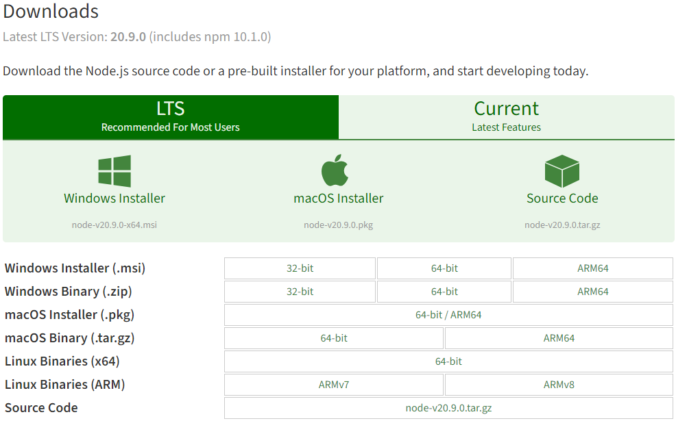

  ```shell
  node -v
  npm -v
  ```

* 初始化项目

  ```shell
  # 全局安装vue-cli
  $ npm install --global vue-cli
  # 创建一个基于webpack模板的新项目
  $ vue init webpack my-project
  # 安装依赖,走你
  $ cd my-project
  $ npm install
  $ npm run dev
  ```

  具体细节

  ```cmd
  (base) PS D:\learn\vue_learn_travel> npm install --global vue-cli
  npm WARN deprecated vue-cli@2.9.6: This package has been deprecated in favour of @vue/cli
  npm WARN deprecated consolidate@0.14.5: Please upgrade to consolidate v1.0.0+ as it has been modernized with several long-awaited fixes implemented. Maintenanpm WARN deprecated request@2.88.2: request has been deprecated, see https://github.com/request/request/issues/3142
  npm WARN deprecated coffee-script@1.12.7: CoffeeScript on NPM has moved to "coffeescript" (no hyphen)
  npm WARN deprecated har-validator@5.1.5: this library is no longer supported
  npm WARN deprecated uuid@3.4.0: Please upgrade  to version 7 or higher.  Older versions may use Math.random() in certain circumstances, which is known to be 
  problematic.  See https://v8.dev/blog/math-random for details.
  C:\Program Files\nodejs\vue -> C:\Program Files\nodejs\node_modules\vue-cli\bin\vue
  C:\Program Files\nodejs\vue-list -> C:\Program Files\nodejs\node_modules\vue-cli\bin\vue-list
  C:\Program Files\nodejs\vue-init -> C:\Program Files\nodejs\node_modules\vue-cli\bin\vue-init
  
  > metalsmith@2.6.1 postinstall C:\Program Files\nodejs\node_modules\vue-cli\node_modules\metalsmith
  > node metalsmith-migrated-plugins.js || exit 0
  
  npm WARN notsup Unsupported engine for metalsmith@2.6.1: wanted: {"node":">=14.14.0"} (current: {"node":"13.14.0","npm":"6.14.4"})
  npm WARN notsup Not compatible with your version of node/npm: metalsmith@2.6.1
  npm WARN notsup Unsupported engine for commander@10.0.1: wanted: {"node":">=14"} (current: {"node":"13.14.0","npm":"6.14.4"})
  npm WARN notsup Not compatible with your version of node/npm: commander@10.0.1
  npm WARN optional SKIPPING OPTIONAL DEPENDENCY: fsevents@~2.3.2 (node_modules\vue-cli\node_modules\chokidar\node_modules\fsevents):
  npm WARN notsup SKIPPING OPTIONAL DEPENDENCY: Unsupported platform for fsevents@2.3.3: wanted {"os":"darwin","arch":"any"} (current: {"os":"win32","arch":"x64"})
  
  + vue-cli@2.9.6
  added 233 packages from 211 contributors in 13.158s
  (base) PS D:\learn\vue_learn_travel> cd ..
  (base) PS D:\learn> vue init webpack vue_learn_travel
  
  ? Target directory exists. Continue? Yes
  ? Project name vue_learn_travel
  ? Project description A Vue.js project
  ? Author zruiquan
  ? Vue build standalone      
  ? Install vue-router? Yes
  ? Use ESLint to lint your code? Yes
  ? Pick an ESLint preset Standard
  ? Set up unit tests No
  ? Setup e2e tests with Nightwatch? No
  ? Should we run `npm install` for you after the project has been created? (recommended) npm
  
     vue-cli · Generated "vue_learn_travel".
  
  # Installing project dependencies ...
  # ========================
  
  npm WARN deprecated babel-eslint@8.2.6: babel-eslint is now @babel/eslint-parser. This package will no longer receive updates.
  npm WARN deprecated eslint-loader@1.9.0: This loader has been deprecated. Please use eslint-webpack-plugin
  npm WARN deprecated extract-text-webpack-plugin@3.0.2: Deprecated. Please use https://github.com/webpack-contrib/mini-css-extract-plugin
  npm WARN deprecated html-webpack-plugin@2.30.1: out of support
  npm WARN deprecated browserslist@2.11.3: Browserslist 2 could fail on reading Browserslist >3.0 config used in other tools.
  npm WARN deprecated uglify-es@3.3.9: support for ECMAScript is superseded by `uglify-js` as of v3.13.0
  npm WARN deprecated consolidate@0.14.5: Please upgrade to consolidate v1.0.0+ as it has been modernized with several long-awaited fixes implemented. Maintenance is supported by Forward Email at https://forwardemail.net ; follow/watch https://github.com/ladjs/consolidate for updates and release changelog
  npm WARN deprecated bfj-node4@5.3.1: Switch to the `bfj` package for fixes and new features!
  npm WARN deprecated core-js@2.6.12: core-js@<3.23.3 is no longer maintained and not recommended for usage due to the number of issues. Because of the V8 engine whims, feature detection in old core-js versions could cause a slowdown up to 100x even if nothing is polyfilled. Some versions have web compatibility issues. Please, upgrade your dependencies to the actual version of core-js.
  npm WARN deprecated chokidar@2.1.8: Chokidar 2 does not receive security updates since 2019. Upgrade to chokidar 3 with 15x fewer dependencies
  npm WARN deprecated acorn-dynamic-import@2.0.2: This is probably built in to whatever tool you're using. If you still need it... idk
  npm WARN deprecated flatten@1.0.3: flatten is deprecated in favor of utility frameworks such as lodash.
  npm WARN deprecated fsevents@1.2.13: The v1 package contains DANGEROUS / INSECURE binaries. Upgrade to safe fsevents v2
  npm WARN deprecated uuid@3.4.0: Please upgrade  to version 7 or higher.  Older versions may use Math.random() in certain circumstances, which is known to be 
  problematic.  See https://v8.dev/blog/math-random for details.
  npm WARN deprecated browserslist@1.7.7: Browserslist 2 could fail on reading Browserslist >3.0 config used in other tools.
  npm WARN deprecated svgo@0.7.2: This SVGO version is no longer supported. Upgrade to v2.x.x.
  npm WARN deprecated circular-json@0.3.3: CircularJSON is in maintenance only, flatted is its successor.
  npm WARN deprecated svgo@1.3.2: This SVGO version is no longer supported. Upgrade to v2.x.x.
  npm WARN deprecated source-map-resolve@0.5.3: See https://github.com/lydell/source-map-resolve#deprecated
  npm WARN deprecated stable@0.1.8: Modern JS already guarantees Array#sort() is a stable sort, so this library is deprecated. See the compatibility table on MDN: https://developer.mozilla.org/en-US/docs/Web/JavaScript/Reference/Global_Objects/Array/sort#browser_compatibility
  npm WARN deprecated resolve-url@0.2.1: https://github.com/lydell/resolve-url#deprecated
  npm WARN deprecated source-map-url@0.4.1: See https://github.com/lydell/source-map-url#deprecated
  npm WARN deprecated urix@0.1.0: Please see https://github.com/lydell/urix#deprecated
  
  > core-js@2.6.12 postinstall D:\learn\vue_learn_travel\node_modules\core-js
  > node -e "try{require('./postinstall')}catch(e){}"
  
  Thank you for using core-js ( https://github.com/zloirock/core-js ) for polyfilling JavaScript standard library!
  
  The project needs your help! Please consider supporting of core-js on Open Collective or Patreon: 
  > https://opencollective.com/core-js 
  > https://www.patreon.com/zloirock 
  
  Also, the author of core-js ( https://github.com/zloirock ) is looking for a good job -)
  
  > ejs@2.7.4 postinstall D:\learn\vue_learn_travel\node_modules\ejs
  > node ./postinstall.js
  
  Thank you for installing EJS: built with the Jake JavaScript build tool (https://jakejs.com/)
  
  
  > es5-ext@0.10.62 postinstall D:\learn\vue_learn_travel\node_modules\es5-ext
  >  node -e "try{require('./_postinstall')}catch(e){}" || exit 0
  
  > uglifyjs-webpack-plugin@0.4.6 postinstall D:\learn\vue_learn_travel\node_modules\webpack\node_modules\uglifyjs-webpack-plugin
  > node lib/post_install.js
  
  npm notice created a lockfile as package-lock.json. You should commit this file.
  npm WARN notsup Unsupported engine for postcss@8.4.31: wanted: {"node":"^10 || ^12 || >=14"} (current: {"node":"13.14.0","npm":"6.14.4"})
  npm WARN notsup Not compatible with your version of node/npm: postcss@8.4.31
  npm WARN optional SKIPPING OPTIONAL DEPENDENCY: fsevents@~2.3.2 (node_modules\chokidar\node_modules\fsevents):
  npm WARN notsup SKIPPING OPTIONAL DEPENDENCY: Unsupported platform for fsevents@2.3.3: wanted {"os":"darwin","arch":"any"} (current: {"os":"win32","arch":"x64"})
  npm WARN optional SKIPPING OPTIONAL DEPENDENCY: fsevents@^1.2.7 (node_modules\watchpack-chokidar2\node_modules\chokidar\node_modules\fsevents):
  npm WARN notsup SKIPPING OPTIONAL DEPENDENCY: Unsupported platform for fsevents@1.2.13: wanted {"os":"darwin","arch":"any"} (current: {"os":"win32","arch":"x64"})
  npm WARN optional SKIPPING OPTIONAL DEPENDENCY: fsevents@^1.2.7 (node_modules\webpack-dev-server\node_modules\chokidar\node_modules\fsevents):
  npm WARN notsup SKIPPING OPTIONAL DEPENDENCY: Unsupported platform for fsevents@1.2.13: wanted {"os":"darwin","arch":"any"} (current: {"os":"win32","arch":"x64"})
  npm WARN update-browserslist-db@1.0.13 requires a peer of browserslist@>= 4.21.0 but none is installed. You must install peer dependencies yourself.
  
  added 1441 packages from 717 contributors in 85.516s
  
  95 packages are looking for funding
    run `npm fund` for details
  
  Running eslint --fix to comply with chosen preset rules...
  # ========================
  
  > vue_learn_travel@1.0.0 lint D:\learn\vue_learn_travel
  > eslint --ext .js,.vue src "--fix"
  
  # Project initialization finished!
  # ========================
  
  To get started:
  
    cd vue_learn_travel
    npm run dev
  
  Documentation can be found at https://vuejs-templates.github.io/webpack
  (base) PS D:\learn> cd .\vue_learn_travel\
  (base) PS D:\learn\vue_learn_travel> npm install
  npm WARN update-browserslist-db@1.0.13 requires a peer of browserslist@>= 4.21.0 but none is installed. You must install peer dependencies yourself.
  npm WARN optional SKIPPING OPTIONAL DEPENDENCY: fsevents@2.3.3 (node_modules\fsevents):
  npm WARN notsup SKIPPING OPTIONAL DEPENDENCY: Unsupported platform for fsevents@2.3.3: wanted {"os":"darwin","arch":"any"} (current: {"os":"win32","arch":"x64"})
  npm WARN optional SKIPPING OPTIONAL DEPENDENCY: fsevents@1.2.13 (node_modules\watchpack-chokidar2\node_modules\fsevents):
  npm WARN notsup SKIPPING OPTIONAL DEPENDENCY: Unsupported platform for fsevents@1.2.13: wanted {"os":"darwin","arch":"any"} (current: {"os":"win32","arch":"x64"})
  npm WARN optional SKIPPING OPTIONAL DEPENDENCY: fsevents@1.2.13 (node_modules\webpack-dev-server\node_modules\fsevents):
  npm WARN notsup SKIPPING OPTIONAL DEPENDENCY: Unsupported platform for fsevents@1.2.13: wanted {"os":"darwin","arch":"any"} (current: {"os":"win32","arch":"x64"})
  
  up to date in 4.936s
  
  95 packages are looking for funding
    run `npm fund` for details
    (base) PS D:\learn\vue_learn_travel> npm run dev
  
  > vue_learn_travel@1.0.0 dev D:\learn\vue_learn_travel
  > webpack-dev-server --inline --progress --config build/webpack.dev.conf.js
  
   13% building modules 25/28 modules 3 active ...D:\learn\vue_learn_travel\src\App.vue{ parser: "babylon" } is deprecated; we now treat it as { parser: "babel" }.
   95% emitting
  
   DONE  Compiled successfully in 3373ms                                                                                                            下午3:39:27
  
   I  Your application is running here: http://localhost:8080
  ```

## 项目目录介绍

结构简单说明：

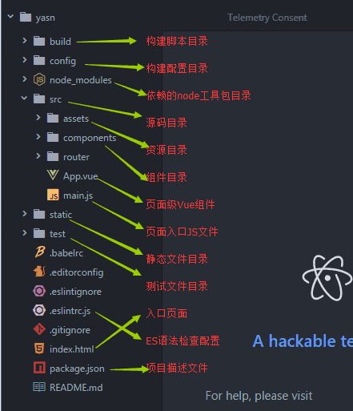

总体架构：


结构细分：

1、build—[webpack配置]

build文件主要是webpack的配置，主要启动文件是dev-server.js，当我们输入npm run dev首先启动的就是dev-server.js，它会去检查node及npm版本，加载配置文件，启动服务。

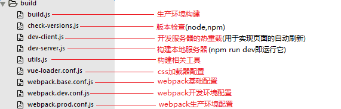

2、config—[vue项目配置]

config文件主要是项目相关配置，我们常用的就是当端口冲突时配置监听端口，打包输出路径及命名等

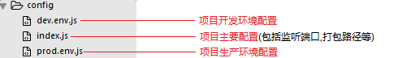

3、node_modules—[依赖包]

4、src——[项目核心文件]

## 脚手架代码详解

我们看下创建后的项目目录里的主要文件：

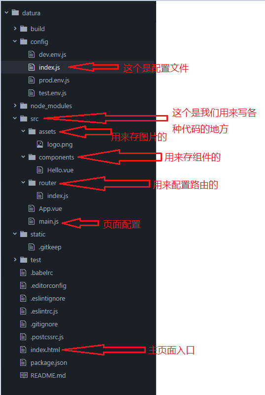

1. **index.html——[主页]**

   这个没什么好说的，就是一个简单的html页面，这里id='app'，是为后面的设置vue作用域有关的。index.html如其他html一样，但一般只定义一个空的根节点，在main.js里面定义的实例将挂载在根节点下，内容都通过vue组件来填充

2. **文件：Hello.vue**

   说明：在*.vue文件，template标签里写html代码，且template直接子级只能有一个标签。style标签里写样式，script里面写js代码。

3. **文件：App.vue——[根组件]**

   ```html
   <template>
     <div id="app">
       
       <router-view/> //这里是用来展示路由页面内容的，如果想用跳转就用<router-link to='xxx'></router-link>
     </div>
   </template>
    
   <script>
   export default {
     name: 'App'
   }
   </script>
    
   <style>
   #app {
     font-family: 'Avenir', Helvetica, Arial, sans-serif;
     -webkit-font-smoothing: antialiased;
     -moz-osx-font-smoothing: grayscale;
     text-align: center;
     color: #2c3e50;
     margin-top: 60px;
   }
   </style>
   ```

   一个vue页面通常由三部分组成:模板(template)、js(script)、样式(style):

   **【template】**

   其中模板只能包含一个父节点，也就是说顶层的div只能有一个（例如下图，父节点为#app的div，其没有兄弟节点）

   `<router-view></router-view>`是子路由视图，后面的路由页面都显示在此处。打一个比喻吧，`<router-view>`类似于一个插槽，跳转某个路由时，该路由下的页面就插在这个插槽中渲染显示

   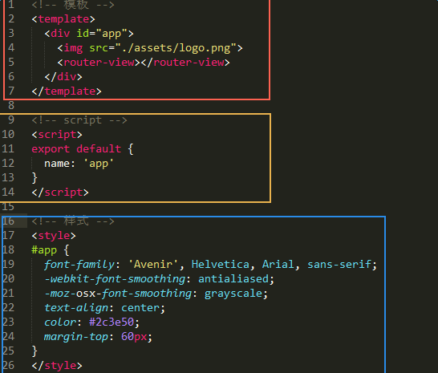

   **【script】**

   vue通常用es6来写，用export default导出，其下面可以包含数据data，生命周期(mounted等)，方法(methods)等，具体语法请看vue.js文档，在后面我也会通过例子来说明。

   **【style】**

   样式通过style标签`<style></style>`包裹，默认是影响全局的，**如需定义作用域只在该组件下起作用，需在标签上加`scoped`，`<style scoped></style>`

   如要引入外部css文件，首先需给项目安装css-loader依赖包，打开cmd，进入项目目录，输入npm install css-loader，回车。安装完成后，就可以在style标签下import所需的css文件，例如：

   ```css
   <style>
       import './assets/css/public.css'
   </style>
   ```

   这样，我们就可以把style下的样式封装起来，写到css文件夹，再引入到页面使用，整个vue页面也看上去更简洁。

4. **文件：main.js——[入口文件]**

   这个js文件是主页面配置的主入口。主要是利用ES6的模块化引入模板

   main.js主要是引入vue框架，根组件及路由设置，并且定义vue实例，下面代码中的components:{App}就是引入的根组件App.vue

   后期还可以引入插件，当然首先得安装插件。

   ```javascript
   // The Vue build version to load with the `import` command
   // (runtime-only or standalone) has been set in webpack.base.conf with an alias.
   import Vue from 'vue' // 引入vue文件, 后面可以不用加后缀，webpack会优先选择.vue后缀文件
   import App from './App' // 引入同目录下的App.vue模块
   import router from './router' // 引入vue的路由, 自动引入router目录下的index.js文件
    
   Vue.config.productionTip = false
    
   /* eslint-disable no-new */
   new Vue({
     el: '#app', // 定义作用范围就是index.html里的id为app的范围内
     router, // 引入路由，es6语法的关系可以省略一部分的内容，其实可以写成 router: router
     components: { App }, // 注册引入的组件App.vue, es6语法的关系可以省略一部分的内容，其实可以写成 App: App
     template: '<App/>' // 给Vue根实例初始一个App组件作为template 相当于默认组件
   })
   ```

5. **router——[路由配置]**

   router文件夹下，有一个index.js，即为路由配置文件

   ```javascript
   import Vue from 'vue'  // 引用vue文件
   import Router from 'vue-router'  // 引用vue路由模块，并赋值给变量Router
   import HelloWorld from '@/components/HelloWorld'  // 英文HelloWorld.vue模版，并赋值给变量HelloWorld,这里是“@”相当于“../”, 也指src目录
    
   Vue.use(Router)  // 使用路由
    
   export default new Router({
     routes: [  // 进行路由配置，规定“/”引入到HelloWorld组件
       {
         path: '/',
         name: 'HelloWorld',  // 这个name暂时不知道用啥用，根据官方文档说的是方便排错的
         component: HelloWorld  // 注册HelloWorld组件
       }
     ]
   })
   ```

   这里定义了路径为'/'的路由，该路由对应的页面是HelloWorld组件，所以当我们在浏览器url访问http://localhost:8080/#/时就渲染的Hello组件。类似的，我们可以设置多个路由，‘/index’,'/list'之类的，当然首先得引入该组件，再为该组件设置路由。

   说明：如果需要增加组件那就在components文件下定义xx.vue文件并编写代码即可；如果需要配置路由就要在index.js进行路由“路径”配置；还需要点击跳转就要用到<router-link></router-link>标签了。

## 多页面应用 VS 单页面应用

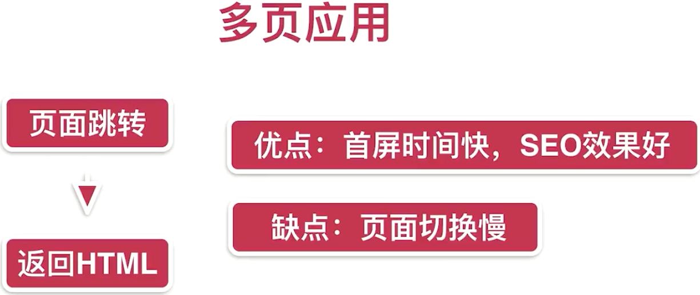

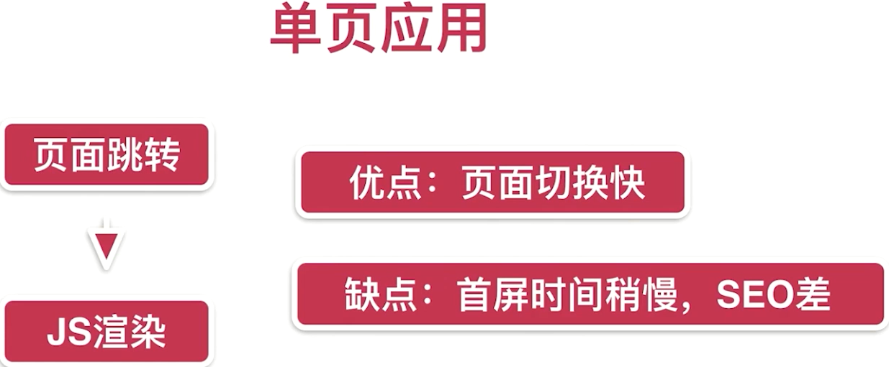

SEO：搜索引擎优。单页面应用搜索引擎优化比较差，搜索引擎主要认识HTML的内容，而不识别JS之中的内容，而单页面应用的内容基本上都是由JS渲染生成的，所以搜索引擎不识别这块的内容，就不会给网页一个好的排名，导致单页面应用在百度或者谷歌上面的排名效果比较差，但是Vue提供了一切其他的技术，比如服务器渲染等技术，这些技术可以完美的解决掉单页面应用中存在的问题。

## 项目初始化工作

1. 删除components目录，创建pages目录，存放页面文件

2. 保证移动端设备，用户通过手指放大缩小这样的操作无效的，它的页面比例始终是1比1，调整`viewport`标签添加 `minimun-scale=1.0,maximum-scale=1.0,er-scalable=no`

   ```html
   <!DOCTYPE html>
   <html>
     <head>
       <meta charset="utf-8">
       <!-- 保证移动端设备，用户通过手指放大缩小这样的操作无效的，它的页面比例始终是1比1 -->
       <meta name="viewport" content="width=device-width,initial-scale=1.0,minimun-scale=1.0,maximum-scale=1.0,er-scalable=no">
       <title>vue_learn_travel</title>
     </head>
     <body>
       <div id="app"></div>
       <!-- built files will be auto injected -->
     </body>
   </html>
   ```

3. 用来重置页面样式表，对基础样式的修饰，保证不同手机浏览器的默认展示样式统一，main.js添加如下

   ```javascript
   // 用来重置页面样式表，对基础样式的修饰，保证不同手机浏览器的默认展示样式统一
   import './assets/styles/reset.css'
   ```

4. 解决1像素边框的问题，多倍屏物理像素实际对应的是2或者3等多像素的问题，main.js添加如下

   ```javascript
   // 解决1像素边框的问题，多倍屏物理像素实际对应的是2或者3等多像素的问题
   import './assets/styles/border.css'
   ```

5. 解决移动端点击事件延迟300毫秒的问题，安装fastclick

   ```cmd
   (base) PS D:\learn\vue_learn_travel> npm install fastclick  --save
   npm WARN update-browserslist-db@1.0.13 requires a peer of browserslist@>= 4.21.0 but none is installed. You must install peer dependencies yourself.
   npm WARN optional SKIPPING OPTIONAL DEPENDENCY: fsevents@2.3.3 (node_modules\fsevents):
   npm WARN notsup SKIPPING OPTIONAL DEPENDENCY: Unsupported platform for fsevents@2.3.3: wanted {"os":"darwin","arch":"any"} (current: {"os":"win32","arch":"x64"})       
   npm WARN optional SKIPPING OPTIONAL DEPENDENCY: fsevents@1.2.13 (node_modules\watchpack-chokidar2\node_modules\fsevents):
   npm WARN notsup SKIPPING OPTIONAL DEPENDENCY: Unsupported platform for fsevents@1.2.13: wanted {"os":"darwin","arch":"any"} (current: {"os":"win32","arch":"x64"})      
   npm WARN optional SKIPPING OPTIONAL DEPENDENCY: fsevents@1.2.13 (node_modules\webpack-dev-server\node_modules\fsevents):
   npm WARN notsup SKIPPING OPTIONAL DEPENDENCY: Unsupported platform for fsevents@1.2.13: wanted {"os":"darwin","arch":"any"} (current: {"os":"win32","arch":"x64"})      
   
   + fastclick@1.0.6
   added 1 package from 2 contributors in 21.734s
   
   95 packages are looking for funding
     run `npm fund` for details   
   ```

   main.js添加如下

   ```javascript
   // 解决移动端点击事件延迟300ms问题
   import fastClick from 'fastclick'
   // 使用fastClick绑定到document.body
   fastClick.attach(document.body)
   ```

6. 注册登录iconfont，并创建iconfont项目

   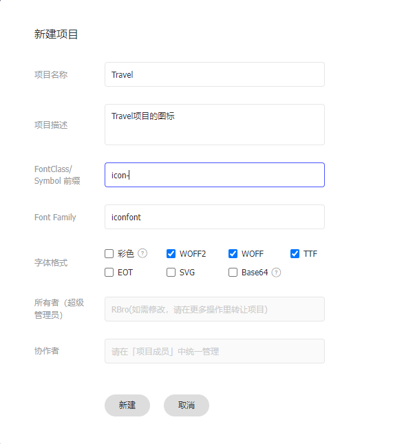

## 首页Header开发

1. 安装stylus css的开发辅助工具，帮助我们开发网站样式，和在css使用一些变量等操作，方便快速编写css代码，这里安装注意版本问题，下面是目前可以使用的版本对应关系

   ```cmd
   (base) PS D:\learn\vue_learn_travel> npm install stylus@0.54.8 --save
   npm WARN update-browserslist-db@1.0.13 requires a peer of browserslist@>= 4.21.0 but none is installed. You must install peer dependencies yourself.
   npm WARN optional SKIPPING OPTIONAL DEPENDENCY: fsevents@2.3.3 (node_modules\fsevents):
   npm WARN notsup SKIPPING OPTIONAL DEPENDENCY: Unsupported platform for fsevents@2.3.3: wanted {"os":"darwin","arch":"any"} (current: {"os":"win32","arch":"x64"})       
   npm WARN optional SKIPPING OPTIONAL DEPENDENCY: fsevents@1.2.13 (node_modules\watchpack-chokidar2\node_modules\fsevents):
   npm WARN notsup SKIPPING OPTIONAL DEPENDENCY: Unsupported platform for fsevents@1.2.13: wanted {"os":"darwin","arch":"any"} (current: {"os":"win32","arch":"x64"})      
   npm WARN notsup SKIPPING OPTIONAL DEPENDENCY: Unsupported platform for fsevents@1.2.13: wanted {"os":"darwin","arch":"any"} (current: {"os":"win32","arch":"x64"})      
   
   + stylus@0.54.8
   added 5 packages from 41 contributors in 7.891s
   
   96 packages are looking for funding
     run `npm fund` for details
   
   (base) PS D:\learn\vue_learn_travel> npm install stylus-loader@3.0.2 --save
   npm WARN notsup Unsupported engine for stylus-loader@3.0.2: wanted: {"node":">= 14.15.0"} (current: {"node":"13.14.0","npm":"6.14.4"})
   npm WARN notsup Not compatible with your version of node/npm: stylus-loader@7.1.3
   npm WARN update-browserslist-db@1.0.13 requires a peer of browserslist@>= 4.21.0 but none is installed. You must install peer dependencies yourself.
   npm WARN stylus-loader@7.1.3 requires a peer of webpack@^5.0.0 but none is installed. You must install peer dependencies yourself.
   npm WARN optional SKIPPING OPTIONAL DEPENDENCY: fsevents@2.3.3 (node_modules\fsevents):
   npm WARN notsup SKIPPING OPTIONAL DEPENDENCY: Unsupported platform for fsevents@2.3.3: wanted {"os":"darwin","arch":"any"} (current: {"os":"win32","arch":"x64"})       
   npm WARN optional SKIPPING OPTIONAL DEPENDENCY: fsevents@1.2.13 (node_modules\watchpack-chokidar2\node_modules\fsevents):
   npm WARN notsup SKIPPING OPTIONAL DEPENDENCY: Unsupported platform for fsevents@1.2.13: wanted {"os":"darwin","arch":"any"} (current: {"os":"win32","arch":"x64"})      
   npm WARN optional SKIPPING OPTIONAL DEPENDENCY: fsevents@1.2.13 (node_modules\webpack-dev-server\node_modules\fsevents):
   npm WARN notsup SKIPPING OPTIONAL DEPENDENCY: Unsupported platform for fsevents@1.2.13: wanted {"os":"darwin","arch":"any"} (current: {"os":"win32","arch":"x64"})      
   
   + stylus-loader@3.0.2
   added 11 packages from 19 contributors in 7.596s
   
   99 packages are looking for funding
     run `npm fund` for details
   ```

   router/index.js
   
   ```typescript
   import Vue from 'vue'
   import Router from 'vue-router'
   import Home from '@/pages/home/Home
   Vue.use(Router)
   
   export default new Router({
     routes: [
       {
         path: '/',
         name: 'Home',
         component: Home
       }
     ]
   })
   ```
   
   
   
   目录结构如下
   
   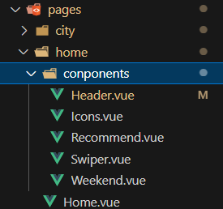
   
   pages/home/Home.Vue
   
   ```html
   <template>
     <div>
       <home-header></home-header>
     </div>
   </template>
   
   <script>
   import HomeHeader from './components/Header.vue'
   
   export default {
     name: 'Home',
     components: {
       HomeHeader,
     }
   }
   </script>
   
   <style>
   
   </style>
   ```
   
   pages/home/components/Header.vue
   
   ```html
   <template>
       <div class="header">
         <div class="header-left">返回</div>
         <div class="header-input">输入城市/景点/游玩主题</div>
         <div class="header-right">城市</div>
       </div>
     </template>
   
   <script>
   export default {
     name: 'HomeHeader'
   }
   </script>
   
   <!-- lang="stylus": 使用stylus语法编写css, scoped: 样式做限制，只对当前组件有影响，不会影响其他组件 -->
   <!-- 1rem = html font-size = 50px -->
   <style lang="stylus" scoped>
   .header
     display: flex
     line-height: .86rem
     background: #00bcb4
     color: #fff
     .header-left
       width: .64rem
       float: left
     .header-input
       flex: 1
       height: .64rem
       line-height: .64rem
       margin-left: .2rem
       margin-top: .12rem
       background: #fff
       border-radius: .1rem
       color: #ccc
     .header-right
       width: 1.24rem
       float: right
       text-align: center
   </style>
   ```
   

## iconfont的使用

1. 选择图标加入购物车

   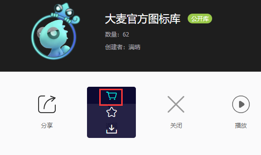

2. 点击购物车，加入到已经创建的项目

   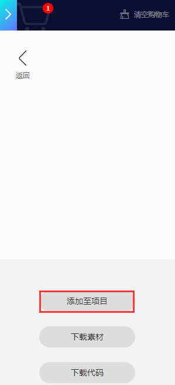

3. 我的项目中，点击下载到本地

   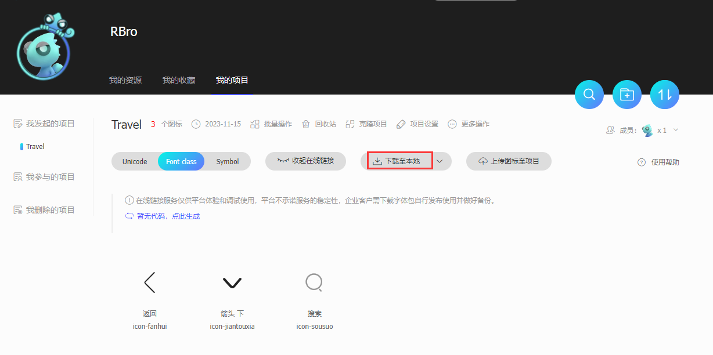

4. 整理下载的文件，移动到项目中

   1） 在 `\src\assets\styles` 项目路径下创建iconfont文件夹

   2）解压下载后的压缩包，除了将`iconfont.css` 文件之外，其他所有文件放入iconfont文件夹

   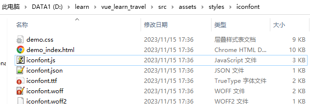

   3）将 `iconfont.css` 放入到 `\src\assets\` 项目路径下

   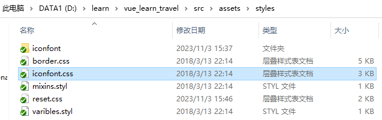

   4）修改 `iconfont.css` 文件中的路径，改为本地路径，并删除一些无用逻辑

   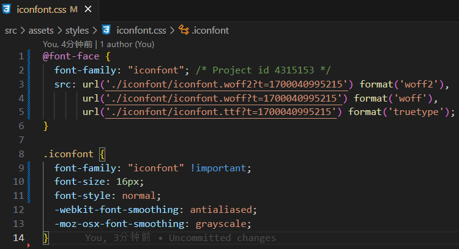

   5）使用图标

   ```html
   <div class="header-left">
   	<span class="iconfont">&#xe624;</span>
   </div>
   ```

   其中 `class="iconfont"` 为固定写法，`&#xe624;` 是图标的Unicode码,如下

   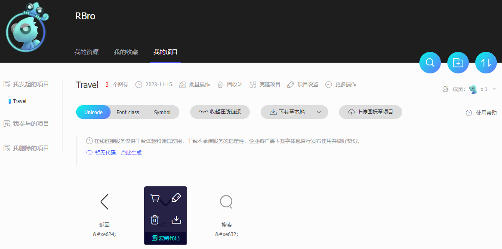

## 样式引入与简化引入路径

在`src/assets/styles/`创建`varibles.styl`文件

```properties
$bgColor = #00bcd4
$darkTextColor = #333
$headerHeight = .86rem
```

build/webpack.base.conf.js

```javascript
 resolve: {
    extensions: ['.js', '.vue', '.json'],
    alias: {
      'vue$': 'vue/dist/vue.esm.js',
      '@': resolve('src'),
       // src/assets/styles 路径设置别名styles
      'styles': resolve('src/assets/styles'),
    }
  },
```

pages/home/components/Header.vue

```html
<template>
    <div class="header">
      <div class="header-left">
        <div class="iconfont back-icon">&#xe624;</div>
      </div>
      <div class="header-input">
        <span class="iconfont">&#xe632;</span>
        输入城市/景点/游玩主题
      </div>
      <div class="header-right">
        城市
        <span class="iconfont arrow-icon">&#xe62d;</span>
      </div>
    </div>
  </template>

<script>
export default {
  name: 'HomeHeader'
}
</script>

<!-- lang="stylus": 使用stylus语法编写css, scoped: 样式做限制，只对当前组件有影响，不会影响其他组件 -->
<!-- 1rem = html font-size = 50px -->
<!-- $bgColor 引用varibles.styl文件中的变量 -->
<!--
     @import '~@/assets/styles/varibles.styl'
     @import: 样式中引用样式，使用样式变量
     注意：导入的时候区分于其他形式的导入，可以用相对路径的方式，也可以用@符号
     如果用@符号，则代表从src目录开始，但是这里需要在@符号前面加上~
     可以自定义路径别名，在webpack.base.conf.js文件中进行配置，配置完成之后可以进行最终简化路径 @import '~styles/varibles.styl'
-->
<style lang="stylus" scoped>
@import '~styles/varibles.styl'
.header
  display: flex
  line-height: .86rem
  background: $bgColor
  color: #fff
  .header-left
    width: .64rem
    float: left
    .back-icon
      text-align: center
      font-size: .4rem
  .header-input
    flex: 1
    height: .64rem
    line-height: .64rem
    margin-left: .2rem
    margin-top: .12rem
    padding-left: .2rem
    background: #fff
    border-radius: .1rem
    color: #ccc
  .header-right
    width: 1.24rem
    float: right
    text-align: center
    .arrow-icon
      margin-left: -.04rem
      font-size: .24rem
</style>
```

src/main.js

```javascript
// The Vue build version to load with the `import` command
// (runtime-only or standalone) has been set in webpack.base.conf with an alias.
import Vue from 'vue'
import App from './App'
import router from './router'

// 解决移动端点击事件延迟300ms问题
import fastClick from 'fastclick'
// 用来重置页面样式表，对基础样式的修饰，保证不同手机浏览器的默认展示样式统一
import 'styles/reset.css'
// 解决1像素边框的问题，多倍屏物理像素实际对应的是2或者3等多像素的问题
import 'styles/border.css'
// 使用iconfont
import 'styles/iconfont.css'
// 使用fastClick绑定到document.body
fastClick.attach(document.body)
Vue.config.productionTip = false

/* eslint-disable no-new */
new Vue({
  el: '#app',
  router,
  components: { App },
  template: '<App/>'
})
```

## 首页轮播图组件构建

使用分支 `index-swiper`，在此分支上开发，然后合并到主线

使用轮播图插件 `vue-awesome-swiper`

```shell
PS D:\learn\vue_learn_travel> npm install vue-awesome-swiper@2.6.7 --save
npm WARN update-browserslist-db@1.0.13 requires a peer of browserslist@>= 4.21.0 but none is installed. You must install peer dependencies yourself.
npm WARN optional SKIPPING OPTIONAL DEPENDENCY: fsevents@2.3.3 (node_modules\fsevents):
npm WARN notsup SKIPPING OPTIONAL DEPENDENCY: Unsupported platform for fsevents@2.3.3: wanted {"os":"darwin","arch":"any"} (current: {"os":"win32","arch":"x64"})       
npm WARN optional SKIPPING OPTIONAL DEPENDENCY: fsevents@1.2.13 (node_modules\watchpack-chokidar2\node_modules\fsevents):
npm WARN notsup SKIPPING OPTIONAL DEPENDENCY: Unsupported platform for fsevents@1.2.13: wanted {"os":"darwin","arch":"any"} (current: {"os":"win32","arch":"x64"})      
npm WARN optional SKIPPING OPTIONAL DEPENDENCY: fsevents@1.2.13 (node_modules\webpack-dev-server\node_modules\fsevents):
npm WARN notsup SKIPPING OPTIONAL DEPENDENCY: Unsupported platform for fsevents@1.2.13: wanted {"os":"darwin","arch":"any"} (current: {"os":"win32","arch":"x64"})      

+ vue-awesome-swiper@2.6.7
added 2 packages from 2 contributors in 20.206s

95 packages are looking for funding
  run `npm fund` for details
```

src/main.js

```javascript
// The Vue build version to load with the `import` command
// (runtime-only or standalone) has been set in webpack.base.conf with an alias.
import Vue from 'vue'
import App from './App'
import router from './router'

// 解决移动端点击事件延迟300ms问题
import fastClick from 'fastclick'
// 用来重置页面样式表，对基础样式的修饰，保证不同手机浏览器的默认展示样式统一
import 'styles/reset.css'
// 解决1像素边框的问题，多倍屏物理像素实际对应的是2或者3等多像素的问题
import 'styles/border.css'
// 使用iconfont
import 'styles/iconfont.css'
// 引入vue-awesome-swiper
import VueAwesomeSwiper from 'vue-awesome-swiper'
import 'swiper/dist/css/swiper.css'

// 使用fastClick绑定到document.body
fastClick.attach(document.body)
Vue.config.productionTip = false

Vue.use(VueAwesomeSwiper)
/* eslint-disable no-new */
new Vue({
  el: '#app',
  router,
  components: { App },
  template: '<App/>'
})
```

pages/home/components/Swiper.vue

```html
<template>
  <div class="wrapper">
    <swiper :options="swiperOption">
      <swiper-slide v-for="item of swiperList" :key="item.id">
        
      </swiper-slide>
      <div class="swiper-pagination"  slot="pagination"></div>
    </swiper>
  </div>
</template>

<script>
export default {
  name: 'HomeSwiper',
  data () {
    return {
      swiperOption: {
        pagination: '.swiper-pagination',
        loop: true
      },
      swiperList: [{
        id: '0001',
        imgUrl: 'https://ad-dapp-osscp.qunarzz.com/ad_dapp_oss_oper/9f64aa5050c770f88033e1b6ef21e258.jpg'
      }, {
        id: '0002',
        imgUrl: 'https://ad-dapp-osscp.qunarzz.com/ad_dapp_oss_oper/a8fe422f63cd04c880d423cb5a9b8145.jpg'
      }]
    }
  }
}
</script>

<!-- >>>: 样式穿透,让引用的子组件的样式也改变，突破在本页面内不能让子页面样式改变的局限 -->
<style lang="stylus" scoped>
.wrapper >>> .swiper-pagination-bullet-active
  background: #fff !important
.wrapper
  overflow: hidden
  width: 100%
  height: 0
  padding-bottom: 31.25%
  background: #eee
  .swiper-image
    width: 100%
</style>
```

完成之后合并到主线

合并流程：

```
git checkout main
git merge orgin/index-swiper
git push
```

## 首页图标组件开发

pages/home/components/Icons.vue

```html
<template>
  <div class="icons">
    <swiper >
      <swiper-slide v-for="(page, index) of pages" :key="index">
        <div
          class="icon"
          v-for="item of page"
          :key="item.id"
        >
          <div class="icon-img">
            
          </div>
          <div class="icon-desc" >{{ item.desc }}</div>
        </div>
      </swiper-slide>
  </swiper>
  </div>
</template>

<script>
export default {
  name: 'HomeIcons',
  data () {
    return {
      iconList: [{
        id: '0001',
        imgUrl: 'https://s.qunarzz.com/homenode/images/touchheader/piao.png',
        desc: '景点门票景点门票景点门票景点门票'
      }, {
        id: '0002',
        imgUrl: 'https://s.qunarzz.com/homenode/images/touchheader/piao.png',
        desc: '泡温泉'
      }, {
        id: '0003',
        imgUrl: 'https://s.qunarzz.com/homenode/images/touchheader/piao.png',
        desc: '名胜古迹'
      }, {
        id: '0004',
        imgUrl: 'https://s.qunarzz.com/homenode/images/touchheader/piao.png',
        desc: '景点门票'
      }, {
        id: '0005',
        imgUrl: 'https://s.qunarzz.com/homenode/images/touchheader/piao.png',
        desc: '景点门票'
      }, {
        id: '0006',
        imgUrl: 'https://s.qunarzz.com/homenode/images/touchheader/piao.png',
        desc: '景点门票'
      }, {
        id: '0007',
        imgUrl: 'https://s.qunarzz.com/homenode/images/touchheader/piao.png',
        desc: '景点门票'
      }, {
        id: '0008',
        imgUrl: 'https://s.qunarzz.com/homenode/images/touchheader/piao.png',
        desc: '景点门票'
      }, {
        id: '0009',
        imgUrl: 'https://s.qunarzz.com/homenode/images/touchheader/piao.png',
        desc: '一日游'
      }]
    }
  },
  computed: {
    pages () {
      const pages = []
      this.iconList.forEach((item, index) => {
        const page = Math.floor(index / 8)
        if (!pages[page]) {
          pages[page] = []
        }
        pages[page].push(item)
      })
      return pages
    }
  }
}
</script>

<style lang="stylus" scoped>
@import '~styles/varibles.styl'
@import '~styles/mixins.styl'
.icons >>> .swiper-container
  height: 0
  padding-bottom: 50%
.icon
  position relative
  overflow: hidden
  float: left
  width: 25%
  height: 0
  padding-bottom: 25%
  .icon-img
    position: absolute
    top: 0
    left: 0
    right 0
    bottom: .44rem
    box-sizing: border-box
    padding: .1rem
    .icon-img-content
      display: block
      margin: 0 auto
      height: 100%
  .icon-desc
    position: absolute
    left: 0
    right: 0
    bottom: 0
    height: .44rem
    line-height: .44rem
    color: #darkTextColor
    text-align: center
    ellipsis()
</style>
```

创建`mixins.styl`

```css
ellipsis()
  overflow: hidden
  white-space: nowrap
  text-overflow: ellipsis
```

## 热销推荐组件开发

pages/home/components/Recommend.vue

```html
<template>
  <div>
    <div class="title">热销推荐</div>
    <ul>
      <li class="item border-bottom" v-for="item of recommendList" :key="item.key">
        
        <div class="item-info">
          <p class="item-title">{{ item.title }}</p>
          <p class="item-desc">{{ item.desc }}</p>
          <button class="item-button">查看详情</button>
        </div>
      </li>
    </ul>
  </div>
</template>

<script>
export default {
  name: 'HomeRecommend',
  data () {
    return {
      recommendList: [{
        id: '0001',
        imgUrl: 'https://img1.qunarzz.com/sight/p0/2310/cf/cff7dc0465c024bda3.water.jpg_256x160_993d7f27.jpg',
        title: '深圳湾公园',
        desc: '浪漫深圳首站，浪漫的海洋主题乐园'
      }, {
        id: '0002',
        imgUrl: 'https://img1.qunarzz.com/sight/p0/2310/cf/cff7dc0465c024bda3.water.jpg_256x160_993d7f27.jpg',
        title: '深圳湾公园',
        desc: '浪漫深圳首站，浪漫的海洋主题乐园'
      }, {
        id: '0003',
        imgUrl: 'https://img1.qunarzz.com/sight/p0/2310/cf/cff7dc0465c024bda3.water.jpg_256x160_993d7f27.jpg',
        title: '深圳湾公园',
        desc: '浪漫深圳首站，浪漫的海洋主题乐园'
      }]
    }
  }
}
</script>

<style lang="stylus" scoped>
@import '~styles/varibles.styl'
@import '~styles/mixins.styl'

.title
  margin-top: .2rem
  line-height: .8rem
  background: #eee
  text-indent: .2rem
.item
  overflow: hidden
  display: flex
  height: 1.9rem
  .item-img
    width: 1.7rem
    height: 1.7rem
    padding: .1rem
  .item-info
    flex: 1
    padding: .1rem
    min-width: 0
    .item-title
      line-height: 0.54rem
      font-size: .32rem
      ellipsis()
    .item-desc
      line-height: 0.4rem
      color: #ccc
      ellipsis()
    .item-button
      line-height: .44rem
      margin-top: .16rem
      background: #ff9300
      padding: 0 .2rem
      border-radius: .06rem
      color: #fff
</style>
```

## 周末游组件开发

pages/home/components/Weekend.vue

```html
<template>
  <div>
    <div class="title">周末去哪儿</div>
    <ul>
      <li
        class="item border-bottom"
        v-for="item of recommendList"
        :key="item.key">
        <div class="item-img-wrapper">
          
        </div>
        <div class="item-info">
          <p class="item-title">{{ item.title }}</p>
          <p class="item-desc">{{ item.desc }}</p>
        </div>
      </li>
    </ul>
  </div>
</template>

<script>
export default {
  name: 'HomeWeekend',
  data () {
    return {
      recommendList: [{
        id: '0001',
        imgUrl: 'https://img1.qunarzz.com/sight/p0/1604/b8/b8e41237b32404d590.img.jpg_350x240_17caf4d8.jpg',
        title: '深圳湾公园',
        desc: '浪漫深圳首站，浪漫的海洋主题乐园'
      }, {
        id: '0002',
        imgUrl: 'https://img1.qunarzz.com/sight/p0/1604/b8/b8e41237b32404d590.img.jpg_350x240_17caf4d8.jpg',
        title: '深圳湾公园',
        desc: '浪漫深圳首站，浪漫的海洋主题乐园'
      }, {
        id: '0003',
        imgUrl: 'https://img1.qunarzz.com/sight/p0/1604/b8/b8e41237b32404d590.img.jpg_350x240_17caf4d8.jpg',
        title: '深圳湾公园',
        desc: '浪漫深圳首站，浪漫的海洋主题乐园'
      }]
    }
  }
}
</script>

<style lang="stylus" scoped>
@import '~styles/varibles.styl'
@import '~styles/mixins.styl'

.title
  margin-top: .2rem
  line-height: .8rem
  background: #eee
  text-indent: .2rem
.item-img-wrapper
  height: 0
  overflow hidden
  padding-bottom: 33.9%
  .item-img
    width: 100%
.item-info
  padding: .1rem
  .item-title
    line-height: 0.54rem
    font-size: .32rem
    ellipsis()
  .item-desc
    line-height: 0.4rem
    color: #ccc
    ellipsis()
</style>
```

## 使用axios进行ajax请求

1. 安装axios组件

```shell

PS D:\learn\vue_learn_travel> npm install axios@0.17.1 --save
npm WARN update-browserslist-db@1.0.13 requires a peer of browserslist@>= 4.21.0 but none is installed. You must install peer dependencies yourself.
npm WARN optional SKIPPING OPTIONAL DEPENDENCY: fsevents@2.3.3 (node_modules\fsevents):
npm WARN notsup SKIPPING OPTIONAL DEPENDENCY: Unsupported platform for fsevents@2.3.3: wanted {"os":"darwin","arch":"any"} (current: {"os":"win32","arch":"x64"})       
npm WARN optional SKIPPING OPTIONAL DEPENDENCY: fsevents@1.2.13 (node_modules\webpack-dev-server\node_modules\fsevents):
npm WARN notsup SKIPPING OPTIONAL DEPENDENCY: Unsupported platform for fsevents@1.2.13: wanted {"os":"darwin","arch":"any"} (current: {"os":"win32","arch":"x64"})      
npm WARN optional SKIPPING OPTIONAL DEPENDENCY: fsevents@1.2.13 (node_modules\watchpack-chokidar2\node_modules\fsevents):

+ axios@0.17.1
added 6 packages from 18 contributors in 22.229s

95 packages are looking for funding
```

2. 在静态目录`static/mock`创建模拟数据文件`index.json`,里面填充数据

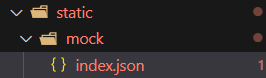

```json
{
    "ret": true,
    "data": {
      "city": "北京",
      "swiperList": [{
          "id": "0001",
          "imgUrl": "http://img1.qunarzz.com/piao/fusion/1801/1a/94428c6dea109402.jpg_640x200_2cf590d8.jpg"
        },{
          "id": "0002",
          "imgUrl": "http://img1.qunarzz.com/piao/fusion/1802/42/7c92b9a381e46402.jpg_640x200_1cdce2a4.jpg"
        },{
          "id": "0003",
          "imgUrl": "http://img1.qunarzz.com/piao/fusion/1802/51/e78f936a5b404102.jpg_640x200_c14f0b3a.jpg"
        },{
          "id": "0004",
          "imgUrl": "http://img1.qunarzz.com/piao/fusion/1712/91/a275569091681d02.jpg_640x200_0519ccb9.jpg"
        }],
      "iconList": [{
          "id": "0001",
          "imgUrl": "http://img1.qunarzz.com/piao/fusion/1611/54/ace00878a52d9702.png",
          "desc": "景点门票"
        }, {
          "id": "0002",
          "imgUrl": "http://img1.qunarzz.com/piao/fusion/1711/df/86cbcfc533330d02.png",
          "desc": "滑雪季"
        }, {
          "id": "0003",
          "imgUrl": "http://img1.qunarzz.com/piao/fusion/1710/a6/83f636bd75ae6302.png",
          "desc": "泡温泉"
        }, {
          "id": "0004",
          "imgUrl": "http://img1.qunarzz.com/piao/fusion/1611/35/2640cab202c41b02.png",
          "desc": "动植园"
        }, {
          "id": "0005",
          "imgUrl": "http://img1.qunarzz.com/piao/fusion/1611/d0/e09575e66f4aa402.png",
          "desc": "游乐园"
        }, {
          "id": "0006",
          "imgUrl": "http://img1.qunarzz.com/piao/fusion/1611/59/569d3c096e542502.png",
          "desc": "必游榜单"
        }, {
          "id": "0007",
          "imgUrl": "http://img1.qunarzz.com/piao/fusion/1611/17/4bd370f3eb1acd02.png",
          "desc": "演出"
        }, {
          "id": "0008",
          "imgUrl": "http://img1.qunarzz.com/piao/fusion/1611/7f/b1ea3c8c7fb6db02.png",
          "desc": "城市观光"
        }, {
          "id": "0009",
          "imgUrl": "http://img1.qunarzz.com/piao/fusion/1611/a9/ffc620dbda9b9c02.png",
          "desc": "一日游"
        }],
      "recommendList": [{
          "id": "0001",
          "imgUrl": "http://img1.qunarzz.com/sight/p0/1409/19/adca619faaab0898245dc4ec482b5722.jpg_140x140_80f63803.jpg",
          "title": "故宫",
          "desc": "东方宫殿建筑代表，世界宫殿建筑典范"
        }, {
          "id": "0002",
          "imgUrl": "http://img1.qunarzz.com/sight/p0/1511/d2/d2aec2dfc5aa771290.water.jpg_140x140_abb362a7.jpg",
          "title": "南山滑雪场",
          "desc": "北京专业级滑雪圣地"
        }, {
          "id": "0003",
          "imgUrl": "http://img1.qunarzz.com/sight/p0/1501/f4/f467729126949c3a.water.jpg_140x140_ef235b1c.jpg",
          "title": "天安门广场",
          "desc": "我爱北京天安门，天安门上太阳升"
        }, {
          "id": "0004",
          "imgUrl": "http://img1.qunarzz.com/sight/p0/1501/40/40b2b6c951b28fdd.water.jpg_140x140_1c863e5c.jpg",
          "title": "水立方",
          "desc": "中国的荣耀，阳光下的晶莹水滴"
        }, {
          "id": "0005",
          "imgUrl": "http://img1.qunarzz.com/sight/p0/201308/23/b283071686e64dfec8d65eac.jpg_140x140_8c5a7c49.jpg",
          "title": "温都水城养生馆",
          "desc": "各种亚热带植物掩映其间仿佛置身热带雨林"
        }],
      "weekendList": [{
          "id": "0001",
          "imgUrl": "http://img1.qunarzz.com/sight/source/1510/6e/1ea71e2f04e.jpg_r_640x214_aa6f091d.jpg",
          "title": "北京温泉排行榜",
          "desc": "细数北京温泉，温暖你的冬天"
        }, {
          "id": "0002",
          "imgUrl": "http://img1.qunarzz.com/sight/source/1505/aa/7baaf8a851d221.jpg_r_640x214_1431200f.jpg",
          "title": "北京必游TOP10",
          "desc": "来北京必去的景点非这些地方莫属"
        }, {
          "id": "0003",
          "imgUrl": "http://img1.qunarzz.com/sight/source/1505/9e/21df651e19af5d.jpg_r_640x214_3ea5bb38.jpg",
          "title": "寻找北京的皇城范儿",
          "desc": "数百年的宫廷庙宇，至今依旧威严霸气"
        }, {
          "id": "0004",
          "imgUrl": "http://img1.qunarzz.com/sight/source/1505/ce/bc89bc2f0e33ea.jpg_r_640x214_3e408453.jpg",
          "title": "学生最爱的博物馆",
          "desc": "周末干嘛？北京很多博物馆已经免费开放啦"
        }, {
          "id": "0005",
          "imgUrl": "http://img1.qunarzz.com/sight/source/1505/b2/fde1bfcd057a52.jpg_r_640x214_bbf3fa44.jpg",
          "title": "儿童剧场，孩子的乐园",
          "desc": "带宝贝观看演出，近距离体验艺术的无穷魅力"
        }]
    }
  }
```

3. 配置模拟数据转发

   在`config/index.js` 文件中添加转发模拟数据地址配置，会自动替换代码中的路径到`static/mock` 的静态文件中取数据，这个配置是由webpack决定的

   ```javascript
   'use strict'
   // Template version: 1.3.1
   // see http://vuejs-templates.github.io/webpack for documentation.
   
   const path = require('path')
   
   module.exports = {
     dev: {
   
       // Paths
       assetsSubDirectory: 'static',
       assetsPublicPath: '/',
       // 识别api开头路径，并转发到/static/mock的静态文件数据上
       proxyTable: {
         '/api': {
           target: 'http://localhost:8080',
           pathRewrite: {
             '^/api': '/static/mock'
           }
         }
       },
       ... ... 
   ```

4. pages/home/Home.vue

   ```javascript
   mounted () {
   	this.getHomeInfo()
   },
   methods: {
       getHomeInfo () {
          axios.get('/api/index.json').then(this.getHomeInfoSucc)
       }
   }
   ```

## 首页父子之间的传值

pages/home/Home.Vue

```html
<template>
  <div>
    <home-header :city="city"></home-header>
    <home-swiper :list="swiperList"></home-swiper>
    <home-icons :list="iconList"></home-icons>
    <home-recommend :list="recommendList"></home-recommend>
    <home-weekend :list="weekendList"></home-weekend>
  </div>
</template>

<script>
import HomeHeader from './components/Header.vue'
import HomeSwiper from './components/Swiper.vue'
import HomeIcons from './components/Icons.vue'
import HomeRecommend from './components/Recommend.vue'
import HomeWeekend from './components/Weekend.vue'
import axios from 'axios'
export default {
  name: 'Home',
  components: {
    HomeHeader,
    HomeSwiper,
    HomeIcons,
    HomeRecommend,
    HomeWeekend
  },
  mounted () {
    this.getHomeInfo()
  },
  data () {
    return {
      city: '',
      swiperList: [],
      iconList: [],
      recommendList: [],
      weekendList: []
    }
  },
  methods: {
    getHomeInfo () {
      axios.get('/api/index.json').then(this.getHomeInfoSucc)
    },
    getHomeInfoSucc (res) {
      res = res.data
      if (res.ret && res.data) {
        const data = res.data
        this.city = data.city
        this.swiperList = data.swiperList
        this.iconList = data.iconList
        this.recommendList = data.recommendList
        this.weekendList = data.weekendList
      }
    }
  }
}
</script>
<style>

</style>
```

pages/home/components/Header.vue

```html
<template>
    <div class="header">
      <div class="header-left">
        <div class="iconfont back-icon">&#xe624;</div>
      </div>
      <div class="header-input">
        <span class="iconfont">&#xe632;</span>
        输入城市/景点/游玩主题
      </div>
      <div class="header-right">
        {{ this.city }}
        <span class="iconfont arrow-icon">&#xe62d;</span>
      </div>
    </div>
  </template>

<script>
export default {
  name: 'HomeHeader',
  props: {
    city: String
  }
}
</script>

<!-- lang="stylus": 使用stylus语法编写css, scoped: 样式做限制，只对当前组件有影响，不会影响其他组件 -->
<!-- 1rem = html font-size = 50px -->
<!--
     @import '~@/assets/styles/varibles.styl'
     @import: 样式中引用样式，使用样式变量
     注意：导入的时候区分于其他形式的导入，可以用相对路径的方式，也可以用@符号
     如果用@符号，则代表从src目录开始，但是这里需要在@符号前面加上~
     可以自定义路径别名，在webpack.base.conf.js文件中进行配置，配置完成之后可以进行最终简化路径 @import '~styles/varibles.styl'
-->
<style lang="stylus" scoped>
@import '~styles/varibles.styl'
.header
  display: flex
  line-height: .86rem
  background: $bgColor
  color: #fff
  .header-left
    width: .64rem
    float: left
    .back-icon
      text-align: center
      font-size: .4rem
  .header-input
    flex: 1
    height: .64rem
    line-height: .64rem
    margin-left: .2rem
    margin-top: .12rem
    padding-left: .2rem
    background: #fff
    border-radius: .1rem
    color: #ccc
  .header-right
    width: 1.24rem
    float: right
    text-align: center
    .arrow-icon
      margin-left: -.04rem
      font-size: .24rem
</style>
```

pages/home/components/Swiper.vue

```html
<template>
  <div class="wrapper">
    <swiper :options="swiperOption" v-if="showSwiper">
      <swiper-slide v-for="item of list" :key="item.id">
        
      </swiper-slide>
      <div class="swiper-pagination"  slot="pagination"></div>
    </swiper>
  </div>
</template>

<script>
export default {
  name: 'HomeSwiper',
  props: {
    list: Array
  },
  data () {
    return {
      swiperOption: {
        pagination: '.swiper-pagination',
        loop: true
      }
    }
  },
  computed: {
    showSwiper () {
      return this.list.length
    }
  }
}

</script>

<!-- >>>: 样式穿透,让引用的子组件的样式也改变，突破在本页面内不能让子页面样式改变的局限 -->
<style lang="stylus" scoped>
.wrapper >>> .swiper-pagination-bullet-active
  background: #fff !important
.wrapper
  overflow: hidden
  width: 100%
  height: 0
  padding-bottom: 31.25%
  background: #eee
  .swiper-image
    width: 100%
</style>
```

pages/home/components/Icons.vue

```html
<template>
  <div class="icons">
    <swiper :options="swiperOption">
      <swiper-slide v-for="(page, index) of pages" :key="index">
        <div
          class="icon"
          v-for="item of page"
          :key="item.id"
        >
          <div class="icon-img">
            
          </div>
          <div class="icon-desc" >{{ item.desc }}</div>
        </div>
      </swiper-slide>
  </swiper>
  </div>
</template>

<script>
export default {
  name: 'HomeIcons',
  props: {
    list: Array
  },
  data () {
    return {
      swiperOption: {
        autoplay: false
      }
    }
  },
  computed: {
    pages () {
      const pages = []
      this.list.forEach((item, index) => {
        const page = Math.floor(index / 8)
        if (!pages[page]) {
          pages[page] = []
        }
        pages[page].push(item)
      })
      return pages
    }
  }
}
</script>

<style lang="stylus" scoped>
@import '~styles/varibles.styl'
@import '~styles/mixins.styl'
.icons >>> .swiper-container
  height: 0
  padding-bottom: 50%
.icons
  margin-top: .1rem
  .icon
    position relative
    overflow: hidden
    float: left
    width: 25%
    height: 0
    padding-bottom: 25%
    .icon-img
      position: absolute
      top: 0
      left: 0
      right 0
      bottom: .44rem
      box-sizing: border-box
      padding: .1rem
      .icon-img-content
        display: block
        margin: 0 auto
        height: 100%
    .icon-desc
      position: absolute
      left: 0
      right: 0
      bottom: 0
      height: .44rem
      line-height: .44rem
      color: #darkTextColor
      text-align: center
      ellipsis()
</style>
```

pages/home/components/Recommend.vue

```html
<template>
  <div>
    <div class="title">热销推荐</div>
    <ul>
      <li class="item border-bottom" v-for="item of list" :key="item.key">
        
        <div class="item-info">
          <p class="item-title">{{ item.title }}</p>
          <p class="item-desc">{{ item.desc }}</p>
          <button class="item-button">查看详情</button>
        </div>
      </li>
    </ul>
  </div>
</template>

<script>
export default {
  name: 'HomeRecommend',
  props: {
    list: Array
  }
}
</script>

<style lang="stylus" scoped>
@import '~styles/varibles.styl'
@import '~styles/mixins.styl'

.title
  margin-top: .2rem
  line-height: .8rem
  background: #eee
  text-indent: .2rem
.item
  overflow: hidden
  display: flex
  height: 1.9rem
  .item-img
    width: 1.7rem
    height: 1.7rem
    padding: .1rem
  .item-info
    flex: 1
    padding: .1rem
    min-width: 0
    .item-title
      line-height: 0.54rem
      font-size: .32rem
      ellipsis()
    .item-desc
      line-height: 0.4rem
      color: #ccc
      ellipsis()
    .item-button
      line-height: .44rem
      margin-top: .16rem
      background: #ff9300
      padding: 0 .2rem
      border-radius: .06rem
      color: #fff
</style>
```

pages/home/components/Weekend.vue

```html
<template>
  <div>
    <div class="title">周末去哪儿</div>
    <ul>
      <li
        class="item border-bottom"
        v-for="item of list"
        :key="item.key">
        <div class="item-img-wrapper">
          
        </div>
        <div class="item-info">
          <p class="item-title">{{ item.title }}</p>
          <p class="item-desc">{{ item.desc }}</p>
        </div>
      </li>
    </ul>
  </div>
</template>

<script>
export default {
  name: 'HomeWeekend',
  props: {
    list: Array
  }
}
</script>

<style lang="stylus" scoped>
@import '~styles/varibles.styl'
@import '~styles/mixins.styl'

.title
  line-height: .8rem
  background: #eee
  text-indent: .2rem
.item-img-wrapper
  height: 0
  overflow hidden
  padding-bottom: 37.09%
  .item-img
    width: 100%
.item-info
  padding: .1rem
  .item-title
    line-height: 0.54rem
    font-size: .32rem
    ellipsis()
  .item-desc
    line-height: 0.4rem
    color: #ccc
    ellipsis()
</style>
```

## 城市选择页面路由配置及页头开发

router/index.js

```java
import Vue from 'vue'
import Router from 'vue-router'
import Home from '@/pages/home/Home'
import City from '@/pages/city/City'
Vue.use(Router)

export default new Router({
  routes: [
    {
      path: '/',
      name: 'Home',
      component: Home
    },
    {
      path: '/city',
      name: 'City',
      component: City
    }
  ]
})

```

pages/city/City.Vue

```html
<template>
  <city-header></city-header>
</template>

<script>
import CityHeader from './components/Header'
export default {
  name: 'City',
  components: {
    CityHeader
  }
}
</script>

<style lang="stylus" scoped>
@import '~styles/varibles.styl'
@import '~styles/mixins.styl'

</style>
```

pages/city/components/Header.vue

```html
<template>
  <div class="header">
    城市选择
    <router-link to="/">
      <div class="iconfont header-back">&#xe624;</div>
    </router-link>
  </div>
</template>

<script>
export default {
  name: 'CityHeader'
}
</script>

<style lang="stylus" scoped>
@import '~styles/varibles.styl'
@import '~styles/mixins.styl'
.header
  position: relative
  overflow hidden
  height: $headerHeight
  line-height: $headerHeight
  text-align: center
  color: #fff
  background: $bgColor
  font-size: .32rem
  .header-back
    position: absolute
    width: .64rem
    text-align: center
    font-size: .4rem
    top: 0
    left: 0
    color: #fff
</style>
```

## 搜索框布局

pages/city/components/Search.vue

```html
<template>
    <div class="search">
        <input class="searchInput" type="text" placeholder=输入城市名或拼音>
    </div>
  </template>

<script>
export default {
  name: 'CitySearch'
}
</script>

<style lang="stylus" scoped>
@import '~styles/varibles.styl'
@import '~styles/mixins.styl'
.search
  height: .72rem
  padding: 0 .1rem
  background: $bgColor
  .searchInput
    box-sizing: border-box
    width: 100%
    height: .62rem
    line-height: .62rem
    text-align: center
    border-radius: .06rem
    color: #666
    padding: 0 .1rem
</style>
```

## 列表布局

pages/city/components/List.vue

```html
<template>
  <div class="list">
    <div class="area">
      <div class="title border-topbottom">当前城市</div>
      <div class="button-list">
        <div class="button-wrapper">
         <div class="button">北京</div>
        </div>
        <div class="button-wrapper">
         <div class="button">北京</div>
        </div>
        <div class="button-wrapper">
         <div class="button">北京</div>
        </div>
        <div class="button-wrapper">
         <div class="button">北京</div>
        </div>
        <div class="button-wrapper">
         <div class="button">北京</div>
        </div>
      </div>
    </div>
    <div class="area">
      <div class="title border-topbottom">热门城市</div>
      <div class="button-list">
        <div class="button-wrapper">
         <div class="button">北京</div>
        </div>
        <div class="button-wrapper">
         <div class="button">北京</div>
        </div>
        <div class="button-wrapper">
         <div class="button">北京</div>
        </div>
        <div class="button-wrapper">
         <div class="button">北京</div>
        </div>
        <div class="button-wrapper">
         <div class="button">北京</div>
        </div>
        <div class="button-wrapper">
         <div class="button">北京</div>
        </div>
        <div class="button-wrapper">
         <div class="button">北京</div>
        </div>
        <div class="button-wrapper">
         <div class="button">北京</div>
        </div>
      </div>
    </div>
    <div class="area">
      <div class="title border-topbottom">A</div>
      <div class="item-list">
        <div class="item border-bottom">阿拉尔</div>
        <div class="item border-bottom">阿拉尔</div>
        <div class="item border-bottom">阿拉尔</div>
        <div class="item border-bottom">阿拉尔</div>
        <div class="item border-bottom">阿拉尔</div>
        <div class="item border-bottom">阿拉尔</div>
        <div class="item border-bottom">阿拉尔</div>
      </div>
    </div>
    <div class="area">
      <div class="title border-topbottom">B</div>
      <div class="item-list">
        <div class="item border-bottom">阿拉尔</div>
        <div class="item border-bottom">阿拉尔</div>
        <div class="item border-bottom">阿拉尔</div>
        <div class="item border-bottom">阿拉尔</div>
        <div class="item border-bottom">阿拉尔</div>
        <div class="item border-bottom">阿拉尔</div>
        <div class="item border-bottom">阿拉尔</div>
      </div>
    </div>
    <div class="area">
      <div class="title border-topbottom">C</div>
      <div class="item-list">
        <div class="item border-bottom">阿拉尔</div>
        <div class="item border-bottom">阿拉尔</div>
        <div class="item border-bottom">阿拉尔</div>
        <div class="item border-bottom">阿拉尔</div>
        <div class="item border-bottom">阿拉尔</div>
        <div class="item border-bottom">阿拉尔</div>
        <div class="item border-bottom">阿拉尔</div>
      </div>
    </div>
    <div class="area">
      <div class="title border-topbottom">D</div>
      <div class="item-list">
        <div class="item border-bottom">阿拉尔</div>
        <div class="item border-bottom">阿拉尔</div>
        <div class="item border-bottom">阿拉尔</div>
        <div class="item border-bottom">阿拉尔</div>
        <div class="item border-bottom">阿拉尔</div>
        <div class="item border-bottom">阿拉尔</div>
        <div class="item border-bottom">阿拉尔</div>
      </div>
    </div>
</div>
</template>

<script>
export default {
  name: 'CityList'
}
</script>

<style lang="stylus" scoped>
@import '~styles/varibles.styl'
@import '~styles/mixins.styl'
.border-topbottom
  &:before
    border-color: #ccc
  &:after
    border-color: #ccc
.border-bottom
  &:before
    border-color: #ccc
.list
  overflow hidden
  position: absolute
  top: 1.58rem
  left: 0
  right: 0
  bottom: 0
  .title
    line-height: .44rem
    background: #eee
    padding-left: .2rem
    color: #666
    font-size: .26rem
  .button-list
    padding: .1rem .6rem .1rem .1rem
    overflow: hidden
    .button-wrapper
      width: 33.33%
      float left
      .button
        margin: .1rem
        padding: .1rem 0
        text-align: center
        border: .02rem solid #ccc
        border-radius: .06rem
  .item-list
    .item
      line-height: .76rem
      padding-left: .2rem
</style>
```

## Better-scroll的使用及字母表布局

安装better-scorll@1.8.1

```shell
$ npm install better-scroll@1.8.1 --save
npm WARN update-browserslist-db@1.0.13 requires a peer of browserslist@>= 4.21.0 but none is installed. You must install peer dependencies yourself.    
npm WARN optional SKIPPING OPTIONAL DEPENDENCY: fsevents@2.3.3 (node_modules\fsevents):
npm WARN notsup SKIPPING OPTIONAL DEPENDENCY: Unsupported platform for fsevents@2.3.3: wanted {"os":"darwin","arch":"any"} (current: {"os":"win32","arch":"x64"})
npm WARN optional SKIPPING OPTIONAL DEPENDENCY: fsevents@1.2.13 (node_modules\watchpack-chokidar2\node_modules\fsevents):
npm WARN notsup SKIPPING OPTIONAL DEPENDENCY: Unsupported platform for fsevents@1.2.13: wanted {"os":"darwin","arch":"any"} (current: {"os":"win32","arch":"x64"})
npm WARN optional SKIPPING OPTIONAL DEPENDENCY: fsevents@1.2.13 (node_modules\webpack-dev-server\node_modules\fsevents):
npm WARN notsup SKIPPING OPTIONAL DEPENDENCY: Unsupported platform for fsevents@1.2.13: wanted {"os":"darwin","arch":"any"} (current: {"os":"win32","arch":"x64"})

+ better-scroll@1.8.1
added 1 package from 1 contributor in 20.802s

95 packages are looking for funding
  run `npm fund` for details
```

pages/city/components/List.vue

```html
<template>
  <div class="list" ref="wrapper">
    <div>
      <div class="area">
        <div class="title border-topbottom">当前城市</div>
        <div class="button-list">
          <div class="button-wrapper">
          <div class="button">北京</div>
          </div>
          <div class="button-wrapper">
          <div class="button">北京</div>
          </div>
          <div class="button-wrapper">
          <div class="button">北京</div>
          </div>
          <div class="button-wrapper">
          <div class="button">北京</div>
          </div>
          <div class="button-wrapper">
          <div class="button">北京</div>
          </div>
        </div>
      </div>
      <div class="area">
        <div class="title border-topbottom">热门城市</div>
        <div class="button-list">
          <div class="button-wrapper">
          <div class="button">北京</div>
          </div>
          <div class="button-wrapper">
          <div class="button">北京</div>
          </div>
          <div class="button-wrapper">
          <div class="button">北京</div>
          </div>
          <div class="button-wrapper">
          <div class="button">北京</div>
          </div>
          <div class="button-wrapper">
          <div class="button">北京</div>
          </div>
          <div class="button-wrapper">
          <div class="button">北京</div>
          </div>
          <div class="button-wrapper">
          <div class="button">北京</div>
          </div>
          <div class="button-wrapper">
          <div class="button">北京</div>
          </div>
        </div>
      </div>
      <div class="area">
        <div class="title border-topbottom">A</div>
        <div class="item-list">
          <div class="item border-bottom">阿拉尔</div>
          <div class="item border-bottom">阿拉尔</div>
          <div class="item border-bottom">阿拉尔</div>
          <div class="item border-bottom">阿拉尔</div>
          <div class="item border-bottom">阿拉尔</div>
          <div class="item border-bottom">阿拉尔</div>
          <div class="item border-bottom">阿拉尔</div>
        </div>
      </div>
      <div class="area">
        <div class="title border-topbottom">B</div>
        <div class="item-list">
          <div class="item border-bottom">阿拉尔</div>
          <div class="item border-bottom">阿拉尔</div>
          <div class="item border-bottom">阿拉尔</div>
          <div class="item border-bottom">阿拉尔</div>
          <div class="item border-bottom">阿拉尔</div>
          <div class="item border-bottom">阿拉尔</div>
          <div class="item border-bottom">阿拉尔</div>
        </div>
      </div>
      <div class="area">
        <div class="title border-topbottom">C</div>
        <div class="item-list">
          <div class="item border-bottom">阿拉尔</div>
          <div class="item border-bottom">阿拉尔</div>
          <div class="item border-bottom">阿拉尔</div>
          <div class="item border-bottom">阿拉尔</div>
          <div class="item border-bottom">阿拉尔</div>
          <div class="item border-bottom">阿拉尔</div>
          <div class="item border-bottom">阿拉尔</div>
        </div>
      </div>
      <div class="area">
        <div class="title border-topbottom">D</div>
        <div class="item-list">
          <div class="item border-bottom">阿拉尔</div>
          <div class="item border-bottom">阿拉尔</div>
          <div class="item border-bottom">阿拉尔</div>
          <div class="item border-bottom">阿拉尔</div>
          <div class="item border-bottom">阿拉尔</div>
          <div class="item border-bottom">阿拉尔</div>
          <div class="item border-bottom">阿拉尔</div>
        </div>
      </div>
    </div>
  </div>
</template>

<script>
import Bscroll from 'better-scroll'

export default {
  name: 'CityList',
  mounted () {
    this.scroll = new Bscroll(this.$refs.wrapper)
  }
}
</script>

<style lang="stylus" scoped>
@import '~styles/varibles.styl'
@import '~styles/mixins.styl'
.border-topbottom
  &:before
    border-color: #ccc
  &:after
    border-color: #ccc
.border-bottom
  &:before
    border-color: #ccc
.list
  overflow hidden
  position: absolute
  top: 1.58rem
  left: 0
  right: 0
  bottom: 0
  .title
    line-height: .54rem
    background: #eee
    padding-left: .2rem
    color: #666
    font-size: .26rem
  .button-list
    padding: .1rem .6rem .1rem .1rem
    overflow: hidden
    .button-wrapper
      width: 33.33%
      float left
      .button
        margin: .1rem
        padding: .1rem 0
        text-align: center
        border: .02rem solid #ccc
        border-radius: .06rem
  .item-list
    .item
      line-height: .76rem
      padding-left: .2rem
</style>
```

pages/city/components/Alphabet.vue

```html
<template>
    <div class="list">
        <li class="item">A</li>
        <li class="item">A</li>
        <li class="item">A</li>
        <li class="item">A</li>
        <li class="item">A</li>
        <li class="item">A</li>
        <li class="item">A</li>
        <li class="item">A</li>
    </div>
  </template>

<script>
export default {
  name: 'CityAlphabet'
}
</script>

<style lang="stylus" scoped>
@import '~styles/varibles.styl'
@import '~styles/mixins.styl'
.list
  display: flex
  flex-direction: column
  justify-content: center
  position: absolute
  top: 1.58rem
  right: 0
  bottom: 0
  width: .4rem
  .item
    line-height: .4rem
    text-align: center
    color: $bgColor
    list-style-type: none
</style>
```

## 页面的动态数据渲染

数据来源 `city.json`

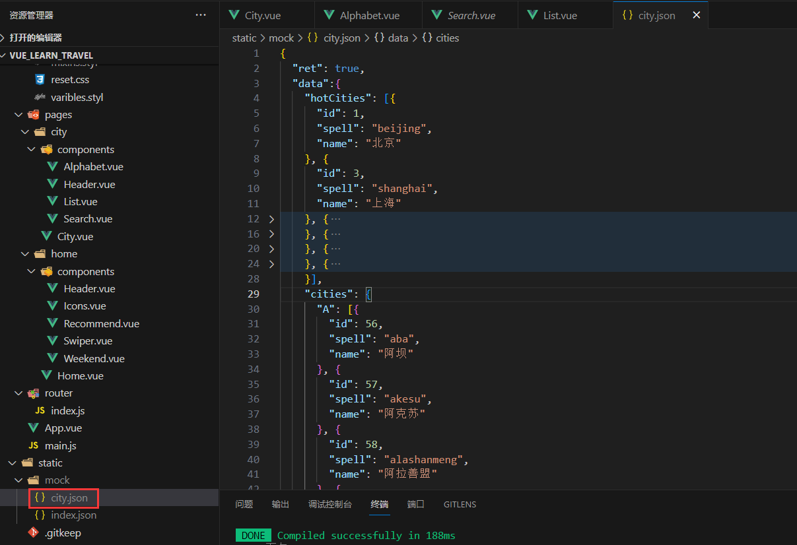

pages/city/City.vue

```html
<template>
  <div>
    <city-header></city-header>
    <city-search></city-search>
    <city-list :cities="cities" :hot="hotCities"></city-list>
    <city-alphabet :cities="cities"></city-alphabet>
  </div>
</template>

<script>
import axios from 'axios'
import CityHeader from './components/Header'
import CitySearch from './components/Search'
import CityList from './components/List'
import CityAlphabet from './components/Alphabet'
export default {
  name: 'City',
  components: {
    CityHeader,
    CitySearch,
    CityList,
    CityAlphabet
  },
  data () {
    return {
      cities: {},
      hotCities: []
    }
  },
  mounted () {
    this.getCityInfo()
  },
  methods: {
    getCityInfo () {
      axios.get('/api/city.json').then(this.handleGetCityInfoSucc)
    },
    handleGetCityInfoSucc (res) {
      res = res.data
      if (res.ret && res.data) {
        const data = res.data
        this.cities = data.cities
        this.hotCities = data.hotCities
      }
    }
  }
}
</script>

<style lang="stylus" scoped>

</style>
```

pages/city/components/List.vue

```html
<template>
  <div class="list" ref="wrapper">
    <div>
      <div class="area">
        <div class="title border-topbottom">当前城市</div>
        <div class="button-list">
          <div class="button-wrapper">
          <div class="button">北京</div>
          </div>
          <div class="button-wrapper">
          <div class="button">北京</div>
          </div>
          <div class="button-wrapper">
          <div class="button">北京</div>
          </div>
          <div class="button-wrapper">
          <div class="button">北京</div>
          </div>
          <div class="button-wrapper">
          <div class="button">北京</div>
          </div>
        </div>
      </div>
      <div class="area">
        <div class="title border-topbottom">热门城市</div>
        <div class="button-list">
          <div class="button-wrapper" v-for="item of hot" :key="item.id">
            <div class="button">{{ item.name }}</div>
          </div>
        </div>
      </div>
      <div class="area" v-for="(item, key) of cities" :key="key">
        <div class="title border-topbottom">A</div>
        <div class="item-list">
          <div class="item border-bottom" v-for="innerItem of item" :key="innerItem.id">{{ innerItem.name }}</div>
        </div>
      </div>
    </div>
  </div>
</template>

<script>
import Bscroll from 'better-scroll'

export default {
  name: 'CityList',
  props: {
    hot: Array,
    cities: Object
  },
  mounted () {
    this.scroll = new Bscroll(this.$refs.wrapper)
  }
}
</script>

<style lang="stylus" scoped>
@import '~styles/varibles.styl'
@import '~styles/mixins.styl'
.border-topbottom
  &:before
    border-color: #ccc
  &:after
    border-color: #ccc
.border-bottom
  &:before
    border-color: #ccc
.list
  overflow hidden
  position: absolute
  top: 1.58rem
  left: 0
  right: 0
  bottom: 0
  .title
    line-height: .54rem
    background: #eee
    padding-left: .2rem
    color: #666
    font-size: .26rem
  .button-list
    padding: .1rem .6rem .1rem .1rem
    overflow: hidden
    .button-wrapper
      width: 33.33%
      float left
      .button
        margin: .1rem
        padding: .1rem 0
        text-align: center
        border: .02rem solid #ccc
        border-radius: .06rem
  .item-list
    .item
      line-height: .76rem
      padding-left: .2rem
</style>
```

pages/city/components/Alphabet.vue

```html
<template>
    <div class="list">
        <li class="item" v-for="(item, key) of cities" :key="key">{{ key }}</li>
    </div>
  </template>

<script>
export default {
  name: 'CityAlphabet',
  props: {
    cities: Object
  }
}
</script>

<style lang="stylus" scoped>
@import '~styles/varibles.styl'
@import '~styles/mixins.styl'
.list
  display: flex
  flex-direction: column
  justify-content: center
  position: absolute
  top: 1.58rem
  right: 0
  bottom: 0
  width: .4rem
  .item
    line-height: .4rem
    text-align: center
    color: $bgColor
    list-style-type: none
</style>
```

## 兄弟组件间联动

pages/city/City.vue

```html
<template>
  <div>
    <city-header></city-header>
    <city-search></city-search>
    <city-list
      :cities="cities"
      :hot="hotCities"
      :letter="letter"
    >
    </city-list>
    <city-alphabet
      :cities="cities"
      @change="handleLetterChange"
    >
    </city-alphabet>
  </div>
</template>

<script>
import axios from 'axios'
import CityHeader from './components/Header'
import CitySearch from './components/Search'
import CityList from './components/List'
import CityAlphabet from './components/Alphabet'
export default {
  name: 'City',
  components: {
    CityHeader,
    CitySearch,
    CityList,
    CityAlphabet
  },
  data () {
    return {
      cities: {},
      hotCities: [],
      letter: ''
    }
  },
  mounted () {
    this.getCityInfo()
  },
  methods: {
    getCityInfo () {
      axios.get('/api/city.json').then(this.handleGetCityInfoSucc)
    },
    handleGetCityInfoSucc (res) {
      res = res.data
      if (res.ret && res.data) {
        const data = res.data
        this.cities = data.cities
        this.hotCities = data.hotCities
      }
    },
    handleLetterChange (letter) {
      this.letter = letter
    }
  }
}
</script>

<style lang="stylus" scoped>

</style>
```

pages/city/components/List.vue

```html
<template>
  <div class="list" ref="wrapper">
    <div>
      <div class="area">
        <div class="title border-topbottom">当前城市</div>
        <div class="button-list">
          <div class="button-wrapper">
          <div class="button">北京</div>
          </div>
        </div>
      </div>
      <div class="area">
        <div class="title border-topbottom">热门城市</div>
        <div class="button-list">
          <div class="button-wrapper" v-for="item of hot" :key="item.id">
            <div class="button">{{ item.name }}</div>
          </div>
        </div>
      </div>

      <div class="area"
        v-for="(item, key) of cities"
        :key="key"
        :ref="key"
      >
        <div class="title border-topbottom">{{ key }}</div>
        <div class="item-list">
          <div class="item border-bottom" v-for="innerItem of item" :key="innerItem.id">{{ innerItem.name }}</div>
        </div>
      </div>
    </div>
  </div>
</template>

<script>
import Bscroll from 'better-scroll'

export default {
  name: 'CityList',
  props: {
    hot: Array,
    cities: Object,
    letter: String
  },
  mounted () {
    this.scroll = new Bscroll(this.$refs.wrapper)
  },
  watch: {
    letter () {
      if (this.letter) {
        const element = this.$refs[this.letter][0]
        this.scroll.scrollToElement(element)
      }
    }
  }
}
</script>

<style lang="stylus" scoped>
@import '~styles/varibles.styl'
@import '~styles/mixins.styl'
.border-topbottom
  &:before
    border-color: #ccc
  &:after
    border-color: #ccc
.border-bottom
  &:before
    border-color: #ccc
.list
  overflow hidden
  position: absolute
  top: 1.58rem
  left: 0
  right: 0
  bottom: 0
  .title
    line-height: .54rem
    background: #eee
    padding-left: .2rem
    color: #666
    font-size: .26rem
  .button-list
    padding: .1rem .6rem .1rem .1rem
    overflow: hidden
    .button-wrapper
      width: 33.33%
      float left
      .button
        margin: .1rem
        padding: .1rem 0
        text-align: center
        border: .02rem solid #ccc
        border-radius: .06rem
  .item-list
    .item
      line-height: .76rem
      padding-left: .2rem
</style>
```

pages/city/components/Alphabet.vue

```html
<template>
    <div class="list">
        <li class="item"
          v-for="item of letters"
          :key="item"
          :ref="item"
          @click="handleLetterClick"
          @touchstart="handleTouchStart"
          @touchmove="handleTouchMove"
          @touchend="handleTouchEnd"
          >
          {{ item }}
        </li>
    </div>
  </template>

<script>
export default {
  name: 'CityAlphabet',
  props: {
    cities: Object
  },
  computed: {
    letters () {
      const letters = []
      for (let i in this.cities) {
        letters.push(i)
      }
      return letters
    }
  },
  data () {
    return {
      touchStatus: false
    }
  },
  methods: {
    handleLetterClick (e) {
      this.$emit('change', e.target.innerText)
    },
    handleTouchStart () {
      this.touchStatus = true
    },
    handleTouchMove (e) {
      if (this.touchStatus) {
        const startY = this.$refs['A'][0].offsetTop
        const touchY = e.touches[0].clientY - 79
        const index = Math.floor((touchY - startY) / 20)
        if (index >= 0 && index < this.letters.length) {
          this.$emit('change', this.letters[index])
        }
      }
    },
    handleTouchEnd () {
      this.touchStatus = false
    }
  }
}
</script>

<style lang="stylus" scoped>
@import '~styles/varibles.styl'
@import '~styles/mixins.styl'
.list
  display: flex
  flex-direction: column
  justify-content: center
  position: absolute
  top: 1.58rem
  right: 0
  bottom: 0
  width: .4rem
  .item
    line-height: .4rem
    text-align: center
    color: $bgColor
    list-style-type: none
</style>
```

## 列表切换性能优化

pages/city/components/Alphabet.vue

```html
<template>
    <div class="list">
        <li class="item"
          v-for="item of letters"
          :key="item"
          :ref="item"
          @click="handleLetterClick"
          @touchstart="handleTouchStart"
          @touchmove="handleTouchMove"
          @touchend="handleTouchEnd"
          >
          {{ item }}
        </li>
    </div>
  </template>

<script>
export default {
  name: 'CityAlphabet',
  props: {
    cities: Object
  },
  computed: {
    letters () {
      const letters = []
      for (let i in this.cities) {
        letters.push(i)
      }
      return letters
    }
  },
  data () {
    return {
      touchStatus: false,
      startY: 0,
      timer: null
    }
  },
  updated () {
    this.startY = this.$refs['A'][0].offsetTop
  },
  methods: {
    handleLetterClick (e) {
      this.$emit('change', e.target.innerText)
    },
    handleTouchStart () {
      this.touchStatus = true
    },
    handleTouchMove (e) {
      if (this.touchStatus) {
        if (this.timer) {
          clearTimeout(this.timer)
        }
        this.timer = setTimeout(() => {
          const touchY = e.touches[0].clientY - 79
          const index = Math.floor((touchY - this.startY) / 20)
          if (index >= 0 && index < this.letters.length) {
            this.$emit('change', this.letters[index])
          }
        }, 16)
      }
    },
    handleTouchEnd () {
      this.touchStatus = false
    }
  }
}
</script>

<style lang="stylus" scoped>
@import '~styles/varibles.styl'
@import '~styles/mixins.styl'
.list
  display: flex
  flex-direction: column
  justify-content: center
  position: absolute
  top: 1.58rem
  right: 0
  bottom: 0
  width: .4rem
  .item
    line-height: .4rem
    text-align: center
    color: $bgColor
    list-style-type: none
</style>
```

## 搜索功能实现

pages/city/City.vue

```html
<template>
  <div>
    <city-header></city-header>
    <city-search :cities="cities"></city-search>
    <city-list
      :cities="cities"
      :hot="hotCities"
      :letter="letter"
    >
    </city-list>
    <city-alphabet
      :cities="cities"
      @change="handleLetterChange"
    >
    </city-alphabet>
  </div>
</template>

<script>
import axios from 'axios'
import CityHeader from './components/Header'
import CitySearch from './components/Search'
import CityList from './components/List'
import CityAlphabet from './components/Alphabet'
export default {
  name: 'City',
  components: {
    CityHeader,
    CitySearch,
    CityList,
    CityAlphabet
  },
  data () {
    return {
      cities: {},
      hotCities: [],
      letter: ''
    }
  },
  mounted () {
    this.getCityInfo()
  },
  methods: {
    getCityInfo () {
      axios.get('/api/city.json').then(this.handleGetCityInfoSucc)
    },
    handleGetCityInfoSucc (res) {
      res = res.data
      if (res.ret && res.data) {
        const data = res.data
        this.cities = data.cities
        this.hotCities = data.hotCities
      }
    },
    handleLetterChange (letter) {
      this.letter = letter
    }
  }
}
</script>

<style lang="stylus" scoped>

</style>
```

pages/city/components/Search.vue

```html
<template>
  <div>
    <div class="search">
        <input v-model="keyword" class="search-input" type="text" placeholder=输入城市名或拼音>
    </div>
    <div
      class="search-content"
      ref="search"
      v-show="keyword"
    >
      <ul>
        <li class="search-item border-bottom"
         v-for="item of list"
          :key="item.id"
        >
        {{ item.name }}
        </li>
        <li class="search-item border-bottom" v-show="hasNoData">没有找到匹配数据</li>
      </ul>
    </div>
  </div>
  </template>

<script>
import Bscroll from 'better-scroll'
export default {
  name: 'CitySearch',
  props: {
    cities: Object
  },
  data () {
    return {
      keyword: '',
      list: [],
      timer: null
    }
  },
  computed: {
    hasNoData () {
      return !this.list.length
    }
  },
  watch: {
    keyword () {
      if (this.timer) {
        clearTimeout(this.timer)
      }
      if (!this.keyword) {
        this.list = []
        return
      }
      this.timer = setTimeout(() => {
        const result = []
        for (let i in this.cities) {
          this.cities[i].forEach((value) => {
            if (value.spell.indexOf(this.keyword) > -1 || value.name.indexOf(this.keyword) > -1) {
              result.push(value)
            }
          })
        }
        this.list = result
      }, 100)
    }
  },
  mounted () {
    this.scroll = new Bscroll(this.$refs.search)
  }
}
</script>

<style lang="stylus" scoped>
@import '~styles/varibles.styl'
@import '~styles/mixins.styl'
.search
  height: .72rem
  padding: 0 .1rem
  background: $bgColor
  .search-input
    box-sizing: border-box
    width: 100%
    height: .62rem
    line-height: .62rem
    text-align: center
    border-radius: .06rem
    color: #666
    padding: 0 .1rem
.search-content
  z-index: 1
  overflow: hidden
  position: absolute
  top: 1.58rem
  left: 0
  right: 0
  bottom: 0
  background: #eee
  .search-item
    line-height: .62rem
    padding-left: .2rem
    background: #fff
    color: #666
</style>
```

## 使用Vuex实现数据共享

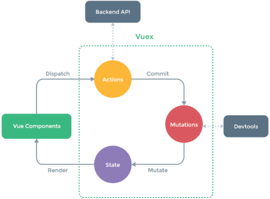

安装 vuex

```
 npm install vuex@3.0.1 --save
```

src/main.js

```javascript
// The Vue build version to load with the `import` command
// (runtime-only or standalone) has been set in webpack.base.conf with an alias.
import Vue from 'vue'
import App from './App'
import router from './router'
// 引入vuex
import store from './store'
// 解决移动端点击事件延迟300ms问题
import fastClick from 'fastclick'
// 用来重置页面样式表，对基础样式的修饰，保证不同手机浏览器的默认展示样式统一
import 'styles/reset.css'
// 解决1像素边框的问题，多倍屏物理像素实际对应的是2或者3等多像素的问题
import 'styles/border.css'
// 使用iconfont
import 'styles/iconfont.css'
// 引入vue-awesome-swiper
import VueAwesomeSwiper from 'vue-awesome-swiper'
import 'swiper/dist/css/swiper.css'

// 使用fastClick绑定到document.body
fastClick.attach(document.body)
Vue.config.productionTip = false

Vue.use(VueAwesomeSwiper)
/* eslint-disable no-new */
new Vue({
  el: '#app',
  router,
  store,
  components: { App },
  template: '<App/>'
})
```

src/store/index.js

```javascript
import Vue from 'vue'
import Vuex from 'vuex'
import state from './state'
import mutations from './mutations'

Vue.use(Vuex)

export default new Vuex.Store({
  state,
  // actions: {
  //   changeCity (ctx, city) {
  //     ctx.commit('changeCity', city)
  //   }
  // },
  mutations,
  // vuex中的getters的作用有点类似组件中的computed计算属性的作用
  // 当我们需要根据state里面的数据算出一些新的数据的时候，我们就可以借助getter这样的一个工具，来提供新的数据，避免数据的冗余
  getters: {
    doubleCity (state) {
      return state.city + ' ' + state.city
    }
  }
})
```

src/store/state.js

```javascript
let defaultCity = '北京'
try {
  if (localStorage.city) {
    defaultCity = localStorage.city
  }
} catch (e) {}

export default{
  city: defaultCity
}
```

src/store/mutations.js

```javascript
export default {
  changeCity (state, city) {
    state.city = city
    try {
      localStorage.city = city
    } catch (e) {}
  }
}
```

pages/home/Home.vue

```html
<template>
  <div>
    <home-header></home-header>
    <home-swiper :list="swiperList"></home-swiper>
    <home-icons :list="iconList"></home-icons>
    <home-recommend :list="recommendList"></home-recommend>
    <home-weekend :list="weekendList"></home-weekend>
  </div>
</template>

<script>
import HomeHeader from './components/Header.vue'
import HomeSwiper from './components/Swiper.vue'
import HomeIcons from './components/Icons.vue'
import HomeRecommend from './components/Recommend.vue'
import HomeWeekend from './components/Weekend.vue'
import axios from 'axios'
export default {
  name: 'Home',
  components: {
    HomeHeader,
    HomeSwiper,
    HomeIcons,
    HomeRecommend,
    HomeWeekend
  },
  mounted () {
    this.getHomeInfo()
  },
  data () {
    return {
      swiperList: [],
      iconList: [],
      recommendList: [],
      weekendList: []
    }
  },
  methods: {
    getHomeInfo () {
      axios.get('/api/index.json').then(this.getHomeInfoSucc)
    },
    getHomeInfoSucc (res) {
      res = res.data
      if (res.ret && res.data) {
        const data = res.data
        this.swiperList = data.swiperList
        this.iconList = data.iconList
        this.recommendList = data.recommendList
        this.weekendList = data.weekendList
      }
    }
  }
}
</script>
<style>

</style>
```

pages/home/components/Header.vue

```html
<template>
    <div class="header">
      <div class="header-left">
        <div class="iconfont back-icon">&#xe624;</div>
      </div>
      <div class="header-input">
        <span class="iconfont">&#xe632;</span>
        输入城市/景点/游玩主题
      </div>
      <router-link to="/city">
      <div class="header-right">
        {{ this.doubleCity }}
        <span class="iconfont arrow-icon">&#xe62d;</span>
      </div>
    </router-link>
    </div>
  </template>

<script>
import { mapGetters, mapState } from 'vuex'
export default {
  name: 'HomeHeader',
  computed: {
    // mapState：指将vuex里面名为city的数据映射到本组件的computed的名为city的计算属性中
    ...mapState(['city']),
    // mapGetters：指将vuex里面名为doubleCity的getter映射到本组件的computed的名为doubleCity的计算属性中
    ...mapGetters(['doubleCity'])
  }
}
</script>

<!-- lang="stylus": 使用stylus语法编写css, scoped: 样式做限制，只对当前组件有影响，不会影响其他组件 -->
<!-- 1rem = html font-size = 50px -->
<!-- $bgColor 引用varibles.styl文件中的变量 -->
<!--
     @import '~@/assets/styles/varibles.styl'
     @import: 样式中引用样式，使用样式变量
     注意：导入的时候区分于其他形式的导入，可以用相对路径的方式，也可以用@符号
     如果用@符号，则代表从src目录开始，但是这里需要在@符号前面加上~
     可以自定义路径别名，在webpack.base.conf.js文件中进行配置，配置完成之后可以进行最终简化路径 @import '~styles/varibles.styl'
-->
<style lang="stylus" scoped>
@import '~styles/varibles.styl'
.header
  display: flex
  line-height: $headerHeight
  background: $bgColor
  color: #fff
  .header-left
    width: .64rem
    float: left
    .back-icon
      text-align: center
      font-size: .4rem
  .header-input
    flex: 1
    height: .64rem
    line-height: .64rem
    margin-left: .2rem
    margin-top: .12rem
    padding-left: .2rem
    background: #fff
    border-radius: .1rem
    color: #ccc
  .header-right
    min-width: 1.04rem
    padding: 0 .1rem
    float: right
    text-align: center
    color: #fff
    .arrow-icon
      margin-left: -.04rem
      font-size: .24rem
</style>
```

pages/city/components/List.vue

```html
<template>
  <div class="list" ref="wrapper">
    <div>
      <div class="area">
        <div class="title border-topbottom">当前城市</div>
        <div class="button-list">
          <div class="button-wrapper">
          <div class="button">{{ this.currentCity }}</div>
          </div>
        </div>
      </div>
      <div class="area">
        <div class="title border-topbottom">热门城市</div>
        <div class="button-list">
          <div
            class="button-wrapper"
            v-for="item of hot"
            :key="item.id"
            @click="handleCityClick(item.name)"
          >
            <div class="button">{{ item.name }}</div>
          </div>
        </div>
      </div>

      <div class="area"
        v-for="(item, key) of cities"
        :key="key"
        :ref="key"
      >
        <div class="title border-topbottom">{{ key }}</div>
        <div class="item-list">
          <div class="item border-bottom"
            v-for="innerItem of item"
            :key="innerItem.id"
            @click="handleCityClick(innerItem.name)"
          >
            {{ innerItem.name }}
          </div>
        </div>
      </div>
    </div>
  </div>
</template>

<script>
import Bscroll from 'better-scroll'
import { mapState, mapMutations } from 'vuex'

export default {
  name: 'CityList',
  props: {
    hot: Array,
    cities: Object,
    letter: String
  },
  computed: {
    // // mapState：这里也可以使用对象，不用之前的数组形式，进行自定义命名。指将vuex里面名为city的数据映射到本组件的computed的名为currentCity的属性中
    ...mapState({
      currentCity: 'city'
    })
  },
  mounted () {
    this.scroll = new Bscroll(this.$refs.wrapper)
  },
  methods: {
    handleCityClick (city) {
      // this.$store.dispatch('changeCity', city)
      // 也可以使用直接调用mutation方法的形式
      // this.$store.commit('changeCity', city)
      this.changeCity(city)
      this.$router.push('/')
    },
    // mapMutations: 将名为changeCity的mutation映射到本组件一个名为changeCity的方法里
    ...mapMutations(['changeCity'])
  },
  watch: {
    letter () {
      if (this.letter) {
        const element = this.$refs[this.letter][0]
        this.scroll.scrollToElement(element)
      }
    }
  }
}
</script>

<style lang="stylus" scoped>
@import '~styles/varibles.styl'
@import '~styles/mixins.styl'
.border-topbottom
  &:before
    border-color: #ccc
  &:after
    border-color: #ccc
.border-bottom
  &:before
    border-color: #ccc
.list
  overflow hidden
  position: absolute
  top: 1.58rem
  left: 0
  right: 0
  bottom: 0
  .title
    line-height: .54rem
    background: #eee
    padding-left: .2rem
    color: #666
    font-size: .26rem
  .button-list
    padding: .1rem .6rem .1rem .1rem
    overflow: hidden
    .button-wrapper
      width: 33.33%
      float left
      .button
        margin: .1rem
        padding: .1rem 0
        text-align: center
        border: .02rem solid #ccc
        border-radius: .06rem
  .item-list
    .item
      line-height: .76rem
      padding-left: .2rem
</style>
```

pages/city/components/Search.vue

```html
<template>
  <div>
    <div class="search">
        <input v-model="keyword" class="search-input" type="text" placeholder=输入城市名或拼音>
    </div>
    <div
      class="search-content"
      ref="search"
      v-show="keyword"
    >
      <ul>
        <li class="search-item border-bottom"
         v-for="item of list"
         :key="item.id"
         @click="handleCityClick(item.name)"
        >
        {{ item.name }}
        </li>
        <li class="search-item border-bottom" v-show="hasNoData">没有找到匹配数据</li>
      </ul>
    </div>
  </div>
  </template>

<script>
import Bscroll from 'better-scroll'
import { mapMutations } from 'vuex'
export default {
  name: 'CitySearch',
  props: {
    cities: Object
  },
  data () {
    return {
      keyword: '',
      list: [],
      timer: null
    }
  },
  computed: {
    hasNoData () {
      return !this.list.length
    }
  },
  watch: {
    keyword () {
      if (this.timer) {
        clearTimeout(this.timer)
      }
      if (!this.keyword) {
        this.list = []
        return
      }
      this.timer = setTimeout(() => {
        const result = []
        for (let i in this.cities) {
          this.cities[i].forEach((value) => {
            if (value.spell.indexOf(this.keyword) > -1 || value.name.indexOf(this.keyword) > -1) {
              result.push(value)
            }
          })
        }
        this.list = result
      }, 100)
    }
  },

  methods: {
    handleCityClick (city) {
      // this.$store.dispatch('changeCity', city)
      // 也可以使用直接调用mutation方法的形式
      // this.$store.commit('changeCity', city)
      this.changeCity(city)
      this.$router.push('/')
    },
    // mapMutations: 将名为changeCity的mutation映射到本组件一个名为changeCity的方法里
    ...mapMutations(['changeCity'])
  },
  mounted () {
    this.scroll = new Bscroll(this.$refs.search)
  }
}
</script>

<style lang="stylus" scoped>
@import '~styles/varibles.styl'
@import '~styles/mixins.styl'
.search
  height: .72rem
  padding: 0 .1rem
  background: $bgColor
  .search-input
    box-sizing: border-box
    width: 100%
    height: .62rem
    line-height: .62rem
    text-align: center
    border-radius: .06rem
    color: #666
    padding: 0 .1rem
.search-content
  z-index: 1
  overflow: hidden
  position: absolute
  top: 1.58rem
  left: 0
  right: 0
  bottom: 0
  background: #eee
  .search-item
    line-height: .62rem
    padding-left: .2rem
    background: #fff
    color: #666
</style>
```

## 使用keep-alive vue内置标签优化网页性能

