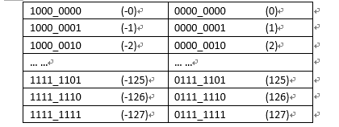
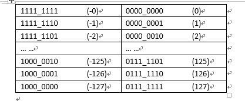
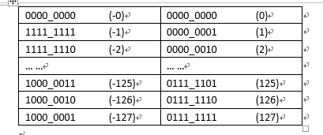
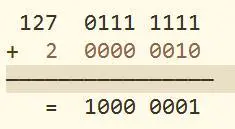
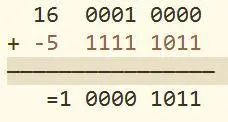

### 机器数

一个数在计算机中的表现形式叫做机器数，这个数有正负之分，在计算机中用一个数的最高位（符号位）用来表示它的正负，其中0表示正数，1表示负数。

例如正数7，在计算机中用一个8位的二进制数来表示，是00000111，而负数-7，则用10000111表示，这里的00000111和10000111是机器数

### 真数

计算机中的机器数对应的真实的值就是真数，对最高位（符号位）后面的二进制数转换成10进制，并根据最高位来确定这个数的正负。对于上面的00000111和10000111来说，对最高位后面的二进制数转换成10进制是7，在结合最高位的值，得出对应的真数分别是7和-7

### 原码

用第一位表示符号，其余位表示值。因为第一位是符号位，所以8位二进制数的取值范围就是：[1111_1111 , 0111_1111]  即 [-127 , 127] ,原码是容易被人脑所理解的表达方式

### 反码

正数的补码反码是其本身，负数的反码是符号位保持不变，其余位取反。例如正数1的原码是[0000_0001]，它的反码是是其本身[0000_0001],-1的原码是[1000_0001],其反码是[1111_1110]

### 补码

正数的补码是其本身，负数的补码是在其反码的基础上+1，例如正数1的原码是[0000_0001],他的补码是其本身[0000_0001],

-1的补码是[1111_1111]

### 有了原码为什么要使用反码和补码

因为人脑可以知道第一位是符号位，可以根据符号位对真值的绝对值进行加减乘除，但是对于计算机来说，加减乘除是最最最基本的运算，要设计的尽量简单，计算机辨别符号位会让计算机的设计电路变得很复杂，于是人们想出了让符号位也参与到运算上来。减去一个数，等于加上他的负数。

使用原码参数运算的缺陷

从上面的原码表中可以看见左边每增加一个二进制单位对应的真数是递减的，而右边每增加一个二进制单位对应的真数是递增的，所以对于原码来说，能满足正数的加法，但无法满足负数的加法

2 + 1 = [0000_0010]原 + [0000_0001]原 = [0000_0011]原 = 3

1 + -1 = [0000_00001]原 + [1000_0001]原 = [1000_0010]原 =  -2

为了满足负数对加法的需求，就必须让负数与他对应的二进制码是同步递增或者同步递减

于是就通过符号位不变，其余位取反来满足这个同步递增或者递减的要求，由于正数本来就满足它本身的加法，所以不需要做任何改变。这就是反码的定义由来。

从上图的反码表中可以看到在运算不跨过0的时候，正负数的加法已经能满足要求

-2 + 1 = [1111_1101]反 + [0000_0001]反 = [1111_1110]反 = -1

127 + 1 = [1000_0000]反 = -127 = 128 加法算出来是128，由于128超过最大值，余1，所以取最小值开始的第一位，也就是最小值-127，但是这里有个不合理的地方，就是 [1111_1111] 和 [0000_0000] 都表示0，这导致在实际计算中每当跨过0一次，就有一个单位的误差

-1 + 2 = [1111_1110]反 + [0000_0010]反 = [0000_0000]反 = 0

要解决这个问题就必须让反码中的 [1111_1111] 和 [0000_0000] 合并，

由于[1111_1111] + [0000_0001] = [0000_0000],所以在负数反码的基础上+1就可以解决反码中跨0的误差问题，同时不会对负数与它对应的二进制反码的同步递增产生影响，所以在反码的基础上 +1 就完美的解决了符号参与预算的问题，这就是补码为什么是在负数反码的基础上+1的由来。

从上面的图中发现还有一个[1000_0000]的二进制没有对应任何真数，于是就规定了这个数的真数是-128

所以补码的表示范围是[-128~127] ，这样一来256个二进制正好表示256个整数，在实际二进制的运算中超过范围其实就是对256的取余预算（x+128）mod 256 - 128。

------

补码首先要计算反码，也就是取反得到反码。

例如：

-5的8位二进制为10000101 #第一位1表示位符号负数，

-5的反码为：11111010

-5的补码为：11111011 #反码加1

5的8位二进制为00000101 #第一个0表示符号位正数+，由于5位正数，其反码与补码均保持不变（原因下面会提到）

那么为什么补码要取反加1？

这涉及到“模(mod)”的概念。“模(mod)”是指一个计量系统的计数范围，例如：时钟的计量范围是0~11，模=12。同样计算机也可以看成一个计量机器，因为计算机的字长是定长的，即存储和处理的位数是有限的，因此它也有一个计量范围，即都存在一个“模(mod)”。表示n位的计算机计量范围是0到2^n-1 ，模=2^n ，“模” 实质上是计量器产生“溢出”的量，它的值在计量器上表示不出来，计量器上只能表示出模的余数。

任何有模的计量器，均可化减法为加法运算。

假设一个时钟当前时针指向8点，而准确时间是6点，调整时间可有以下两种方式：

其一是倒拨2小时，即8-2=6；

其二是顺拨10小时，8+10=12+6=6，即8-2=8+10=8+12-2(mod 12)。

在12为模的计时系统里，加10和减2效果是一样的，因此凡是减2运算，都可以用加10来代替。一般可用公式表示为：a-b=a-b+mod=a+mod-b。对“模”而言，2和10互为补数。实际上，以12为模的系统中11和1、8和4、9和3、7和5、6和6等等都有互为补数的性质，共同的特点是两者相加等于模。

对于计算机的计数原理，其概念和方法完全一样。n位计算机，设n=8，所能表示的最大数是11111111，若再加1成100000000(9位)，但因只有8位，最高位1自然丢失（相当于丢失一个模）。又回到了 00000000，所以8位二进制系统的模为2^8 ——也就是11111111。

同理在计算机系统中处理减法时，也可以按照时钟方式化减法为加法，只需把减数用相应的补数表示就可以了。

以公式a-b=a-b+mod=a+mod-b为例，

设: -b=10000101(-5的二进制)，

模(mod)=11111111

a-b=a+(-b的补数)=a+(mod-b)=a+(11111111-10000101)

由于二进制的特性，11111111减去10000101得到补数11111010，实际就等于10000101各位取反——也就是反码，如下对应关系：

11111111 #模(mod)

10000101 # -5二进制

11111010 #-5二进制补数（即反码）

（这里要注意第一位符号位是不变的）

但是在实际计算中补数（反码）还必须加1——即：

11111010+1（00000001）=11111011

这是因为在8位二进制系统中，模=2^8=256， 表示为二进制是100000000，是九位二进制数，在8位二进制系统中实际产生溢出位无法计算，而8位二进制系统计量范围是0~2^n-1 ，也就是0~257，最大值是257，也就是我们上面计算中模的取值二进制11111111，也就是说为了便于计算，我们是用257的二进制11111111，代替了模256的实际值100000000，那么在实际计算中取得补数后，必须加上这个差值1才不会出错，即：

补数（反码）+1=补码

这就是为什么补码加1的原因。

看到这里也就明白了为什么正数的反码补码不变。

------

### 概念

需要声明的是，本文涉及到的数字及运算均基于**8位bit**下的值。

### 原码

最高位为符号位，0代表正数，1代表负数，非符号位为该数字绝对值的二进制表示。

如：

127的原码为0111 1111
 -127的原码为1111 1111

### 反码

正数的反码与原码一致；

负数的反码是对原码按位取反，只是**最高位(符号位)不变**。

如:

127的反码为0111 1111
 -127的反码为1000 0000

### 补码

正数的补码与原码一致；

负数的补码是该数的**反码加1**。

如：

127的补码为0111 1111
 -127的补码为1000 0001

总结一下就是：

1. 正数的原码、反码、补码是一致的；
2. 负数的补码是反码加1，反码是对原码按位取反，只是**最高位(符号位)不变**；
3. 计算机数字运算均是基于**补码**的。

下面就来探讨一下，为啥要用补码来表示数字。

补码有啥好？

如果计算机内部采用原码来表示数，那么在进行加法和减法运算的时候，需要转化为两个绝对值的加法和减法运算；计算机既要实现加法器，又要实现减法器，代价有点大，那么可不可以只用一种类型的运算器来实现加和减的远算呢？

很容易想到的就是**化减为加**，举一个生活中的例子来说明这个问题：时钟一圈是360度，当然也存在365度，但其实它和5度是一样的；相同的道理，-30度表示逆时针旋转30度，其与顺时针旋转330度是一样的；

这里数字360表示时钟的一圈，在计算机里类似的概念叫**模**，它可以实现**化减为加**，本质上是将**溢出的部分舍去**而不改变结果。易得，单字节(8位)运算的模为256=2^8。在没有符号位的情况下，127+2=129，即：

这时，我们将最高位作为符号位，计算机数字均以补码来表示，则1000 0001的原码为减1后按位取反得1111 1111，也就是-127。也就是说，计算机里的129即表示-127，相当于模256为一圈，顺时针的129则和逆时针127即-127是一样的。故可以得到以下结论：

负数的补码为**模减去该数的绝对值**。

如-5的补码为：

-5=256-5=251=1111 1011(二进制)

同样的，临界值-128也可以表示出来：

-128=256-128=128=1000 0000(二进制)

但是正128就会溢出了，故单字节(8位)表示的数字范围为-128--127。

最后，我们来看一下，补码是如何通过模的**溢出舍弃**操作来完成**化减为加**的！

16-5=16+(-5)=11

1 0000 1011将溢出位舍去，得0000 1011(二进制)=11。
