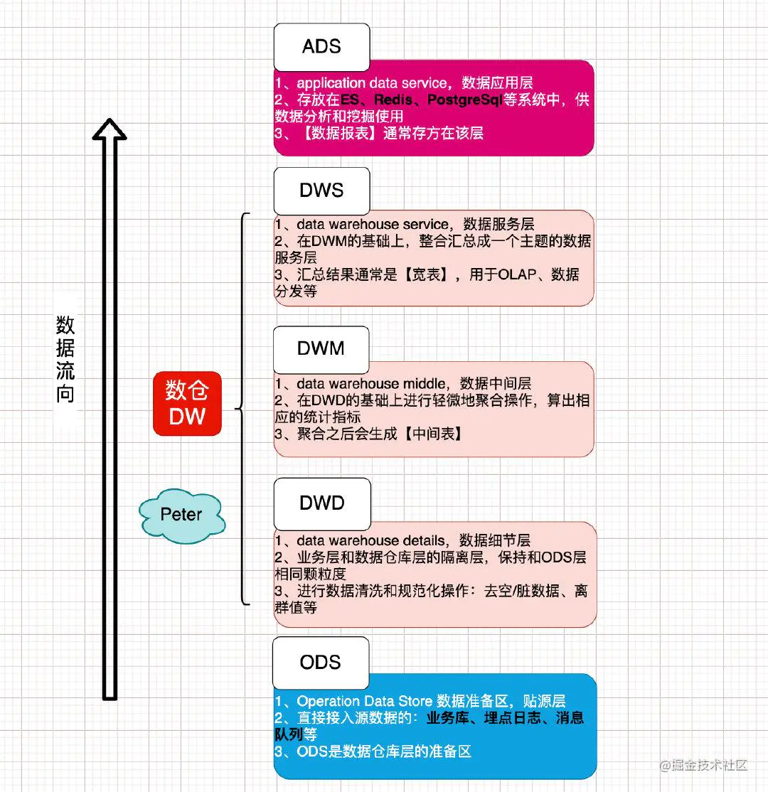
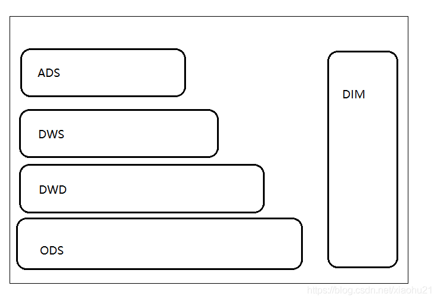
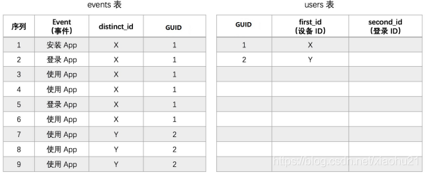
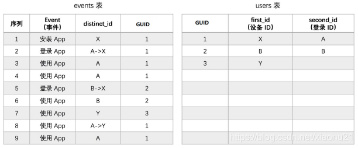
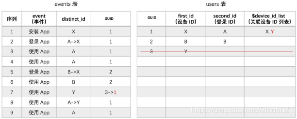

# 数仓数据分层简介



## 背景

1、数仓是什么, 其实就是存储数据,体现历史变化的一个数据仓库. 因为互联网时代到来,基于数据量的大小,分为了传统数仓和现代数仓.

2、传统数仓,使用传统的关系型数据库进行数据存储,因为关系型数据库本身可以使用SQL以及函数等做数据分析.所以把数据存储和数据分析功能集合为一体,加上一个可视化界面,就能从数据存储,数据分析,数据展示完整方案.

3、到了互联网时代,由于上网用户剧增,特别是移动互联网时代,海量的网络设备,导致了海量的数据产生,企业需要也希望从这些海量数据中挖掘有效信息,如行为日志数据,业务数据,爬虫数据等等中提炼出有价值信息.但传统的关系型数据库由于本身技术限制,无法很好承担这么大数据量存储和分析的任务,现代大数据技术应运而生.而数仓就是做这些海量数据存储的地方.

## 经典数仓分层架构

1、



2、其实数仓数据分层,就跟代码分层一样.如果所有数据都放在一层,就跟代码都放在一个文件,肯定是可以运行的,但带来的问题就是阅读性差,复用性和维护性降低.

>  数仓的分层也是一样,每一层都有自己的职责,同时都是基于下一层或者下面多层做数据处理之后的结果.
> 这样一来,最上层就是ADS,数据应用层,当更上层需要数据时,不需要再从最底层进行数据计算,可以复用中间层级的现有结果,可以提升数据处理速度.
> 同样的,因为更上层数据都是从下一层或者下面多层数据处理而来,这样就算下层数据丢失,也不会造成企业所有数据毁灭性灾难,算是一种数据冗余机制,不过更上层数据一般做了数据处理,提升了维度信息.

3、需要注意,大数据的特点之一就是海量数据,但是数据价值密度较低.
使用数据分层机制,相当于提炼黄金的流程,逐步逐步将有价值信息进行汇总聚合,这样就跟分步操作一样,最终提炼出想要的结果.同时就算原始数据丢失了,只要中间结果还在,依然可以保证最上层数据的稳定性.类似加了一层缓冲一样

4、大数据的特点,海量数据,这其实带来了较大的存储压力.将数据进行分层之后, 最原始的数据存储周期就可以适当降低,这样可以降低存储压力.而更上层的数据,因为都是加工后的数据,数据量相对较少,存储压力就会小一些,存储周期也就可以长一些.
综上,道理其实都是相通的,数据分层最终遵循的还是很朴素的道理.降低存储压力,降低企业使用成本,复用中间数据结果,提升数据处理速度.逐步处理,这样可以更加灵活应对企业开发需求,不需要所有需求都从数据量最大的ODS层进行数据处理

## 模型设计

### ODS层

1、这一层又叫做贴源层,就是接近数据源的一层,需要存储的数据量是最大的,存储的数据也是最原始,最真实未经过太多处理的数据.

2、按照目前大数据企业开发的数据来源来看,不管是爬虫数据,日志数据还是业务数据,都会有一层ODS层,存放最原始的数据.

3、注意,ODS层数据还起到一个数据备份作用,如果是比较特殊行业,在ODS层的数据会保留一年甚至多年.不过普通公司一般就保存3–6个月,看数据量和存储压力以及存储预算决定.

4、日志数据估算,如日活100万用户,每个用户访问1次,每次操作5min,每个用户平均3秒一条日志数据,一条数据1kb.最后体积是100w*1*5*60/3*1kb=100w*100kb=97656.25MB=95.36GB;

> 注意,数据估算最好结合公司实际情况,如果已经运行一段,可以让运维同事帮忙做估算
>
> 因为数据本身可以做压缩,数仓数据还需要做分层,数据本身存储时还会有备份机制(HDFS\Kafka等框架)
>
> 数据还会源源不断增长,同时磁盘还需要预留一定缓冲空间,一般是30%缓冲空间.所以除非是新建项目或者遇到超快速增长的公司,一般的大数据容量评估都是按照最高上限做半年甚至一年总容量做评估的.
>
> 注意,在服务器领域,磁盘的成本相对CPU\内存来说,成本是相对最低的,甚至有专门的存储服务器,如24硬盘位,甚至48硬盘位的服务器.
>
> 而2020年先在已经开发出了单磁盘12TB甚至14TB的企业硬盘,这意味着单节点机器容量上限进一步提升,存储成本也随着技术提升,成本开始降低下来.

5、ODS中数据不意味着里面的数据就是最原始没经过处理的.一般企业开发,因为真实环境中数据上报,存储,采集中错误,bug,网络等问题,会造成原始数据的各类问题.

> 字段缺失
> 数据字段不统一
> 格式错误
> 关键信息丢失等等
> 数据来源混杂
> 数据类型不一,例如json,xml,text,csv的,压缩了的,没有压缩的等等. 

6、一般企业开发时,都会对原始数据存入到ODS时,做一些最基本的处理

> 数据来源区分
> 数据按照时间分区存储,一般是按照天,也有公司使用年,月,日三级分区做存储的
> 进行最基本的数据处理,如格式错误的丢弃,关键信息丢失的过滤掉等等.

**注意,有的公司ODS层不会做太多数据过滤处理,会放到DWD层来处理.**
**有的公司会在一开始时就在ODS层做数据相对精细化的过滤.这个并没有明确规定,看每个公司自己的想法和技术规**范

7、ODS层建立表时,如果使用hive进行处理,一般建立外部表.

> hive的外部表,对应的是业务表;
> hive外部表,存放数据的文件可以不是在hive的hdfs默认的位置,并且hive对应的表删除时,相应的数据文件并不会被删除.这样对于企业开发来说,可以防止因为删除表的操作而把宝贵的数据删除掉
> hive的业务表,则相反.数据文件存放在hive对应的默认位置,表删除时,对应文件也会被删除掉.

大数据开发,使用hive时,一般都是使用外部表

```sql
create external table xxx(

)
```

8、ODS层的文件格式

* 如果数据来自于日志文件,一般和原始日志文件格式一样.

* 如果数据来自于数据库,则看需要.

* 数据分区,一般都是按照天进行分区,如使用hive,则partitioned by 一般都是按照天进行存放.

**实际企业开发,并没有定法,有些公司的ODS层数据,采取压缩方式存放,如parquet这类列式存储,带索引,带压缩的文件格式.这样既可以降低存储压力,也能提升查询效率,还有很好的框架兼容性**

9、特别点

​	如果使用hive做ODS数据存储管理,遇到JSON时,可以使用JsonSerde进行数据解析。

> JsonSerde 的 github 地址：https://github.com/rcongiu/Hive-JSON-Serde
> JsonSerde 的 jar下载地址：http://www.congiu.net/hive-json-serde/
> 下载 json-serde-1.3.7-jar-with-dependencies.jar 并上传到 Hive的/lib库目录下
> 也可以把本jar包安装到本地maven库
> bin\mvn install:install-file -Dfile=d:/json-serde.1.3.8.jar -DgroupId=“org.openx.data” -DartifactId=json-serde -Dversion=“1.3.8” -Dpackaging=jar

```sql
drop table app_event_log;
create external table ods.app_event_log
(
account         string,           
appId           string,           
appVersion      string,           
carrier         string,           
deviceId        string,           
deviceType      string,           
eventId         string,           
ip              string,           
latitude        double,           
longitude       double,           
netType         string,           
osName          string,           
osVersion       string,           
properties      map<string,string>,                            
releaseChannel  string,           
resolution      string,           
sessionId       string,           
`timeStamp`       bigint  
)   
partitioned by (y string,m string,d string)
row format serde 'org.openx.data.jsonserde.JsonSerDe'
stored as textfile
;      
```

> **如果需要将数据导入HBase, 可以使用BulkLoad方式,批量导入.不过实际企业开发中,越来越少企业使用HBase进行ODS数据存储。一个是rowkey限制维度信息,第二个是SQL支持不好,虽然有Phoenix,但是对比Hive还是有不足而且使用Hive管理数据,后续使用Kylin,presto还有很好的兼容性**

### DWD层

1、按照建模思想,不完全星型建模. 注意,所有的框架实际实现时,都不会按照理想方式去实现,都会在实现成本,复杂度,性能,指标等方面综合考虑.

2、DWD又叫做数据明细表, 很多时候存储的都是事实表为主.

3、在DWD层,会有ETL,也就是extract transform load 提取转换加载处理,逻辑会比较复杂,这时候如果使用hive,一般无法满足要求,这些逻辑一般都是编写代码实现,然后使用脚本进行周期性如每天调用.

> 1. 去除废弃字段,去除格式错误的信息
> 2. 去除丢失了关键字段的信息
> 3. 去除不含时间信息的数据(这个看公司具体业务,但一般数据中都会带上时间戳,这样方便后续处理时,进行时间维度上信息分析处理和提取)
> 4. 有些公司还会在这一层将数据打平,不过这具体要看业务需求.这是因为kylin适合处理展平后数据,不适合处理嵌套的表数据信息.
> 5. 有些公司还会将数据session做切割,这个一般是app的日志数据,其他业务场景不一定适合.这是因为app有进入后台模式,例如用户上午打开app用了10分钟,然后app切入后台,晚上再打开,这时候session还是一个,实际上应该做切割才对.(也有公司会记录app进入后台,再度进入前台的记录,这样来做session切割)
> 6. 数据规范化,因为大数据处理的数据可能来资源公司不同部门,不同项目,不同客户端,这时候可能相同业务数据字段,数据类型,空值等都不一样,这时候需要在DWD层做抹平.否则后续处理使用时,会造成很大的困扰.
> 7. 简单的,如boolean,有使用0 1标识,也有使用true false标识的
> 8. 如字符串空值,有使用"",也有使用null,的,统一为null即可
> 9. 如日期格式,这种就差异性更大,需要根据实际业务数据决定,不过一般都是格式化为YYYY-MM-dd HH:mm:ss 这类标准格式

4、注意,事实表中数据,一般不是所有维度都按照维度主键做信息存储。

> 维度退化,其实从代码角度来说,就是当一个代码写死之后,失去了灵活性,维度就退化了.
> 在数仓理论中,有几个经典思想,一个是去除数据冗余.所以一般会把维度信息单独存放,其他表要使用时,记录对应维度的id即可.
> 这样,就算维度表中数据发生了变化,其他表数据因为只是记录了id,不会有影响.
> 同时,维度信息放在一张表中存放,而不是每个表中存储一份,将来需要调整,只需要做一次工作即可,降低了数据冗余.
> 这一点和代码的实现和设计思想是一致的,不要重复造轮子.

5、在DWD层，一般还会做数据映射

* 例如将GPS经纬度转换为省市区详细地址.
  业界常见GPS快速查询一般将地理位置知识库使用geohash映射,然后将需要比对的GPS转换为geohash后跟知识库中geohash比对,查找出地理位置信息
  当然,也有公司使用open api,如高德地图,百度地图的api进行GPS和地理位置信息映射,但这个达到一定次数需要花钱,所以大家都懂的.

* 会将IP地址也转换为省市区详细地址.
  这个有很多快速查找库,不过基本原理都是二分查找,因为ip地址可以转换为长整数.典型的如ip2region库

* 将时间转换为年,月,日甚至周,季度维度信息.

> 这样带来好处就是,后续业务处理时如果需要这些信息,直接使用即可.不过会一定程度增加数据量,但一般都还可以接收,增加并不多.
> 注意,数据映射一般只映射常见指标以及明确的企业开发中后续会用到的指标,因为数据量较大,如映射的指标后续用不到,只会平白增加开发,维护成本.

6、DWD存储数据,一般就是维度表,事实表,实体表等数据。

* 维度表,顾名思义,就是一些维度信息,这种表数据,一般就直接存储维度信息,很多时候维度表都不会很大.

* 事实表,就是表述一些事实信息,如订单,收藏,添加购物车等信息.这种数据量较大,同时因为数据可能快速或者缓慢变化,这种一般存储维度主键,具体维度值在后续处理分析时再临时关联

* 实体表,类似javabean,用来描述信息的,如优惠券表,促销表.内部就是一些描述信息.这种一般看数据量以及变化程度,大部分时候都是全量导入,导入周期则看具体而定。

7、id mapping
考虑如下情况:
对于互联网企业来说,目前用户来源基本就是web app 小程序三种来源。

当用户登录之后访问,毫无疑问,使用用户账号id标识用户即可,这是唯一的.但也需要分情况考虑

1. 如果之前登录访问的是一个账号,现在换了一个账号,设备该绑定哪个账号?

当用户未登录访问,这时候就需要划分情况了

1. 如果用户之前用这个设备已经登录过,这次没登陆要如何处理.
2. 如果这个设备之前有一个账号登录使用过,现在未登录使用
3. 如果这个设备没有账号登录使用过,现在未登录使用

> 这是为每一个用户生成一个全局唯一标识的过程.主要是将匿名访问用户绑定到一个全局唯一id上
> 合适的用户标识对于提高用户行为分析准确性有很大的影响,这是DWD层最关键的一个技术设计点
> 这对于漏斗分析,留存,session等关键指标准确性至关重要

> 在采集到的数据中,可以使用app端的deviceid,userid,可以使用web端的cookieid,ip,userid,可以使用小程序数据中的openid,userid
> 而实际生活中,用户可能有很复杂的使用状态,而产生的数据需要尽可能覆盖多种情况,这样可以让结果尽量贴近真实情况.
> 登录状态访问app
> 匿名状态访问app
> 登录状态访问web
> 匿名状态访问web
> 登录状态访问wx小程序
> 匿名状态访问wx小程序
> 一个用户可能拥有不止一台终端设备
> 一台终端设备上可能有多个用户使用
> 一个用户可能一段时间后更换手机

方案1:

> 只使用设备 ID
> 适合没有用户注册体系，或者极少数用户会进行多设备登录的产品，如工具类产品、搜索引擎、部分小型电商等。
> 这也是绝大多数数据分析产品唯一提供的方案。
> 不足点：
> 	同一用户在不同设备使用会被认为不同的用户，对后续的分析统计有影响。
> 	不同用户在相同设备使用会被认为是一个用户，也对后续的分析统计有影响。
> 	但如果用户跨设备使用或者多用户共用设备不是产品的常见场景的话，可以忽略上述问题




方案2:

> 关联设备 ID 和登录 ID（一对一）
> 适合场景,成功关联设备 ID 和登录 ID 之后，用户在该设备 ID 上或该登录 ID 下的行为就会贯通，被认为是一个 全局 ID 发生的。在进行事件、漏斗、留存等用户相关分析时也会算作一个用户。
> 关联设备 ID 和登录 ID 的方法虽然实现了更准确的用户追踪，但是也会增加复杂度。
> 所以一般来说，我们建议只有当同时满足以下条件时，才考虑进行 ID 关联：
> 	需要贯通一个用户在一个设备上注册前后的行为。
> 	需要贯通一个注册用户在不同设备上登录之后的行为
> 不足点:
> 	一个设备 ID 只能和一个登录 ID 关联，而事实上一台设备可能有多个用户使用。
> 	一个登录 ID 只能和一个设备 ID 关联，而事实上一个用户可能用一个登录 ID 在多台设备上登录




方案3:

> 一个用户在多个设备上进行登录是一种比较常见的场景，比如 Web 端和 App 端可能都需要进行登录。支持一个登录 ID 下关联多设备 ID 之后，用户在多设备下的行为就会贯通，被认为是一个ID 发生的。
> 不足点：
> 	一个设备 ID 只能和一个登录 ID 关联，而事实上一台设备可能有多个用户使用。
> 	一个设备 ID 一旦跟某个登录 ID 关联或者一个登录 ID 和一个设备 ID 关联，就不能解除（自动解除）。
> 而事实上，设备 ID 和登录 ID 的动态关联才应该是更合理的




方案4:

> 关联设备 ID 和登录 ID（动态修正）
> 基本原则，与方案3相同
> 修正之处，一个设备ID被绑定到某个登陆ID（A）之后，如果该设备在后续一段时间（比如一个月内）被一个新的登陆ID（B）更频繁使用，则该设备ID会被调整至绑定登陆ID（B）
> 核心点在于同一台设备不同登录账号,根据一定规则打分,设备关联哪个账号根据得分最高者来决定.
> 一般是登陆次数多的得分高,但如果此前登录次数多,但类似卖出手机场景,新用户新账号登录次数变多,则旧帐号会持续扣分,新账号会持续加分,最后新账号得分高出.
> 扣分规则一般是乘以一个负数,这样降低梯度对比减法会更快.

实现案例:

> 加载T日日志数据,抽取设备id 登录账号id, 会话id, 时间戳
> 根据设备id + 登陆账号account分组,计算每个设备上每个登录账号的登录评分.登陆了就打分,没登陆就扣分
> 加载T-1日绑定评分结果表
> 将T日评分表 full join T-1日评分表,如果两边都有数据,则说明连续登陆了,加分.如果T有,T-1没有,则扣分

```scala
object IdBind {
  def main(args: Array[String]): Unit = {

    Logger.getLogger("org").setLevel(Level.WARN)
    val spark = SparkSession.builder()
      .config("spark.sql.shuffle.partitions","2")
      .enableHiveSupport() // 开启hive整合支持（同时，需要引入spark-hive的依赖；引入hadoop和hive的配置文件）
      .appName("演示")
      .master("local")
      .getOrCreate()

    // 加载T日日志数据
    val logDf = spark.read.table("ods.app_action_log").where("dt='2020-10-07'")
    logDf.createTempView("logdf")

    // 计算T日的 设备->账号  绑定得分
    val loginCnts = spark.sql(
      """
        |
        |select
        |deviceid,
        |if(account is null or trim(account)='',null,account) as account,
        |-- count(distinct sessionid) as login_cnt,
        |min(timestamp) as first_login_ts,
        |count(distinct sessionid)*100 as bind_score
        |from logdf
        |group by deviceid,account
        |
        |""".stripMargin)
    loginCnts.createTempView("today")

    println("当天评分结果")
    loginCnts.show(100)

    // 加载 T-1的 绑定得分  （从hive的绑定评分表中加载）
    // val bindScorePre = spark.read.parquet("dataware/data/idbind/output/day01")
    val bindScorePre = spark.read.table("dwd.id_account_bind").where("dt='2020-10-06'")

    println("历史评分结果")
    bindScorePre.show(100)
    bindScorePre.createTempView("yestoday")

    // 全外关联两个绑定得分表
    // 并将结果写入hive表的当天分区（T-1日分区就无用了）
    val combined = spark.sql(
      """
        |
        |insert into table dwd.id_account_bind partition(dt='2020-10-07')
        |
        |select
        |if(today.deviceid is null,yestoday.deviceid,today.deviceid) as deviceid,
        |if(today.account is null,yestoday.account,today.account) as account,
        |if(yestoday.first_login_ts is not null,yestoday.first_login_ts,today.first_login_ts) as first_login_ts,
        |-- if(today.account is null,yestoday.login_cnt,today.login_cnt+yestoday.login_cnt) as login_cnt,
        |if(today.account is null,yestoday.bind_score*0.9,today.bind_score+if(yestoday.bind_score is null,0,yestoday.bind_score)) as bind_score
        |from
        |  today
        |full join
        |  yestoday
        |on today.deviceid=yestoday.deviceid and today.account=yestoday.account
        |
        |""".stripMargin)

    spark.close()

  }
}
```

### DWM层

数据中间层：Data Warehouse Middle，DWM。

该层是在DWD层的数据基础上，对数据做一些轻微的聚合操作，生成一些列的中间结果表，提升公共指标的复用性，减少重复加工的工作。

> 简答来说，对通用的核心维度进行聚合操作，算出相应的统计指标


### DWS层

1、DWS,俗称的数据服务层,也有叫做数据聚合层.不过按照经典数据建模理论,一般称之为前者,也就是数据服务层,为更上层的ADS层或者直接面向需求方服务。

2、DWS建模,一般使用主题建模,维度建模等方式。

* 主题建模,顾名思义,围绕某一个业务主体进行数据建模,将相关数据抽离提取出来。

1. 如,将流量会话按照天,月进行聚合
2. 将每日新用户进行聚合
3. 将每日活跃用户进行聚合

* 维度建模,其实也差不多,不过是根据业务需要,提前将后续数据查询处理需要的维度数据抽离处理出来,方便后续查询使用。

1. 如将运营位维度数据聚合
2. 将渠道拉新维度数据聚合

### ADS层

1. 这是应用服务层,一般就直接对接OLAP分析,或者业务层数据调用接口了
2. 这是最顶层,一般都是结果类型数据,可以直接拿去使用或者展示的数据了.也是对数据抽离分析程度最高的一层数据
3. 这一层是需求最明确的一层,根据业务需求来决定数据维度和结果分析.类似代码最外层,接口是相对最固化的。
