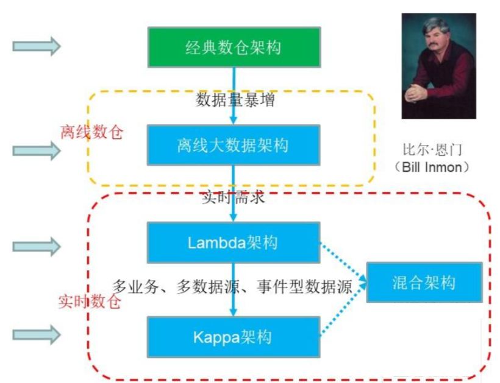
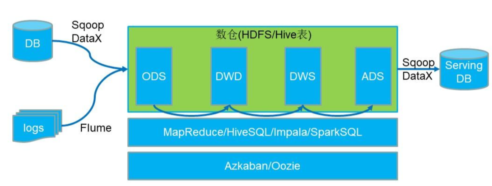
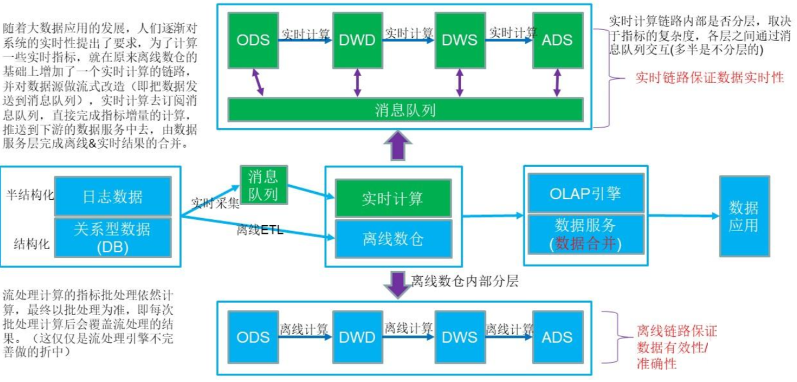
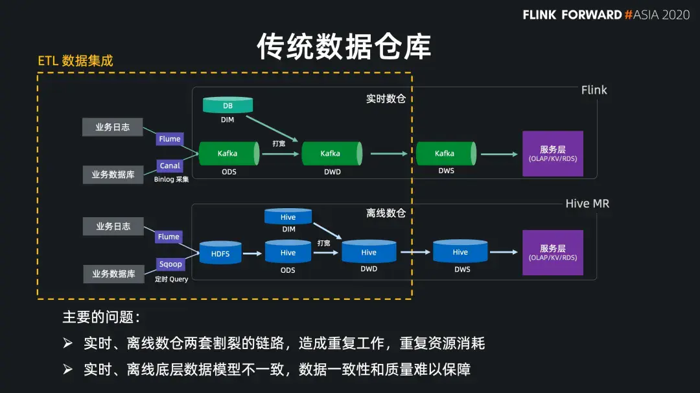
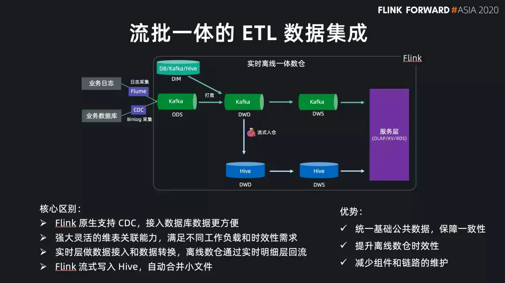
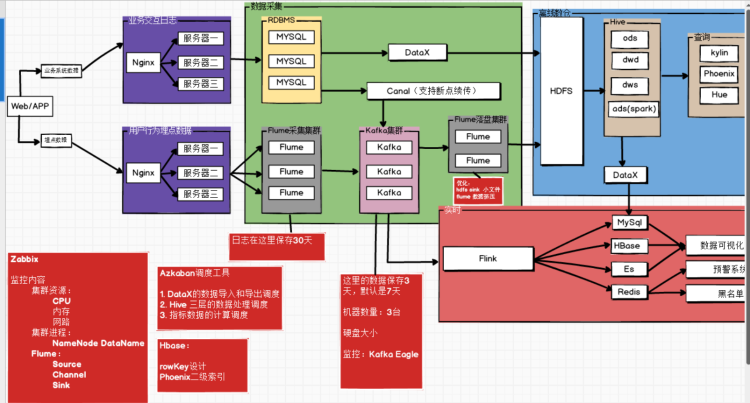
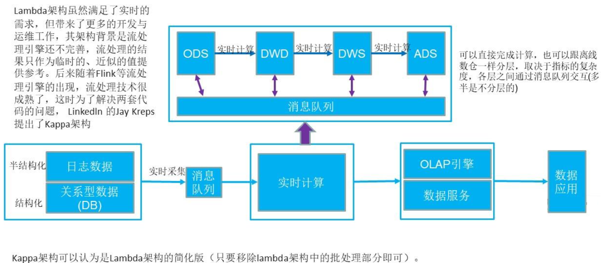
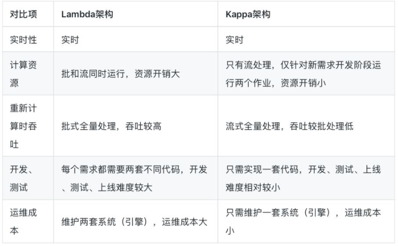
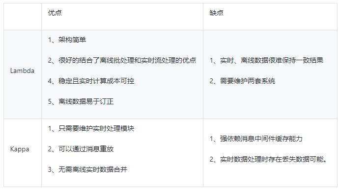

## 数仓架构演进

数仓架构演进，从一开始的离线数仓，到带实时数仓的Lambda架构，再到流批一体的Kappa架构，最终发展到多引擎混用。

## 离线数仓架构

## Lambda

### Lambda架构基本介绍

- lambda架构最早是由storm的创始人，Nathan Marz进行提出并描述了我们目前所了解的lambda架构。
- lamda架构先为主，已经适用在了绝大部分的公司里面了。绝大部分公司从刚开始发展大数据技术为主，到现在都是采用的lamda架构。
- lamda架构说白了就是公司的离线和实时处理技术走两条线，离线的专门做离线数据处理（例如使用hive，impala，presto，sparkSQL等各种OLAP的技术框架），实时的就专门使用实时处理技术（例如storm，sparkStreaming，flink流处理程序等）。

Lambda架构经历多年的发展，其优点是稳定，对于实时计算部分的计算成本可控，批量处理可以用晚上的时间来整体批量计算，这样把实时计算和离线计算高峰分开，这种架构支撑了数据行业的早期发展，但是它也有一些致命缺点，并在大数据3.0时代越来越不适应数据分析业务的需求。

**缺点如下：**

- 实时与批量计算结果不一致引起的数据口径问题：因为批量和实时计算走的是两个计算框架和计算程序，算出的结果往往不同，经常看到一个数字当天看是一个数据，第二天看昨天的数据反而发生了变化。
- 批量计算在计算窗口内无法完成：在IOT时代，数据量级越来越大，经常发现夜间只有4、5个小时的时间窗口，已经无法完成白天20多个小时累计的数据，保证早上上班前准时出数据已成为每个大数据团队头疼的问题。
- 数据源变化需要重新开发，开发周期长：每次数据源的格式变化、业务的逻辑变化都需要针对ETL和Streaming做开发修改，整体开发周期很长，业务反应不够迅速。
- 服务器存储大：数据仓库的典型设计，会产生大量的中间结果表，造成数据急速膨胀，加大服务器存储压力。

### 概念架构

### 传统架构

### 基于Flink新型架构

### 新型架构的具体实现

## Kappa

### Kappa架构基本介绍

- 针对Lambda架构的需要维护两套程序等以上缺点，LinkedIn的Jay Kreps结合实际经验和个人体会提出了Kappa架构。
- Kappa架构的核心思想是通过改进流计算系统来解决数据全量处理的问题，使得实时计算和批处理过程使用同一套代码。
- 此外Kappa架构认为只有在有必要的时候才会对历史数据进行重复计算，而如果需要重复计算时，Kappa架构下可以启动很多个实例进行重复计算。

**Kappa架构的核心思想：**

- 用Kafka或者类似MQ队列系统收集各种各样的数据，需要几天的数据量就保存几天。
- 当需要全量重新计算时，重新起一个流计算实例，从头开始进行处理，并输出到一个新的结果存储中。
- 当新的实例做完后，停止老的流计算实例，并把老的一些结果删除。

Kappa架构的优点在于统一了实时和离线代码，方便维护、统一了数据口径的问题。而**Kappa的缺点也很明显**：

- 流式处理对于历史数据的高吞吐量力不从心：所有的数据都通过流式计算，即便通过加大并发实例数亦很难适应IOT时代对数据查询响应的即时性要求。
- 开发周期长：Kappa架构下由于采集的数据格式的不统一，每次都需要开发不同的Streaming程序，导致开发周期长。
- 服务器成本浪费：Kappa架构的核心原理依赖于外部高性能存储redis、hbase服务。但是这2种系统组件，又并非设计来满足全量数据存储设计，对服务器成本严重浪费。

### 概念架构

## 对比

