# 第1章 电商业务简介

## 1.1 电商业务流程

电商的业务流程可以以一个普通用户的浏览足迹为例进行说明，用户点开电商首页开始浏览，可能会通过分类查询也可能通过全文搜索寻找自己中意的商品，这些商品无疑都是存储在后台的管理系统中的。

当用户寻找到自己中意的商品，可能会想要购买，将商品添加到购物车后发现需要登录，登录后对商品进行结算，这时候购物车的管理和商品订单信息的生成都会对业务数据库产生影响，会生成相应的订单数据和支付数据。

订单正式生成之后，还会对订单进行跟踪处理，直到订单全部完成。

电商的主要业务流程包括用户前台浏览商品时的商品详情的管理，用户商品加入购物车进行支付时用户个人中心&支付服务的管理，用户支付完成后订单后台服务的管理，这些流程涉及到了十几个甚至几十个业务数据表，甚至更多。

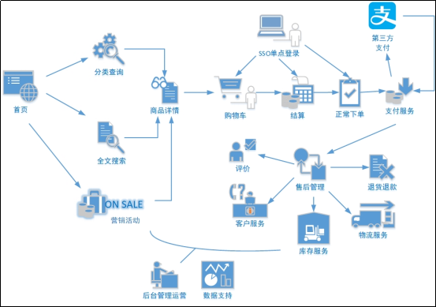 

## 1.2 电商常识

### 1.2.1 SKU和SPU

 SKU = Stock Keeping Unit（库存量基本单位）。现在已经被引申为产品统一编号的简称，每种产品均对应有唯一的SKU号。

 SPU（Standard Product Unit）：是商品信息聚合的最小单位，是一组可复用、易检索的标准化信息集合。

例如：iPhoneX手机就是SPU。一台银色、128G内存的、支持联通网络的iPhoneX，就是SKU。

 

SPU表示一类商品。同一SPU的商品可以共用商品图片、海报、销售属性等。

### 1.2.2 平台属性和销售属性

1）平台属性

 

2）销售属性

 

# 第2章 业务数据介绍

## 2.1 电商系统表结构

以下为本电商数仓系统涉及到的业务数据表结构关系。这34个表以订单表、用户表、SKU商品表、活动表和优惠券表为中心，延伸出了优惠券领用表、支付流水表、活动订单表、订单详情表、订单状态表、商品评论表、编码字典表退单表、SPU商品表等，用户表提供用户的详细信息，支付流水表提供该订单的支付详情，订单详情表提供订单的商品数量等情况，商品表给订单详情表提供商品的详细信息。本次讲解以此34个表为例，实际项目中，业务数据库中表格远远不止这些。

### 2.1.1 活动信息表（activity_info）

| 字段名        | 字段说明                     |
| ------------- | ---------------------------- |
| id            | 活动ID                       |
| activity_name | 活动名称                     |
| activity_type | 活动类型（1：满减，2：折扣） |
| activity_desc | 活动描述                     |
| start_time    | 开始时间                     |
| end_time      | 结束时间                     |
| create_time   | 创建时间                     |
| operate_time  | 修改时间                     |

### 2.1.2 活动规则表（activity_rule）

| id               | 编号     |
| ---------------- | -------- |
| activity_id      | 活动ID   |
| activity_type    | 活动类型 |
| condition_amount | 满减金额 |
| condition_num    | 满减件数 |
| benefit_amount   | 优惠金额 |
| benefit_discount | 优惠折扣 |
| benefit_level    | 优惠级别 |
| create_time      | 创建时间 |
| operate_time     | 修改时间 |

### 2.1.3 活动商品关联表（activity_sku）

| 字段名      | 字段说明 |
| ----------- | -------- |
| id          | 编号     |
| activity_id | 活动ID   |
| sku_id      | SKU_ID   |
| create_time | 创建时间 |

### 2.1.4 平台属性表（base_attr_info）

| 字段名         | 字段说明 |
| -------------- | -------- |
| id             | 编号     |
| attr_name      | 属性名称 |
| category_id    | 品类ID   |
| category_level | 品类层级 |

### 2.1.5 平台属性值表（base_attr_value）

| 字段名     | 字段说明   |
| ---------- | ---------- |
| id         | 编号       |
| value_name | 属性值名称 |
| attr_id    | 属性ID     |

### 2.1.6 一级分类表（base_category1）

| 字段名       | 字段说明     |
| ------------ | ------------ |
| id           | 一级品类ID   |
| name         | 一级品类名称 |
| create_time  | 创建时间     |
| operate_time | 修改时间     |

### 2.1.7 二级分类表（base_category2）

| 字段名       | 字段说明     |
| ------------ | ------------ |
| id           | 二级品类ID   |
| name         | 二级品类名称 |
| category1_id | 一级品类ID   |
| create_time  | 创建时间     |
| operate_time | 修改时间     |

### 2.1.8 三级分类表（base_category3）

| 字段名       | 字段说明     |
| ------------ | ------------ |
| id           | 三级品类ID   |
| name         | 三级品类名称 |
| category2_id | 二级品类ID   |
| create_time  | 创建时间     |
| operate_time | 修改时间     |

### 2.1.9 字典表（base_dic）

| 字段名       | 字段说明 |
| ------------ | -------- |
| dic_code     | 编号     |
| dic_name     | 编码名称 |
| parent_code  | 父编号   |
| create_time  | 创建日期 |
| operate_time | 修改日期 |

### 2.1.10 省份表（base_province）

| 字段名       | 字段说明             |
| ------------ | -------------------- |
| id           | 省份ID               |
| name         | 省份名称             |
| region_id    | 地区ID               |
| area_code    | 行政区位码           |
| iso_code     | 旧版国际标准地区编码 |
| iso_3166_2   | 新版国际标准地区编码 |
| create_time  | 创建时间             |
| operate_time | 修改时间             |

### 2.1.11 地区表（base_region）

| 字段名       | 字段说明 |
| ------------ | -------- |
| id           | 地区ID   |
| region_name  | 地区名称 |
| create_time  | 创建时间 |
| operate_time | 修改时间 |

### 2.1.12 品牌表（base_trademark）

| 字段名       | 字段说明           |
| ------------ | ------------------ |
| id           | 品牌ID             |
| tm_name      | 品牌名称           |
| logo_url     | 品牌LOGO的图片路径 |
| create_time  | 创建时间           |
| operate_time | 修改时间           |

### 2.1.13 购物车表（cart_info）

| 字段名       | 字段说明         |
| ------------ | ---------------- |
| id           | 编号             |
| user_id      | 用户ID           |
| sku_id       | SKU_ID           |
| cart_price   | 放入购物车时价格 |
| sku_num      | 数量             |
| img_url      | 图片连接         |
| sku_name     | SKU名称 (冗余)   |
| is_checked   | 是否被选中       |
| create_time  | 创建时间         |
| operate_time | 修改时间         |
| is_ordered   | 是否已下单       |
| order_time   | 下单时间         |
| source_type  | 来源类型         |
| source_id    | 来源编号         |

### 2.1.14 评价表（comment_info）

| 字段名       | 字段说明                  |
| ------------ | ------------------------- |
| id           | 编号                      |
| user_id      | 用户ID                    |
| nick_name    | 用户昵称                  |
| head_img     | 图片                      |
| sku_id       | 商品SKU_ID                |
| spu_id       | 商品SPU_ID                |
| order_id     | 订单ID                    |
| appraise     | 评价 1 好评 2 中评 3 差评 |
| comment_txt  | 评价内容                  |
| create_time  | 创建时间                  |
| operate_time | 修改时间                  |

### 2.1.15 优惠券信息表（coupon_info）

| 字段名           | 字段说明                                            |
| ---------------- | --------------------------------------------------- |
| id               | 购物券编号                                          |
| coupon_name      | 购物券名称                                          |
| coupon_type      | 购物券类型 1 现金券 2 折扣券 3 满减券 4 满件打折券  |
| condition_amount | 满额数                                              |
| condition_num    | 满件数                                              |
| activity_id      | 活动编号                                            |
| benefit_amount   | 减免金额                                            |
| benefit_discount | 折扣                                                |
| create_time      | 创建时间                                            |
| range_type       | 范围类型 1、商品(spuid) 2、品类(三级分类id) 3、品牌 |
| limit_num        | 最多领用次数                                        |
| taken_count      | 已领用次数                                          |
| start_time       | 可以领取的开始时间                                  |
| end_time         | 可以领取的结束时间                                  |
| operate_time     | 修改时间                                            |
| expire_time      | 过期时间                                            |
| range_desc       | 范围描述                                            |

### 2.1.16 优惠券优惠范围表（coupon_range）

| 字段名     | 字段说明                                            |
| ---------- | --------------------------------------------------- |
| id         | 编号                                                |
| coupon_id  | 优惠券ID                                            |
| range_type | 范围类型 1、商品(spuid) 2、品类(三级分类id) 3、品牌 |
| range_id   | 范围ID                                              |

### 2.1.17 优惠券领用表（coupon_use）

| 字段名        | 字段说明                          |
| ------------- | --------------------------------- |
| id            | 编号                              |
| coupon_id     | 购物券ID                          |
| user_id       | 用户ID                            |
| order_id      | 订单ID                            |
| coupon_status | 购物券状态（1：未使用 2：已使用） |
| get_time      | 获取时间                          |
| using_time    | 使用时间                          |
| used_time     | 支付时间                          |
| expire_time   | 过期时间                          |

### 2.1.18 收藏表（favor_info）

| 字段名       | 字段说明                   |
| ------------ | -------------------------- |
| id           | 编号                       |
| user_id      | 用户ID                     |
| sku_id       | SKU_ID                     |
| spu_id       | SPU_ID                     |
| is_cancel    | 是否已取消 0 正常 1 已取消 |
| create_time  | 创建时间                   |
| operate_time | 修改时间                   |

### 2.1.19 订单明细表（order_detail）

| 字段名                | 字段说明                 |
| --------------------- | ------------------------ |
| id                    | 编号                     |
| order_id              | 订单ID                   |
| sku_id                | SKU_ID                   |
| sku_name              | SKU名称（冗余)           |
| img_url               | 图片链接（冗余)          |
| order_price           | 购买价格(下单时sku价格） |
| sku_num               | 购买个数                 |
| create_time           | 创建时间                 |
| source_type           | 来源类型                 |
| source_id             | 来源编号                 |
| split_total_amount    | 分摊总金额               |
| split_activity_amount | 分摊活动减免金额         |
| split_coupon_amount   | 分摊优惠券减免金额       |
| operate_time          | 修改时间                 |

### 2.1.20 订单明细活动关联表（order_detail_activity）

| 字段名           | 字段说明   |
| ---------------- | ---------- |
| id               | 编号       |
| order_id         | 订单ID     |
| order_detail_id  | 订单明细ID |
| activity_id      | 活动ID     |
| activity_rule_id | 活动规则ID |
| sku_id           | SKU_ID     |
| create_time      | 创建时间   |
| operate_time     | 修改时间   |

### 2.1.21 订单明细优惠券关联表（order_detail_coupon）

| 字段名          | 字段说明     |
| --------------- | ------------ |
| id              | 编号         |
| order_id        | 订单ID       |
| order_detail_id | 订单明细ID   |
| coupon_id       | 购物券ID     |
| coupon_use_id   | 购物券领用ID |
| sku_id          | SKU_ID       |
| create_time     | 获取时间     |
| operate_time    | 修改时间     |

### 2.1.22 订单表(order_info）

| 字段名                 | 字段说明                    |
| ---------------------- | --------------------------- |
| id                     | 编号                        |
| consignee              | 收货人                      |
| consignee_tel          | 收件人电话                  |
| total_amount           | 总金额                      |
| order_status           | 订单状态                    |
| user_id                | 用户ID                      |
| payment_way            | 付款方式                    |
| delivery_address       | 送货地址                    |
| order_comment          | 订单备注                    |
| out_trade_no           | 订单交易编号（第三方支付用) |
| trade_body             | 订单描述(第三方支付用)      |
| create_time            | 创建时间                    |
| operate_time           | 修改时间                    |
| expire_time            | 失效时间                    |
| process_status         | 进度状态                    |
| tracking_no            | 物流单编号                  |
| parent_order_id        | 父订单编号                  |
| img_url                | 图片路径                    |
| province_id            | 省份ID                      |
| activity_reduce_amount | 活动减免金额                |
| coupon_reduce_amount   | 优惠券减免金额              |
| original_total_amount  | 原价金额                    |
| feight_fee             | 运费金额                    |
| feight_fee_reduce      | 运费减免金额                |
| refundable_time        | 可退款时间（签收后30天）    |

### 2.1.23 退单表（order_refund_info）

| 字段名             | 字段说明                        |
| ------------------ | ------------------------------- |
| id                 | 编号                            |
| user_id            | 用户ID                          |
| order_id           | 订单ID                          |
| sku_id             | SKU_ID                          |
| refund_type        | 退款类型                        |
| refund_num         | 退货件数                        |
| refund_amount      | 退款金额                        |
| refund_reason_type | 原因类型                        |
| refund_reason_txt  | 原因内容                        |
| refund_status      | 退款状态（0：待审批 1：已退款） |
| create_time        | 创建时间                        |
| operate_time       | 修改时间                        |

### 2.1.24 订单状态流水表（order_status_log）

| 字段名       | 字段说明 |
| ------------ | -------- |
| id           | 编号     |
| order_id     | 订单编号 |
| order_status | 订单状态 |
| create_time  | 创建时间 |
| operate_time | 修改时间 |

### 2.1.25 支付表（payment_info）

| 字段名           | 字段说明                |
| ---------------- | ----------------------- |
| id               | 编号                    |
| out_trade_no     | 对外业务编号            |
| order_id         | 订单编号                |
| user_id          | 用户ID                  |
| payment_type     | 支付类型（微信 支付宝） |
| trade_no         | 交易编号                |
| total_amount     | 支付金额                |
| subject          | 交易内容                |
| payment_status   | 支付状态                |
| create_time      | 创建时间                |
| callback_time    | 回调时间                |
| callback_content | 回调信息                |
| operate_time     | 修改时间                |

### 2.1.26 退款表（refund_payment）

| 字段名           | 字段说明                |
| ---------------- | ----------------------- |
| id               | 编号                    |
| out_trade_no     | 对外业务编号            |
| order_id         | 订单编号                |
| sku_id           | SKU_ID                  |
| payment_type     | 支付类型（微信 支付宝） |
| trade_no         | 交易编号                |
| total_amount     | 退款金额                |
| subject          | 交易内容                |
| refund_status    | 退款状态                |
| create_time      | 创建时间                |
| callback_time    | 回调时间                |
| callback_content | 回调信息                |
| operate_time     | 修改时间                |

### 2.1.27 SKU平台属性表（sku_attr_value）

| 字段名       | 字段说明      |
| ------------ | ------------- |
| id           | 编号          |
| attr_id      | 属性ID（冗余) |
| value_id     | 属性值ID      |
| sku_id       | SKU_ID        |
| attr_name    | 属性名称      |
| value_name   | 属性值名称    |
| create_time  | 创建时间      |
| operate_time | 修改时间      |

### 2.1.28 SKU信息表（sku_info）

| 字段名          | 字段说明                |
| --------------- | ----------------------- |
| id              | SKU_ID                  |
| spu_id          | SPU_ID                  |
| price           | 价格                    |
| sku_name        | SKU名称                 |
| sku_desc        | 商品规格描述            |
| weight          | 重量                    |
| tm_id           | 品牌ID(冗余)            |
| category3_id    | 三级品类ID（冗余)       |
| sku_default_img | 默认显示图片(冗余)      |
| is_sale         | 是否销售（1：是 0：否） |
| create_time     | 创建时间                |
| operate_time    | 修改时间                |

### 2.1.29 SKU销售属性表（sku_sale_attr_value）

| 字段名               | 字段说明       |
| -------------------- | -------------- |
| id                   | 编号           |
| sku_id               | SKU_ID         |
| spu_id               | SPU_ID（冗余） |
| sale_attr_value_id   | 销售属性值ID   |
| sale_attr_id         | 销售属性ID     |
| sale_attr_name       | 销售属性名称   |
| sale_attr_value_name | 销售属性值名称 |
| create_time          | 创建时间       |
| operate_time         | 修改时间       |

### 2.1.30 SPU信息表（spu_info）

| 字段名       | 字段说明            |
| ------------ | ------------------- |
| id           | SPU_ID              |
| spu_name     | SPU名称             |
| description  | 商品描述(后台简述） |
| category3_id | 三级品类ID          |
| tm_id        | 品牌ID              |
| create_time  | 创建时间            |
| operate_time | 修改时间            |

### 2.1.31 SPU销售属性表（spu_sale_attr）

| 字段名            | 字段说明             |
| ----------------- | -------------------- |
| id                | 编号（业务中无关联） |
| spu_id            | SPU_ID               |
| base_sale_attr_id | 销售属性ID           |
| sale_attr_name    | 销售属性名称（冗余） |
| create_time       | 创建时间             |
| operate_time      | 修改时间             |

### 2.1.32 SPU销售属性值表（spu_sale_attr_value）

| 字段名               | 字段说明             |
| -------------------- | -------------------- |
| id                   | 销售属性值编号       |
| spu_id               | SPU_ID               |
| base_sale_attr_id    | 销售属性ID           |
| sale_attr_value_name | 销售属性值名称       |
| sale_attr_name       | 销售属性名称（冗余） |
| create_time          | 创建时间             |
| operate_time         | 修改时间             |

### 2.1.33 用户地址表（user_address）

| 字段名       | 字段说明   |
| ------------ | ---------- |
| id           | 编号       |
| user_id      | 用户ID     |
| province_id  | 省份ID     |
| user_address | 用户地址   |
| consignee    | 收件人     |
| phone_num    | 联系方式   |
| is_default   | 是否是默认 |
| create_time  | 创建时间   |
| operate_time | 修改时间   |

### 2.1.34 用户信息表（user_info）

| 字段名       | 字段说明     |
| ------------ | ------------ |
| id           | 编号         |
| login_name   | 用户名称     |
| nick_name    | 用户昵称     |
| passwd       | 用户密码     |
| name         | 用户姓名     |
| phone_num    | 手机号       |
| email        | 邮箱         |
| head_img     | 头像         |
| user_level   | 用户级别     |
| birthday     | 用户生日     |
| gender       | 性别 M男,F女 |
| create_time  | 创建时间     |
| operate_time | 修改时间     |
| status       | 状态         |

### 2.1.35 营销坑位表（promotion_pos）

| 字段名         | 字段说明     |
| -------------- | ------------ |
| id             | 营销坑位ID   |
| pos_location   | 营销坑位位置 |
| pos_type       | 营销坑位类型 |
| promotion_type | 营销类型     |
| create_time    | 创建时间     |
| operate_time   | 修改时间     |

### 2.1.36 营销渠道表（promotion_refer）

| 字段名       | 字段说明     |
| ------------ | ------------ |
| id           | 营销渠道ID   |
| refer_name   | 营销渠道名称 |
| create_time  | 创建时间     |
| operate_time | 修改时间     |

 

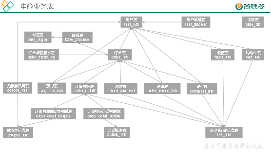

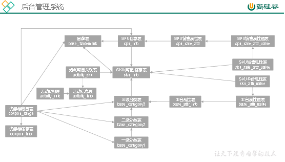

## 2.2 数据模拟

### 2.2.1 MySQL安装

#### 2.2.1.1 安装包准备

1）将资料里mysql文件夹及里面所有内容上传到/opt/software/mysql目录下

```
[atguigu@hadoop102~]# mkdir /opt/software/mysql
[atguigu@hadoop102 software]$ cd /opt/software/mysql/

install_mysql.sh
mysql-community-client-8.0.31-1.el7.x86_64.rpm
mysql-community-client-plugins-8.0.31-1.el7.x86_64.rpm
mysql-community-common-8.0.31-1.el7.x86_64.rpm
mysql-community-icu-data-files-8.0.31-1.el7.x86_64.rpm
mysql-community-libs-8.0.31-1.el7.x86_64.rpm
mysql-community-libs-compat-8.0.31-1.el7.x86_64.rpm
mysql-community-server-8.0.31-1.el7.x86_64.rpm
mysql-connector-j-8.0.31.jar
```

#### 2.2.1.2 安装MySQL

1）如果是阿里云服务器按照如下步骤执行

说明：由于阿里云服务器安装的是Linux最小系统版，没有如下工具，所以需要安装。

（1）卸载MySQL依赖，虽然机器上没有装MySQL，但是这一步不可少

```
[atguigu@hadoop102 mysql]# sudo yum remove mysql-libs
```

（2）下载依赖并安装

```
[atguigu@hadoop102 mysql]# sudo yum install libaio
[atguigu@hadoop102 mysql]# sudo yum -y install autoconf
```

2）切换到hadoop102的root用户

```
[atguigu@hadoop102 mysql]$ su root
```

3）执行/opt/software/mysql/目录下install_mysql.sh

```
[root@hadoop102 mysql]# vim install_mysql.sh

#!/bin/bash
set -x
[ "$(whoami)" = "root" ] || exit 1
[ "$(ls .rpm | wc -l)" = "7" ] || exit 1
test -f mysql-community-client-8.0.31-1.el7.x86_64.rpm && 
test -f mysql-community-client-plugins-8.0.31-1.el7.x86_64.rpm && 
test -f mysql-community-common-8.0.31-1.el7.x86_64.rpm && 
test -f mysql-community-icu-data-files-8.0.31-1.el7.x86_64.rpm && 
test -f mysql-community-libs-8.0.31-1.el7.x86_64.rpm && 
test -f mysql-community-libs-compat-8.0.31-1.el7.x86_64.rpm && 
test -f mysql-community-server-8.0.31-1.el7.x86_64.rpm || exit 1

# 卸载MySQL
systemctl stop mysql mysqld 2>/dev/null
rpm -qa | grep -i 'mysql|mariadb' | xargs -n1 rpm -e --nodeps 2>/dev/null
rm -rf /var/lib/mysql /var/log/mysqld.log /usr/lib64/mysql /etc/my.cnf /usr/my.cnf

set -e
# 安装并启动MySQL
yum install -y .rpm >/dev/null 2>&1
systemctl start mysqld

#更改密码级别并重启MySQL
sed -i '/[mysqld]/avalidate_password.length=4nvalidate_password.policy=0' /etc/my.cnf
systemctl restart mysqld

# 更改MySQL配置
tpass=$(cat /var/log/mysqld.log | grep "temporary password" | awk '{print $NF}')
cat << EOF | mysql -uroot -p"${tpass}" --connect-expired-password >/dev/null 2>&1
set password='000000';
update mysql.user set host='%' where user='root';
alter user 'root'@'%' identified with mysql_native_password by '000000';
flush privileges;
EOF
```

执行脚本。

```
[root@hadoop102 mysql]# sh install_mysql.sh
```

4）退出root用户到atguigu用户

```
[root@hadoop102 mysql]# exit
```

### 2.2.2 连接MySQL

通过MySQL可视化客户端连接数据库。

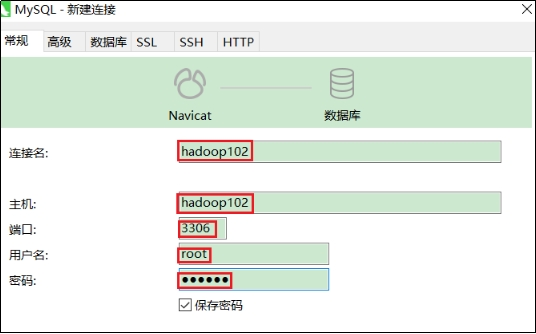 

### 2.2.3 建表语句

1）通过Navicat创建数据库

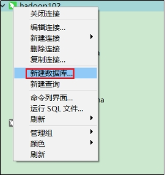 

2）设置数据库名称为gmall，编码为utf8mb4，排序规则为utf8mb4_general_ci

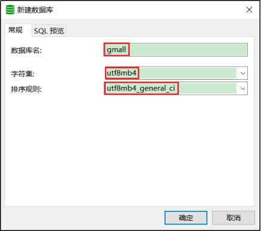 

3）导入数据库结构脚本（gmall.sql）

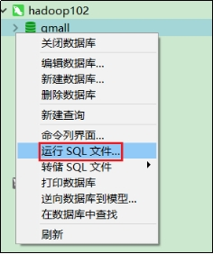 

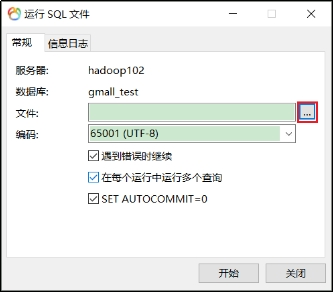 

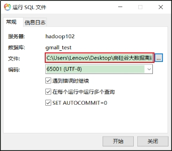 

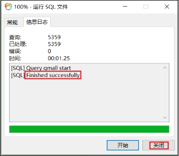 

### 2.2.4 业务数据建模

可借助EZDML这款数据库设计工具，来辅助我们梳理复杂的业务表关系。

1）下载地址

http://www.ezdml.com/download_cn.html

2）使用说明

（1）新建模型

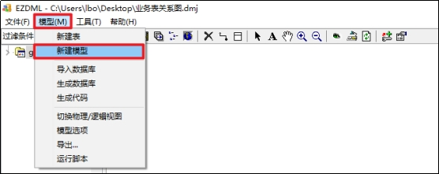 

（2）命名模型

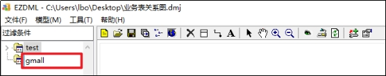 

（3）点击图标，选中模型

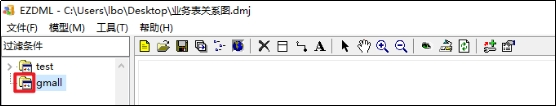 

（4）导入数据库

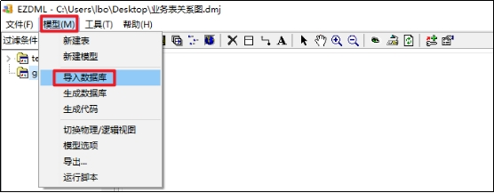 

（5）配置数据库连接

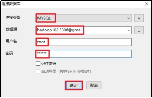 

（6）选择导入的表（标注红点的表不需要导入）

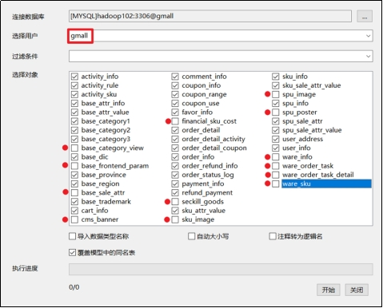 

（7）建立表关系

第一步：点击选中主表（主键所在的表）

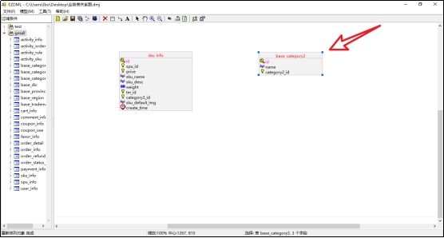 

第二步：点击连接按钮

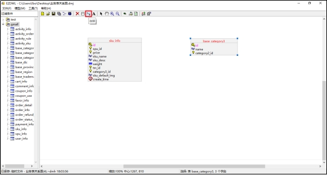 

第三步：点击从表，配置连接条件

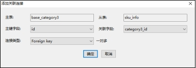 

第四步：效果展示

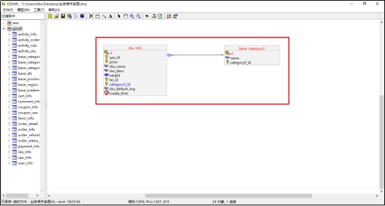 

3）使用技巧

（1）缩略图

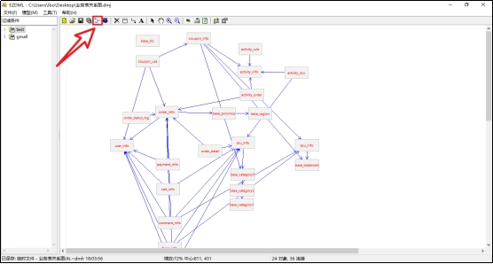 

（2）热键

按住shift键，用鼠标点击表，进行多选，可实现批量移动。

按住ctrl键，用鼠标圈选表，也可进行多选，实现批量移。

# 第3章 业务数据采集模块

## 3.1 采集通道

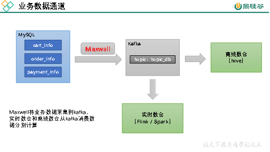

## 3.2 采集工具

### 3.2.1 Maxwell简介

#### 3.2.1.1 Maxwell概述

Maxwell 是由美国Zendesk公司开源，用Java编写的MySQL变更数据抓取软件。它会实时监控MySQL数据库的数据变更操作（包括insert、update、delete），并将变更数据以 JSON 格式发送给 Kafka、Kinesi等流数据处理平台。官网地址：http://maxwells-daemon.io/

#### 3.2.1.2 Maxwell输出数据格式

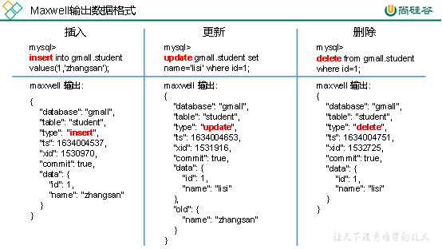

注：Maxwell输出的json字段说明：

| 字段     | 解释                                                         |
| -------- | ------------------------------------------------------------ |
| database | 变更数据所属的数据库                                         |
| table    | 表更数据所属的表                                             |
| type     | 数据变更类型                                                 |
| ts       | 数据变更发生的时间                                           |
| xid      | 事务id                                                       |
| commit   | 事务提交标志，可用于重新组装事务                             |
| data     | 对于insert类型，表示插入的数据；对于update类型，标识修改之后的数据；对于delete类型，表示删除的数据 |
| old      | 对于update类型，表示修改之前的数据，只包含变更字段           |

### 3.2.2 Maxwell原理

Maxwell的工作原理是实时读取MySQL数据库的二进制日志（Binlog），从中获取变更数据，再将变更数据以JSON格式发送至Kafka等流处理平台。

#### 3.2.2.1 MySQL二进制日志

二进制日志（Binlog）是MySQL服务端非常重要的一种日志，它会保存MySQL数据库的所有数据变更记录。Binlog的主要作用包括主从复制和数据恢复。Maxwell的工作原理和主从复制密切相关。

#### 3.2.2.2 MySQL主从复制

MySQL的主从复制，就是用来建立一个和主数据库完全一样的数据库环境，这个数据库称为从数据库。

1）主从复制的应用场景如下

（1）做数据库的热备：主数据库服务器故障后，可切换到从数据库继续工作。

（2）读写分离：主数据库只负责业务数据的写入操作，而多个从数据库只负责业务数据的查询工作，在读多写少场景下，可以提高数据库工作效率。

2）主从复制的工作原理如下

（1）Master主库将数据变更记录，写到二进制日志（binary log）中

（2）Slave从库向mysql master发送dump协议，将master主库的binary log events拷贝到它的中继日志（relay log）

（3）Slave从库读取并回放中继日志中的事件，将改变的数据同步到自己的数据库

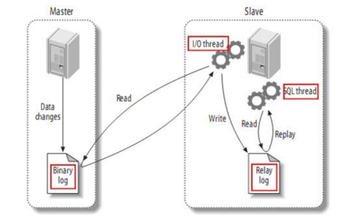 

#### 3.2.2.3 Maxwell原理

很简单，就是将自己伪装成slave，并遵循MySQL主从复制的协议，从master同步数据。

### 3.2.3 Maxwell部署

#### 3.2.3.1 安装Maxwell

1）下载安装包

（1）地址：https://github.com/zendesk/maxwell/releases/download/v1.29.2/maxwell-1.29.2.tar.gz

注：Maxwell-1.30.0及以上版本不再支持JDK1.8。

（2）将安装包上传到hadoop102节点的/opt/software目录

2）将安装包解压至/opt/module

```shell
[atguigu@hadoop102 mysql]$ cd /opt/software/ 
[atguigu@hadoop102 software]$ tar -zxvf maxwell-1.29.2.tar.gz -C /opt/module/
```

3）修改名称

```shell
[atguigu@hadoop102 software]$ cd ../module/
[atguigu@hadoop102 module]$ mv maxwell-1.29.2/ maxwell
```

#### 3.2.3.2 配置MySQL

##### 3.2.3.2.1 启用MySQL Binlog

MySQL服务器的Binlog默认是未开启的，如需进行同步，需要先进行开启。

1）修改MySQL配置文件/etc/my.cnf

```shell
[atguigu@hadoop102 ~]$ sudo vim /etc/my.cnf
```

2）增加如下配置

```shell
#数据库id
server-id = 1
#启动binlog，该参数的值会作为binlog的文件名
log-bin=mysql-bin
#binlog类型，maxwell要求为row类型
binlog_format=row
#启用binlog的数据库，需根据实际情况作出修改
binlog-do-db=gmall
```

注：MySQL Binlog模式

Statement-based：基于语句，Binlog会记录所有写操作的SQL语句，包括insert、update、delete等。

优点：节省空间

缺点：有可能造成数据不一致，例如insert语句中包含now()函数。

Row-based：基于行，Binlog会记录每次写操作后被操作行记录的变化。

优点：保持数据的绝对一致性。

缺点：占用较大空间。

mixed：混合模式，默认是Statement-based，如果SQL语句可能导致数据不一致，就自动切换到Row-based。

Maxwell要求Binlog采用Row-based模式。

3）重启MySQL服务

```shell
[atguigu@hadoop102 ~]$ sudo systemctl restart mysqld
```

##### 3.2.3.2.2 创建Maxwell所需数据库和用户

Maxwell需要在MySQL中存储其运行过程中的所需的一些数据，包括binlog同步的断点位置（Maxwell支持断点续传）等等，故需要在MySQL为Maxwell创建数据库及用户。

1）创建数据库

```mysql
msyql> CREATE DATABASE maxwell;
```

2）创建Maxwell用户并赋予其必要权限

```mysql
mysql> CREATE USER 'maxwell'@'%' IDENTIFIED BY 'maxwell';
mysql> GRANT ALL ON maxwell.* TO 'maxwell'@'%';
mysql> GRANT SELECT, REPLICATION CLIENT, REPLICATION SLAVE ON *.* TO 'maxwell'@'%';
```

#### 3.2.3.3 配置Maxwell

1）修改Maxwell配置文件名称

```shell
[atguigu@hadoop102 maxwell]$ cd /opt/module/maxwell
[atguigu@hadoop102 maxwell]$ cp config.properties.example config.properties
```

2）修改Maxwell配置文件

```shell
[atguigu@hadoop102 maxwell]$ vim config.properties

#Maxwell数据发送目的地，可选配置有stdout|file|kafka|kinesis|pubsub|sqs|rabbitmq|redis
producer=kafka
# 目标Kafka集群地址
kafka.bootstrap.servers=hadoop102:9092,hadoop103:9092,hadoop104:9092
#目标Kafka topic，可静态配置，例如:maxwell，也可动态配置，例如：%{database}_%{table}
kafka_topic=topic_db

# MySQL相关配置
host=hadoop102
user=maxwell
password=maxwell
jdbc_options=useSSL=false&serverTimezone=Asia/Shanghai&allowPublicKeyRetrieval=true

# 过滤gmall中的z_log表数据，该表是日志数据的备份，无须采集
filter=exclude:gmall.z_log
# 指定数据按照主键分组进入Kafka不同分区，避免数据倾斜
producer_partition_by=primary_key
```

### 3.2.4 Maxwell使用

#### 3.2.4.1 启动Kafka集群

若Maxwell发送数据的目的地为Kafka集群，则需要先确保Kafka集群为启动状态。

#### 3.2.4.2 Maxwell启停 

1）启动Maxwell

```shell
[atguigu@hadoop102 ~]$ /opt/module/maxwell/bin/maxwell --config /opt/module/maxwell/config.properties --daemon
```

2）停止Maxwell

```shell
[atguigu@hadoop102 ~]$ ps -ef | grep com.zendesk.maxwell.Maxwell | grep -v grep | awk '{print $2}' | xargs kill -9
```

3）Maxwell启停脚本

（1）创建并编辑Maxwell启停脚本

```shell
[atguigu@hadoop102 bin]$ vim mxw.sh
```

（2）脚本内容如下

```shell
#!/bin/bash

MAXWELL_HOME=/opt/module/maxwell

status_maxwell(){
    result=`ps -ef | grep com.zendesk.maxwell.Maxwell | grep -v grep | wc -l`
    return $result
}


start_maxwell(){
    status_maxwell
    if [[ $? -lt 1 ]]; then
        echo "启动Maxwell"
        $MAXWELL_HOME/bin/maxwell --config $MAXWELL_HOME/config.properties --daemon
    else
        echo "Maxwell正在运行"
    fi
}


stop_maxwell(){
    status_maxwell
    if [[ $? -gt 0 ]]; then
        echo "停止Maxwell"
        ps -ef | grep com.zendesk.maxwell.Maxwell | grep -v grep | awk '{print $2}' | xargs kill -9
    else
        echo "Maxwell未在运行"
    fi
}


case $1 in
    start )
        start_maxwell
    ;;
    stop )
        stop_maxwell
    ;;
    restart )
       stop_maxwell
       start_maxwell
    ;;
esac
```

保存退出

```shell
:wq
```

（3）赋予权限

```shell
[atguigu@hadoop102 bin]$ chmod 777 mxw.sh
```

（4）启动Maxwell

```shell
[atguigu@hadoop102 bin]$ mxw.sh start
启动Maxwell
Redirecting STDOUT to /opt/module/maxwell/bin/../logs/MaxwellDaemon.out
Using kafka version: 1.0.0
```

查看进程

```shell
[atguigu@hadoop102 bin]$ jps
5813 Jps
3768 QuorumPeerMain
4251 Kafka
5725 Maxwell
```

（5）停止Maxwell

```shell
[atguigu@hadoop102 bin]$ mxw.sh stop
停止Maxwell
```

查看进程

```shell
[atguigu@hadoop102 bin]$ jps
5845 Jps
3768 QuorumPeerMain
4251 Kafka
```

#### 3.2.4.3 增量数据同步

1）启动Kafka消费者

```shell
[atguigu@hadoop102 bin]$ cd $KAFKA_HOME 
[atguigu@hadoop102 kafka]$ bin/kafka-console-consumer.sh --bootstrap-server hadoop102:9092 --topic topic_db
```

2）模拟生成数据

（1）修改application.yml

确保mysql url的数据库为gmall

```yaml
spring:
    datasource:
      type: com.alibaba.druid.pool.DruidDataSource
      druid:
        url: jdbc:mysql://hadoop102:3306/gmall?characterEncoding=utf-8&allowPublicKeyRetrieval=true&useSSL=false&serverTimezone=GMT%2B8
        username: root
        password: "000000"
        driver-class-name:  com.mysql.cj.jdbc.Driver
        max-active: 20
        test-on-borrow: true
```

（2）生成数据

```shell
[atguigu@hadoop102 applog]$ lg.sh
```

3）观察Kafka消费者

```json
{
    "database": "gmall",
    "table": "order_refund_info",
    "type": "update",
    "ts": 1675414185,
    "xid": 38713,
    "commit": true,
    "data": {
        "id": 6903,
        "user_id": 191,
        "order_id": 36103,
        "sku_id": 34,
        "refund_type": "1502",
        "refund_num": 1,
        "refund_amount": 3927,
        "refund_reason_type": "1301",
        "refund_reason_txt": "退款原因具体：0445847967",
        "refund_status": "0705",
        "create_time": "2022-06-14 11:00:53",
        "operate_time": "2022-06-14 12:00:58"
    },
    "old": {
        "refund_status": "1006",
        "operate_time": "2022-06-14 12:00:53"
    }
}
```

#### 3.2.4.4 历史数据全量同步

上一节，我们已经实现了使用Maxwell实时增量同步MySQL变更数据的功能。但有时只有增量数据是不够的，我们可能需要使用到MySQL数据库中从历史至今的一个完整的数据集。这就需要我们在进行增量同步之前，先进行一次历史数据的全量同步。这样就能保证得到一个完整的数据集。

##### 3.2.4.4.1 Maxwell-bootstrap

Maxwell提供了bootstrap功能来进行历史数据的全量同步，命令如下：

```shell
[atguigu@hadoop102 maxwell]$ /opt/module/maxwell/bin/maxwell-bootstrap --database gmall --table user_info --config /opt/module/maxwell/config.properties
```

##### 3.2.4.4.2 boostrap数据格式

采用bootstrap方式同步的输出数据格式如下：

```
{
    "database": "fooDB",
    "table": "barTable",
    "type": "bootstrap-start",
    "ts": 1450557744,
    "data": {}
}
{
    "database": "fooDB",
    "table": "barTable",
    "type": "bootstrap-insert",
    "ts": 1450557744,
    "data": {
        "txt": "hello"
    }
}
{
    "database": "fooDB",
    "table": "barTable",
    "type": "bootstrap-insert",
    "ts": 1450557744,
    "data": {
        "txt": "bootstrap!"
    }
}
{
    "database": "fooDB",
    "table": "barTable",
    "type": "bootstrap-complete",
    "ts": 1450557744,
    "data": {}
}
```

注意事项：

（1）第一条type为bootstrap-start和最后一条type为bootstrap-complete的数据，是bootstrap开始和结束的标志，不包含数据，中间的type为bootstrap-insert的数据才包含数据。

（2）一次bootstrap输出的所有记录的ts都相同，为bootstrap开始的时间。

## 3.3 采集通道Maxwell配置

（1）启动Zookeeper、Kafka集群及Maxwell

（2）启动一个Kafka Console Consumer，消费topic_db数据

```shell
[atguigu@hadoop102 maxwell]$ cd $KAFKA_HOME
[atguigu@hadoop103 kafka]$ bin/kafka-console-consumer.sh --bootstrap-server hadoop102:9092 --topic topic_db
```

（3）生成模拟数据

```shell
[atguigu@hadoop102 bin]$ lg.sh
```

（4）观察Kafka消费者是否能消费到数据

```json
{
    "database": "gmall",
    "table": "cart_info",
    "type": "update",
    "ts": 1592270938,
    "xid": 13090,
    "xoffset": 1573,
    "data": {
        "id": 100924,
        "user_id": "93",
        "sku_id": 16,
        "cart_price": 4488,
        "sku_num": 1,
        "img_url": "http://47.93.148.192:8080/group1/M00/00/02/rBHu8l-sklaALrngAAHGDqdpFtU741.jpg",
        "sku_name": "华为 HUAWEI P40 麒麟990 5G SoC芯片 5000万超感知徕卡三摄 30倍数字变焦 8GB+128GB亮黑色全网通5G手机",
        "is_checked": null,
        "create_time": "2022-06-08 09:28:57",
        "operate_time": null,
        "is_ordered": 1,
        "order_time": "2021-10-17 09:28:58",
        "source_type": "2401",
        "source_id": null
    },
    "old": {
        "is_ordered": 0,
        "order_time": null
    }
}
```

