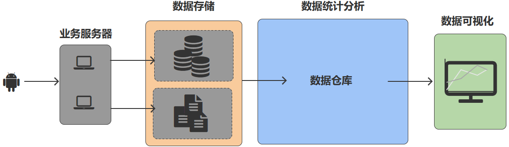
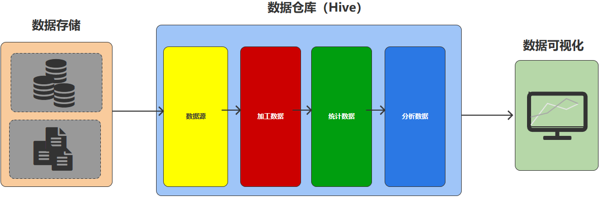
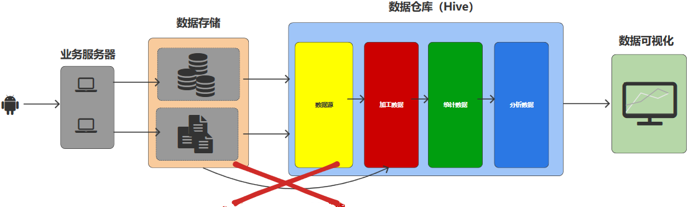
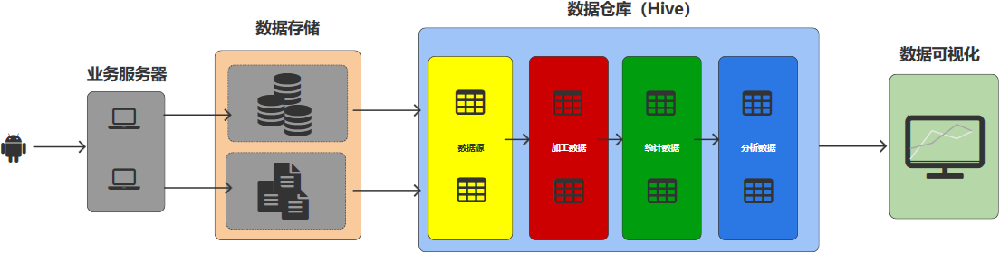
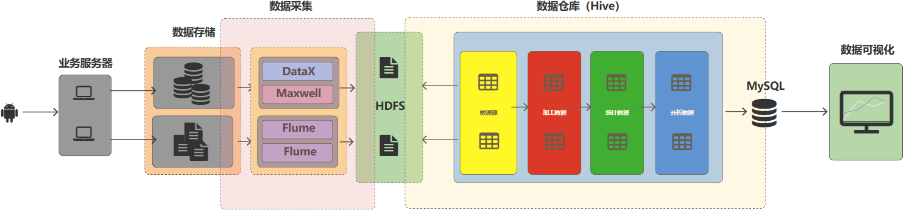

# 概念

## **采集项目和数据仓库项目的区别**

采集项目和数据仓库项目其实是企业中数据管理平台中的2个核心管理模块

采集项目和数据仓库项目其实具有独立性，可以分开来讲（开发）

1. 从功能的角度

   采集项目：以数据的采集，传输为主

   数据仓库项目：以数据的统计分析和计算为主，同时也能存储数据

2. 从技术的角度

   采集项目：Flume，Kafka，Datax，Maxwell

   数据仓库项目：Mysql，HDFS，Spark，Flink，MR，Hive

## **数据库 & 数据仓库**

1. 从名称上进行区分

   数据库：Database（存储基础，核心的数据）

   数据仓库：Data Warehouse（Warehous：货栈，大商店），以数据的计算为主，同时也能存储数据

2. 从数据来源进行区分

   数据库：企业中基础核心的业务数据

   数据仓库：数据库中的数据

3. 从数据存储进行区分

   数据库：核心作用就是查找业务数据，主要使用行式存储，和索引的方式存储数据，不能存储海量数据

   数据仓库：核心作用就是统计分析数据，使用列式存储（如：parquet，orc），可以存储海量数据

4. 从数据价值进行区分

   数据库：保障全企业全业务的正常运行

   数据仓库：将数据的统计结果为企业的经营决策提供数据支撑。注意：数据仓库不是数据流转的终点，需要将统计结果通过可视化平台呈现给客户，这个才是数据流转的终点

## **数据流转的过程**

## **数据仓库的核心功能：统计分析**

使用技术：Spark，MR，Flink，**SQL（主要使用）**

SQL 主要有两种方式

1. Spark On Hive：Spark解析SQL

2. Hive On Spark：Hive解析SQL（主要使用）

## **统计分析的基本步骤**

数据仓库也应该遵循这个步骤

如果将数据库（MySQL）直接作为数据仓库的数据源

1. 业务数据库的数据存储为行式存储，而是数据仓库的数据要求为列式存储

   数据不能直接对接 ：行式数据转换为列式数据

2. 业务数据库中存储的数据不是海量数据，但是数据仓库要求的数据必须是海量数据

   数据不能直接对接 ：数据量不够

3. 数据库不是为了数据仓库服务的

   数据仓库在对接数据库数据时，会对数据库的性能造成影响

数据仓库应该设计一个自己的数据源，为了代替和补充数据库。**数据存储应该是和数据库的同步（保持一致）的，并且进行汇总（数据库中的历史数据导入到数据仓库自己的数据源中）**

数据仓库的开发使用SQL语言进行处理，那么数据的处理步骤中需要将数据转换为**结构化数据：表**

数据仓库的数据源数据需要从数据库中周期性（天）同步过来，一般情况下，将这个同步过程，称之为**采集**

数据采集的时候，如果想要将数据同步到数据仓库的数据源，那么就必须知道数据源中的表结构，那么采集项目和数据仓库项目就存在耦合性，实际开发中，需要**将采集项目和数据仓库项目解耦合（增加中间件）**

## 数据同步的方式

全量数据同步：表的全部数据

增量数据同步：表的新增及变化的数据
