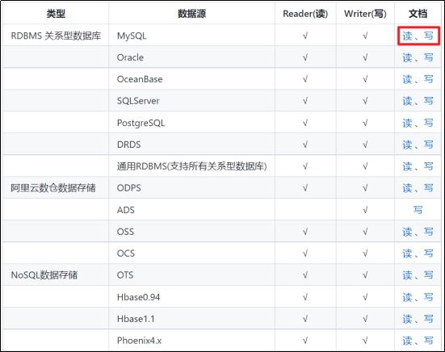

# 第1章 实时数仓同步数据

实时数仓由Flink源源不断从Kafka当中读数据计算，所以不需要手动同步数据到实时数仓。

# 第2章 离线数仓同步数据

## 2.1 用户行为数据同步

### 2.1.1 数据通道

用户行为数据由Flume从Kafka直接同步到HDFS，由于离线数仓采用Hive的分区表按天统计，所以目标路径要包含一层日期。具体数据流向如下图所示。


### 2.1.2 日志消费Flume配置概述

按照规划，该Flume需将Kafka中topic_log的数据发往HDFS。并且对每天产生的用户行为日志进行区分，将不同天的数据发往HDFS不同天的路径。

此处选择KafkaSource、FileChannel、HDFSSink。

关键配置如下：


### 2.1.3 日志消费Flume配置实操

1）创建Flume配置文件

在hadoop104节点的Flume家目录下创建job目录，在job下创建kafka_to_hdfs_log.conf

```shell
[atguigu@hadoop104 ~]$ cd /opt/module/flume/
[atguigu@hadoop104 flume]$ mkdir job 
[atguigu@hadoop104 flume]$ vim job/kafka_to_hdfs_log.conf 
```

2）配置文件内容如下

#定义组件

```shell
#定义组件
a1.sources=r1
a1.channels=c1
a1.sinks=k1

#配置source1
a1.sources.r1.type = org.apache.flume.source.kafka.KafkaSource
a1.sources.r1.batchSize = 5000
a1.sources.r1.batchDurationMillis = 2000
a1.sources.r1.kafka.bootstrap.servers = hadoop102:9092,hadoop103:9092,hadoop104:9092
a1.sources.r1.kafka.topics=topic_log
a1.sources.r1.interceptors = i1
a1.sources.r1.interceptors.i1.type = com.atguigu.gmall.flume.interceptor.TimestampInterceptor$Builder

#配置channel
a1.channels.c1.type = file
a1.channels.c1.checkpointDir = /opt/module/flume/checkpoint/behavior1
a1.channels.c1.dataDirs = /opt/module/flume/data/behavior1
a1.channels.c1.maxFileSize = 2146435071
a1.channels.c1.capacity = 1000000
a1.channels.c1.keep-alive = 6

#配置sink
a1.sinks.k1.type = hdfs
a1.sinks.k1.hdfs.path = /origin_data/gmall/log/topic_log/%Y-%m-%d
a1.sinks.k1.hdfs.filePrefix = log
a1.sinks.k1.hdfs.round = false


a1.sinks.k1.hdfs.rollInterval = 10
a1.sinks.k1.hdfs.rollSize = 134217728
a1.sinks.k1.hdfs.rollCount = 0

#控制输出文件类型
a1.sinks.k1.hdfs.fileType = CompressedStream
a1.sinks.k1.hdfs.codeC = gzip

#组装 
a1.sources.r1.channels = c1
a1.sinks.k1.channel = c1
```

3）FileChannel优化

通过配置dataDirs指向多个路径，每个路径对应不同的硬盘，增大Flume吞吐量。

官方说明如下：

```shell
Comma separated list of directories for storing log files. Using multiple directories on separate disks can improve file channel peformance
```

checkpointDir和backupCheckpointDir也尽量配置在不同硬盘对应的目录中，保证checkpoint坏掉后，可以快速使用backupCheckpointDir恢复数据

4）HDFS Sink优化

（1）HDFS存入大量小文件，有什么影响？

元数据层面：每个小文件都有一份元数据，其中包括文件路径，文件名，所有者，所属组，权限，创建时间等，这些信息都保存在Namenode内存中。所以小文件过多，会占用Namenode服务器大量内存，影响Namenode性能和使用寿命

计算层面：默认情况下MR会对每个小文件启用一个Map任务计算，非常影响计算性能。同时也影响磁盘寻址时间。

​	（2）HDFS小文件处理

官方默认的这三个参数配置写入HDFS后会产生小文件，hdfs.rollInterval、hdfs.rollSize、hdfs.rollCount

基于以上hdfs.rollInterval=3600，hdfs.rollSize=134217728，hdfs.rollCount =0几个参数综合作用，效果如下：

Ø 文件在达到128M时会滚动生成新文件

Ø 文件创建超3600秒时会滚动生成新文件

5）编写Flume拦截器

（1）零点漂移问题


（2）在idea里创建名为gmall的项目

 

（3）在pom.xml文件中添加如下配置

```xml
<dependencies>
    <dependency>
        <groupId>org.apache.flume</groupId>
        <artifactId>flume-ng-core</artifactId>
        <version>1.10.1</version>
        <scope>provided</scope>
    </dependency>

    <dependency>
        <groupId>com.alibaba</groupId>
        <artifactId>fastjson</artifactId>
        <version>1.2.62</version>
    </dependency>
</dependencies>

<build>
    <plugins>
        <plugin>
            <artifactId>maven-compiler-plugin</artifactId>
            <version>2.3.2</version>
            <configuration>
                <source>1.8</source>
                <target>1.8</target>
            </configuration>
        </plugin>
        <plugin>
            <artifactId>maven-assembly-plugin</artifactId>
            <configuration>
                <descriptorRefs>
                    <descriptorRef>jar-with-dependencies</descriptorRef>
                </descriptorRefs>
            </configuration>
            <executions>
                <execution>
                    <id>make-assembly</id>
                    <phase>package</phase>
                    <goals>
                        <goal>single</goal>
                    </goals>
                </execution>
            </executions>
        </plugin>
    </plugins>
</build>
```

（4）在com.atguigu.gmall.flume.interceptor包下创建TimestampInterceptor类

```java
package com.atguigu.gmall.flume.interceptor;

import com.alibaba.fastjson.JSONObject;
import org.apache.flume.Context;
import org.apache.flume.Event;
import org.apache.flume.interceptor.Interceptor;
import java.nio.charset.StandardCharsets;
import java.util.Iterator;

import java.util.List;
import java.util.Map;

public class TimestampInterceptor implements Interceptor {

    @Override
    public void initialize() {

    }

    @Override
    public Event intercept(Event event) {
    //1、获取header和body的数据
    Map<String, String> headers = event.getHeaders();
    String log = new String(event.getBody(), StandardCharsets.UTF_8);

    try {
        //2、将body的数据类型转成jsonObject类型（方便获取数据）
        JSONObject jsonObject = JSONObject.parseObject(log);

        //3、header中timestamp时间字段替换成日志生成的时间戳（解决数据漂移问题）
        String ts = jsonObject.getString("ts");
        headers.put("timestamp", ts);

        return event;
    } catch (Exception e) {
        e.printStackTrace();
        return null;
    }
}

@Override
public List<Event> intercept(List<Event> list) {
    Iterator<Event> iterator = list.iterator();
    while (iterator.hasNext()) {
        Event event = iterator.next();
        if (intercept(event) == null) {
            iterator.remove();
        }
    }
    return list;
}

    @Override
    public void close() {

    }

    public static class Builder implements Interceptor.Builder {
        @Override
        public Interceptor build() {
            return new TimestampInterceptor();
        }

        @Override
        public void configure(Context context) {
        }
    }
}
```

（5）打包

 

（6）需要先将打好的包放入到hadoop104的/opt/module/flume/lib文件夹下面。

### 2.1.4 日志消费Flume测试

1）启动Zookeeper、Kafka、HDFS

2）启动日志采集Flume

```shell
[atguigu@hadoop102 ~]$ f1.sh start
```

3）启动hadoop104的日志消费Flume

```shell
[atguigu@hadoop104 flume]$ bin/flume-ng agent -n a1 -c conf/ -f job/kafka_to_hdfs_log.conf
```

4）生成模拟数据

```shell
[atguigu@hadoop102 ~]$ lg.sh 
```

5）观察HDFS是否出现数据

 

### 2.1.5 日志消费Flume启停脚本

若上述测试通过，为方便，此处创建一个Flume的启停脚本。

1）在hadoop102节点的/home/atguigu/bin目录下创建脚本f2.sh

```shell
[atguigu@hadoop102 bin]$ vim f2.sh
```

​	在脚本中填写如下内容。

```shell
#!/bin/bash

case $1 in
"start")
        echo " --------启动 hadoop104 日志数据flume-------"
        ssh hadoop104 "nohup /opt/module/flume/bin/flume-ng agent -n a1 -c /opt/module/flume/conf -f /opt/module/flume/job/kafka_to_hdfs_log.conf >/dev/null 2>&1 &"
;;
"stop")

        echo " --------停止 hadoop104 日志数据flume-------"
        ssh hadoop104 "ps -ef | grep kafka_to_hdfs_log | grep -v grep |awk '{print \$2}' | xargs -n1 kill"
;;
esac
```

2）增加脚本执行权限

```shell
[atguigu@hadoop102 bin]$ chmod 777 f2.sh
```

3）f2启动

```shell
[atguigu@hadoop102 module]$ f2.sh start
```

4）f2停止

```shell
[atguigu@hadoop102 module]$ f2.sh stop
```

## 2.2 业务数据同步

### 2.2.1 数据同步策略概述

业务数据是数据仓库的重要数据来源，我们需要每日定时从业务数据库中抽取数据，传输到数据仓库中，之后再对数据进行分析统计。

为保证统计结果的正确性，需要保证数据仓库中的数据与业务数据库是同步的，离线数仓的计算周期通常为天，所以数据同步周期也通常为天，即每天同步一次即可。

数据的同步策略有全量同步和增量同步。

全量同步，就是每天都将业务数据库中的全部数据同步一份到数据仓库，这是保证两侧数据同步的最简单的方式。


增量同步，就是每天只将业务数据中的新增及变化数据同步到数据仓库。采用每日增量同步的表，通常需要在首日先进行一次全量同步。

### 2.2.2 数据同步策略选择

两种策略都能保证数据仓库和业务数据库的数据同步，那应该如何选择呢？下面对两种策略进行简要对比。根据上述对比，可以得出以下结论：
通常情况，业务表数据量比较大，优先考虑增量，数据量比较小，优先考虑全量；具体选择由数仓模型决定，此处暂不详解。

| 同步策略 | 优点                           | 缺点                                                         |
| -------- | ------------------------------ | ------------------------------------------------------------ |
| 全量同步 | 逻辑简单                       | 在某些情况下效率较低。例如某张表数据量较大，但是每天数据的变化比例很低，若对其采用每日全量同步，则会重复同步和存储大量相同的数据。 |
| 增量同步 | 效率高，无需同步和存储重复数据 | 逻辑复杂，需要将每日的新增及变化数据同原来的数据进行整合，才能使用 |

下图为各表同步策略：


### 2.2.3 数据同步工具概述

数据同步工具种类繁多，大致可分为两类，一类是以DataX、Sqoop为代表的基于Select查询的离线、批量同步工具，另一类是以Maxwell、Canal为代表的基于数据库数据变更日志（例如MySQL的binlog，其会实时记录所有的insert、update以及delete操作）的实时流式同步工具。

全量同步通常使用DataX、Sqoop等基于查询的离线同步工具。而增量同步既可以使用DataX、Sqoop等工具，也可使用Maxwell、Canal等工具，下面对增量同步不同方案进行简要对比。

| 增量同步方案   | DataX/Sqoop                                                  | Maxwell/Canal                                                |
| -------------- | ------------------------------------------------------------ | ------------------------------------------------------------ |
| 对数据库的要求 | 原理是基于查询，故若想通过select查询获取新增及变化数据，就要求数据表中存在create_time、update_time等字段，然后根据这些字段获取变更数据。 | 要求数据库记录变更操作，例如MySQL需开启binlog。              |
| 数据的中间状态 | 由于是离线批量同步，故若一条数据在一天中变化多次，该方案只能获取最后一个状态，中间状态无法获取。 | 由于是实时获取所有的数据变更操作，所以可以获取变更数据的所有中间状态。 |

本项目中，全量同步采用DataX，增量同步采用Maxwell。

### 2.2.4 全量表数据同步

#### 2.2.4.1 数据同步工具DataX部署

##### 2.2.4.1.1 DataX简介

###### 2.2.1.1.1 DataX概述

​	DataX 是阿里巴巴开源的一个异构数据源离线同步工具，致力于实现包括关系型数据库(MySQL、Oracle等)、HDFS、Hive、ODPS、HBase、FTP等各种异构数据源之间稳定高效的数据同步功能。

源码地址：https://github.com/alibaba/DataX

###### 2.2.1.1.2 DataX支持的数据源

DataX目前已经有了比较全面的插件体系，主流的RDBMS数据库、NOSQL、大数据计算系统都已经接入，目前支持数据如下图。

| 类型               | 数据源        | Reader(读) | Writer(写) |
| ------------------ | ------------- | ---------- | ---------- |
| RDBMS 关系型数据库 | MySQL         | √          | √          |
|                    | Oracle        | √          | √          |
|                    | OceanBase     | √          | √          |
|                    | SQLServer     | √          | √          |
|                    | PostgreSQL    | √          | √          |
|                    | DRDS          | √          | √          |
|                    | 通用RDBMS     | √          | √          |
| 阿里云数仓数据存储 | ODPS          | √          | √          |
|                    | ADS           |            | √          |
|                    | OSS           | √          | √          |
|                    | OCS           | √          | √          |
| NoSQL数据存储      | OTS           | √          | √          |
|                    | Hbase0.94     | √          | √          |
|                    | Hbase1.1      | √          | √          |
|                    | Phoenix4.x    | √          | √          |
|                    | Phoenix5.x    | √          | √          |
|                    | MongoDB       | √          | √          |
|                    | Hive          | √          | √          |
|                    | Cassandra     | √          | √          |
| 无结构化数据存储   | TxtFile       | √          | √          |
|                    | FTP           | √          | √          |
|                    | HDFS          | √          | √          |
|                    | Elasticsearch |            | √          |
| 时间序列数据库     | OpenTSDB      | √          |            |
|                    | TSDB          | √          | √          |

##### 2.2.4.1.2 DataX架构原理

###### 2.2.4.1.2.1 DataX设计理念

为了解决异构数据源同步问题，DataX将复杂的网状的同步链路变成了星型数据链路，DataX作为中间传输载体负责连接各种数据源。当需要接入一个新的数据源的时候，只需要将此数据源对接到DataX，便能跟已有的数据源做到无缝数据同步。

 

###### 2.2.4.1.2.2 DataX框架设计

DataX本身作为离线数据同步框架，采用Framework + plugin架构构建。将数据源读取和写入抽象成为Reader/Writer插件，纳入到整个同步框架中。


###### 2.2.4.1.2.3 DataX运行流程

下面用一个DataX作业生命周期的时序图说明DataX的运行流程、核心概念以及每个概念之间的关系。


###### 2.2.4.1.2.4 DataX调度决策思路

举例来说，用户提交了一个DataX作业，并且配置了总的并发度为20，目的是对一个有100张分表的mysql数据源进行同步。DataX的调度决策思路是：

（1）DataX Job根据分库分表切分策略，将同步工作分成100个Task。

（2）根据配置的总的并发度20，以及每个Task Group的并发度5，DataX计算共需要分配4个TaskGroup。

（3）4个TaskGroup平分100个Task，每一个TaskGroup负责运行25个Task。

###### 2.2.4.1.2.5 DataX与Sqoop对比

| 功能     | DataX                        | Sqoop                        |
| -------- | ---------------------------- | ---------------------------- |
| 运行模式 | 单进程多线程                 | MR                           |
| 分布式   | 不支持，可以通过调度系统规避 | 支持                         |
| 流控     | 有流控功能                   | 需要定制                     |
| 统计信息 | 已有一些统计，上报需定制     | 没有，分布式的数据收集不方便 |
| 数据校验 | 在core部分有校验功能         | 没有，分布式的数据收集不方便 |
| 监控     | 需要定制                     | 需要定制                     |

##### 2.2.4.1.3 DataX部署

1）下载DataX安装包并上传到hadoop102的/opt/software

下载地址：http://datax-opensource.oss-cn-hangzhou.aliyuncs.com/datax.tar.gz

2）解压datax.tar.gz到/opt/module

```shell
[atguigu@hadoop102 software]$ tar -zxvf datax.tar.gz -C /opt/module/
```

3）自检，执行如下命令

```shell
[atguigu@hadoop102 ~]$ python /opt/module/datax/bin/datax.py /opt/module/datax/job/job.json
```

出现如下内容，则表明安装成功

```shell
……
2021-10-12 21:51:12.335 [job-0] INFO  JobContainer - 
任务启动时刻                    : 2021-10-12 21:51:02
任务结束时刻                    : 2021-10-12 21:51:12
任务总计耗时                    :                 10s
任务平均流量                    :          253.91KB/s
记录写入速度                    :          10000rec/s
读出记录总数                    :              100000
读写失败总数                    :                   0
```

##### 2.2.4.1.4 DataX使用

###### 2.2.4.1.4.1 DataX使用概述

**DataX任务提交命令**

DataX的使用十分简单，用户只需根据自己同步数据的数据源和目的地选择相应的Reader和Writer，并将Reader和Writer的信息配置在一个json文件中，然后执行如下命令提交数据同步任务即可。

```shell
[atguigu@hadoop102 datax]$ python bin/datax.py path/to/your/job.json
```

 **DataX配置文件格式**

可以使用如下命名查看DataX配置文件模板。

```shell
[atguigu@hadoop102 software]$ cd /opt/module/datax/
[atguigu@hadoop102 datax]$ python bin/datax.py -r mysqlreader -w hdfswriter
```

配置文件模板如下，json最外层是一个job，job包含setting和content两部分，其中setting用于对整个job进行配置，content用户配置数据源和目的地。

 

Reader和Writer的具体参数可参考官方文档，地址如下：

https://github.com/alibaba/DataX/blob/master/README.md 

 

###### 2.2.4.1.4.2 同步MySQL数据到HDFS案例

案例要求：同步gmall数据库中base_province表数据到HDFS的/base_province目录

需求分析：要实现该功能，需选用MySQLReader和HDFSWriter，MySQLReader具有两种模式分别是TableMode和QuerySQLMode，前者使用table，column，where等属性声明需要同步的数据；后者使用一条SQL查询语句声明需要同步的数据。

下面分别使用两种模式进行演示。

**MySQLReader之TableMode**

1）编写配置文件

（1）创建配置文件base_province.json

```shell
[atguigu@hadoop102 ~]$ vim /opt/module/datax/job/base_province.json
```

（2）配置文件内容如下

```json
{
    "job": {
        "content": [
            {
                "reader": {
                    "name": "mysqlreader",
                    "parameter": {
                        "column": [
                            "id",
                            "name",
                            "region_id",
                            "area_code",
                            "iso_code",
                            "iso_3166_2",
							"create_time",
							"operate_time"
                        ],
                        "where": "id>=3",
                        "connection": [
                            {
                                "jdbcUrl": [
                                    "jdbc:mysql://hadoop102:3306/gmall?useUnicode=true&allowPublicKeyRetrieval=true&characterEncoding=utf-8"
                                ],
                                "table": [
                                    "base_province"
                                ]
                            }
                        ],
                        "password": "000000",
                        "splitPk": "",
                        "username": "root"
                    }
                },
                "writer": {
                    "name": "hdfswriter",
                    "parameter": {
                        "column": [
                            {
                                "name": "id",
                                "type": "bigint"
                            },
                            {
                                "name": "name",
                                "type": "string"
                            },
                            {
                                "name": "region_id",
                                "type": "string"
                            },
                            {
                                "name": "area_code",
                                "type": "string"
                            },
                            {
                                "name": "iso_code",
                                "type": "string"
                            },
                            {
                                "name": "iso_3166_2",
                                "type": "string"
                            },
                            {
                                "name": "create_time",
                                "type": "string"
                            },
                            {
                                "name": "operate_time",
                                "type": "string"
                            }
                        ],
                        "compress": "gzip",
                        "defaultFS": "hdfs://hadoop102:8020",
                        "fieldDelimiter": "\t",
                        "fileName": "base_province",
                        "fileType": "text",
                        "path": "/base_province",
                        "writeMode": "append"
                    }
                }
            }
        ],
        "setting": {
            "speed": {
                "channel": 1
            }
        }
    }
}
```

2）配置文件说明

（1）Reader参数说明


（2）Writer参数说明

注意事项：

HFDS Writer并未提供nullFormat参数：也就是用户并不能自定义null值写到HFDS文件中的存储格式。默认情况下，HFDS Writer会将null值存储为空字符串（''），而Hive默认的null值存储格式为N。所以后期将DataX同步的文件导入Hive表就会出现问题。

解决该问题的方案有两个：

一是修改DataX HDFS Writer的源码，增加自定义null值存储格式的逻辑，可参考https://blog.csdn.net/u010834071/article/details/105506580。

二是在Hive中建表时指定null值存储格式为空字符串（''），例如：

```sql
DROP TABLE IF EXISTS base_province;
CREATE EXTERNAL TABLE base_province
(
    `id`         STRING COMMENT '编号',
    `name`       STRING COMMENT '省份名称',
    `region_id`  STRING COMMENT '地区ID',
    `area_code`  STRING COMMENT '地区编码',
    `iso_code`   STRING COMMENT '旧版ISO-3166-2编码，供可视化使用',
    `iso_3166_2` STRING COMMENT '新版IOS-3166-2编码，供可视化使用'
) COMMENT '省份表'
    ROW FORMAT DELIMITED FIELDS TERMINATED BY '\t'
    NULL DEFINED AS ''
LOCATION '/base_province/';
```

Hive部署下文详解，此处关注空值格式定义语法即可。

（3）Setting参数说明


3）提交任务

（1）在HDFS创建/base_province目录

使用DataX向HDFS同步数据时，需确保目标路径已存在

```shell
[atguigu@hadoop102 datax]$ hadoop fs -mkdir /base_province
```

（2）进入DataX根目录

```shell
[atguigu@hadoop102 datax]$ cd /opt/module/datax 
```

（3）执行如下命令

```shell
[atguigu@hadoop102 datax]$ python bin/datax.py job/base_province.json 
```

4）查看结果

（1）DataX打印日志

```shell
2021-10-13 11:13:14.930 [job-0] INFO  JobContainer - 
任务启动时刻                    : 2021-10-13 11:13:03
任务结束时刻                    : 2021-10-13 11:13:14
任务总计耗时                    :                 11s
任务平均流量                    :               66B/s
记录写入速度                    :              3rec/s
读出记录总数                    :                  32
读写失败总数                    :                   0
```

（2）查看HDFS文件

```shell
[atguigu@hadoop102 datax]$ hadoop fs -cat /base_province/* | zcat

3	山西	1	140000	CN-14	CN-SX
4	内蒙古	1	150000	CN-15	CN-NM
5	河北	1	130000	CN-13	CN-HE
6	上海	2	310000	CN-31	CN-SH
7	江苏	2	320000	CN-32	CN-JS
8	浙江	2	330000	CN-33	CN-ZJ
9	安徽	2	340000	CN-34	CN-AH
10	福建	2	350000	CN-35	CN-FJ
11	江西	2	360000	CN-36	CN-JX
12	山东	2	370000	CN-37	CN-SD
14	台湾	2	710000	CN-71	CN-TW
15	黑龙江	3	230000	CN-23	CN-HL
16	吉林	3	220000	CN-22	CN-JL
17	辽宁	3	210000	CN-21	CN-LN
18	陕西	7	610000	CN-61	CN-SN
19	甘肃	7	620000	CN-62	CN-GS
20	青海	7	630000	CN-63	CN-QH
21	宁夏	7	640000	CN-64	CN-NX
22	新疆	7	650000	CN-65	CN-XJ
23	河南	4	410000	CN-41	CN-HA
24	湖北	4	420000	CN-42	CN-HB
25	湖南	4	430000	CN-43	CN-HN
26	广东	5	440000	CN-44	CN-GD
27	广西	5	450000	CN-45	CN-GX
28	海南	5	460000	CN-46	CN-HI
29	香港	5	810000	CN-91	CN-HK
30	澳门	5	820000	CN-92	CN-MO
31	四川	6	510000	CN-51	CN-SC
32	贵州	6	520000	CN-52	CN-GZ
33	云南	6	530000	CN-53	CN-YN
13	重庆	6	500000	CN-50	CN-CQ
34	西藏	6	540000	CN-54	CN-XZ
```

**MySQLReader之QuerySQLMode**

1）编写配置文件

（1）修改配置文件base_province.json

```shell
[atguigu@hadoop102 ~]$ vim /opt/module/datax/job/base_province_sql.json
```

（2）配置文件内容如下

```json
{
    "job": {
        "content": [
            {
                "reader": {
                    "name": "mysqlreader",
                    "parameter": {
                        "connection": [
                            {
                                "jdbcUrl": [
                                    "jdbc:mysql://hadoop102:3306/gmall?useUnicode=true&allowPublicKeyRetrieval=true&characterEncoding=utf-8"
                                ],
                                "querySql": [
                                    "select id,name,region_id,area_code,iso_code,iso_3166_2,create_time,operate_time from base_province where id>=3"
                                ]
                            }
                        ],
                        "password": "000000",
                        "username": "root"
                    }
                },
                "writer": {
                    "name": "hdfswriter",
                    "parameter": {
                        "column": [
                            {
                                "name": "id",
                                "type": "bigint"
                            },
                            {
                                "name": "name",
                                "type": "string"
                            },
                            {
                                "name": "region_id",
                                "type": "string"
                            },
                            {
                                "name": "area_code",
                                "type": "string"
                            },
                            {
                                "name": "iso_code",
                                "type": "string"
                            },
                            {
                                "name": "iso_3166_2",
                                "type": "string"
                            },
                            {
                                "name": "create_time",
                                "type": "string"
                            },
                            {
                                "name": "operate_time",
                                "type": "string"
                            }
                        ],
                        "compress": "gzip",
                        "defaultFS": "hdfs://hadoop102:8020",
                        "fieldDelimiter": "\t",
                        "fileName": "base_province",
                        "fileType": "text",
                        "path": "/base_province",
                        "writeMode": "append"
                    }
                }
            }
        ],
        "setting": {
            "speed": {
                "channel": 1
            }
        }
    }
}
```

2）配置文件说明

（1）Reader参数说明


3）提交任务

（1）清空历史数据

```shell
[atguigu@hadoop102 datax]$ hadoop fs -rm -r -f /base_province/*
```

（2）进入DataX根目录

```shell
[atguigu@hadoop102 datax]$ cd /opt/module/datax 
```

（3）执行如下命令

```shell
[atguigu@hadoop102 datax]$ python bin/datax.py job/base_province_sql.json
```

4）查看结果

（1）DataX打印日志

```shell
2021-10-13 11:13:14.930 [job-0] INFO  JobContainer - 
任务启动时刻                    : 2021-10-13 11:13:03
任务结束时刻                    : 2021-10-13 11:13:14
任务总计耗时                    :                 11s
任务平均流量                    :               66B/s
记录写入速度                    :              3rec/s
读出记录总数                    :                  32
读写失败总数                    :                   0
```

（2）查看HDFS文件

```shell
[atguigu@hadoop102 datax]$ hadoop fs -cat /base_province/* | zcat

3	山西	1	140000	CN-14	CN-SX
4	内蒙古	1	150000	CN-15	CN-NM
5	河北	1	130000	CN-13	CN-HE
6	上海	2	310000	CN-31	CN-SH
7	江苏	2	320000	CN-32	CN-JS
8	浙江	2	330000	CN-33	CN-ZJ
9	安徽	2	340000	CN-34	CN-AH
10	福建	2	350000	CN-35	CN-FJ
11	江西	2	360000	CN-36	CN-JX
12	山东	2	370000	CN-37	CN-SD
14	台湾	2	710000	CN-71	CN-TW
15	黑龙江	3	230000	CN-23	CN-HL
16	吉林	3	220000	CN-22	CN-JL
17	辽宁	3	210000	CN-21	CN-LN
18	陕西	7	610000	CN-61	CN-SN
19	甘肃	7	620000	CN-62	CN-GS
20	青海	7	630000	CN-63	CN-QH
21	宁夏	7	640000	CN-64	CN-NX
22	新疆	7	650000	CN-65	CN-XJ
23	河南	4	410000	CN-41	CN-HA
24	湖北	4	420000	CN-42	CN-HB
25	湖南	4	430000	CN-43	CN-HN
26	广东	5	440000	CN-44	CN-GD
27	广西	5	450000	CN-45	CN-GX
28	海南	5	460000	CN-46	CN-HI
29	香港	5	810000	CN-91	CN-HK
30	澳门	5	820000	CN-92	CN-MO
31	四川	6	510000	CN-51	CN-SC
32	贵州	6	520000	CN-52	CN-GZ
33	云南	6	530000	CN-53	CN-YN
13	重庆	6	500000	CN-50	CN-CQ
34	西藏	6	540000	CN-54	CN-XZ
```

**DataX传参**

通常情况下，离线数据同步任务需要每日定时重复执行，故HDFS上的目标路径通常会包含一层日期，以对每日同步的数据加以区分，也就是说每日同步数据的目标路径不是固定不变的，因此DataX配置文件中HDFS Writer的path参数的值应该是动态的。为实现这一效果，就需要使用DataX传参的功能。

DataX传参的用法如下，在JSON配置文件中使用${param}引用参数，在提交任务时使用-p"-Dparam=value"传入参数值，具体示例如下。

1）编写配置文件

（1）修改配置文件base_province.json

```shell
[atguigu@hadoop102 ~]$ vim /opt/module/datax/job/base_province.json
```

（2）配置文件内容如下

```shell
{
    "job": {
        "content": [
            {
                "reader": {
                    "name": "mysqlreader",
                    "parameter": {
                        "connection": [
                            {
                                "jdbcUrl": [
                                    "jdbc:mysql://hadoop102:3306/gmall?useUnicode=true&allowPublicKeyRetrieval=true&characterEncoding=utf-8"
                                ],
                                "querySql": [
                                    "select id,name,region_id,area_code,iso_code,iso_3166_2,create_time,operate_time from base_province where id>=3"
                                ]
                            }
                        ],
                        "password": "000000",
                        "username": "root"
                    }
                },
                "writer": {
                    "name": "hdfswriter",
                    "parameter": {
                        "column": [
                            {
                                "name": "id",
                                "type": "bigint"
                            },
                            {
                                "name": "name",
                                "type": "string"
                            },
                            {
                                "name": "region_id",
                                "type": "string"
                            },
                            {
                                "name": "area_code",
                                "type": "string"
                            },
                            {
                                "name": "iso_code",
                                "type": "string"
                            },
                            {
                                "name": "iso_3166_2",
                                "type": "string"
                            },
                            {
                                "name": "create_time",
                                "type": "string"
                            },
                            {
                                "name": "operate_time",
                                "type": "string"
                            }
                        ],
                        "compress": "gzip",
                        "defaultFS": "hdfs://hadoop102:8020",
                        "fieldDelimiter": "\t",
                        "fileName": "base_province",
                        "fileType": "text",
                        "path": "/base_province/${dt}",
                        "writeMode": "append"
                    }
                }
            }
        ],
        "setting": {
            "speed": {
                "channel": 1
            }
        }
    }
}
```

2）提交任务

（1）创建目标路径

```shell
[atguigu@hadoop102 datax]$ hadoop fs -mkdir /base_province/2022-06-08
```

（2）进入DataX根目录

```shell
[atguigu@hadoop102 datax]$ cd /opt/module/datax 
```

（3）执行如下命令

```shell
[atguigu@hadoop102 datax]$ python bin/datax.py -p"-Ddt=2022-06-08" job/base_province.json
```

3）查看结果

```shell
[atguigu@hadoop102 datax]$ hadoop fs -ls /base_province
Found 2 items
drwxr-xr-x   - atguigu supergroup          0 2021-10-15 21:41 /base_province/2022-06-08
```

###### 2.2.4.1.4.3 同步HDFS数据到MySQL案例

案例要求：同步HDFS上的/base_province目录下的数据到MySQL gmall数据库下的test_province表。

需求分析：要实现该功能，需选用HDFSReader和MySQLWriter。

1）编写配置文件

（1）创建配置文件test_province.json

```shell
[atguigu@hadoop102 ~]$ vim /opt/module/datax/job/test_province.json
```

（2）配置文件内容如下

```json
{
    "job": {
        "content": [
            {
                "reader": {
                    "name": "hdfsreader",
                    "parameter": {
                        "defaultFS": "hdfs://hadoop102:8020",
                        "path": "/base_province",
                        "column": [
                            "*"
                        ],
                        "fileType": "text",
                        "compress": "gzip",
                        "encoding": "UTF-8",
                        "nullFormat": "\\N",
                        "fieldDelimiter": "\t",
                    }
                },
                "writer": {
                    "name": "mysqlwriter",
                    "parameter": {
                        "username": "root",
                        "password": "000000",
                        "connection": [
                            {
                                "table": [
                                    "test_province"
                                ],
                                "jdbcUrl": "jdbc:mysql://hadoop102:3306/gmall?useUnicode=true&allowPublicKeyRetrieval=true&characterEncoding=utf-8"
                            }
                        ],
                        "column": [
                            "id",
                            "name",
                            "region_id",
                            "area_code",
                            "iso_code",
                            "iso_3166_2",
							"create_time",
							"operate_time"
                        ],
                        "writeMode": "replace"
                    }
                }
            }
        ],
        "setting": {
            "speed": {
                "channel": 1
            }
        }
    }
}
```

2）配置文件说明

（1）Reader参数说明


（2）Writer参数说明


3）提交任务

（1）在MySQL中创建gmall.test_province表

```sql
DROP TABLE IF EXISTS `test_province`;
CREATE TABLE `test_province`  (
  `id` bigint(20) NOT NULL,
  `name` varchar(20) CHARACTER SET utf8 COLLATE utf8_general_ci NULL DEFAULT NULL,
  `region_id` varchar(20) CHARACTER SET utf8 COLLATE utf8_general_ci NULL DEFAULT NULL,
  `area_code` varchar(20) CHARACTER SET utf8 COLLATE utf8_general_ci NULL DEFAULT NULL,
  `iso_code` varchar(20) CHARACTER SET utf8 COLLATE utf8_general_ci NULL DEFAULT NULL,
  `iso_3166_2` varchar(20) CHARACTER SET utf8 COLLATE utf8_general_ci NULL DEFAULT NULL,
  `create_time` varchar(20) CHARACTER SET utf8 COLLATE utf8_general_ci NULL DEFAULT NULL,
  `operate_time` varchar(20) CHARACTER SET utf8 COLLATE utf8_general_ci NULL DEFAULT NULL,
  PRIMARY KEY (`id`)
) ENGINE = InnoDB CHARACTER SET = utf8 COLLATE = utf8_general_ci ROW_FORMAT = Dynamic;
```

（2）进入DataX根目录

```shell
[atguigu@hadoop102 datax]$ cd /opt/module/datax 
```

（3）执行如下命令

```shell
[atguigu@hadoop102 datax]$ python bin/datax.py job/test_province.json 
```

4）查看结果

（1）DataX打印日志

```shell
2021-10-13 15:21:35.006 [job-0] INFO  JobContainer - 
任务启动时刻                    : 2021-10-13 15:21:23
任务结束时刻                    : 2021-10-13 15:21:35
任务总计耗时                    :                 11s
任务平均流量                    :               70B/s
记录写入速度                    :              3rec/s
读出记录总数                    :                  32
读写失败总数                    :                   0
```

（2）查看MySQL目标表数据

 

此处导出的源文件位于hdfs://hadoop102:8020/base_province路径，上文将数据由mysql导入该文件时过滤了id为1和2的记录，因而test_province仅有32条数据。

##### 2.2.4.1.5 DataX优化

###### 2.2.4.1.5.1 速度控制

DataX3.0提供了包括通道(并发)、记录流、字节流三种流控模式，可以随意控制你的作业速度，让你的作业在数据库可以承受的范围内达到最佳的同步速度。

关键优化参数如下：

| 参数                                | 说明                                                |
| ----------------------------------- | --------------------------------------------------- |
| job.setting.speed.channel           | 并发数                                              |
| job.setting.speed.record            | 总record限速                                        |
| job.setting.speed.byte              | 总byte限速                                          |
| core.transport.channel.speed.record | 单个channel的record限速，默认值为10000（10000条/s） |
| core.transport.channel.speed.byte   | 单个channel的byte限速，默认值10241024（1M/s）       |

注意事项：

（1）若配置了总record限速，则必须配置单个channel的record限速

（2）若配置了总byte限速，则必须配置单个channel的byte限速

（3）若配置了总record限速和总byte限速，channel并发数参数就会失效。因为配置了总record限速和总byte限速之后，实际channel并发数是通过计算得到的：

计算公式为:

min(总byte限速/单个channel的byte限速，总record限速/单个channel的record限速)

配置示例：

```json
{
    "core": {
        "transport": {
            "channel": {
                "speed": {
                    "byte": 1048576 //单个channel byte限速1M/s
                }
            }
        }
    },
    "job": {
        "setting": {
            "speed": {
                "byte" : 5242880 //总byte限速5M/s
            }
        },
        ...
    }
}
```

###### 2.2.4.1.5.2 内存调整

当提升DataX Job内Channel并发数时，内存的占用会显著增加，因为DataX作为数据交换通道，在内存中会缓存较多的数据。例如Channel中会有一个Buffer，作为临时的数据交换的缓冲区，而在部分Reader和Writer的中，也会存在一些Buffer，为了防止OOM等错误，需调大JVM的堆内存。

建议将内存设置为4G或者8G，这个也可以根据实际情况来调整。

调整JVM xms xmx参数的两种方式：一种是直接更改datax.py脚本；另一种是在启动的时候，加上对应的参数，如下：

```shell
python datax/bin/datax.py --jvm="-Xms8G -Xmx8G" /path/to/your/job.json
```

#### 2.2.4.2 数据通道

全量表数据由DataX从MySQL业务数据库直接同步到HDFS，具体数据流向，如下图所示。

#### 2.2.4.3 DataX配置文件

我们需要为每张全量表编写一个DataX的json配置文件，此处以activity_info为例，配置文件内容如下：
```json
{
    "job": {
        "content": [
            {
                "reader": {
                    "name": "mysqlreader",
                    "parameter": {
                        "column": [
                            "id",
                            "activity_name",
                            "activity_type",
                            "activity_desc",
                            "start_time",
                            "end_time",
                            "create_time"
                        ],
                        "connection": [
                            {
                                "jdbcUrl": [
                                    "jdbc:mysql://hadoop102:3306/gmall?useUnicode=true&allowPublicKeyRetrieval=true&characterEncoding=utf-8"
                                ],
                                "table": [
                                    "activity_info"
                                ]
                            }
                        ],
                        "password": "000000",
                        "splitPk": "",
                        "username": "root"
                    }
                },
                "writer": {
                    "name": "hdfswriter",
                    "parameter": {
                        "column": [
                            {
                                "name": "id",
                                "type": "bigint"
                            },
                            {
                                "name": "activity_name",
                                "type": "string"
                            },
                            {
                                "name": "activity_type",
                                "type": "string"
                            },
                            {
                                "name": "activity_desc",
                                "type": "string"
                            },
                            {
                                "name": "start_time",
                                "type": "string"
                            },
                            {
                                "name": "end_time",
                                "type": "string"
                            },
                            {
                                "name": "create_time",
                                "type": "string"
                            }
                        ],
                        "compress": "gzip",
                        "defaultFS": "hdfs://hadoop102:8020",
                        "fieldDelimiter": "\t",
                        "fileName": "activity_info",
                        "fileType": "text",
                        "path": "${targetdir}",
                        "writeMode": "truncate"
                    }
                }
            }
        ],
        "setting": {
            "speed": {
                "channel": 1
            }
        }
    }
}
```

注：由于目标路径包含一层日期，用于对不同天的数据加以区分，故path参数并未写死，需在提交任务时通过参数动态传入，参数名称为targetdir。

#### 2.2.4.4 DataX配置文件生成

1）DataX配置文件生成器使用

##### 2.2.4.4.1 代码

###### 2.2.4.4.1.1 新建Maven项目

 

###### 2.2.4.4.1.2 添加如下依赖

```xml
<properties>	
    <maven.compiler.source>8</maven.compiler.source>
    <maven.compiler.target>8</maven.compiler.target>
    <project.build.sourceEncoding>UTF-8</project.build.sourceEncoding>
</properties>

<dependencies>
    <dependency>
        <groupId>cn.hutool</groupId>
        <artifactId>hutool-json</artifactId>
        <version>5.8.11</version>
    </dependency>
    <dependency>
        <groupId>cn.hutool</groupId>
        <artifactId>hutool-db</artifactId>
        <version>5.8.11</version>
    </dependency>
    <dependency>
        <groupId>com.mysql</groupId>
        <artifactId>mysql-connector-j</artifactId>
        <version>8.0.31</version>
    </dependency>
</dependencies>
<build>
    <plugins>
        <plugin>
            <groupId>org.apache.maven.plugins</groupId>
            <artifactId>maven-assembly-plugin</artifactId>
            <version>3.3.0</version>
            <configuration>
                <!--指定jar包的入口类，UDF用不到主类，因此不用指定-->
                <archive>
                    <manifest>
                        <mainClass>com.atguigu.datax.Main</mainClass>
                    </manifest>
                </archive>
                <!--将依赖编译到jar包中-->
                <descriptorRefs>
                    <descriptorRef>jar-with-dependencies</descriptorRef>
                </descriptorRefs>
            </configuration>
            <executions>
                <!--配置执行器-->
                <execution>
                    <id>make-assembly</id>
                    <!--绑定到package执行周期上-->
                    <phase>package</phase>
                    <goals>
                        <!--只运行一次-->
                        <goal>single</goal>
                    </goals>
                </execution>
            </executions>
        </plugin>
    </plugins>
</build>
```

###### 2.2.4.4.1.3 新建com.atguigu.datax.beans.Column类

```java
package com.atguigu.datax.beans;

import java.util.HashMap;
import java.util.Map;

public class Column {
    private final String name;
    private final String type;
    private final String hiveType;
    private static final Map<String, String> typeMap = new HashMap<>();

    static {
        typeMap.put("bigint", "bigint");
        typeMap.put("int", "bigint");
        typeMap.put("smallint", "bigint");
        typeMap.put("tinyint", "bigint");
        typeMap.put("double", "double");
        typeMap.put("float", "float");
    }

    public Column(String name, String type) {
        this.name = name;
        this.type = type;
        this.hiveType = typeMap.getOrDefault(type, "string");
    }

    public String name() {
        return name;
    }

    public String type() {
        return type;
    }

    public String hiveType() {
        return hiveType;
    }
}
```


###### 2.2.4.4.1.4 新建com.atguigu.datax.beans.Table类

```java
package com.atguigu.datax.beans;

import java.util.ArrayList;
import java.util.HashMap;
import java.util.List;
import java.util.Map;
import java.util.stream.Collectors;

public class Table {
    private final String tableName;
    private final List<Column> columns;

    public Table(String tableName) {
        this.tableName = tableName;
        this.columns = new ArrayList<>();

    }

    public String name() {
        return tableName;
    }

    public void addColumn(String name, String type) {
        columns.add(new Column(name, type));
    }

    public List<String> getColumnNames() {
        return columns.stream().map(Column::name).collect(Collectors.toList());
    }

    public List<Map<String, String>> getColumnNamesAndTypes() {
        List<Map<String, String>> result = new ArrayList<>();
        columns.forEach(column -> {
            Map<String, String> temp = new HashMap<>();
            temp.put("name", column.name());
            temp.put("type", column.hiveType());
            result.add(temp);
        });
        return result;
    }
}
```

###### 2.2.4.4.1.5 新建com.atguigu.datax.configuration.Configuration类

```java
package com.atguigu.datax.configuration;

import java.io.IOException;
import java.nio.file.Files;
import java.nio.file.Path;
import java.nio.file.Paths;
import java.util.Properties;

public class Configuration {
    public static String MYSQL_USER;
    public static String MYSQL_PASSWORD;
    public static String MYSQL_HOST;
    public static String MYSQL_PORT;
    public static String MYSQL_DATABASE_IMPORT;
    public static String MYSQL_DATABASE_EXPORT;
    public static String MYSQL_URL_IMPORT;
    public static String MYSQL_URL_EXPORT;
    public static String MYSQL_TABLES_IMPORT;
    public static String MYSQL_TABLES_EXPORT;
    public static String IS_SEPERATED_TABLES;
    public static String HDFS_URI;
    public static String IMPORT_OUT_DIR;
    public static String EXPORT_OUT_DIR;
    public static String IMPORT_MIGRATION_TYPE = "import";
    public static String EXPORT_MIGRATION_TYPE = "export";

    static {
        Path path = Paths.get("configuration.properties");
        Properties configuration = new Properties();
        try {
            configuration.load(Files.newBufferedReader(path));
            MYSQL_USER = configuration.getProperty("mysql.username", "root");
            MYSQL_PASSWORD = configuration.getProperty("mysql.password", "000000");
            MYSQL_HOST = configuration.getProperty("mysql.host", "hadoop102");
            MYSQL_PORT = configuration.getProperty("mysql.port", "3306");
            MYSQL_DATABASE_IMPORT = configuration.getProperty("mysql.database.import", "gmall");
            MYSQL_DATABASE_EXPORT = configuration.getProperty("mysql.database.export", "gmall");
            MYSQL_URL_IMPORT = "jdbc:mysql://" + MYSQL_HOST + ":" + MYSQL_PORT + "/" + MYSQL_DATABASE_IMPORT + "?useSSL=false&allowPublicKeyRetrieval=true&useUnicode=true&characterEncoding=utf-8";
            MYSQL_URL_EXPORT = "jdbc:mysql://" + MYSQL_HOST + ":" + MYSQL_PORT + "/" + MYSQL_DATABASE_EXPORT + "?useSSL=false&allowPublicKeyRetrieval=true&useUnicode=true&characterEncoding=utf-8";
            MYSQL_TABLES_IMPORT = configuration.getProperty("mysql.tables.import", "");
            MYSQL_TABLES_EXPORT = configuration.getProperty("mysql.tables.export", "");
            IS_SEPERATED_TABLES = configuration.getProperty("is.seperated.tables", "0");
            HDFS_URI = configuration.getProperty("hdfs.uri", "hdfs://hadoop102:8020");
            IMPORT_OUT_DIR = configuration.getProperty("import_out_dir");
            EXPORT_OUT_DIR = configuration.getProperty("export_out_dir");
        } catch (IOException e) {
            MYSQL_USER = "root";
            MYSQL_PASSWORD = "000000";
            MYSQL_HOST = "hadoop102";
            MYSQL_PORT = "3306";
            MYSQL_DATABASE_IMPORT = "gmall";
            MYSQL_DATABASE_EXPORT = "gmall";
            MYSQL_URL_IMPORT = "jdbc:mysql://" + MYSQL_HOST + ":" + MYSQL_PORT + "/" + MYSQL_DATABASE_IMPORT + "?useSSL=false&allowPublicKeyRetrieval=true&useUnicode=true&characterEncoding=utf-8";
            MYSQL_URL_EXPORT = "jdbc:mysql://" + MYSQL_HOST + ":" + MYSQL_PORT + "/" + MYSQL_DATABASE_EXPORT + "?useSSL=false&allowPublicKeyRetrieval=true&useUnicode=true&characterEncoding=utf-8";
            MYSQL_TABLES_IMPORT = "";
            MYSQL_TABLES_EXPORT = "";
            IS_SEPERATED_TABLES = "0";
            HDFS_URI = "hdfs://hadoop102:8020";
            IMPORT_OUT_DIR = null;
            EXPORT_OUT_DIR = null;
        }
    }

    public static void main(String[] args) {
        System.out.println(MYSQL_DATABASE_EXPORT);
    }
}
```

###### 2.2.4.4.1.6 新建com.atguigu.datax.helper.DataxJsonHelper类

```java
package com.atguigu.datax.helper;

import cn.hutool.json.JSONObject;
import cn.hutool.json.JSONUtil;
import com.atguigu.datax.beans.Table;
import com.atguigu.datax.configuration.Configuration;

public class DataxJsonHelper {

    // 解析 inputConfig 和 outputConfig 模板

    // Hadoop 单点集群
    private final JSONObject inputConfig = JSONUtil.parseObj("{\"job\":{\"content\":[{\"reader\":{\"name\":\"mysqlreader\",\"parameter\":{\"column\":[],\"connection\":[{\"jdbcUrl\":[],\"table\":[]}],\"password\":\"\",\"splitPk\":\"\",\"username\":\"\"}},\"writer\":{\"name\":\"hdfswriter\",\"parameter\":{\"column\":[],\"compress\":\"gzip\",\"defaultFS\":\"\",\"fieldDelimiter\":\"\\t\",\"fileName\":\"content\",\"fileType\":\"text\",\"path\":\"${targetdir}\",\"writeMode\":\"truncate\",\"nullFormat\":\"\"}}}],\"setting\":{\"speed\":{\"channel\":1}}}}");
    private final JSONObject outputConfig = JSONUtil.parseObj("{\"job\":{\"setting\":{\"speed\":{\"channel\":1}},\"content\":[{\"reader\":{\"name\":\"hdfsreader\",\"parameter\":{\"path\":\"${exportdir}\",\"defaultFS\":\"\",\"column\":[\"*\"],\"fileType\":\"text\",\"encoding\":\"UTF-8\",\"fieldDelimiter\":\"\\t\",\"nullFormat\":\"\\\\N\"}},\"writer\":{\"name\":\"mysqlwriter\",\"parameter\":{\"writeMode\":\"replace\",\"username\":\"\",\"password\":\"\",\"column\":[],\"connection\":[{\"jdbcUrl\":\"\",\"table\":[]}]}}}]}}");

    // Hadoop HA 集群
//    private final JSONObject inputConfig = JSONUtil.parseObj("{\"job\": {\"content\": [{\"reader\": {\"name\": \"mysqlreader\",\"parameter\": {\"column\": [],\"connection\": [{\"jdbcUrl\": [],\"table\": []}],\"password\": \"\",\"splitPk\": \"\",\"username\": \"\"}},\"writer\": {\"name\": \"hdfswriter\",\"parameter\": {\"column\": [],\"compress\": \"gzip\",\"defaultFS\": \"hdfs://mycluster\",\"dfs.nameservices\": \"mycluster\",\"dfs.ha.namenodes.mycluster\": \"namenode1,namenode2\",\"dfs.namenode.rpc-address.aliDfs.namenode1\": \"hdfs://com.tstzyls-hadoop101:8020\",\"dfs.namenode.rpc-address.aliDfs.namenode2\": \"hdfs://com.tstzyls-hadoop102:8020\",\"dfs.client.failover.proxy.provider.mycluster\": \"org.apache.hadoop.hdfs.server.namenode.ha.ConfiguredFailoverProxyProvider\",\"fieldDelimiter\": \"\\t\",\"fileName\": \"content\",\"fileType\": \"text\",\"path\": \"${targetdir}\",\"writeMode\": \"truncate\",\"nullFormat\": \"\"}}}],\"setting\": {\"speed\": {\"channel\": 1}}}}");
//    private final JSONObject outputConfig = JSONUtil.parseObj("{\"job\": {\"setting\": {\"speed\": {\"channel\": 1}},\"content\": [{\"reader\": {\"name\": \"hdfsreader\",\"parameter\": {\"path\": \"${exportdir}\",\"defaultFS\": \"\",\"dfs.nameservices\": \"mycluster\",\"dfs.ha.namenodes.mycluster\": \"namenode1,namenode2\",\"dfs.namenode.rpc-address.aliDfs.namenode1\": \"hdfs://com.tstzyls-hadoop101:8020\",\"dfs.namenode.rpc-address.aliDfs.namenode2\": \"hdfs://com.tstzyls-hadoop102:8020\",\"dfs.client.failover.proxy.provider.mycluster\": \"org.apache.hadoop.hdfs.server.namenode.ha.ConfiguredFailoverProxyProvider\",\"column\": [\"*\"],\"fileType\": \"text\",\"encoding\": \"UTF-8\",\"fieldDelimiter\": \"\\t\",\"nullFormat\": \"\\\\N\"}},\"writer\": {\"name\": \"mysqlwriter\",\"parameter\": {\"writeMode\": \"replace\",\"username\": \"\",\"password\": \"\",\"column\": [],\"connection\": [{\"jdbcUrl\": [],\"table\": []}]}}}]}}");

    public DataxJsonHelper() {
        // 获取 Reader 和 Writer 配置
        JSONObject mysqlReaderPara = inputConfig.getByPath("job.content[0].reader.parameter", JSONObject.class);
        JSONObject hdfsWriterPara = inputConfig.getByPath("job.content[0].writer.parameter", JSONObject.class);
        JSONObject hdfsReaderPara = outputConfig.getByPath("job.content[0].reader.parameter", JSONObject.class);
        JSONObject mysqlWriterPara = outputConfig.getByPath("job.content[0].writer.parameter", JSONObject.class);

        // 设置 DefaultFS
        hdfsReaderPara.set("defaultFS", Configuration.HDFS_URI);
        hdfsWriterPara.set("defaultFS", Configuration.HDFS_URI);

        // 设置 MySQL Username
        mysqlReaderPara.set("username", Configuration.MYSQL_USER);
        mysqlWriterPara.set("username", Configuration.MYSQL_USER);

        // 设置 MySQL Password
        mysqlReaderPara.set("password", Configuration.MYSQL_PASSWORD);
        mysqlWriterPara.set("password", Configuration.MYSQL_PASSWORD);

        // 设置 JDBC URL
        mysqlReaderPara.putByPath("connection[0].jdbcUrl[0]", Configuration.MYSQL_URL_IMPORT);
        mysqlWriterPara.putByPath("connection[0].jdbcUrl", Configuration.MYSQL_URL_EXPORT);

        // 写回Reader和Writer配置
        inputConfig.putByPath("job.content[0].reader.parameter", mysqlReaderPara);
        inputConfig.putByPath("job.content[0].writer.parameter", hdfsWriterPara);
        outputConfig.putByPath("job.content[0].reader.parameter", hdfsReaderPara);
        outputConfig.putByPath("job.content[0].writer.parameter", mysqlWriterPara);
    }

    public void setTableAndColumns(Table table, int index, String migrationType) {
        // 设置表名
        setTable(table, index, migrationType);
        // 设置列名及路径
        setColumns(table, migrationType);
    }

    public void setColumns(Table table, String migrationType) {
        if (migrationType.equals("import")) {
            // 设置 hdfswriter 文件名
            inputConfig.putByPath("job.content[0].writer.parameter.fileName", table.name());
            // 设置列名
            inputConfig.putByPath("job.content[0].reader.parameter.column", table.getColumnNames());
            inputConfig.putByPath("job.content[0].writer.parameter.column", table.getColumnNamesAndTypes());
        } else {
            // 设置列名
            outputConfig.putByPath("job.content[0].writer.parameter.column", table.getColumnNames());
        }
    }

    public void setTable(Table table, int index, String migrationType) {
        if (migrationType.equals("import")) {
            // 设置表名
            inputConfig.putByPath("job.content[0].reader.parameter.connection[0].table[" + index + "]", table.name());
        } else {
            outputConfig.putByPath("job.content[0].writer.parameter.connection[0].table[" + index + "]", table.name());
        }
    }

    public JSONObject getInputConfig() {
        return inputConfig;

    }

    public JSONObject getOutputConfig() {
        return outputConfig;
    }
}
```

###### 2.2.4.4.1.7 新建com.atguigu.datax.helper.MysqlHelper类

```java
package com.atguigu.datax.helper;

import cn.hutool.db.Db;
import cn.hutool.db.Entity;
import cn.hutool.db.ds.DSFactory;
import cn.hutool.setting.Setting;
import com.atguigu.datax.beans.Table;
import com.atguigu.datax.configuration.Configuration;

import java.sql.SQLException;
import java.util.ArrayList;
import java.util.Comparator;
import java.util.List;

public class MysqlHelper {
    private final List<Table> tables;

    public List<Table> getTables() {
        return tables;
    }

    public MysqlHelper(String url, String database, String mysqlTables) {
        tables = new ArrayList<>();

        Db db = Db.use(DSFactory.create(
                Setting.create()
                        .set("url", url)
                        .set("user", Configuration.MYSQL_USER)
                        .set("pass", Configuration.MYSQL_PASSWORD)
                        .set("showSql", "false")
                        .set("showParams", "false")
                        .set("sqlLevel", "info")
        ).getDataSource());

        // 获取设置的表格，如未设置，查询数据库下面所有表格
        if (mysqlTables != null && !"".equals(mysqlTables)) {
            for (String mysqlTable : mysqlTables.split(",")) {
                tables.add(new Table(mysqlTable));
            }
        } else {
            try {
                db.findAll(Entity.create("information_schema.TABLES")
                                .set("TABLE_SCHEMA", database))
                        .forEach(entity ->
                                tables.add(new Table(entity.getStr("TABLE_NAME"))));
            } catch (SQLException e) {
                throw new RuntimeException(e);
            }
        }


        // 获取所有表格的列
        for (Table table : tables) {
            try {
                db.findAll(Entity.create("information_schema.COLUMNS")
                                .set("TABLE_SCHEMA", database)
                                .set("TABLE_NAME", table.name())
                        ).stream()
                        .sorted(Comparator.comparingInt(o -> o.getInt("ORDINAL_POSITION")))
                        .forEach(entity -> table.addColumn(
                                entity.getStr("COLUMN_NAME"),
                                entity.getStr("DATA_TYPE")
                        ));
            } catch (SQLException e) {
                throw new RuntimeException(e);
            }
        }
    }
}
```

###### 2.2.4.4.1.8 新建com.atguigu.datax.Main类

```java
package com.atguigu.datax;

import cn.hutool.json.JSONUtil;
import com.atguigu.datax.beans.Table;
import com.atguigu.datax.configuration.Configuration;
import com.atguigu.datax.helper.DataxJsonHelper;
import com.atguigu.datax.helper.MysqlHelper;

import java.io.FileWriter;
import java.io.IOException;
import java.nio.file.Files;
import java.nio.file.Paths;
import java.util.List;

public class Main {
    public static void main(String[] args) throws IOException {

        // 生成 HDFS 入方向配置文件
        if (Configuration.IMPORT_OUT_DIR != null &&
                !Configuration.IMPORT_OUT_DIR.equals("")) {
            MysqlHelper mysqlHelper = new MysqlHelper(
                    Configuration.MYSQL_URL_IMPORT,
                    Configuration.MYSQL_DATABASE_IMPORT,
                    Configuration.MYSQL_TABLES_IMPORT);
            DataxJsonHelper dataxJsonHelper = new DataxJsonHelper();

            // 获取迁移操作类型
            String migrationType = Configuration.IMPORT_MIGRATION_TYPE;

            // 创建父文件夹
            Files.createDirectories(Paths.get(Configuration.IMPORT_OUT_DIR));
            List<Table> tables = mysqlHelper.getTables();

            // 判断传入的表是否为分表，根据判断结果采用不同的处理策略
            if (Configuration.IS_SEPERATED_TABLES.equals("1")) {
                for (int i = 0; i < tables.size(); i++) {
                    Table table = tables.get(i);
                    dataxJsonHelper.setTable(table, i, migrationType);
                }
                dataxJsonHelper.setColumns(tables.get(0), migrationType);

                // 输出最终Json配置
                FileWriter inputWriter = new FileWriter(Configuration.IMPORT_OUT_DIR + "/" + Configuration.MYSQL_DATABASE_IMPORT + "." + tables.get(0).name() + ".json");
                JSONUtil.toJsonStr(dataxJsonHelper.getInputConfig(), inputWriter);
                inputWriter.close();
            } else {
                for (Table table : tables) {
                    // 设置表信息
                    dataxJsonHelper.setTableAndColumns(table, 0, migrationType);

                    // 输出最终Json配置
                    FileWriter inputWriter = new FileWriter(Configuration.IMPORT_OUT_DIR + "/" + Configuration.MYSQL_DATABASE_IMPORT + "." + table.name() + ".json");
                    JSONUtil.toJsonStr(dataxJsonHelper.getInputConfig(), inputWriter);
                    inputWriter.close();
                }
            }
        }

        // 生成 HDFS 出方向配置文件
        if (Configuration.EXPORT_OUT_DIR != null &&
                !"".equals(Configuration.EXPORT_OUT_DIR)) {
            MysqlHelper mysqlHelper = new MysqlHelper(
                    Configuration.MYSQL_URL_EXPORT,
                    Configuration.MYSQL_DATABASE_EXPORT,
                    Configuration.MYSQL_TABLES_EXPORT);
            DataxJsonHelper dataxJsonHelper = new DataxJsonHelper();

            // 获取迁移操作类型
            String migrationType = Configuration.EXPORT_MIGRATION_TYPE;

            // 创建父文件夹
            Files.createDirectories(Paths.get(Configuration.EXPORT_OUT_DIR));
            List<Table> tables = mysqlHelper.getTables();

            if (Configuration.IS_SEPERATED_TABLES.equals("1")) {
                for (int i = 0; i < tables.size(); i++) {
                    Table table = tables.get(i);
                    dataxJsonHelper.setTable(table, i, migrationType);
                }
                dataxJsonHelper.setColumns(tables.get(0), migrationType);

                // 输出最终Json配置
                FileWriter outputWriter = new FileWriter(Configuration.EXPORT_OUT_DIR + "/" + Configuration.MYSQL_DATABASE_EXPORT + "." + tables.get(0).name() + ".json");
                JSONUtil.toJsonStr(dataxJsonHelper.getOutputConfig(), outputWriter);
                outputWriter.close();
            }

            for (Table table : tables) {
                // 设置表信息
                dataxJsonHelper.setTableAndColumns(table, 0, migrationType);
                // 输出最终Json配置
                FileWriter outputWriter = new FileWriter(Configuration.EXPORT_OUT_DIR + "/" + Configuration.MYSQL_DATABASE_EXPORT + "." + table.name() + ".json");
                JSONUtil.toJsonStr(dataxJsonHelper.getOutputConfig(), outputWriter);
                outputWriter.close();
            }
        }
    }
}
```

##### 2.2.4.4.2 如何使用

###### 2.2.4.4.2.1 修改配置文件

在项目根目录新建配置文件：configuration.properties

| key                   | default               | description                        |
| --------------------- | --------------------- | ---------------------------------- |
| mysql.username        | root                  | MySQL用户名                        |
| mysql.password        | 000000                | MySQL密码                          |
| mysql.host            | hadoop102             | MySQL所在Host                      |
| mysql.port            | 3306                  | MySQL端口号                        |
| mysql.database.import | gmall                 | 导入HDFS的数据库                   |
| mysql.database.export | gmall                 | 从HDFS导出的数据库                 |
| mysql.tables.import   | ""                    | 需要导入的表，空字符串表示全部导入 |
| mysql.tables.export   | ""                    | 需要导出的表，空字符串表示全部导出 |
| is.seperated.tables   | 0                     | 是否为分表，0为否                  |
| hdfs.uri              | hdfs://hadoop102:8020 | HDFS Namenode 地址                 |
| import_out_dir        | null                  | 导入HDFS的配置文件输出地址         |
| export_out_dir        | null                  | 从HDFS导出的配置文件输出地址       |

文件内容如下。

```shell
mysql.username=root
mysql.password=000000
mysql.host=hadoop102
mysql.port=3306
mysql.database.import=gmall
mysql.database.export=gmall
mysql.tables.import=
mysql.tables.export=
is.seperated.tables=0
hdfs.uri=hdfs://hadoop102:8020
import_out_dir=d:/output/import
export_out_dir=d:/output/export
```

###### 2.2.4.4.2.2 运行

执行mvn clean package打包，target目录会生成datax-config-generator-1.0-SNAPSHOT-jar-with-dependencies.jar。和configuration.properties文件一并拷入Linux，执行即可：

```shell
[atguigu@hadoop102 ~]$ java -jar datax-config-generator-1.0-SNAPSHOT-jar-with-dependencies.jar
```

2）将生成器上传到服务器的/opt/module/gen_datax_config目录

```shell
[atguigu@hadoop102 ~]$ mkdir /opt/module/gen_datax_config
[atguigu@hadoop102 ~]$ cd /opt/module/gen_datax_config
```

3）上传生成器

 

4）修改configuration.properties配置

```shell
mysql.username=root
mysql.password=000000
mysql.host=hadoop102
mysql.port=3306
mysql.database.import=gmall
# mysql.database.export=gmall
mysql.tables.import=activity_info,activity_rule,base_trademark,cart_info,base_category1,base_category2,base_category3,coupon_info,sku_attr_value,sku_sale_attr_value,base_dic,sku_info,base_province,spu_info,base_region,promotion_pos,promotion_refer
# mysql.tables.export=
is.seperated.tables=0
hdfs.uri=hdfs://hadoop102:8020
import_out_dir=/opt/module/datax/job/import
# export_out_dir=
```

5）执行

```shell
[atguigu@hadoop102 gen_datax_config]$ java -jar datax-config-generator-1.0-SNAPSHOT-jar-with-dependencies.jar
```

6）观察结果

```shell
[atguigu@hadoop102 ~]$ ll /opt/module/datax/job/import
总用量 68
-rw-rw-r--. 1 atguigu atguigu  976 2月   3 21:56 activity_info.json
-rw-rw-r--. 1 atguigu atguigu 1116 2月   3 21:56 activity_rule.json
-rw-rw-r--. 1 atguigu atguigu  747 2月   3 21:56 base_category1.json
-rw-rw-r--. 1 atguigu atguigu  802 2月   3 21:56 base_category2.json
-rw-rw-r--. 1 atguigu atguigu  802 2月   3 21:56 base_category3.json
-rw-rw-r--. 1 atguigu atguigu  814 2月   3 21:56 base_dic.json
-rw-rw-r--. 1 atguigu atguigu  942 2月   3 21:56 base_province.json
-rw-rw-r--. 1 atguigu atguigu  758 2月   3 21:58 base_region.json
-rw-rw-r--. 1 atguigu atguigu  800 2月   3 21:56 base_trademark.json
-rw-rw-r--. 1 atguigu atguigu 1234 2月   3 21:56 cart_info.json
-rw-rw-r--. 1 atguigu atguigu 1461 2月   3 21:56 coupon_info.json
-rw-rw-r--. 1 atguigu atguigu  868 2月   3 21:56 promotion_pos.json
-rw-rw-r--. 1 atguigu atguigu  760 2月   3 21:56 promotion_refer.json
-rw-rw-r--. 1 atguigu atguigu  943 2月   3 21:56 sku_attr_value.json
-rw-rw-r--. 1 atguigu atguigu 1125 2月   3 21:56 sku_info.json
-rw-rw-r--. 1 atguigu atguigu 1051 2月   3 21:56 sku_sale_attr_value.json
-rw-rw-r--. 1 atguigu atguigu  898 2月   3 21:56 spu_info.json
```

#### 2.2.4.5 测试生成的DataX配置文件

以activity_info为例，测试用脚本生成的配置文件是否可用。

1）创建目标路径

由于DataX同步任务要求目标路径提前存在，故需手动创建路径，当前activity_info表的目标路径应为/origin_data/gmall/db/activity_info_full/2022-06-08。

```shell
[atguigu@hadoop102 bin]$ hadoop fs -mkdir -p /origin_data/gmall/db/activity_info_full/2022-06-08
```

2）执行DataX同步命令

```shell
[atguigu@hadoop102 bin]$ python /opt/module/datax/bin/datax.py -p"-Dtargetdir=/origin_data/gmall/db/activity_info_full/2022-06-08" /opt/module/datax/job/import/gmall.activity_info.json
```

3）观察同步结果

观察HFDS目标路径是否出现数据。

 

#### 2.2.4.6 全量表数据同步脚本

为方便使用以及后续的任务调度，此处编写一个全量表数据同步脚本。

1）在~/bin目录创建mysql_to_hdfs_full.sh

```shell
[atguigu@hadoop102 bin]$ vim ~/bin/mysql_to_hdfs_full.sh 
```

脚本内容如下

```shell
#!/bin/bash

DATAX_HOME=/opt/module/datax

# 如果传入日期则do_date等于传入的日期，否则等于前一天日期
if [ -n "$2" ] ;then
    do_date=$2
else
    do_date=`date -d "-1 day" +%F`
fi

#处理目标路径，此处的处理逻辑是，如果目标路径不存在，则创建；若存在，则清空，目的是保证同步任务可重复执行
handle_targetdir() {
  hadoop fs -test -e $1
  if [[ $? -eq 1 ]]; then
    echo "路径$1不存在，正在创建......"
    hadoop fs -mkdir -p $1
  else
    echo "路径$1已经存在"
    
  fi
}

#数据同步
import_data() {
  datax_config=$1
  target_dir=$2

  handle_targetdir $target_dir
  python $DATAX_HOME/bin/datax.py -p"-Dtargetdir=$target_dir" $datax_config
}

case $1 in
"activity_info")
  import_data /opt/module/datax/job/import/gmall.activity_info.json /origin_data/gmall/db/activity_info_full/$do_date
  ;;
"activity_rule")
  import_data /opt/module/datax/job/import/gmall.activity_rule.json /origin_data/gmall/db/activity_rule_full/$do_date
  ;;
"base_category1")
  import_data /opt/module/datax/job/import/gmall.base_category1.json /origin_data/gmall/db/base_category1_full/$do_date
  ;;
"base_category2")
  import_data /opt/module/datax/job/import/gmall.base_category2.json /origin_data/gmall/db/base_category2_full/$do_date
  ;;
"base_category3")
  import_data /opt/module/datax/job/import/gmall.base_category3.json /origin_data/gmall/db/base_category3_full/$do_date
  ;;
"base_dic")
  import_data /opt/module/datax/job/import/gmall.base_dic.json /origin_data/gmall/db/base_dic_full/$do_date
  ;;
"base_province")
  import_data /opt/module/datax/job/import/gmall.base_province.json /origin_data/gmall/db/base_province_full/$do_date
  ;;
"base_region")
  import_data /opt/module/datax/job/import/gmall.base_region.json /origin_data/gmall/db/base_region_full/$do_date
  ;;
"base_trademark")
  import_data /opt/module/datax/job/import/gmall.base_trademark.json /origin_data/gmall/db/base_trademark_full/$do_date
  ;;
"cart_info")
  import_data /opt/module/datax/job/import/gmall.cart_info.json /origin_data/gmall/db/cart_info_full/$do_date
  ;;
"coupon_info")
  import_data /opt/module/datax/job/import/gmall.coupon_info.json /origin_data/gmall/db/coupon_info_full/$do_date
  ;;
"sku_attr_value")
  import_data /opt/module/datax/job/import/gmall.sku_attr_value.json /origin_data/gmall/db/sku_attr_value_full/$do_date
  ;;
"sku_info")
  import_data /opt/module/datax/job/import/gmall.sku_info.json /origin_data/gmall/db/sku_info_full/$do_date
  ;;
"sku_sale_attr_value")
  import_data /opt/module/datax/job/import/gmall.sku_sale_attr_value.json /origin_data/gmall/db/sku_sale_attr_value_full/$do_date
  ;;
"spu_info")
  import_data /opt/module/datax/job/import/gmall.spu_info.json /origin_data/gmall/db/spu_info_full/$do_date
  ;;
"promotion_pos")
  import_data /opt/module/datax/job/import/gmall.promotion_pos.json /origin_data/gmall/db/promotion_pos_full/$do_date
  ;;
"promotion_refer")
  import_data /opt/module/datax/job/import/gmall.promotion_refer.json /origin_data/gmall/db/promotion_refer_full/$do_date
  ;;
"all")
  import_data /opt/module/datax/job/import/gmall.activity_info.json /origin_data/gmall/db/activity_info_full/$do_date
  import_data /opt/module/datax/job/import/gmall.activity_rule.json /origin_data/gmall/db/activity_rule_full/$do_date
  import_data /opt/module/datax/job/import/gmall.base_category1.json /origin_data/gmall/db/base_category1_full/$do_date
  import_data /opt/module/datax/job/import/gmall.base_category2.json /origin_data/gmall/db/base_category2_full/$do_date
  import_data /opt/module/datax/job/import/gmall.base_category3.json /origin_data/gmall/db/base_category3_full/$do_date
  import_data /opt/module/datax/job/import/gmall.base_dic.json /origin_data/gmall/db/base_dic_full/$do_date
  import_data /opt/module/datax/job/import/gmall.base_province.json /origin_data/gmall/db/base_province_full/$do_date
  import_data /opt/module/datax/job/import/gmall.base_region.json /origin_data/gmall/db/base_region_full/$do_date
  import_data /opt/module/datax/job/import/gmall.base_trademark.json /origin_data/gmall/db/base_trademark_full/$do_date
  import_data /opt/module/datax/job/import/gmall.cart_info.json /origin_data/gmall/db/cart_info_full/$do_date
  import_data /opt/module/datax/job/import/gmall.coupon_info.json /origin_data/gmall/db/coupon_info_full/$do_date
  import_data /opt/module/datax/job/import/gmall.sku_attr_value.json /origin_data/gmall/db/sku_attr_value_full/$do_date
  import_data /opt/module/datax/job/import/gmall.sku_info.json /origin_data/gmall/db/sku_info_full/$do_date
  import_data /opt/module/datax/job/import/gmall.sku_sale_attr_value.json /origin_data/gmall/db/sku_sale_attr_value_full/$do_date
  import_data /opt/module/datax/job/import/gmall.spu_info.json /origin_data/gmall/db/spu_info_full/$do_date
  import_data /opt/module/datax/job/import/gmall.promotion_pos.json /origin_data/gmall/db/promotion_pos_full/$do_date
  import_data /opt/module/datax/job/import/gmall.promotion_refer.json /origin_data/gmall/db/promotion_refer_full/$do_date
  ;;
esac
```

2）为mysql_to_hdfs_full.sh增加执行权限

```shell
[atguigu@hadoop102 bin]$ chmod 777 ~/bin/mysql_to_hdfs_full.sh 
```

3）测试同步脚本

```shell
[atguigu@hadoop102 bin]$ mysql_to_hdfs_full.sh all 2022-06-08
```

4）检查同步结果

查看HDFS目表路径是否出现全量表数据，全量表共17张。

 

### 2.2.5 增量表数据同步

2.2.5.1 数据通道


增量表的数据操作分为2步

1. 第一天执行称之为首日执行 - 全量数据同步（maxwell - bootstrap）
1. 除了第一天以后的每一天执行称之为每日执行 - 增量数据同步（maxwell - insert, update, delete）

2.2.5.2 Flume配置

1）Flume配置概述

Flume需要将Kafka中topic_db主题的数据传输到HDFS，故其需选用KafkaSource以及HDFSSink，Channel选用FileChannel。

需要注意的是， HDFSSink需要将不同MySQL业务表的数据写到不同的路径，并且路径中应当包含一层日期，用于区分每天的数据。关键配置如下：


具体数据示例如下：


2）Flume配置实操

（1）创建Flume配置文件

在hadoop104节点的Flume的job目录下创建kafka_to_hdfs_db.conf

```shell
[atguigu@hadoop104 flume]$ vim job/kafka_to_hdfs_db.conf 
```

（2）配置文件内容如下

```shell
a1.sources = r1
a1.channels = c1
a1.sinks = k1

a1.sources.r1.type = org.apache.flume.source.kafka.KafkaSource
a1.sources.r1.batchSize = 5000
a1.sources.r1.batchDurationMillis = 2000
a1.sources.r1.kafka.bootstrap.servers = hadoop102:9092,hadoop103:9092
a1.sources.r1.kafka.topics = topic_db
a1.sources.r1.kafka.consumer.group.id = flume
a1.sources.r1.setTopicHeader = true
a1.sources.r1.topicHeader = topic
a1.sources.r1.interceptors = i1
a1.sources.r1.interceptors.i1.type = com.atguigu.gmall.flume.interceptor.TimestampAndTableNameInterceptor$Builder

a1.channels.c1.type = file
a1.channels.c1.checkpointDir = /opt/module/flume/checkpoint/behavior2
a1.channels.c1.dataDirs = /opt/module/flume/data/behavior2/
a1.channels.c1.maxFileSize = 2146435071
a1.channels.c1.capacity = 1000000
a1.channels.c1.keep-alive = 6

## sink1
a1.sinks.k1.type = hdfs
a1.sinks.k1.hdfs.path = /origin_data/gmall/db/%{tableName}_inc/%Y-%m-%d
a1.sinks.k1.hdfs.filePrefix = db
a1.sinks.k1.hdfs.round = false


a1.sinks.k1.hdfs.rollInterval = 10
a1.sinks.k1.hdfs.rollSize = 134217728
a1.sinks.k1.hdfs.rollCount = 0


a1.sinks.k1.hdfs.fileType = CompressedStream
a1.sinks.k1.hdfs.codeC = gzip

## 拼装
a1.sources.r1.channels = c1
a1.sinks.k1.channel= c1
```

（3）编写Flume拦截器

在com.atguigu.gmall.flume.interceptor包下创建TimestampAndTableNameInterceptor类。

```java
package com.atguigu.gmall.flume.interceptor;

import com.alibaba.fastjson.JSONObject;
import org.apache.flume.Context;
import org.apache.flume.Event;
import org.apache.flume.interceptor.Interceptor;

import java.nio.charset.StandardCharsets;
import java.util.List;
import java.util.Map;

public class TimestampAndTableNameInterceptor implements Interceptor {
    @Override
    public void initialize() {

    }

    @Override
    public Event intercept(Event event) {

        Map<String, String> headers = event.getHeaders();
        String log = new String(event.getBody(), StandardCharsets.UTF_8);

        JSONObject jsonObject = JSONObject.parseObject(log);

        Long ts = jsonObject.getLong("ts");
        //Maxwell输出的数据中的ts字段时间戳单位为秒，Flume HDFSSink要求单位为毫秒
        String timeMills = String.valueOf(ts * 1000);

        String tableName = jsonObject.getString("table");

        headers.put("timestamp", timeMills);
        headers.put("tableName", tableName);
        return event;

    }

    @Override
    public List<Event> intercept(List<Event> events) {

        for (Event event : events) {
            intercept(event);
        }

        return events;
    }

    @Override
    public void close() {

    }

    public static class Builder implements Interceptor.Builder {


        @Override
        public Interceptor build() {
            return new TimestampAndTableNameInterceptor ();
        }

        @Override
        public void configure(Context context) {

        }
    }
}
```

（3）重新打包

 

（4）删除hadoop104的/opt/module/flume/lib目录下的gmall-1.0-SNAPSHOT-jar-with-dependencies.jar文件

```shell
[atguigu@hadoop104 lib]$ cd /opt/module/flume/lib/
[atguigu@hadoop104 lib]$ rm gmall-1.0-SNAPSHOT-jar-with-dependencies.jar
```

（5）将打好的包放入到hadoop104的/opt/module/flume/lib文件夹下

```shell
[atguigu@hadoop104 lib]$ ls | grep gmall
gmall-1.0-SNAPSHOT-jar-with-dependencies.jar
```

3）通道测试

（1）启动Zookeeper、Kafka集群及Maxwell

（2）启动hadoop104的Flume

```shell
[atguigu@hadoop104 flume]$ bin/flume-ng agent -n a1 -c conf/ -f job/kafka_to_hdfs_db.conf
```

（3）生成模拟数据

确保Maxwell正在运行，而后生成数据。

```shell
[atguigu@hadoop102 bin]$ lg.sh
```

（4）观察HDFS目标路径

 

增量表目录出现，数据通道已打通。

（5）数据目标路径的日期说明

仔细观察，会发现目标路径中的日期，并非模拟数据的业务日期，而是当前日期。这是由于Maxwell输出的JSON字符串中的ts字段的值，是数据的变动日期。而真实场景下，数据的业务日期与变动日期应当是一致的。教学环境下需要修改时间戳日期，下文详述。

4）编写Flume启停脚本

为方便使用，此处编写一个Flume的启停脚本。

（1）在hadoop102节点的/home/atguigu/bin目录下创建脚本f3.sh

```shell
[atguigu@hadoop102 bin]$ vim f3.sh
```


​	在脚本中填写如下内容。

```shell
#!/bin/bash

case $1 in
"start")
        echo " --------启动 hadoop104 业务数据flume-------"
        ssh hadoop104 "nohup /opt/module/flume/bin/flume-ng agent -n a1 -c /opt/module/flume/conf -f /opt/module/flume/job/kafka_to_hdfs_db.conf >/dev/null 2>&1 &"
;;
"stop")

        echo " --------停止 hadoop104 业务数据flume-------"
        ssh hadoop104 "ps -ef | grep kafka_to_hdfs_db | grep -v grep |awk '{print \$2}' | xargs -n1 kill"
;;
esac
```

（2）增加脚本执行权限

```shell
[atguigu@hadoop102 bin]$ chmod 777 f3.sh
```

（3）f3启动

```shell
[atguigu@hadoop102 module]$ f3.sh start
```

（4）f3停止

```shell
[atguigu@hadoop102 module]$ f3.sh stop
```

2.2.5.3 Maxwell配置

1）Maxwell时间戳问题


为了让Maxwell时间戳日期与模拟的业务日期保持一致，对Maxwell源码进行改动，增加了mock_date参数，在/opt/module/maxwell/config.properties文件中将该参数的值修改为业务日期即可。

2）补充mock.date参数

配置参数如下。

```shell
log_level=info

#Maxwell数据发送目的地，可选配置有stdout|file|kafka|kinesis|pubsub|sqs|rabbitmq|redis
producer=kafka
# 目标Kafka集群地址
kafka.bootstrap.servers=hadoop102:9092,hadoop103:9092,hadoop104:9092
#目标Kafka topic，可静态配置，例如:maxwell，也可动态配置，例如：%{database}_%{table}
kafka_topic=topic_db

# MySQL相关配置
host=hadoop102
user=maxwell
password=maxwell
jdbc_options=useSSL=false&serverTimezone=Asia/Shanghai&allowPublicKeyRetrieval=true

# 过滤gmall中的z_log表数据，该表是日志数据的备份，无须采集
filter=exclude:gmall.z_log
# 指定数据按照主键分组进入Kafka不同分区，避免数据倾斜
producer_partition_by=primary_key

# 修改数据时间戳的日期部分
mock_date=2022-06-08
```

3）重新启动Maxwell

```shell
[atguigu@hadoop102 bin]$ mxw.sh restart
```

4）重新生成模拟数据

```shell
[atguigu@hadoop102 bin]$ lg.sh
```

5）观察HDFS目标路径日期是否与业务日期保持一致

2.2.5.4 增量表首日全量同步

通常情况下，增量表需要在首日进行一次全量同步，后续每日再进行增量同步，首日全量同步可以使用Maxwell的bootstrap功能，方便起见，下面编写一个增量表首日全量同步脚本。

1）在~/bin目录创建mysql_to_kafka_inc_init.sh

```shell
[atguigu@hadoop102 bin]$ vim mysql_to_kafka_inc_init.sh
```

脚本内容如下

```shell
#!/bin/bash

# 该脚本的作用是初始化所有的增量表，只需执行一次

MAXWELL_HOME=/opt/module/maxwell

import_data() {
    $MAXWELL_HOME/bin/maxwell-bootstrap --database gmall --table $1 --config $MAXWELL_HOME/config.properties
}

case $1 in
"cart_info")
  import_data cart_info
  ;;
"comment_info")
  import_data comment_info
  ;;
"coupon_use")
  import_data coupon_use
  ;;
"favor_info")
  import_data favor_info
  ;;
"order_detail")
  import_data order_detail
  ;;
"order_detail_activity")
  import_data order_detail_activity
  ;;
"order_detail_coupon")
  import_data order_detail_coupon
  ;;
"order_info")
  import_data order_info
  ;;
"order_refund_info")
  import_data order_refund_info
  ;;
"order_status_log")
  import_data order_status_log
  ;;
"payment_info")
  import_data payment_info
  ;;
"refund_payment")
  import_data refund_payment
  ;;
"user_info")
  import_data user_info
  ;;
"all")
  import_data cart_info
  import_data comment_info
  import_data coupon_use
  import_data favor_info
  import_data order_detail
  import_data order_detail_activity
  import_data order_detail_coupon
  import_data order_info
  import_data order_refund_info
  import_data order_status_log
  import_data payment_info
  import_data refund_payment
  import_data user_info
  ;;
esac
```

2）为mysql_to_kafka_inc_init.sh增加执行权限

```shell
[atguigu@hadoop102 bin]$ chmod 777 ~/bin/mysql_to_kafka_inc_init.sh
```

3）测试同步脚本

（1）清理历史数据

为方便查看结果，现将HDFS上之前同步的增量表数据删除。

```shell
[atguigu@hadoop102 ~]$ hadoop fs -ls /origin_data/gmall/db | grep _inc | awk '{print $8}' | xargs hadoop fs -rm -r -f
```

（2）执行同步脚本

```shell
[atguigu@hadoop102 bin]$ mysql_to_kafka_inc_init.sh all 
```

4）检查同步结果

观察HDFS上是否重新出现增量表数据。

## 2.3 采集通道启动/停止脚本

1）在/home/atguigu/bin目录下创建脚本cluster.sh

```shell
[atguigu@hadoop102 bin]$ vim cluster.sh
```

​	在脚本中填写如下内容。

```shell
#!/bin/bash

case $1 in
"start"){
        echo ================== 启动 集群 ==================

        #启动 Zookeeper集群
        zk.sh start

        #启动 Hadoop集群
        hdp.sh start

        #启动 Kafka采集集群
        kf.sh start

        #启动采集 Flume
        f1.sh start

#启动日志消费 Flume
        f2.sh start

#启动业务消费 Flume
        f3.sh start

#启动 maxwell
        mxw.sh start

        };;
"stop"){
        echo ================== 停止 集群 ==================

#停止 Maxwell
        mxw.sh stop

#停止 业务消费Flume
        f3.sh stop

#停止 日志消费Flume
        f2.sh stop

#停止 日志采集Flume
        f1.sh stop

        #停止 Kafka采集集群
        kf.sh stop

        #停止 Hadoop集群
        hdp.sh stop

#循环直至 Kafka 集群进程全部停止
		kafka_count=$(xcall jps | grep Kafka | wc -l)
		while [ $kafka_count -gt 0 ]
		do
			sleep 1
			kafka_count=$(jpsall | grep Kafka | wc -l)
            echo "当前未停止的 Kafka 进程数为 $kafka_count"
		done

        #停止 Zookeeper集群
        zk.sh stop

};;
esac
```

2）增加脚本执行权限

```shell
[atguigu@hadoop102 bin]$ chmod 777 cluster.sh
```

3）cluster集群启动脚本

```shell
[atguigu@hadoop102 module]$ cluster.sh start
```

4）cluster集群停止脚本

```shell
[atguigu@hadoop102 module]$ cluster.sh stop
```

# 第3章 数仓环境准备

## 3.1 Hive安装部署

1）把hive-3.1.3.tar.gz上传到linux的/opt/software目录下

2）解压hive-3.1.3.tar.gz到/opt/module/目录下面

```shell
[atguigu@hadoop102 software]$ tar -zxvf /opt/software/hive-3.1.3.tar.gz -C /opt/module/
```

3）修改hive-3.1.3-bin.tar.gz的名称为hive

```shell
[atguigu@hadoop102 software]$ mv /opt/module/apache-hive-3.1.3-bin/ /opt/module/hive
```

4）修改/etc/profile.d/my_env.sh，添加环境变量

```shell
[atguigu@hadoop102 software]$ sudo vim /etc/profile.d/my_env.sh
```

添加内容

```shell
#HIVE_HOME
export HIVE_HOME=/opt/module/hive
export PATH=$PATH:$HIVE_HOME/bin
```

重启Xshell对话框或者source一下 /etc/profile.d/my_env.sh文件，使环境变量生效。

```shell
[atguigu@hadoop102 software]$ source /etc/profile.d/my_env.sh
```

5）解决日志Jar包冲突，进入/opt/module/hive/lib目录

```shell
[atguigu@hadoop102 lib]$ mv log4j-slf4j-impl-2.17.1.jar log4j-slf4j-impl-2.17.1.jar.bak
```

## 3.2 Hive元数据配置到MySQL

### 3.2.1 拷贝驱动

将MySQL的JDBC驱动拷贝到Hive的lib目录下。

```shell
[atguigu@hadoop102 lib]$ cp /opt/software/mysql/mysql-connector-j-8.0.31.jar /opt/module/hive/lib/
```

### 3.2.2 配置Metastore到MySQL

在$HIVE_HOME/conf目录下新建hive-site.xml文件。

```shell
[atguigu@hadoop102 conf]$ vim hive-site.xml
```

添加如下内容。

```xml
<?xml version="1.0"?>
<?xml-stylesheet type="text/xsl" href="configuration.xsl"?>
<configuration>
    <!--配置Hive保存元数据信息所需的 MySQL URL地址-->
    <property>
        <name>javax.jdo.option.ConnectionURL</name>
        <value>jdbc:mysql://hadoop102:3306/metastore?useSSL=false&amp;useUnicode=true&amp;characterEncoding=UTF-8&amp;allowPublicKeyRetrieval=true</value>
    </property>

    <!--配置Hive连接MySQL的驱动全类名-->
    <property>
        <name>javax.jdo.option.ConnectionDriverName</name>
        <value>com.mysql.cj.jdbc.Driver</value>
    </property>

    <!--配置Hive连接MySQL的用户名 -->
    <property>
        <name>javax.jdo.option.ConnectionUserName</name>
        <value>root</value>
    </property>

    <!--配置Hive连接MySQL的密码 -->
    <property>
        <name>javax.jdo.option.ConnectionPassword</name>
        <value>000000</value>
    </property>

    <property>
        <name>hive.metastore.warehouse.dir</name>
        <value>/user/hive/warehouse</value>
    </property>

    <property>
        <name>hive.metastore.schema.verification</name>
        <value>false</value>
    </property>

    <property>
    <name>hive.server2.thrift.port</name>
    <value>10000</value>
    </property>

    <property>
        <name>hive.server2.thrift.bind.host</name>
        <value>hadoop102</value>
    </property>

    <property>
        <name>hive.metastore.event.db.notification.api.auth</name>
        <value>false</value>
    </property>
    
    <property>
        <name>hive.cli.print.header</name>
        <value>true</value>
    </property>

    <property>
        <name>hive.cli.print.current.db</name>
        <value>true</value>
    </property>
</configuration>
```

## 3.3 启动Hive

### 3.3.1 初始化元数据库

1）登陆MySQL

```shell
[atguigu@hadoop102 conf]$ mysql -uroot -p000000
```

2）新建Hive元数据库

```sql
mysql> create database metastore;
```

3）初始化Hive元数据库

```shell
[atguigu@hadoop102 conf]$ schematool -initSchema -dbType mysql -verbose
```

4）修改元数据库字符集

Hive元数据库的字符集默认为Latin1，由于其不支持中文字符，所以建表语句中如果包含中文注释，会出现乱码现象。如需解决乱码问题，须做以下修改。

修改Hive元数据库中存储注释的字段的字符集为utf-8。

（1）字段注释

```sql
mysql> use metastore;
mysql> alter table COLUMNS_V2 modify column COMMENT varchar(256) character set utf8;
```

（2）表注释

```sql
mysql> alter table TABLE_PARAMS modify column PARAM_VALUE mediumtext character set utf8;
```

4）退出mysql

```sql
mysql> quit;
```

### 3.3.2 启动Hive客户端

1）启动Hive客户端

```shell
[atguigu@hadoop102 hive]$ hive
```

2）查看一下数据库

```hive
hive (default)> show databases;
OK
database_name
default
Time taken: 0.955 seconds, Fetched: 1 row(s)
```
