# 第1章 数据仓库概念

数据仓库（ Data Warehouse ），是为企业制定决策，提供数据支持的。可以帮助企业，改进业务流程、提高产品质量等。

数据仓库的输入数据通常包括：业务数据、用户行为数据和爬虫数据等

业务数据：就是各行业在处理事务过程中产生的数据。比如用户在电商网站中登录、下单、支付等过程中，需要和网站后台数据库进行增删改查交互，产生的数据就是业务数据。业务数据通常存储在MySQL、Oracle等数据库中。

 

用户行为数据：用户在使用产品过程中，通过埋点收集与客户端产品交互过程中产生的数据，并发往日志服务器进行保存。比如页面浏览、点击、停留、评论、点赞、收藏等。用户行为数据通常存储在日志文件中。

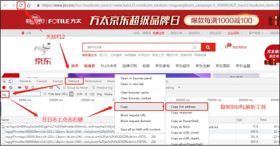 

爬虫数据：通常是通过技术手段获取其他公司网站的数据。不建议同学们这样去做。

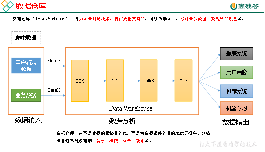

# 第2章 项目需求及架构设计

## 2.1 项目需求分析

1）采集平台

​	（1）用户行为数据采集平台搭建

​	（2）业务数据采集平台搭建

2）离线需求


3）实时需求


4）思考题

（1）项目技术如何选型？

（2）框架版本如何选型（Apache、CDH、HDP）

（3）服务器使用物理机还是云主机？

（4）如何确认集群规模？（假设每台服务器16T硬盘）

## 2.2 项目框架

### 2.2.1 技术选型


### 2.2.2 系统数据流程设计

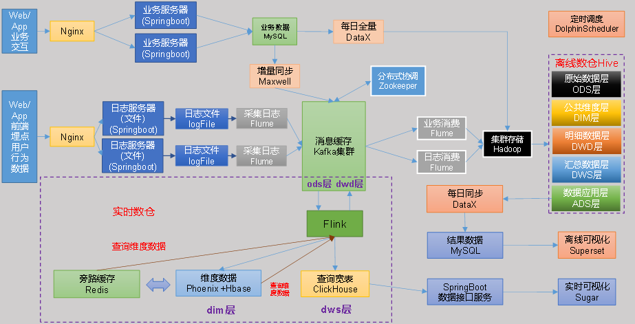

### 2.2.3 框架版本选型


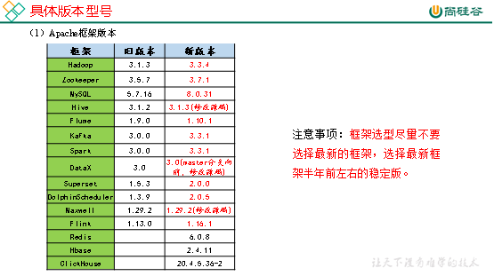

### 2.2.4 服务器选型

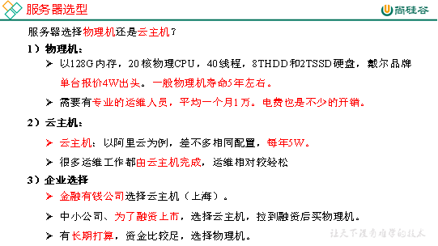

### 2.2.5 集群规模


### 2.2.6 集群资源规划设计

在企业中通常会搭建一套生产集群和一套测试集群。生产集群运行生产任务，测试集群用于上线前代码编写和测试。

1）生产集群

（1）参考腾讯云EMR官方推荐部署

 

* Master节点：管理节点，保证集群的调度正常进行；主要部署NameNode、ResourceManager、HMaster 等进程；非 HA 模式下数量为1，HA 模式下数量为2。

* Core节点：为计算及存储节点，您在 HDFS 中的数据全部存储于 core 节点中，因此为了保证数据安全，扩容 core 节点后不允许缩容；主要部署 DataNode、NodeManager、RegionServer 等进程。非 HA 模式下数量≥2，HA 模式下数量≥3。

* Common 节点：为 HA 集群 Master 节点提供数据共享同步以及高可用容错服务；主要部署分布式协调器组件，如 ZooKeeper、JournalNode 等节点。非HA模式数量为0，HA 模式下数量≥3。

（2）消耗内存的分开部署

（3）数据传输数据比较紧密的放在一起（Kafka、clickhouse）

（4）客户端尽量放在一到两台服务器上，方便外部访问

（5）有依赖关系的尽量放到同一台服务器（例如：Ds-worker和hive/spark）

| Master    | Master    | core       | core      | core      | common      | common      | common      |
| --------- | --------- | ---------- | --------- | --------- | ----------- | ----------- | ----------- |
| nn        | nn        | dn         | dn        | dn        | JournalNode | JournalNode | JournalNode |
| rm        | rm        | nm         | nm        | nm        |             |             |             |
|           |           |            |           |           | zk          | zk          | zk          |
| hive      | hive      | hive       | hive      | hive      |             |             |             |
|           |           | kafka      | kafka     | kafka     |             |             |             |
| spark     | spark     | spark      | spark     | spark     |             |             |             |
| datax     | datax     | datax      | datax     | datax     |             |             |             |
| Ds-master | Ds-master | Ds-worker  | Ds-worker | Ds-worker |             |             |             |
| maxwell   |           |            |           |           |             |             |             |
| superset  |           |            |           |           |             |             |             |
| mysql     |           |            |           |           |             |             |             |
| flume     | flume     |            |           |           |             |             |             |
| flink     | flink     |            |           |           |             |             |             |
|           |           | clickhouse |           |           |             |             |             |
|           |           |            | redis     |           |             |             |             |
| hbase     |           |            |           |           |             |             |             |

2）测试集群服务器规划

| 服务名称               | 子服务               | 服务器hadoop102 | 服务器hadoop103 | 服务器hadoop104 |
| ---------------------- | -------------------- | --------------- | --------------- | --------------- |
| HDFS                   | NameNode             | √               |                 |                 |
|                        | DataNode             | √               | √               | √               |
|                        | SecondaryNameNode    |                 |                 | √               |
| Yarn                   | NodeManager          | √               | √               | √               |
|                        | Resourcemanager      |                 | √               |                 |
| Zookeeper              | Zookeeper Server     | √               | √               | √               |
| Flume（采集日志）      | Flume                | √               | √               |                 |
| Kafka                  | Kafka                | √               | √               | √               |
| Flume（消费Kafka日志） | Flume                |                 |                 | √               |
| Flume（消费Kafka业务） | Flume                |                 |                 | √               |
| Hive                   |                      | √               | √               | √               |
| MySQL                  | MySQL                | √               |                 |                 |
| DataX                  |                      | √               | √               | √               |
| Spark                  |                      | √               | √               | √               |
| DolphinScheduler       | ApiApplicationServer | √               |                 |                 |
|                        | AlertServer          | √               |                 |                 |
|                        | MasterServer         | √               |                 |                 |
|                        | WorkerServer         | √               | √               | √               |
|                        | LoggerServer         | √               | √               | √               |
| Superset               | Superset             | √               |                 |                 |
| Flink                  |                      | √               |                 |                 |
| ClickHouse             |                      | √               |                 |                 |
| Redis                  |                      | √               |                 |                 |
| Hbase                  |                      | √               |                 |                 |
| 服务数总计             |                      | 20              | 11              | 12              |

# 第3章 用户行为日志

## 3.1 用户行为日志概述

用户行为日志的内容，主要包括用户的各项行为信息以及行为所处的环境信息。收集这些信息的主要目的是优化产品和为各项分析统计指标提供数据支撑。收集这些信息的手段通常为埋点。

目前主流的埋点方式，有代码埋点（前端/后端）、可视化埋点、全埋点等。

代码埋点是通过调用埋点SDK函数，在需要埋点的业务逻辑功能位置调用接口，上报埋点数据。例如，我们对页面中的某个按钮埋点后，当这个按钮被点击时，可以在这个按钮对应的 OnClick 函数里面调用SDK提供的数据发送接口，来发送数据。

可视化埋点只需要研发人员集成采集 SDK，不需要写埋点代码，业务人员就可以通过访问分析平台的“圈选”功能，来“圈”出需要对用户行为进行捕捉的控件，并对该事件进行命名。圈选完毕后，这些配置会同步到各个用户的终端上，由采集 SDK 按照圈选的配置自动进行用户行为数据的采集和发送。

全埋点是通过在产品中嵌入SDK，前端自动采集页面上的全部用户行为事件，上报埋点数据，相当于做了一个统一的埋点。然后再通过界面配置哪些数据需要在系统里面进行分析。

## 3.2 用户行为日志内容

本项目收集和分析的用户行为信息主要有页面浏览记录、动作记录、曝光记录、启动记录和错误记录。

### 3.2.1 页面浏览记录

页面浏览记录，记录的是访客对页面的浏览行为，该行为的环境信息主要有用户信息、时间信息、地理位置信息、设备信息、应用信息、渠道信息及页面信息等。


### 3.2.2 动作记录

动作记录，记录的是用户的业务操作行为，该行为的环境信息主要有用户信息、时间信息、地理位置信息、设备信息、应用信息、渠道信息 及动作目标对象信息等。


### 3.2.3 曝光记录

曝光记录，记录的是曝光行为，该行为的环境信息主要有用户信息、时间信息、地理位置信息、设备信息、应用信息、渠道信息及曝光对象信息等。


### 3.2.4 启动记录

启动记录，记录的是用户启动应用的行为，该行为的环境信息主要有用户信息、时间信息、地理位置信息、设备信息、应用信息、渠道信息、启动类型及开屏广告信息等。


### 3.2.5 错误记录

错误记录，记录的是用户在使用应用过程中的报错行为，该行为的环境信息主要有用户信息、时间信息、地理位置信息、设备信息、应用信息、渠道信息、以及可能与报错相关的页面信息、动作信息、曝光信息和动作信息。

## 3.3 用户行为日志格式

我们的日志结构大致可分为两类，一是页面日志，二是启动日志。

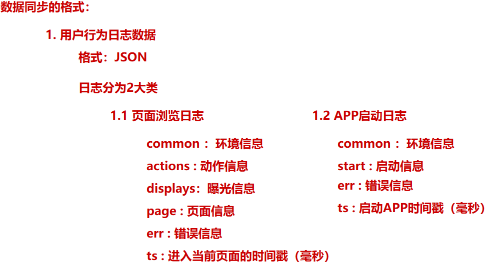

### 3.3.1 页面日志

页面日志，以页面浏览为单位，即一个页面浏览记录，生成一条页面埋点日志。一条完整的页面日志包含，一个页面浏览记录，若干个用户在该页面所做的动作记录，若干个该页面的曝光记录，以及一个在该页面发生的报错记录。除上述行为信息，页面日志还包含了这些行为所处的各种环境信息，包括用户信息、时间信息、地理位置信息、设备信息、应用信息、渠道信息等。

```json
{
	"common": {                      -- 环境信息
		"ar": "15",                 -- 省份ID 
		"ba": "iPhone",             -- 手机品牌
		"ch": "Appstore",           -- 渠道
		"is_new": "1",              -- 是否首日使用，首次使用的当日，该字段值为1，过了24:00，该字段置为0。
		"md": "iPhone 8",           -- 手机型号
		"mid": "YXfhjAYH6As2z9Iq",  -- 设备id
		"os": "iOS 13.2.9",         -- 操作系统
		"sid": "3981c171-558a-437c-be10-da6d2553c517",     -- 会话id
		"uid": "485",               -- 会员id
		"vc": "v2.1.134"            -- app版本号
	},
	"actions": [{                    -- 动作(事件)
		"action_id": "favor_add",   -- 动作id
		"item": "3",                -- 目标id
		"item_type": "sku_id",      -- 目标类型
		"ts": 1585744376605         -- 动作时间戳
	    }
	],
	"displays": [{                   -- 曝光
			"displayType": "query", -- 曝光类型
			"item": "3",            -- 曝光对象id
			"item_type": "sku_id",  -- 曝光对象类型
			"order": 1,             -- 出现顺序
			"pos_id": 2,            -- 曝光位置
			"pos_seq": 1            -- 曝光序列号（同一坑位多个对象的编号）
		},
		{
			"displayType": "promotion",
			"item": "6",
			"item_type": "sku_id",
			"order": 2,
			"pos_id": 1,
             "pos_seq": 1
		},
		{
			"displayType": "promotion",
			"item": "9",
			"item_type": "sku_id",
			"order": 3,
			"pos_id": 3,
             "pos_seq": 1
		},
		{
			"displayType": "recommend",
			"item": "6",
			"item_type": "sku_id",
			"order": 4,
			"pos_id": 2,
			"pos_seq": 1
		},
		{
			"displayType": "query ",
			"item": "6",
			"item_type": "sku_id",
			"order": 5,
			"pos_id": 1,
			"pos_seq": 1
		}
	],
	"page": {                          -- 页面信息
		"during_time": 7648,           -- 持续时间毫秒
		"item": "3", 	               -- 目标id
		"item_type": "sku_id",         -- 目标类型
		"last_page_id": "login",       -- 上页ID
		"page_id": "good_detail",      -- 页面ID
		"from_pos_id":999,           -- 来源坑位ID
         "from_pos_seq":999,           -- 来源坑位序列号
         "refer_id":"2",			  -- 外部营销渠道ID
		"sourceType": "promotion"      -- 来源类型
	},                                 
	"err": {                           --错误
		"error_code": "1234",          --错误码
		"msg": ""           --错误信息
	},                                 
	"ts": 1585744374423                --跳入时间戳
}
```

### 3.3.2 启动日志

启动日志以启动为单位，及一次启动行为，生成一条启动日志。一条完整的启动日志包括一个启动记录，一个本次启动时的报错记录，以及启动时所处的环境信息，包括用户信息、时间信息、地理位置信息、设备信息、应用信息、渠道信息等。

```json
{
  "common": {
    "ar": "370000",
    "ba": "Honor",
    "ch": "wandoujia",
    "is_new": "1",
    "md": "Honor 20s",
    "mid": "eQF5boERMJFOujcp",
	"os": "Android 11.0",
	"sid":"a1068e7a-e25b-45dc-9b9a-5a55ae83fc81",
    "uid": "76",
    "vc": "v2.1.134"
  },
  "start": {   
     "entry": "icon",         	--icon手机图标  notice 通知   install 安装后启动
     "loading_time": 18803,   	--启动加载时间
     "open_ad_id": 7,         	--广告页ID
     "open_ad_ms": 3449,      	-- 广告总共播放时间
     "open_ad_skip_ms": 1989  	--  用户跳过广告时点
  },
  "err":{                       --错误
     "error_code": "1234",      --错误码
     "msg": ""       --错误信息
   },
  "ts": 1585744304000
}
```

## 3.4 服务器和JDK准备

### 3.4.1 服务器准备

安装如下文档配置步骤，分别安装hadoop102、hadoop103、hadoop104三台主机。

Hadoop运行环境搭建

#### 3.4.1.1 模板虚拟机环境准备

0）安装模板虚拟机，IP地址192.168.10.100、主机名称hadoop100、内存4G、硬盘50G

1）hadoop100虚拟机配置要求如下（本文Linux系统全部以CentOS-7.5-x86-1804为例）

（1）使用yum安装需要虚拟机可以正常上网，yum安装前可以先测试下虚拟机联网情况

```shell
[root@hadoop100 ~]# ping www.baidu.com
PING www.baidu.com (14.215.177.39) 56(84) bytes of data.
64 bytes from 14.215.177.39 (14.215.177.39): icmp_seq=1 ttl=128 time=8.60 ms
64 bytes from 14.215.177.39 (14.215.177.39): icmp_seq=2 ttl=128 time=7.72 ms
```

（2）安装epel-release

注：Extra Packages for Enterprise Linux是为“红帽系”的操作系统提供额外的软件包，适用于RHEL、CentOS和Scientific Linux。相当于是一个软件仓库，大多数rpm包在官方 repository 中是找不到的）。

```shell
[root@hadoop100 ~]# yum install -y epel-release
```

（3）注意：如果Linux安装的是最小系统版，还需要安装如下工具；如果安装的是Linux桌面标准版，不需要执行如下操作

* net-tool：工具包集合，包含ifconfig等命令

```shell
[root@hadoop100 ~]# yum install -y net-tools 
```

* vim：编辑器

```shell
[root@hadoop100 ~]# yum install -y vim
```

2）关闭防火墙，关闭防火墙开机自启

```shell
[root@hadoop100 ~]# systemctl stop firewalld
[root@hadoop100 ~]# systemctl disable firewalld.service
```

​	注意：在企业开发时，通常单个服务器的防火墙时关闭的。公司整体对外会设置非常安全的防火墙。

3）创建atguigu用户，并修改atguigu用户的密码

```shell
[root@hadoop100 ~]# useradd atguigu
[root@hadoop100 ~]# passwd atguigu
```

4）配置atguigu用户具有root权限，方便后期加sudo执行root权限的命令

```shell
[root@hadoop100 ~]# vim /etc/sudoers
```

修改/etc/sudoers文件，在%wheel这行下面添加一行，如下所示：

```shell
## Allow root to run any commands anywhere
root    ALL=(ALL)     ALL

## Allows people in group wheel to run all commands
%wheel  ALL=(ALL)       ALL
atguigu   ALL=(ALL)     NOPASSWD:ALL
```

注意：atguigu这一行不要直接放到root行下面，因为所有用户都属于wheel组，你先配置了atguigu具有免密功能，但是程序执行到%wheel行时，该功能又被覆盖回需要密码。所以atguigu要放到%wheel这行下面。

5）在/opt目录下创建文件夹，并修改所属主和所属组

（1）在/opt目录下创建module、software文件夹

```shell
[root@hadoop100 ~]# mkdir /opt/module
[root@hadoop100 ~]# mkdir /opt/software
```

（2）修改module、software文件夹的所有者和所属组均为atguigu用户 

```shell
[root@hadoop100 ~]# chown atguigu:atguigu /opt/module 
[root@hadoop100 ~]# chown atguigu:atguigu /opt/software
```

（3）查看module、software文件夹的所有者和所属组

```shell
[root@hadoop100 ~]# cd /opt/
[root@hadoop100 opt]# ll
总用量 12
drwxr-xr-x. 2 atguigu atguigu 4096 5月  28 17:18 module
drwxr-xr-x. 2 root    root    4096 9月   7 2017 rh
drwxr-xr-x. 2 atguigu atguigu 4096 5月  28 17:18 software
```

6）卸载虚拟机自带的JDK

​	注意：如果你的虚拟机是最小化安装不需要执行这一步。

```shell
[root@hadoop100 ~]# rpm -qa | grep -i java | xargs -n1 rpm -e --nodeps 
```

* rpm -qa：查询所安装的所有rpm软件包

* grep -i：忽略大小写

* xargs -n1：表示每次只传递一个参数

* rpm -e –nodeps：强制卸载软件

7）重启虚拟机

```shell
[root@hadoop100 ~]# reboot
```

#### 3.4.1.2 克隆虚拟机

1）利用模板机hadoop100，克隆三台虚拟机：hadoop102、hadoop103、hadoop104

​	注意：克隆时，要先关闭hadoop100。

2）修改克隆机IP，以下以hadoop102举例说明

（1）修改克隆虚拟机的静态IP

```shell
[atguigu@hadoop100 ~]# sudo vim /etc/sysconfig/network-scripts/ifcfg-ens33
```

改成

```properties
DEVICE=ens33
TYPE=Ethernet
ONBOOT=yes
BOOTPROTO=static
NAME="ens33"
IPADDR=192.168.10.102
PREFIX=24
GATEWAY=192.168.10.2
DNS1=192.168.10.2
```

（2）查看Linux虚拟机的虚拟网络编辑器，编辑->虚拟网络编辑器->VMnet8

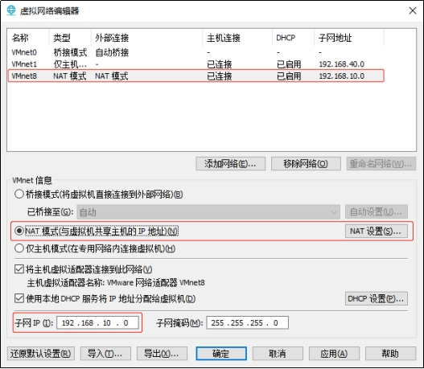 

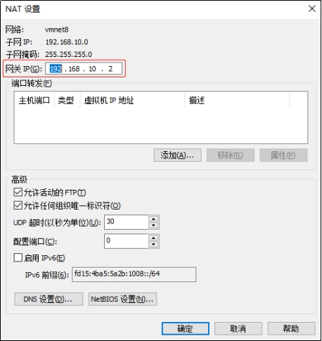 

（3）查看Windows系统适配器VMware Network Adapter VMnet8的IP地址

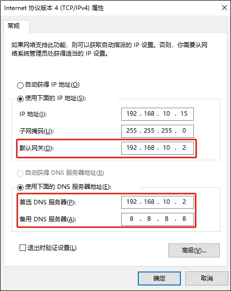 

（4）保证Linux系统ifcfg-ens33文件中IP地址、虚拟网络编辑器地址和Windows系统VM8网络IP地址相同。

3）修改克隆机主机名，以下以hadoop102举例说明

（1）修改主机名称

```shell
[atguigu@hadoop100 ~]# sudo vim /etc/hostname
hadoop102
```

（2）配置Linux克隆机主机名称映射hosts文件，打开/etc/hosts

```shell
[atguigu@hadoop100 ~]# sudo vim /etc/hosts
```

添加如下内容

```properties
192.168.10.100 hadoop100
192.168.10.101 hadoop101
192.168.10.102 hadoop102
192.168.10.103 hadoop103
192.168.10.104 hadoop104
192.168.10.105 hadoop105
192.168.10.106 hadoop106
192.168.10.107 hadoop107
192.168.10.108 hadoop108
```

4）重启克隆机hadoop102 

```shell
[atguigu@hadoop100 ~]# sudo reboot
```

5）修改windows的主机映射文件（hosts文件）

（1）如果操作系统是window7，可以直接修改 

 1. 进入`C:Windows/System32/drivers/etc`路径

 2.  打开hosts文件并添加如下内容，然后保存

    ```properties
    192.168.10.100 hadoop100
    192.168.10.101 hadoop101
    192.168.10.102 hadoop102
    192.168.10.103 hadoop103
    192.168.10.104 hadoop104
    192.168.10.105 hadoop105
    192.168.10.106 hadoop106
    192.168.10.107 hadoop107
    192.168.10.108 hadoop108
    ```

（2）如果操作系统是window10，先拷贝出来，修改保存以后，再覆盖即可

1. 进入C:WindowsSystem32driversetc路径

2. 拷贝hosts文件到桌面

3. 打开桌面hosts文件并添加如下内容

   ```properties
   192.168.10.100 hadoop100
   192.168.10.101 hadoop101
   192.168.10.102 hadoop102
   192.168.10.103 hadoop103
   192.168.10.104 hadoop104
   192.168.10.105 hadoop105
   192.168.10.106 hadoop106
   192.168.10.107 hadoop107
   192.168.10.108 hadoop108
   ```

4. 将桌面hosts文件覆盖C:WindowsSystem32driversetc路径hosts文件

### 3.4.2 阿里云服务器准备（可选）

#### 3.4.2.1 注册阿里云账户

阿里云网址为：https://cn.aliyun.com/，注册账号并登录。

 

#### 3.4.2.2 购买ECS云服务器

1）进入控制台

 

2）打开侧边栏，点击云服务器ECS

 

3）侧边栏点击实例，然后点击创建实例

 

4）选择计费方式、服务器区域

 

5）选定服务器配置

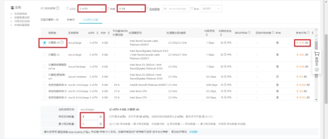 

6）选定服务器系统

 

7）选定磁盘类型及大小


8)网络和安全组配置

 

 

9）系统配置

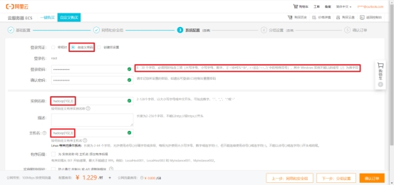 

10）分组设置，默认即可

 

11）确认订单

 

#### 3.4.2.3 ECS配置及安全组修改

1）升级hadoop102配置

（1）停止实例

 

（2）更改实例规格

 

 

2）修改安全组策略

 

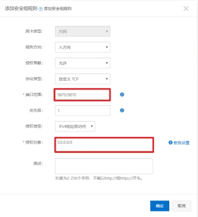 

需将以下端口开放。

| 服务                               | 端口              |
| ---------------------------------- | ----------------- |
| Cloudera Manager Server（WebUI）   | 7180              |
| HDFS NameNode（WebUI）             | 9870              |
| Yarn ResourceManager（WebUI）      | 8088              |
| JobHistory Server（WebUI）         | 19888             |
| HBase Master（WebUI）              | 16010             |
| HiveServer2 （WebUI）              | 10002             |
| HUE Server（WebUI）                | 8888/8889         |
| Oozie Server                       | 11000             |
| Sentry Server                      | 51000             |
| Spark Master/Worker/History Server | 18080/18081/18088 |
| Kerberos                           | 88                |
| MySQL                              | 3306              |

#### 3.4.2.4 连接阿里云服务器

打开远程连接工具进行配置，这里以CRT为例。

1）新建一个session

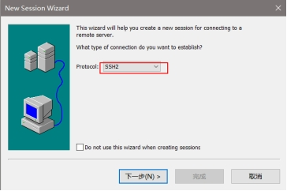 

2）填写hostname（填写公网ip）

 

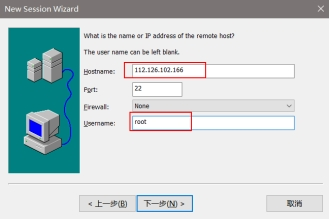 

#### 3.4.2.5 修改服务器hosts文件

```shell
[root@hadoop001 ~]# vim /etc/hosts
127.0.0.1 localhost  localhost
::1     localhost       localhost.localdomain   localhost6      localhost6.localdomain6
172.17.138.24 hadoop001 hadoop1
172.17.138.25 hadoop002 hadoop2
172.17.138.23 hadoop003 hadoop3
```

注意：这里每个人不一样，ip填写的是私有ip，做完后ping一下。

### 3.4.3 编写集群分发脚本xsync

1）xsync集群分发脚本

（1）需求：循环复制文件到所有节点的相同目录下

​	（2）需求分析

1. rsync命令原始拷贝：

```shell
rsync  -av     /opt/module  		 root@hadoop103:/opt/
```

2. 期望脚本：

xsync要同步的文件名称

3. 说明：在/home/atguigu/bin这个目录下存放的脚本，atguigu用户可以在系统任何地方直接执行。

```shell
[atguigu@hadoop102 ~]$ echo $PATH
/usr/local/bin:/usr/bin:/usr/local/sbin:/usr/sbin:/home/atguigu/.local/bin:/home/atguigu/bin
```

（3）脚本实现

1. 在用的家目录/home/atguigu下创建bin文件夹

```shell
[atguigu@hadoop102 ~]$ mkdir bin
```

2. 在/home/atguigu/bin目录下创建xsync文件，以便全局调用

```shell
[atguigu@hadoop102 ~]$ cd /home/atguigu/bin
[atguigu@hadoop102 ~]$ vim xsync
```

在该文件中编写如下代码

```shell
#!/bin/bash

#1. 判断参数个数
if [ $# -lt 1 ]
then
  echo Not Enough Arguement!
  exit;
fi

#2. 遍历集群所有机器
for host in hadoop102 hadoop103 hadoop104
do
  echo ====================  $host  ====================
  #3. 遍历所有目录，挨个发送
  for file in $@
  do
    #4 判断文件是否存在
    if [ -e $file ]
    then
      #5. 获取父目录
      pdir=$(cd -P $(dirname $file); pwd)
      #6. 获取当前文件的名称
      fname=$(basename $file)
      ssh $host "mkdir -p $pdir"
      rsync -av $pdir/$fname $host:$pdir
    else
      echo $file does not exists!
    fi
  done
done
```

3. 修改脚本xsync具有执行权限

   ```shell
   [atguigu@hadoop102 bin]$ chmod 777 xsync
   ```

4. 测试脚本

   ```shell
   [atguigu@hadoop102 bin]$ xsync xsync
   ```

### 3.4.4 SSH无密登录配置

说明：这里面只配置了hadoop102、hadoop103到其他主机的无密登录；因为hadoop102配置的是NameNode，hadoop103配置的是ResourceManager，都要求对其他节点无密访问。

（1）hadoop102上生成公钥和私钥：

```shell
[atguigu@hadoop102 .ssh]$ ssh-keygen -t rsa
```

然后敲（三个回车），就会生成两个文件id_rsa（私钥）、id_rsa.pub（公钥）。

（2）将hadoop102公钥拷贝到要免密登录的目标机器上

```shell
[atguigu@hadoop102 .ssh]$ ssh-copy-id hadoop102
[atguigu@hadoop102 .ssh]$ ssh-copy-id hadoop103
[atguigu@hadoop102 .ssh]$ ssh-copy-id hadoop104
```

（3）hadoop103上生成公钥和私钥：

```shell
[atguigu@hadoop103 .ssh]$ ssh-keygen -t rsa
```

然后敲（三个回车），就会生成两个文件id_rsa（私钥）、id_rsa.pub（公钥）。

（4）将hadoop103公钥拷贝到要免密登录的目标机器上

```shell
[atguigu@hadoop103 .ssh]$ ssh-copy-id hadoop102
[atguigu@hadoop103 .ssh]$ ssh-copy-id hadoop103
[atguigu@hadoop103 .ssh]$ ssh-copy-id hadoop104
```

### 3.4.5 JDK准备

1）卸载现有JDK（3台节点）

```shell
[atguigu@hadoop102 opt]# sudo rpm -qa | grep -i java | xargs -n1 sudo rpm -e --nodeps

[atguigu@hadoop103 opt]# sudo rpm -qa | grep -i java | xargs -n1 sudo rpm -e --nodeps

[atguigu@hadoop104 opt]# sudo rpm -qa | grep -i java | xargs -n1 sudo rpm -e --nodeps
```

（1）rpm -qa：表示查询所有已经安装的软件包

（2）grep -i：表示过滤时不区分大小写

（3）xargs -n1：表示一次获取上次执行结果的一个值

（4）rpm -e --nodeps：表示卸载软件

2）用XShell工具将JDK导入到hadoop102的/opt/software文件夹下面

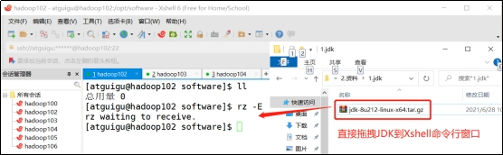 

3）在Linux系统下的opt目录中查看软件包是否导入成功

```shell
[atguigu@hadoop102 software]# ls /opt/software/
```

看到如下结果：

```shell
jdk-8u212-linux-x64.tar.gz
```

4）解压JDK到/opt/module目录下

```shell
[atguigu@hadoop102 software]# tar -zxvf jdk-8u212-linux-x64.tar.gz -C /opt/module/
[atguigu@hadoop102 module]$ mv jdk1.8.0_212/ jdk-1.8.0
```

5）配置JDK环境变量

（1）新建/etc/profile.d/my_env.sh文件

```shell
[atguigu@hadoop102 module]# sudo vim /etc/profile.d/my_env.sh
```

添加如下内容，然后保存（:wq）退出。

```shell
#JAVA_HOME
export JAVA_HOME=/opt/module/jdk-1.8.0
export PATH=$PATH:$JAVA_HOME/bin
```

（2）让环境变量生效

```shell
[atguigu@hadoop102 software]$ source /etc/profile.d/my_env.sh
```

6）测试JDK是否安装成功

```shell
[atguigu@hadoop102 module]# java -version
```

如果能看到以下结果、则Java正常安装。

```shell
java version "1.8.0_212"
```

7）分发JDK 

```shell
[atguigu@hadoop102 module]$ xsync /opt/module/jdk-1.8.0
```

8）分发环境变量配置文件

```shell
[atguigu@hadoop102 module]$ sudo /home/atguigu/bin/xsync /etc/profile.d/my_env.sh
```

9）分别在hadoop103、hadoop104上执行source

```shell
[atguigu@hadoop103 module]$ source /etc/profile.d/my_env.sh
[atguigu@hadoop104 module]$ source /etc/profile.d/my_env.sh
```

### 3.4.6 环境变量配置说明

Linux的环境变量可在多个文件中配置，如/etc/profile，/etc/profile.d/.sh，~/.bashrc，~/.bash_profile等，下面说明上述几个文件之间的关系和区别。

bash的运行模式可分为login shell和non-login shell。

例如，我们通过终端，输入用户名、密码，登录系统之后，得到就是一个login shell。而当我们执行以下命令ssh hadoop103 command，在hadoop103执行command的就是一个non-login shell。

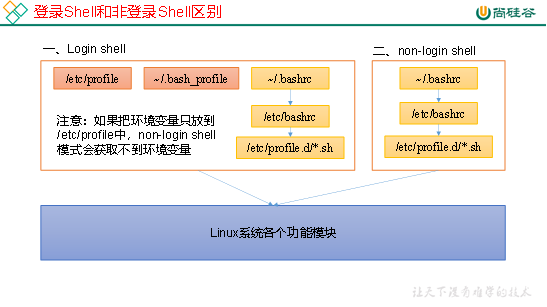 

这两种shell的主要区别在于，它们启动时会加载不同的配置文件，login shell启动时会加载/etc/profile，~/.bash_profile，~/.bashrc。non-login shell启动时会加载~/.bashrc。

而在加载~/.bashrc（实际是~/.bashrc中加载的/etc/bashrc）或/etc/profile时，都会执行如下代码片段，

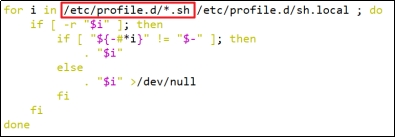 

因此不管是login shell还是non-login shell，启动时都会加载/etc/profile.d/.sh中的环境变量。

## 3.5 数据模拟

### 3.5.1 使用说明

1）将application.yml、gmall-remake-mock-2023-02-17.jar、path.json、logback.xml上传到hadoop102的/opt/module/applog目录下

（1）创建applog路径

```shell
[atguigu@hadoop102 module]$ mkdir /opt/module/applog
```

（2）上传文件到/opt/module/applog目录

2）配置文件

（1）application.yml文件

可以根据需求生成对应日期的用户行为日志。

```shell
[atguigu@hadoop102 applog]$ vim application.yml
```

修改如下内容

```yaml
# 外部配置打开
logging.config: ./logback.xml


#http模式下，发送的地址
mock:
  log:
    type: "file"      #"file" "http" "kafka" "none"
    http:
      url: "http://localhost:8090/applog"
    kafka:
        server: "hadoop102:9092,hadoop102:9092,hadoop102:9092"
        topic: "topic_log"

spring:
    datasource:
      type: com.alibaba.druid.pool.DruidDataSource
      druid:
        url: jdbc:mysql://hadoop102:3306/gmall?characterEncoding=utf-8&allowPublicKeyRetrieval=true&useSSL=false&serverTimezone=GMT%2B8
        username: root
        password: "000000"
        driver-class-name:  com.mysql.cj.jdbc.Driver
        max-active: 20
        test-on-borrow: true


mybatis-plus.global-config.db-config.field-strategy: not_null
mybatis-plus:
  mapper-locations: classpath:mapper/.xml

mybatis:
   mapper-locations: classpath:mapper/.xml

#业务日期， 并非Linux系统时间的日期，而是生成模拟数据的日期
mock.date: "2022-06-08"

# 日志是否写入数据库一份  写入z_log表中
mock.log.db.enable: 1

# 清空
mock.clear.busi: 1

# 清空用户
mock.clear.user: 0

# 批量生成新用户
mock.new.user: 0
  #session次数
mock.user-session.count: 200
  #设备最大值
mock.max.mid: 1000000

# 是否针对实时生成数据，若启用（置为1）则数据的 yyyy-MM-dd 与 mock.date 一致而 HH:mm:ss 与系统时间一致；若禁用则数据的 yyyy-MM-dd 与 mock.date 一致而 HH:mm:ss 随机分布，此处禁用
mock.if-realtime: 0
#访问时间分布权重
mock.start-time-weight: "10:5:0:0:0:0:5:5:5:10:10:15:20:10:10:10:10:10:20:25:30:35:30:20"

#支付类型占比 支付宝 ：微信 :银联
mock.payment_type_weight: "40:50:10"

  #页面平均访问时间
mock.page.during-time-ms: 20000
  #错误概率 百分比
mock.error.rate: 3
  #每条日志发送延迟 ms
mock.log.sleep: 100
  #课程详情来源  用户查询，商品推广，智能推荐, 促销活动
mock.detail.source-type-rate: "40:25:15:20"

mock.if-cart-rate: 100

mock.if-favor-rate: 70

mock.if-order-rate: 100

mock.if-refund-rate: 50


  #搜索关键词
mock.search.keyword: "java,python,多线程,前端,数据库,大数据,hadoop,flink"


  #用户数据变化概率
mock.user.update-rate: 20


# 男女浏览品牌比重（11 品牌)
mock.tm-weight.male: "3:2:5:5:5:1:1:1:1:1:1"
mock.tm-weight.female: "1:5:1:1:2:2:2:5:5:5:5"


# 外连类型比重（5 种）
mock.refer-weight: "10:2:3:4:5"

# 线程池相关配置
mock.pool.core: 20
mock.pool.max-core: 100
```

（2）path.json，该文件用来配置访问路径

根据需求，可以灵活配置用户点击路径。

```shell
[
  {"path":["start_app","home", "search", "good_list","good_detail","good_detail" ,"good_detail","cart","order","payment","mine","order_list","end"],"rate":100 },
  {"path":["start_app","home", "good_list","good_detail","good_detail" ,"good_detail","cart","end"],"rate":30 },
  {"path":["start_app","home", "activity1111","good_detail"  ,"cart","good_detail","cart","order","payment","end"],"rate":30 },
  {"path":[ "activity1111","good_detail" ,"activity1111" ,"good_detail","order","payment","end"],"rate":200 },
  {"path":[ "start_app","home" ,"activity1111" ,"good_detail","order","payment","end"],"rate":200 },
  {"path":[ "start_app","home" , "good_detail","order","payment","end"],"rate":30 },
  {"path":[  "good_detail","order","payment","end"],"rate":650 },
  {"path":[  "good_detail"  ],"rate":30 },
  {"path":[  "start_app","home","mine","good_detail"  ],"rate":30 },
  {"path":[  "start_app","home", "good_detail","good_detail","good_detail","cart","order","payment","end"  ],"rate":200 },
  {"path":[  "start_app","home", "search","good_list","good_detail","cart","order","payment","end"  ],"rate":200 }
]
```

（3）logback配置文件

可配置日志生成路径，修改内容如下。

```xml
<?xml version="1.0" encoding="UTF-8"?>
<configuration>
    <property name="LOG_HOME" value="/opt/module/applog/log" />
    <appender name="console" class="ch.qos.logback.core.ConsoleAppender">
        <target>System.out</target>
        <encoder>
            <pattern>%msg%n</pattern>
        </encoder>
    </appender>

    <appender name="console_em" class="ch.qos.logback.core.ConsoleAppender">
        <target>System.err</target>
        <encoder>
            <pattern>%msg%n</pattern>
        </encoder>
    </appender>

    <appender name="rollingFile" class="ch.qos.logback.core.rolling.RollingFileAppender">
        <file>${LOG_HOME}/app.log</file>
        <rollingPolicy class="ch.qos.logback.core.rolling.TimeBasedRollingPolicy">
            <fileNamePattern>${LOG_HOME}/app.%d{yyyy-MM-dd}.log</fileNamePattern>
        </rollingPolicy>
        <encoder>
            <pattern>%msg%n</pattern>
        </encoder>
    </appender>

    <!-- 将某一个包下日志单独打印日志 -->
    <logger name="com.atguigu.mock.util.LogUtil"
            level="INFO" additivity="false">
          <appender-ref ref="rollingFile" />
<!--           <appender-ref ref="console" />-->
    </logger>
    <logger name="com.atguigu.gmallre.mock.task.UserMockTask" level="INFO" additivity="false" >
        <appender-ref ref="console_em" />
    </logger>

<!--    <logger name="com.alibaba.druid.pool" level="error" additivity="false" >-->
<!--        <appender-ref ref="console" />-->
<!--    </logger>-->

<!--    <logger  name="com.atguigu.edu2021.mock.mapper" level="debug">-->
<!--         <appender-ref ref="console" />-->
<!--    </logger>-->

<!--      <logger  name="com.atguigu.edu2021.mock.service.impl.UserInfoServiceImpl" level="debug">
             <appender-ref ref="console" />
       </logger>-->

    <root level="error"  >
       <appender-ref ref="console_em" />
        <!-- <appender-ref ref="async-rollingFile" />  -->
    </root>
</configuration>
```

3）生成日志

（1）进入到/opt/module/applog路径，执行以下命令

```shell
[atguigu@hadoop102 applog]$ java -jar gmall-remake-mock-2023-02-17.jar test 100 2022-06-08
```

1. 增加test参数为测试模式，只生成用户行为数据不生成业务数据。

2. 100 为产生的用户session数一个session默认产生1条启动日志和5条页面方法日志。

3. 第三个参数为日志数据的日期，测试模式下不会加载配置文件，要指定数据日期只能通过命令行传参实现。

4. 三个参数的顺序必须与示例保持一致

5. 第二个参数和第三个参数可以省略，如果test后面不填写参数，默认为1000

（2）在/opt/module/applog/log目录下查看生成日志

```shell
[atguigu@hadoop102 log]$ ll
```

### 3.5.2 集群日志生成脚本

（1）在/home/atguigu/bin目录下创建脚本lg.sh

```shell
[atguigu@hadoop102 bin]$ vim lg.sh
```

（2）在脚本中编写如下内容

```shell
#!/bin/bash
echo "========== hadoop102 =========="
ssh hadoop102 "cd /opt/module/applog/; nohup java -jar gmall-remake-mock-2023-02-17.jar $1 $2 $3 >/dev/null 2>&1 &"
```

done注：

1. /opt/module/applog/为jar包及配置文件所在路径

2. /dev/null代表Linux的空设备文件，所有往这个文件里面写入的内容都会丢失，俗称“黑洞”。

标准输入0：从键盘获得输入 /proc/self/fd/0 

标准输出1：输出到屏幕（即控制台） /proc/self/fd/1 

错误输出2：输出到屏幕（即控制台） /proc/self/fd/2

（3）修改脚本执行权限

```shell
[atguigu@hadoop102 bin]$ chmod 777 lg.sh
```

（4）将jar包及配置文件上传至hadoop103的/opt/module/applog/路径

（5）启动脚本

```shell
[atguigu@hadoop102 module]$ lg.sh test 100
```

（6）分别在hadoop102、hadoop103的/opt/module/applog/log目录上查看生成的数据

```shell
[atguigu@hadoop102 log]$ ls
app.log
```

# 第4章 用户行为数据采集模块

## 4.1 数据通道

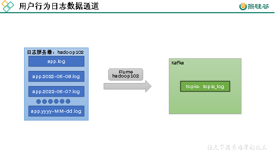

## 4.2 环境准备

### 4.2.1 集群命令批量执行脚本

1）在/home/atguigu/bin目录下创建脚本xcall

```shell
[atguigu@hadoop102 bin]$ vim xcall
```

2）在脚本中编写如下内容

```shell
#! /bin/bash
 
for i in hadoop102 hadoop103 hadoop104
do
    echo --------- $i ----------
    ssh $i "$"
done
```

3）修改脚本执行权限

```shell
[atguigu@hadoop102 bin]$ chmod 777 xcall
```

4）启动脚本

```shell
[atguigu@hadoop102 bin]$ xcall jps
```

### 4.2.2 Hadoop安装

#### 4.2.2.1 安装步骤

完全分布式运行模式（开发重点）

分析：

​	1）准备3台客户机（关闭防火墙、静态IP、主机名称）

​	2）安装JDK

​	3）配置环境变量

​	4）安装Hadoop

​	5）配置环境变量

​	6）配置集群

​	7）单点启动

​	8）配置ssh

​	9）群起并测试集群

##### 4.2.2.1.1 Hadoop部署

1）集群部署规划

​	注意：NameNode和SecondaryNameNode不要安装在同一台服务器

​	注意：ResourceManager也很消耗内存，不要和NameNode、SecondaryNameNode配置在同一台机器上。

|      | hadoop102        | hadoop103                  | hadoop104                 |
| ---- | ---------------- | -------------------------- | ------------------------- |
| HDFS | NameNodeDataNode | DataNode                   | SecondaryNameNodeDataNode |
| YARN | NodeManager      | ResourceManagerNodeManager | NodeManager               |

2）用SecureCRT工具将hadoop3.3.4.tar.gz导入到opt目录下面的software文件夹下面

切换到sftp连接页面，选择Linux下编译的hadoop jar包拖入，如图2-32所示

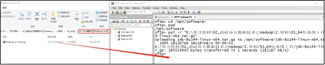 

图 拖入hadoop的tar包

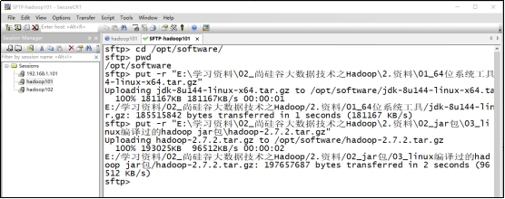 

图2-33 拖入Hadoop的tar包成功

3）进入到Hadoop安装包路径下

```shell
[atguigu@hadoop102 ~]$ cd /opt/software/
```

4）解压安装文件到/opt/module下面

```shell
[atguigu@hadoop102 software]$ tar -zxvf hadoop-3.3.4.tar.gz -C /opt/module/
```

5）查看是否解压成功

```shell
[atguigu@hadoop102 software]$ ls /opt/module/hadoop-3.3.4
```

6）重命名

```shell
[atguigu@hadoop102 software]$ mv /opt/module/hadoop-3.3.4 /opt/module/hadoop
```

7）将Hadoop添加到环境变量

​	（1）获取Hadoop安装路径

```shell
[atguigu@hadoop102 hadoop]$ pwd
/opt/module/hadoop
```

​	（2）打开/etc/profile.d/my_env.sh文件

```shell
[atguigu@hadoop102 hadoop]$ sudo vim /etc/profile.d/my_env.sh
```

在profile文件末尾添加JDK路径：（shitf+g）

```shell
#HADOOP_HOME
export HADOOP_HOME=/opt/module/hadoop
export PATH=$PATH:$HADOOP_HOME/bin
export PATH=$PATH:$HADOOP_HOME/sbin
```

（3）保存后退出

```shell
:wq
```

（4）分发环境变量文件

```shell
[atguigu@hadoop102 hadoop]$ sudo /home/atguigu/bin/xsync /etc/profile.d/my_env.sh
```

（5）source 是之生效（3台节点）

```shell
[atguigu@hadoop102 module]$ source /etc/profile.d/my_env.sh
[atguigu@hadoop103 module]$ source /etc/profile.d/my_env.sh
[atguigu@hadoop104 module]$ source /etc/profile.d/my_env.sh
```

##### 4.2.2.1.2 配置集群

1）核心配置文件

配置core-site.xml

```shell
[atguigu@hadoop102 ~]$ cd $HADOOP_HOME/etc/hadoop
[atguigu@hadoop102 hadoop]$ vim core-site.xml
```

文件内容如下：

```xml
<?xml version="1.0" encoding="UTF-8"?>
<?xml-stylesheet type="text/xsl" href="configuration.xsl"?>

<configuration>
	<!-- 指定NameNode的地址 -->
    <property>
        <name>fs.defaultFS</name>
        <value>hdfs://hadoop102:8020</value>
</property>
<!-- 指定hadoop数据的存储目录 -->
    <property>
        <name>hadoop.tmp.dir</name>
        <value>/opt/module/hadoop/data</value>
</property>

<!-- 配置HDFS网页登录使用的静态用户为atguigu -->
    <property>
        <name>hadoop.http.staticuser.user</name>
        <value>atguigu</value>
</property>

<!-- 配置该atguigu(superUser)允许通过代理访问的主机节点 -->
    <property>
        <name>hadoop.proxyuser.atguigu.hosts</name>
        <value></value>
</property>
<!-- 配置该atguigu(superUser)允许通过代理用户所属组 -->
    <property>
        <name>hadoop.proxyuser.atguigu.groups</name>
        <value></value>
</property>
<!-- 配置该atguigu(superUser)允许通过代理的用户-->
    <property>
        <name>hadoop.proxyuser.atguigu.users</name>
        <value></value>
</property>
</configuration>
```

2）HDFS配置文件

配置hdfs-site.xml

```shell
[atguigu@hadoop102 hadoop]$ vim hdfs-site.xml
```

文件内容如下：

```shell
<?xml version="1.0" encoding="UTF-8"?>
<?xml-stylesheet type="text/xsl" href="configuration.xsl"?>

<configuration>
	<!-- nn web端访问地址-->
	<property>
        <name>dfs.namenode.http-address</name>
        <value>hadoop102:9870</value>
    </property>
    
	<!-- 2nn web端访问地址-->
    <property>
        <name>dfs.namenode.secondary.http-address</name>
        <value>hadoop104:9868</value>
    </property>
    
    <!-- 测试环境指定HDFS副本的数量1 -->
    <property>
        <name>dfs.replication</name>
        <value>1</value>
    </property>
</configuration>
```

3）YARN配置文件

配置yarn-site.xml

```shell
[atguigu@hadoop102 hadoop]$ vim yarn-site.xml
```

文件内容如下：

```xml
<?xml version="1.0" encoding="UTF-8"?>
<?xml-stylesheet type="text/xsl" href="configuration.xsl"?>

<configuration>
	<!-- 指定MR走shuffle -->
    <property>
        <name>yarn.nodemanager.aux-services</name>
        <value>mapreduce_shuffle</value>
    </property>
    
    <!-- 指定ResourceManager的地址-->
    <property>
        <name>yarn.resourcemanager.hostname</name>
        <value>hadoop103</value>
    </property>
    
    <!-- 环境变量的继承 -->
    <property>
        <name>yarn.nodemanager.env-whitelist</name>
        <value>JAVA_HOME,HADOOP_COMMON_HOME,HADOOP_HDFS_HOME,HADOOP_CONF_DIR,CLASSPATH_PREPEND_DISTCACHE,HADOOP_YARN_HOME,HADOOP_MAPRED_HOME</value>
    </property>
    
    <!--yarn单个容器允许分配的最大最小内存 -->
    <property>
        <name>yarn.scheduler.minimum-allocation-mb</name>
        <value>512</value>
    </property>
    <property>
        <name>yarn.scheduler.maximum-allocation-mb</name>
        <value>4096</value>
    </property>
    
    <!-- yarn容器允许管理的物理内存大小 -->
    <property>
        <name>yarn.nodemanager.resource.memory-mb</name>
        <value>4096</value>
    </property>
    
    <!-- 关闭yarn对物理内存和虚拟内存的限制检查 -->
    <property>
        <name>yarn.nodemanager.pmem-check-enabled</name>
        <value>true</value>
    </property>
    <property>
        <name>yarn.nodemanager.vmem-check-enabled</name>
        <value>false</value>
    </property>
</configuration>
```

4）MapReduce配置文件

配置mapred-site.xml

```shell
[atguigu@hadoop102 hadoop]$ vim mapred-site.xml
```

文件内容如下：

```xml
<?xml version="1.0" encoding="UTF-8"?>
<?xml-stylesheet type="text/xsl" href="configuration.xsl"?>

<configuration>
	<!-- 指定MapReduce程序运行在Yarn上 -->
    <property>
        <name>mapreduce.framework.name</name>
        <value>yarn</value>
    </property>
</configuration>
```

5）配置workers

```shell
[atguigu@hadoop102 hadoop]$ vim /opt/module/hadoop/etc/hadoop/workers
```

在该文件中增加如下内容：

```properties
hadoop102
hadoop103
hadoop104
```

注意：该文件中添加的内容结尾不允许有空格，文件中不允许有空行。

##### 4.2.2.1.3 配置历史服务器

为了查看程序的历史运行情况，需要配置一下历史服务器。具体配置步骤如下：

1）配置mapred-site.xml

```shell
[atguigu@hadoop102 hadoop]$ vim mapred-site.xml
```

在该文件里面增加如下配置。

```xml
<!-- 历史服务器端地址 -->
<property>
    <name>mapreduce.jobhistory.address</name>
    <value>hadoop102:10020</value>
</property>

<!-- 历史服务器web端地址 -->
<property>
    <name>mapreduce.jobhistory.webapp.address</name>
    <value>hadoop102:19888</value>
</property>
```

##### 4.2.2.1.4 配置日志的聚集

日志聚集概念：应用运行完成以后，将程序运行日志信息上传到HDFS系统上。

日志聚集功能好处：可以方便的查看到程序运行详情，方便开发调试。

注意：开启日志聚集功能，需要重新启动NodeManager 、ResourceManager和HistoryManager。

开启日志聚集功能具体步骤如下：

1）配置yarn-site.xml

```shell
[atguigu@hadoop102 hadoop]$ vim yarn-site.xml
```

在该文件里面增加如下配置。

```xml
<!-- 开启日志聚集功能 -->
<property>
    <name>yarn.log-aggregation-enable</name>
    <value>true</value>
</property>

<!-- 设置日志聚集服务器地址 -->
<property>  
    <name>yarn.log.server.url</name>  
    <value>http://hadoop102:19888/jobhistory/logs</value>
</property>

<!-- 设置日志保留时间为7天 -->
<property>
    <name>yarn.log-aggregation.retain-seconds</name>
    <value>604800</value>
</property>
```

##### 4.2.2.1.5 分发Hadoop

```shell
[atguigu@hadoop102 hadoop]$ xsync /opt/module/hadoop/
```

##### 4.2.2.1.6 群起集群

1）启动集群

​	（1）如果集群是第一次启动，需要在hadoop102节点格式化NameNode（注意格式化之前，一定要先停止上次启动的所有namenode和datanode进程，然后再删除data和log数据）

```shell
[atguigu@hadoop102 bin]$ cd /opt/module/hadoop/
[atguigu@hadoop102 hadoop]$ bin/hdfs namenode -format
```

（2）启动HDFS

```shell
[atguigu@hadoop102 hadoop]$ sbin/start-dfs.sh
```

（3）在配置了ResourceManager的节点（hadoop103）启动YARN

```shell
[atguigu@hadoop103 hadoop]$ sbin/start-yarn.sh
```

（4）Web端查看HDFS的Web页面：http://hadoop102:9870/

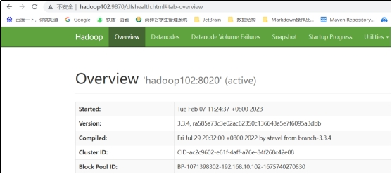 

（5）Web端查看SecondaryNameNode

① 浏览器中输入：http://hadoop104:9868/status.html

​	② 查看SecondaryNameNode信息

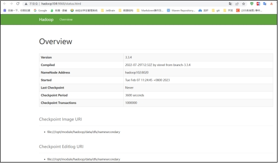 

##### 4.2.2.1.7 Hadoop群起脚本

（1）在/home/atguigu/bin目录下创建hdp.sh

```shell
[atguigu@hadoop102 bin]$ cd /home/atguigu/bin
[atguigu@hadoop102 bin]$ vim hdp.sh
```

（2）写入以下内容：

```shell
#!/bin/bash
if [ $# -lt 1 ]
then
    echo "No Args Input..."
    exit ;
fi
case $1 in
"start")
        echo " =================== 启动 hadoop集群 ==================="

        echo " --------------- 启动 hdfs ---------------"
        ssh hadoop102 "/opt/module/hadoop/sbin/start-dfs.sh"
        echo " --------------- 启动 yarn ---------------"
        ssh hadoop103 "/opt/module/hadoop/sbin/start-yarn.sh"
        echo " --------------- 启动 historyserver ---------------"
        ssh hadoop102 "/opt/module/hadoop/bin/mapred --daemon start historyserver"
;;
"stop")
        echo " =================== 关闭 hadoop集群 ==================="

        echo " --------------- 关闭 historyserver ---------------"
        ssh hadoop102 "/opt/module/hadoop/bin/mapred --daemon stop historyserver"
        echo " --------------- 关闭 yarn ---------------"
        ssh hadoop103 "/opt/module/hadoop/sbin/stop-yarn.sh"
        echo " --------------- 关闭 hdfs ---------------"
        ssh hadoop102 "/opt/module/hadoop/sbin/stop-dfs.sh"
;;
)
    echo "Input Args Error..."
;;
esac
```

（3）增加权限

```shell
[atguigu@hadoop102 bin]$ chmod 777 hdp.sh
```

（4）启动集群

```shell
[atguigu@hadoop102 bin]$ hdp.sh start
```

日志如下。

```shell
=================== 启动 hadoop集群 ===================
 --------------- 启动 hdfs ---------------
Starting namenodes on [hadoop102]
Starting datanodes
Starting secondary namenodes [hadoop104]
 --------------- 启动 yarn ---------------
Starting resourcemanager
Starting nodemanagers
 --------------- 启动 historyserver ---------------
```

查看进程。

```shell
[atguigu@hadoop102 bin]$ xcall jps
```

结果如下。

```shell
--------- hadoop102 ----------
3074 Jps
2116 NameNode
2245 DataNode
2761 JobHistoryServer
2590 NodeManager
--------- hadoop103 ----------
3270 NodeManager
2952 DataNode
3148 ResourceManager
3854 Jps
--------- hadoop104 ----------
1889 DataNode
2100 NodeManager
2446 Jps
1967 SecondaryNameNode
```

（5）停止集群

```shell
[atguigu@hadoop102 bin]$ hdp.sh stop
```

日志如下

```shell
=================== 关闭 hadoop集群 ===================
 --------------- 关闭 historyserver ---------------
 --------------- 关闭 yarn ---------------
Stopping nodemanagers
Stopping resourcemanager
 --------------- 关闭 hdfs ---------------
Stopping namenodes on [hadoop102]
Stopping datanodes
Stopping secondary namenodes [hadoop104]
```

查看进程。

```shell
[atguigu@hadoop102 bin]$ xcall jps
```

结果如下。

```shell
--------- hadoop102 ----------
3691 Jps
--------- hadoop103 ----------
4221 Jps
--------- hadoop104 ----------
2647 Jps
```

#### 4.2.2.2 项目经验

（1）项目经验之HDFS存储多目录

1. 生产环境服务器磁盘情况

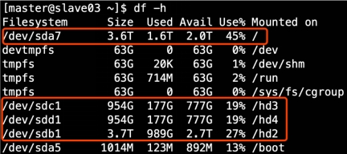 

2. 在hdfs-site.xml文件中配置多目录，注意新挂载磁盘的访问权限问题。

HDFS的DataNode节点保存数据的路径由dfs.datanode.data.dir参数决定，其默认值为file://${hadoop.tmp.dir}/dfs/data，若服务器有多个磁盘，必须对该参数进行修改。如服务器磁盘如上图所示，则该参数应修改为如下的值。

```xml
<property>
    <name>dfs.datanode.data.dir</name>
    <value>file:///dfs/data1,file:///hd2/dfs/data2,file:///hd3/dfs/data3,file:///hd4/dfs/data4</value>
</property>
```

注意：每台服务器挂载的磁盘不一样，所以每个节点的多目录配置可以不一致。单独配置即可。

（2）项目经验之集群数据均衡

1. 节点间数据均衡

开启数据均衡命令：

```shell
start-balancer.sh -threshold 10
```

对于参数10，代表的是集群中各个节点的磁盘空间利用率相差不超过10%，可根据实际情况进行调整。

停止数据均衡命令：

```shell
stop-balancer.sh
```

2. 磁盘间数据均衡

生成均衡计划（我们只有一块磁盘，不会生成计划）

```shell
hdfs diskbalancer -plan hadoop103
```

执行均衡计划。

```shell
hdfs diskbalancer -execute hadoop103.plan.json
```

查看当前均衡任务的执行情况。

```shell
hdfs diskbalancer -query hadoop103
```

取消均衡任务。

```shell
hdfs diskbalancer -cancel hadoop103.plan.json
```

（3）项目经验之Hadoop参数调优

1. HDFS参数调优hdfs-site.xml

```shell
The number of Namenode RPC server threads that listen to requests from clients. If dfs.namenode.servicerpc-address is not configured then Namenode RPC server threads listen to requests from all nodes.
NameNode有一个工作线程池，用来处理不同DataNode的并发心跳以及客户端并发的元数据操作。
对于大集群或者有大量客户端的集群来说，通常需要增大参数dfs.namenode.handler.count的默认值10。
<property>
    <name>dfs.namenode.handler.count</name>
    <value>10</value>
</property>
```

dfs.namenode.handler.count=，比如集群规模为8台时，此参数设置为41。可通过简单的python代码计算该值，代码如下。

```shell
[atguigu@hadoop102 ~]$ python
Python 2.7.5 (default, Apr 11 2018, 07:36:10) 
[GCC 4.8.5 20150623 (Red Hat 4.8.5-28)] on linux2
Type "help", "copyright", "credits" or "license" for more information.
>>> import math
>>> print int(20math.log(8))
41
>>> quit()
```

2. YARN参数调优yarn-site.xml

情景描述：总共7台机器，每天几亿条数据，数据源->Flume->Kafka->HDFS->Hive

面临问题：数据统计主要用HiveSQL，没有数据倾斜，小文件已经做了合并处理，开启的JVM重用，而且IO没有阻塞，内存用了不到50%。但是还是跑的非常慢，而且数据量洪峰过来时，整个集群都会宕掉。基于这种情况有没有优化方案。

解决办法：

内存利用率不够。这个一般是Yarn的2个配置造成的，单个任务可以申请的最大内存大小，和Hadoop单个节点可用内存大小。调节这两个参数能提高系统内存的利用率。

（a）yarn.nodemanager.resource.memory-mb

表示该节点上YARN可使用的物理内存总量，默认是8192（MB），注意，如果你的节点内存资源不够8GB，则需要调减小这个值，而YARN不会智能的探测节点的物理内存总量。

（b）yarn.scheduler.maximum-allocation-mb

单个任务可申请的最多物理内存量，默认是8192（MB）。

### 4.2.3 Zookeeper安装

#### 4.2.3.1 分布式安装部署

1）集群规划

在hadoop102、hadoop103和hadoop104三个节点上部署Zookeeper。

|           | 服务器hadoop102 | 服务器hadoop103 | 服务器hadoop104 |
| --------- | --------------- | --------------- | --------------- |
| Zookeeper | Zookeeper       | Zookeeper       | Zookeeper       |

2）解压安装

（1）解压Zookeeper安装包到/opt/module/目录下

```shell
[atguigu@hadoop102 software]$ tar -zxvf apache-zookeeper-3.7.1-bin.tar.gz -C /opt/module/
```

（2）修改/opt/module/apache-zookeeper-3.7.1-bin名称为zookeeper-3.7.1

```shell
[atguigu@hadoop102 module]$ mv apache-zookeeper-3.7.1-bin/ zookeeper
```

3）配置服务器编号

（1）在/opt/module/zookeeper/目录下创建zkData

```shell
[atguigu@hadoop102 zookeeper]$ mkdir zkData
```

（2）在/opt/module/zookeeper/zkData目录下创建一个myid的文件

```shell
[atguigu@hadoop102 zkData]$ vim myid
```

添加myid文件，注意一定要在linux里面创建，在notepad++里面很可能乱码

在文件中添加与server对应的编号：

```shell
2
```

4）配置zoo.cfg文件

（1）重命名/opt/module/zookeeper/conf目录下的zoo_sample.cfg为zoo.cfg

```shell
[atguigu@hadoop102 conf]$ mv zoo_sample.cfg zoo.cfg
```

（2）打开zoo.cfg文件

```shell
[atguigu@hadoop102 conf]$ vim zoo.cfg
```

修改数据存储路径配置

```shell
dataDir=/opt/module/zookeeper/zkData
```

增加如下配置

```shell
#######################cluster##########################
server.2=hadoop102:2888:3888
server.3=hadoop103:2888:3888
server.4=hadoop104:2888:3888
```

（3）同步/opt/module/zookeeper目录内容到hadoop103、hadoop104

```shell
[atguigu@hadoop102 module]$ xsync zookeeper/
```

（4）分别修改hadoop103、hadoop104上的myid文件中内容为3、4

（5）zoo.cfg配置参数解读

```shell
server.A=B:C:D。
```

A是一个数字，表示这个是第几号服务器；

集群模式下配置一个文件myid，这个文件在dataDir目录下，这个文件里面有一个数据就是A的值，Zookeeper启动时读取此文件，拿到里面的数据与zoo.cfg里面的配置信息比较从而判断到底是哪个server。

B是这个服务器的地址；

C是这个服务器Follower与集群中的Leader服务器交换信息的端口；

D是万一集群中的Leader服务器挂了，需要一个端口来重新进行选举，选出一个新的Leader，而这个端口就是用来执行选举时服务器相互通信的端口。

5）集群操作

（1）分别启动Zookeeper

```shell
[atguigu@hadoop102 zookeeper]$ bin/zkServer.sh start
[atguigu@hadoop103 zookeeper]$ bin/zkServer.sh start
[atguigu@hadoop104 zookeeper]$ bin/zkServer.sh start
```

（2）查看状态

```shell
[atguigu@hadoop102 zookeeper]# bin/zkServer.sh status
JMX enabled by default
Using config: /opt/module/zookeeper/bin/../conf/zoo.cfg
Mode: follower
[atguigu@hadoop103 zookeeper]# bin/zkServer.sh status
JMX enabled by default
Using config: /opt/module/zookeeper/bin/../conf/zoo.cfg
Mode: leader
[atguigu@hadoop104 zookeeper]# bin/zkServer.sh status
JMX enabled by default
Using config: /opt/module/zookeeper/bin/../conf/zoo.cfg
Mode: follower
```

#### 4.2.3.2 ZK集群启动停止脚本

1）在hadoop102的/home/atguigu/bin目录下创建脚本

```shell
[atguigu@hadoop102 bin]$ vim zk.sh
```

​	在脚本中编写如下内容。

```shell
#!/bin/bash

case $1 in
"start"){
	for i in hadoop102 hadoop103 hadoop104
	do
        echo ---------- zookeeper $i 启动 ------------
		ssh $i "/opt/module/zookeeper/bin/zkServer.sh start"
	done
};;
"stop"){
	for i in hadoop102 hadoop103 hadoop104
	do
        echo ---------- zookeeper $i 停止 ------------    
		ssh $i "/opt/module/zookeeper/bin/zkServer.sh stop"
	done
};;
"status"){
	for i in hadoop102 hadoop103 hadoop104
	do
        echo ---------- zookeeper $i 状态 ------------    
		ssh $i "/opt/module/zookeeper/bin/zkServer.sh status"
	done
};;
esac
```

2）增加脚本执行权限

```shell
[atguigu@hadoop102 bin]$ chmod 777 zk.sh
```

3）Zookeeper集群启动脚本

```shell
[atguigu@hadoop102 module]$ zk.sh start
```

4）Zookeeper集群停止脚本

```shell
[atguigu@hadoop102 module]$ zk.sh stop
```

#### 4.2.3.3 客户端命令行操作

| 命令基本语法 | 功能描述                                                     |
| ------------ | ------------------------------------------------------------ |
| help         | 显示所有操作命令                                             |
| ls path      | 使用 ls 命令来查看当前znode的子节点-w 监听子节点变化-s  附加次级信息 |
| create       | 普通创建-s  含有序列-e  临时（重启或者超时消失）             |
| get path     | 获得节点的值-w 监听节点内容变化-s  附加次级信息              |
| set          | 设置节点的具体值                                             |
| stat         | 查看节点状态                                                 |
| delete       | 删除节点                                                     |
| deleteall    | 递归删除节点                                                 |

1）启动客户端

```shell
[atguigu@hadoop103 zookeeper]$ bin/zkCli.sh
```

### 4.2.4 Kafka安装

#### 4.2.4.1 安装部署

##### 4.2.4.1.1 集群规划

| hadoop102 | hadoop103 | hadoop104 |
| --------- | --------- | --------- |
| zk        | zk        | zk        |
| kafka     | kafka     | kafka     |

##### 4.2.4.1.2 集群部署

0）官方下载地址：http://kafka.apache.org/downloads.html

1）上传并解压安装包

```shell
[atguigu@hadoop102 software]$ tar -zxvf kafka_2.12-3.3.1.tgz -C /opt/module/
```

2）修改解压后的文件名称

```shell
[atguigu@hadoop102 hadoop]$ cd /opt/module/
[atguigu@hadoop102 module]$ mv kafka_2.12-3.3.1/ kafka
```

3）进入到/opt/module/kafka目录，修改配置文件

```shell
[atguigu@hadoop102 kafka]$ cd config/
[atguigu@hadoop102 config]$ vim server.properties
```

输入以下内容：

```properties
#broker的全局唯一编号，不能重复，只能是数字。
broker.id=0

#broker对外暴露的IP和端口 （每个节点单独配置）
advertised.listeners=PLAINTEXT://hadoop102:9092
#处理网络请求的线程数量
num.network.threads=3
#用来处理磁盘IO的线程数量
num.io.threads=8
#发送套接字的缓冲区大小
socket.send.buffer.bytes=102400
#接收套接字的缓冲区大小
socket.receive.buffer.bytes=102400
#请求套接字的缓冲区大小
socket.request.max.bytes=104857600
#kafka运行日志(数据)存放的路径，路径不需要提前创建，kafka自动帮你创建，可以配置多个磁盘路径，路径与路径之间可以用"，"分隔
log.dirs=/opt/module/kafka/datas
#topic在当前broker上的分区个数
num.partitions=1
#用来恢复和清理data下数据的线程数量
num.recovery.threads.per.data.dir=1
# 每个topic创建时的副本数，默认时1个副本
offsets.topic.replication.factor=1
#segment文件保留的最长时间，超时将被删除
log.retention.hours=168
#每个segment文件的大小，默认最大1G
log.segment.bytes=1073741824
# 检查过期数据的时间，默认5分钟检查一次是否数据过期
log.retention.check.interval.ms=300000
#配置连接Zookeeper集群地址（在zk根目录下创建/kafka，方便管理）
zookeeper.connect=hadoop102:2181,hadoop103:2181,hadoop104:2181/kafka
```

4）分发安装包

```shell
[atguigu@hadoop102 module]$ xsync kafka/
```

5）分别在hadoop103和hadoop104上修改配置文件/opt/module/kafka/config/server.properties中的broker.id及advertised.listeners

​	注：broker.id不得重复，整个集群中唯一。

```shell
[atguigu@hadoop103 module]$ vim kafka/config/server.properties
修改:
# The id of the broker. This must be set to a unique integer for each broker.
broker.id=1
#broker对外暴露的IP和端口 （每个节点单独配置）
advertised.listeners=PLAINTEXT://hadoop103:9092

[atguigu@hadoop104 module]$ vim kafka/config/server.properties
修改:
# The id of the broker. This must be set to a unique integer for each broker.
broker.id=2
#broker对外暴露的IP和端口 （每个节点单独配置）
advertised.listeners=PLAINTEXT://hadoop104:9092
```

6）配置环境变量

（1）在/etc/profile.d/my_env.sh文件中增加kafka环境变量配置

```shell
[atguigu@hadoop102 module]$ sudo vim /etc/profile.d/my_env.sh
```

增加如下内容：

```properties
#KAFKA_HOME
export KAFKA_HOME=/opt/module/kafka
export PATH=$PATH:$KAFKA_HOME/bin
```

（2）刷新一下环境变量。

```shell
[atguigu@hadoop102 module]$ source /etc/profile
```

（3）分发环境变量文件到其他节点，并source。

```shell
[atguigu@hadoop102 module]$ sudo /home/atguigu/bin/xsync /etc/profile.d/my_env.sh
[atguigu@hadoop103 module]$ source /etc/profile
[atguigu@hadoop104 module]$ source /etc/profile
```

7）启动集群

（1）先启动Zookeeper集群，然后启动Kafka。

```shell
[atguigu@hadoop102 kafka]$ zk.sh start 
```

（2）依次在hadoop102、hadoop103、hadoop104节点上启动Kafka。

```shell
[atguigu@hadoop102 kafka]$ bin/kafka-server-start.sh -daemon config/server.properties
[atguigu@hadoop103 kafka]$ bin/kafka-server-start.sh -daemon config/server.properties
[atguigu@hadoop104 kafka]$ bin/kafka-server-start.sh -daemon config/server.properties
```

注意：配置文件的路径要能够到server.properties。

（3）查看进程

```shell
[atguigu@hadoop102 kafka]$ xcall jps
```

如下

```shell
--------- hadoop102 ----------
3768 QuorumPeerMain
4251 Kafka
4349 Jps
--------- hadoop103 ----------
4769 Kafka
4292 QuorumPeerMain
4878 Jps
--------- hadoop104 ----------
3298 Jps
3206 Kafka
2719 QuorumPeerMain
```

8）关闭集群

（1）依次在hadoop102、hadoop103、hadoop104节点上停止Kafka。

```shell
[atguigu@hadoop102 kafka]$ bin/kafka-server-stop.sh 
[atguigu@hadoop103 kafka]$ bin/kafka-server-stop.sh 
[atguigu@hadoop104 kafka]$ bin/kafka-server-stop.sh 
```

（2）查看进程

```shell
[atguigu@hadoop102 kafka]$ xcall jps
```

如下

```shell
--------- hadoop102 ----------
3768 QuorumPeerMain
3868 Jps
--------- hadoop103 ----------
4292 QuorumPeerMain
4390 Jps
--------- hadoop104 ----------
2810 Jps
2719 QuorumPeerMain
```

##### 4.2.4.1.3 集群启停脚本

1）在/home/atguigu/bin目录下创建文件kf.sh脚本文件

```shell
[atguigu@hadoop102 bin]$ vim kf.sh
```

脚本如下：

```shell
#! /bin/bash

case $1 in
"start"){
    for i in hadoop102 hadoop103 hadoop104
    do
        echo " --------启动 $i Kafka-------"
        ssh $i "/opt/module/kafka/bin/kafka-server-start.sh -daemon /opt/module/kafka/config/server.properties"
    done
};;
"stop"){
    for i in hadoop102 hadoop103 hadoop104
    do
        echo " --------停止 $i Kafka-------"
        ssh $i "/opt/module/kafka/bin/kafka-server-stop.sh "
    done
};;
esac
```

2）添加执行权限

```shell
[atguigu@hadoop102 bin]$ chmod 777 kf.sh
```

3）启动集群命令

```shell
[atguigu@hadoop102 ~]$ kf.sh start
```

4）停止集群命令

```shell
[atguigu@hadoop102 ~]$ kf.sh stop
```

注意：停止Kafka集群时，一定要等Kafka所有节点进程全部停止后再停止Zookeeper集群。因为Zookeeper集群当中记录着Kafka集群相关信息，Zookeeper集群一旦先停止，Kafka集群就没有办法再获取停止进程的信息，只能手动杀死Kafka进程了。

#### 4.2.4.2 Kafka命令行操作

##### 4.2.4.2.1 主题命令行操作

1）查看操作主题命令参数

```shell
[atguigu@hadoop102 kafka]$ bin/kafka-topics.sh
```

| 参数                                              | 描述                                 |
| ------------------------------------------------- | ------------------------------------ |
| --bootstrap-server <String: server toconnect to>  | 连接的Kafka Broker主机名称和端口号。 |
| --topic <String: topic>                           | 操作的topic名称。                    |
| --create                                          | 创建主题。                           |
| --delete                                          | 删除主题。                           |
| --alter                                           | 修改主题。                           |
| --list                                            | 查看所有主题。                       |
| --describe                                        | 查看主题详细描述。                   |
| --partitions <Integer: # of partitions>           | 设置分区数。                         |
| --replication-factor<Integer: replication factor> | 设置分区副本。                       |
| --config <String: name=value>                     | 更新系统默认的配置。                 |

2）查看当前服务器中的所有topic

```shell
[atguigu@hadoop102 kafka]$ bin/kafka-topics.sh --bootstrap-server hadoop102:9092 --list
```

3）创建first topic

```shell
[atguigu@hadoop102 kafka]$ bin/kafka-topics.sh --bootstrap-server hadoop102:9092 --create --partitions 1 --replication-factor 3 --topic first
```

选项说明：

--topic 定义topic名

--replication-factor  定义副本数

--partitions  定义分区数

4）查看first主题的详情

```shell
[atguigu@hadoop102 kafka]$ bin/kafka-topics.sh --bootstrap-server hadoop102:9092 --describe --topic first
```

5）修改分区数（注意：分区数只能增加，不能减少）

```shell
[atguigu@hadoop102 kafka]$ bin/kafka-topics.sh --bootstrap-server hadoop102:9092 --alter --topic first --partitions 3
```

6）再次查看first主题的详情

```shell
[atguigu@hadoop102 kafka]$ bin/kafka-topics.sh --bootstrap-server hadoop102:9092 --describe --topic first
```

7）删除topic（学生自己演示）

```shell
[atguigu@hadoop102 kafka]$ bin/kafka-topics.sh --bootstrap-server hadoop102:9092 --delete --topic first
```

##### 4.2.4.2.2 生产者命令行操作

1）查看操作生产者命令参数

```shell
[atguigu@hadoop102 kafka]$ bin/kafka-console-producer.sh
```

| 参数                                             | 描述                                 |
| ------------------------------------------------ | ------------------------------------ |
| --bootstrap-server <String: server toconnect to> | 连接的Kafka Broker主机名称和端口号。 |
| --topic <String: topic>                          | 操作的topic名称。                    |

2）发送消息

```shell
[atguigu@hadoop102 kafka]$ bin/kafka-console-producer.sh --bootstrap-server hadoop102:9092 --topic first
>hello world
>atguigu  atguigu
```

##### 4.2.4.2.3 消费者命令行操作

1）查看操作消费者命令参数

```shell
[atguigu@hadoop102 kafka]$ bin/kafka-console-consumer.sh
```

| 参数                                             | 描述                                 |
| ------------------------------------------------ | ------------------------------------ |
| --bootstrap-server <String: server toconnect to> | 连接的Kafka Broker主机名称和端口号。 |
| --topic <String: topic>                          | 操作的topic名称。                    |
| --from-beginning                                 | 从头开始消费。                       |
| --group <String: consumer group id>              | 指定消费者组名称。                   |

2）消费消息

（1）消费first主题中的数据

```shell
[atguigu@hadoop102 kafka]$ bin/kafka-console-consumer.sh --bootstrap-server hadoop102:9092 --topic first
```

（2）把主题中所有的数据都读取出来（包括历史数据）

```shell
[atguigu@hadoop102 kafka]$ bin/kafka-console-consumer.sh --bootstrap-server hadoop102:9092 --from-beginning --topic first
```

### 4.2.5 Flume安装

按照采集通道规划，需在hadoop102，hadoop104两台节点分别部署一个Flume。可参照以下步骤先在hadoop102安装，然后再进行分发。

#### 4.2.5.1 安装步骤

##### 4.2.5.1.1 安装地址

（1） Flume官网地址：http://flume.apache.org/

（2）文档查看地址：http://flume.apache.org/FlumeUserGuide.html

（3）下载地址：http://archive.apache.org/dist/flume/

##### 4.2.5.1.2 安装部署

（1）将apache-flume-1.10.1-bin.tar.gz上传到linux的/opt/software目录下

（2）解压apache-flume-1.10.1-bin.tar.gz到/opt/module/目录下

```shell
[atguigu@hadoop102 software]$ tar -zxf /opt/software/apache-flume-1.10.1-bin.tar.gz -C /opt/module/
```

（3）修改apache-flume-1.10.1-bin的名称为flume

```shell
[atguigu@hadoop102 module]$ mv /opt/module/apache-flume-1.10.1-bin /opt/module/flume
```

（4）修改conf目录下的log4j2.xml配置文件，配置日志文件路径

```shell
[atguigu@hadoop102 conf]$ vim log4j2.xml

<?xml version="1.0" encoding="UTF-8"?>
<!--
 Licensed to the Apache Software Foundation (ASF) under one or more
 contributor license agreements.  See the NOTICE file distributed with
 this work for additional information regarding copyright ownership.
 The ASF licenses this file to You under the Apache License, Version 2.0
 (the "License"); you may not use this file except in compliance with
 the License.  You may obtain a copy of the License at

      http://www.apache.org/licenses/LICENSE-2.0

 Unless required by applicable law or agreed to in writing, software
 distributed under the License is distributed on an "AS IS" BASIS,
 WITHOUT WARRANTIES OR CONDITIONS OF ANY KIND, either express or implied.
 See the License for the specific language governing permissions and
 limitations under the License.

-->
<Configuration status="ERROR">
  <Properties>
    <Property name="LOG_DIR">/opt/module/flume/log</Property>
  </Properties>
  <Appenders>
    <Console name="Console" target="SYSTEM_ERR">
      <PatternLayout pattern="%d (%t) [%p - %l] %m%n" />
    </Console>
    <RollingFile name="LogFile" fileName="${LOG_DIR}/flume.log" filePattern="${LOG_DIR}/archive/flume.log.%d{yyyyMMdd}-%i">
      <PatternLayout pattern="%d{dd MMM yyyy HH:mm:ss,SSS} %-5p [%t] (%C.%M:%L) %equals{%x}{[]}{} - %m%n" />
      <Policies>
        <!-- Roll every night at midnight or when the file reaches 100MB -->
        <SizeBasedTriggeringPolicy size="100 MB"/>
        <CronTriggeringPolicy schedule="0 0 0 * * ?"/>
      </Policies>
      <DefaultRolloverStrategy min="1" max="20">
        <Delete basePath="${LOG_DIR}/archive">
          <!-- Nested conditions: the inner condition is only evaluated on files for which the outer conditions are true. -->
          <IfFileName glob="flume.log.">
            <!-- Only allow 1 GB of files to accumulate -->
            <IfAccumulatedFileSize exceeds="1 GB"/>
          </IfFileName>
        </Delete>
      </DefaultRolloverStrategy>
    </RollingFile>
  </Appenders>

  <Loggers>
    <Logger name="org.apache.flume.lifecycle" level="info"/>
    <Logger name="org.jboss" level="WARN"/>
    <Logger name="org.apache.avro.ipc.netty.NettyTransceiver" level="WARN"/>
    <Logger name="org.apache.hadoop" level="INFO"/>
<Logger name="org.apache.hadoop.hive" level="ERROR"/>
# 引入控制台输出，方便学习查看日志
    <Root level="INFO">
      <AppenderRef ref="LogFile" />
      <AppenderRef ref="Console" />
    </Root>
  </Loggers>

</Configuration>
```

#### 4.2.5.2 分发Flume

```shell
[atguigu@hadoop102 ~]$ xsync /opt/module/flume/
```

#### 4.2.5.3 项目经验

（1）堆内存调整

Flume堆内存通常设置为4G或更高，配置方式如下：

修改/opt/module/flume/conf/flume-env.sh文件，配置如下参数（虚拟机环境暂不配置）

```shell
export JAVA_OPTS="-Xms4096m -Xmx4096m -Dcom.sun.management.jmxremote"
```

注：

-Xms表示JVM Heap（堆内存）最小尺寸，初始分配。

-Xmx 表示JVM Heap（堆内存）最大允许的尺寸，按需分配。

## 4.3 日志采集Flume

### 4.3.1 日志采集Flume配置概述

按照规划，需要采集的用户行为日志文件存放在hadoop102，故需要在该节点配置日志采集Flume。日志采集Flume需要采集日志文件内容，并对日志格式（JSON）进行校验，然后将校验通过的日志发送到Kafka。

此处可选择 TaildirSource 和 KafkaChannel ，并配置日志校验拦截器。

选择TailDirSource和KafkaChannel的原因如下：

1）TailDirSource

TailDirSource相比ExecSource、SpoolingDirectorySource的优势。

TailDirSource：断点续传、多目录。Flume1.6以前需要自己自定义Source记录每次读取文件位置，实现断点续传。

ExecSource可以实时搜集数据，但是在Flume不运行或者Shell命令出错的情况下，数据将会丢失。

SpoolingDirectorySource监控目录，支持断点续传。

2）KafkaChannel

采用Kafka Channel，省去了Sink，提高了效率。

日志采集Flume关键配置如下：

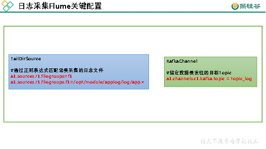

### 4.3.2 日志采集Flume配置实操

1）创建Flume配置文件

在hadoop102节点的Flume的job目录下创建file_to_kafka.conf。

```shell
[atguigu@hadoop102 flume]$ mkdir job
[atguigu@hadoop102 flume]$ vim job/file_to_kafka.conf
```

2）配置文件内容如下

```shell
#定义组件
a1.sources = r1
a1.channels = c1

#配置source
a1.sources.r1.type = TAILDIR
a1.sources.r1.filegroups = f1
a1.sources.r1.filegroups.f1 = /opt/module/applog/log/app.*
a1.sources.r1.positionFile = /opt/module/flume/taildir_position.json

#配置channel
a1.channels.c1.type = org.apache.flume.channel.kafka.KafkaChannel
a1.channels.c1.kafka.bootstrap.servers = hadoop102:9092,hadoop103:9092
a1.channels.c1.kafka.topic = topic_log
a1.channels.c1.parseAsFlumeEvent = false

#组装 
a1.sources.r1.channels = c1
```

### 4.3.3 日志采集Flume测试

1）启动Zookeeper、Kafka集群

2）启动hadoop102的日志采集Flume

```shell
[atguigu@hadoop102 flume]$ bin/flume-ng agent -n a1 -c conf/ -f job/file_to_kafka.conf
```

3）启动一个Kafka的Console-Consumer

```shell
[atguigu@hadoop102 kafka]$ bin/kafka-console-consumer.sh --bootstrap-server hadoop102:9092 --topic topic_log
```

4）生成数据

执行集群日志生成脚本。

```shell
[atguigu@hadoop102 ~]$ lg.sh test 100
```

5）观察Kafka消费者是否能消费到数据

### 4.3.4 日志采集Flume启停脚本

1）在hadoop102节点的/home/atguigu/bin目录下创建脚本f1.sh

```shell
[atguigu@hadoop102 bin]$ vim f1.sh
```

在脚本中填写如下内容。

```shell
#!/bin/bash

case $1 in
"start"){
    echo " --------启动 hadoop102 采集flume-------"
    ssh hadoop102 "nohup /opt/module/flume/bin/flume-ng agent -n a1 -c /opt/module/flume/conf/ -f /opt/module/flume/job/file_to_kafka.conf >/dev/null 2>&1 &"
};; 
"stop"){
    echo " --------停止 hadoop102 采集flume-------"
    ssh hadoop102 "ps -ef | grep file_to_kafka | grep -v grep |awk  '{print \$2}' | xargs -n1 kill -9 "
};;
esac
```

2）增加脚本执行权限

```shell
[atguigu@hadoop102 bin]$ chmod 777 f1.sh
```

3）f1启动

```shell
[atguigu@hadoop102 module]$ f1.sh start
```

4）f1停止

```shell
[atguigu@hadoop102 module]$ f1.sh stop
```

