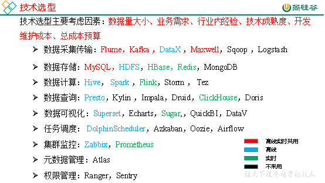
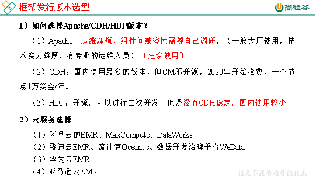
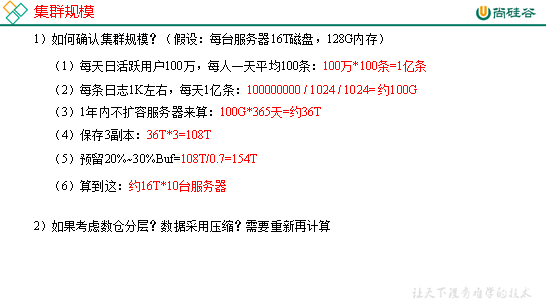
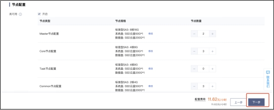

# 第1章 数据仓库概念

数据仓库（ Data Warehouse ），是为企业制定决策，提供数据支持的。可以帮助企业，改进业务流程、提高产品质量等。

数据仓库的输入数据通常包括：业务数据、用户行为数据和爬虫数据等

业务数据：就是各行业在处理事务过程中产生的数据。比如用户在电商网站中登录、下单、支付等过程中，需要和网站后台数据库进行增删改查交互，产生的数据就是业务数据。业务数据通常存储在MySQL、Oracle等数据库中。

 

用户行为数据：用户在使用产品过程中，通过埋点收集与客户端产品交互过程中产生的数据，并发往日志服务器进行保存。比如页面浏览、点击、停留、评论、点赞、收藏等。用户行为数据通常存储在日志文件中。

 

爬虫数据：通常是通过技术手段获取其他公司网站的数据。不建议同学们这样去做。

# 第2章 项目需求及架构设计

## 2.1 项目需求分析

1）采集平台

​	（1）用户行为数据采集平台搭建

​	（2）业务数据采集平台搭建

2）离线需求

3）实时需求

4）思考题

（1）项目技术如何选型？

（2）框架版本如何选型（Apache、CDH、HDP）

（3）服务器使用物理机还是云主机？

（4）如何确认集群规模？（假设每台服务器16T硬盘）

## 2.2 项目框架

### 2.2.1 技术选型

### 2.2.2 系统数据流程设计

### 2.2.3 框架版本选型

### 2.2.4 服务器选型

### 2.2.5 集群规模

### 2.2.6 集群资源规划设计

在企业中通常会搭建一套生产集群和一套测试集群。生产集群运行生产任务，测试集群用于上线前代码编写和测试。

1）生产集群

​	（1）参考腾讯云EMR官方推荐部署

 

Ø Master节点：管理节点，保证集群的调度正常进行；主要部署NameNode、ResourceManager、HMaster 等进程；非 HA 模式下数量为1，HA 模式下数量为2。

Ø Core节点：为计算及存储节点，您在 HDFS 中的数据全部存储于 core 节点中，因此为了保证数据安全，扩容 core 节点后不允许缩容；主要部署 DataNode、NodeManager、RegionServer 等进程。非 HA 模式下数量≥2，HA 模式下数量≥3。

Ø Common 节点：为 HA 集群 Master 节点提供数据共享同步以及高可用容错服务；主要部署分布式协调器组件，如 ZooKeeper、JournalNode 等节点。非HA模式数量为0，HA 模式下数量≥3。

（2）消耗内存的分开部署

（3）数据传输数据比较紧密的放在一起（Kafka、clickhouse）

（4）客户端尽量放在一到两台服务器上，方便外部访问

（5）有依赖关系的尽量放到同一台服务器（例如：Ds-worker和hive/spark）

| Master    | Master    | core       | core      | core      | common      | common      | common      |
| --------- | --------- | ---------- | --------- | --------- | ----------- | ----------- | ----------- |
| nn        | nn        | dn         | dn        | dn        | JournalNode | JournalNode | JournalNode |
| rm        | rm        | nm         | nm        | nm        |             |             |             |
|           |           |            |           |           | zk          | zk          | zk          |
| hive      | hive      | hive       | hive      | hive      |             |             |             |
|           |           | kafka      | kafka     | kafka     |             |             |             |
| spark     | spark     | spark      | spark     | spark     |             |             |             |
| datax     | datax     | datax      | datax     | datax     |             |             |             |
| Ds-master | Ds-master | Ds-worker  | Ds-worker | Ds-worker |             |             |             |
| maxwell   |           |            |           |           |             |             |             |
| superset  |           |            |           |           |             |             |             |
| mysql     |           |            |           |           |             |             |             |
| flume     | flume     |            |           |           |             |             |             |
| flink     | flink     |            |           |           |             |             |             |
|           |           | clickhouse |           |           |             |             |             |
|           |           |            | redis     |           |             |             |             |
| hbase     |           |            |           |           |             |             |             |

2）测试集群服务器规划

| 服务名称               | 子服务               | 服务器hadoop102 | 服务器hadoop103 | 服务器hadoop104 |
| ---------------------- | -------------------- | --------------- | --------------- | --------------- |
| HDFS                   | NameNode             | √               |                 |                 |
|                        | DataNode             | √               | √               | √               |
|                        | SecondaryNameNode    |                 |                 | √               |
| Yarn                   | NodeManager          | √               | √               | √               |
|                        | Resourcemanager      |                 | √               |                 |
| Zookeeper              | Zookeeper Server     | √               | √               | √               |
| Flume（采集日志）      | Flume                | √               | √               |                 |
| Kafka                  | Kafka                | √               | √               | √               |
| Flume（消费Kafka日志） | Flume                |                 |                 | √               |
| Flume（消费Kafka业务） | Flume                |                 |                 | √               |
| Hive                   |                      | √               | √               | √               |
| MySQL                  | MySQL                | √               |                 |                 |
| DataX                  |                      | √               | √               | √               |
| Spark                  |                      | √               | √               | √               |
| DolphinScheduler       | ApiApplicationServer | √               |                 |                 |
|                        | AlertServer          | √               |                 |                 |
|                        | MasterServer         | √               |                 |                 |
|                        | WorkerServer         | √               | √               | √               |
|                        | LoggerServer         | √               | √               | √               |
| Superset               | Superset             | √               |                 |                 |
| Flink                  |                      | √               |                 |                 |
| ClickHouse             |                      | √               |                 |                 |
| Redis                  |                      | √               |                 |                 |
| Hbase                  |                      | √               |                 |                 |
| 服务数总计             |                      | 20              | 11              | 12              |
