# 第1章 DolphinScheduler简介

## 1.1 DolphinScheduler概述

Apache DolphinScheduler是一个分布式、易扩展的可视化DAG工作流任务调度平台。致力于解决数据处理流程中错综复杂的依赖关系，使调度系统在数据处理流程中开箱即用。

## 1.2 DolphinScheduler核心架构

DolphinScheduler的主要角色如下：

MasterServer采用分布式无中心设计理念，MasterServer主要负责 DAG 任务切分、任务提交、任务监控，并同时监听其它MasterServer和WorkerServer的健康状态。

WorkerServer也采用分布式无中心设计理念，WorkerServer主要负责任务的执行和提供日志服务。

ZooKeeper服务，系统中的MasterServer和WorkerServer节点都通过ZooKeeper来进行集群管理和容错。

Alert服务，提供告警相关服务。

API接口层，主要负责处理前端UI层的请求。

UI，系统的前端页面，提供系统的各种可视化操作界面。

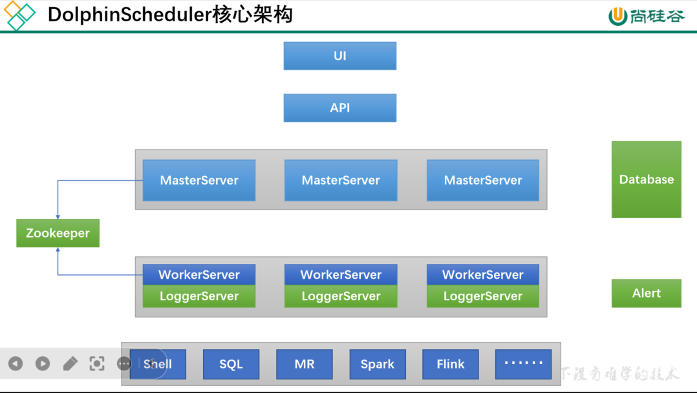

# 第2章 DolphinScheduler部署说明

## 2.1 软硬件环境要求

### 2.1.1 操作系统版本要求

| 操作系统                 | 版本         |
| ------------------------ | ------------ |
| Red Hat Enterprise Linux | 7.0 及以上   |
| CentOS                   | 7.0 及以上   |
| Oracle Enterprise Linux  | 7.0 及以上   |
| Ubuntu LTS               | 16.04 及以上 |

### 2.1.2 服务器硬件要求

| CPU  | 内存  | 硬盘类型 | 网络     | 实例数量 |
| ---- | ----- | -------- | -------- | -------- |
| 4核+ | 8 GB+ | SAS      | 千兆网卡 | 1+       |

## 2.2 部署模式

DolphinScheduler支持多种部署模式，包括单机模式（Standalone）、伪集群模式（Pseudo-Cluster）、集群模式（Cluster）等。

### 2.2.1 单机模式

单机模式（standalone）模式下，所有服务均集中于一个StandaloneServer进程中，并且其中内置了注册中心Zookeeper和数据库H2。只需配置JDK环境，就可一键启动DolphinScheduler，快速体验其功能。

### 2.2.2 伪集群模式

伪集群模式（Pseudo-Cluster）是在单台机器部署 DolphinScheduler 各项服务，该模式下master、worker、api server、logger server等服务都只在同一台机器上。Zookeeper和数据库需单独安装并进行相应配置。

### 2.2.3 集群模式

集群模式（Cluster）与伪集群模式的区别就是在多台机器部署 DolphinScheduler各项服务，并且Master、Worker等服务可配置多个。

# 第3章 DolphinScheduler集群模式部署

## 3.1 集群规划

集群模式下，可配置多个Master及多个Worker。通常可配置2~3个Master，若干个Worker。由于集群资源有限，此处配置一个Master，三个Worker，集群规划如下。

| hadoop102 | master、worker |
| --------- | -------------- |
| hadoop103 | worker         |
| hadoop104 | worker         |

## 3.2 前置准备工作

（1）三台节点均需部署JDK（1.8+），并配置相关环境变量。

（2）需部署数据库，支持MySQL（5.7+）或者PostgreSQL（8.2.15+）。

（3）需部署Zookeeper（3.4.6+）。

（4）如果启用 HDFS 文件系统，则需要 Hadoop（2.6+）环境。

（5）三台节点均需安装进程树分析工具psmisc。

```shell
[atguigu@hadoop102 ~]$ sudo yum install -y psmisc
[atguigu@hadoop103 ~]$ sudo yum install -y psmisc
[atguigu@hadoop104 ~]$ sudo yum install -y psmisc
```

## 3.3 解压DolphinScheduler安装包

（1）上传DolphinScheduler安装包到hadoop102节点的/opt/software目录

（2）解压安装包到当前目录

注：解压目录并非最终的安装目录

```shell
[atguigu@hadoop102 software]$ tar -zxvf apache-dolphinscheduler-2.0.5-bin 
```

## 3.4 创建元数据库及用户

DolphinScheduler 元数据存储在关系型数据库中，故需创建相应的数据库和用户。

（1）创建数据库

```shell
mysql> CREATE DATABASE dolphinscheduler DEFAULT CHARACTER SET utf8 DEFAULT COLLATE utf8_general_ci;
```

（2）创建用户

```shell
mysql> CREATE USER 'dolphinscheduler'@'%' IDENTIFIED BY 'dolphinscheduler';
```

注：

若出现以下错误信息，表明新建用户的密码过于简单。

```shell
ERROR 1819 (HY000): Your password does not satisfy the current policy requirements
```

可提高密码复杂度或者执行以下命令降低MySQL密码强度级别。

```shell
mysql> set global validate_password_policy=0;
mysql> set global validate_password_length=4;
```

（3）赋予用户相应权限

```shell
mysql> GRANT ALL PRIVILEGES ON dolphinscheduler. TO 'dolphinscheduler'@'%';
mysql> flush privileges;
```

## 3.5 配置一键部署脚本

修改解压目录下的conf/config目录下的install_config.conf文件。

```shell
[atguigu@hadoop102 apache-dolphinscheduler-2.0.5-bin]$ vim conf/config/install_config.conf 
```

修改内容如下。

```properties
#
# Licensed to the Apache Software Foundation (ASF) under one or more
# contributor license agreements.  See the NOTICE file distributed with
# this work for additional information regarding copyright ownership.
# The ASF licenses this file to You under the Apache License, Version 2.0
# (the "License"); you may not use this file except in compliance with
# the License.  You may obtain a copy of the License at
#
#     http://www.apache.org/licenses/LICENSE-2.0
#
# Unless required by applicable law or agreed to in writing, software
# distributed under the License is distributed on an "AS IS" BASIS,
# WITHOUT WARRANTIES OR CONDITIONS OF ANY KIND, either express or implied.
# See the License for the specific language governing permissions and
# limitations under the License.
#

# ---------------------------------------------------------
# INSTALL MACHINE
# ---------------------------------------------------------
# A comma separated list of machine hostname or IP would be installed DolphinScheduler,
# including master, worker, api, alert. If you want to deploy in pseudo-distributed
# mode, just write a pseudo-distributed hostname
# Example for hostnames: ips="ds1,ds2,ds3,ds4,ds5", Example for IPs: ips="192.168.8.1,192.168.8.2,192.168.8.3,192.168.8.4,192.168.8.5"
ips="hadoop102,hadoop103,hadoop104" 
# 将要部署任一 DolphinScheduler 服务的服务器主机名或 ip 列表

# Port of SSH protocol, default value is 22. For now we only support same port in all `ips` machine
# modify it if you use different ssh port
sshPort="22"

# A comma separated list of machine hostname or IP would be installed Master server, it
# must be a subset of configuration `ips`.
# Example for hostnames: masters="ds1,ds2", Example for IPs: masters="192.168.8.1,192.168.8.2"
masters="hadoop102" 
# master 所在主机名列表，必须是 ips 的子集

# A comma separated list of machine <hostname>:<workerGroup> or <IP>:<workerGroup>.All hostname or IP must be a
# subset of configuration `ips`, And workerGroup have default value as `default`, but we recommend you declare behind the hosts
# Example for hostnames: workers="ds1:default,ds2:default,ds3:default", Example for IPs: workers="192.168.8.1:default,192.168.8.2:default,192.168.8.3:default"
workers="hadoop102:default,hadoop103:default,hadoop104:default" 
# worker主机名及队列，此处的 ip 必须在 ips 列表中

# A comma separated list of machine hostname or IP would be installed Alert server, it
# must be a subset of configuration `ips`.
# Example for hostname: alertServer="ds3", Example for IP: alertServer="192.168.8.3"
alertServer="hadoop102"
# 告警服务所在服务器主机名
# A comma separated list of machine hostname or IP would be installed API server, it
# must be a subset of configuration `ips`.
# Example for hostname: apiServers="ds1", Example for IP: apiServers="192.168.8.1"
apiServers="hadoop102"
# api服务所在服务器主机名

# A comma separated list of machine hostname or IP would be installed Python gateway server, it
# must be a subset of configuration `ips`.
# Example for hostname: pythonGatewayServers="ds1", Example for IP: pythonGatewayServers="192.168.8.1"
# pythonGatewayServers="ds1" 
# 不需要的配置项，可以保留默认值，也可以用 # 注释

# The directory to install DolphinScheduler for all machine we config above. It will automatically be created by `install.sh` script if not exists.
# Do not set this configuration same as the current path (pwd)
installPath="/opt/module/dolphinscheduler"
# DS 安装路径，如果不存在会创建

# The user to deploy DolphinScheduler for all machine we config above. For now user must create by yourself before running `install.sh`
# script. The user needs to have sudo privileges and permissions to operate hdfs. If hdfs is enabled than the root directory needs
# to be created by this user
deployUser="atguigu"
# 部署用户，任务执行服务是以 sudo -u {linux-user} 切换不同 Linux 用户的方式来实现多租户运行作业，因此该用户必须有免密的 sudo 权限。

# The directory to store local data for all machine we config above. Make sure user `deployUser` have permissions to read and write this directory.
dataBasedirPath="/tmp/dolphinscheduler"
# 前文配置的所有节点的本地数据存储路径，需要确保部署用户拥有该目录的读写权限

# ---------------------------------------------------------
# DolphinScheduler ENV
# ---------------------------------------------------------
# JAVA_HOME, we recommend use same JAVA_HOME in all machine you going to install DolphinScheduler
# and this configuration only support one parameter so far.
javaHome="/opt/module/jdk1.8.0_212"
# JAVA_HOME 路径

# DolphinScheduler API service port, also this is your DolphinScheduler UI component's URL port, default value is 12345
apiServerPort="12345"

# ---------------------------------------------------------
# Database
# NOTICE: If database value has special characters, such as `.*[]^${}\+?|()@#&`, Please add prefix `\` for escaping.
# ---------------------------------------------------------
# The type for the metadata database
# Supported values: ``postgresql``, ``mysql`, `h2``.
# 注意：数据库相关配置的 value 必须加引号，否则配置无法生效

DATABASE_TYPE="mysql"
# 数据库类型

# Spring datasource url, following <HOST>:<PORT>/<database>?<parameter> format, If you using mysql, you could use jdbc
# string jdbc:mysql://127.0.0.1:3306/dolphinscheduler?useUnicode=true&characterEncoding=UTF-8 as example
# SPRING_DATASOURCE_URL=${SPRING_DATASOURCE_URL:-"jdbc:h2:mem:dolphinscheduler;MODE=MySQL;DB_CLOSE_DELAY=-1;DATABASE_TO_LOWER=true"}
SPRING_DATASOURCE_URL="jdbc:mysql://hadoop102:3306/dolphinscheduler?useUnicode=true&characterEncoding=UTF-8"
# 数据库 URL

# Spring datasource username
# SPRING_DATASOURCE_USERNAME=${SPRING_DATASOURCE_USERNAME:-"sa"}
SPRING_DATASOURCE_USERNAME="dolphinscheduler"
# 数据库用户名

# Spring datasource password
# SPRING_DATASOURCE_PASSWORD=${SPRING_DATASOURCE_PASSWORD:-""}
SPRING_DATASOURCE_PASSWORD="dolphinscheduler"
# 数据库密码

# ---------------------------------------------------------
# Registry Server
# ---------------------------------------------------------
# Registry Server plugin name, should be a substring of `registryPluginDir`, DolphinScheduler use this for verifying configuration consistency
registryPluginName="zookeeper"
# 注册中心插件名称，DS 通过注册中心来确保集群配置的一致性

# Registry Server address.
registryServers="hadoop102:2181,hadoop103:2181,hadoop104:2181"
# 注册中心地址，即 Zookeeper 集群的地址

# Registry Namespace
registryNamespace="dolphinscheduler"
# DS 在 Zookeeper 的结点名称

# ---------------------------------------------------------
# Worker Task Server
# ---------------------------------------------------------
# Worker Task Server plugin dir. DolphinScheduler will find and load the worker task plugin jar package from this dir.
taskPluginDir="lib/plugin/task"

# resource storage type: HDFS, S3, NONE
resourceStorageType="HDFS"	
# 资源存储类型

# resource store on HDFS/S3 path, resource file will store to this hdfs path, self configuration, please make sure the directory exists on hdfs and has read write permissions. "/dolphinscheduler" is recommended
resourceUploadPath="/dolphinscheduler"
# 资源上传路径

# if resourceStorageType is HDFS，defaultFS write namenode address，HA, you need to put core-site.xml and hdfs-site.xml in the conf directory.
# if S3，write S3 address，HA，for example ：s3a://dolphinscheduler，
# Note，S3 be sure to create the root directory /dolphinscheduler
defaultFS="hdfs://hadoop102:8020"
# 默认文件系统

# if resourceStorageType is S3, the following three configuration is required, otherwise please ignore
s3Endpoint="http://192.168.xx.xx:9010"
s3AccessKey="xxxxxxxxxx"
s3SecretKey="xxxxxxxxxx"

# resourcemanager port, the default value is 8088 if not specified
resourceManagerHttpAddressPort="8088"
# yarn RM http 访问端口

# if resourcemanager HA is enabled, please set the HA IPs; if resourcemanager is single node, keep this value empty
yarnHaIps=
# Yarn RM 高可用 ip，若未启用 RM 高可用，则将该值置空

# if resourcemanager HA is enabled or not use resourcemanager, please keep the default value; If resourcemanager is single node, you only need to replace 'yarnIp1' to actual resourcemanager hostname
singleYarnIp="hadoop103"
# Yarn RM 主机名，若启用了 HA 或未启用 RM，保留默认值

# who has permission to create directory under HDFS/S3 root path
# Note: if kerberos is enabled, please config hdfsRootUser=
hdfsRootUser="atguigu"
# 拥有 HDFS 根目录操作权限的用户

# kerberos config
# whether kerberos starts, if kerberos starts, following four items need to config, otherwise please ignore
kerberosStartUp="false"
# kdc krb5 config file path
krb5ConfPath="$installPath/conf/krb5.conf"
# keytab username,watch out the @ sign should followd by \\
keytabUserName="hdfs-mycluster\\@ESZ.COM"
# username keytab path
keytabPath="$installPath/conf/hdfs.headless.keytab"
# kerberos expire time, the unit is hour
kerberosExpireTime="2"

# use sudo or not
sudoEnable="true"

# worker tenant auto create
workerTenantAutoCreate="false"
```

## 3.6 初始化数据库

（1）拷贝MySQL驱动到DolphinScheduler的解压目录下的lib中，要求使用 MySQL JDBC Driver 8.0.16。

```shell
[atguigu@hadoop102 apache-dolphinscheduler-2.0.5-bin]$ cp /opt/software/mysql-connector-java-8.0.16.jar lib/
```

（2）执行数据库初始化脚本

数据库初始化脚本位于DolphinScheduler解压目录下的script目录中，即/opt/software/ds/apache-dolphinscheduler-2.0.5-bin/script/。

```shell
[atguigu@hadoop102 apache-dolphinscheduler-2.0.5-bin]$ script/create-dolphinscheduler.sh
```

## 3.7 一键部署DolphinScheduler

（1）启动Zookeeper集群

```shell
[atguigu@hadoop102 apache-dolphinscheduler-2.0.5-bin]$ zk.sh start
```

（2）一键部署并启动DolphinScheduler

```shell
[atguigu@hadoop102 apache-dolphinscheduler-2.0.5-bin]$ ./install.sh 
```

（3）查看DolphinScheduler进程

```shell
--------- hadoop102 ----------
29139 ApiApplicationServer
28963 WorkerServer
3332 QuorumPeerMain
2100 DataNode
28902 MasterServer
29081 AlertServer
1978 NameNode
29018 LoggerServer
2493 NodeManager
29551 Jps
--------- hadoop103 ----------
29568 Jps
29315 WorkerServer
2149 NodeManager
1977 ResourceManager
2969 QuorumPeerMain
29372 LoggerServer
1903 DataNode
--------- hadoop104 ----------
1905 SecondaryNameNode
27074 WorkerServer
2050 NodeManager
2630 QuorumPeerMain
1817 DataNode
27354 Jps
27133 LoggerServer
```

（4）访问DolphinScheduler UI

DolphinScheduler UI地址为http://hadoop102:12345/dolphinscheduler

初始用户的用户名为：admin，密码为dolphinscheduler123

## 3.8 DolphinScheduler启停命令

DolphinScheduler的启停脚本均位于其安装目录的bin目录下。

1）一键启停所有服务

```shell
./bin/start-all.sh
./bin/stop-all.sh
```

注意同Hadoop的启停脚本进行区分。

2）启停 Master

```shell
./bin/dolphinscheduler-daemon.sh start master-server
./bin/dolphinscheduler-daemon.sh stop master-server
```

3）启停 Worker

```shell
./bin/dolphinscheduler-daemon.sh start worker-server
./bin/dolphinscheduler-daemon.sh stop worker-server
```

4）启停 Api

```shell
./bin/dolphinscheduler-daemon.sh start api-server
./bin/dolphinscheduler-daemon.sh stop api-server
```

5）启停 Logger

```shell
./bin/dolphinscheduler-daemon.sh start logger-server
./bin/dolphinscheduler-daemon.sh stop logger-server
```

6）启停 Alert

```shell
./bin/dolphinscheduler-daemon.sh start alert-server
./bin/dolphinscheduler-daemon.sh stop alert-server
```

# 第4章 DolphinScheduler入门

## 4.1 安全中心配置

安全中心主要有租户管理、用户管理、告警组管理、告警实例管理、Worker分组管理、Yarn 队列管理、环境管理、令牌管理等功能。

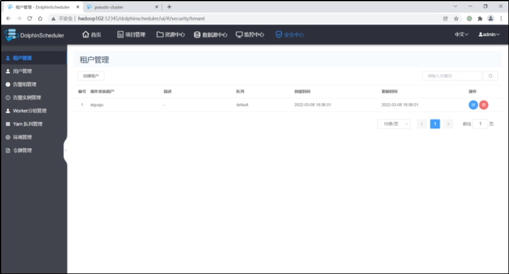 

### 4.1.1 Yarn 队列管理

队列是在执行spark、mapreduce等程序，需要用到“队列”参数时使用的。

此处的队列对应的是Yarn调度器的资源队列。故队列概念只对跑在Yarn上的任务类型有效。此处创建出的队列，可供后续任务进行选择。需要注意的是，在DolphinScheduler中创建队列，并不会影响到Yarn调度器的队列配置。

此处可不创建队列。

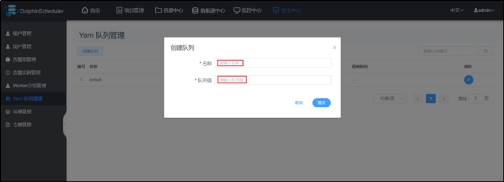 

​	注：

Ø 名称：DS 执行任务时可以选择的队列名称。

Ø 队列值：与名称相对应的 Yarn 调度队列的名称。

### 4.1.2 租户管理

租户对应的是Linux的用户，用于worker提交作业所使用的用户。如果linux没有这个用户，默认情况下会导致任务运行失败。可以通过修改 worker.properties 配置文件中参数 worker.tenant.auto.create=true（默认值为 false）实现当 linux 用户不存在时自动创建该用户。worker.tenant.auto.create=true 参数会要求 worker 可以免密运行 sudo 命令。

此处创建一个atguigu租户，如下图。

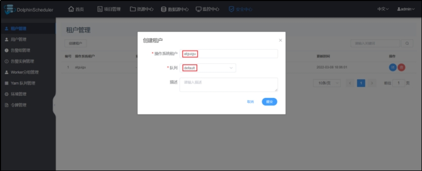 

注：

Ø 租户编码：租户编码是Linux上的用户，唯一，不能重复。

Ø 队列：该租户提交Yarn任务时的默认队列。

### 4.1.3 用户管理

用户对应的是DolphinScheduler的用户，用于登录DolphinScheduler。用户分管理员用户和普通用户。

管理员有授权和用户管理等权限，没有创建项目和工作流定义的操作的权限。

普通用户可以创建项目和对工作流定义的创建，编辑，执行等操作。

此处创建一个普通用户atguigu，如下图。

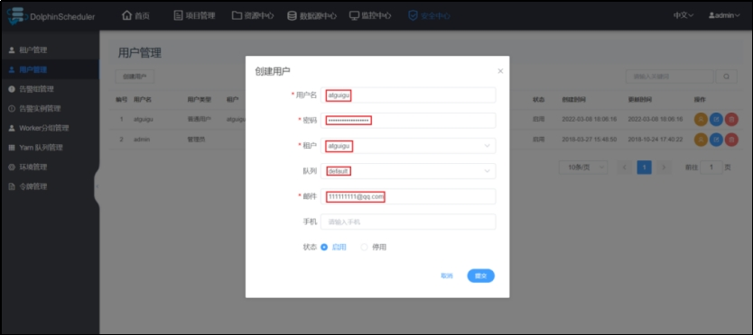 

注：

Ø 用户名：DolphinScheduler登录账户

Ø 租户：该用户关联的租户

Ø 队列：默认为租户所关联的队列。

Ø 邮件、手机号：主要用于告警通知。

### 4.1.4 告警实例管理与告警组管理

告警实例与告警组用于任务运行成功或者失败之后的告警通知。一个告警组可包含多个告警实例，一个告警实例，需选择一个告警插件，并配置相应参数，目前支持的告警插件有电子邮件、钉钉、企业微信、飞书等。

此处暂不配置。

### 4.1.5 Worker分组管理

一个Worker分组由多个Worker组成。在任务执行时，可以将任务分配给指定Worker组，由该组中的Worker节点执行该任务。每个Worker至少属于一个组，默认为default组。Worker所属分组可以调整，调整方式如下：

1）方式一

打开要设置分组的Worker节点上的worker.properties配置文件，修改worker.groups参数，worker.groups参数的值为该Worker节点对应的分组名称,默认为default，如果该worker节点属于多个分组，则多个分组名称以逗号隔开。

示例: 

```shell
worker.groups=default,test
```

2）方式二

在Web UI的安全中心的Workder分组管理中修改，如下图所示。

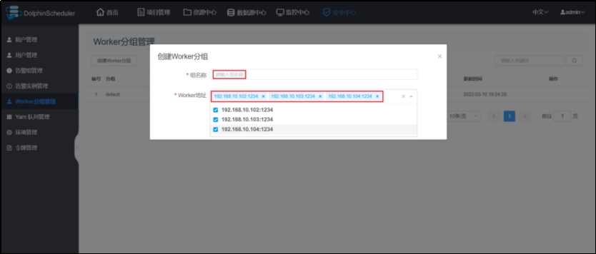 

此处可不做配置。

### 4.1.6 环境管理

此处可配置Worker运行环境（任务运行时所需的环境变量），默认的运行环境由Worker节点中，dolphinscheduler安装目录下的conf/env/dolphinscheduler_env.sh决定。

创建环境的操作如下图所示，环境创建完毕之后，就可供Worker运行任务时选择。

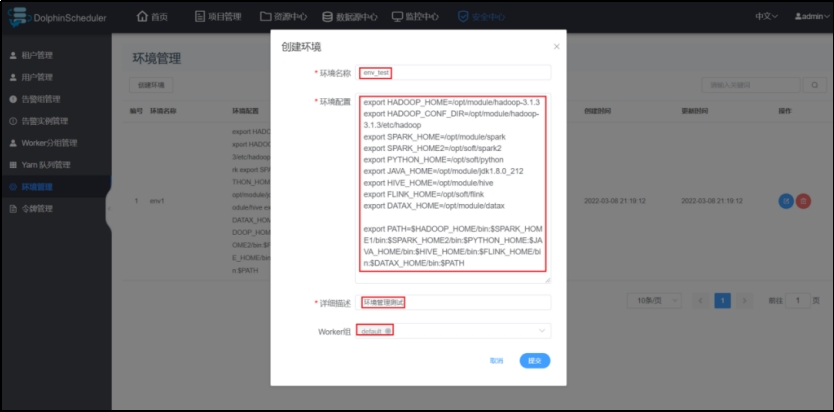 

​	注：

Ø 环境名称：用户自定义名称。

Ø 环境配置：与 dolphinscheduler_env.sh 配置格式相同。

Ø 详细描述：环境的详细描述，不能为空，否则无法创建

Ø Worker组：环境所属的 Worker 组。

此处暂不做配置。

### 4.1.7 令牌管理

令牌用于通过接口访问DolphinScheduler各项服务时的用户验证。普通用户通过UI页面访问各项服务时，无需使用令牌。若需将DolphinScheduler与第三方服务进行集成，则需调用其接口，此时需使用令牌。

## 4.2 项目管理

### 4.2.1 切换用户

默认不使用管理员用户操作项目和工作流等，故需先切换到普通用户atguigu。

1）admin用户退出

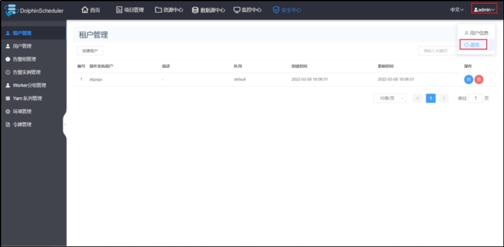 

2）使用atguigu用户登录

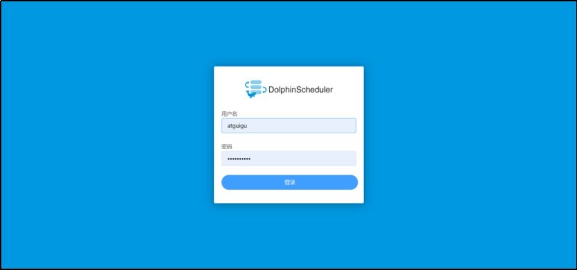 

### 4.2.2 创建项目

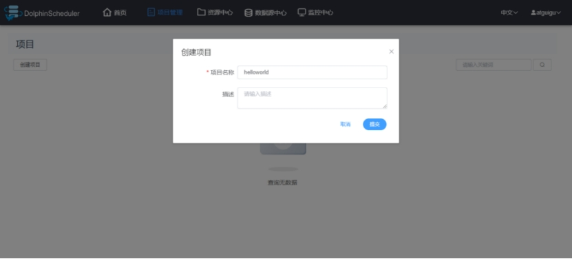 

### 4.2.3 查看项目

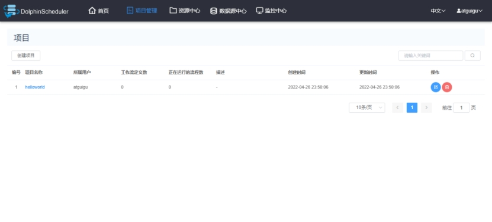 

## 4.3 工作流基础配置

下图为工作流配置页面，共包含三个模快，分别为工作流定义、工作流实例和任务实例。

工作流定义：用于定义工作流，包括工作流各节点任务详情及各节点依赖关系等。

工作流实例：工作流每执行一次就会生成一个工作流实例。此处可查看正在运行的工作流以及已经完成的工作流。

任务实例：工作流中的一个节点任务，每执行一次就会生成一个任务实例。此处可用于查看正在执行的节点任务以及已经完成的节点任务。

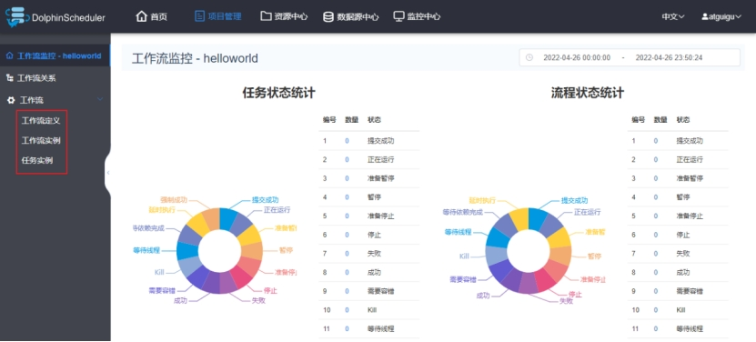 

### 4.3.1 工作流定义

工作流要求：工作流需包含三个Shell类型的任务节点，分别是A，B，C。三个任务的依赖关系如下图所示：

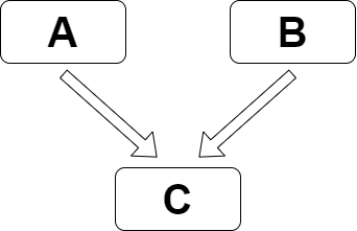 

1）创建工作流

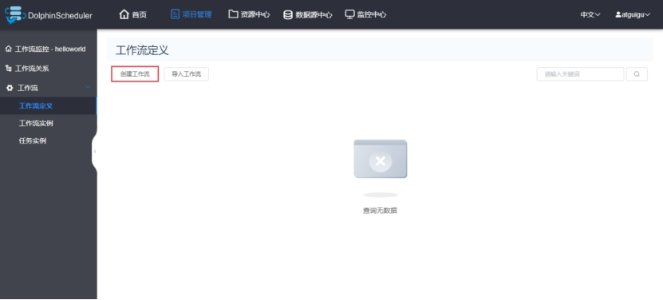 

2）配置任务节点

（1）节点A

 

（2）节点B

 

（3）节点C

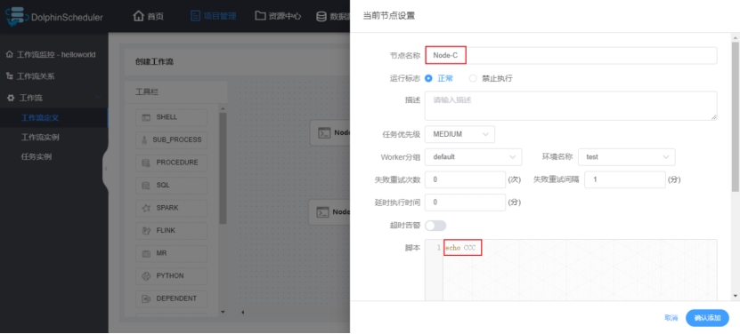 

3）配置任务节点的依赖关系

配置依赖的关系的方式如下两种：

（1）直接对 DAG 图进行拖拽操作

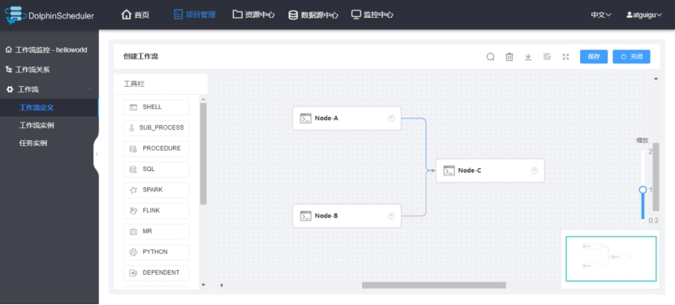 

（2）在节点设置中选择 “前置任务”

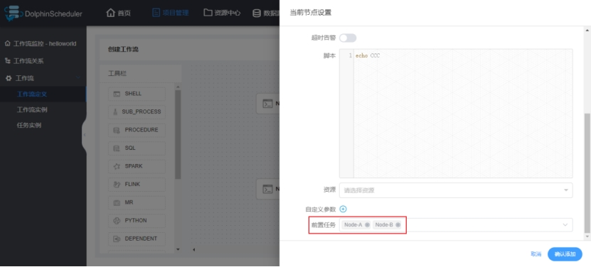 

4）保存工作流定义

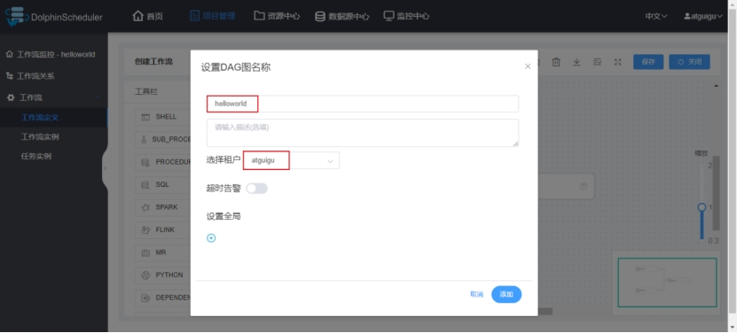 

### 4.3.2 执行工作流

1）上线工作流

工作流须上线之后才能执行。处于上线状态的工作流定义不可修改，如需修改，须先下线。

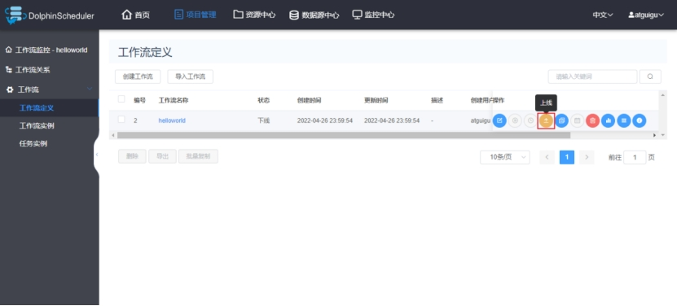 

2）单次运行工作流


3）定时执行工作流

（1）点击定时

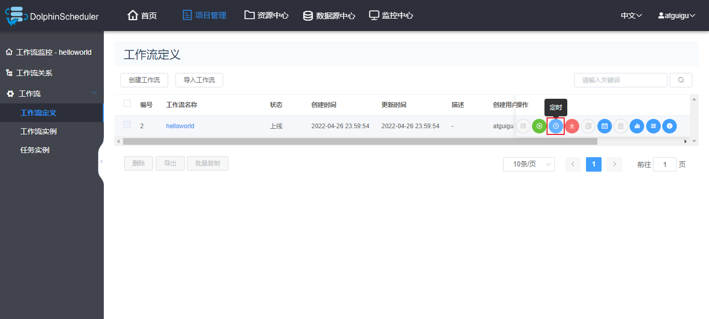 

（2）配置定时规则 

此处示例为每分钟执行一次

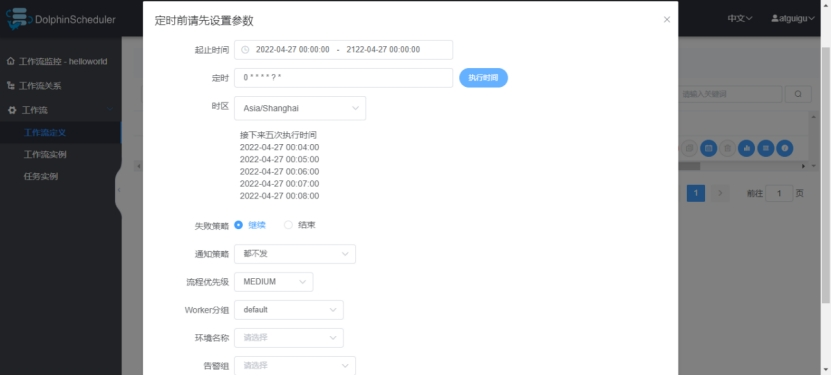 

（3）定时管理

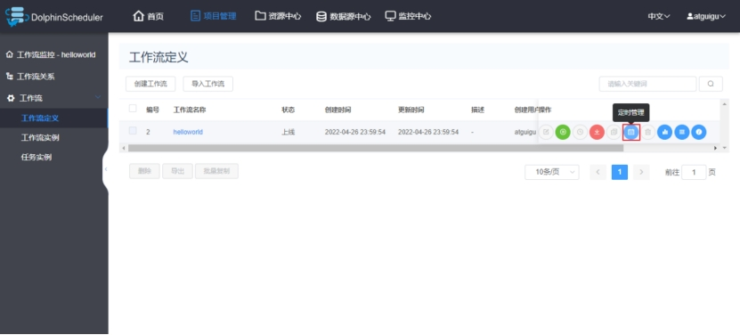 

（4）定时上线

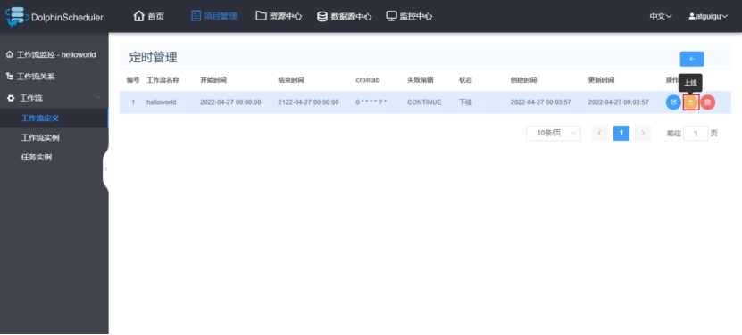 

### 4.3.3 查看工作流实例

1）查看所有工作流实例

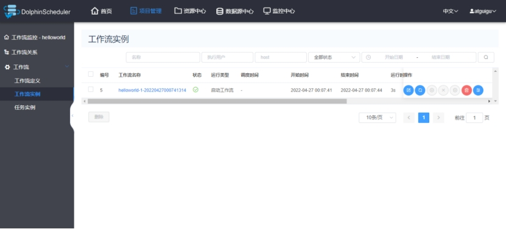 

2）查看工作流执行状态

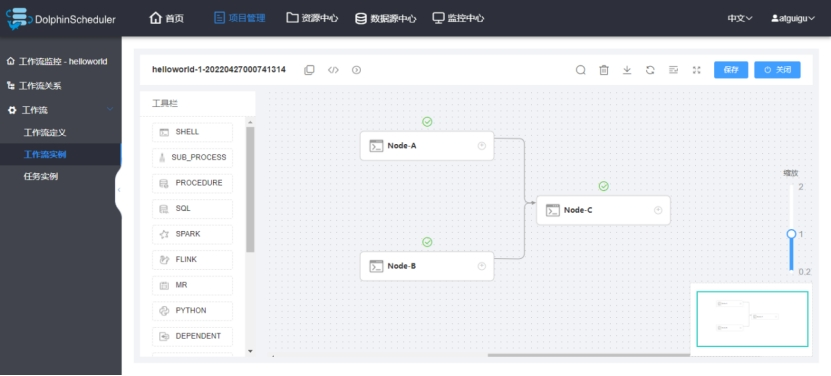 

### 4.3.4 查看任务实例

1）查看所有任务实例

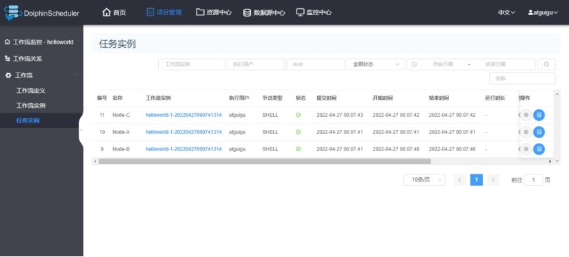 

2）查看任务实例日志

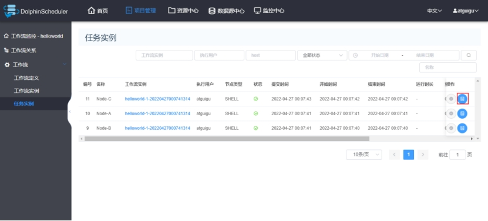 

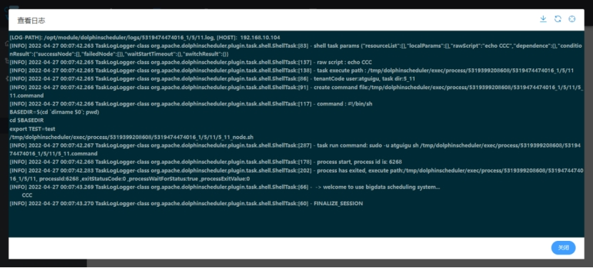

# 第5章 DolphinScheduler进阶

## 5.1 工作流传参

### 5.1.1 本地参数和全局参数

DolphinScheduler支持对任务节点进行灵活的传参，任务节点可通过${参数名}引用参数值。

1）本地参数

本地参数是指只针对单个任务节点有效的参数。

（1）修改helloworld工作流Node-A节点如下

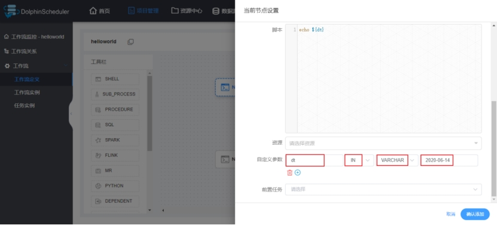 

Ø dt：参数名

Ø IN/OUT：IN表示向当前节点传参，OUT表示向下游节点传参

Ø DATE：参数值类型

Ø 2020-06-14：参数值

（2）保存工作流并运行，查看Node-A输出日志。

2）全局参数

全局参数是指针对整个工作流的所有任务节点都有效的参数。

（1）修改helloworld工作流每个任务节点如下

节点A配置

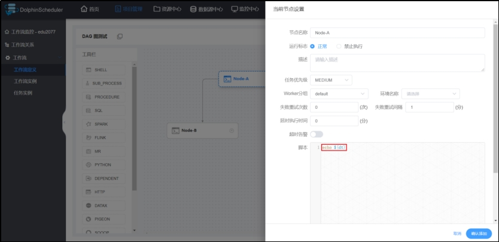 

节点B配置

 

节点C配置

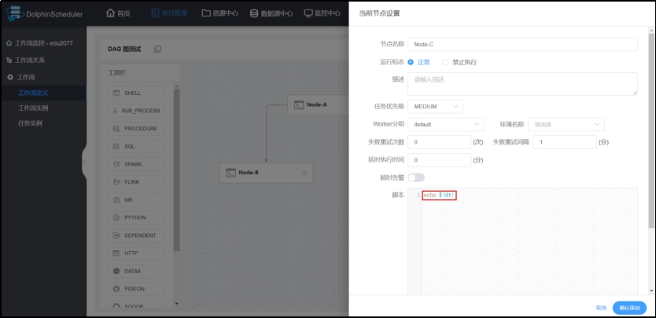 

（2）保存工作流，并设置全局参数

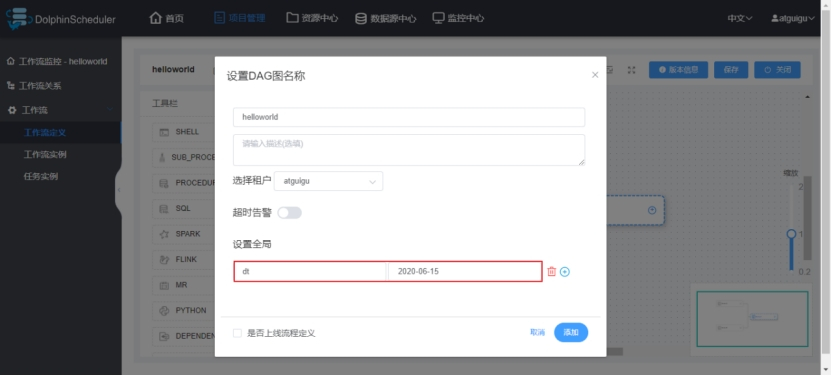 

（3）执行工作流，查看三个任务节点输出日志。

### 5.1.2 参数传递

DolphinScheduler支持上游任务节点向下游任务节点传参。目前支持这个特性的任务类型有：Shell、SQL、Procedure。以下案例使用Shell类型的任务节点进行演示。

1）设置上游节点Node-A

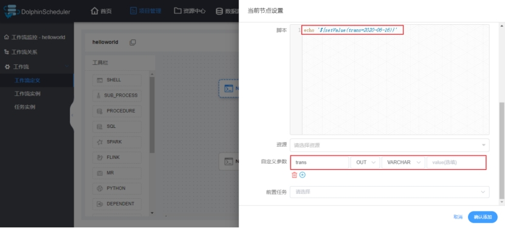 

注：echo '${setValue(key=value)}'为固定写法

2）设置下游节点Node-C

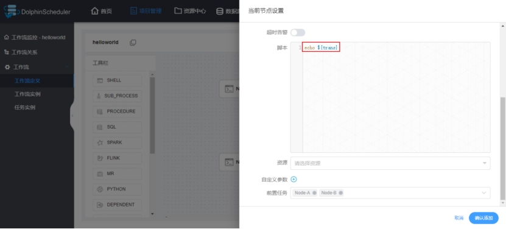 

3）查看输出日志

可以看到对应节点日志中输出了其调用参数的值。 

### 5.1.3 参数优先级

一个任务节点引用的参数可能来自三种类型：分别是全局参数 、上游任务传递的参数、本地参数。因为参数的值存在多个来源，当参数名相同时，就需要考虑参数优先级的问题。DolphinScheduler 参数的优先级从低到高为：全局参数 <上游任务传递的参数 <本地参数。

在上游任务传递的参数的情况下，由于上游可能存在多个任务向下游传递参数。当上游传递的参数名称相同时：

下游节点会优先使用值为非空的参数。

如果存在多个值为非空的参数，则按照上游任务的完成时间排序，选择完成时间最早的上游任务对应的参数。

### 5.1.4 内置参数

DolphinScheduler提供了一些时间相关的系统参数，方便定时调度使用。

1）基础内置参数

| 变量名             | 参数                  | 说明                            |
| ------------------ | --------------------- | ------------------------------- |
| system.biz.date    | ${system.biz.date}    | 定时时间前一天，格式为 yyyyMMdd |
| system.biz.curdate | ${system.biz.curdate} | 定时时间，格式为 yyyyMMdd       |
| system.datetime    | ${system.datetime}    | 定时时间，格式为 yyyyMMddHHmmss |

2）衍生内置参数

可通过衍生内置参数，设置任意格式、任意时间的日期。

（1）自定义日期格式

可以对 $[yyyyMMddHHmmss] 任意分解组合，如 $[yyyyMMdd], $[HHmmss], $[yyyy-MM-dd]。

（2）使用 add_months() 函数

该函数用于加减月份， 第一个入口参数为[yyyyMMdd]，表示返回时间的格式 第二个入口参数为月份偏移量，表示加减多少个月。

| 参数                         | 说明    |
| ---------------------------- | ------- |
| $[add_months(yyyyMMdd,12N)]  | 后 N 年 |
| $[add_months(yyyyMMdd,-12N)] | 前 N 年 |
| $[add_months(yyyyMMdd,N)]    | 后 N 月 |
| $[add_months(yyyyMMdd,-N)]   | 前 N 月 |

（3）直接加减数字

在自定义格式后直接“+/-”数字，单位为“天”。

| 参数              | 说明      |
| ----------------- | --------- |
| $[yyyyMMdd+7N]    | 后 N 周   |
| $[yyyyMMdd-7N]    | 前 N 周   |
| $[yyyyMMdd+N]     | 后 N 天   |
| $[yyyyMMdd-N]     | 前 N 天   |
| $[HHmmss+N/24]    | 后 N 小时 |
| $[HHmmss-N/24]    | 前 N 小时 |
| $[HHmmss+N/24/60] | 后 N 分钟 |
| $[HHmmss-N/24/60] | 前 N 分钟 |

3）配置示例

若执行的脚本需要一个格式为yyyy-MM-dd的前一天日期的参数，进行如下配置即可。

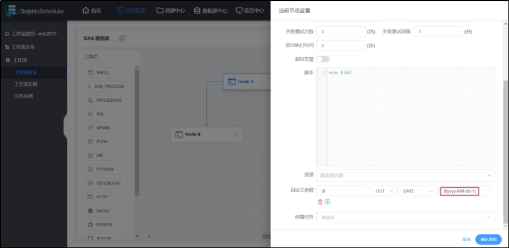 

## 5.2 引用依赖资源

有些任务需要引用一些额外的资源，例如MR、Spark等任务须引用jar包，Shell任务需要引用其他脚本等。DolphinScheduler提供了资源中心来对这些资源进行统一管理。资源中心存储系统可选择本地文件系统或者HDFS等。资源中心除了提供文件资源管理功能，还提供了Hive自定义函数管理的功能。

下面以Shell任务为例，演示如何引用资源中心的其他脚本。

1）在资源中心创建脚本

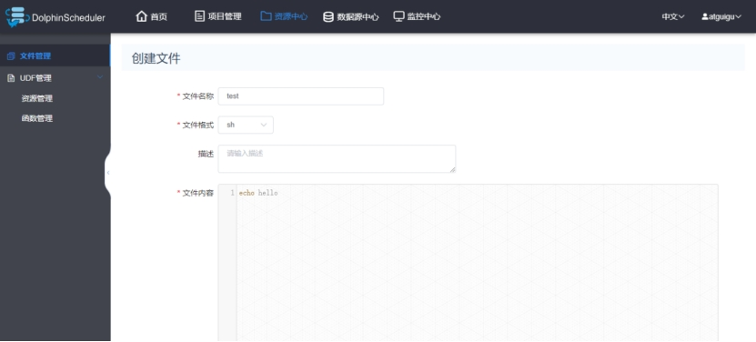 

2）配置Shell任务引用脚本

修改工作流节点Node-A，引用上述脚本

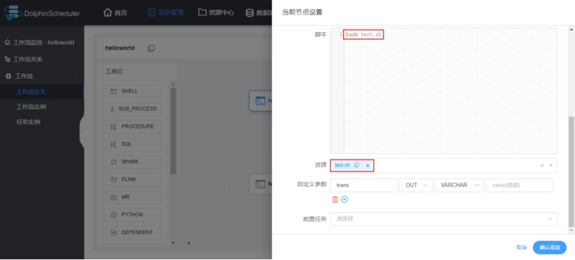 

3）保存工作流并执行，查看对应节点输出日志。

## 5.3 告警通知

Dolphinscheduler支持多种告警媒介，此处以电子邮件为例进行演示。

1）准备邮箱

如需使用DolphinScheduler的电子邮件告警通知功能，需要准备一个电子邮箱账号，并启用SMTP服务。此处以 QQ 邮箱为例。

（1）开启 SMTP 服务

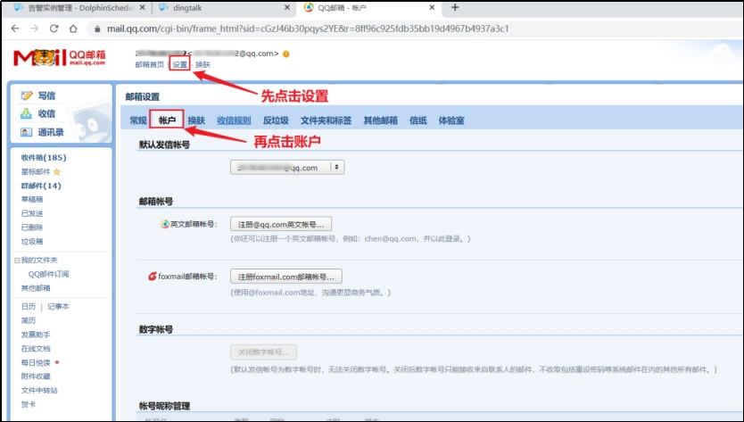 

拖动进度条在页面下方找到下图所示内容，开启 POP3/SMTP | IMAP/SMTP 任一服务即可。

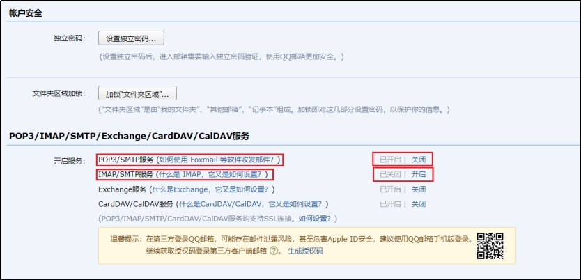 

（2）获得授权码

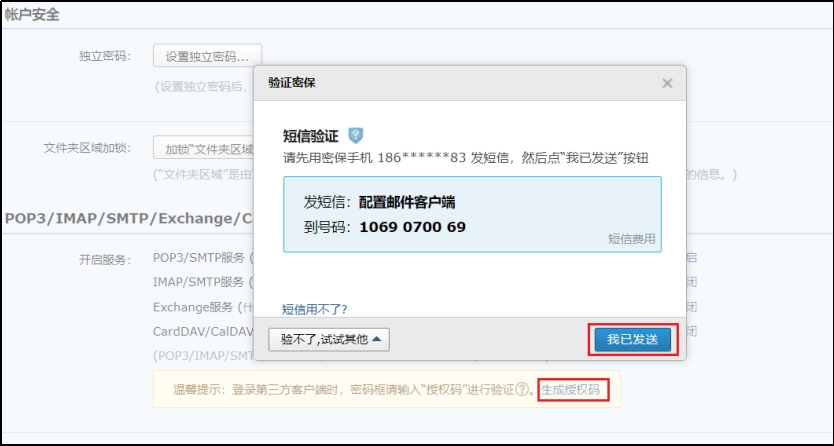 

2）DolphinScheduler 配置

（1）切换管理员用户

（2）创建告警实例

第一步：点击创建告警实例

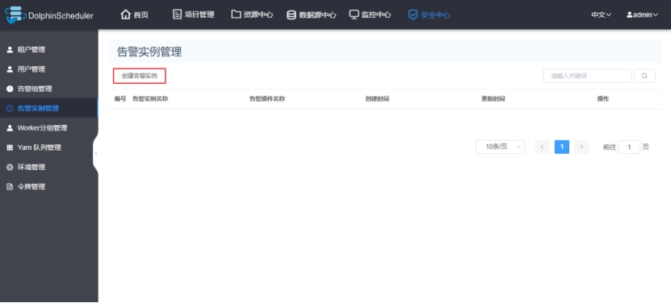 

第二步：编辑告警实例

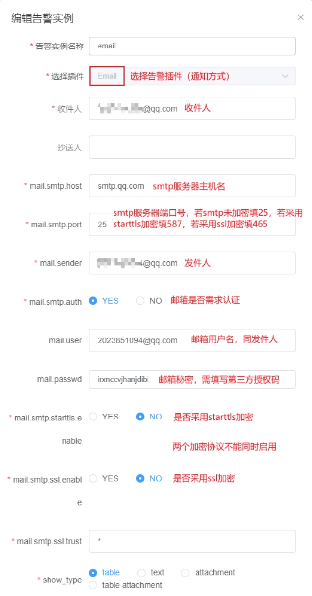 

（3）创建告警组

第一步：点击创建告警组

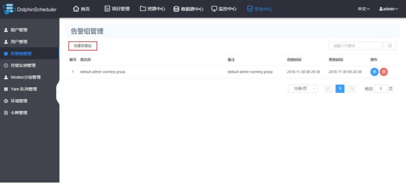 

第二步：编辑告警组

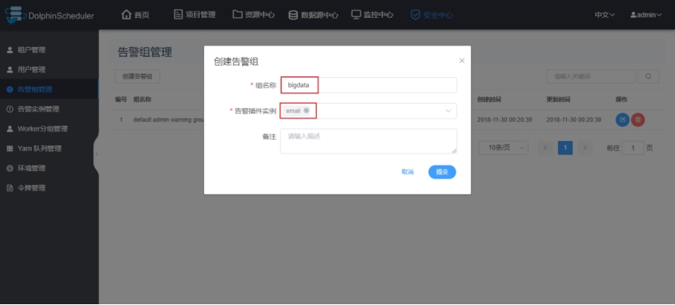 

3）测试告警通知

（1）切换普通用户

（2）执行工作流测试

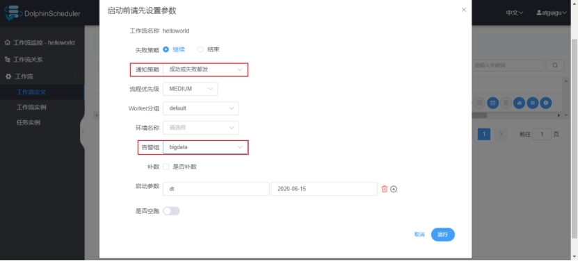 

（3）等待接受邮件

## 5.4 工作流失败重跑

若工作流执行到一半失败了，需要重新启动工作流。重新启动时可选择从起点开始执行，也可选择从断点开始执行。

1）模拟失败场景

（1）修改Node-A配置如下

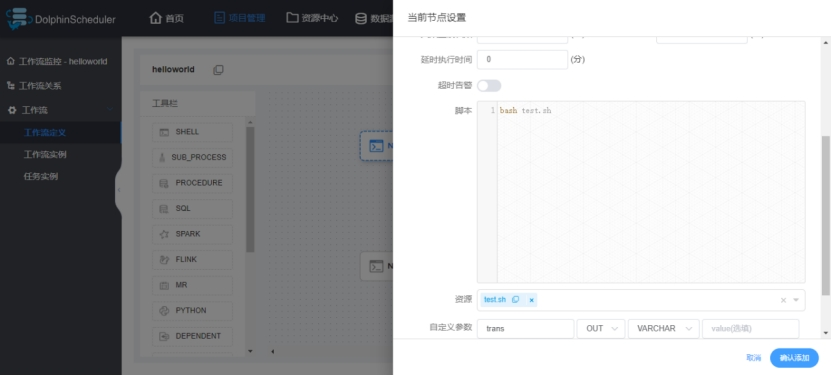 

（2）修改资源中心的test.sh文件如下

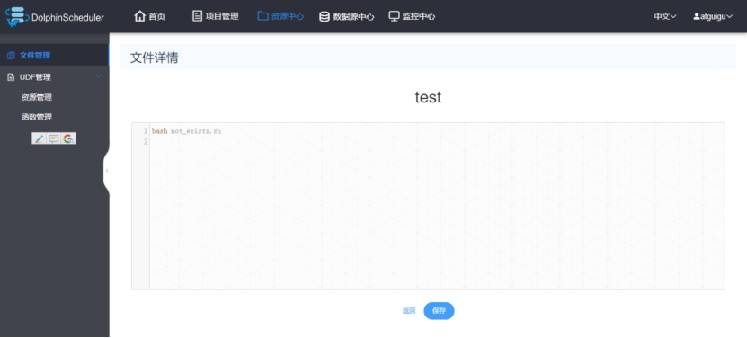 

2）运行工作流

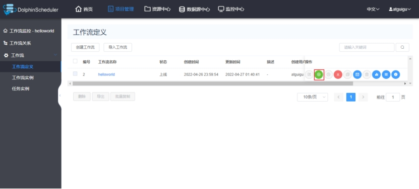 

3）查看工作流实例

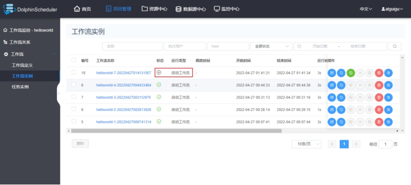 

4）工作失败重跑

（1）从起点开始

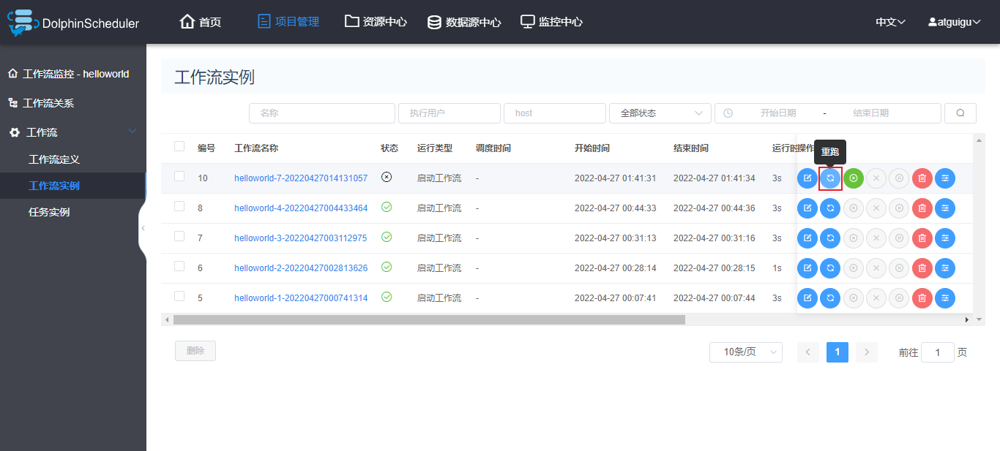 

（2）从断点开始

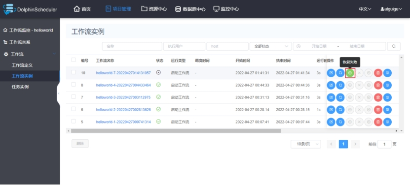 
