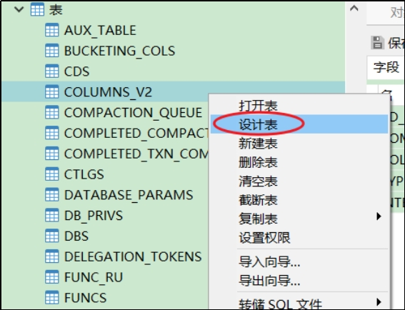
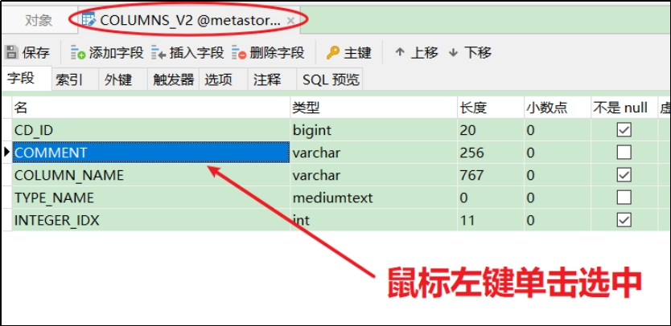
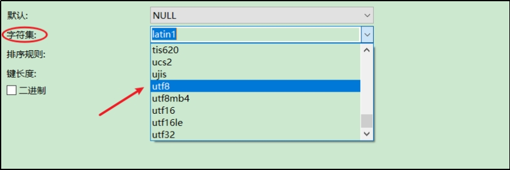
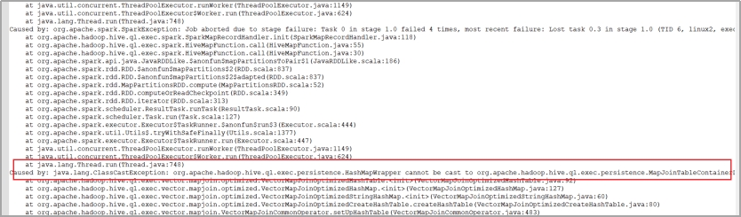
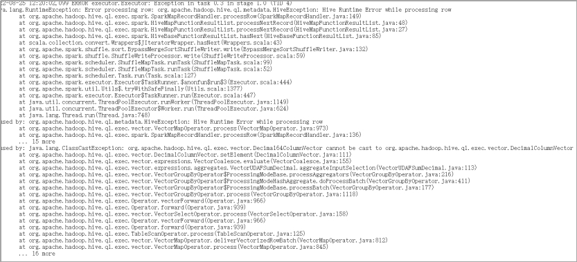

# 第1章 环境问题

## 1.1 DataGrip 中注释乱码问题

注释属于元数据的一部分，同样存储在mysql的metastore库中，如果metastore库的字符集不支持中文，就会导致中文显示乱码。

不建议修改Hive元数据库的编码，此处我们在metastore中找存储注释的表，找到表中存储注释的字段，只改对应表对应字段的编码。

如下两步修改，缺一不可

（1）修改mysql元数据库

我们用到的注释有两种：字段注释和整张表的注释。

COLUMNS_V2 表中的 COMMENT 字段存储了 Hive 表所有字段的注释，TABLE_PARAMS 表中的 PARAM_VALUE 字段存储了所有表的注释。我们可以通过命令修改字段编码，也可以用 DataGrip 或 Navicat 等工具修改，此处仅对 Navicat 进行展示。

（i）命令修改

```sql
alter table COLUMNS_V2 modify column COMMENT varchar(256) character set utf8;
alter table TABLE_PARAMS modify column PARAM_VALUE mediumtext character set utf8;
```

（ii）使用工具

​	以 COLUMNS_V2 表中COMMENT 字段的修改为例

​	1. 右键点击表名，选择设计表

 

​	2. 在右侧页面中选中表的字段

 

​	3. 在页面下方下拉列表中将字符集改为 utf8

 

修改字符集之后，已存在的中文注释能否正确显示？不能。为何？

数据库中的字符都是通过编码存储的，写入时编码，读取时解码。修改字段编码并不会改变此前数据的编码方式，依然为默认的 latin1，此时读取之前的中文注释会用 utf8 解码，编解码方式不一致，依然乱码。

（2）修改url连接

修改 hive-site.xml 在末尾添加

```properties
&amp;useUnicode=true&amp;characterEncoding=UTF-8
```

xml 文件中 & 符是有特殊含义的，我们必须使用转义的方式 & 对 & 进行替换

修改结果如下

```xml
<property>
        <name>javax.jdo.option.ConnectionURL</name>
        <value>jdbc:mysql://hadoop102:3306/metastore?useSSL=false&amp;useUnicode=true&amp;characterEncoding=UTF-8</value>
</property>
```

只要修改了 hive-site.xml，就必须重启 hiveserver2。

## 1.2 DataGrip 刷新连接时 hiveserver2 后台报错

1. 报错信息如下

```shell
FAILED: ParseException line 1:5 cannot recognize input near 'show' 'indexes' 'on' in ddl statement
```

原因：我们使用的是 Hive-3.1.2，早期版本的 Hive 有索引功能，当前版本已移除， DataGrip 刷新连接时会扫描索引，而 Hive 没有，就会报错。

2. 报错信息如下

```shell
FAILED: Execution Error, return code 1 from org.apache.hadoop.hive.ql.exec.DDLTask. Current user : atguigu is not allowed to list roles. User has to belong to ADMIN role and have it as current role, for this action.

FAILED: Execution Error, return code 1 from org.apache.hadoop.hive.ql.exec.DDLTask. Current user : atguigu is not allowed get principals in a role. User has to belong to ADMIN role and have it as current role, for this action. Otherwise, grantor need to have ADMIN OPTION on role being granted and have it as a current role for this action.
```

DataGrip 连接 hiveserver2 时会做权限认证，但本项目中我们没有对 Hive 的权限管理进行配置，因而报错。

上述两个问题都是 DataGrip 导致的，并非 Hive 环境的问题，不影响使用

## 1.3 Hivesever2 报错OOM

Hive 默认堆内存只有 256M，如果 hiveserver2 后台频繁出现 OutOfMemoryError，可以调大堆内存。

在 Hive 家目录的 conf 目录下复制一份模板文件 hive-env.sh.template

```shell
[atguigu@hadoop102 conf]$ cd $HIVE_HOME/conf
[atguigu@hadoop102 conf]$ cp hive-env.sh.template hive-env.sh
```

修改 hive-env.sh，将 Hive 堆内存改为 1024M，如下

```shell
export HADOOP_HEAPSIZE=2048
```

可根据实际使用情况适当调整堆内存。

## 1.4 DataGrip 侧边栏ODS 层JSON表字段无法显示

建表字段中有如下语句的表字段无法显示

ROW FORMAT SERDE 'org.apache.hadoop.hive.serde2.JsonSerDe'

上述语句指定了 Hive 表的序列化器和反序列化器 SERDE（serialization 和 deserialization 的合并缩写），用于解析 JSON 格式的文件。上述 SERDE 是由第三方提供的，在 hive-site.xml 中添加如下配置即可解决

```xml
<property>
    <name>metastore.storage.schema.reader.impl</name>
    <value>org.apache.hadoop.hive.metastore.SerDeStorageSchemaReader</value>
</property>
```

## 1.5 Hivesever2报错too many open files

Hiveserver2 运行过程出现too many open files异常，原因是Hivesever2进程的打开的文件（文件描述符）过多。解决方案如下：

方案一：重启Hiveserver2可临时解决问题

方案二：修改vi /etc/security/limits.conf可永久解决问题，需重启操作系统

```properties
 hard nofile 102400
 soft nofile 102400
```

# 第2章 Hive BUG

Hive的某些优化手段有BUG，特定场景会出问题，出问题关闭相应的优化即可。

## 2.1 cbo优化BUG

cbo优化会导致 hive struct结构体判空操作失效，执行计划缺少对应的 filter

解决思路：set hive.cbo.enable=false;

参考issue：https://issues.apache.org/jira/browse/HIVE-21778

## 2.2 MapJoin BUG

关联的两张表中有空表，会出现ClassCastException

 

解决思路：set hive.mapjoin.optimized.hashtable=false;

参考issue：https://issues.apache.org/jira/browse/HIVE-19388

## 2.3 Hive向量化查询优化

 

 join执行出错，使用left join成功

```shell
set hive.vectorized.execution.enabled=false;
```
