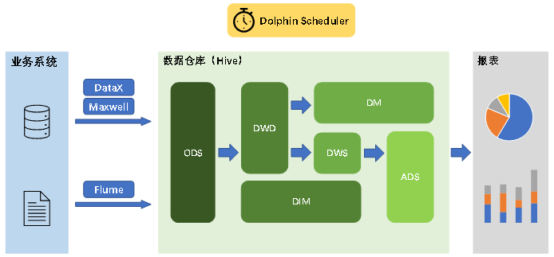

# 第1章 数据仓库概述

## 1.1 数据仓库概念

数据仓库是一个为数据分析而设计的企业级数据管理系统。数据仓库可集中、整合多个信息源的大量数据，借助数据仓库的分析能力，企业可从数据中获得宝贵的信息进而改进决策。同时，随着时间的推移，数据仓库中积累的大量历史数据对于数据科学家和业务分析师也是十分宝贵的。

## 1.2 数据仓库核心架构



# 第2章 数据仓库建模概述

## 2.1 数据仓库建模的意义

如果把数据看作图书馆里的书，我们希望看到它们在书架上分门别类地放置；如果把数据看作城市的建筑，我们希望城市规划布局合理；如果把数据看作电脑文件和文件夹，我们希望按照自己的习惯有很好的文件夹组织方式，而不是糟糕混乱的桌面，经常为找一个文件而不知所措。

数据模型就是数据组织和存储方法，它强调从业务、数据存取和使用角度合理存储数据。只有将数据有序的组织和存储起来之后，数据才能得到高性能、低成本、高效率、高质量的使用。

- 高性能：良好的数据模型能够帮助我们快速查询所需要的数据。
- 低成本：良好的数据模型能减少重复计算，实现计算结果的复用，降低计算成本。
- 高效率：良好的数据模型能极大的改善用户使用数据的体验，提高使用数据的效率。
- 高质量：良好的数据模型能改善数据统计口径的混乱，减少计算错误的可能性。

## 2.2 数据仓库建模方法论

### 2.2.1 ER模型

数据仓库之父Bill Inmon提出的建模方法是从全企业的高度，用实体关系（Entity Relationship，ER）模型来描述企业业务，并用规范化的方式表示出来，在范式理论上符合3NF。

**1）实体关系模型**

实体关系模型将复杂的数据抽象为两个概念——实体和关系。实体表示一个对象，例如学生、班级，关系是指两个实体之间的关系，例如学生和班级之间的从属关系。

**2）数据库规范化**

数据库规范化是使用一系列范式设计数据库（通常是关系型数据库）的过程，其目的是减少数据冗余，增强数据的一致性。

这一系列范式就是指在设计关系型数据库时，需要遵从的不同的规范。关系型数据库的范式一共有六种，分别是第一范式（1NF）、第二范式（2NF）、第三范式（3NF）、巴斯-科德范式（BCNF）、第四范式(4NF）和第五范式（5NF）。遵循的范式级别越高，数据冗余性就越低。

**3）三范式**

**（1）函数依赖**

**（2）第一范式**

**（3）第二范式**

**（4）第三范式**

下图为一个采用Bill Inmon倡导的建模方法构建的模型，从图中可以看出，较为松散、零碎，物理表数量多。


这种建模方法的出发点是整合数据，其目的是将整个企业的数据进行组合和合并，并进行规范处理，减少数据冗余性，保证数据的一致性。这种模型并不适合直接用于分析统计。

### 2.2.2 维度模型

数据仓库领域的令一位大师——Ralph Kimball倡导的建模方法为维度建模。维度模型将复杂的业务通过事实和维度两个概念进行呈现。事实通常对应业务过程，而维度通常对应业务过程发生时所处的环境。

**注**：业务过程可以概括为一个个不可拆分的行为事件，例如电商交易中的下单，取消订单，付款，退单等，都是业务过程。

下图为一个典型的维度模型，其中位于中心的SalesOrder为事实表，其中保存的是下单这个业务过程的所有记录。位于周围每张表都是维度表，包括Date（日期），Customer（顾客），Product（产品），Location（地区）等，这些维度表就组成了每个订单发生时所处的环境，即何人、何时、在何地下单了何种产品。从图中可以看出，模型相对清晰、简洁。


维度建模以数据分析作为出发点，为数据分析服务，因此它关注的重点的用户如何更快的完成需求分析以及如何实现较好的大规模复杂查询的响应性能。

# 第3章 维度建模理论之事实表

## 3.1 事实表概述

事实表作为数据仓库维度建模的核心，紧紧围绕着业务过程来设计。其包含与该业务过程有关的维度引用（维度表外键）以及该业务过程的度量（通常是可累加的数字类型字段）。

### 3.1.1 事实表特点

事实表通常比较“细长”，即列较少，但行较多，且行的增速快。

### 3.1.2 事实表分类

事实表有三种类型：分别是事务事实表、周期快照事实表和累积快照事实表，每种事实表都具有不同的特点和适用场景，下面逐个介绍。

## 3.2 事务型事实表

### 3.2.1 概述

事务型事实表用来记录各业务过程，它保存的是各业务过程的原子操作事件，即最细粒度的操作事件。粒度是指事实表中一行数据所表达的业务细节程度。

事务型事实表可用于分析与各业务过程相关的各项统计指标，由于其保存了最细粒度的记录，可以提供最大限度的灵活性，可以支持无法预期的各种细节层次的统计需求。

### 3.2.2 设计流程

设计事务事实表时一般可遵循以下四个步骤。

**选择业务过程→声明粒度→确认维度→确认事实**

**1）选择业务过程**

在业务系统中，挑选我们感兴趣的业务过程，业务过程可以概括为一个个不可拆分的行为事件，例如电商交易中的下单，取消订单，付款，退单等，都是业务过程。通常情况下，一个业务过程对应一张事务型事实表。

**2）声明粒度**

业务过程确定后，需要为每个业务过程声明粒度。即精确定义每张事务型事实表的每行数据表示什么，应该尽可能选择最细粒度，以此来应各种细节程度的需求。

**典型的粒度声明如下：**

订单事实表中一行数据表示的是一个订单中的一个商品项。

**3）确定维度**

确定维度具体是指，确定与每张事务型事实表相关的维度有哪些。

确定维度时应尽量多的选择与业务过程相关的环境信息。因为维度的丰富程度就决定了维度模型能够支持的指标丰富程度。

**4）确定事实**

此处的“事实”一词，指的是每个业务过程的度量值（通常是可累加的数字类型的值，例如：次数、个数、件数、金额等）。

经过上述四个步骤，事务型事实表就基本设计完成了。第一步选择业务过程可以确定有哪些事务型事实表，第二步可以确定每张事务型事实表的每行数据是什么，第三步可以确定每张事务型事实表的维度外键，第四步可以确定每张事务型事实表的度量值字段。

### 3.2.3 不足

事务型事实表可以保存所有业务过程的最细粒度的操作事件，故理论上其可以支撑与各业务过程相关的各种统计粒度的需求。但对于某些特定类型的需求，其逻辑可能会比较复杂，或者效率会比较低下。例如：

**1）存量型指标**

例如商品库存，账户余额等。此处以电商中的虚拟货币为例，虚拟货币业务包含的业务过程主要包括获取货币和使用货币，两个业务过程各自对应一张事务型事实表，一张存储所有的获取货币的原子操作事件，另一张存储所有使用货币的原子操作事件。

假定现有一个需求，要求统计截至当日的各用户虚拟货币余额。由于获取货币和使用货币均会影响到余额，故需要对两张事务型事实表进行聚合，且需要区分两者对余额的影响（加或减），另外需要对两张表的全表数据聚合才能得到统计结果。

可以看到，不论是从逻辑上还是效率上考虑，这都不是一个好的方案。

**2）多事务关联统计**

例如，现需要统计最近30天，用户下单到支付的时间间隔的平均值。统计思路应该是找到下单事务事实表和支付事务事实表，过滤出最近30天的记录，然后按照订单id对两张事实表进行关联，之后用支付时间减去下单时间，然后再求平均值。

逻辑上虽然并不复杂，但是其效率较低，应为下单事务事实表和支付事务事实表均为大表，大表join大表的操作应尽量避免。

可以看到，在上述两种场景下事务型事实表的表现并不理想。下面要介绍的另外两种类型的事实表就是为了弥补事务型事实表的不足的。

## 3.3 周期型快照事实表

### 3.3.1 概述

周期快照事实表以具有规律性的、可预见的时间间隔来记录事实，主要用于分析一些存量型（例如商品库存，账户余额）或者状态型（空气温度，行驶速度）指标。

对于商品库存、账户余额这些存量型指标，业务系统中通常就会计算并保存最新结果，所以定期同步一份全量数据到数据仓库，构建周期型快照事实表，就能轻松应对此类统计需求，而无需再对事务型事实表中大量的历史记录进行聚合了。

对于空气温度、行驶速度这些状态型指标，由于它们的值往往是连续的，我们无法捕获其变动的原子事务操作，所以无法使用事务型事实表统计此类需求。而只能定期对其进行采样，构建周期型快照事实表。

### 3.3.2 设计流程

**1）确定粒度**

周期型快照事实表的粒度可由采样周期和维度描述，故确定采样周期和维度后即可确定粒度。

采样周期通常选择每日。

维度可根据统计指标决定，例如指标为统计每个仓库中每种商品的库存，则可确定维度为仓库和商品。

确定完采样周期和维度后，即可确定该表粒度为每日-仓库-商品。

**2）确认事实**

事实也可根据统计指标决定，例如指标为统计每个仓库中每种商品的库存，则事实为商品库存。

### 3.3.3 事实类型

此处的事实类型是指度量值的类型，而非事实表的类型。事实（度量值）共分为三类，分别是可加事实，半可加事实和不可加事实。

**1）可加事实**

可加事实是指可以按照与事实表相关的所有维度进行累加，例如事务型事实表中的事实。

**2）半可加事实**

半可加事实是指只能按照与事实表相关的一部分维度进行累加，例如周期型快照事实表中的事实。以上述各仓库中各商品的库存每天快照事实表为例，这张表中的库存事实可以按照仓库或者商品维度进行累加，但是不能按照时间维度进行累加，因为将每天的库存累加起来是没有任何意义的。

**3）不可加事实**

不可加事实是指完全不具备可加性，例如比率型事实。不可加事实通常需要转化为可加事实，例如比率可转化为分子和分母。

## 3.4 累积型快照事实表

### 3.4.1 概述

累计快照事实表是基于一个业务流程中的多个关键业务过程联合处理而构建的事实表，如交易流程中的下单、支付、发货、确认收货业务过程。

累积型快照事实表通常具有多个日期字段，每个日期对应业务流程中的一个关键业务过程（里程碑）。

| 订单id | 用户id | 下单日期   | 支付日期   | 发货日期   | 确认收货日期 | 订单金额 | 支付金额 |
| ------ | ------ | ---------- | ---------- | ---------- | ------------ | -------- | -------- |
| 1001   | 1234   | 2022-06-08 | 2022-06-09 | 2022-06-16 | 2022-06-17   | 1000     | 1000     |

累积型快照事实表主要用于分析业务过程（里程碑）之间的时间间隔等需求。例如前文提到的用户下单到支付的平均时间间隔，使用累积型快照事实表进行统计，就能避免两个事务事实表的关联操作，从而变得十分简单高效。

### 3.4.2 设计流程

累积型快照事实表的设计流程同事务型事实表类似，也可采用以下四个步骤，下面重点描述与事务型事实表的不同之处。

**选择业务过程→声明粒度→确认维度→确认事实。**

**1）选择业务过程**

选择一个业务流程中需要关联分析的多个关键业务过程，多个业务过程对应一张累积型快照事实表。

**2）声明粒度**

精确定义每行数据表示的是什么，尽量选择最小粒度。

**3）确认维度**

选择与各业务过程相关的维度，需要注意的是，每各业务过程均需要一个日期维度。

**4）确认事实**

选择各业务过程的度量值。

# 第4章 维度建模理论之维度表

## 4.1 维度表概述

维度表是维度建模的基础和灵魂。前文提到，事实表紧紧围绕业务过程进行设计，而维度表则围绕业务过程所处的环境进行设计。维度表主要包含一个主键和各种维度字段，维度字段称为维度属性。

## 4.2 维度表设计步骤

**1）确定维度（表）**

在设计事实表时，已经确定了与每个事实表相关的维度，理论上每个相关维度均需对应一张维度表。需要注意到，可能存在多个事实表与同一个维度都相关的情况，这种情况需保证维度的唯一性，即只创建一张维度表。另外，如果某些维度表的维度属性很少，例如只有一个**名称，则可不创建该维度表，而把该表的维度属性直接增加到与之相关的事实表中，这个操作称为**维度退化**。

**2）确定主维表和相关维表**

此处的主维表和相关维表均指**业务系统**中与某维度相关的表。例如业务系统中与商品相关的表有sku_info，spu_info，base_trademark，base_category3，base_category2，base_category1等，其中sku_info就称为商品维度的主维表，其余表称为商品维度的相关维表。维度表的粒度通常与主维表相同。

**3）确定维度属性**

确定维度属性即确定维度表字段。维度属性主要来自于业务系统中与该维度对应的主维表和相关维表。维度属性可直接从主维表或相关维表中选择，也可通过进一步加工得到。

确定维度属性时，需要遵循以下要求：

**（1）尽可能生成丰富的维度属性**

维度属性是后续做分析统计时的查询约束条件、分组字段的基本来源，是数据易用性的关键。维度属性的丰富程度直接影响到数据模型能够支持的指标的丰富程度。

**（2）尽量不使用编码，而使用明确的文字说明，一般可以编码和文字共存。**

**（3）尽量沉淀出通用的维度属性**

有些维度属性的获取需要进行比较复杂的逻辑处理，例如需要通过多个字段拼接得到。为避免后续每次使用时的重复处理，可将这些维度属性沉淀到维度表中。

## 4.3 维度设计要点

### 4.3.1 规范化与反规范化

**规范化**是指使用一系列范式设计数据库的过程，其目的是减少数据冗余，增强数据的一致性。通常情况下，规范化之后，一张表的字段会拆分到多张表。

**反规范化**是指将多张表的数据冗余到一张表，其目的是减少join操作，提高查询性能。

在设计维度表时，如果对其进行规范化，得到的维度模型称为雪花模型，如果对其进行反规范化，得到的模型称为星型模型。

数据仓库系统的主要目的是用于数据分析和统计，所以是否方便用户进行统计分析决定了模型的优劣。采用雪花模型，用户在统计分析的过程中需要大量的关联操作，使用复杂度高，同时查询性能很差，而采用星型模型，则方便、易用且性能好。所以出于易用性和性能的考虑，维度表一般是很不规范化的。

### 4.3.2 维度变化

维度属性通常不是静态的，而是会随时间变化的，数据仓库的一个重要特点就是反映历史的变化，所以如何保存维度的历史状态是维度设计的重要工作之一。保存维度数据的历史状态，通常有以下两种做法，分别是全量快照表和拉链表。

**1）全量快照表**

离线数据仓库的计算周期通常为每天一次，所以可以每天保存一份全量的维度数据。这种方式的优点和缺点都很明显。

优点是简单而有效，开发和维护成本低，且方便理解和使用。

缺点是浪费存储空间，尤其是当数据的变化比例比较低时。

**2）拉链表**

拉链表的意义就在于能够更加高效的保存维度信息的历史状态。

**（1）什么是拉链表**

**（2）为什么要做拉链表**

**（3）如何使用拉链表**

### 4.3.3 多值维度

如果事实表中一条记录在某个维度表中有多条记录与之对应，称为多值维度。例如，下单事实表中的一条记录为一个订单，一个订单可能包含多个商品，所会商品维度表中就可能有多条数据与之对应。

针对这种情况，通常采用以下两种方案解决。

第一种：降低事实表的粒度，例如将订单事实表的粒度由一个订单降低为一个订单中的一个商品项。

第二种：在事实表中采用多字段保存多个维度值，每个字段保存一个维度id。这种方案只适用于多值维度个数固定的情况。

建议尽量采用第一种方案解决多值维度问题。

### 4.3.4 多值属性

维表中的某个属性同时有多个值，称之为“多值属性”，例如商品维度的平台属性和销售属性，每个商品均有多个属性值。

针对这种情况，通常有可以采用以下两种方案。

第一种：将多值属性放到一个字段，该字段内容为key1:value1，key2:value2的形式，例如一个手机商品的平台属性值为“品牌：华为，系统：鸿蒙，CPU：麒麟990”。

第二种：将多值属性放到多个字段，每个字段对应一个属性。这种方案只适用于多值属性个数固定的情况。

# 第5章 数据仓库设计

## 5.1 数据仓库分层规划

优秀可靠的数仓体系，需要良好的数据分层结构。合理的分层，能够使数据体系更加清晰，使复杂问题得以简化。以下是该项目的分层规划。

## 5.2 数据仓库构建流程

以下是构建数据仓库的完整流程。

### 5.2.1 数据调研

数据调研重点要做两项工作，分别是业务调研和需求分析。这两项工作做的是否充分，直接影响着数据仓库的质量。

**1）业务调研**

业务调研的主要目标是**熟悉业务流程**、**熟悉业务数据**。

**熟悉业务流程**要求做到，明确每个业务的具体流程，需要将该业务所包含的每个**业务过程**一一列举出来。

**熟悉业务数据**要求做到，将数据（包括埋点日志和业务数据表）与业务过程对应起来，明确每个业务过程会对哪些表的数据产生影响，以及产生什么影响。产生的影响，需要具体到，是新增一条数据，还是修改一条数据，并且需要明确新增的内容或者是修改的逻辑。

下面业务电商中的交易为例进行演示，交易业务涉及到的业务过程有买家下单、买家支付、卖家发货，买家收货，具体流程如下图。

**2）需求分析**

典型的需求指标如，最近一天各省份手机品类订单总额。

分析需求时，需要明确需求所需的**业务过程**及**维度**，例如该需求所需的业务过程就是买家下单，所需的维度有日期，省份，商品品类。

**3）总结**

做完业务分析和需求分析之后，要保证每个需求都能找到与之对应的业务过程及维度。若现有数据无法满足需求，则需要和业务方进行沟通，例如某个页面需要新增某个行为的埋点。

### 5.2.2 明确数据域

数据仓库模型设计除横向的分层外，通常也需要根据业务情况进行纵向划分数据域。

划分数据域的意义是**便于数据的管理和应用**。

通常可以根据业务过程或者部门进行划分，本项目根据业务过程进行划分，需要注意的是一个业务过程只能属于一个数据域。

下面是本数仓项目所需的所有业务过程及数据域划分详情。

| 数据域 | 业务过程                                           |
| ------ | -------------------------------------------------- |
| 交易域 | 加购、下单、取消订单、支付成功、退单、退款成功     |
| 流量域 | 页面浏览、启动应用、动作、曝光、错误               |
| 用户域 | 注册、登录                                         |
| 互动域 | 收藏、评价                                         |
| 工具域 | 优惠券领取、优惠券使用（下单）、优惠券使用（支付） |

### 5.2.3 构建业务总线矩阵

业务总线矩阵中包含维度模型所需的所有事实（业务过程）以及维度，以及各业务过程与各维度的关系。矩阵的行是一个个业务过程，矩阵的列是一个个的维度，行列的交点表示业务过程与维度的关系。

一个业务过程对应维度模型中一张事务型事实表，一个维度则对应维度模型中的一张维度表。所以构建业务总线矩阵的过程就是设计维度模型的过程。但是需要注意的是，总线矩阵中通常只包含事务型事实表，另外两种类型的事实表需单独设计。

按照事务型事实表的设计流程，**选择业务过程声明粒度确认维度确认事实**，得到的最终的业务总线矩阵见以下表格。

后续的DWD层以及DIM层的搭建需参考业务总线矩阵。

### 5.2.4 明确统计指标

明确统计指标具体的工作是，深入分析需求，构建指标体系。构建指标体系的主要意义就是指标定义标准化。所有指标的定义，都必须遵循同一套标准，这样能有效的避免指标定义存在歧义，指标定义重复等问题。

**1）指标体系相关概念**

**（1）原子指标**

原子指标基于某一**业务过程**的**度量值**，是业务定义中不可再拆解的指标，原子指标的核心功能就是对指标的**聚合逻辑**进行了定义。我们可以得出结论，原子指标包含三要素，分别是业务过程、度量值和聚合逻辑。

例如**订单总额**就是一个典型的原子指标，其中的业务过程为用户下单、度量值为订单金额，聚合逻辑为sum()求和。需要注意的是原子指标只是用来辅助定义指标一个概念，通常不会对应有实际统计需求与之对应。

**（2）派生指标**

派生指标基于原子指标，其与原子指标的关系如下图所示。

与原子指标不同，派生指标通常会对应实际的统计需求。请从图中的例子中，体会指标定义标准化的含义。

**（3）衍生指标**

衍生指标是在一个或多个派生指标的基础上，通过各种逻辑运算复合而成的。例如比率、比例等类型的指标。衍生指标也会对应实际的统计需求。

**2）指标体系对于数仓建模的意义**

通过上述两个具体的案例可以看出，绝大多数的统计需求，都可以使用原子指标、派生指标以及衍生指标这套标准去定义。同时能够发现这些统计需求都直接的或间接的对应一个或者是多个派生指标。

当统计需求足够多时，必然会出现部分统计需求对应的派生指标相同的情况。这种情况下，我们就可以考虑将这些公共的派生指标保存下来，这样做的主要目的就是减少重复计算，提高数据的复用性。

这些公共的派生指标统一保存在数据仓库的DWS层。因此DWS层设计，就可以参考我们根据现有的统计需求整理出的派生指标。

按照上述标准整理出的指标体系如下：

（1）思维导图版

（2）PDF版

从上述指标体系中抽取出来的所有派生指标见如下表格。

### 5.2.4 维度模型设计

维度模型的设计参照上述得到的业务总线矩阵即可。事实表存储在DWD层，维度表存储在DIM层。

### 5.2.5 汇总模型设计

汇总模型的设计参考上述整理出的指标体系（主要是派生指标）即可。汇总表与派生指标的对应关系是，**一张汇总**表通常**包含**业务过程相同、统计周期相同、统计粒度相同的**多个派生指标**。请思考：汇总表与事实表的对应关系是？

# 第6章 数据仓库环境准备

## 6.1 数据仓库运行环境

### 6.1.1 Hive环境搭建

**1）Hive引擎简介**

Hive引擎包括：默认MR、Tez、Spark。

Hive on Spark：Hive既作为存储元数据又负责SQL的解析优化，语法是HQL语法，执行引擎变成了Spark，Spark负责采用RDD执行。

Spark on Hive : Hive只作为存储元数据，Spark负责SQL解析优化，语法是Spark SQL语法，Spark负责采用RDD执行。

**2）Hive on Spark配置**

**（1）兼容性说明**

注意：官网下载的Hive3.1.3和Spark3.3.1默认是不兼容的。因为Hive3.1.3支持的Spark版本是2.3.0，所以需要我们重新编译Hive3.1.3版本。

编译步骤：官网下载Hive3.1.3源码，修改pom文件中引用的Spark版本为3.3.1，如果编译通过，直接打包获取jar包。如果报错，就根据提示，修改相关方法，直到不报错，打包获取jar包。

**（2）在Hive所在节点部署Spark纯净版**

①Spark官网下载jar包地址：

http://spark.apache.org/downloads.html

②上传并解压解压spark-3.3.1-bin-without-hadoop.tgz

[atguigu@hadoop102 software]$ tar -zxvf spark-3.3.1-bin-without-hadoop.tgz -C /opt/module/

[atguigu@hadoop102 software]$ mv /opt/module/spark-3.3.1-bin-without-hadoop /opt/module/spark

③修改spark-env.sh配置文件

修改文件名。

[atguigu@hadoop102 software]$ mv /opt/module/spark/conf/spark-env.sh.template /opt/module/spark/conf/spark-env.sh

编辑文件

[atguigu@hadoop102 software]$ vim /opt/module/spark/conf/spark-env.sh

增加如下内容。

export SPARK_DIST_CLASSPATH=$(hadoop classpath)

**（3）配置SPARK_HOME环境变量**

[atguigu@hadoop102 software]$ sudo vim /etc/profile.d/my_env.sh

添加如下内容。

\# SPARK_HOME

export SPARK_HOME=/opt/module/spark

export PATH=𝑃𝐴𝑇𝐻:SPARK_HOME/bin

source 使其生效。

[atguigu@hadoop102 software]$ source /etc/profile.d/my_env.sh

**（4）在hive中创建spark配置文件**

[atguigu@hadoop102 software]$ vim /opt/module/hive/conf/spark-defaults.conf

添加如下内容（在执行任务时，会根据如下参数执行）。

spark.master yarn

spark.eventLog.enabled true

spark.eventLog.dir hdfs://hadoop102:8020/spark-history

spark.executor.memory 1g

spark.driver.memory 1g

在HDFS创建如下路径，用于存储历史日志。

[atguigu@hadoop102 software]$ hadoop fs -mkdir /spark-history

**（5）向HDFS上传Spark纯净版jar包**

说明1：采用Spark纯净版jar包，不包含hadoop和hive相关依赖，能避免依赖冲突。

说明2：Hive任务最终由Spark来执行，Spark任务资源分配由Yarn来调度，该任务有可能被分配到集群的任何一个节点。所以需要将Spark的依赖上传到HDFS集群路径，这样集群中任何一个节点都能获取到。

[atguigu@hadoop102 software]$ hadoop fs -mkdir /spark-jars

[atguigu@hadoop102 software]$ hadoop fs -put /opt/module/spark/jars/* /spark-jars

**（6）修改hive-site.xml文件**

[atguigu@hadoop102 ~]$ vim /opt/module/hive/conf/hive-site.xml

添加如下内容。

**<!--Spark依赖位置（注意：端口号8020必须和namenode的端口号一致）-->**

<property>

<name>spark.yarn.jars</name>

<value>hdfs://hadoop102:8020/spark-jars/*</value>

</property>

**<!--Hive执行引擎-->**

<property>

<name>hive.execution.engine</name>

<value>spark</value>

</property>

**3）Hive on Spark测试**

（1）启动hive客户端

[atguigu@hadoop102 hive]$ hive

（2）创建一张测试表

hive (default)> create table student(id int, name string);

（3）通过insert测试效果

hive (default)> insert into table student values(1,'abc');

若结果如下，则说明配置成功。


### 6.1.2 Yarn环境配置

**1）增加ApplicationMaster资源比例**

容量调度器对每个资源队列中同时运行的Application Master占用的资源进行了限制，该限制通过yarn.scheduler.capacity.maximum-am-resource-percent参数实现，其默认值是0.1，表示每个资源队列上Application Master最多可使用的资源为该队列总资源的10%，目的是防止大部分资源都被Application Master占用，而导致Map/Reduce Task无法执行。

生产环境该参数可使用默认值。但学习环境，集群资源总数很少，如果只分配10%的资源给Application Master，则可能出现，同一时刻只能运行一个Job的情况，因为一个Application Master使用的资源就可能已经达到10%的上限了。故此处可将该值适当调大。

（1）在hadoop102的/opt/module/hadoop/etc/hadoop/capacity-scheduler.xml文件中**修改**如下参数值

[atguigu@hadoop102 hadoop]$ vim capacity-scheduler.xml

<property>

<name>yarn.scheduler.capacity.maximum-am-resource-percent</name>

<value>0.8</value>

</property

（2）分发capacity-scheduler.xml配置文件

[atguigu@hadoop102 hadoop]$ xsync capacity-scheduler.xml

（3）关闭正在运行的任务，重新启动yarn集群

[atguigu@hadoop103 hadoop]$ stop-yarn.sh

[atguigu@hadoop103 hadoop]$ start-yarn.sh

## 6.2 数据仓库开发环境

数仓开发工具可选用DBeaver或者DataGrip。两者都需要用到JDBC协议连接到Hive，故需要启动HiveServer2。

**1）启动HiveServer2**

[atguigu@hadoop102 hive]$ hiveserver2

**2）配置DataGrip连接**

**（1）创建连接**


**（2）配置连接属性**

所有属性配置，和Hive的beeline客户端配置一致即可。初次使用，配置过程会提示缺少JDBC驱动，按照提示下载即可。


**3）测试使用**

创建数据库gmall，并观察是否创建成功。

**（1）创建数据库**


**（2）查看数据库**


**（3）修改连接，指明连接数据库**


**（4）选择当前数据库为gmall**


## 6.3 模拟数据准备

通常企业在开始搭建数仓时，业务系统中会存在历史数据，一般是业务数据库存在历史数据，而用户行为日志无历史数据。假定数仓上线的日期为2022-06-08，为模拟真实场景，需准备以下数据。

注：在执行以下操作之前，先将HDFS上/origin_data路径下之前的数据删除。

**1）启动采集通道**

命令如下。

[atguigu@hadoop102 ~]$ cluster.sh start

停止Maxwell。

[atguigu@hadoop102 bin]$ mxw.sh stop

停止Maxwell

**2）数据准备**

（1）生成模拟数据

① 修改hadoop102节点的/opt/module/applog/application.yml文件，将mock.date，mock.clear，mock.clear.user，mock.new.user，mock.log.db.enable五个参数调整为如下的值。

\#业务日期

mock.date: "2022-06-04"

\#是否重置业务数据

mock.clear.busi: 1

\#是否重置用户数据

mock.clear.user: 1

\# 批量生成新用户数量

mock.new.user: 100

\# 日志是否写入数据库一份 写入z_log表中

mock.log.db.enable: 0

② 执行数据生成脚本，生成第一天2022-06-04的历史数据。

[atguigu@hadoop102 applog]$ lg.sh

③ 修改/opt/module/applog/application.properties文件，将mock.date、mock.clear，mock.clear.user，mock.new.user四个参数调整为如图所示的值。

\#业务日期

mock.date: "2022-06-05"

\#是否重置业务数据

mock.clear.busi: 0

\#是否重置用户数据

mock.clear.user: 0

\# 批量生成新用户

mock.new.user: 0

④ 执行数据生成脚本，生成第二天2022-06-05的历史数据。

[atguigu@hadoop102 applog]$ lg.sh

⑤ 之后只修改/opt/module/applog/application.properties文件中的mock.date参数，依次改为2022-06-06，2022-06-07，并分别生成对应日期的数据。

⑥ 删除/origin_data/gmall/log目录，将⑤中提到的参数修改为2022-06-08，并生成当日模拟数据。

（2）全量表同步

① 执行全量表同步脚本

[atguigu@hadoop102 bin]$ mysql_to_hdfs_full.sh all 2022-06-08

② 观察HDFS上是否出现全量表数据

（3）增量表首日全量同步

① 清除Maxwell断点记录

由于Maxwell支持断点续传，而上述重新生成业务数据的过程，会产生大量的binlog操作日志，这些日志我们并不需要。故此处需清除Maxwell的断点记录，令其从binlog最新的位置开始采集。

清空Maxwell数据库，相当于初始化Maxwell。

mysql>

drop table maxwell.bootstrap;

drop table maxwell.columns;

drop table maxwell.databases;

drop table maxwell.heartbeats;

drop table maxwell.positions;

drop table maxwell.schemas;

drop table maxwell.tables;

② 修改Maxwell配置文件中的mock_date参数

[atguigu@hadoop102 maxwell]$ vim /opt/module/maxwell/config.properties

mock_date=2022-06-08

③ 启动Maxwell

④ 执行增量表首日全量同步脚本

[atguigu@hadoop102 bin]$ mysql_to_kafka_inc_init.sh all

⑤ 观察HDFS上是否出现增量表数据

## 6.4 Hive 常见问题及解决方式

**1）DataGrip 中注释乱码问题**

注释属于元数据的一部分，同样存储在mysql的metastore库中，如果metastore库的字符集不支持中文，就会导致中文显示乱码。

不建议修改Hive元数据库的编码，此处我们在metastore中找存储注释的表，找到表中存储注释的字段，只改对应表对应字段的编码。

如下两步修改，缺一不可。

（1）修改mysql元数据库

我们用到的注释有两种：字段注释和整张表的注释。

COLUMNS_V2 表中的 COMMENT 字段存储了 Hive 表所有字段的注释，TABLE_PARAMS 表中的 PARAM_VALUE 字段存储了所有表的注释。我们可以通过命令修改字段编码，也可以用 DataGrip 或 Navicat 等工具修改，此处仅对 Navicat 进行展示。

①命令修改

采集部分已介绍。

alter table COLUMNS_V2 modify column COMMENT varchar(256) character set utf8;

alter table TABLE_PARAMS modify column PARAM_VALUE mediumtext character set utf8;

②使用工具

以COLUMNS_V2表中COMMENT字段的修改为例。

（a）右键点击表名，选择设计表


（b）在右侧页面中选中表的字段


（c）在页面下方下拉列表中将字符集改为 utf8


修改字符集之后，已存在的中文注释能否正确显示？不能。为何？

数据库中的字符都是通过编码存储的，写入时编码，读取时解码。修改字段编码并不会改变此前数据的编码方式，依然为默认的 latin1，此时读取之前的中文注释会用 utf8 解码，编解码方式不一致，依然乱码。

（2）url连接的编码指定为UTF-8

修改 hive-site.xml，在javax.jdo.option.ConnectionURL的value末尾添加以下内容。

&amp;useUnicode=true&amp;characterEncoding=UTF-8

这一步在采集部分已完成。

xml文件中&符是有特殊含义的，我们必须使用转义的方式&amp;对&进行替换，如下。

<property>

<name>javax.jdo.option.ConnectionURL</name>

<value>jdbc:mysql://hadoop102:3306/metastore?useSSL=false&amp;useUnicode=true&amp;characterEncoding=UTF-8&amp;allowPublicKeyRetrieval=true

</value>

</property>

只要修改了hive-site.xml，就必须重启hiveserver2。

**2）DataGrip 刷新连接时 hiveserver2 后台报错**


关键信息如下。

FAILED: ParseException line 1:5 cannot recognize input near 'show' 'indexes' 'on' in ddl statement

3986 [44f450f2-fc83-42fb-8c99-f4bc4617d6c2 HiveServer2-Handler-Pool: Thread-87] ERROR org.apache.hadoop.hive.ql.Driver - FAILED: ParseException line 1:5 cannot recognize input near 'show' 'indexes' 'on' in ddl statement

org.apache.hadoop.hive.ql.parse.ParseException: line 1:5 cannot recognize input near 'show' 'indexes' 'on' in ddl statement

原因：早期版本的 Hive 有索引功能，当前版本已移除， DataGrip 刷新连接时会扫描索引，而 Hive 没有，就会报错。

上述问题是DataGrip导致的，并非Hive环境的问题，不影响使用。

**3）OOM报错**

Hive默认堆内存只有256M，如果hiveserver2后台频繁出现OutOfMemoryError，可以调大堆内存。

在Hive家目录的conf目录下复制一份模板文件hive-env.sh.template。

[atguigu@hadoop102 conf]$ cd $HIVE_HOME/conf

[atguigu@hadoop102 conf]$ cp hive-env.sh.template hive-env.sh

修改 hive-env.sh，将 Hive 堆内存改为 1024M，如下。

export HADOOP_HEAPSIZE=1024

可根据实际使用情况适当调整堆内存。

**4）DataGrip ODS层部分表字段显示异常**

建表字段中有如下语句的表字段无法显示。

ROW FORMAT SERDE 'org.apache.hadoop.hive.serde2.JsonSerDe'

上述语句指定了Hive表的序列化器和反序列化器SERDE（serialization 和 deserialization的合并缩写），用于解析 JSON 格式的文件。上述 SERDE 是由第三方提供的，在hive-site.xml中添加如下配置即可解决。

<property>

<name>metastore.storage.schema.reader.impl</name>

<value>org.apache.hadoop.hive.metastore.SerDeStorageSchemaReader</value>

</property>

# 第7章 数仓开发之ODS层

ODS层的设计要点如下：

（1）ODS层的表结构设计依托于从业务系统同步过来的数据结构。

（2）ODS层要保存全部历史数据，故其压缩格式应选择压缩比较高的，此处选择gzip。

（3）ODS层表名的命名规范为：ods_表名_单分区增量全量标识（inc/full）。

## 7.1 日志表

**1）建表语句**

DROP TABLE IF EXISTS ods_log_inc;

CREATE EXTERNAL TABLE ods_log_inc

(

`common` STRUCT<ar :STRING,

ba :STRING,

ch :STRING,

is_new :STRING,

md :STRING,

mid :STRING,

os :STRING,

sid :STRING,

uid :STRING,

vc :STRING> COMMENT '公共信息',

`page` STRUCT<during_time :STRING,

item :STRING,

item_type :STRING,

last_page_id :STRING,

page_id :STRING,

from_pos_id :STRING,

from_pos_seq :STRING,

refer_id :STRING> COMMENT '页面信息',

`actions` ARRAY<STRUCT<action_id:STRING,

item:STRING,

item_type:STRING,

ts:BIGINT>> COMMENT '动作信息',

`displays` ARRAY<STRUCT<display_type :STRING,

item :STRING,

item_type :STRING,

`pos_seq` :STRING,

pos_id :STRING>> COMMENT '曝光信息',

`start` STRUCT<entry :STRING,

first_open :BIGINT,

loading_time :BIGINT,

open_ad_id :BIGINT,

open_ad_ms :BIGINT,

open_ad_skip_ms :BIGINT> COMMENT '启动信息',

`err` STRUCT<error_code:BIGINT,

msg:STRING> COMMENT '错误信息',

`ts` BIGINT COMMENT '时间戳'

) COMMENT '活动信息表'

PARTITIONED BY (`dt` STRING)

ROW FORMAT SERDE 'org.apache.hadoop.hive.serde2.JsonSerDe'

LOCATION '/warehouse/gmall/ods/ods_log_inc/'

TBLPROPERTIES ('compression.codec'='org.apache.hadoop.io.compress.GzipCodec');

**2）数据装载**

load data inpath '/origin_data/gmall/log/topic_log/2022-06-08' into table ods_log_inc partition(dt='2022-06-08');

**3）每日数据装载脚本**

（1）在hadoop102的/home/atguigu/bin目录下创建hdfs_to_ods_log.sh

[atguigu@hadoop102 bin]$ vim hdfs_to_ods_log.sh

（2）编写如下内容

\#!/bin/bash

\# 定义变量方便修改

APP=gmall

\# 如果是输入的日期按照取输入日期；如果没输入日期取当前时间的前一天

if [ -n "$1" ] ;then

do_date=$1

else

do_date=`date -d "-1 day" +%F`

fi

echo ==== 日志日期为 $do_date ====

sql="

load data inpath '/origin_data/$APP/log/topic\_log/$do_date' into table ${APP}.ods\_log\_inc partition(dt='$do_date');

"

hive -e "$sql"

（3）增加脚本执行权限

[atguigu@hadoop102 bin]$ chmod +x hdfs_to_ods_log.sh

（4）脚本用法

[atguigu@hadoop102 bin]$ hdfs_to_ods_log.sh 2022-06-08

## 7.2 业务表

### 7.2.1 活动信息表（全量表）

DROP TABLE IF EXISTS ods_activity_info_full;

CREATE EXTERNAL TABLE ods_activity_info_full

(

`id` STRING COMMENT '活动id',

`activity_name` STRING COMMENT '活动名称',

`activity_type` STRING COMMENT '活动类型',

`activity_desc` STRING COMMENT '活动描述',

`start_time` STRING COMMENT '开始时间',

`end_time` STRING COMMENT '结束时间',

`create_time` STRING COMMENT '创建时间',

 `operate_time` STRING COMMENT '修改时间'

) COMMENT '活动信息表'

PARTITIONED BY (`dt` STRING)

ROW FORMAT DELIMITED FIELDS TERMINATED BY '\t'

NULL DEFINED AS ''

LOCATION '/warehouse/gmall/ods/ods_activity_info_full/'

TBLPROPERTIES ('compression.codec'='org.apache.hadoop.io.compress.GzipCodec');

### 7.2.2 活动规则表（全量表）

DROP TABLE IF EXISTS ods_activity_rule_full;

CREATE EXTERNAL TABLE ods_activity_rule_full

(

`id` STRING COMMENT '编号',

`activity_id` STRING COMMENT '活动ID',

`activity_type` STRING COMMENT '活动类型',

`condition_amount` DECIMAL(16, 2) COMMENT '满减金额',

`condition_num` BIGINT COMMENT '满减件数',

`benefit_amount` DECIMAL(16, 2) COMMENT '优惠金额',

`benefit_discount` DECIMAL(16, 2) COMMENT '优惠折扣',

`benefit_level` STRING COMMENT '优惠级别',

`create_time` STRING COMMENT '创建时间',

`operate_time` STRING COMMENT '修改时间'

) COMMENT '活动规则表'

PARTITIONED BY (`dt` STRING)

ROW FORMAT DELIMITED FIELDS TERMINATED BY '\t'

NULL DEFINED AS ''

LOCATION '/warehouse/gmall/ods/ods_activity_rule_full/'

TBLPROPERTIES ('compression.codec'='org.apache.hadoop.io.compress.GzipCodec');

### 7.2.3 一级品类表（全量表）

DROP TABLE IF EXISTS ods_base_category1_full;

CREATE EXTERNAL TABLE ods_base_category1_full

(

`id` STRING COMMENT '编号',

`name` STRING COMMENT '分类名称',

`create_time` STRING COMMENT '创建时间',

`operate_time` STRING COMMENT '修改时间'

) COMMENT '一级品类表'

PARTITIONED BY (`dt` STRING)

ROW FORMAT DELIMITED FIELDS TERMINATED BY '\t'

NULL DEFINED AS ''

LOCATION '/warehouse/gmall/ods/ods_base_category1_full/'

TBLPROPERTIES ('compression.codec'='org.apache.hadoop.io.compress.GzipCodec');

### 7.2.4 二级品类表（全量表）

DROP TABLE IF EXISTS ods_base_category2_full;

CREATE EXTERNAL TABLE ods_base_category2_full

(

`id` STRING COMMENT '编号',

`name` STRING COMMENT '二级分类名称',

`category1_id` STRING COMMENT '一级分类编号',

`create_time` STRING COMMENT '创建时间',

`operate_time` STRING COMMENT '修改时间'

) COMMENT '二级品类表'

PARTITIONED BY (`dt` STRING)

ROW FORMAT DELIMITED FIELDS TERMINATED BY '\t'

NULL DEFINED AS ''

LOCATION '/warehouse/gmall/ods/ods_base_category2_full/'

TBLPROPERTIES ('compression.codec'='org.apache.hadoop.io.compress.GzipCodec');

### 7.2.5 三级品类表（全量表）

DROP TABLE IF EXISTS ods_base_category3_full;

CREATE EXTERNAL TABLE ods_base_category3_full

(

`id` STRING COMMENT '编号',

`name` STRING COMMENT '三级分类名称',

`category2_id` STRING COMMENT '二级分类编号',

`create_time` STRING COMMENT '创建时间',

`operate_time` STRING COMMENT '修改时间'

) COMMENT '三级品类表'

PARTITIONED BY (`dt` STRING)

ROW FORMAT DELIMITED FIELDS TERMINATED BY '\t'

NULL DEFINED AS ''

LOCATION '/warehouse/gmall/ods/ods_base_category3_full/'

TBLPROPERTIES ('compression.codec'='org.apache.hadoop.io.compress.GzipCodec');

### 7.2.6 编码字典表（全量表）

DROP TABLE IF EXISTS ods_base_dic_full;

CREATE EXTERNAL TABLE ods_base_dic_full

(

`dic_code` STRING COMMENT '编号',

`dic_name` STRING COMMENT '编码名称',

`parent_code` STRING COMMENT '父编号',

`create_time` STRING COMMENT '创建日期',

`operate_time` STRING COMMENT '修改日期'

) COMMENT '编码字典表'

PARTITIONED BY (`dt` STRING)

ROW FORMAT DELIMITED FIELDS TERMINATED BY '\t'

NULL DEFINED AS ''

LOCATION '/warehouse/gmall/ods/ods_base_dic_full/'

TBLPROPERTIES ('compression.codec'='org.apache.hadoop.io.compress.GzipCodec');

### 7.2.7 省份表（全量表）

DROP TABLE IF EXISTS ods_base_province_full;

CREATE EXTERNAL TABLE ods_base_province_full

(

`id` STRING COMMENT '编号',

`name` STRING COMMENT '省份名称',

`region_id` STRING COMMENT '地区ID',

`area_code` STRING COMMENT '地区编码',

`iso_code` STRING COMMENT '旧版国际标准地区编码，供可视化使用',

`iso_3166_2` STRING COMMENT '新版国际标准地区编码，供可视化使用',

`create_time` STRING COMMENT '创建时间',

`operate_time` STRING COMMENT '修改时间'

) COMMENT '省份表'

PARTITIONED BY (`dt` STRING)

ROW FORMAT DELIMITED FIELDS TERMINATED BY '\t'

NULL DEFINED AS ''

LOCATION '/warehouse/gmall/ods/ods_base_province_full/'

TBLPROPERTIES ('compression.codec'='org.apache.hadoop.io.compress.GzipCodec');

### 7.2.8 地区表（全量表）

DROP TABLE IF EXISTS ods_base_region_full;

CREATE EXTERNAL TABLE ods_base_region_full

(

`id` STRING COMMENT '地区ID',

`region_name` STRING COMMENT '地区名称',

`create_time` STRING COMMENT '创建时间',

`operate_time` STRING COMMENT '修改时间'

) COMMENT '地区表'

PARTITIONED BY (`dt` STRING)

ROW FORMAT DELIMITED FIELDS TERMINATED BY '\t'

NULL DEFINED AS ''

LOCATION '/warehouse/gmall/ods/ods_base_region_full/'

TBLPROPERTIES ('compression.codec'='org.apache.hadoop.io.compress.GzipCodec');

### 7.2.9 品牌表（全量表）

DROP TABLE IF EXISTS ods_base_trademark_full;

CREATE EXTERNAL TABLE ods_base_trademark_full

(

`id` STRING COMMENT '编号',

`tm_name` STRING COMMENT '品牌名称',

`logo_url` STRING COMMENT '品牌LOGO的图片路径',

`create_time` STRING COMMENT '创建时间',

`operate_time` STRING COMMENT '修改时间'

) COMMENT '品牌表'

PARTITIONED BY (`dt` STRING)

ROW FORMAT DELIMITED FIELDS TERMINATED BY '\t'

NULL DEFINED AS ''

LOCATION '/warehouse/gmall/ods/ods_base_trademark_full/'

TBLPROPERTIES ('compression.codec'='org.apache.hadoop.io.compress.GzipCodec');

### 7.2.10 购物车表（全量表）

DROP TABLE IF EXISTS ods_cart_info_full;

CREATE EXTERNAL TABLE ods_cart_info_full

(

`id` STRING COMMENT '编号',

`user_id` STRING COMMENT '用户ID',

`sku_id` STRING COMMENT 'SKU_ID',

`cart_price` DECIMAL(16, 2) COMMENT '放入购物车时价格',

`sku_num` BIGINT COMMENT '数量',

`img_url` BIGINT COMMENT '商品图片地址',

`sku_name` STRING COMMENT 'SKU名称 (冗余)',

`is_checked` STRING COMMENT '是否被选中',

`create_time` STRING COMMENT '创建时间',

`operate_time` STRING COMMENT '修改时间',

`is_ordered` STRING COMMENT '是否已经下单',

`order_time` STRING COMMENT '下单时间'

) COMMENT '购物车全量表'

PARTITIONED BY (`dt` STRING)

ROW FORMAT DELIMITED FIELDS TERMINATED BY '\t'

NULL DEFINED AS ''

LOCATION '/warehouse/gmall/ods/ods_cart_info_full/'

TBLPROPERTIES ('compression.codec'='org.apache.hadoop.io.compress.GzipCodec');

### 7.2.11 优惠券信息表（全量表）

DROP TABLE IF EXISTS ods_coupon_info_full;

CREATE EXTERNAL TABLE ods_coupon_info_full

(

`id` STRING COMMENT '购物券编号',

`coupon_name` STRING COMMENT '购物券名称',

`coupon_type` STRING COMMENT '购物券类型 1 现金券 2 折扣券 3 满减券 4 满件打折券',

`condition_amount` DECIMAL(16, 2) COMMENT '满额数',

`condition_num` BIGINT COMMENT '满件数',

`activity_id` STRING COMMENT '活动编号',

`benefit_amount` DECIMAL(16, 2) COMMENT '减免金额',

`benefit_discount` DECIMAL(16, 2) COMMENT '折扣',

`create_time` STRING COMMENT '创建时间',

`range_type` STRING COMMENT '范围类型 1、商品(SPUID) 2、品类(三级品类id) 3、品牌',

`limit_num` BIGINT COMMENT '最多领用次数',

`taken_count` BIGINT COMMENT '已领用次数',

`start_time` STRING COMMENT '可以领取的开始时间',

`end_time` STRING COMMENT '可以领取的结束时间',

`operate_time` STRING COMMENT '修改时间',

`expire_time` STRING COMMENT '过期时间',

`range_desc` STRING COMMENT '范围描述'

) COMMENT '优惠券信息表'

PARTITIONED BY (`dt` STRING)

ROW FORMAT DELIMITED FIELDS TERMINATED BY '\t'

NULL DEFINED AS ''

LOCATION '/warehouse/gmall/ods/ods_coupon_info_full/'

TBLPROPERTIES ('compression.codec'='org.apache.hadoop.io.compress.GzipCodec');

### 7.2.12 商品平台属性表（全量表）

DROP TABLE IF EXISTS ods_sku_attr_value_full;

CREATE EXTERNAL TABLE ods_sku_attr_value_full

(

`id` STRING COMMENT '编号',

`attr_id` STRING COMMENT '平台属性ID',

`value_id` STRING COMMENT '平台属性值ID',

`sku_id` STRING COMMENT 'SKU_ID',

`attr_name` STRING COMMENT '平台属性名称',

`value_name` STRING COMMENT '平台属性值名称',

`create_time` STRING COMMENT '创建时间',

`operate_time` STRING COMMENT '修改时间'

) COMMENT '商品平台属性表'

PARTITIONED BY (`dt` STRING)

ROW FORMAT DELIMITED FIELDS TERMINATED BY '\t'

NULL DEFINED AS ''

LOCATION '/warehouse/gmall/ods/ods_sku_attr_value_full/'

TBLPROPERTIES ('compression.codec'='org.apache.hadoop.io.compress.GzipCodec');

### 7.2.13 商品表（全量表）

DROP TABLE IF EXISTS ods_sku_info_full;

CREATE EXTERNAL TABLE ods_sku_info_full

(

`id` STRING COMMENT 'SKU_ID',

`spu_id` STRING COMMENT 'SPU_ID',

`price` DECIMAL(16, 2) COMMENT '价格',

`sku_name` STRING COMMENT 'SKU名称',

`sku_desc` STRING COMMENT 'SKU规格描述',

`weight` DECIMAL(16, 2) COMMENT '重量',

`tm_id` STRING COMMENT '品牌ID',

`category3_id` STRING COMMENT '三级品类ID',

`sku_default_img` STRING COMMENT '默认显示图片地址',

`is_sale` STRING COMMENT '是否在售',

`create_time` STRING COMMENT '创建时间',

`operate_time` STRING COMMENT '修改时间'

) COMMENT '商品表'

PARTITIONED BY (`dt` STRING)

ROW FORMAT DELIMITED FIELDS TERMINATED BY '\t'

NULL DEFINED AS ''

LOCATION '/warehouse/gmall/ods/ods_sku_info_full/'

TBLPROPERTIES ('compression.codec'='org.apache.hadoop.io.compress.GzipCodec');

### 7.2.14 商品销售属性值表（全量表）

DROP TABLE IF EXISTS ods_sku_sale_attr_value_full;

CREATE EXTERNAL TABLE ods_sku_sale_attr_value_full

(

`id` STRING COMMENT '编号',

`sku_id` STRING COMMENT 'SKU_ID',

`spu_id` STRING COMMENT 'SPU_ID',

`sale_attr_value_id` STRING COMMENT '销售属性值ID',

`sale_attr_id` STRING COMMENT '销售属性ID',

`sale_attr_name` STRING COMMENT '销售属性名称',

`sale_attr_value_name` STRING COMMENT '销售属性值名称',

`create_time` STRING COMMENT '创建时间',

`operate_time` STRING COMMENT '修改时间'

) COMMENT '商品销售属性值表'

PARTITIONED BY (`dt` STRING)

ROW FORMAT DELIMITED FIELDS TERMINATED BY '\t'

NULL DEFINED AS ''

LOCATION '/warehouse/gmall/ods/ods_sku_sale_attr_value_full/'

TBLPROPERTIES ('compression.codec'='org.apache.hadoop.io.compress.GzipCodec');

### 7.2.15 SPU表（全量表）

DROP TABLE IF EXISTS ods_spu_info_full;

CREATE EXTERNAL TABLE ods_spu_info_full

(

`id` STRING COMMENT 'SPU_ID',

`spu_name` STRING COMMENT 'SPU名称',

`description` STRING COMMENT '描述信息',

`category3_id` STRING COMMENT '三级品类ID',

`tm_id` STRING COMMENT '品牌ID',

`create_time` STRING COMMENT '创建时间',

`operate_time` STRING COMMENT '修改时间'

) COMMENT 'SPU表'

PARTITIONED BY (`dt` STRING)

ROW FORMAT DELIMITED FIELDS TERMINATED BY '\t'

NULL DEFINED AS ''

LOCATION '/warehouse/gmall/ods/ods_spu_info_full/'

TBLPROPERTIES ('compression.codec'='org.apache.hadoop.io.compress.GzipCodec');

### 7.2.16 营销坑位表（全量表）

DROP TABLE IF EXISTS ods_promotion_pos_full;

CREATE EXTERNAL TABLE ods_promotion_pos_full

(

`id` STRING COMMENT '营销坑位ID',

`pos_location` STRING COMMENT '营销坑位位置',

`pos_type` STRING COMMENT '营销坑位类型：banner,宫格,列表,瀑布',

`promotion_type` STRING COMMENT '营销类型：算法、固定、搜索',

`create_time` STRING COMMENT '创建时间',

`operate_time` STRING COMMENT '修改时间'

) COMMENT '营销坑位表'

PARTITIONED BY (`dt` STRING)

ROW FORMAT DELIMITED FIELDS TERMINATED BY '\t'

NULL DEFINED AS ''

LOCATION '/warehouse/gmall/ods/ods_promotion_pos_full/'

TBLPROPERTIES ('compression.codec'='org.apache.hadoop.io.compress.GzipCodec');

### 7.2.17 营销渠道表（全量表）

DROP TABLE IF EXISTS ods_promotion_refer_full;

CREATE EXTERNAL TABLE ods_promotion_refer_full

(

`id` STRING COMMENT '外部营销渠道ID',

`refer_name` STRING COMMENT '外部营销渠道名称',

`create_time` STRING COMMENT '创建时间',

`operate_time` STRING COMMENT '修改时间'

) COMMENT '营销渠道表'

PARTITIONED BY (`dt` STRING)

ROW FORMAT DELIMITED FIELDS TERMINATED BY '\t'

NULL DEFINED AS ''

LOCATION '/warehouse/gmall/ods/ods_promotion_refer_full/'

TBLPROPERTIES ('compression.codec'='org.apache.hadoop.io.compress.GzipCodec');

### 7.2.18 购物车表（增量表）

DROP TABLE IF EXISTS ods_cart_info_inc;

CREATE EXTERNAL TABLE ods_cart_info_inc

(

`type` STRING COMMENT '变动类型',

`ts` BIGINT COMMENT '变动时间',

`data` STRUCT<id :STRING,

user_id :STRING,

sku_id :STRING,

cart_price :DECIMAL(16, 2),

sku_num :BIGINT,

img_url :STRING,

sku_name :STRING,

is_checked :STRING,

create_time :STRING,

operate_time :STRING,

is_ordered :STRING,

order_time:STRING> COMMENT '数据',

`old` MAP<STRING,STRING> COMMENT '旧值'

) COMMENT '购物车增量表'

PARTITIONED BY (`dt` STRING)

ROW FORMAT SERDE 'org.apache.hadoop.hive.serde2.JsonSerDe'

LOCATION '/warehouse/gmall/ods/ods_cart_info_inc/'

TBLPROPERTIES ('compression.codec'='org.apache.hadoop.io.compress.GzipCodec');

### 7.2.19 评论表（增量表）

DROP TABLE IF EXISTS ods_comment_info_inc;

CREATE EXTERNAL TABLE ods_comment_info_inc

(

`type` STRING COMMENT '变动类型',

`ts` BIGINT COMMENT '变动时间',

`data` STRUCT<id :STRING,

user_id :STRING,

nick_name :STRING,

head_img :STRING,

sku_id :STRING,

spu_id :STRING,

order_id :STRING,

appraise :STRING,

comment_txt :STRING,

create_time :STRING,

operate_time :STRING> COMMENT '数据',

`old` MAP<STRING,STRING> COMMENT '旧值'

) COMMENT '评论表'

PARTITIONED BY (`dt` STRING)

ROW FORMAT SERDE 'org.apache.hadoop.hive.serde2.JsonSerDe'

LOCATION '/warehouse/gmall/ods/ods_comment_info_inc/'

TBLPROPERTIES ('compression.codec'='org.apache.hadoop.io.compress.GzipCodec');

### 7.2.20 优惠券领用表（增量表）

DROP TABLE IF EXISTS ods_coupon_use_inc;

CREATE EXTERNAL TABLE ods_coupon_use_inc

(

`type` STRING COMMENT '变动类型',

`ts` BIGINT COMMENT '变动时间',

`data` STRUCT<id :STRING,

coupon_id :STRING,

user_id :STRING,

order_id :STRING,

coupon_status :STRING,

get_time :STRING,

using_time:STRING,

used_time :STRING,expire_time :STRING,

create_time :STRING,

operate_time :STRING> COMMENT '数据',

`old` MAP<STRING,STRING> COMMENT '旧值'

) COMMENT '优惠券领用表'

PARTITIONED BY (`dt` STRING)

ROW FORMAT SERDE 'org.apache.hadoop.hive.serde2.JsonSerDe'

LOCATION '/warehouse/gmall/ods/ods_coupon_use_inc/'

TBLPROPERTIES ('compression.codec'='org.apache.hadoop.io.compress.GzipCodec');

### 7.2.21 收藏表（增量表）

DROP TABLE IF EXISTS ods_favor_info_inc;

CREATE EXTERNAL TABLE ods_favor_info_inc

(

`type` STRING COMMENT '变动类型',

`ts` BIGINT COMMENT '变动时间',

`data` STRUCT<id :STRING,

user_id :STRING,

sku_id :STRING,

spu_id :STRING,

is_cancel :STRING,

create_time :STRING,

operate_time:STRING> COMMENT '数据',

`old` MAP<STRING,

STRING> COMMENT '旧值'

) COMMENT '收藏表'

PARTITIONED BY (`dt` STRING)

ROW FORMAT SERDE 'org.apache.hadoop.hive.serde2.JsonSerDe'

LOCATION '/warehouse/gmall/ods/ods_favor_info_inc/'

TBLPROPERTIES ('compression.codec'='org.apache.hadoop.io.compress.GzipCodec');

### 7.2.22 订单明细表（增量表）

DROP TABLE IF EXISTS ods_order_detail_inc;

CREATE EXTERNAL TABLE ods_order_detail_inc

(

`type` STRING COMMENT '变动类型',

`ts` BIGINT COMMENT '变动时间',

`data` STRUCT<id :STRING,

order_id :STRING,

sku_id :STRING,

sku_name :STRING,

img_url :STRING,

order_price:DECIMAL(16, 2),

sku_num :BIGINT,

create_time :STRING,

source_type :STRING,

source_id :STRING,

split_total_amount:DECIMAL(16, 2),

split_activity_amount :DECIMAL(16, 2),

split_coupon_amount:DECIMAL(16, 2),

operate_time :STRING> COMMENT '数据',

`old` MAP<STRING,

STRING> COMMENT '旧值'

) COMMENT '订单明细表'

PARTITIONED BY (`dt` STRING)

ROW FORMAT SERDE 'org.apache.hadoop.hive.serde2.JsonSerDe'

LOCATION '/warehouse/gmall/ods/ods_order_detail_inc/'

TBLPROPERTIES ('compression.codec'='org.apache.hadoop.io.compress.GzipCodec');

### 7.2.23 订单明细活动关联表（增量表）

DROP TABLE IF EXISTS ods_order_detail_activity_inc;

CREATE EXTERNAL TABLE ods_order_detail_activity_inc

(

`type` STRING COMMENT '变动类型',

`ts` BIGINT COMMENT '变动时间',

`data` STRUCT<id :STRING,

order_id :STRING,

order_detail_id :STRING,

activity_id :STRING,

activity_rule_id :STRING,

sku_id:STRING,

create_time :STRING,

operate_time :STRING> COMMENT '数据',

`old` MAP<STRING,STRING> COMMENT '旧值'

) COMMENT '订单明细活动关联表'

PARTITIONED BY (`dt` STRING)

ROW FORMAT SERDE 'org.apache.hadoop.hive.serde2.JsonSerDe'

LOCATION '/warehouse/gmall/ods/ods_order_detail_activity_inc/'

TBLPROPERTIES ('compression.codec'='org.apache.hadoop.io.compress.GzipCodec');

### 7.2.24 订单明细优惠券关联表（增量表）

DROP TABLE IF EXISTS ods_order_detail_coupon_inc;

CREATE EXTERNAL TABLE ods_order_detail_coupon_inc

(

`type` STRING COMMENT '变动类型',

`ts` BIGINT COMMENT '变动时间',

`data` STRUCT<id :STRING,

order_id :STRING,

order_detail_id :STRING,

coupon_id :STRING,

coupon_use_id :STRING,

sku_id:STRING,

create_time :STRING,

operate_time :STRING> COMMENT '数据',

`old` MAP<STRING,STRING> COMMENT '旧值'

) COMMENT '订单明细优惠券关联表'

PARTITIONED BY (`dt` STRING)

ROW FORMAT SERDE 'org.apache.hadoop.hive.serde2.JsonSerDe'

LOCATION '/warehouse/gmall/ods/ods_order_detail_coupon_inc/'

TBLPROPERTIES ('compression.codec'='org.apache.hadoop.io.compress.GzipCodec');

### 7.2.25 订单表（增量表）

DROP TABLE IF EXISTS ods_order_info_inc;

CREATE EXTERNAL TABLE ods_order_info_inc

(

`type` STRING COMMENT '变动类型',

`ts` BIGINT COMMENT '变动时间',

`data` STRUCT<id :STRING,

consignee :STRING,

consignee_tel :STRING,

total_amount :DECIMAL(16, 2),

order_status :STRING,

user_id:STRING,

payment_way :STRING,

delivery_address :STRING,

order_comment :STRING,

out_trade_no :STRING,

trade_body:STRING,

create_time :STRING,

operate_time :STRING,

expire_time :STRING,

process_status :STRING,

tracking_no:STRING,

parent_order_id :STRING,

img_url :STRING,

province_id :STRING,

activity_reduce_amount:DECIMAL(16, 2),

coupon_reduce_amount :DECIMAL(16, 2),

original_total_amount :DECIMAL(16, 2),

freight_fee:DECIMAL(16, 2),

freight_fee_reduce :DECIMAL(16, 2),

refundable_time :DECIMAL(16, 2)> COMMENT '数据',

`old` MAP<STRING,STRING> COMMENT '旧值'

) COMMENT '订单表'

PARTITIONED BY (`dt` STRING)

ROW FORMAT SERDE 'org.apache.hadoop.hive.serde2.JsonSerDe'

LOCATION '/warehouse/gmall/ods/ods_order_info_inc/'

TBLPROPERTIES ('compression.codec'='org.apache.hadoop.io.compress.GzipCodec');

### 7.2.26 退单表（增量表）

DROP TABLE IF EXISTS ods_order_refund_info_inc;

CREATE EXTERNAL TABLE ods_order_refund_info_inc

(

`type` STRING COMMENT '变动类型',

`ts` BIGINT COMMENT '变动时间',

`data` STRUCT<id :STRING,

user_id :STRING,

order_id :STRING,

sku_id :STRING,

refund_type :STRING,

refund_num :BIGINT,

refund_amount:DECIMAL(16, 2),

refund_reason_type :STRING,

refund_reason_txt :STRING,

refund_status :STRING,

create_time:STRING,

operate_time :STRING> COMMENT '数据',

`old` MAP<STRING,STRING> COMMENT '旧值'

) COMMENT '退单表'

PARTITIONED BY (`dt` STRING)

ROW FORMAT SERDE 'org.apache.hadoop.hive.serde2.JsonSerDe'

LOCATION '/warehouse/gmall/ods/ods_order_refund_info_inc/'

TBLPROPERTIES ('compression.codec'='org.apache.hadoop.io.compress.GzipCodec');

### 7.2.27 订单状态流水表（增量表）

DROP TABLE IF EXISTS ods_order_status_log_inc;

CREATE EXTERNAL TABLE ods_order_status_log_inc

(

`type` STRING COMMENT '变动类型',

`ts` BIGINT COMMENT '变动时间',

`data` STRUCT<id :STRING,

order_id :STRING,

order_status :STRING,

create_time :STRING,

operate_time :STRING> COMMENT '数据',

`old` MAP<STRING,STRING> COMMENT '旧值'

) COMMENT '订单状态流水表'

PARTITIONED BY (`dt` STRING)

ROW FORMAT SERDE 'org.apache.hadoop.hive.serde2.JsonSerDe'

LOCATION '/warehouse/gmall/ods/ods_order_status_log_inc/'

TBLPROPERTIES ('compression.codec'='org.apache.hadoop.io.compress.GzipCodec');

### 7.2.28 支付表（增量表）

DROP TABLE IF EXISTS ods_payment_info_inc;

CREATE EXTERNAL TABLE ods_payment_info_inc

(

`type` STRING COMMENT '变动类型',

`ts` BIGINT COMMENT '变动时间',

`data` STRUCT<id :STRING,

out_trade_no :STRING,

order_id :STRING,

user_id :STRING,

payment_type :STRING,

trade_no:STRING,

total_amount :DECIMAL(16, 2),

subject :STRING,

payment_status :STRING,

create_time :STRING,

callback_time:STRING,

callback_content :STRING,

operate_time :STRING> COMMENT '数据',

`old` MAP<STRING,STRING> COMMENT '旧值'

) COMMENT '支付表'

PARTITIONED BY (`dt` STRING)

ROW FORMAT SERDE 'org.apache.hadoop.hive.serde2.JsonSerDe'

LOCATION '/warehouse/gmall/ods/ods_payment_info_inc/'

TBLPROPERTIES ('compression.codec'='org.apache.hadoop.io.compress.GzipCodec');

### 7.2.29 退款表（增量表）

DROP TABLE IF EXISTS ods_refund_payment_inc;

CREATE EXTERNAL TABLE ods_refund_payment_inc

(

`type` STRING COMMENT '变动类型',

`ts` BIGINT COMMENT '变动时间',

`data` STRUCT<id :STRING,

out_trade_no :STRING,

order_id :STRING,

sku_id :STRING,

payment_type :STRING,

trade_no :STRING,

total_amount:DECIMAL(16, 2),

subject :STRING,

refund_status :STRING,

create_time :STRING,

callback_time :STRING,

callback_content:STRING,

operate_time :STRING> COMMENT '数据',

`old` MAP<STRING,STRING> COMMENT '旧值'

) COMMENT '退款表'

PARTITIONED BY (`dt` STRING)

ROW FORMAT SERDE 'org.apache.hadoop.hive.serde2.JsonSerDe'

LOCATION '/warehouse/gmall/ods/ods_refund_payment_inc/'

TBLPROPERTIES ('compression.codec'='org.apache.hadoop.io.compress.GzipCodec');

### 7.2.30 用户表（增量表）

DROP TABLE IF EXISTS ods_user_info_inc;

CREATE EXTERNAL TABLE ods_user_info_inc

(

`type` STRING COMMENT '变动类型',

`ts` BIGINT COMMENT '变动时间',

`data` STRUCT<id :STRING,

login_name :STRING,

nick_name :STRING,

passwd :STRING,

name :STRING,

phone_num :STRING,

email:STRING,

head_img :STRING,

user_level :STRING,

birthday :STRING,

gender :STRING,

create_time :STRING,

operate_time:STRING,

status :STRING> COMMENT '数据',

`old` MAP<STRING,STRING> COMMENT '旧值'

) COMMENT '用户表'

PARTITIONED BY (`dt` STRING)

ROW FORMAT SERDE 'org.apache.hadoop.hive.serde2.JsonSerDe'

LOCATION '/warehouse/gmall/ods/ods_user_info_inc/'

TBLPROPERTIES ('compression.codec'='org.apache.hadoop.io.compress.GzipCodec');

### 7.2.31 数据装载脚本

（1）在hadoop102的/home/atguigu/bin目录下创建hdfs_to_ods_db.sh

[atguigu@hadoop102 bin]$ vim hdfs_to_ods_db.sh

（2）编写如下内容

\#!/bin/bash

APP=gmall

if [ -n "$2" ] ;then

do_date=$2

else

do_date=`date -d '-1 day' +%F`

fi

load_data(){

sql=""

for i in $*; do

\#判断路径是否存在

hadoop fs -test -e /origin_data/$APP/db/${i:4}/$do_date

\#路径存在方可装载数据

if [[ $? = 0 ]]; then

sql=$sql"load data inpath '/origin\_data/$APP/db/${i:4}/$do_date' OVERWRITE into table ${APP}.$i partition(dt='$do_date');"

fi

done

hive -e "$sql"

}

case $1 in

"ods_activity_info_full")

load_data "ods_activity_info_full"

;;

"ods_activity_rule_full")

load_data "ods_activity_rule_full"

;;

"ods_base_category1_full")

load_data "ods_base_category1_full"

;;

"ods_base_category2_full")

load_data "ods_base_category2_full"

;;

"ods_base_category3_full")

load_data "ods_base_category3_full"

;;

"ods_base_dic_full")

load_data "ods_base_dic_full"

;;

"ods_base_province_full")

load_data "ods_base_province_full"

;;

"ods_base_region_full")

load_data "ods_base_region_full"

;;

"ods_base_trademark_full")

load_data "ods_base_trademark_full"

;;

"ods_cart_info_full")

load_data "ods_cart_info_full"

;;

"ods_coupon_info_full")

load_data "ods_coupon_info_full"

;;

"ods_sku_attr_value_full")

load_data "ods_sku_attr_value_full"

;;

"ods_sku_info_full")

load_data "ods_sku_info_full"

;;

"ods_sku_sale_attr_value_full")

load_data "ods_sku_sale_attr_value_full"

;;

"ods_spu_info_full")

load_data "ods_spu_info_full"

;;

"ods_promotion_pos_full")

load_data "ods_promotion_pos_full"

;;

"ods_promotion_refer_full")

load_data "ods_promotion_refer_full"

;;

"ods_cart_info_inc")

load_data "ods_cart_info_inc"

;;

"ods_comment_info_inc")

load_data "ods_comment_info_inc"

;;

"ods_coupon_use_inc")

load_data "ods_coupon_use_inc"

;;

"ods_favor_info_inc")

load_data "ods_favor_info_inc"

;;

"ods_order_detail_inc")

load_data "ods_order_detail_inc"

;;

"ods_order_detail_activity_inc")

load_data "ods_order_detail_activity_inc"

;;

"ods_order_detail_coupon_inc")

load_data "ods_order_detail_coupon_inc"

;;

"ods_order_info_inc")

load_data "ods_order_info_inc"

;;

"ods_order_refund_info_inc")

load_data "ods_order_refund_info_inc"

;;

"ods_order_status_log_inc")

load_data "ods_order_status_log_inc"

;;

"ods_payment_info_inc")

load_data "ods_payment_info_inc"

;;

"ods_refund_payment_inc")

load_data "ods_refund_payment_inc"

;;

"ods_user_info_inc")

load_data "ods_user_info_inc"

;;

"all")

load_data "ods_activity_info_full" "ods_activity_rule_full" "ods_base_category1_full" "ods_base_category2_full" "ods_base_category3_full" "ods_base_dic_full" "ods_base_province_full" "ods_base_region_full" "ods_base_trademark_full" "ods_cart_info_full" "ods_coupon_info_full" "ods_sku_attr_value_full" "ods_sku_info_full" "ods_sku_sale_attr_value_full" "ods_spu_info_full" "ods_promotion_pos_full" "ods_promotion_refer_full" "ods_cart_info_inc" "ods_comment_info_inc" "ods_coupon_use_inc" "ods_favor_info_inc" "ods_order_detail_inc" "ods_order_detail_activity_inc" "ods_order_detail_coupon_inc" "ods_order_info_inc" "ods_order_refund_info_inc" "ods_order_status_log_inc" "ods_payment_info_inc" "ods_refund_payment_inc" "ods_user_info_inc"

;;

esac

（3）增加脚本执行权限

[atguigu@hadoop102 bin]$ chmod +x hdfs_to_ods_db.sh

（4）脚本用法

[atguigu@hadoop102 bin]$ hdfs_to_ods_db.sh all 2022-06-08

# 第8章 数仓开发之DIM层

DIM层设计要点：

（1）DIM层的设计依据是维度建模理论，该层存储维度模型的维度表。

（2）DIM层的数据存储格式为orc列式存储+snappy压缩。

（3）DIM层表名的命名规范为dim_表名_全量表或者拉链表标识（full/zip）。

## 8.1 商品维度表

**1）建表语句**

DROP TABLE IF EXISTS dim_sku_full;

CREATE EXTERNAL TABLE dim_sku_full

(

`id` STRING COMMENT 'SKU_ID',

`price` DECIMAL(16, 2) COMMENT '商品价格',

`sku_name` STRING COMMENT '商品名称',

`sku_desc` STRING COMMENT '商品描述',

`weight` DECIMAL(16, 2) COMMENT '重量',

`is_sale` BOOLEAN COMMENT '是否在售',

`spu_id` STRING COMMENT 'SPU编号',

`spu_name` STRING COMMENT 'SPU名称',

`category3_id` STRING COMMENT '三级品类ID',

`category3_name` STRING COMMENT '三级品类名称',

`category2_id` STRING COMMENT '二级品类id',

`category2_name` STRING COMMENT '二级品类名称',

`category1_id` STRING COMMENT '一级品类ID',

`category1_name` STRING COMMENT '一级品类名称',

`tm_id` STRING COMMENT '品牌ID',

`tm_name` STRING COMMENT '品牌名称',

`sku_attr_values` ARRAY<STRUCT<attr_id :STRING,

value_id :STRING,

attr_name :STRING,

value_name:STRING>> COMMENT '平台属性',

`sku_sale_attr_values` ARRAY<STRUCT<sale_attr_id :STRING,

sale_attr_value_id :STRING,

sale_attr_name :STRING,

sale_attr_value_name:STRING>> COMMENT '销售属性',

`create_time` STRING COMMENT '创建时间'

) COMMENT '商品维度表'

PARTITIONED BY (`dt` STRING)

STORED AS ORC

LOCATION '/warehouse/gmall/dim/dim_sku_full/'

TBLPROPERTIES ('orc.compress' = 'snappy');

**2）数据装载**

我们知道，ODS层表的数据来源于原始业务表，只是剔除了某些不需要的字段。因此在考虑DIM和DWD层表的数据装载时，对原始表和ODS层表分析是一样的。本项目可能会基于业务数据库的原表分析，特此说明。下文不再赘述。

（1）思路分析

① 分区规划

为了避免下游查询时执行全表扫描，按天分区，分区字段取值为当天日期。

② 数据流向

商品维度相关的原始表都做了全量采集，我们只需要获取ODS层数据源表当日分区的数据，写回当日分区即可。

③ 数据装载

商品维度相关的业务表有八张：sku_info，spu_info，base_trademark，base_category1_info，base_category2_info，base_category3_info，sku_attr_value，sku_sale_attr_value。这些表都做了全量采集，在ODS层有相应的原始表与之对应。基于维度建模理论，我们要确定主维表，将商品维度相关的原始表关联起来。维度表的粒度与主维表保持一致，后者的主键就是维度表的唯一标识。在下游的DWS层或ADS层，我们会用事实表去关联维度表，补充维度信息，即维度关联。显然，如果事实表中保存了维度表的唯一标识，维度关联更加易于实现，如交易域下单事务事实表保留了sku_id，如果以sku_info作为主维表，可以很方便地通过sku_id完成关联。因此，通常要保证主维表的主键字段存在于绝大多数相关事实表中。此外，在数据仓库中，维度表的粒度越细，保留的信息越多，下游可以做的分析就越丰富。

综上，选择ods_sku_info_full作为商品维度主表。

（2）执行步骤

① 通过CTE表达式定义临时表

- sku子查询：从ods_sku_info_full表中选取当日（'2022-06-08'）数据，筛选每个SKU的id、价格、名称、描述、重量、是否上架、所属的SPU的id、所属的第三级品类的id、所属的品牌的id、创建时间等字段。
- spu子查询：从ods_spu_info_full表中选取当日（'2022-06-08'）数据，筛选每个SPU的id和名称。
- c3子查询：从ods_base_category3_full表中选取当日（'2022-06-08'）数据，筛选每个第三级品类的id、名称和所属的第二级品类的id。
- c2子查询：从ods_base_category2_full表中选取当日（'2022-06-08'）数据，筛选每个第二级品类的id、名称和所属的第一级品类的id。
- c1子查询：从ods_base_category1_full表中选取当日（'2022-06-08'）数据，筛选每个第一级品类的id和名称。
- tm子查询：从ods_base_trademark_full表中选取当日（'2022-06-08'）数据，筛选每个品牌的id和名称。
- attr子查询：从ods_sku_attr_value_full表中选取当日（'2022-06-08'）数据，筛选每个SKU的属性及其取值，使用collect_set函数对相同的SKU的属性进行了合并，生成了一个名为attrs的数组。
- sale_attr子查询：从ods_sku_sale_attr_value_full表中选取当日（'2022-06-08'）数据，筛选每个SKU的销售属性及其取值，使用collect_set函数对相同的SKU的销售属性进行了合并，生成了一个名为sale_attrs的数组。

② 最后，以sku子查询为主表，将八个临时表关联起来，关联字段及条件如下。

- 与spu子查询通过spu_id等值连接
- 与c3子查询通过category3_id关联
- 与c2子查询通过category2_id关联
- 与c1子查询通过category1_id关联
- 与tm子查询通过tm_id关联
- 与attr子查询通过sku_id关联
- 与sale_attr子查询通过sku_id关联

其中，与spu、c3、c2、c1、tm的关联使用left join和join是等价的，full [outer] join和right join等价的，因为sku一定存在对应的spu、一级、二级、三级品类和品牌，主表中不存在不满足关联条件的数据。而这些从表中不满足关联条件的数据是无用的，因此应选择left join或join。此处选择left join，这是因为，数据的数据经历多个环节的传递很可能丢失，如果使用join，当从表数据丢失时，与之匹配的主表数据会被舍弃，导致关联结果的整条数据丢失。而使用left join，则关联结果中整条数据得以保留，只是取自从表的字段为null，可以减少数据丢失带来的损失，且便于发现和定位问题。因而，left join和join等价时，选用left join。下文同理，不再赘述。

接下来关联最后两个子查询，sku可能不存在属性或销售属性，在这两个子查询中未必有满足关联条件的数据，此时主表数据需要保留，因此要选用left join或full join，而这两个子查询中不满足关联条件的数据不应保留，只能选择left join。

最后选取所需字段，写入dim_sku_full表的当日分区。

（3）图解

① 分区规划

② 数据流向

③ 数据装载

（4）代码实现

with

sku as

(

select

id,

price,

sku_name,

sku_desc,

weight,

is_sale,

spu_id,

category3_id,

tm_id,

create_time

from ods_sku_info_full

where dt='2022-06-08'

),

spu as

(

select

id,

spu_name

from ods_spu_info_full

where dt='2022-06-08'

),

c3 as

(

select

id,

name,

category2_id

from ods_base_category3_full

where dt='2022-06-08'

),

c2 as

(

select

id,

name,

category1_id

from ods_base_category2_full

where dt='2022-06-08'

),

c1 as

(

select

id,

name

from ods_base_category1_full

where dt='2022-06-08'

),

tm as

(

select

id,

tm_name

from ods_base_trademark_full

where dt='2022-06-08'

),

attr as

(

select

sku_id,

collect_set(named_struct('attr_id',attr_id,'value_id',value_id,'attr_name',attr_name,'value_name',value_name)) attrs

from ods_sku_attr_value_full

where dt='2022-06-08'

group by sku_id

),

sale_attr as

(

select

sku_id,

collect_set(named_struct('sale_attr_id',sale_attr_id,'sale_attr_value_id',sale_attr_value_id,'sale_attr_name',sale_attr_name,'sale_attr_value_name',sale_attr_value_name)) sale_attrs

from ods_sku_sale_attr_value_full

where dt='2022-06-08'

group by sku_id

)

insert overwrite table dim_sku_full partition(dt='2022-06-08')

select

sku.id,

sku.price,

sku.sku_name,

sku.sku_desc,

sku.weight,

sku.is_sale,

sku.spu_id,

spu.spu_name,

sku.category3_id,

c3.name,

c3.category2_id,

c2.name,

c2.category1_id,

c1.name,

sku.tm_id,

tm.tm_name,

attr.attrs,

sale_attr.sale_attrs,

sku.create_time

from sku

left join spu on sku.spu_id=spu.id

left join c3 on sku.category3_id=c3.id

left join c2 on c3.category2_id=c2.id

left join c1 on c2.category1_id=c1.id

left join tm on sku.tm_id=tm.id

left join attr on sku.id=attr.sku_id

left join sale_attr on sku.id=sale_attr.sku_id;

## 8.2 优惠券维度表

**1）建表语句**

DROP TABLE IF EXISTS dim_coupon_full;

CREATE EXTERNAL TABLE dim_coupon_full

(

`id` STRING COMMENT '优惠券编号',

`coupon_name` STRING COMMENT '优惠券名称',

`coupon_type_code` STRING COMMENT '优惠券类型编码',

`coupon_type_name` STRING COMMENT '优惠券类型名称',

`condition_amount` DECIMAL(16, 2) COMMENT '满额数',

`condition_num` BIGINT COMMENT '满件数',

`activity_id` STRING COMMENT '活动编号',

`benefit_amount` DECIMAL(16, 2) COMMENT '减免金额',

`benefit_discount` DECIMAL(16, 2) COMMENT '折扣',

`benefit_rule` STRING COMMENT '优惠规则:满元*减*元，满*件打*折',

`create_time` STRING COMMENT '创建时间',

`range_type_code` STRING COMMENT '优惠范围类型编码',

`range_type_name` STRING COMMENT '优惠范围类型名称',

`limit_num` BIGINT COMMENT '最多领取次数',

`taken_count` BIGINT COMMENT '已领取次数',

`start_time` STRING COMMENT '可以领取的开始时间',

`end_time` STRING COMMENT '可以领取的结束时间',

`operate_time` STRING COMMENT '修改时间',

`expire_time` STRING COMMENT '过期时间'

) COMMENT '优惠券维度表'

PARTITIONED BY (`dt` STRING)

STORED AS ORC

LOCATION '/warehouse/gmall/dim/dim_coupon_full/'

TBLPROPERTIES ('orc.compress' = 'snappy');

**2）数据装载**

（1）思路分析

① 分区规划

同8.1。

② 数据流向

同8.1。

③ 数据装载

我们只会用到字典表的编码和名称两个字段，单独建表意义不大，应做维度退化。优惠券相关的原始业务表只有coupon_info，不需要确定主维表和相关维表。因此，只须关联ods_coupon_info_full与ods_base_dic_full。

（2）执行步骤

① 从ods_coupon_info_full表中筛选2022-06-08分区的数据，选取需要的字段，如优惠券名称、优惠券类型、使用条件等。

② 将①中获取的数据与ods_base_dic_full关联获取优惠券类型名称和优惠范围类型名称。关联字段分别为优惠券类型和优惠范围类型，这两种编码在字典表中一定有对应记录，而字典表中其它编码对应记录对我们是没有意义的，因此以ods_coupon_info_full作为主表，应使用内连接或左外连接。

③ 通过case when… then… end语法根据不同的优惠券类型，生成不同的优惠规则字符串，记为benefit_rule字段。

④ 最终，将查询结果覆盖写入dim_coupon_full的2022-06-08分区。

（3）图解

① 分区规划

同8.1。

② 数据流向

同8.1。

③ 数据装载

（4）代码实现

insert overwrite table dim_coupon_full partition(dt='2022-06-08')

select

id,

coupon_name,

coupon_type,

coupon_dic.dic_name,

condition_amount,

condition_num,

activity_id,

benefit_amount,

benefit_discount,

case coupon_type

when '3201' then concat('满',condition_amount,'元减',benefit_amount,'元')

when '3202' then concat('满',condition_num,'件打', benefit_discount,' 折')

when '3203' then concat('减',benefit_amount,'元')

end benefit_rule,

create_time,

range_type,

range_dic.dic_name,

limit_num,

taken_count,

start_time,

end_time,

operate_time,

expire_time

from

(

select

id,

coupon_name,

coupon_type,

condition_amount,

condition_num,

activity_id,

benefit_amount,

benefit_discount,

create_time,

range_type,

limit_num,

taken_count,

start_time,

end_time,

operate_time,

expire_time

from ods_coupon_info_full

where dt='2022-06-08'

)ci

left join

(

select

dic_code,

dic_name

from ods_base_dic_full

where dt='2022-06-08'

and parent_code='32'

)coupon_dic

on ci.coupon_type=coupon_dic.dic_code

left join

(

select

dic_code,

dic_name

from ods_base_dic_full

where dt='2022-06-08'

and parent_code='33'

)range_dic

on ci.range_type=range_dic.dic_code;

## 8.3 活动维度表

**1）建表语句**

DROP TABLE IF EXISTS dim_activity_full;

CREATE EXTERNAL TABLE dim_activity_full

(

`activity_rule_id` STRING COMMENT '活动规则ID',

`activity_id` STRING COMMENT '活动ID',

`activity_name` STRING COMMENT '活动名称',

`activity_type_code` STRING COMMENT '活动类型编码',

`activity_type_name` STRING COMMENT '活动类型名称',

`activity_desc` STRING COMMENT '活动描述',

`start_time` STRING COMMENT '开始时间',

`end_time` STRING COMMENT '结束时间',

`create_time` STRING COMMENT '创建时间',

`condition_amount` DECIMAL(16, 2) COMMENT '满减金额',

`condition_num` BIGINT COMMENT '满减件数',

`benefit_amount` DECIMAL(16, 2) COMMENT '优惠金额',

`benefit_discount` DECIMAL(16, 2) COMMENT '优惠折扣',

`benefit_rule` STRING COMMENT '优惠规则',

`benefit_level` STRING COMMENT '优惠级别'

) COMMENT '活动维度表'

PARTITIONED BY (`dt` STRING)

STORED AS ORC

LOCATION '/warehouse/gmall/dim/dim_activity_full/'

TBLPROPERTIES ('orc.compress' = 'snappy');

**2）数据装载**

（1）思路分析

① 分区规划

同8.1。

② 数据流向

同8.1。

③ 数据装载

活动相关的原始业务表有activity_rule、activity_info，此外，为了获取活动类型名称，还需要关联字典表。activity_rule中记录了活动的规则描述，activity_info记录了活动描述，用户下单时，每条明细记录都可能参与活动，order_detail_activity（订单活动关联表）记录了这些信息，该表中记录的是每个SKU具体参与了那次活动，满足了该活动的哪条规则，因此，要让事实表与活动维度进行关联，活动维度表的粒度应细化至活动规则粒度。综上，以activity_rule作为主表。

（2）执行步骤

① 从ods_activity_rule_full表中筛选2022-06-08分区的数据，并选取需要的字段，子查询记为rule。

② 从ods_activity_info_full 表中筛选2022-06-08分区的数据，并选取需要的字段，子查询记为info。

③ 筛选字典表2022-06-08分区的数据。

④ 以rule作为主表，通过activity_id关联info。活动规则和活动信息的每一条数据都可以在另一张表中找到对应记录，因此inner join、left join、right join、full outer join都是等价的，任选一种即可。此处选择left join。

⑤ 与8.2同理，关联字段表获取编码名称字段选择left join。

⑥ 筛选字段，写入dim_activity_full的2022-06-08分区。

（3）图解

① 分区规划

同8.1。

② 数据流向

同8.1。

③ 数据装载

（4）代码实现

insert overwrite table dim_activity_full partition(dt='2022-06-08')

select

rule.id,

info.id,

activity_name,

rule.activity_type,

dic.dic_name,

activity_desc,

start_time,

end_time,

create_time,

condition_amount,

condition_num,

benefit_amount,

benefit_discount,

case rule.activity_type

when '3101' then concat('满',condition_amount,'元减',benefit_amount,'元')

when '3102' then concat('满',condition_num,'件打', benefit_discount,' 折')

when '3103' then concat('打', benefit_discount,'折')

end benefit_rule,

benefit_level

from

(

select

id,

activity_id,

activity_type,

condition_amount,

condition_num,

benefit_amount,

benefit_discount,

benefit_level

from ods_activity_rule_full

where dt='2022-06-08'

)rule

left join

(

select

id,

activity_name,

activity_type,

activity_desc,

start_time,

end_time,

create_time

from ods_activity_info_full

where dt='2022-06-08'

)info

on rule.activity_id=info.id

left join

(

select

dic_code,

dic_name

from ods_base_dic_full

where dt='2022-06-08'

and parent_code='31'

)dic

on rule.activity_type=dic.dic_code;

## 8.4 地区维度表

**1）建表语句**

DROP TABLE IF EXISTS dim_province_full;

CREATE EXTERNAL TABLE dim_province_full

(

`id` STRING COMMENT '省份ID',

`province_name` STRING COMMENT '省份名称',

`area_code` STRING COMMENT '地区编码',

`iso_code` STRING COMMENT '旧版国际标准地区编码，供可视化使用',

`iso_3166_2` STRING COMMENT '新版国际标准地区编码，供可视化使用',

`region_id` STRING COMMENT '地区ID',

`region_name` STRING COMMENT '地区名称'

) COMMENT '地区维度表'

PARTITIONED BY (`dt` STRING)

STORED AS ORC

LOCATION '/warehouse/gmall/dim/dim_province_full/'

TBLPROPERTIES ('orc.compress' = 'snappy');

**2）数据装载**

（1）思路分析

① 分区规划

同8.1。

② 数据流向

同8.1。

③ 数据装载

原始业务数据库中与地区相关的表有base_province和base_region，二者通过region_id产生联系。下单等业务过程相关的表中都通过province_id字段与地区维度产生关联，显然base_province应为主维表。

（2）执行步骤

① 筛选ods_base_province_full表2022-06-08分区的数据，选取所须字段，子查询记为province。

② 筛选ods_base_region_full表2022-06-08分区的数据，选取所须字段，子查询记为region。

③ 通过region_id将province和region关联起来。两张表不存在不满足关联条件的数据，inner join、left join、right join、full outer join都是一样的，此处选用left join。

④ 选取所须字段，写入dim_province_full表的2022-06-08分区。

（3）图解

① 分区规划

同8.1。

② 数据流向

同8.1。

③ 数据装载

（4）代码实现

insert overwrite table dim_province_full partition(dt='2022-06-08')

select

province.id,

province.name,

province.area_code,

province.iso_code,

province.iso_3166_2,

region_id,

region_name

from

(

select

id,

name,

region_id,

area_code,

iso_code,

iso_3166_2

from ods_base_province_full

where dt='2022-06-08'

)province

left join

(

select

id,

region_name

from ods_base_region_full

where dt='2022-06-08'

)region

on province.region_id=region.id;

## 8.5 营销坑位维度表

**1）建表语句**

DROP TABLE IF EXISTS dim_promotion_pos_full;

CREATE EXTERNAL TABLE dim_promotion_pos_full

(

`id` STRING COMMENT '营销坑位ID',

`pos_location` STRING COMMENT '营销坑位位置',

`pos_type` STRING COMMENT '营销坑位类型 ',

`promotion_type` STRING COMMENT '营销类型',

`create_time` STRING COMMENT '创建时间',

`operate_time` STRING COMMENT '修改时间'

) COMMENT '营销坑位维度表'

PARTITIONED BY (`dt` STRING)

STORED AS ORC

LOCATION '/warehouse/gmall/dim/dim_promotion_pos_full/'

TBLPROPERTIES ('orc.compress' = 'snappy');

**2）数据装载**

（1）思路分析

① 分区规划

同8.1。

② 数据流向

同8.1。

③ 数据装载

原始业务数据库中只有promotion_pos表与营销坑位维度相关，从ods_promotion_pos_full表中筛选2022-06-08分区的数据，选择所须字段写入dim_promotion_pos_full表的2022-06-08分区即可。

（2）执行步骤

略。

（3）图解

略。

（4）代码实现

insert overwrite table dim_promotion_pos_full partition(dt='2022-06-08')

select

`id`,

`pos_location`,

`pos_type`,

`promotion_type`,

`create_time`,

```
operate_time
```

from ods_promotion_pos_full

where dt='2022-06-08';

## 8.6 营销渠道维度表

**1）建表语句**

DROP TABLE IF EXISTS dim_promotion_refer_full;

CREATE EXTERNAL TABLE dim_promotion_refer_full

(

`id` STRING COMMENT '营销渠道ID',

`refer_name` STRING COMMENT '营销渠道名称',

`create_time` STRING COMMENT '创建时间',

`operate_time` STRING COMMENT '修改时间'

) COMMENT '营销渠道维度表'

PARTITIONED BY (`dt` STRING)

STORED AS ORC

LOCATION '/warehouse/gmall/dim/dim_promotion_refer_full/'

TBLPROPERTIES ('orc.compress' = 'snappy');

**2）数据装载**

（1）思路分析

① 分区规划

同8.1。

② 数据流向

同8.1。

③ 数据装载

原始业务数据库中只有promotion_refer表与营销渠道维度相关，从ods_promotion_refer_full表中筛选2022-06-08分区的数据，选取所须字段写入dim_promotion_refer_full表的2022-06-08分区即可。

（2）执行步骤

略。

（3）图解

略。

（4）代码实现

insert overwrite table dim_promotion_refer_full partition(dt='2022-06-08')

select

`id`,

`refer_name`,

`create_time`,

```
operate_time
```

from ods_promotion_refer_full

where dt='2022-06-08';

## 8.7 日期维度表

**1）建表语句**

DROP TABLE IF EXISTS dim_date;

CREATE EXTERNAL TABLE dim_date

(

`date_id` STRING COMMENT '日期ID',

`week_id` STRING COMMENT '周ID,一年中的第几周',

`week_day` STRING COMMENT '周几',

`day` STRING COMMENT '每月的第几天',

`month` STRING COMMENT '一年中的第几月',

`quarter` STRING COMMENT '一年中的第几季度',

`year` STRING COMMENT '年份',

`is_workday` STRING COMMENT '是否是工作日',

`holiday_id` STRING COMMENT '节假日'

) COMMENT '日期维度表'

STORED AS ORC

LOCATION '/warehouse/gmall/dim/dim_date/'

TBLPROPERTIES ('orc.compress' = 'snappy');

**2）数据装载**

通常情况下，时间维度表的数据并不是来自于业务系统，而是手动写入，并且由于时间维度表数据的可预见性，无须每日导入，一般可一次性导入一年的数据。

（1）创建临时表

DROP TABLE IF EXISTS tmp_dim_date_info;

CREATE EXTERNAL TABLE tmp_dim_date_info (

`date_id` STRING COMMENT '日',

`week_id` STRING COMMENT '周ID',

`week_day` STRING COMMENT '周几',

`day` STRING COMMENT '每月的第几天',

`month` STRING COMMENT '第几月',

`quarter` STRING COMMENT '第几季度',

`year` STRING COMMENT '年',

`is_workday` STRING COMMENT '是否是工作日',

`holiday_id` STRING COMMENT '节假日'

) COMMENT '时间维度表'

ROW FORMAT DELIMITED FIELDS TERMINATED BY '\t'

LOCATION '/warehouse/gmall/tmp/tmp_dim_date_info/';

（2）将数据文件上传到HFDS上临时表路径/warehouse/gmall/tmp/tmp_dim_date_info

（3）执行以下语句将其导入时间维度表

insert overwrite table dim_date select * from tmp_dim_date_info;

（4）检查数据是否导入成功

select * from dim_date;

## 8.8 用户维度表

**1）建表语句**

DROP TABLE IF EXISTS dim_user_zip;

CREATE EXTERNAL TABLE dim_user_zip

(

`id` STRING COMMENT '用户ID',

`name` STRING COMMENT '用户姓名',

`phone_num` STRING COMMENT '手机号码',

`email` STRING COMMENT '邮箱',

`user_level` STRING COMMENT '用户等级',

`birthday` STRING COMMENT '生日',

`gender` STRING COMMENT '性别',

`create_time` STRING COMMENT '创建时间',

`operate_time` STRING COMMENT '操作时间',

`start_date` STRING COMMENT '开始日期',

`end_date` STRING COMMENT '结束日期'

) COMMENT '用户维度表'

PARTITIONED BY (`dt` STRING)

STORED AS ORC

LOCATION '/warehouse/gmall/dim/dim_user_zip/'

TBLPROPERTIES ('orc.compress' = 'snappy');

**2）数据装载**

（1）思路分析

① 分区规划

拉链表的分区有两类：9999-12-31分区和普通日期分区。前者保存最新的维度数据，后者保存有效期截至分区日期的数据。

② 数据流向

a）首日

业务数据库的user_info表中记录了全量最新的用户数据，全部进入9999-12-31分区。

b）每日

从数仓上线次日开始，采集user_info的变更数据，通常业务数据库的数据不会被删除，因而用户信息的变更只有新增和修改两类。新增的用户信息进入9999-12-31分区，修改的用户信息覆盖9999-12-31分区的记录，并将历史数据写入前一分区（如某用户信息在2022-06-09发生变化，当日的历史用户信息有效期截至2022-06-08，进入2022-06-08分区）。

③ 数据装载

首日数据装载：筛选所须字段，对敏感信息加密脱敏，写入9999-12-31分区即可。

每日数据装载较为复杂。首先要考虑到，用户的数据可能在一天内多次变化，而拉链表中对于同一个用户每天至多只会维护一条数据，因此只须保留同一用户每天的最后一次更改。此处不需要区分新增和修改操作，我们只要获取同一用户当天最晚的一次操作就可以获取其最新状态。

接下来，要将当日发生变更的用户信息与历史所有用户的最新信息（拉链表9999-12-31分区的数据）合并起来。最后，在9999-12-31分区保留每个用户最新的状态，并将过期数据写入当日分区。

（2）知识储备

① regexp：用法：A regexp B，AB均为字符串，A是待匹配的字符串，B是正则表达式。若A、B其中之一为null则返回false。若A中的任意子串可以匹配B则返回true，否则返回false。如果要让整个A串与B匹配才返回true，需要在B中通过^和$限定A开头和结尾的字符。

② rlike：等价于regexp。

（3）执行步骤

① 首日装载

a）筛选ods_user_info_inc表当日分区的数据，对用户姓名、电话号码、邮箱地址做脱敏处理。其中电话号码、邮箱地址在加密前要校验格式是否合法，若不合法则返回null。用户的姓名可能被用于姓氏相关的统计，保留姓氏，手机号可能用于运营商相关统计，保留前三位，邮箱可能用于邮箱类型相关统计，保留@及之后的内容。

b）定义两个字段：start_date和end_date。

- start_date：用户信息的生效起始日期，首日装载时所有数据的start_date均为数仓上线起始日期。
- end_date：用户信息的过期日期。首日装载时所有用户信息均为当日最新，过期时间取极大值：9999-12-31。

c）筛选统计所须的其它字段，写入9999-12-31分区。

② 每日装载

a）t1子查询

筛选ods_user_info_inc表当日分区的数据，开窗，按照用户ID分区，数据变更时间降序排列，调用row_number()函数编号，记为rn。显然，同一用户当天最晚的操作记录rn为1。

b）t2子查询

从t1子查询中筛选rn为1的数据，获取当日信息发生新增或变更的所有用户最新的状态，字段处理与首日相同。此时获得的子查询数据结构与dim_user_zip表相同，记为tmp。

本项目约定的数仓上线首日为2022-06-08，假设统计日期为2022-06-11，此时过期分区2022-06-08、2022-06-09、2022-06-10分别存储了当日过期的用户数据，2022-06-11新增和变化的用户数据不会影响到上述三个分区已过期的数据，只会对9999-12-31分区保存的用户最新状态产生影响。因此，我们只须关心9999-12-31分区即可。筛选该分区数据，与tmp子查询union，即t2子查询。

c）t3子查询

t2子查询包含了昨日和当日最新的用户数据，它们将进入两个分区：i）所有用户的最新信息进入9999-12-31分区；ii）当日发生变更因而过期的用户历史信息进入昨日分区，如统计日期为2022-06-09，则当天过期的用户数据有效日期截至2022-06-08，进入2022-06-08分区。

那么，如何确定数据所属分区？根据数据变更情况，可以将用户分为三类，如下。

昨日存在且当日信息未变更的用户。

当日新增的用户。

当日信息发生变更的用户。

前两类用户只对应一条数据，这条数据就是用户的最新信息，写入9999-12-31分区即可。第三种用户对应两条数据，其中，当日变更数据为最新的用户信息，应进入9999-12-31分区，而昨日9999-12-31分区的数据已过期，应进入昨日分区。

考虑下一个问题，如何实现数据分流？执行如下操作：开窗，按照用户ID分区，start_date降序排列，调用row_number()编号。我们会发现，t2子查询中每个用户最多只有两条数据，编号不超过2，因为对于每一用户当日的变更操作只取最新的一条，9999-12-31分区也只会对每个用户保留一条数据。编号为1的是用户的最新信息，编号为2的是用户的过期数据。将前者写入9999-12-31分区，后者写入昨日分区即可。

最后，所有数据的start_date均为其新增或变化的日期。初始的end_date均为9999-12-31。过期数据的end_date变更为昨日，未过期数据的end_date仍为9999-12-31。不难发现，每条数据的end_date与dt一致。end_date或dt的计算逻辑有两种：

- 如果编号为1，记为9999-12-31，否则记为昨日。
- 如果编号为2，记为昨日，否则为9999-12-31。

任选一种计算逻辑，按照dt字段动态分区将数据写入所属分区。

（4）图解

① 分区规划

② 数据流向

③ 数据装载

（5）代码实现

① 首日装载

insert overwrite table dim_user_zip partition (dt = '9999-12-31')

select data.id,

concat(substr(data.name, 1, 1), '*') name,

if(data.phone_num regexp '^(13[0-9]|14[01456879]|15[0-35-9]|16[2567]|17[0-8]|18[0-9]|19[0-35-9])\\d{8}$',

concat(substr(data.phone_num, 1, 3), '*'), null) phone_num,

if(data.email regexp '^[a-zA-Z0-9_-]+@[a-zA-Z0-9_-]+(\\.[a-zA-Z0-9_-]+)+$',

concat('*@', split(data.email, '@')[1]), null) email,

data.user_level,

data.birthday,

data.gender,

data.create_time,

data.operate_time,

'2022-06-08' start_date,

'9999-12-31' end_date

from ods_user_info_inc

where dt = '2022-06-08'

and type = 'bootstrap-insert';

② 每日装载

set hive.exec.dynamic.partition.mode=nonstrict;

insert overwrite table dim_user_zip partition (dt)

select id,

name,

phone_num,

email,

user_level,

birthday,

gender,

create_time,

operate_time,

start_date,

if(rn = 2, date_sub('2022-06-09', 1), end_date) end_date,

if(rn = 1, '9999-12-31', date_sub('2022-06-09', 1)) dt

from (

select id,

name,

phone_num,

email,

user_level,

birthday,

gender,

create_time,

operate_time,

start_date,

end_date,

row_number() over (partition by id order by start_date desc) rn

from (

select id,

name,

phone_num,

email,

user_level,

birthday,

gender,

create_time,

operate_time,

start_date,

end_date

from dim_user_zip

where dt = '9999-12-31'

union

select id,

concat(substr(name, 1, 1), '*') name,

if(phone_num regexp

'^(13[0-9]|14[01456879]|15[0-35-9]|16[2567]|17[0-8]|18[0-9]|19[0-35-9])\\d{8}$',

concat(substr(phone_num, 1, 3), '*'), null) phone_num,

if(email regexp '^[a-zA-Z0-9_-]+@[a-zA-Z0-9_-]+(\\.[a-zA-Z0-9_-]+)+$',

concat('*@', split(email, '@')[1]), null) email,

user_level,

birthday,

gender,

create_time,

operate_time,

'2022-06-09' start_date,

'9999-12-31' end_date

from (

select data.id,

data.name,

data.phone_num,

data.email,

data.user_level,

data.birthday,

data.gender,

data.create_time,

data.operate_time,

row_number() over (partition by data.id order by ts desc) rn

from ods_user_info_inc

where dt = '2022-06-09'

) t1

where rn = 1

) t2

) t3;

## 8.9 数据装载脚本

### 8.9.1 首日装载脚本

（1）在hadoop102的/home/atguigu/bin目录下创建ods_to_dim_init.sh

[atguigu@hadoop102 bin]$ vim ods_to_dim_init.sh

（2）编写如下内容

\#!/bin/bash

APP=gmall

if [ -n "$2" ] ;then

do_date=$2

else

echo "请传入日期参数"

exit

fi

dim_user_zip="

insert overwrite table ${APP}.dim_user_zip partition (dt = '9999-12-31')

select data.id,

concat(substr(data.name, 1, 1), '*') name,

if(data.phone_num regexp '^(13[0-9]|14[01456879]|15[0-35-9]|16[2567]|17[0-8]|18[0-9]|19[0-35-9])\\d{8}$',

concat(substr(data.phone_num, 1, 3), '*'), null) phone_num,

if(data.email regexp '^[a-zA-Z0-9_-]+@[a-zA-Z0-9_-]+(\\.[a-zA-Z0-9_-]+)+$',

concat('*@', split(data.email, '@')[1]), null) email,

data.user_level,

data.birthday,

data.gender,

data.create_time,

data.operate_time,

'$do_date' start_date,

'9999-12-31' end_date

from ${APP}.ods_user_info_inc

where dt = '$do_date'

and type = 'bootstrap-insert';

"

dim_sku_full="

with

sku as

(

select

id,

price,

sku_name,

sku_desc,

weight,

is_sale,

spu_id,

category3_id,

tm_id,

create_time

from ${APP}.ods_sku_info_full

where dt='$do_date'

),

spu as

(

select

id,

spu_name

from ${APP}.ods_spu_info_full

where dt='$do_date'

),

c3 as

(

select

id,

name,

category2_id

from ${APP}.ods_base_category3_full

where dt='$do_date'

),

c2 as

(

select

id,

name,

category1_id

from ${APP}.ods_base_category2_full

where dt='$do_date'

),

c1 as

(

select

id,

name

from ${APP}.ods_base_category1_full

where dt='$do_date'

),

tm as

(

select

id,

tm_name

from ${APP}.ods_base_trademark_full

where dt='$do_date'

),

attr as

(

select

sku_id,

collect_set(named_struct('attr_id',attr_id,'value_id',value_id,'attr_name',attr_name,'value_name',value_name)) attrs

from ${APP}.ods_sku_attr_value_full

where dt='$do_date'

group by sku_id

),

sale_attr as

(

select

sku_id,

collect_set(named_struct('sale_attr_id',sale_attr_id,'sale_attr_value_id',sale_attr_value_id,'sale_attr_name',sale_attr_name,'sale_attr_value_name',sale_attr_value_name)) sale_attrs

from ${APP}.ods_sku_sale_attr_value_full

where dt='$do_date'

group by sku_id

)

insert overwrite table ${APP}.dim\_sku\_full partition(dt='$do_date')

select

sku.id,

sku.price,

sku.sku_name,

sku.sku_desc,

sku.weight,

sku.is_sale,

sku.spu_id,

spu.spu_name,

sku.category3_id,

c3.name,

c3.category2_id,

c2.name,

c2.category1_id,

c1.name,

sku.tm_id,

tm.tm_name,

attr.attrs,

sale_attr.sale_attrs,

sku.create_time

from sku

left join spu on sku.spu_id=spu.id

left join c3 on sku.category3_id=c3.id

left join c2 on c3.category2_id=c2.id

left join c1 on c2.category1_id=c1.id

left join tm on sku.tm_id=tm.id

left join attr on sku.id=attr.sku_id

left join sale_attr on sku.id=sale_attr.sku_id;

"

dim_province_full="

insert overwrite table ${APP}.dim\_province\_full partition(dt='$do_date')

select

province.id,

province.name,

province.area_code,

province.iso_code,

province.iso_3166_2,

region_id,

region_name

from

(

select

id,

name,

region_id,

area_code,

iso_code,

iso_3166_2

from ${APP}.ods_base_province_full

where dt='$do_date'

)province

left join

(

select

id,

region_name

from ${APP}.ods_base_region_full

where dt='$do_date'

)region

on province.region_id=region.id;

"

dim_coupon_full="

insert overwrite table ${APP}.dim\_coupon\_full partition(dt='$do_date')

select

id,

coupon_name,

coupon_type,

coupon_dic.dic_name,

condition_amount,

condition_num,

activity_id,

benefit_amount,

benefit_discount,

case coupon_type

when '3201' then concat('满',condition_amount,'元减',benefit_amount,'元')

when '3202' then concat('满',condition_num,'件打', benefit_discount,' 折')

when '3203' then concat('减',benefit_amount,'元')

end benefit_rule,

create_time,

range_type,

range_dic.dic_name,

limit_num,

taken_count,

start_time,

end_time,

operate_time,

expire_time

from

(

select

id,

coupon_name,

coupon_type,

condition_amount,

condition_num,

activity_id,

benefit_amount,

benefit_discount,

create_time,

range_type,

limit_num,

taken_count,

start_time,

end_time,

operate_time,

expire_time

from ${APP}.ods_coupon_info_full

where dt='$do_date'

)ci

left join

(

select

dic_code,

dic_name

from ${APP}.ods_base_dic_full

where dt='$do_date'

and parent_code='32'

)coupon_dic

on ci.coupon_type=coupon_dic.dic_code

left join

(

select

dic_code,

dic_name

from ${APP}.ods_base_dic_full

where dt='$do_date'

and parent_code='33'

)range_dic

on ci.range_type=range_dic.dic_code;

"

dim_activity_full="

insert overwrite table ${APP}.dim\_activity\_full partition(dt='$do_date')

select

rule.id,

info.id,

activity_name,

rule.activity_type,

dic.dic_name,

activity_desc,

start_time,

end_time,

create_time,

condition_amount,

condition_num,

benefit_amount,

benefit_discount,

case rule.activity_type

when '3101' then concat('满',condition_amount,'元减',benefit_amount,'元')

when '3102' then concat('满',condition_num,'件打', benefit_discount,' 折')

when '3103' then concat('打', benefit_discount,'折')

end benefit_rule,

benefit_level

from

(

select

id,

activity_id,

activity_type,

condition_amount,

condition_num,

benefit_amount,

benefit_discount,

benefit_level

from ${APP}.ods_activity_rule_full

where dt='$do_date'

)rule

left join

(

select

id,

activity_name,

activity_type,

activity_desc,

start_time,

end_time,

create_time

from ${APP}.ods_activity_info_full

where dt='$do_date'

)info

on rule.activity_id=info.id

left join

(

select

dic_code,

dic_name

from ${APP}.ods_base_dic_full

where dt='$do_date'

and parent_code='31'

)dic

on rule.activity_type=dic.dic_code;

"

dim_promotion_pos_full="

insert overwrite table ${APP}.dim\_promotion\_pos\_full partition(dt='$do_date')

select

id,

pos_location,

pos_type,

promotion_type,

create_time,

operate_time

from ${APP}.ods_promotion_pos_full

where dt='$do_date';

"

dim_promotion_refer_full="

insert overwrite table ${APP}.dim\_promotion\_refer\_full partition(dt='$do_date')

select

id,

refer_name,

create_time,

operate_time

from ${APP}.ods_promotion_refer_full

where dt='$do_date';

"

case $1 in

"dim_user_zip")

hive -e "$dim_user_zip"

;;

"dim_sku_full")

hive -e "$dim_sku_full"

;;

"dim_province_full")

hive -e "$dim_province_full"

;;

"dim_coupon_full")

hive -e "$dim_coupon_full"

;;

"dim_activity_full")

hive -e "$dim_activity_full"

;;

"dim_promotion_pos_full")

hive -e "$dim_promotion_pos_full"

;;

"dim_promotion_refer_full")

hive -e "$dim_promotion_refer_full"

;;

"all")

hive -e "$dim\_user\_zip$dim_sku_full$dim\_province\_full$dim_coupon_full$dim\_activity\_full$dim_promotion_refer_full$dim_promotion_pos_full"

;;

esac

（3）增加脚本执行权限

[atguigu@hadoop102 bin]$ chmod +x ods_to_dim_init.sh

（4）脚本用法

[atguigu@hadoop102 bin]$ ods_to_dim_init.sh all 2022-06-08

### 8.9.2 每日装载脚本

（1）在hadoop102的/home/atguigu/bin目录下创建ods_to_dim.sh

[atguigu@hadoop102 bin]$ vim ods_to_dim.sh

（2）编写如下内容

\#!/bin/bash

APP=gmall

\# 如果是输入的日期按照取输入日期；如果没输入日期取当前时间的前一天

if [ -n "$2" ] ;then

do_date=$2

else

do_date=`date -d "-1 day" +%F`

fi

dim_user_zip="

set hive.exec.dynamic.partition.mode=nonstrict;

insert overwrite table ${APP}.dim_user_zip partition (dt)

select id,

name,

phone_num,

email,

user_level,

birthday,

gender,

create_time,

operate_time,

start_date,

if(rn = 2, date_sub('$do_date', 1), end_date) end_date,

if(rn = 1, '9999-12-31', date_sub('$do_date', 1)) dt

from (

select id,

name,

phone_num,

email,

user_level,

birthday,

gender,

create_time,

operate_time,

start_date,

end_date,

row_number() over (partition by id order by start_date desc) rn

from (

select id,

name,

phone_num,

email,

user_level,

birthday,

gender,

create_time,

operate_time,

start_date,

end_date

from ${APP}.dim_user_zip

where dt = '9999-12-31'

union

select id,

concat(substr(name, 1, 1), '*') name,

if(phone_num regexp

'^(13[0-9]|14[01456879]|15[0-35-9]|16[2567]|17[0-8]|18[0-9]|19[0-35-9])\\d{8}$',

concat(substr(phone_num, 1, 3), '*'), null) phone_num,

if(email regexp '^[a-zA-Z0-9_-]+@[a-zA-Z0-9_-]+(\\.[a-zA-Z0-9_-]+)+$',

concat('*@', split(email, '@')[1]), null) email,

user_level,

birthday,

gender,

create_time,

operate_time,

'$do_date' start_date,

'9999-12-31' end_date

from (

select data.id,

data.name,

data.phone_num,

data.email,

data.user_level,

data.birthday,

data.gender,

data.create_time,

data.operate_time,

row_number() over (partition by data.id order by ts desc) rn

from ${APP}.ods_user_info_inc

where dt = '$do_date'

) t1

where rn = 1

) t2

) t3;

"

dim_sku_full="

with

sku as

(

select

id,

price,

sku_name,

sku_desc,

weight,

is_sale,

spu_id,

category3_id,

tm_id,

create_time

from ${APP}.ods_sku_info_full

where dt='$do_date'

),

spu as

(

select

id,

spu_name

from ${APP}.ods_spu_info_full

where dt='$do_date'

),

c3 as

(

select

id,

name,

category2_id

from ${APP}.ods_base_category3_full

where dt='$do_date'

),

c2 as

(

select

id,

name,

category1_id

from ${APP}.ods_base_category2_full

where dt='$do_date'

),

c1 as

(

select

id,

name

from ${APP}.ods_base_category1_full

where dt='$do_date'

),

tm as

(

select

id,

tm_name

from ${APP}.ods_base_trademark_full

where dt='$do_date'

),

attr as

(

select

sku_id,

collect_set(named_struct('attr_id',attr_id,'value_id',value_id,'attr_name',attr_name,'value_name',value_name)) attrs

from ${APP}.ods_sku_attr_value_full

where dt='$do_date'

group by sku_id

),

sale_attr as

(

select

sku_id,

collect_set(named_struct('sale_attr_id',sale_attr_id,'sale_attr_value_id',sale_attr_value_id,'sale_attr_name',sale_attr_name,'sale_attr_value_name',sale_attr_value_name)) sale_attrs

from ${APP}.ods_sku_sale_attr_value_full

where dt='$do_date'

group by sku_id

)

insert overwrite table ${APP}.dim\_sku\_full partition(dt='$do_date')

select

sku.id,

sku.price,

sku.sku_name,

sku.sku_desc,

sku.weight,

sku.is_sale,

sku.spu_id,

spu.spu_name,

sku.category3_id,

c3.name,

c3.category2_id,

c2.name,

c2.category1_id,

c1.name,

sku.tm_id,

tm.tm_name,

attr.attrs,

sale_attr.sale_attrs,

sku.create_time

from sku

left join spu on sku.spu_id=spu.id

left join c3 on sku.category3_id=c3.id

left join c2 on c3.category2_id=c2.id

left join c1 on c2.category1_id=c1.id

left join tm on sku.tm_id=tm.id

left join attr on sku.id=attr.sku_id

left join sale_attr on sku.id=sale_attr.sku_id;

"

dim_province_full="

insert overwrite table 𝐴𝑃𝑃.𝑑𝑖𝑚_𝑝𝑟𝑜𝑣𝑖𝑛𝑐𝑒_𝑓𝑢𝑙𝑙𝑝𝑎𝑟𝑡𝑖𝑡𝑖𝑜𝑛(𝑑𝑡=′do_date')

select

province.id,

province.name,

province.area_code,

province.iso_code,

province.iso_3166_2,

region_id,

region_name

from

(

select

id,

name,

region_id,

area_code,

iso_code,

iso_3166_2

from ${APP}.ods_base_province_full

where dt='$do_date'

)province

left join

(

select

id,

region_name

from ${APP}.ods_base_region_full

where dt='$do_date'

)region

on province.region_id=region.id;

"

dim_coupon_full="

insert overwrite table ${APP}.dim\_coupon\_full partition(dt='$do_date')

select

id,

coupon_name,

coupon_type,

coupon_dic.dic_name,

condition_amount,

condition_num,

activity_id,

benefit_amount,

benefit_discount,

case coupon_type

when '3201' then concat('满',condition_amount,'元减',benefit_amount,'元')

when '3202' then concat('满',condition_num,'件打', benefit_discount,' 折')

when '3203' then concat('减',benefit_amount,'元')

end benefit_rule,

create_time,

range_type,

range_dic.dic_name,

limit_num,

taken_count,

start_time,

end_time,

operate_time,

expire_time

from

(

select

id,

coupon_name,

coupon_type,

condition_amount,

condition_num,

activity_id,

benefit_amount,

benefit_discount,

create_time,

range_type,

limit_num,

taken_count,

start_time,

end_time,

operate_time,

expire_time

from ${APP}.ods_coupon_info_full

where dt='$do_date'

)ci

left join

(

select

dic_code,

dic_name

from ${APP}.ods_base_dic_full

where dt='$do_date'

and parent_code='32'

)coupon_dic

on ci.coupon_type=coupon_dic.dic_code

left join

(

select

dic_code,

dic_name

from ${APP}.ods_base_dic_full

where dt='$do_date'

and parent_code='33'

)range_dic

on ci.range_type=range_dic.dic_code;

"

dim_activity_full="

insert overwrite table ${APP}.dim\_activity\_full partition(dt='$do_date')

select

rule.id,

info.id,

activity_name,

rule.activity_type,

dic.dic_name,

activity_desc,

start_time,

end_time,

create_time,

condition_amount,

condition_num,

benefit_amount,

benefit_discount,

case rule.activity_type

when '3101' then concat('满',condition_amount,'元减',benefit_amount,'元')

when '3102' then concat('满',condition_num,'件打', benefit_discount,' 折')

when '3103' then concat('打', benefit_discount,'折')

end benefit_rule,

benefit_level

from

(

select

id,

activity_id,

activity_type,

condition_amount,

condition_num,

benefit_amount,

benefit_discount,

benefit_level

from ${APP}.ods_activity_rule_full

where dt='$do_date'

)rule

left join

(

select

id,

activity_name,

activity_type,

activity_desc,

start_time,

end_time,

create_time

from ${APP}.ods_activity_info_full

where dt='$do_date'

)info

on rule.activity_id=info.id

left join

(

select

dic_code,

dic_name

from ${APP}.ods_base_dic_full

where dt='$do_date'

and parent_code='31'

)dic

on rule.activity_type=dic.dic_code;

"

dim_promotion_pos_full="

insert overwrite table ${APP}.dim\_promotion\_pos\_full partition(dt='$do_date')

select

id,

pos_location,

pos_type,

promotion_type,

create_time,

operate_time

from ${APP}.ods_promotion_pos_full

where dt='$do_date';

"

dim_promotion_refer_full="

insert overwrite table ${APP}.dim\_promotion\_refer\_full partition(dt='$do_date')

select

id,

refer_name,

create_time,

operate_time

from ${APP}.ods_promotion_refer_full

where dt='$do_date';

"

case $1 in

"dim_user_zip")

hive -e "$dim_user_zip"

;;

"dim_sku_full")

hive -e "$dim_sku_full"

;;

"dim_province_full")

hive -e "$dim_province_full"

;;

"dim_coupon_full")

hive -e "$dim_coupon_full"

;;

"dim_activity_full")

hive -e "$dim_activity_full"

;;

"dim_promotion_pos_full")

hive -e "$dim_promotion_pos_full"

;;

"dim_promotion_refer_full")

hive -e "$dim_promotion_refer_full"

;;

"all")

hive -e "𝑑𝑖𝑚_𝑢𝑠𝑒𝑟_𝑧𝑖𝑝dim_sku_full𝑑𝑖𝑚_𝑝𝑟𝑜𝑣𝑖𝑛𝑐𝑒_𝑓𝑢𝑙𝑙dim_coupon_full𝑑𝑖𝑚_𝑎𝑐𝑡𝑖𝑣𝑖𝑡𝑦_𝑓𝑢𝑙𝑙dim_promotion_refer_full$dim_promotion_pos_full"

;;

esac

（3）增加脚本执行权限

[atguigu@hadoop102 bin]$ chmod +x ods_to_dim.sh

（4）脚本用法

[atguigu@hadoop102 bin]$ ods_to_dim.sh all 2022-06-09

# 第9章 数仓开发之DWD层

DWD层设计要点：

（1）DWD层的设计依据是维度建模理论，该层存储维度模型的事实表。

（2）DWD层的数据存储格式为orc列式存储+snappy压缩。

（3）DWD层表名的命名规范为dwd_数据域_表名_单分区增量全量标识（inc/full）

## 9.1 交易域加购事务事实表

**1）建表语句**

DROP TABLE IF EXISTS dwd_trade_cart_add_inc;

CREATE EXTERNAL TABLE dwd_trade_cart_add_inc

(

`id` STRING COMMENT '编号',

`user_id` STRING COMMENT '用户ID',

`sku_id` STRING COMMENT 'SKU_ID',

`date_id` STRING COMMENT '日期ID',

`create_time` STRING COMMENT '加购时间',

`sku_num` BIGINT COMMENT '加购物车件数'

) COMMENT '交易域加购事务事实表'

PARTITIONED BY (`dt` STRING)

STORED AS ORC

LOCATION '/warehouse/gmall/dwd/dwd_trade_cart_add_inc/'

TBLPROPERTIES ('orc.compress' = 'snappy');

**2）数据装载**

（1）思路分析

① 分区规划

为了避免全表扫描，事务事实表也要按天分区，数据应进入业务过程发生日期对应的分区。如2022-06-08发生的加购操作进入2022-06-08分区。

② 数据流向

事务事实表的数据源表都做了增量采集，数仓上线首日执行一次全表扫描获取历史全量数据，从第二日开始只采集每日变更数据。事实表上游ODS层表的首日分区可能包含多天的业务操作，这些数据应进入事实表的不同分区，第二日及之后的分区只包含当日的业务操作，应进入事实表的当日分区。

③ 数据装载

首日和每日装载数据集和数据流向的不同，导致了二者处理逻辑的差异，需要分开处理。加购操作发生时，只会导致业务库cart_info表的数据发生变化，因而本节事实表的数据来源于cart_info的变更记录，应从ods_cart_info_inc表中读取数据。

a）首日装载

获取ods_cart_add_inc表首日分区的数据，写入加购操作发生日期对应的分区即可。

b）每日装载

获取ods_cart_add_inc当日分区的数据，写入事实表当日分区。

（2）知识储备

from_utc_timestamp({any primitive type} ts, string timezone)：将UTC时间戳ts转化为给定时区的timestamp类型数据，展示为YYYY-MM-DD HH:MM:SS.fffffffff格式的日期字符串。ts可以是任意原生类型，包括timestamp/date，tinyint/smallint/init/bigint，float/double和decimal。如果ts是小数会被视为秒级时间戳，如果是整数会被视为毫秒时间戳。timezone是用于指明时区的字符串，可以用IANA时区数据中的时区名称或时区偏移量表示，如东八区可以用GMT+8或Asia/Shanghai表示。

（3）执行步骤

① 首日装载

从ods_cart_info_inc中筛选2022-06-08分区的数据。首日执行maxwell-bootstrap命令做全表扫描，将扫描到的数据交给Maxwell进程封装为JSON字符串，这些数据的操作类型分为bootstrap-start、bootstrap-insert、bootstrap-complete三类，第一类和第三类分别标记了全表扫描任务的开始和结束，只有操作类型为第二类的JSON包含了统计所须的数据，

接下来，如何从ods_cart_info_inc中提取加购操作？加购操作发生时，若加购表没有该用户对该sku的加购记录，就会新增一条数据，create_time为加购时间；否则修改数据，将sku_num更改为加购之后的值，此时update_time为加购时间。业务数据库没有记录cart_info的变更操作，首日执行全表扫描只能获取第一种加购记录，我们认为每条记录都对应一次加购操作，create_time为加购时间，sku_num为加购商品数。这样做存在误差，不可避免。

最后，筛选所须字段，基于create_time计算加购日期，作为分区字段，通过动态分区将数据写入加购日期对应分区即可。

② 每日装载

每日装载相对简单。只需要获取ods_cart_info_inc当日分区的数据处理后写入事实表当日分区即可。需要注意的是，从第二日开始我们可以采集到两类加购操作，如下。

- 操作类型为insert，加购时间为create_time。
- 操作类型为update且sku_num大于变更前的sku_num。当前的sku_num存储在data字段下，变更前的sku_num存储在old字段下。加购时间为update_time。

（4）图解

① 分区规划

② 数据流向

③ 数据装载

略。

（4）代码实现

① 首日装载

set hive.exec.dynamic.partition.mode=nonstrict;

insert overwrite table dwd_trade_cart_add_inc partition (dt)

select

data.id,

data.user_id,

data.sku_id,

date_format(data.create_time,'yyyy-MM-dd') date_id,

data.create_time,

data.sku_num,

date_format(data.create_time, 'yyyy-MM-dd')

from ods_cart_info_inc

where dt = '2022-06-08'

and type = 'bootstrap-insert';

② 每日装载

insert overwrite table dwd_trade_cart_add_inc partition (dt = '2022-06-09')

select data.id,

data.user_id,

data.sku_id,

date_format(from_utc_timestamp(ts * 1000, 'GMT+8'), 'yyyy-MM-dd') date_id,

date_format(from_utc_timestamp(ts * 1000, 'GMT+8'), 'yyyy-MM-dd HH:mm:ss') create_time,

if(type = 'insert', data.sku_num, cast(data.sku_num as int) - cast(old['sku_num'] as int)) sku_num

from ods_cart_info_inc

where dt = '2022-06-09'

and (type = 'insert'

or (type = 'update' and old['sku_num'] is not null and cast(data.sku_num as int) > cast(old['sku_num'] as int)));

## 9.2 交易域下单事务事实表

**1）建表语句**

DROP TABLE IF EXISTS dwd_trade_order_detail_inc;

CREATE EXTERNAL TABLE dwd_trade_order_detail_inc

(

`id` STRING COMMENT '编号',

`order_id` STRING COMMENT '订单ID',

`user_id` STRING COMMENT '用户ID',

`sku_id` STRING COMMENT '商品ID',

`province_id` STRING COMMENT '省份ID',

`activity_id` STRING COMMENT '参与活动ID',

`activity_rule_id` STRING COMMENT '参与活动规则ID',

`coupon_id` STRING COMMENT '使用优惠券ID',

`date_id` STRING COMMENT '下单日期ID',

`create_time` STRING COMMENT '下单时间',

`sku_num` BIGINT COMMENT '商品数量',

`split_original_amount` DECIMAL(16, 2) COMMENT '原始价格',

`split_activity_amount` DECIMAL(16, 2) COMMENT '活动优惠分摊',

`split_coupon_amount` DECIMAL(16, 2) COMMENT '优惠券优惠分摊',

`split_total_amount` DECIMAL(16, 2) COMMENT '最终价格分摊'

) COMMENT '交易域下单事务事实表'

PARTITIONED BY (`dt` STRING)

STORED AS ORC

LOCATION '/warehouse/gmall/dwd/dwd_trade_order_detail_inc/'

TBLPROPERTIES ('orc.compress' = 'snappy');

**2）数据装载**

（1）思路分析

① 分区规划

同9.1。

② 数据流向

同9.1。

③ 数据装载

用户执行一次下单操作时，业务库的order_info表会新增一条数据，order_detail表新增一至多条数据，如果参加了活动，order_detail_activity新增一至多条数据，如果使用了优惠券，order_detail_coupon新增一至多条数据。因此，本节的事实数据来源于ods_order_detail_inc、ods_order_info_inc、ods_order_detail_activity_inc、ods_order_detail_coupon_inc。下单业务过程的最细粒度是一个用户对一个sku的下单记录，order_detail的粒度与之相同，因而将ods_order_detail_inc作为主表关联其余三张表，与各从表的关联方式及关联字段如下。

- ods_order_info_inc：关联字段为order_id。订单明细记录一定有对应的订单记录，反之亦然，因此join、left join、right join和full join都是等价的，此处选择left join。
- ods_order_detail_activity_inc：关联字段为order_detail_id。下单未必参与活动，因此主表数据在该表可能并没有满足关联条件的数据，要保留主表独有数据，只能用left join或full join。该表中并不存在不满足关联条件的数据，因为订单明细活动关联表的order_detail_id必然不为null，因而left join等价于full join，此处选择left join。
- ods_order_detail_coupon_inc：关联字段为order_detail_id。关联方式的分析与ods_order_detail_activity_inc同理，选择left join，不再赘述。

a）首日装载

筛选上文提到的四张ODS表首日分区数据，关联起来，根据下单日期动态分区写入交易域下单事务事实表。

b）每日装载

筛选上述四张ODS表每日分区数据，关联后写入当日分区。

（2）执行步骤

① 首日装载

a）子查询

筛选上述ODS层表首日分区的数据，其中，四张下单事实相关的表都做了增量采集，首日要做全量同步，仅保留操作类型为bootstrap-insert类型的数据，不需要额外的过滤条件。从这些ODS层表中选择需要的字段，获得四个子查询：od、oi、act和cou，分别对应ods_order_detail_inc、ods_order_info_inc、ods_order_detail_activity_inc和ods_order_detail_coupon_inc。

b）按照上文提到的关联方式和条件将a）中得到的子查询关联起来，取自ods_order_detail_inc的create_time字段即下单时间，格式化为日期字符串，作为分区字段dt，筛选所须字段，通过dt动态分区写入dwd_trade_order_detail_inc。

② 每日装载

筛选上述ODS层表首日分区的数据。通常业务数据库的原始表不会执行删除操作，增量表采集到的数据操作只有两种类型insert和update。由上文分析可知，上述四张表只有insert操作类型的数据与下单业务过程相关，因此仅保留这些表操作类型为insert的数据。基于这些表获得子查询（处理逻辑与首日相同），关联在一起。需要注意的是，每日装载无须动态分区，将数据写入当日分区即可。

（3）图解

① 分区规划

同9.1。

② 数据流向

同9.1。

③ 数据装载

（4）代码实现

① 首日装载

set hive.exec.dynamic.partition.mode=nonstrict;

insert overwrite table dwd_trade_order_detail_inc partition (dt)

select

od.id,

order_id,

user_id,

sku_id,

province_id,

activity_id,

activity_rule_id,

coupon_id,

date_format(create_time, 'yyyy-MM-dd') date_id,

create_time,

sku_num,

split_original_amount,

nvl(split_activity_amount,0.0),

nvl(split_coupon_amount,0.0),

split_total_amount,

date_format(create_time,'yyyy-MM-dd')

from

(

select

data.id,

data.order_id,

data.sku_id,

data.create_time,

data.sku_num,

data.sku_num * data.order_price split_original_amount,

data.split_total_amount,

data.split_activity_amount,

data.split_coupon_amount

from ods_order_detail_inc

where dt = '2022-06-08'

and type = 'bootstrap-insert'

) od

left join

(

select

data.id,

data.user_id,

data.province_id

from ods_order_info_inc

where dt = '2022-06-08'

and type = 'bootstrap-insert'

) oi

on od.order_id = oi.id

left join

(

select

data.order_detail_id,

data.activity_id,

data.activity_rule_id

from ods_order_detail_activity_inc

where dt = '2022-06-08'

and type = 'bootstrap-insert'

) act

on od.id = act.order_detail_id

left join

(

select

data.order_detail_id,

data.coupon_id

from ods_order_detail_coupon_inc

where dt = '2022-06-08'

and type = 'bootstrap-insert'

) cou

on od.id = cou.order_detail_id;

② 每日装载

insert overwrite table dwd_trade_order_detail_inc partition (dt='2022-06-09')

select

od.id,

order_id,

user_id,

sku_id,

province_id,

activity_id,

activity_rule_id,

coupon_id,

date_id,

create_time,

sku_num,

split_original_amount,

nvl(split_activity_amount,0.0),

nvl(split_coupon_amount,0.0),

split_total_amount

from

(

select

data.id,

data.order_id,

data.sku_id,

date_format(data.create_time, 'yyyy-MM-dd') date_id,

data.create_time,

data.sku_num,

data.sku_num * data.order_price split_original_amount,

data.split_total_amount,

data.split_activity_amount,

data.split_coupon_amount

from ods_order_detail_inc

where dt = '2022-06-09'

and type = 'insert'

) od

left join

(

select

data.id,

data.user_id,

data.province_id

from ods_order_info_inc

where dt = '2022-06-09'

and type = 'insert'

) oi

on od.order_id = oi.id

left join

(

select

data.order_detail_id,

data.activity_id,

data.activity_rule_id

from ods_order_detail_activity_inc

where dt = '2022-06-09'

and type = 'insert'

) act

on od.id = act.order_detail_id

left join

(

select

data.order_detail_id,

data.coupon_id

from ods_order_detail_coupon_inc

where dt = '2022-06-09'

and type = 'insert'

) cou

on od.id = cou.order_detail_id;

## 9.3 交易域支付成功事务事实表

**1）建表语句**

DROP TABLE IF EXISTS dwd_trade_pay_detail_suc_inc;

CREATE EXTERNAL TABLE dwd_trade_pay_detail_suc_inc

(

`id` STRING COMMENT '编号',

`order_id` STRING COMMENT '订单ID',

`user_id` STRING COMMENT '用户ID',

`sku_id` STRING COMMENT 'SKU_ID',

`province_id` STRING COMMENT '省份ID',

`activity_id` STRING COMMENT '参与活动ID',

`activity_rule_id` STRING COMMENT '参与活动规则ID',

`coupon_id` STRING COMMENT '使用优惠券ID',

`payment_type_code` STRING COMMENT '支付类型编码',

`payment_type_name` STRING COMMENT '支付类型名称',

`date_id` STRING COMMENT '支付日期ID',

`callback_time` STRING COMMENT '支付成功时间',

`sku_num` BIGINT COMMENT '商品数量',

`split_original_amount` DECIMAL(16, 2) COMMENT '应支付原始金额',

`split_activity_amount` DECIMAL(16, 2) COMMENT '支付活动优惠分摊',

`split_coupon_amount` DECIMAL(16, 2) COMMENT '支付优惠券优惠分摊',

`split_payment_amount` DECIMAL(16, 2) COMMENT '支付金额'

) COMMENT '交易域支付成功事务事实表'

PARTITIONED BY (`dt` STRING)

STORED AS ORC

LOCATION '/warehouse/gmall/dwd/dwd_trade_pay_detail_suc_inc/'

TBLPROPERTIES ('orc.compress' = 'snappy');

**2）数据装载**

（1）思路分析

① 分区规划

同9.1。

② 数据流向

同9.1。

③ 数据装载

支付成功操作发生时，原始业务库的order_info表和payment_info表会发生变化，因此，本节需要获取ods_order_info_inc和ods_payment_info_inc的数据。此外，我们还需要订单明细等下单业务过程相关的表。支付成功业务过程最细粒度为一个用户对一个sku（商品项）的支付成功操作，payment_info和order_info的粒度只能具体到订单，要拿到原子操作，就必须关联订单明细表，要知道活动和优惠券参与情况，还要关联订单明细活动关联和订单明细优惠券关联表。最后，我们只会用到字典表的编码和名称两个字段，单独建维度表意义不大。因此做**维度退化**，将编码名称退化到事实表中。此处关联字典表将支付类型名称退化到事实表中。

找到这些表对应的ODS层表，将它们关联起来，主表应为粒度最细的ods_order_detail_inc，与9.2相比，本节新增了ods_payment_info_inc、ods_base_dic（用于退化支付类型名称字段），其他表关联方式和关联条件与9.2相同，不再赘述。

- ods_payment_info_inc：通过order_id关联。订单明细表中有很多未支付成功的数据，应舍弃，关联方式应为join或right join。我们会从ods支付表中筛选支付成功的数据（下文详述），这部分数据一定有对应的订单明细，因而join等价于right join，此处选择join。
- ods_base_dic_full：通过主表的payment_type和字段表的dic_code字段关联，补全支付类型名称字段。字典表中有很多不满足关联条件的数据，即与支付类型无关的编码，这部分数据与本节无关，应舍弃。此外，主表payment_type的取值一定是字典表dic_code的子集，left join等价于join，选择left join（参见上文）。考虑一个问题：发生在2022-06-05的支付成功操作应与同一天的字典表数据关联，也就是说关联时还应限制主从表的dt字段相同。为什么此处没有这个条件？这是因为业务数据库没有记录历史数据的功能，我们无法获取首日之前的字典表数据，只能退而求其次，全部与字典表的最新状态（当日全量采集的字典表数据）关联。因此，这里是存在一定误差的。

最后，选择所须字段，写入对应分区即可。

a）首日装载

筛选ODS表首日数据，关联后根据支付成功日期动态分区写入本节事实表。

b）每日装载

筛选ODS表每日数据，关联后写入本节事实表当日分区。

（2）执行步骤

① 首日装载

a）子查询

支付成功业务过程发生时，payment_info表数据会发生变化，payment_status字段的值由1601变更为1602。首日全量同步扫描全表，ods_payment_info_inc的首日分区没有记录变更操作，不能通过上述条件筛选。实际上，payment_status变更为1602之后数据就不会再修改了，只要筛选满足这一条件的数据即可。该条数据的update_time或callback_time（回调时间）即支付成功时间，本项目选用callback_time作为支付成功时间。此外，还要限定操作类型为bootstrap-insert，分区为首日，获取的子查询记为pi。

用于退化支付类型名称的子查询记为pay_dic，支付类型编码的父级编码为11，根据该条件从字典表首日分区筛选与支付类型相关的记录即可。

其余子查询与9.2相同。

b）关联

按照上文所述关联，选取所须字段即可。取自ods_payment_info_inc的callback_time即支付成功时间，格式化为支付成功日期，作为分区字段，动态分区写入本节事实表即可。

② 每日装载

a）子查询

每日同步可以采集到增量表的数据变化，ods_payment_info_inc的过滤条件更改：操作类型为update、payment_status为1602，且更改字段包含了payment_status（判断old字段下是否包含该字段即可）。实际上，第三个条件是可以省略的，因为payment_status变更为1602之后该条数据就不会再发生改变了，所以若操作类型为update，且变更后的payment_status为1602，payment_status字段一定发生了更改。通过上述条件，筛选当日分区的数据，选择所须字段即可得到pi子查询。

字典表子查询处理逻辑与首日相同。

其余四张表都是下单业务过程相关的表，过滤条件相同。通常，用户下单后必须在30分钟内支付成功，否则订单会被取消，因此支付成功和下单业务过程发生的时间差在0到 30分钟之间。当日的支付成功操作需要关联的订单明细数据可能属于昨日分区，因此我们要筛选当日和昨日两个分区的数据。操作类型为insert或bootstrap-insert，这是因为昨日可能为数仓上线首日，后者的操作类型均为bootstrap-insert。这两个条件要同时满足。再限定分区为当日，即可获得四个下单相关的子查询。

b）关联

将a）中得到的六个子查询关联起来，关联方式及条件与首日装载相同，写入当日分区即可。

（3）图解

① 分区规划

同9.1。

② 数据流向

同9.1。

③ 数据装载

（4）代码实现

① 首日装载

set hive.exec.dynamic.partition.mode=nonstrict;

insert overwrite table dwd_trade_pay_detail_suc_inc partition (dt)

select

od.id,

od.order_id,

user_id,

sku_id,

province_id,

activity_id,

activity_rule_id,

coupon_id,

payment_type,

pay_dic.dic_name,

date_format(callback_time,'yyyy-MM-dd') date_id,

callback_time,

sku_num,

split_original_amount,

nvl(split_activity_amount,0.0),

nvl(split_coupon_amount,0.0),

split_total_amount,

date_format(callback_time,'yyyy-MM-dd')

from

(

select

data.id,

data.order_id,

data.sku_id,

data.sku_num,

data.sku_num * data.order_price split_original_amount,

data.split_total_amount,

data.split_activity_amount,

data.split_coupon_amount

from ods_order_detail_inc

where dt = '2022-06-08'

and type = 'bootstrap-insert'

) od

join

(

select

data.user_id,

data.order_id,

data.payment_type,

data.callback_time

from ods_payment_info_inc

where dt='2022-06-08'

and type='bootstrap-insert'

and data.payment_status='1602'

) pi

on od.order_id=pi.order_id

left join

(

select

data.id,

data.province_id

from ods_order_info_inc

where dt = '2022-06-08'

and type = 'bootstrap-insert'

) oi

on od.order_id = oi.id

left join

(

select

data.order_detail_id,

data.activity_id,

data.activity_rule_id

from ods_order_detail_activity_inc

where dt = '2022-06-08'

and type = 'bootstrap-insert'

) act

on od.id = act.order_detail_id

left join

(

select

data.order_detail_id,

data.coupon_id

from ods_order_detail_coupon_inc

where dt = '2022-06-08'

and type = 'bootstrap-insert'

) cou

on od.id = cou.order_detail_id

left join

(

select

dic_code,

dic_name

from ods_base_dic_full

where dt='2022-06-08'

and parent_code='11'

) pay_dic

on pi.payment_type=pay_dic.dic_code;

② 每日装载

insert overwrite table dwd_trade_pay_detail_suc_inc partition (dt='2022-06-09')

select

od.id,

od.order_id,

user_id,

sku_id,

province_id,

activity_id,

activity_rule_id,

coupon_id,

payment_type,

pay_dic.dic_name,

date_format(callback_time,'yyyy-MM-dd') date_id,

callback_time,

sku_num,

split_original_amount,

nvl(split_activity_amount,0.0),

nvl(split_coupon_amount,0.0),

split_total_amount

from

(

select

data.id,

data.order_id,

data.sku_id,

data.sku_num,

data.sku_num * data.order_price split_original_amount,

data.split_total_amount,

data.split_activity_amount,

data.split_coupon_amount

from ods_order_detail_inc

where (dt = '2022-06-09' or dt = date_add('2022-06-09',-1))

and (type = 'insert' or type = 'bootstrap-insert')

) od

join

(

select

data.user_id,

data.order_id,

data.payment_type,

data.callback_time

from ods_payment_info_inc

where dt='2022-06-09'

and type='update'

and array_contains(map_keys(old),'payment_status')

and data.payment_status='1602'

) pi

on od.order_id=pi.order_id

left join

(

select

data.id,

data.province_id

from ods_order_info_inc

where (dt = '2022-06-09' or dt = date_add('2022-06-09',-1))

and (type = 'insert' or type = 'bootstrap-insert')

) oi

on od.order_id = oi.id

left join

(

select

data.order_detail_id,

data.activity_id,

data.activity_rule_id

from ods_order_detail_activity_inc

where (dt = '2022-06-09' or dt = date_add('2022-06-09',-1))

and (type = 'insert' or type = 'bootstrap-insert')

) act

on od.id = act.order_detail_id

left join

(

select

data.order_detail_id,

data.coupon_id

from ods_order_detail_coupon_inc

where (dt = '2022-06-09' or dt = date_add('2022-06-09',-1))

and (type = 'insert' or type = 'bootstrap-insert')

) cou

on od.id = cou.order_detail_id

left join

(

select

dic_code,

dic_name

from ods_base_dic_full

where dt='2022-06-09'

and parent_code='11'

) pay_dic

on pi.payment_type=pay_dic.dic_code;

## 9.4 交易域购物车周期快照事实表

**1）建表语句**

DROP TABLE IF EXISTS dwd_trade_cart_full;

CREATE EXTERNAL TABLE dwd_trade_cart_full

(

`id` STRING COMMENT '编号',

`user_id` STRING COMMENT '用户ID',

`sku_id` STRING COMMENT 'SKU_ID',

`sku_name` STRING COMMENT '商品名称',

`sku_num` BIGINT COMMENT '现存商品件数'

) COMMENT '交易域购物车周期快照事实表'

PARTITIONED BY (`dt` STRING)

STORED AS ORC

LOCATION '/warehouse/gmall/dwd/dwd_trade_cart_full/'

TBLPROPERTIES ('orc.compress' = 'snappy');

**2）数据装载**

（1）思路分析

① 分区规划

周期快照事实表记录原始业务表每日的全量状态，每日一分区。

② 数据流向

数据从ods_cart_info_full每日分区进入dwd_trade_cart_full的当日分区。

③ 数据装载

从ods_cart_info_full当日分区筛选未下单的数据（is_ordered为0，已下单的数据打标记，该字段为1，不应计入存量统计），选取所须字段写入当日分区即可。

（2）执行步骤

略。

（3）图解

① 分区规划

② 数据流向

③ 数据装载

略。

（4）代码实现

insert overwrite table dwd_trade_cart_full partition(dt='2022-06-08')

select

id,

user_id,

sku_id,

sku_name,

sku_num

from ods_cart_info_full

where dt='2022-06-08'

and is_ordered='0';

## 9.5 交易域交易流程累积快照事实表

**1）建表语句**

DROP TABLE IF EXISTS dwd_trade_trade_flow_acc;

CREATE EXTERNAL TABLE dwd_trade_trade_flow_acc

(

`order_id` STRING COMMENT '订单ID',

`user_id` STRING COMMENT '用户ID',

`province_id` STRING COMMENT '省份ID',

`order_date_id` STRING COMMENT '下单日期ID',

`order_time` STRING COMMENT '下单时间',

`payment_date_id` STRING COMMENT '支付日期ID',

`payment_time` STRING COMMENT '支付时间',

`finish_date_id` STRING COMMENT '确认收货日期ID',

`finish_time` STRING COMMENT '确认收货时间',

`order_original_amount` DECIMAL(16, 2) COMMENT '下单原始价格',

`order_activity_amount` DECIMAL(16, 2) COMMENT '下单活动优惠分摊',

`order_coupon_amount` DECIMAL(16, 2) COMMENT '下单优惠券优惠分摊',

`order_total_amount` DECIMAL(16, 2) COMMENT '下单最终价格分摊',

`payment_amount` DECIMAL(16, 2) COMMENT '支付金额'

) COMMENT '交易域交易流程累积快照事实表'

PARTITIONED BY (`dt` STRING)

STORED AS ORC

LOCATION '/warehouse/gmall/dwd/dwd_trade_trade_flow_acc/'

TBLPROPERTIES ('orc.compress' = 'snappy');

**2）数据装载**

（1）思路分析

累积快照事实表与拉链表的处理逻辑非常相似，可以互为参考。

① 分区规划

累积快照事实表是为了处理涉及同一业务流程多个业务过程的指标而设计的。它的分区规划与拉链表完全相同，其中，9999-12-31分区存储的是业务流程尚未结束的所有数据，普通分区存储的是业务流程在当日结束的数据。

② 数据流向

a）首日装载

与拉链表不同，累积快照事实表的首日装载也需要动态分区。因为历史数据中一定会有业务流程已结束的数据，这部分数据应进入流程结束当日分区，也会有未完成的数据，进入9999-12-31分区。

b）每日装载

业务流程在当日结束的数据进入当日分区，未完成的数据进入9999-12-31分区。

③ 数据装载

本节仅筛选交易流程的三个关键结点：下单、支付、确认收货。下单时间通过order_info的create_time字段获取，支付操作通过payment_info的callback_time字段获取，参考上文，不再赘述。order_status_log记录了订单表状态的变更明细，确认收货时该表会插入一条状态为1006的数据，create_time即确认收货时间。

下单、支付、确认收货是按照时间顺序依次发生的，因此，在任意时刻下单数据中order_id的集合包含已支付order_id的集合，后者又包含已确认收货order_id的集合，显然，应将取自order_info表的子查询作为主表，通过order_id字段left join支付成功数据，通过order_id字段left join确认收货数据。

最后，选择所须字段写入对应分区即可。

a）首日装载

筛选ODS层相关表首日分区数据，关联后写入所属分区。确认收货时间即业务流程结束时间，若该字段不为null则说明业务流程已完成，进入收货日期对应分区，否则进入9999-12-31分区。

b）每日装载

筛选ODS层相关表每日分区数据，与9999-12-31分区数据union、关联后（下文详述）写入所属分区。

（2）执行步骤

① 首日装载

a）子查询

筛选上述ods_order_info_inc、ods_payment_info_inc、ods_order_status_log_inc表首日分区操作类型为bootstrap-insert类型的数据。其中，ods_payment_info_inc还要限定payment_status为1602（支付成功状态），ods_order_status_log_inc要限定order_status为1006（已完成，即确认收货）。按照前文所述关联。

b）关联

筛选所须字段，处理时间字段。其中，下单时间为取自订单表的create_time，支付成功时间为取自支付表的callback_time，确认收货时间取自订单流水表的create_time。如果确认收货时间不为null，说明业务流程结束，将其格式化为yyyy-MM-dd格式，作为分区字段dt的值，否则业务流程未结束，dt取值为9999-12-31。按照dt动态分区写入本节事实表。

② 每日装载

a）子查询

与首日装载相比筛选条件有所不同，如下。

- ods_order_info_inc：筛选首日分区操作类型为insert的数据。
- ods_payment_info_inc：筛选首日分区操作类型为update、payment_status为1602且变更字段包含了payment_status（该条件可省略，参见9.3节说明）的数据。所得子查询记为pi。
- ods_order_status_log_inc：筛选首日分区操作类型为insert，且order_status为1006的数据。所得子查询记为log。

与首日装载不同，每日装载要考虑前日的9999-12-31分区，这部分数据并没有完成业务流程，仍可能发生变更。我们需要将该分区数据与上述三个业务过程当日新增的记录合并，有两种实现思路，如下。

i）第一步，根据上文所述筛选条件将下单、支付、确认收货业务过程当日数据分别作为子查询，关联起来，关联方式及条件、字段处理逻辑与首日相同。

第二步，筛选9999-12-31分区数据，该分区数据分为两种：已下单未支付，已支付未收货（已收货则业务流程结束，进入收货当日分区）。第一类记录和当日新增的下单记录处理逻辑完全相同，与pi、log子查询left join即可。第二类记录已支付，因而在pi子查询中一定不会有对应记录，left join关联log即可。根据上述分析，似乎我们需要将9999-12-31分区的数据分成两部分处理，比较麻烦。实际上，这两类数据的处理完全可以统一，对于第二类数据，pi表中一定不存在满足关联条件的记录，left join pi得到的子查询与关联前的主表完全一致，因此对于这部分数据，分别与pi、log关联的结果和仅关联log的结果是一样的。综上，我们只需要把第一步子查询的主表替换为9999-12-31分区的数据即可。

第一步和第二步获得的子查询数据结构完全相同，union在一起，通过dt字段动态分区写入本节事实表即可。

ii）观察方法i）的实现步骤，可以发现当日新增下单记录和昨日未完成数据（9999-12-31分区数据）处理逻辑完全一致，可以用union运算符将二者合并起来，作为oi子查询，而后与pi及log通过left join关联即可。需要注意的是，待union的两部分子查询数据结构不同，新增的下单记录缺少五个字段，需要用null值或0.0填充，处理如下。

- payment_date_id：在当日新增下单记录子查询中补null。对于9999-12-31分区未完成的历史数据（以下简称历史数据），若前日已支付，则oi子查询中的支付日期不为null，直接获取，否则可能在当日支付，也可能不支付，无论哪种情况此时获取pi子查询中的支付日期即可。对于当日新增的下单记录，oi子查询中的支付日期为null，最终的支付日期与pi子查询中的支付日期保持一致。综上，关联后取数逻辑为nvl(oi.payment_date_id,pi.payment_date_id)。
- payment_time：在当日新增下单记录子查询中补null，关联后取数逻辑为nvl(oi.payment_time,pi.payment_time)。思路同上。
- finish_date_id：在当日新增下单记录子查询中补null，关联后取数逻辑为nvl(oi.finish_date_id,log.finish_date_id)。与支付日期同理。
- finish_time：在当日新增下单记录子查询中补null，关联后取数逻辑为nvl(oi.finish_time,log.finish_time)。与支付时间同理。
- payment_amount：在当日新增下单记录子查询中补0.0。对于9999-12-31分区未完成的历史数据（以下简称历史数据），若前日已支付，则oi子查询中的支付金额就是我们要的值，直接获取。否则可能在当日支付，也可能不支付，对于前者，获取pi子查询中的支付金额即可，对于后者，pi子查询中的支付金额为null，应置为0.0，因次要在获取pi.payment_amount后做空值处理，若为null则置为0.0。对于当日新增的下单记录，oi子查询中的支付金额为0.0，支付金额应取自pi子查询的payment_amount字段，若该字段不为null则直接获取，否则做空值处理，同上。综上，关联后取数逻辑为nvl(if(oi.payment_amount = 0.0, pi.payment_amount, oi.payment_amount), 0.0)。

最后，筛选所须字段，生成分区字段，写入事实表。分区字段取数逻辑如下。

oi子查询的两类数据的完成日期一定为null：第一类数据位于9999-12-31分区，业务流程未完成，确认收货日期一定为null，第二类数据的完成日期是我们补充的null值。因而只需要判断log子查询中的完成日期即可。若log. finish_date_id不为null，说明流程在当日结束，数据写入当日分区，否则流程未完成，写入9999-12-31分区。综上，分区字段计算逻辑为：nvl(log.finish_date_id,'9999-12-31')。

本节选用方法ii）完成每日装载。

③ 特殊情况说明

实际上，上述交易流程并不是线性的，从下单到确认收货的任何一步都可能取消订单，确认收货和取消订单都可以终结交易流程。对于这类非线性过程的处理，通常有两种处理方式，如下。

a）将确认收货和取消订单都作为业务流程结束的标志，将数据写入业务流程结束日期对应的分区。

b）如果取消订单，将数据永久地保留在9999-12-31分区，未达到的业务过程对应里程碑字段置空。

两种方式均可，本节选择的是Plan B。生产环境如何处理需要综合考虑下游需求、企业硬件资源等因素，选取合适的方案。

（3）图解

① 分区规划

② 数据流向

③ 数据装载

（4）代码实现

① 首日装载

set hive.exec.dynamic.partition.mode=nonstrict;

insert overwrite table dwd_trade_trade_flow_acc partition(dt)

select

oi.id,

user_id,

province_id,

date_format(create_time,'yyyy-MM-dd'),

create_time,

date_format(callback_time,'yyyy-MM-dd'),

callback_time,

date_format(finish_time,'yyyy-MM-dd'),

finish_time,

original_total_amount,

activity_reduce_amount,

coupon_reduce_amount,

total_amount,

nvl(payment_amount,0.0),

nvl(date_format(finish_time,'yyyy-MM-dd'),'9999-12-31')

from

(

select

data.id,

data.user_id,

data.province_id,

data.create_time,

data.original_total_amount,

data.activity_reduce_amount,

data.coupon_reduce_amount,

data.total_amount

from ods_order_info_inc

where dt='2022-06-08'

and type='bootstrap-insert'

)oi

left join

(

select

data.order_id,

data.callback_time,

data.total_amount payment_amount

from ods_payment_info_inc

where dt='2022-06-08'

and type='bootstrap-insert'

and data.payment_status='1602'

)pi

on oi.id=pi.order_id

left join

(

select

data.order_id,

data.create_time finish_time

from ods_order_status_log_inc

where dt='2022-06-08'

and type='bootstrap-insert'

and data.order_status='1004'

)log

on oi.id=log.order_id;

② 每日装载

set hive.exec.dynamic.partition.mode=nonstrict;

insert overwrite table dwd_trade_trade_flow_acc partition(dt)

select

oi.order_id,

user_id,

province_id,

order_date_id,

order_time,

nvl(oi.payment_date_id,pi.payment_date_id),

nvl(oi.payment_time,pi.payment_time),

nvl(oi.finish_date_id,log.finish_date_id),

nvl(oi.finish_time,log.finish_time),

order_original_amount,

order_activity_amount,

order_coupon_amount,

order_total_amount,

nvl(oi.payment_amount,pi.payment_amount),

nvl(nvl(oi.finish_time,log.finish_time),'9999-12-31')

from

(

select

order_id,

user_id,

province_id,

order_date_id,

order_time,

payment_date_id,

payment_time,

finish_date_id,

finish_time,

order_original_amount,

order_activity_amount,

order_coupon_amount,

order_total_amount,

payment_amount

from dwd_trade_trade_flow_acc

where dt='9999-12-31'

union all

select

data.id,

data.user_id,

data.province_id,

date_format(data.create_time,'yyyy-MM-dd') order_date_id,

data.create_time,

null payment_date_id,

null payment_time,

null finish_date_id,

null finish_time,

data.original_total_amount,

data.activity_reduce_amount,

data.coupon_reduce_amount,

data.total_amount,

null payment_amount

from ods_order_info_inc

where dt='2022-06-09'

and type='insert'

)oi

left join

(

select

data.order_id,

date_format(data.callback_time,'yyyy-MM-dd') payment_date_id,

data.callback_time payment_time,

data.total_amount payment_amount

from ods_payment_info_inc

where dt='2022-06-09'

and type='update'

and array_contains(map_keys(old),'payment_status')

and data.payment_status='1602'

)pi

on oi.order_id=pi.order_id

left join

(

select

data.order_id,

date_format(data.create_time,'yyyy-MM-dd') finish_date_id,

data.create_time finish_time

from ods_order_status_log_inc

where dt='2022-06-09'

and type='insert'

and data.order_status='1004'

)log

on oi.order_id=log.order_id;

## 9.6 工具域优惠券使用(支付)事务事实表

**1）建表语句**

DROP TABLE IF EXISTS dwd_tool_coupon_used_inc;

CREATE EXTERNAL TABLE dwd_tool_coupon_used_inc

(

`id` STRING COMMENT '编号',

`coupon_id` STRING COMMENT '优惠券ID',

`user_id` STRING COMMENT '用户ID',

`order_id` STRING COMMENT '订单ID',

`date_id` STRING COMMENT '日期ID',

`payment_time` STRING COMMENT '使用(支付)时间'

) COMMENT '优惠券使用（支付）事务事实表'

PARTITIONED BY (`dt` STRING)

STORED AS ORC

LOCATION '/warehouse/gmall/dwd/dwd_tool_coupon_used_inc/'

TBLPROPERTIES ("orc.compress" = "snappy");

（1）思路分析

① 分区规划

同9.1。

② 数据流向

同9.1。

③ 数据装载

用户使用优惠券支付时，业务数据库的coupon_use表的used_time会由null值变为支付时间，即优惠券使用（支付）时间。根据这个条件，我们可以筛选目标数据，将数据写入业务过程发生日期对应分区。

a）首日装载

略。

b）每日装载

略。

（2）执行步骤

① 首日装载

从ods_coupon_use_inc表筛选首日分区操作类型为bootstrap-insert，且date.used_time不为null的数据，将used_time格式化为yyyy-MM-dd格式的日期字符串，生成date_id和dt字段。筛选所须字段，根据dt字段动态分区将数据写入事实表。

② 每日装载

从ods_coupon_use_inc表筛选每日分区操作类型为update，且old字段下的keys包含了used_time的数据（更改了used_time字段）。该条件等价于date.used_time不为null，因为用户使用优惠券支付后，coupon_use表中的对应记录就不会再发生改变，只要used_time字段不为null，且操作类型为update，则used_time字段一定发生了更改。

最后，将used_time格式化为yyyy-MM-dd格式的日期字符串，生成date_id字段。筛选所须字段，将数据写入事实表当日分区。

（3）图解

① 分区规划

同9.1。

② 数据流向

同9.1。

③ 数据装载

略。

（4）代码实现

① 首日装载

set hive.exec.dynamic.partition.mode=nonstrict;

insert overwrite table dwd_tool_coupon_used_inc partition(dt)

select

data.id,

data.coupon_id,

data.user_id,

data.order_id,

date_format(data.used_time,'yyyy-MM-dd') date_id,

data.used_time,

date_format(data.used_time,'yyyy-MM-dd')

from ods_coupon_use_inc

where dt='2022-06-08'

and type='bootstrap-insert'

and data.used_time is not null;

② 每日装载

insert overwrite table dwd_tool_coupon_used_inc partition(dt='2022-06-09')

select

data.id,

data.coupon_id,

data.user_id,

data.order_id,

date_format(data.used_time,'yyyy-MM-dd') date_id,

data.used_time

from ods_coupon_use_inc

where dt='2022-06-09'

and type='update'

and array_contains(map_keys(old),'used_time');

## 9.7 互动域收藏商品事务事实表

**1）建表语句**

DROP TABLE IF EXISTS dwd_interaction_favor_add_inc;

CREATE EXTERNAL TABLE dwd_interaction_favor_add_inc

(

`id` STRING COMMENT '编号',

`user_id` STRING COMMENT '用户ID',

`sku_id` STRING COMMENT 'SKU_ID',

`date_id` STRING COMMENT '日期ID',

`create_time` STRING COMMENT '收藏时间'

) COMMENT '互动域收藏商品事务事实表'

PARTITIONED BY (`dt` STRING)

STORED AS ORC

LOCATION '/warehouse/gmall/dwd/dwd_interaction_favor_add_inc/'

TBLPROPERTIES ("orc.compress" = "snappy");

**2）数据装载**

（1）思路分析

① 分区规划

同9.1。

② 数据流向

同9.1。

③ 数据装载

用户收藏商品时，业务数据库的favor_info表会新增一条收藏记录，create_time即收藏操作发生时间。

a）首日装载

略。

b）每日装载

略。

（2）执行步骤

① 首日装载

从ods_favor_info_inc表筛选首日分区操作类型为bootstrap-insert的数据，将create_time格式化为yyyy-MM-dd格式的日期字符串，生成date_id和dt字段。筛选所须字段，根据dt字段动态分区将数据写入事实表。

② 每日装载

从ods_ favor_info_inc表筛选每日分区操作类型为insert的数据，将used_time格式化为yyyy-MM-dd格式的日期字符串，生成date_id字段。筛选所须字段，将数据写入事实表当日分区。

（3）图解

① 分区规划

同9.1。

② 数据流向

同9.1。

③ 数据装载

略。

（4）代码实现

① 首日装载

set hive.exec.dynamic.partition.mode=nonstrict;

insert overwrite table dwd_interaction_favor_add_inc partition(dt)

select

data.id,

data.user_id,

data.sku_id,

date_format(data.create_time,'yyyy-MM-dd') date_id,

data.create_time,

date_format(data.create_time,'yyyy-MM-dd')

from ods_favor_info_inc

where dt='2022-06-08'

and type = 'bootstrap-insert';

② 每日装载

insert overwrite table dwd_interaction_favor_add_inc partition(dt='2022-06-09')

select

data.id,

data.user_id,

data.sku_id,

date_format(data.create_time,'yyyy-MM-dd') date_id,

data.create_time

from ods_favor_info_inc

where dt='2022-06-09'

and type = 'insert';

## 9.8 流量域页面浏览事务事实表

**1）建表语句**

DROP TABLE IF EXISTS dwd_traffic_page_view_inc;

CREATE EXTERNAL TABLE dwd_traffic_page_view_inc

(

`province_id` STRING COMMENT '省份ID',

`brand` STRING COMMENT '手机品牌',

`channel` STRING COMMENT '渠道',

`is_new` STRING COMMENT '是否首次启动',

`model` STRING COMMENT '手机型号',

`mid_id` STRING COMMENT '设备ID',

`operate_system` STRING COMMENT '操作系统',

`user_id` STRING COMMENT '会员ID',

`version_code` STRING COMMENT 'APP版本号',

`page_item` STRING COMMENT '目标ID',

`page_item_type` STRING COMMENT '目标类型',

`last_page_id` STRING COMMENT '上页ID',

`page_id` STRING COMMENT '页面ID ',

`from_pos_id` STRING COMMENT '点击坑位ID',

`from_pos_seq` STRING COMMENT '点击坑位位置',

`refer_id` STRING COMMENT '营销渠道ID',

`date_id` STRING COMMENT '日期ID',

`view_time` STRING COMMENT '跳入时间',

`session_id` STRING COMMENT '所属会话ID',

`during_time` BIGINT COMMENT '持续时间毫秒'

) COMMENT '流量域页面浏览事务事实表'

PARTITIONED BY (`dt` STRING)

STORED AS ORC

LOCATION '/warehouse/gmall/dwd/dwd_traffic_page_view_inc'

TBLPROPERTIES ('orc.compress' = 'snappy');

**2）数据装载**

（1）思路分析

① 分区规划

按天分区，数据进入页面日志生成时间对应分区。

② 数据流向

埋点服务通常是在企业成立大数据部门之后开始的，因而数仓上线时，日志一般没有历史数据，每日生成的页面日志数据进入当日分区。

③ 数据装载

因为没有历史数据，因而日志数据的首日和每日处理逻辑相同，不作区分。只有页面日志的page字段不为null，据此筛选页面日志。

（2）执行步骤

筛选ods_log_inc当日分区的页面日志数据，将时间戳字段转换为东八区的日期格式化字符串，补充时间字段，选取所须字段写入事实表当日分区。

（3）图解

① 分区规划

② 数据流向

③ 数据装载

略。

（4）代码实现

set hive.cbo.enable=false;

insert overwrite table dwd_traffic_page_view_inc partition (dt='2022-06-08')

select

common.ar province_id,

common.ba brand,

common.ch channel,

common.is_new is_new,

common.md model,

common.mid mid_id,

common.os operate_system,

common.uid user_id,

common.vc version_code,

page.item page_item,

page.item_type page_item_type,

page.last_page_id,

page.page_id,

page.from_pos_id,

page.from_pos_seq,

page.refer_id,

date_format(from_utc_timestamp(ts,'GMT+8'),'yyyy-MM-dd') date_id,

date_format(from_utc_timestamp(ts,'GMT+8'),'yyyy-MM-dd HH:mm:ss') view_time,

common.sid session_id,

page.during_time

from ods_log_inc

where dt='2022-06-08'

and page is not null;

set hive.cbo.enable=true;

## 9.9 用户域用户注册事务事实表

**1）建表语句**

DROP TABLE IF EXISTS dwd_user_register_inc;

CREATE EXTERNAL TABLE dwd_user_register_inc

(

`user_id` STRING COMMENT '用户ID',

`date_id` STRING COMMENT '日期ID',

`create_time` STRING COMMENT '注册时间',

`channel` STRING COMMENT '应用下载渠道',

`province_id` STRING COMMENT '省份ID',

`version_code` STRING COMMENT '应用版本',

`mid_id` STRING COMMENT '设备ID',

`brand` STRING COMMENT '设备品牌',

`model` STRING COMMENT '设备型号',

`operate_system` STRING COMMENT '设备操作系统'

) COMMENT '用户域用户注册事务事实表'

PARTITIONED BY (`dt` STRING)

STORED AS ORC

LOCATION '/warehouse/gmall/dwd/dwd_user_register_inc/'

TBLPROPERTIES ("orc.compress" = "snappy");

**2）数据装载**

（1）思路分析

① 分区规划

同9.1。

② 数据流向

a）首日装载

本节部分数据来源于业务系统，部分数据来源于日志。日志是没有历史数据的，数仓上线首日，获取来自业务系统的所有注册记录与当日的注册日志关联以补充维度信息，只有注册时间在当日注册记录存在对应的日志数据，维度字段不为null，其余注册记录的维度字段均为null。关联后的数据根据注册日期进入注册当日分区。

b）每日装载

获取来源于业务系统的当日注册记录，与当日注册日志关联后写入当日分区即可。

③ 数据装载

用户注册时，业务数据库的user_info表会新增一条数据，create_time即注册时间。同时，会生成uid不为null的注册页面日志。除uid外，日志的common字段还记录了其它维度信息，如品牌、渠道、省份、操作系统等，我们可以通过用户ID将业务库的注册数据和日志关联起来，补充注册时的相关维度信息。

a）首日装载

筛选ods_user_info_inc首日分区的数据，及ods_log_inc首日分区的注册页面日志，通过user_id将二者关联起来。要注意，注册日期在首日之前的注册记录无法拿到页面数据，对于这部分数据，取自日志的维度字段只能置空。

b）每日装载

筛选ods_user_info_inc每日分区的数据，ods_log_inc每日分区的注册页面日志，通过user_id关联。日志在传输过程中可能丢失，因此取自日志的维度字段也可能为空。

（2）执行步骤

① 首日装载

a）子查询

筛选ods_user_info_inc首日分区操作类型为bootstrap-insert的数据，作为ui子查询。筛选ods_log_inc首日分区页面ID为register，且uid不为null的数据，作为log子查询。

b）上文提到，注册操作可能并没有对应的页面日志，因此以ui为主表，left join关联log，筛选所须字段，根据用户表的创建时间生成yyyy-MM-dd格式的日期字符串，作为分区字段dt，根据dt动态分区将数据写入注册当日分区。

② 每日装载

a）子查询

筛选ods_user_info_inc每日分区操作类型为insert的数据，作为ui子查询。筛选ods_log_inc每日分区页面ID为register，且uid不为null的数据，作为log子查询。

b）上文提到，注册操作对应的页面日志可能丢失，因此以ui为主表，left join关联log，筛选所须字段，将数据写入当日分区。

（3）图解

① 分区规划

② 数据流向

③ 数据装载

a）首日装载

b）每日装载

仅获取ods_user_info_inc当日的数据即可，装载逻辑与首日相同，略。

（4）代码实现

① 首日装载

set hive.exec.dynamic.partition.mode=nonstrict;

insert overwrite table dwd_user_register_inc partition(dt)

select

ui.user_id,

date_format(create_time,'yyyy-MM-dd') date_id,

create_time,

channel,

province_id,

version_code,

mid_id,

brand,

model,

operate_system,

date_format(create_time,'yyyy-MM-dd')

from

(

select

data.id user_id,

data.create_time

from ods_user_info_inc

where dt='2022-06-08'

and type='bootstrap-insert'

)ui

left join

(

select

common.ar province_id,

common.ba brand,

common.ch channel,

common.md model,

common.mid mid_id,

common.os operate_system,

common.uid user_id,

common.vc version_code

from ods_log_inc

where dt='2022-06-08'

and page.page_id='register'

and common.uid is not null

)log

on ui.user_id=log.user_id;

② 每日装载

insert overwrite table dwd_user_register_inc partition(dt='2022-06-09')

select

ui.user_id,

date_format(create_time,'yyyy-MM-dd') date_id,

create_time,

channel,

province_id,

version_code,

mid_id,

brand,

model,

operate_system

from

(

select

data.id user_id,

data.create_time

from ods_user_info_inc

where dt='2022-06-09'

and type='insert'

)ui

left join

(

select

common.ar province_id,

common.ba brand,

common.ch channel,

common.md model,

common.mid mid_id,

common.os operate_system,

common.uid user_id,

common.vc version_code

from ods_log_inc

where dt='2022-06-09'

and page.page_id='register'

and common.uid is not null

)log

on ui.user_id=log.user_id;

## 9.10 用户域用户登录事务事实表

**1）建表语句**

DROP TABLE IF EXISTS dwd_user_login_inc;

CREATE EXTERNAL TABLE dwd_user_login_inc

(

`user_id` STRING COMMENT '用户ID',

`date_id` STRING COMMENT '日期ID',

`login_time` STRING COMMENT '登录时间',

`channel` STRING COMMENT '应用下载渠道',

`province_id` STRING COMMENT '省份ID',

`version_code` STRING COMMENT '应用版本',

`mid_id` STRING COMMENT '设备ID',

`brand` STRING COMMENT '设备品牌',

`model` STRING COMMENT '设备型号',

`operate_system` STRING COMMENT '设备操作系统'

) COMMENT '用户域用户登录事务事实表'

PARTITIONED BY (`dt` STRING)

STORED AS ORC

LOCATION '/warehouse/gmall/dwd/dwd_user_login_inc/'

TBLPROPERTIES ("orc.compress" = "snappy");

**2）数据装载**

（1）思路分析

① 分区规划

登录操作取自日志。一次会话是指从打开App到关闭App的一次完整业务流程。会话内第一个uid不为null的页面就对应一次登录操作。分区规划同9.8。

② 数据流向

同9.8。

③ 数据装载

略。

（2）执行步骤

① 筛选当日分区page字段不为null的数据，且user_id不为null的数据，获取用户处于登录状态的页面日志。开窗，按照会话ID（common.sid）分区，ts升序排列，调用row_number()为每条数据编号，记为rn，选取ts、user_id及其它感兴趣的字段，记为t1子查询。

③ 从t1子查询中筛选rn为1的数据，即每个会话首个user_id不为null的页面浏览记录，对应登录操作，选取所须字段，记为t2子查询。

④ 根据t2子查询中的ts字段生成登录日期和登录时间字段，与其它感兴趣的字段一并写入当日分区。

（3）图解

① 分区规划

同9.8。

② 数据流向

同9.8。

③ 数据装载

（4）代码实现

insert overwrite table dwd_user_login_inc partition (dt = '2022-06-08')

select user_id,

date_format(from_utc_timestamp(ts, 'GMT+8'), 'yyyy-MM-dd') date_id,

date_format(from_utc_timestamp(ts, 'GMT+8'), 'yyyy-MM-dd HH:mm:ss') login_time,

channel,

province_id,

version_code,

mid_id,

brand,

model,

operate_system

from (

select user_id,

channel,

province_id,

version_code,

mid_id,

brand,

model,

operate_system,

ts

from (select common.uid user_id,

common.ch channel,

common.ar province_id,

common.vc version_code,

common.mid mid_id,

common.ba brand,

common.md model,

common.os operate_system,

ts,

row_number() over (partition by common.sid order by ts) rn

from ods_log_inc

where dt = '2022-06-08'

and page is not null

and common.uid is not null) t1

where rn = 1

) t2;

## 9.11 数据装载脚本

### 9.11.1 首日装载脚本

**1）在hadoop102的/home/atguigu/bin目录下创建ods_to_dwd_init.sh**

[atguigu@hadoop102 bin]$ vim ods_to_dwd_init.sh

**2）编写如下内容**

\#!/bin/bash

APP=gmall

if [ -n "$2" ] ;then

do_date=$2

else

echo "请传入日期参数"

exit

fi

dwd_trade_cart_add_inc="

set hive.exec.dynamic.partition.mode=nonstrict;

insert overwrite table ${APP}.dwd_trade_cart_add_inc partition (dt)

select data.id,

data.user_id,

data.sku_id,

date_format(data.create_time, 'yyyy-MM-dd') date_id,

data.create_time,

data.sku_num,

date_format(data.create_time, 'yyyy-MM-dd')

from ${APP}.ods_cart_info_inc

where dt = '$do_date'

and type = 'bootstrap-insert';

"

dwd_trade_order_detail_inc="

set hive.exec.dynamic.partition.mode=nonstrict;

insert overwrite table ${APP}.dwd_trade_order_detail_inc partition (dt)

select

od.id,

order_id,

user_id,

sku_id,

province_id,

activity_id,

activity_rule_id,

coupon_id,

date_format(create_time, 'yyyy-MM-dd') date_id,

create_time,

sku_num,

split_original_amount,

nvl(split_activity_amount,0.0),

nvl(split_coupon_amount,0.0),

split_total_amount,

date_format(create_time,'yyyy-MM-dd')

from

(

select

data.id,

data.order_id,

data.sku_id,

data.create_time,

data.sku_num,

data.sku_num * data.order_price split_original_amount,

data.split_total_amount,

data.split_activity_amount,

data.split_coupon_amount

from ${APP}.ods_order_detail_inc

where dt = '$do_date'

and type = 'bootstrap-insert'

) od

left join

(

select

data.id,

data.user_id,

data.province_id

from ${APP}.ods_order_info_inc

where dt = '$do_date'

and type = 'bootstrap-insert'

) oi

on od.order_id = oi.id

left join

(

select

data.order_detail_id,

data.activity_id,

data.activity_rule_id

from ${APP}.ods_order_detail_activity_inc

where dt = '$do_date'

and type = 'bootstrap-insert'

) act

on od.id = act.order_detail_id

left join

(

select

data.order_detail_id,

data.coupon_id

from ${APP}.ods_order_detail_coupon_inc

where dt = '$do_date'

and type = 'bootstrap-insert'

) cou

on od.id = cou.order_detail_id;

"

dwd_trade_pay_detail_suc_inc="

set hive.exec.dynamic.partition.mode=nonstrict;

insert overwrite table ${APP}.dwd_trade_pay_detail_suc_inc partition (dt)

select

od.id,

od.order_id,

user_id,

sku_id,

province_id,

activity_id,

activity_rule_id,

coupon_id,

payment_type,

pay_dic.dic_name,

date_format(callback_time,'yyyy-MM-dd') date_id,

callback_time,

sku_num,

split_original_amount,

nvl(split_activity_amount,0.0),

nvl(split_coupon_amount,0.0),

split_total_amount,

date_format(callback_time,'yyyy-MM-dd')

from

(

select

data.id,

data.order_id,

data.sku_id,

data.sku_num,

data.sku_num * data.order_price split_original_amount,

data.split_total_amount,

data.split_activity_amount,

data.split_coupon_amount

from ${APP}.ods_order_detail_inc

where dt = '$do_date'

and type = 'bootstrap-insert'

) od

join

(

select

data.user_id,

data.order_id,

data.payment_type,

data.callback_time

from ${APP}.ods_payment_info_inc

where dt='$do_date'

and type='bootstrap-insert'

and data.payment_status='1602'

) pi

on od.order_id=pi.order_id

left join

(

select

data.id,

data.province_id

from ${APP}.ods_order_info_inc

where dt = '$do_date'

and type = 'bootstrap-insert'

) oi

on od.order_id = oi.id

left join

(

select

data.order_detail_id,

data.activity_id,

data.activity_rule_id

from ${APP}.ods_order_detail_activity_inc

where dt = '$do_date'

and type = 'bootstrap-insert'

) act

on od.id = act.order_detail_id

left join

(

select

data.order_detail_id,

data.coupon_id

from ${APP}.ods_order_detail_coupon_inc

where dt = '$do_date'

and type = 'bootstrap-insert'

) cou

on od.id = cou.order_detail_id

left join

(

select

dic_code,

dic_name

from ${APP}.ods_base_dic_full

where dt='$do_date'

and parent_code='11'

) pay_dic

on pi.payment_type=pay_dic.dic_code;

"

dwd_trade_cart_full="

insert overwrite table 𝐴𝑃𝑃.𝑑𝑤𝑑_𝑡𝑟𝑎𝑑𝑒_𝑐𝑎𝑟𝑡_𝑓𝑢𝑙𝑙𝑝𝑎𝑟𝑡𝑖𝑡𝑖𝑜𝑛(𝑑𝑡=′do_date')

select

id,

user_id,

sku_id,

sku_name,

sku_num

from ${APP}.ods_cart_info_full

where dt='$do_date'

and is_ordered='0';

"

dwd_trade_trade_flow_acc="

set hive.exec.dynamic.partition.mode=nonstrict;

insert overwrite table ${APP}.dwd_trade_trade_flow_acc partition(dt)

select

oi.id,

user_id,

province_id,

date_format(create_time,'yyyy-MM-dd'),

create_time,

date_format(callback_time,'yyyy-MM-dd'),

callback_time,

date_format(finish_time,'yyyy-MM-dd'),

finish_time,

original_total_amount,

activity_reduce_amount,

coupon_reduce_amount,

total_amount,

nvl(payment_amount,0.0),

nvl(date_format(finish_time,'yyyy-MM-dd'),'9999-12-31')

from

(

select

data.id,

data.user_id,

data.province_id,

data.create_time,

data.original_total_amount,

data.activity_reduce_amount,

data.coupon_reduce_amount,

data.total_amount

from ${APP}.ods_order_info_inc

where dt='$do_date'

and type='bootstrap-insert'

)oi

left join

(

select

data.order_id,

data.callback_time,

data.total_amount payment_amount

from ${APP}.ods_payment_info_inc

where dt='$do_date'

and type='bootstrap-insert'

and data.payment_status='1602'

)pi

on oi.id=pi.order_id

left join

(

select

data.order_id,

data.create_time finish_time

from ${APP}.ods_order_status_log_inc

where dt='$do_date'

and type='bootstrap-insert'

and data.order_status='1004'

)log

on oi.id=log.order_id;

"

dwd_tool_coupon_used_inc="

set hive.exec.dynamic.partition.mode=nonstrict;

insert overwrite table ${APP}.dwd_tool_coupon_used_inc partition(dt)

select

data.id,

data.coupon_id,

data.user_id,

data.order_id,

date_format(data.used_time,'yyyy-MM-dd') date_id,

data.used_time,

date_format(data.used_time,'yyyy-MM-dd')

from ${APP}.ods_coupon_use_inc

where dt='$do_date'

and type='bootstrap-insert'

and data.used_time is not null;

"

dwd_interaction_favor_add_inc="

set hive.exec.dynamic.partition.mode=nonstrict;

insert overwrite table ${APP}.dwd_interaction_favor_add_inc partition(dt)

select

data.id,

data.user_id,

data.sku_id,

date_format(data.create_time,'yyyy-MM-dd') date_id,

data.create_time,

date_format(data.create_time,'yyyy-MM-dd')

from ${APP}.ods_favor_info_inc

where dt='$do_date'

and type = 'bootstrap-insert';

"

dwd_traffic_page_view_inc="

set hive.cbo.enable=false;

insert overwrite table 𝐴𝑃𝑃.𝑑𝑤𝑑_𝑡𝑟𝑎𝑓𝑓𝑖𝑐_𝑝𝑎𝑔𝑒_𝑣𝑖𝑒𝑤_𝑖𝑛𝑐𝑝𝑎𝑟𝑡𝑖𝑡𝑖𝑜𝑛(𝑑𝑡=′do_date')

select

common.ar province_id,

common.ba brand,

common.ch channel,

common.is_new is_new,

common.md model,

common.mid mid_id,

common.os operate_system,

common.uid user_id,

common.vc version_code,

page.item page_item,

page.item_type page_item_type,

page.last_page_id,

page.page_id,

page.from_pos_id,

page.from_pos_seq,

page.refer_id,

date_format(from_utc_timestamp(ts,'GMT+8'),'yyyy-MM-dd') date_id,

date_format(from_utc_timestamp(ts,'GMT+8'),'yyyy-MM-dd HH:mm:ss') view_time,

common.sid session_id,

page.during_time

from ${APP}.ods_log_inc

where dt='$do_date'

and page is not null;

set hive.cbo.enable=true;

"

dwd_user_register_inc="

set hive.exec.dynamic.partition.mode=nonstrict;

insert overwrite table ${APP}.dwd_user_register_inc partition(dt)

select

ui.user_id,

date_format(create_time,'yyyy-MM-dd') date_id,

create_time,

channel,

province_id,

version_code,

mid_id,

brand,

model,

operate_system,

date_format(create_time,'yyyy-MM-dd')

from

(

select

data.id user_id,

data.create_time

from ${APP}.ods_user_info_inc

where dt='$do_date'

and type='bootstrap-insert'

)ui

left join

(

select

common.ar province_id,

common.ba brand,

common.ch channel,

common.md model,

common.mid mid_id,

common.os operate_system,

common.uid user_id,

common.vc version_code

from ${APP}.ods_log_inc

where dt='$do_date'

and page.page_id='register'

and common.uid is not null

)log

on ui.user_id=log.user_id;

"

dwd_user_login_inc="

insert overwrite table 𝐴𝑃𝑃.𝑑𝑤𝑑_𝑢𝑠𝑒𝑟_𝑙𝑜𝑔𝑖𝑛_𝑖𝑛𝑐𝑝𝑎𝑟𝑡𝑖𝑡𝑖𝑜𝑛(𝑑𝑡=′do_date')

select user_id,

date_format(from_utc_timestamp(ts, 'GMT+8'), 'yyyy-MM-dd') date_id,

date_format(from_utc_timestamp(ts, 'GMT+8'), 'yyyy-MM-dd HH:mm:ss') login_time,

channel,

province_id,

version_code,

mid_id,

brand,

model,

operate_system

from (

select user_id,

channel,

province_id,

version_code,

mid_id,

brand,

model,

operate_system,

ts

from (select common.uid user_id,

common.ch channel,

common.ar province_id,

common.vc version_code,

common.mid mid_id,

common.ba brand,

common.md model,

common.os operate_system,

ts,

row_number() over (partition by common.sid order by ts) rn

from ${APP}.ods_log_inc

where dt = '$do_date'

and page is not null

and common.uid is not null) t1

where rn = 1

) t2;

"

case $1 in

"dwd_trade_cart_add_inc" )

hive -e "$dwd_trade_cart_add_inc"

;;

"dwd_trade_order_detail_inc" )

hive -e "$dwd_trade_order_detail_inc"

;;

"dwd_trade_pay_detail_suc_inc" )

hive -e "$dwd_trade_pay_detail_suc_inc"

;;

"dwd_trade_cart_full" )

hive -e "$dwd_trade_cart_full"

;;

"dwd_trade_trade_flow_acc" )

hive -e "$dwd_trade_trade_flow_acc"

;;

"dwd_tool_coupon_used_inc" )

hive -e "$dwd_tool_coupon_used_inc"

;;

"dwd_interaction_favor_add_inc" )

hive -e "$dwd_interaction_favor_add_inc"

;;

"dwd_traffic_page_view_inc" )

hive -e "$dwd_traffic_page_view_inc"

;;

"dwd_user_register_inc" )

hive -e "$dwd_user_register_inc"

;;

"dwd_user_login_inc" )

hive -e "$dwd_user_login_inc"

;;

"all" )

hive -e "$dwd\_trade\_cart\_add\_inc$dwd_trade_order_detail_inc$dwd\_trade\_pay\_detail\_suc\_inc$dwd_trade_cart_full$dwd\_trade\_trade\_flow\_acc$dwd_tool_coupon_used_inc$dwd\_interaction\_favor\_add\_inc$dwd_traffic_page_view_inc$dwd\_user\_register\_inc$dwd_user_login_inc"

;;

esac

**3）增加脚本执行权限**

[atguigu@hadoop102 bin]$ chmod +x ods_to_dwd_init.sh

**4）脚本用法**

[atguigu@hadoop102 bin]$ ods_to_dwd_init.sh all 2022-06-08

### 9.11.2 每日装载脚本

**1）在hadoop102的/home/atguigu/bin目录下创建ods_to_dwd.sh**

[atguigu@hadoop102 bin]$ vim ods_to_dwd.sh

**2）编写如下内容**

\#!/bin/bash

APP=gmall

\# 如果是输入的日期按照取输入日期；如果没输入日期取当前时间的前一天

if [ -n "$2" ] ;then

do_date=$2

else

do_date=`date -d "-1 day" +%F`

fi

dwd_interaction_favor_add_inc="

insert overwrite table ${APP}.dwd\_interaction\_favor\_add\_inc partition(dt='$do_date')

select

data.id,

data.user_id,

data.sku_id,

date_format(data.create_time,'yyyy-MM-dd') date_id,

data.create_time

from ${APP}.ods_favor_info_inc

where dt='$do_date'

and type = 'insert';

"

dwd_tool_coupon_used_inc="

insert overwrite table ${APP}.dwd\_tool\_coupon\_used\_inc partition(dt='$do_date')

select

data.id,

data.coupon_id,

data.user_id,

data.order_id,

date_format(data.used_time,'yyyy-MM-dd') date_id,

data.used_time

from ${APP}.ods_coupon_use_inc

where dt='$do_date'

and type='update'

and array_contains(map_keys(old),'used_time');

"

dwd_trade_cart_add_inc="

insert overwrite table 𝐴𝑃𝑃.𝑑𝑤𝑑_𝑡𝑟𝑎𝑑𝑒_𝑐𝑎𝑟𝑡_𝑎𝑑𝑑_𝑖𝑛𝑐𝑝𝑎𝑟𝑡𝑖𝑡𝑖𝑜𝑛(𝑑𝑡=′do_date')

select data.id,

data.user_id,

data.sku_id,

date_format(from_utc_timestamp(ts * 1000, 'GMT+8'), 'yyyy-MM-dd') date_id,

date_format(from_utc_timestamp(ts * 1000, 'GMT+8'), 'yyyy-MM-dd HH:mm:ss') create_time,

if(type = 'insert', data.sku_num, cast(data.sku_num as int) - cast(old['sku_num'] as int)) sku_num

from ${APP}.ods_cart_info_inc

where dt = '$do_date'

and (type = 'insert'

or (type = 'update' and old['sku_num'] is not null and cast(data.sku_num as int) > cast(old['sku_num'] as int)));

"

dwd_trade_cart_full="

insert overwrite table 𝐴𝑃𝑃.𝑑𝑤𝑑_𝑡𝑟𝑎𝑑𝑒_𝑐𝑎𝑟𝑡_𝑓𝑢𝑙𝑙𝑝𝑎𝑟𝑡𝑖𝑡𝑖𝑜𝑛(𝑑𝑡=′do_date')

select

id,

user_id,

sku_id,

sku_name,

sku_num

from ${APP}.ods_cart_info_full

where dt='$do_date'

and is_ordered='0';

"

dwd_trade_trade_flow_acc="

set hive.exec.dynamic.partition.mode=nonstrict;

insert overwrite table ${APP}.dwd_trade_trade_flow_acc partition(dt)

select

oi.order_id,

user_id,

province_id,

order_date_id,

order_time,

nvl(oi.payment_date_id,pi.payment_date_id),

nvl(oi.payment_time,pi.payment_time),

nvl(oi.finish_date_id,log.finish_date_id),

nvl(oi.finish_time,log.finish_time),

order_original_amount,

order_activity_amount,

order_coupon_amount,

order_total_amount,

nvl(oi.payment_amount,pi.payment_amount),

nvl(nvl(oi.finish_time,log.finish_time),'9999-12-31')

from

(

select

order_id,

user_id,

province_id,

order_date_id,

order_time,

payment_date_id,

payment_time,

finish_date_id,

finish_time,

order_original_amount,

order_activity_amount,

order_coupon_amount,

order_total_amount,

payment_amount

from ${APP}.dwd_trade_trade_flow_acc

where dt='9999-12-31'

union all

select

data.id,

data.user_id,

data.province_id,

date_format(data.create_time,'yyyy-MM-dd') order_date_id,

data.create_time,

null payment_date_id,

null payment_time,

null finish_date_id,

null finish_time,

data.original_total_amount,

data.activity_reduce_amount,

data.coupon_reduce_amount,

data.total_amount,

null payment_amount

from ${APP}.ods_order_info_inc

where dt='$do_date'

and type='insert'

)oi

left join

(

select

data.order_id,

date_format(data.callback_time,'yyyy-MM-dd') payment_date_id,

data.callback_time payment_time,

data.total_amount payment_amount

from ${APP}.ods_payment_info_inc

where dt='$do_date'

and type='update'

and array_contains(map_keys(old),'payment_status')

and data.payment_status='1602'

)pi

on oi.order_id=pi.order_id

left join

(

select

data.order_id,

date_format(data.create_time,'yyyy-MM-dd') finish_date_id,

data.create_time finish_time

from ${APP}.ods_order_status_log_inc

where dt='$do_date'

and type='insert'

and data.order_status='1004'

)log

on oi.order_id=log.order_id;

"

dwd_trade_order_detail_inc="

insert overwrite table ${APP}.dwd_trade_order_detail_inc partition (dt='2022-06-09')

select

od.id,

order_id,

user_id,

sku_id,

province_id,

activity_id,

activity_rule_id,

coupon_id,

date_id,

create_time,

sku_num,

split_original_amount,

nvl(split_activity_amount,0.0),

nvl(split_coupon_amount,0.0),

split_total_amount

from

(

select

data.id,

data.order_id,

data.sku_id,

date_format(data.create_time, 'yyyy-MM-dd') date_id,

data.create_time,

data.sku_num,

data.sku_num * data.order_price split_original_amount,

data.split_total_amount,

data.split_activity_amount,

data.split_coupon_amount

from ${APP}.ods_order_detail_inc

where dt = '$do_date'

and type = 'insert'

) od

left join

(

select

data.id,

data.user_id,

data.province_id

from ${APP}.ods_order_info_inc

where dt = '$do_date'

and type = 'insert'

) oi

on od.order_id = oi.id

left join

(

select

data.order_detail_id,

data.activity_id,

data.activity_rule_id

from ${APP}.ods_order_detail_activity_inc

where dt = '$do_date'

and type = 'insert'

) act

on od.id = act.order_detail_id

left join

(

select

data.order_detail_id,

data.coupon_id

from ${APP}.ods_order_detail_coupon_inc

where dt = '$do_date'

and type = 'insert'

) cou

on od.id = cou.order_detail_id;

"

dwd_trade_pay_detail_suc_inc="

insert overwrite table ${APP}.dwd\_trade\_pay\_detail\_suc\_inc partition (dt='$do_date')

select

od.id,

od.order_id,

user_id,

sku_id,

province_id,

activity_id,

activity_rule_id,

coupon_id,

payment_type,

pay_dic.dic_name,

date_format(callback_time,'yyyy-MM-dd') date_id,

callback_time,

sku_num,

split_original_amount,

nvl(split_activity_amount,0.0),

nvl(split_coupon_amount,0.0),

split_total_amount

from

(

select

data.id,

data.order_id,

data.sku_id,

data.sku_num,

data.sku_num * data.order_price split_original_amount,

data.split_total_amount,

data.split_activity_amount,

data.split_coupon_amount

from ${APP}.ods_order_detail_inc

where (dt = '𝑑𝑜_𝑑𝑎𝑡𝑒′𝑜𝑟𝑑𝑡=𝑑𝑎𝑡𝑒_𝑎𝑑𝑑(′do_date',-1))

and (type = 'insert' or type = 'bootstrap-insert')

) od

join

(

select

data.user_id,

data.order_id,

data.payment_type,

data.callback_time

from ${APP}.ods_payment_info_inc

where dt='$do_date'

and type='update'

and array_contains(map_keys(old),'payment_status')

and data.payment_status='1602'

) pi

on od.order_id=pi.order_id

left join

(

select

data.id,

data.province_id

from ${APP}.ods_order_info_inc

where (dt = '$do\_date' or dt = date\_add('$do_date',-1))

and (type = 'insert' or type = 'bootstrap-insert')

) oi

on od.order_id = oi.id

left join

(

select

data.order_detail_id,

data.activity_id,

data.activity_rule_id

from ${APP}.ods_order_detail_activity_inc

where (dt = '$do\_date' or dt = date\_add('$do_date',-1))

and (type = 'insert' or type = 'bootstrap-insert')

) act

on od.id = act.order_detail_id

left join

(

select

data.order_detail_id,

data.coupon_id

from ${APP}.ods_order_detail_coupon_inc

where (dt = '$do\_date' or dt = date\_add('$do_date',-1))

and (type = 'insert' or type = 'bootstrap-insert')

) cou

on od.id = cou.order_detail_id

left join

(

select

dic_code,

dic_name

from ${APP}.ods_base_dic_full

where dt='$do_date'

and parent_code='11'

) pay_dic

on pi.payment_type=pay_dic.dic_code;

"

dwd_traffic_page_view_inc="

set hive.cbo.enable=false;

insert overwrite table ${APP}.dwd\_traffic\_page\_view\_inc partition (dt='$do_date')

select

common.ar province_id,

common.ba brand,

common.ch channel,

common.is_new is_new,

common.md model,

common.mid mid_id,

common.os operate_system,

common.uid user_id,

common.vc version_code,

page.item page_item,

page.item_type page_item_type,

page.last_page_id,

page.page_id,

page.from_pos_id,

page.from_pos_seq,

page.refer_id,

date_format(from_utc_timestamp(ts,'GMT+8'),'yyyy-MM-dd') date_id,

date_format(from_utc_timestamp(ts,'GMT+8'),'yyyy-MM-dd HH:mm:ss') view_time,

common.sid session_id,

page.during_time

from ${APP}.ods_log_inc

where dt='$do_date'

and page is not null;

set hive.cbo.enable=true;

"

dwd_user_login_inc="

insert overwrite table ${APP}.dwd\_user\_login\_inc partition (dt = '$do_date')

select user_id,

date_format(from_utc_timestamp(ts, 'GMT+8'), 'yyyy-MM-dd') date_id,

date_format(from_utc_timestamp(ts, 'GMT+8'), 'yyyy-MM-dd HH:mm:ss') login_time,

channel,

province_id,

version_code,

mid_id,

brand,

model,

operate_system

from (

select user_id,

channel,

province_id,

version_code,

mid_id,

brand,

model,

operate_system,

ts

from (select common.uid user_id,

common.ch channel,

common.ar province_id,

common.vc version_code,

common.mid mid_id,

common.ba brand,

common.md model,

common.os operate_system,

ts,

row_number() over (partition by common.sid order by ts) rn

from ${APP}.ods_log_inc

where dt = '$do_date'

and page is not null

and common.uid is not null) t1

where rn = 1

) t2;

"

dwd_user_register_inc="

insert overwrite table ${APP}.dwd\_user\_register\_inc partition(dt='$do_date')

select

ui.user_id,

date_format(create_time,'yyyy-MM-dd') date_id,

create_time,

channel,

province_id,

version_code,

mid_id,

brand,

model,

operate_system

from

(

select

data.id user_id,

data.create_time

from ${APP}.ods_user_info_inc

where dt='$do_date'

and type='insert'

)ui

left join

(

select

common.ar province_id,

common.ba brand,

common.ch channel,

common.md model,

common.mid mid_id,

common.os operate_system,

common.uid user_id,

common.vc version_code

from ${APP}.ods_log_inc

where dt='$do_date'

and page.page_id='register'

and common.uid is not null

)log

on ui.user_id=log.user_id;

"

case $1 in

"dwd_trade_cart_add_inc" )

hive -e "$dwd_trade_cart_add_inc"

;;

"dwd_trade_order_detail_inc" )

hive -e "$dwd_trade_order_detail_inc"

;;

"dwd_trade_pay_detail_suc_inc" )

hive -e "$dwd_trade_pay_detail_suc_inc"

;;

"dwd_trade_cart_full" )

hive -e "$dwd_trade_cart_full"

;;

"dwd_trade_trade_flow_acc" )

hive -e "$dwd_trade_trade_flow_acc"

;;

"dwd_tool_coupon_used_inc" )

hive -e "$dwd_tool_coupon_used_inc"

;;

"dwd_interaction_favor_add_inc" )

hive -e "$dwd_interaction_favor_add_inc"

;;

"dwd_traffic_page_view_inc" )

hive -e "$dwd_traffic_page_view_inc"

;;

"dwd_user_register_inc" )

hive -e "$dwd_user_register_inc"

;;

"dwd_user_login_inc" )

hive -e "$dwd_user_login_inc"

;;

"all" )

hive -e "$dwd\_trade\_cart\_add\_inc$dwd_trade_order_detail_inc$dwd\_trade\_pay\_detail\_suc\_inc$dwd_trade_cart_full$dwd\_trade\_trade\_flow\_acc$dwd_tool_coupon_used_inc$dwd\_interaction\_favor\_add\_inc$dwd_traffic_page_view_inc$dwd\_user\_register\_inc$dwd_user_login_inc"

;;

esac

**3）增加脚本执行权限**

[atguigu@hadoop102 bin]$ chmod +x ods_to_dwd.sh

**4）脚本用法**

[atguigu@hadoop102 bin]$ ods_to_dwd.sh all 2022-06-09

# 第10章 数仓开发之DWS层

设计要点：

（1）DWS层的设计参考指标体系。

（2）DWS层的数据存储格式为orc列式存储+snappy压缩。

（3）DWS层表名的命名规范为dws_数据域_统计粒度_业务过程_统计周期（1d/nd/td）。

注：1d表示最近1日，nd表示最近n日，td表示历史至今。

## 10.1 最近1日汇总表

### 10.1.1 交易域用户商品粒度订单最近1日汇总表

**1）建表语句**

DROP TABLE IF EXISTS dws_trade_user_sku_order_1d;

CREATE EXTERNAL TABLE dws_trade_user_sku_order_1d

(

`user_id` STRING COMMENT '用户ID',

`sku_id` STRING COMMENT 'SKU_ID',

`sku_name` STRING COMMENT 'SKU名称',

`category1_id` STRING COMMENT '一级品类ID',

`category1_name` STRING COMMENT '一级品类名称',

`category2_id` STRING COMMENT '二级品类ID',

`category2_name` STRING COMMENT '二级品类名称',

`category3_id` STRING COMMENT '三级品类ID',

`category3_name` STRING COMMENT '三级品类名称',

`tm_id` STRING COMMENT '品牌ID',

`tm_name` STRING COMMENT '品牌名称',

`order_count_1d` BIGINT COMMENT '最近1日下单次数',

`order_num_1d` BIGINT COMMENT '最近1日下单件数',

`order_original_amount_1d` DECIMAL(16, 2) COMMENT '最近1日下单原始金额',

`activity_reduce_amount_1d` DECIMAL(16, 2) COMMENT '最近1日活动优惠金额',

`coupon_reduce_amount_1d` DECIMAL(16, 2) COMMENT '最近1日优惠券优惠金额',

`order_total_amount_1d` DECIMAL(16, 2) COMMENT '最近1日下单最终金额'

) COMMENT '交易域用户商品粒度订单最近1日汇总表'

PARTITIONED BY (`dt` STRING)

STORED AS ORC

LOCATION '/warehouse/gmall/dws/dws_trade_user_sku_order_1d'

TBLPROPERTIES ('orc.compress' = 'snappy');

**2）数据装载**

（1）思路分析

① 分区规划

按天分区，避免全表扫描。

② 数据流向

1日汇总表需要对历史数据做汇总，首日装载数据取自事实表所有分区和维度表当日分区（维度表没有历史数据），汇总后进入下单日期对应分区，每日装载数据取自事实表和维度表当日分区，汇总后写入当日分区。

③ 数据装载

本节须汇总各用户各sku最近1日的下单次数、下单件数、下单原始金额、活动优惠金额、优惠券优惠金额、最终金额，汇总后要补充sku的品类、品牌等维度信息。事实数据取自dwd_trade_order_detail_inc，维度数据取自dim_sku_full。

a）首日装载

需要对历史全量数据做统计，汇总截止到首日每一天的统计指标。下文同理，不再赘述。

b）每日装载

汇总当日数据，计算最近1日的统计指标即可。下文同理，不再赘述。

（2）执行步骤

① 首日装载

a）od子查询

从数据源事实表首日分区取数，按照dt、user_id、sku_id分组聚合，统计所求指标。

b）sku子查询

筛选dim_sku_full首日分区数据即可。

c）关联

od子查询记录了最关键的数据（统计结果），将之作为主表，关联sku的目的是为了补全维度信息，显然要通过sku_id字段关联。理论上，订单表中的sku_id在从表中一定有记录，因此left join和join是等价的，full join和right join是等价的，而从表中无法与主表关联的数据没有意义，因此选择left join或join，此处选用left join。

最后，选取所须字段，按照od的dt字段动态分区写入本节汇总表即可。

② 每日装载

与首日相比只有三处不同，如下。

a）od子查询只取当日数据，分组字段中没有dt。

b）sku子查询筛选当日数据。

c）写入汇总表当日分区。

（3）图解

① 分区规划

② 数据流向

③ 数据装载

a）首日装载

b）每日装载

与首日装载逻辑基本一致，区别在于od子查询只取dwd_trade_order_detail_inc当日分区的数据，略。下同，不再赘述。

（4）代码实现

① 首日装载

set hive.exec.dynamic.partition.mode=nonstrict;

-- Hive的bug：对某些类型数据的处理可能会导致报错，关闭矢量化查询优化解决

set hive.vectorized.execution.enabled = false;

insert overwrite table dws_trade_user_sku_order_1d partition(dt)

select

user_id,

id,

sku_name,

category1_id,

category1_name,

category2_id,

category2_name,

category3_id,

category3_name,

tm_id,

tm_name,

order_count_1d,

order_num_1d,

order_original_amount_1d,

activity_reduce_amount_1d,

coupon_reduce_amount_1d,

order_total_amount_1d,

dt

from

(

select

dt,

user_id,

sku_id,

count(*) order_count_1d,

sum(sku_num) order_num_1d,

sum(split_original_amount) order_original_amount_1d,

sum(nvl(split_activity_amount,0.0)) activity_reduce_amount_1d,

sum(nvl(split_coupon_amount,0.0)) coupon_reduce_amount_1d,

sum(split_total_amount) order_total_amount_1d

from dwd_trade_order_detail_inc

group by dt,user_id,sku_id

)od

left join

(

select

id,

sku_name,

category1_id,

category1_name,

category2_id,

category2_name,

category3_id,

category3_name,

tm_id,

tm_name

from dim_sku_full

where dt='2022-06-08'

)sku

on od.sku_id=sku.id;

-- 矢量化查询优化可以一定程度上提升执行效率，不会触发前述Bug时，应打开

set hive.vectorized.execution.enabled = true;

② 每日装载

set hive.vectorized.execution.enabled = false;

insert overwrite table dws_trade_user_sku_order_1d partition(dt='2022-06-09')

select

user_id,

id,

sku_name,

category1_id,

category1_name,

category2_id,

category2_name,

category3_id,

category3_name,

tm_id,

tm_name,

order_count,

order_num,

order_original_amount,

activity_reduce_amount,

coupon_reduce_amount,

order_total_amount

from

(

select

user_id,

sku_id,

count(*) order_count,

sum(sku_num) order_num,

sum(split_original_amount) order_original_amount,

sum(nvl(split_activity_amount,0)) activity_reduce_amount,

sum(nvl(split_coupon_amount,0)) coupon_reduce_amount,

sum(split_total_amount) order_total_amount

from dwd_trade_order_detail_inc

where dt='2022-06-09'

group by user_id,sku_id

)od

left join

(

select

id,

sku_name,

category1_id,

category1_name,

category2_id,

category2_name,

category3_id,

category3_name,

tm_id,

tm_name

from dim_sku_full

where dt='2022-06-09'

)sku

on od.sku_id=sku.id;

set hive.vectorized.execution.enabled = true;

### 10.1.2 交易域用户粒度订单最近1日汇总表

**1）建表语句**

DROP TABLE IF EXISTS dws_trade_user_order_1d;

CREATE EXTERNAL TABLE dws_trade_user_order_1d

(

`user_id` STRING COMMENT '用户ID',

`order_count_1d` BIGINT COMMENT '最近1日下单次数',

`order_num_1d` BIGINT COMMENT '最近1日下单商品件数',

`order_original_amount_1d` DECIMAL(16, 2) COMMENT '最近1日下单原始金额',

`activity_reduce_amount_1d` DECIMAL(16, 2) COMMENT '最近1日下单活动优惠金额',

`coupon_reduce_amount_1d` DECIMAL(16, 2) COMMENT '最近1日下单优惠券优惠金额',

`order_total_amount_1d` DECIMAL(16, 2) COMMENT '最近1日下单最终金额'

) COMMENT '交易域用户粒度订单最近1日汇总表'

PARTITIONED BY (`dt` STRING)

STORED AS ORC

LOCATION '/warehouse/gmall/dws/dws_trade_user_order_1d'

TBLPROPERTIES ('orc.compress' = 'snappy');

**2）数据装载**

（1）思路分析

① 分区规划

同10.1.1。

② 数据流向

同10.1.1。

③ 数据装载

本节汇总各用户最近1日的下单次数、商品件数、原始金额、活动优惠金额、优惠券金额、最终金额指标。事实数据取自dwd_trade_order_detail_inc。

a）首日装载

略。

b）每日装载

略。

（2）执行步骤

① 首日装载

筛选dwd_trade_order_detail_inc首日分区数据，按照user_id，dt字段分组聚合，统计上文提到的指标，根据分区字段dt动态分区写入本节汇总表。

② 每日装载

筛选数据源事实表每日分区数据，按照user_id分组聚合后写入当日分区。

（3）图解

① 分区规划

同10.1.1。

② 数据流向

同10.1.1。

③ 数据装载

略。

（4）代码实现

① 首日装载

set hive.exec.dynamic.partition.mode=nonstrict;

insert overwrite table dws_trade_user_order_1d partition(dt)

select

user_id,

count(distinct(order_id)),

sum(sku_num),

sum(split_original_amount),

sum(nvl(split_activity_amount,0)),

sum(nvl(split_coupon_amount,0)),

sum(split_total_amount),

dt

from dwd_trade_order_detail_inc

group by user_id,dt;

② 每日装载

insert overwrite table dws_trade_user_order_1d partition(dt='2022-06-09')

select

user_id,

count(distinct(order_id)),

sum(sku_num),

sum(split_original_amount),

sum(nvl(split_activity_amount,0)),

sum(nvl(split_coupon_amount,0)),

sum(split_total_amount)

from dwd_trade_order_detail_inc

where dt='2022-06-09'

group by user_id;

### 10.1.3 交易域用户粒度加购最近1日汇总表

**1）建表语句**

DROP TABLE IF EXISTS dws_trade_user_cart_add_1d;

CREATE EXTERNAL TABLE dws_trade_user_cart_add_1d

(

`user_id` STRING COMMENT '用户ID',

`cart_add_count_1d` BIGINT COMMENT '最近1日加购次数',

`cart_add_num_1d` BIGINT COMMENT '最近1日加购商品件数'

) COMMENT '交易域用户粒度加购最近1日汇总表'

PARTITIONED BY (`dt` STRING)

STORED AS ORC

LOCATION '/warehouse/gmall/dws/dws_trade_user_cart_add_1d'

TBLPROPERTIES ('orc.compress' = 'snappy');

**2）数据装载**

（1）思路分析

① 分区规划

同10.1.1。

② 数据流向

同10.1.1。

③ 数据装载

本节汇总各用户最近1日加购次数和商品数。事实数据取自dwd_trade_cart_add_inc。

a）首日装载

略。

b）每日装载

略。

（2）执行步骤

① 首日装载

筛选dwd_trade_cart_add_inc首日分区数据，按照user_id，dt字段分组聚合，统计上文提到的指标，根据分区字段dt动态分区写入本节汇总表。

② 每日装载

筛选数据源事实表每日分区数据，按照user_id分组聚合后写入当日分区。

（3）图解

① 分区规划

同10.1.1。

② 数据流向

同10.1.1。

③ 数据装载

略。

（4）代码实现

① 首日装载

set hive.exec.dynamic.partition.mode=nonstrict;

insert overwrite table dws_trade_user_cart_add_1d partition(dt)

select

user_id,

count(*),

sum(sku_num),

dt

from dwd_trade_cart_add_inc

group by user_id,dt;

② 每日装载

insert overwrite table dws_trade_user_cart_add_1d partition(dt='2022-06-09')

select

user_id,

count(*),

sum(sku_num)

from dwd_trade_cart_add_inc

where dt='2022-06-09'

group by user_id;

### 10.1.4 交易域用户粒度支付最近1日汇总表

**1）建表语句**

DROP TABLE IF EXISTS dws_trade_user_payment_1d;

CREATE EXTERNAL TABLE dws_trade_user_payment_1d

(

`user_id` STRING COMMENT '用户ID',

`payment_count_1d` BIGINT COMMENT '最近1日支付次数',

`payment_num_1d` BIGINT COMMENT '最近1日支付商品件数',

`payment_amount_1d` DECIMAL(16, 2) COMMENT '最近1日支付金额'

) COMMENT '交易域用户粒度支付最近1日汇总表'

PARTITIONED BY (`dt` STRING)

STORED AS ORC

LOCATION '/warehouse/gmall/dws/dws_trade_user_payment_1d'

TBLPROPERTIES ('orc.compress' = 'snappy');

**2）数据装载**

（1）思路分析

① 分区规划

同10.1.1。

② 数据流向

同10.1.1。

③ 数据装载

本节统计各用户最近1日支付次数、商品件数和支付金额，数据取自dwd_trade_pay_detail_suc_inc。

a）首日装载

略。

b）每日装载

略。

（2）执行步骤

① 首日装载

读取数据源事实表所有分区的数据，按照user_id，dt分组聚合，统计上述指标，按照分区字段dt动态分区，写入本节汇总表。

② 每日装载

读取事实表当日分区的数据，按照user_id分组聚合，统计指标，写入汇总表当日分区。

（3）图解

① 分区规划

同10.1.1。

② 数据流向

同10.1.1。

③ 数据装载

略。

（4）代码实现

① 首日装载

set hive.exec.dynamic.partition.mode=nonstrict;

insert overwrite table dws_trade_user_payment_1d partition(dt)

select

user_id,

count(distinct(order_id)),

sum(sku_num),

sum(split_payment_amount),

dt

from dwd_trade_pay_detail_suc_inc

group by user_id,dt;

② 每日装载

insert overwrite table dws_trade_user_payment_1d partition(dt='2022-06-09')

select

user_id,

count(distinct(order_id)),

sum(sku_num),

sum(split_payment_amount)

from dwd_trade_pay_detail_suc_inc

where dt='2022-06-09'

group by user_id;

### 10.1.5 交易域省份粒度订单最近1日汇总表

**1）建表语句**

DROP TABLE IF EXISTS dws_trade_province_order_1d;

CREATE EXTERNAL TABLE dws_trade_province_order_1d

(

`province_id` STRING COMMENT '省份ID',

`province_name` STRING COMMENT '省份名称',

`area_code` STRING COMMENT '地区编码',

`iso_code` STRING COMMENT '旧版国际标准地区编码',

`iso_3166_2` STRING COMMENT '新版国际标准地区编码',

`order_count_1d` BIGINT COMMENT '最近1日下单次数',

`order_original_amount_1d` DECIMAL(16, 2) COMMENT '最近1日下单原始金额',

`activity_reduce_amount_1d` DECIMAL(16, 2) COMMENT '最近1日下单活动优惠金额',

`coupon_reduce_amount_1d` DECIMAL(16, 2) COMMENT '最近1日下单优惠券优惠金额',

`order_total_amount_1d` DECIMAL(16, 2) COMMENT '最近1日下单最终金额'

) COMMENT '交易域省份粒度订单最近1日汇总表'

PARTITIONED BY (`dt` STRING)

STORED AS ORC

LOCATION '/warehouse/gmall/dws/dws_trade_province_order_1d'

TBLPROPERTIES ('orc.compress' = 'snappy');

**2）数据装载**

（1）思路分析

① 分区规划

同10.1.1。

② 数据流向

同10.1.1。

③ 数据装载

本节汇总最近1日各省份下单次数、原始金额、活动优惠金额、优惠券优惠金额和最终金额，而后补充省份信息，写入下单当日分区，事实数据取自dwd_trade_order_detail_inc，维度数据取自dim_province_full。

a）首日装载

略。

b）每日装载

略。

（2）执行步骤

① 首日装载

a）o子查询

筛选数据源事实表所有分区的数据，按照province_id和dt分组聚合，统计所求指标。

b）p子查询

筛选dim_province_full首日分区的数据，选择省份ID、名称、地区编码、旧版国际标准地区编码和新版国际标准地区编码。

c）装载

o子查询记录了关键的统计信息，将其作为主表。通过省份ID关联p子查询，补充省份信息。o中的省份ID在p中一定有可以匹配的记录，因此left join等价于join、full join等价于right join。而p中可能有部分省份信息在o中没有对应记录（当日没有下单记录），这部分数据无须保留，选择left join或join均可。此处选择left join，选择所须字段，按照取自o子查询的dt字段动态分区写入本节汇总表。

② 每日装载

与首日装载逻辑大致相同，只有三处差异，如下。

a）只须筛选事实表当日数据，按照province_id分组聚合即可。

b）维度表筛选当日分区数据，选取字段不变。

c）关联方式和条件相同，无须动态分区，写入汇总表当日分区即可。

（3）图解

① 分区规划

同10.1.1。

② 数据流向

同10.1.1。

③ 数据装载

a）首日装载

b）每日装载

略。

（4）代码实现

① 首日装载

set hive.exec.dynamic.partition.mode=nonstrict;

insert overwrite table dws_trade_province_order_1d partition(dt)

select

province_id,

province_name,

area_code,

iso_code,

iso_3166_2,

order_count_1d,

order_original_amount_1d,

activity_reduce_amount_1d,

coupon_reduce_amount_1d,

order_total_amount_1d,

dt

from

(

select

province_id,

count(distinct(order_id)) order_count_1d,

sum(split_original_amount) order_original_amount_1d,

sum(nvl(split_activity_amount,0)) activity_reduce_amount_1d,

sum(nvl(split_coupon_amount,0)) coupon_reduce_amount_1d,

sum(split_total_amount) order_total_amount_1d,

dt

from dwd_trade_order_detail_inc

group by province_id,dt

)o

left join

(

select

id,

province_name,

area_code,

iso_code,

iso_3166_2

from dim_province_full

where dt='2022-06-08'

)p

on o.province_id=p.id;

② 每日装载

insert overwrite table dws_trade_province_order_1d partition(dt='2022-06-09')

select

province_id,

province_name,

area_code,

iso_code,

iso_3166_2,

order_count_1d,

order_original_amount_1d,

activity_reduce_amount_1d,

coupon_reduce_amount_1d,

order_total_amount_1d

from

(

select

province_id,

count(distinct(order_id)) order_count_1d,

sum(split_original_amount) order_original_amount_1d,

sum(nvl(split_activity_amount,0)) activity_reduce_amount_1d,

sum(nvl(split_coupon_amount,0)) coupon_reduce_amount_1d,

sum(split_total_amount) order_total_amount_1d

from dwd_trade_order_detail_inc

where dt='2022-06-09'

group by province_id

)o

left join

(

select

id,

province_name,

area_code,

iso_code,

iso_3166_2

from dim_province_full

where dt='2022-06-09'

)p

on o.province_id=p.id;

### 10.1.6 工具域用户优惠券粒度优惠券使用(支付)最近1日汇总表

**1）建表语句**

DROP TABLE IF EXISTS dws_tool_user_coupon_coupon_used_1d;

CREATE EXTERNAL TABLE dws_tool_user_coupon_coupon_used_1d

(

`user_id` STRING COMMENT '用户ID',

`coupon_id` STRING COMMENT '优惠券ID',

`coupon_name` STRING COMMENT '优惠券名称',

`coupon_type_code` STRING COMMENT '优惠券类型编码',

`coupon_type_name` STRING COMMENT '优惠券类型名称',

`benefit_rule` STRING COMMENT '优惠规则',

`used_count_1d` STRING COMMENT '使用(支付)次数'

) COMMENT '工具域用户优惠券粒度优惠券使用(支付)最近1日汇总表'

PARTITIONED BY (`dt` STRING)

STORED AS ORC

LOCATION '/warehouse/gmall/dws/dws_tool_user_coupon_coupon_used_1d'

TBLPROPERTIES ('orc.compress' = 'snappy');

**2）数据装载**

（1）思路分析

① 分区规划

同10.1.1。

② 数据流向

同10.1.1。

③ 数据装载

本节汇总各用户各优惠券最近1日使用（支付）次数，补充优惠券维度信息写入汇总表。事实数据取自dwd_tool_coupon_used_inc，维度数据取自dim_coupon_full。

a）首日装载

略。

b）每日装载

略。

（2）执行步骤

① 首日装载

a）t1子查询

读取数据源事实表所有分区的数据，按照dt、user_id、coupon_id字段分组聚合，统计使用（支付）次数。

b）t2子查询

筛选维表首日分区的数据，选取优惠券ID、名称、类型编码、类型名称和优惠规则字段。

c）装载

t1记录了所求的统计结果，将其作为主表，关联t2补充维度信息。与10.1.5的分析同理，此处作维度关联应使用left join或join，关联字段为优惠券ID，筛选所须字段，按照t1的dt字段动态分区写入汇总表。

② 每日装载

逻辑与首日装载大致相同，只有三处差异，如下。

a）仅筛选事实表的每日分区数据，根据user_id、coupon_id字段分组聚合即可。

b）筛选维度表每日分区数据。

c）关联结果无须动态分区，写入每日分区即可。

（3）图解

① 分区规划

同10.1.1。

② 数据流向

同10.1.1。

③ 数据装载

略。

（4）代码实现

① 首日装载

set hive.exec.dynamic.partition.mode=nonstrict;

insert overwrite table dws_tool_user_coupon_coupon_used_1d partition(dt)

select

user_id,

coupon_id,

coupon_name,

coupon_type_code,

coupon_type_name,

benefit_rule,

used_count,

dt

from

(

select

dt,

user_id,

coupon_id,

count(*) used_count

from dwd_tool_coupon_used_inc

group by dt,user_id,coupon_id

)t1

left join

(

select

id,

coupon_name,

coupon_type_code,

coupon_type_name,

benefit_rule

from dim_coupon_full

where dt='2022-06-08'

)t2

on t1.coupon_id=t2.id;

② 每日装载

insert overwrite table dws_tool_user_coupon_coupon_used_1d partition(dt='2022-06-09')

select

user_id,

coupon_id,

coupon_name,

coupon_type_code,

coupon_type_name,

benefit_rule,

used_count

from

(

select

user_id,

coupon_id,

count(*) used_count

from dwd_tool_coupon_used_inc

where dt='2022-06-09'

group by user_id,coupon_id

)t1

left join

(

select

id,

coupon_name,

coupon_type_code,

coupon_type_name,

benefit_rule

from dim_coupon_full

where dt='2022-06-09'

)t2

on t1.coupon_id=t2.id;

### 10.1.7 互动域商品粒度收藏商品最近1日汇总表

**1）建表语句**

DROP TABLE IF EXISTS dws_interaction_sku_favor_add_1d;

CREATE EXTERNAL TABLE dws_interaction_sku_favor_add_1d

(

`sku_id` STRING COMMENT 'SKU_ID',

`sku_name` STRING COMMENT 'SKU名称',

`category1_id` STRING COMMENT '一级品类ID',

`category1_name` STRING COMMENT '一级品类名称',

`category2_id` STRING COMMENT '二级品类ID',

`category2_name` STRING COMMENT '二级品类名称',

`category3_id` STRING COMMENT '三级品类ID',

`category3_name` STRING COMMENT '三级品类名称',

`tm_id` STRING COMMENT '品牌ID',

`tm_name` STRING COMMENT '品牌名称',

`favor_add_count_1d` BIGINT COMMENT '商品被收藏次数'

) COMMENT '互动域商品粒度收藏商品最近1日汇总表'

PARTITIONED BY (`dt` STRING)

STORED AS ORC

LOCATION '/warehouse/gmall/dws/dws_interaction_sku_favor_add_1d'

TBLPROPERTIES ('orc.compress' = 'snappy');

**2）数据装载**

（1）思路分析

① 分区规划

同10.1.1。

② 数据流向

同10.1.1。

③ 数据装载

本节统计最近1日各sku被收藏次数，补充sku信息，写入收藏日期对应分区。事实数据取自dwd_interaction_favor_add_inc，维度数据取自dim_sku_full。

a）首日装载

略。

b）每日装载

略。

（2）执行步骤

① 首日装载

a）favor子查询

筛选数据源事实表所有分区的数据，按照dt、sku_id分组聚合统计收藏次数。

b）sku子查询

筛选商品维度表首日分区的数据，选择所须字段。

c）装载

与10.1.5同理，以favor为主表，left join或join关联sku子查询，关联字段为sku_id，筛选所须字段，按照dt字段动态分区写入汇总表。

② 每日装载

与10.1.5同理，逻辑与首日装载相同，只需要做三处改动即可，不再赘述。

（3）图解

① 分区规划

同10.1.1。

② 数据流向

同10.1.1。

③ 数据装载

略。

（4）代码实现

① 首日装载

set hive.exec.dynamic.partition.mode=nonstrict;

insert overwrite table dws_interaction_sku_favor_add_1d partition(dt)

select

sku_id,

sku_name,

category1_id,

category1_name,

category2_id,

category2_name,

category3_id,

category3_name,

tm_id,

tm_name,

favor_add_count,

dt

from

(

select

dt,

sku_id,

count(*) favor_add_count

from dwd_interaction_favor_add_inc

group by dt,sku_id

)favor

left join

(

select

id,

sku_name,

category1_id,

category1_name,

category2_id,

category2_name,

category3_id,

category3_name,

tm_id,

tm_name

from dim_sku_full

where dt='2022-06-08'

)sku

on favor.sku_id=sku.id;

② 每日装载

insert overwrite table dws_interaction_sku_favor_add_1d partition(dt='2022-06-09')

select

sku_id,

sku_name,

category1_id,

category1_name,

category2_id,

category2_name,

category3_id,

category3_name,

tm_id,

tm_name,

favor_add_count

from

(

select

sku_id,

count(*) favor_add_count

from dwd_interaction_favor_add_inc

where dt='2022-06-09'

group by sku_id

)favor

left join

(

select

id,

sku_name,

category1_id,

category1_name,

category2_id,

category2_name,

category3_id,

category3_name,

tm_id,

tm_name

from dim_sku_full

where dt='2022-06-09'

)sku

on favor.sku_id=sku.id;

### 10.1.8 流量域会话粒度页面浏览最近1日汇总表

**1）建表语句**

DROP TABLE IF EXISTS dws_traffic_session_page_view_1d;

CREATE EXTERNAL TABLE dws_traffic_session_page_view_1d

(

`session_id` STRING COMMENT '会话ID',

`mid_id` string comment '设备ID',

`brand` string comment '手机品牌',

`model` string comment '手机型号',

`operate_system` string comment '操作系统',

`version_code` string comment 'APP版本号',

`channel` string comment '渠道',

`during_time_1d` BIGINT COMMENT '最近1日浏览时长',

`page_count_1d` BIGINT COMMENT '最近1日浏览页面数'

) COMMENT '流量域会话粒度页面浏览最近1日汇总表'

PARTITIONED BY (`dt` STRING)

STORED AS ORC

LOCATION '/warehouse/gmall/dws/dws_traffic_session_page_view_1d'

TBLPROPERTIES ('orc.compress' = 'snappy');

**2）数据装载**

（1）思路分析

① 分区规划

按天分区，数据进入页面日志生成时间对应分区。

② 数据流向

汇总当日生成的日志数据，写入当日分区。

③ 数据装载

本节统计各会话最近1日浏览时长和浏览页面数，写入页面浏览日期对应分区。

（2）执行步骤

筛选dwd_traffic_page_view_inc每日分区的数据，按照session_id，mid_id，brand，model，operate_system，version_code，channel分组聚合，写入汇总表当日分区。

（3）图解

① 分区规划

② 数据流向

③ 数据装载

略。

（4）代码实现

insert overwrite table dws_traffic_session_page_view_1d partition(dt='2022-06-08')

select

session_id,

mid_id,

brand,

model,

operate_system,

version_code,

channel,

sum(during_time),

count(*)

from dwd_traffic_page_view_inc

where dt='2022-06-08'

group by session_id,mid_id,brand,model,operate_system,version_code,channel;

### 10.1.9 流量域访客页面粒度页面浏览最近1日汇总表

**1）建表语句**

DROP TABLE IF EXISTS dws_traffic_page_visitor_page_view_1d;

CREATE EXTERNAL TABLE dws_traffic_page_visitor_page_view_1d

(

`mid_id` STRING COMMENT '访客ID',

`brand` string comment '手机品牌',

`model` string comment '手机型号',

`operate_system` string comment '操作系统',

`page_id` STRING COMMENT '页面ID',

`during_time_1d` BIGINT COMMENT '最近1日浏览时长',

`view_count_1d` BIGINT COMMENT '最近1日访问次数'

) COMMENT '流量域访客页面粒度页面浏览最近1日汇总表'

PARTITIONED BY (`dt` STRING)

STORED AS ORC

LOCATION '/warehouse/gmall/dws/dws_traffic_page_visitor_page_view_1d'

TBLPROPERTIES ('orc.compress' = 'snappy');

**2）数据装载**

（1）思路分析

① 分区规划

同10.1.8。

② 数据流向

同10.1.8。

③ 数据装载

本节统计各访客各页面最近1日浏览时长和访问次数，写入页面浏览日期对应分区。

（2）执行步骤

筛选dwd_traffic_page_view_inc每日分区的数据，按照mid_id，brand，model，operate_system，page_id分组，统计浏览时长和访问次数，写入汇总表当日分区。

（3）图解

① 分区规划

同10.1.8。

② 数据流向

同10.1.8。

③ 数据装载

略。

（4）代码实现

insert overwrite table dws_traffic_page_visitor_page_view_1d partition(dt='2022-06-08')

select

mid_id,

brand,

model,

operate_system,

page_id,

sum(during_time),

count(*)

from dwd_traffic_page_view_inc

where dt='2022-06-08'

group by mid_id,brand,model,operate_system,page_id;

### 10.1.10 数据装载脚本

**1）首日数据装载脚本**

（1）在hadoop102的/home/atguigu/bin目录下创建dwd_to_dws_1d_init.sh

[atguigu@hadoop102 bin]$ vim dwd_to_dws_1d_init.sh

（2）编写如下内容

\#!/bin/bash

APP=gmall

if [ -n "$2" ] ;then

do_date=$2

else

echo "请传入日期参数"

exit

fi

dws_trade_province_order_1d="

set hive.exec.dynamic.partition.mode=nonstrict;

insert overwrite table ${APP}.dws_trade_province_order_1d partition(dt)

select

province_id,

province_name,

area_code,

iso_code,

iso_3166_2,

order_count_1d,

order_original_amount_1d,

activity_reduce_amount_1d,

coupon_reduce_amount_1d,

order_total_amount_1d,

dt

from

(

select

province_id,

count(distinct(order_id)) order_count_1d,

sum(split_original_amount) order_original_amount_1d,

sum(nvl(split_activity_amount,0)) activity_reduce_amount_1d,

sum(nvl(split_coupon_amount,0)) coupon_reduce_amount_1d,

sum(split_total_amount) order_total_amount_1d,

dt

from ${APP}.dwd_trade_order_detail_inc

group by province_id,dt

)o

left join

(

select

id,

province_name,

area_code,

iso_code,

iso_3166_2

from ${APP}.dim_province_full

where dt='$do_date'

)p

on o.province_id=p.id;

"

dws_trade_user_cart_add_1d="

set hive.exec.dynamic.partition.mode=nonstrict;

insert overwrite table ${APP}.dws_trade_user_cart_add_1d partition(dt)

select

user_id,

count(*),

sum(sku_num),

dt

from ${APP}.dwd_trade_cart_add_inc

group by user_id,dt;

"

dws_trade_user_order_1d="

set hive.exec.dynamic.partition.mode=nonstrict;

insert overwrite table ${APP}.dws_trade_user_order_1d partition(dt)

select

user_id,

count(distinct(order_id)),

sum(sku_num),

sum(split_original_amount),

sum(nvl(split_activity_amount,0)),

sum(nvl(split_coupon_amount,0)),

sum(split_total_amount),

dt

from ${APP}.dwd_trade_order_detail_inc

group by user_id,dt;

"

dws_trade_user_payment_1d="

set hive.exec.dynamic.partition.mode=nonstrict;

insert overwrite table ${APP}.dws_trade_user_payment_1d partition(dt)

select

user_id,

count(distinct(order_id)),

sum(sku_num),

sum(split_payment_amount),

dt

from ${APP}.dwd_trade_pay_detail_suc_inc

group by user_id,dt;

"

dws_trade_user_sku_order_1d="

set hive.exec.dynamic.partition.mode=nonstrict;

set hive.vectorized.execution.enabled = false;

insert overwrite table ${APP}.dws_trade_user_sku_order_1d partition(dt)

select

user_id,

id,

sku_name,

category1_id,

category1_name,

category2_id,

category2_name,

category3_id,

category3_name,

tm_id,

tm_name,

order_count_1d,

order_num_1d,

order_original_amount_1d,

activity_reduce_amount_1d,

coupon_reduce_amount_1d,

order_total_amount_1d,

dt

from

(

select

dt,

user_id,

sku_id,

count(*) order_count_1d,

sum(sku_num) order_num_1d,

sum(split_original_amount) order_original_amount_1d,

sum(nvl(split_activity_amount,0.0)) activity_reduce_amount_1d,

sum(nvl(split_coupon_amount,0.0)) coupon_reduce_amount_1d,

sum(split_total_amount) order_total_amount_1d

from ${APP}.dwd_trade_order_detail_inc

group by dt,user_id,sku_id

)od

left join

(

select

id,

sku_name,

category1_id,

category1_name,

category2_id,

category2_name,

category3_id,

category3_name,

tm_id,

tm_name

from ${APP}.dim_sku_full

where dt='$do_date'

)sku

on od.sku_id=sku.id;

set hive.vectorized.execution.enabled = true;

"

dws_tool_user_coupon_coupon_used_1d="

set hive.exec.dynamic.partition.mode=nonstrict;

insert overwrite table ${APP}.dws_tool_user_coupon_coupon_used_1d partition(dt)

select

user_id,

coupon_id,

coupon_name,

coupon_type_code,

coupon_type_name,

benefit_rule,

used_count,

dt

from

(

select

dt,

user_id,

coupon_id,

count(*) used_count

from ${APP}.dwd_tool_coupon_used_inc

group by dt,user_id,coupon_id

)t1

left join

(

select

id,

coupon_name,

coupon_type_code,

coupon_type_name,

benefit_rule

from ${APP}.dim_coupon_full

where dt='$do_date'

)t2

on t1.coupon_id=t2.id;

"

dws_interaction_sku_favor_add_1d="

set hive.exec.dynamic.partition.mode=nonstrict;

insert overwrite table ${APP}.dws_interaction_sku_favor_add_1d partition(dt)

select

sku_id,

sku_name,

category1_id,

category1_name,

category2_id,

category2_name,

category3_id,

category3_name,

tm_id,

tm_name,

favor_add_count,

dt

from

(

select

dt,

sku_id,

count(*) favor_add_count

from ${APP}.dwd_interaction_favor_add_inc

group by dt,sku_id

)favor

left join

(

select

id,

sku_name,

category1_id,

category1_name,

category2_id,

category2_name,

category3_id,

category3_name,

tm_id,

tm_name

from ${APP}.dim_sku_full

where dt='$do_date'

)sku

on favor.sku_id=sku.id;

"

dws_traffic_page_visitor_page_view_1d="

insert overwrite table ${APP}.dws\_traffic\_page\_visitor\_page\_view\_1d partition(dt='$do_date')

select

mid_id,

brand,

model,

operate_system,

page_id,

sum(during_time),

count(*)

from ${APP}.dwd_traffic_page_view_inc

where dt='$do_date'

group by mid_id,brand,model,operate_system,page_id;

"

dws_traffic_session_page_view_1d="

insert overwrite table ${APP}.dws\_traffic\_session\_page\_view\_1d partition(dt='$do_date')

select

session_id,

mid_id,

brand,

model,

operate_system,

version_code,

channel,

sum(during_time),

count(*)

from ${APP}.dwd_traffic_page_view_inc

where dt='$do_date'

group by session_id,mid_id,brand,model,operate_system,version_code,channel;

"

case $1 in

"dws_trade_province_order_1d" )

hive -e "$dws_trade_province_order_1d"

;;

"dws_trade_user_cart_add_1d" )

hive -e "$dws_trade_user_cart_add_1d"

;;

"dws_trade_user_order_1d" )

hive -e "$dws_trade_user_order_1d"

;;

"dws_trade_user_payment_1d" )

hive -e "$dws_trade_user_payment_1d"

;;

"dws_trade_user_sku_order_1d" )

hive -e "$dws_trade_user_sku_order_1d"

;;

"dws_tool_user_coupon_coupon_used_1d" )

hive -e "$dws_tool_user_coupon_coupon_used_1d"

;;

"dws_interaction_sku_favor_add_1d" )

hive -e "$dws_interaction_sku_favor_add_1d"

;;

"dws_traffic_page_visitor_page_view_1d" )

hive -e "$dws_traffic_page_visitor_page_view_1d"

;;

"dws_traffic_session_page_view_1d" )

hive -e "$dws_traffic_session_page_view_1d"

;;

"all" )

hive -e "$dws\_trade\_province\_order\_1d$dws_trade_user_cart_add_1d$dws\_trade\_user\_order\_1d$dws_trade_user_payment_1d$dws\_trade\_user\_sku\_order\_1d$dws_tool_user_coupon_coupon_used_1d$dws\_interaction\_sku\_favor\_add\_1d$dws_traffic_page_visitor_page_view_1d$dws_traffic_session_page_view_1d"

;;

esac

（3）增加脚本执行权限

[atguigu@hadoop102 bin]$ chmod +x dwd_to_dws_1d_init.sh

（4）脚本用法

[atguigu@hadoop102 bin]$ dwd_to_dws_1d_init.sh all 2022-06-08

**2）每日数据装载脚本**

（1）在hadoop102的/home/atguigu/bin目录下创建dwd_to_dws_1d.sh

[atguigu@hadoop102 bin]$ vim dwd_to_dws_1d.sh

（2）编写如下内容

\#!/bin/bash

APP=gmall

\# 如果输入的日期按照取输入日期；如果没输入日期取当前时间的前一天

if [ -n "$2" ] ;then

do_date=$2

else

do_date=`date -d "-1 day" +%F`

fi

dws_trade_province_order_1d="

insert overwrite table 𝐴𝑃𝑃.𝑑𝑤𝑠_𝑡𝑟𝑎𝑑𝑒_𝑝𝑟𝑜𝑣𝑖𝑛𝑐𝑒_𝑜𝑟𝑑𝑒𝑟_1𝑑𝑝𝑎𝑟𝑡𝑖𝑡𝑖𝑜𝑛(𝑑𝑡=′do_date')

select

province_id,

province_name,

area_code,

iso_code,

iso_3166_2,

order_count_1d,

order_original_amount_1d,

activity_reduce_amount_1d,

coupon_reduce_amount_1d,

order_total_amount_1d

from

(

select

province_id,

count(distinct(order_id)) order_count_1d,

sum(split_original_amount) order_original_amount_1d,

sum(nvl(split_activity_amount,0)) activity_reduce_amount_1d,

sum(nvl(split_coupon_amount,0)) coupon_reduce_amount_1d,

sum(split_total_amount) order_total_amount_1d

from ${APP}.dwd_trade_order_detail_inc

where dt='$do_date'

group by province_id

)o

left join

(

select

id,

province_name,

area_code,

iso_code,

iso_3166_2

from ${APP}.dim_province_full

where dt='$do_date'

)p

on o.province_id=p.id;

"

dws_trade_user_cart_add_1d="

insert overwrite table ${APP}.dws\_trade\_user\_cart\_add\_1d partition(dt='$do_date')

select

user_id,

count(*),

sum(sku_num)

from ${APP}.dwd_trade_cart_add_inc

where dt='$do_date'

group by user_id;

"

dws_trade_user_order_1d="

insert overwrite table ${APP}.dws\_trade\_user\_order\_1d partition(dt='$do_date')

select

user_id,

count(distinct(order_id)),

sum(sku_num),

sum(split_original_amount),

sum(nvl(split_activity_amount,0)),

sum(nvl(split_coupon_amount,0)),

sum(split_total_amount)

from ${APP}.dwd_trade_order_detail_inc

where dt='$do_date'

group by user_id;

"

dws_trade_user_payment_1d="

insert overwrite table ${APP}.dws\_trade\_user\_payment\_1d partition(dt='$do_date')

select

user_id,

count(distinct(order_id)),

sum(sku_num),

sum(split_payment_amount)

from ${APP}.dwd_trade_pay_detail_suc_inc

where dt='$do_date'

group by user_id;

"

dws_trade_user_sku_order_1d="

set hive.vectorized.execution.enabled = false;

insert overwrite table 𝐴𝑃𝑃.𝑑𝑤𝑠_𝑡𝑟𝑎𝑑𝑒_𝑢𝑠𝑒𝑟_𝑠𝑘𝑢_𝑜𝑟𝑑𝑒𝑟_1𝑑𝑝𝑎𝑟𝑡𝑖𝑡𝑖𝑜𝑛(𝑑𝑡=′do_date')

select

user_id,

id,

sku_name,

category1_id,

category1_name,

category2_id,

category2_name,

category3_id,

category3_name,

tm_id,

tm_name,

order_count,

order_num,

order_original_amount,

activity_reduce_amount,

coupon_reduce_amount,

order_total_amount

from

(

select

user_id,

sku_id,

count(*) order_count,

sum(sku_num) order_num,

sum(split_original_amount) order_original_amount,

sum(nvl(split_activity_amount,0)) activity_reduce_amount,

sum(nvl(split_coupon_amount,0)) coupon_reduce_amount,

sum(split_total_amount) order_total_amount

from ${APP}.dwd_trade_order_detail_inc

where dt='$do_date'

group by user_id,sku_id

)od

left join

(

select

id,

sku_name,

category1_id,

category1_name,

category2_id,

category2_name,

category3_id,

category3_name,

tm_id,

tm_name

from ${APP}.dim_sku_full

where dt='$do_date'

)sku

on od.sku_id=sku.id;

set hive.vectorized.execution.enabled = true;

"

dws_interaction_sku_favor_add_1d="

insert overwrite table ${APP}.dws\_interaction\_sku\_favor\_add\_1d partition(dt='$do_date')

select

sku_id,

sku_name,

category1_id,

category1_name,

category2_id,

category2_name,

category3_id,

category3_name,

tm_id,

tm_name,

favor_add_count

from

(

select

sku_id,

count(*) favor_add_count

from ${APP}.dwd_interaction_favor_add_inc

where dt='$do_date'

group by sku_id

)favor

left join

(

select

id,

sku_name,

category1_id,

category1_name,

category2_id,

category2_name,

category3_id,

category3_name,

tm_id,

tm_name

from ${APP}.dim_sku_full

where dt='$do_date'

)sku

on favor.sku_id=sku.id;

"

dws_tool_user_coupon_coupon_used_1d="

insert overwrite table ${APP}.dws\_tool\_user\_coupon\_coupon\_used\_1d partition(dt='$do_date')

select

user_id,

coupon_id,

coupon_name,

coupon_type_code,

coupon_type_name,

benefit_rule,

used_count

from

(

select

user_id,

coupon_id,

count(*) used_count

from ${APP}.dwd_tool_coupon_used_inc

where dt='$do_date'

group by user_id,coupon_id

)t1

left join

(

select

id,

coupon_name,

coupon_type_code,

coupon_type_name,

benefit_rule

from ${APP}.dim_coupon_full

where dt='$do_date'

)t2

on t1.coupon_id=t2.id;

"

dws_traffic_page_visitor_page_view_1d="

insert overwrite table ${APP}.dws\_traffic\_page\_visitor\_page\_view\_1d partition(dt='$do_date')

select

mid_id,

brand,

model,

operate_system,

page_id,

sum(during_time),

count(*)

from ${APP}.dwd_traffic_page_view_inc

where dt='$do_date'

group by mid_id,brand,model,operate_system,page_id;

"

dws_traffic_session_page_view_1d="

insert overwrite table ${APP}.dws\_traffic\_session\_page\_view\_1d partition(dt='$do_date')

select

session_id,

mid_id,

brand,

model,

operate_system,

version_code,

channel,

sum(during_time),

count(*)

from ${APP}.dwd_traffic_page_view_inc

where dt='$do_date'

group by session_id,mid_id,brand,model,operate_system,version_code,channel;

"

case $1 in

"dws_trade_province_order_1d" )

hive -e "$dws_trade_province_order_1d"

;;

"dws_trade_user_cart_add_1d" )

hive -e "$dws_trade_user_cart_add_1d"

;;

"dws_trade_user_order_1d" )

hive -e "$dws_trade_user_order_1d"

;;

"dws_trade_user_payment_1d" )

hive -e "$dws_trade_user_payment_1d"

;;

"dws_trade_user_sku_order_1d" )

hive -e "$dws_trade_user_sku_order_1d"

;;

"dws_tool_user_coupon_coupon_used_1d" )

hive -e "$dws_tool_user_coupon_coupon_used_1d"

;;

"dws_interaction_sku_favor_add_1d" )

hive -e "$dws_interaction_sku_favor_add_1d"

;;

"dws_traffic_page_visitor_page_view_1d" )

hive -e "$dws_traffic_page_visitor_page_view_1d"

;;

"dws_traffic_session_page_view_1d" )

hive -e "$dws_traffic_session_page_view_1d"

;;

"all" )

hive -e "$dws\_trade\_province\_order\_1d$dws_trade_user_cart_add_1d$dws\_trade\_user\_order\_1d$dws_trade_user_payment_1d$dws\_trade\_user\_sku\_order\_1d$dws_tool_user_coupon_coupon_used_1d$dws\_interaction\_sku\_favor\_add\_1d$dws_traffic_page_visitor_page_view_1d$dws_traffic_session_page_view_1d"

;;

esac

（3）增加脚本执行权限

[atguigu@hadoop102 bin]$ chmod +x dwd_to_dws_1d.sh

（4）脚本用法

[atguigu@hadoop102 bin]$ dwd_to_dws_1d.sh all 2022-06-09

## 10.2 最近n日汇总表

### 10.2.1 交易域用户商品粒度订单最近n日汇总表

**1）建表语句**

DROP TABLE IF EXISTS dws_trade_user_sku_order_nd;

CREATE EXTERNAL TABLE dws_trade_user_sku_order_nd

(

`user_id` STRING COMMENT '用户ID',

`sku_id` STRING COMMENT 'SKU_ID',

`sku_name` STRING COMMENT 'SKU名称',

`category1_id` STRING COMMENT '一级品类ID',

`category1_name` STRING COMMENT '一级品类名称',

`category2_id` STRING COMMENT '二级品类ID',

`category2_name` STRING COMMENT '二级品类名称',

`category3_id` STRING COMMENT '三级品类ID',

`category3_name` STRING COMMENT '三级品类名称',

`tm_id` STRING COMMENT '品牌ID',

`tm_name` STRING COMMENT '品牌名称',

`order_count_7d` STRING COMMENT '最近7日下单次数',

`order_num_7d` BIGINT COMMENT '最近7日下单件数',

`order_original_amount_7d` DECIMAL(16, 2) COMMENT '最近7日下单原始金额',

`activity_reduce_amount_7d` DECIMAL(16, 2) COMMENT '最近7日活动优惠金额',

`coupon_reduce_amount_7d` DECIMAL(16, 2) COMMENT '最近7日优惠券优惠金额',

`order_total_amount_7d` DECIMAL(16, 2) COMMENT '最近7日下单最终金额',

`order_count_30d` BIGINT COMMENT '最近30日下单次数',

`order_num_30d` BIGINT COMMENT '最近30日下单件数',

`order_original_amount_30d` DECIMAL(16, 2) COMMENT '最近30日下单原始金额',

`activity_reduce_amount_30d` DECIMAL(16, 2) COMMENT '最近30日活动优惠金额',

`coupon_reduce_amount_30d` DECIMAL(16, 2) COMMENT '最近30日优惠券优惠金额',

`order_total_amount_30d` DECIMAL(16, 2) COMMENT '最近30日下单最终金额'

) COMMENT '交易域用户商品粒度订单最近n日汇总表'

PARTITIONED BY (`dt` STRING)

STORED AS ORC

LOCATION '/warehouse/gmall/dws/dws_trade_user_sku_order_nd'

TBLPROPERTIES ('orc.compress' = 'snappy');

**2）数据装载**

（1）思路分析

① 分区规划

通常，我们不会做历史某天最近n日的汇总统计，因此，这些表的分区是从首日开始的，每日分区记录当日的汇总结果，此外，最近n日汇总表数据装载选取的数据源时间范围相同，处理逻辑相同，不区分首日装载和每日装载。下文同理，不再赘述。

② 数据流向

n日汇总表的数据可以取自事实表，也可以取自统计粒度相同而统计周期不同的1日汇总表（前提是存在对应的1日汇总表），显然应选择后者，复用1日汇总表的统计结果，减少重复计算。

本节汇总表存在对应的1日汇总表，筛选后者最近n日分的数据汇总后写入n日汇总表当日分区。

③ 数据装载

本节汇总最近7日和最近30日各用户各商品下单次数、件数、原始金额、活动优惠金额、优惠券优惠金额和最终金额。事实数据取自dwd_trade_order_detail_inc，维度数据取自dim_sku_full。我们知道，汇总表的构建是基于指标体系完成的，业务过程、统计周期、统计粒度相同的指标会由同一张汇总表计算得到。业务过程相同则数据源表相同，统计周期相同筛选数据的时间范围相同，统计粒度相同则统计时的分组字段相同，剩余的指标构成组分：度量、聚合逻辑、业务限定（通过聚合函数加条件判断结合使用实现，如sum(if())）均可通过不同的字段实现。综上，业务过程、统计周期和统计粒度相同的指标，统计时SQL的数据源表（from）、过滤条件（where dt xxx）和分组字段（group by xxx）相同，可以通过一个SQL子查询完成统计而不需要关联其它的事实数据，清晰明了。

本节将最近7日和最近30日的指标放在了一张表中，违反了上述规范，为什么这么做？此处主要是考虑到这两种指标除统计周期外全部相同，计算逻辑一致，为了减少汇总表的数量，便于管理，就将它们放在了一张表中。

有两种方式将两类指标整合到同一张表中：通过一个字段标记统计周期，或者为每个统计周期生成一份指标字段。此处选择后者。

生产环境可能执行补数操作（重跑历史某天的任务），因此需要实现幂等写入，即多次执行装载语句，表中数据和执行一次的结果是一样的，否则补数可能会导致数据重复。本项目通过insert overwrite语法实现这样的效果。n日汇总表的数据通过每日装载写入当日分区，如果使用了两个及以上的装载语句，后面的语句会覆盖前面的写入，最终只会保留最后一个SQL的执行结果，和执行一个装载语句效果是一样的。

因此，我们需要将两类指标的处理合并到一个装载语句中，可以用两个子查询分别统计最近7日和最近30日的指标，再通过唯一键user_id + sku_id将二者关联起来。也可以在一个子查询中完成所有指标的计算，思路如下：筛选最近30日的事实数据，运用聚合函数+条件判断（如sum(if())）通过对分区字段dt的判断，限制数据范围在最近7日内可得最近7日的指标，去掉条件判断可得最近30日的指标。此处选择第二种思路。

（2）执行步骤

筛选最近30日dws_trade_user_sku_order_1d表所有分区的数据，按照user_id，sku_id及其余的维度字段分组聚合，通过sum(if())组合调用统计最近7日的指标，通过sum()统计最近30日指标，写入n日汇总表当日分区。

（3）图解

① 分区规划

② 数据流向

③ 数据装载

略。

（4）代码实现

insert overwrite table dws_trade_user_sku_order_nd partition(dt='2022-06-08')

select

user_id,

sku_id,

sku_name,

category1_id,

category1_name,

category2_id,

category2_name,

category3_id,

category3_name,

tm_id,

tm_name,

sum(if(dt>=date_add('2022-06-08',-6),order_count_1d,0)),

sum(if(dt>=date_add('2022-06-08',-6),order_num_1d,0)),

sum(if(dt>=date_add('2022-06-08',-6),order_original_amount_1d,0)),

sum(if(dt>=date_add('2022-06-08',-6),activity_reduce_amount_1d,0)),

sum(if(dt>=date_add('2022-06-08',-6),coupon_reduce_amount_1d,0)),

sum(if(dt>=date_add('2022-06-08',-6),order_total_amount_1d,0)),

sum(order_count_1d),

sum(order_num_1d),

sum(order_original_amount_1d),

sum(activity_reduce_amount_1d),

sum(coupon_reduce_amount_1d),

sum(order_total_amount_1d)

from dws_trade_user_sku_order_1d

where dt>=date_add('2022-06-08',-29)

group by user_id,sku_id,sku_name,category1_id,category1_name,category2_id,category2_name,category3_id,category3_name,tm_id,tm_name;

### 10.2.2 交易域省份粒度订单最近n日汇总表

**1）建表语句**

DROP TABLE IF EXISTS dws_trade_province_order_nd;

CREATE EXTERNAL TABLE dws_trade_province_order_nd

(

`province_id` STRING COMMENT '省份ID',

`province_name` STRING COMMENT '省份名称',

`area_code` STRING COMMENT '地区编码',

`iso_code` STRING COMMENT '旧版国际标准地区编码',

`iso_3166_2` STRING COMMENT '新版国际标准地区编码',

`order_count_7d` BIGINT COMMENT '最近7日下单次数',

`order_original_amount_7d` DECIMAL(16, 2) COMMENT '最近7日下单原始金额',

`activity_reduce_amount_7d` DECIMAL(16, 2) COMMENT '最近7日下单活动优惠金额',

`coupon_reduce_amount_7d` DECIMAL(16, 2) COMMENT '最近7日下单优惠券优惠金额',

`order_total_amount_7d` DECIMAL(16, 2) COMMENT '最近7日下单最终金额',

`order_count_30d` BIGINT COMMENT '最近30日下单次数',

`order_original_amount_30d` DECIMAL(16, 2) COMMENT '最近30日下单原始金额',

`activity_reduce_amount_30d` DECIMAL(16, 2) COMMENT '最近30日下单活动优惠金额',

`coupon_reduce_amount_30d` DECIMAL(16, 2) COMMENT '最近30日下单优惠券优惠金额',

`order_total_amount_30d` DECIMAL(16, 2) COMMENT '最近30日下单最终金额'

) COMMENT '交易域省份粒度订单最近n日汇总表'

PARTITIONED BY (`dt` STRING)

STORED AS ORC

LOCATION '/warehouse/gmall/dws/dws_trade_province_order_nd'

TBLPROPERTIES ('orc.compress' = 'snappy');

**2）数据装载**

（1）思路分析

① 分区规划

同10.2.1。

② 数据流向

同10.2.1。

③ 数据装载

本节汇总最近n日各用户各sku下单相关的指标（同上，略）。数据取自业务过程和统计粒度相同的最近1日汇总表。

（2）执行步骤

筛选dws_trade_province_order_1d表最近30分区的数据，按照维度字段分组聚合，调用sum(if())通过分区字段dt统计最近7日的指标，调用sum()统计最近30日的指标，写入本节汇总表当日分区。

（3）图解

① 分区规划

同10.2.1。

② 数据流向

同10.2.1。

③ 数据装载

略。

（4）代码实现

insert overwrite table dws_trade_province_order_nd partition(dt='2022-06-08')

select

province_id,

province_name,

area_code,

iso_code,

iso_3166_2,

sum(if(dt>=date_add('2022-06-08',-6),order_count_1d,0)),

sum(if(dt>=date_add('2022-06-08',-6),order_original_amount_1d,0)),

sum(if(dt>=date_add('2022-06-08',-6),activity_reduce_amount_1d,0)),

sum(if(dt>=date_add('2022-06-08',-6),coupon_reduce_amount_1d,0)),

sum(if(dt>=date_add('2022-06-08',-6),order_total_amount_1d,0)),

sum(order_count_1d),

sum(order_original_amount_1d),

sum(activity_reduce_amount_1d),

sum(coupon_reduce_amount_1d),

sum(order_total_amount_1d)

from dws_trade_province_order_1d

where dt>=date_add('2022-06-08',-29)

and dt<='2022-06-08'

group by province_id,province_name,area_code,iso_code,iso_3166_2;

### 10.2.3 数据装载脚本

**1）每日数据装载脚本**

（1）在hadoop102的/home/atguigu/bin目录下创建dws_1d_to_dws_nd.sh

[atguigu@hadoop102 bin]$ vim dws_1d_to_dws_nd.sh

（2）编写如下内容

\#!/bin/bash

APP=gmall

\# 如果是输入的日期按照取输入日期；如果没输入日期取当前时间的前一天

if [ -n "$2" ] ;then

do_date=$2

else

do_date=`date -d "-1 day" +%F`

fi

dws_trade_province_order_nd="

insert overwrite table ${APP}.dws\_trade\_province\_order\_nd partition(dt='$do_date')

select

province_id,

province_name,

area_code,

iso_code,

iso_3166_2,

sum(if(dt>=date_add('$do_date',-6),order_count_1d,0)),

sum(if(dt>=date_add('$do_date',-6),order_original_amount_1d,0)),

sum(if(dt>=date_add('$do_date',-6),activity_reduce_amount_1d,0)),

sum(if(dt>=date_add('$do_date',-6),coupon_reduce_amount_1d,0)),

sum(if(dt>=date_add('$do_date',-6),order_total_amount_1d,0)),

sum(order_count_1d),

sum(order_original_amount_1d),

sum(activity_reduce_amount_1d),

sum(coupon_reduce_amount_1d),

sum(order_total_amount_1d)

from ${APP}.dws_trade_province_order_1d

where dt>=date_add('$do_date',-29)

and dt<='$do_date'

group by province_id,province_name,area_code,iso_code,iso_3166_2;

"

dws_trade_user_sku_order_nd="

insert overwrite table 𝐴𝑃𝑃.𝑑𝑤𝑠_𝑡𝑟𝑎𝑑𝑒_𝑢𝑠𝑒𝑟_𝑠𝑘𝑢_𝑜𝑟𝑑𝑒𝑟_𝑛𝑑𝑝𝑎𝑟𝑡𝑖𝑡𝑖𝑜𝑛(𝑑𝑡=′do_date')

select

user_id,

sku_id,

sku_name,

category1_id,

category1_name,

category2_id,

category2_name,

category3_id,

category3_name,

tm_id,

tm_name,

sum(if(dt>=date_add('$do_date',-6),order_count_1d,0)),

sum(if(dt>=date_add('$do_date',-6),order_num_1d,0)),

sum(if(dt>=date_add('$do_date',-6),order_original_amount_1d,0)),

sum(if(dt>=date_add('$do_date',-6),activity_reduce_amount_1d,0)),

sum(if(dt>=date_add('$do_date',-6),coupon_reduce_amount_1d,0)),

sum(if(dt>=date_add('$do_date',-6),order_total_amount_1d,0)),

sum(order_count_1d),

sum(order_num_1d),

sum(order_original_amount_1d),

sum(activity_reduce_amount_1d),

sum(coupon_reduce_amount_1d),

sum(order_total_amount_1d)

from ${APP}.dws_trade_user_sku_order_1d

where dt>=date_add('$do_date',-30)

group by user_id,sku_id,sku_name,category1_id,category1_name,category2_id,category2_name,category3_id,category3_name,tm_id,tm_name;

"

case $1 in

"dws_trade_province_order_nd" )

hive -e "$dws_trade_province_order_nd"

;;

"dws_trade_user_sku_order_nd" )

hive -e "$dws_trade_user_sku_order_nd"

;;

"all" )

hive -e "$dws\_trade\_province\_order\_nd$dws_trade_user_sku_order_nd"

;;

esac

（3）增加脚本执行权限

[atguigu@hadoop102 bin]$ chmod +x dws_1d_to_dws_nd.sh

（4）脚本用法

[atguigu@hadoop102 bin]$ dws_1d_to_dws_nd.sh all 2022-06-08

## 10.3 历史至今汇总表

### 10.3.1 交易域用户粒度订单历史至今汇总表

**1）建表语句**

DROP TABLE IF EXISTS dws_trade_user_order_td;

CREATE EXTERNAL TABLE dws_trade_user_order_td

(

`user_id` STRING COMMENT '用户ID',

`order_date_first` STRING COMMENT '历史至今首次下单日期',

`order_date_last` STRING COMMENT '历史至今末次下单日期',

`order_count_td` BIGINT COMMENT '历史至今下单次数',

`order_num_td` BIGINT COMMENT '历史至今购买商品件数',

`original_amount_td` DECIMAL(16, 2) COMMENT '历史至今下单原始金额',

`activity_reduce_amount_td` DECIMAL(16, 2) COMMENT '历史至今下单活动优惠金额',

`coupon_reduce_amount_td` DECIMAL(16, 2) COMMENT '历史至今下单优惠券优惠金额',

`total_amount_td` DECIMAL(16, 2) COMMENT '历史至今下单最终金额'

) COMMENT '交易域用户粒度订单历史至今汇总表'

PARTITIONED BY (`dt` STRING)

STORED AS ORC

LOCATION '/warehouse/gmall/dws/dws_trade_user_order_td'

TBLPROPERTIES ('orc.compress' = 'snappy');

**2）数据装载**

（1）思路分析

① 分区规划

历史至今汇总表按天分区，每日分区记录截止当日的统计结果，分区从数仓上线首日开始。

② 数据流向

基于截止当日的所有业务数据和当日维度数据汇总统计，统计结果写入当日分区。

③ 数据装载

历史至今汇总表的事实数据可以取自事实表，也可以取自统计粒度、业务过程相同的最近1日汇总表。显然应选择后者，减少重复计算。

历史至今汇总表首日装载和每日装载选取的数据范围相同（均为历史至今），我们可以运用相同的计算逻辑处理，但是每日装载可以依赖于前一天的汇总结果，这样只需要对当前表前日分区数据和当日新增事实数据做计算，而不必加载历史全量的事实数据，节省大量资源。这样一来，首日装载和每日装载的计算逻辑就不同了，需要分别处理。

本节须统计各用户历史至今首次下单日期、历史至今末次下单日期、历史至今下单次数、历史至今购买商品件数、历史至今下单原始金额、历史至今下单活动优惠金额、历史至今下单优惠券优惠金额、历史至今下单最终金额，写入当日分区。

a）首日装载

略。

b）每日装载

略。

（2）执行步骤

① 首日装载

读取dws_trade_user_order_1d所有分区的数据，按照usre_id分组聚合，统计上述指标，写入首日分区。

② 每日装载

每日装载需要将dws_trade_user_order_td前日分区的数据和dws_trade_user_order_1d当日分区的数据合并起来，即相同user_id的数据合并为一条，通过关联实现。

显然，关联字段为user_id，考虑关联方式。根据下单情况可以将用户分为三类：当日之前下过单且当日没有下单的用户，当日下单且当日之前没有下过单的用户，当日及之前都下过单的用户。如果要将上文提到的两部分数据关联起来，这三类用户对应主表中不满足关联条件的数据，从表中不满足关联条件的数据以及两张表中满足关联条件的数据，它们都是需要保留的，因而用full outer join关联。

a）old子查询

读取本节汇总表昨日分区的数据，记为old子查询。

b）new子查询

读取dws_trade_user_order_1d当日分区的数据，记为new子查询。

c）装载

通过user_id字段full outer join关联两个子查询。字段处理如下。

- user_id：两张表的user_id至少有一个不为null，均不为null时取谁都一样，因此调用nvl()当其中一个表的user_id为null时取另一张表的user_id即可。
- order_date_first：若old.user_id不为null，说明单日之前有过下单记录，首次下单日期应为old.order_date_first。否则new.user_id必不为null，当日必有下单记录，为首次下单日期。
- order_date_last：若new.user_id不为null，说明当日有下单记录，末次下单日期为当日，否则old.order_date_last不为null，当日未下单，末次下单日期与昨日保持一致。
- order_count_td等度量字段：度量字段的处理逻辑相同，若为null则赋默认值0，对nvl()处理后的两表度量字段求和即可。

最后将数据写入每日分区。

（3）图解

① 分区规划

② 数据流向

③ 数据装载

a）首日装载

略。

b）每日装载

此处仅对full outer join的实现方式作图解，union all实现方式读者可参见代码。

（4）代码实现

① 首日装载

insert overwrite table dws_trade_user_order_td partition(dt='2022-06-08')

select

user_id,

min(dt) order_date_first,

max(dt) order_date_last,

sum(order_count_1d) order_count,

sum(order_num_1d) order_num,

sum(order_original_amount_1d) original_amount,

sum(activity_reduce_amount_1d) activity_reduce_amount,

sum(coupon_reduce_amount_1d) coupon_reduce_amount,

sum(order_total_amount_1d) total_amount

from dws_trade_user_order_1d

group by user_id;

② 每日装载

a）通过full outer join实现

insert overwrite table dws_trade_user_order_td partition (dt = '2022-06-09')

select nvl(old.user_id, new.user_id),

if(old.user_id is not null, old.order_date_first, '2022-06-09'),

if(new.user_id is not null, '2022-06-09', old.order_date_last),

nvl(old.order_count_td, 0) + nvl(new.order_count_1d, 0),

nvl(old.order_num_td, 0) + nvl(new.order_num_1d, 0),

nvl(old.original_amount_td, 0) + nvl(new.order_original_amount_1d, 0),

nvl(old.activity_reduce_amount_td, 0) + nvl(new.activity_reduce_amount_1d, 0),

nvl(old.coupon_reduce_amount_td, 0) + nvl(new.coupon_reduce_amount_1d, 0),

nvl(old.total_amount_td, 0) + nvl(new.order_total_amount_1d, 0)

from (

select user_id,

order_date_first,

order_date_last,

order_count_td,

order_num_td,

original_amount_td,

activity_reduce_amount_td,

coupon_reduce_amount_td,

total_amount_td

from dws_trade_user_order_td

where dt = date_add('2022-06-09', -1)

) old

full outer join

(

select user_id,

order_count_1d,

order_num_1d,

order_original_amount_1d,

activity_reduce_amount_1d,

coupon_reduce_amount_1d,

order_total_amount_1d

from dws_trade_user_order_1d

where dt = '2022-06-09'

) new

on old.user_id = new.user_id;

b）通过union all实现

insert overwrite table dws_trade_user_order_td partition(dt='2022-06-09')

select user_id,

min(order_date_first) order_date_first,

max(order_date_last) order_date_last,

sum(order_count_td) order_count_td,

sum(order_num_td) order_num_td,

sum(original_amount_td) original_amount_td,

sum(activity_reduce_amount_td) activity_reduce_amount_td,

sum(coupon_reduce_amount_td) coupon_reduce_amount_td,

sum(total_amount_td) total_amount_td

from (

select user_id,

order_date_first,

order_date_last,

order_count_td,

order_num_td,

original_amount_td,

activity_reduce_amount_td,

coupon_reduce_amount_td,

total_amount_td

from dws_trade_user_order_td

where dt = date_add('2022-06-09', -1)

union all

select user_id,

'2022-06-09' order_date_first,

'2022-06-09' order_date_last,

order_count_1d,

order_num_1d,

order_original_amount_1d,

activity_reduce_amount_1d,

coupon_reduce_amount_1d,

order_total_amount_1d

from dws_trade_user_order_1d

where dt = '2022-06-09') t1

group by user_id;

### 10.3.2 用户域用户粒度登录历史至今汇总表

**1）建表语句**

DROP TABLE IF EXISTS dws_user_user_login_td;

CREATE EXTERNAL TABLE dws_user_user_login_td

(

`user_id` STRING COMMENT '用户ID',

`login_date_last` STRING COMMENT '历史至今末次登录日期',

`login_date_first` STRING COMMENT '历史至今首次登录日期',

`login_count_td` BIGINT COMMENT '历史至今累计登录次数'

) COMMENT '用户域用户粒度登录历史至今汇总表'

PARTITIONED BY (`dt` STRING)

STORED AS ORC

LOCATION '/warehouse/gmall/dws/dws_user_user_login_td'

TBLPROPERTIES ('orc.compress' = 'snappy');

**2）数据装载**

（1）思路分析

① 分区规划

同10.3.1。

② 数据流向

首日装载获取用户登录事实表首日分区的数据（该表没有历史分区，因此数仓上线首日该表只有一个分区），与用户拉链表9999-12-31分区的用户数据合并后写入本节汇总表首日分区。每日装载获取汇总表前日分区和用户登录事实表当日分区的数据，合并后写入汇总表当日分区。

③ 数据装载

本节需要统计各用户历史至今首次、末次登录日期和累计登录次数。登录数据存储在dwd_traffic_user_login表中，该表数据取自日志，数据不全。用户注册成功后自动登录，因此，注册日期与首日登录日期相同。对于登录事实表中没有记录的用户，将注册日期作为末次登录日期，历史至今登录次数记为1。

（2）执行步骤

① 首日装载

我们需要获取所有用户的注册日期和首日所有用户的登录记录。注册日期可以从dim_user_zip或dwd_user_register_inc获取，此处选择用户拉链表。

a）u子查询

从dim_user_zip的9999-12-31分区获取全量最新的用户信息，筛选user_id，create_time字段（注册时间）。

b）l子查询

从dwd_user_login_inc首日分区取数（首日该表只有一个分区，不需要筛选条件），按照用户分组聚合，统计行数即用户登录次数，dt最大值作为末次登录日期（即当日，没有按照dt分组，要筛选该字段必须聚合）。

c）装载

按照user_id关联u和l子查询。前者包含了全量的用户信息，应作为主表，关联方式为left join（分析过程与上文同理）。关联后字段处理如下。

- user_id：选择u.id作为user_id。
- login_date_last：若右表的末次登录日期不为null说明当日登录，末次登录日期因为当日，否则格式化create_time为yyyy-MM-dd格式的字符串，将其作为末次登录日期。
- login_date_first：格式化create_time为yyyy-MM-dd格式，作为首次登录日期。
- login_count_td：如果取自l子查询的登录次数不为null则将其作为历史至今登录日期，否则记为0。

写入当日分区即可。

② 每日装载

首日分区记录了历史全量的用户登录信息，不必从dim_user_zip或dwd_user_register_inc取数，只须汇总dws_user_user_login_td昨日分区和dwd_user_login当日的登录记录即可。实现思路与10.3.1类似，不再赘述。

（3）图解

① 分区规划

② 数据流向

③ 数据装载

a）首日装载

b）每日装载

（4）代码实现

① 首日装载

insert overwrite table dws_user_user_login_td partition (dt = '2022-06-08')

select u.id user_id,

nvl(login_date_last, date_format(create_time, 'yyyy-MM-dd')) login_date_last,

date_format(create_time, 'yyyy-MM-dd') login_date_first,

nvl(login_count_td, 1) login_count_td

from (

select id,

create_time

from dim_user_zip

where dt = '9999-12-31'

) u

left join

(

select user_id,

max(dt) login_date_last,

count(*) login_count_td

from dwd_user_login_inc

group by user_id

) l

on u.id = l.user_id;

② 每日装载

insert overwrite table dws_user_user_login_td partition (dt = '2022-06-09')

select nvl(old.user_id, new.user_id) user_id,

if(new.user_id is null, old.login_date_last, '2022-06-09') login_date_last,

if(old.login_date_first is null, '2022-06-09', old.login_date_first) login_date_first,

nvl(old.login_count_td, 0) + nvl(new.login_count_1d, 0) login_count_td

from (

select user_id,

login_date_last,

login_date_first,

login_count_td

from dws_user_user_login_td

where dt = date_add('2022-06-09', -1)

) old

full outer join

(

select user_id,

count(*) login_count_1d

from dwd_user_login_inc

where dt = '2022-06-09'

group by user_id

) new

on old.user_id = new.user_id;

### 10.3.3 数据装载脚本

**1）首日数据装载脚本**

（1）在hadoop102的/home/atguigu/bin目录下创建dws_1d_to_dws_td_init.sh

[atguigu@hadoop102 bin]$ vim dws_1d_to_dws_td_init.sh

（2）编写如下内容

\#!/bin/bash

APP=gmall

if [ -n "$2" ] ;then

do_date=$2

else

echo "请传入日期参数"

exit

fi

dws_trade_user_order_td="

insert overwrite table ${APP}.dws\_trade\_user\_order\_td partition(dt='$do_date')

select

user_id,

min(dt) login_date_first,

max(dt) login_date_last,

sum(order_count_1d) order_count,

sum(order_num_1d) order_num,

sum(order_original_amount_1d) original_amount,

sum(activity_reduce_amount_1d) activity_reduce_amount,

sum(coupon_reduce_amount_1d) coupon_reduce_amount,

sum(order_total_amount_1d) total_amount

from ${APP}.dws_trade_user_order_1d

group by user_id;

"

dws_user_user_login_td="

insert overwrite table ${APP}.dws\_user\_user\_login\_td partition (dt = '$do_date')

select u.id user_id,

nvl(login_date_last, date_format(create_time, 'yyyy-MM-dd')) login_date_last,

date_format(create_time, 'yyyy-MM-dd') login_date_first,

nvl(login_count_td, 1) login_count_td

from (

select id,

create_time

from ${APP}.dim_user_zip

where dt = '9999-12-31'

) u

left join

(

select user_id,

max(dt) login_date_last,

count(*) login_count_td

from ${APP}.dwd_user_login_inc

group by user_id

) l

on u.id = l.user_id;

"

case $1 in

"dws_trade_user_order_td" )

hive -e "$dws_trade_user_order_td"

;;

"dws_user_user_login_td" )

hive -e "$dws_user_user_login_td"

;;

"all" )

hive -e "$dws\_trade\_user\_order\_td$dws_user_user_login_td"

;;

esac

（3）增加脚本执行权限

[atguigu@hadoop102 bin]$ chmod +x dws_1d_to_dws_td_init.sh

（4）脚本用法

[atguigu@hadoop102 bin]$ dws_1d_to_dws_td_init.sh all 2022-06-08

**2）每日数据装载脚本**

（1）在hadoop102的/home/atguigu/bin目录下创建dws_1d_to_dws_td.sh

[atguigu@hadoop102 bin]$ vim dws_1d_to_dws_td.sh

（2）编写如下内容

\#!/bin/bash

APP=gmall

\# 如果输入的日期按照取输入日期；如果没输入日期取当前时间的前一天

if [ -n "$2" ] ;then

do_date=$2

else

do_date=`date -d "-1 day" +%F`

fi

dws_trade_user_order_td="

insert overwrite table 𝐴𝑃𝑃.𝑑𝑤𝑠_𝑡𝑟𝑎𝑑𝑒_𝑢𝑠𝑒𝑟_𝑜𝑟𝑑𝑒𝑟_𝑡𝑑𝑝𝑎𝑟𝑡𝑖𝑡𝑖𝑜𝑛(𝑑𝑡=′do_date')

select nvl(old.user_id, new.user_id),

if(old.user_id is not null, old.order_date_first, '$do_date'),

if(new.user_id is not null, '$do_date', old.order_date_last),

nvl(old.order_count_td, 0) + nvl(new.order_count_1d, 0),

nvl(old.order_num_td, 0) + nvl(new.order_num_1d, 0),

nvl(old.original_amount_td, 0) + nvl(new.order_original_amount_1d, 0),

nvl(old.activity_reduce_amount_td, 0) + nvl(new.activity_reduce_amount_1d, 0),

nvl(old.coupon_reduce_amount_td, 0) + nvl(new.coupon_reduce_amount_1d, 0),

nvl(old.total_amount_td, 0) + nvl(new.order_total_amount_1d, 0)

from (

select user_id,

order_date_first,

order_date_last,

order_count_td,

order_num_td,

original_amount_td,

activity_reduce_amount_td,

coupon_reduce_amount_td,

total_amount_td

from ${APP}.dws_trade_user_order_td

where dt = date_add('$do_date', -1)

) old

full outer join

(

select user_id,

order_count_1d,

order_num_1d,

order_original_amount_1d,

activity_reduce_amount_1d,

coupon_reduce_amount_1d,

order_total_amount_1d

from ${APP}.dws_trade_user_order_1d

where dt = '$do_date'

) new

on old.user_id = new.user_id;

"

dws_user_user_login_td="

insert overwrite table ${APP}.dws\_user\_user\_login\_td partition (dt = '$do_date')

select nvl(old.user_id, new.user_id) user_id,

if(new.user_id is null, old.login_date_last, '$do_date') login_date_last,

if(old.login_date_first is null, '$do_date', old.login_date_first) login_date_first,

nvl(old.login_count_td, 0) + nvl(new.login_count_1d, 0) login_count_td

from (

select user_id,

login_date_last,

login_date_first,

login_count_td

from ${APP}.dws_user_user_login_td

where dt = date_add('$do_date', -1)

) old

full outer join

(

select user_id,

count(*) login_count_1d

from ${APP}.dwd_user_login_inc

where dt = '$do_date'

group by user_id

) new

on old.user_id = new.user_id;

"

case $1 in

"dws_trade_user_order_td" )

hive -e "$dws_trade_user_order_td"

;;

"dws_user_user_login_td" )

hive -e "$dws_user_user_login_td"

;;

"all" )

hive -e "$dws\_trade\_user\_order\_td$dws_user_user_login_td"

;;

esac

（3）增加脚本执行权限

[atguigu@hadoop102 bin]$ chmod +x dws_1d_to_dws_td.sh

（4）脚本用法

[atguigu@hadoop102 bin]$ dws_1d_to_dws_td.sh all 2022-06-08

# 第11章 数仓开发之ADS层

## 11.1 流量主题

### 11.1.1 各渠道流量统计

需求说明如下

| 统计周期     | 统计粒度 | 指标               | 说明                     |
| ------------ | -------- | ------------------ | ------------------------ |
| 最近1/7/30日 | 渠道     | 访客数             | 统计访问人数             |
| 最近1/7/30日 | 渠道     | 会话平均停留时长   | 统计会话平均停留时长     |
| 最近1/7/30日 | 渠道     | 会话平均浏览页面数 | 统计会话平均浏览页面数   |
| 最近1/7/30日 | 渠道     | 会话总数           | 统计会话总数             |
| 最近1/7/30日 | 渠道     | 跳出率             | 只有一个页面的会话的比例 |

**1）建表语句**

DROP TABLE IF EXISTS ads_traffic_stats_by_channel;

CREATE EXTERNAL TABLE ads_traffic_stats_by_channel

(

`dt` STRING COMMENT '统计日期',

`recent_days` BIGINT COMMENT '最近天数,1:最近1天,7:最近7天,30:最近30天',

`channel` STRING COMMENT '渠道',

`uv_count` BIGINT COMMENT '访客人数',

`avg_duration_sec` BIGINT COMMENT '会话平均停留时长，单位为秒',

`avg_page_count` BIGINT COMMENT '会话平均浏览页面数',

`sv_count` BIGINT COMMENT '会话数',

`bounce_rate` DECIMAL(16, 2) COMMENT '跳出率'

) COMMENT '各渠道流量统计'

ROW FORMAT DELIMITED FIELDS TERMINATED BY '\t'

LOCATION '/warehouse/gmall/ads/ads_traffic_stats_by_channel/';

**2）数据装载**

（1）思路分析

在dws_traffic_session_page_view_1d中，我们对每个会话的页面访问情况做了汇总，本节基于该表统计。

ADS层报表数据量不大，分区意义不大，通过dt字段区分统计日期即可。每日装载将历史报表数据取出，与当日统计结果union后写回该表即可。要注意，为了避免数据重复，此处要用union去重。

（2）执行步骤

① 数据膨胀

我们将统计周期为最近1/7/30日的指标放到了同一张表中。惯用的实现思路是用三个子查询分别汇总最近1/7/30日的数据然后union起来，这样相同的SQL逻辑需要编写三次，略显冗长，我们可以通过侧写 + 炸裂的方式精简。

这一步运用lateral view语法结合explode(array(1,7,30))将数据膨胀为三倍，补充recent_days字段，用于标识这三份数据，区分统计周期。然后在where子句中通过date_add()函数针对不同的recent_days过滤相应时间范围的数据。

② 聚合

按照recent_days和渠道分组聚合，字段处理逻辑如下。

- dt：统计日期，当日。
- recent_days：取自分组字段，标识统计周期。
- channel：取自分组字段，唯一标识渠道。
- uv_count：访客数，统计mid的数量，需要去重。强转为bigint类型。
- avg_duration_sec：平均停留还长，dws_traffic_session_page_view_1d表的一行对应一个会话，调用avg()统计during_time_1d即得各渠道下会话平均停留时长，此时时间为毫秒数，除以1000转为秒，强转为bigint类型。
- avg_page_count：平均页面浏览数，与avg_duration_sec同理，求page_count_1d均值即可，强转为bigint类型。
- sv_count：会话数，一行对应一个会话，行数即会话数，强转为bigint类型。
- bounce_rate：跳出率，跳出会话数除以会话总数。跳出会话是只有一个页面的会话，统计page_count_1d为1的会话数即可。统计结果强转为decimal(16, 2)类型。

与报表历史数据union后写回即可。下文同理，不再赘述。

（3）图解

略。

（4）代码实现

insert overwrite table ads_traffic_stats_by_channel

select * from ads_traffic_stats_by_channel

union

select

'2022-06-08' dt,

recent_days,

channel,

cast(count(distinct(mid_id)) as bigint) uv_count,

cast(avg(during_time_1d)/1000 as bigint) avg_duration_sec,

cast(avg(page_count_1d) as bigint) avg_page_count,

cast(count(*) as bigint) sv_count,

cast(sum(if(page_count_1d=1,1,0))/count(*) as decimal(16,2)) bounce_rate

from dws_traffic_session_page_view_1d lateral view explode(array(1,7,30)) tmp as recent_days

where dt>=date_add('2022-06-08',-recent_days+1)

group by recent_days,channel;

### 11.1.2 路径分析

用户路径分析，顾名思义，就是指用户在APP或网站中的访问路径。为了衡量网站优化的效果或营销推广的效果，以及了解用户行为偏好，时常要对访问路径进行分析。

用户访问路径的可视化通常使用桑基图。如下图所示，该图可真实还原用户的访问路径，包括页面跳转和页面访问次序。

桑基图需要我们提供每种页面跳转的次数，每个跳转由source/target表示，source指跳转起始页面，target表示跳转终到页面。


**1）建表语句**

DROP TABLE IF EXISTS ads_page_path;

CREATE EXTERNAL TABLE ads_page_path

(

`dt` STRING COMMENT '统计日期',

`source` STRING COMMENT '跳转起始页面ID',

`target` STRING COMMENT '跳转终到页面ID',

`path_count` BIGINT COMMENT '跳转次数'

) COMMENT '页面浏览路径分析'

ROW FORMAT DELIMITED FIELDS TERMINATED BY '\t'

LOCATION '/warehouse/gmall/ads/ads_page_path/';

**2）数据装载**

（1）思路分析

将同一会话的页面浏览记录按照日志生成时间升序排列，每个页面都可以作为source，排在source之后的就是与之对应的target。每次页面浏览都对应一次跳转，只要确定了source和target，统计页面浏览次数即可得所有组合的跳转次数。

（2）执行步骤

页面跳转信息隐含在页面浏览记录中，本节数据源为dwd_traffic_page_view_inc。

① t1子查询

统计下页ID：开窗，按照会话ID分区，页面访问时间升序排列，调用lead()函数取下一行的page_id，取不到记为null，可得下页ID，记为next_page_id。

统计当前页在所属会话中的序号：如果按照跳转时间对同一会话中的页面升序排列，相同的页面跳转组合在各自会话中的序号可能不同，不应混为一谈。开窗，按照session_id分区，访问时间升序排列，调用row_number()对当前记录编号，记为rn。

② t2子查询

拼接page_id和rn获得source，拼接next_page_id和rn+1获得target（目标页的编号应比当前页大1）。

③ 统计

按照source和target分组聚合，统计行数即每种页面组合的跳转次数。要注意，当source页为会话末页时，target为null。ADS层表的数据最终要导入MySQL报表，我们会以source和target唯一标识报表的一条数据，将其作为联合主键，而MySQL中主键字段不可为null，因而对target做处理，为null时转换为字符串'null'。

（3）图解

（4）代码实现

insert overwrite table ads_page_path

select * from ads_page_path

union

select

'2022-06-08' dt,

source,

nvl(target,'null'),

count(*) path_count

from

(

select

concat('step-',rn,':',page_id) source,

concat('step-',rn+1,':',next_page_id) target

from

(

select

page_id,

lead(page_id,1,null) over(partition by session_id order by view_time) next_page_id,

row_number() over (partition by session_id order by view_time) rn

from dwd_traffic_page_view_inc

where dt='2022-06-08'

)t1

)t2

group by source,target;

## 11.2 用户主题

### 11.2.1 用户变动统计

该需求包括两个指标，分别为流失用户数和回流用户数，以下为对两个指标的解释说明。

| 指标       | 说明                                                         |
| ---------- | ------------------------------------------------------------ |
| 流失用户数 | 之前活跃过的用户，最近一段时间未活跃，就称为流失用户。此处要求统计7日前（只包含7日前当天）活跃，但最近7日未活跃的用户总数。 |
| 回流用户数 | 之前的活跃用户，一段时间未活跃（流失），今日又活跃了，就称为回流用户。此处要求统计回流用户总数。 |

**1）建表语句**

DROP TABLE IF EXISTS ads_user_change;

CREATE EXTERNAL TABLE ads_user_change

(

`dt` STRING COMMENT '统计日期',

`user_churn_count` BIGINT COMMENT '流失用户数',

`user_back_count` BIGINT COMMENT '回流用户数'

) COMMENT '用户变动统计'

ROW FORMAT DELIMITED FIELDS TERMINATED BY '\t'

LOCATION '/warehouse/gmall/ads/ads_user_change/';

**2）数据装载**

（1）思路分析

① 流失用户数计算思路

末次登录日期至少比当日早七天即为流失用户，过滤条件为login_last_dt<=date_add('cur_date', -7)，然而，此处只考虑当日流失的用户，如果用<=筛选数据，那么昨日及之前流失的用户也会被统计在内，因此这里应该用=，即过滤条件为login_last_dt=date_add('cur_date',-7)。

② 回流用户数计算思路

当日回流用户是指流失之后，当日登录的用户。由此可得两个过滤条件：当日登录且昨日为流失用户。流失用户的判定上文已作详解，那么，如何判定当日登录？最容易想到的办法是根据登录事实表记录获得当日登录过的user_id集合，对于每个用户判定其user_id是否在该集合中，但这样太过浪费性能，不取。实际上，用户在当日登录等价于其末次登录日期为当日，二者互为充要条件。因此，满足条件一的数据可以通过限定当日的login_last_dt为'cur_date'筛选。将昨日分区的login_last_dt命名为login_last_previous，则满足条件二的数据可以限定login_last_previous<=date_add('cur_date', -8)筛选。这两个过滤条件可以合并为login_last_previous<=date_add(login_last_dt, -8)。

上述条件等价于datediff(login_last_dt,login_last_previous)>=8。

（2）执行步骤

① t1子查询

筛选dws_user_user_login_td当日分区的数据，获取各用户历史至今末次登录日期。经过上述分析，我们可以通过对比日期差来筛选回流数据，此处不需要额外的过滤条件，然而，如果只是通过dt筛选，t1子查询会对每个用户保留一条数据，只有当日登录过的有可能是回流用户，可以通过login_date_last = '2022-06-08'筛选这部分数据，这样可以极大削减t1子查询的数据量，节省资源。

② t2子查询

筛选dws_user_user_login_td昨日分区的数据，获取各用户昨日末次登录日期。

③ 统计

根据user_id将t1、t2关联起来。t2的user_id集合是t1中user_id的超集，多出的那部分user_id对应当日新增用户。我们要统计回流用户数不需要考虑新增用户，因此，使用join关联即可。根据datediff(login_last_dt,login_last_previous)>=8筛选回流记录，统计行数，即得回流用户数。

（3）图解

略。

（4）代码实现

insert overwrite table ads_user_change

select * from ads_user_change

union

select

churn.dt,

user_churn_count,

user_back_count

from

(

select

'2022-06-08' dt,

count(*) user_churn_count

from dws_user_user_login_td

where dt='2022-06-08'

and login_date_last=date_add('2022-06-08',-7)

)churn

join

(

select

'2022-06-08' dt,

count(*) user_back_count

from

(

select

user_id,

login_date_last

from dws_user_user_login_td

where dt='2022-06-08'

and login_date_last = '2022-06-08'

)t1

join

(

select

user_id,

login_date_last login_date_previous

from dws_user_user_login_td

where dt=date_add('2022-06-08',-1)

)t2

on t1.user_id=t2.user_id

where datediff(login_date_last,login_date_previous)>=8

)back

on churn.dt=back.dt;

### 11.2.2 用户留存率

留存分析一般包含新增留存和活跃留存分析。

新增留存分析是分析某天的新增用户中，有多少人有后续的活跃行为。活跃留存分析是分析某天的活跃用户中，有多少人有后续的活跃行为。

留存分析是衡量产品对用户价值高低的重要指标。

此处要求统计新增留存率，新增留存率具体是指留存用户数与新增用户数的比值，例如2022-06-08新增100个用户，1日之后（2022-06-09）这100人中有80个人活跃了，那2022-06-08的1日留存数则为80，2022-06-08的1日留存率则为80%。

要求统计每天的1至7日留存率，如下图所示。


**1）建表语句**

DROP TABLE IF EXISTS ads_user_retention;

CREATE EXTERNAL TABLE ads_user_retention

(

`dt` STRING COMMENT '统计日期',

`create_date` STRING COMMENT '用户新增日期',

`retention_day` INT COMMENT '截至当前日期留存天数',

`retention_count` BIGINT COMMENT '留存用户数量',

`new_user_count` BIGINT COMMENT '新增用户数量',

`retention_rate` DECIMAL(16, 2) COMMENT '留存率'

) COMMENT '用户留存率'

ROW FORMAT DELIMITED FIELDS TERMINATED BY '\t'

LOCATION '/warehouse/gmall/ads/ads_user_retention/';

**2）数据装载**

（1）思路分析

我们无法统计注册日期在当日的1-7日留存率，因为当日那不到未来7天的登录数据，因此统计时限定登录日期为当日，统计当日前7-1天的1-7日留存率。

留存率涉及两个业务过程，用户注册和用户登录。上文提到，当日登录等价于末次登录日期为当日。我们需要获取用户注册日期和用户末次登录日期。但实际上，在当前的业务场景下，注册后自动跳转至登录页面，可以认为注册日期等价于首次登录日期。我们在上文已经统计了历史至今首次和末次登录日期，从dws_user_user_login_td表中获取即可。

（2）执行步骤

从dws_user_user_login_td中筛选首次登录日期在过去七日范围内的数据，按照login_date_first分组，统计各组行数即得新增用户数，组合调用sum(if())统计当日登录的用户即得对应天数的留存用户数。二者作比即得留存率。

（3）图解

略。

（4）代码实现

insert overwrite table ads_user_retention

select * from ads_user_retention

union

select '2022-06-08' dt,

login_date_first create_date,

datediff('2022-06-08', login_date_first) retention_day,

sum(if(login_date_last = '2022-06-08', 1, 0)) retention_count,

count(*) new_user_count,

cast(sum(if(login_date_last = '2022-06-08', 1, 0)) / count(*) * 100 as decimal(16, 2)) retention_rate

from (

select user_id,

login_date_last,

login_date_first

from dws_user_user_login_td

where dt = '2022-06-08'

and login_date_first >= date_add('2022-06-08', -7)

and login_date_first < '2022-06-08'

) t1

group by login_date_first;

### 11.2.3 用户新增活跃统计

需求说明如下

| 统计周期       | 指标       | 指标说明 |
| -------------- | ---------- | -------- |
| 最近1、7、30日 | 新增用户数 | 略       |
| 最近1、7、30日 | 活跃用户数 | 略       |

**1）建表语句**

DROP TABLE IF EXISTS ads_user_stats;

CREATE EXTERNAL TABLE ads_user_stats

(

`dt` STRING COMMENT '统计日期',

`recent_days` BIGINT COMMENT '最近n日,1:最近1日,7:最近7日,30:最近30日',

`new_user_count` BIGINT COMMENT '新增用户数',

`active_user_count` BIGINT COMMENT '活跃用户数'

) COMMENT '用户新增活跃统计'

ROW FORMAT DELIMITED FIELDS TERMINATED BY '\t'

LOCATION '/warehouse/gmall/ads/ads_user_stats/';

**2）数据装载**

（1）思路分析

本需求对活跃的定义是限定时间范围内有登录记录，可以通过限制末次登录日期在最近1/7/30日筛选活跃用户。注册日期等价于首次登录日期，可以根据首次登录日期筛选新增用户。

（2）执行步骤

从dws_user_user_login_td表中筛选当日数据，为精简SQL，通过侧写+炸裂，补充recent_days字段，将数据炸裂为三份，recent_days字段取值分别为1、7、30，标识统计周期。我们只需要末次登录日期或注册日期在date_add(cur_date, -recent_days)（下文以threshold代指）及之后的数据，过滤条件为login_date_last >= threshold or login_date_first >= threshold。而注册日期必定小于等于末次登录日期，只要login_date_last >= threshold成立，login_date_first >=threshold必定成立，因而过滤条件可以精简为login_date_last >= threshold。

接下来，按照recent_days分组聚合通过sum(if())统计满足login_date_first >= threshold条件的行数，即新增用户数，统计各组行数即得活跃用户数，将当天日期作为dt字段的值，完成统计。

（3）图解

略。

（4）代码实现

insert overwrite table ads_user_stats

select * from ads_user_stats

union

select '2022-06-08' dt,

recent_days,

sum(if(login_date_first >= date_add('2022-06-08', -recent_days + 1), 1, 0)) new_user_count,

count(*) active_user_count

from dws_user_user_login_td lateral view explode(array(1, 7, 30)) tmp as recent_days

where dt = '2022-06-08'

and login_date_last >= date_add('2022-06-08', -recent_days + 1)

group by recent_days;

### 11.2.4 用户行为漏斗分析

漏斗分析是一个数据分析模型，它能够科学反映一个业务流程从起点到终点各阶段用户转化情况。由于其能将各阶段环节都展示出来，故哪个阶段存在问题，就能一目了然。


该需求要求统计一个完整的购物流程各个阶段的人数，具体说明如下：

| 统计周期 | 指标               | 说明         |
| -------- | ------------------ | ------------ |
| 最近1 日 | 首页浏览人数       | 略           |
| 最近1 日 | 商品详情页浏览人数 | 略           |
| 最近1 日 | 加购人数           | 略           |
| 最近1 日 | 下单人数           | 略           |
| 最近1 日 | 支付人数           | 支付成功人数 |

**1）建表语句**

DROP TABLE IF EXISTS ads_user_action;

CREATE EXTERNAL TABLE ads_user_action

(

`dt` STRING COMMENT '统计日期',

`home_count` BIGINT COMMENT '浏览首页人数',

`good_detail_count` BIGINT COMMENT '浏览商品详情页人数',

`cart_count` BIGINT COMMENT '加购人数',

`order_count` BIGINT COMMENT '下单人数',

`payment_count` BIGINT COMMENT '支付人数'

) COMMENT '用户行为漏斗分析'

ROW FORMAT DELIMITED FIELDS TERMINATED BY '\t'

LOCATION '/warehouse/gmall/ads/ads_user_action/';

**2）数据装载**

（1）思路分析

漏斗分析由五个派生指标构成，从各自的汇总表取数统计，整合后写入报表即可。

（2）执行步骤

① page子查询

dws_traffic_page_visitor_page_view_1d一行对应当日一名访客对一个页面的浏览情况，按照page_id分组聚合统计行数即得当日各页面的浏览人数。从该表当日分区筛选page_id为home或good_detail的数据，通过sum(if())分别统计page_id为home和good_detail的行数即得当日首页浏览人数和当日商品详情页浏览人数。补充recent_days，赋值为1，下同。

② cart子查询

dws_trade_user_cart_add_1d一行对应当日一名用户的加购情况，行数即当日加购用户数。

③ ord子查询

dws_trade_user_order_1d一行对应当日一名用户的下单情况，行数即当日下单用户数。

④ pay子查询

dws_trade_user_payment_1d一行对应当日一名用户的支付情况，行数即当日支付用户数。

⑤ 统计

通过recent_days将上述四个子查询关联起来，所有子查询的recent_days均相同，内连接即可。统计完成。

（3）图解

略。

（4）代码实现

insert overwrite table ads_user_action

select * from ads_user_action

union

select

'2022-06-08' dt,

home_count,

good_detail_count,

cart_count,

order_count,

payment_count

from

(

select

1 recent_days,

sum(if(page_id='home',1,0)) home_count,

sum(if(page_id='good_detail',1,0)) good_detail_count

from dws_traffic_page_visitor_page_view_1d

where dt='2022-06-08'

and page_id in ('home','good_detail')

)page

join

(

select

1 recent_days,

count(*) cart_count

from dws_trade_user_cart_add_1d

where dt='2022-06-08'

)cart

on page.recent_days=cart.recent_days

join

(

select

1 recent_days,

count(*) order_count

from dws_trade_user_order_1d

where dt='2022-06-08'

)ord

on page.recent_days=ord.recent_days

join

(

select

1 recent_days,

count(*) payment_count

from dws_trade_user_payment_1d

where dt='2022-06-08'

)pay

on page.recent_days=pay.recent_days;

### 11.2.5 新增下单用户统计

需求说明如下。

| 统计周期       | 指标         | 说明 |
| -------------- | ------------ | ---- |
| 最近1、7、30日 | 新增下单人数 | 略   |

**1）建表语句**

DROP TABLE IF EXISTS ads_new_order_user_stats;

CREATE EXTERNAL TABLE ads_new_order_user_stats

(

`dt` STRING COMMENT '统计日期',

`recent_days` BIGINT COMMENT '最近天数,1:最近1天,7:最近7天,30:最近30天',

`new_order_user_count` BIGINT COMMENT '新增下单人数'

) COMMENT '新增下单用户统计'

ROW FORMAT DELIMITED FIELDS TERMINATED BY '\t'

LOCATION '/warehouse/gmall/ads/ads_new_order_user_stats/';

**2）数据装载**

（1）思路分析

首次下单日期在指定时间范围内即相应的新增下单用户。从dws_trade_user_order_td获取各用户的首次下单日期。

（2）执行步骤

通过侧写+炸裂的方式将dws_trade_user_order_td的数据扩充为三倍，补充recent_days字段，取值为1、7、30。通过order_date_first>=date_add('$do_date',-recent_days+1)筛选数据，按照recent_days分组聚合，行数即相应时间范围的新增下单人数。

（3）图解

略。

（4）代码实现

insert overwrite table ads_new_order_user_stats

select * from ads_new_order_user_stats

union

select

'2022-06-08' dt,

recent_days,

count(*) new_order_user_count

from dws_trade_user_order_td lateral view explode(array(1,7,30)) tmp as recent_days

where dt='2022-06-08'

and order_date_first>=date_add('2022-06-08',-recent_days+1)

group by recent_days;

### 11.2.6 最近7日内连续3日下单用户数

**1）建表语句**

DROP TABLE IF EXISTS ads_order_continuously_user_count;

CREATE EXTERNAL TABLE ads_order_continuously_user_count

(

`dt` STRING COMMENT '统计日期',

`recent_days` BIGINT COMMENT '最近天数,7:最近7天',

`order_continuously_user_count` BIGINT COMMENT '连续3日下单用户数'

) COMMENT '最近7日内连续3日下单用户数统计'

ROW FORMAT DELIMITED FIELDS TERMINATED BY '\t'

LOCATION '/warehouse/gmall/ads/ads_order_continuously_user_count/';

**2）数据装载**

（1）思路分析

连续三日下单的记录有这样的特点：按照日期升序排列，那么一定存在某一个日期与它后两行的日期相差两天。据此可以筛选连续下单用户数。

（2）执行步骤

我们要获取最近7日内用户的下单日期，数据取自dws_trade_user_order_1d，筛选最近7日分区的数据即可。开窗，按照用户分区，dt（下单日期）升序排列，调用lead()函数获取后两行的dt取值，而后用datadiff计算与dt的天数差，记为diff，上文提到，如果是连续三日下单的记录，一定存在某条数据的diff为2。筛选diff=2的数据，即可获得所有满足条件的用户，如果连续下单的天数为4天及以上，那么同一用户满足条件的数据就不止一条，需要去重，因此调用count(distinct user_id)完成统计。

（3）图解

（4）代码实现

insert overwrite table ads_order_continuously_user_count

select * from ads_order_continuously_user_count

union

select

'2022-06-08',

7,

count(distinct(user_id))

from

(

select

user_id,

datediff(lead(dt,2,'9999-12-31') over(partition by user_id order by dt),dt) diff

from dws_trade_user_order_1d

where dt>=date_add('2022-06-08',-6)

)t1

where diff=2;

**3）思考题**

**（1）还有没有其他思路？**

**思路一：**

（1）思路分析

略。

（2）执行步骤

略。

（3）图解

略。

（4）代码实现

select

count(distinct(user_id))

from

(

select

user_id

from

(

select

user_id,

date_sub(dt,rank() over(partition by user_id order by dt)) diff

from dws_trade_user_order_1d

where dt>=date_add('2022-06-08',-6)

)t1

group by user_id,diff

having count(*)>=3

)t2;

**思路二：**

（1）思路分析

略。

（2）执行步骤

略。

（3）图解

略。

（4）代码实现

select

count(*)

from

(

select

user_id,

sum(num) s

from

(

select

user_id,

case dt

when '2022-06-08' then 1

when '2022-06-07' then 10

when '2022-06-06' then 100

when '2022-06-05' then 1000

when '2022-06-04' then 10000

when '2022-06-03' then 100000

when '2022-06-02' then 1000000

else 0

end num

from dws_trade_user_order_1d

where dt>=date_add('2022-06-08',-6)

)t1

group by user_id

)t2

where cast(s as string) like "%111%";

**（2）如果断一天也算连续（例如2022-06-05,2022-06-06,2022-06-08），应该如何计算？**

select

count(distinct(user_id))

from

(

select

user_id,

datediff(lead(dt,2,'9999-12-31') over(partition by user_id order by dt),dt) diff

from dws_trade_user_order_1d

where dt>=date_add('2022-06-08',-6)

)t1

where diff<=3;

## 11.3 商品主题

### 11.3.1 最近30日各品牌复购率

需求说明如下。

| 统计周期 | 统计粒度 | 指标   | 说明                       |
| -------- | -------- | ------ | -------------------------- |
| 最近30日 | 品牌     | 复购率 | 重复购买人数占购买人数比例 |

**1）建表语句**

DROP TABLE IF EXISTS ads_repeat_purchase_by_tm;

CREATE EXTERNAL TABLE ads_repeat_purchase_by_tm

(

`dt` STRING COMMENT '统计日期',

`recent_days` BIGINT COMMENT '最近天数,30:最近30天',

`tm_id` STRING COMMENT '品牌ID',

`tm_name` STRING COMMENT '品牌名称',

`order_repeat_rate` DECIMAL(16, 2) COMMENT '复购率'

) COMMENT '最近30日各品牌复购率统计'

ROW FORMAT DELIMITED FIELDS TERMINATED BY '\t'

LOCATION '/warehouse/gmall/ads/ads_repeat_purchase_by_tm/';

**2）数据装载**

（1）思路分析

复购率可以基于支付或下单记录统计，具体如何选择需要考虑具体的业务情况和数据特点。

如果希望更加准确地反映用户的购买行为，并且排除订单取消和退款等因素的影响，那么以支付为基准统计复购率是一个更好的选择。这样能够更加准确地反映用户的实际购买行为。

如果希望更加全面地了解用户的购买情况，以下单为基准更加合理。这样可以获得更全面、准确、详细的客户购买行为数据，包括客户的购买意向、购买渠道等，这些数据可以用于更深入的分析和挖掘，为企业提供更多有价值的商业洞察。

综上所述，以支付为基准或者以订单为基准统计复购率都有其优缺点，应根据实际情况选择合适的方法。在实际操作中，也可以采用多种统计方式综合分析，以得到更加全面和准确的结果。

此处选择以下单为基准统计复购率。

最近30日各品牌复购率是最近30日内各品牌至少下单两次的用户占所有下单人数的比例。统计最近30日内各用户对各品牌的下单次数，在此基础上，按照tm_id分组聚合，统计各品牌下单至少两次和至少一次的用户数，作比即得复购率。

（2）执行步骤

① t1子查询

筛选dws_trade_user_sku_order_nd当日分区的数据，按照user_id，tm_id，tm_name分组聚合，对order_count_30d求和，统计最近30日各用户各品牌下单次数。

② 统计

按照tm_id，tm_name分组聚合，调用sum(if(order_count>=2,1,0))统计下单至少两次的用户数，sum(if(order_count>=1,1,0))统计下单至少一次的用户数，作比即得复购率，统计完成。实际上，order_count一定大于0，因为如果没有下单，t1表中就不会有对应记录，因此，行数即为下单用户数。

（3）图解

略。

（4）代码实现

insert overwrite table ads_repeat_purchase_by_tm

select * from ads_repeat_purchase_by_tm

union

select

'2022-06-08',

30,

tm_id,

tm_name,

cast(sum(if(order_count>=2,1,0))/sum(if(order_count>=1,1,0)) as decimal(16,2))

from

(

select

user_id,

tm_id,

tm_name,

sum(order_count_30d) order_count

from dws_trade_user_sku_order_nd

where dt='2022-06-08'

group by user_id, tm_id,tm_name

)t1

group by tm_id,tm_name;

### 11.3.2 各品牌商品下单统计

需求说明如下

| 统计周期       | 统计粒度 | 指标     | 说明 |
| -------------- | -------- | -------- | ---- |
| 最近1、7、30日 | 品牌     | 下单数   | 略   |
| 最近1、7、30日 | 品牌     | 下单人数 | 略   |

**1）建表语句**

DROP TABLE IF EXISTS ads_order_stats_by_tm;

CREATE EXTERNAL TABLE ads_order_stats_by_tm

(

`dt` STRING COMMENT '统计日期',

`recent_days` BIGINT COMMENT '最近天数,1:最近1天,7:最近7天,30:最近30天',

`tm_id` STRING COMMENT '品牌ID',

`tm_name` STRING COMMENT '品牌名称',

`order_count` BIGINT COMMENT '下单数',

`order_user_count` BIGINT COMMENT '下单人数'

) COMMENT '各品牌商品下单统计'

ROW FORMAT DELIMITED FIELDS TERMINATED BY '\t'

LOCATION '/warehouse/gmall/ads/ads_order_stats_by_tm/';

**2）数据装载**

（1）思路分析

略。

（2）执行步骤

① 最近1日指标

从dws_trade_user_sku_order_1d筛选当然数据，按照tm_id，tm_name分组，对order_count_1d求和统计订单数，去重对user_id计数统计下单用户数。

② 最近n日指标

通过侧写+炸裂方式的方式将dws_trade_user_sku_order_nd数据膨胀为两份，补充字段recent_days标识这两部分数据。筛选当日分区数据，通过case when语法根据recent_days的不同取值获取最近n日各用户各sku的下单次数，记为order_count。筛选recent_days、user_id、tm_id、tm_name、order_count字段，作为t1子查询。

在t1的基础上按照tm_id，tm_name分组聚合，统计下单数次数和下单用户数即可。

③ 统计

合并①、②的统计结果，两部分查询结果的recent_days一定不同，不存在重复数据，去重无意义，因此通过union all合并，作为odr子查询。筛选需要的字段，补充dt（当天日期），完成统计。

（3）图解

略。

（4）代码实现

insert overwrite table ads_order_stats_by_tm

select * from ads_order_stats_by_tm

union

select

'2022-06-08' dt,

recent_days,

tm_id,

tm_name,

order_count,

order_user_count

from

(

select

1 recent_days,

tm_id,

tm_name,

sum(order_count_1d) order_count,

count(distinct(user_id)) order_user_count

from dws_trade_user_sku_order_1d

where dt='2022-06-08'

group by tm_id,tm_name

union all

select

recent_days,

tm_id,

tm_name,

sum(order_count),

count(distinct(if(order_count>0,user_id,null)))

from

(

select

recent_days,

user_id,

tm_id,

tm_name,

case recent_days

when 7 then order_count_7d

when 30 then order_count_30d

end order_count

from dws_trade_user_sku_order_nd lateral view explode(array(7,30)) tmp as recent_days

where dt='2022-06-08'

)t1

group by recent_days,tm_id,tm_name

)odr;

### 11.3.3 各品类商品下单统计

需求说明如下

| 统计周期       | 统计粒度 | 指标     | 说明 |
| -------------- | -------- | -------- | ---- |
| 最近1、7、30日 | 品类     | 下单数   | 略   |
| 最近1、7、30日 | 品类     | 下单人数 | 略   |

**1）建表语句**

DROP TABLE IF EXISTS ads_order_stats_by_cate;

CREATE EXTERNAL TABLE ads_order_stats_by_cate

(

`dt` STRING COMMENT '统计日期',

`recent_days` BIGINT COMMENT '最近天数,1:最近1天,7:最近7天,30:最近30天',

`category1_id` STRING COMMENT '一级品类ID',

`category1_name` STRING COMMENT '一级品类名称',

`category2_id` STRING COMMENT '二级品类ID',

`category2_name` STRING COMMENT '二级品类名称',

`category3_id` STRING COMMENT '三级品类ID',

`category3_name` STRING COMMENT '三级品类名称',

`order_count` BIGINT COMMENT '下单数',

`order_user_count` BIGINT COMMENT '下单人数'

) COMMENT '各品类商品下单统计'

ROW FORMAT DELIMITED FIELDS TERMINATED BY '\t'

LOCATION '/warehouse/gmall/ads/ads_order_stats_by_cate/';

**2）数据装载**

（1）思路分析

略。

（2）执行步骤

与11.3.2同理，将品牌替换为品类即可。

（3）图解

略。

（4）代码实现

insert overwrite table ads_order_stats_by_cate

select * from ads_order_stats_by_cate

union

select

'2022-06-08' dt,

recent_days,

category1_id,

category1_name,

category2_id,

category2_name,

category3_id,

category3_name,

order_count,

order_user_count

from

(

select

1 recent_days,

category1_id,

category1_name,

category2_id,

category2_name,

category3_id,

category3_name,

sum(order_count_1d) order_count,

count(distinct(user_id)) order_user_count

from dws_trade_user_sku_order_1d

where dt='2022-06-08'

group by category1_id,category1_name,category2_id,category2_name,category3_id,category3_name

union all

select

recent_days,

category1_id,

category1_name,

category2_id,

category2_name,

category3_id,

category3_name,

sum(order_count),

count(distinct(if(order_count>0,user_id,null)))

from

(

select

recent_days,

user_id,

category1_id,

category1_name,

category2_id,

category2_name,

category3_id,

category3_name,

case recent_days

when 7 then order_count_7d

when 30 then order_count_30d

end order_count

from dws_trade_user_sku_order_nd lateral view explode(array(7,30)) tmp as recent_days

where dt='2022-06-08'

)t1

group by recent_days,category1_id,category1_name,category2_id,category2_name,category3_id,category3_name

)odr;

### 11.3.4 各品类商品购物车存量Top3

**1）建表语句**

DROP TABLE IF EXISTS ads_sku_cart_num_top3_by_cate;

CREATE EXTERNAL TABLE ads_sku_cart_num_top3_by_cate

(

`dt` STRING COMMENT '统计日期',

`category1_id` STRING COMMENT '一级品类ID',

`category1_name` STRING COMMENT '一级品类名称',

`category2_id` STRING COMMENT '二级品类ID',

`category2_name` STRING COMMENT '二级品类名称',

`category3_id` STRING COMMENT '三级品类ID',

`category3_name` STRING COMMENT '三级品类名称',

`sku_id` STRING COMMENT 'SKU_ID',

`sku_name` STRING COMMENT 'SKU名称',

`cart_num` BIGINT COMMENT '购物车中商品数量',

`rk` BIGINT COMMENT '排名'

) COMMENT '各品类商品购物车存量Top3'

ROW FORMAT DELIMITED FIELDS TERMINATED BY '\t'

LOCATION '/warehouse/gmall/ads/ads_sku_cart_num_top3_by_cate/';

**2）数据装载**

（1）思路分析

本节需求是典型的分组TopN，统计当日各品类商品购物车存量Top3。

（2）执行步骤

① cart子查询

要对各品类商品购物车存量做排名，首先要获取各商品的购物车存量。购物车相关数据存储在业务数据库的cart_info表中，这是一张事实相关的表，通常做增量采集，如果基于该表的增量数据统计，先要将cart_info表的变更数据和首日全量数据累加得出当日各用户各商品的购物车存量，才能进行后续统计。cart_info的变化对应两个业务过程：加购和减购操作，在DWD会对应两个事实表，缺一不可，这种统计方式非常繁琐的。为了简化指标计算，我们对cart_info做了全量同步，并在DWD层维护了一张周期快照事实表dwd_trade_cart_full。这样一来，可以通过该表直接获取各用户各商品的存量信息，分组聚合获取各品类商品购物车存量，分组排名取前三即可完成统计。

② sku子查询

筛选dim_sku_full当日分区的数据，获取sku的详细信息。

③ t1子查询

以sku_id作为关联字段，将cart子查询和sku子查询关联起来，关联方式为left join（分析过程参见上文）。开窗，按照品类分区，购物车存量降序排列，调用rank()函数为商品排名，记为rk。筛选其他感兴趣的字段，记为t1子查询。

④ 统计

筛选t1子查询中rk<=3的数据，完成统计。

（3）图解

（4）代码实现

-- 当数据中的Hash表结构为空时抛出类型转换异常，禁用相应优化即可

set hive.mapjoin.optimized.hashtable=false;

insert overwrite table ads_sku_cart_num_top3_by_cate

select * from ads_sku_cart_num_top3_by_cate

union

select

'2022-06-08' dt,

category1_id,

category1_name,

category2_id,

category2_name,

category3_id,

category3_name,

sku_id,

sku_name,

cart_num,

rk

from

(

select

sku_id,

sku_name,

category1_id,

category1_name,

category2_id,

category2_name,

category3_id,

category3_name,

cart_num,

rank() over (partition by category1_id,category2_id,category3_id order by cart_num desc) rk

from

(

select

sku_id,

sum(sku_num) cart_num

from dwd_trade_cart_full

where dt='2022-06-08'

group by sku_id

)cart

left join

(

select

id,

sku_name,

category1_id,

category1_name,

category2_id,

category2_name,

category3_id,

category3_name

from dim_sku_full

where dt='2022-06-08'

)sku

on cart.sku_id=sku.id

)t1

where rk<=3;

-- 优化项不应一直禁用，受影响的SQL执行完毕后打开

set hive.mapjoin.optimized.hashtable=true;

### 11.3.5 各品牌商品收藏次数Top3

**1）建表语句**

DROP TABLE IF EXISTS ads_sku_favor_count_top3_by_tm;

CREATE EXTERNAL TABLE ads_sku_favor_count_top3_by_tm

(

`dt` STRING COMMENT '统计日期',

`tm_id` STRING COMMENT '品牌ID',

`tm_name` STRING COMMENT '品牌名称',

`sku_id` STRING COMMENT 'SKU_ID',

`sku_name` STRING COMMENT 'SKU名称',

`favor_count` BIGINT COMMENT '被收藏次数',

`rk` BIGINT COMMENT '排名'

) COMMENT '各品牌商品收藏次数Top3'

ROW FORMAT DELIMITED FIELDS TERMINATED BY '\t'

LOCATION '/warehouse/gmall/ads/ads_sku_favor_count_top3_by_tm/';

**2）数据装载**

（1）思路分析

统计当日各品牌商品收藏次数Top3。

（2）执行步骤

① t1子查询

从dws_interaction_sku_favor_add_1d筛选当日数据，开窗，按照tm_id分区，按照当日收藏次数降序排列，调用rank()排名，记为rk。

② 统计

筛选rk<=3的数据，完成统计。

（3）图解

略。

（4）代码实现

insert overwrite table ads_sku_favor_count_top3_by_tm

select * from ads_sku_favor_count_top3_by_tm

union

select

'2022-06-08' dt,

tm_id,

tm_name,

sku_id,

sku_name,

favor_add_count_1d,

rk

from

(

select

tm_id,

tm_name,

sku_id,

sku_name,

favor_add_count_1d,

rank() over (partition by tm_id order by favor_add_count_1d desc) rk

from dws_interaction_sku_favor_add_1d

where dt='2022-06-08'

)t1

where rk<=3;

## 11.4 交易主题

### 11.4.1 下单到支付时间间隔平均值

具体要求：最近1日完成支付的订单的下单时间到支付时间的时间间隔的平均值。

**1）建表语句**

DROP TABLE IF EXISTS ads_order_to_pay_interval_avg;

CREATE EXTERNAL TABLE ads_order_to_pay_interval_avg

(

`dt` STRING COMMENT '统计日期',

`order_to_pay_interval_avg` BIGINT COMMENT '下单到支付时间间隔平均值,单位为秒'

) COMMENT '下单到支付时间间隔平均值统计'

ROW FORMAT DELIMITED FIELDS TERMINATED BY '\t'

LOCATION '/warehouse/gmall/ads/ads_order_to_pay_interval_avg/';

**2）数据装载**

（1）思路分析

本节需求涉及了电商交易流程的下单和支付业务过程。要统计下单到支付的时间间隔，最简单的思路是获取当日的所有支付记录和最近2日的所有下单记录（通常下单和支付的时间间隔在30min以内，如果下单时间在前一天的24点附近，支付操作很可能发生在第二天，因此和当日支付记录对应的下单记录可能属于前一天分区，因获取最近2日的数据），按照order_id关联，用支付时间减去下单时间，求其均值即可。

上述思路计算逻辑非常简单，但通常不会这么做。下单和支付是电商系统的核心业务，每日会有大量的记录，大表join是我们应极力避免的。它会带来极大的资源开销，一旦发生数据倾斜，甚至有可能执行失败。为了从根本上避免大表join，在DWD层构建了累积快照事实表，该表记录了一个业务流程多个业务过程的关键时间节点（里程碑），省去关联操作。

（2）执行步骤

dwd_trade_trade_flow_acc记录了下单、支付、确认收货三个业务过程，当确认收货后认为业务流程结束，数据进入确认收货日期对应分区。当日支付的记录有两种去向，如果确认收货则进入当日分区，否则保存在9999-12-31分区。筛选这两个分区支付日期为当日的数据，统计其下单到支付的平均时间间隔即可。

（3）图解

略。

（4）代码实现

insert overwrite table ads_order_to_pay_interval_avg

select * from ads_order_to_pay_interval_avg

union

select

'2022-06-08',

cast(avg(to_unix_timestamp(payment_time)-to_unix_timestamp(order_time)) as bigint)

from dwd_trade_trade_flow_acc

where dt in ('9999-12-31','2022-06-08')

and payment_date_id='2022-06-08';

### 11.4.2 各省份交易统计

需求说明如下。

| 统计周期       | 统计粒度 | 指标     | 说明 |
| -------------- | -------- | -------- | ---- |
| 最近1、7、30日 | 省份     | 订单数   | 略   |
| 最近1、7、30日 | 省份     | 订单金额 | 略   |

**1）建表语句**

DROP TABLE IF EXISTS ads_order_by_province;

CREATE EXTERNAL TABLE ads_order_by_province

(

`dt` STRING COMMENT '统计日期',

`recent_days` BIGINT COMMENT '最近天数,1:最近1天,7:最近7天,30:最近30天',

`province_id` STRING COMMENT '省份ID',

`province_name` STRING COMMENT '省份名称',

`area_code` STRING COMMENT '地区编码',

`iso_code` STRING COMMENT '旧版国际标准地区编码，供可视化使用',

`iso_code_3166_2` STRING COMMENT '新版国际标准地区编码，供可视化使用',

`order_count` BIGINT COMMENT '订单数',

`order_total_amount` DECIMAL(16, 2) COMMENT '订单金额'

) COMMENT '各省份交易统计'

ROW FORMAT DELIMITED FIELDS TERMINATED BY '\t'

LOCATION '/warehouse/gmall/ads/ads_order_by_province/';

**2）数据装载**

（1）思路分析

略。

（2）执行步骤

① 最近1日指标统计

筛选dws_trade_province_order_1d当日分区的数据，获取当日订单数和下单金额。

② 最近n日指标统计

通过侧写+炸裂将dws_trade_province_order_nd扩充为两份，补充recent_days字段标识这两部分数据，筛选当日分区数据，通过case when基于recent_days字段将order_count_7d和order_count_30d合并为order_count，将order_total_amount_7d和order_total_amount_30d合并为order_total_amount。

③ 统计

将①、②子查询和ads_order_by_province的所有数据合并。两个子查询的recent_days取值必定不同，不需要去重，然而当发生故障重复执行装载语句时ads_order_by_province可能包含了这两个子查询的部分数据，因而需要去重，通过union合并三个子查询。统计完成。

（3）图解

略。

（4）代码实现

insert overwrite table ads_order_by_province

select * from ads_order_by_province

union

select

'2022-06-08' dt,

1 recent_days,

province_id,

province_name,

area_code,

iso_code,

iso_3166_2,

order_count_1d,

order_total_amount_1d

from dws_trade_province_order_1d

where dt='2022-06-08'

union

select

'2022-06-08' dt,

recent_days,

province_id,

province_name,

area_code,

iso_code,

iso_3166_2,

case recent_days

when 7 then order_count_7d

when 30 then order_count_30d

end order_count,

case recent_days

when 7 then order_total_amount_7d

when 30 then order_total_amount_30d

end order_total_amount

from dws_trade_province_order_nd lateral view explode(array(7,30)) tmp as recent_days

where dt='2022-06-08';

## 11.5 优惠券主题

### 11.5.1 优惠券使用统计

需求说明如下。

| 统计周期 | 统计粒度 | 指标     | 说明         |
| -------- | -------- | -------- | ------------ |
| 最近1日  | 优惠券   | 使用次数 | 支付才算使用 |
| 最近1日  | 优惠券   | 使用人数 | 支付才算使用 |

**1）建表语句**

DROP TABLE IF EXISTS ads_coupon_stats;

CREATE EXTERNAL TABLE ads_coupon_stats

(

`dt` STRING COMMENT '统计日期',

`coupon_id` STRING COMMENT '优惠券ID',

`coupon_name` STRING COMMENT '优惠券名称',

`used_count` BIGINT COMMENT '使用次数',

`used_user_count` BIGINT COMMENT '使用人数'

) COMMENT '优惠券使用统计'

ROW FORMAT DELIMITED FIELDS TERMINATED BY '\t'

LOCATION '/warehouse/gmall/ads/ads_coupon_stats/';

**2）数据装载**

（1）思路分析

略。

（2）执行步骤

对dws_tool_user_coupon_coupon_used_1d当日分区数据，按照coupon_id，coupon_name分组聚合，对used_count_1d求和得到使用次数，统计行数获得使用人数（数据源的粒度为coupon_id+user_id，按照优惠券分组，用户不会重复，行数即为用户数），完成统计。

（3）图解

略。

（4）代码实现

insert overwrite table ads_coupon_stats

select * from ads_coupon_stats

union

select

'2022-06-08' dt,

coupon_id,

coupon_name,

cast(sum(used_count_1d) as bigint),

cast(count(*) as bigint)

from dws_tool_user_coupon_coupon_used_1d

where dt='2022-06-08'

group by coupon_id,coupon_name;

## 11.6 数据装载脚本

**1）每日数据装载脚本**

（1）在hadoop102的/home/atguigu/bin目录下创建dws_to_ads.sh

[atguigu@hadoop102 bin]$ vim dws_to_ads.sh

（2）编写如下内容

\#!/bin/bash

APP=gmall

\# 如果是输入的日期按照取输入日期；如果没输入日期取当前时间的前一天

if [ -n "$2" ] ;then

do_date=$2

else

do_date=`date -d "-1 day" +%F`

fi

ads_coupon_stats="

insert overwrite table ${APP}.ads_coupon_stats

select * from ${APP}.ads_coupon_stats

union

select

'$do_date' dt,

coupon_id,

coupon_name,

cast(sum(used_count_1d) as bigint),

cast(count(*) as bigint)

from ${APP}.dws_tool_user_coupon_coupon_used_1d

where dt='$do_date'

group by coupon_id,coupon_name;

"

ads_new_order_user_stats="

insert overwrite table ${APP}.ads_new_order_user_stats

select * from ${APP}.ads_new_order_user_stats

union

select

'$do_date' dt,

recent_days,

count(*) new_order_user_count

from ${APP}.dws_trade_user_order_td lateral view explode(array(1,7,30)) tmp as recent_days

where dt='$do_date'

and order_date_first>=date_add('$do_date',-recent_days+1)

group by recent_days;

"

ads_order_by_province="

insert overwrite table ${APP}.ads_order_by_province

select * from ${APP}.ads_order_by_province

union

select

'$do_date' dt,

1 recent_days,

province_id,

province_name,

area_code,

iso_code,

iso_3166_2,

order_count_1d,

order_total_amount_1d

from ${APP}.dws_trade_province_order_1d

where dt='$do_date'

union

select

'$do_date' dt,

recent_days,

province_id,

province_name,

area_code,

iso_code,

iso_3166_2,

case recent_days

when 7 then order_count_7d

when 30 then order_count_30d

end order_count,

case recent_days

when 7 then order_total_amount_7d

when 30 then order_total_amount_30d

end order_total_amount

from ${APP}.dws_trade_province_order_nd lateral view explode(array(7,30)) tmp as recent_days

where dt='$do_date';

"

ads_order_continuously_user_count="

insert overwrite table ${APP}.ads_order_continuously_user_count

select * from ${APP}.ads_order_continuously_user_count

union

select

'$do_date',

7,

count(distinct(user_id))

from

(

select

user_id,

datediff(lead(dt,2,'9999-12-31') over(partition by user_id order by dt),dt) diff

from ${APP}.dws_trade_user_order_1d

where dt>=date_add('$do_date',-6)

)t1

where diff=2;

"

ads_order_stats_by_cate="

insert overwrite table ${APP}.ads_order_stats_by_cate

select * from ${APP}.ads_order_stats_by_cate

union

select

'$do_date' dt,

recent_days,

category1_id,

category1_name,

category2_id,

category2_name,

category3_id,

category3_name,

order_count,

order_user_count

from

(

select

1 recent_days,

category1_id,

category1_name,

category2_id,

category2_name,

category3_id,

category3_name,

sum(order_count_1d) order_count,

count(distinct(user_id)) order_user_count

from ${APP}.dws_trade_user_sku_order_1d

where dt='$do_date'

group by category1_id,category1_name,category2_id,category2_name,category3_id,category3_name

union all

select

recent_days,

category1_id,

category1_name,

category2_id,

category2_name,

category3_id,

category3_name,

sum(order_count),

count(distinct(if(order_count>0,user_id,null)))

from

(

select

recent_days,

user_id,

category1_id,

category1_name,

category2_id,

category2_name,

category3_id,

category3_name,

case recent_days

when 7 then order_count_7d

when 30 then order_count_30d

end order_count

from ${APP}.dws_trade_user_sku_order_nd lateral view explode(array(7,30)) tmp as recent_days

where dt='$do_date'

)t1

group by recent_days,category1_id,category1_name,category2_id,category2_name,category3_id,category3_name

)odr;

"

ads_order_stats_by_tm="

insert overwrite table ${APP}.ads_order_stats_by_tm

select * from ${APP}.ads_order_stats_by_tm

union

select

'$do_date' dt,

recent_days,

tm_id,

tm_name,

order_count,

order_user_count

from

(

select

1 recent_days,

tm_id,

tm_name,

sum(order_count_1d) order_count,

count(distinct(user_id)) order_user_count

from ${APP}.dws_trade_user_sku_order_1d

where dt='$do_date'

group by tm_id,tm_name

union all

select

recent_days,

tm_id,

tm_name,

sum(order_count),

count(distinct(if(order_count>0,user_id,null)))

from

(

select

recent_days,

user_id,

tm_id,

tm_name,

case recent_days

when 7 then order_count_7d

when 30 then order_count_30d

end order_count

from ${APP}.dws_trade_user_sku_order_nd lateral view explode(array(7,30)) tmp as recent_days

where dt='$do_date'

)t1

group by recent_days,tm_id,tm_name

)odr;

"

ads_order_to_pay_interval_avg="

insert overwrite table ${APP}.ads_order_to_pay_interval_avg

select * from ${APP}.ads_order_to_pay_interval_avg

union

select

'$do_date',

cast(avg(to_unix_timestamp(payment_time)-to_unix_timestamp(order_time)) as bigint)

from ${APP}.dwd_trade_trade_flow_acc

where dt in ('9999-12-31','$do_date')

and payment_date_id='$do_date';

"

ads_page_path="

insert overwrite table ${APP}.ads_page_path

select * from ${APP}.ads_page_path

union

select

'$do_date' dt,

source,

nvl(target,'null'),

count(*) path_count

from

(

select

concat('step-',rn,':',page_id) source,

concat('step-',rn+1,':',next_page_id) target

from

(

select

page_id,

lead(page_id,1,null) over(partition by session_id order by view_time) next_page_id,

row_number() over (partition by session_id order by view_time) rn

from ${APP}.dwd_traffic_page_view_inc

where dt='$do_date'

)t1

)t2

group by source,target;

"

ads_repeat_purchase_by_tm="

insert overwrite table ${APP}.ads_repeat_purchase_by_tm

select * from ${APP}.ads_repeat_purchase_by_tm

union

select

'$do_date',

30,

tm_id,

tm_name,

cast(sum(if(order_count>=2,1,0))/sum(if(order_count>=1,1,0)) as decimal(16,2))

from

(

select

user_id,

tm_id,

tm_name,

sum(order_count_30d) order_count

from ${APP}.dws_trade_user_sku_order_nd

where dt='$do_date'

group by user_id, tm_id,tm_name

)t1

group by tm_id,tm_name;

"

ads_sku_cart_num_top3_by_cate="

set hive.mapjoin.optimized.hashtable=false;

insert overwrite table ${APP}.ads_sku_cart_num_top3_by_cate

select * from ${APP}.ads_sku_cart_num_top3_by_cate

union

select

'$do_date' dt,

category1_id,

category1_name,

category2_id,

category2_name,

category3_id,

category3_name,

sku_id,

sku_name,

cart_num,

rk

from

(

select

sku_id,

sku_name,

category1_id,

category1_name,

category2_id,

category2_name,

category3_id,

category3_name,

cart_num,

rank() over (partition by category1_id,category2_id,category3_id order by cart_num desc) rk

from

(

select

sku_id,

sum(sku_num) cart_num

from ${APP}.dwd_trade_cart_full

where dt='$do_date'

group by sku_id

)cart

left join

(

select

id,

sku_name,

category1_id,

category1_name,

category2_id,

category2_name,

category3_id,

category3_name

from ${APP}.dim_sku_full

where dt='$do_date'

)sku

on cart.sku_id=sku.id

)t1

where rk<=3;

set hive.mapjoin.optimized.hashtable=true;

"

ads_sku_favor_count_top3_by_tm="

insert overwrite table ${APP}.ads_sku_favor_count_top3_by_tm

select * from ${APP}.ads_sku_favor_count_top3_by_tm

union

select

'$do_date' dt,

tm_id,

tm_name,

sku_id,

sku_name,

favor_add_count_1d,

rk

from

(

select

tm_id,

tm_name,

sku_id,

sku_name,

favor_add_count_1d,

rank() over (partition by tm_id order by favor_add_count_1d desc) rk

from ${APP}.dws_interaction_sku_favor_add_1d

where dt='$do_date'

)t1

where rk<=3;

"

ads_traffic_stats_by_channel="

insert overwrite table ${APP}.ads_traffic_stats_by_channel

select * from ${APP}.ads_traffic_stats_by_channel

union

select

'$do_date' dt,

recent_days,

channel,

cast(count(distinct(mid_id)) as bigint) uv_count,

cast(avg(during_time_1d)/1000 as bigint) avg_duration_sec,

cast(avg(page_count_1d) as bigint) avg_page_count,

cast(count(*) as bigint) sv_count,

cast(sum(if(page_count_1d=1,1,0))/count(*) as decimal(16,2)) bounce_rate

from ${APP}.dws_traffic_session_page_view_1d lateral view explode(array(1,7,30)) tmp as recent_days

where dt>=date_add('$do_date',-recent_days+1)

group by recent_days,channel;

"

ads_user_action="

insert overwrite table ${APP}.ads_user_action

select * from ${APP}.ads_user_action

union

select

'$do_date' dt,

home_count,

good_detail_count,

cart_count,

order_count,

payment_count

from

(

select

1 recent_days,

sum(if(page_id='home',1,0)) home_count,

sum(if(page_id='good_detail',1,0)) good_detail_count

from ${APP}.dws_traffic_page_visitor_page_view_1d

where dt='$do_date'

and page_id in ('home','good_detail')

)page

join

(

select

1 recent_days,

count(*) cart_count

from ${APP}.dws_trade_user_cart_add_1d

where dt='$do_date'

)cart

on page.recent_days=cart.recent_days

join

(

select

1 recent_days,

count(*) order_count

from ${APP}.dws_trade_user_order_1d

where dt='$do_date'

)ord

on page.recent_days=ord.recent_days

join

(

select

1 recent_days,

count(*) payment_count

from ${APP}.dws_trade_user_payment_1d

where dt='$do_date'

)pay

on page.recent_days=pay.recent_days;

"

ads_user_change="

insert overwrite table ${APP}.ads_user_change

select * from ${APP}.ads_user_change

union

select

churn.dt,

user_churn_count,

user_back_count

from

(

select

'$do_date' dt,

count(*) user_churn_count

from ${APP}.dws_user_user_login_td

where dt='$do_date'

and login_date_last=date_add('$do_date',-7)

)churn

join

(

select

'$do_date' dt,

count(*) user_back_count

from

(

select

user_id,

login_date_last

from ${APP}.dws_user_user_login_td

where dt='$do_date'

and login_date_last = '$do_date'

)t1

join

(

select

user_id,

login_date_last login_date_previous

from ${APP}.dws_user_user_login_td

where dt=date_add('$do_date',-1)

)t2

on t1.user_id=t2.user_id

where datediff(login_date_last,login_date_previous)>=8

)back

on churn.dt=back.dt;

"

ads_user_retention="

insert overwrite table ${APP}.ads_user_retention

select * from ${APP}.ads_user_retention

union

select '$do_date' dt,

login_date_first create_date,

datediff('$do_date', login_date_first) retention_day,

sum(if(login_date_last = '$do_date', 1, 0)) retention_count,

count(*) new_user_count,

cast(sum(if(login_date_last = '$do_date', 1, 0)) / count(*) * 100 as decimal(16, 2)) retention_rate

from (

select user_id,

login_date_last,

login_date_first

from ${APP}.dws_user_user_login_td

where dt = '$do_date'

and login_date_first >= date_add('$do_date', -7)

and login_date_first < '$do_date'

) t1

group by login_date_first;

"

ads_user_stats="

insert overwrite table ${APP}.ads_user_stats

select * from ${APP}.ads_user_stats

union

select '$do_date' dt,

recent_days,

sum(if(login_date_first >= date_add('$do_date', -recent_days + 1), 1, 0)) new_user_count,

count(*) active_user_count

from ${APP}.dws_user_user_login_td lateral view explode(array(1, 7, 30)) tmp as recent_days

where dt = '$do_date'

and login_date_last >= date_add('$do_date', -recent_days + 1)

group by recent_days;

"

case $1 in

"ads_coupon_stats" )

hive -e "$ads_coupon_stats"

;;

"ads_new_order_user_stats" )

hive -e "$ads_new_order_user_stats"

;;

"ads_order_by_province" )

hive -e "$ads_order_by_province"

;;

"ads_order_continuously_user_count" )

hive -e "$ads_order_continuously_user_count"

;;

"ads_order_stats_by_cate" )

hive -e "$ads_order_stats_by_cate"

;;

"ads_order_stats_by_tm" )

hive -e "$ads_order_stats_by_tm"

;;

"ads_order_to_pay_interval_avg" )

hive -e "$ads_order_to_pay_interval_avg"

;;

"ads_page_path" )

hive -e "$ads_page_path"

;;

"ads_repeat_purchase_by_tm" )

hive -e "$ads_repeat_purchase_by_tm"

;;

"ads_sku_cart_num_top3_by_cate" )

hive -e "$ads_sku_cart_num_top3_by_cate"

;;

"ads_sku_favor_count_top3_by_tm" )

hive -e "$ads_sku_favor_count_top3_by_tm"

;;

"ads_traffic_stats_by_channel" )

hive -e "$ads_traffic_stats_by_channel"

;;

"ads_user_action" )

hive -e "$ads_user_action"

;;

"ads_user_change" )

hive -e "$ads_user_change"

;;

"ads_user_retention" )

hive -e "$ads_user_retention"

;;

"ads_user_stats" )

hive -e "$ads_user_stats"

;;

"all" )

hive -e "$ads\_coupon\_stats$ads_new_order_user_stats$ads\_order\_by\_province$ads_order_continuously_user_count$ads\_order\_stats\_by\_cate$ads_order_stats_by_tm$ads\_order\_to\_pay\_interval\_avg$ads_page_path$ads\_repeat\_purchase\_by\_tm$ads_sku_cart_num_top3_by_cate$ads\_sku\_favor\_count\_top3\_by\_tm$ads_traffic_stats_by_channel$ads\_user\_action$ads_user_change$ads\_user\_retention$ads_user_stats"

;;

esac

（3）增加脚本执行权限

[atguigu@hadoop102 bin]$ chmod +x dws_to_ads.sh

（4）脚本用法

[atguigu@hadoop102 bin]$ dws_to_ads.sh all 2022-06-08

# 第12章 报表数据导出

为方便报表应用使用数据，需将ads各指标的统计结果导出到MySQL数据库中。

## 12.1 MySQL建库建表

### 12.1.1 创建数据库

CREATE DATABASE IF NOT EXISTS gmall_report DEFAULT CHARSET utf8 COLLATE utf8_general_ci;

### 12.1.2 创建表

**1）各渠道流量统计**

DROP TABLE IF EXISTS `ads_traffic_stats_by_channel`;

CREATE TABLE `ads_traffic_stats_by_channel` (

`dt` date NOT NULL COMMENT '统计日期',

`recent_days` bigint(20) NOT NULL COMMENT '最近天数,1:最近1天,7:最近7天,30:最近30天',

`channel` varchar(16) CHARACTER SET utf8 COLLATE utf8_general_ci NOT NULL COMMENT '渠道',

`uv_count` bigint(20) NULL DEFAULT NULL COMMENT '访客人数',

`avg_duration_sec` bigint(20) NULL DEFAULT NULL COMMENT '会话平均停留时长，单位为秒',

`avg_page_count` bigint(20) NULL DEFAULT NULL COMMENT '会话平均浏览页面数',

`sv_count` bigint(20) NULL DEFAULT NULL COMMENT '会话数',

`bounce_rate` decimal(16, 2) NULL DEFAULT NULL COMMENT '跳出率',

PRIMARY KEY (`dt`, `recent_days`, `channel`) USING BTREE

) ENGINE = InnoDB CHARACTER SET = utf8 COLLATE = utf8_general_ci COMMENT = '各渠道流量统计' ROW_FORMAT = DYNAMIC;

**2）路径分析**

DROP TABLE IF EXISTS `ads_page_path`;

CREATE TABLE `ads_page_path` (

`dt` date NOT NULL COMMENT '统计日期',

`source` varchar(64) CHARACTER SET utf8 COLLATE utf8_general_ci NOT NULL COMMENT '跳转起始页面ID',

`target` varchar(64) CHARACTER SET utf8 COLLATE utf8_general_ci NOT NULL COMMENT '跳转终到页面ID',

`path_count` bigint(20) NULL DEFAULT NULL COMMENT '跳转次数',

PRIMARY KEY (`dt`, `source`, `target`) USING BTREE

) ENGINE = InnoDB CHARACTER SET = utf8 COLLATE = utf8_general_ci COMMENT = '页面浏览路径分析' ROW_FORMAT = DYNAMIC;

**3）用户变动统计**

DROP TABLE IF EXISTS `ads_user_change`;

CREATE TABLE `ads_user_change` (

`dt` date NOT NULL COMMENT '统计日期',

`user_churn_count` varchar(16) CHARACTER SET utf8 COLLATE utf8_general_ci NULL DEFAULT NULL COMMENT '流失用户数',

`user_back_count` varchar(16) CHARACTER SET utf8 COLLATE utf8_general_ci NULL DEFAULT NULL COMMENT '回流用户数',

PRIMARY KEY (`dt`) USING BTREE

) ENGINE = InnoDB CHARACTER SET = utf8 COLLATE = utf8_general_ci COMMENT = '用户变动统计' ROW_FORMAT = DYNAMIC;

**4）用户留存率**

DROP TABLE IF EXISTS `ads_user_retention`;

CREATE TABLE `ads_user_retention` (

`dt` date NOT NULL COMMENT '统计日期',

`create_date` varchar(16) CHARACTER SET utf8 COLLATE utf8_general_ci NOT NULL COMMENT '用户新增日期',

`retention_day` int(20) NOT NULL COMMENT '截至当前日期留存天数',

`retention_count` bigint(20) NULL DEFAULT NULL COMMENT '留存用户数量',

`new_user_count` bigint(20) NULL DEFAULT NULL COMMENT '新增用户数量',

`retention_rate` decimal(16, 2) NULL DEFAULT NULL COMMENT '留存率',

PRIMARY KEY (`dt`, `create_date`, `retention_day`) USING BTREE

) ENGINE = InnoDB CHARACTER SET = utf8 COLLATE = utf8_general_ci COMMENT = '用户留存率' ROW_FORMAT = DYNAMIC;

**5）用户新增活跃统计**

DROP TABLE IF EXISTS `ads_user_stats`;

CREATE TABLE `ads_user_stats` (

`dt` date NOT NULL COMMENT '统计日期',

`recent_days` bigint(20) NOT NULL COMMENT '最近n日,1:最近1日,7:最近7日,30:最近30日',

`new_user_count` bigint(20) NULL DEFAULT NULL COMMENT '新增用户数',

`active_user_count` bigint(20) NULL DEFAULT NULL COMMENT '活跃用户数',

PRIMARY KEY (`dt`, `recent_days`) USING BTREE

) ENGINE = InnoDB CHARACTER SET = utf8 COLLATE = utf8_general_ci COMMENT = '用户新增活跃统计' ROW_FORMAT = DYNAMIC;

**6）用户行为漏斗分析**

DROP TABLE IF EXISTS `ads_user_action`;

CREATE TABLE `ads_user_action` (

`dt` date NOT NULL COMMENT '统计日期',

`home_count` bigint(20) NULL DEFAULT NULL COMMENT '浏览首页人数',

`good_detail_count` bigint(20) NULL DEFAULT NULL COMMENT '浏览商品详情页人数',

`cart_count` bigint(20) NULL DEFAULT NULL COMMENT '加购人数',

`order_count` bigint(20) NULL DEFAULT NULL COMMENT '下单人数',

`payment_count` bigint(20) NULL DEFAULT NULL COMMENT '支付人数',

PRIMARY KEY (`dt`) USING BTREE

) ENGINE = InnoDB CHARACTER SET = utf8 COLLATE = utf8_general_ci COMMENT = '用户行为漏斗分析' ROW_FORMAT = DYNAMIC;

**7）新增下单用户统计**

DROP TABLE IF EXISTS `ads_new_order_user_stats`;

CREATE TABLE `ads_new_order_user_stats` (

`dt` date NOT NULL COMMENT '统计日期',

`recent_days` bigint(20) NOT NULL COMMENT '最近n日,1:最近1日,7:最近7日,30:最近30日',

`new_order_user_count` bigint(20) NULL DEFAULT NULL COMMENT '新增下单用户数',

PRIMARY KEY (`recent_days`, `dt`) USING BTREE

) ENGINE = InnoDB CHARACTER SET = utf8 COLLATE = utf8_general_ci COMMENT = '新增下单用户统计' ROW_FORMAT = Dynamic;

**8）最近7日内连续3日下单用户数**

DROP TABLE IF EXISTS `ads_order_continuously_user_count`;

CREATE TABLE `ads_order_continuously_user_count` (

`dt` date NOT NULL COMMENT '统计日期',

`recent_days` bigint(20) NOT NULL COMMENT '最近天数,7:最近7天',

`order_continuously_user_count` bigint(20) NULL DEFAULT NULL COMMENT '连续3日下单用户数',

PRIMARY KEY (`dt`, `recent_days`) USING BTREE

) ENGINE = InnoDB CHARACTER SET = utf8 COLLATE = utf8_general_ci COMMENT = '最近7日内连续3日下单用户数统计' ROW_FORMAT = Dynamic;

**9）最近30日各品牌复购率**

DROP TABLE IF EXISTS `ads_repeat_purchase_by_tm`;

CREATE TABLE `ads_repeat_purchase_by_tm` (

`dt` date NOT NULL COMMENT '统计日期',

`recent_days` bigint(20) NOT NULL COMMENT '最近天数,30:最近30天',

`tm_id` varchar(16) CHARACTER SET utf8 COLLATE utf8_general_ci NOT NULL COMMENT '品牌ID',

`tm_name` varchar(32) CHARACTER SET utf8 COLLATE utf8_general_ci NULL DEFAULT NULL COMMENT '品牌名称',

`order_repeat_rate` decimal(16, 2) NULL DEFAULT NULL COMMENT '复购率',

PRIMARY KEY (`dt`, `recent_days`, `tm_id`) USING BTREE

) ENGINE = InnoDB CHARACTER SET = utf8 COLLATE = utf8_general_ci COMMENT = '最近30日各品牌复购率统计' ROW_FORMAT = DYNAMIC;

**10）各品牌商品下单统计**

DROP TABLE IF EXISTS `ads_order_stats_by_tm`;

CREATE TABLE `ads_order_stats_by_tm` (

`dt` date NOT NULL COMMENT '统计日期',

`recent_days` bigint(20) NOT NULL COMMENT '最近天数,1:最近1天,7:最近7天,30:最近30天',

`tm_id` varchar(16) CHARACTER SET utf8 COLLATE utf8_general_ci NOT NULL COMMENT '品牌ID',

`tm_name` varchar(32) CHARACTER SET utf8 COLLATE utf8_general_ci NULL DEFAULT NULL COMMENT '品牌名称',

`order_count` bigint(20) NULL DEFAULT NULL COMMENT '下单数',

`order_user_count` bigint(20) NULL DEFAULT NULL COMMENT '下单人数',

PRIMARY KEY (`dt`, `recent_days`, `tm_id`) USING BTREE

) ENGINE = InnoDB CHARACTER SET = utf8 COLLATE = utf8_general_ci COMMENT = '各品牌商品下单统计' ROW_FORMAT = DYNAMIC;

**11）各品类商品下单统计**

DROP TABLE IF EXISTS `ads_order_stats_by_cate`;

CREATE TABLE `ads_order_stats_by_cate` (

`dt` date NOT NULL COMMENT '统计日期',

`recent_days` bigint(20) NOT NULL COMMENT '最近天数,1:最近1天,7:最近7天,30:最近30天',

`category1_id` varchar(16) CHARACTER SET utf8 COLLATE utf8_general_ci NOT NULL COMMENT '一级品类ID',

`category1_name` varchar(64) CHARACTER SET utf8 COLLATE utf8_general_ci NULL DEFAULT NULL COMMENT '一级品类名称',

`category2_id` varchar(16) CHARACTER SET utf8 COLLATE utf8_general_ci NOT NULL COMMENT '二级品类ID',

`category2_name` varchar(64) CHARACTER SET utf8 COLLATE utf8_general_ci NULL DEFAULT NULL COMMENT '二级品类名称',

`category3_id` varchar(16) CHARACTER SET utf8 COLLATE utf8_general_ci NOT NULL COMMENT '三级品类ID',

`category3_name` varchar(64) CHARACTER SET utf8 COLLATE utf8_general_ci NULL DEFAULT NULL COMMENT '三级品类名称',

`order_count` bigint(20) NULL DEFAULT NULL COMMENT '下单数',

`order_user_count` bigint(20) NULL DEFAULT NULL COMMENT '下单人数',

PRIMARY KEY (`dt`, `recent_days`, `category1_id`, `category2_id`, `category3_id`) USING BTREE

) ENGINE = InnoDB CHARACTER SET = utf8 COLLATE = utf8_general_ci COMMENT = '各品类商品下单统计' ROW_FORMAT = DYNAMIC;

**12）各品类商品购物车存量Top3**

DROP TABLE IF EXISTS `ads_sku_cart_num_top3_by_cate`;

CREATE TABLE `ads_sku_cart_num_top3_by_cate` (

`dt` date NOT NULL COMMENT '统计日期',

`category1_id` varchar(16) CHARACTER SET utf8 COLLATE utf8_general_ci NOT NULL COMMENT '一级品类ID',

`category1_name` varchar(64) CHARACTER SET utf8 COLLATE utf8_general_ci NULL DEFAULT NULL COMMENT '一级品类名称',

`category2_id` varchar(16) CHARACTER SET utf8 COLLATE utf8_general_ci NOT NULL COMMENT '二级品类ID',

`category2_name` varchar(64) CHARACTER SET utf8 COLLATE utf8_general_ci NULL DEFAULT NULL COMMENT '二级品类名称',

`category3_id` varchar(16) CHARACTER SET utf8 COLLATE utf8_general_ci NOT NULL COMMENT '三级品类ID',

`category3_name` varchar(64) CHARACTER SET utf8 COLLATE utf8_general_ci NULL DEFAULT NULL COMMENT '三级品类名称',

`sku_id` varchar(16) CHARACTER SET utf8 COLLATE utf8_general_ci NOT NULL COMMENT 'SKU_ID',

`sku_name` varchar(128) CHARACTER SET utf8 COLLATE utf8_general_ci NULL DEFAULT NULL COMMENT 'SKU名称',

`cart_num` bigint(20) NULL DEFAULT NULL COMMENT '购物车中商品数量',

`rk` bigint(20) NULL DEFAULT NULL COMMENT '排名',

PRIMARY KEY (`dt`, `sku_id`, `category1_id`, `category2_id`, `category3_id`) USING BTREE

) ENGINE = InnoDB CHARACTER SET = utf8 COLLATE = utf8_general_ci COMMENT = '各品类商品购物车存量Top3' ROW_FORMAT = DYNAMIC;

**13）各品牌商品收藏次数Top3**

DROP TABLE IF EXISTS `ads_sku_favor_count_top3_by_tm`;

CREATE TABLE `ads_sku_favor_count_top3_by_tm` (

`dt` date NOT NULL COMMENT '统计日期',

`tm_id` varchar(20) CHARACTER SET utf8 COLLATE utf8_general_ci NOT NULL COMMENT '品牌ID',

`tm_name` varchar(128) CHARACTER SET utf8 COLLATE utf8_general_ci NULL DEFAULT NULL COMMENT '品牌名称',

`sku_id` varchar(20) CHARACTER SET utf8 COLLATE utf8_general_ci NOT NULL COMMENT 'SKU_ID',

`sku_name` varchar(128) CHARACTER SET utf8 COLLATE utf8_general_ci NULL DEFAULT NULL COMMENT 'SKU名称',

`favor_count` bigint(20) NULL DEFAULT NULL COMMENT '被收藏次数',

`rk` bigint(20) NULL DEFAULT NULL COMMENT '排名',

PRIMARY KEY (`dt`, `tm_id`, `sku_id`) USING BTREE

) ENGINE = InnoDB CHARACTER SET = utf8 COLLATE = utf8_general_ci COMMENT = '各品牌商品收藏次数Top3' ROW_FORMAT = Dynamic;

**14）下单到支付时间间隔平均值**

DROP TABLE IF EXISTS `ads_order_to_pay_interval_avg`;

CREATE TABLE `ads_order_to_pay_interval_avg` (

`dt` date NOT NULL COMMENT '统计日期',

`order_to_pay_interval_avg` bigint(20) NULL DEFAULT NULL COMMENT '下单到支付时间间隔平均值',

PRIMARY KEY (`dt`) USING BTREE

) ENGINE = InnoDB CHARACTER SET = utf8 COLLATE = utf8_general_ci COMMENT '下单到支付时间间隔平均值统计' ROW_FORMAT = Dynamic;

**15）各省份交易统计**

DROP TABLE IF EXISTS `ads_order_by_province`;

CREATE TABLE `ads_order_by_province` (

`dt` date NOT NULL COMMENT '统计日期',

`recent_days` bigint(20) NOT NULL COMMENT '最近天数,1:最近1天,7:最近7天,30:最近30天',

`province_id` varchar(16) CHARACTER SET utf8 COLLATE utf8_general_ci NOT NULL COMMENT '省份ID',

`province_name` varchar(16) CHARACTER SET utf8 COLLATE utf8_general_ci NULL DEFAULT NULL COMMENT '省份名称',

`area_code` varchar(16) CHARACTER SET utf8 COLLATE utf8_general_ci NULL DEFAULT NULL COMMENT '地区编码',

`iso_code` varchar(16) CHARACTER SET utf8 COLLATE utf8_general_ci NULL DEFAULT NULL COMMENT '旧版国际标准地区编码',

`iso_code_3166_2` varchar(16) CHARACTER SET utf8 COLLATE utf8_general_ci NULL DEFAULT NULL COMMENT '新版国际标准地区编码',

`order_count` bigint(20) NULL DEFAULT NULL COMMENT '订单数',

`order_total_amount` decimal(16, 2) NULL DEFAULT NULL COMMENT '订单金额',

PRIMARY KEY (`dt`, `recent_days`, `province_id`) USING BTREE

) ENGINE = InnoDB CHARACTER SET = utf8 COLLATE = utf8_general_ci COMMENT = '各省份交易统计' ROW_FORMAT = DYNAMIC;

**16）优惠券使用统计**

DROP TABLE IF EXISTS `ads_coupon_stats`;

CREATE TABLE `ads_coupon_stats` (

`dt` date NOT NULL COMMENT '统计日期',

`coupon_id` varchar(20) CHARACTER SET utf8 COLLATE utf8_general_ci NOT NULL COMMENT '优惠券ID',

`coupon_name` varchar(128) CHARACTER SET utf8 COLLATE utf8_general_ci NOT NULL COMMENT '优惠券名称',

`used_count` bigint(20) NULL DEFAULT NULL COMMENT '使用次数',

`used_user_count` bigint(20) NULL DEFAULT NULL COMMENT '使用人数',

PRIMARY KEY (`dt`, `coupon_id`) USING BTREE

) ENGINE = InnoDB CHARACTER SET = utf8 COLLATE = utf8_general_ci COMMENT '优惠券使用统计' ROW_FORMAT = Dynamic;

## 12.2 数据导出

数据导出工具选用DataX，选用HDFSReader和MySQLWriter。

### 12.2.1 编写DataX配置文件

我们需要为每个张表编写一个DataX配置文件，此处以ads_traffic_stats_by_channel为例，配置文件内容如下：

{

"job": {

"content": [

{

"reader": {

"name": "hdfsreader",

"parameter": {

"column": [

"*"

],

"defaultFS": "hdfs://hadoop102:8020",

"encoding": "UTF-8",

"fieldDelimiter": "\t",

"fileType": "text",

"nullFormat": "\\N",

"path": "**${exportdir}**"

}

},

"writer": {

"name": "mysqlwriter",

"parameter": {

"column": [

"dt",

"recent_days",

"channel",

"uv_count",

"avg_duration_sec",

"avg_page_count",

"sv_count",

"bounce_rate"

],

"connection": [

{

"jdbcUrl": "jdbc:mysql://hadoop102:3306/gmall_report?useUnicode=true&characterEncoding=utf-8&allowPublicKeyRetrieval=true",

"table": [

"ads_traffic_stats_by_channel"

]

}

],

"password": "000000",

"username": "root",

"writeMode": "replace"

}

}

}

],

"setting": {

"errorLimit": {

"percentage": 0.02,

"record": 0

},

"speed": {

"channel": 3

}

}

}

}

注：导出路径path参数并未写死，需在提交任务时通过参数动态传入，参数名称为exportdir。

### 12.2.2 DataX配置文件生成脚本

使用采集部分提到的生成器生成DataX配置文件。

**1）修改/opt/module/gen_datax_config/configuration.properties文件**

[atguigu@hadoop102 gen_datax_config]$ vim configuration.properties

文件内容修改如下。

mysql.username=root

mysql.password=000000

mysql.host=hadoop102

mysql.port=3306

mysql.database.import=gmall

\# 从HDFS导出进入的 MySQL 数据库名称

mysql.database.export=gmall_report

mysql.tables.import=activity_info,activity_rule,base_trademark,cart_info,base_category1,base_category2,base_category3,coupon_info,sku_attr_value,sku_sale_attr_value,base_dic,sku_info,base_province,spu_info,base_region,promotion_pos,promotion_refer

\# MySQL 库中需要导出的表，空串表示导出库的所有表

mysql.tables.export=

is.seperated.tables=0

hdfs.uri=hdfs://hadoop102:8020

import_out_dir=/opt/module/datax/job/import

\# DataX 导出配置文件存放路径

export_out_dir=/opt/module/datax/job/export

**2）执行配置文件生成器**

[atguigu@hadoop102 gen_datax_config]$ java -jar datax-config-generator-1.0-SNAPSHOT-jar-with-dependencies.jar

[2023-02-05 18:54:07] [DEBUG] cn.hutool.log.LogFactory: Use [Hutool Console Logging] Logger As Default.

[2023-02-05 18:54:07] [DEBUG] cn.hutool.db.DbUtil: Show sql: [false], format sql: [false], show params: [false], level: [INFO]

[2023-02-05 18:54:07] [DEBUG] cn.hutool.db.ds.DSFactory: Use [Hutool-Pooled-DataSource] DataSource As Default

[2023-02-05 18:54:07] [DEBUG] cn.hutool.db.dialect.DialectFactory: Use Dialect: [MysqlDialect].

[2023-02-05 18:54:07] [DEBUG] cn.hutool.db.DbUtil: Show sql: [false], format sql: [false], show params: [false], level: [INFO]

[2023-02-05 18:54:07] [DEBUG] cn.hutool.db.ds.DSFactory: Use [Hutool-Pooled-DataSource] DataSource As Default

[2023-02-05 18:54:07] [DEBUG] cn.hutool.db.dialect.DialectFactory: Use Dialect: [MysqlDialect].

**3）查看配置文件存放路径**

[atguigu@hadoop102 gen_datax_config]$ ll /opt/module/datax/job/export/

总用量 64

-rw-rw-r--. 1 atguigu atguigu 616 2月 5 18:54 gmall_report.ads_coupon_stats.json

-rw-rw-r--. 1 atguigu atguigu 603 2月 5 18:54 gmall_report.ads_new_order_user_stats.json

-rw-rw-r--. 1 atguigu atguigu 683 2月 5 18:54 gmall_report.ads_order_by_province.json

-rw-rw-r--. 1 atguigu atguigu 621 2月 5 18:54 gmall_report.ads_order_continuously_user_count.json

-rw-rw-r--. 1 atguigu atguigu 708 2月 5 18:54 gmall_report.ads_order_stats_by_cate.json

-rw-rw-r--. 1 atguigu atguigu 628 2月 5 18:54 gmall_report.ads_order_stats_by_tm.json

-rw-rw-r--. 1 atguigu atguigu 599 2月 5 18:54 gmall_report.ads_order_to_pay_interval_avg.json

-rw-rw-r--. 1 atguigu atguigu 586 2月 5 18:54 gmall_report.ads_page_path.json

-rw-rw-r--. 1 atguigu atguigu 619 2月 5 18:54 gmall_report.ads_repeat_purchase_by_tm.json

-rw-rw-r--. 1 atguigu atguigu 703 2月 5 18:54 gmall_report.ads_sku_cart_num_top3_by_cate.json

-rw-rw-r--. 1 atguigu atguigu 629 2月 5 18:54 gmall_report.ads_sku_favor_count_top3_by_tm.json

-rw-rw-r--. 1 atguigu atguigu 666 2月 5 18:54 gmall_report.ads_traffic_stats_by_channel.json

-rw-rw-r--. 1 atguigu atguigu 633 2月 5 18:54 gmall_report.ads_user_action.json

-rw-rw-r--. 1 atguigu atguigu 594 2月 5 18:54 gmall_report.ads_user_change.json

-rw-rw-r--. 1 atguigu atguigu 642 2月 5 18:54 gmall_report.ads_user_retention.json

-rw-rw-r--. 1 atguigu atguigu 607 2月 5 18:54 gmall_report.ads_user_stats.json

### 12.2.3 测试生成的DataX配置文件

以ads_traffic_stats_by_channel为例，测试用脚本生成的配置文件是否可用。

**1）执行DataX同步命令**

[atguigu@hadoop102 bin]$ python /opt/module/datax/bin/datax.py -p"-Dexportdir=/warehouse/gmall/ads/ads_traffic_stats_by_channel" /opt/module/datax/job/export/gmall_report.ads_traffic_stats_by_channel.json

**2）观察同步结果**

观察MySQL目标表是否出现数据。

### 12.2.4 编写每日导出脚本 

**1）在hadoop102的/home/atguigu/bin目录下创建hdfs_to_mysql.sh**

[atguigu@hadoop102 bin]$ vim hdfs_to_mysql.sh

**2）编写如下内容**

\#! /bin/bash

DATAX_HOME=/opt/module/datax

\#DataX导出路径不允许存在空文件，该函数作用为清理空文件

handle_export_path(){

for i in `hadoop fs -ls -R $1 | awk '{print $8}'`; do

hadoop fs -test -z $i

if [[ $? -eq 0 ]]; then

echo "$i文件大小为0，正在删除"

hadoop fs -rm -r -f $i

fi

done

}

\#数据导出

export_data() {

datax_config=$1

export_dir=$2

handle_export_path $export_dir

$DATAX\_HOME/bin/datax.py -p"-Dexportdir=$export_dir" $datax_config

}

case $1 in

"ads_coupon_stats")

export_data /opt/module/datax/job/export/gmall_report.ads_coupon_stats.json /warehouse/gmall/ads/ads_coupon_stats

;;

"ads_new_order_user_stats")

export_data /opt/module/datax/job/export/gmall_report.ads_new_order_user_stats.json /warehouse/gmall/ads/ads_new_order_user_stats

;;

"ads_order_by_province")

export_data /opt/module/datax/job/export/gmall_report.ads_order_by_province.json /warehouse/gmall/ads/ads_order_by_province

;;

"ads_order_continuously_user_count")

export_data /opt/module/datax/job/export/gmall_report.ads_order_continuously_user_count.json /warehouse/gmall/ads/ads_order_continuously_user_count

;;

"ads_order_stats_by_cate")

export_data /opt/module/datax/job/export/gmall_report.ads_order_stats_by_cate.json /warehouse/gmall/ads/ads_order_stats_by_cate

;;

"ads_order_stats_by_tm")

export_data /opt/module/datax/job/export/gmall_report.ads_order_stats_by_tm.json /warehouse/gmall/ads/ads_order_stats_by_tm

;;

"ads_order_to_pay_interval_avg")

export_data /opt/module/datax/job/export/gmall_report.ads_order_to_pay_interval_avg.json /warehouse/gmall/ads/ads_order_to_pay_interval_avg

;;

"ads_page_path")

export_data /opt/module/datax/job/export/gmall_report.ads_page_path.json /warehouse/gmall/ads/ads_page_path

;;

"ads_repeat_purchase_by_tm")

export_data /opt/module/datax/job/export/gmall_report.ads_repeat_purchase_by_tm.json /warehouse/gmall/ads/ads_repeat_purchase_by_tm

;;

"ads_sku_cart_num_top3_by_cate")

export_data /opt/module/datax/job/export/gmall_report.ads_sku_cart_num_top3_by_cate.json /warehouse/gmall/ads/ads_sku_cart_num_top3_by_cate

;;

"ads_sku_favor_count_top3_by_tm")

export_data /opt/module/datax/job/export/gmall_report.ads_sku_favor_count_top3_by_tm.json /warehouse/gmall/ads/ads_sku_favor_count_top3_by_tm

;;

"ads_traffic_stats_by_channel")

export_data /opt/module/datax/job/export/gmall_report.ads_traffic_stats_by_channel.json /warehouse/gmall/ads/ads_traffic_stats_by_channel

;;

"ads_user_action")

export_data /opt/module/datax/job/export/gmall_report.ads_user_action.json /warehouse/gmall/ads/ads_user_action

;;

"ads_user_change")

export_data /opt/module/datax/job/export/gmall_report.ads_user_change.json /warehouse/gmall/ads/ads_user_change

;;

"ads_user_retention")

export_data /opt/module/datax/job/export/gmall_report.ads_user_retention.json /warehouse/gmall/ads/ads_user_retention

;;

"ads_user_stats")

export_data /opt/module/datax/job/export/gmall_report.ads_user_stats.json /warehouse/gmall/ads/ads_user_stats

;;

"all")

export_data /opt/module/datax/job/export/gmall_report.ads_coupon_stats.json /warehouse/gmall/ads/ads_coupon_stats

export_data /opt/module/datax/job/export/gmall_report.ads_new_order_user_stats.json /warehouse/gmall/ads/ads_new_order_user_stats

export_data /opt/module/datax/job/export/gmall_report.ads_order_by_province.json /warehouse/gmall/ads/ads_order_by_province

export_data /opt/module/datax/job/export/gmall_report.ads_order_continuously_user_count.json /warehouse/gmall/ads/ads_order_continuously_user_count

export_data /opt/module/datax/job/export/gmall_report.ads_order_stats_by_cate.json /warehouse/gmall/ads/ads_order_stats_by_cate

export_data /opt/module/datax/job/export/gmall_report.ads_order_stats_by_tm.json /warehouse/gmall/ads/ads_order_stats_by_tm

export_data /opt/module/datax/job/export/gmall_report.ads_order_to_pay_interval_avg.json /warehouse/gmall/ads/ads_order_to_pay_interval_avg

export_data /opt/module/datax/job/export/gmall_report.ads_page_path.json /warehouse/gmall/ads/ads_page_path

export_data /opt/module/datax/job/export/gmall_report.ads_repeat_purchase_by_tm.json /warehouse/gmall/ads/ads_repeat_purchase_by_tm

export_data /opt/module/datax/job/export/gmall_report.ads_sku_cart_num_top3_by_cate.json /warehouse/gmall/ads/ads_sku_cart_num_top3_by_cate

export_data /opt/module/datax/job/export/gmall_report.ads_sku_favor_count_top3_by_tm.json /warehouse/gmall/ads/ads_sku_favor_count_top3_by_tm

export_data /opt/module/datax/job/export/gmall_report.ads_traffic_stats_by_channel.json /warehouse/gmall/ads/ads_traffic_stats_by_channel

export_data /opt/module/datax/job/export/gmall_report.ads_user_action.json /warehouse/gmall/ads/ads_user_action

export_data /opt/module/datax/job/export/gmall_report.ads_user_change.json /warehouse/gmall/ads/ads_user_change

export_data /opt/module/datax/job/export/gmall_report.ads_user_retention.json /warehouse/gmall/ads/ads_user_retention

export_data /opt/module/datax/job/export/gmall_report.ads_user_stats.json /warehouse/gmall/ads/ads_user_stats

;;

esac

**3）增加脚本执行权限**

[atguigu@hadoop102 bin]$ chmod +x hdfs_to_mysql.sh

**4）脚本用法**

[atguigu@hadoop102 bin]$ hdfs_to_mysql.sh all

# 第13章 数据仓库工作流调度

## 13.1 调度工具部署

## 13.2 新数据生成

**1）启动采集通道，包括Kafka、Flume等**

**（1）启动Zookeeper**

[atguigu@hadoop102 ~]$ zk.sh start

**（2）启动Kafka**

[atguigu@hadoop102 ~]$ kf.sh start

**（3）启动Flume**

[atguigu@hadoop102 ~]$ f1.sh start

[atguigu@hadoop102 ~]$ f2.sh start

[atguigu@hadoop102 ~]$ f3.sh start

**2）修改日志模拟器配置文件**

修改hadoop102的/opt/module/applog/application.yml文件，修改mock.date参数如下

mock.date: **"2022-06-09"**

**3）修改/opt/module/maxwell/config.properties文件**

[atguigu@hadoop102 maxwell]$ vim /opt/module/maxwell/config.properties

**4）修改mock_date参数设置如下**

mock_date=2022-06-09

**5）启动Maxwell**

[atguigu@hadoop102 ~]$ mxw.sh start

**6）执行日志生成脚本**

[atguigu@hadoop102 ~]$ lg.sh

**7）观察HDFS上是否有2022-06-09的日志数据和增量表数据生成**

## 13.3 工作流调度实操

由于DolphinScheduler集群模式启动进程较多，对虚拟机内存要求较高。故下面提供两种方式，可根据虚拟机内存情况进行选择。

### 13.3.1 DolphinScheduler集群模式

**1）启动DolphinScheduler**

[atguigu@hadoop102 dolphinscheduler]$ bin/start-all.sh

**2）使用普通用户登录**


**3）向DolphinScheduler资源中心上传工作流所需脚本**

**（1）创建文件夹**


**（2）上传工作流所需脚本**

将工作流所需的所有脚本上传到资源中心scripts路径下，结果如下。


**4）向DolphinScheduler的WorkerServer节点分发脚本依赖的组件**

由于工作流要执行的脚本需要调用Hive、DataX等组件，故在DolphinScheduler的集群模式下，需要确保每个WorkerServer节点都有脚本所依赖的组件。

[atguigu@hadoop102 ~]$ xsync /opt/module/hive/

[atguigu@hadoop102 ~]$ xsync /opt/module/spark/

[atguigu@hadoop102 ~]$ xsync /opt/module/datax/

**5）创建所需环境**

**（1）切换到admin用户**

**（2）点击环境管理/创建环境**


**（3）配置环境**


**注：具体环境变量如下**

export HADOOP_HOME=/opt/module/hadoop

export HADOOP_CONF_DIR=/opt/module/hadoop/etc/hadoop

export SPARK_HOME=/opt/module/spark

export JAVA_HOME=/opt/module/jdk-1.8.0

export HIVE_HOME=/opt/module/hive

export DATAX_HOME=/opt/module/datax

export PATH=𝑃𝐴𝑇𝐻:HADOOP_HOME/bin:𝑆𝑃𝐴𝑅𝐾_𝐻𝑂𝑀𝐸/𝑏𝑖𝑛:JAVA_HOME/bin:𝐻𝐼𝑉𝐸_𝐻𝑂𝑀𝐸/𝑏𝑖𝑛:DATAX_HOME/bin

**6）创建工作流**

**（0）切换到普通用户**

**（1）在gmall项目下创建工作流**


**（2）各任务节点配置如下**

①mysql_to_hdfs_full


②hdfs_to_ods_db


③hdfs_to_ods_log


④ods_to_dwd


⑤ods_to_dim


⑥dwd_to_dws_1d


⑦dws_1d_to_dws_nd


⑧dws_1d_to_dws_td


⑨dws_to_ads


⑩hdfs_to_mysql


**（3）各节点依赖关系如下**


**（4）保存工作流**


**注：定时调度时，全局参数值应设置为$[yyyy-MM-dd-1]或者空值。**

**7）上线工作流**


**8）执行工作流**


### 13.3.2 DolphinScheduler单机模式

**1）启动DolphinScheduler**

[atguigu@hadoop102 dolphinscheduler]$ bin/dolphinscheduler-daemon.sh start standalone-server

**2）其余操作**

其余操作与集群模式基本一致，其中分发Hive、Spark、DataX这一步可以省略。
